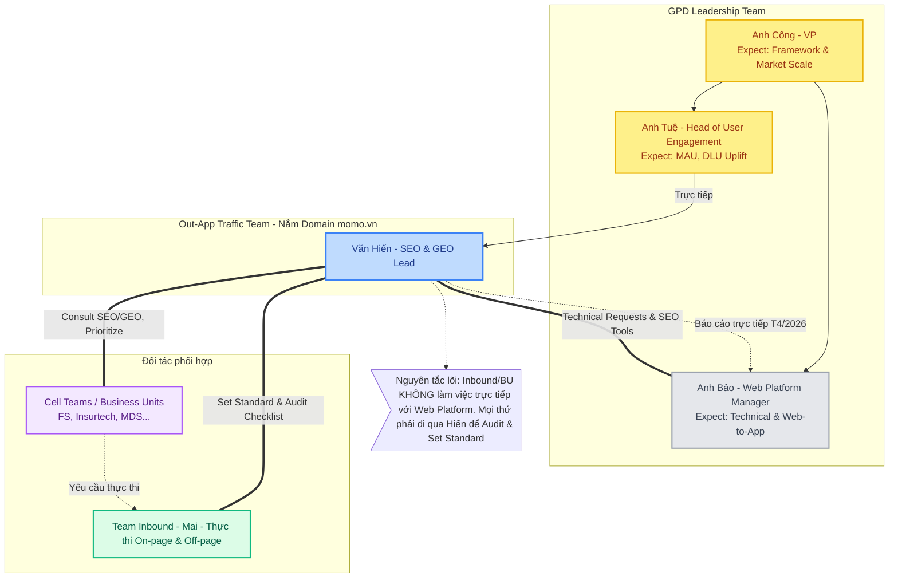

# MASTER DOC - Văn Hiến @ MoMo
> Version: 2.3 | Last updated: 2026-04-29 | Maintained by: Văn Hiến

---

## MỤC LỤC

1. [[hienho-momo-master-doc|Thông tin cá nhân & Bộ phận]]
2. [[SKILL_REGISTRY|Danh mục Kỹ năng (Registry)]]
3. [[PROJECT_ORCHESTRATOR|Điều phối dự án (Orchestrator)]]
4. [[Zero-Hallucination|Nguyên tắc Chống ảo giác]]
5. [[pyramid-principle|Nguyên tắc Kim tự tháp]]
6. [[jtbd-analysis|Phân tích JTBD]]
7. [[brd-momo|Kỹ năng viết BRD]]
8. [[momo-html-formatting-skill|Kỹ năng HTML MoMo]]
9. [[Seo-Geo-audit|Kỹ năng Audit SEO/GEO]]
10. [[Web2App-Pipeline|Kỹ năng Web-to-App]]
11. [Changelog](#7-changelog)

---

## 1. THÔNG TIN CÁ NHÂN & BỘ PHẬN

### 1.1 Profile

| Field | Detail |
|-------|--------|
| Tên | Văn Hiến |
| Vai trò | SEO & GEO Lead |
| Bộ phận | Out-App Traffic Team |
| Division | Growth Platform Division (GPD) |
| Domain sở hữu | momo.vn (web channel) |
| Kinh nghiệm | 7 năm (Web Construction, SEO/GEO, Product Growth) |
| Background | Fintech |

### 1.2 Trách nhiệm lõi

**Platform Health & Governance (Lõi):**
- Đảm bảo momo.vn khỏe mạnh, sạch sẽ về Technical SEO và Content Foundation
- Set standard và audit mọi hoạt động SEO/GEO trên web - dù ai thực hiện (Inbound, Agency qua Inbound)
- Hiến là người **set standard và audit**, không phải người **execute** trực tiếp
- Agency không access trực tiếp momo.vn - mọi hoạt động đều qua Inbound Review & Execution
- Hiến đảm bảo Tech Foundation và Content Foundation được tuân thủ chặt chẽ

**Scope quản lý:**
- Technical Foundation: On-page, Technical SEO, Schema, URL governance, Crawl quality, Sitemap
- Content Foundation: Foundation Checklist, SEO/GEO Guideline, YMYL Guideline - áp dụng cho Inbound và Agency (qua Inbound)
- Tracking: GTM/GA4/Appsflyer setup chuẩn cho mọi Use Case

**Dự án chiến lược (từ Công):**
- Web Platform (Bảo) và Out-App Traffic (Hiến) cùng chủ động triển khai
- Mọi hoạt động vẫn phải tuân theo Tech Foundation và Content Foundation do Hiến set
- Boundary với Inbound: không overlap với dự án Inbound/Agency đang triển khai
- Lý do: nhân lực Out-App Traffic có giới hạn - không ôm execution của Inbound

**KPIs:**
- Organic Traffic, Keyword Ranking, New User, MAU, MEU từ web channel (momo.vn)
- Web-to-App pipeline: Organic Traffic → Onelink → App Install → Register → KYC → Cashin → MAU
- GEO/AEO: MoMo được cite trong Google AI Overview, ChatGPT, Perplexity cho target queries tài chính

### 1.3 Collaboration Model: GOVERN - BUILD - EXECUTE

Hệ thống vận hành dựa trên tam giác phối hợp chặt chẽ:

1.  **Hiến (GOVERN Standard):**
    *   Đầu vào kỹ thuật: Define SEO/GEO requirements, Brief sản phẩm.
    *   Kiểm soát chất lượng: Review trước khi live, Sign-off Foundation Checklist.
    *   Điều phối Stakeholders: Là điểm kết nối duy nhất giữa Inbound và Web Platform.

2.  **Web Platform (BUILD Product):**
    *   Nhận spec trực tiếp từ Hiến và thực thi (Sprint → Build → Deploy).
    *   Không làm việc trực tiếp với Inbound/Agency.

3.  **Inbound Team - Mai & team (EXECUTE Content):**
    *   Sản xuất nội dung (Blog, Off-page) theo Brief của Hiến.
    *   Thực hiện submit content lên hệ thống.
    *   Agency (nếu có) phải qua Inbound review trước khi Hiến audit cuối cùng.

> **Rule:** Inbound không làm việc trực tiếp với Web Platform - mọi yêu cầu kỹ thuật PHẢI qua Hiến.

### 1.3 Ownership map

| Nhóm hoạt động | Ownership | Ghi chú |
|----------------|-----------|---------|
| SEO/GEO strategy & governance | Văn Hiến | Set standard, audit - không execute trực tiếp |
| Technical Foundation (audit & standard) | Văn Hiến | On-page, Schema, URL governance, Crawl quality, Sitemap |
| Content Foundation Checklist - sign-off | Văn Hiến | Gate bắt buộc trước khi publish, kể cả content của Inbound/Agency |
| SEO/GEO consult cho Cell Team | Văn Hiến | Tư vấn Sitemap, Content Structure, pSEO |
| Foundation Checklist training cho Inbound | Văn Hiến | Đảm bảo Inbound hiểu và tuân thủ chuẩn |
| Tracking (setup & execute) | DA | Hiến set tracking standard, DA chịu trách nhiệm setup đến execute |
| Web-to-App conversion optimization | Văn Hiến | |
| Web Platform liaison (technical request) | Văn Hiến → align trực tiếp Bảo | |
| SEO Inventory - chuẩn đánh giá market share | Văn Hiến | |

### 1.4 Prioritization Framework

Khi có nhiều workstream cạnh tranh bandwidth, Hiến ưu tiên theo 2 tiêu chí:

1. **Market Search Potential** - Use Case có search demand đủ lớn, đáng đầu tư
2. **Company Direction (Financial)** - Gắn với chiến lược tài chính của MoMo (Credit, Insurance, BNPL)

### 1.5 Stack & Tools

| Nhóm | Tools |
|------|-------|
| Analytics | GA4 (G-02G70QKZ26), GSC, Looker Studio |
| Tag Management | GTM OutApp (GTM-P9JDDJZ), GTM InApp (GTM-5TCGRPX) |
| Attribution | Appsflyer (momoapp.onelink.vn) |
| CMS | CMS, Admin Tool (Sắp ra mắt: MoSpark = CMS + Admin Tool) |
| Deployment | GitHub Org + Vercel Team, Google Apps Script Web App |
| Tracking standard | GA4 + GTM (marketing attribution) + Appsflyer (attribution) - synced to BigQuery |

---

## 2. CÁC TEAM LÀM VIỆC CHUNG

### 2.1 Org Chart - GPD



**Lưu ý quan hệ (T4/2026):**
- Tuệ nghỉ phép T4 → Hiến báo cáo trực tiếp Bảo và Công
- Bảo = Project Lead Out-App Traffic / SEO-GEO từ 10/04/2026, báo cáo trực tiếp Công
- Hiến và Bảo cùng thực hiện toàn bộ workstream SEO/GEO - Hiến là SEO/GEO specialist, Bảo là Project Lead
- Từ T5/2026: Out-App Traffic trở thành team cross-functional riêng (SEO/GEO Lead, Web Product Lead, Growth Lead, DA, Content Strategy) - cấu trúc reporting xác định đầu T5

### 2.2 Out-App Traffic (Hiến sở hữu)

| Field | Detail |
|-------|--------|
| Scope | Platform Health & Governance: Set standard, audit và kiểm soát mọi hoạt động SEO/GEO trên momo.vn dù ai thực hiện. Bổ sung T4: Quản lý mảng SEO/GEO từ Internal và Inbound |
| Model hoạt động | **Govern, không Execute** - Hiến set standard và audit. Inbound/Agency execute qua Inbound |
| Hoạt động | Technical Foundation audit, Content Foundation governance, Tracking setup, Strategic projects |
| KPI chính | Organic Traffic, Keyword Ranking, New User, MAU, MEU |
| Quan hệ với Web Platform | Hiến gửi technical request / SEO potential project → Bảo implement |
| Quan hệ với Inbound | Hiến là đầu mối - Inbound không làm việc trực tiếp với Web Platform |

### 2.3 Web Platform (Bảo)

| Field | Detail |
|-------|--------|
| Lead | Bảo (Production Manager) |
| Reporting | Trực tiếp Công (VP) |
| Scope | Quản lý, tư vấn Cell Team xây dựng sản phẩm trên Web theo tiêu chuẩn product design |
| Trách nhiệm | Vận hành nền tảng web, tăng trưởng Web-to-App, standardize tracking (truth of source) |
| Tools | Xây dựng công cụ cho Out-App Traffic / Cell Team / Inbound vận hành nội dung |
| KPI chính | Web-to-App conversion, New User, MAU, MEU (chung với GPD) |

### 2.4 Inbound Marketing (Mai - thuộc BMC)

| Field | Detail |
|-------|--------|
| Lead | Mai (SEO & Inbound Team Leader) |
| Division | BMC (Brand & Marketing Center) - không thuộc GPD |
| Scope | SEO tư vấn (Plan / Blog / Off-page) - tiền thân của Out-App Traffic |
| Cơ chế | BU reach tới Inbound để tư vấn, Inbound chọn Use Case theo chiến lược BMC |
| KPI | SLA và KPI riêng theo cam kết với từng BU |
| Boundary với Hiến | Inbound không làm việc trực tiếp với Web Platform - phải thông qua Hiến |
| Foundation Checklist | Inbound phải tuân thủ - đây cũng là checklist Inbound input và cung cấp. Sign-off: Hiến |
| FS commitment | Vay Nhanh / Ví Trả Sau / CIC: Inbound cam kết Traffic/Ranking |

### 2.5 Cell Team Matrix (theo Business Unit)

Mỗi Cell Team tiếp cận Hiến theo framework: **Research → Build Web/Function → Content Production → Tracking → Evaluation**

| BU | Use Case | Workstream với Hiến | Workstream với Inbound | Status |
|----|----------|--------------------|-----------------------|--------|
| FS | Vay Nhanh | Tech Web (Build/Revamp) + SEO/GEO consult | SEO Ranking cam kết | Active |
| FS | Ví Trả Sau | Tech Web + SEO/GEO consult | SEO Ranking cam kết | Active |
| FS | CIC | Tech Web + SEO/GEO consult | SEO Ranking cam kết | Active |
| FS - Insurtech | BH xe máy | Build/optimize web - tăng GMV + SEO/GEO consult | Off-page ranking | Active |
| FS - Insurtech | BH ô tô vật chất | Build/optimize web - tăng GMV + SEO/GEO consult | Off-page ranking | Active |
| FS - Insurtech | BH y tế (BHYT) | Build/optimize web + SEO/GEO consult | Off-page ranking | Active |
| FS - Insurtech | BH xã hội (BHXH) | Chuẩn bị landing page + tracking trước launch | - | Sắp ra mắt (~10 ngày) |
| MDS | Movies (Cinema) | Monitor kỹ thuật + hiệu suất | - | Passive |
| MDS | Bus (OTA) | Monitor kỹ thuật + hiệu suất | - | Passive |
| PS - UTI | Sim số đẹp / eSIM du lịch | Đã roll out, chưa có growth plan | - | Pending |
| PS - UTI | Tra cứu phạt nguội | Build Mini Web (có tra cứu) + Blog Content | - | Active |
| GPD Internal | QLCT (Quản Lý Chi Tiêu) | SEO/GEO - tăng ranking/traffic | - | Active |

**Cell Team structure (mỗi team):**

| Role | Nhiệm vụ |
|------|----------|
| PO (Product Owner) | Roadmap, prioritization, stakeholder alignment |
| Growth/Business | KPI ownership, experiment design, business case |
| Dev | Technical implementation, feature deployment |
| DA (Data Analyst) | Data pipeline, reporting, SQL/BigQuery |
| Legal | Review nội dung tài chính, compliance YMYL |

### 2.6 Danh mục sản phẩm MoMo trên Web (theo SEO Inventory)

> Dùng làm reference khi consult Cell Team hoặc đánh giá market share.

| Nhóm | Sản phẩm | Loại | SoV MoMo | Market Volume/tháng |
|------|----------|------|----------|---------------------|
| Vay & Cho vay | Vay Nhanh | Chủ lực | 6% | 4.375.800 |
| BNPL | Ví Trả Sau | Chủ lực - Market Leader | 54% | 135.290 |
| Bảo hiểm | BH xe máy | Chủ lực - Mua trực tiếp | 38% | 58.810 |
| Bảo hiểm | BH ô tô vật chất | Chủ lực - Mua trực tiếp | 0% | 74.000 |
| Bảo hiểm | BH y tế (BHYT) | Chủ lực - Mua trực tiếp | 0% | 1.415.740 |
| Bảo hiểm | BH xã hội (BHXH) | Chủ lực - Sắp ra mắt | - | 938.090 |
| Bảo hiểm | BH nhân thọ & các loại khác | Cổng thanh toán | - | ~19.780 |
| Tín dụng | Mở thẻ tín dụng | Sản phẩm phụ | - | 600.900 |
| CIC | CIC Score / Điểm tín dụng | Đang xây dựng | 0% | 96.790 |
| Đầu tư | Chứng khoán (hợp tác CVS) | Chủ lực - Mini App + Landing page | 0% | 3.000.000 |
| Đầu tư | Chứng chỉ quỹ | Chủ lực | - | ~12.000 |
| Tiết kiệm | Gửi tiết kiệm (Bản Việt) | Chủ lực | 0% | 209.000 |
| Dịch vụ công | Phạt nguội | Cổng thanh toán - Tiềm năng traffic | - | ~1.500.000 |

---

## 3. MỤC TIÊU TEAM & DOANH NGHIỆP

### 3.1 OKR 2026 - Out-App Traffic Team

#### O1 - New User Growth via Organic & Web2App

- **Outcome:** Tăng trưởng New User install từ web channel
- **Priority Use Cases:** Credit, Insurance, BNPL, Telco, Cinema, OTA, eSIM
- **Key Lever:** Use Case mini-webs với product flows + Utilities-Led SEO (simulators, tools)
- **Tracking:** momoapp.onelink.vn → Store → Install → Register → KYC → Cashin → MAU

#### O2 - Platform Stability & Technical Readiness

- **Outcome:** Tracking infrastructure vận hành ổn định, zero crawl waste, GEO/AEO-ready
- **Key Results (dự kiến):**
  - Zero-Traffic URL Audit hoàn thành (3,670 URLs / 16 Use Cases)
  - Schema tech debt resolved
  - GA4/GTM infrastructure refactored (17 project folders, 43 parameters, 13 wasted slots fixed)
  - GEO Checklist deployed as publishing gate

#### O3 - PLG/Utilities-Led SEO Products

- **Outcome:** DLU/MAU/MEU growth từ tool-based web pages
- **Key Results (dự kiến):**
  - CIC credit score checker launched
  - Loan calculator live
  - Insurance comparison tool live
- **North Star:** Users giải quyết được nhu cầu tài chính trên web trước khi cần vào App

### 3.2 GEO North Star

> MoMo được cite trong top 3 AI engine responses cho 20 target PFM queries trong vòng 12 tháng

- **Engines target:** Google AI Overview, ChatGPT, Perplexity
- **Current gap:** 0% AI Chatbot referral traffic vs Wise.com: 40%+
- **Decision blockers:** Named author approval, Legal review cadence, Dev resource cho tool portfolio

### 3.3 MoMo Business KPIs liên quan đến Web

| KPI | Định nghĩa | Nguồn tracking |
|-----|-----------|----------------|
| New User | Install → Register | momoapp.onelink.vn funnel |
| MAU | Monthly Active User - Cashin event | Onelink MoMo |
| MEU | Monthly Engagement User - tương tác tính năng trong app (tra cứu, like post...) | Onelink MoMo |
| DLU | Daily Line User | PLG tool engagement |
| Organic Traffic | Sessions từ Organic channel | GA4 |
| AI Citation Rate | MoMo được cite trong AI engine responses | Manual / GEO monitoring tool |
| SoV (Search Share of Voice) | % brand search của MoMo / tổng brand search trong thị trường | Keyword tool - đo theo từng Use Case |

---

## 4. QUY TRÌNH LÀM VIỆC

### 4.1 Web Build Workflow — 9 Bước (v3.0)

**Tài liệu gốc:** MoMo_WebBuild_Workflow_2026.docx | Out-App Traffic, Growth Platform Division

**Cấu trúc team:**
- **Out-App Traffic (Hiến):** Product Owner + SEO/GEO - dẫn dắt toàn bộ quy trình từ research đến post-launch
- **Cell Team:** PO Cell, Growth/Business, Dev, DA - thực thi và bàn giao sản phẩm

**3 giai đoạn:**

| Giai đoạn | Step | Tên | Output chính | Phụ trách |
|-----------|------|-----|-------------|-----------|
| Chuẩn bị | 01 | Research & Discovery | Keyword map, competitor report, market sizing | Out-App Traffic |
| Chuẩn bị | 02 | Thiết lập Mục tiêu | KPI doc: Traffic target, CR benchmark | Out-App Traffic + PO Cell |
| Chuẩn bị | 03 | Product Brief + Tracking Plan | Brief sản phẩm (Out-App) + Event spec (PO Cell) | Out-App Traffic + PO Cell |
| Chuẩn bị | 03.5 | Feasibility Sync với Cell Team | Scope v1 xác nhận, phasing & quick win | Out-App Traffic + PO Cell |
| Xây dựng | 04 | Build Demo Website | Live demo trên Vercel - visualize User Flow | Out-App Traffic |
| Xây dựng | 05 | Sprint Planning & Coding | Timeline sprint, Dev bắt đầu build | PO Cell + Dev |
| QA & Launch | 06 | SEO Review + QA Testing | SEO checklist pass, luồng QA approved | Out-App Traffic + Dev |
| QA & Launch | 07 | Staging & Sign-off | Staging approved, tracking verified, PO Cell ký | Out-App Traffic + PO Cell + Dev |
| QA & Launch | 08 | Roll Out (Production) | Site live, sitemap submitted, index requested | Out-App Traffic + Dev |
| QA & Launch | 09 | Post-Launch Monitoring | Báo cáo 30/60/90 ngày, OnPage optimization | Out-App Traffic |

**Tracking ownership:**
- Web Layer events: PO Cell define, Dev gắn, Hiến tư vấn user flow
- Web → App UTM: PO Cell + Out-App Traffic verify
- App Layer (sau CTA click): DA Cell Team (Hải/Hoàng) - Out-App Traffic không execute
- Hiến và Bảo: hướng dẫn, define standard, observe - không execute tracking

**Key gates:**
- Gate 1 (Step 06): SEO checklist pass toàn bộ + QA report clear → mới vào Staging
- Gate 2 (Step 07): CWV pass (LCP<2.5s, INP<200ms, CLS<0.1) + tracking verified + PO Cell ký
- Roll Out thứ tự: Hub → Spoke → Blog (không hard launch toàn bộ cùng lúc)

**RACI tóm tắt:**

| Hoạt động | Out-App Traffic | PO Cell | Dev | DA |
|-----------|----------------|---------|-----|----|
| Research & Brief | R/A | C | I | I |
| Define Event Tracking | C | R/A | C | C |
| Build Demo | R/A | C | I | I |
| Sprint Coding | C | A | R | I |
| SEO Review | R/A | I | C | I |
| Web2App Tracking Handoff | C | R | R | A |
| Staging Sign-off | C | A | R | C |
| Post-Launch Monitoring | R/A | I | C | C |

### 4.2 Tracking Architecture

**Tracking stack:**

| Công cụ | Dùng cho | Owner |
|---------|----------|-------|
| GA4 + GTM | Marketing attribution, web events, funnel | DA (Hải/Hoàng) execute, Hiến define standard |
| GSC | Organic performance, indexing, keyword ranking | Hiến monitor |
| Appsflyer / Onelink | Web-to-App attribution | DA (Hải/Hoàng) execute |
| BigQuery | Data warehouse - GA4 + các nguồn đã sync | DA (Hải/Hoàng) đang follow |

**Onelink Tracks:**

| Track | URL | Dùng cho | Events tracked |
|-------|-----|----------|----------------|
| Track 1 | onelink.momo.vn | Existing users | Open + Action |
| Track 2 | momoapp.onelink.vn | New users | Store → Install → Register → KYC → Cashin → MAU |

**Tracking ownership:**
- **DA Cell Team (Hải/Hoàng):** setup và execute toàn bộ tracking
- **Hiến:** define standard, tư vấn user flow để PO Cell define event đúng, observe kết quả
- **Bảo:** observe, hướng dẫn kỹ thuật khi cần

### 4.3 URL Governance - Intervention Framework

| Level | Action | Trigger |
|-------|--------|---------|
| 1 | Nofollow + Sitemap removal | Low-value pages, crawl waste |
| 2 | 308 Redirect | Consolidation, topical dilution |
| 3 | 410 Gone | Non-financial Use Cases gây dilution |
| 4 | Mandatory content update | Outdated YMYL content, AI Overview citation risk |

### 4.4 A/B Testing Standard

- **Assignment:** Cookie-based variant assignment (14-day TTL, keyed by Use Case slug)
- **Rationale:** Tránh round-robin contamination
- **Tracking:** GA4 event schema với variant parameter

### 4.5 SEO Inventory - Tiêu chuẩn đánh giá Market Share

Dùng để đánh giá định kỳ (quarterly) mức độ tham chiến của MoMo trong từng thị trường tìm kiếm:

| Chỉ số | Định nghĩa | Nguồn |
|--------|-----------|-------|
| Total Search Volume | Tổng lượt tìm kiếm hàng tháng của thị trường | Keyword tool |
| SoV MoMo | % brand search MoMo / tổng brand search trong thị trường | Keyword tool |
| Priority tier | CAO / TRUNG BÌNH / DUY TRÌ / THAM CHIẾU | Đánh giá tổng hợp |

**Ngưỡng SoV tham chiếu:**
- Trên 40%: Market Leader - duy trì và mở rộng
- 20-40%: Trung bình - có cơ hội tăng trưởng
- Dưới 20%: Thấp - gap lớn, cần đầu tư

---

## 5. DỰ ÁN ĐANG TRIỂN KHAI

### 5.1 Status Board Q1-Q2/2026

| Dự án | Status | Owner | Ghi chú |
|-------|--------|-------|---------|
| Balloon Ads | Done | Hiến | - |
| Popup Ads - Billpay | Done | Hiến | 22 pages, tiered placement |
| Zero-Traffic URL Audit | On Track | Hiến | 3,670 URLs / 16 Use Cases |
| Full Funnel Tracking Pipeline | In Progress | DA (Hải/Hoàng) + Hiến observe | GA4 done, GSC+Appsflyer đang triển khai |
| Onelink Standardization | Discuss | Hiến | Legacy link audit needed |
| PLG High-CTR Products | Pending | Hiến | CIC checker, Loan calc, Insurance comparison |
| GEO/AEO QLCT Pillar/Cluster + GEO Checklist | Brainstorming | Hiến | v2 HTML master plan built |
| MoMo Credit Ecosystem (Vay Nhanh/Ví Trả Sau/CIC) | Active | Hiến + Inbound | KPI committed: Top 1 / 10 seed keywords |
| Auto Insurance (Bảo Hiểm Ô Tô Vật Chất) | Active | Hiến | Target: 200K organic traffic 2026 |
| SEO Inventory - Financial & Payment | In Progress | Hiến | v3 built, mở rộng scope Thanh toán/Giải trí |
| SEO/GEO Content AI Platform | Planning | Hiến + Trọng | Batch 1 done, Batch 2 planned |
| Phạt Nguội (Traffic fines) | P0 Active | Hiến | CEO mandate, target live đầu T5 |
| MoSpark Migration (MoLanding V2) | In Progress | Hiến + Bảo | Pre-publish gate BRD v1.1 in review |
| VTS SEO/GEO Growth | Active | Hiến + Inbound | 3 thị trường, SoV targets đã define |
| Cinema SEO/GEO | Passive | Hiến | 1M traffic/quý, 959 zero-traffic URLs cần xử lý |
| Merchant Page / Đối tác (VTS Cross-Sale) | Active | Hiến | BRD v4 done |
| Off-Page Strategy & Backlink Governance | Active | Hiến (standard) | BRD v2 done, Inbound execute |
| Tech Foundation Gate + Angle Governance SOP | Planning | Hiến | Framework defined, cần formalize |
| MoSpark SEO/GEO Scoring BRD | In Review | Hiến + Trọng | BRD v1.1, 3 issues cần fix |

---

### 5.2 Dự án: GEO/AEO QLCT (Quản Lý Chi Tiêu)

**Vision:** Case Study GEO/AEO đầu tiên tại MoMo - replicable framework cho Cinema, Billpay, Insurance, Telco

**North Star Metric:** MoMo được cite trong top 3 AI engine responses cho 20 target PFM queries trong 12 tháng

**Framework (3 Trục):**

| Trục | Nội dung | Mục tiêu |
|------|----------|----------|
| Trục A | Web Content/Architecture | Topical authority cho PFM domain |
| Trục B | Utility Tools (simulators, calculators) | Anti-LLM moat - tạo unique data không scrape được |
| Trục C | Off-Web Entity/Brand Signals | Entity graph, citations, PR mentions |

**Decision Blockers:**
1. Named author policy (byline tác giả cho YMYL content)
2. Legal review cadence (SLA review nội dung tài chính)
3. Dev resource cho tool portfolio (Trục B)

**Meeting log:**
> [CẦN BỔ SUNG]

---

### 5.3 Dự án: Full Funnel Tracking Pipeline

**Vision:** Full funnel tracking từ Web đến App - đo được Web-attributed New Users từ mọi nguồn traffic

**North Star Metric:** Full pipeline ổn định - đo được Web-attributed New Users end-to-end

**Pipeline Status:**
| Layer | Status | Owner |
|-------|--------|-------|
| GA4 → BigQuery | Done | DA (Hải/Hoàng) |
| Search Console → BigQuery | Đang triển khai | DA (Hải/Hoàng) |
| Appsflyer/Onelink → BigQuery | Đang phối hợp ITC | DA (Hải/Hoàng) |
| Chuẩn hóa data sau BigQuery sync | In Progress | DA + Hiến observe |

**Vai trò của Hiến:** Observe và đánh giá toàn bộ hoạt động, chuẩn hóa data sau sync

**Framework:**
- GA4 + GTM: Marketing attribution, channel performance (DA execute, synced to BigQuery)
- Appsflyer: Web-to-App attribution tracking

**Infrastructure đã giải quyết:**
- GA4 custom dimension naming collision (fixed: `webads_campaign` rename)
- Looker SQL bugs (Homepage regex, NULL elimination, CR >100% bug)
**Meeting log:**

**[2026-04-16] - Weekly Sync với Công**
- Participants: Công, Hiến
- Key decisions:
  - Ghi nhận đã track được Full Flow cho người dùng đã có App (Existing Users) qua Onelink.
  - Vấn đề: Phần Install (New User) chưa track được chính xác. Phía DA (Data Analyst) đang bị challenge về tính xác thực/logic của data này.
- Action items:
  - Hiến + DA: Review lại attribution logic của Appsflyer/Onelink cho flow Install [Cần xử lý]

---

### 5.4 Dự án: Zero-Traffic URL Audit

**Vision:** Loại bỏ crawl waste, tăng crawl budget efficiency, nâng topical authority cho financial domain

**North Star Metric:** Xử lý zero-traffic URLs (Đang triển khai, đã xử lý được OA, Bus, Hourly Hours hơn 70%)

**Scope:** 3,670 URLs / 16 Use Cases

**Framework:** Xem mục 4.3 (4 levels)

**Meeting log:**
> [CẦN BỔ SUNG]

---

### 5.5 Dự án: Popup Ads - Billpay

**Status:** Done

**Vision:** Web Ads system với tracking chuẩn Appsflyer attribution cho New User acquisition

**North Star Metric:** New User install từ Billpay popup (Store → Install → Register)

**Scope:** 22 pages, tiered placement strategy

**Framework:**
- Cookie-based A/B testing (14-day TTL)
- GA4 event schema: impression, CTA click, dismiss
- UTM: `{format}-{use_case}-{date}`

**Meeting log:**
> [CẦN BỔ SUNG]

---

### 5.6 Dự án: MoMo Credit Ecosystem (Vay Nhanh + Ví Trả Sau + CIC)

**Vision:** Content ecosystem cho tín dụng tiêu dùng - cross-product ranking và internal link automation

**North Star Metric:** Top 1 ranking cho 10 seed keywords (Vay nhanh, Vay tiền online, Vay tiền nhanh, Vay tiền, Vay online, Vay online nhanh, Vay trả góp, Vay nhanh online, Vay tiền online nhanh, Vay tiền mặt)

**Scope:**
- Vay Nhanh (Personal Loan)
- Ví Trả Sau (BNPL)
- Điểm Tín Dụng CIC (score range 300-850, 6 landing pages theo band)

**Framework:**
- Expansion Mini Web: Sub-pages có Simulation (Vay nhanh)
- Cross-Service cho cả 3 sản phẩm
- Revamp Mini Web: Ví Trả Sau, Vay Nhanh, CIC
- Build Content Production cover thị trường
- Build Off-page plan & Entity cho financial domain
- Interactive CIC simulator (HTML widget - built)

**Meeting log:**

**[2026-04-13] - Sync BU FS - Vay Nhanh**
- Participants: Hiến, Mai (Inbound/BMC), BU FS team
- Key decisions:
  - KPI commit: Top 1 cho 10 seed keywords. Milestone: ít nhất Top 3 vào tháng 9, Top 1 vào tháng 12
  - BU cần đẩy nhanh tiến độ - cần Inbound (BMC) phối hợp cùng BU thực hiện các action cần thiết
  - Đánh giá lại nhu cầu nguồn lực và resource → back lại cho BU
- Action items:
  - Agency: Back báo cáo ranking report tuần này → họp đề xuất solution nếu ranking chưa khôi phục [Agency]
  - Mai: Audit competitor, review plan điều chỉnh theo thuật toán mới [Mai]
  - BU FS: Audit page /vay-nhanh → xác định nội dung cần bổ sung để tăng unique content [BU FS]
  - BU FS: Review + bổ sung GEO prompts cho Vay Nhanh [BU FS]
  - BMC: Triển khai monthly report và project tracker để team theo dõi định kỳ [Mai]
  - BU FS: Chuẩn bị content golive new pages (Vay theo đối tượng, vay theo mục đích, blogs) [BU FS]
  - Hiến + Mai: Phản hồi content directions và template UI cho new pages [Hiến + Mai - tuần này]
  - Hiến: Back lại phần revamp mới của website [Hiến - tuần này]
- Blockers surfaced:
  - Ranking chưa khôi phục - đang chờ agency report
  - New pages cần content direction trước khi BU bắt đầu làm
- Hoạt động đang chạy:
  - Off-page: Backlink với agency
  - On-page: Technical + Content production + Revamp website (tăng Time on Site + CR vào app)

---

### 5.7 Dự án: Auto Insurance (Bảo Hiểm Ô Tô Vật Chất)

**Vision:** Organic traffic leadership cho Insurance trong fintech

**North Star Metric:** 200K organic traffic/năm 2026 (baseline Q1: ~19K)

**Key decisions đã lock:**
- Không dùng geo-based URL clusters
- Consolidate sitemap via JTBD cross-reference
- Thêm trang `/vat-chat/gia-han` (renewal - missing)
- Blog: informational intent only. Transaction Landing Pages: transactional intent only

**Deliverables đã có:** HTML MasterDoc v2, Growth Tactics doc, PRD docx

**Meeting log:**
> [CẦN BỔ SUNG]

---

### 5.8 Dự án: Content Governance Framework

**Vision:** Ngăn overlap content angles giữa Inbound và GPD. Định nghĩa rõ ownership theo page type và GEO objective.

**North Star Metric:** 0 content conflict incidents per quarter

**Scope:**
- Phân loại content ownership (Inbound vs GPD)
- GEO/AEO objectives per Use Case
- AI Mention / Cited Pages tracking across Google AI Overview, ChatGPT, Perplexity

**Status:** Đang xây dựng framework

**Meeting log:**
> [CẦN BỔ SUNG]

---

### 5.9 Task: SEO Inventory - Financial & Payment Market

**Loại:** Task nội bộ GPD - tiêu chuẩn đánh giá market share định kỳ

**Giao từ:** Công (VP)

**Vision:** Xây dựng bức tranh tổng quan thị trường tìm kiếm tài chính và thanh toán - xác định MoMo đang ở đâu, thị trường nào tiềm năng, thị trường nào chưa khai thác.

**North Star:** Trở thành công cụ đánh giá market share chuẩn, cập nhật định kỳ hàng quý - phục vụ direction của leadership và prioritization của Out-App Traffic.

**Framework 3 trục:**
1. Market Size - Total Search Volume (proxy đo quy mô thị trường)
2. MoMo Position - SoV % trong từng thị trường
3. Priority Assessment - CAO / TRUNG BÌNH / DUY TRÌ / THAM CHIẾU

**Scope hiện tại:** Financial (Vay, Tín dụng, BNPL, Bảo hiểm, Đầu tư, Tiết kiệm) + Dịch vụ công (Phạt nguội)

**Deadline:** Thứ 5 (tuần này)

**Status:** In Progress - v3 đã build (docx landscape)

**SoV đã có:**
- Vay Nhanh: 6%
- Ví Trả Sau: 54%
- BH xe máy: 38%
- Còn lại: chưa đo (sản phẩm chưa triển khai đủ)

**Data còn thiếu cho Phase 2:**
- SoV: BH y tế, BH ô tô, Chứng khoán, Gửi tiết kiệm, CIC (Đã check: Chưa có, 0%)
- BHXH: breakdown intent mua vs tra cứu
- Phạt nguội: phân tích intent và khả năng conversion
- eSIM/Telco: chưa có market sizing
- GSC overlay: Organic Impressions thực tế theo từng thị trường

**Meeting log:**

**[2026-04-16] - Weekly Sync với Công**
- Participants: Công, Hiến
- Key decisions:
  - Mở rộng Scope: Không chỉ dừng lại ở mảng Tài chính, cần đánh giá Potential Market Sizing tổng thể hơn cho cả mảng Thanh toán (Giải trí, dịch vụ...).
  - Deep Dive: Đánh giá chi tiết các dịch vụ MoMo đang làm (hiệu suất thực tế, Gap so với thị trường/đối thủ) và thống kê số lượng Blog/Content đang triển khai cho từng dịch vụ đó.
- Action items:
  - Hiến: Update SEO Inventory v4 bao gồm mảng Thanh toán & Giải trí [Tuần tới]

---

### 5.10 Dự án: SEO/GEO Content AI Platform (Project by AI)

**Vision:** Công cụ ứng dụng AI Foundation (Claude/Gemini) để chuẩn hóa hoạt động Content Production trên Website cho cả Inbound (BMC) và Out-App Traffic (GPD).

**Owner:**
- Web Platform: Trọng (PIC build công cụ)
- Out-App Traffic: Hiến (owner Skill/Prompt Hub - SEO/GEO layer)

**Scope & Workflow:**
- Quản lý BU Input: Lưu trữ các thông tin dự án, Business Model, Target Audience, Value Prop, Promotion,... (tự động update theo thời gian thực)
- Workflow Content: Keyword → Secondary keyword → Draft Outline by AI → Manual edit → Content Detail by AI → Manual Edit on Demo → Public
- AI Skill Hub: Hiến own - gồm 2 thành phần:
  - SEO/GEO Checklist Skills: source từ https://momo-geo-scoring.vercel.app/
  - Prompt với Role viết Blog: [CẦN BỔ SUNG - Hiến update sau]
- Dashboard Output: Quản trị nội dung và pull Ranking/Impression từ GSC API

**Status:** Đang tích hợp Claude API để testing. Pilot use case đầu tiên: Phạt Nguội content. GenAI Content pipeline đang trong giai đoạn integrate vào Web Platform.

**Roadmap theo Batch:**

| Batch | Nội dung | Status |
|-------|----------|--------|
| Batch 1 | SEO/GEO Guideline + YMYL Guideline + Blog Prompt (Outline + Writer) | Done - sẵn sàng integrate |
| Batch 2 | Business Context Layer: Business Model, Target Audience, Value Proposition, Promotion Scheme theo từng Use Case/Project — mỗi lần Create New Article sẽ tự động pull context này để output chính xác hơn | Planned |

---

### 5.11 Dự án: Phạt Nguội (Traffic Fines)

**Vision:** Cung cấp công cụ tra cứu phạt nguội trên Mini Web kết hợp nội dung Blog thu hút User qua kênh Out-App.
**Status:** Active (Tháng 4/2026).
**Scope:**
- Xây dựng Mini Web có chức năng tra cứu vi phạm.
- Sản xuất Blog Content liên quan đến lĩnh vực Giao thông/Phạt nguội.

**Priority:** P0 - CEO Tường chỉ đạo trực tiếp, mục tiêu Top of Mind
**Target:** Foundation momo.vn/phat-nguoi live trước đầu tháng 5/2026
**Lợi thế MoMo:** Dữ liệu chính thống từ TTDK, hỗ trợ đủ 3 loại phương tiện, tích hợp hệ sinh thái

**Meeting log:**

**[2026-04-18] - Họp tháng 4 với Bảo (Web Platform)**
- Participants: Hiến, Bảo
- Key decisions:
  - Tuệ nghỉ phép 1 tháng, cấu trúc báo cáo của Hiến chuyển trực tiếp sang Bảo trong T4.
  - Nhiệm vụ thay đổi/bổ sung trong tháng 4: SEO/GEO Management các dự án SEO/GEO được triển khai trên Web từ Internal và Inbound.
  - Triển khai kickoff dự án Phạt Nguội.
- Action items:
  - Hiến: Lên kế hoạch/wireframe cho Mini Web tra cứu và Blog Content chiến lược cho Phạt Nguội.

---

### 5.12 Dự án: MoSpark Migration (MoLanding V2)

**Tên cũ:** MoLanding | **Tên mới:** MoSpark

**Vision:** Nâng cấp nền tảng quản lý nội dung Web từ Admin Tool (V1) sang MoSpark (V2) - linh hoạt hơn, giảm dependency backend, marketing team tự vận hành được.

**Kiến trúc V2:**
- Web Frontend: `ldp.mservice.io` - React + Next.js App Router (giữ nguyên)
- CMS mới: `ldp.mservice.io/cms` - Refine v6 (thay React Vite cũ)
- Backend mới: Supabase Self-host (Postgres + PostgREST + GoTrue + Kong)
- .NET 8: giữ vai trò API Gateway (YARP Proxy) - bảo vệ Supabase khỏi truy cập trực tiếp

**Bản chất migration:**
- Cùng URL (ví dụ: `momo.vn/chuyen-tien`) - không đổi
- Source code/nền tảng thay đổi: Admin Tool → MoSpark
- Nội dung/data/hình ảnh được migrate sang

**Vai trò của Hiến:**
- Set chuẩn SEO/GEO Technical Foundation cho mọi page được migrate
- Pre-Publish Gate Checklist: chạy khi page ở trạng thái Draft trên MoSpark, trước khi "Replace" (switch live từ Admin Tool)
- Risk chính cần kiểm soát: ranking drop nếu Technical SEO thay đổi dù URL không đổi

**Pre-Publish Gate - các block cần validate:**
- Block 1: Technical SEO Parity (URL, canonical, robots, title, H1, internal links, images, page speed)
- Block 2: On-page Content Integrity (nội dung đầy đủ, không mất section, không mất CTA)
- Block 3: GEO minimum viable (structured data + entity signal đủ để LLM nhận diện)

**Touchpoint với Bảo:** Hiến align trực tiếp - spec SEO requirements trước khi Dev implement.

**Status:** In Progress - kiến trúc V2 đã được thiết kế, Landing Page Builder đang onboard User Growth team.

**Meeting log:**
> [CẦN BỔ SUNG]

---

### 5.13 Dự án: Ví Trả Sau SEO/GEO Growth

**Vision:** Mở rộng bao phủ SEO/GEO trên 3 thị trường liên quan đến tín dụng tiêu dùng, đưa MoMo trở thành trusted source được AI Overview cite.

**North Star Metrics (SoV targets):**

| Thị trường | Market Volume | SoV hiện tại | Target |
|-----------|--------------|-------------|--------|
| Trả Sau (VTS) | 180.000 | ~54% | Maintain 70% |
| Trả Góp / BNPL | 200.000 | ~10% | 40% |
| Tín dụng / CIC | 700.000 | ~40% | 80% |

**SEO/GEO Activities:**
- Content Blog: Topical authority trên 4 nhóm VTS, BNPL, Tín dụng/CIC, Trả góp (Hub & Spoke)
- Mini Web VTS: Revamp `/vi-tra-sau` + sub-page trả góp + Simulator monthly payment + sub-page theo use case
- Merchant Page: Build trang merchant chấp nhận VTS - internal link hỗ trợ authority + capture intent "trả góp tại [merchant]"

**Scope của Hiến:**
- Brief & Research: Phân tích đối thủ, SERP, viết brief per page
- Content Structure & On-page SEO/GEO: Review trước publish, GEO checklist
- Technical SEO: Schema, internal link, canonical, sitemap, CWV
- Phối hợp Web Platform: Build Mini Web, Sub-page, Simulator, Merchant Page
- Admin Tool Training: Training Cell Team vận hành blog → bàn giao Inbound

**Collaboration:**
- Inbound + BU: Sản xuất content blog và merchant page content
- Inbound: Off-page SEO
- Web Platform (Bảo): Build và revamp pages

**Status:** Active

**Meeting log:**
> [CẦN BỔ SUNG]

---

### 5.14 Content Governance Framework (cập nhật)

**Vision:** Ngăn overlap content angles giữa Inbound và Out-App Traffic. Định nghĩa rõ ownership theo search intent.

**Decision Tree - Ownership:**

```mermaid
flowchart TD
    classDef gate fill:#fee2e2,stroke:#ef4444,stroke-width:2px,color:#991b1b
    classDef hien fill:#bfdbfe,stroke:#3b82f6,stroke-width:2px,color:#1e3a8a
    classDef inbound fill:#dcfce7,stroke:#10b981,stroke-width:2px,color:#065f46
    classDef process fill:#f3f4f6,stroke:#9ca3af,stroke-width:1px
    
    Start([Keyword/Topic Mới xuất hiện]) --> IntentCheck{Xác định\nSearch Intent?}
    
    %% Phân luồng
    IntentCheck -- "Informational\n(How-to, Tips, News)" --> InboundOwn[INBOUND Sở hữu & Thực thi]:::inbound
    IntentCheck -- "Transactional\n(Mua, Tra cứu, Đăng ký)" --> GPD[OUT-APP TRAFFIC Sở hữu]:::hien
    IntentCheck -- "Mixed / Khó xác định" --> Sync[Sync Meeting:\nHiến + Mai quyết định]:::process
    IntentCheck -- "Navigational\n(Brand Search)" --> GPD
    
    %% Thực thi
    InboundOwn --> ContentProduction[Sản xuất nội dung (Bản Draft)]:::process
    GPD --> ContentProduction
    
    %% Gatekeeper
    ContentProduction --> Checkgate{Pre-Publish Gate\nSEO/GEO Checklist\n(MoSpark Scoring)}:::gate
    
    Checkgate -- Lỗi Technical / Thiếu CTA --> Reject[Bị Block / Yêu cầu sửa]:::process
    Reject -.-> ContentProduction
    
    Checkgate -- Điểm > 80\nPass CWV & Schema --> Publish([Publish Live trên momo.vn])
    
    Publish --> Tracking[Setup Tracking (GTM/GA4/Appsflyer)]:::hien
    Tracking --> Monitor[GA4 / BigQuery Monitoring]:::hien
```

**North Star Metric:** 0 content conflict incidents per quarter

**Status:** Framework đã define, đang áp dụng

**Meeting log:**
> [CẦN BỔ SUNG]

---

### 5.15 Dự án: Cinema SEO/GEO Growth

**Vision:** Duy trì và mở rộng vị thế organic leadership cho vertical Cinema - Use Case đã chứng minh được (15x growth từ 40K → 600K sessions).

**North Star Metric:** Duy trì top 1 từ khóa "vé xem phim" và cluster liên quan. Target: duy trì 1M+ organic sessions/quý.

**Hiện trạng:**
- 1M organic traffic/3 tháng - đang passive monitor
- Top 1 các từ khóa "vé xem phim"
- ~959 zero-traffic URLs từ review pages cần xử lý

**Sitemap hiện tại:**
- `/cinema` - homepage
- `/rap`, `/lich-chieu`, `/phim-chieu` - trang thông tin
- `/rap/{tên rạp}`, `/rap/{tên rạp}/{chi tiết}` - cụm rạp và địa chỉ
- `/lich-chieu/(phim-dang-chieu|phim-sap-chieu)` - đang/sắp chiếu
- `/blog`, `/tin-tuc` - blog và news
- `/{tên phim}`, `/{tên phim}/review` - phim chi tiết và review
- `/top-phim`, `/top-phim/{slug}` - tổng hợp phim hay

**Zero-Traffic URL Strategy (959 review pages):**
- Group A (traffic > 20 sessions/tháng): Preserve + optimize content
- Group B (traffic 5-20 sessions): Evaluate - giữ hoặc merge
- Group C (traffic = 0, phim đã hết chiếu): 410 Gone hoặc 301 về phim detail
- Quyết định: phụ thuộc vào chất lượng auto-generated review content (cần audit)

**Sunset rule cho pSEO Cinema:**
- Suất chiếu hết + không có suất chiếu mới trong 30 ngày → trigger 410
- Review page thin content (<200 từ) → noindex trước, quyết định sau

**Status:** Passive (đang thả nổi) - cần kickoff plan xử lý zero-traffic URLs

**Meeting log:**
> [CẦN BỔ SUNG]

---

### 5.16 Dự án: Merchant Page / Đối tác (VTS Cross-Sale)

**Vision:** Build Brand Detail pages cho Ví Trả Sau - capture intent user search "{Brand} có thanh toán Ví Trả Sau không", enhance VTS conversion và tạo relationship giữa user yêu thích brand và MoMo web.

**JTBD:** "Muốn ăn ngon nhưng chưa có lương → tìm quán ngon có cho xài Ví Trả Sau không"

**URL Pattern:** `/thanh-toan-momo-{tên-brand}` (URL độc lập vì page phục vụ nhiều mục đích: ưu đãi + hình thức thanh toán + thông tin brand - không chỉ riêng VTS)

**Hub & Spoke Architecture:**
```
Hub: /vi-tra-sau → Section "Đối tác chấp nhận VTS" → filter ngành → link brand cards
Spoke: /thanh-toan-momo-{brand} → Breadcrumb về VTS Hub → Related merchants
```

**Scope:**
- Brand Detail Page: Hero banner (dynamic theo VTS status) + VTS promotion module + deals + merchant info
- Internal link hỗ trợ authority cho Mini Web VTS
- VTS module xuất hiện tại 2 vị trí cố định - không dominant

**Content production:** Inbound + BU phối hợp. Hiến set standard và review pre-publish.

**BRD Status:** v4 đã hoàn thành

**Status:** Active - BRD done, cần align với Web Platform về timeline build

**Meeting log:**
> [CẦN BỔ SUNG]

---

### 5.17 Task: Off-Page Strategy & Backlink Governance

**Loại:** Task governance - Hiến set standard, Inbound/Agency execute

**Vision:** Đảm bảo hoạt động off-page (backlink, entity building, PR) của mọi Use Case tuân theo một bộ tiêu chuẩn thống nhất, tránh rủi ro Google penalty và negative SEO.

**Hiện trạng đã verify:**
- momo.vn có backlink profile bất thường: tỷ lệ backlinks/referring domain cực cao (~96K backlinks/domain)
- Có toxic anchor text nghiêm trọng trong backlink profile (cần disavow liên tục)
- Nhiều BU đang thuê agency off-page riêng lẻ - thiếu coordination

**Scope của Hiến:**
- Set Off-Page Standard: tiêu chí chất lượng backlink (DR, relevance, anchor text policy)
- Disavow Maintenance: SOP hàng tháng - audit backlink mới, flag toxic, submit disavow
- Multi-agency Conflict Resolution: quy trình khi nhiều vertical thuê agency riêng
- Alert triggers: DR drop bất thường, toxic link spike

**Off-Page Components cần kiểm soát (27 items bao gồm):**
- Backlink quality (DR, dofollow ratio, anchor compliance)
- Google Stack Assets (Drive, Sites, Maps, YouTube)
- Social signals
- Content syndication
- Entity building
- AI citation monitoring (GEO signal)

**BRD Status:** v2 đã hoàn thành

**Owner thực thi:** Inbound (execute) + Agency (qua Inbound). Hiến audit và set standard.

**Status:** Active - BRD done, cần align với Inbound về SOP vận hành

**Meeting log:**
> [CẦN BỔ SUNG]

---

### 5.18 Task: Tech Foundation Gate & Content Angle Governance SOP

**Loại:** SOP vận hành - tích hợp vào quy trình publish của mọi Use Case

**Vision:** Chuẩn hóa 2 quy trình kiểm soát chất lượng trước khi publish, tránh technical debt và content cannibalization.

**SOP 1 - Tech Foundation Gate (3 tầng):**

| Tầng | Tên | Action nếu fail |
|------|-----|----------------|
| P0 | Crawl & Index Integrity | Block publish |
| P1 | Structured Data & Entity Signal | Block publish |
| P2 | Performance & UX Signal (CWV) | Warning, không block |

- P0 items: robots meta, canonical, URL slug, HTTP 200, sitemap inclusion
- P1 items: Schema markup hợp lệ, entity mention, FAQ structured data
- P2 items: LCP < 2.5s, CLS < 0.1, INP < 200ms

**SOP 2 - Content Angle Governance (5 bước):**
1. Angle Registration: mỗi keyword/angle chỉ được owned bởi 1 Use Case
2. Overlap Detection (3 cấp): exact match, near-match, intent overlap
3. Conflict Resolution: meeting Hiến + Inbound Lead quyết định
4. Brief Governance: Hiến sign-off brief trước khi viết
5. Monthly Audit: review toàn bộ published content vs registry

**Owner:** Hiến (set + audit). Inbound + Cell Team (tuân thủ).

**Status:** Framework đã define - cần formalize thành document chính thức và brief cho Inbound

**Meeting log:**
> [CẦN BỔ SUNG]

---

### 5.19 Dự án: MoSpark SEO/GEO Scoring & Checklist BRD

**Vision:** Xây dựng scoring system cho tất cả pages được tạo từ MoSpark - đảm bảo pre-publish quality gate có thể đo được bằng điểm số.

**Bối cảnh:** Tích hợp vào MoSpark CMS như một built-in gate trước khi publish. Internal team (SEO Lead, PO, Content) dùng để evaluate và xem score.

**Scoring Model (5 blocks, tổng 100 điểm):**
- Block 1: Metadata (Critical - block nếu fail)
- Block 2: On-Page Content Integrity
- Block 3: GEO minimum viable (structured data + entity signal)
- Block 4: Performance signals
- Block 5: Kiểm duyệt thủ công

**Ngưỡng pass:** Điểm > 80 + pass CWV + Schema hợp lệ

**BRD Status:** v1.1 đã review, 3 issues đã identify:
1. Scoring tổng lệch (conditional points cần clarify)
2. Blog wordcount ngưỡng trần 1,500 từ không hợp lý - đề xuất bỏ trần, giữ sàn 800 từ
3. CTA detection instruction mờ - cần spec rõ attribute name

**PIC:** Hiến (SEO spec) + Trọng/Web Platform (implement trong MoSpark)

**Status:** BRD In Review - cần fix 3 issues và brief Dev

**Meeting log:**
> [CẦN BỔ SUNG]

---

## 6. LEADERSHIP INTELLIGENCE

> Lưu trữ behavior patterns, decision style, priorities và triggers của lãnh đạo trực tiếp để tối ưu stakeholder management.

### 6.1 Tuệ - Head of User Engagement

| Field | Detail |
|-------|--------|
| Tên | Tuệ |
| Vai trò | Head of User Engagement |
| Reporting line | Under Công (VP) |
| Quản lý | Văn Hiến (Out-App Traffic) |
| KPI quan tâm nhất | MAU uplift, DLU uplift (chưa có baseline số cụ thể cho 2026) |
| Decision style | Framework-oriented: cần package dự án thành case study mới thuyết phục được |
| Communication preference | Doc hoặc slide report |
| Trigger tích cực | Kết quả đóng gói thành case study replicable; số liệu rõ ràng |
| Trigger tiêu cực | Không có |
| Thói quen ra quyết định | Không có |
| Ý định chiến lược 2026 | Uplift MAU/DLU từ Web channel thông qua Out-App Traffic |
| Ghi chú | Escalation path: Hiến → Tuệ → Công cho policy/resource decisions |

### 6.2 Công - Vice President

| Field | Detail |
|-------|--------|
| Tên | Công |
| Vai trò | Vice President (GPD) |
| Quản lý trực tiếp | Tuệ, Bảo |
| Decision style | High-level direction - giao task dạng framework, không spec chi tiết. Expect output là bức tranh tổng thể để ra direction |
| KPI quan tâm nhất | Web là trusted source về tài chính - đóng góp vào Organic Traffic và Web-to-App |
| Communication preference | Framework + case study có thể scale (giống Tuệ) |
| Trigger tích cực | Dự án được đóng gói thành case study replicable; bức tranh thị trường rõ ràng có con số |
| Trigger tiêu cực | Thích Framework, cơ chế Sandbox (Có thể sai nhưng phải làm) |
| Ghi chú | Hiến không direct với Công - mọi escalation đi qua Tuệ |

### 6.3 Bảo - Production Manager (Web Platform)

| Field | Detail |
|-------|--------|
| Tên | Bảo |
| Vai trò | Production Manager - Web Platform |
| Reporting line | Under Công (VP) trực tiếp |
| Quan hệ với Hiến | Đồng cấp GPD - align trực tiếp, không qua Tuệ |
| Touchpoint | Technical issues, new web requests, SEO/GEO potential projects |
| Working style | Giống anh Công (Framework, Sandbox) và cực kỳ thực chiến, xác định rõ JTBD trước khi làm |
| Priority trigger | Xác định rõ JTBD trước khi làm |
| Role mới từ 10/04 | Project Lead Out-App Traffic / SEO-GEO, báo cáo trực tiếp Công (VP) |
| OKR 2026 liên quan | KR3.1 URL Governance, KR3.2 SEO/GEO Framework, KR3.3 AI Referral Traffic measurement |
| Alignment với Hiến | Cùng thực hiện toàn bộ workstream SEO/GEO - Hiến là SEO/GEO specialist, Bảo là Project Lead |

---

## 7. CHANGELOG

| Date | Version | Nội dung thay đổi |
|------|---------|-------------------|
| 2026-04-13 | 1.0 | Init document |
| 2026-04-14 | 1.1 | Chuẩn hóa tên Văn Hiến; bổ sung org chart thực tế; rewrite mục 2 theo 3 mảng; thêm Cell Team matrix; thêm prioritization framework; update Leadership Intelligence; fix typo webads_closse; bổ sung meeting recap 13/04 vào 5.6; thêm MEU definition; thêm Cell Team Engagement Flow |
| 2026-04-15 | 1.2 | Tách Insurance thành BU FS Insurtech với 4 Use Case riêng (BH xe máy, ô tô, BHYT, BHXH sắp ra mắt); thêm mục 2.6 Danh mục sản phẩm MoMo với SoV; thêm SoV vào KPI table (3.3); thêm mục 4.7 SEO Inventory standard; thêm task 5.9 SEO Inventory; bổ sung KPI và decision style của Công từ context SEO Inventory |
| 2026-04-16 | 1.3 | Cập nhật recap meeting Weekly với Công: Mở rộng scope SEO Inventory (mảng Thanh toán/Giải trí); cập nhật tình trạng tracking Web-to-App (Existing users OK, Install issue) |
| 2026-04-17 | 1.4 | Bổ sung dự án SEO/GEO Content AI Platform vào Mục 5.10 để chuẩn hóa Content Production cho Inbound & Out-App Traffic |
| 2026-04-18 | 1.5 | Cập nhật Org Chart (Tuệ nghỉ phép, report cho Bảo trong T4). Mở rộng Scope quản lý SEO/GEO cho Internal + Inbound. Đưa dự án Phạt Nguội (Mini Web + Blog) vào tracking |
| 2026-04-18 | 1.6 | Update 5.10: bổ sung PIC Trọng (Web Platform), Hiến own AI Skill Hub gồm SEO/GEO Checklist (source: momo-geo-scoring.vercel.app) + Blog Prompt Role (pending) |
| 2026-04-18 | 1.7 | Update 5.10: bổ sung Batch roadmap - Batch 1 Done (Skills + Prompts), Batch 2 Planned (Business Context Layer: Target Audience, Value Prop, Promotion Scheme theo Project/Use Case) |
| 2026-04-19 | 1.8 | Clarify vai trò lõi: Hiến là Govern không Execute. Agency không access trực tiếp momo.vn, mọi hoạt động qua Inbound. Update Ownership map và Out-App Traffic scope |
| 2026-04-24 | 2.0 | Bổ sung từ các session khác: 5.12 MoSpark Migration (kiến trúc V2, pre-publish gate SEO), 5.13 VTS SEO/GEO Growth (SoV targets 3 thị trường, activities, scope), 5.14 Content Governance Framework (decision tree ownership Inbound vs Out-App Traffic). Cập nhật MoLanding = MoSpark tên cũ/mới |
| 2026-04-29 | 2.3 | Cập nhật từ Web Platform OKR 2026: Org Chart T4 (Hiến report Bảo+Công, Bảo = Project Lead Out-App Traffic từ 10/04); T5 Out-App Traffic thành team cross-functional riêng; Phạt Nguội nâng P0 (CEO mandate, target live đầu T5); GenAI Content đang tích hợp Claude API, pilot Phạt Nguội; Full Funnel Tracking Pipeline status (GA4 done, GSC+Appsflyer đang triển khai, Hiến observe); bổ sung OKR alignment và role mới cho Bảo |
| 2026-04-27 | 2.2 | Update quy trình làm việc theo WebBuild Workflow v3.0: thay Cell Team Engagement Flow bằng 9-step workflow đầy đủ với RACI, gates, roll out order; xóa 4.1 Workflow Chain (skill-based, personal use only); loại bỏ PostHog khỏi tracking stack (không khả thi) - chỉ dùng GA4/GTM/Appsflyer/BigQuery; tracking ownership chuyển về DA (Hải/Hoàng); xóa 4.4 Web Ads Event Schema (dự án Ads Manager, Hiến không tham gia); renumber sections 4.x |
| 2026-04-27 | 2.1 | Bổ sung bản chỉnh sửa của Hiến (Leadership Intelligence Công + Bảo đã điền); thêm 5 dự án/task mới: 5.15 Cinema (1M traffic, zero-traffic URL strategy), 5.16 Merchant Page/Đối tác VTS (BRD v4), 5.17 Off-Page Governance (BRD v2, disavow SOP), 5.18 Tech Foundation Gate + Angle Governance SOP, 5.19 MoSpark SEO Scoring BRD (v1.1, 3 issues); update Status Board với 19 items |

---

## HƯỚNG DẪN CẬP NHẬT

**Sau mỗi cuộc họp - paste vào chat:**
> "Họp xong [tên dự án] hôm nay. Recap: [nội dung]. Bổ sung vào master doc."

**Format meeting log chuẩn:**
```
**[YYYY-MM-DD] - [Tên cuộc họp]**
- Participants: [tên, vai trò]
- Key decisions: [bullet]
- Action items: [owner - deadline]
- Blockers surfaced: [nếu có]
- Thay đổi direction so với trước: [nếu có]
``