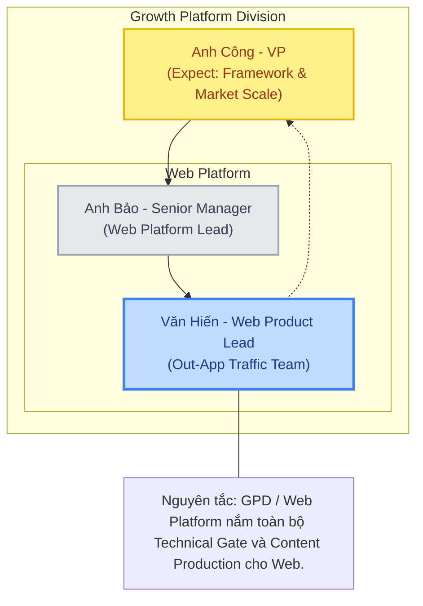
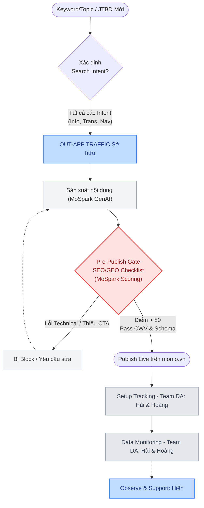

# 🚀 Hienho Master Doc (Step 1)
> Version: 4.3 | Last updated: 2026-05-28 | Maintained by: Văn Hiến

## 📑 MỤC LỤC

1. [Thông tin cá nhân & Bộ phận](#1-thông-tin-cá-nhân--bộ-phận)
   - 1.1 Profile
   - 1.2 Trách nhiệm lõi
   - 1.3 Collaboration Model: GOVERN - BUILD - EXECUTE
   - 1.4 Ownership Map
   - 1.5 Prioritization Framework
   - 1.6 Stack & Tools
   - 1.7 Core Values & Working Principles
2. [Các team làm việc chung](#2-các-team-làm-việc-chung)
3. [Mục tiêu Team & Doanh nghiệp](#3-mục-tiêu-team--doanh-nghiệp)
4. [Quy trình làm việc](#4-quy-trình-làm-việc)
5. [Dự án đang triển khai](#5-dự-án-đang-triển-khai)
6. [Leadership Intelligence](#6-leadership-intelligence)
7. [Changelog](#7-changelog)

---

## 1. THÔNG TIN CÁ NHÂN & BỘ PHẬN

### 1.1 Profile

<table style="width:100%; border-collapse:collapse; border:1.5px solid #64748b; margin:1em 0; font-size:0.9em;">
  <thead>
    <tr style="background-color:#f1f5f9;">
      <th style="border:1.5px solid #64748b; padding:8px 12px; text-align:left; font-weight:700;">Field</th>
      <th style="border:1.5px solid #64748b; padding:8px 12px; text-align:left; font-weight:700;">Detail</th>
    </tr>
  </thead>
  <tbody>
    <tr>
      <td style="border:1px solid #94a3b8; padding:8px 12px; text-align:left;">Tên</td>
      <td style="border:1px solid #94a3b8; padding:8px 12px; text-align:left;">Văn Hiến</td>
    </tr>
    <tr style="background-color:#f8fafc;">
      <td style="border:1px solid #94a3b8; padding:8px 12px; text-align:left;">Vai trò</td>
      <td style="border:1px solid #94a3b8; padding:8px 12px; text-align:left;">Web Product Lead</td>
    </tr>
    <tr>
      <td style="border:1px solid #94a3b8; padding:8px 12px; text-align:left;">Bộ phận</td>
      <td style="border:1px solid #94a3b8; padding:8px 12px; text-align:left;">Out-App Traffic Team (thuộc Web Platform)</td>
    </tr>
    <tr style="background-color:#f8fafc;">
      <td style="border:1px solid #94a3b8; padding:8px 12px; text-align:left;">Division</td>
      <td style="border:1px solid #94a3b8; padding:8px 12px; text-align:left;">Growth Platform Division (GPD)</td>
    </tr>
    <tr>
      <td style="border:1px solid #94a3b8; padding:8px 12px; text-align:left;">Domain sở hữu</td>
      <td style="border:1px solid #94a3b8; padding:8px 12px; text-align:left;">momo.vn (web channel)</td>
    </tr>
    <tr style="background-color:#f8fafc;">
      <td style="border:1px solid #94a3b8; padding:8px 12px; text-align:left;">Kinh nghiệm</td>
      <td style="border:1px solid #94a3b8; padding:8px 12px; text-align:left;">7 năm (Web Construction, SEO/GEO, Product Growth)</td>
    </tr>
    <tr>
      <td style="border:1px solid #94a3b8; padding:8px 12px; text-align:left;">Background</td>
      <td style="border:1px solid #94a3b8; padding:8px 12px; text-align:left;">Fintech</td>
    </tr>
  </tbody>
</table>

### 1.2 Trách nhiệm lõi (Cập nhật H2/2026)

**Định vị Mới (Từ H2/2026): Product-Led Growth & AI-Powered Operations**
- Trọng tâm công việc chuyển dịch từ mô hình "Chỉ Quản trị (Govern)" sang **"Tư vấn và Triển khai trực tiếp các Giải pháp Tăng trưởng (PLG) & Vận hành bằng AI"**.
- Cụ thể: Hiến đóng vai trò **Product Lead** của Out-App Traffic Team, chủ động phối hợp với Cell Teams (BUs) và SE Team để xây dựng sản phẩm Web.

**3 Trọng tâm cốt lõi (Out-App Traffic Team):**
1. **PLG & Content Strategy:** Phân tích Intent Data để xác định Job-to-be-Done (JTBD), từ đó thiết kế các công cụ tiện ích (Utility Tools) và chiến lược nội dung (Content Strategy) để thu hút traffic.
2. **Agent-Led Search, SEO & GEO:** Tối ưu hóa hiển thị (Visibility) trên các công cụ tìm kiếm truyền thống và nền tảng AI Search (ChatGPT, Gemini, Perplexity) để thu hút High-intent users.
3. **AI-Powered Operations:** Phối hợp cùng SE Team đưa các giải pháp, công cụ AI vào MoSpark Platform để tự động hóa và tối ưu hóa việc sản xuất, vận hành nội dung.

**Scope quản lý & Dự án Chiến lược (5 Strategic Projects):**
- Trực tiếp phối hợp tư vấn và triển khai 5 dự án chiến lược cốt lõi của Web Platform trong H2/2026: **Vehicle Hub, SMEs Hub, Cinema Hub, Student Hub, Financial Hub**.
- Đảm bảo các Hub này được thiết kế theo đúng mô hình Product-Led Growth (sử dụng Utility Tool làm "mồi") và hướng tới Web-to-App Conversion cao nhất.
- Đóng vai trò là cầu nối (Layer 3 - Product Lead) trực tiếp lấy yêu cầu và tư vấn giải pháp (SPA Framework) với PO/PM/MKT của từng Cell Team.

**Platform Health & Governance (Vẫn duy trì):**
- Tiếp tục đảm bảo Technical Foundation (On-page, Schema, URL Governance) và Content Foundation được tuân thủ chặt chẽ.
- **MoSpark Content Architecture:** Tư vấn và phát triển các Module tính năng trên MoSpark phối hợp cùng SE Team.
- Giữ vững vai trò "Gatekeeper" cho chất lượng các trang được publish trên momo.vn.

**KPIs (H2/2026):**
- Organic Traffic (Visibility / PageViews) theo từng Use Case.
- Số lượng New Users và MAU/MEU đóng góp từ kênh Out-App.
- Tỷ lệ W2A CR (Web-to-App Conversion Rate).
- GEO/AEO: Tỷ lệ MoMo được trích dẫn (citation) trên các nền tảng AI Search hàng đầu.

### 1.3 Collaboration Model (Cập nhật H2/2026)

Hệ thống vận hành dựa trên sự phối hợp trực tiếp giữa Web Platform (GPD) và các Cell Teams (BUs):

1.  **Out-App Traffic Team (Product & Content Strategy):**
    *   Tư vấn giải pháp tăng trưởng (PLG) và thiết kế lộ trình phát triển nội dung/tiện ích cho Cell Teams.
    *   Sản xuất nội dung trực tiếp trên MoSpark thông qua GenAI Pipeline.
    *   Kiểm soát chất lượng: Review trước khi live, Sign-off Foundation Checklist & SEO/GEO Scoring.

2.  **Software Engineer Team (Build & Platform):**
    *   Phát triển các module tính năng mới trên MoSpark theo yêu cầu từ Out-App Traffic Team.
    *   Thực thi việc xây dựng sản phẩm Web (Mini Web/Hub) theo Sprint.
    *   Đảm bảo hạ tầng kỹ thuật (Infrastructure, Tracking) vận hành ổn định.

3.  **Cell Teams / BUs (Business Owner):**
    *   Đưa ra bài toán kinh doanh (Use Case) và mục tiêu tăng trưởng (KPI).
    *   Thực hiện nghiệm thu sản phẩm (UAT) và phối hợp triển khai các chiến dịch W2A.

### 1.4 Ownership map (Cập nhật H2/2026)

*Mục đích của Ownership Map là để phân định rõ ràng ranh giới trách nhiệm (RACI) giữa Out-App Traffic Team, SE Team và các bên liên quan, đảm bảo không bị chồng chéo công việc (đặc biệt là khâu vận hành Content & Tracking).*

<table style="width:100%; border-collapse:collapse; border:1.5px solid #64748b; margin:1em 0; font-size:0.9em;">
  <thead>
    <tr style="background-color:#f1f5f9;">
      <th style="border:1.5px solid #64748b; padding:8px 12px; text-align:left; font-weight:700;">Nhóm hoạt động</th>
      <th style="border:1.5px solid #64748b; padding:8px 12px; text-align:left; font-weight:700;">Ownership</th>
      <th style="border:1.5px solid #64748b; padding:8px 12px; text-align:left; font-weight:700;">Ghi chú</th>
    </tr>
  </thead>
  <tbody>
    <tr>
      <td style="border:1px solid #94a3b8; padding:8px 12px; text-align:left;">Product-Led Growth (PLG) Strategy</td>
      <td style="border:1px solid #94a3b8; padding:8px 12px; text-align:left;">Out-App Traffic (Hiến)</td>
      <td style="border:1px solid #94a3b8; padding:8px 12px; text-align:left;">Tư vấn giải pháp W2A và điều phối chiến lược 5 Strategic Hubs.</td>
    </tr>
    <tr style="background-color:#f8fafc;">
      <td style="border:1px solid #94a3b8; padding:8px 12px; text-align:left;">Content Strategy & Production</td>
      <td style="border:1px solid #94a3b8; padding:8px 12px; text-align:left;">Out-App Traffic (Hoan Trần)</td>
      <td style="border:1px solid #94a3b8; padding:8px 12px; text-align:left;">Phụ trách toàn bộ khâu sản xuất nội dung (thay thế Media Team) thông qua MoSpark GenAI.</td>
    </tr>
    <tr>
      <td style="border:1px solid #94a3b8; padding:8px 12px; text-align:left;">Technical Foundation (audit & standard)</td>
      <td style="border:1px solid #94a3b8; padding:8px 12px; text-align:left;">Out-App Traffic (Hiến)</td>
      <td style="border:1px solid #94a3b8; padding:8px 12px; text-align:left;">Thiết lập On-page, Schema, URL governance, Sitemap, Crawl quality.</td>
    </tr>
    <tr style="background-color:#f8fafc;">
      <td style="border:1px solid #94a3b8; padding:8px 12px; text-align:left;">Content Foundation Checklist & Scoring</td>
      <td style="border:1px solid #94a3b8; padding:8px 12px; text-align:left;">Out-App Traffic (Hiến)</td>
      <td style="border:1px solid #94a3b8; padding:8px 12px; text-align:left;">Gate bắt buộc trước khi publish, chuẩn hóa bộ rules cho AI Scoring.</td>
    </tr>
    <tr>
      <td style="border:1px solid #94a3b8; padding:8px 12px; text-align:left;">Web Platform Build & Infrastructure</td>
      <td style="border:1px solid #94a3b8; padding:8px 12px; text-align:left;">SE Team (Bảo)</td>
      <td style="border:1px solid #94a3b8; padding:8px 12px; text-align:left;">Thực thi xây dựng Hub/Microsites, quản lý kiến trúc hạ tầng MoSpark.</td>
    </tr>
    <tr style="background-color:#f8fafc;">
      <td style="border:1px solid #94a3b8; padding:8px 12px; text-align:left;">Tracking (GA4/Appsflyer/BigQuery)</td>
      <td style="border:1px solid #94a3b8; padding:8px 12px; text-align:left;">DA (Hải) & SE Team (Hiếu)</td>
      <td style="border:1px solid #94a3b8; padding:8px 12px; text-align:left;">Setup Full-funnel pipeline, quản lý Cross-platform Identity.</td>
    </tr>
    <tr>
      <td style="border:1px solid #94a3b8; padding:8px 12px; text-align:left;">Tracking (Umami)</td>
      <td style="border:1px solid #94a3b8; padding:8px 12px; text-align:left;">SE Team (Thuận)</td>
      <td style="border:1px solid #94a3b8; padding:8px 12px; text-align:left;">Quản lý và triển khai toàn bộ hệ thống tracking Umami.</td>
    </tr>
    <tr style="background-color:#f8fafc;">
      <td style="border:1px solid #94a3b8; padding:8px 12px; text-align:left;">Web-to-App Conversion Optimization</td>
      <td style="border:1px solid #94a3b8; padding:8px 12px; text-align:left;">Out-App Traffic (Hiến)</td>
      <td style="border:1px solid #94a3b8; padding:8px 12px; text-align:left;">Thiết kế User Flow, đo lường và tối ưu tỷ lệ chuyển đổi.</td>
    </tr>
    <tr>
      <td style="border:1px solid #94a3b8; padding:8px 12px; text-align:left;">GenAI Workflow & Tools</td>
      <td style="border:1px solid #94a3b8; padding:8px 12px; text-align:left;">SE Team (Trọng/Thuận)</td>
      <td style="border:1px solid #94a3b8; padding:8px 12px; text-align:left;">Xây dựng node/pipeline xử lý Text/Image tự động bằng AI (ComfyUI backend).</td>
    </tr>
    <tr style="background-color:#f8fafc;">
      <td style="border:1px solid #94a3b8; padding:8px 12px; text-align:left;">Publish Gate (Gatekeeper)</td>
      <td style="border:1px solid #94a3b8; padding:8px 12px; text-align:left;">Out-App Traffic (Hiến)</td>
      <td style="border:1px solid #94a3b8; padding:8px 12px; text-align:left;">Sign-off cuối cùng cho mọi trang (Technical & SEO/GEO) trước khi Live.</td>
    </tr>
  </tbody>
</table>

### 1.5 Prioritization Framework

Khi có nhiều workstream cạnh tranh bandwidth, Hiến ưu tiên theo 2 tiêu chí:

1. **Market Search Potential** - Use Case có search demand đủ lớn, đáng đầu tư
2. **Company Direction (Financial)** - Gắn với chiến lược tài chính của MoMo (Credit, Insurance, BNPL)

### 1.6 Stack & Tools

<table style="width:100%; border-collapse:collapse; border:1.5px solid #64748b; margin:1em 0; font-size:0.9em;">
  <thead>
    <tr style="background-color:#f1f5f9;">
      <th style="border:1.5px solid #64748b; padding:8px 12px; text-align:left; font-weight:700;">Nhóm</th>
      <th style="border:1.5px solid #64748b; padding:8px 12px; text-align:left; font-weight:700;">Tools</th>
    </tr>
  </thead>
  <tbody>
    <tr>
      <td style="border:1px solid #94a3b8; padding:8px 12px; text-align:left;">Analytics</td>
      <td style="border:1px solid #94a3b8; padding:8px 12px; text-align:left;">GA4 (G-02G70QKZ26), GSC, Umami (Real-time), Looker Studio</td>
    </tr>
    <tr style="background-color:#f8fafc;">
      <td style="border:1px solid #94a3b8; padding:8px 12px; text-align:left;">Tag Management</td>
      <td style="border:1px solid #94a3b8; padding:8px 12px; text-align:left;">GTM OutApp (GTM-P9JDDJZ), GTM InApp (GTM-5TCGRPX)</td>
    </tr>
    <tr>
      <td style="border:1px solid #94a3b8; padding:8px 12px; text-align:left;">Attribution</td>
      <td style="border:1px solid #94a3b8; padding:8px 12px; text-align:left;">Appsflyer (momoapp.onelink.vn)</td>
    </tr>
    <tr style="background-color:#f8fafc;">
      <td style="border:1px solid #94a3b8; padding:8px 12px; text-align:left;">CMS</td>
      <td style="border:1px solid #94a3b8; padding:8px 12px; text-align:left;">MoSpark (Software as a Product) - CMS + Admin Tool + GenAI Pipeline</td>
    </tr>
    <tr>
      <td style="border:1px solid #94a3b8; padding:8px 12px; text-align:left;">Deployment</td>
      <td style="border:1px solid #94a3b8; padding:8px 12px; text-align:left;">[Internal / MoSpark Platform]</td>
    </tr>
    <tr style="background-color:#f8fafc;">
      <td style="border:1px solid #94a3b8; padding:8px 12px; text-align:left;">Tracking standard</td>
      <td style="border:1px solid #94a3b8; padding:8px 12px; text-align:left;">GA4 + GTM (marketing attribution) + Appsflyer (attribution) - synced to BigQuery</td>
    </tr>
  </tbody>
</table>

### 1.7 Core Values & Working Principles

Các giá trị cốt lõi định hướng cách vận hành và ra quyết định trong vai trò Web Product Lead:

<table style="width:100%; border-collapse:collapse; border:1.5px solid #64748b; margin:1em 0; font-size:0.9em;">
  <thead>
    <tr style="background-color:#f1f5f9;">
      <th style="border:1.5px solid #64748b; padding:8px 12px; text-align:left; font-weight:700;">Giá trị cốt lõi</th>
      <th style="border:1.5px solid #64748b; padding:8px 12px; text-align:left; font-weight:700;">Nguyên tắc & Hành động thực tế</th>
    </tr>
  </thead>
  <tbody>
    <tr>
      <td style="border:1px solid #94a3b8; padding:8px 12px; text-align:left;"><strong>Market-driven</strong></td>
      <td style="border:1px solid #94a3b8; padding:8px 12px; text-align:left;">Luôn bắt đầu từ nhu cầu thị trường. Đánh giá ưu tiên dự án dựa trên <strong>Market Search Potential</strong>. Áp dụng <strong>SEO/GEO Inventory</strong> và <strong>JTBD Analysis</strong> để xác định cơ hội, định hướng Web Products thu hút high-intent traffic.</td>
    </tr>
    <tr style="background-color:#f8fafc;">
      <td style="border:1px solid #94a3b8; padding:8px 12px; text-align:left;"><strong>Ownership</strong></td>
      <td style="border:1px solid #94a3b8; padding:8px 12px; text-align:left;">Chủ động xác định phạm vi và ưu tiên công việc theo mô hình <strong>Govern</strong>. Nắm giữ và duy trì hệ thống quản trị, đặc biệt là Technical & Content Foundation Gate.</td>
    </tr>
    <tr>
      <td style="border:1px solid #94a3b8; padding:8px 12px; text-align:left;"><strong>Builder Mindset</strong></td>
      <td style="border:1px solid #94a3b8; padding:8px 12px; text-align:left;">Không chỉ phân phối sản phẩm mà tập trung xây dựng hệ thống có khả năng scale. Trực tiếp tham gia đồng phát triển (co-build) các công cụ và frameworks trên <strong>MoSpark Platform</strong>.</td>
    </tr>
    <tr style="background-color:#f8fafc;">
      <td style="border:1px solid #94a3b8; padding:8px 12px; text-align:left;"><strong>Data-first</strong></td>
      <td style="border:1px solid #94a3b8; padding:8px 12px; text-align:left;">Mọi đề xuất chiến lược đều dựa trên dữ liệu. Vận hành chuyên sâu các hệ thống đo lường (GA4, GSC, GTM, BigQuery) và tối ưu hóa phễu chuyển đổi Web-to-App.</td>
    </tr>
    <tr>
      <td style="border:1px solid #94a3b8; padding:8px 12px; text-align:left;"><strong>AI-first Mindset</strong></td>
      <td style="border:1px solid #94a3b8; padding:8px 12px; text-align:left;">Tích hợp sâu AI vào quy trình sản xuất (GenAI Content Pipeline) và đi đầu chiến lược GEO/AEO để tối ưu hiển thị trên các nền tảng AI mới.</td>
    </tr>
    <tr style="background-color:#f8fafc;">
      <td style="border:1px solid #94a3b8; padding:8px 12px; text-align:left;"><strong>Collaborative</strong></td>
      <td style="border:1px solid #94a3b8; padding:8px 12px; text-align:left;">Đóng vai trò Web Product Consultant, kết nối hiệu quả giữa Web Platform, Media Team và các BU nội bộ để triển khai sản phẩm đúng chuẩn.</td>
    </tr>
  </tbody>
</table>
### 1.8 Mục tiêu Phát triển Bản thân (Individual Development Plan - IDP)

**Tên tổng thể: Định hướng trở thành Chuyên gia Sản phẩm AI (AI Product Manager/Lead) cho Nền tảng Web**

Nhằm đáp ứng sự bùng nổ của trí tuệ nhân tạo và chiến lược mới của GPD, mục tiêu phát triển cá nhân của Văn Hiến tập trung vào việc ứng dụng AI để làm mấu chốt tăng trưởng, thông qua 3 trục cốt lõi:

*   **1. Quản trị Sản phẩm bằng Trí tuệ nhân tạo (AI-Driven Product Management):**
    *   *Mục tiêu:* Nâng cấp từ làm Sản phẩm Web (Web Product) truyền thống sang làm Sản phẩm AI (AI Product).
    *   *Hành động:* Trực tiếp xây dựng và tối ưu các lõi công nghệ AI trên nền tảng MoSpark (như GenAI Content Engine, RAG Knowledge Base, công cụ Automation). Dùng sức mạnh của AI để rút ngắn thời gian ra mắt chiến dịch và tự động hóa phễu chuyển đổi Web-to-App.

*   **2. Làm chủ Kỷ nguyên Tìm kiếm AI (GEO/AEO Leadership):**
    *   *Mục tiêu:* Tiên phong dẫn dắt mảng Tối ưu hóa Công cụ Tìm kiếm AI (GEO/AEO) tại MoMo.
    *   *Hành động:* Xây dựng bộ tiêu chuẩn (AI Crawler Policy, định dạng Answer-first). Triển khai hệ thống file `llms.txt` và các cấu trúc dữ liệu đặc thù để đảm bảo sản phẩm của MoMo luôn được các AI Engines (ChatGPT, Perplexity, Gemini) đọc hiểu và ưu tiên trích dẫn (citation).

*   **3. Tư vấn Tăng trưởng bằng AI (AI-Led Growth & Consulting):**
    *   *Mục tiêu:* Trở thành đối tác tư vấn chiến lược AI-First cho các Khối Kinh Doanh (Cell Teams/BU).
    *   *Hành động:* Gói gọn các giải pháp AI và Product-Led Growth (PLG) thành cẩm nang dễ hiểu. Trực tiếp tư vấn cho các BU cách ứng dụng công nghệ AI vào sản phẩm Web để bứt phá lưu lượng truy cập (Traffic) và người dùng mới (DLU) với chi phí rẻ nhất.

---

## 2. OKRS 2026 - WEB PRODUCT LEAD

> 📑 **Tài liệu chi tiết:** [Web Product Lead - Strategic & OKRs H2 2026](file:///Users/hienhv/HienHv/Klaus/Hienho_MoMo-Base/01_STRATEGIC_PLAN/product-lead.md)

### 2.1 Đề xuất OKR H2/2026

#### **OKR 1**
**Mục tiêu (Objective): Xây dựng giải pháp tăng trưởng và thúc đẩy mục tiêu tăng trưởng Web Traffic và MAU**
*Tập trung thúc đẩy lưu lượng truy cập tự nhiên (Web Traffic) và tối ưu hóa tỷ lệ chuyển đổi Web-to-App để gia tăng lượng người dùng mới (New User/MAU) một cách minh bạch thông qua các nhóm dự án:*

**Mô tả các kết quả cần có để đạt được mục tiêu:**
- **Web Platform Project:** Triển khai các dự án do Web Platform trực tiếp làm Owner: Đạt **Top 3 Ranking** cho nhóm từ khóa Phạt Nguội; scale-up Local SEO cho **500 Merchant Pages** (phát triển các trang Merchant Detail và Merchant Listing định hướng Location Page giải quyết JTBD từ PLG Project).
- **5 Web Hubs Architecture:** Tập trung xây dựng 5 Web Hubs cốt lõi làm nền tảng phục vụ theo nhóm đối tượng (Merchant Hub, Cinema Hub, Vehicle Hub, Financial Hub/Finhub, Student Hub). Mỗi Hub phục vụ một đối tượng chuyên biệt (Trang cửa hàng đối tác, Nhu cầu xem phim, Biển số xe, Nhu cầu tài chính, MSSV/Email sinh viên), cho phép mở rộng hàng loạt sản phẩm & use cases được hỗ trợ trực tiếp từ Hub.
- **Các dự án của Cell Team:** Các dự án Cell Team (Vehicle Hub, Cinema, eSIM, Bảo hiểm Ô tô) - ngoại trừ các dự án Media Team tham gia - đóng góp **3.0M PageViews/tháng**.
- **Overall Web-to-App Funnel:** Tối ưu phễu Web-to-App tổng thể và scale-up traffic hướng tới mục tiêu đột phá đạt **1.0M MAU/tháng** vào cuối H2/2026 (lũy kế H2 đạt **>4.0M MAU**), đạt tỷ lệ chuyển đổi trung bình **>10%** (hướng tới target **12.5%**).
- **User Growth:** Phối hợp cùng User Growth triển khai dự án Ads Website đóng góp **>20K New Users** (REG) và **>14K New User MAU** thực tế.
- **Financial Authority:** Hướng tới mục tiêu xây dựng toàn bộ hệ thống Utilities Tools về Finance tại MoMo thông qua việc phát hành thành công bộ **10 công cụ giả lập tài chính Finhub**.

#### **OKR 2**
**Mục tiêu (Objective): Xây dựng và phát triển MoSpark trở thành nền tảng AI-Powered trong hoạt động GenAI Content**
*Định hình MoSpark làm hạ tầng lõi tự động hóa năng lực phát triển Web và sản xuất nội dung cho toàn nền tảng thông qua các sản phẩm:*

**Mô tả các kết quả cần có để đạt được mục tiêu:**
- **PLG Project:** Vận hành nền tảng quản trị **Topic Cluster**; ứng dụng GenAI để sản xuất nội dung theo **Content Plan** nhằm phục vụ mục tiêu tăng trưởng **Ranking & Traffic (PageViews)**.
- **GenAI Content:** Áp dụng các Model AI để sản xuất đa dạng định dạng nội dung, cắt giảm tối đa thời gian sản xuất, đảm bảo chuẩn business context và luôn tối ưu chi phí token.
- **Merchant-Led Growth:** Xây dựng chiến lược tăng trưởng thông qua các trang **Location Listing (Merchant Listing)** giải quyết JTBD từ **PLG Project** cho **500 Merchant Pages**.
- **Ads Manager & Utilities Tool:** Khai thác quảng cáo và điều phối hiển thị Dynamic placement banner tự động theo ngữ cảnh; phát triển các công cụ tiện ích/widget tra cứu (Calculator, Simulator tính lãi suất/trả góp, và tiện ích theo dõi Giá Vàng) làm phễu gián tiếp dẫn lưu lượng về các dịch vụ tài chính (Tiết kiệm, Đầu tư).
- **SEO/GEO Score & Quality Gate:** Đảm bảo 100% nội dung AI sinh ra đạt điểm số chất lượng ≥ 80 điểm (không lỗi Core Web Vitals, không trùng lặp/lỗi SEO) trước khi xuất bản.

#### **OKR 3**
**Mục tiêu (Objective): Thiết lập quy chuẩn vận hành, quản trị an toàn thông tin & sức khỏe tên miền (Technical & Content Governance)**
*Thiết lập quy chuẩn kỹ thuật, ban hành tài liệu hướng dẫn và thực hiện kiểm duyệt nghiêm ngặt nhằm duy trì sức khỏe tối ưu cho Website thông qua các hoạt động:*

**Mô tả các kết quả cần có để đạt được mục tiêu:**
- **Platform Guideline:** Ban hành đầy đủ các tài liệu hướng dẫn và quy chuẩn kỹ thuật (SEO/GEO, tracking) giúp các Cell Teams triển khai dự án độc lập đúng tiêu chuẩn của Web Platform.
- **Quality Gate:** Thực hiện kiểm duyệt kỹ thuật & nội dung nghiêm ngặt 100% dự án Web mới trước khi Go-live, đảm bảo tiêu chuẩn Agent-Led Search Readiness (Schema markup, E-E-A-T, entity, author).
- **Backlink Security:** Kiểm soát, rà quét và ngăn chặn triệt để các nguồn backlink xấu (spam links) để bảo vệ thẩm quyền tên miền (Domain Authority).
- **URL & Content Governance:** Rà soát định kỳ loại bỏ nội dung lỗi thời, duy trì độ tươi mới (**Data Freshness**) và dọn dẹp các URL không có giá trị (zero-traffic/thin content), đảm bảo tính chính xác cao để AI Agents dễ cào và trích dẫn, tối ưu ngân sách cào dữ liệu (Crawl Budget).

#### **OKR 4**
**Mục tiêu (Objective): Tư vấn giải pháp tăng trưởng và thúc đẩy năng lực triển khai cho các chiến dịch & Cell Teams (Growth Advisory & Enablement)**
*Tử vấn thiết kế luồng chuyển đổi, sitemap, hiệu suất và áp dụng các framework tăng trưởng (SPA) để hỗ trợ đối tác nội bộ vận hành độc lập:*

**Mô tả các kết quả cần có để đạt được mục tiêu:**
- **Conversion Performance Support:** Hỗ trợ Cell Teams giám sát chỉ số Web Performance (Core Web Vitals), ngăn chặn các lỗi nghiêm trọng làm suy giảm CTR/CR.
- **Web-to-App Flow (CreditTech):** Tư vấn thiết kế sitemap, cấu trúc cluster và luồng chuyển đổi W2A cho các dự án Media Team phụ trách chính: **Ví Trả Sau, Vay Nhanh, Destination Promotion Hub (MoMo Travel)**.
- **Campaign & Insurance Support:** Đồng hành cố vấn giải pháp kỹ thuật, cấu trúc SEO/GEO và tối ưu chuyển đổi cho các chiến dịch/dự án do Media Team làm Owner: **Bảo hiểm Y tế (BHYT), Bảo hiểm xe máy (BHXM)**.
- **Growth Framework (SPA):** Thẩm định tính khả thi (Feasibility) và tư vấn hướng tiếp cận pSEO, cấu trúc SEO Inventory, kịch bản JTBD cho các Cell Teams theo quy trình SPA.

---

### 2.2 Đề xuất OKR & Kết quả Đạt được Thực tế H1/2026

#### **Mục tiêu 1: Tăng trưởng New User từ web organic thông qua tối ưu traffic và Web-to-App conversion**
*   **Kết quả cần có đề xuất (Proposed KRs):**
    *   **KR 1.1:** Tư vấn giải pháp SEO & Media cho các Use Case chiến lược ưu tiên nhóm Financial Services (Credit, Insurance, BNPL) và các Use Case có tính chiến lược của BU (như Telco, Cinema, OTA, eSIM).
    *   **KR 1.2:** Triển khai Web-to-App (Web Ads) theo campaign calendar hoặc Quick-Win Case phối hợp Cell Team khai thác các sản phẩm có CTR web-to-app cao để thiết kế luồng chuyển đổi tối ưu.
    *   **KR 1.3:** Rà soát và kiểm soát chất lượng nội dung xuất bản từ PO/Biz đảm bảo chuẩn SEO/GEO, đúng thông điệp, đúng quy trình trước khi lên production.
*   **Kết quả đạt được thực tế H1/2026 (Actual Achievements):**
    *   **Đối với KR 1.1 (Tư vấn SEO & Media):**
        *   *Tư vấn giải pháp tăng trưởng Web:* Triển khai giải pháp cho các Use Case quan trọng của MoMo như Ví Trả Sau, Vay Nhanh, Điểm Tín Dụng, các sản phẩm Bảo Hiểm và dịch vụ thanh toán số (Sim, eSIM, Cinema).
        *   *Thị phần tìm kiếm (Share of Voice - SoV):* Đạt mục tiêu SoV của Ví Trả Sau (54%) và Vay Nhanh (7%).
        *   *Hiệu suất truy cập Web (Web Traffic & Pageviews) trong H1/2026:* Đạt **9.3M Active Users**, **9M New Users**, **9.4M Total Users** và **19M Views**.
        *   *Hiệu suất Tiếp cận và Tìm kiếm Tự nhiên (Search Reach & Organic Traffic) trong H1/2026:* Tổng lưu lượng tìm kiếm tự nhiên mang lại **5.934.051 Clicks** và **206.288.717 Impressions** (CTR trung bình đạt 2.88%). Trong đó, các dự án đóng góp chính: Cinema (2.010.041 clicks), Ví Trả Sau (213.379 clicks), Vay Nhanh (182.057 clicks), Bảo hiểm (91.699 clicks), Phạt Nguội (19.335 clicks).
        *   *Bảo hiểm & Khác:* Đóng gói cấu trúc Auto Insurance (MasterDoc v2, PRD docx) bảo toàn Topical Authority; hoàn tất BRD Draft cho eSIM và Bảo hiểm xe máy.
    *   **Đối với KR 1.2 (Triển khai Web-to-App & Quick-Wins):**
        *   *Hiệu suất phễu Web-to-App tổng thể (Số liệu lũy kế từ 23/04/2026 đến nay):*
            *   *Chỉ số tương tác (Engagement Metrics):* Đạt **7,56M View page** (+350,9%), **2,035M Click CTA** (+555,2% với CTR đạt 54,3%), **415,91K Login app** (+80,1%) và **246,52K MAU** (+602,8% với tỷ lệ chuyển đổi CR MAU/Login đạt 59,3%).
            *   *Phễu người dùng (Unique User Funnel):* Đạt **2.896.658 người dùng truy cập** (100% Views) -> **1.635.020 người dùng nhấn dẫn sang app** (56% Click to app) -> **415.914 người dùng đăng nhập app thành công** (14% Login app) -> **246.517 người dùng phát sinh giao dịch** (9% MAU).
            *   *Chi tiết hiệu suất theo tháng (H1/2026):*
                *   *Page views (Attention):* 2.601.280 (Jan) | 3.470.470 (Feb) | 3.221.705 (Mar) | 2.699.883 (Apr) | 3.273.707 (May) | 3.311.429 (Jun, MoM +1.2%).
                *   *Sessions (Attention):* 1.930.821 (Jan) | 2.373.734 (Feb) | 2.347.190 (Mar) | 1.859.048 (Apr) | 2.330.499 (May) | 2.451.799 (Jun, MoM +5.2%).
                *   *MEU (Interest - Monthly Engagement Users):* 1.397.453 (Jan) | 1.755.757 (Feb) | 1.686.392 (Mar) | 1.427.165 (Apr) | 1.706.739 (May) | 1.675.301 (Jun, MoM -1.8%).
                *   *Click-to-App (Desire):* 964.893 (May) | 824.309 (Jun, MoM -14.5%).
                *   *Login App (Action):* 180.148 (May) | 248.468 (Jun, MoM +37.9%) [Trong đó, Existing users: 178.152 (May) -> 242.409 (Jun, MoM +36.1%); Install App: 1.996 (May) -> 6.059 (Jun, MoM +203.5%)].
        *   *Dự án Ads Website (New to MoMo - Nhiều Scheme trên Web qua Ads Manager):* Phối hợp cùng User Growth triển khai dự án Ads Website thúc đẩy New User trên Website thông qua các schema "New To MoMo" mang lại kết quả phễu chuyển đổi thực tế trong H1/2026: **36.867 Installs** -> **16.690 Registrations** (REG) -> **9.800+ Bank Mappings** (Map Bank) -> **7.000+ MAU**.
        *   *Popup Ads - Billpay:* Triển khai thành công trên 22 pages chiến lược với cơ chế phân phối bậc (tiered placement), đã đo lường và hoàn thành đóng dự án.
        *   *Chuẩn hóa Onelink:* Tham gia chuẩn hóa hệ thống Onelink trên Website nhằm mục tiêu đo lường end-to-end từ Out-App -> Website -> App và nonApp. Giải quyết dứt điểm các lỗi đo lường sai lệch trong hệ thống báo cáo.
    *   **Đối với KR 1.3 (Rà soát & kiểm soát chất lượng):**

#### **Mục tiêu 2: Xây dựng nền tảng MoMo.vn ổn định và định hướng GEO/AEO-First**
*   **Kết quả cần có đề xuất (Proposed KRs):**
    *   **KR 2.1:** Đảm bảo hệ thống website vận hành ổn định và có nền tảng kỹ thuật chuẩn bao gồm chuẩn hóa quy trình xuất bản nội dung qua Admin Panel, hoàn thiện luồng làm việc giữa Media Team / Web Platform và Cell Team, xây dựng tài liệu SOP kiểm duyệt nội dung.
    *   **KR 2.2:** Xây dựng hệ thống tracking full-funnel Web-to-App (New/Current User), chuẩn hóa toàn bộ Onelink/Universal Link + UTM trên mọi CTA, triển khai A/B Testing.
    *   **KR 2.3:** Rà soát và Audit Website đảm bảo hiệu suất, các cập nhật thuật toán từ google, AI trending, budget crawl.
    *   **KR 2.4:** Xây dựng GEO Checklist Framework (citability scoring, answer-first format, AI crawler policy) và áp dụng vào quy trình sản xuất nội dung đảm bảo momo.vn sẵn sàng cho AI Search.
*   **Kết quả đạt được thực tế H1/2026 (Actual Achievements):**
    *   **Đối với KR 2.1 (Vận hành ổn định & SOP):**
        *   *Cố vấn và Vận hành Chiến dịch (Campaigns):* Tham gia tư vấn, triển khai, vận hành và tối ưu hóa SEO/GEO cho các chiến dịch Mega lớn của công ty là **Lắc Xì H1/2026** và **Mega Summer 2026**.
        *   *MoSpark CMS Migration:* Đưa hệ thống MoSpark CMS vào hoạt động (Platform Ready), tích hợp sẵn Umami và GenAI content pipeline. Đang onboard LP Builder cho GPD.
        *   *Quy trình biên tập:* Xác lập Workflow content 7 bước và 3 approval gates để phân định rõ vai trò verify (Hiến) vs publish (Content Team).
    *   **Đối với KR 2.2 (Tracking & UTM):**
        *   *Identity Platform:* Triển khai thành công hạ tầng định danh người dùng qua Edge Cookie & Edge Middleware, hỗ trợ stitch chính xác hành vi người dùng ẩn danh từ Web tới giao dịch trên App.
    *   **Đối với KR 2.3 (Audit Website & Crawl Budget):**
        *   *Zero-Traffic URL Clean-up:* Rà soát và xử lý loại bỏ **hơn 3.000 URL không có giá trị** (chính xác là 3.670 URLs rác trên 16 Use Cases gồm OA, Bus, Cinema và News) nằm rải rác ở từng Cell Team để dọn dẹp crawl waste, tối ưu hóa Crawl Budget của Googlebot.
        *   *Quy tắc quản trị:* Đưa ra bộ quy tắc xử lý ngắn hạn và dài hạn cho URL Governance (Sunset rule cho pSEO, chính sách 410 Gone / 301 Redirect).
        *   *Robots.txt:* Deploy thành công nâng cấp Lớp 1 (`Disallow: /*?`), chặn query string spam, bảo vệ crawl budget cho Googlebot.
    *   **Đối với KR 2.4 (GEO Checklist & AI Overviews):**
        *   *SEO/GEO Scoring Gate:* Hoàn tất BRD v1.1 tích hợp công thức chấm điểm 5 block (100 điểm) trực tiếp vào CMS MoSpark để kiểm soát chất lượng.
        *   *AI Crawler Policy:* Xây dựng cấu trúc file `llms.txt` và bắt đầu chạy thử nghiệm (pilot) trên dự án Phạt Nguội.

#### **Mục tiêu 3: Xây dựng các sản phẩm web PLG/Utilities-led SEO để tăng trưởng DLU/MAU bền vững**
*   **Kết quả cần có đề xuất (Proposed KRs):**
    *   **KR 3.1:** Phối hợp Web Platform/PO/Biz xây dựng các MiniWeb và Utility Tools trên momo.vn theo mô hình Product-led Growth, tập trung vào nhóm Financial Services để tạo quick win. Ví dụ: công cụ kiểm tra điểm CIC, tính lãi suất vay, so sánh gói bảo hiểm ô tô/xe máy, tra cứu hạn mức Ví Trả Sau, tính phí trả góp.
    *   **KR 3.2:** Mỗi Utility Tool tự thân tạo giá trị sử dụng, thu hút organic traffic từ search intent cao, sau đó chuyển đổi thành DLU/MAU qua deeplink.
    *   **KR 3.3:** Xây dựng Pillar/Cluster Content Strategy cho nhóm Use Case Credit & Insurance, kết hợp programmatic SEO để scale. Đảm bảo mỗi sản phẩm web đều có đóng góp DLU/MAU.
*   **Kết quả đạt được thực tế H1/2026 (Actual Achievements):**
    *   **Đối với KR 3.1 (MiniWeb & Utility Tools):**
        *   *Phạt Nguội (Traffic Fines):* Triển khai thành công dự án P0 Phạt Nguội Phase 1 (Live) tích hợp API real-time từ TTDK & CSGT, bản đồ camera, tính năng đăng ký nhận cảnh báo vi phạm (Subscription).
        *   *CIC Simulator:* Xây dựng và hoàn thiện HTML Widget giả lập điểm tín dụng CIC (band 300-850) làm PLG hook.
        *   *Finhub Simulation Tools:* Thiết lập logic tính toán và thiết kế wireframe prototype cho bộ 10 công cụ tài chính cốt lõi (Gross-Net, lãi tiết kiệm, lương hưu...).
    *   **Đối với KR 3.2 (Thu hút organic traffic & Chuyển đổi DLU/MAU):**
        *   *Smart CTA & Zero-Party Data Passing:* Vận hành cơ chế nút CTA động cá nhân hóa và đóng gói truyền dữ liệu ngữ cảnh (URL parameter mã hóa) từ Web sang App để tự động điền (pre-fill) thông tin người dùng trên App MoMo.
        *   *Merchant Page Builder (O2O local SEO):* Hoàn thành chạy thử nghiệm (Pilot) 39 merchant; hoàn thiện luồng tự động tạo trang địa điểm chuẩn Local SEO từ cơ sở dữ liệu đối tác (200k+ merchant Ví Trả Sau) giúp thu hút traffic ngoài App.
    *   **Đối với KR 3.3 (Pillar Content & Programmatic SEO):**
        *   *GenAI Content Engine:* Tích hợp Claude API (Claude 3 Haiku & Claude 3.5 Sonnet) trên MoSpark Production; chạy benchmark hiệu năng và chi phí chi tiết (Haiku ~7k/bài/55s; Sonnet ~20k/bài/140s) giúp hoạch định chính xác ngân sách cho Content Plan.

---

## 3. CÁC TEAM LÀM VIỆC CHUNG

### 3.1 Org Chart - GPD



**Lưu ý quan hệ (Cập nhật 26/05/2026):**
- **Từ 01/06/2026:** Hiến (Web Product Lead - Out-App Traffic Team) thuộc Web Platform và báo cáo trực tiếp cho Bảo (Senior Manager - Web Platform Lead).
- Bảo = Senior Manager phụ trách Web Platform, báo cáo trực tiếp Công (VP).
- Team Out-App Traffic là một team chuyên môn trực thuộc Web Platform, vận hành dưới sự quản lý trực tiếp của Bảo.

### 3.2 Out-App Traffic (Hiến sở hữu)

<table style="width:100%; border-collapse:collapse; border:1.5px solid #64748b; margin:1em 0; font-size:0.9em;">
  <thead>
    <tr style="background-color:#f1f5f9;">
      <th style="border:1.5px solid #64748b; padding:8px 12px; text-align:left; font-weight:700;">Field</th>
      <th style="border:1.5px solid #64748b; padding:8px 12px; text-align:left; font-weight:700;">Detail</th>
    </tr>
  </thead>
  <tbody>
    <tr>
      <td style="border:1px solid #94a3b8; padding:8px 12px; text-align:left;">Scope</td>
      <td style="border:1px solid #94a3b8; padding:8px 12px; text-align:left;">Platform Health & Governance: Set standard, audit và kiểm soát mọi hoạt động SEO/GEO trên momo.vn dù ai thực hiện. Bổ sung T4: Quản lý mảng SEO/GEO từ Internal và Media Team</td>
    </tr>
    <tr style="background-color:#f8fafc;">
      <td style="border:1px solid #94a3b8; padding:8px 12px; text-align:left;">Model hoạt động</td>
      <td style="border:1px solid #94a3b8; padding:8px 12px; text-align:left;"><strong>Govern, không Execute</strong> - Hiến set standard và audit. Media Team / Agency execute qua Media Team</td>
    </tr>
    <tr>
      <td style="border:1px solid #94a3b8; padding:8px 12px; text-align:left;">Hoạt động</td>
      <td style="border:1px solid #94a3b8; padding:8px 12px; text-align:left;">Technical Foundation audit, Content Foundation governance, Tracking observation & support, Strategic projects</td>
    </tr>
    <tr style="background-color:#f8fafc;">
      <td style="border:1px solid #94a3b8; padding:8px 12px; text-align:left;">KPI chính</td>
      <td style="border:1px solid #94a3b8; padding:8px 12px; text-align:left;">Organic Traffic, Keyword Ranking, New User, MAU, MEU</td>
    </tr>
    <tr>
      <td style="border:1px solid #94a3b8; padding:8px 12px; text-align:left;">Quan hệ với Web Platform</td>
      <td style="border:1px solid #94a3b8; padding:8px 12px; text-align:left;">Hiến gửi technical request / SEO potential project → Bảo implement</td>
    </tr>
    <tr style="background-color:#f8fafc;">
      <td style="border:1px solid #94a3b8; padding:8px 12px; text-align:left;">Quan hệ với Media Team</td>
      <td style="border:1px solid #94a3b8; padding:8px 12px; text-align:left;">Hiến là đầu mối - Media Team không làm việc trực tiếp với Web Platform</td>
    </tr>
  </tbody>
</table>

### 3.3 Web Platform (Bảo)

<table style="width:100%; border-collapse:collapse; border:1.5px solid #64748b; margin:1em 0; font-size:0.9em;">
  <thead>
    <tr style="background-color:#f1f5f9;">
      <th style="border:1.5px solid #64748b; padding:8px 12px; text-align:left; font-weight:700;">Field</th>
      <th style="border:1.5px solid #64748b; padding:8px 12px; text-align:left; font-weight:700;">Detail</th>
    </tr>
  </thead>
  <tbody>
    <tr>
      <td style="border:1px solid #94a3b8; padding:8px 12px; text-align:left;">Lead</td>
      <td style="border:1px solid #94a3b8; padding:8px 12px; text-align:left;">Bảo (Senior Manager)</td>
    </tr>
    <tr style="background-color:#f8fafc;">
      <td style="border:1px solid #94a3b8; padding:8px 12px; text-align:left;">Team Structure</td>
      <td style="border:1px solid #94a3b8; padding:8px 12px; text-align:left;"><strong>Back-end:</strong> Hiếu (Team Leader - Technical lead for Onelink Standardization), Hoài Anh (Tech Solution Lead), Duy (Senior Software Engineer)<br><strong>Front-end:</strong> Hùng (Team Leader), Thuận, Lộc, Nhật, Trọng (Senior Software Engineer)</td>
    </tr>
    <tr>
      <td style="border:1px solid #94a3b8; padding:8px 12px; text-align:left;">Reporting</td>
      <td style="border:1px solid #94a3b8; padding:8px 12px; text-align:left;">Trực tiếp Công (VP)</td>
    </tr>
    <tr style="background-color:#f8fafc;">
      <td style="border:1px solid #94a3b8; padding:8px 12px; text-align:left;">Scope</td>
      <td style="border:1px solid #94a3b8; padding:8px 12px; text-align:left;">Quản lý, tư vấn Cell Team xây dựng sản phẩm trên Web theo tiêu chuẩn product design</td>
    </tr>
    <tr>
      <td style="border:1px solid #94a3b8; padding:8px 12px; text-align:left;">Trách nhiệm</td>
      <td style="border:1px solid #94a3b8; padding:8px 12px; text-align:left;">Vận hành nền tảng web, tăng trưởng Web-to-App, standardize tracking (truth of source)</td>
    </tr>
    <tr style="background-color:#f8fafc;">
      <td style="border:1px solid #94a3b8; padding:8px 12px; text-align:left;">Tools</td>
      <td style="border:1px solid #94a3b8; padding:8px 12px; text-align:left;">Xây dựng công cụ cho Out-App Traffic / Cell Team / Media Team vận hành nội dung</td>
    </tr>
    <tr>
      <td style="border:1px solid #94a3b8; padding:8px 12px; text-align:left;">KPI chính</td>
      <td style="border:1px solid #94a3b8; padding:8px 12px; text-align:left;">Web-to-App conversion, New User, MAU, MEU (chung với GPD)</td>
    </tr>
  </tbody>
</table>

### 3.3b Cơ cấu Nhân sự & Phân công Dự án (H2/2026)

**A. Software Engineer Team (SE Team)**

<table style="width:100%; border-collapse:collapse; border:1.5px solid #64748b; margin:1em 0; font-size:0.9em;">
  <thead>
    <tr style="background-color:#f1f5f9;">
      <th style="border:1.5px solid #64748b; padding:8px 12px; text-align:left; font-weight:700;">Thành viên</th>
      <th style="border:1.5px solid #64748b; padding:8px 12px; text-align:left; font-weight:700;">Grade</th>
      <th style="border:1.5px solid #64748b; padding:8px 12px; text-align:left; font-weight:700;">Vai trò chuyên môn</th>
      <th style="border:1.5px solid #64748b; padding:8px 12px; text-align:left; font-weight:700;">Dự án H2/2026 (Primary)</th>
      <th style="border:1.5px solid #64748b; padding:8px 12px; text-align:left; font-weight:700;">Hạng mục chi tiết in-charge</th>
    </tr>
  </thead>
  <tbody>
    <tr>
      <td style="border:1px solid #94a3b8; padding:8px 12px; text-align:left;"><strong>Bảo</strong></td>
      <td style="border:1px solid #94a3b8; padding:8px 12px; text-align:left;">M</td>
      <td style="border:1px solid #94a3b8; padding:8px 12px; text-align:left;">Senior Manager \</td>
      <td style="border:1px solid #94a3b8; padding:8px 12px; text-align:left;">MoSpark Owner</td>
      <td style="border:1px solid #94a3b8; padding:8px 12px; text-align:left;">MoSpark Platform (All Projects)</td>
      <td style="border:1px solid #94a3b8; padding:8px 12px; text-align:left;">Quản lý toàn bộ SE Team và lộ trình phát triển MoSpark (CMS V2, Ads Manager, LDP Builder, Widget Store).</td>
    </tr>
    <tr style="background-color:#f8fafc;">
      <td style="border:1px solid #94a3b8; padding:8px 12px; text-align:left;"><strong>Đặng Hoài Anh</strong></td>
      <td style="border:1px solid #94a3b8; padding:8px 12px; text-align:left;">4</td>
      <td style="border:1px solid #94a3b8; padding:8px 12px; text-align:left;">Tech Solution Lead \</td>
      <td style="border:1px solid #94a3b8; padding:8px 12px; text-align:left;">Platform Arch.</td>
      <td style="border:1px solid #94a3b8; padding:8px 12px; text-align:left;">MoSpark Core Backend & API, Web App</td>
      <td style="border:1px solid #94a3b8; padding:8px 12px; text-align:left;">Kiến trúc tổng thể MoSpark, thiết kế database Supabase, cổng YARP API Gateway, đồng bộ M4B.</td>
    </tr>
    <tr>
      <td style="border:1px solid #94a3b8; padding:8px 12px; text-align:left;"><strong>Hùng Nguyễn</strong></td>
      <td style="border:1px solid #94a3b8; padding:8px 12px; text-align:left;">4</td>
      <td style="border:1px solid #94a3b8; padding:8px 12px; text-align:left;">Front-End Team Leader \</td>
      <td style="border:1px solid #94a3b8; padding:8px 12px; text-align:left;">MoBase</td>
      <td style="border:1px solid #94a3b8; padding:8px 12px; text-align:left;">MoBase, Cinema Hub, LnD Hub</td>
      <td style="border:1px solid #94a3b8; padding:8px 12px; text-align:left;">Quản trị MoBase Design System, R&D UI/UX Front-end, build các Hub Cinema và LnD.</td>
    </tr>
    <tr style="background-color:#f8fafc;">
      <td style="border:1px solid #94a3b8; padding:8px 12px; text-align:left;"><strong>Nhật Bùi</strong></td>
      <td style="border:1px solid #94a3b8; padding:8px 12px; text-align:left;">3</td>
      <td style="border:1px solid #94a3b8; padding:8px 12px; text-align:left;">Senior FE Developer</td>
      <td style="border:1px solid #94a3b8; padding:8px 12px; text-align:left;">LDP Builder, Merchant SMEs Hub, Student Hub</td>
      <td style="border:1px solid #94a3b8; padding:8px 12px; text-align:left;">Triển khai Landing Page Builder, template Merchant Page, tích hợp Chatbot KB và CRUD.</td>
    </tr>
    <tr>
      <td style="border:1px solid #94a3b8; padding:8px 12px; text-align:left;"><strong>Thuận Võ</strong></td>
      <td style="border:1px solid #94a3b8; padding:8px 12px; text-align:left;">3</td>
      <td style="border:1px solid #94a3b8; padding:8px 12px; text-align:left;">Senior FE Developer</td>
      <td style="border:1px solid #94a3b8; padding:8px 12px; text-align:left;">Ads Manager, New User, Financial Hub, Vehicle Hub</td>
      <td style="border:1px solid #94a3b8; padding:8px 12px; text-align:left;">Phân phối Ads/Widget, đo lường Umami, MoSpark Multimodal Studio (ComfyUI backend).</td>
    </tr>
    <tr style="background-color:#f8fafc;">
      <td style="border:1px solid #94a3b8; padding:8px 12px; text-align:left;"><strong>Trọng Trần</strong></td>
      <td style="border:1px solid #94a3b8; padding:8px 12px; text-align:left;">2</td>
      <td style="border:1px solid #94a3b8; padding:8px 12px; text-align:left;">Senior FE Developer</td>
      <td style="border:1px solid #94a3b8; padding:8px 12px; text-align:left;">GenAI Content, PLG Project</td>
      <td style="border:1px solid #94a3b8; padding:8px 12px; text-align:left;">Quản lý GenAI pipeline workflow (Text/Logic Node), bóc tách dữ liệu cấu trúc (Chatbot KB).</td>
    </tr>
    <tr>
      <td style="border:1px solid #94a3b8; padding:8px 12px; text-align:left;"><strong>Lộc Lê</strong></td>
      <td style="border:1px solid #94a3b8; padding:8px 12px; text-align:left;">4</td>
      <td style="border:1px solid #94a3b8; padding:8px 12px; text-align:left;">Senior FE Developer \</td>
      <td style="border:1px solid #94a3b8; padding:8px 12px; text-align:left;">Dev Ops</td>
      <td style="border:1px solid #94a3b8; padding:8px 12px; text-align:left;">MoSpark Auth, Infrastructure, CMS Access</td>
      <td style="border:1px solid #94a3b8; padding:8px 12px; text-align:left;">Phân quyền user access, bảo mật Admin Panel, tối ưu hạ tầng, R&D giải pháp kỹ thuật mới.</td>
    </tr>
    <tr style="background-color:#f8fafc;">
      <td style="border:1px solid #94a3b8; padding:8px 12px; text-align:left;"><strong>Hiếu Nguyễn</strong></td>
      <td style="border:1px solid #94a3b8; padding:8px 12px; text-align:left;">4</td>
      <td style="border:1px solid #94a3b8; padding:8px 12px; text-align:left;">Back-End Team Leader \</td>
      <td style="border:1px solid #94a3b8; padding:8px 12px; text-align:left;">Widget Lead</td>
      <td style="border:1px solid #94a3b8; padding:8px 12px; text-align:left;">Tracking Pipeline, User Identity, Web APIs</td>
      <td style="border:1px solid #94a3b8; padding:8px 12px; text-align:left;">Đồng bộ Onelink, GA4/GTM/Umami, đối soát BigQuery, quản lý Identity Cross Platform.</td>
    </tr>
    <tr>
      <td style="border:1px solid #94a3b8; padding:8px 12px; text-align:left;"><strong>Duy Trần</strong></td>
      <td style="border:1px solid #94a3b8; padding:8px 12px; text-align:left;">3</td>
      <td style="border:1px solid #94a3b8; padding:8px 12px; text-align:left;">Senior BE Developer</td>
      <td style="border:1px solid #94a3b8; padding:8px 12px; text-align:left;">Chatbot/KB Solution, Admin Panel Tool</td>
      <td style="border:1px solid #94a3b8; padding:8px 12px; text-align:left;">Chịu trách nhiệm backend Chatbot, RAG Knowledge Base Sync từ MoSpark và backend API microsites.</td>
    </tr>
  </tbody>
</table>

**B. Out-App Traffic Team (Product-Led Growth)**

<table style="width:100%; border-collapse:collapse; border:1.5px solid #64748b; margin:1em 0; font-size:0.9em;">
  <thead>
    <tr style="background-color:#f1f5f9;">
      <th style="border:1.5px solid #64748b; padding:8px 12px; text-align:left; font-weight:700;">Vai trò</th>
      <th style="border:1.5px solid #64748b; padding:8px 12px; text-align:left; font-weight:700;">Người</th>
      <th style="border:1.5px solid #64748b; padding:8px 12px; text-align:left; font-weight:700;">Grade</th>
      <th style="border:1.5px solid #64748b; padding:8px 12px; text-align:left; font-weight:700;">Onboard</th>
      <th style="border:1.5px solid #64748b; padding:8px 12px; text-align:left; font-weight:700;">Phụ trách trong H2/2026</th>
    </tr>
  </thead>
  <tbody>
    <tr>
      <td style="border:1px solid #94a3b8; padding:8px 12px; text-align:left;">Product Lead</td>
      <td style="border:1px solid #94a3b8; padding:8px 12px; text-align:left;"><strong>Hiến Hồ</strong></td>
      <td style="border:1px solid #94a3b8; padding:8px 12px; text-align:left;">4</td>
      <td style="border:1px solid #94a3b8; padding:8px 12px; text-align:left;">T5/2026</td>
      <td style="border:1px solid #94a3b8; padding:8px 12px; text-align:left;">Trực tiếp điều phối 5 Strategic Hubs (Vehicle, SMEs, Cinema, Student, Financial). Hợp tác SE Team phát triển MoSpark GenAI. Set standard Technical SEO/GEO.</td>
    </tr>
    <tr style="background-color:#f8fafc;">
      <td style="border:1px solid #94a3b8; padding:8px 12px; text-align:left;">Senior Product Marketing</td>
      <td style="border:1px solid #94a3b8; padding:8px 12px; text-align:left;"><strong>Hoan Trần</strong></td>
      <td style="border:1px solid #94a3b8; padding:8px 12px; text-align:left;">3</td>
      <td style="border:1px solid #94a3b8; padding:8px 12px; text-align:left;">T7/2026</td>
      <td style="border:1px solid #94a3b8; padding:8px 12px; text-align:left;">Content Strategy & Content Production qua MoSpark (cho các dự án Cell Teams). R&D mô hình AI.</td>
    </tr>
    <tr>
      <td style="border:1px solid #94a3b8; padding:8px 12px; text-align:left;">Senior Product Designer</td>
      <td style="border:1px solid #94a3b8; padding:8px 12px; text-align:left;"><strong>TBD</strong></td>
      <td style="border:1px solid #94a3b8; padding:8px 12px; text-align:left;">3</td>
      <td style="border:1px solid #94a3b8; padding:8px 12px; text-align:left;">Đang tuyển</td>
      <td style="border:1px solid #94a3b8; padding:8px 12px; text-align:left;">UI/UX Web Design, Design-to-Code, System Thinking.</td>
    </tr>
    <tr style="background-color:#f8fafc;">
      <td style="border:1px solid #94a3b8; padding:8px 12px; text-align:left;">Data Analyst</td>
      <td style="border:1px solid #94a3b8; padding:8px 12px; text-align:left;"><strong>Hải Huỳnh</strong></td>
      <td style="border:1px solid #94a3b8; padding:8px 12px; text-align:left;">2</td>
      <td style="border:1px solid #94a3b8; padding:8px 12px; text-align:left;">Dedicated</td>
      <td style="border:1px solid #94a3b8; padding:8px 12px; text-align:left;">Data analysis, Full Funnel tracking, Monthly Performance Reporting.</td>
    </tr>
  </tbody>
</table>

### 3.4 Cell Team Matrix (theo Business Unit)

Mỗi Cell Team tiếp cận Out-App Traffic Team theo framework: **Research → Build Web/Function → Content Production (MoSpark) → Tracking → Evaluation**

<table style="width:100%; border-collapse:collapse; border:1.5px solid #64748b; margin:1em 0; font-size:0.9em;">
  <thead>
    <tr style="background-color:#f1f5f9;">
      <th style="border:1.5px solid #64748b; padding:8px 12px; text-align:left; font-weight:700;">BU</th>
      <th style="border:1.5px solid #64748b; padding:8px 12px; text-align:left; font-weight:700;">Use Case</th>
      <th style="border:1.5px solid #64748b; padding:8px 12px; text-align:left; font-weight:700;">Workstream với Out-App Traffic</th>
      <th style="border:1.5px solid #64748b; padding:8px 12px; text-align:left; font-weight:700;">Status</th>
    </tr>
  </thead>
  <tbody>
    <tr>
      <td style="border:1px solid #94a3b8; padding:8px 12px; text-align:left;">FS</td>
      <td style="border:1px solid #94a3b8; padding:8px 12px; text-align:left;">Vay Nhanh</td>
      <td style="border:1px solid #94a3b8; padding:8px 12px; text-align:left;">Xây dựng Hub/Tools + Sản xuất nội dung</td>
      <td style="border:1px solid #94a3b8; padding:8px 12px; text-align:left;">Active</td>
    </tr>
    <tr style="background-color:#f8fafc;">
      <td style="border:1px solid #94a3b8; padding:8px 12px; text-align:left;">FS</td>
      <td style="border:1px solid #94a3b8; padding:8px 12px; text-align:left;">Ví Trả Sau</td>
      <td style="border:1px solid #94a3b8; padding:8px 12px; text-align:left;">Xây dựng Hub/Tools + Sản xuất nội dung</td>
      <td style="border:1px solid #94a3b8; padding:8px 12px; text-align:left;">Active</td>
    </tr>
    <tr>
      <td style="border:1px solid #94a3b8; padding:8px 12px; text-align:left;">FS</td>
      <td style="border:1px solid #94a3b8; padding:8px 12px; text-align:left;">CIC</td>
      <td style="border:1px solid #94a3b8; padding:8px 12px; text-align:left;">Xây dựng Hub/Tools + Sản xuất nội dung</td>
      <td style="border:1px solid #94a3b8; padding:8px 12px; text-align:left;">Active</td>
    </tr>
    <tr style="background-color:#f8fafc;">
      <td style="border:1px solid #94a3b8; padding:8px 12px; text-align:left;">FS - Insurtech</td>
      <td style="border:1px solid #94a3b8; padding:8px 12px; text-align:left;">BH xe máy</td>
      <td style="border:1px solid #94a3b8; padding:8px 12px; text-align:left;">Cố vấn Web + Tối ưu chuyển đổi</td>
      <td style="border:1px solid #94a3b8; padding:8px 12px; text-align:left;">Active</td>
    </tr>
    <tr>
      <td style="border:1px solid #94a3b8; padding:8px 12px; text-align:left;">FS - Insurtech</td>
      <td style="border:1px solid #94a3b8; padding:8px 12px; text-align:left;">BH ô tô vật chất</td>
      <td style="border:1px solid #94a3b8; padding:8px 12px; text-align:left;">Cố vấn Web + Tối ưu chuyển đổi</td>
      <td style="border:1px solid #94a3b8; padding:8px 12px; text-align:left;">Active</td>
    </tr>
    <tr style="background-color:#f8fafc;">
      <td style="border:1px solid #94a3b8; padding:8px 12px; text-align:left;">FS - Insurtech</td>
      <td style="border:1px solid #94a3b8; padding:8px 12px; text-align:left;">BH y tế (BHYT)</td>
      <td style="border:1px solid #94a3b8; padding:8px 12px; text-align:left;">Cố vấn Web + Tối ưu chuyển đổi</td>
      <td style="border:1px solid #94a3b8; padding:8px 12px; text-align:left;">Active</td>
    </tr>
    <tr>
      <td style="border:1px solid #94a3b8; padding:8px 12px; text-align:left;">FS - Insurtech</td>
      <td style="border:1px solid #94a3b8; padding:8px 12px; text-align:left;">BH xã hội (BHXH)</td>
      <td style="border:1px solid #94a3b8; padding:8px 12px; text-align:left;">Chuẩn bị landing page + tracking trước launch</td>
      <td style="border:1px solid #94a3b8; padding:8px 12px; text-align:left;">-</td>
      <td style="border:1px solid #94a3b8; padding:8px 12px; text-align:left;">Sắp ra mắt (~10 ngày)</td>
    </tr>
    <tr style="background-color:#f8fafc;">
      <td style="border:1px solid #94a3b8; padding:8px 12px; text-align:left;">MDS</td>
      <td style="border:1px solid #94a3b8; padding:8px 12px; text-align:left;">Movies (Cinema)</td>
      <td style="border:1px solid #94a3b8; padding:8px 12px; text-align:left;">Monitor kỹ thuật + hiệu suất</td>
      <td style="border:1px solid #94a3b8; padding:8px 12px; text-align:left;">-</td>
      <td style="border:1px solid #94a3b8; padding:8px 12px; text-align:left;">Passive</td>
    </tr>
    <tr>
      <td style="border:1px solid #94a3b8; padding:8px 12px; text-align:left;">MDS</td>
      <td style="border:1px solid #94a3b8; padding:8px 12px; text-align:left;">Bus (OTA)</td>
      <td style="border:1px solid #94a3b8; padding:8px 12px; text-align:left;">Monitor kỹ thuật + hiệu suất</td>
      <td style="border:1px solid #94a3b8; padding:8px 12px; text-align:left;">-</td>
      <td style="border:1px solid #94a3b8; padding:8px 12px; text-align:left;">Passive</td>
    </tr>
    <tr style="background-color:#f8fafc;">
      <td style="border:1px solid #94a3b8; padding:8px 12px; text-align:left;">PS - UTI</td>
      <td style="border:1px solid #94a3b8; padding:8px 12px; text-align:left;">Sim số đẹp / eSIM du lịch</td>
      <td style="border:1px solid #94a3b8; padding:8px 12px; text-align:left;">Đã roll out, chưa có growth plan</td>
      <td style="border:1px solid #94a3b8; padding:8px 12px; text-align:left;">-</td>
      <td style="border:1px solid #94a3b8; padding:8px 12px; text-align:left;">Pending</td>
    </tr>
    <tr>
      <td style="border:1px solid #94a3b8; padding:8px 12px; text-align:left;">PS - UTI</td>
      <td style="border:1px solid #94a3b8; padding:8px 12px; text-align:left;">Tra cứu phạt nguội</td>
      <td style="border:1px solid #94a3b8; padding:8px 12px; text-align:left;">Build Mini Web (có tra cứu) + Blog Content</td>
      <td style="border:1px solid #94a3b8; padding:8px 12px; text-align:left;">-</td>
      <td style="border:1px solid #94a3b8; padding:8px 12px; text-align:left;">Active</td>
    </tr>
    <tr style="background-color:#f8fafc;">
      <td style="border:1px solid #94a3b8; padding:8px 12px; text-align:left;">GPD Internal</td>
      <td style="border:1px solid #94a3b8; padding:8px 12px; text-align:left;">QLCT (Quản Lý Chi Tiêu)</td>
      <td style="border:1px solid #94a3b8; padding:8px 12px; text-align:left;">SEO/GEO - tăng ranking/traffic</td>
      <td style="border:1px solid #94a3b8; padding:8px 12px; text-align:left;">-</td>
      <td style="border:1px solid #94a3b8; padding:8px 12px; text-align:left;">Active</td>
    </tr>
  </tbody>
</table>

**Cell Team structure (mỗi team):**

<table style="width:100%; border-collapse:collapse; border:1.5px solid #64748b; margin:1em 0; font-size:0.9em;">
  <thead>
    <tr style="background-color:#f1f5f9;">
      <th style="border:1.5px solid #64748b; padding:8px 12px; text-align:left; font-weight:700;">Role</th>
      <th style="border:1.5px solid #64748b; padding:8px 12px; text-align:left; font-weight:700;">Nhiệm vụ</th>
    </tr>
  </thead>
  <tbody>
    <tr>
      <td style="border:1px solid #94a3b8; padding:8px 12px; text-align:left;">PO (Product Owner)</td>
      <td style="border:1px solid #94a3b8; padding:8px 12px; text-align:left;">Roadmap, prioritization, stakeholder alignment</td>
    </tr>
    <tr style="background-color:#f8fafc;">
      <td style="border:1px solid #94a3b8; padding:8px 12px; text-align:left;">Growth/Business</td>
      <td style="border:1px solid #94a3b8; padding:8px 12px; text-align:left;">KPI ownership, experiment design, business case</td>
    </tr>
    <tr>
      <td style="border:1px solid #94a3b8; padding:8px 12px; text-align:left;">Dev</td>
      <td style="border:1px solid #94a3b8; padding:8px 12px; text-align:left;">Technical implementation, feature deployment</td>
    </tr>
    <tr style="background-color:#f8fafc;">
      <td style="border:1px solid #94a3b8; padding:8px 12px; text-align:left;">DA (Data Analyst)</td>
      <td style="border:1px solid #94a3b8; padding:8px 12px; text-align:left;">Data pipeline, reporting, SQL/BigQuery</td>
    </tr>
    <tr>
      <td style="border:1px solid #94a3b8; padding:8px 12px; text-align:left;">Legal</td>
      <td style="border:1px solid #94a3b8; padding:8px 12px; text-align:left;">Review nội dung tài chính, compliance YMYL</td>
    </tr>
  </tbody>
</table>

### 3.6 Danh mục sản phẩm MoMo trên Web (theo SEO Inventory)

> Dùng làm reference khi consult Cell Team hoặc đánh giá market share.

<table style="width:100%; border-collapse:collapse; border:1.5px solid #64748b; margin:1em 0; font-size:0.9em;">
  <thead>
    <tr style="background-color:#f1f5f9;">
      <th style="border:1.5px solid #64748b; padding:8px 12px; text-align:left; font-weight:700;">Nhóm</th>
      <th style="border:1.5px solid #64748b; padding:8px 12px; text-align:left; font-weight:700;">Sản phẩm / Use Case</th>
      <th style="border:1.5px solid #64748b; padding:8px 12px; text-align:left; font-weight:700;">Trạng thái (Status)</th>
      <th style="border:1.5px solid #64748b; padding:8px 12px; text-align:left; font-weight:700;">Loại</th>
      <th style="border:1.5px solid #64748b; padding:8px 12px; text-align:left; font-weight:700;">SoV MoMo</th>
      <th style="border:1.5px solid #64748b; padding:8px 12px; text-align:left; font-weight:700;">Market Volume/tháng</th>
    </tr>
  </thead>
  <tbody>
    <tr>
      <td style="border:1px solid #94a3b8; padding:8px 12px; text-align:left;">Vay & Cho vay</td>
      <td style="border:1px solid #94a3b8; padding:8px 12px; text-align:left;">Vay Nhanh</td>
      <td style="border:1px solid #94a3b8; padding:8px 12px; text-align:left;">In Progress - Execution Phase</td>
      <td style="border:1px solid #94a3b8; padding:8px 12px; text-align:left;">Chủ lực</td>
      <td style="border:1px solid #94a3b8; padding:8px 12px; text-align:left;">6%</td>
      <td style="border:1px solid #94a3b8; padding:8px 12px; text-align:left;">4.375.800</td>
    </tr>
    <tr style="background-color:#f8fafc;">
      <td style="border:1px solid #94a3b8; padding:8px 12px; text-align:left;">BNPL</td>
      <td style="border:1px solid #94a3b8; padding:8px 12px; text-align:left;">Ví Trả Sau</td>
      <td style="border:1px solid #94a3b8; padding:8px 12px; text-align:left;">Active</td>
      <td style="border:1px solid #94a3b8; padding:8px 12px; text-align:left;">Chủ lực - Market Leader</td>
      <td style="border:1px solid #94a3b8; padding:8px 12px; text-align:left;">54%</td>
      <td style="border:1px solid #94a3b8; padding:8px 12px; text-align:left;">135.290</td>
    </tr>
    <tr>
      <td style="border:1px solid #94a3b8; padding:8px 12px; text-align:left;">Tín dụng</td>
      <td style="border:1px solid #94a3b8; padding:8px 12px; text-align:left;">Điểm tín dụng (CIC)</td>
      <td style="border:1px solid #94a3b8; padding:8px 12px; text-align:left;">Active</td>
      <td style="border:1px solid #94a3b8; padding:8px 12px; text-align:left;">Đã hoàn thành 2 công cụ (Tra cứu & Nâng điểm)</td>
      <td style="border:1px solid #94a3b8; padding:8px 12px; text-align:left;">0%</td>
      <td style="border:1px solid #94a3b8; padding:8px 12px; text-align:left;">96.790</td>
    </tr>
    <tr style="background-color:#f8fafc;">
      <td style="border:1px solid #94a3b8; padding:8px 12px; text-align:left;">Tín dụng</td>
      <td style="border:1px solid #94a3b8; padding:8px 12px; text-align:left;">Mở thẻ tín dụng</td>
      <td style="border:1px solid #94a3b8; padding:8px 12px; text-align:left;">-</td>
      <td style="border:1px solid #94a3b8; padding:8px 12px; text-align:left;">Sản phẩm phụ</td>
      <td style="border:1px solid #94a3b8; padding:8px 12px; text-align:left;">-</td>
      <td style="border:1px solid #94a3b8; padding:8px 12px; text-align:left;">600.900</td>
    </tr>
    <tr>
      <td style="border:1px solid #94a3b8; padding:8px 12px; text-align:left;">Bảo hiểm</td>
      <td style="border:1px solid #94a3b8; padding:8px 12px; text-align:left;">BH xe máy</td>
      <td style="border:1px solid #94a3b8; padding:8px 12px; text-align:left;">Draft</td>
      <td style="border:1px solid #94a3b8; padding:8px 12px; text-align:left;">Chủ lực - Mua trực tiếp</td>
      <td style="border:1px solid #94a3b8; padding:8px 12px; text-align:left;">38%</td>
      <td style="border:1px solid #94a3b8; padding:8px 12px; text-align:left;">58.810</td>
    </tr>
    <tr style="background-color:#f8fafc;">
      <td style="border:1px solid #94a3b8; padding:8px 12px; text-align:left;">Bảo hiểm</td>
      <td style="border:1px solid #94a3b8; padding:8px 12px; text-align:left;">BH ô tô vật chất</td>
      <td style="border:1px solid #94a3b8; padding:8px 12px; text-align:left;">Active</td>
      <td style="border:1px solid #94a3b8; padding:8px 12px; text-align:left;">Chủ lực - Mua trực tiếp</td>
      <td style="border:1px solid #94a3b8; padding:8px 12px; text-align:left;">0%</td>
      <td style="border:1px solid #94a3b8; padding:8px 12px; text-align:left;">74.000</td>
    </tr>
    <tr>
      <td style="border:1px solid #94a3b8; padding:8px 12px; text-align:left;">Bảo hiểm</td>
      <td style="border:1px solid #94a3b8; padding:8px 12px; text-align:left;">BH y tế (BHYT)</td>
      <td style="border:1px solid #94a3b8; padding:8px 12px; text-align:left;">On Track</td>
      <td style="border:1px solid #94a3b8; padding:8px 12px; text-align:left;">Chủ lực - Mua trực tiếp</td>
      <td style="border:1px solid #94a3b8; padding:8px 12px; text-align:left;">0%</td>
      <td style="border:1px solid #94a3b8; padding:8px 12px; text-align:left;">1.415.740</td>
    </tr>
    <tr style="background-color:#f8fafc;">
      <td style="border:1px solid #94a3b8; padding:8px 12px; text-align:left;">Bảo hiểm</td>
      <td style="border:1px solid #94a3b8; padding:8px 12px; text-align:left;">BH xã hội (BHXH)</td>
      <td style="border:1px solid #94a3b8; padding:8px 12px; text-align:left;">Sắp ra mắt</td>
      <td style="border:1px solid #94a3b8; padding:8px 12px; text-align:left;">Chủ lực</td>
      <td style="border:1px solid #94a3b8; padding:8px 12px; text-align:left;">-</td>
      <td style="border:1px solid #94a3b8; padding:8px 12px; text-align:left;">938.090</td>
    </tr>
    <tr>
      <td style="border:1px solid #94a3b8; padding:8px 12px; text-align:left;">Bảo hiểm</td>
      <td style="border:1px solid #94a3b8; padding:8px 12px; text-align:left;">BH nhân thọ & khác</td>
      <td style="border:1px solid #94a3b8; padding:8px 12px; text-align:left;">-</td>
      <td style="border:1px solid #94a3b8; padding:8px 12px; text-align:left;">Cổng thanh toán</td>
      <td style="border:1px solid #94a3b8; padding:8px 12px; text-align:left;">-</td>
      <td style="border:1px solid #94a3b8; padding:8px 12px; text-align:left;">~19.780</td>
    </tr>
    <tr style="background-color:#f8fafc;">
      <td style="border:1px solid #94a3b8; padding:8px 12px; text-align:left;">Đầu tư</td>
      <td style="border:1px solid #94a3b8; padding:8px 12px; text-align:left;">Chứng khoán (CVS)</td>
      <td style="border:1px solid #94a3b8; padding:8px 12px; text-align:left;">-</td>
      <td style="border:1px solid #94a3b8; padding:8px 12px; text-align:left;">Chủ lực - Mini App</td>
      <td style="border:1px solid #94a3b8; padding:8px 12px; text-align:left;">0%</td>
      <td style="border:1px solid #94a3b8; padding:8px 12px; text-align:left;">3.000.000</td>
    </tr>
    <tr>
      <td style="border:1px solid #94a3b8; padding:8px 12px; text-align:left;">Đầu tư</td>
      <td style="border:1px solid #94a3b8; padding:8px 12px; text-align:left;">Chứng chỉ quỹ</td>
      <td style="border:1px solid #94a3b8; padding:8px 12px; text-align:left;">-</td>
      <td style="border:1px solid #94a3b8; padding:8px 12px; text-align:left;">Chủ lực</td>
      <td style="border:1px solid #94a3b8; padding:8px 12px; text-align:left;">-</td>
      <td style="border:1px solid #94a3b8; padding:8px 12px; text-align:left;">~12.000</td>
    </tr>
    <tr style="background-color:#f8fafc;">
      <td style="border:1px solid #94a3b8; padding:8px 12px; text-align:left;">Đầu tư</td>
      <td style="border:1px solid #94a3b8; padding:8px 12px; text-align:left;">Giá vàng</td>
      <td style="border:1px solid #94a3b8; padding:8px 12px; text-align:left;">Draft - Chờ pre-conditions</td>
      <td style="border:1px solid #94a3b8; padding:8px 12px; text-align:left;">Tiện ích tài chính</td>
      <td style="border:1px solid #94a3b8; padding:8px 12px; text-align:left;">0%</td>
      <td style="border:1px solid #94a3b8; padding:8px 12px; text-align:left;">84.000.000</td>
    </tr>
    <tr>
      <td style="border:1px solid #94a3b8; padding:8px 12px; text-align:left;">Tiết kiệm</td>
      <td style="border:1px solid #94a3b8; padding:8px 12px; text-align:left;">Gửi tiết kiệm</td>
      <td style="border:1px solid #94a3b8; padding:8px 12px; text-align:left;">-</td>
      <td style="border:1px solid #94a3b8; padding:8px 12px; text-align:left;">Chủ lực</td>
      <td style="border:1px solid #94a3b8; padding:8px 12px; text-align:left;">0%</td>
      <td style="border:1px solid #94a3b8; padding:8px 12px; text-align:left;">209.000</td>
    </tr>
    <tr style="background-color:#f8fafc;">
      <td style="border:1px solid #94a3b8; padding:8px 12px; text-align:left;">Dịch vụ công</td>
      <td style="border:1px solid #94a3b8; padding:8px 12px; text-align:left;">Phạt nguội</td>
      <td style="border:1px solid #94a3b8; padding:8px 12px; text-align:left;">Phase 1 LIVE - Pilot & Scale</td>
      <td style="border:1px solid #94a3b8; padding:8px 12px; text-align:left;">Cổng thanh toán</td>
      <td style="border:1px solid #94a3b8; padding:8px 12px; text-align:left;">-</td>
      <td style="border:1px solid #94a3b8; padding:8px 12px; text-align:left;">~1.500.000</td>
    </tr>
    <tr>
      <td style="border:1px solid #94a3b8; padding:8px 12px; text-align:left;">Dịch vụ công</td>
      <td style="border:1px solid #94a3b8; padding:8px 12px; text-align:left;">DVC Chung</td>
      <td style="border:1px solid #94a3b8; padding:8px 12px; text-align:left;">Info hub - Đề án BCA</td>
      <td style="border:1px solid #94a3b8; padding:8px 12px; text-align:left;">Cổng thông tin</td>
      <td style="border:1px solid #94a3b8; padding:8px 12px; text-align:left;">-</td>
      <td style="border:1px solid #94a3b8; padding:8px 12px; text-align:left;">-</td>
    </tr>
    <tr style="background-color:#f8fafc;">
      <td style="border:1px solid #94a3b8; padding:8px 12px; text-align:left;">Giải trí</td>
      <td style="border:1px solid #94a3b8; padding:8px 12px; text-align:left;">Cinema (Phim)</td>
      <td style="border:1px solid #94a3b8; padding:8px 12px; text-align:left;">Draft - Cần align PO Cell</td>
      <td style="border:1px solid #94a3b8; padding:8px 12px; text-align:left;">Dịch vụ lõi</td>
      <td style="border:1px solid #94a3b8; padding:8px 12px; text-align:left;">-</td>
      <td style="border:1px solid #94a3b8; padding:8px 12px; text-align:left;">-</td>
    </tr>
    <tr>
      <td style="border:1px solid #94a3b8; padding:8px 12px; text-align:left;">Du lịch</td>
      <td style="border:1px solid #94a3b8; padding:8px 12px; text-align:left;">Vé xe khách (Bus)</td>
      <td style="border:1px solid #94a3b8; padding:8px 12px; text-align:left;">Draft</td>
      <td style="border:1px solid #94a3b8; padding:8px 12px; text-align:left;">Dịch vụ lõi</td>
      <td style="border:1px solid #94a3b8; padding:8px 12px; text-align:left;">-</td>
      <td style="border:1px solid #94a3b8; padding:8px 12px; text-align:left;">-</td>
    </tr>
    <tr style="background-color:#f8fafc;">
      <td style="border:1px solid #94a3b8; padding:8px 12px; text-align:left;">Viễn thông</td>
      <td style="border:1px solid #94a3b8; padding:8px 12px; text-align:left;">eSIM Du lịch</td>
      <td style="border:1px solid #94a3b8; padding:8px 12px; text-align:left;">Draft - chờ review PO</td>
      <td style="border:1px solid #94a3b8; padding:8px 12px; text-align:left;">Sản phẩm phụ</td>
      <td style="border:1px solid #94a3b8; padding:8px 12px; text-align:left;">-</td>
      <td style="border:1px solid #94a3b8; padding:8px 12px; text-align:left;">-</td>
    </tr>
    <tr>
      <td style="border:1px solid #94a3b8; padding:8px 12px; text-align:left;">Viễn thông</td>
      <td style="border:1px solid #94a3b8; padding:8px 12px; text-align:left;">Telecom / Data</td>
      <td style="border:1px solid #94a3b8; padding:8px 12px; text-align:left;">Active (Approved)</td>
      <td style="border:1px solid #94a3b8; padding:8px 12px; text-align:left;">Chủ lực</td>
      <td style="border:1px solid #94a3b8; padding:8px 12px; text-align:left;">-</td>
      <td style="border:1px solid #94a3b8; padding:8px 12px; text-align:left;">-</td>
    </tr>
    <tr style="background-color:#f8fafc;">
      <td style="border:1px solid #94a3b8; padding:8px 12px; text-align:left;">B2B / SME</td>
      <td style="border:1px solid #94a3b8; padding:8px 12px; text-align:left;">Soundbox</td>
      <td style="border:1px solid #94a3b8; padding:8px 12px; text-align:left;">Draft - Chờ review</td>
      <td style="border:1px solid #94a3b8; padding:8px 12px; text-align:left;">Công cụ thanh toán</td>
      <td style="border:1px solid #94a3b8; padding:8px 12px; text-align:left;">-</td>
      <td style="border:1px solid #94a3b8; padding:8px 12px; text-align:left;">-</td>
    </tr>
    <tr>
      <td style="border:1px solid #94a3b8; padding:8px 12px; text-align:left;">B2B / SME</td>
      <td style="border:1px solid #94a3b8; padding:8px 12px; text-align:left;">Quản lý Đối tác</td>
      <td style="border:1px solid #94a3b8; padding:8px 12px; text-align:left;">Pilot Phase (100-500 Merchants)</td>
      <td style="border:1px solid #94a3b8; padding:8px 12px; text-align:left;">B2B Portal</td>
      <td style="border:1px solid #94a3b8; padding:8px 12px; text-align:left;">-</td>
      <td style="border:1px solid #94a3b8; padding:8px 12px; text-align:left;">-</td>
    </tr>
  </tbody>
</table>

---

## 4. MỤC TIÊU TEAM & DOANH NGHIỆP

### 4.1 OKR 2026 - Out-App Traffic Team

**Vision:** Scale MoMo to Vietnam's #1 financial destination (6M visitors) via an Agentic, SEO/GEO-first platform that turns underserved market needs into high-authority traffic.

**Objective 1: Accelerate MoMo’s Financial Authority to 6M Monthly Visitors**
- **KR 1.1:** Increase MUV from 3.0 M to 6.0 M (Source: BigQuery).
- **KR 1.2:** Top 3-5 ranking for 50+ high-intent "underserved" financial keywords.
- **KR 1.3:** Achieve [xx]% conversion rate for Web-to-App deep-links.
- **KR 1.4:** Measurable AI Referral Traffic (GEO) from ChatGPT/Gemini/Perplexity.

*Chi tiết roadmap: [[web-momo-okrs-2026|Web MoMo OKRs 2026]]*

#### O2 - Platform Stability & Technical Readiness

- **Outcome:** Tracking infrastructure vận hành ổn định, zero crawl waste, GEO/AEO-ready
- **Key Results (dự kiến):**
  - Zero-Traffic URL Audit hoàn thành (3,670 URLs / 16 Use Cases)
  - Schema tech debt resolved
  - GA4/GTM infrastructure refactored (17 project folders, 43 parameters, 13 wasted slots fixed)
  - GEO Checklist deployed as publishing gate

#### O3 - PLG/Utilities-Led SEO Products

- **Outcome:** DLU/MAU/MEU growth từ tool-based web pages
- **Key Results (dự kiến):**
  - CIC credit score checker launched
  - Loan calculator live
  - Insurance comparison tool live
- **North Star:** Users giải quyết được nhu cầu tài chính trên web trước khi cần vào App

### 4.2 GEO North Star

> MoMo được cite trong top 3 AI engine responses cho 20 target PFM queries trong vòng 12 tháng

- **Engines target:** Google AI Overview, ChatGPT, Perplexity
- **Current gap:** Tỉ lệ trích dẫn tổng thể còn thấp (từng ghi nhận 0% AI Chatbot referral vs Wise.com: 40%+; hiện bắt đầu có tín hiệu từ pilot Phạt Nguội).
- **Decision blockers:** Named author approval, Legal review cadence, Dev resource cho tool portfolio

### 4.3 MoMo Business KPIs liên quan đến Web

<table style="width:100%; border-collapse:collapse; border:1.5px solid #64748b; margin:1em 0; font-size:0.9em;">
  <thead>
    <tr style="background-color:#f1f5f9;">
      <th style="border:1.5px solid #64748b; padding:8px 12px; text-align:left; font-weight:700;">KPI</th>
      <th style="border:1.5px solid #64748b; padding:8px 12px; text-align:left; font-weight:700;">Định nghĩa</th>
      <th style="border:1.5px solid #64748b; padding:8px 12px; text-align:left; font-weight:700;">Nguồn tracking</th>
    </tr>
  </thead>
  <tbody>
    <tr>
      <td style="border:1px solid #94a3b8; padding:8px 12px; text-align:left;">New User</td>
      <td style="border:1px solid #94a3b8; padding:8px 12px; text-align:left;">Install → Register</td>
      <td style="border:1px solid #94a3b8; padding:8px 12px; text-align:left;">momoapp.onelink.vn funnel</td>
    </tr>
    <tr style="background-color:#f8fafc;">
      <td style="border:1px solid #94a3b8; padding:8px 12px; text-align:left;">MAU</td>
      <td style="border:1px solid #94a3b8; padding:8px 12px; text-align:left;">Monthly Active User - Cashin event</td>
      <td style="border:1px solid #94a3b8; padding:8px 12px; text-align:left;">Onelink MoMo</td>
    </tr>
    <tr>
      <td style="border:1px solid #94a3b8; padding:8px 12px; text-align:left;">MEU</td>
      <td style="border:1px solid #94a3b8; padding:8px 12px; text-align:left;">Monthly Engagement User - tương tác tính năng trong app (tra cứu, like post...)</td>
      <td style="border:1px solid #94a3b8; padding:8px 12px; text-align:left;">Onelink MoMo</td>
    </tr>
    <tr style="background-color:#f8fafc;">
      <td style="border:1px solid #94a3b8; padding:8px 12px; text-align:left;">DLU</td>
      <td style="border:1px solid #94a3b8; padding:8px 12px; text-align:left;">Daily Line User</td>
      <td style="border:1px solid #94a3b8; padding:8px 12px; text-align:left;">PLG tool engagement</td>
    </tr>
    <tr>
      <td style="border:1px solid #94a3b8; padding:8px 12px; text-align:left;">Organic Traffic</td>
      <td style="border:1px solid #94a3b8; padding:8px 12px; text-align:left;">Sessions từ Organic channel</td>
      <td style="border:1px solid #94a3b8; padding:8px 12px; text-align:left;">GA4</td>
    </tr>
    <tr style="background-color:#f8fafc;">
      <td style="border:1px solid #94a3b8; padding:8px 12px; text-align:left;">AI Citation Rate</td>
      <td style="border:1px solid #94a3b8; padding:8px 12px; text-align:left;">MoMo được cite trong AI engine responses</td>
      <td style="border:1px solid #94a3b8; padding:8px 12px; text-align:left;">Manual / GEO monitoring tool</td>
    </tr>
    <tr>
      <td style="border:1px solid #94a3b8; padding:8px 12px; text-align:left;">SoV (Search Share of Voice)</td>
      <td style="border:1px solid #94a3b8; padding:8px 12px; text-align:left;">% brand search của MoMo / tổng brand search trong thị trường</td>
      <td style="border:1px solid #94a3b8; padding:8px 12px; text-align:left;">Keyword tool - đo theo từng Use Case</td>
    </tr>
  </tbody>
</table>

---

## 4. QUY TRÌNH LÀM VIỆC

### 4.1 Web Build Workflow - 9 Bước (v3.0)

**Tài liệu gốc:** MoMo_WebBuild_Workflow_2026.docx | Out-App Traffic, Growth Platform Division

**Cấu trúc team:**
- **Out-App Traffic (Hiến):** Product Owner + SEO/GEO - dẫn dắt toàn bộ quy trình từ research đến post-launch
- **Cell Team:** PO Cell, Growth/Business, Dev, DA - thực thi và bàn giao sản phẩm

**3 giai đoạn:**

<table style="width:100%; border-collapse:collapse; border:1.5px solid #64748b; margin:1em 0; font-size:0.9em;">
  <thead>
    <tr style="background-color:#f1f5f9;">
      <th style="border:1.5px solid #64748b; padding:8px 12px; text-align:left; font-weight:700;">Giai đoạn</th>
      <th style="border:1.5px solid #64748b; padding:8px 12px; text-align:left; font-weight:700;">Step</th>
      <th style="border:1.5px solid #64748b; padding:8px 12px; text-align:left; font-weight:700;">Tên</th>
      <th style="border:1.5px solid #64748b; padding:8px 12px; text-align:left; font-weight:700;">Output chính</th>
      <th style="border:1.5px solid #64748b; padding:8px 12px; text-align:left; font-weight:700;">Phụ trách</th>
    </tr>
  </thead>
  <tbody>
    <tr>
      <td style="border:1px solid #94a3b8; padding:8px 12px; text-align:left;">Chuẩn bị</td>
      <td style="border:1px solid #94a3b8; padding:8px 12px; text-align:left;">01</td>
      <td style="border:1px solid #94a3b8; padding:8px 12px; text-align:left;">Research & Discovery</td>
      <td style="border:1px solid #94a3b8; padding:8px 12px; text-align:left;">Keyword map, competitor report, market sizing</td>
      <td style="border:1px solid #94a3b8; padding:8px 12px; text-align:left;">Out-App Traffic</td>
    </tr>
    <tr style="background-color:#f8fafc;">
      <td style="border:1px solid #94a3b8; padding:8px 12px; text-align:left;">Chuẩn bị</td>
      <td style="border:1px solid #94a3b8; padding:8px 12px; text-align:left;">02</td>
      <td style="border:1px solid #94a3b8; padding:8px 12px; text-align:left;">Thiết lập Mục tiêu</td>
      <td style="border:1px solid #94a3b8; padding:8px 12px; text-align:left;">KPI doc: Traffic target, CR benchmark</td>
      <td style="border:1px solid #94a3b8; padding:8px 12px; text-align:left;">Out-App Traffic + PO Cell</td>
    </tr>
    <tr>
      <td style="border:1px solid #94a3b8; padding:8px 12px; text-align:left;">Chuẩn bị</td>
      <td style="border:1px solid #94a3b8; padding:8px 12px; text-align:left;">03</td>
      <td style="border:1px solid #94a3b8; padding:8px 12px; text-align:left;">Product Brief + Tracking Plan</td>
      <td style="border:1px solid #94a3b8; padding:8px 12px; text-align:left;">Brief sản phẩm (Out-App) + Event spec (PO Cell)</td>
      <td style="border:1px solid #94a3b8; padding:8px 12px; text-align:left;">Out-App Traffic + PO Cell</td>
    </tr>
    <tr style="background-color:#f8fafc;">
      <td style="border:1px solid #94a3b8; padding:8px 12px; text-align:left;">Chuẩn bị</td>
      <td style="border:1px solid #94a3b8; padding:8px 12px; text-align:left;">03.5</td>
      <td style="border:1px solid #94a3b8; padding:8px 12px; text-align:left;">Feasibility Sync với Cell Team</td>
      <td style="border:1px solid #94a3b8; padding:8px 12px; text-align:left;">Scope v1 xác nhận, phasing & quick win</td>
      <td style="border:1px solid #94a3b8; padding:8px 12px; text-align:left;">Out-App Traffic + PO Cell</td>
    </tr>
    <tr>
      <td style="border:1px solid #94a3b8; padding:8px 12px; text-align:left;">Xây dựng</td>
      <td style="border:1px solid #94a3b8; padding:8px 12px; text-align:left;">05</td>
      <td style="border:1px solid #94a3b8; padding:8px 12px; text-align:left;">Sprint Planning & Coding</td>
      <td style="border:1px solid #94a3b8; padding:8px 12px; text-align:left;">Timeline sprint, Dev bắt đầu build</td>
      <td style="border:1px solid #94a3b8; padding:8px 12px; text-align:left;">PO Cell + Dev</td>
    </tr>
    <tr style="background-color:#f8fafc;">
      <td style="border:1px solid #94a3b8; padding:8px 12px; text-align:left;">QA & Launch</td>
      <td style="border:1px solid #94a3b8; padding:8px 12px; text-align:left;">06</td>
      <td style="border:1px solid #94a3b8; padding:8px 12px; text-align:left;">SEO Review + QA Testing</td>
      <td style="border:1px solid #94a3b8; padding:8px 12px; text-align:left;">SEO checklist pass, luồng QA approved</td>
      <td style="border:1px solid #94a3b8; padding:8px 12px; text-align:left;">Out-App Traffic + Dev</td>
    </tr>
    <tr>
      <td style="border:1px solid #94a3b8; padding:8px 12px; text-align:left;">QA & Launch</td>
      <td style="border:1px solid #94a3b8; padding:8px 12px; text-align:left;">07</td>
      <td style="border:1px solid #94a3b8; padding:8px 12px; text-align:left;">Staging & Sign-off</td>
      <td style="border:1px solid #94a3b8; padding:8px 12px; text-align:left;">Staging approved, tracking verified, PO Cell ký</td>
      <td style="border:1px solid #94a3b8; padding:8px 12px; text-align:left;">Out-App Traffic + PO Cell + Dev</td>
    </tr>
    <tr style="background-color:#f8fafc;">
      <td style="border:1px solid #94a3b8; padding:8px 12px; text-align:left;">QA & Launch</td>
      <td style="border:1px solid #94a3b8; padding:8px 12px; text-align:left;">08</td>
      <td style="border:1px solid #94a3b8; padding:8px 12px; text-align:left;">Roll Out (Production)</td>
      <td style="border:1px solid #94a3b8; padding:8px 12px; text-align:left;">Site live, sitemap submitted, index requested</td>
      <td style="border:1px solid #94a3b8; padding:8px 12px; text-align:left;">Out-App Traffic + Dev</td>
    </tr>
    <tr>
      <td style="border:1px solid #94a3b8; padding:8px 12px; text-align:left;">QA & Launch</td>
      <td style="border:1px solid #94a3b8; padding:8px 12px; text-align:left;">09</td>
      <td style="border:1px solid #94a3b8; padding:8px 12px; text-align:left;">Post-Launch Monitoring</td>
      <td style="border:1px solid #94a3b8; padding:8px 12px; text-align:left;">Báo cáo 30/60/90 ngày, OnPage optimization</td>
      <td style="border:1px solid #94a3b8; padding:8px 12px; text-align:left;">Out-App Traffic</td>
    </tr>
  </tbody>
</table>

**Tracking ownership:**
- Web Layer events: PO Cell define, Dev gắn, Hiến tư vấn user flow
- Web → App UTM: PO Cell + Out-App Traffic verify
- App Layer (sau CTA click): DA Cell Team (Hải/Hoàng) - Out-App Traffic không execute
- Hiến và Bảo: hướng dẫn, define standard, observe - không execute tracking

**Key gates:**
- Gate 1 (Step 06): SEO checklist pass toàn bộ + QA report clear → mới vào Staging
- Gate 2 (Step 07): CWV pass (LCP<2.5s, INP<200ms, CLS<0.1) + tracking verified + PO Cell ký
- Roll Out thứ tự: Hub → Spoke → Blog (không hard launch toàn bộ cùng lúc)

**RACI tóm tắt:**

<table style="width:100%; border-collapse:collapse; border:1.5px solid #64748b; margin:1em 0; font-size:0.9em;">
  <thead>
    <tr style="background-color:#f1f5f9;">
      <th style="border:1.5px solid #64748b; padding:8px 12px; text-align:left; font-weight:700;">Hoạt động</th>
      <th style="border:1.5px solid #64748b; padding:8px 12px; text-align:left; font-weight:700;">Out-App Traffic</th>
      <th style="border:1.5px solid #64748b; padding:8px 12px; text-align:left; font-weight:700;">PO Cell</th>
      <th style="border:1.5px solid #64748b; padding:8px 12px; text-align:left; font-weight:700;">Dev</th>
      <th style="border:1.5px solid #64748b; padding:8px 12px; text-align:left; font-weight:700;">DA</th>
    </tr>
  </thead>
  <tbody>
    <tr>
      <td style="border:1px solid #94a3b8; padding:8px 12px; text-align:left;">Research & Brief</td>
      <td style="border:1px solid #94a3b8; padding:8px 12px; text-align:left;">R/A</td>
      <td style="border:1px solid #94a3b8; padding:8px 12px; text-align:left;">C</td>
      <td style="border:1px solid #94a3b8; padding:8px 12px; text-align:left;">I</td>
      <td style="border:1px solid #94a3b8; padding:8px 12px; text-align:left;">I</td>
    </tr>
    <tr style="background-color:#f8fafc;">
      <td style="border:1px solid #94a3b8; padding:8px 12px; text-align:left;">Define Event Tracking</td>
      <td style="border:1px solid #94a3b8; padding:8px 12px; text-align:left;">C</td>
      <td style="border:1px solid #94a3b8; padding:8px 12px; text-align:left;">R/A</td>
      <td style="border:1px solid #94a3b8; padding:8px 12px; text-align:left;">C</td>
      <td style="border:1px solid #94a3b8; padding:8px 12px; text-align:left;">C</td>
    </tr>
    <tr>
      <td style="border:1px solid #94a3b8; padding:8px 12px; text-align:left;">Sprint Coding</td>
      <td style="border:1px solid #94a3b8; padding:8px 12px; text-align:left;">C</td>
      <td style="border:1px solid #94a3b8; padding:8px 12px; text-align:left;">A</td>
      <td style="border:1px solid #94a3b8; padding:8px 12px; text-align:left;">R</td>
      <td style="border:1px solid #94a3b8; padding:8px 12px; text-align:left;">I</td>
    </tr>
    <tr style="background-color:#f8fafc;">
      <td style="border:1px solid #94a3b8; padding:8px 12px; text-align:left;">SEO Review</td>
      <td style="border:1px solid #94a3b8; padding:8px 12px; text-align:left;">R/A</td>
      <td style="border:1px solid #94a3b8; padding:8px 12px; text-align:left;">I</td>
      <td style="border:1px solid #94a3b8; padding:8px 12px; text-align:left;">C</td>
      <td style="border:1px solid #94a3b8; padding:8px 12px; text-align:left;">I</td>
    </tr>
    <tr>
      <td style="border:1px solid #94a3b8; padding:8px 12px; text-align:left;">Web2App Tracking Handoff</td>
      <td style="border:1px solid #94a3b8; padding:8px 12px; text-align:left;">C</td>
      <td style="border:1px solid #94a3b8; padding:8px 12px; text-align:left;">R</td>
      <td style="border:1px solid #94a3b8; padding:8px 12px; text-align:left;">R</td>
      <td style="border:1px solid #94a3b8; padding:8px 12px; text-align:left;">A</td>
    </tr>
    <tr style="background-color:#f8fafc;">
      <td style="border:1px solid #94a3b8; padding:8px 12px; text-align:left;">Staging Sign-off</td>
      <td style="border:1px solid #94a3b8; padding:8px 12px; text-align:left;">C</td>
      <td style="border:1px solid #94a3b8; padding:8px 12px; text-align:left;">A</td>
      <td style="border:1px solid #94a3b8; padding:8px 12px; text-align:left;">R</td>
      <td style="border:1px solid #94a3b8; padding:8px 12px; text-align:left;">C</td>
    </tr>
    <tr>
      <td style="border:1px solid #94a3b8; padding:8px 12px; text-align:left;">Post-Launch Monitoring</td>
      <td style="border:1px solid #94a3b8; padding:8px 12px; text-align:left;">R/A</td>
      <td style="border:1px solid #94a3b8; padding:8px 12px; text-align:left;">I</td>
      <td style="border:1px solid #94a3b8; padding:8px 12px; text-align:left;">C</td>
      <td style="border:1px solid #94a3b8; padding:8px 12px; text-align:left;">C</td>
    </tr>
  </tbody>
</table>

### 4.2 Tracking Architecture

**Tracking stack:**

<table style="width:100%; border-collapse:collapse; border:1.5px solid #64748b; margin:1em 0; font-size:0.9em;">
  <thead>
    <tr style="background-color:#f1f5f9;">
      <th style="border:1.5px solid #64748b; padding:8px 12px; text-align:left; font-weight:700;">Công cụ</th>
      <th style="border:1.5px solid #64748b; padding:8px 12px; text-align:left; font-weight:700;">Dùng cho</th>
      <th style="border:1.5px solid #64748b; padding:8px 12px; text-align:left; font-weight:700;">Owner</th>
    </tr>
  </thead>
  <tbody>
    <tr>
      <td style="border:1px solid #94a3b8; padding:8px 12px; text-align:left;">GA4 + GTM</td>
      <td style="border:1px solid #94a3b8; padding:8px 12px; text-align:left;">Marketing attribution, web events, funnel</td>
      <td style="border:1px solid #94a3b8; padding:8px 12px; text-align:left;">DA (Hải/Hoàng) execute, Hiến define standard</td>
    </tr>
    <tr style="background-color:#f8fafc;">
      <td style="border:1px solid #94a3b8; padding:8px 12px; text-align:left;">GSC</td>
      <td style="border:1px solid #94a3b8; padding:8px 12px; text-align:left;">Organic performance, indexing, keyword ranking</td>
      <td style="border:1px solid #94a3b8; padding:8px 12px; text-align:left;">Hiến monitor</td>
    </tr>
    <tr>
      <td style="border:1px solid #94a3b8; padding:8px 12px; text-align:left;">Appsflyer / Onelink</td>
      <td style="border:1px solid #94a3b8; padding:8px 12px; text-align:left;">Web-to-App attribution</td>
      <td style="border:1px solid #94a3b8; padding:8px 12px; text-align:left;">DA (Hải/Hoàng) execute</td>
    </tr>
    <tr style="background-color:#f8fafc;">
      <td style="border:1px solid #94a3b8; padding:8px 12px; text-align:left;">BigQuery</td>
      <td style="border:1px solid #94a3b8; padding:8px 12px; text-align:left;">Data warehouse - GA4 + các nguồn đã sync</td>
      <td style="border:1px solid #94a3b8; padding:8px 12px; text-align:left;">DA (Hải/Hoàng) đang follow</td>
    </tr>
  </tbody>
</table>

**Onelink Tracks:**

<table style="width:100%; border-collapse:collapse; border:1.5px solid #64748b; margin:1em 0; font-size:0.9em;">
  <thead>
    <tr style="background-color:#f1f5f9;">
      <th style="border:1.5px solid #64748b; padding:8px 12px; text-align:left; font-weight:700;">Track</th>
      <th style="border:1.5px solid #64748b; padding:8px 12px; text-align:left; font-weight:700;">URL</th>
      <th style="border:1.5px solid #64748b; padding:8px 12px; text-align:left; font-weight:700;">Dùng cho</th>
      <th style="border:1.5px solid #64748b; padding:8px 12px; text-align:left; font-weight:700;">Events tracked</th>
    </tr>
  </thead>
  <tbody>
    <tr>
      <td style="border:1px solid #94a3b8; padding:8px 12px; text-align:left;">Track 1</td>
      <td style="border:1px solid #94a3b8; padding:8px 12px; text-align:left;">onelink.momo.vn</td>
      <td style="border:1px solid #94a3b8; padding:8px 12px; text-align:left;">Existing users</td>
      <td style="border:1px solid #94a3b8; padding:8px 12px; text-align:left;">Open + Action</td>
    </tr>
    <tr style="background-color:#f8fafc;">
      <td style="border:1px solid #94a3b8; padding:8px 12px; text-align:left;">Track 2</td>
      <td style="border:1px solid #94a3b8; padding:8px 12px; text-align:left;">momoapp.onelink.vn</td>
      <td style="border:1px solid #94a3b8; padding:8px 12px; text-align:left;">New users</td>
      <td style="border:1px solid #94a3b8; padding:8px 12px; text-align:left;">Store → Install → Register → KYC → Cashin → MAU</td>
    </tr>
  </tbody>
</table>

**Tracking ownership:**
- **DA Cell Team (Hải/Hoàng):** setup và execute toàn bộ tracking
- **Hiến:** define standard, tư vấn user flow để PO Cell define event đúng, observe kết quả
- **Bảo:** observe, hướng dẫn kỹ thuật khi cần

### 4.3 URL Governance - Intervention Framework (Cập nhật: Bỏ 410 Gone)

<table style="width:100%; border-collapse:collapse; border:1.5px solid #64748b; margin:1em 0; font-size:0.9em;">
  <thead>
    <tr style="background-color:#f1f5f9;">
      <th style="border:1.5px solid #64748b; padding:8px 12px; text-align:left; font-weight:700;">Level</th>
      <th style="border:1.5px solid #64748b; padding:8px 12px; text-align:left; font-weight:700;">Action</th>
      <th style="border:1.5px solid #64748b; padding:8px 12px; text-align:left; font-weight:700;">Trigger</th>
    </tr>
  </thead>
  <tbody>
    <tr>
      <td style="border:1px solid #94a3b8; padding:8px 12px; text-align:left;">1</td>
      <td style="border:1px solid #94a3b8; padding:8px 12px; text-align:left;">Nofollow + Sitemap removal</td>
      <td style="border:1px solid #94a3b8; padding:8px 12px; text-align:left;">Low-value pages, crawl waste</td>
    </tr>
    <tr style="background-color:#f8fafc;">
      <td style="border:1px solid #94a3b8; padding:8px 12px; text-align:left;">2</td>
      <td style="border:1px solid #94a3b8; padding:8px 12px; text-align:left;">301/308 Redirect</td>
      <td style="border:1px solid #94a3b8; padding:8px 12px; text-align:left;">Consolidation, topical dilution (Chuyển traffic về Hub/Pillar)</td>
    </tr>
    <tr>
      <td style="border:1px solid #94a3b8; padding:8px 12px; text-align:left;">3</td>
      <td style="border:1px solid #94a3b8; padding:8px 12px; text-align:left;">Noindex (Meta Robots Tag)</td>
      <td style="border:1px solid #94a3b8; padding:8px 12px; text-align:left;">Loại bỏ khỏi index mà không ảnh hưởng server/UX (Non-financial dilution)</td>
    </tr>
    <tr style="background-color:#f8fafc;">
      <td style="border:1px solid #94a3b8; padding:8px 12px; text-align:left;">4</td>
      <td style="border:1px solid #94a3b8; padding:8px 12px; text-align:left;">Mandatory content update</td>
      <td style="border:1px solid #94a3b8; padding:8px 12px; text-align:left;">Outdated YMYL content, AI Overview citation risk</td>
    </tr>
  </tbody>
</table>

### 4.4 A/B Testing Standard

- **Assignment:** Cookie-based variant assignment (14-day TTL, keyed by Use Case slug)
- **Rationale:** Tránh round-robin contamination
- **Tracking:** GA4 event schema với variant parameter

### 4.5 SEO Inventory - Tiêu chuẩn đánh giá Market Share

Dùng để đánh giá định kỳ (quarterly) mức độ tham chiến của MoMo trong từng thị trường tìm kiếm:

<table style="width:100%; border-collapse:collapse; border:1.5px solid #64748b; margin:1em 0; font-size:0.9em;">
  <thead>
    <tr style="background-color:#f1f5f9;">
      <th style="border:1.5px solid #64748b; padding:8px 12px; text-align:left; font-weight:700;">Chỉ số</th>
      <th style="border:1.5px solid #64748b; padding:8px 12px; text-align:left; font-weight:700;">Định nghĩa</th>
      <th style="border:1.5px solid #64748b; padding:8px 12px; text-align:left; font-weight:700;">Nguồn</th>
    </tr>
  </thead>
  <tbody>
    <tr>
      <td style="border:1px solid #94a3b8; padding:8px 12px; text-align:left;">Total Search Volume</td>
      <td style="border:1px solid #94a3b8; padding:8px 12px; text-align:left;">Tổng lượt tìm kiếm hàng tháng của thị trường</td>
      <td style="border:1px solid #94a3b8; padding:8px 12px; text-align:left;">Keyword tool</td>
    </tr>
    <tr style="background-color:#f8fafc;">
      <td style="border:1px solid #94a3b8; padding:8px 12px; text-align:left;">SoV MoMo</td>
      <td style="border:1px solid #94a3b8; padding:8px 12px; text-align:left;">% brand search MoMo / tổng brand search trong thị trường</td>
      <td style="border:1px solid #94a3b8; padding:8px 12px; text-align:left;">Keyword tool</td>
    </tr>
    <tr>
      <td style="border:1px solid #94a3b8; padding:8px 12px; text-align:left;">Priority tier</td>
      <td style="border:1px solid #94a3b8; padding:8px 12px; text-align:left;">CAO / TRUNG BÌNH / DUY TRÌ / THAM CHIẾU</td>
      <td style="border:1px solid #94a3b8; padding:8px 12px; text-align:left;">Đánh giá tổng hợp</td>
    </tr>
  </tbody>
</table>

**Ngưỡng SoV tham chiếu:**
- Trên 40%: Market Leader - duy trì và mở rộng
- 20-40%: Trung bình - có cơ hội tăng trưởng
- Dưới 20%: Thấp - gap lớn, cần đầu tư

---

## 5. DỰ ÁN ĐANG TRIỂN KHAI

### 5.1 Status Board Q1-Q2/2026

<table style="width:100%; border-collapse:collapse; border:1.5px solid #64748b; margin:1em 0; font-size:0.9em;">
  <thead>
    <tr style="background-color:#f1f5f9;">
      <th style="border:1.5px solid #64748b; padding:8px 12px; text-align:left; font-weight:700;">Dự án</th>
      <th style="border:1.5px solid #64748b; padding:8px 12px; text-align:left; font-weight:700;">Status</th>
      <th style="border:1.5px solid #64748b; padding:8px 12px; text-align:left; font-weight:700;">Owner</th>
      <th style="border:1.5px solid #64748b; padding:8px 12px; text-align:left; font-weight:700;">Ghi chú</th>
    </tr>
  </thead>
  <tbody>
    <tr>
      <td style="border:1px solid #94a3b8; padding:8px 12px; text-align:left;">Balloon Ads</td>
      <td style="border:1px solid #94a3b8; padding:8px 12px; text-align:left;">Done</td>
      <td style="border:1px solid #94a3b8; padding:8px 12px; text-align:left;">Hiến</td>
      <td style="border:1px solid #94a3b8; padding:8px 12px; text-align:left;">-</td>
    </tr>
    <tr style="background-color:#f8fafc;">
      <td style="border:1px solid #94a3b8; padding:8px 12px; text-align:left;">Popup Ads - Billpay</td>
      <td style="border:1px solid #94a3b8; padding:8px 12px; text-align:left;">Closed</td>
      <td style="border:1px solid #94a3b8; padding:8px 12px; text-align:left;">Hiến</td>
      <td style="border:1px solid #94a3b8; padding:8px 12px; text-align:left;">-</td>
    </tr>
    <tr>
      <td style="border:1px solid #94a3b8; padding:8px 12px; text-align:left;">Ads Manager</td>
      <td style="border:1px solid #94a3b8; padding:8px 12px; text-align:left;">Active</td>
      <td style="border:1px solid #94a3b8; padding:8px 12px; text-align:left;">Bảo (Lead) + Thuận + Hiến (Advisor)</td>
      <td style="border:1px solid #94a3b8; padding:8px 12px; text-align:left;">v3.0 - Đang triển khai Module 2-5</td>
    </tr>
    <tr style="background-color:#f8fafc;">
      <td style="border:1px solid #94a3b8; padding:8px 12px; text-align:left;">Zero-Traffic URL Audit</td>
      <td style="border:1px solid #94a3b8; padding:8px 12px; text-align:left;">Done</td>
      <td style="border:1px solid #94a3b8; padding:8px 12px; text-align:left;">Hiến</td>
      <td style="border:1px solid #94a3b8; padding:8px 12px; text-align:left;">Hoàn thành xử lý 3,670 URLs / 16 Use Cases (gồm OA, Bus, Cinema và News)</td>
    </tr>
    <tr>
      <td style="border:1px solid #94a3b8; padding:8px 12px; text-align:left;">Full Funnel Tracking Pipeline</td>
      <td style="border:1px solid #94a3b8; padding:8px 12px; text-align:left;">In Progress</td>
      <td style="border:1px solid #94a3b8; padding:8px 12px; text-align:left;">DA (Hải/Hoàng) + Hiến observe</td>
      <td style="border:1px solid #94a3b8; padding:8px 12px; text-align:left;">GA4 done, GSC+Appsflyer đang triển khai</td>
    </tr>
    <tr style="background-color:#f8fafc;">
      <td style="border:1px solid #94a3b8; padding:8px 12px; text-align:left;">Onelink Standardization</td>
      <td style="border:1px solid #94a3b8; padding:8px 12px; text-align:left;">Discuss</td>
      <td style="border:1px solid #94a3b8; padding:8px 12px; text-align:left;">Hiến</td>
      <td style="border:1px solid #94a3b8; padding:8px 12px; text-align:left;">Legacy link audit needed</td>
    </tr>
    <tr>
      <td style="border:1px solid #94a3b8; padding:8px 12px; text-align:left;">PLG High-CTR Products</td>
      <td style="border:1px solid #94a3b8; padding:8px 12px; text-align:left;">Pending</td>
      <td style="border:1px solid #94a3b8; padding:8px 12px; text-align:left;">Hiến</td>
      <td style="border:1px solid #94a3b8; padding:8px 12px; text-align:left;">CIC checker, Loan calc, Insurance comparison</td>
    </tr>
    <tr style="background-color:#f8fafc;">
      <td style="border:1px solid #94a3b8; padding:8px 12px; text-align:left;">GEO/AEO QLCT Pillar/Cluster + GEO Checklist</td>
      <td style="border:1px solid #94a3b8; padding:8px 12px; text-align:left;">Planning/Blocked</td>
      <td style="border:1px solid #94a3b8; padding:8px 12px; text-align:left;">Hiến</td>
      <td style="border:1px solid #94a3b8; padding:8px 12px; text-align:left;">v2 HTML master plan built. Blocked: named author policy, legal review SLA, Dev resource cho tool portfolio</td>
    </tr>
    <tr>
      <td style="border:1px solid #94a3b8; padding:8px 12px; text-align:left;">MoMo Credit Ecosystem (Vay Nhanh/Ví Trả Sau/CIC)</td>
      <td style="border:1px solid #94a3b8; padding:8px 12px; text-align:left;">Active</td>
      <td style="border:1px solid #94a3b8; padding:8px 12px; text-align:left;">Hiến + Media Team (Hạnh)</td>
      <td style="border:1px solid #94a3b8; padding:8px 12px; text-align:left;">KPI committed: Top 1 / 10 seed keywords</td>
    </tr>
    <tr style="background-color:#f8fafc;">
      <td style="border:1px solid #94a3b8; padding:8px 12px; text-align:left;">Auto Insurance (Bảo Hiểm Ô Tô Vật Chất)</td>
      <td style="border:1px solid #94a3b8; padding:8px 12px; text-align:left;">Active</td>
      <td style="border:1px solid #94a3b8; padding:8px 12px; text-align:left;">Hiến</td>
      <td style="border:1px solid #94a3b8; padding:8px 12px; text-align:left;">Target: 200K organic traffic 2026</td>
    </tr>
    <tr>
      <td style="border:1px solid #94a3b8; padding:8px 12px; text-align:left;">SEO Inventory - Financial & Payment</td>
      <td style="border:1px solid #94a3b8; padding:8px 12px; text-align:left;">In Progress</td>
      <td style="border:1px solid #94a3b8; padding:8px 12px; text-align:left;">Hiến</td>
      <td style="border:1px solid #94a3b8; padding:8px 12px; text-align:left;">Module 4 Ads Manager integrated - v4 built</td>
    </tr>
    <tr style="background-color:#f8fafc;">
      <td style="border:1px solid #94a3b8; padding:8px 12px; text-align:left;">SEO/GEO Content AI Platform</td>
      <td style="border:1px solid #94a3b8; padding:8px 12px; text-align:left;">Production</td>
      <td style="border:1px solid #94a3b8; padding:8px 12px; text-align:left;">Bảo + Trọng + Hiến</td>
      <td style="border:1px solid #94a3b8; padding:8px 12px; text-align:left;">v3.5 - Claude Benchmarks live (Haiku 7k/Sonnet 20k), BU Budgeting & Multi-Model roadmap locked</td>
    </tr>
    <tr>
      <td style="border:1px solid #94a3b8; padding:8px 12px; text-align:left;">Vehicle Hub (Phạt Nguội & Tiện ích Giao thông)</td>
      <td style="border:1px solid #94a3b8; padding:8px 12px; text-align:left;">P0 Transformation Project</td>
      <td style="border:1px solid #94a3b8; padding:8px 12px; text-align:left;">Hiến + Hùng (FE) + Hoài Anh (API)</td>
      <td style="border:1px solid #94a3b8; padding:8px 12px; text-align:left;">Target Web: 315K visits, 100K WVP; Target App: 260K WVP, Top 3 Google Search; 0-CAPTCHA & MoSpark Migration.</td>
    </tr>
    <tr style="background-color:#f8fafc;">
      <td style="border:1px solid #94a3b8; padding:8px 12px; text-align:left;">MoSpark Migration (MoLanding V2)</td>
      <td style="border:1px solid #94a3b8; padding:8px 12px; text-align:left;">Platform Ready</td>
      <td style="border:1px solid #94a3b8; padding:8px 12px; text-align:left;">Hiến + Bảo</td>
      <td style="border:1px solid #94a3b8; padding:8px 12px; text-align:left;">V2 production, Umami & GenAI integrated</td>
    </tr>
    <tr>
      <td style="border:1px solid #94a3b8; padding:8px 12px; text-align:left;">VTS SEO/GEO Growth</td>
      <td style="border:1px solid #94a3b8; padding:8px 12px; text-align:left;">Active</td>
      <td style="border:1px solid #94a3b8; padding:8px 12px; text-align:left;">Hiến + Media Team (Hạnh)</td>
      <td style="border:1px solid #94a3b8; padding:8px 12px; text-align:left;">3 thị trường, SoV targets đã define</td>
    </tr>
    <tr style="background-color:#f8fafc;">
      <td style="border:1px solid #94a3b8; padding:8px 12px; text-align:left;">Cinema Hub (Cinema SEO/GEO)</td>
      <td style="border:1px solid #94a3b8; padding:8px 12px; text-align:left;">Active - Foundation Project</td>
      <td style="border:1px solid #94a3b8; padding:8px 12px; text-align:left;">Hiến + Hùng (FE)</td>
      <td style="border:1px solid #94a3b8; padding:8px 12px; text-align:left;">Target H2: x2 all metrics vs H1 (Pageviews, Visitors, Transactions, Ticket Sales); Native Web QR Payment & Suất Chiếu Deep Link.</td>
    </tr>
    <tr>
      <td style="border:1px solid #94a3b8; padding:8px 12px; text-align:left;">Merchant Page / Đối tác (VTS Cross-Sale)</td>
      <td style="border:1px solid #94a3b8; padding:8px 12px; text-align:left;">Active</td>
      <td style="border:1px solid #94a3b8; padding:8px 12px; text-align:left;">Hiến + Nhật</td>
      <td style="border:1px solid #94a3b8; padding:8px 12px; text-align:left;">BRD v4 done, chờ Legacy Audit + VTS PO align</td>
    </tr>
    <tr style="background-color:#f8fafc;">
      <td style="border:1px solid #94a3b8; padding:8px 12px; text-align:left;">Off-Page Strategy & Backlink Governance</td>
      <td style="border:1px solid #94a3b8; padding:8px 12px; text-align:left;">Active</td>
      <td style="border:1px solid #94a3b8; padding:8px 12px; text-align:left;">Hiến (standard)</td>
      <td style="border:1px solid #94a3b8; padding:8px 12px; text-align:left;">BRD v2 done, Media Team (Hạnh) execute</td>
    </tr>
    <tr>
      <td style="border:1px solid #94a3b8; padding:8px 12px; text-align:left;">Tech Foundation Gate + Angle Governance SOP</td>
      <td style="border:1px solid #94a3b8; padding:8px 12px; text-align:left;">Planning</td>
      <td style="border:1px solid #94a3b8; padding:8px 12px; text-align:left;">Hiến</td>
      <td style="border:1px solid #94a3b8; padding:8px 12px; text-align:left;">Framework defined, cần formalize</td>
    </tr>
    <tr style="background-color:#f8fafc;">
      <td style="border:1px solid #94a3b8; padding:8px 12px; text-align:left;">MoSpark SEO/GEO Scoring BRD</td>
      <td style="border:1px solid #94a3b8; padding:8px 12px; text-align:left;">BRD Done</td>
      <td style="border:1px solid #94a3b8; padding:8px 12px; text-align:left;">Hiến + Nhật</td>
      <td style="border:1px solid #94a3b8; padding:8px 12px; text-align:left;">BRD v1.1 hoàn chỉnh - 3 issues resolved. Cần brief Dev</td>
    </tr>
    <tr>
      <td style="border:1px solid #94a3b8; padding:8px 12px; text-align:left;">Vay Nhanh</td>
      <td style="border:1px solid #94a3b8; padding:8px 12px; text-align:left;">Active - SEO/GEO Implementation</td>
      <td style="border:1px solid #94a3b8; padding:8px 12px; text-align:left;">Hiến + Media Team (Hạnh)</td>
      <td style="border:1px solid #94a3b8; padding:8px 12px; text-align:left;">BRD done. Ranking baseline confirmed</td>
    </tr>
    <tr style="background-color:#f8fafc;">
      <td style="border:1px solid #94a3b8; padding:8px 12px; text-align:left;">LLMs.txt & Robots.txt</td>
      <td style="border:1px solid #94a3b8; padding:8px 12px; text-align:left;">In Progress</td>
      <td style="border:1px solid #94a3b8; padding:8px 12px; text-align:left;">Hiến + Bảo</td>
      <td style="border:1px solid #94a3b8; padding:8px 12px; text-align:left;">robots.txt Lớp 1 DEPLOYED. Next: llms.txt pilot Phạt Nguội</td>
    </tr>
    <tr>
      <td style="border:1px solid #94a3b8; padding:8px 12px; text-align:left;">BHXM</td>
      <td style="border:1px solid #94a3b8; padding:8px 12px; text-align:left;">Draft</td>
      <td style="border:1px solid #94a3b8; padding:8px 12px; text-align:left;">Hiến</td>
      <td style="border:1px solid #94a3b8; padding:8px 12px; text-align:left;">BRD Draft - cần growth plan post-spike</td>
    </tr>
    <tr style="background-color:#f8fafc;">
      <td style="border:1px solid #94a3b8; padding:8px 12px; text-align:left;">eSIM Du Lịch</td>
      <td style="border:1px solid #94a3b8; padding:8px 12px; text-align:left;">Draft</td>
      <td style="border:1px solid #94a3b8; padding:8px 12px; text-align:left;">Hiến</td>
      <td style="border:1px solid #94a3b8; padding:8px 12px; text-align:left;">BRD Draft - chờ PO + Dev review</td>
    </tr>
    <tr>
      <td style="border:1px solid #94a3b8; padding:8px 12px; text-align:left;">U18 User Growth (Phí Xét Tuyển 2026)</td>
      <td style="border:1px solid #94a3b8; padding:8px 12px; text-align:left;">Active - Campaign Launching</td>
      <td style="border:1px solid #94a3b8; padding:8px 12px; text-align:left;">Hiến + GPD Team</td>
      <td style="border:1px solid #94a3b8; padding:8px 12px; text-align:left;">BRD done. Landing page /phi-xet-tuyen completed</td>
    </tr>
    <tr style="background-color:#f8fafc;">
      <td style="border:1px solid #94a3b8; padding:8px 12px; text-align:left;"><strong>SEO/GEO Packages (BU Education)</strong></td>
      <td style="border:1px solid #94a3b8; padding:8px 12px; text-align:left;"><strong>Planning</strong></td>
      <td style="border:1px solid #94a3b8; padding:8px 12px; text-align:left;"><strong>Hiến</strong></td>
      <td style="border:1px solid #94a3b8; padding:8px 12px; text-align:left;"><strong>Giới thiệu vai trò Web + SEO Inventory cho Head of BU</strong></td>
    </tr>
  </tbody>
</table>

---

### 5.2 Dự án: GEO/AEO QLCT (Quản Lý Chi Tiêu)

**Vision:** Case Study GEO/AEO đầu tiên tại MoMo - replicable framework cho Cinema, Billpay, Insurance, Telco

**North Star Metric:** MoMo được cite trong top 3 AI engine responses cho 20 target PFM queries trong 12 tháng

**Framework (3 Trục):**

<table style="width:100%; border-collapse:collapse; border:1.5px solid #64748b; margin:1em 0; font-size:0.9em;">
  <thead>
    <tr style="background-color:#f1f5f9;">
      <th style="border:1.5px solid #64748b; padding:8px 12px; text-align:left; font-weight:700;">Trục</th>
      <th style="border:1.5px solid #64748b; padding:8px 12px; text-align:left; font-weight:700;">Nội dung</th>
      <th style="border:1.5px solid #64748b; padding:8px 12px; text-align:left; font-weight:700;">Mục tiêu</th>
    </tr>
  </thead>
  <tbody>
    <tr>
      <td style="border:1px solid #94a3b8; padding:8px 12px; text-align:left;">Trục A</td>
      <td style="border:1px solid #94a3b8; padding:8px 12px; text-align:left;">Web Content/Architecture</td>
      <td style="border:1px solid #94a3b8; padding:8px 12px; text-align:left;">Topical authority cho PFM domain</td>
    </tr>
    <tr style="background-color:#f8fafc;">
      <td style="border:1px solid #94a3b8; padding:8px 12px; text-align:left;">Trục B</td>
      <td style="border:1px solid #94a3b8; padding:8px 12px; text-align:left;">Utility Tools (simulators, calculators)</td>
      <td style="border:1px solid #94a3b8; padding:8px 12px; text-align:left;">Anti-LLM moat - tạo unique data không scrape được</td>
    </tr>
    <tr>
      <td style="border:1px solid #94a3b8; padding:8px 12px; text-align:left;">Trục C</td>
      <td style="border:1px solid #94a3b8; padding:8px 12px; text-align:left;">Off-Web Entity/Brand Signals</td>
      <td style="border:1px solid #94a3b8; padding:8px 12px; text-align:left;">Entity graph, citations, PR mentions</td>
    </tr>
  </tbody>
</table>

**Decision Blockers:**
1. Named author policy (byline tác giả cho YMYL content)
2. Legal review cadence (SLA review nội dung tài chính)
3. Dev resource cho tool portfolio (Trục B)

**SEO Score:** 72/100 | **Traffic:** 12K sessions/tháng | **W2A:** 4.5% | **Last updated:** 2026-05-15

**Meeting log:**
**[2026-05-14] - Sync GEO Roadmap QLCT**
- Participants: Hiến, Bảo
- Key decisions: Chốt v2 HTML master plan cho QLCT. Cần giải quyết named author policy cho YMYL content trước khi publish.

---

### 5.3 Dự án: Full Funnel Tracking Pipeline

**Vision:** Full funnel tracking từ Web đến App - đo được Web-attributed New Users từ mọi nguồn traffic

**North Star Metric:** Full pipeline ổn định - đo được Web-attributed New Users end-to-end

**Pipeline Status:**
<table style="width:100%; border-collapse:collapse; border:1.5px solid #64748b; margin:1em 0; font-size:0.9em;">
  <thead>
    <tr style="background-color:#f1f5f9;">
      <th style="border:1.5px solid #64748b; padding:8px 12px; text-align:left; font-weight:700;">Layer</th>
      <th style="border:1.5px solid #64748b; padding:8px 12px; text-align:left; font-weight:700;">Status</th>
      <th style="border:1.5px solid #64748b; padding:8px 12px; text-align:left; font-weight:700;">Owner</th>
    </tr>
  </thead>
  <tbody>
    <tr>
      <td style="border:1px solid #94a3b8; padding:8px 12px; text-align:left;">GA4 → BigQuery</td>
      <td style="border:1px solid #94a3b8; padding:8px 12px; text-align:left;">Done</td>
      <td style="border:1px solid #94a3b8; padding:8px 12px; text-align:left;">DA (Hải/Hoàng)</td>
    </tr>
    <tr style="background-color:#f8fafc;">
      <td style="border:1px solid #94a3b8; padding:8px 12px; text-align:left;">Search Console → BigQuery</td>
      <td style="border:1px solid #94a3b8; padding:8px 12px; text-align:left;">Đang triển khai</td>
      <td style="border:1px solid #94a3b8; padding:8px 12px; text-align:left;">DA (Hải/Hoàng)</td>
    </tr>
    <tr>
      <td style="border:1px solid #94a3b8; padding:8px 12px; text-align:left;">Appsflyer/Onelink → BigQuery</td>
      <td style="border:1px solid #94a3b8; padding:8px 12px; text-align:left;">Đang phối hợp ITC</td>
      <td style="border:1px solid #94a3b8; padding:8px 12px; text-align:left;">DA (Hải/Hoàng)</td>
    </tr>
    <tr style="background-color:#f8fafc;">
      <td style="border:1px solid #94a3b8; padding:8px 12px; text-align:left;"><strong>Onelink Standardization (Web)</strong></td>
      <td style="border:1px solid #94a3b8; padding:8px 12px; text-align:left;"><strong>Active</strong></td>
      <td style="border:1px solid #94a3b8; padding:8px 12px; text-align:left;"><strong>Hiếu (Web Platform)</strong></td>
    </tr>
    <tr>
      <td style="border:1px solid #94a3b8; padding:8px 12px; text-align:left;">Chuẩn hóa data sau BigQuery sync</td>
      <td style="border:1px solid #94a3b8; padding:8px 12px; text-align:left;">In Progress</td>
      <td style="border:1px solid #94a3b8; padding:8px 12px; text-align:left;">DA + Hiến observe</td>
    </tr>
  </tbody>
</table>

**Vai trò của Hiến:** Observe và đánh giá toàn bộ hoạt động, chuẩn hóa data sau sync

**Framework:**
- GA4 + GTM: Marketing attribution, channel performance (DA execute, synced to BigQuery)
- Appsflyer: Web-to-App attribution tracking

**Infrastructure đã giải quyết:**
- GA4 custom dimension naming collision (fixed: `webads_campaign` rename)
- Looker SQL bugs (Homepage regex, NULL elimination, CR >100% bug)
**Meeting log:**

**[2026-04-16] - Weekly Sync với Công**
- Participants: Công, Hiến
- Key decisions:
  - Ghi nhận đã track được Full Flow cho người dùng đã có App (Existing Users) qua Onelink.
  - Vấn đề: Phần Install (New User) chưa track được chính xác. Phía DA (Data Analyst) đang bị challenge về tính xác thực/logic của data này.
- Action items:
  - Hiến + DA: Review lại attribution logic of Appsflyer/Onelink cho flow Install [Cần xử lý]

---

### 5.4 Dự án: Zero-Traffic URL Audit

**Status:** Closed

**Vision:** Loại bỏ crawl waste, tăng crawl budget efficiency, nâng topical authority cho financial domain

**North Star Metric:** Xử lý zero-traffic URLs (Hoàn thành 100% - Đã xử lý xong 3.670 URLs trên 16 Use Cases bao gồm OA, Bus, Cinema và News)

**Scope:** 3,670 URLs / 16 Use Cases

**Framework:** Xem mục 4.3 (4 levels)

**Meeting log:**
**[2026-06-13] - Hoàn thành & Đóng dự án**
- Hoàn tất xử lý toàn bộ 100% URLs rác của các Use Cases còn lại (Cinema, News). Chiến dịch chính thức đóng lại.
**[2026-05-01] - Cập nhật tiến độ**
- Đã xử lý xong Bus, OA (hơn 70% zero-traffic URLs).
- Đang triển khai xử lý Cinema và News (959 zero-traffic URLs từ Cinema review pages).

---

### 5.5 Dự án: Popup Ads - Billpay

**Status:** Closed

**Vision:** Hệ thống Web Ads với tracking chuẩn Appsflyer attribution cho New User acquisition.

**Outcome:** Hoàn thành triển khai trên 22 pages với chiến lược tiered placement. Dự án đã kết thúc và đóng lại.

---

### 5.6 Dự án: MoMo Credit Ecosystem (Vay Nhanh + Ví Trả Sau + CIC)

**Vision:** Content ecosystem cho tín dụng tiêu dùng - cross-product ranking và internal link automation

**North Star Metric:** Top 1 ranking cho 10 seed keywords (Vay nhanh, Vay tiền online, Vay tiền nhanh, Vay tiền, Vay online, Vay online nhanh, Vay trả góp, Vay nhanh online, Vay tiền online nhanh, Vay tiền mặt)

**Scope:**
- Vay Nhanh (Personal Loan)
- Ví Trả Sau (BNPL)
- Điểm Tín Dụng CIC (score range 300-850, 6 landing pages theo band)

**Framework:**
- Expansion Mini Web: Sub-pages có Simulation (Vay nhanh)
- Cross-Service cho cả 3 sản phẩm
- Revamp Mini Web: Ví Trả Sau, Vay Nhanh, CIC
- Build Content Production cover thị trường
- Build Off-page plan & Entity cho financial domain
- Interactive CIC simulator (HTML widget - built)

**Meeting log:**

**[2026-04-13] - Sync BU FS - Vay Nhanh**
- Participants: Hiến, Hạnh (Media Team (BMC)), BU FS team
- Key decisions:
  - KPI commit: Top 1 cho 10 seed keywords. Milestone: ít nhất Top 3 vào tháng 9, Top 1 vào tháng 12
  - BU cần đẩy nhanh tiến độ - cần Media Team (BMC) phối hợp cùng BU thực hiện các action cần thiết
  - Đánh giá lại nhu cầu nguồn lực và resource → back lại cho BU
- Action items:
  - Agency: Back báo cáo ranking report tuần này → họp đề xuất solution nếu ranking chưa khôi phục [Agency]
  - Hạnh: Audit competitor, review plan điều chỉnh theo thuật toán mới [Hạnh]
  - BU FS: Audit page /vay-nhanh → xác định nội dung cần bổ sung để tăng unique content [BU FS]
  - BU FS: Review + bổ sung GEO prompts cho Vay Nhanh [BU FS]
  - Media Team: Triển khai monthly report và project tracker để team theo dõi định kỳ [Media Team]
  - BU FS: Chuẩn bị content golive new pages (Vay theo đối tượng, vay theo mục đích, blogs) [BU FS]
  - Hiến + Media Team: Phản hồi content directions và template UI cho new pages [Hiến + Media Team - tuần này]
  - Hiến: Back lại phần revamp mới của website [Hiến - tuần này]
- Blockers surfaced:
  - Ranking chưa khôi phục - đang chờ agency report
  - New pages cần content direction trước khi BU bắt đầu làm
- Hoạt động đang chạy:
  - Off-page: Backlink with agency
  - On-page: Technical + Content production + Revamp website (tăng Time on Site + CR vào app)

---

### 5.7 Dự án: Auto Insurance (Bảo Hiểm Ô Tô Vật Chất)

**Vision:** Organic traffic leadership cho Insurance trong fintech

**North Star Metric:** 200K organic traffic/năm 2026 (baseline Q1: ~19K)

**Key decisions đã lock:**
- Không dùng geo-based URL clusters
- Consolidate sitemap via JTBD cross-reference
- Thêm trang `/vat-chat/gia-han` (renewal - missing)
- Blog: informational intent only. Transaction Landing Pages: transactional intent only

**Deliverables đã có:** HTML MasterDoc v2, Growth Tactics doc, PRD docx

**SEO Score:** 45/100 | **Traffic:** 2.5K sessions/tháng | **W2A:** 5.0% | **Last updated:** 2026-05-15

**Meeting log:**
**[2026-05-14] - Decision on Auto Insurance Architecture**
- Participants: Hiến, Bảo
- Key decisions: Không dùng geo-based URL clusters để bảo toàn Topical Authority. Tập trung vào JTBD cross-reference.

---

### 5.8 Dự án: Content Governance Framework

> **Đã merge vào 5.14** - Xem toàn bộ framework, decision tree và escalation path tại [5.14 Content Governance Framework](#514-content-governance-framework-cập-nhật).

---

### 5.9 Task: SEO Inventory - Financial & Payment Market

**Loại:** Task nội bộ GPD - tiêu chuẩn đánh giá market share định kỳ

**Giao từ:** Công (VP)

**Vision:** Xây dựng bức tranh tổng quan thị trường tìm kiếm tài chính và thanh toán - xác định MoMo đang ở đâu, thị trường nào tiềm năng, thị trường nào chưa khai thác.

**North Star:** Trở thành công cụ đánh giá market share chuẩn, cập nhật định kỳ hàng quý - phục vụ direction của leadership và prioritization của Out-App Traffic.

**Framework 3 trục:**
1. Market Size - Total Search Volume (proxy đo quy mô thị trường)
2. MoMo Position - SoV % trong từng thị trường
3. Priority Assessment - CAO / TRUNG BÌNH / DUY TRÌ / THAM CHIẾU

**Scope hiện tại:** Financial (Vay, Tín dụng, BNPL, Bảo hiểm, Đầu tư, Tiết kiệm) + Dịch vụ công (Phạt nguội)

**Deadline:** Thứ 5 (tuần này) - quá hạn, đang đánh giá lại timeline

**Status:** In Progress - v3 đã build (docx landscape)

**SoV đã có:**
- Vay Nhanh: 6%
- Ví Trả Sau: 54%
- BH xe máy: 38%
- Còn lại: chưa đo (sản phẩm chưa triển khai đủ)

**Data còn thiếu cho Phase 2:**
- SoV: BH y tế, BH ô tô, Chứng khoán, Gửi tiết kiệm, CIC (Đã check: Chưa có, 0%)
- BHXH: breakdown intent mua vs tra cứu
- Phạt nguội: phân tích intent và khả năng conversion
- eSIM/Telco: chưa có market sizing
- GSC overlay: Organic Impressions thực tế theo từng thị trường

**Meeting log:**

**[2026-04-16] - Weekly Sync với Công**
- Participants: Công, Hiến
- Key decisions:
  - Mở rộng Scope: Không chỉ dừng lại ở mảng Tài chính, cần đánh giá Potential Market Sizing tổng thể hơn cho cả mảng Thanh toán (Giải trí, dịch vụ...).
  - Deep Dive: Đánh giá chi tiết các dịch vụ MoMo đang làm (hiệu suất thực tế, Gap so với thị trường/đối thủ) và thống kê số lượng Blog/Content đang triển khai cho từng dịch vụ đó.
- Action items:
  - Hiến: Update SEO Inventory v4 bao gồm mảng Thanh toán & Giải trí [Tuần tới]

---

### 5.10 Dự án: SEO/GEO Content AI Platform (Project by AI)

**Vision:** Công cụ ứng dụng AI Foundation (Claude/Gemini) để chuẩn hóa hoạt động Content Production trên Website cho cả Media Team (BMC) và Out-App Traffic (GPD).

**Version:** 3.5 (May 2026)

**Owner:**
- Project Manager: Anh Bảo (Head of Web Platform)
- Tech Lead: Trọng (Software Engineer II)
- Governance & Prompts: Văn Hiến (Web Product Lead)

**Status:** Claude API on Production (Claude 3 Haiku & Claude 3.5 Sonnet). Đã đo lường và chuẩn hóa benchmark hiệu năng & chi phí sản xuất 2 giai đoạn (Outline + Blog Detail):
- **Claude 3 Haiku:** ~55 giây / bài, chi phí ~7.000đ / bài viết hoàn chỉnh (phù hợp scale-out pSEO, ngân sách tối giản).
- **Claude 3.5 Sonnet:** ~140 giây / bài, chi phí ~20.000đ / bài viết hoàn chỉnh (phù hợp bài viết pillar chuyên sâu, yêu cầu E-E-A-T & YMYL cao).
- **Budgeting predictability:** Giúp PM dễ dàng hoạch toán ngân sách Content Plan chính xác theo số lượng bài viết (ví dụ: plan 40 bài x 7.000đ = 280.000đ cho Haiku, hoặc x 20.000đ = 800.000đ cho Sonnet).

**Workflow Content - 7 Bước:**
1. Tạo Project (PM/Growth)
2. Business Context (PM/Growth + Hiến validate)
3. Create Primary Keyword (Content Team)
4. Draft Outline AI (Claude API)
5. Manual Edit Outline (Content Team + PM/Growth approve - Gate 2)
6. Blog Detail AI (Claude API + Auto SEO Scoring)
7. Blog Editor/Publish (Hiến verify & sign-off - Gate 3 → Content Team publish)

**Roadmap:**
- Phase 1 (May 2026): 7-Step Workflow live, Phạt Nguội pilot, quy hoạch ngân sách theo đơn giá model thực tế.
- Phase 2 (June 2026+): Tích hợp **Multi-Model Selector** (PM tự chọn model GPT-4o, Gemini 1.5 Pro, Llama 3 theo nhu cầu), phát triển cơ chế **Custom BU API Key Integration** để BU tự chịu chi phí theo ngân sách phân bổ riêng. Tích hợp GSC API & Automated Insights.

**Meeting log:**
- **[2026-05-27]**: Định hình khung giá và lộ trình phân bổ chi phí BU. Xác định rõ đơn giá & thời gian sản xuất thực tế của Claude 3 Haiku (7.000đ - 55s) và Claude 3.5 Sonnet (20.000đ - 140s). Chốt định hướng phát triển Multi-model Selector và tích hợp Custom API Key theo từng BU để giải quyết bài toán ngân sách phòng ban.
- **[2026-05-07]**: Cập nhật workflow 7 bước và 3 approval gates. Phân định rõ ownership verify (Hiến) vs publish action (Content Team).

---

### 5.11 Dự án: Vehicle Hub (Cổng Tiện Ích Giao Thông & Tra Cứu Phạt Nguội)

**Vision:** Chuyển dịch Vehicle Hub từ thử nghiệm (Phạt nguội) thành trụ cột tăng trưởng chiến lược (Transformation Project) thúc đẩy tăng trưởng quy mô lớn ngoài ứng dụng.

**Core KPIs (H2/2026 Targets):**
- **Web Targets (Phase 1):** Đạt **315.000 visits/tháng**; Thu thập **100.000 Hồ sơ xe (Vehicle Profile - WVP)** trên Web.
- **In-App Targets:** Đạt **260.000 Hồ sơ xe In-App** (100K L1, 140K L2 OCR, 20K L3 ô tô). Tầm nhìn chiến lược hướng tới mốc **500.000 xe**.
- **Search Ranking Target:** **Top 3 Google Search** cho nhóm từ khóa Phạt Nguội & Tiện ích giao thông.
- **System Metrics:** Total Traffic (Pageviews), Unique Visitors (MU/EU), %CTR nhấp quảng cáo/widget, W2A Login App Users (MAU), MAU Transactions In-App (Gói Combo Tra cứu Phạt nguội tặng kèm voucher bảo hiểm / ưu đãi ePass).

**2 Trụ cột thực thi:**
- **Software Engineering (Technical Workstream):**
  - Xây dựng utility bảo hiểm ô tô/xe máy trên **MoSpark**.
  - Triển khai Captcha Module bảo mật hạ tầng Webform MoSpark, chống tấn công DDoS và tối ưu hóa trải nghiệm tra cứu phạt nguội 0-CAPTCHA public.
  - Migration toàn bộ Service Pages và bài viết Blog về quản lý tập trung trên MoSpark để cài đặt Ad Manager và tối ưu SEO.
- **Out-App Traffic (Research & Content Strategy Workstream):**
  - Vận hành chiến lược nội dung dựa trên bộ Inventory Search (11.104 từ khóa, volume ~20.1M/tháng: giá xăng, cứu hộ, trạm sạc, garage).
  - Vận hành GenAI Content Pipeline sản xuất bài viết cẩm nang/luật giao thông và tối ưu GEO cho AI Search Engines.

**Team & Roles:**
- **Out-App Traffic Team (Hiến):** Nghiên cứu thị trường search demand, quy hoạch Topic Cluster, pSEO và GenAI Content Pipeline.
- **SE Team (Hùng - FE, Hoài Anh - BE API, Thuận - Ads/Widget):** Xây dựng hạ tầng MoSpark, Master Landing Page `/tien-ich-giao-thong`, Tool Tra Cứu Phạt Nguội 0-CAPTCHA, API giá xăng Petrolimex/PVOil, bản đồ trạm sạc VinFast/V-Green, ePass/VETC và Auto-fill dữ liệu từ Vehicle Profile.

**Meeting log:**

**[2026-04-18] - Họp tháng 4 với Bảo (Web Platform)**
- Participants: Hiến, Bảo
- Key decisions:
  - Tuệ nghỉ phép 1 tháng, cấu trúc báo cáo của Hiến chuyển trực tiếp sang Bảo trong T4.
  - Nhiệm vụ thay đổi/bổ sung trong tháng 4: SEO/GEO Management các dự án SEO/GEO được triển khai trên Web từ Internal và Media Team.
  - Triển khai kickoff dự án Phạt Nguội.
- Action items:
  - Hiến: Lên kế hoạch/wireframe cho Mini Web tra cứu và Blog Content chiến lược cho Phạt Nguội.

**[2026-05-12] - Họp với Công (VP)**
- Participants: Công, Hiến
- Key decisions:
  - **KPI Phạt Nguội chưa định rõ:** Cần xác định Objectives cụ thể với BU VTTI (PS) bao gồm: Top Ranking target cho keyword nào, Conversion target (Web-to-App), và Plan chi tiết.
  - **SEO/GEO Packages:** Công yêu cầu xây dựng bộ tài liệu giới thiệu cho các Head of BU về vai trò của Website trong thời đại Search/AI Search, kèm SEO Inventory để BU tự chủ động đánh giá Market Cap.
- Action items:
  - Hiến: Liên hệ BU VTTI để thống nhất KPI Phạt Nguội (Ranking + Conversion + Plan) [Tuần này]
  - Hiến: Chuẩn bị tài liệu SEO/GEO Packages cho Head of BU [Cần lên plan]

---

### 5.11b Dự án: LLMs.txt & Robots.txt (AI Crawler Policy)

**Vision:** Kiểm soát chủ động cách AI systems crawl, index và hiểu momo.vn - nền tảng cho GEO/AEO visibility.

**Owner:** Hiến (spec + governance) + Bảo (Web Platform implement)

**Tài liệu:** [[mospark_llms_robots_txt]]

**Hai deliverable song song:**

<table style="width:100%; border-collapse:collapse; border:1.5px solid #64748b; margin:1em 0; font-size:0.9em;">
  <thead>
    <tr style="background-color:#f1f5f9;">
      <th style="border:1.5px solid #64748b; padding:8px 12px; text-align:left; font-weight:700;">File</th>
      <th style="border:1.5px solid #64748b; padding:8px 12px; text-align:left; font-weight:700;">Mục đích</th>
      <th style="border:1.5px solid #64748b; padding:8px 12px; text-align:left; font-weight:700;">Status</th>
    </tr>
  </thead>
  <tbody>
    <tr>
      <td style="border:1px solid #94a3b8; padding:8px 12px; text-align:left;"><code style="background:#f1f5f9;padding:2px 4px;border-radius:4px;font-family:monospace;">robots.txt</code> nâng cấp</td>
      <td style="border:1px solid #94a3b8; padding:8px 12px; text-align:left;">Fix param waste + AI crawler policy</td>
      <td style="border:1px solid #94a3b8; padding:8px 12px; text-align:left;"><strong>Lớp 1 DEPLOYED</strong></td>
    </tr>
    <tr style="background-color:#f8fafc;">
      <td style="border:1px solid #94a3b8; padding:8px 12px; text-align:left;"><code style="background:#f1f5f9;padding:2px 4px;border-radius:4px;font-family:monospace;">llms.txt</code></td>
      <td style="border:1px solid #94a3b8; padding:8px 12px; text-align:left;">Structured context cho AI inference</td>
      <td style="border:1px solid #94a3b8; padding:8px 12px; text-align:left;">Pending - pilot trên Phạt Nguội trước</td>
    </tr>
  </tbody>
</table>

**robots.txt - Progress:**
- **Lớp 1 DEPLOYED:** `Disallow: /*?` - block toàn bộ URL có query string. Thay thế và cover hết các param rules cũ (`/*fromType=`, `/*flightType=`, `/*fbclid=`, `?date=`). Không ảnh hưởng tracking campaign (UTM là client-side, không liên quan Googlebot).
- **Lớp 2 - Pending:** Block aggressive scrapers (Bytespider, CCBot)
- **Lớp 3 - Pending:** AI training crawler policy (cần quyết định từ Product/Legal - Option A/B/C/D)

**llms.txt - Roadmap:**
- Phase 1: Pilot `/phat-nguoi/llms-full.txt` + master `momo.vn/llms.txt`
- Phase 2: Expand per-product (Vay Nhanh, Bảo hiểm, eSIM)
- Phase 3: Per-page Markdown endpoint

**Status:** In Progress - Lớp 1 deployed, cần align Bảo về Lớp 2+3 và llms.txt timeline

---

### 5.12 Dự án: MoSpark (MoLanding V2)

**Tên cũ:** MoLanding | **Tên mới:** MoSpark | **Owner:** Bảo (Web Platform)

---

#### Mục tiêu

Xây dựng nền tảng quản lý nội dung Web thế hệ mới thay thế Admin Tool V1, với 3 mục tiêu cốt lõi:

1. **Tự vận hành** - Marketing/Content team tạo và publish page không cần phụ thuộc Dev
2. **Quality Gate tích hợp** - SEO/GEO Scoring chạy ngay tại điểm Publish, không để kỹ thuật debt tích lũy
3. **AI-native** - GenAI Content Pipeline tích hợp sẵn, hỗ trợ sản xuất nội dung chuẩn SEO/GEO tốc độ cao

---

#### Tình trạng CMS + Admin Tool (tháng 4/2026)

<table style="width:100%; border-collapse:collapse; border:1.5px solid #64748b; margin:1em 0; font-size:0.9em;">
  <thead>
    <tr style="background-color:#f1f5f9;">
      <th style="border:1.5px solid #64748b; padding:8px 12px; text-align:left; font-weight:700;">Hệ thống</th>
      <th style="border:1.5px solid #64748b; padding:8px 12px; text-align:left; font-weight:700;">Tình trạng</th>
      <th style="border:1.5px solid #64748b; padding:8px 12px; text-align:left; font-weight:700;">Ghi chú</th>
    </tr>
  </thead>
  <tbody>
    <tr>
      <td style="border:1px solid #94a3b8; padding:8px 12px; text-align:left;"><strong>Admin Tool V1</strong></td>
      <td style="border:1px solid #94a3b8; padding:8px 12px; text-align:left;">Đang production</td>
      <td style="border:1px solid #94a3b8; padding:8px 12px; text-align:left;">Hệ thống chính đang dùng - chưa deprecate</td>
    </tr>
    <tr style="background-color:#f8fafc;">
      <td style="border:1px solid #94a3b8; padding:8px 12px; text-align:left;"><strong>MoSpark V2</strong></td>
      <td style="border:1px solid #94a3b8; padding:8px 12px; text-align:left;">Đang production</td>
      <td style="border:1px solid #94a3b8; padding:8px 12px; text-align:left;">Live nhưng chưa migrate page nào từ V1 sang</td>
    </tr>
    <tr>
      <td style="border:1px solid #94a3b8; padding:8px 12px; text-align:left;"><strong>Migration</strong></td>
      <td style="border:1px solid #94a3b8; padding:8px 12px; text-align:left;">Chưa bắt đầu</td>
      <td style="border:1px solid #94a3b8; padding:8px 12px; text-align:left;">Không có page nào đã được switch từ V1 → V2</td>
    </tr>
    <tr style="background-color:#f8fafc;">
      <td style="border:1px solid #94a3b8; padding:8px 12px; text-align:left;"><strong>Onboarding</strong></td>
      <td style="border:1px solid #94a3b8; padding:8px 12px; text-align:left;">Đang diễn ra</td>
      <td style="border:1px solid #94a3b8; padding:8px 12px; text-align:left;">LP Builder đang onboard GPD team (Q2/2026)</td>
    </tr>
  </tbody>
</table>

> **Risk cần kiểm soát khi migrate:** URL không đổi nhưng source code thay đổi → ranking drop nếu Technical SEO bị mất (canonical, schema, CWV). Hiến phải sign-off Pre-Publish Gate trước mỗi page được "Replace".

---

#### Kiến trúc kỹ thuật V2

<table style="width:100%; border-collapse:collapse; border:1.5px solid #64748b; margin:1em 0; font-size:0.9em;">
  <thead>
    <tr style="background-color:#f1f5f9;">
      <th style="border:1.5px solid #64748b; padding:8px 12px; text-align:left; font-weight:700;">Layer</th>
      <th style="border:1.5px solid #64748b; padding:8px 12px; text-align:left; font-weight:700;">Công nghệ</th>
      <th style="border:1.5px solid #64748b; padding:8px 12px; text-align:left; font-weight:700;">Vai trò</th>
    </tr>
  </thead>
  <tbody>
    <tr>
      <td style="border:1px solid #94a3b8; padding:8px 12px; text-align:left;">Web Frontend</td>
      <td style="border:1px solid #94a3b8; padding:8px 12px; text-align:left;"><code style="background:#f1f5f9;padding:2px 4px;border-radius:4px;font-family:monospace;">ldp.mservice.io</code> · React + Next.js App Router</td>
      <td style="border:1px solid #94a3b8; padding:8px 12px; text-align:left;">Serve page ra momo.vn (giữ nguyên)</td>
    </tr>
    <tr style="background-color:#f8fafc;">
      <td style="border:1px solid #94a3b8; padding:8px 12px; text-align:left;">CMS Admin</td>
      <td style="border:1px solid #94a3b8; padding:8px 12px; text-align:left;"><code style="background:#f1f5f9;padding:2px 4px;border-radius:4px;font-family:monospace;">ldp.mservice.io/cms</code> · Refine v6</td>
      <td style="border:1px solid #94a3b8; padding:8px 12px; text-align:left;">Editor tạo/quản lý page thay React Vite cũ</td>
    </tr>
    <tr>
      <td style="border:1px solid #94a3b8; padding:8px 12px; text-align:left;">Backend</td>
      <td style="border:1px solid #94a3b8; padding:8px 12px; text-align:left;">Supabase Self-host (Postgres + PostgREST + GoTrue + Kong)</td>
      <td style="border:1px solid #94a3b8; padding:8px 12px; text-align:left;">Data layer mới</td>
    </tr>
    <tr style="background-color:#f8fafc;">
      <td style="border:1px solid #94a3b8; padding:8px 12px; text-align:left;">API Gateway</td>
      <td style="border:1px solid #94a3b8; padding:8px 12px; text-align:left;">.NET 8 · YARP Proxy</td>
      <td style="border:1px solid #94a3b8; padding:8px 12px; text-align:left;">Bảo vệ Supabase, không expose trực tiếp</td>
    </tr>
  </tbody>
</table>

---

#### Tính năng

<table style="width:100%; border-collapse:collapse; border:1.5px solid #64748b; margin:1em 0; font-size:0.9em;">
  <thead>
    <tr style="background-color:#f1f5f9;">
      <th style="border:1.5px solid #64748b; padding:8px 12px; text-align:left; font-weight:700;">#</th>
      <th style="border:1.5px solid #64748b; padding:8px 12px; text-align:left; font-weight:700;">Tính năng</th>
      <th style="border:1.5px solid #64748b; padding:8px 12px; text-align:left; font-weight:700;">Status</th>
      <th style="border:1.5px solid #64748b; padding:8px 12px; text-align:left; font-weight:700;">PIC</th>
      <th style="border:1.5px solid #64748b; padding:8px 12px; text-align:left; font-weight:700;">Ghi chú</th>
    </tr>
  </thead>
  <tbody>
    <tr>
      <td style="border:1px solid #94a3b8; padding:8px 12px; text-align:left;">1</td>
      <td style="border:1px solid #94a3b8; padding:8px 12px; text-align:left;"><strong>Landing Page Builder</strong></td>
      <td style="border:1px solid #94a3b8; padding:8px 12px; text-align:left;">Production</td>
      <td style="border:1px solid #94a3b8; padding:8px 12px; text-align:left;">Bảo/Web Platform</td>
      <td style="border:1px solid #94a3b8; padding:8px 12px; text-align:left;">Editor tạo page không cần Dev. Q2/2026 onboard GPD</td>
    </tr>
    <tr style="background-color:#f8fafc;">
      <td style="border:1px solid #94a3b8; padding:8px 12px; text-align:left;">2</td>
      <td style="border:1px solid #94a3b8; padding:8px 12px; text-align:left;"><strong>SEO/GEO Scoring Gate</strong></td>
      <td style="border:1px solid #94a3b8; padding:8px 12px; text-align:left;">BRD done - chờ implement</td>
      <td style="border:1px solid #94a3b8; padding:8px 12px; text-align:left;">Hiến (spec) + Nhật (build)</td>
      <td style="border:1px solid #94a3b8; padding:8px 12px; text-align:left;">5 blocks, 100 điểm. Hard block disable nút Publish. Xem [[mospark_seo_geo_score]]</td>
    </tr>
    <tr>
      <td style="border:1px solid #94a3b8; padding:8px 12px; text-align:left;">3</td>
      <td style="border:1px solid #94a3b8; padding:8px 12px; text-align:left;"><strong>GenAI Content Pipeline</strong></td>
      <td style="border:1px solid #94a3b8; padding:8px 12px; text-align:left;">Integrating</td>
      <td style="border:1px solid #94a3b8; padding:8px 12px; text-align:left;">Trọng (build) + Hiến (Skill Hub)</td>
      <td style="border:1px solid #94a3b8; padding:8px 12px; text-align:left;">Claude API đang tích hợp. Pilot: Phạt Nguội content. Workflow: Keyword → Outline AI → Edit → Content AI → Publish</td>
    </tr>
    <tr style="background-color:#f8fafc;">
      <td style="border:1px solid #94a3b8; padding:8px 12px; text-align:left;">4</td>
      <td style="border:1px solid #94a3b8; padding:8px 12px; text-align:left;"><strong>Umami Tracking</strong></td>
      <td style="border:1px solid #94a3b8; padding:8px 12px; text-align:left;">-</td>
      <td style="border:1px solid #94a3b8; padding:8px 12px; text-align:left;">Web Platform</td>
      <td style="border:1px solid #94a3b8; padding:8px 12px; text-align:left;">[Cần bổ sung thông tin]</td>
    </tr>
    <tr>
      <td style="border:1px solid #94a3b8; padding:8px 12px; text-align:left;">5</td>
      <td style="border:1px solid #94a3b8; padding:8px 12px; text-align:left;"><strong>Ads Manager & Utilities Tool</strong></td>
      <td style="border:1px solid #94a3b8; padding:8px 12px; text-align:left;">Planning</td>
      <td style="border:1px solid #94a3b8; padding:8px 12px; text-align:left;">Thuận (build) + Hiếu (Widget Lead)</td>
      <td style="border:1px solid #94a3b8; padding:8px 12px; text-align:left;">Vận hành Dynamic placement banner tự động hiển thị popup theo ngữ cảnh; xây dựng SDK cho các widget tra cứu (Calculator, Simulator lãi suất, Giá Vàng) làm phễu gián tiếp dẫn traffic về các dịch vụ tài chính (Tiết kiệm, Đầu tư) và tăng New User.</td>
    </tr>
  </tbody>
</table>

---

#### Vai trò của Hiến trong MoSpark

- **SEO/GEO Standard:** Set technical foundation cho mọi page trên MoSpark - dù ai tạo
- **Pre-Publish Gate:** Sign-off checklist 3 blocks trước khi page Replace từ V1 sang V2
- **AI Skill Hub:** Own toàn bộ SEO/GEO prompts và checklist skill trong GenAI Pipeline
- **Ads Manager Advisor:** Quan sát, tư vấn về SEO/GEO impact cho các chiến dịch quảng cáo trên Web
- **Touchpoint:** Align trực tiếp với Bảo về spec và timeline

---

#### Ads Manager & Utilities Tool (v3.0)

**Mục tiêu:** Xây dựng hệ thống quản lý khai thác quảng cáo theo ngữ cảnh hành vi, điều phối ad placements và phát triển các công cụ tiện ích (Utilities Tools) nhằm gián tiếp thu hút New Users và chuyển đổi traffic Web-to-App sang các dịch vụ Tài chính (Tiết kiệm, Đầu tư).

**Định hướng Chiến lược:**
1. **Phễu gián tiếp dẫn dòng về Financial Services (Tiết kiệm, Đầu tư):**
   - Xây dựng và tích hợp các công cụ tiện ích tra cứu trực quan (Interactive Utilities Widgets) như **Calculator (tính lãi suất/lợi nhuận tích lũy), Simulator (giả lập trả góp/lãi suất vay), và Gold Price Tracker (theo dõi giá vàng)**.
   - Khi người dùng sử dụng tiện ích trên Web -> Ghi nhận intent -> Dynamic placement banner tự động hiển thị popup kích hoạt banner theo ngữ cảnh -> Gợi ý các sản phẩm Tài chính tương ứng trên App (ví dụ: mở tài khoản Tiết kiệm Online, Đầu tư chứng chỉ quỹ) -> Điều hướng người dùng qua link Onelink/Deeplink.
2. **Tăng trưởng người dùng mới (New User Acquisition):**
   - Tận dụng traffic tìm kiếm tự nhiên của các trang tiện ích (giá vàng, tra cứu phạt nguội, tỷ giá) làm phễu gom người dùng ngoài app (out-app users).
   - Tự động kích hoạt Popup Banner chào mừng với quà tặng cài đặt app (schema "New To MoMo") khi phát hiện hành vi truy cập từ người dùng mới, dẫn dắt họ điền thông tin đăng ký (REG) và liên kết ngân hàng để nhận quà.

**Lộ trình Phát triển:**
- **Module 1: Campaign Operations (Production)** - Tích hợp Balloon, Float, Popup và cơ chế nhắm mục tiêu (Targeting) theo URL context.
- **Module 2: Traffic Inventory Management (Q2/2026)** - Quản lý placements trên toàn trang, tự động điều phối để tránh conflict quảng cáo.
- **Module 3: Utilities Platform (Q2/2026)** - Phát triển bộ công cụ Calculator, Simulator lãi suất/vay và tích hợp tracking dữ liệu.
- **Module 4: Ads Distribution Platform (Q3/2026)** - PM/PO tự cấu hình chiến dịch, tích hợp báo cáo hiệu quả qua Umami Dashboard.
- **Module 5: BigQuery/GSC/GA4 tracking API (Q2/2026)** - Tracking sâu hành trình người dùng từ Click Banner -> App Open -> Active MAU.

**Team:**
- **Bảo:** Project Lead
- **Thuận:** Technical Owner + Umami Tracking (Management & Deployment)
- **Hiến:** Product Advisor · Tham gia tư vấn và phối hợp phát triển các Utilities, điều phối inventory quảng cáo.

---

**Meeting log:**
> Chưa có – sẽ cập nhật khi có sync

---

### 5.13 Dự án: Ví Trả Sau SEO/GEO Growth

**Vision:** Mở rộng bao phủ SEO/GEO trên 3 thị trường liên quan đến tín dụng tiêu dùng, đưa MoMo trở thành trusted source được AI Overview cite.

**North Star Metrics (SoV targets):**

<table style="width:100%; border-collapse:collapse; border:1.5px solid #64748b; margin:1em 0; font-size:0.9em;">
  <thead>
    <tr style="background-color:#f1f5f9;">
      <th style="border:1.5px solid #64748b; padding:8px 12px; text-align:left; font-weight:700;">Thị trường</th>
      <th style="border:1.5px solid #64748b; padding:8px 12px; text-align:left; font-weight:700;">Market Volume</th>
      <th style="border:1.5px solid #64748b; padding:8px 12px; text-align:left; font-weight:700;">SoV hiện tại</th>
      <th style="border:1.5px solid #64748b; padding:8px 12px; text-align:left; font-weight:700;">Target</th>
    </tr>
  </thead>
  <tbody>
    <tr>
      <td style="border:1px solid #94a3b8; padding:8px 12px; text-align:left;">Trả Sau (VTS)</td>
      <td style="border:1px solid #94a3b8; padding:8px 12px; text-align:left;">180.000</td>
      <td style="border:1px solid #94a3b8; padding:8px 12px; text-align:left;">~54%</td>
      <td style="border:1px solid #94a3b8; padding:8px 12px; text-align:left;">Maintain 70%</td>
    </tr>
    <tr style="background-color:#f8fafc;">
      <td style="border:1px solid #94a3b8; padding:8px 12px; text-align:left;">Trả Góp / BNPL</td>
      <td style="border:1px solid #94a3b8; padding:8px 12px; text-align:left;">200.000</td>
      <td style="border:1px solid #94a3b8; padding:8px 12px; text-align:left;">~10%</td>
      <td style="border:1px solid #94a3b8; padding:8px 12px; text-align:left;">40%</td>
    </tr>
    <tr>
      <td style="border:1px solid #94a3b8; padding:8px 12px; text-align:left;">Tín dụng / CIC</td>
      <td style="border:1px solid #94a3b8; padding:8px 12px; text-align:left;">700.000</td>
      <td style="border:1px solid #94a3b8; padding:8px 12px; text-align:left;">~40%</td>
      <td style="border:1px solid #94a3b8; padding:8px 12px; text-align:left;">80%</td>
    </tr>
  </tbody>
</table>

**SEO/GEO Activities:**
- Content Blog: Topical authority trên 4 nhóm VTS, BNPL, Tín dụng/CIC, Trả góp (Hub & Spoke)
- Mini Web VTS: Revamp `/vi-tra-sau` + sub-page trả góp + Simulator monthly payment + sub-page theo use case
- Merchant Page: Build trang merchant chấp nhận VTS - internal link hỗ trợ authority + capture intent "trả góp tại [merchant]"

**Scope của Hiến:**
- Brief & Research: Phân tích đối thủ, SERP, viết brief per page
- Content Structure & On-page SEO/GEO: Review trước publish, GEO checklist
- Technical SEO: Schema, internal link, canonical, sitemap, CWV
- Phối hợp Web Platform: Build Mini Web, Sub-page, Simulator, Merchant Page
- Admin Tool Training: Training Cell Team vận hành blog → bàn giao Media Team

**Collaboration:**
- Out-App Traffic Team: Content Strategy & Production trên MoSpark
- Web Platform (Bảo): Build và revamp pages

**Status:** Active

**Meeting log:**
> Chưa có – sẽ cập nhật khi có sync

---

### 5.14 Content Governance Framework (Cập nhật H2/2026)

**Vision:** Quản lý tập trung toàn bộ Content Production cho Web Platform thông qua MoSpark. Out-App Traffic Team trực tiếp chịu trách nhiệm thay thế cho quy trình phân mảnh cũ.

**Ownership Logic:**

<table style="width:100%; border-collapse:collapse; border:1.5px solid #64748b; margin:1em 0; font-size:0.9em;">
  <thead>
    <tr style="background-color:#f1f5f9;">
      <th style="border:1.5px solid #64748b; padding:8px 12px; text-align:left; font-weight:700;">Nhóm</th>
      <th style="border:1.5px solid #64748b; padding:8px 12px; text-align:left; font-weight:700;">Phụ trách</th>
      <th style="border:1.5px solid #64748b; padding:8px 12px; text-align:left; font-weight:700;">Phạm vi</th>
    </tr>
  </thead>
  <tbody>
    <tr>
      <td style="border:1px solid #94a3b8; padding:8px 12px; text-align:left;"><strong>Out-App Traffic Team</strong></td>
      <td style="border:1px solid #94a3b8; padding:8px 12px; text-align:left;"><strong>Nội dung & Tăng trưởng</strong></td>
      <td style="border:1px solid #94a3b8; padding:8px 12px; text-align:left;">Tư vấn PLG, thiết kế Utility Tools và sản xuất toàn bộ content qua GenAI.</td>
    </tr>
    <tr style="background-color:#f8fafc;">
      <td style="border:1px solid #94a3b8; padding:8px 12px; text-align:left;"><strong>SE Team (Web Platform)</strong></td>
      <td style="border:1px solid #94a3b8; padding:8px 12px; text-align:left;"><strong>Hạ tầng & Tính năng</strong></td>
      <td style="border:1px solid #94a3b8; padding:8px 12px; text-align:left;">Phát triển các module kỹ thuật phục vụ cho SEO/GEO và Tools.</td>
    </tr>
    <tr>
      <td style="border:1px solid #94a3b8; padding:8px 12px; text-align:left;"><strong>Gatekeeper (Hiến)</strong></td>
      <td style="border:1px solid #94a3b8; padding:8px 12px; text-align:left;"><strong>Toàn bộ momo.vn</strong></td>
      <td style="border:1px solid #94a3b8; padding:8px 12px; text-align:left;">Chuẩn hóa Technical & SEO/GEO Scoring trước khi Live</td>
    </tr>
  </tbody>
</table>

**Decision Tree - Ownership:**



**North Star Metric:** 100% nội dung pass SEO/GEO Scoring tự động trên MoSpark.

**Status:** Framework H2/2026 đã áp dụng.

**Escalation Path:**

<table style="width:100%; border-collapse:collapse; border:1.5px solid #64748b; margin:1em 0; font-size:0.9em;">
  <thead>
    <tr style="background-color:#f1f5f9;">
      <th style="border:1.5px solid #64748b; padding:8px 12px; text-align:left; font-weight:700;">Tình huống</th>
      <th style="border:1.5px solid #64748b; padding:8px 12px; text-align:left; font-weight:700;">Bước 1</th>
      <th style="border:1.5px solid #64748b; padding:8px 12px; text-align:left; font-weight:700;">Bước 2</th>
      <th style="border:1.5px solid #64748b; padding:8px 12px; text-align:left; font-weight:700;">Bước 3</th>
    </tr>
  </thead>
  <tbody>
    <tr>
      <td style="border:1px solid #94a3b8; padding:8px 12px; text-align:left;">Page không pass Pre-Publish Gate (SEO/GEO Scoring < 80)</td>
      <td style="border:1px solid #94a3b8; padding:8px 12px; text-align:left;">Block publish, trả về Out-App Traffic Team sửa</td>
      <td style="border:1px solid #94a3b8; padding:8px 12px; text-align:left;">Hiến review lại</td>
      <td style="border:1px solid #94a3b8; padding:8px 12px; text-align:left;">-</td>
    </tr>
    <tr style="background-color:#f8fafc;">
      <td style="border:1px solid #94a3b8; padding:8px 12px; text-align:left;">Policy/resource decision (Dev resource, named author, legal review)</td>
      <td style="border:1px solid #94a3b8; padding:8px 12px; text-align:left;">Hiến → Bảo</td>
      <td style="border:1px solid #94a3b8; padding:8px 12px; text-align:left;">Bảo → Công</td>
      <td style="border:1px solid #94a3b8; padding:8px 12px; text-align:left;">-</td>
    </tr>
    <tr>
      <td style="border:1px solid #94a3b8; padding:8px 12px; text-align:left;">Technical SEO block từ Web Platform</td>
      <td style="border:1px solid #94a3b8; padding:8px 12px; text-align:left;">Hiến → Bảo align trực tiếp</td>
      <td style="border:1px solid #94a3b8; padding:8px 12px; text-align:left;">Escalate Công nếu cần priority</td>
      <td style="border:1px solid #94a3b8; padding:8px 12px; text-align:left;">-</td>
    </tr>
  </tbody>
</table>

---

### 5.15 Dự án: Cinema Hub (Cinema SEO/GEO Growth & Booking Platform)

**Vision:** Tái cấu trúc Cinema Hub trở thành Dự án Nền tảng (Foundation Project - Evergreen Traffic Engine), nâng cấp bứt phá luồng Đặt vé (Booking Flow) và trải nghiệm thanh toán trực tiếp trên Web.

**Core KPIs (H2/2026 Targets - Mục tiêu x2 H2 so với H1):**
- **Traffic Growth:** Nhân đôi tổng quy mô lưu lượng truy cập (**Pageviews, Sessions, Unique Visitors MU/EU**) trên toàn Cinema Hub trong H2 so với H1.
- **Conversion & Transactions:** Tăng x2 số lượng giao dịch (**Total Transactions**), số vé bán ra (**Tickets Sold**) và Tỷ lệ chuyển đổi (**CR Web-to-App & Native Web Payment**).
- **Visibility:** Tối ưu hóa xuất hiện Top trên Google Search, Google Movie, rich snippets và các cụm từ khóa đánh giá/xếp hạng phim.
- **Bộ chỉ số cốt lõi:** Total Traffic (Pageview, Visitor), CTA Baseline CTR, Total Transactions, Ticket Sales, Conversion Rate.

**3 Sáng kiến Kỹ thuật & Sản phẩm Trọng tâm (Tháng 8/2026):**
1. **Tối ưu luồng Đặt vé (Booking Flow) & Deep Linking Lịch chiếu:**
   - Triển khai UI step-by-step tăng trải nghiệm người dùng.
   - **Deep Linking Lịch chiếu:** Cấp URL riêng biệt cho từng suất chiếu cụ thể (ví dụ: suất 14:00) giúp Google Crawlers/AI dễ dàng cào dữ liệu và hiển thị trực tiếp trên trang kết quả tìm kiếm Google.
2. **Tích hợp Thanh toán QR trực tiếp trên Web (Native Web Payment):**
   - Xây dựng cơ chế thanh toán QR trực tiếp 1-on-1 trên Web không bắt buộc tải App hoặc đăng nhập rườm rà.
   - Giảm đứt gãy luồng thanh toán, tăng trực tiếp Total Transactions và Tickets Sold.
3. **Quản trị Slot Quảng cáo qua MoSpark & CMS Migration:**
   - Phân hoạch Zone quảng cáo tập trung tại Trang chủ, Trang Rạp và Trang Phim.
   - Cho phép team vận hành chủ động đăng tải banner/chương trình khuyến mãi trên MoSpark và đo lường CTR.
   - Hoàn tất Migration chuyển đổi hệ thống từ Admin Tool cũ sang MoSpark CMS.

**Meeting log:**
**[2026-05-12] - Kickoff Cinema URL Lifecycle**
- Participants: Hiến, Hùng, Nhật
- Key decisions: Tự động hóa chuyển phase cho 959 zombie URLs. P0: Xử lý Group C (traffic = 0) bằng 410 Gone.

---

### 5.16 Dự án: Merchant Page / Đối tác (VTS Cross-Sale)

**Vision:** Build Brand Detail pages cho Ví Trả Sau - capture intent user search "{Brand} có thanh toán Ví Trả Sau không", enhance VTS conversion và tạo relationship giữa user yêu thích brand và MoMo web.

**JTBD:** "Muốn ăn ngon nhưng chưa có lương → tìm quán ngon có cho xài Ví Trả Sau không"

**URL Pattern:** `/thanh-toan-momo-{tên-brand}` (URL độc lập vì page phục vụ nhiều mục đích: ưu đãi + hình thức thanh toán + thông tin brand - không chỉ riêng VTS)

**Hub & Spoke Architecture:**
```
Hub: /vi-tra-sau → Section "Đối tác chấp nhận VTS" → filter ngành → link brand cards
Spoke: /thanh-toan-momo-{brand} → Breadcrumb về VTS Hub → Related merchants
```

**Scope:**
- Brand Detail Page: Hero banner (dynamic theo VTS status) + VTS promotion module + deals + merchant info
- Internal link hỗ trợ authority cho Mini Web VTS
- VTS module xuất hiện tại 2 vị trí cố định - không dominant

**Content production:** Media Team + BU phối hợp. Hiến set standard và review pre-publish.

**BRD Status:** v4 đã hoàn thành

**Status:** Active - BRD done, cần align với Web Platform về timeline build

**SEO Score:** 58/100 | **Traffic:** 45K sessions/tháng | **W2A:** 3.2% | **Last updated:** 2026-05-15

**Meeting log:**
**[2026-05-13] - O2O Flow Sync**
- Participants: Hiến, Nhật, Soundbox team
- Key decisions: Phê duyệt QR-to-Business workflow. Merchant sẽ xác thực qua business.momo.vn trước khi edit.

---

### 5.17 Task: Off-Page Strategy & Backlink Governance

**Loại:** Task governance - Hiến set standard, Media Team / Agency execute

**Vision:** Đảm bảo hoạt động off-page (backlink, entity building, PR) của mọi Use Case tuân theo một bộ tiêu chuẩn thống nhất, tránh rủi ro Google penalty và negative SEO.

**Hiện trạng đã verify:**
- momo.vn có backlink profile bất thường: tỷ lệ backlinks/referring domain cực cao (~96K backlinks/domain)
- Có toxic anchor text nghiêm trọng trong backlink profile (cần disavow liên tục)
- Nhiều BU đang thuê agency off-page riêng lẻ - thiếu coordination

**Scope của Hiến:**
- Set Off-Page Standard: tiêu chí chất lượng backlink (DR, relevance, anchor text policy)
- Disavow Maintenance: SOP hàng tháng - audit backlink mới, flag toxic, submit disavow
- Multi-agency Conflict Resolution: quy trình khi nhiều vertical thuê agency riêng
- Alert triggers: DR drop bất thường, toxic link spike

**Off-Page Components cần kiểm soát (27 items bao gồm):**
- Backlink quality (DR, dofollow ratio, anchor compliance)
- Google Stack Assets (Drive, Sites, Maps, YouTube)
- Social signals
- Content syndication
- Entity building
- AI citation monitoring (GEO signal)

**BRD Status:** v2 đã hoàn thành

**Owner thực thi:** Media Team (execute) + Agency (qua Media Team). Hiến audit và set standard.

**Status:** Active - BRD done, cần align với Media Team về SOP vận hành

**Meeting log:**
**[2026-05-15] - Backlink Audit Q2**
- Participants: Hiến, Hạnh (Media Team)
- Key decisions: Identify 15 domains uy tín cho outreach. Thống nhất SOP disavow hàng tháng cho các toxic links mới.

---

### 5.18 Task: Tech Foundation Gate & Content Angle Governance SOP

**Loại:** SOP vận hành - tích hợp vào quy trình publish của mọi Use Case

**Vision:** Chuẩn hóa 2 quy trình kiểm soát chất lượng trước khi publish, tránh technical debt và content cannibalization.

**SOP 1 - Tech Foundation Gate (3 tầng):**

<table style="width:100%; border-collapse:collapse; border:1.5px solid #64748b; margin:1em 0; font-size:0.9em;">
  <thead>
    <tr style="background-color:#f1f5f9;">
      <th style="border:1.5px solid #64748b; padding:8px 12px; text-align:left; font-weight:700;">Tầng</th>
      <th style="border:1.5px solid #64748b; padding:8px 12px; text-align:left; font-weight:700;">Tên</th>
      <th style="border:1.5px solid #64748b; padding:8px 12px; text-align:left; font-weight:700;">Action nếu fail</th>
    </tr>
  </thead>
  <tbody>
    <tr>
      <td style="border:1px solid #94a3b8; padding:8px 12px; text-align:left;">P0</td>
      <td style="border:1px solid #94a3b8; padding:8px 12px; text-align:left;">Crawl & Index Integrity</td>
      <td style="border:1px solid #94a3b8; padding:8px 12px; text-align:left;">Block publish</td>
    </tr>
    <tr style="background-color:#f8fafc;">
      <td style="border:1px solid #94a3b8; padding:8px 12px; text-align:left;">P1</td>
      <td style="border:1px solid #94a3b8; padding:8px 12px; text-align:left;">Structured Data & Entity Signal</td>
      <td style="border:1px solid #94a3b8; padding:8px 12px; text-align:left;">Block publish</td>
    </tr>
    <tr>
      <td style="border:1px solid #94a3b8; padding:8px 12px; text-align:left;">P2</td>
      <td style="border:1px solid #94a3b8; padding:8px 12px; text-align:left;">Performance & UX Signal (CWV)</td>
      <td style="border:1px solid #94a3b8; padding:8px 12px; text-align:left;">Warning, không block</td>
    </tr>
  </tbody>
</table>

- P0 items: robots meta, canonical, URL slug, HTTP 200, sitemap inclusion
- P1 items: Schema markup hợp lệ, entity mention, FAQ structured data
- P2 items: LCP < 2.5s, CLS < 0.1, INP < 200ms

**SOP 2 - Content Angle Governance (5 bước):**
1. Angle Registration: mỗi keyword/angle chỉ được owned bởi 1 Use Case
2. Overlap Detection (3 cấp): exact match, near-match, intent overlap
3. Conflict Resolution: meeting Hiến + Media Team Lead quyết định
4. Brief Governance: Hiến sign-off brief trước khi viết
5. Monthly Audit: review toàn bộ published content vs registry

**Owner:** Hiến (set + audit). Media Team + Cell Team (tuân thủ).

**Status:** Framework đã define - cần formalize thành document chính thức và brief cho Media Team

**Meeting log:**
**[2026-05-10] - SOP Formalization**
- Participants: Hiến
- Key decisions: Hoàn thiện dự thảo SOP Tech Foundation Gate. Sẽ brief cho Media Team team vào tuần tới.

---

### 5.19 Dự án: MoSpark SEO/GEO Scoring & Checklist BRD

**Vision:** Xây dựng scoring system cho tất cả pages được tạo từ MoSpark - đảm bảo pre-publish quality gate có thể đo được bằng điểm số.

**Bối cảnh:** Tích hợp vào MoSpark CMS như một built-in gate trước khi publish. Internal team (Web Product Lead, PO, Content) dùng để evaluate và xem score.

**Scoring Model (5 blocks, tổng 100 điểm):**
- Block 1: Metadata (Critical - block nếu fail)
- Block 2: On-Page Content Integrity
- Block 3: GEO minimum viable (structured data + entity signal)
- Block 4: Performance signals
- Block 5: Kiểm duyệt thủ công

**Ngưỡng pass:** Điểm > 80 + pass CWV + Schema hợp lệ

**BRD Status:** v1.1 - 3 issues đã được resolve trong file BRD hiện tại:
1. Scoring tổng lệch - **RESOLVED**: Block 3 nâng 15→20 pts, Block 1 giảm 35→30 pts. Normalize formula cho landing-page đã documented. Tổng luôn = 100.
2. Blog wordcount ngưỡng trần - **RESOLVED**: Đã bỏ trần, chỉ giữ sàn 800 từ cho mini-web và blog. Note rõ "wordcount càng cao không bị phạt".
3. CTA detection mờ - **RESOLVED**: Spec rõ dùng field CTA của MoSpark. Fallback: attribute `data-cta="true"`. Documented tại item 2.7 và Section 10 item #1.

**PIC:** Hiến (SEO spec) + Nhật/Web Platform (implement trong MoSpark)

**Status:** BRD đã hoàn chỉnh - cần brief Dev để implement và align timeline với MoSpark V2 rollout

**Meeting log:**
**[2026-05-13] - Scoring Logic Review**
- Participants: Hiến, Nhật
- Key decisions: Resolve 3 issues về scoring lệch, wordcount và CTA detection. Spec v1.1 đã sẵn sàng để Dev implement.

---

### 5.20 Task: SEO/GEO Packages (BU Education & Alignment)

**Loại:** Task chiến lược từ Công (VP) - Đào tạo & Đồng bộ nhận thức BU

**Giao từ:** Công (VP) - Meeting 12/05/2026

**Vision:** Xây dựng bộ tài liệu chuẩn hóa (Packages) để giới thiệu cho các **Head of Business Unit** về vai trò chiến lược của Website (momo.vn) trong thời đại Search & AI Search, giúp BU chủ động tham gia vào chiến lược SEO/GEO.

**Mục tiêu:**
1. BU hiểu được vai trò Web channel là gì đối với dịch vụ của họ (không chỉ là landing page, mà là kênh thu hút user chiến lược)
2. BU tự chủ động đánh giá Market Cap thông qua SEO Inventory trên MoSpark

**Nội dung Packages bao gồm:**

<table style="width:100%; border-collapse:collapse; border:1.5px solid #64748b; margin:1em 0; font-size:0.9em;">
  <thead>
    <tr style="background-color:#f1f5f9;">
      <th style="border:1.5px solid #64748b; padding:8px 12px; text-align:left; font-weight:700;">#</th>
      <th style="border:1.5px solid #64748b; padding:8px 12px; text-align:left; font-weight:700;">Module</th>
      <th style="border:1.5px solid #64748b; padding:8px 12px; text-align:left; font-weight:700;">Mô tả chi tiết</th>
    </tr>
  </thead>
  <tbody>
    <tr>
      <td style="border:1px solid #94a3b8; padding:8px 12px; text-align:left;">1</td>
      <td style="border:1px solid #94a3b8; padding:8px 12px; text-align:left;"><strong>Vai trò Website trong Search/AI Search</strong></td>
      <td style="border:1px solid #94a3b8; padding:8px 12px; text-align:left;">Giới thiệu cho Head of BU: Website hoạt động thế nào trong hệ sinh thái Google Search, AI Overview, ChatGPT, Perplexity. Tại sao Web channel quan trọng cho dịch vụ của BU</td>
    </tr>
    <tr style="background-color:#f8fafc;">
      <td style="border:1px solid #94a3b8; padding:8px 12px; text-align:left;">2</td>
      <td style="border:1px solid #94a3b8; padding:8px 12px; text-align:left;"><strong>JTBD & User Journey</strong></td>
      <td style="border:1px solid #94a3b8; padding:8px 12px; text-align:left;">Phân tách Use Case của BU theo JTBD framework: User cần gì → Search intent → Landing page → Conversion. Trình bày luồng end-to-end</td>
    </tr>
    <tr>
      <td style="border:1px solid #94a3b8; padding:8px 12px; text-align:left;">3</td>
      <td style="border:1px solid #94a3b8; padding:8px 12px; text-align:left;"><strong>Best Practice Case Study</strong></td>
      <td style="border:1px solid #94a3b8; padding:8px 12px; text-align:left;">Demo một Use Case đã triển khai thành công (Phạt Nguội / Ví Trả Sau) để BU thấy impact thực tế</td>
    </tr>
    <tr style="background-color:#f8fafc;">
      <td style="border:1px solid #94a3b8; padding:8px 12px; text-align:left;">4</td>
      <td style="border:1px solid #94a3b8; padding:8px 12px; text-align:left;"><strong>SEO Inventory (Market Cap)</strong></td>
      <td style="border:1px solid #94a3b8; padding:8px 12px; text-align:left;">Hiển thị dữ liệu thị trường tìm kiếm (Total Volume, SoV MoMo, Gap) cho từng Use Case của BU. BU tự tra cứu trên MoSpark</td>
    </tr>
  </tbody>
</table>

**Delivery Plan:**
- [ ] Xác định format tài liệu (Slide / Interactive Dashboard trên MoSpark)
- [ ] Build Case Study từ dự án Phạt Nguội (best practice end-to-end)
- [ ] Tích hợp SEO Inventory view vào MoSpark để BU tự tra cứu
- [ ] Lên lịch trình bày với từng Head of BU

**Status:** Planning

**Meeting log:**

**[2026-05-12] - Họp với Công (VP)**
- Participants: Công, Hiến
- Key decisions:
  - Công yêu cầu xây dựng bộ tài liệu SEO/GEO Packages để giới thiệu cho các Head of BU
  - Mỗi Package phải bao gồm: Vai trò Web → JTBD User Journey → Best Practice → SEO Inventory (Market Cap)
  - SEO Inventory cần hiển thị trên MoSpark để BU tự chủ động xem
- Action items:
  - Hiến: Lên plan chi tiết và xác định format delivery [Cần lên plan]

---

### 5.21 Dự án: U18 User Growth (Phí Xét Tuyển 2026)

**Vision:** Thu hút người dùng đăng ký mới (U18) thông qua moment nộp lệ phí xét tuyển đại học trực tuyến và Back to School, biến MoMo thành cổng thanh toán và quản lý chi tiêu học tập quen thuộc.

**North Star Metrics:** New User Acquisition (Web-to-App) + Tỷ lệ thanh toán thành công.

**URL chính thức:** `/phi-xet-tuyen`

**Kế hoạch phân bổ ngân sách Performance (300 triệu VND):**
- TikTok Ads (60%): Tối ưu hóa cài đặt & đăng ký tài khoản.
- Google Ads UAC (40%): Banner & Video hướng dẫn.

**BRD Status:** Hoàn thành tại [user-growth-u18-brd.md](file:///Users/hienhv/HienHv/Klaus/Hienho_MoMo-Base/06_USE_CASE_MOMO/user-growth-u18-brd.md)

**Status:** Active - Campaign Launching

---

### 5.22 Chiến lược & North Star (Strategic Plan)

**Loại:** Trục chiến lược cao nhất (Command Center)

**Vision:** Tập trung toàn bộ "bộ não" chiến lược vào một điểm duy nhất để định hướng cho toàn bộ hệ thống Web Growth của MoMo.

**North Star Metric:** **Incremental Activated Users from Web Channel.**

**Cấu trúc thư mục mới (01_STRATEGIC_PLAN):**

<table style="width:100%; border-collapse:collapse; border:1.5px solid #64748b; margin:1em 0; font-size:0.9em;">
  <thead>
    <tr style="background-color:#f1f5f9;">
      <th style="border:1.5px solid #64748b; padding:8px 12px; text-align:left; font-weight:700;">Tài liệu</th>
      <th style="border:1.5px solid #64748b; padding:8px 12px; text-align:left; font-weight:700;">Vai trò</th>
    </tr>
  </thead>
  <tbody>
    <tr>
      <td style="border:1px solid #94a3b8; padding:8px 12px; text-align:left;"><strong><a href="file:///Users/hienhv/Documents/Obsidian_Vault/hovanhien_knowledgebase_momo/01_STRATEGIC_PLAN/mospark-growth-master-plan.md">mospark-growth-master-plan.md</a></strong></td>
      <td style="border:1px solid #94a3b8; padding:8px 12px; text-align:left;">Định nghĩa MoSpark là <strong>Software as a Product</strong>, platform tăng trưởng tự vận hành.</td>
    </tr>
    <tr style="background-color:#f8fafc;">
      <td style="border:1px solid #94a3b8; padding:8px 12px; text-align:left;"><strong><a href="file:///Users/hienhv/Documents/Obsidian_Vault/hovanhien_knowledgebase_momo/01_STRATEGIC_PLAN/seo-geo-direction.md">seo-geo-direction.md</a></strong></td>
      <td style="border:1px solid #94a3b8; padding:8px 12px; text-align:left;">"Bộ não" điều hướng traffic qua pSEO và AI Search (GEO).</td>
    </tr>
    <tr>
      <td style="border:1px solid #94a3b8; padding:8px 12px; text-align:left;"><strong><a href="file:///Users/hienhv/Documents/Obsidian_Vault/hovanhien_knowledgebase_momo/01_STRATEGIC_PLAN/momo-content-plan-strategy.md">momo-content-plan-strategy.md</a></strong></td>
      <td style="border:1px solid #94a3b8; padding:8px 12px; text-align:left;">"Linh hồn" kết nối người dùng qua JTBD và User Intent.</td>
    </tr>
    <tr style="background-color:#f8fafc;">
      <td style="border:1px solid #94a3b8; padding:8px 12px; text-align:left;"><strong><a href="file:///Users/hienhv/Documents/Obsidian_Vault/hovanhien_knowledgebase_momo/01_STRATEGIC_PLAN/web_growth_strategy_brd.md">web_growth_strategy_brd.md</a></strong></td>
      <td style="border:1px solid #94a3b8; padding:8px 12px; text-align:left;">Bản thiết kế vận hành và KPI tổng thể.</td>
    </tr>
  </tbody>
</table>

**MoSpark - The Growth Platform:**
MoSpark không còn là CMS đơn thuần mà là một sản phẩm phần mềm (SaaP) giúp:
*   **Scale:** Nhân bản hàng ngàn trang pSEO.
*   **Automate:** Sản xuất nội dung bằng GenAI Pipeline.
*   **Govern:** Kiểm soát chất lượng qua Scoring Gate tự động.
*   **Convert:** Theo dõi phễu W2A qua Umami và Appsflyer.

**Status:** Active - Centralized Strategic Plan deployed.

## 6. LEADERSHIP INTELLIGENCE

> Lưu trữ behavior patterns, decision style, priorities và triggers của lãnh đạo trực tiếp để tối ưu stakeholder management.

### 6.1 Tuệ - Former Head of User Engagement (Đã nghỉ)

<table style="width:100%; border-collapse:collapse; border:1.5px solid #64748b; margin:1em 0; font-size:0.9em;">
  <thead>
    <tr style="background-color:#f1f5f9;">
      <th style="border:1.5px solid #64748b; padding:8px 12px; text-align:left; font-weight:700;">Field</th>
      <th style="border:1.5px solid #64748b; padding:8px 12px; text-align:left; font-weight:700;">Detail</th>
    </tr>
  </thead>
  <tbody>
    <tr>
      <td style="border:1px solid #94a3b8; padding:8px 12px; text-align:left;">Tên</td>
      <td style="border:1px solid #94a3b8; padding:8px 12px; text-align:left;">Tuệ</td>
    </tr>
    <tr style="background-color:#f8fafc;">
      <td style="border:1px solid #94a3b8; padding:8px 12px; text-align:left;">Vai trò</td>
      <td style="border:1px solid #94a3b8; padding:8px 12px; text-align:left;">Head of User Engagement (Former)</td>
    </tr>
    <tr>
      <td style="border:1px solid #94a3b8; padding:8px 12px; text-align:left;">Trạng thái</td>
      <td style="border:1px solid #94a3b8; padding:8px 12px; text-align:left;"><strong>Đã nghỉ việc</strong> (Cập nhật 16/05/2026)</td>
    </tr>
    <tr style="background-color:#f8fafc;">
      <td style="border:1px solid #94a3b8; padding:8px 12px; text-align:left;">Ghi chú</td>
      <td style="border:1px solid #94a3b8; padding:8px 12px; text-align:left;">Escalation path cũ: Hiến → Tuệ → Công. Nay chuyển sang Hiến → Bảo → Công.</td>
    </tr>
  </tbody>
</table>

### 6.2 Công - Vice President

<table style="width:100%; border-collapse:collapse; border:1.5px solid #64748b; margin:1em 0; font-size:0.9em;">
  <thead>
    <tr style="background-color:#f1f5f9;">
      <th style="border:1.5px solid #64748b; padding:8px 12px; text-align:left; font-weight:700;">Field</th>
      <th style="border:1.5px solid #64748b; padding:8px 12px; text-align:left; font-weight:700;">Detail</th>
    </tr>
  </thead>
  <tbody>
    <tr>
      <td style="border:1px solid #94a3b8; padding:8px 12px; text-align:left;">Tên</td>
      <td style="border:1px solid #94a3b8; padding:8px 12px; text-align:left;">Công</td>
    </tr>
    <tr style="background-color:#f8fafc;">
      <td style="border:1px solid #94a3b8; padding:8px 12px; text-align:left;">Vai trò</td>
      <td style="border:1px solid #94a3b8; padding:8px 12px; text-align:left;">Vice President (GPD)</td>
    </tr>
    <tr>
      <td style="border:1px solid #94a3b8; padding:8px 12px; text-align:left;">Quản lý trực tiếp</td>
      <td style="border:1px solid #94a3b8; padding:8px 12px; text-align:left;">Bảo, Hiến (Out-App Traffic Lead)</td>
    </tr>
    <tr style="background-color:#f8fafc;">
      <td style="border:1px solid #94a3b8; padding:8px 12px; text-align:left;">Decision style</td>
      <td style="border:1px solid #94a3b8; padding:8px 12px; text-align:left;">High-level direction - giao task dạng framework, không spec chi tiết. Expect output là bức tranh tổng thể để ra direction</td>
    </tr>
    <tr>
      <td style="border:1px solid #94a3b8; padding:8px 12px; text-align:left;">KPI quan tâm nhất</td>
      <td style="border:1px solid #94a3b8; padding:8px 12px; text-align:left;">Web là trusted source về tài chính - đóng góp vào Organic Traffic và Web-to-App</td>
    </tr>
    <tr style="background-color:#f8fafc;">
      <td style="border:1px solid #94a3b8; padding:8px 12px; text-align:left;">Communication preference</td>
      <td style="border:1px solid #94a3b8; padding:8px 12px; text-align:left;">Framework + case study có thể scale</td>
    </tr>
    <tr>
      <td style="border:1px solid #94a3b8; padding:8px 12px; text-align:left;">Trigger tích cực</td>
      <td style="border:1px solid #94a3b8; padding:8px 12px; text-align:left;">Dự án được đóng gói thành case study replicable; bức tranh thị trường rõ ràng có con số</td>
    </tr>
    <tr style="background-color:#f8fafc;">
      <td style="border:1px solid #94a3b8; padding:8px 12px; text-align:left;">Trigger tiêu cực</td>
      <td style="border:1px solid #94a3b8; padding:8px 12px; text-align:left;">Thích Framework, cơ chế Sandbox (Có thể sai nhưng phải làm)</td>
    </tr>
    <tr>
      <td style="border:1px solid #94a3b8; padding:8px 12px; text-align:left;">Ghi chú</td>
      <td style="border:1px solid #94a3b8; padding:8px 12px; text-align:left;">Hiến làm việc trực tiếp với Công cho các strategic decisions</td>
    </tr>
  </tbody>
</table>

### 6.3 Bảo - Senior Manager (Web Platform)

<table style="width:100%; border-collapse:collapse; border:1.5px solid #64748b; margin:1em 0; font-size:0.9em;">
  <thead>
    <tr style="background-color:#f1f5f9;">
      <th style="border:1.5px solid #64748b; padding:8px 12px; text-align:left; font-weight:700;">Field</th>
      <th style="border:1.5px solid #64748b; padding:8px 12px; text-align:left; font-weight:700;">Detail</th>
    </tr>
  </thead>
  <tbody>
    <tr>
      <td style="border:1px solid #94a3b8; padding:8px 12px; text-align:left;">Tên</td>
      <td style="border:1px solid #94a3b8; padding:8px 12px; text-align:left;">Bảo</td>
    </tr>
    <tr style="background-color:#f8fafc;">
      <td style="border:1px solid #94a3b8; padding:8px 12px; text-align:left;">Vai trò</td>
      <td style="border:1px solid #94a3b8; padding:8px 12px; text-align:left;">Senior Manager - Web Platform</td>
    </tr>
    <tr>
      <td style="border:1px solid #94a3b8; padding:8px 12px; text-align:left;">Reporting line</td>
      <td style="border:1px solid #94a3b8; padding:8px 12px; text-align:left;">Under Công (VP) trực tiếp</td>
    </tr>
    <tr style="background-color:#f8fafc;">
      <td style="border:1px solid #94a3b8; padding:8px 12px; text-align:left;">Quan hệ với Hiến</td>
      <td style="border:1px solid #94a3b8; padding:8px 12px; text-align:left;">Quản lý trực tiếp Out-App Traffic - align trực tiếp</td>
    </tr>
    <tr>
      <td style="border:1px solid #94a3b8; padding:8px 12px; text-align:left;">Touchpoint</td>
      <td style="border:1px solid #94a3b8; padding:8px 12px; text-align:left;">Technical issues, new web requests, SEO/GEO potential projects</td>
    </tr>
    <tr style="background-color:#f8fafc;">
      <td style="border:1px solid #94a3b8; padding:8px 12px; text-align:left;">Working style</td>
      <td style="border:1px solid #94a3b8; padding:8px 12px; text-align:left;">Giống anh Công (Framework, Sandbox) và cực kỳ thực chiến, xác định rõ JTBD trước khi làm</td>
    </tr>
    <tr>
      <td style="border:1px solid #94a3b8; padding:8px 12px; text-align:left;">Priority trigger</td>
      <td style="border:1px solid #94a3b8; padding:8px 12px; text-align:left;">Xác định rõ JTBD trước khi làm</td>
    </tr>
    <tr style="background-color:#f8fafc;">
      <td style="border:1px solid #94a3b8; padding:8px 12px; text-align:left;">Role mới từ 10/04</td>
      <td style="border:1px solid #94a3b8; padding:8px 12px; text-align:left;">Project Lead Out-App Traffic / SEO-GEO, báo cáo trực tiếp Công (VP)</td>
    </tr>
    <tr>
      <td style="border:1px solid #94a3b8; padding:8px 12px; text-align:left;">OKR 2026 liên quan</td>
      <td style="border:1px solid #94a3b8; padding:8px 12px; text-align:left;">KR3.1 URL Governance, KR3.2 SEO/GEO Framework, KR3.3 AI Referral Traffic measurement</td>
    </tr>
    <tr style="background-color:#f8fafc;">
      <td style="border:1px solid #94a3b8; padding:8px 12px; text-align:left;">Alignment với Hiến</td>
      <td style="border:1px solid #94a3b8; padding:8px 12px; text-align:left;">Cùng thực hiện toàn bộ workstream SEO/GEO - Hiến là SEO/GEO specialist, Bảo là Project Lead</td>
    </tr>
  </tbody>
</table>

### 6.4 Media SEO Team (BMC)

<table style="width:100%; border-collapse:collapse; border:1.5px solid #64748b; margin:1em 0; font-size:0.9em;">
  <thead>
    <tr style="background-color:#f1f5f9;">
      <th style="border:1.5px solid #64748b; padding:8px 12px; text-align:left; font-weight:700;">Field</th>
      <th style="border:1.5px solid #64748b; padding:8px 12px; text-align:left; font-weight:700;">Detail</th>
    </tr>
  </thead>
  <tbody>
    <tr>
      <td style="border:1px solid #94a3b8; padding:8px 12px; text-align:left;">Tên</td>
      <td style="border:1px solid #94a3b8; padding:8px 12px; text-align:left;">Media SEO Team</td>
    </tr>
    <tr style="background-color:#f8fafc;">
      <td style="border:1px solid #94a3b8; padding:8px 12px; text-align:left;">Vai trò</td>
      <td style="border:1px solid #94a3b8; padding:8px 12px; text-align:left;">Media SEO Execution</td>
    </tr>
    <tr>
      <td style="border:1px solid #94a3b8; padding:8px 12px; text-align:left;">Bộ phận</td>
      <td style="border:1px solid #94a3b8; padding:8px 12px; text-align:left;">BMC (Brand & Marketing Communications) / Media Team</td>
    </tr>
    <tr style="background-color:#f8fafc;">
      <td style="border:1px solid #94a3b8; padding:8px 12px; text-align:left;">Reporting line</td>
      <td style="border:1px solid #94a3b8; padding:8px 12px; text-align:left;">Trong Media Team, không trực thuộc GPD</td>
    </tr>
    <tr>
      <td style="border:1px solid #94a3b8; padding:8px 12px; text-align:left;">Quan hệ với Hiến</td>
      <td style="border:1px solid #94a3b8; padding:8px 12px; text-align:left;">Execution partner - nhận brief từ Hiến, execute content production và off-page</td>
    </tr>
    <tr style="background-color:#f8fafc;">
      <td style="border:1px solid #94a3b8; padding:8px 12px; text-align:left;">Touchpoint</td>
      <td style="border:1px solid #94a3b8; padding:8px 12px; text-align:left;">Brief nhận từ Hiến, monthly report & project tracker Media Team</td>
    </tr>
    <tr>
      <td style="border:1px solid #94a3b8; padding:8px 12px; text-align:left;">Working style</td>
      <td style="border:1px solid #94a3b8; padding:8px 12px; text-align:left;">Cần direction rõ ràng trước khi triển khai. Responsive với data-backed brief</td>
    </tr>
    <tr style="background-color:#f8fafc;">
      <td style="border:1px solid #94a3b8; padding:8px 12px; text-align:left;">Trigger tích cực</td>
      <td style="border:1px solid #94a3b8; padding:8px 12px; text-align:left;">Được cung cấp content direction + template UI rõ ràng</td>
    </tr>
    <tr>
      <td style="border:1px solid #94a3b8; padding:8px 12px; text-align:left;">Scope phụ trách</td>
      <td style="border:1px solid #94a3b8; padding:8px 12px; text-align:left;">Blog content production, competitor audit, off-page execution (agency coordination), content calendar</td>
    </tr>
    <tr style="background-color:#f8fafc;">
      <td style="border:1px solid #94a3b8; padding:8px 12px; text-align:left;">Ghi chú</td>
      <td style="border:1px solid #94a3b8; padding:8px 12px; text-align:left;"><strong>Ngọc Hạnh (Senior SEO)</strong> phụ trách trực tiếp SEO cho VTS/Vay Nhanh, Technical Audit và Off-Page. Agency (nếu có) chạy qua Media Team review trước khi Hiến audit cuối cùng. Rule: Media Team không làm việc trực tiếp với Web Platform</td>
    </tr>
  </tbody>
</table>

### 6.5 Trọng - Web Platform Developer

<table style="width:100%; border-collapse:collapse; border:1.5px solid #64748b; margin:1em 0; font-size:0.9em;">
  <thead>
    <tr style="background-color:#f1f5f9;">
      <th style="border:1.5px solid #64748b; padding:8px 12px; text-align:left; font-weight:700;">Field</th>
      <th style="border:1.5px solid #64748b; padding:8px 12px; text-align:left; font-weight:700;">Detail</th>
    </tr>
  </thead>
  <tbody>
    <tr>
      <td style="border:1px solid #94a3b8; padding:8px 12px; text-align:left;">Tên</td>
      <td style="border:1px solid #94a3b8; padding:8px 12px; text-align:left;">Trọng</td>
    </tr>
    <tr style="background-color:#f8fafc;">
      <td style="border:1px solid #94a3b8; padding:8px 12px; text-align:left;">Vai trò</td>
      <td style="border:1px solid #94a3b8; padding:8px 12px; text-align:left;">Senior Software Engineer - Front-End</td>
    </tr>
    <tr>
      <td style="border:1px solid #94a3b8; padding:8px 12px; text-align:left;">Reporting line</td>
      <td style="border:1px solid #94a3b8; padding:8px 12px; text-align:left;">Under Hùng (Front-End Team Leader)</td>
    </tr>
    <tr style="background-color:#f8fafc;">
      <td style="border:1px solid #94a3b8; padding:8px 12px; text-align:left;">Quan hệ với Hiến</td>
      <td style="border:1px solid #94a3b8; padding:8px 12px; text-align:left;">Build partner cho các tính năng SEO/GEO trong MoSpark</td>
    </tr>
    <tr>
      <td style="border:1px solid #94a3b8; padding:8px 12px; text-align:left;">Touchpoint</td>
      <td style="border:1px solid #94a3b8; padding:8px 12px; text-align:left;">GenAI Content Pipeline (Claude API integration)</td>
    </tr>
    <tr style="background-color:#f8fafc;">
      <td style="border:1px solid #94a3b8; padding:8px 12px; text-align:left;">Working style</td>
      <td style="border:1px solid #94a3b8; padding:8px 12px; text-align:left;">Developer - cần spec rõ ràng, input/output defined trước khi build</td>
    </tr>
    <tr>
      <td style="border:1px solid #94a3b8; padding:8px 12px; text-align:left;">Scope phụ trách</td>
      <td style="border:1px solid #94a3b8; padding:8px 12px; text-align:left;">SEO/GEO Content AI Platform (PIC build công cụ), GenAI pipeline integration</td>
    </tr>
    <tr style="background-color:#f8fafc;">
      <td style="border:1px solid #94a3b8; padding:8px 12px; text-align:left;">Ghi chú</td>
      <td style="border:1px solid #94a3b8; padding:8px 12px; text-align:left;">Hiến own Skill Hub (prompts, checklist) - Trọng implement vào platform. Align qua Bảo hoặc trực tiếp khi có spec từ Hiến. Xem OKRs & Kế hoạch chi tiết tại <a href="file:///Users/hienhv/HienHv/Klaus/Hienho_MoMo-Base/Member/trong.md">trong.md</a></td>
    </tr>
  </tbody>
</table>

---

## 7. CHANGELOG

<table style="width:100%; border-collapse:collapse; border:1.5px solid #64748b; margin:1em 0; font-size:0.9em;">
  <thead>
    <tr style="background-color:#f1f5f9;">
      <th style="border:1.5px solid #64748b; padding:8px 12px; text-align:left; font-weight:700;">Date</th>
      <th style="border:1.5px solid #64748b; padding:8px 12px; text-align:left; font-weight:700;">Version</th>
      <th style="border:1.5px solid #64748b; padding:8px 12px; text-align:left; font-weight:700;">Nội dung thay đổi</th>
    </tr>
  </thead>
  <tbody>
    <tr>
      <td style="border:1px solid #94a3b8; padding:8px 12px; text-align:left;">2026-04-13</td>
      <td style="border:1px solid #94a3b8; padding:8px 12px; text-align:left;">1.0</td>
      <td style="border:1px solid #94a3b8; padding:8px 12px; text-align:left;">Init document</td>
    </tr>
    <tr style="background-color:#f8fafc;">
      <td style="border:1px solid #94a3b8; padding:8px 12px; text-align:left;">2026-04-14</td>
      <td style="border:1px solid #94a3b8; padding:8px 12px; text-align:left;">1.1</td>
      <td style="border:1px solid #94a3b8; padding:8px 12px; text-align:left;">Chuẩn hóa tên Văn Hiến; bổ sung org chart thực tế; rewrite mục 2 theo 3 mảng; thêm Cell Team matrix; thêm prioritization framework; update Leadership Intelligence; fix typo webads_closse; bổ sung meeting recap 13/04 vào 5.6; thêm MEU definition; thêm Cell Team Engagement Flow</td>
    </tr>
    <tr>
      <td style="border:1px solid #94a3b8; padding:8px 12px; text-align:left;">2026-04-15</td>
      <td style="border:1px solid #94a3b8; padding:8px 12px; text-align:left;">1.2</td>
      <td style="border:1px solid #94a3b8; padding:8px 12px; text-align:left;">Tách Insurance thành BU FS Insurtech với 4 Use Case riêng (BH xe máy, ô tô, BHYT, BHXH sắp ra mắt); thêm mục 2.6 Danh mục sản phẩm MoMo với SoV; thêm SoV vào KPI table (3.3); thêm mục 4.7 SEO Inventory standard; thêm task 5.9 SEO Inventory; bổ sung KPI và decision style của Công từ context SEO Inventory</td>
    </tr>
    <tr style="background-color:#f8fafc;">
      <td style="border:1px solid #94a3b8; padding:8px 12px; text-align:left;">2026-04-16</td>
      <td style="border:1px solid #94a3b8; padding:8px 12px; text-align:left;">1.3</td>
      <td style="border:1px solid #94a3b8; padding:8px 12px; text-align:left;">Cập nhật recap meeting Weekly với Công: Mở rộng scope SEO Inventory (mảng Thanh toán/Giải trí); cập nhật tình trạng tracking Web-to-App (Existing users OK, Install issue)</td>
    </tr>
    <tr>
      <td style="border:1px solid #94a3b8; padding:8px 12px; text-align:left;">2026-04-17</td>
      <td style="border:1px solid #94a3b8; padding:8px 12px; text-align:left;">1.4</td>
      <td style="border:1px solid #94a3b8; padding:8px 12px; text-align:left;">Bổ sung dự án SEO/GEO Content AI Platform vào Mục 5.10 để chuẩn hóa Content Production cho Media & Out-App Traffic</td>
    </tr>
    <tr style="background-color:#f8fafc;">
      <td style="border:1px solid #94a3b8; padding:8px 12px; text-align:left;">2026-04-18</td>
      <td style="border:1px solid #94a3b8; padding:8px 12px; text-align:left;">1.5</td>
      <td style="border:1px solid #94a3b8; padding:8px 12px; text-align:left;">Cập nhật Org Chart (Tuệ nghỉ phép, report cho Bảo trong T4). Mở rộng Scope quản lý SEO/GEO cho Internal + Media Team. Đưa dự án Phạt Nguội (Mini Web + Blog) vào tracking</td>
    </tr>
    <tr>
      <td style="border:1px solid #94a3b8; padding:8px 12px; text-align:left;">2026-04-18</td>
      <td style="border:1px solid #94a3b8; padding:8px 12px; text-align:left;">1.6</td>
      <td style="border:1px solid #94a3b8; padding:8px 12px; text-align:left;">Update 5.10: bổ sung PIC Trọng (Web Platform), Hiến own AI Skill Hub gồm SEO/GEO Checklist specification + Blog Prompt Role (pending)</td>
    </tr>
    <tr style="background-color:#f8fafc;">
      <td style="border:1px solid #94a3b8; padding:8px 12px; text-align:left;">2026-04-18</td>
      <td style="border:1px solid #94a3b8; padding:8px 12px; text-align:left;">1.7</td>
      <td style="border:1px solid #94a3b8; padding:8px 12px; text-align:left;">Update 5.10: bổ sung Batch roadmap - Batch 1 Done (Skills + Prompts), Batch 2 Planned (Business Context Layer: Target Audience, Value Prop, Promotion Scheme theo Project/Use Case)</td>
    </tr>
    <tr>
      <td style="border:1px solid #94a3b8; padding:8px 12px; text-align:left;">2026-04-19</td>
      <td style="border:1px solid #94a3b8; padding:8px 12px; text-align:left;">1.8</td>
      <td style="border:1px solid #94a3b8; padding:8px 12px; text-align:left;">Clarify vai trò lõi: Hiến là Govern không Execute. Agency không access trực tiếp momo.vn, mọi hoạt động qua Media Team. Update Ownership map và Out-App Traffic scope</td>
    </tr>
    <tr style="background-color:#f8fafc;">
      <td style="border:1px solid #94a3b8; padding:8px 12px; text-align:left;">2026-04-24</td>
      <td style="border:1px solid #94a3b8; padding:8px 12px; text-align:left;">2.0</td>
      <td style="border:1px solid #94a3b8; padding:8px 12px; text-align:left;">Bổ sung từ các session khác: 5.12 MoSpark Migration (kiến trúc V2, pre-publish gate SEO), 5.13 VTS SEO/GEO Growth (SoV targets 3 thị trường, activities, scope), 5.14 Content Governance Framework (decision tree ownership Media vs Out-App Traffic). Cập nhật MoLanding = MoSpark tên cũ/mới</td>
    </tr>
    <tr>
      <td style="border:1px solid #94a3b8; padding:8px 12px; text-align:left;">2026-04-29</td>
      <td style="border:1px solid #94a3b8; padding:8px 12px; text-align:left;">2.3</td>
      <td style="border:1px solid #94a3b8; padding:8px 12px; text-align:left;">Cập nhật từ Web Platform OKR 2026: Org Chart T4 (Hiến report Bảo+Công, Bảo = Project Lead Out-App Traffic từ 10/04); T5 Out-App Traffic thành team cross-functional riêng; Phạt Nguội nâng P0 (CEO mandate, target live đầu T5); GenAI Content đang tích hợp Claude API, pilot Phạt Nguội; Full Funnel Tracking Pipeline status (GA4 done, GSC+Appsflyer đang triển khai, Hiến observe); bổ sung OKR alignment và role mới cho Bảo</td>
    </tr>
    <tr style="background-color:#f8fafc;">
      <td style="border:1px solid #94a3b8; padding:8px 12px; text-align:left;">2026-04-30</td>
      <td style="border:1px solid #94a3b8; padding:8px 12px; text-align:left;">2.4</td>
      <td style="border:1px solid #94a3b8; padding:8px 12px; text-align:left;">Sync với 05_orchestrator_engine: thêm 3 dự án còn thiếu vào Status Board (Vay Nhanh, BHXM, eSIM Du Lịch); update MoSpark BRD status - 3 issues đã resolved trong file BRD v1.1; cập nhật status Merchant Page/Đối tác</td>
    </tr>
    <tr>
      <td style="border:1px solid #94a3b8; padding:8px 12px; text-align:left;">2026-04-30</td>
      <td style="border:1px solid #94a3b8; padding:8px 12px; text-align:left;">2.5</td>
      <td style="border:1px solid #94a3b8; padding:8px 12px; text-align:left;">Rewrite section 5.12 MoSpark: bổ sung Mục tiêu, Tình trạng CMS+Admin (V2 production nhưng chưa migrate), Tính năng 4 items (LP Builder, SEO/GEO Scoring Gate, GenAI Pipeline, Umami Tracking), Kiến trúc kỹ thuật dạng bảng, Vai trò Hiến</td>
    </tr>
    <tr style="background-color:#f8fafc;">
      <td style="border:1px solid #94a3b8; padding:8px 12px; text-align:left;">2026-04-27</td>
      <td style="border:1px solid #94a3b8; padding:8px 12px; text-align:left;">2.2</td>
      <td style="border:1px solid #94a3b8; padding:8px 12px; text-align:left;">Update quy trình làm việc theo WebBuild Workflow v3.0: thay Cell Team Engagement Flow bằng 9-step workflow đầy đủ với RACI, gates, roll out order; xóa 4.1 Workflow Chain (skill-based, personal use only); loại bỏ PostHog khỏi tracking stack (không khả thi) - chỉ dùng GA4/GTM/Appsflyer/BigQuery; tracking ownership chuyển về DA (Hải/Hoàng); xóa 4.4 Web Ads Event Schema (dự án Ads Manager, Hiến không tham gia); renumber sections 4.x</td>
    </tr>
    <tr>
      <td style="border:1px solid #94a3b8; padding:8px 12px; text-align:left;">2026-04-30</td>
      <td style="border:1px solid #94a3b8; padding:8px 12px; text-align:left;">2.6</td>
      <td style="border:1px solid #94a3b8; padding:8px 12px; text-align:left;">Cấu trúc & housekeeping: Renumber 1.3→1.4 (Ownership Map), 1.4→1.5, 1.5→1.6; Rewrite MỤC LỤC đầy đủ 5.1-5.19; Merge 5.8→5.14 (reference only); 5.1 MoSpark status "Platform Ready - Pending Migration"; QLCT GEO "Planning/Blocked"; Add 6.4 Mai + 6.5 Trọng vào Leadership Intelligence; Add RACI Tracking table 4.2; Add Escalation Path 5.14; SEO Inventory v4 deadline "quá hạn"; Replace tất cả [CẦN BỔ SUNG] meeting logs</td>
    </tr>
    <tr style="background-color:#f8fafc;">
      <td style="border:1px solid #94a3b8; padding:8px 12px; text-align:left;">2026-04-27</td>
      <td style="border:1px solid #94a3b8; padding:8px 12px; text-align:left;">2.1</td>
      <td style="border:1px solid #94a3b8; padding:8px 12px; text-align:left;">Bổ sung bản chỉnh sửa của Hiến (Leadership Intelligence Công + Bảo đã điền); thêm 5 dự án/task mới: 5.15 Cinema (1M traffic, zero-traffic URL strategy), 5.16 Merchant Page/Đối tác VTS (BRD v4), 5.17 Off-Page Governance (BRD v2, disavow SOP), 5.18 Tech Foundation Gate + Angle Governance SOP, 5.19 MoSpark SEO Scoring BRD (v1.1, 3 issues); update Status Board với 19 items</td>
    </tr>
    <tr>
      <td style="border:1px solid #94a3b8; padding:8px 12px; text-align:left;">2026-05-01</td>
      <td style="border:1px solid #94a3b8; padding:8px 12px; text-align:left;">2.7</td>
      <td style="border:1px solid #94a3b8; padding:8px 12px; text-align:left;">Resolve Conflict #1 - Clarify GOVERN Model: Hiến executes Research/Keyword/Brief/Specification/Audit, không execute Product Implementation/Deployment. Remove Demo Website step từ section 4.1 (workflow giờ 8 steps thay vì 9). Update RACI table - remove "Build Demo" row. Add GenAI Skill Hub ownership vào 1.4 Ownership map.</td>
    </tr>
    <tr style="background-color:#f8fafc;">
      <td style="border:1px solid #94a3b8; padding:8px 12px; text-align:left;">2026-05-01</td>
      <td style="border:1px solid #94a3b8; padding:8px 12px; text-align:left;">2.8</td>
      <td style="border:1px solid #94a3b8; padding:8px 12px; text-align:left;">Resolve Conflict #8 - Remove Vercel References: MoMo Web không dùng Vercel, không phải scope của Hiến. Remove vercel.app URL từ section 5.10. Update changelog entries v1.6 và v2.6. Clarify: AI Skill Hub = Hiến specify SEO/GEO Checklist logic, không manage hosting/deployment.</td>
    </tr>
    <tr>
      <td style="border:1px solid #94a3b8; padding:8px 12px; text-align:left;">2026-05-05</td>
      <td style="border:1px solid #94a3b8; padding:8px 12px; text-align:left;">2.9</td>
      <td style="border:1px solid #94a3b8; padding:8px 12px; text-align:left;">Sync từ session làm việc: (1) Phạt Nguội - trang chủ golive, next step tool tra cứu + sub-pages + sitemap + llms.txt pilot. (2) Thêm dự án LLMs.txt & Robots.txt (5.11b) - BRD done, Lớp 1 <code style="background:#f1f5f9;padding:2px 4px;border-radius:4px;font-family:monospace;">Disallow: /*?</code> đã deployed - thay thế toàn bộ param rules cũ, không ảnh hưởng campaign tracking. (3) Sync README, 05_orchestrator_engine, operational_routine, skill_registry với trạng thái mới.</td>
    </tr>
    <tr style="background-color:#f8fafc;">
      <td style="border:1px solid #94a3b8; padding:8px 12px; text-align:left;">2026-05-05</td>
      <td style="border:1px solid #94a3b8; padding:8px 12px; text-align:left;">2.10</td>
      <td style="border:1px solid #94a3b8; padding:8px 12px; text-align:left;">Cập nhật team Phạt Nguội: Hùng (Front-end, MoSpark) + Hoài Anh (API + database TTDK). Sync vào Status Board và section 5.11.</td>
    </tr>
    <tr>
      <td style="border:1px solid #94a3b8; padding:8px 12px; text-align:left;">2026-05-07</td>
      <td style="border:1px solid #94a3b8; padding:8px 12px; text-align:left;">3.0</td>
      <td style="border:1px solid #94a3b8; padding:8px 12px; text-align:left;"><strong>Major Update</strong>: Cập nhật toàn bộ trạng thái dự án MoSpark (v3.0), Ads Manager (v3.0) và GenAI Content (v3.4). Bổ sung lộ trình 5 Module của Ads Manager và 7-step workflow của GenAI. Cập nhật vai trò Bảo (Project Lead) và các PIC kỹ thuật mới (Trọng, Thuận, Lộc).</td>
    </tr>
    <tr style="background-color:#f8fafc;">
      <td style="border:1px solid #94a3b8; padding:8px 12px; text-align:left;">2026-05-07</td>
      <td style="border:1px solid #94a3b8; padding:8px 12px; text-align:left;">3.1</td>
      <td style="border:1px solid #94a3b8; padding:8px 12px; text-align:left;"><strong>Media Team Update</strong>: Cập nhật nhân sự mới <strong>Ngọc Hạnh (Senior SEO)</strong> phụ trách Ví Trả Sau, Vay Nhanh, Technical Audit và Off-Page.</td>
    </tr>
    <tr>
      <td style="border:1px solid #94a3b8; padding:8px 12px; text-align:left;">2026-05-07</td>
      <td style="border:1px solid #94a3b8; padding:8px 12px; text-align:left;">3.2</td>
      <td style="border:1px solid #94a3b8; padding:8px 12px; text-align:left;"><strong>Ownership Refinement</strong>: Làm rõ chỉ thị CEO - Hiến chỉ thực thi nội dung <strong>Phạt Nguội</strong>, toàn bộ Use Case khác do Media Team sở hữu. Hiến đóng vai trò <strong>Publish Gate</strong> để chuẩn hóa toàn bộ hệ thống.</td>
    </tr>
    <tr style="background-color:#f8fafc;">
      <td style="border:1px solid #94a3b8; padding:8px 12px; text-align:left;">2026-05-12</td>
      <td style="border:1px solid #94a3b8; padding:8px 12px; text-align:left;">3.3</td>
      <td style="border:1px solid #94a3b8; padding:8px 12px; text-align:left;"><strong>Meeting Công</strong>: (1) Phạt Nguội cần xác định KPI cụ thể với BU VTTI (Ranking + Conversion + Plan). (2) Khởi tạo dự án SEO/GEO Packages: tài liệu giới thiệu vai trò Web cho Head of BU, kèm SEO Inventory trên MoSpark. Thêm section 5.20.</td>
    </tr>
    <tr>
      <td style="border:1px solid #94a3b8; padding:8px 12px; text-align:left;">2026-05-14</td>
      <td style="border:1px solid #94a3b8; padding:8px 12px; text-align:left;">4.0</td>
      <td style="border:1px solid #94a3b8; padding:8px 12px; text-align:left;"><strong>Major Strategic Update</strong>: (1) Tái cấu trúc toàn bộ Vault, tập trung chiến lược vào folder <strong>01_STRATEGIC_PLAN</strong>. (2) Cập nhật Phạt Nguội v3.0: SEM 200tr, Umami Tracking, GenAI Content production, 3-Phase roadmap. (3) Định nghĩa MoSpark là Software as a Product platform. (4) Đồng bộ Metadata cho tất cả Use Case BRDs.</td>
    </tr>
    <tr style="background-color:#f8fafc;">
      <td style="border:1px solid #94a3b8; padding:8px 12px; text-align:left;">2026-05-16</td>
      <td style="border:1px solid #94a3b8; padding:8px 12px; text-align:left;">4.1</td>
      <td style="border:1px solid #94a3b8; padding:8px 12px; text-align:left;"><strong>Team Structure Update</strong>: (1) Cập nhật Tuệ nghỉ việc. (2) Hiến làm việc và báo cáo trực tiếp cho Bảo (Project Lead) và Công (VP). (3) Cập nhật Org Chart và Escalation Paths toàn bộ tài liệu.</td>
    </tr>
    <tr>
      <td style="border:1px solid #94a3b8; padding:8px 12px; text-align:left;">2026-05-18</td>
      <td style="border:1px solid #94a3b8; padding:8px 12px; text-align:left;">4.2</td>
      <td style="border:1px solid #94a3b8; padding:8px 12px; text-align:left;"><strong>Monthly Report Alignment</strong>: Bổ sung Tầng Báo Cáo & Nhật Ký vào Knowledge Map; liên kết sâu sắc Báo Cáo Tháng 05/2026 và Master Doc.</td>
    </tr>
    <tr style="background-color:#f8fafc;">
      <td style="border:1px solid #94a3b8; padding:8px 12px; text-align:left;">2026-05-28</td>
      <td style="border:1px solid #94a3b8; padding:8px 12px; text-align:left;">4.3</td>
      <td style="border:1px solid #94a3b8; padding:8px 12px; text-align:left;"><strong>Consolidate Active Projects</strong>: Hợp nhất tệp tin active_projects_log.md ngược trở lại Mục 5 của Master Doc và loại bỏ phần KNOWLEDGE ECOSYSTEM MAP theo yêu cầu của PO.</td>
    </tr>
    <tr>
      <td style="border:1px solid #94a3b8; padding:8px 12px; text-align:left;">2026-06-09</td>
      <td style="border:1px solid #94a3b8; padding:8px 12px; text-align:left;">4.4</td>
      <td style="border:1px solid #94a3b8; padding:8px 12px; text-align:left;"><strong>Web Platform PIC Assignment</strong>: Tổng hợp và cập nhật bảng phân công dự án trọng điểm cùng vai trò chi tiết của từng PIC thuộc Web Platform vào Mục 2.3b (Hiến).</td>
    </tr>
    <tr style="background-color:#f8fafc;">
      <td style="border:1px solid #94a3b8; padding:8px 12px; text-align:left;">2026-06-09</td>
      <td style="border:1px solid #94a3b8; padding:8px 12px; text-align:left;">4.5</td>
      <td style="border:1px solid #94a3b8; padding:8px 12px; text-align:left;"><strong>Web Platform Roles Realignment</strong>: Tái định vị vai trò Bảo (sở hữu toàn bộ MoSpark), Hiến (tham gia chi tiết Foundation & Platform), Hùng (chịu trách nhiệm MoBase Design System).</td>
    </tr>
    <tr>
      <td style="border:1px solid #94a3b8; padding:8px 12px; text-align:left;">2026-06-09</td>
      <td style="border:1px solid #94a3b8; padding:8px 12px; text-align:left;">4.6</td>
      <td style="border:1px solid #94a3b8; padding:8px 12px; text-align:left;"><strong>Thuận & Hiếu Scope Refinement</strong>: Cập nhật phạm vi công việc của Thuận (Phân phối MoSpark, Umami, Galleries GenAI, BigQuery API, Merchant VTS Widget) và Hiếu (làm chính UI/UX/Dev dự án Widget Management).</td>
    </tr>
    <tr style="background-color:#f8fafc;">
      <td style="border:1px solid #94a3b8; padding:8px 12px; text-align:left;">2026-06-09</td>
      <td style="border:1px solid #94a3b8; padding:8px 12px; text-align:left;">4.7</td>
      <td style="border:1px solid #94a3b8; padding:8px 12px; text-align:left;"><strong>Merchant & Widget Specifications Refinement</strong>: (1) Tích hợp Google Map Search Crawler & Dynamic Schema/Amenities theo 7 ngành hàng vào Merchant BRD & PRD. (2) Tái định nghĩa chi tiết JTBD cho 10 core Utilities và loại bỏ static shortcode specifications khỏi Widget Store BRD.</td>
    </tr>
    <tr style="background-color:#f8fafc;">
      <td style="border:1px solid #94a3b8; padding:8px 12px; text-align:left;">2026-09-26</td>
      <td style="border:1px solid #94a3b8; padding:8px 12px; text-align:left;">4.9</td>
      <td style="border:1px solid #94a3b8; padding:8px 12px; text-align:left;"><strong>Web Performance Synchronization (MTD 25/09/2026)</strong>: Đồng bộ dữ liệu MTD 25 ngày Tháng 9/2026 trên toàn bộ báo cáo 5 Hubs và Master SSOT: Total Pageviews 3.254.040 PV (92.73% Target), Run-rate forecast 3.904.848 PV (111.28% Target - Vượt Target +11.28%). Cinema Hub 981k PV, New User Hub 342k PV (Vượt Target Hub +36.8%), Financial Hub 208k PV, Vehicle Hub 59k PV, Student Hub 6.2k PV.</td>
    </tr>
    <tr>
      <td style="border:1px solid #94a3b8; padding:8px 12px; text-align:left;">2026-09-26</td>
      <td style="border:1px solid #94a3b8; padding:8px 12px; text-align:left;">5.0</td>
      <td style="border:1px solid #94a3b8; padding:8px 12px; text-align:left;"><strong>Product Roadmap & Content Strategy Realignment</strong>: (1) Cinema Hub: Tự chủ 100% content qua MoSpark, Go-live UI trang rạp (pilot NCC), Reusable Mini Game Framework. (2) Vehicle Hub: Staging trang Tìm Garage (Go-live 30/09), hỗ trợ InsurTech Blog BH Ô Tông (Ads 550M hết 2026). (3) Financial Hub: Hoàn thiện Master Hub homepage (7 Utilities), Go-live Tính Lương, Tỷ Giá, Giá Vàng; Staging Phân Bổ Lương; phát triển Tool & Page Chứng Chỉ Quỹ Phase 2.</td>
    </tr>
    <tr>
      <td style="border:1px solid #94a3b8; padding:8px 12px; text-align:left;">2026-09-27</td>
      <td style="border:1px solid #94a3b8; padding:8px 12px; text-align:left;">5.1</td>
      <td style="border:1px solid #94a3b8; padding:8px 12px; text-align:left;"><strong>Web Performance Synchronization (MTD 26/09/2026)</strong>: Đồng bộ dữ liệu MTD 26 ngày Tháng 9/2026 trên toàn bộ báo cáo và Master SSOT: Total Pageviews 3.416.331 PV (97.36% Target), Run-rate forecast 3.941.919 PV (112.34% Target - Vượt Target +12.34%). Single day 26/09 đạt 162.291 PVs. Cinema Hub cán mốc lịch sử >1 TRIỆU PVs (1.033.573 PV), New User Hub 369k PV (Vượt Target Hub +42.1%), Financial Hub 224k PV, Vehicle Hub 60.4k PV, Student Hub 6.3k PV.</td>
    </tr>
    <tr>
      <td style="border:1px solid #94a3b8; padding:8px 12px; text-align:left;">2026-09-28</td>
      <td style="border:1px solid #94a3b8; padding:8px 12px; text-align:left;">5.2</td>
      <td style="border:1px solid #94a3b8; padding:8px 12px; text-align:left;"><strong>Web Performance Milestone Synchronization (MTD 27/09/2026)</strong>: Chính thức VƯỢT TARGET THÁNG 9 TRƯỚC HẠN 3 NGÀY: Total Pageviews 3.513.717 PV (100.13% Target Tháng 9 3.51M). Run-rate forecast 3.904.130 PV (111.26% Target). Single day 27/09 đạt 97.386 PVs. Organic Traffic cán mốc >1.41 TRIỆU PVs (39.5%), Cinema Hub đạt 1.086.874 PVs (Forecast trọn tháng 1.2M), New User Hub 394.3k PV (Vượt Target Hub +46.1%), Financial Hub 221.1k PV, Vehicle Hub 61.9k PV, Student Hub 6.4k PV.</td>
    </tr>
  </tbody>
</table>

---

## HƯỚNG DẪN CẬP NHẬT

**Sau mỗi cuộc họp - paste vào chat:**
> "Họp xong [tên dự án] hôm nay. Recap: [nội dung]. Bổ sung vào master doc."

**Format meeting log chuẩn:**
```
**[YYYY-MM-DD] - [Tên cuộc họp]**
- Participants: [tên, vai trò]
- Key decisions: [bullet]
- Action items: [owner - deadline]
- Blockers surfaced: [nếu có]
- Thay đổi direction so với trước: [nếu có]
---

## Change Log
- **Tháng 5/2026:** Khởi tạo tài liệu và chuẩn hóa cấu trúc thư mục.
- **2026-06-09:** Cập nhật bảng phân công chi tiết nhân sự (PIC) cho các dự án trọng điểm của Web Platform (Mục 2.3b).
- **2026-06-09 (v4.5):** Tái phân công vai trò Bảo (MoSpark Platform Owner), Hiến (Foundation & Platform Detail Design) và Hùng (MoBase Design System Owner).
- **2026-06-09 (v4.6):** Chi tiết hóa scope của Thuận (phân phối MoSpark, Umami dashboard, GenAI Galleries, BigQuery/GSC/GA4 tracking API) và Hiếu (chủ trì UI/UX/Dev Widget Management).
- **2026-06-10 (v4.8):** Tích hợp MoSpark Multimodal Studio (Video/Image/Audio/Text) vào GenAI Content Engine, phân bổ role mới cho Thuận (Image/Video Nodes) và Trọng (Text/Logic Nodes).
- **2026-06-09 (v4.7):** Tích hợp Google Map Search Crawler & Dynamic Schema theo ngành hàng vào Merchant BRD/PRD, tái định nghĩa cụ thể JTBD cho 10 core Utilities và loại bỏ static shortcode specifications khỏi Widget Store BRD.

