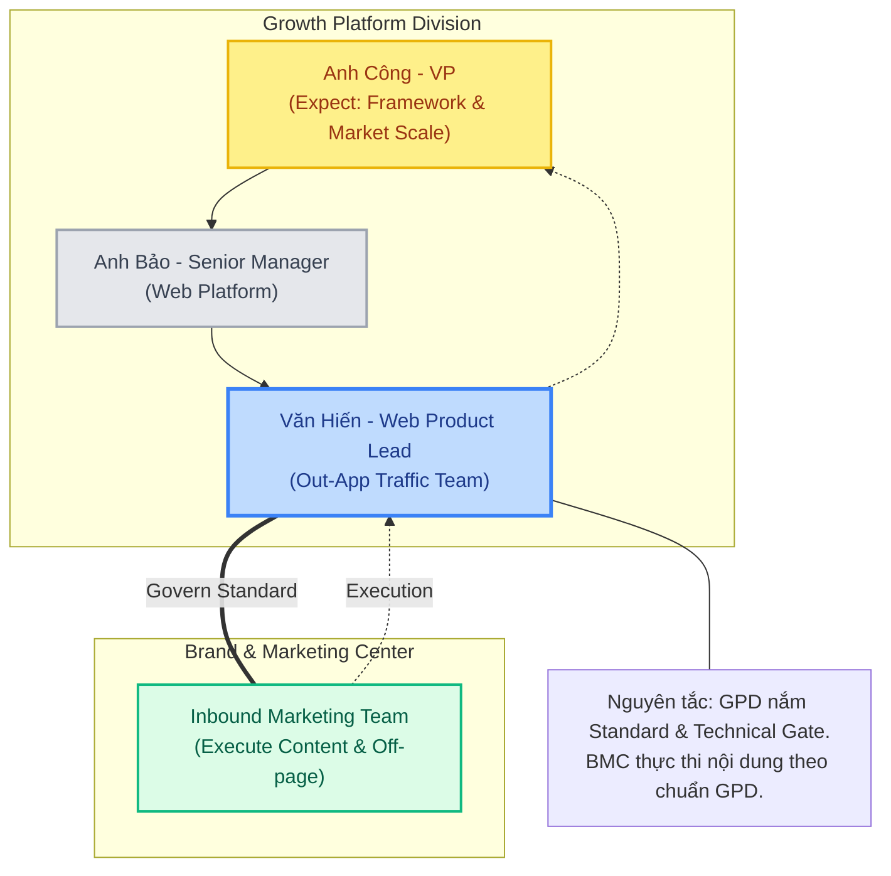
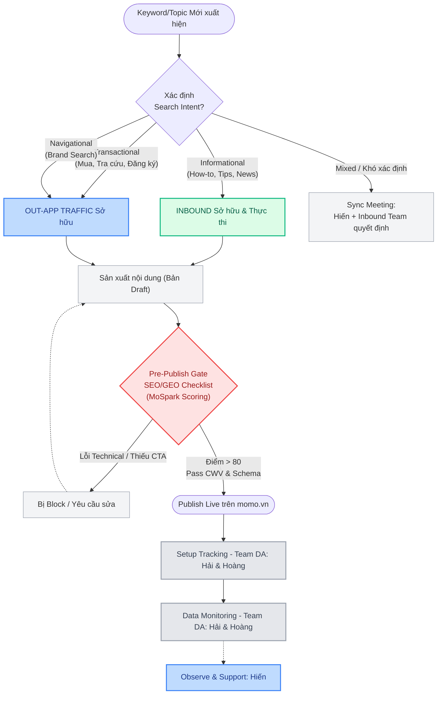

# 🚀 Hienho Master Doc (Step 1)
> Version: 4.3 | Last updated: 2026-05-28 | Maintained by: Văn Hiến

## 📑 MỤC LỤC

1. [Thông tin cá nhân & Bộ phận](#1-thông-tin-cá-nhân--bộ-phận)
   - 1.1 Profile
   - 1.2 Trách nhiệm lõi
   - 1.3 Collaboration Model: GOVERN - BUILD - EXECUTE
   - 1.4 Ownership Map
   - 1.5 Prioritization Framework
   - 1.6 Stack & Tools
   - 1.7 Core Values & Working Principles
2. [Các team làm việc chung](#2-các-team-làm-việc-chung)
3. [Mục tiêu Team & Doanh nghiệp](#3-mục-tiêu-team--doanh-nghiệp)
4. [Quy trình làm việc](#4-quy-trình-làm-việc)
5. [Dự án đang triển khai](#5-dự-án-đang-triển-khai)
6. [Leadership Intelligence](#6-leadership-intelligence)
7. [Changelog](#7-changelog)

---

## 1. THÔNG TIN CÁ NHÂN & BỘ PHẬN

### 1.1 Profile

| Field | Detail |
|-------|--------|
| Tên | Văn Hiến |
| Vai trò | Web Product Lead |
| Bộ phận | Out-App Traffic Team |
| Division | Growth Platform Division (GPD) |
| Domain sở hữu | momo.vn (web channel) |
| Kinh nghiệm | 7 năm (Web Construction, SEO/GEO, Product Growth) |
| Background | Fintech |

### 1.2 Trách nhiệm lõi

**GOVERN Model - Định nghĩa:**
- **Hiến = Govern + Execute Research/Specification, không Execute Implementation**
- Execute (Hiến): Market Sizing, Keyword Research, Brief writing, Checklist creation, Specification, Audit pre-launch, Post-launch monitoring, AI Skill Hub curation
- Không execute (delegate): Product implementation, Prototype/demo build, Production deployment, Content creation, Agency operational execution

**Platform Health & Governance (Lõi):**
- Đảm bảo momo.vn khỏe mạnh, sạch sẽ về Technical SEO và Content Foundation
- Set standard và audit mọi hoạt động SEO/GEO trên web - dù ai thực hiện (Inbound, Agency qua Inbound)
- Hiến là người **governs** (set standard, audit, specify research) - không phải người **implement** trực tiếp
- Agency không access trực tiếp momo.vn - mọi hoạt động đều qua Inbound Review & Execution
- Hiến đảm bảo Tech Foundation và Content Foundation được tuân thủ chặt chẽ

**Scope quản lý:**
- **Phạt Nguội (CEO Mandate):** Use Case duy nhất Hiến sở hữu toàn diện từ Research đến Content Execution.
- **Publish Gate (Standardization):** Chuẩn hóa và Audit mọi trang được publish trên momo.vn (dù do Inbound hay Cell Team thực hiện).
- Technical Foundation: On-page, Technical SEO, Schema, URL governance, Crawl quality, Sitemap
- Content Foundation: Foundation Checklist, SEO/GEO Guideline, YMYL Guideline - áp dụng cho Inbound và Agency (qua Inbound)
- Tracking: Define standard, observe và support team DA (Hải/Hoàng) thực hiện setup chuẩn cho mọi Use Case
- **MoSpark Content Architecture**: Quản trị 7 cụm trang chính qua biến định danh `Project` (Tag-based), xóa bỏ Silo của hệ thống cũ
- **GenAI Skill Hub**: Own toàn bộ SEO/GEO prompts, checklist, scoring logic cho AI Content Platform

**Dự án chiến lược (từ Công):**
- Web Platform (Bảo) và Out-App Traffic (Hiến) cùng chủ động triển khai
- Mọi hoạt động vẫn phải tuân theo Tech Foundation và Content Foundation do Hiến set
- Boundary với Inbound: không overlap với dự án Inbound/Agency đang triển khai
- Lý do: nhân lực Out-App Traffic có giới hạn - không ôm execution của Inbound

**KPIs:**
- Organic Traffic, Keyword Ranking, New User, MAU, MEU từ web channel (momo.vn)
- Web-to-App pipeline: Organic Traffic → Onelink → App Install → Register → KYC → Cashin → MAU
- GEO/AEO: MoMo được cite trong Google AI Overview, ChatGPT, Perplexity cho target queries tài chính

### 1.3 Collaboration Model: GOVERN - BUILD - EXECUTE

Hệ thống vận hành dựa trên tam giác phối hợp chặt chẽ:

1.  **Hiến (GOVERN Standard):**
    *   Đầu vào kỹ thuật: Define SEO/GEO requirements, Brief sản phẩm.
    *   Kiểm soát chất lượng: Review trước khi live, Sign-off Foundation Checklist.
    *   Điều phối Stakeholders: Là điểm kết nối duy nhất giữa Inbound và Web Platform.

2.  **Web Platform (BUILD Product):**
    *   Nhận spec trực tiếp từ Hiến và thực thi (Sprint → Build → Deploy).
    *   Không làm việc trực tiếp với Inbound/Agency.

3.  **Inbound Team (EXECUTE Content):**
    *   Sản xuất nội dung (Blog, Off-page) theo Brief của Hiến.
    *   Thực hiện submit content lên hệ thống.
    *   Agency (nếu có) phải qua Inbound review trước khi Hiến audit cuối cùng.

> **Rule:** Inbound không làm việc trực tiếp với Web Platform - mọi yêu cầu kỹ thuật PHẢI qua Hiến.

### 1.4 Ownership map

| Nhóm hoạt động | Ownership | Ghi chú |
|----------------|-----------|---------|
| SEO/GEO strategy & governance | Văn Hiến | Set standard, audit - không execute trực tiếp |
| Technical Foundation (audit & standard) | Văn Hiến | On-page, Schema, URL governance, Crawl quality, Sitemap |
| Content Foundation Checklist - sign-off | Văn Hiến | Gate bắt buộc trước khi publish, kể cả content của Inbound/Agency |
| SEO/GEO consult cho Cell Team | Văn Hiến | Tư vấn Sitemap, Content Structure, pSEO |
| Foundation Checklist training cho Inbound | Văn Hiến | Đảm bảo Inbound hiểu và tuân thủ chuẩn |
| Tracking (GA4/Appsflyer) | DA (Hải/Hoàng) | Hiến set tracking standard, DA chịu trách nhiệm setup đến execute |
| Tracking (Umami) | Thuận | Quản lý và triển khai toàn bộ hệ thống Umami |
| Web-to-App conversion optimization | Văn Hiến | |
| Web Platform liaison (technical request) | Văn Hiến → align trực tiếp Bảo | |
| SEO Inventory - chuẩn đánh giá market share | Văn Hiến | |
| GenAI Skill Hub - prompts, checklist, scoring | Văn Hiến | Own toàn bộ SEO/GEO prompts + checklist cho AI Content Platform |
| Content Ownership - Phạt Nguội | Văn Hiến | CEO Mandate - Use Case duy nhất Hiến thực thi nội dung |
| Content Ownership - Use Cases khác | Inbound | Vay Nhanh, VTS, Insurance... đều do Inbound thực thi |
| Publish Gate | Văn Hiến | Sign-off cuối cùng cho mọi trang trước khi Live |

### 1.5 Prioritization Framework

Khi có nhiều workstream cạnh tranh bandwidth, Hiến ưu tiên theo 2 tiêu chí:

1. **Market Search Potential** - Use Case có search demand đủ lớn, đáng đầu tư
2. **Company Direction (Financial)** - Gắn với chiến lược tài chính của MoMo (Credit, Insurance, BNPL)

### 1.6 Stack & Tools

| Nhóm | Tools |
|------|-------|
| Analytics | GA4 (G-02G70QKZ26), GSC, Umami (Real-time), Looker Studio |
| Tag Management | GTM OutApp (GTM-P9JDDJZ), GTM InApp (GTM-5TCGRPX) |
| Attribution | Appsflyer (momoapp.onelink.vn) |
| CMS | MoSpark (Software as a Product) - CMS + Admin Tool + GenAI Pipeline |
| Deployment | [Internal / MoSpark Platform] |
| Tracking standard | GA4 + GTM (marketing attribution) + Appsflyer (attribution) - synced to BigQuery |

### 1.7 Core Values & Working Principles

Các giá trị cốt lõi định hướng cách vận hành và ra quyết định trong vai trò Web Product Lead:

| Giá trị cốt lõi | Nguyên tắc & Hành động thực tế |
|-----------------|--------------------------------|
| **Market-driven** | Luôn bắt đầu từ nhu cầu thị trường. Đánh giá ưu tiên dự án dựa trên **Market Search Potential**. Áp dụng **SEO/GEO Inventory** và **JTBD Analysis** để xác định cơ hội, định hướng Web Products thu hút high-intent traffic. |
| **Ownership** | Chủ động xác định phạm vi và ưu tiên công việc theo mô hình **Govern**. Nắm giữ và duy trì hệ thống quản trị, đặc biệt là Technical & Content Foundation Gate. |
| **Builder Mindset** | Không chỉ phân phối sản phẩm mà tập trung xây dựng hệ thống có khả năng scale. Trực tiếp tham gia đồng phát triển (co-build) các công cụ và frameworks trên **MoSpark Platform**. |
| **Data-first** | Mọi đề xuất chiến lược đều dựa trên dữ liệu. Vận hành chuyên sâu các hệ thống đo lường (GA4, GSC, GTM, BigQuery) và tối ưu hóa phễu chuyển đổi Web-to-App. |
| **AI-first Mindset** | Tích hợp sâu AI vào quy trình sản xuất (GenAI Content Pipeline) và đi đầu chiến lược GEO/AEO để tối ưu hiển thị trên các nền tảng AI mới. |
| **Collaborative** | Đóng vai trò Web Product Consultant, kết nối hiệu quả giữa Web Platform, Inbound Team và các BU nội bộ để triển khai sản phẩm đúng chuẩn. |
### 1.8 Mục tiêu Phát triển Bản thân (Individual Development Plan - IDP)

**Tên tổng thể: Định hướng trở thành Chuyên gia Sản phẩm AI (AI Product Manager/Lead) cho Nền tảng Web**

Nhằm đáp ứng sự bùng nổ của trí tuệ nhân tạo và chiến lược mới của GPD, mục tiêu phát triển cá nhân của Văn Hiến tập trung vào việc ứng dụng AI để làm mấu chốt tăng trưởng, thông qua 3 trục cốt lõi:

*   **1. Quản trị Sản phẩm bằng Trí tuệ nhân tạo (AI-Driven Product Management):**
    *   *Mục tiêu:* Nâng cấp từ làm Sản phẩm Web (Web Product) truyền thống sang làm Sản phẩm AI (AI Product).
    *   *Hành động:* Trực tiếp xây dựng và tối ưu các lõi công nghệ AI trên nền tảng MoSpark (như GenAI Content Engine, RAG Knowledge Base, công cụ Automation). Dùng sức mạnh của AI để rút ngắn thời gian ra mắt chiến dịch và tự động hóa phễu chuyển đổi Web-to-App.

*   **2. Làm chủ Kỷ nguyên Tìm kiếm AI (GEO/AEO Leadership):**
    *   *Mục tiêu:* Tiên phong dẫn dắt mảng Tối ưu hóa Công cụ Tìm kiếm AI (GEO/AEO) tại MoMo.
    *   *Hành động:* Xây dựng bộ tiêu chuẩn (AI Crawler Policy, định dạng Answer-first). Triển khai hệ thống file `llms.txt` và các cấu trúc dữ liệu đặc thù để đảm bảo sản phẩm của MoMo luôn được các AI Engines (ChatGPT, Perplexity, Gemini) đọc hiểu và ưu tiên trích dẫn (citation).

*   **3. Tư vấn Tăng trưởng bằng AI (AI-Led Growth & Consulting):**
    *   *Mục tiêu:* Trở thành đối tác tư vấn chiến lược AI-First cho các Khối Kinh Doanh (Cell Teams/BU).
    *   *Hành động:* Gói gọn các giải pháp AI và Product-Led Growth (PLG) thành cẩm nang dễ hiểu. Trực tiếp tư vấn cho các BU cách ứng dụng công nghệ AI vào sản phẩm Web để bứt phá lưu lượng truy cập (Traffic) và người dùng mới (DLU) với chi phí rẻ nhất.

---

## 2. OKRS 2026 - WEB PRODUCT LEAD

> 📑 **Tài liệu chi tiết:** [Web Product Lead - Strategic & OKRs H2 2026](file:///Users/hienhv/HienHv/Klaus/Hienho_MoMo-Base/01_STRATEGIC_PLAN/product-lead.md)

### 2.1 Đề xuất OKR H2/2026

#### **OKR 1**
**Mục tiêu (Objective): Xây dựng giải pháp tăng trưởng và thúc đẩy mục tiêu tăng trưởng Web Traffic và MAU**
*Tập trung thúc đẩy lưu lượng truy cập tự nhiên (Web Traffic) và tối ưu hóa tỷ lệ chuyển đổi Web-to-App để gia tăng lượng người dùng mới (New User/MAU) một cách minh bạch thông qua các nhóm dự án:*

**Mô tả các kết quả cần có để đạt được mục tiêu:**
- **Web Platform Project:** Triển khai các dự án do Web Platform trực tiếp làm Owner: Đạt **Top 3 Ranking** cho nhóm từ khóa Phạt Nguội; scale-up Local SEO cho **500 Merchant Pages** (phát triển các trang Merchant Detail và Merchant Listing định hướng Location Page giải quyết JTBD từ PLG Project).
- **5 Web Hubs Architecture:** Tập trung xây dựng 5 Web Hubs cốt lõi làm nền tảng phục vụ theo nhóm đối tượng (Merchant Hub, Cinema Hub, Vehicle Hub, Financial Hub/Finhub, Student Hub). Mỗi Hub phục vụ một đối tượng chuyên biệt (Trang cửa hàng đối tác, Nhu cầu xem phim, Biển số xe, Nhu cầu tài chính, MSSV/Email sinh viên), cho phép mở rộng hàng loạt sản phẩm & use cases được hỗ trợ trực tiếp từ Hub.
- **Các dự án của Cell Team:** Các dự án Cell Team (Vehicle Hub, Cinema, eSIM, Bảo hiểm Ô tô) - ngoại trừ các dự án Inbound tham gia - đóng góp **3.0M PageViews/tháng**.
- **Overall Web-to-App Funnel:** Tối ưu phễu Web-to-App tổng thể và scale-up traffic hướng tới mục tiêu đột phá đạt **1.0M MAU/tháng** vào cuối H2/2026 (lũy kế H2 đạt **>4.0M MAU**), đạt tỷ lệ chuyển đổi trung bình **>10%** (hướng tới target **12.5%**).
- **User Growth:** Phối hợp cùng User Growth triển khai dự án Ads Website đóng góp **>20K New Users** (REG) và **>14K New User MAU** thực tế.
- **Financial Authority:** Hướng tới mục tiêu xây dựng toàn bộ hệ thống Utilities Tools về Finance tại MoMo thông qua việc phát hành thành công bộ **10 công cụ giả lập tài chính Finhub**.

#### **OKR 2**
**Mục tiêu (Objective): Xây dựng và phát triển MoSpark trở thành nền tảng AI-Powered trong hoạt động GenAI Content**
*Định hình MoSpark làm hạ tầng lõi tự động hóa năng lực phát triển Web và sản xuất nội dung cho toàn nền tảng thông qua các sản phẩm:*

**Mô tả các kết quả cần có để đạt được mục tiêu:**
- **PLG Project:** Vận hành nền tảng quản trị **Topic Cluster**; ứng dụng GenAI để sản xuất nội dung theo **Content Plan** nhằm phục vụ mục tiêu tăng trưởng **Ranking & Traffic (PageViews)**.
- **GenAI Content:** Áp dụng các Model AI để sản xuất đa dạng định dạng nội dung, cắt giảm tối đa thời gian sản xuất, đảm bảo chuẩn business context và luôn tối ưu chi phí token.
- **Merchant-Led Growth:** Xây dựng chiến lược tăng trưởng thông qua các trang **Location Listing (Merchant Listing)** giải quyết JTBD từ **PLG Project** cho **500 Merchant Pages**.
- **Ads Manager & Utilities Tool:** Khai thác quảng cáo và điều phối hiển thị Dynamic placement banner tự động theo ngữ cảnh; phát triển các công cụ tiện ích/widget tra cứu (Calculator, Simulator tính lãi suất/trả góp, và tiện ích theo dõi Giá Vàng) làm phễu gián tiếp dẫn lưu lượng về các dịch vụ tài chính (Tiết kiệm, Đầu tư).
- **SEO/GEO Score & Quality Gate:** Đảm bảo 100% nội dung AI sinh ra đạt điểm số chất lượng ≥ 80 điểm (không lỗi Core Web Vitals, không trùng lặp/lỗi SEO) trước khi xuất bản.

#### **OKR 3**
**Mục tiêu (Objective): Thiết lập quy chuẩn vận hành, quản trị an toàn thông tin & sức khỏe tên miền (Technical & Content Governance)**
*Thiết lập quy chuẩn kỹ thuật, ban hành tài liệu hướng dẫn và thực hiện kiểm duyệt nghiêm ngặt nhằm duy trì sức khỏe tối ưu cho Website thông qua các hoạt động:*

**Mô tả các kết quả cần có để đạt được mục tiêu:**
- **Platform Guideline:** Ban hành đầy đủ các tài liệu hướng dẫn và quy chuẩn kỹ thuật (SEO/GEO, tracking) giúp các Cell Teams triển khai dự án độc lập đúng tiêu chuẩn của Web Platform.
- **Quality Gate:** Thực hiện kiểm duyệt kỹ thuật & nội dung nghiêm ngặt 100% dự án Web mới trước khi Go-live, đảm bảo tiêu chuẩn Agent-Led Search Readiness (Schema markup, E-E-A-T, entity, author).
- **Backlink Security:** Kiểm soát, rà quét và ngăn chặn triệt để các nguồn backlink xấu (spam links) để bảo vệ thẩm quyền tên miền (Domain Authority).
- **URL & Content Governance:** Rà soát định kỳ loại bỏ nội dung lỗi thời, duy trì độ tươi mới (**Data Freshness**) và dọn dẹp các URL không có giá trị (zero-traffic/thin content), đảm bảo tính chính xác cao để AI Agents dễ cào và trích dẫn, tối ưu ngân sách cào dữ liệu (Crawl Budget).

#### **OKR 4**
**Mục tiêu (Objective): Tư vấn giải pháp tăng trưởng và thúc đẩy năng lực triển khai cho các chiến dịch & Cell Teams (Growth Advisory & Enablement)**
*Tử vấn thiết kế luồng chuyển đổi, sitemap, hiệu suất và áp dụng các framework tăng trưởng (SPA) để hỗ trợ đối tác nội bộ vận hành độc lập:*

**Mô tả các kết quả cần có để đạt được mục tiêu:**
- **Conversion Performance Support:** Hỗ trợ Cell Teams giám sát chỉ số Web Performance (Core Web Vitals), ngăn chặn các lỗi nghiêm trọng làm suy giảm CTR/CR.
- **Web-to-App Flow (CreditTech):** Tư vấn thiết kế sitemap, cấu trúc cluster và luồng chuyển đổi W2A cho các dự án Inbound phụ trách chính: **Ví Trả Sau, Vay Nhanh, Destination Promotion Hub (MoMo Travel)**.
- **Campaign & Insurance Support:** Đồng hành cố vấn giải pháp kỹ thuật, cấu trúc SEO/GEO và tối ưu chuyển đổi cho các chiến dịch/dự án do Inbound làm Owner: **Bảo hiểm Y tế (BHYT), Bảo hiểm xe máy (BHXM)**.
- **Growth Framework (SPA):** Thẩm định tính khả thi (Feasibility) và tư vấn hướng tiếp cận pSEO, cấu trúc SEO Inventory, kịch bản JTBD cho các Cell Teams theo quy trình SPA.

---

### 2.2 Đề xuất OKR & Kết quả Đạt được Thực tế H1/2026

#### **Mục tiêu 1: Tăng trưởng New User từ web organic thông qua tối ưu traffic và Web-to-App conversion**
*   **Kết quả cần có đề xuất (Proposed KRs):**
    *   **KR 1.1:** Tư vấn giải pháp SEO & Inbound cho các Use Case chiến lược ưu tiên nhóm Financial Services (Credit, Insurance, BNPL) và các Use Case có tính chiến lược của BU (như Telco, Cinema, OTA, eSIM).
    *   **KR 1.2:** Triển khai Web-to-App (Web Ads) theo campaign calendar hoặc Quick-Win Case phối hợp Cell Team khai thác các sản phẩm có CTR web-to-app cao để thiết kế luồng chuyển đổi tối ưu.
    *   **KR 1.3:** Rà soát và kiểm soát chất lượng nội dung xuất bản từ PO/Biz đảm bảo chuẩn SEO/GEO, đúng thông điệp, đúng quy trình trước khi lên production.
*   **Kết quả đạt được thực tế H1/2026 (Actual Achievements):**
    *   **Đối với KR 1.1 (Tư vấn SEO & Inbound):**
        *   *Tư vấn giải pháp tăng trưởng Web:* Triển khai giải pháp cho các Use Case quan trọng của MoMo như Ví Trả Sau, Vay Nhanh, Điểm Tín Dụng, các sản phẩm Bảo Hiểm và dịch vụ thanh toán số (Sim, eSIM, Cinema).
        *   *Thị phần tìm kiếm (Share of Voice - SoV):* Đạt mục tiêu SoV của Ví Trả Sau (54%) và Vay Nhanh (7%).
        *   *Hiệu suất truy cập Web (Web Traffic & Pageviews) trong H1/2026:* Đạt **9.3M Active Users**, **9M New Users**, **9.4M Total Users** và **19M Views**.
        *   *Hiệu suất Tiếp cận và Tìm kiếm Tự nhiên (Search Reach & Organic Traffic) trong H1/2026:* Tổng lưu lượng tìm kiếm tự nhiên mang lại **5.934.051 Clicks** và **206.288.717 Impressions** (CTR trung bình đạt 2.88%). Trong đó, các dự án đóng góp chính: Cinema (2.010.041 clicks), Ví Trả Sau (213.379 clicks), Vay Nhanh (182.057 clicks), Bảo hiểm (91.699 clicks), Phạt Nguội (19.335 clicks).
        *   *Bảo hiểm & Khác:* Đóng gói cấu trúc Auto Insurance (MasterDoc v2, PRD docx) bảo toàn Topical Authority; hoàn tất BRD Draft cho eSIM và Bảo hiểm xe máy.
    *   **Đối với KR 1.2 (Triển khai Web-to-App & Quick-Wins):**
        *   *Hiệu suất phễu Web-to-App tổng thể (Số liệu lũy kế từ 23/04/2026 đến nay):*
            *   *Chỉ số tương tác (Engagement Metrics):* Đạt **7,56M View page** (+350,9%), **2,035M Click CTA** (+555,2% với CTR đạt 54,3%), **415,91K Login app** (+80,1%) và **246,52K MAU** (+602,8% với tỷ lệ chuyển đổi CR MAU/Login đạt 59,3%).
            *   *Phễu người dùng (Unique User Funnel):* Đạt **2.896.658 người dùng truy cập** (100% Views) -> **1.635.020 người dùng nhấn dẫn sang app** (56% Click to app) -> **415.914 người dùng đăng nhập app thành công** (14% Login app) -> **246.517 người dùng phát sinh giao dịch** (9% MAU).
            *   *Chi tiết hiệu suất theo tháng (H1/2026):*
                *   *Page views (Attention):* 2.601.280 (Jan) | 3.470.470 (Feb) | 3.221.705 (Mar) | 2.699.883 (Apr) | 3.273.707 (May) | 3.311.429 (Jun, MoM +1.2%).
                *   *Sessions (Attention):* 1.930.821 (Jan) | 2.373.734 (Feb) | 2.347.190 (Mar) | 1.859.048 (Apr) | 2.330.499 (May) | 2.451.799 (Jun, MoM +5.2%).
                *   *MEU (Interest - Monthly Engagement Users):* 1.397.453 (Jan) | 1.755.757 (Feb) | 1.686.392 (Mar) | 1.427.165 (Apr) | 1.706.739 (May) | 1.675.301 (Jun, MoM -1.8%).
                *   *Click-to-App (Desire):* 964.893 (May) | 824.309 (Jun, MoM -14.5%).
                *   *Login App (Action):* 180.148 (May) | 248.468 (Jun, MoM +37.9%) [Trong đó, Existing users: 178.152 (May) -> 242.409 (Jun, MoM +36.1%); Install App: 1.996 (May) -> 6.059 (Jun, MoM +203.5%)].
        *   *Dự án Ads Website (New to MoMo - Nhiều Scheme trên Web qua Ads Manager):* Phối hợp cùng User Growth triển khai dự án Ads Website thúc đẩy New User trên Website thông qua các schema "New To MoMo" mang lại kết quả phễu chuyển đổi thực tế trong H1/2026: **36.867 Installs** -> **16.690 Registrations** (REG) -> **9.800+ Bank Mappings** (Map Bank) -> **7.000+ MAU**.
        *   *Popup Ads - Billpay:* Triển khai thành công trên 22 pages chiến lược với cơ chế phân phối bậc (tiered placement), đã đo lường và hoàn thành đóng dự án.
        *   *Chuẩn hóa Onelink:* Tham gia chuẩn hóa hệ thống Onelink trên Website nhằm mục tiêu đo lường end-to-end từ Out-App -> Website -> App và nonApp. Giải quyết dứt điểm các lỗi đo lường sai lệch trong hệ thống báo cáo.
    *   **Đối với KR 1.3 (Rà soát & kiểm soát chất lượng):**

#### **Mục tiêu 2: Xây dựng nền tảng MoMo.vn ổn định và định hướng GEO/AEO-First**
*   **Kết quả cần có đề xuất (Proposed KRs):**
    *   **KR 2.1:** Đảm bảo hệ thống website vận hành ổn định và có nền tảng kỹ thuật chuẩn bao gồm chuẩn hóa quy trình xuất bản nội dung qua Admin Panel, hoàn thiện luồng làm việc giữa Inbound/WebPlatform và Cell Team, xây dựng tài liệu SOP kiểm duyệt nội dung.
    *   **KR 2.2:** Xây dựng hệ thống tracking full-funnel Web-to-App (New/Current User), chuẩn hóa toàn bộ Onelink/Universal Link + UTM trên mọi CTA, triển khai A/B Testing.
    *   **KR 2.3:** Rà soát và Audit Website đảm bảo hiệu suất, các cập nhật thuật toán từ google, AI trending, budget crawl.
    *   **KR 2.4:** Xây dựng GEO Checklist Framework (citability scoring, answer-first format, AI crawler policy) và áp dụng vào quy trình sản xuất nội dung đảm bảo momo.vn sẵn sàng cho AI Search.
*   **Kết quả đạt được thực tế H1/2026 (Actual Achievements):**
    *   **Đối với KR 2.1 (Vận hành ổn định & SOP):**
        *   *Cố vấn và Vận hành Chiến dịch (Campaigns):* Tham gia tư vấn, triển khai, vận hành và tối ưu hóa SEO/GEO cho các chiến dịch Mega lớn của công ty là **Lắc Xì H1/2026** và **Mega Summer 2026**.
        *   *MoSpark CMS Migration:* Đưa hệ thống MoSpark CMS vào hoạt động (Platform Ready), tích hợp sẵn Umami và GenAI content pipeline. Đang onboard LP Builder cho GPD.
        *   *Quy trình biên tập:* Xác lập Workflow content 7 bước và 3 approval gates để phân định rõ vai trò verify (Hiến) vs publish (Content Team).
    *   **Đối với KR 2.2 (Tracking & UTM):**
        *   *Identity Platform:* Triển khai thành công hạ tầng định danh người dùng qua Edge Cookie & Edge Middleware, hỗ trợ stitch chính xác hành vi người dùng ẩn danh từ Web tới giao dịch trên App.
    *   **Đối với KR 2.3 (Audit Website & Crawl Budget):**
        *   *Zero-Traffic URL Clean-up:* Rà soát và xử lý loại bỏ **hơn 3.000 URL không có giá trị** (chính xác là 3.670 URLs rác trên 16 Use Cases gồm OA, Bus, Cinema và News) nằm rải rác ở từng Cell Team để dọn dẹp crawl waste, tối ưu hóa Crawl Budget của Googlebot.
        *   *Quy tắc quản trị:* Đưa ra bộ quy tắc xử lý ngắn hạn và dài hạn cho URL Governance (Sunset rule cho pSEO, chính sách 410 Gone / 301 Redirect).
        *   *Robots.txt:* Deploy thành công nâng cấp Lớp 1 (`Disallow: /*?`), chặn query string spam, bảo vệ crawl budget cho Googlebot.
    *   **Đối với KR 2.4 (GEO Checklist & AI Overviews):**
        *   *SEO/GEO Scoring Gate:* Hoàn tất BRD v1.1 tích hợp công thức chấm điểm 5 block (100 điểm) trực tiếp vào CMS MoSpark để kiểm soát chất lượng.
        *   *AI Crawler Policy:* Xây dựng cấu trúc file `llms.txt` và bắt đầu chạy thử nghiệm (pilot) trên dự án Phạt Nguội.

#### **Mục tiêu 3: Xây dựng các sản phẩm web PLG/Utilities-led SEO để tăng trưởng DLU/MAU bền vững**
*   **Kết quả cần có đề xuất (Proposed KRs):**
    *   **KR 3.1:** Phối hợp Web Platform/PO/Biz xây dựng các MiniWeb và Utility Tools trên momo.vn theo mô hình Product-led Growth, tập trung vào nhóm Financial Services để tạo quick win. Ví dụ: công cụ kiểm tra điểm CIC, tính lãi suất vay, so sánh gói bảo hiểm ô tô/xe máy, tra cứu hạn mức Ví Trả Sau, tính phí trả góp.
    *   **KR 3.2:** Mỗi Utility Tool tự thân tạo giá trị sử dụng, thu hút organic traffic từ search intent cao, sau đó chuyển đổi thành DLU/MAU qua deeplink.
    *   **KR 3.3:** Xây dựng Pillar/Cluster Content Strategy cho nhóm Use Case Credit & Insurance, kết hợp programmatic SEO để scale. Đảm bảo mỗi sản phẩm web đều có đóng góp DLU/MAU.
*   **Kết quả đạt được thực tế H1/2026 (Actual Achievements):**
    *   **Đối với KR 3.1 (MiniWeb & Utility Tools):**
        *   *Phạt Nguội (Traffic Fines):* Triển khai thành công dự án P0 Phạt Nguội Phase 1 (Live) tích hợp API real-time từ TTDK & CSGT, bản đồ camera, tính năng đăng ký nhận cảnh báo vi phạm (Subscription).
        *   *CIC Simulator:* Xây dựng và hoàn thiện HTML Widget giả lập điểm tín dụng CIC (band 300-850) làm PLG hook.
        *   *Finhub Simulation Tools:* Thiết lập logic tính toán và thiết kế wireframe prototype cho bộ 10 công cụ tài chính cốt lõi (Gross-Net, lãi tiết kiệm, lương hưu...).
    *   **Đối với KR 3.2 (Thu hút organic traffic & Chuyển đổi DLU/MAU):**
        *   *Smart CTA & Zero-Party Data Passing:* Vận hành cơ chế nút CTA động cá nhân hóa và đóng gói truyền dữ liệu ngữ cảnh (URL parameter mã hóa) từ Web sang App để tự động điền (pre-fill) thông tin người dùng trên App MoMo.
        *   *Merchant Page Builder (O2O local SEO):* Hoàn thành chạy thử nghiệm (Pilot) 39 merchant; hoàn thiện luồng tự động tạo trang địa điểm chuẩn Local SEO từ cơ sở dữ liệu đối tác (200k+ merchant Ví Trả Sau) giúp thu hút traffic ngoài App.
    *   **Đối với KR 3.3 (Pillar Content & Programmatic SEO):**
        *   *GenAI Content Engine:* Tích hợp Claude API (Claude 3 Haiku & Claude 3.5 Sonnet) trên MoSpark Production; chạy benchmark hiệu năng và chi phí chi tiết (Haiku ~7k/bài/55s; Sonnet ~20k/bài/140s) giúp hoạch định chính xác ngân sách cho Content Plan.

---

## 3. CÁC TEAM LÀM VIỆC CHUNG

### 3.1 Org Chart - GPD



**Lưu ý quan hệ (Cập nhật 26/05/2026):**
- **Từ 01/06/2026:** Hiến (Web Product Lead) sẽ under và báo cáo trực tiếp cho Bảo (Senior Manager - Web Platform).
- Bảo = Senior Manager phụ trách Web Platform, báo cáo trực tiếp Công (VP).
- Cấu trúc team Out-App Traffic vận hành trực tiếp dưới sự dẫn dắt của Bảo.

### 3.2 Out-App Traffic (Hiến sở hữu)

| Field | Detail |
|-------|--------|
| Scope | Platform Health & Governance: Set standard, audit và kiểm soát mọi hoạt động SEO/GEO trên momo.vn dù ai thực hiện. Bổ sung T4: Quản lý mảng SEO/GEO từ Internal và Inbound |
| Model hoạt động | **Govern, không Execute** - Hiến set standard và audit. Inbound/Agency execute qua Inbound |
| Hoạt động | Technical Foundation audit, Content Foundation governance, Tracking observation & support, Strategic projects |
| KPI chính | Organic Traffic, Keyword Ranking, New User, MAU, MEU |
| Quan hệ với Web Platform | Hiến gửi technical request / SEO potential project → Bảo implement |
| Quan hệ với Inbound | Hiến là đầu mối - Inbound không làm việc trực tiếp với Web Platform |

### 3.3 Web Platform (Bảo)

| Field | Detail |
|-------|--------|
| Lead | Bảo (Senior Manager) |
| Team Structure | **Back-end:** Hiếu (Team Leader - Technical lead for Onelink Standardization), Hoài Anh (Tech Solution Lead), Duy (Senior Software Engineer)<br>**Front-end:** Hùng (Team Leader), Thuận, Lộc, Nhật, Trọng (Senior Software Engineer) |
| Reporting | Trực tiếp Công (VP) |
| Scope | Quản lý, tư vấn Cell Team xây dựng sản phẩm trên Web theo tiêu chuẩn product design |
| Trách nhiệm | Vận hành nền tảng web, tăng trưởng Web-to-App, standardize tracking (truth of source) |
| Tools | Xây dựng công cụ cho Out-App Traffic / Cell Team / Inbound vận hành nội dung |
| KPI chính | Web-to-App conversion, New User, MAU, MEU (chung với GPD) |

### 3.3b Phân Công Dự Án Trọng Điểm & PIC (Web Platform)

| Thành viên | Vai trò chuyên môn | Dự án phụ trách chính (Primary Project) | Hạng mục chi tiết in-charge | Tài liệu / Quy chuẩn liên quan |
| :--- | :--- | :--- | :--- | :--- |
| **Bảo** | Senior Manager \| MoSpark Platform Owner | MoSpark Platform (All Projects) | Quản lý và sở hữu toàn bộ các dự án thuộc MoSpark (CMS V2, Ads Manager, LDP Builder, Widget Store). | [mospark_master.md](file:///Users/hienhv/Documents/Obsidian_Vault/hovanhien_knowledgebase_momo/04_MOSPARK_PLATFORM/mospark_master.md) |
| **Hiến** | Web Product Lead \| Foundation & Platform | Web Platform & Foundations | Tham gia chi tiết thiết lập Foundation & Platform bao gồm: GenAI, Microsite/Merchant Page (phục vụ SEO/GEO), Phân quyền, Utility (Widget Store) nhằm tăng MEU/MAU. | [hienho_master_doc.md](file:///Users/hienhv/Documents/Obsidian_Vault/hovanhien_knowledgebase_momo/00_HARNESS_CORE/hienho_master_doc.md) |
| **Tuấn** | Product Designer | MoSpark Blog UI/UX Redesign | Thiết kế giao diện Blog Home & Detail, Ads Placements và AI Summarize block. | [mospark_blog_redesign.md](file:///Users/hienhv/Documents/Obsidian_Vault/hovanhien_knowledgebase_momo/04_MOSPARK_PLATFORM/mospark_blog_redesign.md) |
| **Hùng** | Front-End Team Leader \| MoBase Owner | MoBase (Design System) | Chịu trách nhiệm phát triển và quản trị MoBase (Design System của MoMo Web). | [web-momo-okrs-2026.md](file:///Users/hienhv/Documents/Obsidian_Vault/hovanhien_knowledgebase_momo/01_STRATEGIC_PLAN/web-momo-okrs-2026.md#L66) |
| **Nhật** | Senior FE Developer | Merchant Page (O2O & VTS Hub) | Triển khai template danh mục, Editor cho Merchant, tích hợp custom fields (Chatbot KB) và tính năng CRUD. | [doi-tac-brd.md](file:///Users/hienhv/Documents/Obsidian_Vault/hovanhien_knowledgebase_momo/05_USE_CASE_MOMO/doi-tac-brd.md) |
| **Thuận** | Senior FE Developer | MoSpark Distribution, Tracking & MoSpark Studio | Build nền tảng quản lý/phân phối trên MoSpark (Ads & Widget). Đối với Merchant Page, Thuận chịu trách nhiệm triển khai đo lường Umami và tích hợp các Widget tương tác (như Map Widget, Widget tìm điểm VTS). Owner phần MoMo Gallery và MoSpark Multimodal Studio (phát triển các Node xử lý Image/Video GenAI thông qua ComfyUI backend). Kéo API GA4/GSC từ BigQuery. | [mospark_ads_manager.md](file:///Users/hienhv/Documents/Obsidian_Vault/hovanhien_knowledgebase_momo/04_MOSPARK_PLATFORM/mospark_ads_manager.md), [mospark_genai_content.md](file:///Users/hienhv/Documents/Obsidian_Vault/hovanhien_knowledgebase_momo/04_MOSPARK_PLATFORM/mospark_genai_content.md), [widget-store-prd.md](file:///Users/hienhv/Documents/Obsidian_Vault/hovanhien_knowledgebase_momo/08_PRD/widget-store-prd.md) |
| **Trọng** | Senior FE Developer | GenAI Content Platform (Text/Logic) | Quản lý GenAI pipeline workflow, sinh bài mô tả chuẩn SEO, Text/Logic Node Backend và bóc tách dữ liệu có cấu trúc (Chatbot KB) cho Merchant Editor. | [mospark_genai_content.md](file:///Users/hienhv/Documents/Obsidian_Vault/hovanhien_knowledgebase_momo/04_MOSPARK_PLATFORM/mospark_genai_content.md) |
| **Lộc** | Senior FE Developer | CMS Access Control & Permissions | Phân quyền user access trong CMS MoSpark và bảo mật giao diện Admin Panel. | [mospark_permission.md](file:///Users/hienhv/Documents/Obsidian_Vault/hovanhien_knowledgebase_momo/04_MOSPARK_PLATFORM/mospark_permission.md) |
| **Hiếu** | Back-End Team Leader \| Widget Lead | Widget Management & Tracking | Làm chính về UI/UX/Dev cho Widget Management. Đồng bộ Onelink, tracking parameters (`wui`), cấu hình GA4/GTM/Umami và đối soát BigQuery. | [mospark_widget_store.md](file:///Users/hienhv/Documents/Obsidian_Vault/hovanhien_knowledgebase_momo/04_MOSPARK_PLATFORM/mospark_widget_store.md), [mospark_user_identity_tracking.md](file:///Users/hienhv/Documents/Obsidian_Vault/hovanhien_knowledgebase_momo/04_MOSPARK_PLATFORM/mospark_user_identity_tracking.md) |
| **Hoài Anh** | Tech Solution Lead | MoSpark Core Backend & API | Thiết kế database Supabase, cổng YARP API Gateway, API đồng bộ M4B và backend Widget Store. | [mospark_master.md](file:///Users/hienhv/Documents/Obsidian_Vault/hovanhien_knowledgebase_momo/04_MOSPARK_PLATFORM/mospark_master.md) |
| **Duy** | Senior BE Developer | Chatbot & Backend API | Chịu trách nhiệm hệ thống Chatbot, RAG Knowledge Base Sync từ MoSpark và backend API cho các microsites. | [mospark_master.md](file:///Users/hienhv/Documents/Obsidian_Vault/hovanhien_knowledgebase_momo/04_MOSPARK_PLATFORM/mospark_master.md) |

### 3.4 Inbound Marketing (thuộc BMC)

| Field | Detail |
|-------|--------|
| Lead | Inbound Team Lead (Vacant) |
| Team Structure | **Ngọc Hạnh (Senior SEO):** Phụ trách SEO cho Ví Trả Sau, Vay Nhanh; Technical Audit; Off-Page |
| Division | BMC (Brand & Marketing Center) - không thuộc GPD |
| Scope | SEO tư vấn (Plan / Blog / Off-page) - tiền thân của Out-App Traffic |
| Cơ chế | BU reach tới Inbound để tư vấn, Inbound chọn Use Case theo chiến lược BMC |
| KPI | SLA và KPI riêng theo cam kết với từng BU |
| Boundary với Hiến | Inbound không làm việc trực tiếp với Web Platform - phải thông qua Hiến |
| Foundation Checklist | Inbound phải tuân thủ - đây cũng là checklist Inbound input và cung cấp. Sign-off: Hiến |
| FS commitment | Vay Nhanh / Ví Trả Sau / CIC: Inbound cam kết Traffic/Ranking |

### 3.5 Cell Team Matrix (theo Business Unit)

Mỗi Cell Team tiếp cận Hiến theo framework: **Research → Build Web/Function → Content Production → Tracking → Evaluation**

| BU | Use Case | Workstream với Hiến | Workstream với Inbound | Status |
|----|----------|--------------------|-----------------------|--------|
| FS | Vay Nhanh | Tech Web (Build/Revamp) + SEO/GEO consult | SEO Ranking cam kết | Active |
| FS | Ví Trả Sau | Tech Web + SEO/GEO consult | SEO Ranking cam kết | Active |
| FS | CIC | Tech Web + SEO/GEO consult | SEO Ranking cam kết | Active |
| FS - Insurtech | BH xe máy | Build/optimize web - tăng GMV + SEO/GEO consult | Off-page ranking | Active |
| FS - Insurtech | BH ô tô vật chất | Build/optimize web - tăng GMV + SEO/GEO consult | Off-page ranking | Active |
| FS - Insurtech | BH y tế (BHYT) | Build/optimize web + SEO/GEO consult | Off-page ranking | Active |
| FS - Insurtech | BH xã hội (BHXH) | Chuẩn bị landing page + tracking trước launch | - | Sắp ra mắt (~10 ngày) |
| MDS | Movies (Cinema) | Monitor kỹ thuật + hiệu suất | - | Passive |
| MDS | Bus (OTA) | Monitor kỹ thuật + hiệu suất | - | Passive |
| PS - UTI | Sim số đẹp / eSIM du lịch | Đã roll out, chưa có growth plan | - | Pending |
| PS - UTI | Tra cứu phạt nguội | Build Mini Web (có tra cứu) + Blog Content | - | Active |
| GPD Internal | QLCT (Quản Lý Chi Tiêu) | SEO/GEO - tăng ranking/traffic | - | Active |

**Cell Team structure (mỗi team):**

| Role | Nhiệm vụ |
|------|----------|
| PO (Product Owner) | Roadmap, prioritization, stakeholder alignment |
| Growth/Business | KPI ownership, experiment design, business case |
| Dev | Technical implementation, feature deployment |
| DA (Data Analyst) | Data pipeline, reporting, SQL/BigQuery |
| Legal | Review nội dung tài chính, compliance YMYL |

### 3.6 Danh mục sản phẩm MoMo trên Web (theo SEO Inventory)

> Dùng làm reference khi consult Cell Team hoặc đánh giá market share.

| Nhóm | Sản phẩm / Use Case | Trạng thái (Status) | Loại | SoV MoMo | Market Volume/tháng |
|------|---------------------|---------------------|------|----------|---------------------|
| Vay & Cho vay | Vay Nhanh | In Progress - Execution Phase | Chủ lực | 6% | 4.375.800 |
| BNPL | Ví Trả Sau | Active | Chủ lực - Market Leader | 54% | 135.290 |
| Tín dụng | Điểm tín dụng (CIC) | Active | Đã hoàn thành 2 công cụ (Tra cứu & Nâng điểm) | 0% | 96.790 |
| Tín dụng | Mở thẻ tín dụng | - | Sản phẩm phụ | - | 600.900 |
| Bảo hiểm | BH xe máy | Draft | Chủ lực - Mua trực tiếp | 38% | 58.810 |
| Bảo hiểm | BH ô tô vật chất | Active | Chủ lực - Mua trực tiếp | 0% | 74.000 |
| Bảo hiểm | BH y tế (BHYT) | On Track | Chủ lực - Mua trực tiếp | 0% | 1.415.740 |
| Bảo hiểm | BH xã hội (BHXH) | Sắp ra mắt | Chủ lực | - | 938.090 |
| Bảo hiểm | BH nhân thọ & khác | - | Cổng thanh toán | - | ~19.780 |
| Đầu tư | Chứng khoán (CVS) | - | Chủ lực - Mini App | 0% | 3.000.000 |
| Đầu tư | Chứng chỉ quỹ | - | Chủ lực | - | ~12.000 |
| Đầu tư | Giá vàng | Draft - Chờ pre-conditions | Tiện ích tài chính | 0% | 84.000.000 |
| Tiết kiệm | Gửi tiết kiệm | - | Chủ lực | 0% | 209.000 |
| Dịch vụ công | Phạt nguội | Phase 1 LIVE - Pilot & Scale | Cổng thanh toán | - | ~1.500.000 |
| Dịch vụ công | DVC Chung | Info hub - Đề án BCA | Cổng thông tin | - | - |
| Giải trí | Cinema (Phim) | Draft - Cần align PO Cell | Dịch vụ lõi | - | - |
| Du lịch | Vé xe khách (Bus) | Draft | Dịch vụ lõi | - | - |
| Viễn thông | eSIM Du lịch | Draft - chờ review PO | Sản phẩm phụ | - | - |
| Viễn thông | Telecom / Data | Active (Approved) | Chủ lực | - | - |
| B2B / SME | Soundbox | Draft - Chờ review | Công cụ thanh toán | - | - |
| B2B / SME | Quản lý Đối tác | Pilot Phase (100-500 Merchants) | B2B Portal | - | - |

---

## 4. MỤC TIÊU TEAM & DOANH NGHIỆP

### 4.1 OKR 2026 - Out-App Traffic Team

**Vision:** Scale MoMo to Vietnam's #1 financial destination (6M visitors) via an Agentic, SEO/GEO-first platform that turns underserved market needs into high-authority traffic.

**Objective 1: Accelerate MoMo’s Financial Authority to 6M Monthly Visitors**
- **KR 1.1:** Increase MUV from 3.0 M to 6.0 M (Source: BigQuery).
- **KR 1.2:** Top 3-5 ranking for 50+ high-intent "underserved" financial keywords.
- **KR 1.3:** Achieve [xx]% conversion rate for Web-to-App deep-links.
- **KR 1.4:** Measurable AI Referral Traffic (GEO) from ChatGPT/Gemini/Perplexity.

*Chi tiết roadmap: [[web-momo-okrs-2026|Web MoMo OKRs 2026]]*


#### O2 - Platform Stability & Technical Readiness

- **Outcome:** Tracking infrastructure vận hành ổn định, zero crawl waste, GEO/AEO-ready
- **Key Results (dự kiến):**
  - Zero-Traffic URL Audit hoàn thành (3,670 URLs / 16 Use Cases)
  - Schema tech debt resolved
  - GA4/GTM infrastructure refactored (17 project folders, 43 parameters, 13 wasted slots fixed)
  - GEO Checklist deployed as publishing gate

#### O3 - PLG/Utilities-Led SEO Products

- **Outcome:** DLU/MAU/MEU growth từ tool-based web pages
- **Key Results (dự kiến):**
  - CIC credit score checker launched
  - Loan calculator live
  - Insurance comparison tool live
- **North Star:** Users giải quyết được nhu cầu tài chính trên web trước khi cần vào App

### 4.2 GEO North Star

> MoMo được cite trong top 3 AI engine responses cho 20 target PFM queries trong vòng 12 tháng

- **Engines target:** Google AI Overview, ChatGPT, Perplexity
- **Current gap:** Tỉ lệ trích dẫn tổng thể còn thấp (từng ghi nhận 0% AI Chatbot referral vs Wise.com: 40%+; hiện bắt đầu có tín hiệu từ pilot Phạt Nguội).
- **Decision blockers:** Named author approval, Legal review cadence, Dev resource cho tool portfolio

### 4.3 MoMo Business KPIs liên quan đến Web

| KPI | Định nghĩa | Nguồn tracking |
|-----|-----------|----------------|
| New User | Install → Register | momoapp.onelink.vn funnel |
| MAU | Monthly Active User - Cashin event | Onelink MoMo |
| MEU | Monthly Engagement User - tương tác tính năng trong app (tra cứu, like post...) | Onelink MoMo |
| DLU | Daily Line User | PLG tool engagement |
| Organic Traffic | Sessions từ Organic channel | GA4 |
| AI Citation Rate | MoMo được cite trong AI engine responses | Manual / GEO monitoring tool |
| SoV (Search Share of Voice) | % brand search của MoMo / tổng brand search trong thị trường | Keyword tool - đo theo từng Use Case |

---

## 4. QUY TRÌNH LÀM VIỆC

### 4.1 Web Build Workflow - 9 Bước (v3.0)

**Tài liệu gốc:** MoMo_WebBuild_Workflow_2026.docx | Out-App Traffic, Growth Platform Division

**Cấu trúc team:**
- **Out-App Traffic (Hiến):** Product Owner + SEO/GEO - dẫn dắt toàn bộ quy trình từ research đến post-launch
- **Cell Team:** PO Cell, Growth/Business, Dev, DA - thực thi và bàn giao sản phẩm

**3 giai đoạn:**

| Giai đoạn | Step | Tên | Output chính | Phụ trách |
|-----------|------|-----|-------------|-----------|
| Chuẩn bị | 01 | Research & Discovery | Keyword map, competitor report, market sizing | Out-App Traffic |
| Chuẩn bị | 02 | Thiết lập Mục tiêu | KPI doc: Traffic target, CR benchmark | Out-App Traffic + PO Cell |
| Chuẩn bị | 03 | Product Brief + Tracking Plan | Brief sản phẩm (Out-App) + Event spec (PO Cell) | Out-App Traffic + PO Cell |
| Chuẩn bị | 03.5 | Feasibility Sync với Cell Team | Scope v1 xác nhận, phasing & quick win | Out-App Traffic + PO Cell |
| Xây dựng | 05 | Sprint Planning & Coding | Timeline sprint, Dev bắt đầu build | PO Cell + Dev |
| QA & Launch | 06 | SEO Review + QA Testing | SEO checklist pass, luồng QA approved | Out-App Traffic + Dev |
| QA & Launch | 07 | Staging & Sign-off | Staging approved, tracking verified, PO Cell ký | Out-App Traffic + PO Cell + Dev |
| QA & Launch | 08 | Roll Out (Production) | Site live, sitemap submitted, index requested | Out-App Traffic + Dev |
| QA & Launch | 09 | Post-Launch Monitoring | Báo cáo 30/60/90 ngày, OnPage optimization | Out-App Traffic |

**Tracking ownership:**
- Web Layer events: PO Cell define, Dev gắn, Hiến tư vấn user flow
- Web → App UTM: PO Cell + Out-App Traffic verify
- App Layer (sau CTA click): DA Cell Team (Hải/Hoàng) - Out-App Traffic không execute
- Hiến và Bảo: hướng dẫn, define standard, observe - không execute tracking

**Key gates:**
- Gate 1 (Step 06): SEO checklist pass toàn bộ + QA report clear → mới vào Staging
- Gate 2 (Step 07): CWV pass (LCP<2.5s, INP<200ms, CLS<0.1) + tracking verified + PO Cell ký
- Roll Out thứ tự: Hub → Spoke → Blog (không hard launch toàn bộ cùng lúc)

**RACI tóm tắt:**

| Hoạt động | Out-App Traffic | PO Cell | Dev | DA |
|-----------|----------------|---------|-----|----|
| Research & Brief | R/A | C | I | I |
| Define Event Tracking | C | R/A | C | C |
| Sprint Coding | C | A | R | I |
| SEO Review | R/A | I | C | I |
| Web2App Tracking Handoff | C | R | R | A |
| Staging Sign-off | C | A | R | C |
| Post-Launch Monitoring | R/A | I | C | C |

### 4.2 Tracking Architecture

**Tracking stack:**

| Công cụ | Dùng cho | Owner |
|---------|----------|-------|
| GA4 + GTM | Marketing attribution, web events, funnel | DA (Hải/Hoàng) execute, Hiến define standard |
| GSC | Organic performance, indexing, keyword ranking | Hiến monitor |
| Appsflyer / Onelink | Web-to-App attribution | DA (Hải/Hoàng) execute |
| BigQuery | Data warehouse - GA4 + các nguồn đã sync | DA (Hải/Hoàng) đang follow |

**Onelink Tracks:**

| Track | URL | Dùng cho | Events tracked |
|-------|-----|----------|----------------|
| Track 1 | onelink.momo.vn | Existing users | Open + Action |
| Track 2 | momoapp.onelink.vn | New users | Store → Install → Register → KYC → Cashin → MAU |

**Tracking ownership:**
- **DA Cell Team (Hải/Hoàng):** setup và execute toàn bộ tracking
- **Hiến:** define standard, tư vấn user flow để PO Cell define event đúng, observe kết quả
- **Bảo:** observe, hướng dẫn kỹ thuật khi cần


### 4.3 URL Governance - Intervention Framework (Cập nhật: Bỏ 410 Gone)

| Level | Action | Trigger |
|-------|--------|---------|
| 1 | Nofollow + Sitemap removal | Low-value pages, crawl waste |
| 2 | 301/308 Redirect | Consolidation, topical dilution (Chuyển traffic về Hub/Pillar) |
| 3 | Noindex (Meta Robots Tag) | Loại bỏ khỏi index mà không ảnh hưởng server/UX (Non-financial dilution) |
| 4 | Mandatory content update | Outdated YMYL content, AI Overview citation risk |

### 4.4 A/B Testing Standard

- **Assignment:** Cookie-based variant assignment (14-day TTL, keyed by Use Case slug)
- **Rationale:** Tránh round-robin contamination
- **Tracking:** GA4 event schema với variant parameter

### 4.5 SEO Inventory - Tiêu chuẩn đánh giá Market Share

Dùng để đánh giá định kỳ (quarterly) mức độ tham chiến của MoMo trong từng thị trường tìm kiếm:

| Chỉ số | Định nghĩa | Nguồn |
|--------|-----------|-------|
| Total Search Volume | Tổng lượt tìm kiếm hàng tháng của thị trường | Keyword tool |
| SoV MoMo | % brand search MoMo / tổng brand search trong thị trường | Keyword tool |
| Priority tier | CAO / TRUNG BÌNH / DUY TRÌ / THAM CHIẾU | Đánh giá tổng hợp |

**Ngưỡng SoV tham chiếu:**
- Trên 40%: Market Leader - duy trì và mở rộng
- 20-40%: Trung bình - có cơ hội tăng trưởng
- Dưới 20%: Thấp - gap lớn, cần đầu tư

---

## 5. DỰ ÁN ĐANG TRIỂN KHAI

### 5.1 Status Board Q1-Q2/2026

| Dự án | Status | Owner | Ghi chú |
|-------|--------|-------|---------|
| Balloon Ads | Done | Hiến | - |
| Popup Ads - Billpay | Closed | Hiến | - |
| Ads Manager | Active | Bảo (Lead) + Thuận + Hiến (Advisor) | v3.0 - Đang triển khai Module 2-5 |
| Zero-Traffic URL Audit | Done | Hiến | Hoàn thành xử lý 3,670 URLs / 16 Use Cases (gồm OA, Bus, Cinema và News) |
| Full Funnel Tracking Pipeline | In Progress | DA (Hải/Hoàng) + Hiến observe | GA4 done, GSC+Appsflyer đang triển khai |
| Onelink Standardization | Discuss | Hiến | Legacy link audit needed |
| PLG High-CTR Products | Pending | Hiến | CIC checker, Loan calc, Insurance comparison |
| GEO/AEO QLCT Pillar/Cluster + GEO Checklist | Planning/Blocked | Hiến | v2 HTML master plan built. Blocked: named author policy, legal review SLA, Dev resource cho tool portfolio |
| MoMo Credit Ecosystem (Vay Nhanh/Ví Trả Sau/CIC) | Active | Hiến + Inbound (Hạnh) | KPI committed: Top 1 / 10 seed keywords |
| Auto Insurance (Bảo Hiểm Ô Tô Vật Chất) | Active | Hiến | Target: 200K organic traffic 2026 |
| SEO Inventory - Financial & Payment | In Progress | Hiến | Module 4 Ads Manager integrated - v4 built |
| SEO/GEO Content AI Platform | Production | Bảo + Trọng + Hiến | v3.5 - Claude Benchmarks live (Haiku 7k/Sonnet 20k), BU Budgeting & Multi-Model roadmap locked |
| Phạt Nguội (Traffic fines) | P0 Active - Phase 1 Live | Hiến + Hùng (FE) + Hoài Anh (API) | SEM 200tr (T5). Umami Live. GenAI Content. |
| MoSpark Migration (MoLanding V2) | Platform Ready | Hiến + Bảo | V2 production, Umami & GenAI integrated |
| VTS SEO/GEO Growth | Active | Hiến + Inbound (Hạnh) | 3 thị trường, SoV targets đã define |
| Cinema SEO/GEO | Passive | Hiến | 1M traffic/quý, đã xử lý xong 959 zero-traffic URLs |
| Merchant Page / Đối tác (VTS Cross-Sale) | Active | Hiến + Nhật | BRD v4 done, chờ Legacy Audit + VTS PO align |
| Off-Page Strategy & Backlink Governance | Active | Hiến (standard) | BRD v2 done, Inbound (Hạnh) execute |
| Tech Foundation Gate + Angle Governance SOP | Planning | Hiến | Framework defined, cần formalize |
| MoSpark SEO/GEO Scoring BRD | BRD Done | Hiến + Nhật | BRD v1.1 hoàn chỉnh - 3 issues resolved. Cần brief Dev |
| Vay Nhanh | Active - SEO/GEO Implementation | Hiến + Inbound (Hạnh) | BRD done. Ranking baseline confirmed |
| LLMs.txt & Robots.txt | In Progress | Hiến + Bảo | robots.txt Lớp 1 DEPLOYED. Next: llms.txt pilot Phạt Nguội |
| BHXM | Draft | Hiến | BRD Draft - cần growth plan post-spike |
| eSIM Du Lịch | Draft | Hiến | BRD Draft - chờ PO + Dev review |
| U18 User Growth (Phí Xét Tuyển 2026) | Active - Campaign Launching | Hiến + GPD Team | BRD done. Landing page /phi-xet-tuyen completed |
| **SEO/GEO Packages (BU Education)** | **Planning** | **Hiến** | **Giới thiệu vai trò Web + SEO Inventory cho Head of BU** |

---

### 5.2 Dự án: GEO/AEO QLCT (Quản Lý Chi Tiêu)

**Vision:** Case Study GEO/AEO đầu tiên tại MoMo - replicable framework cho Cinema, Billpay, Insurance, Telco

**North Star Metric:** MoMo được cite trong top 3 AI engine responses cho 20 target PFM queries trong 12 tháng

**Framework (3 Trục):**

| Trục | Nội dung | Mục tiêu |
|------|----------|----------|
| Trục A | Web Content/Architecture | Topical authority cho PFM domain |
| Trục B | Utility Tools (simulators, calculators) | Anti-LLM moat - tạo unique data không scrape được |
| Trục C | Off-Web Entity/Brand Signals | Entity graph, citations, PR mentions |

**Decision Blockers:**
1. Named author policy (byline tác giả cho YMYL content)
2. Legal review cadence (SLA review nội dung tài chính)
3. Dev resource cho tool portfolio (Trục B)

**SEO Score:** 72/100 | **Traffic:** 12K sessions/tháng | **W2A:** 4.5% | **Last updated:** 2026-05-15

**Meeting log:**
**[2026-05-14] - Sync GEO Roadmap QLCT**
- Participants: Hiến, Bảo
- Key decisions: Chốt v2 HTML master plan cho QLCT. Cần giải quyết named author policy cho YMYL content trước khi publish.

---

### 5.3 Dự án: Full Funnel Tracking Pipeline

**Vision:** Full funnel tracking từ Web đến App - đo được Web-attributed New Users từ mọi nguồn traffic

**North Star Metric:** Full pipeline ổn định - đo được Web-attributed New Users end-to-end

**Pipeline Status:**
| Layer | Status | Owner |
|-------|--------|-------|
| GA4 → BigQuery | Done | DA (Hải/Hoàng) |
| Search Console → BigQuery | Đang triển khai | DA (Hải/Hoàng) |
| Appsflyer/Onelink → BigQuery | Đang phối hợp ITC | DA (Hải/Hoàng) |
| **Onelink Standardization (Web)** | **Active** | **Hiếu (Web Platform)** |
| Chuẩn hóa data sau BigQuery sync | In Progress | DA + Hiến observe |

**Vai trò của Hiến:** Observe và đánh giá toàn bộ hoạt động, chuẩn hóa data sau sync

**Framework:**
- GA4 + GTM: Marketing attribution, channel performance (DA execute, synced to BigQuery)
- Appsflyer: Web-to-App attribution tracking

**Infrastructure đã giải quyết:**
- GA4 custom dimension naming collision (fixed: `webads_campaign` rename)
- Looker SQL bugs (Homepage regex, NULL elimination, CR >100% bug)
**Meeting log:**

**[2026-04-16] - Weekly Sync với Công**
- Participants: Công, Hiến
- Key decisions:
  - Ghi nhận đã track được Full Flow cho người dùng đã có App (Existing Users) qua Onelink.
  - Vấn đề: Phần Install (New User) chưa track được chính xác. Phía DA (Data Analyst) đang bị challenge về tính xác thực/logic của data này.
- Action items:
  - Hiến + DA: Review lại attribution logic of Appsflyer/Onelink cho flow Install [Cần xử lý]

---

### 5.4 Dự án: Zero-Traffic URL Audit

**Status:** Closed

**Vision:** Loại bỏ crawl waste, tăng crawl budget efficiency, nâng topical authority cho financial domain

**North Star Metric:** Xử lý zero-traffic URLs (Hoàn thành 100% - Đã xử lý xong 3.670 URLs trên 16 Use Cases bao gồm OA, Bus, Cinema và News)

**Scope:** 3,670 URLs / 16 Use Cases

**Framework:** Xem mục 4.3 (4 levels)

**Meeting log:**
**[2026-06-13] - Hoàn thành & Đóng dự án**
- Hoàn tất xử lý toàn bộ 100% URLs rác của các Use Cases còn lại (Cinema, News). Chiến dịch chính thức đóng lại.
**[2026-05-01] - Cập nhật tiến độ**
- Đã xử lý xong Bus, OA (hơn 70% zero-traffic URLs).
- Đang triển khai xử lý Cinema và News (959 zero-traffic URLs từ Cinema review pages).

---

### 5.5 Dự án: Popup Ads - Billpay

**Status:** Closed

**Vision:** Hệ thống Web Ads với tracking chuẩn Appsflyer attribution cho New User acquisition.

**Outcome:** Hoàn thành triển khai trên 22 pages với chiến lược tiered placement. Dự án đã kết thúc và đóng lại.

---

### 5.6 Dự án: MoMo Credit Ecosystem (Vay Nhanh + Ví Trả Sau + CIC)

**Vision:** Content ecosystem cho tín dụng tiêu dùng - cross-product ranking và internal link automation

**North Star Metric:** Top 1 ranking cho 10 seed keywords (Vay nhanh, Vay tiền online, Vay tiền nhanh, Vay tiền, Vay online, Vay online nhanh, Vay trả góp, Vay nhanh online, Vay tiền online nhanh, Vay tiền mặt)

**Scope:**
- Vay Nhanh (Personal Loan)
- Ví Trả Sau (BNPL)
- Điểm Tín Dụng CIC (score range 300-850, 6 landing pages theo band)

**Framework:**
- Expansion Mini Web: Sub-pages có Simulation (Vay nhanh)
- Cross-Service cho cả 3 sản phẩm
- Revamp Mini Web: Ví Trả Sau, Vay Nhanh, CIC
- Build Content Production cover thị trường
- Build Off-page plan & Entity cho financial domain
- Interactive CIC simulator (HTML widget - built)

**Meeting log:**

**[2026-04-13] - Sync BU FS - Vay Nhanh**
- Participants: Hiến, Hạnh (Inbound/BMC), BU FS team
- Key decisions:
  - KPI commit: Top 1 cho 10 seed keywords. Milestone: ít nhất Top 3 vào tháng 9, Top 1 vào tháng 12
  - BU cần đẩy nhanh tiến độ - cần Inbound (BMC) phối hợp cùng BU thực hiện các action cần thiết
  - Đánh giá lại nhu cầu nguồn lực và resource → back lại cho BU
- Action items:
  - Agency: Back báo cáo ranking report tuần này → họp đề xuất solution nếu ranking chưa khôi phục [Agency]
  - Hạnh: Audit competitor, review plan điều chỉnh theo thuật toán mới [Hạnh]
  - BU FS: Audit page /vay-nhanh → xác định nội dung cần bổ sung để tăng unique content [BU FS]
  - BU FS: Review + bổ sung GEO prompts cho Vay Nhanh [BU FS]
  - Inbound Team: Triển khai monthly report và project tracker để team theo dõi định kỳ [Inbound Team]
  - BU FS: Chuẩn bị content golive new pages (Vay theo đối tượng, vay theo mục đích, blogs) [BU FS]
  - Hiến + Inbound Team: Phản hồi content directions và template UI cho new pages [Hiến + Inbound Team - tuần này]
  - Hiến: Back lại phần revamp mới của website [Hiến - tuần này]
- Blockers surfaced:
  - Ranking chưa khôi phục - đang chờ agency report
  - New pages cần content direction trước khi BU bắt đầu làm
- Hoạt động đang chạy:
  - Off-page: Backlink with agency
  - On-page: Technical + Content production + Revamp website (tăng Time on Site + CR vào app)

---

### 5.7 Dự án: Auto Insurance (Bảo Hiểm Ô Tô Vật Chất)

**Vision:** Organic traffic leadership cho Insurance trong fintech

**North Star Metric:** 200K organic traffic/năm 2026 (baseline Q1: ~19K)

**Key decisions đã lock:**
- Không dùng geo-based URL clusters
- Consolidate sitemap via JTBD cross-reference
- Thêm trang `/vat-chat/gia-han` (renewal - missing)
- Blog: informational intent only. Transaction Landing Pages: transactional intent only

**Deliverables đã có:** HTML MasterDoc v2, Growth Tactics doc, PRD docx

**SEO Score:** 45/100 | **Traffic:** 2.5K sessions/tháng | **W2A:** 5.0% | **Last updated:** 2026-05-15

**Meeting log:**
**[2026-05-14] - Decision on Auto Insurance Architecture**
- Participants: Hiến, Bảo
- Key decisions: Không dùng geo-based URL clusters để bảo toàn Topical Authority. Tập trung vào JTBD cross-reference.

---

### 5.8 Dự án: Content Governance Framework

> **Đã merge vào 5.14** - Xem toàn bộ framework, decision tree và escalation path tại [5.14 Content Governance Framework](#514-content-governance-framework-cập-nhật).

---

### 5.9 Task: SEO Inventory - Financial & Payment Market

**Loại:** Task nội bộ GPD - tiêu chuẩn đánh giá market share định kỳ

**Giao từ:** Công (VP)

**Vision:** Xây dựng bức tranh tổng quan thị trường tìm kiếm tài chính và thanh toán - xác định MoMo đang ở đâu, thị trường nào tiềm năng, thị trường nào chưa khai thác.

**North Star:** Trở thành công cụ đánh giá market share chuẩn, cập nhật định kỳ hàng quý - phục vụ direction của leadership và prioritization của Out-App Traffic.

**Framework 3 trục:**
1. Market Size - Total Search Volume (proxy đo quy mô thị trường)
2. MoMo Position - SoV % trong từng thị trường
3. Priority Assessment - CAO / TRUNG BÌNH / DUY TRÌ / THAM CHIẾU

**Scope hiện tại:** Financial (Vay, Tín dụng, BNPL, Bảo hiểm, Đầu tư, Tiết kiệm) + Dịch vụ công (Phạt nguội)

**Deadline:** Thứ 5 (tuần này) - quá hạn, đang đánh giá lại timeline

**Status:** In Progress - v3 đã build (docx landscape)

**SoV đã có:**
- Vay Nhanh: 6%
- Ví Trả Sau: 54%
- BH xe máy: 38%
- Còn lại: chưa đo (sản phẩm chưa triển khai đủ)

**Data còn thiếu cho Phase 2:**
- SoV: BH y tế, BH ô tô, Chứng khoán, Gửi tiết kiệm, CIC (Đã check: Chưa có, 0%)
- BHXH: breakdown intent mua vs tra cứu
- Phạt nguội: phân tích intent và khả năng conversion
- eSIM/Telco: chưa có market sizing
- GSC overlay: Organic Impressions thực tế theo từng thị trường

**Meeting log:**

**[2026-04-16] - Weekly Sync với Công**
- Participants: Công, Hiến
- Key decisions:
  - Mở rộng Scope: Không chỉ dừng lại ở mảng Tài chính, cần đánh giá Potential Market Sizing tổng thể hơn cho cả mảng Thanh toán (Giải trí, dịch vụ...).
  - Deep Dive: Đánh giá chi tiết các dịch vụ MoMo đang làm (hiệu suất thực tế, Gap so với thị trường/đối thủ) và thống kê số lượng Blog/Content đang triển khai cho từng dịch vụ đó.
- Action items:
  - Hiến: Update SEO Inventory v4 bao gồm mảng Thanh toán & Giải trí [Tuần tới]

---

### 5.10 Dự án: SEO/GEO Content AI Platform (Project by AI)

**Vision:** Công cụ ứng dụng AI Foundation (Claude/Gemini) để chuẩn hóa hoạt động Content Production trên Website cho cả Inbound (BMC) và Out-App Traffic (GPD).

**Version:** 3.5 (May 2026)

**Owner:**
- Project Manager: Anh Bảo (Head of Web Platform)
- Tech Lead: Trọng (Software Engineer II)
- Governance & Prompts: Văn Hiến (Web Product Lead)

**Status:** Claude API on Production (Claude 3 Haiku & Claude 3.5 Sonnet). Đã đo lường và chuẩn hóa benchmark hiệu năng & chi phí sản xuất 2 giai đoạn (Outline + Blog Detail):
- **Claude 3 Haiku:** ~55 giây / bài, chi phí ~7.000đ / bài viết hoàn chỉnh (phù hợp scale-out pSEO, ngân sách tối giản).
- **Claude 3.5 Sonnet:** ~140 giây / bài, chi phí ~20.000đ / bài viết hoàn chỉnh (phù hợp bài viết pillar chuyên sâu, yêu cầu E-E-A-T & YMYL cao).
- **Budgeting predictability:** Giúp PM dễ dàng hoạch toán ngân sách Content Plan chính xác theo số lượng bài viết (ví dụ: plan 40 bài x 7.000đ = 280.000đ cho Haiku, hoặc x 20.000đ = 800.000đ cho Sonnet).

**Workflow Content - 7 Bước:**
1. Tạo Project (PM/Growth)
2. Business Context (PM/Growth + Hiến validate)
3. Create Primary Keyword (Content Team)
4. Draft Outline AI (Claude API)
5. Manual Edit Outline (Content Team + PM/Growth approve - Gate 2)
6. Blog Detail AI (Claude API + Auto SEO Scoring)
7. Blog Editor/Publish (Hiến verify & sign-off - Gate 3 → Content Team publish)

**Roadmap:**
- Phase 1 (May 2026): 7-Step Workflow live, Phạt Nguội pilot, quy hoạch ngân sách theo đơn giá model thực tế.
- Phase 2 (June 2026+): Tích hợp **Multi-Model Selector** (PM tự chọn model GPT-4o, Gemini 1.5 Pro, Llama 3 theo nhu cầu), phát triển cơ chế **Custom BU API Key Integration** để BU tự chịu chi phí theo ngân sách phân bổ riêng. Tích hợp GSC API & Automated Insights.

**Meeting log:**
- **[2026-05-27]**: Định hình khung giá và lộ trình phân bổ chi phí BU. Xác định rõ đơn giá & thời gian sản xuất thực tế của Claude 3 Haiku (7.000đ - 55s) và Claude 3.5 Sonnet (20.000đ - 140s). Chốt định hướng phát triển Multi-model Selector và tích hợp Custom API Key theo từng BU để giải quyết bài toán ngân sách phòng ban.
- **[2026-05-07]**: Cập nhật workflow 7 bước và 3 approval gates. Phân định rõ ownership verify (Hiến) vs publish action (Content Team).


---

### 5.11 Dự án: Phạt Nguội (Traffic Fines)

**Vision:** Cung cấp công cụ tra cứu phạt nguội trên Mini Web kết hợp nội dung Blog thu hút User qua kênh Out-App.
**Status:** P0 Active - Phase 1 Live (Tháng 5/2026).
**Latest Update (2026-05-14):**
- **SEM Campaign:** Ngân sách **200tr/tháng 5** để chiếm lĩnh Top Search.
- **Tracking:** Đã gắn **Umami Tracking** đo lường real-time traffic.
- **Content:** 100% Blog được sản xuất bằng **GenAI** (MoSpark Pipeline).

**3-Phase Strategy:**
- **Phase 1 (Foundation):** Build Mini Web (ô-tô/xe-máy/xe-điện) + Blog Content + Tech Specs (Sitemap, Schema, LLMs.txt).
- **Phase 2 (Scale):** Regional pSEO (63 tỉnh thành) + Scale blog.
- **Phase 3 (Growth):** Tactics & Growth Loops + Camera AI pSEO.

**Team:**
- Hiến: Governance, SEO/GEO spec, sign-off
- Hùng (Front-end, Web Platform): Build UI trên MoSpark
- Hoài Anh (Tech Solution Lead, Web Platform): API integration + database (TTDK)

**Priority:** P0 - CEO Tường chỉ đạo trực tiếp, mục tiêu Top of Mind.
**Target:** MoMo trở thành điểm đến số 1 cho tra cứu phạt nguội tại Việt Nam.

**Lợi thế MoMo:** Dữ liệu chính thống từ TTDK, hỗ trợ đủ 3 loại phương tiện, tích hợp hệ sinh thái thanh toán.

**Meeting log:**

**[2026-04-18] - Họp tháng 4 với Bảo (Web Platform)**
- Participants: Hiến, Bảo
- Key decisions:
  - Tuệ nghỉ phép 1 tháng, cấu trúc báo cáo của Hiến chuyển trực tiếp sang Bảo trong T4.
  - Nhiệm vụ thay đổi/bổ sung trong tháng 4: SEO/GEO Management các dự án SEO/GEO được triển khai trên Web từ Internal và Inbound.
  - Triển khai kickoff dự án Phạt Nguội.
- Action items:
  - Hiến: Lên kế hoạch/wireframe cho Mini Web tra cứu và Blog Content chiến lược cho Phạt Nguội.

**[2026-05-12] - Họp với Công (VP)**
- Participants: Công, Hiến
- Key decisions:
  - **KPI Phạt Nguội chưa định rõ:** Cần xác định Objectives cụ thể với BU VTTI (PS) bao gồm: Top Ranking target cho keyword nào, Conversion target (Web-to-App), và Plan chi tiết.
  - **SEO/GEO Packages:** Công yêu cầu xây dựng bộ tài liệu giới thiệu cho các Head of BU về vai trò của Website trong thời đại Search/AI Search, kèm SEO Inventory để BU tự chủ động đánh giá Market Cap.
- Action items:
  - Hiến: Liên hệ BU VTTI để thống nhất KPI Phạt Nguội (Ranking + Conversion + Plan) [Tuần này]
  - Hiến: Chuẩn bị tài liệu SEO/GEO Packages cho Head of BU [Cần lên plan]

---

### 5.11b Dự án: LLMs.txt & Robots.txt (AI Crawler Policy)

**Vision:** Kiểm soát chủ động cách AI systems crawl, index và hiểu momo.vn - nền tảng cho GEO/AEO visibility.

**Owner:** Hiến (spec + governance) + Bảo (Web Platform implement)

**Tài liệu:** [[mospark_llms_robots_txt]]

**Hai deliverable song song:**

| File | Mục đích | Status |
|------|---------|--------|
| `robots.txt` nâng cấp | Fix param waste + AI crawler policy | **Lớp 1 DEPLOYED** |
| `llms.txt` | Structured context cho AI inference | Pending - pilot trên Phạt Nguội trước |

**robots.txt - Progress:**
- **Lớp 1 DEPLOYED:** `Disallow: /*?` - block toàn bộ URL có query string. Thay thế và cover hết các param rules cũ (`/*fromType=`, `/*flightType=`, `/*fbclid=`, `?date=`). Không ảnh hưởng tracking campaign (UTM là client-side, không liên quan Googlebot).
- **Lớp 2 - Pending:** Block aggressive scrapers (Bytespider, CCBot)
- **Lớp 3 - Pending:** AI training crawler policy (cần quyết định từ Product/Legal - Option A/B/C/D)

**llms.txt - Roadmap:**
- Phase 1: Pilot `/phat-nguoi/llms-full.txt` + master `momo.vn/llms.txt`
- Phase 2: Expand per-product (Vay Nhanh, Bảo hiểm, eSIM)
- Phase 3: Per-page Markdown endpoint

**Status:** In Progress - Lớp 1 deployed, cần align Bảo về Lớp 2+3 và llms.txt timeline

---

### 5.12 Dự án: MoSpark (MoLanding V2)

**Tên cũ:** MoLanding | **Tên mới:** MoSpark | **Owner:** Bảo (Web Platform)

---

#### Mục tiêu

Xây dựng nền tảng quản lý nội dung Web thế hệ mới thay thế Admin Tool V1, với 3 mục tiêu cốt lõi:

1. **Tự vận hành** - Marketing/Content team tạo và publish page không cần phụ thuộc Dev
2. **Quality Gate tích hợp** - SEO/GEO Scoring chạy ngay tại điểm Publish, không để kỹ thuật debt tích lũy
3. **AI-native** - GenAI Content Pipeline tích hợp sẵn, hỗ trợ sản xuất nội dung chuẩn SEO/GEO tốc độ cao

---

#### Tình trạng CMS + Admin Tool (tháng 4/2026)

| Hệ thống | Tình trạng | Ghi chú |
|----------|-----------|---------|
| **Admin Tool V1** | Đang production | Hệ thống chính đang dùng - chưa deprecate |
| **MoSpark V2** | Đang production | Live nhưng chưa migrate page nào từ V1 sang |
| **Migration** | Chưa bắt đầu | Không có page nào đã được switch từ V1 → V2 |
| **Onboarding** | Đang diễn ra | LP Builder đang onboard GPD team (Q2/2026) |

> **Risk cần kiểm soát khi migrate:** URL không đổi nhưng source code thay đổi → ranking drop nếu Technical SEO bị mất (canonical, schema, CWV). Hiến phải sign-off Pre-Publish Gate trước mỗi page được "Replace".

---

#### Kiến trúc kỹ thuật V2

| Layer | Công nghệ | Vai trò |
|-------|-----------|---------|
| Web Frontend | `ldp.mservice.io` · React + Next.js App Router | Serve page ra momo.vn (giữ nguyên) |
| CMS Admin | `ldp.mservice.io/cms` · Refine v6 | Editor tạo/quản lý page thay React Vite cũ |
| Backend | Supabase Self-host (Postgres + PostgREST + GoTrue + Kong) | Data layer mới |
| API Gateway | .NET 8 · YARP Proxy | Bảo vệ Supabase, không expose trực tiếp |

---

#### Tính năng

| # | Tính năng | Status | PIC | Ghi chú |
|---|-----------|--------|-----|---------|
| 1 | **Landing Page Builder** | Production | Bảo/Web Platform | Editor tạo page không cần Dev. Q2/2026 onboard GPD |
| 2 | **SEO/GEO Scoring Gate** | BRD done - chờ implement | Hiến (spec) + Nhật (build) | 5 blocks, 100 điểm. Hard block disable nút Publish. Xem [[mospark_seo_geo_score]] |
| 3 | **GenAI Content Pipeline** | Integrating | Trọng (build) + Hiến (Skill Hub) | Claude API đang tích hợp. Pilot: Phạt Nguội content. Workflow: Keyword → Outline AI → Edit → Content AI → Publish |
| 4 | **Umami Tracking** | - | Web Platform | [Cần bổ sung thông tin] |
| 5 | **Ads Manager & Utilities Tool** | Planning | Thuận (build) + Hiếu (Widget Lead) | Vận hành Dynamic placement banner tự động hiển thị popup theo ngữ cảnh; xây dựng SDK cho các widget tra cứu (Calculator, Simulator lãi suất, Giá Vàng) làm phễu gián tiếp dẫn traffic về các dịch vụ tài chính (Tiết kiệm, Đầu tư) và tăng New User. |

---

#### Vai trò của Hiến trong MoSpark

- **SEO/GEO Standard:** Set technical foundation cho mọi page trên MoSpark - dù ai tạo
- **Pre-Publish Gate:** Sign-off checklist 3 blocks trước khi page Replace từ V1 sang V2
- **AI Skill Hub:** Own toàn bộ SEO/GEO prompts và checklist skill trong GenAI Pipeline
- **Ads Manager Advisor:** Quan sát, tư vấn về SEO/GEO impact cho các chiến dịch quảng cáo trên Web
- **Touchpoint:** Align trực tiếp với Bảo về spec và timeline

---

#### Ads Manager & Utilities Tool (v3.0)

**Mục tiêu:** Xây dựng hệ thống quản lý khai thác quảng cáo theo ngữ cảnh hành vi, điều phối ad placements và phát triển các công cụ tiện ích (Utilities Tools) nhằm gián tiếp thu hút New Users và chuyển đổi traffic Web-to-App sang các dịch vụ Tài chính (Tiết kiệm, Đầu tư).

**Định hướng Chiến lược:**
1. **Phễu gián tiếp dẫn dòng về Financial Services (Tiết kiệm, Đầu tư):**
   - Xây dựng và tích hợp các công cụ tiện ích tra cứu trực quan (Interactive Utilities Widgets) như **Calculator (tính lãi suất/lợi nhuận tích lũy), Simulator (giả lập trả góp/lãi suất vay), và Gold Price Tracker (theo dõi giá vàng)**.
   - Khi người dùng sử dụng tiện ích trên Web -> Ghi nhận intent -> Dynamic placement banner tự động hiển thị popup kích hoạt banner theo ngữ cảnh -> Gợi ý các sản phẩm Tài chính tương ứng trên App (ví dụ: mở tài khoản Tiết kiệm Online, Đầu tư chứng chỉ quỹ) -> Điều hướng người dùng qua link Onelink/Deeplink.
2. **Tăng trưởng người dùng mới (New User Acquisition):**
   - Tận dụng traffic tìm kiếm tự nhiên của các trang tiện ích (giá vàng, tra cứu phạt nguội, tỷ giá) làm phễu gom người dùng ngoài app (out-app users).
   - Tự động kích hoạt Popup Banner chào mừng với quà tặng cài đặt app (schema "New To MoMo") khi phát hiện hành vi truy cập từ người dùng mới, dẫn dắt họ điền thông tin đăng ký (REG) và liên kết ngân hàng để nhận quà.

**Lộ trình Phát triển:**
- **Module 1: Campaign Operations (Production)** - Tích hợp Balloon, Float, Popup và cơ chế nhắm mục tiêu (Targeting) theo URL context.
- **Module 2: Traffic Inventory Management (Q2/2026)** - Quản lý placements trên toàn trang, tự động điều phối để tránh conflict quảng cáo.
- **Module 3: Utilities Platform (Q2/2026)** - Phát triển bộ công cụ Calculator, Simulator lãi suất/vay và tích hợp tracking dữ liệu.
- **Module 4: Ads Distribution Platform (Q3/2026)** - PM/PO tự cấu hình chiến dịch, tích hợp báo cáo hiệu quả qua Umami Dashboard.
- **Module 5: BigQuery/GSC/GA4 tracking API (Q2/2026)** - Tracking sâu hành trình người dùng từ Click Banner -> App Open -> Active MAU.

**Team:**
- **Bảo:** Project Lead
- **Thuận:** Technical Owner + Umami Tracking (Management & Deployment)
- **Hiến:** Product Advisor · Tham gia tư vấn và phối hợp phát triển các Utilities, điều phối inventory quảng cáo.

---

**Meeting log:**
> Chưa có – sẽ cập nhật khi có sync

---

### 5.13 Dự án: Ví Trả Sau SEO/GEO Growth

**Vision:** Mở rộng bao phủ SEO/GEO trên 3 thị trường liên quan đến tín dụng tiêu dùng, đưa MoMo trở thành trusted source được AI Overview cite.

**North Star Metrics (SoV targets):**

| Thị trường | Market Volume | SoV hiện tại | Target |
|-----------|--------------|-------------|--------|
| Trả Sau (VTS) | 180.000 | ~54% | Maintain 70% |
| Trả Góp / BNPL | 200.000 | ~10% | 40% |
| Tín dụng / CIC | 700.000 | ~40% | 80% |

**SEO/GEO Activities:**
- Content Blog: Topical authority trên 4 nhóm VTS, BNPL, Tín dụng/CIC, Trả góp (Hub & Spoke)
- Mini Web VTS: Revamp `/vi-tra-sau` + sub-page trả góp + Simulator monthly payment + sub-page theo use case
- Merchant Page: Build trang merchant chấp nhận VTS - internal link hỗ trợ authority + capture intent "trả góp tại [merchant]"

**Scope của Hiến:**
- Brief & Research: Phân tích đối thủ, SERP, viết brief per page
- Content Structure & On-page SEO/GEO: Review trước publish, GEO checklist
- Technical SEO: Schema, internal link, canonical, sitemap, CWV
- Phối hợp Web Platform: Build Mini Web, Sub-page, Simulator, Merchant Page
- Admin Tool Training: Training Cell Team vận hành blog → bàn giao Inbound

**Collaboration:**
- Inbound + BU: Sản xuất content blog và merchant page content
- Inbound: Off-page SEO
- Web Platform (Bảo): Build và revamp pages

**Status:** Active

**Meeting log:**
> Chưa có – sẽ cập nhật khi có sync

---

### 5.14 Content Governance Framework (cập nhật)

**Vision:** Loại bỏ hoàn toàn khả năng overlap content. Hiến tập trung vào Phạt Nguội và vai trò Gatekeeper.

**Ownership Logic:**

| Nhóm | Phụ trách | Phạm vi |
|---|---|---|
| **Out-App Traffic (Hiến)** | **Phạt Nguội (Chủ lực)** | CEO Mandate: Tra cứu + Blog Giao thông |
| **Inbound Team (Hạnh)** | **Tất cả Use Case khác** | Vay Nhanh, Ví Trả Sau, Bảo hiểm, Billpay, Cinema... |
| **Gatekeeper (Hiến)** | **Toàn bộ momo.vn** | Chuẩn hóa Technical & SEO/GEO Scoring trước khi Live |

**Decision Tree - Ownership:**



**North Star Metric:** 0 content conflict incidents per quarter

**Status:** Framework đã define, đang áp dụng

**Escalation Path:**

| Tình huống | Bước 1 | Bước 2 | Bước 3 |
|-----------|--------|--------|--------|
| Conflict ownership Inbound vs Out-App Traffic | Hiến + Mai sync quyết định | - | - |
| Page không pass Pre-Publish Gate (SEO/GEO Scoring < 80) | Block publish, trả về Content/Inbound sửa | Hiến review lại | - |
| Policy/resource decision (Dev resource, named author, legal review) | Hiến → Bảo | Bảo → Công | - |
| Technical SEO block từ Web Platform | Hiến → Bảo align trực tiếp | Escalate Công nếu cần priority | - |
| Agency conflict / multi-agency coordination | Hiến set standard + Inbound (Mai) coordinate | Hiến audit final | - |

**Meeting log:**
**[2026-05-15] - Governance Framework Review**
- Participants: Hiến, Mai
- Key decisions: Thống nhất quy trình escalation khi có conflict ownership giữa Inbound và Out-App.

---

### 5.15 Dự án: Cinema SEO/GEO Growth

**Vision:** Duy trì và mở rộng vị thế organic leadership cho vertical Cinema - Use Case đã chứng minh được (15x growth từ 40K → 600K sessions).

**North Star Metric:** Duy trì top 1 từ khóa "vé xem phim" và cluster liên quan. Target: duy trì 1M+ organic sessions/quý.

**Hiện trạng:**
- 1M organic traffic/3 tháng - đang passive monitor
- Top 1 các từ khóa "vé xem phim"
- ~959 zero-traffic URLs từ review pages cần xử lý

**Sitemap hiện tại:**
- `/cinema` - homepage
- `/rap`, `/lich-chieu`, `/phim-chieu` - trang thông tin
- `/rap/{tên rạp}`, `/rap/{tên rạp}/{chi tiết}` - cụm rạp và địa chỉ
- `/lich-chieu/(phim-dang-chieu|phim-sap-chieu)` - đang/sắp chiếu
- `/blog`, `/tin-tuc` - blog và news
- `/{tên phim}`, `/{tên phim}/review` - phim chi tiết và review
- `/top-phim`, `/top-phim/{slug}` - tổng hợp phim hay

**Zero-Traffic URL Strategy (959 review pages):**
- Group A (traffic > 20 sessions/tháng): Preserve + optimize content
- Group B (traffic 5-20 sessions): Evaluate - giữ hoặc merge
- Group C (traffic = 0, phim đã hết chiếu): 410 Gone hoặc 301 về phim detail
- Quyết định: Đã hoàn tất xử lý 100% theo các quy chuẩn 410 Gone / 301.

**Sunset rule cho pSEO Cinema:**
- Suất chiếu hết + không có suất chiếu mới trong 30 ngày → trigger 410
- Review page thin content (<200 từ) → noindex trước, quyết định sau

**Status:** Passive - Đã hoàn thành xử lý 959 zero-traffic URLs

**SEO Score:** 82/100 | **Traffic:** 350K sessions/tháng | **W2A:** 12.1% | **Last updated:** 2026-05-15

**Meeting log:**
**[2026-05-12] - Kickoff Cinema URL Lifecycle**
- Participants: Hiến, Hùng, Nhật
- Key decisions: Tự động hóa chuyển phase cho 959 zombie URLs. P0: Xử lý Group C (traffic = 0) bằng 410 Gone.

---

### 5.16 Dự án: Merchant Page / Đối tác (VTS Cross-Sale)

**Vision:** Build Brand Detail pages cho Ví Trả Sau - capture intent user search "{Brand} có thanh toán Ví Trả Sau không", enhance VTS conversion và tạo relationship giữa user yêu thích brand và MoMo web.

**JTBD:** "Muốn ăn ngon nhưng chưa có lương → tìm quán ngon có cho xài Ví Trả Sau không"

**URL Pattern:** `/thanh-toan-momo-{tên-brand}` (URL độc lập vì page phục vụ nhiều mục đích: ưu đãi + hình thức thanh toán + thông tin brand - không chỉ riêng VTS)

**Hub & Spoke Architecture:**
```
Hub: /vi-tra-sau → Section "Đối tác chấp nhận VTS" → filter ngành → link brand cards
Spoke: /thanh-toan-momo-{brand} → Breadcrumb về VTS Hub → Related merchants
```

**Scope:**
- Brand Detail Page: Hero banner (dynamic theo VTS status) + VTS promotion module + deals + merchant info
- Internal link hỗ trợ authority cho Mini Web VTS
- VTS module xuất hiện tại 2 vị trí cố định - không dominant

**Content production:** Inbound + BU phối hợp. Hiến set standard và review pre-publish.

**BRD Status:** v4 đã hoàn thành

**Status:** Active - BRD done, cần align với Web Platform về timeline build

**SEO Score:** 58/100 | **Traffic:** 45K sessions/tháng | **W2A:** 3.2% | **Last updated:** 2026-05-15

**Meeting log:**
**[2026-05-13] - O2O Flow Sync**
- Participants: Hiến, Nhật, Soundbox team
- Key decisions: Phê duyệt QR-to-Business workflow. Merchant sẽ xác thực qua business.momo.vn trước khi edit.

---

### 5.17 Task: Off-Page Strategy & Backlink Governance

**Loại:** Task governance - Hiến set standard, Inbound/Agency execute

**Vision:** Đảm bảo hoạt động off-page (backlink, entity building, PR) của mọi Use Case tuân theo một bộ tiêu chuẩn thống nhất, tránh rủi ro Google penalty và negative SEO.

**Hiện trạng đã verify:**
- momo.vn có backlink profile bất thường: tỷ lệ backlinks/referring domain cực cao (~96K backlinks/domain)
- Có toxic anchor text nghiêm trọng trong backlink profile (cần disavow liên tục)
- Nhiều BU đang thuê agency off-page riêng lẻ - thiếu coordination

**Scope của Hiến:**
- Set Off-Page Standard: tiêu chí chất lượng backlink (DR, relevance, anchor text policy)
- Disavow Maintenance: SOP hàng tháng - audit backlink mới, flag toxic, submit disavow
- Multi-agency Conflict Resolution: quy trình khi nhiều vertical thuê agency riêng
- Alert triggers: DR drop bất thường, toxic link spike

**Off-Page Components cần kiểm soát (27 items bao gồm):**
- Backlink quality (DR, dofollow ratio, anchor compliance)
- Google Stack Assets (Drive, Sites, Maps, YouTube)
- Social signals
- Content syndication
- Entity building
- AI citation monitoring (GEO signal)

**BRD Status:** v2 đã hoàn thành

**Owner thực thi:** Inbound (execute) + Agency (qua Inbound). Hiến audit và set standard.

**Status:** Active - BRD done, cần align với Inbound về SOP vận hành

**Meeting log:**
**[2026-05-15] - Backlink Audit Q2**
- Participants: Hiến, Hạnh (Inbound)
- Key decisions: Identify 15 domains uy tín cho outreach. Thống nhất SOP disavow hàng tháng cho các toxic links mới.

---

### 5.18 Task: Tech Foundation Gate & Content Angle Governance SOP

**Loại:** SOP vận hành - tích hợp vào quy trình publish của mọi Use Case

**Vision:** Chuẩn hóa 2 quy trình kiểm soát chất lượng trước khi publish, tránh technical debt và content cannibalization.

**SOP 1 - Tech Foundation Gate (3 tầng):**

| Tầng | Tên | Action nếu fail |
|------|-----|----------------|
| P0 | Crawl & Index Integrity | Block publish |
| P1 | Structured Data & Entity Signal | Block publish |
| P2 | Performance & UX Signal (CWV) | Warning, không block |

- P0 items: robots meta, canonical, URL slug, HTTP 200, sitemap inclusion
- P1 items: Schema markup hợp lệ, entity mention, FAQ structured data
- P2 items: LCP < 2.5s, CLS < 0.1, INP < 200ms

**SOP 2 - Content Angle Governance (5 bước):**
1. Angle Registration: mỗi keyword/angle chỉ được owned bởi 1 Use Case
2. Overlap Detection (3 cấp): exact match, near-match, intent overlap
3. Conflict Resolution: meeting Hiến + Inbound Lead quyết định
4. Brief Governance: Hiến sign-off brief trước khi viết
5. Monthly Audit: review toàn bộ published content vs registry

**Owner:** Hiến (set + audit). Inbound + Cell Team (tuân thủ).

**Status:** Framework đã define - cần formalize thành document chính thức và brief cho Inbound

**Meeting log:**
**[2026-05-10] - SOP Formalization**
- Participants: Hiến
- Key decisions: Hoàn thiện dự thảo SOP Tech Foundation Gate. Sẽ brief cho Inbound team vào tuần tới.

---

### 5.19 Dự án: MoSpark SEO/GEO Scoring & Checklist BRD

**Vision:** Xây dựng scoring system cho tất cả pages được tạo từ MoSpark - đảm bảo pre-publish quality gate có thể đo được bằng điểm số.

**Bối cảnh:** Tích hợp vào MoSpark CMS như một built-in gate trước khi publish. Internal team (SEO Lead, PO, Content) dùng để evaluate và xem score.

**Scoring Model (5 blocks, tổng 100 điểm):**
- Block 1: Metadata (Critical - block nếu fail)
- Block 2: On-Page Content Integrity
- Block 3: GEO minimum viable (structured data + entity signal)
- Block 4: Performance signals
- Block 5: Kiểm duyệt thủ công

**Ngưỡng pass:** Điểm > 80 + pass CWV + Schema hợp lệ

**BRD Status:** v1.1 - 3 issues đã được resolve trong file BRD hiện tại:
1. Scoring tổng lệch - **RESOLVED**: Block 3 nâng 15→20 pts, Block 1 giảm 35→30 pts. Normalize formula cho landing-page đã documented. Tổng luôn = 100.
2. Blog wordcount ngưỡng trần - **RESOLVED**: Đã bỏ trần, chỉ giữ sàn 800 từ cho mini-web và blog. Note rõ "wordcount càng cao không bị phạt".
3. CTA detection mờ - **RESOLVED**: Spec rõ dùng field CTA của MoSpark. Fallback: attribute `data-cta="true"`. Documented tại item 2.7 và Section 10 item #1.

**PIC:** Hiến (SEO spec) + Nhật/Web Platform (implement trong MoSpark)

**Status:** BRD đã hoàn chỉnh - cần brief Dev để implement và align timeline với MoSpark V2 rollout

**Meeting log:**
**[2026-05-13] - Scoring Logic Review**
- Participants: Hiến, Nhật
- Key decisions: Resolve 3 issues về scoring lệch, wordcount và CTA detection. Spec v1.1 đã sẵn sàng để Dev implement.

---

### 5.20 Task: SEO/GEO Packages (BU Education & Alignment)

**Loại:** Task chiến lược từ Công (VP) - Đào tạo & Đồng bộ nhận thức BU

**Giao từ:** Công (VP) - Meeting 12/05/2026

**Vision:** Xây dựng bộ tài liệu chuẩn hóa (Packages) để giới thiệu cho các **Head of Business Unit** về vai trò chiến lược của Website (momo.vn) trong thời đại Search & AI Search, giúp BU chủ động tham gia vào chiến lược SEO/GEO.

**Mục tiêu:**
1. BU hiểu được vai trò Web channel là gì đối với dịch vụ của họ (không chỉ là landing page, mà là kênh thu hút user chiến lược)
2. BU tự chủ động đánh giá Market Cap thông qua SEO Inventory trên MoSpark

**Nội dung Packages bao gồm:**

| # | Module | Mô tả chi tiết |
|---|--------|----------------|
| 1 | **Vai trò Website trong Search/AI Search** | Giới thiệu cho Head of BU: Website hoạt động thế nào trong hệ sinh thái Google Search, AI Overview, ChatGPT, Perplexity. Tại sao Web channel quan trọng cho dịch vụ của BU |
| 2 | **JTBD & User Journey** | Phân tách Use Case của BU theo JTBD framework: User cần gì → Search intent → Landing page → Conversion. Trình bày luồng end-to-end |
| 3 | **Best Practice Case Study** | Demo một Use Case đã triển khai thành công (Phạt Nguội / Ví Trả Sau) để BU thấy impact thực tế |
| 4 | **SEO Inventory (Market Cap)** | Hiển thị dữ liệu thị trường tìm kiếm (Total Volume, SoV MoMo, Gap) cho từng Use Case của BU. BU tự tra cứu trên MoSpark |

**Delivery Plan:**
- [ ] Xác định format tài liệu (Slide / Interactive Dashboard trên MoSpark)
- [ ] Build Case Study từ dự án Phạt Nguội (best practice end-to-end)
- [ ] Tích hợp SEO Inventory view vào MoSpark để BU tự tra cứu
- [ ] Lên lịch trình bày với từng Head of BU

**Status:** Planning

**Meeting log:**

**[2026-05-12] - Họp với Công (VP)**
- Participants: Công, Hiến
- Key decisions:
  - Công yêu cầu xây dựng bộ tài liệu SEO/GEO Packages để giới thiệu cho các Head of BU
  - Mỗi Package phải bao gồm: Vai trò Web → JTBD User Journey → Best Practice → SEO Inventory (Market Cap)
  - SEO Inventory cần hiển thị trên MoSpark để BU tự chủ động xem
- Action items:
  - Hiến: Lên plan chi tiết và xác định format delivery [Cần lên plan]

---

### 5.21 Dự án: U18 User Growth (Phí Xét Tuyển 2026)

**Vision:** Thu hút người dùng đăng ký mới (U18) thông qua moment nộp lệ phí xét tuyển đại học trực tuyến và Back to School, biến MoMo thành cổng thanh toán và quản lý chi tiêu học tập quen thuộc.

**North Star Metrics:** New User Acquisition (Web-to-App) + Tỷ lệ thanh toán thành công.

**URL chính thức:** `/phi-xet-tuyen`

**Kế hoạch phân bổ ngân sách Performance (300 triệu VND):**
- TikTok Ads (60%): Tối ưu hóa cài đặt & đăng ký tài khoản.
- Google Ads UAC (40%): Banner & Video hướng dẫn.

**BRD Status:** Hoàn thành tại [user-growth-u18-brd.md](file:///Users/hienhv/HienHv/Klaus/Hienho_MoMo-Base/05_USE_CASE_MOMO/user-growth-u18-brd.md)

**Status:** Active - Campaign Launching

---

### 5.22 Chiến lược & North Star (Strategic Plan)

**Loại:** Trục chiến lược cao nhất (Command Center)

**Vision:** Tập trung toàn bộ "bộ não" chiến lược vào một điểm duy nhất để định hướng cho toàn bộ hệ thống Web Growth của MoMo.

**North Star Metric:** **Incremental Activated Users from Web Channel.**

**Cấu trúc thư mục mới (01_STRATEGIC_PLAN):**

| Tài liệu | Vai trò |
|----------|---------|
| **[mospark-growth-master-plan.md](file:///Users/hienhv/Documents/Obsidian_Vault/hovanhien_knowledgebase_momo/01_STRATEGIC_PLAN/mospark-growth-master-plan.md)** | Định nghĩa MoSpark là **Software as a Product**, platform tăng trưởng tự vận hành. |
| **[seo-geo-direction.md](file:///Users/hienhv/Documents/Obsidian_Vault/hovanhien_knowledgebase_momo/01_STRATEGIC_PLAN/seo-geo-direction.md)** | "Bộ não" điều hướng traffic qua pSEO và AI Search (GEO). |
| **[momo-content-plan-strategy.md](file:///Users/hienhv/Documents/Obsidian_Vault/hovanhien_knowledgebase_momo/01_STRATEGIC_PLAN/momo-content-plan-strategy.md)** | "Linh hồn" kết nối người dùng qua JTBD và User Intent. |
| **[web_growth_strategy_brd.md](file:///Users/hienhv/Documents/Obsidian_Vault/hovanhien_knowledgebase_momo/01_STRATEGIC_PLAN/web_growth_strategy_brd.md)** | Bản thiết kế vận hành và KPI tổng thể. |

**MoSpark - The Growth Platform:**
MoSpark không còn là CMS đơn thuần mà là một sản phẩm phần mềm (SaaP) giúp:
*   **Scale:** Nhân bản hàng ngàn trang pSEO.
*   **Automate:** Sản xuất nội dung bằng GenAI Pipeline.
*   **Govern:** Kiểm soát chất lượng qua Scoring Gate tự động.
*   **Convert:** Theo dõi phễu W2A qua Umami và Appsflyer.

**Status:** Active - Centralized Strategic Plan deployed.


## 6. LEADERSHIP INTELLIGENCE


> Lưu trữ behavior patterns, decision style, priorities và triggers của lãnh đạo trực tiếp để tối ưu stakeholder management.

### 6.1 Tuệ - Former Head of User Engagement (Đã nghỉ)

| Field | Detail |
|-------|--------|
| Tên | Tuệ |
| Vai trò | Head of User Engagement (Former) |
| Trạng thái | **Đã nghỉ việc** (Cập nhật 16/05/2026) |
| Ghi chú | Escalation path cũ: Hiến → Tuệ → Công. Nay chuyển sang Hiến → Bảo → Công. |

### 6.2 Công - Vice President

| Field | Detail |
|-------|--------|
| Tên | Công |
| Vai trò | Vice President (GPD) |
| Quản lý trực tiếp | Bảo, Hiến (Out-App Traffic Lead) |
| Decision style | High-level direction - giao task dạng framework, không spec chi tiết. Expect output là bức tranh tổng thể để ra direction |
| KPI quan tâm nhất | Web là trusted source về tài chính - đóng góp vào Organic Traffic và Web-to-App |
| Communication preference | Framework + case study có thể scale |
| Trigger tích cực | Dự án được đóng gói thành case study replicable; bức tranh thị trường rõ ràng có con số |
| Trigger tiêu cực | Thích Framework, cơ chế Sandbox (Có thể sai nhưng phải làm) |
| Ghi chú | Hiến làm việc trực tiếp với Công cho các strategic decisions |

### 6.3 Bảo - Senior Manager (Web Platform)

| Field | Detail |
|-------|--------|
| Tên | Bảo |
| Vai trò | Senior Manager - Web Platform |
| Reporting line | Under Công (VP) trực tiếp |
| Quan hệ với Hiến | Quản lý trực tiếp Out-App Traffic - align trực tiếp |
| Touchpoint | Technical issues, new web requests, SEO/GEO potential projects |
| Working style | Giống anh Công (Framework, Sandbox) và cực kỳ thực chiến, xác định rõ JTBD trước khi làm |
| Priority trigger | Xác định rõ JTBD trước khi làm |
| Role mới từ 10/04 | Project Lead Out-App Traffic / SEO-GEO, báo cáo trực tiếp Công (VP) |
| OKR 2026 liên quan | KR3.1 URL Governance, KR3.2 SEO/GEO Framework, KR3.3 AI Referral Traffic measurement |
| Alignment với Hiến | Cùng thực hiện toàn bộ workstream SEO/GEO - Hiến là SEO/GEO specialist, Bảo là Project Lead |

### 6.4 Inbound SEO Team (BMC)

| Field | Detail |
|-------|--------|
| Tên | Inbound SEO Team |
| Vai trò | Inbound SEO Execution |
| Bộ phận | BMC (Brand & Marketing Communications) / Inbound Team |
| Reporting line | Trong Inbound, không trực thuộc GPD |
| Quan hệ với Hiến | Execution partner - nhận brief từ Hiến, execute content production và off-page |
| Touchpoint | Brief nhận từ Hiến, monthly report & project tracker Inbound |
| Working style | Cần direction rõ ràng trước khi triển khai. Responsive với data-backed brief |
| Trigger tích cực | Được cung cấp content direction + template UI rõ ràng |
| Scope phụ trách | Blog content production, competitor audit, off-page execution (agency coordination), content calendar |
| Ghi chú | **Ngọc Hạnh (Senior SEO)** phụ trách trực tiếp SEO cho VTS/Vay Nhanh, Technical Audit và Off-Page. Agency (nếu có) chạy qua Inbound Team review trước khi Hiến audit cuối cùng. Rule: Inbound không làm việc trực tiếp với Web Platform |

### 6.5 Trọng - Web Platform Developer

| Field | Detail |
|-------|--------|
| Tên | Trọng |
| Vai trò | Senior Software Engineer - Front-End |
| Reporting line | Under Hùng (Front-End Team Leader) |
| Quan hệ với Hiến | Build partner cho các tính năng SEO/GEO trong MoSpark |
| Touchpoint | GenAI Content Pipeline (Claude API integration) |
| Working style | Developer - cần spec rõ ràng, input/output defined trước khi build |
| Scope phụ trách | SEO/GEO Content AI Platform (PIC build công cụ), GenAI pipeline integration |
| Ghi chú | Hiến own Skill Hub (prompts, checklist) - Trọng implement vào platform. Align qua Bảo hoặc trực tiếp khi có spec từ Hiến. Xem OKRs & Kế hoạch chi tiết tại [trong.md](file:///Users/hienhv/HienHv/Klaus/Hienho_MoMo-Base/Member/trong.md) |

---

## 7. CHANGELOG

| Date | Version | Nội dung thay đổi |
|------|---------|-------------------|
| 2026-04-13 | 1.0 | Init document |
| 2026-04-14 | 1.1 | Chuẩn hóa tên Văn Hiến; bổ sung org chart thực tế; rewrite mục 2 theo 3 mảng; thêm Cell Team matrix; thêm prioritization framework; update Leadership Intelligence; fix typo webads_closse; bổ sung meeting recap 13/04 vào 5.6; thêm MEU definition; thêm Cell Team Engagement Flow |
| 2026-04-15 | 1.2 | Tách Insurance thành BU FS Insurtech với 4 Use Case riêng (BH xe máy, ô tô, BHYT, BHXH sắp ra mắt); thêm mục 2.6 Danh mục sản phẩm MoMo với SoV; thêm SoV vào KPI table (3.3); thêm mục 4.7 SEO Inventory standard; thêm task 5.9 SEO Inventory; bổ sung KPI và decision style của Công từ context SEO Inventory |
| 2026-04-16 | 1.3 | Cập nhật recap meeting Weekly với Công: Mở rộng scope SEO Inventory (mảng Thanh toán/Giải trí); cập nhật tình trạng tracking Web-to-App (Existing users OK, Install issue) |
| 2026-04-17 | 1.4 | Bổ sung dự án SEO/GEO Content AI Platform vào Mục 5.10 để chuẩn hóa Content Production cho Inbound & Out-App Traffic |
| 2026-04-18 | 1.5 | Cập nhật Org Chart (Tuệ nghỉ phép, report cho Bảo trong T4). Mở rộng Scope quản lý SEO/GEO cho Internal + Inbound. Đưa dự án Phạt Nguội (Mini Web + Blog) vào tracking |
| 2026-04-18 | 1.6 | Update 5.10: bổ sung PIC Trọng (Web Platform), Hiến own AI Skill Hub gồm SEO/GEO Checklist specification + Blog Prompt Role (pending) |
| 2026-04-18 | 1.7 | Update 5.10: bổ sung Batch roadmap - Batch 1 Done (Skills + Prompts), Batch 2 Planned (Business Context Layer: Target Audience, Value Prop, Promotion Scheme theo Project/Use Case) |
| 2026-04-19 | 1.8 | Clarify vai trò lõi: Hiến là Govern không Execute. Agency không access trực tiếp momo.vn, mọi hoạt động qua Inbound. Update Ownership map và Out-App Traffic scope |
| 2026-04-24 | 2.0 | Bổ sung từ các session khác: 5.12 MoSpark Migration (kiến trúc V2, pre-publish gate SEO), 5.13 VTS SEO/GEO Growth (SoV targets 3 thị trường, activities, scope), 5.14 Content Governance Framework (decision tree ownership Inbound vs Out-App Traffic). Cập nhật MoLanding = MoSpark tên cũ/mới |
| 2026-04-29 | 2.3 | Cập nhật từ Web Platform OKR 2026: Org Chart T4 (Hiến report Bảo+Công, Bảo = Project Lead Out-App Traffic từ 10/04); T5 Out-App Traffic thành team cross-functional riêng; Phạt Nguội nâng P0 (CEO mandate, target live đầu T5); GenAI Content đang tích hợp Claude API, pilot Phạt Nguội; Full Funnel Tracking Pipeline status (GA4 done, GSC+Appsflyer đang triển khai, Hiến observe); bổ sung OKR alignment và role mới cho Bảo |
| 2026-04-30 | 2.4 | Sync với 05_orchestrator_engine: thêm 3 dự án còn thiếu vào Status Board (Vay Nhanh, BHXM, eSIM Du Lịch); update MoSpark BRD status - 3 issues đã resolved trong file BRD v1.1; cập nhật status Merchant Page/Đối tác |
| 2026-04-30 | 2.5 | Rewrite section 5.12 MoSpark: bổ sung Mục tiêu, Tình trạng CMS+Admin (V2 production nhưng chưa migrate), Tính năng 4 items (LP Builder, SEO/GEO Scoring Gate, GenAI Pipeline, Umami Tracking), Kiến trúc kỹ thuật dạng bảng, Vai trò Hiến |
| 2026-04-27 | 2.2 | Update quy trình làm việc theo WebBuild Workflow v3.0: thay Cell Team Engagement Flow bằng 9-step workflow đầy đủ với RACI, gates, roll out order; xóa 4.1 Workflow Chain (skill-based, personal use only); loại bỏ PostHog khỏi tracking stack (không khả thi) - chỉ dùng GA4/GTM/Appsflyer/BigQuery; tracking ownership chuyển về DA (Hải/Hoàng); xóa 4.4 Web Ads Event Schema (dự án Ads Manager, Hiến không tham gia); renumber sections 4.x |
| 2026-04-30 | 2.6 | Cấu trúc & housekeeping: Renumber 1.3→1.4 (Ownership Map), 1.4→1.5, 1.5→1.6; Rewrite MỤC LỤC đầy đủ 5.1-5.19; Merge 5.8→5.14 (reference only); 5.1 MoSpark status "Platform Ready - Pending Migration"; QLCT GEO "Planning/Blocked"; Add 6.4 Mai + 6.5 Trọng vào Leadership Intelligence; Add RACI Tracking table 4.2; Add Escalation Path 5.14; SEO Inventory v4 deadline "quá hạn"; Replace tất cả [CẦN BỔ SUNG] meeting logs |
| 2026-04-27 | 2.1 | Bổ sung bản chỉnh sửa của Hiến (Leadership Intelligence Công + Bảo đã điền); thêm 5 dự án/task mới: 5.15 Cinema (1M traffic, zero-traffic URL strategy), 5.16 Merchant Page/Đối tác VTS (BRD v4), 5.17 Off-Page Governance (BRD v2, disavow SOP), 5.18 Tech Foundation Gate + Angle Governance SOP, 5.19 MoSpark SEO Scoring BRD (v1.1, 3 issues); update Status Board với 19 items |
| 2026-05-01 | 2.7 | Resolve Conflict #1 - Clarify GOVERN Model: Hiến executes Research/Keyword/Brief/Specification/Audit, không execute Product Implementation/Deployment. Remove Demo Website step từ section 4.1 (workflow giờ 8 steps thay vì 9). Update RACI table - remove "Build Demo" row. Add GenAI Skill Hub ownership vào 1.4 Ownership map. |
| 2026-05-01 | 2.8 | Resolve Conflict #8 - Remove Vercel References: MoMo Web không dùng Vercel, không phải scope của Hiến. Remove vercel.app URL từ section 5.10. Update changelog entries v1.6 và v2.6. Clarify: AI Skill Hub = Hiến specify SEO/GEO Checklist logic, không manage hosting/deployment. |
| 2026-05-05 | 2.9 | Sync từ session làm việc: (1) Phạt Nguội - trang chủ golive, next step tool tra cứu + sub-pages + sitemap + llms.txt pilot. (2) Thêm dự án LLMs.txt & Robots.txt (5.11b) - BRD done, Lớp 1 `Disallow: /*?` đã deployed - thay thế toàn bộ param rules cũ, không ảnh hưởng campaign tracking. (3) Sync README, 05_orchestrator_engine, operational_routine, skill_registry với trạng thái mới. |
| 2026-05-05 | 2.10 | Cập nhật team Phạt Nguội: Hùng (Front-end, MoSpark) + Hoài Anh (API + database TTDK). Sync vào Status Board và section 5.11. |
| 2026-05-07 | 3.0 | **Major Update**: Cập nhật toàn bộ trạng thái dự án MoSpark (v3.0), Ads Manager (v3.0) và GenAI Content (v3.4). Bổ sung lộ trình 5 Module của Ads Manager và 7-step workflow của GenAI. Cập nhật vai trò Bảo (Project Lead) và các PIC kỹ thuật mới (Trọng, Thuận, Lộc). |
| 2026-05-07 | 3.1 | **Inbound Team Update**: Cập nhật nhân sự mới **Ngọc Hạnh (Senior SEO)** phụ trách Ví Trả Sau, Vay Nhanh, Technical Audit và Off-Page. |
| 2026-05-07 | 3.2 | **Ownership Refinement**: Làm rõ chỉ thị CEO - Hiến chỉ thực thi nội dung **Phạt Nguội**, toàn bộ Use Case khác do Inbound sở hữu. Hiến đóng vai trò **Publish Gate** để chuẩn hóa toàn bộ hệ thống. |
| 2026-05-12 | 3.3 | **Meeting Công**: (1) Phạt Nguội cần xác định KPI cụ thể với BU VTTI (Ranking + Conversion + Plan). (2) Khởi tạo dự án SEO/GEO Packages: tài liệu giới thiệu vai trò Web cho Head of BU, kèm SEO Inventory trên MoSpark. Thêm section 5.20. |
| 2026-05-14 | 4.0 | **Major Strategic Update**: (1) Tái cấu trúc toàn bộ Vault, tập trung chiến lược vào folder **01_STRATEGIC_PLAN**. (2) Cập nhật Phạt Nguội v3.0: SEM 200tr, Umami Tracking, GenAI Content production, 3-Phase roadmap. (3) Định nghĩa MoSpark là Software as a Product platform. (4) Đồng bộ Metadata cho tất cả Use Case BRDs. |
| 2026-05-16 | 4.1 | **Team Structure Update**: (1) Cập nhật Tuệ nghỉ việc. (2) Hiến làm việc và báo cáo trực tiếp cho Bảo (Project Lead) và Công (VP). (3) Cập nhật Org Chart và Escalation Paths toàn bộ tài liệu. |
| 2026-05-18 | 4.2 | **Monthly Report Alignment**: Bổ sung Tầng Báo Cáo & Nhật Ký vào Knowledge Map; liên kết sâu sắc Báo Cáo Tháng 05/2026 và Master Doc. |
| 2026-05-28 | 4.3 | **Consolidate Active Projects**: Hợp nhất tệp tin active_projects_log.md ngược trở lại Mục 5 của Master Doc và loại bỏ phần KNOWLEDGE ECOSYSTEM MAP theo yêu cầu của PO. |
| 2026-06-09 | 4.4 | **Web Platform PIC Assignment**: Tổng hợp và cập nhật bảng phân công dự án trọng điểm cùng vai trò chi tiết của từng PIC thuộc Web Platform vào Mục 2.3b (Hiến). |
| 2026-06-09 | 4.5 | **Web Platform Roles Realignment**: Tái định vị vai trò Bảo (sở hữu toàn bộ MoSpark), Hiến (tham gia chi tiết Foundation & Platform), Hùng (chịu trách nhiệm MoBase Design System). |
| 2026-06-09 | 4.6 | **Thuận & Hiếu Scope Refinement**: Cập nhật phạm vi công việc của Thuận (Phân phối MoSpark, Umami, Galleries GenAI, BigQuery API, Merchant VTS Widget) và Hiếu (làm chính UI/UX/Dev dự án Widget Management). |
| 2026-06-09 | 4.7 | **Merchant & Widget Specifications Refinement**: (1) Tích hợp Google Map Search Crawler & Dynamic Schema/Amenities theo 7 ngành hàng vào Merchant BRD & PRD. (2) Tái định nghĩa chi tiết JTBD cho 10 core Utilities và loại bỏ static shortcode specifications khỏi Widget Store BRD. |

---

## HƯỚNG DẪN CẬP NHẬT

**Sau mỗi cuộc họp - paste vào chat:**
> "Họp xong [tên dự án] hôm nay. Recap: [nội dung]. Bổ sung vào master doc."

**Format meeting log chuẩn:**
```
**[YYYY-MM-DD] - [Tên cuộc họp]**
- Participants: [tên, vai trò]
- Key decisions: [bullet]
- Action items: [owner - deadline]
- Blockers surfaced: [nếu có]
- Thay đổi direction so với trước: [nếu có]
---

## Change Log
- **Tháng 5/2026:** Khởi tạo tài liệu và chuẩn hóa cấu trúc thư mục.
- **2026-06-09:** Cập nhật bảng phân công chi tiết nhân sự (PIC) cho các dự án trọng điểm của Web Platform (Mục 2.3b).
- **2026-06-09 (v4.5):** Tái phân công vai trò Bảo (MoSpark Platform Owner), Hiến (Foundation & Platform Detail Design) và Hùng (MoBase Design System Owner).
- **2026-06-09 (v4.6):** Chi tiết hóa scope của Thuận (phân phối MoSpark, Umami dashboard, GenAI Galleries, BigQuery/GSC/GA4 tracking API) và Hiếu (chủ trì UI/UX/Dev Widget Management).
- **2026-06-10 (v4.8):** Tích hợp MoSpark Multimodal Studio (Video/Image/Audio/Text) vào GenAI Content Engine, phân bổ role mới cho Thuận (Image/Video Nodes) và Trọng (Text/Logic Nodes).
- **2026-06-09 (v4.7):** Tích hợp Google Map Search Crawler & Dynamic Schema theo ngành hàng vào Merchant BRD/PRD, tái định nghĩa cụ thể JTBD cho 10 core Utilities và loại bỏ static shortcode specifications khỏi Widget Store BRD.


