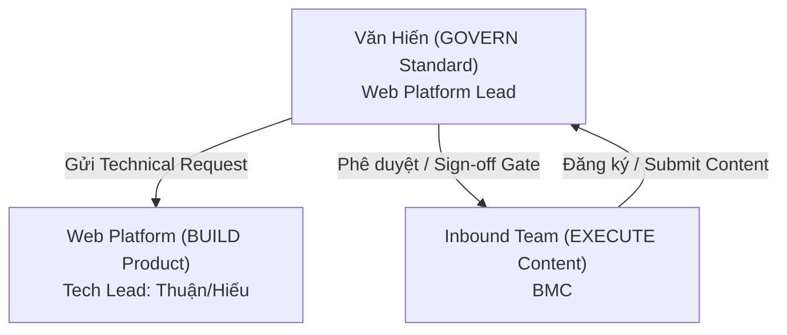

# Giới thiệu GPD Web Platform: Nền tảng Tăng trưởng Ngoài Ứng dụng (Out-App Growth)

> - **Bộ phận:** Web Platform Team & Web Platform Team
> - **Division:** Growth Platform Division (GPD)
> - **Chịu trách nhiệm chính:** Bảo (Senior Manager - Web Platform) & Văn Hiến (Web Product Lead - Web Platform)
> - **Tài liệu tham chiếu:** [hienho_master_doc.md](file:///c:/Klaus/hienho-knowledgebase/00_HARNESS_CORE/hienho_master_doc.md) | [web_growth_strategy_brd.md](file:///c:/Klaus/hienho-knowledgebase/01_STRATEGIC_PLAN/web_growth_strategy_brd.md)

---

## 1. Tầm nhìn Chiến lược (The Shift)

### 1.1. Từ "Hỗ trợ Kỹ thuật" sang "Sở hữu Nền tảng" (Platform Owner)
Trước đây, Web Platform vận hành như một đơn vị hỗ trợ thụ động, xử lý các yêu cầu kỹ thuật đơn lẻ từ các Đơn vị Kinh doanh (Business Units - BUs). Từ năm 2026, Web Platform dịch chuyển vị thế thành **"Người sở hữu Nền tảng" (Platform Owner)** chủ động:
- Tự nghiên cứu, tìm kiếm cơ hội và đề xuất giải pháp tăng trưởng dựa trên dữ liệu thị trường.
- Chủ động triển khai (get hands dirty) các chiến dịch nội dung và tiện ích nếu đối tác thiếu nguồn lực, nhằm mang lại kết quả kinh doanh thực tế (MAU, MEU, New Users) cho MoMo.

### 1.2. Chiến lược Xác lập Uy tín Nội dung (Content Authority) & Giải cứu SoV
- **Bối cảnh:** Việc thiếu tập trung dài hạn khiến tỷ lệ hiện diện tìm kiếm (Share of Voice - SoV) của MoMo trên Web giảm xuống mức báo động **0.6%** trong các mảng tài chính cốt lõi, trong khi đối thủ nắm giữ **70-80%**.
- **Giải pháp:** Xây dựng vị thế **Thẩm quyền Nội dung số 1 (Content Authority)** trong các Use Case chiến lược (Vay Nhanh, Ví Trả Sau, Bảo hiểm, Dịch vụ công - Phạt nguội). Tập trung xây dựng tài sản số bền vững, thay vì các trang đơn lẻ "dùng một lần".

---

## 2. Hệ sinh thái Sản phẩm & Công nghệ (MoSpark Platform)

**MoSpark Platform** là sự chuyển đổi toàn diện nền tảng công nghệ của Web Platform thành một hệ sinh thái tương thích AI-powered mạnh mẽ. Quá trình này không phải xây dựng lại từ đầu mà nâng cấp có chủ đích - giữ lại những gì đang hoạt động tốt, đồng thời mở ra những khả năng mới phù hợp với xu hướng sắp tới.

*   **Vision (Tầm nhìn):** Nền tảng AI-powered Web App/Content của MoMo giúp vận hành và tăng trưởng mọi sản phẩm trên nền tảng Web - từ Landing Page, Mini Web, đến Web Application.
*   **3 Giá trị cốt lõi:**
    *   **Build Fast:** PM/PO phối hợp tạo sản phẩm web chuẩn một cách nhanh chóng.
    *   **Grow Smart:** Đảm bảo SEO/GEO-ready ngay từ nền tảng và tích hợp AI Content Production.
    *   **Scale Anywhere:** Một platform phục vụ toàn bộ các Division/Center của MoMo.

### Các Phân hệ & Module Nền tảng trong MoSpark:

1.  **Landing Page Builder:** Giải pháp đầu tiên được xây dựng trên MoSpark giúp việc tạo Landing Page trở nên dễ dàng, trực quan và nhanh chóng hơn rất nhiều công cụ hiện tại. Người dùng non-tech có thể tự thực hiện và xuất bản mà không phụ thuộc vào Tech như quy trình trước đây.
2.  **Mobase Design System (V2):** Hệ thống ngôn ngữ thiết kế và component dùng chung chuẩn hóa giao diện Web MoMo.
3.  **GenAI Content (Moat Engine):** Quy trình tự động hóa sản xuất nội dung chuẩn SEO/GEO bằng AI (như Claude API), rút ngắn thời gian tạo cụm bài viết từ 2 tuần xuống còn 1-2 ngày.
4.  **Traffic Inventory & Distribution (Ads Manager):** Quản lý và phân phối vị trí quảng cáo (ad placement) trên toàn bộ hệ sinh thái Web MoMo dựa trên ngữ cảnh URL, CMS Tags và cơ chế giải quyết xung đột (Conflict Resolution).
5.  **Full Funnel Tracking Pipeline:** Hệ thống đo lường hành trình người dùng toàn diện từ nguồn truy cập ngoài ứng dụng cho đến các hành động chuyển đổi in-app (đồng bộ GA4, GTM, Appsflyer qua BigQuery).
6.  **SEO/GEO Project Management:** Hệ thống quản trị dự án, lập bản đồ từ khóa và kiểm soát quy chuẩn xuất bản tích hợp.
7.  **Promotion Scheme Management:** Quản lý và phân phối các chiến dịch ưu đãi, voucher đi kèm các hoạt động quảng cáo.

*Bên cạnh các module nền tảng, MoSpark còn là bệ đỡ triển khai các dự án **Mini Web App** như **Tra cứu Phạt Nguội** và **Merchant Page Builder (Đối tác)**.*

---

## 3. Mô hình Phối hợp (Govern - Build - Execute)

Quy trình vận hành và kiểm soát chất lượng trên domain `momo.vn` được thiết lập chặt chẽ thông qua tam giác phối hợp:

- **Govern (Giám sát & Quy chuẩn):** Do **Văn Hiến (Web Platform)** chịu trách nhiệm. Định nghĩa các tiêu chuẩn SEO/GEO, nghiên cứu thị trường, kiểm tra kỹ thuật (Sitemap, Schema, URL Governance) và là người phê duyệt cuối cùng (Publish Gate Sign-off) trước khi bất kỳ trang nào được đưa lên production.
- **Build (Xây dựng Nền tảng):** Do **Bảo (Web Platform)** và đội ngũ kỹ sư (FE: Hùng, Thuận, Nhật; BE: Hiếu, Hoài Anh, Duy) phụ trách. Nhận yêu cầu kỹ thuật trực tiếp từ Hiến để phát triển các tính năng lõi trên MoSpark.
- **Execute (Thực thi Nội dung):** Do **Inbound Marketing Team (BMC)** hoặc các **Cell Teams (BUs)** thực hiện sản xuất nội dung, bài blog, và chạy chiến dịch theo bộ khung chuẩn (Foundation Checklist) do Hiến ban hành.

---

## 4. Các Chỉ số Mục tiêu (OKRs & KPIs)

Hoạt động của GPD Web Platform hướng trực tiếp tới các chỉ số kinh doanh cốt lõi của MoMo:

| Nhóm Chỉ số | Tên Chỉ số | Cách đo lường / Mục tiêu |
| :--- | :--- | :--- |
| **Mục tiêu Chính** | **Content Authority** | Lọt vào **Top 3-5 kết quả tìm kiếm** của Google cho 50+ từ khóa tài chính cốt lõi. |
| **Lưu lượng (Traffic)**| **Organic Traffic (MUV)** | Tăng trưởng lượng người dùng truy cập tự nhiên hàng tháng (Mục tiêu 6 triệu). |
| **Chuyển đổi** | **W2A Conversion Rate** | Tối ưu hóa tỷ funnel từ Web vào App: `Click CTA -> Onelink -> Install -> Register -> Active`. |
| **Tầm nhìn AI** | **GEO / AEO Citation** | Tỷ lệ MoMo được trích dẫn nguồn trên các AI Search Engine (Google AI Overview, ChatGPT, Perplexity). |

---

## 5. Quy trình Đưa Sản phẩm lên Web (9-Step Workflow)

Mọi dự án hoặc Use Case của các BU khi đưa lên Web MoMo đều phải đi qua quy trình chuẩn hóa nhằm bảo toàn sức khỏe của Website (`momo.vn`):

1. **Research & Discovery:** Nghiên cứu dung lượng thị trường và đối thủ (Web Platform).
2. **Thiết lập Mục tiêu:** Xác định KPI và Benchmark chuyển đổi.
3. **Product Brief & Tracking Plan:** Viết brief sản phẩm và lên tài liệu tracking chi tiết.
4. **Feasibility Sync:** Đồng bộ với Cell Team về nguồn lực và lộ trình phát triển.
5. **Sprint Planning & Coding:** Đội lập trình tiến hành code và đóng gói tính năng.
6. **SEO Review & QA Testing:** Kiểm tra qua bộ lọc kỹ thuật (Technical SEO, Schema, Robots). **[Cổng kiểm soát 1]**
7. **Staging & Sign-off:** Đo lường Core Web Vitals (LCP < 2.5s, INP < 200ms) và kiểm tra luồng tracking. **[Cổng kiểm soát 2]**
8. **Roll Out:** Xuất bản theo lộ trình (Hub -> Spoke -> Blog).
9. **Post-Launch Monitoring:** Đánh giá hiệu quả sau 30/60/90 ngày và tiếp tục tối ưu hóa.

---
*Tài liệu được biên soạn và bảo trì bởi Web Platform Division.*
