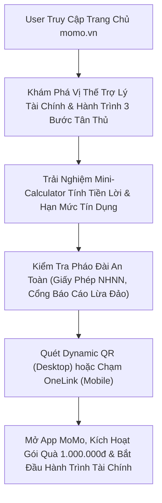

# BRD: Revamp Trang Chủ MoMo (MoMo Homepage Revamp 2026)
## Định Vị Uy Tín Tài Chính (Financial Authority), Xây Dựng Niềm Tin Số & Trung Tâm Chào Đón Người Dùng Mới (New User Welcome Hub)

> - **Project:** Revamp Trang Chủ MoMo (MoMo Homepage Revamp)
> - **Main URL:** momo.vn
> - **Division:** Growth Platform Division (Web Platform)
> - **Governance:** Web Product Lead
> - **Version:** 2.0 · Tháng 08/2026
> - **Status:** Active

---

> **Problem:** Trang chủ momo.vn hiện tại thiếu điểm nhấn định vị chuyên sâu về uy tín tài chính (Financial Authority), thiếu các cơ chế bảo chứng an toàn chủ động (Trust Defense) và chưa có một hành trình chào đón người dùng mới (New User Welcome Experience) mượt mà với nguyên tắc trao giá trị trước (Value Before Gate), dẫn đến tỷ lệ e ngại và ma sát lớn khi chuyển đổi Web-to-App.
> **KPI Owned:** Lượt cài đặt ứng dụng mới từ Web (New App Installs from Web) đạt 20.000 - 30.000 lượt/tháng và Tỷ lệ nhấp chuyển đổi (W2A CTA CTR) đạt >= 15% → attributed via AppsFlyer OneLink & GA4.
> **Conversion Flow:** [Truy cập momo.vn] → [Khám phá Vị thế Trợ lý Tài chính & Trust Fortress] → [Trải nghiệm Interactive Calculator / Nhận diện Quyền lợi Tân thủ] → [Quét QR Code / Chạm OneLink] → [Mở App MoMo, Kích hoạt gói quà 1.000.000đ & KYC].

---

## 1. Executive Summary

### 1.1 Situation (Hiện Trạng)
Trang chủ `momo.vn` là điểm chạm thương hiệu số 1 của MoMo trên không gian mạng, tiếp nhận hàng triệu lượt truy cập mỗi tháng. Phần lớn lưu lượng truy cập là người dùng tiềm năng (Potential Users) và người chưa từng sử dụng MoMo (Non-MoMo Users) đang tìm kiếm thông tin về độ uy tín, các dịch vụ tài chính và giải pháp thanh toán số.

### 1.2 Complication (Thách Thức & Điểm Nghẽn)
* **Thiếu định vị Financial Authority:** Trang chủ chưa khẳng định được vị thế MoMo là "Trợ lý tài chính thông minh số 1". Toàn bộ hệ sinh thái dịch vụ tài chính quan trọng (Tích lũy sinh lời, Tín dụng, Vay tiêu dùng, Bảo hiểm, Đầu tư chứng khoán, Quản lý chi tiêu) chưa được quy hoạch thành các khối năng lực cốt lõi có tính tương tác.
* **Xây dựng niềm tin (Trust) còn mang tính thụ động:** Các cam kết an toàn chỉ dừng ở vài logo chứng chỉ bảo mật tĩnh ở chân trang, chưa truyền tải được hạ tầng phòng chống gian lận chủ động (Active Anti-Fraud) và chưa làm nổi bật kênh tiếp nhận tố giác như Cổng Báo Cáo Lừa Đảo (`/an-toan-bao-mat/bao-cao-lua-dao`).
* **Trải nghiệm chào đón New User thiếu hấp dẫn:** Chưa tạo ra một "Welcome Experience" rõ ràng; người dùng mới chưa thấy được lợi ích tức thì đã bị yêu cầu tải app, tạo ra rào cản tâm lý e ngại về bảo mật và thủ tục ngân hàng.

### 1.3 Resolution (Giải Pháp & Định Vị Cốt Lõi)
Tái cấu trúc toàn diện Trang chủ `momo.vn` thành **Trung Tâm Định Vị Uy Tín Tài Chính (Financial Authority Hub) & Cổng Chào Đón Tân Thủ (New User Welcome Center)**:
* **Tập trung 100% vào Năng lực Tài chính & Quản lý Tiền bạc:** Loại bỏ việc phân tán nguồn lực quảng bá các Hub tiện ích đời sống rời rạc trên trang chủ; dồn trọn vẹn không gian để trình diễn Bộ Giải Pháp Tài Chính Toàn Diện (Túi Thần Tài, Ví Trả Sau, Vay Nhanh, Bảo hiểm, Chứng khoán, Điểm CIC).
* **Xây dựng Pháo Đài Niềm Tin (Trust Fortress):** Minh bạch tính pháp lý từ Ngân hàng Nhà nước, mạng lưới đối tác ngân hàng hàng đầu và kênh tiếp nhận phòng chống lừa đảo trực tuyến.
* **Hành trình Chào Đón & Giáo Dục Người Dùng Mới (New User Welcome & Education):** Áp dụng công thức "Value Before Gate" với công cụ tính toán tài chính tương tác (Mini-Calculator) và gói quà tân thủ 1.000.000đ, giúp người dùng mới hiểu rõ giá trị, tin tưởng và hào hứng chuyển đổi sang App MoMo.

---

## 2. Bối Cảnh Thị Trường & Benchmark Quốc Tế

<table style="width:100%; border-collapse:collapse; border:1.5px solid #64748b; margin:1em 0; font-size:0.9em;">
  <thead>
    <tr style="background-color:#f1f5f9;">
      <th style="border:1.5px solid #64748b; padding:8px 12px; text-align:left; font-weight:700;">Hạng Mục So Sánh</th>
      <th style="border:1.5px solid #64748b; padding:8px 12px; text-align:left; font-weight:700;">Thực Trạng momo.vn Hiện Tại</th>
      <th style="border:1.5px solid #64748b; padding:8px 12px; text-align:left; font-weight:700;">Benchmark Fintech Hàng Đầu (Revolut, Toss, Nubank)</th>
      <th style="border:1.5px solid #64748b; padding:8px 12px; text-align:left; font-weight:700;">Định Hướng Trang Chủ Mới Của MoMo</th>
    </tr>
  </thead>
  <tbody>
    <tr>
      <td style="border:1px solid #94a3b8; padding:8px 12px; text-align:left;"><strong>Trọng Tâm Nội Dung</strong></td>
      <td style="border:1px solid #94a3b8; padding:8px 12px; text-align:left;">Dàn trải nhiều thông tin tiện ích, thiếu thông điệp tài chính xuyên suốt.</td>
      <td style="border:1px solid #94a3b8; padding:8px 12px; text-align:left;">100% không gian trang chủ tập trung vào Sức mạnh Tài chính, Quản lý tiền bạc và Tích lũy tài sản.</td>
      <td style="border:1px solid #94a3b8; padding:8px 12px; text-align:left;"><strong>Thuần nhất Financial Authority</strong>, khẳng định vị thế Trợ lý tài chính thông minh toàn diện.</td>
    </tr>
    <tr style="background-color:#f8fafc;">
      <td style="border:1px solid #94a3b8; padding:8px 12px; text-align:left;"><strong>Xây Dựng Niềm Tin</strong></td>
      <td style="border:1px solid #94a3b8; padding:8px 12px; text-align:left;">Gắn logo chứng chỉ thụ động ở chân trang.</td>
      <td style="border:1px solid #94a3b8; padding:8px 12px; text-align:left;">Chính sách bảo vệ tài khoản chủ động, cam kết an toàn, công cụ chống gian lận/lừa đảo 24/7.</td>
      <td style="border:1px solid #94a3b8; padding:8px 12px; text-align:left;">Xây dựng <strong>Trust Fortress 3 Tầng</strong>, tích hợp Cổng Báo Cáo Lừa Đảo (`/an-toan-bao-mat/bao-cao-lua-dao`).</td>
    </tr>
    <tr>
      <td style="border:1px solid #94a3b8; padding:8px 12px; text-align:left;"><strong>Trải Nghiệm Tân Thủ</strong></td>
      <td style="border:1px solid #94a3b8; padding:8px 12px; text-align:left;">Banner tĩnh kêu gọi tải app chung chung, không có lộ trình giáo dục.</td>
      <td style="border:1px solid #94a3b8; padding:8px 12px; text-align:left;">Khu vực Welcome Center riêng biệt, hướng dẫn 3 bước bắt đầu, hiển thị minh bạch gói quà tân thủ.</td>
      <td style="border:1px solid #94a3b8; padding:8px 12px; text-align:left;">Thiết kế <strong>New User Welcome Center</strong> kèm công cụ chọn nhu cầu và Dynamic QR Code nhận quà 1 triệu.</td>
    </tr>
    <tr style="background-color:#f8fafc;">
      <td style="border:1px solid #94a3b8; padding:8px 12px; text-align:left;"><strong>Công Cụ Tương Tác</strong></td>
      <td style="border:1px solid #94a3b8; padding:8px 12px; text-align:left;">Nội dung tĩnh, người dùng chỉ có thể đọc văn bản.</td>
      <td style="border:1px solid #94a3b8; padding:8px 12px; text-align:left;">Interactive Calculators cho phép tự tính lãi suất, kiểm tra hạn mức trả góp trước khi đăng ký.</td>
      <td style="border:1px solid #94a3b8; padding:8px 12px; text-align:left;">Nhúng <strong>Mini-Calculator Tương Tác</strong> (Túi Thần Tài & Trả Góp) ngay trên trang chủ.</td>
    </tr>
  </tbody>
</table>

---

## 3. Định Hướng Dự Án & Phạm Vi Cốt Lõi

### 3.1 Product Job Cốt Lõi
* **Người dùng mới (New User):** Truy cập `momo.vn` ➔ Cảm nhận ngay sự uy tín, minh bạch và an toàn tuyệt đối ➔ Được chào đón bằng hướng dẫn 3 bước dễ hiểu cùng gói quà tân thủ 1.000.000đ ➔ Tự kéo thanh tính toán tiền lời Túi Thần Tài ➔ Quét QR chuyển sang App MoMo mở tài khoản và kích hoạt quyền lợi.
* **Người dùng tiềm năng (Potential Financial User):** Truy cập `momo.vn` ➔ Khám phá năng lực tài chính chuyên sâu của MoMo (Tích lũy, Vay tiêu dùng minh bạch, Ví Trả Sau 0% lãi, Đầu tư chứng khoán, Bảo hiểm, Kiểm tra điểm tín dụng CIC) ➔ An tâm liên kết tài khoản ngân hàng và sử dụng dịch vụ.

### 3.2 Dự Án Này KHÔNG Phải (Explicit Out-of-Scope)
* **KHÔNG phải nơi quảng bá các Hub tiện ích đời sống:** Trang chủ loại bỏ các khu vực promote Vehicle Hub, Cinema Hub, Student Hub hay Merchant Hub; các tiện ích này sẽ vận hành độc lập theo chiến lược Search/SEO chuyên sâu của từng Hub.
* **KHÔNG phải trang giao dịch tài chính trực tiếp trên Web:** Mọi giao dịch tài chính nhạy cảm và xác thực danh tính (KYC) vẫn được thực hiện an toàn trong môi trường bảo mật của ứng dụng MoMo.
* **KHÔNG sử dụng banner quảng cáo chắp vá:** Toàn bộ giao diện được xây dựng bằng hệ thống thiết kế (Design System) đồng nhất, tập trung vào câu chuyện tài chính và niềm tin.

### 3.3 Cơ Chế PLG Hook (Product-Led Growth Engine)
* **Value Before Gate:** Người dùng trải nghiệm tính năng dự toán sinh lời và hạn mức tín dụng mà không cần tạo tài khoản hay đăng nhập.
* **Welcome Incentive Alignment:** Gói quà tân thủ 1.000.000đ được minh bạch hóa theo từng nhu cầu (Thanh toán hóa đơn, Nạp tiền điện thoại, Tích lũy đầu tiên).
* **Active Defense Transparency:** Tiếp nhận phản ánh lừa đảo ẩn danh trên Web, chứng minh tinh thần bảo vệ khách hàng thực tế.

---

## 4. Phân Tích JTBD (Jobs-To-Be-Done)

### Job #1: Xác Thực Uy Tín Tài Chính & Tìm Kiếm Công Cụ Tích Lũy / Tiêu Dùng An Toàn
> "Tôi muốn tìm một nền tảng tài chính số được cấp phép đầy đủ, giúp tôi vừa sinh lời mỗi ngày từ tiền nhàn rỗi, vừa có nguồn vốn dự phòng an toàn mà không sợ rủi ro lừa đảo hay phí ẩn."

<table style="width:100%; border-collapse:collapse; border:1.5px solid #64748b; margin:1em 0; font-size:0.9em;">
  <thead>
    <tr style="background-color:#f1f5f9;">
      <th style="border:1.5px solid #64748b; padding:8px 12px; text-align:left; font-weight:700;">Khía Cạnh (Dimension)</th>
      <th style="border:1.5px solid #64748b; padding:8px 12px; text-align:left; font-weight:700;">Mô Tả Chi Tiết</th>
    </tr>
  </thead>
  <tbody>
    <tr>
      <td style="border:1px solid #94a3b8; padding:8px 12px; text-align:left;">Functional</td>
      <td style="border:1px solid #94a3b8; padding:8px 12px; text-align:left;">Xem bảng tỷ suất sinh lời Túi Thần Tài, quy định hạn mức Ví Trả Sau, đối tác ngân hàng cho vay và chứng chỉ bảo mật.</td>
    </tr>
    <tr style="background-color:#f8fafc;">
      <td style="border:1px solid #94a3b8; padding:8px 12px; text-align:left;">Emotional</td>
      <td style="border:1px solid #94a3b8; padding:8px 12px; text-align:left;">Cảm thấy tài sản của mình được quản lý an toàn, minh bạch và có tổ chức bảo hộ.</td>
    </tr>
    <tr>
      <td style="border:1px solid #94a3b8; padding:8px 12px; text-align:left;">Social</td>
      <td style="border:1px solid #94a3b8; padding:8px 12px; text-align:left;">An tâm chia sẻ phương pháp quản lý tài chính thông minh cho gia đình và bạn bè.</td>
    </tr>
    <tr style="background-color:#f8fafc;">
      <td style="border:1px solid #94a3b8; padding:8px 12px; text-align:left;">Trigger</td>
      <td style="border:1px solid #94a3b8; padding:8px 12px; text-align:left;">Muốn tối ưu tiền chi tiêu hàng tháng hoặc tìm giải pháp ứng vốn tiêu dùng tin cậy.</td>
    </tr>
    <tr>
      <td style="border:1px solid #94a3b8; padding:8px 12px; text-align:left;">Search → App Flow</td>
      <td style="border:1px solid #94a3b8; padding:8px 12px; text-align:left;">"MoMo tài chính" / "Túi Thần Tài MoMo lãi bao nhiêu" ➔ momo.vn (Zone 2 & Zone 3) ➔ Kéo thanh tính tiền lời ➔ Quét QR mở App kích hoạt.</td>
    </tr>
  </tbody>
</table>

### Job #2: Người Dùng Mới Cần Được Hướng Dẫn & Nhận Quà Tân Thủ Thực Chất
> "Tôi chưa từng dùng MoMo, tôi cần biết bắt đầu như thế nào cho dễ và gói quà 1.000.000đ cho người mới gồm những gì thiết thực đối với tôi."

<table style="width:100%; border-collapse:collapse; border:1.5px solid #64748b; margin:1em 0; font-size:0.9em;">
  <thead>
    <tr style="background-color:#f1f5f9;">
      <th style="border:1.5px solid #64748b; padding:8px 12px; text-align:left; font-weight:700;">Khía Cạnh (Dimension)</th>
      <th style="border:1.5px solid #64748b; padding:8px 12px; text-align:left; font-weight:700;">Mô Tả Chi Tiết</th>
    </tr>
  </thead>
  <tbody>
    <tr>
      <td style="border:1px solid #94a3b8; padding:8px 12px; text-align:left;">Functional</td>
      <td style="border:1px solid #94a3b8; padding:8px 12px; text-align:left;">Đọc quy trình 3 bước bắt đầu, xem danh mục voucher quà tặng tân thủ và quét mã tải app nhanh gọn.</td>
    </tr>
    <tr style="background-color:#f8fafc;">
      <td style="border:1px solid #94a3b8; padding:8px 12px; text-align:left;">Emotional</td>
      <td style="border:1px solid #94a3b8; padding:8px 12px; text-align:left;">Cảm giác được chào đón nồng nhiệt, không bị bỡ ngỡ trước một ứng dụng quá nhiều tính năng.</td>
    </tr>
    <tr>
      <td style="border:1px solid #94a3b8; padding:8px 12px; text-align:left;">Social</td>
      <td style="border:1px solid #94a3b8; padding:8px 12px; text-align:left;">Gia nhập cộng đồng hơn 30 triệu người dùng công nghệ tài chính hiện đại.</td>
    </tr>
    <tr style="background-color:#f8fafc;">
      <td style="border:1px solid #94a3b8; padding:8px 12px; text-align:left;">Trigger</td>
      <td style="border:1px solid #94a3b8; padding:8px 12px; text-align:left;">Lần đầu truy cập trang web MoMo sau khi nghe giới thiệu từ bạn bè hoặc truyền thông.</td>
    </tr>
    <tr>
      <td style="border:1px solid #94a3b8; padding:8px 12px; text-align:left;">Search → App Flow</td>
      <td style="border:1px solid #94a3b8; padding:8px 12px; text-align:left;">"Đăng ký MoMo nhận quà" / "Hướng dẫn dùng MoMo" ➔ momo.vn (Zone 1 & Zone 2) ➔ Xem 3 bước onboarding ➔ Chạm OneLink tải App.</td>
    </tr>
  </tbody>
</table>

### Job #3: An Tâm Tuyệt Đối Với Hạ Tầng Bảo Vệ Chủ Động & Chống Lừa Đảo
> "Tôi lo ngại về các chiêu trò lừa đảo qua mạng và muốn biết MoMo có biện pháp gì để bảo vệ tài khoản của tôi, cũng như nơi tôi có thể phản ánh ngay khi gặp đối tượng giả mạo."

<table style="width:100%; border-collapse:collapse; border:1.5px solid #64748b; margin:1em 0; font-size:0.9em;">
  <thead>
    <tr style="background-color:#f1f5f9;">
      <th style="border:1.5px solid #64748b; padding:8px 12px; text-align:left; font-weight:700;">Khía Cạnh (Dimension)</th>
      <th style="border:1.5px solid #64748b; padding:8px 12px; text-align:left; font-weight:700;">Mô Tả Chi Tiết</th>
    </tr>
  </thead>
  <tbody>
    <tr>
      <td style="border:1px solid #94a3b8; padding:8px 12px; text-align:left;">Functional</td>
      <td style="border:1px solid #94a3b8; padding:8px 12px; text-align:left;">Xem các lớp bảo mật sinh trắc học/AI và truy cập nhanh form Báo Cáo Lừa Đảo ẩn danh trong 2 phút.</td>
    </tr>
    <tr style="background-color:#f8fafc;">
      <td style="border:1px solid #94a3b8; padding:8px 12px; text-align:left;">Emotional</td>
      <td style="border:1px solid #94a3b8; padding:8px 12px; text-align:left;">An tâm vì MoMo luôn đồng hành, chủ động bảo vệ người dùng và có trách nhiệm với cộng đồng.</td>
    </tr>
    <tr>
      <td style="border:1px solid #94a3b8; padding:8px 12px; text-align:left;">Social</td>
      <td style="border:1px solid #94a3b8; padding:8px 12px; text-align:left;">Cùng chung tay đẩy lùi tội phạm công nghệ cao và bảo vệ người thân.</td>
    </tr>
    <tr style="background-color:#f8fafc;">
      <td style="border:1px solid #94a3b8; padding:8px 12px; text-align:left;">Trigger</td>
      <td style="border:1px solid #94a3b8; padding:8px 12px; text-align:left;">Nhận tin nhắn giả mạo hoặc muốn kiểm tra mức độ an toàn của ví trước khi nạp số tiền lớn.</td>
    </tr>
    <tr>
      <td style="border:1px solid #94a3b8; padding:8px 12px; text-align:left;">Search → App Flow</td>
      <td style="border:1px solid #94a3b8; padding:8px 12px; text-align:left;">"MoMo an toàn bảo mật" / "Báo cáo số MoMo lừa đảo" ➔ momo.vn (Zone 4) ➔ Chuyển tiếp `/an-toan-bao-mat/bao-cao-lua-dao`.</td>
    </tr>
  </tbody>
</table>

---

## 5. Kiến Trúc Trang Chủ Mới (6-Zone Pure Fintech Architecture)

```
+-------------------------------------------------------------------------+
| [HEADER NAVBAR] Logo | Dịch Vụ Tài Chính | An Toàn Bảo Mật | Về MoMo   |
|                 CTA Nổi Bật: "Nhận Gói Quà Tân Thủ 1.000.000đ"          |
+-------------------------------------------------------------------------+
| ZONE 1: HERO SECTION - FINANCIAL POWERHOUSE & NEW USER PROMISE          |
| • Headline: "Trợ Lý Tài Chính Thông Minh & Nền Tảng Thanh Toán An Toàn" |
| • Welcome Hook: Chào bạn mới - Nhận gói quà 1.000.000đ khi mở tài khoản|
| • Dual CTA: Dynamic QR Code tải App (Desktop) / Nút OneLink (Mobile)   |
+-------------------------------------------------------------------------+
| ZONE 2: NEW USER WELCOME CENTER (3 BƯỚC BẮT ĐẦU DỄ DÀNG)                |
| • Bước 1: 1 Chạm Thanh Toán & Nạp Rút Mọi Lúc Mọi Nơi                   |
| • Bước 2: Tích Lũy Sinh Lời Tự Động Mỗi Ngày với Túi Thần Tài           |
| • Bước 3: Tận Dụng Đòn Bẩy Tiêu Dùng 0% Lãi với Ví Trả Sau              |
+-------------------------------------------------------------------------+
| ZONE 3: FINANCIAL AUTHORITY SHOWCASE (BỘ GIẢI PHÁP TÀI CHÍNH TOÀN DIỆN) |
| • Trụ cột 1: Tích Lũy Sinh Lời (Túi Thần Tài + Mini-Calculator tính lãi)|
| • Trụ cột 2: Tín Dụng & Tiêu Dùng (Ví Trả Sau 0% lãi, Vay Nhanh Ngân Hàng)|
| • Trụ cột 3: Bảo Hiểm Toàn Diện (InsurTech Ô tô, Xe máy, Sức khỏe)     |
| • Trụ cột 4: Đầu Tư & Quản Trị (Chứng Khoán Online, Tra Cứu Điểm CIC)   |
+-------------------------------------------------------------------------+
| ZONE 4: TRUST FORTRESS (PHÁO ĐÀI AN TOÀN & BẢO CHỨNG MINH BẠCH)         |
| • 3 Tầng Bảo Chứng: Giấy phép NHNN, PCI-DSS Level 1, ISO 27001          |
| • Mạng Lưới Ngân Hàng Đối Tác: Dải logo các ngân hàng lớn nhất Việt Nam |
| • Active Anti-Fraud Card: Cổng Báo Cáo Lừa Đảo (/an-toan-bao-mat/bao-cao)|
| • Security Newsletter: Bản Tin An Toàn Bảo Mật (/an-toan-bao-mat/ban-tin)|
+-------------------------------------------------------------------------+
| ZONE 5: SMART MONEY ASSISTANT & BRAND LOVE                              |
| • Quản Lý Chi Tiêu Tự Động: Phân loại thông minh, kiểm soát dòng tiền   |
| • Đặc Quyền Thành Viên MoMo Rewards: Tích điểm đổi ngàn ưu đãi          |
| • Social Proof: Câu chuyện người thật việc thật tối ưu tài chính        |
+-------------------------------------------------------------------------+
| ZONE 6: STICKY NEW USER BAR & MASTER FINANCIAL FOOTER                   |
| • Sticky Welcome Bar: Nhắc nhở gói quà tân thủ 1.000.000đ ở đáy trang   |
| • Master Footer: Cấu trúc liên kết chuẩn mực tập trung Tài chính & Pháp lý|
+-------------------------------------------------------------------------+
```

### 5.1 Sơ Đồ Luồng Chuyển Đổi Người Dùng (User Flow)



### 5.2 Bảng Phân Tích Chi Tiết Các Bước (Step Breakdown Table)

<table style="width:100%; border-collapse:collapse; border:1.5px solid #64748b; margin:1em 0; font-size:0.9em;">
  <thead>
    <tr style="background-color:#f1f5f9;">
      <th style="border:1.5px solid #64748b; padding:8px 12px; text-align:left; font-weight:700;">Bước</th>
      <th style="border:1.5px solid #64748b; padding:8px 12px; text-align:left; font-weight:700;">Tên Giai Đoạn</th>
      <th style="border:1.5px solid #64748b; padding:8px 12px; text-align:left; font-weight:700;">Trải Nghiệm Người Dùng (UX)</th>
      <th style="border:1.5px solid #64748b; padding:8px 12px; text-align:left; font-weight:700;">Hạ Tầng / Cơ Chế Kỹ Thuật</th>
      <th style="border:1.5px solid #64748b; padding:8px 12px; text-align:left; font-weight:700;">Nền Tảng</th>
    </tr>
  </thead>
  <tbody>
    <tr>
      <td style="border:1px solid #94a3b8; padding:8px 12px; text-align:left;">1</td>
      <td style="border:1px solid #94a3b8; padding:8px 12px; text-align:left;">Welcome & Discovery</td>
      <td style="border:1px solid #94a3b8; padding:8px 12px; text-align:left;">Được chào đón bởi thông điệp trợ lý tài chính rõ ràng, thấy ngay gói quà tân thủ và lộ trình 3 bước bắt đầu.</td>
      <td style="border:1px solid #94a3b8; padding:8px 12px; text-align:left;">SSR Core Shell / Edge CDN Cache (LCP < 2.0s)</td>
      <td style="border:1px solid #94a3b8; padding:8px 12px; text-align:left;">Web</td>
    </tr>
    <tr style="background-color:#f8fafc;">
      <td style="border:1px solid #94a3b8; padding:8px 12px; text-align:left;">2</td>
      <td style="border:1px solid #94a3b8; padding:8px 12px; text-align:left;">Value Before Gate</td>
      <td style="border:1px solid #94a3b8; padding:8px 12px; text-align:left;">Tự kéo thanh tính toán số tiền sinh lời mỗi ngày của Túi Thần Tài mà không cần đăng nhập.</td>
      <td style="border:1px solid #94a3b8; padding:8px 12px; text-align:left;">Client-side Mini-Calculator Component</td>
      <td style="border:1px solid #94a3b8; padding:8px 12px; text-align:left;">Web</td>
    </tr>
    <tr>
      <td style="border:1px solid #94a3b8; padding:8px 12px; text-align:left;">3</td>
      <td style="border:1px solid #94a3b8; padding:8px 12px; text-align:left;">Trust Affirmation</td>
      <td style="border:1px solid #94a3b8; padding:8px 12px; text-align:left;">Xác nhận giấy phép NHNN, danh sách ngân hàng liên kết và kênh Báo Cáo Lừa Đảo minh bạch.</td>
      <td style="border:1px solid #94a3b8; padding:8px 12px; text-align:left;">Trust Badges & Outbound Verification Gateway</td>
      <td style="border:1px solid #94a3b8; padding:8px 12px; text-align:left;">Web</td>
    </tr>
    <tr style="background-color:#f8fafc;">
      <td style="border:1px solid #94a3b8; padding:8px 12px; text-align:left;">4</td>
      <td style="border:1px solid #94a3b8; padding:8px 12px; text-align:left;">Web-to-App Transition</td>
      <td style="border:1px solid #94a3b8; padding:8px 12px; text-align:left;">Quét mã Dynamic QR hoặc chạm CTA để chuyển tiếp mở ứng dụng nhận quà tân thủ.</td>
      <td style="border:1px solid #94a3b8; padding:8px 12px; text-align:left;">AppsFlyer OneLink / Deep Link Context Routing (`utm_source=web_home_welcome`)</td>
      <td style="border:1px solid #94a3b8; padding:8px 12px; text-align:left;">Web to App</td>
    </tr>
    <tr>
      <td style="border:1px solid #94a3b8; padding:8px 12px; text-align:left;">5</td>
      <td style="border:1px solid #94a3b8; padding:8px 12px; text-align:left;">In-App Activation</td>
      <td style="border:1px solid #94a3b8; padding:8px 12px; text-align:left;">Đăng ký tài khoản MoMo, nhận quà tân thủ và bắt đầu sử dụng các dịch vụ tài chính an toàn.</td>
      <td style="border:1px solid #94a3b8; padding:8px 12px; text-align:left;">In-App Onboarding Flow & Digital KYC Verification</td>
      <td style="border:1px solid #94a3b8; padding:8px 12px; text-align:left;">App</td>
    </tr>
  </tbody>
</table>

---

## 6. Success Metrics (Chỉ Số Thành Công)

<table style="width:100%; border-collapse:collapse; border:1.5px solid #64748b; margin:1em 0; font-size:0.9em;">
  <thead>
    <tr style="background-color:#f1f5f9;">
      <th style="border:1.5px solid #64748b; padding:8px 12px; text-align:left; font-weight:700;">Chỉ Số (Metric)</th>
      <th style="border:1.5px solid #64748b; padding:8px 12px; text-align:left; font-weight:700;">Phân Nhóm</th>
      <th style="border:1.5px solid #64748b; padding:8px 12px; text-align:left; font-weight:700;">Mục Tiêu (Target)</th>
      <th style="border:1.5px solid #64748b; padding:8px 12px; text-align:left; font-weight:700;">Thời Gian Đạt</th>
      <th style="border:1.5px solid #64748b; padding:8px 12px; text-align:left; font-weight:700;">Công Cụ Đo Lường</th>
    </tr>
  </thead>
  <tbody>
    <tr>
      <td style="border:1px solid #94a3b8; padding:8px 12px; text-align:left;"><strong>New App Installs from Web</strong></td>
      <td style="border:1px solid #94a3b8; padding:8px 12px; text-align:left;"><strong>North Star</strong></td>
      <td style="border:1px solid #94a3b8; padding:8px 12px; text-align:left;"><strong>20.000 - 30.000 lượt/tháng</strong> (Tăng trưởng x3-x4)</td>
      <td style="border:1px solid #94a3b8; padding:8px 12px; text-align:left;">H2/2026</td>
      <td style="border:1px solid #94a3b8; padding:8px 12px; text-align:left;">AppsFlyer + GA4</td>
    </tr>
    <tr style="background-color:#f8fafc;">
      <td style="border:1px solid #94a3b8; padding:8px 12px; text-align:left;">W2A CTA Click-Through Rate (CTR)</td>
      <td style="border:1px solid #94a3b8; padding:8px 12px; text-align:left;">Tier B</td>
      <td style="border:1px solid #94a3b8; padding:8px 12px; text-align:left;">>= 15% tổng visits</td>
      <td style="border:1px solid #94a3b8; padding:8px 12px; text-align:left;">Q4/2026</td>
      <td style="border:1px solid #94a3b8; padding:8px 12px; text-align:left;">GA4 Event Tracking</td>
    </tr>
    <tr>
      <td style="border:1px solid #94a3b8; padding:8px 12px; text-align:left;">Interactive Simulator Engagement</td>
      <td style="border:1px solid #94a3b8; padding:8px 12px; text-align:left;">Tier B</td>
      <td style="border:1px solid #94a3b8; padding:8px 12px; text-align:left;">>= 25% visits tương tác</td>
      <td style="border:1px solid #94a3b8; padding:8px 12px; text-align:left;">Q4/2026</td>
      <td style="border:1px solid #94a3b8; padding:8px 12px; text-align:left;">Custom Event Tracking</td>
    </tr>
    <tr style="background-color:#f8fafc;">
      <td style="border:1px solid #94a3b8; padding:8px 12px; text-align:left;">Tỷ Lệ Nhấp Vào Trust & Báo Cáo Lừa Đảo</td>
      <td style="border:1px solid #94a3b8; padding:8px 12px; text-align:left;">Tier B</td>
      <td style="border:1px solid #94a3b8; padding:8px 12px; text-align:left;">Tăng >= 40%</td>
      <td style="border:1px solid #94a3b8; padding:8px 12px; text-align:left;">Q4/2026</td>
      <td style="border:1px solid #94a3b8; padding:8px 12px; text-align:left;">Internal Link Analytics</td>
    </tr>
    <tr>
      <td style="border:1px solid #94a3b8; padding:8px 12px; text-align:left;">Bounce Rate Trang Chủ</td>
      <td style="border:1px solid #94a3b8; padding:8px 12px; text-align:left;">Tier B</td>
      <td style="border:1px solid #94a3b8; padding:8px 12px; text-align:left;">< 38%</td>
      <td style="border:1px solid #94a3b8; padding:8px 12px; text-align:left;">Q4/2026</td>
      <td style="border:1px solid #94a3b8; padding:8px 12px; text-align:left;">GA4 Core Metrics</td>
    </tr>
  </tbody>
</table>

---

## 7. Phụ Thuộc & Ràng Buộc (Dependencies & Constraints)

### 7.1 Bảng Quản Trị Phụ Thuộc (Dependencies Table)

<table style="width:100%; border-collapse:collapse; border:1.5px solid #64748b; margin:1em 0; font-size:0.9em;">
  <thead>
    <tr style="background-color:#f1f5f9;">
      <th style="border:1.5px solid #64748b; padding:8px 12px; text-align:left; font-weight:700;">Hạng Mục Phụ Thuộc</th>
      <th style="border:1.5px solid #64748b; padding:8px 12px; text-align:left; font-weight:700;">Mô Tả Chi Tiết</th>
      <th style="border:1.5px solid #64748b; padding:8px 12px; text-align:left; font-weight:700;">Blocker?</th>
      <th style="border:1.5px solid #64748b; padding:8px 12px; text-align:left; font-weight:700;">Đội Ngũ Chịu Trách Nhiệm</th>
    </tr>
  </thead>
  <tbody>
    <tr>
      <td style="border:1px solid #94a3b8; padding:8px 12px; text-align:left;">Gói Quà Tân Thủ 1.000.000đ</td>
      <td style="border:1px solid #94a3b8; padding:8px 12px; text-align:left;">Chốt danh mục voucher và ngân sách tặng quà cho New User từ Kênh Web.</td>
      <td style="border:1px solid #94a3b8; padding:8px 12px; text-align:left;">Có (P1)</td>
      <td style="border:1px solid #94a3b8; padding:8px 12px; text-align:left;">Growth Marketing / Campaign Team</td>
    </tr>
    <tr style="background-color:#f8fafc;">
      <td style="border:1px solid #94a3b8; padding:8px 12px; text-align:left;">AppsFlyer OneLink Onboarding Routing</td>
      <td style="border:1px solid #94a3b8; padding:8px 12px; text-align:left;">Cấu hình tham số deep link dẫn thẳng vào luồng nhận quà và KYC trên App.</td>
      <td style="border:1px solid #94a3b8; padding:8px 12px; text-align:left;">Có (P1)</td>
      <td style="border:1px solid #94a3b8; padding:8px 12px; text-align:left;">Web Dev & Tracking Analytics Team</td>
    </tr>
    <tr>
      <td style="border:1px solid #94a3b8; padding:8px 12px; text-align:left;">Dữ Liệu Lãi Suất Minh Bạch</td>
      <td style="border:1px solid #94a3b8; padding:8px 12px; text-align:left;">Cơ chế cập nhật tỷ suất sinh lời thực nhận của Túi Thần Tài theo thời gian thực.</td>
      <td style="border:1px solid #94a3b8; padding:8px 12px; text-align:left;">Không (Fallback tĩnh)</td>
      <td style="border:1px solid #94a3b8; padding:8px 12px; text-align:left;">Financial Services Tech Team</td>
    </tr>
    <tr style="background-color:#f8fafc;">
      <td style="border:1px solid #94a3b8; padding:8px 12px; text-align:left;">Duyệt Nội Dung Pháp Lý & YMYL</td>
      <td style="border:1px solid #94a3b8; padding:8px 12px; text-align:left;">Rà soát toàn bộ thông tin giấy phép NHNN, các chứng chỉ bảo mật và điều khoản.</td>
      <td style="border:1px solid #94a3b8; padding:8px 12px; text-align:left;">Có (P1)</td>
      <td style="border:1px solid #94a3b8; padding:8px 12px; text-align:left;">Legal & Compliance Team</td>
    </tr>
  </tbody>
</table>

### 7.2 Ràng Buộc Kỹ Thuật & Vận Hành (Constraints)
* **Quy chuẩn YMYL Nghiêm ngặt:** Toàn bộ thông tin tài chính (lãi suất, đối tác giải ngân, bảo hiểm) phải có chú thích nguồn rõ ràng và không sử dụng ngôn từ tư vấn đầu tư trái quy định.
* **Hiệu Năng Tải Trang (Web Performance):** Trang chủ là điểm đón đầu lưu lượng, bắt buộc đạt điểm Core Web Vitals xanh (LCP < 2.0s, CLS < 0.05, INP < 200ms) trên cả Desktop và Mobile.
* **Tính Toàn Vẹn Của Phễu Web-to-App:** Luồng OneLink phải truyền dữ liệu mượt mà, không làm rơi rớt thông tin ngữ cảnh khi người dùng cài đặt ứng dụng lần đầu.

---

## 8. Lộ Trình Triển Khai (Roadmap & Milestones)

<table style="width:100%; border-collapse:collapse; border:1.5px solid #64748b; margin:1em 0; font-size:0.9em;">
  <thead>
    <tr style="background-color:#f1f5f9;">
      <th style="border:1.5px solid #64748b; padding:8px 12px; text-align:left; font-weight:700;">Giai Đoạn</th>
      <th style="border:1.5px solid #64748b; padding:8px 12px; text-align:left; font-weight:700;">Thời Gian</th>
      <th style="border:1.5px solid #64748b; padding:8px 12px; text-align:left; font-weight:700;">Tên Giai Đoạn</th>
      <th style="border:1.5px solid #64748b; padding:8px 12px; text-align:left; font-weight:700;">Chi Tiết Triển Khai & Mục Tiêu</th>
    </tr>
  </thead>
  <tbody>
    <tr>
      <td style="border:1px solid #94a3b8; padding:8px 12px; text-align:left;">Giai đoạn 1</td>
      <td style="border:1px solid #94a3b8; padding:8px 12px; text-align:left;">Tuần 1</td>
      <td style="border:1px solid #94a3b8; padding:8px 12px; text-align:left;">Khung Thông Tin & Wireframe 6 Zone</td>
      <td style="border:1px solid #94a3b8; padding:8px 12px; text-align:left;">Hoàn tất Wireframe 6 Zone thuần Financial Authority & New User Welcome; chốt gói quà tân thủ 1.000.000đ với Growth Team; duyệt nội dung pháp lý với Legal.</td>
    </tr>
    <tr style="background-color:#f8fafc;">
      <td style="border:1px solid #94a3b8; padding:8px 12px; text-align:left;">Giai đoạn 2</td>
      <td style="border:1px solid #94a3b8; padding:8px 12px; text-align:left;">Tuần 2</td>
      <td style="border:1px solid #94a3b8; padding:8px 12px; text-align:left;">Thiết Kế UI & Prototype Tương Tác</td>
      <td style="border:1px solid #94a3b8; padding:8px 12px; text-align:left;">Thiết kế giao diện UI High-Fidelity; dựng bản Prototype tương tác cho Mini-Calculator Túi Thần Tài và bộ chọn quyền lợi tân thủ.</td>
    </tr>
    <tr>
      <td style="border:1px solid #94a3b8; padding:8px 12px; text-align:left;">Giai đoạn 3</td>
      <td style="border:1px solid #94a3b8; padding:8px 12px; text-align:left;">Tuần 3</td>
      <td style="border:1px solid #94a3b8; padding:8px 12px; text-align:left;">Lập Trình Front-end & Staging</td>
      <td style="border:1px solid #94a3b8; padding:8px 12px; text-align:left;">Web Dev dựng khung Next.js, tích hợp AppsFlyer OneLink, nhúng các liên kết Trust & Cổng Báo Cáo Lừa Đảo, dựng môi trường Staging.</td>
    </tr>
    <tr style="background-color:#f8fafc;">
      <td style="border:1px solid #94a3b8; padding:8px 12px; text-align:left;">Giai đoạn 4</td>
      <td style="border:1px solid #94a3b8; padding:8px 12px; text-align:left;">Tuần 4</td>
      <td style="border:1px solid #94a3b8; padding:8px 12px; text-align:left;">A/B Testing, QA & Go-Live</td>
      <td style="border:1px solid #94a3b8; padding:8px 12px; text-align:left;">Chạy thử nghiệm A/B Testing 50/50 đo lường tỷ lệ W2A CTR; kiểm thử hiệu năng Core Web Vitals; chính thức Go-live 100% Trang chủ mới.</td>
    </tr>
  </tbody>
</table>

---

## Change Log
- **Tháng 08/2026 (v2.0):** Tái định vị toàn diện Trang chủ MoMo theo chỉ đạo chiến lược: Loại bỏ hoàn toàn phần quảng bá các Hub tiện ích đời sống (Vehicle, Cinema, Student, Merchant) trên trang chủ; tập trung 100% không gian xây dựng **Financial Authority**, **Pháo đài An toàn (Trust Fortress)** và **Trung tâm Chào đón Người dùng Mới (New User Welcome Center)**.
- **Tháng 08/2026 (v1.0):** Khởi tạo bản thảo BRD đầu tiên.
