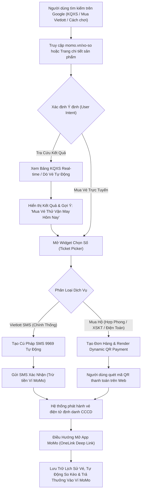

# BRD: Cổng Tiện Ích Xổ Số & Mua Vé Số Trực Tuyến MoMo (MoMo Lottery Hub)
## Cổng Tra Cứu Kết Quả Xổ Số Sạch, Mua Vé Số Chính Thống & Công Cụ Tăng Trưởng Người Dùng Mới (PLG Web-to-App Engine)

> - **Project:** Cổng Tiện Ích Xổ Số & Mua Vé Số Trực Tuyến (MoMo Lottery Hub)
> - **Main URL:** momo.vn/xo-so
> - **Division:** Growth Platform Division (Web Platform)
> - **Governance:** Web Product Lead
> - **Version:** 1.0 · Tháng 08/2026
> - **Status:** Active / Sẵn sàng triển khai
> - **Business Model:** Utility-Led Product-Led Growth (PLG), Chuyển đổi Web-to-App, Phí giao dịch thanh toán & Doanh thu hợp tác phân phối

---

> **Problem:** Nhu cầu tìm kiếm tra cứu kết quả xổ số và mua vé số tại Việt Nam cực kỳ khổng lồ (>300 triệu lượt tìm kiếm/tháng), nhưng 100% website tra cứu hiện nay trên thị trường đều phân mảnh, chất lượng nội dung thấp, tràn ngập quảng cáo cờ bạc bất hợp pháp, trong khi trải nghiệm mua vé số truyền thống offline bất tiện và các ứng dụng mua hộ thiếu uy tín thương hiệu bảo chứng.
> **KPI Owned:** Lượng người dùng tương tác hàng tháng ngoài Web (Monthly Engaged Users - MEU) đạt >= 500.000 MEU/tháng, đóng góp 25.000 - 35.000 New Installs & Logins/tháng vào App MoMo; Tỷ lệ nhấp chuyển đổi (Click-to-App CTR) đạt >= 12.0% → Đo lường qua GA4, AppsFlyer OneLink và MoMo Analytics.
> **Conversion Flow:** [Tìm kiếm Google theo Intent KQXS / Vietlott] → [Truy cập momo.vn/xo-so hoặc Trang chi tiết sản phẩm] → [Tra cứu KQXS Real-time / Chọn số vé may mắn trên Web Utility] → [Thanh toán Native Web QR Payment hoặc Nhận SMS Đặt vé] → [Mở App MoMo nhận thông báo trúng thưởng & Quản lý vé điện tử].

---

## 1. Executive Summary

### 1.1 Situation (Hiện Trạng)
Xổ số kiến thiết (XSKT) và Xổ số điện toán (Vietlott) là thói quen giải trí thường nhật gắn liền với đời sống của hàng chục triệu người dân Việt Nam. Dữ liệu từ các bộ từ khóa thị trường ghi nhận quy mô nhu cầu tìm kiếm trực tuyến vượt mốc **300.000.000 lượt tra cứu mỗi tháng**, trải dài từ các từ khóa xổ số 3 miền, kết quả từng tỉnh thành, đến các sản phẩm Vietlott (Power 6/55, Mega 6/45, Keno, Max 3D, Lotto 5/35).

### 1.2 Complication (Thách Thức & Điểm Nghẽn)
* **Thị trường phân mảnh và trải nghiệm người dùng tiêu cực:** Toàn bộ các website tra cứu kết quả xổ số hiện tại (Minh Ngọc, XSKT.com.vn, Xosodaiphat, Ketqua.net...) đều duy trì giao diện cũ kỹ, tốc độ tải trang chậm và ngập tràn banner quảng cáo cờ bạc, nhà cái không rõ nguồn gốc. Người dùng không có một điểm đến (Destination) uy tín, sạch sẽ và an toàn để tra cứu thông tin.
* **Đứt gãy giữa nhu cầu Tra Cứu và Hành vi Mua Vé:** Người dùng sau khi tra cứu kết quả hoặc xem giá trị Jackpot tích lũy không có công cụ để hành động ngay. Việc mua vé số truyền thống vẫn phụ thuộc vào người bán dạo hoặc đại lý offline; trong khi các kênh mua vé số online hiện nay phân tán, nhiều rủi ro về pháp lý và bảo mật thông tin trúng thưởng.
* **Rào cản tiếp cận của dịch vụ Vietlott SMS:** Mặc dù Vietlott SMS đã hợp tác cùng MoMo và 3 nhà mạng viễn thông (Viettel, VinaPhone, MobiFone), luồng đăng ký tài khoản dự thưởng và xác thực sinh trắc học còn nhiều bước ma sát nếu người dùng tiếp cận từ kênh ngoài App.

### 1.3 Resolution (Giải Pháp & Định Vị Cốt Lõi)
Xây dựng **Cổng Tiện Ích Xổ Số & Mua Vé Số Trực Tuyến (MoMo Lottery Hub)** tại `momo.vn/xo-so` theo mô hình **Product-Led Growth (PLG)**:
* **Cung cấp Tiện ích Tra cứu Kết Quả Sạch & Real-time (Zero-Ad Experience):** Cung cấp kết quả trực tiếp XSKT 3 miền (Bắc - Trung - Nam), kết quả Vietlott và công cụ Dò vé số tự động hoàn toàn miễn phí, không quảng cáo rác, tuân thủ tiêu chuẩn kỹ thuật E-E-A-T.
* **Tích hợp Bộ Công Cụ Chọn Số & Mua Vé Trực Tiếp Ngoài Web:**
  * **Trục Vietlott SMS:** Hướng dẫn đầy đủ, hiển thị Jackpot thời gian thực và tự động tạo cú pháp SMS đặt vé chính thống qua đầu số 9969.
  * **Trục Mua Hộ Vé Số (Đối tác Hợp Phong):** Cho phép người dùng chọn bộ số trực quan cho toàn bộ danh mục sản phẩm (Vietlott, Xổ số Điện toán Thủ Đô, XSKT 3 Miền) và thanh toán tức thì qua **Native Web QR Payment** mà không bắt buộc tải app trước.
* **Cơ Chế Khóa Giá Trị Sau Mua (Web-to-App Lock-in):** Sử dụng tính năng "Lưu vé điện tử", "Thông báo trúng thưởng tự động" và "Nhận thưởng tức thì vào Ví MoMo" làm PLG Hook tự nhiên để đưa người dùng từ Web vào trong App MoMo.

---

## 2. Bối Cảnh Thị Trường & Cơ Hội Tăng Trưởng (Market Opportunity)

### 2.1 Quy Mô Nhu Cầu Tìm Kiếm (Search Demand Analysis)
Dựa trên phân tích chuyên sâu 4 bộ dữ liệu Intent với tổng cộng **8.395 từ khóa**, nhu cầu thị trường về mảng Xổ số - Vé số được phân bổ như sau:

<table style="width:100%; border-collapse:collapse; border:1.5px solid #64748b; margin:1em 0; font-size:0.9em;">
  <thead>
    <tr style="background-color:#f1f5f9;">
      <th style="border:1.5px solid #64748b; padding:8px 12px; text-align:left; font-weight:700;">Cụm Dữ Liệu (Dataset)</th>
      <th style="border:1.5px solid #64748b; padding:8px 12px; text-align:left; font-weight:700;">Số Lượng Keywords</th>
      <th style="border:1.5px solid #64748b; padding:8px 12px; text-align:left; font-weight:700;">Tổng Search Volume / Tháng</th>
      <th style="border:1.5px solid #64748b; padding:8px 12px; text-align:left; font-weight:700;">Từ Khóa Đại Diện Tiêu Biểu</th>
      <th style="border:1.5px solid #64748b; padding:8px 12px; text-align:left; font-weight:700;">Intent Chính</th>
    </tr>
  </thead>
  <tbody>
    <tr>
      <td style="border:1px solid #94a3b8; padding:8px 12px; text-align:left;"><strong>Xổ Số Tổng Hợp (xo-so.csv)</strong></td>
      <td style="border:1px solid #94a3b8; padding:8px 12px; text-align:left;">5.116</td>
      <td style="border:1px solid #94a3b8; padding:8px 12px; text-align:left;">> 350.000.000</td>
      <td style="border:1px solid #94a3b8; padding:8px 12px; text-align:left;">xổ số miền bắc (83,1M), xổ số miền nam (68M), xổ số miền trung (20,4M), xổ số hôm nay (7,48M)</td>
      <td style="border:1px solid #94a3b8; padding:8px 12px; text-align:left;">Know / Check (Tra cứu KQXS theo ngày, miền, tỉnh)</td>
    </tr>
    <tr style="background-color:#f8fafc;">
      <td style="border:1px solid #94a3b8; padding:8px 12px; text-align:left;"><strong>Xổ Số Kiến Thiết (xskt.csv)</strong></td>
      <td style="border:1px solid #94a3b8; padding:8px 12px; text-align:left;">283</td>
      <td style="border:1px solid #94a3b8; padding:8px 12px; text-align:left;">> 7.500.000</td>
      <td style="border:1px solid #94a3b8; padding:8px 12px; text-align:left;">xskt (1,83M), xskt miền bắc (823k), xskt miền nam hôm nay (450k), xskt hôm nay (368k)</td>
      <td style="border:1px solid #94a3b8; padding:8px 12px; text-align:left;">Know / Check (Tra cứu nhanh theo mã đài)</td>
    </tr>
    <tr>
      <td style="border:1px solid #94a3b8; padding:8px 12px; text-align:left;"><strong>Vietlott (vietlott.csv)</strong></td>
      <td style="border:1px solid #94a3b8; padding:8px 12px; text-align:left;">1.321</td>
      <td style="border:1px solid #94a3b8; padding:8px 12px; text-align:left;">> 1.800.000</td>
      <td style="border:1px solid #94a3b8; padding:8px 12px; text-align:left;">vietlott (550k), vietlott 6 55 hôm nay (110k), vietlott sms (110k), vietlott 6 45 (90,5k), keno (8,1k)</td>
      <td style="border:1px solid #94a3b8; padding:8px 12px; text-align:left;">Do / Buy / Check (Cách chơi, mua vé SMS, xem Jackpot)</td>
    </tr>
    <tr style="background-color:#f8fafc;">
      <td style="border:1px solid #94a3b8; padding:8px 12px; text-align:left;"><strong>Vé Số & Dò Số (ve-so.csv)</strong></td>
      <td style="border:1px solid #94a3b8; padding:8px 12px; text-align:left;">1.675</td>
      <td style="border:1px solid #94a3b8; padding:8px 12px; text-align:left;">> 450.000</td>
      <td style="border:1px solid #94a3b8; padding:8px 12px; text-align:left;">vé số hôm nay (49,5k), vé số miền nam (27,1k), vé số cào (3,6k), vé số trúng an ủi (2,9k)</td>
      <td style="border:1px solid #94a3b8; padding:8px 12px; text-align:left;">Do / Know (Dò vé trúng thưởng, cơ cấu giải)</td>
    </tr>
  </tbody>
</table>

### 2.2 Đánh Giá Đối Thủ Theo Khung Competitor Score 1-2-3
Theo định hướng của Ban Giám Đốc tại cuộc họp chiến lược Web Platform:
* **Xếp hạng: Competitor Score 1 (Mức độ hấp dẫn cao nhất).**
* **Đặc điểm thị trường:** Thị trường hiện tại vô cùng phân mảnh (Fragmented), các website dẫn đầu về traffic (như xosodaiphat, minhngoc, xskt.com.vn, ketqua.net) sở hữu nền tảng kỹ thuật lỗi thời, trải nghiệm UI/UX kém, chứa nhiều mã theo dõi độc hại và quảng cáo cờ bạc lậu.
* **Lợi thế cạnh tranh của MoMo:** MoMo sở hữu thương hiệu tài chính uy tín quốc gia, hạ tầng thanh toán số hàng đầu, khả năng cung cấp dữ liệu KQXS sạch, kết nối trực tiếp với Vietlott SMS và mạng lưới mua hộ vé số hợp pháp có bảo hiểm rủi ro.

### 2.3 Chân Dung Khách Hàng Mục Tiêu (User Demographics & Psychographics)
* **Giới tính & Độ tuổi:** 73% Nam, 27% Nữ; tập trung mạnh nhất ở độ tuổi 24–35 tuổi (chiếm 60.1% tổng người dùng).
* **Địa bàn sinh sống:** 33% tại TP.HCM, phần còn lại phân bổ tại Hà Nội, Bình Dương, Đồng Nai, Đà Nẵng, Hải Phòng, Cần Thơ.
* **Hành vi & Động lực:** Nhu cầu giải trí bình dân, mong muốn thử vận may, giải tỏa áp lực tài chính ngắn hạn, theo dõi kết quả hàng ngày sau giờ làm việc (16h30 - 18h30).
* **Điểm nghẽn thực tế:** Ngại ra điểm bán lẻ truyền thống, sợ mất vé giấy, không nắm rõ lịch quay thưởng, lo lắng về tính minh bạch khi nhận thưởng số tiền lớn.

---

## 3. Định Hướng Dự Án (Product Direction)

### 3.1 Product Job Cốt Lõi
* **Người dùng tra cứu:** Tìm kiếm kết quả xổ số trên Google ➔ Truy cập Cổng MoMo Lottery Hub ➔ Nhận ngay kết quả trực tiếp sạch sẽ, không quảng cáo trong 1 giây ➔ Sử dụng công cụ Dò vé số tự động để biết chính xác giá trị trúng thưởng.
* **Người dùng mua vé:** Xem thông tin Jackpot tích lũy hoặc lịch quay số hôm nay ➔ Tự chọn bộ số may mắn trực tiếp trên Web Widget ➔ Hoàn tất thanh toán qua Native Web QR Payment hoặc SMS xác nhận ➔ Điều hướng mở App MoMo để nhận vé điện tử định danh và kích hoạt tính năng tự động trả thưởng về Ví.

### 3.2 Dự Án Này KHÔNG Phải (Explicit Out-of-Scope)
* **KHÔNG phải trang đánh bạc, cá cược trực tuyến hoặc soi cầu lô đề phi pháp:** Toàn bộ nội dung và tiện ích tuân thủ 100% quy định pháp luật Việt Nam về phát hành và phân phối vé số kiến thiết, vé số điện toán.
* **KHÔNG tự phát hành vé số:** MoMo đóng vai trò là Cổng tiện ích công nghệ, kênh phân phối chính thức cho Vietlott SMS và cổng giao tiếp dịch vụ mua hộ hợp pháp của đối tác Hợp Phong.
* **KHÔNG thu thập thông tin người dùng trước khi trao giá trị:** Tuân thủ triệt để nguyên tắc **Value Before Gate** — người dùng được tra cứu KQXS, thống kê đầu đuôi, xem trực tiếp buổi quay số mà không cần đăng nhập hay cài đặt ứng dụng.

### 3.3 Cơ Chế PLG Hook (Product-Led Growth Engine)
* **Dò Vé Số Thông Minh (Smart Ticket Checker):** Cho phép người dùng nhập dãy số hoặc chụp ảnh vé số để đối soát kết quả tự động; lưu dãy số yêu thích và nhận thông báo khi có kết quả mới.
* **Cảnh Báo Jackpot Tự Động (Jackpot Alert):** Thông báo khi giải Jackpot 1 của Power 6/55 vượt mốc 100 tỷ / 300 tỷ VNĐ.
* **Lưu Trữ & Trả Thưởng Tự Động Vào Ví (Auto-Payout Lock):** Vé mua qua nền tảng được định danh chính chủ bằng CCCD/NFC; tiền thưởng dưới 10.000.000đ được trả tự động trực tiếp vào Ví MoMo trong vòng 48 giờ mà không cần làm thủ tục giấy tờ.

### 3.4 Điều Kiện Tiên Quyết (Pre-conditions Gate)

<table style="width:100%; border-collapse:collapse; border:1.5px solid #64748b; margin:1em 0; font-size:0.9em;">
  <thead>
    <tr style="background-color:#f1f5f9;">
      <th style="border:1.5px solid #64748b; padding:8px 12px; text-align:left; font-weight:700;">#</th>
      <th style="border:1.5px solid #64748b; padding:8px 12px; text-align:left; font-weight:700;">Điều Kiện Tiên Quyết (Pre-condition)</th>
      <th style="border:1.5px solid #64748b; padding:8px 12px; text-align:left; font-weight:700;">Trạng Thái</th>
      <th style="border:1.5px solid #64748b; padding:8px 12px; text-align:left; font-weight:700;">Đội Ngũ Chịu Trách Nhiệm</th>
    </tr>
  </thead>
  <tbody>
    <tr>
      <td style="border:1px solid #94a3b8; padding:8px 12px; text-align:left;">P1</td>
      <td style="border:1px solid #94a3b8; padding:8px 12px; text-align:left;">Thẩm định pháp lý (Legal Compliance) cho việc tích hợp cổng mua hộ vé số và tra cứu KQXS trên Web momo.vn.</td>
      <td style="border:1px solid #94a3b8; padding:8px 12px; text-align:left;">Đã phê duyệt ổn định</td>
      <td style="border:1px solid #94a3b8; padding:8px 12px; text-align:left;">Legal Team & Web Product Lead</td>
    </tr>
    <tr style="background-color:#f8fafc;">
      <td style="border:1px solid #94a3b8; padding:8px 12px; text-align:left;">P2</td>
      <td style="border:1px solid #94a3b8; padding:8px 12px; text-align:left;">Đồng bộ kết nối API trả kết quả xổ số Real-time và API tạo đơn hàng với đối tác Hợp Phong & Vietlott SMS.</td>
      <td style="border:1px solid #94a3b8; padding:8px 12px; text-align:left;">Sẵn sàng kỹ thuật</td>
      <td style="border:1px solid #94a3b8; padding:8px 12px; text-align:left;">Backend Team & Partner Tech Team</td>
    </tr>
    <tr>
      <td style="border:1px solid #94a3b8; padding:8px 12px; text-align:left;">P3</td>
      <td style="border:1px solid #94a3b8; padding:8px 12px; text-align:left;">Hoàn tất hạ tầng Native Web QR Payment cho phép thanh toán vé số không cần rời khỏi trình duyệt.</td>
      <td style="border:1px solid #94a3b8; padding:8px 12px; text-align:left;">Đang hoàn thiện</td>
      <td style="border:1px solid #94a3b8; padding:8px 12px; text-align:left;">Payment Gateway Team & Web Dev</td>
    </tr>
  </tbody>
</table>

---

## 4. Phân Tích JTBD (Jobs-To-Be-Done)

### Job #1: Tra Cứu Kết Quả Xổ Số Real-time Nhanh Chóng & Sạch Sẽ
> "Tôi muốn tra cứu kết quả xổ số miền Bắc/Trung/Nam ngay sau giờ quay thưởng một cách tức thì, chính xác và không bị làm phiền bởi các banner quảng cáo cá độ lừa đảo."

<table style="width:100%; border-collapse:collapse; border:1.5px solid #64748b; margin:1em 0; font-size:0.9em;">
  <thead>
    <tr style="background-color:#f1f5f9;">
      <th style="border:1.5px solid #64748b; padding:8px 12px; text-align:left; font-weight:700;">Khía Cạnh (Dimension)</th>
      <th style="border:1.5px solid #64748b; padding:8px 12px; text-align:left; font-weight:700;">Nội Dung Chi Tiết</th>
    </tr>
  </thead>
  <tbody>
    <tr>
      <td style="border:1px solid #94a3b8; padding:8px 12px; text-align:left;">Functional</td>
      <td style="border:1px solid #94a3b8; padding:8px 12px; text-align:left;">Xem bảng kết quả đầy đủ các giải (từ giải Đặc biệt đến giải Tám), thống kê đầu đuôi loto, xem trực tiếp kỳ quay số 16h15 - 18h30.</td>
    </tr>
    <tr style="background-color:#f8fafc;">
      <td style="border:1px solid #94a3b8; padding:8px 12px; text-align:left;">Emotional</td>
      <td style="border:1px solid #94a3b8; padding:8px 12px; text-align:left;">Hồi hộp, hào hứng kiểm tra vận may sau ngày làm việc; cảm thấy an tâm vì trang web chính thống của MoMo.</td>
    </tr>
    <tr>
      <td style="border:1px solid #94a3b8; padding:8px 12px; text-align:left;">Social</td>
      <td style="border:1px solid #94a3b8; padding:8px 12px; text-align:left;">Bàn luận kết quả cùng bạn bè, đồng nghiệp hoặc nhóm gia đình vào buổi tối.</td>
    </tr>
    <tr style="background-color:#f8fafc;">
      <td style="border:1px solid #94a3b8; padding:8px 12px; text-align:left;">Trigger</td>
      <td style="border:1px solid #94a3b8; padding:8px 12px; text-align:left;">Đến khung giờ quay số mở thưởng mỗi ngày (16h15 XSMN, 17h15 XSMT, 18h15 XSMB, 18h00 Vietlott).</td>
    </tr>
    <tr>
      <td style="border:1px solid #94a3b8; padding:8px 12px; text-align:left;">Search → App</td>
      <td style="border:1px solid #94a3b8; padding:8px 12px; text-align:left;">"xổ số miền bắc hôm nay" → momo.vn/xo-so/mien-bac → Tra cứu KQXS → Dò vé trúng → Nút "Lưu bộ số may mắn & Nhận kết quả tự động trên App MoMo".</td>
    </tr>
  </tbody>
</table>

**Giải pháp:** Chuyên trang `momo.vn/xo-so` và các subpages phân vùng theo 3 miền (`/mien-bac`, `/mien-nam`, `/mien-trung`) tích hợp Widget KQXS Real-time tự động cập nhật từng giải mở thưởng.

---

### Job #2: Mua Vé Vietlott Trực Tuyến & Săn Giải Jackpot Tích Lũy
> "Tôi thấy giải Jackpot Power 6/55 lên hơn 100 tỷ đồng, tôi muốn chọn nhanh bộ số yêu thích và mua vé chính thống ngay trên điện thoại mà không cần chạy ra đại lý vé số."

<table style="width:100%; border-collapse:collapse; border:1.5px solid #64748b; margin:1em 0; font-size:0.9em;">
  <thead>
    <tr style="background-color:#f1f5f9;">
      <th style="border:1.5px solid #64748b; padding:8px 12px; text-align:left; font-weight:700;">Khía Cạnh (Dimension)</th>
      <th style="border:1.5px solid #64748b; padding:8px 12px; text-align:left; font-weight:700;">Nội Dung Chi Tiết</th>
    </tr>
  </thead>
  <tbody>
    <tr>
      <td style="border:1px solid #94a3b8; padding:8px 12px; text-align:left;">Functional</td>
      <td style="border:1px solid #94a3b8; padding:8px 12px; text-align:left;">Tự chọn 6 con số (Power 6/55, Mega 6/45) hoặc chọn vé bao (Bao 5, 7, 8, 9), thanh toán tiền vé 10.000đ/bộ số an toàn.</td>
    </tr>
    <tr style="background-color:#f8fafc;">
      <td style="border:1px solid #94a3b8; padding:8px 12px; text-align:left;">Emotional</td>
      <td style="border:1px solid #94a3b8; padding:8px 12px; text-align:left;">Kỳ vọng trúng thưởng đổi đời, hào hứng đón chờ kỳ quay thưởng vào 18h00.</td>
    </tr>
    <tr>
      <td style="border:1px solid #94a3b8; padding:8px 12px; text-align:left;">Social</td>
      <td style="border:1px solid #94a3b8; padding:8px 12px; text-align:left;">Kể với người thân: "Hôm nay Jackpot lên 150 tỷ, anh vừa chọn 1 bộ số may mắn trên MoMo xong."</td>
    </tr>
    <tr style="background-color:#f8fafc;">
      <td style="border:1px solid #94a3b8; padding:8px 12px; text-align:left;">Trigger</td>
      <td style="border:1px solid #94a3b8; padding:8px 12px; text-align:left;">Đọc tin tức về Jackpot tăng cao kỷ lục hoặc nhận thông báo ngày quay số sản phẩm yêu thích.</td>
    </tr>
    <tr>
      <td style="border:1px solid #94a3b8; padding:8px 12px; text-align:left;">Search → App</td>
      <td style="border:1px solid #94a3b8; padding:8px 12px; text-align:left;">"mua vé vietlott online" → momo.vn/vietlott/power-6-55 → Chọn số trên Ticket Picker → Quét mã QR thanh toán → Nhận vé điện tử trong App MoMo.</td>
    </tr>
  </tbody>
</table>

**Giải pháp:** Module Ticket Picker trên Web cho phép tương tác chọn số trực quan, hiển thị giá trị Jackpot thực tế và kết nối thanh toán Dynamic QR Gateway.

---

### Job #3: Mua Hộ Vé Số Truyền Thống & Xổ Số Điện Toán Đa Dạng Không Giới Hạn Nhà Mạng
> "Tôi dùng mạng di động phụ hoặc muốn mua vé số kiến thiết đài miền Nam / lô tô điện toán miền Bắc mà không bị giới hạn nhà mạng viễn thông."

<table style="width:100%; border-collapse:collapse; border:1.5px solid #64748b; margin:1em 0; font-size:0.9em;">
  <thead>
    <tr style="background-color:#f1f5f9;">
      <th style="border:1.5px solid #64748b; padding:8px 12px; text-align:left; font-weight:700;">Khía Cạnh (Dimension)</th>
      <th style="border:1.5px solid #64748b; padding:8px 12px; text-align:left; font-weight:700;">Nội Dung Chi Tiết</th>
    </tr>
  </thead>
  <tbody>
    <tr>
      <td style="border:1px solid #94a3b8; padding:8px 12px; text-align:left;">Functional</td>
      <td style="border:1px solid #94a3b8; padding:8px 12px; text-align:left;">Mua vé số kiến thiết đúng đài theo vùng miền (Bắc, Trung, Nam) hoặc chơi Loto 2, 3, 5 số, Thần tài 4, Điện toán 6x36.</td>
    </tr>
    <tr style="background-color:#f8fafc;">
      <td style="border:1px solid #94a3b8; padding:8px 12px; text-align:left;">Emotional</td>
      <td style="border:1px solid #94a3b8; padding:8px 12px; text-align:left;">Cảm giác quen thuộc với loại hình xổ số địa phương yêu thích, không sợ bị từ chối do nhà mạng.</td>
    </tr>
    <tr>
      <td style="border:1px solid #94a3b8; padding:8px 12px; text-align:left;">Social</td>
      <td style="border:1px solid #94a3b8; padding:8px 12px; text-align:left;">Góp số mua chung (Co-buying) cùng bạn bè để tăng cơ hội trúng giải.</td>
    </tr>
    <tr style="background-color:#f8fafc;">
      <td style="border:1px solid #94a3b8; padding:8px 12px; text-align:left;">Trigger</td>
      <td style="border:1px solid #94a3b8; padding:8px 12px; text-align:left;">Thấy một giấc mơ, biển số xe đặc biệt hoặc sự kiện đáng nhớ trong ngày muốn thử vận may.</td>
    </tr>
    <tr>
      <td style="border:1px solid #94a3b8; padding:8px 12px; text-align:left;">Search → App</td>
      <td style="border:1px solid #94a3b8; padding:8px 12px; text-align:left;">"mua vé số kiến thiết online" → momo.vn/ve-so-truyen-thong → Chọn tỉnh thành/đài mở thưởng → Thanh toán MoMo QR → Lưu hình ảnh vé thật đã chụp giữ hộ trên App.</td>
    </tr>
  </tbody>
</table>

**Giải pháp:** Tích hợp dịch vụ Mua Hộ Vé Số (Hợp Phong) hiển thị danh mục động theo định vị địa lý (IP Geo-location) của người dùng.

---

### Job #4: Tìm Hiểu Luật Chơi, Cơ Cấu Giải Thưởng & Sổ Tay Hướng Dẫn Chi Tiết
> "Tôi chưa từng chơi Max 3D Pro, Bingo18 hay cách đánh bao Vietlott, tôi cần một bài hướng dẫn rõ ràng, dễ hiểu kèm ví dụ minh họa và quy tắc trả thưởng minh bạch."

<table style="width:100%; border-collapse:collapse; border:1.5px solid #64748b; margin:1em 0; font-size:0.9em;">
  <thead>
    <tr style="background-color:#f1f5f9;">
      <th style="border:1.5px solid #64748b; padding:8px 12px; text-align:left; font-weight:700;">Khía Cạnh (Dimension)</th>
      <th style="border:1.5px solid #64748b; padding:8px 12px; text-align:left; font-weight:700;">Nội Dung Chi Tiết</th>
    </tr>
  </thead>
  <tbody>
    <tr>
      <td style="border:1px solid #94a3b8; padding:8px 12px; text-align:left;">Functional</td>
      <td style="border:1px solid #94a3b8; padding:8px 12px; text-align:left;">Đọc luật chơi từng game, bảng tính tiền thưởng theo hạng giải, hướng dẫn đăng ký tài khoản dự thưởng và cách thức nhận thưởng qua MoMo.</td>
    </tr>
    <tr style="background-color:#f8fafc;">
      <td style="border:1px solid #94a3b8; padding:8px 12px; text-align:left;">Emotional</td>
      <td style="border:1px solid #94a3b8; padding:8px 12px; text-align:left;">Tự tin nắm rõ luật chơi, không sợ bị nhầm lẫn hay tính sai tiền thưởng.</td>
    </tr>
    <tr>
      <td style="border:1px solid #94a3b8; padding:8px 12px; text-align:left;">Social</td>
      <td style="border:1px solid #94a3b8; padding:8px 12px; text-align:left;">Chia sẻ cẩm nang hướng dẫn cho người thân lớn tuổi hoặc bạn bè mới tập chơi.</td>
    </tr>
    <tr style="background-color:#f8fafc;">
      <td style="border:1px solid #94a3b8; padding:8px 12px; text-align:left;">Trigger</td>
      <td style="border:1px solid #94a3b8; padding:8px 12px; text-align:left;">Thấy bạn bè nhắc đến game mới (Lotto 5/35, Bingo18) hoặc muốn tìm hiểu cách chơi bao để tăng tỷ lệ trúng.</td>
    </tr>
    <tr>
      <td style="border:1px solid #94a3b8; padding:8px 12px; text-align:left;">Search → App</td>
      <td style="border:1px solid #94a3b8; padding:8px 12px; text-align:left;">"cách chơi bao 5 vietlott 6 55" → momo.vn/so-tay-vietlott/power-6-55 → Đọc hướng dẫn & Bảng trả thưởng → CTA "Thử chọn bao 5 ngay" → Dẫn sang luồng mua vé.</td>
    </tr>
  </tbody>
</table>

**Giải pháp:** Kho nội dung chuẩn hóa Sổ Tay Hướng Dẫn (Content Knowledge Hub) tuân thủ tiêu chuẩn E-E-A-T và cấu trúc HowTo / FAQPage Schema.

---

## 5. Kiến Trúc Web, Luồng Chuyển Đổi & Phạm Vi Triển Khai

### 5.1 Kiến Trúc Cấu Trúc Sitemap (Hub & Spoke Model)

```
momo.vn/xo-so (Master Lottery Hub)
│
├── /xo-so/mien-bac (Subpage KQXS Miền Bắc & Đài Hà Nội, Quảng Ninh...)
├── /xo-so/mien-nam (Subpage KQXS Miền Nam & 21 Tỉnh Thành Phố)
├── /xo-so/mien-trung (Subpage KQXS Miền Trung & 14 Tỉnh Thành Phố)
├── /xo-so/do-ve-so (Công cụ Dò Số Tự Động Đa Năng)
│
├── /vietlott (Landing Page Tổng Hợp Vietlott)
│   ├── /vietlott/power-6-55 (Trang chi tiết, Lịch quay, Jackpot Live & Mua vé)
│   ├── /vietlott/mega-6-45 (Trang chi tiết & Mua vé Mega)
│   ├── /vietlott/keno (Trang xổ nhanh 8 phút/kỳ)
│   ├── /vietlott/max-3d (Trang chi tiết Max 3D / Max 3D+)
│   ├── /vietlott/max-3d-pro (Trang chi tiết Max 3D Pro)
│   ├── /vietlott/lotto-5-35 (Trang chi tiết Lotto 5/35)
│   └── /vietlott/bingo-18 (Trang xổ nhanh 6 phút/kỳ)
│
├── /ve-so-truyen-thong (Landing Page Mua Hộ Vé Số Kiến Thiết)
│   ├── /ve-so-truyen-thong/dien-toan-thu-do (Nhóm Loto 2-3-5 số, Thần tài 4)
│   └── /ve-so-truyen-thong/[ma-tinh] (Trang theo từng tỉnh: tphcm, binh-duong...)
│
└── /so-tay-vietlott (Cẩm Nang Hướng Dẫn & FAQ Toàn Tập)
    ├── /so-tay-vietlott/cach-dang-ky-tai-khoan
    ├── /so-tay-vietlott/huong-dan-tra-thuong-qua-momo
    └── /so-tay-vietlott/quy-dinh-thue-tncn
```

### 5.2 Sơ Đồ Luồng Chuyển Đổi Người Dùng (Conversion Flow)



### 5.3 Bảng Phân Tích Chi Tiết Các Bước (Step Breakdown Table)

<table style="width:100%; border-collapse:collapse; border:1.5px solid #64748b; margin:1em 0; font-size:0.9em;">
  <thead>
    <tr style="background-color:#f1f5f9;">
      <th style="border:1.5px solid #64748b; padding:8px 12px; text-align:left; font-weight:700;">Bước</th>
      <th style="border:1.5px solid #64748b; padding:8px 12px; text-align:left; font-weight:700;">Tên Giai Đoạn</th>
      <th style="border:1.5px solid #64748b; padding:8px 12px; text-align:left; font-weight:700;">Trải Nghiệm Người Dùng (UX)</th>
      <th style="border:1.5px solid #64748b; padding:8px 12px; text-align:left; font-weight:700;">Hạ Tầng / Cơ Chế Kỹ Thuật</th>
      <th style="border:1.5px solid #64748b; padding:8px 12px; text-align:left; font-weight:700;">Nền Tảng</th>
    </tr>
  </thead>
  <tbody>
    <tr>
      <td style="border:1px solid #94a3b8; padding:8px 12px; text-align:left;">1</td>
      <td style="border:1px solid #94a3b8; padding:8px 12px; text-align:left;">Intent Discovery & Landing</td>
      <td style="border:1px solid #94a3b8; padding:8px 12px; text-align:left;">Tiếp cận trang web tốc độ cao (< 1.5s), xem kết quả trực tiếp không có quảng cáo rác.</td>
      <td style="border:1px solid #94a3b8; padding:8px 12px; text-align:left;">MoSpark SSR / Next.js Edge Caching, Lottery Real-time API.</td>
      <td style="border:1px solid #94a3b8; padding:8px 12px; text-align:left;">Web (Desktop & Mobile Web)</td>
    </tr>
    <tr style="background-color:#f8fafc;">
      <td style="border:1px solid #94a3b8; padding:8px 12px; text-align:left;">2</td>
      <td style="border:1px solid #94a3b8; padding:8px 12px; text-align:left;">Interactive Utility & Ticket Selection</td>
      <td style="border:1px solid #94a3b8; padding:8px 12px; text-align:left;">Dò vé số tự động hoặc chọn các bộ số may mắn (tự chọn, máy chọn ngẫu nhiên, chọn bao số).</td>
      <td style="border:1px solid #94a3b8; padding:8px 12px; text-align:left;">Web Ticket Picker Component, Bộ lọc sản phẩm theo IP Vùng miền.</td>
      <td style="border:1px solid #94a3b8; padding:8px 12px; text-align:left;">Web Utility Module</td>
    </tr>
    <tr>
      <td style="border:1px solid #94a3b8; padding:8px 12px; text-align:left;">3</td>
      <td style="border:1px solid #94a3b8; padding:8px 12px; text-align:left;">Frictionless Checkout</td>
      <td style="border:1px solid #94a3b8; padding:8px 12px; text-align:left;">Thanh toán bằng cách quét mã QR MoMo hiển thị trên màn hình hoặc bấm gửi SMS 9969 có sẵn cú pháp.</td>
      <td style="border:1px solid #94a3b8; padding:8px 12px; text-align:left;">MoMo Native QR Gateway API / SMS Protocol Dispatcher.</td>
      <td style="border:1px solid #94a3b8; padding:8px 12px; text-align:left;">Web & Telecom Gateway</td>
    </tr>
    <tr style="background-color:#f8fafc;">
      <td style="border:1px solid #94a3b8; padding:8px 12px; text-align:left;">4</td>
      <td style="border:1px solid #94a3b8; padding:8px 12px; text-align:left;">Web-to-App Synchronization</td>
      <td style="border:1px solid #94a3b8; padding:8px 12px; text-align:left;">Mở App MoMo nhận thông báo mua vé thành công, lưu hình ảnh vé đã in và theo dõi kỳ quay.</td>
      <td style="border:1px solid #94a3b8; padding:8px 12px; text-align:left;">AppsFlyer OneLink Deep Link, Cross-platform Identity Stitching.</td>
      <td style="border:1px solid #94a3b8; padding:8px 12px; text-align:left;">Web to App Bridge</td>
    </tr>
    <tr>
      <td style="border:1px solid #94a3b8; padding:8px 12px; text-align:left;">5</td>
      <td style="border:1px solid #94a3b8; padding:8px 12px; text-align:left;">Automated Payout & Retention</td>
      <td style="border:1px solid #94a3b8; padding:8px 12px; text-align:left;">Nhận thông báo trúng thưởng qua App/SMS và nhận tiền thưởng tự động chuyển vào Ví MoMo trong 48h.</td>
      <td style="border:1px solid #94a3b8; padding:8px 12px; text-align:left;">MoMo Auto-Disbursement Engine, Vietlott Payout Webhook.</td>
      <td style="border:1px solid #94a3b8; padding:8px 12px; text-align:left;">In-App MoMo Ecosystem</td>
    </tr>
  </tbody>
</table>

### 5.4 Danh Mục Tính Năng & Mức Độ Ưu Tiên Triển Khai (Feature Breakdown)

<table style="width:100%; border-collapse:collapse; border:1.5px solid #64748b; margin:1em 0; font-size:0.9em;">
  <thead>
    <tr style="background-color:#f1f5f9;">
      <th style="border:1.5px solid #64748b; padding:8px 12px; text-align:left; font-weight:700;">Hạng Mục Tính Năng</th>
      <th style="border:1.5px solid #64748b; padding:8px 12px; text-align:left; font-weight:700;">Mô Tả Chi Tiết</th>
      <th style="border:1.5px solid #64748b; padding:8px 12px; text-align:left; font-weight:700;">Ưu Tiên</th>
      <th style="border:1.5px solid #64748b; padding:8px 12px; text-align:left; font-weight:700;">Giai Đoạn</th>
    </tr>
  </thead>
  <tbody>
    <tr>
      <td style="border:1px solid #94a3b8; padding:8px 12px; text-align:left;"><strong>Widget KQXS Real-time</strong></td>
      <td style="border:1px solid #94a3b8; padding:8px 12px; text-align:left;">Hiển thị trực tiếp kết quả XSKT 3 miền và Vietlott theo từng giải quay, có bảng thống kê đầu đuôi loto.</td>
      <td style="border:1px solid #94a3b8; padding:8px 12px; text-align:left;">P1 (Launch Blocker)</td>
      <td style="border:1px solid #94a3b8; padding:8px 12px; text-align:left;">Phase 1</td>
    </tr>
    <tr style="background-color:#f8fafc;">
      <td style="border:1px solid #94a3b8; padding:8px 12px; text-align:left;"><strong>Ticket Picker & Dynamic QR</strong></td>
      <td style="border:1px solid #94a3b8; padding:8px 12px; text-align:left;">Công cụ chọn số trực tiếp trên Web, sinh mã QR thanh toán nhanh qua MoMo không cần tải app.</td>
      <td style="border:1px solid #94a3b8; padding:8px 12px; text-align:left;">P1 (Launch Blocker)</td>
      <td style="border:1px solid #94a3b8; padding:8px 12px; text-align:left;">Phase 1</td>
    </tr>
    <tr>
      <td style="border:1px solid #94a3b8; padding:8px 12px; text-align:left;"><strong>Phân Vùng Hiển Thị Vùng Miền</strong></td>
      <td style="border:1px solid #94a3b8; padding:8px 12px; text-align:left;">Tự động phát hiện vị trí địa lý của người dùng để ưu tiên đài XSKT và sản phẩm phù hợp (Bắc: Điện toán, Nam: XSKT & Keno).</td>
      <td style="border:1px solid #94a3b8; padding:8px 12px; text-align:left;">P1 (Launch Blocker)</td>
      <td style="border:1px solid #94a3b8; padding:8px 12px; text-align:left;">Phase 1</td>
    </tr>
    <tr style="background-color:#f8fafc;">
      <td style="border:1px solid #94a3b8; padding:8px 12px; text-align:left;"><strong>Sổ Tay Hướng Dẫn E-E-A-T</strong></td>
      <td style="border:1px solid #94a3b8; padding:8px 12px; text-align:left;">Hệ thống bài viết cẩm nang luật chơi toàn bộ các sản phẩm (Power, Mega, Max 3D, Lotto 5/35, Bingo18, XSKT), chuẩn SEO & FAQPage Schema.</td>
      <td style="border:1px solid #94a3b8; padding:8px 12px; text-align:left;">P1 (Launch Blocker)</td>
      <td style="border:1px solid #94a3b8; padding:8px 12px; text-align:left;">Phase 1</td>
    </tr>
    <tr>
      <td style="border:1px solid #94a3b8; padding:8px 12px; text-align:left;"><strong>Công Cụ Dò Số Thông Minh</strong></td>
      <td style="border:1px solid #94a3b8; padding:8px 12px; text-align:left;">Nhập số dự thưởng hoặc ngày mua để kiểm tra ngay kết quả trúng thưởng trong quá khứ và hiện tại.</td>
      <td style="border:1px solid #94a3b8; padding:8px 12px; text-align:left;">P2</td>
      <td style="border:1px solid #94a3b8; padding:8px 12px; text-align:left;">Phase 2</td>
    </tr>
    <tr style="background-color:#f8fafc;">
      <td style="border:1px solid #94a3b8; padding:8px 12px; text-align:left;"><strong>Đặt Vé Nhiều Kỳ & Mua Chung</strong></td>
      <td style="border:1px solid #94a3b8; padding:8px 12px; text-align:left;">Tính năng đăng ký giữ số cho nhiều kỳ quay liên tiếp và nhóm mua chung vé Jackpot.</td>
      <td style="border:1px solid #94a3b8; padding:8px 12px; text-align:left;">P2</td>
      <td style="border:1px solid #94a3b8; padding:8px 12px; text-align:left;">Phase 2</td>
    </tr>
    <tr>
      <td style="border:1px solid #94a3b8; padding:8px 12px; text-align:left;"><strong>Cảnh Báo Jackpot & OCR Dò Vé</strong></td>
      <td style="border:1px solid #94a3b8; padding:8px 12px; text-align:left;">Thông báo đẩy khi Jackpot > 100 tỷ và công cụ quét ảnh vé số giấy bằng camera trên Web để dò tự động.</td>
      <td style="border:1px solid #94a3b8; padding:8px 12px; text-align:left;">P3</td>
      <td style="border:1px solid #94a3b8; padding:8px 12px; text-align:left;">Phase 3</td>
    </tr>
  </tbody>
</table>

---

## 6. Mục Tiêu Thành Công (Success Metrics & KPIs)

### 6.1 Khung Mục Tiêu Đo Lường

<table style="width:100%; border-collapse:collapse; border:1.5px solid #64748b; margin:1em 0; font-size:0.9em;">
  <thead>
    <tr style="background-color:#f1f5f9;">
      <th style="border:1.5px solid #64748b; padding:8px 12px; text-align:left; font-weight:700;">Chỉ Số (Metric)</th>
      <th style="border:1.5px solid #64748b; padding:8px 12px; text-align:left; font-weight:700;">Phân Nhóm</th>
      <th style="border:1.5px solid #64748b; padding:8px 12px; text-align:left; font-weight:700;">Mục Tiêu Baseline (Sau 3 Tháng)</th>
      <th style="border:1.5px solid #64748b; padding:8px 12px; text-align:left; font-weight:700;">Mục Tiêu Scale (Sau 6 Tháng)</th>
      <th style="border:1.5px solid #64748b; padding:8px 12px; text-align:left; font-weight:700;">Công Cụ Đo Lường</th>
    </tr>
  </thead>
  <tbody>
    <tr>
      <td style="border:1px solid #94a3b8; padding:8px 12px; text-align:left;"><strong>Monthly Engaged Users (MEU)</strong></td>
      <td style="border:1px solid #94a3b8; padding:8px 12px; text-align:left;">North Star Metric</td>
      <td style="border:1px solid #94a3b8; padding:8px 12px; text-align:left;">300.000 MEU/tháng</td>
      <td style="border:1px solid #94a3b8; padding:8px 12px; text-align:left;">>= 600.000 MEU/tháng</td>
      <td style="border:1px solid #94a3b8; padding:8px 12px; text-align:left;">GA4 + Umami Real-time</td>
    </tr>
    <tr style="background-color:#f8fafc;">
      <td style="border:1px solid #94a3b8; padding:8px 12px; text-align:left;"><strong>New App Installs & W2A Logins</strong></td>
      <td style="border:1px solid #94a3b8; padding:8px 12px; text-align:left;">North Star Metric</td>
      <td style="border:1px solid #94a3b8; padding:8px 12px; text-align:left;">15.000 Installs/tháng</td>
      <td style="border:1px solid #94a3b8; padding:8px 12px; text-align:left;">30.000 - 40.000 Installs/tháng</td>
      <td style="border:1px solid #94a3b8; padding:8px 12px; text-align:left;">AppsFlyer OneLink + BigQuery</td>
    </tr>
    <tr>
      <td style="border:1px solid #94a3b8; padding:8px 12px; text-align:left;"><strong>Monthly Pageviews (MPV)</strong></td>
      <td style="border:1px solid #94a3b8; padding:8px 12px; text-align:left;">Tier B Indicator</td>
      <td style="border:1px solid #94a3b8; padding:8px 12px; text-align:left;">1.500.000 MPV/tháng</td>
      <td style="border:1px solid #94a3b8; padding:8px 12px; text-align:left;">3.000.000 - 5.000.000 MPV/tháng</td>
      <td style="border:1px solid #94a3b8; padding:8px 12px; text-align:left;">Google Search Console + GA4</td>
    </tr>
    <tr style="background-color:#f8fafc;">
      <td style="border:1px solid #94a3b8; padding:8px 12px; text-align:left;"><strong>Click-to-App CTR</strong></td>
      <td style="border:1px solid #94a3b8; padding:8px 12px; text-align:left;">Tier B Indicator</td>
      <td style="border:1px solid #94a3b8; padding:8px 12px; text-align:left;">>= 10.0%</td>
      <td style="border:1px solid #94a3b8; padding:8px 12px; text-align:left;">>= 14.5%</td>
      <td style="border:1px solid #94a3b8; padding:8px 12px; text-align:left;">GA4 Event Tracking</td>
    </tr>
    <tr>
      <td style="border:1px solid #94a3b8; padding:8px 12px; text-align:left;"><strong>Top 3 Organic Search Rankings</strong></td>
      <td style="border:1px solid #94a3b8; padding:8px 12px; text-align:left;">Tier B Indicator</td>
      <td style="border:1px solid #94a3b8; padding:8px 12px; text-align:left;">Top 3 cho cụm từ khóa Vietlott SMS & Mua vé online</td>
      <td style="border:1px solid #94a3b8; padding:8px 12px; text-align:left;">Top 3 cho cụm từ khóa KQXS theo vùng miền chính</td>
      <td style="border:1px solid #94a3b8; padding:8px 12px; text-align:left;">Google Search Console & SEO Tools</td>
    </tr>
  </tbody>
</table>

### 6.2 Ghi Chú Căn Chỉnh Chỉ Số (KPI Alignment Note)
* **Bảo vệ Phễu Chuyển Đổi:** Do đối tượng tìm kiếm kết quả xổ số có tần suất truy cập hàng ngày rất cao, mục tiêu trọng tâm của Kênh Web không chỉ dừng ở việc kéo Pageviews mà là chuyển đổi người dùng sang **Đăng ký nhận thông báo tự động trên App MoMo** để tối đa hóa số lượng New User Installs và MAU thực tế cho hệ sinh thái MoMo.

---

## 7. Phụ Thuộc, Giới Hạn & Ràng Buộc (Dependencies & Constraints)

### 7.1 Bảng Phụ Thuộc Dự Án (Dependencies Table)

<table style="width:100%; border-collapse:collapse; border:1.5px solid #64748b; margin:1em 0; font-size:0.9em;">
  <thead>
    <tr style="background-color:#f1f5f9;">
      <th style="border:1.5px solid #64748b; padding:8px 12px; text-align:left; font-weight:700;">Hạng Mục Phụ Thuộc</th>
      <th style="border:1.5px solid #64748b; padding:8px 12px; text-align:left; font-weight:700;">Mô Tả Chi Tiết</th>
      <th style="border:1.5px solid #64748b; padding:8px 12px; text-align:left; font-weight:700;">Blocker?</th>
      <th style="border:1.5px solid #64748b; padding:8px 12px; text-align:left; font-weight:700;">Đội Ngũ Đầu Mối</th>
    </tr>
  </thead>
  <tbody>
    <tr>
      <td style="border:1px solid #94a3b8; padding:8px 12px; text-align:left;"><strong>Lottery Data Feed API</strong></td>
      <td style="border:1px solid #94a3b8; padding:8px 12px; text-align:left;">Nguồn cấp dữ liệu kết quả xổ số trực tiếp với độ trễ < 2 giây so với buổi quay thưởng chính thức.</td>
      <td style="border:1px solid #94a3b8; padding:8px 12px; text-align:left;">Có (Hard Blocker)</td>
      <td style="border:1px solid #94a3b8; padding:8px 12px; text-align:left;">Backend Team & Đối tác Data Provider</td>
    </tr>
    <tr style="background-color:#f8fafc;">
      <td style="border:1px solid #94a3b8; padding:8px 12px; text-align:left;"><strong>Partner Booking Gateway (Hợp Phong)</strong></td>
      <td style="border:1px solid #94a3b8; padding:8px 12px; text-align:left;">API tạo đơn hàng, in vé và cập nhật trạng thái vé (Chờ in – Hoàn thành – Hủy vé).</td>
      <td style="border:1px solid #94a3b8; padding:8px 12px; text-align:left;">Có (Hard Blocker)</td>
      <td style="border:1px solid #94a3b8; padding:8px 12px; text-align:left;">Backend Team & Partner Tech Team</td>
    </tr>
    <tr>
      <td style="border:1px solid #94a3b8; padding:8px 12px; text-align:left;"><strong>Native Web QR Payment Gateway</strong></td>
      <td style="border:1px solid #94a3b8; padding:8px 12px; text-align:left;">Cổng thanh toán tạo mã Dynamic QR và lắng nghe webhook xác nhận thanh toán real-time ngoài Web.</td>
      <td style="border:1px solid #94a3b8; padding:8px 12px; text-align:left;">Có (Hard Blocker)</td>
      <td style="border:1px solid #94a3b8; padding:8px 12px; text-align:left;">Payment Gateway Team & Web Dev</td>
    </tr>
    <tr style="background-color:#f8fafc;">
      <td style="border:1px solid #94a3b8; padding:8px 12px; text-align:left;"><strong>GenAI Content & QC Pipeline</strong></td>
      <td style="border:1px solid #94a3b8; padding:8px 12px; text-align:left;">Hệ thống sản xuất tự động và kiểm duyệt nội dung cẩm nang luật chơi, FAQ tuân thủ E-E-A-T.</td>
      <td style="border:1px solid #94a3b8; padding:8px 12px; text-align:left;">Không (Soft Dependency)</td>
      <td style="border:1px solid #94a3b8; padding:8px 12px; text-align:left;">Content Strategy Team & MoSpark Team</td>
    </tr>
  </tbody>
</table>

### 7.2 Giới Hạn & Ràng Buộc Tuân Thủ (Constraints)
* **Quy định Pháp lý & Vùng Miền:**
  * Sản phẩm Vietlott: Được phép hiển thị và phân phối cho người dùng trên toàn quốc (cả 3 miền).
  * Sản phẩm Điện toán Thủ Đô: Chỉ hiển thị và bán cho người dùng thuộc khu vực Miền Bắc.
  * Sản phẩm Vé số Kiến Thiết: Người dùng thuộc miền nào chỉ được mua vé phát hành của các đài thuộc miền đó.
* **Quy định Thuế TNCN khi Trúng Thưởng:** Đối với giải thưởng có giá trị vượt 10.000.000đ, thuế TNCN 10% trên phần vượt sẽ được khấu trừ tự động trước khi chi trả thưởng theo đúng quy định của Bộ Tài chính.
* **Hạn Mức Trả Thưởng Qua Ví:** Ví MoMo hỗ trợ nhận thưởng trực tiếp tối đa 50.000.000đ/giao dịch. Các giải thưởng từ trên 50 triệu đến 10 tỷ đồng sẽ được bộ phận CSKH hỗ trợ chuyển khoản trực tiếp qua tài khoản ngân hàng liên kết; giải trên 10 tỷ đồng nhận giải trực tiếp tại chi nhánh Vietlott.
* **Thời Gian Đóng Bán Vé Trước Giờ Quay:**
  * Power 6/55, Mega 6/45, Max 3D/3D+/Pro: Ngừng nhận đặt vé trước 15 phút so với giờ quay thưởng (trước 17h45).
  * Lotto 5/35: Ngừng nhận đặt vé trước 30 phút so với giờ quay thưởng.

---

## 8. Lộ Trình Triển Khai (Roadmap & Milestones)

| Giai đoạn | Thời gian | Tên Giai Đoạn | Chi Tiết Triển Khai & Mục Tiêu |
| --- | --- | --- | --- |
| Giai đoạn 1 | 01/09 - 15/09/2026 | Technical Foundation & Master Hub MVP | Triển khai giao diện Master Hub `momo.vn/xo-so`, nhúng Widget KQXS Real-time 3 miền & Vietlott; tích hợp bộ nội dung Sổ Tay Hướng Dẫn chuẩn SEO. |
| Giai đoạn 2 | 16/09 - 30/09/2026 | Web Ticket Picker & Native QR Payment | Tích hợp công cụ chọn số trực tiếp trên Web cho Power 6/55, Mega 6/45, Keno và XSKT; kích hoạt cổng thanh toán Native Web Dynamic QR Code. |
| Giai đoạn 3 | 01/10 - 15/10/2026 | Programmatic Subpages & Regional Filter | Triển khai hệ thống 63 Subpages theo từng tỉnh thành và từng loại vé số; kích hoạt bộ lọc định vị vùng miền IP Geo-location. |
| Giai đoạn 4 | 16/10 - 31/10/2026 | Smart Ticket Checker & W2A Funnel Optimization | Ra mắt công cụ Dò vé số thông minh, tích hợp cơ chế đồng bộ vé điện tử và cảnh báo Jackpot tự động; tối ưu hóa tỷ lệ chuyển đổi Web-to-App. |

---

## Change Log
- **Tháng 08/2026 (v1.0):** Khởi tạo tài liệu BRD Cổng Tiện Ích Xổ Số & Mua Vé Số Trực Tuyến MoMo dựa trên phân tích 8.395 Intent Keywords, Sổ tay Vietlott SMS và tài liệu Landing Page Mua Hộ Vé Số.
