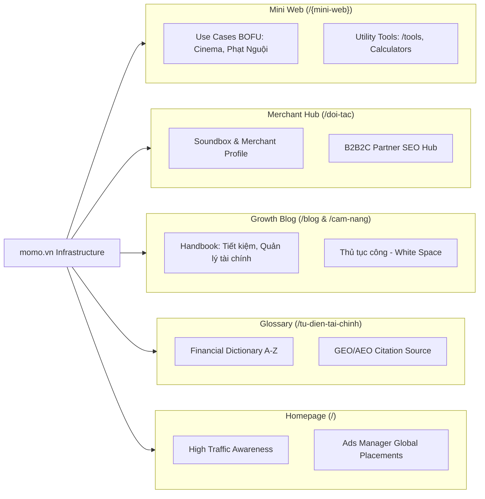

# 🚀 MoMo Content Strategy: Từ Thesis đến Thực thi

**Phiên bản:** v5.2 - Hợp nhất hệ phương pháp Inbound Fintech toàn cầu & MoSpark Growth OS
**North Star:** Incremental Activated Users from Web Channel (Incremental MAU)

---

## Chương 1: Luận đề Chiến lược (The Strategic Thesis)

### 1.1. Tại sao Inbound là con đường tất yếu của MoMo?

Trong bối cảnh Fintech 2026, MoMo đối mặt với 3 rào cản lớn mà Paid Acquisition không thể giải quyết triệt để:

1.  **Bẫy CAC (Customer Acquisition Cost):** Chi phí quảng cáo ngành tài chính đạt đỉnh (~$1,450/user toàn cầu). Inbound là cách duy nhất để giảm CAC trung bình thông qua tích lũy Authority và Trust theo thời gian.
2.  **Tường thành Niềm tin (Trust Barrier):** Chỉ 44% người dùng tin vào định chế tài chính số. Content không chỉ để lấy traffic, mà là công cụ **Tích lũy Niềm tin (Trust Accumulation)**. Người dùng đến từ Organic Search có tỷ lệ Retain cao hơn vì họ đến vì giá trị thực, không phải vì khuyến mãi.
3.  **Sự trỗi dậy của GEO (Generative Engine Optimization):** Người dùng đang hỏi AI thay vì Search. MoMo phải xuất hiện trong "Structured Context" của AI để không bị loại bỏ ngay từ giai đoạn tư vấn (Inference stage).

### 1.2. Mô hình Hybrid MoMo: Super App lai Content-Moat

MoMo đang ở vị trí độc bản, chưa có đối thủ 1-1 để sao chép. Chúng ta ghép nối 3 mô hình thành công nhất thế giới:

*   **Nhóm Super App (Alipay/Kakao):** Học cách build hệ sinh thái dịch vụ đa dạng.
*   **Nhóm Neobank (Wise/Revolut):** Học cách build **Utility Tools** (Calculator/Converter) để hút traffic quy mô lớn.
*   **Nhóm Content-Moat (NerdWallet/Investopedia):** Học cách build **Authority & Trust** thông qua hệ thống E-E-A-T và Glossary chuyên sâu.

---

## Chương 2: Hệ phương pháp Triển khai (Methodologies)

MoMo triển khai Content dựa trên các phương pháp cốt lõi sau:

### 2.1. Funnel 2.0: BOFU-First Strategy
Thay vì làm TOFU (Awareness) tràn lan, MoMo ưu tiên làm ngược từ dưới lên:
*   **BOFU (8% CR):** Tập trung vào Review sản phẩm MoMo, So sánh trực diện, Hướng dẫn đăng ký. Mục tiêu: **Convert ngay**.
*   **MOFU (0.5% CR):** Hướng dẫn giải quyết vấn đề (How-to), Case study người dùng thực. Mục tiêu: **Nuôi dưỡng niềm tin**.
*   **TOFU:** Giải thích khái niệm, tin tức thị trường. Mục tiêu: **Phủ thương hiệu**.

### 2.2. Kiến trúc Hub-Spoke (Topic Clusters)
Không viết bài rời rạc. Mỗi chủ đề (Vay, Thanh toán, Bảo hiểm) phải có:
*   **1 Hub (Pillar Page):** Bài viết tổng quan toàn diện (2,000-4,000 từ).
*   **Hệ thống Spoke (Clusters):** Các bài viết vệ tinh giải quyết từng ngách nhỏ của Hub.

### 2.3. Intent-First & JTBD Mapping
Keyword Volume chỉ là tham khảo, **Intent (Ý định)** mới là quyết định. Map nội dung theo "Jobs to be Done" của user:
*   *Job:* "Tôi cần trả tiền điện trước khi bị cắt" -> Content: Hướng dẫn tra cứu & đóng tiền điện MoMo (Transactional Intent).

### 2.4. Educational Entertainment & Interactive Content
Finance rất khô khan. MoMo thay thế "Static Articles" bằng:
*   **Calculators:** Công cụ tính lãi vay, tính BHXH, tính thuế TNCN. Đây là thỏi nam châm hút backlink và tạo giá trị thực (Utility).
*   **Interactive Guides:** Hướng dẫn từng bước qua Carousel hoặc video ngắn.

### 2.5. Content Atomization & Social Synergy (Mới)
Áp dụng nguyên lý "Create Once, Distribute Everywhere":
*   **Web-to-Social:** Một bài Pillar trên Web được "băm nhỏ" thành 5 infographic cho Facebook, 3 video ngắn TikTok và 1 chuỗi bài thảo luận trong MoMo Community.
*   **Social-to-Web:** Sử dụng tín hiệu từ mạng xã hội (Viral topics) để nhanh chóng sản xuất nội dung đón đầu Search/AI Search.

### 2.6. UGC & Social Proof Integration (Mới)
Lấy niềm tin từ chính người dùng MoMo (Nguyên lý Amazon/TripAdvisor):
*   **Review Sync:** Tự động đồng bộ các đánh giá 5 sao và bình luận tích cực từ App MoMo lên các bài viết/Landing Page tương ứng trên Web.
*   **User Authority:** Gắn các huy hiệu "Người dùng hạng Vàng" hoặc "Chuyên gia tài chính" cho các bình luận trên web để tăng E-E-A-T.

### 2.7. Programmatic SEO (pSEO) at Scale
Sử dụng MoSpark để tự động tạo hàng ngàn trang dựa trên dữ liệu (Dataset):
*   **Template:** "Cách thanh toán [Nhà cung cấp] qua MoMo".
*   **Template:** "Mã số khách hàng [Nhà cung cấp] tìm ở đâu".

### 2.8. Trust Architecture (E-E-A-T Systematic)
Xây dựng hệ thống tín hiệu uy tín:
*   **Author Credentials:** Mọi bài viết tài chính phải có Byline chuyên gia và Bio chi tiết.
*   **Editorial Policy:** Công khai quy trình biên tập và kiểm chứng thông tin.

---

## Chương 3: Kiến trúc Nội dung momo.vn (Content Architecture)

### 3.1. Phân lớp Content (The 3-Layer Architecture)

| Lớp | Trọng tâm | Tỷ lệ Effort | Công cụ |
|---|---|---|---|
| **Lớp Utility** | Calculators, Lookup Tools, pSEO | 60% | MoSpark Interactive Blocks |
| **Lớp Editorial** | Topic Clusters, Handbook, JTBD Blog | 30% | MoSpark GenAI Pipeline |
| **Lớp Trust** | Glossary, Author Bio, Case Studies | 10% | MoSpark Score Gate |

### 3.2. Bản đồ 5 Nhánh Content chính

---

## Chương 4: Hệ thống Vận hành & Đo lường

### 4.1. Quy trình Sản xuất 10 Bước (Editorial System)
1. Brief (SEO) -> 2. Research -> 3. Draft (AI-assisted) -> 4. Editorial Review -> 5. Compliance Check -> 6. SEO Optimization -> 7. Design/CTA -> 8. Final Approval -> 9. Publish -> 10. Track & Optimize.

> [!TIP]
> **Quản trị tính Duy nhất:** Toàn bộ quy trình này được quản lý tập trung thông qua **[[04_MOSPARK_PLATFORM/mospark_genai_content|MoSpark GenAI Content Engine]]**. Hệ thống sử dụng cơ chế **Keyword Master Registry** để kiểm soát Unique ID, đảm bảo không xảy ra tình trạng **Keyword Cannibalization** (Chồng chéo từ khóa) giữa các Use Case.

### 4.2. Đo lường Content ROI & Attribution
*   **Multi-touch Attribution:** Không chỉ đo Last-click. Theo dõi hành trình từ TOFU (Awareness) qua MOFU (Nurture) đến BOFU (Conversion).
*   **Primary Metric:** Incremental MUA (Monthly Unique Active Users) từ BigQuery.
*   **AEO/GEO Metric:** AI Referral Traffic & Citation Rate (Tỷ lệ được AI trích dẫn).

---

## Chương 5: Quản trị Phối hợp & SLA (Stakeholder Alignment)

Để giải quyết nút thắt "Compliance Bottleneck", MoMo áp dụng mô hình phối hợp chuẩn Fintech:

### 5.1. Mô hình Phân loại Rủi ro (Tiered Compliance)
| Tier | Loại nội dung | Người duyệt | SLA Phản hồi |
|---|---|---|---|
| **Tier 1** | Lifestyle, Tin tức chung, Thủ tục công | Inbound Lead (Mai) | < 24h |
| **Tier 2** | Blog tài chính, HDSD sản phẩm | SME (Product Owner) | < 48h |
| **Tier 3** | Financial Advice, Landing Page, Lãi suất | Legal & Compliance | < 72h |

### 5.2. Nguyên lý "Safe-Harbor" cho AI Content
AI Content không được tự động publish cho Tier 3. Mọi bài viết Tier 3 phải qua "Human-in-the-loop" (Fact-check thủ công) trước khi trình Legal, nhằm giảm thiểu rủi ro sai sót dữ liệu.

---

## Chương 6: Quản trị Vòng đời Nội dung (Lifecycle Management)

Giải quyết bài toán "Legacy Debt" của 1000+ bài viết cũ (2020-nay) theo mô hình của NerdWallet:

### 6.1. Chiến lược "Update - Merge - Prune"
*   **Update (Làm mới):** Ưu tiên Top 100 bài có traffic nhưng sụt giảm hạng (Content Decay). Cập nhật dữ liệu năm 2026 và cấu trúc lại cho GEO.
*   **Merge (Hợp nhất):** Gộp các bài viết ngắn, nội dung trùng lặp thành một Hub/Pillar Page cực kỳ chất lượng để tránh cạnh tranh nội bộ (Cannibalization).
*   **Prune (Cắt tỉa):** Xóa các bài viết không có traffic trong 12 tháng, không có giá trị thương hiệu và thực hiện Redirect 301 về Category hoặc Homepage.

### 6.2. Cơ chế "Last Reviewed" tự động
Mọi bài viết tài chính sau 6 tháng phải được AI đánh dấu là "Cần kiểm tra". Hệ thống MoSpark sẽ gửi thông báo cho chuyên gia/SME để xác nhận thông tin vẫn chính xác, kèm tag `Last Reviewed: [Date]` để tăng tín hiệu Trust với Google.

---

## Chương 7: Lộ trình Thực thi & Quản trị Rủi ro (Roadmap)

### 7.1. Các Giai đoạn Tăng trưởng
*   **Giai đoạn 0 (0-3 tháng): Foundation** - Build Trust Architecture, Audit bài cũ, GSC Integration.
*   **Giai đoạn 1 (3-6 tháng): Scale** - Launch Topic Clusters, Calculators, pSEO MVP.
*   **Giai đoạn 2 (6+ tháng): Compound** - Scale pSEO toàn diện, Tự động hóa Lifecycle Management.

### 7.2. Quản trị Rủi ro (Risk Mitigation)
*   **Thin Content:** Đảm bảo pSEO có dữ liệu thực (Real-time feed).
*   **E-E-A-T Shortage:** Kết hợp nhân sự nội bộ (SME) & Đối tác học thuật.

---

## Chương 8: Nhật ký Thay đổi (Version Log)

| Phiên bản | Ngày | Nội dung thay đổi | Người thực hiện |
| :--- | :--- | :--- | :--- |
| **v4.1** | 2026-05-14 | Khởi tạo Playbook nội dung dựa trên Fintech Benchmark. | Văn Hiến |
| **v5.0** | 2026-05-16 | Nâng cấp thành Luận đề Chiến lược & Thực thi (v5.0). | Văn Hiến |
| **v5.1** | 2026-05-16 | Tái cấu trúc: Tài liệu liên kết xuống cuối & thêm Version Log. | Văn Hiến |
| **v5.2** | 2026-05-16 | Bổ sung: SLA Framework, Lifecycle Management, UGC & Synergy. | Văn Hiến |

---

## Chương 9: Tài liệu Liên kết
*   **Chiến lược SEO/GEO:** [[01_STRATEGIC_PLAN/seo-geo-direction|SEO & GEO Direction]]
*   **Chỉ số OKR 2026:** [[01_STRATEGIC_PLAN/web-momo-okrs-2026|Web MoMo OKRs 2026]]
*   **Nền tảng MoSpark:** [[04_MOSPARK_PLATFORM/mospark_master|MoSpark Master Doc]]
*   **Audit Skill:** [[03_SKILLS/Seo-Geo-audit|Kỹ năng Audit SEO/GEO]]

---
*Maintained by: Văn Hiến (SEO & GEO Lead) | Last updated: 2026-05-16*
