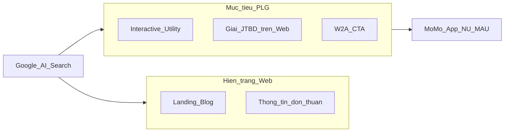
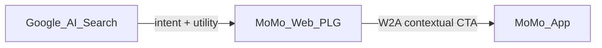
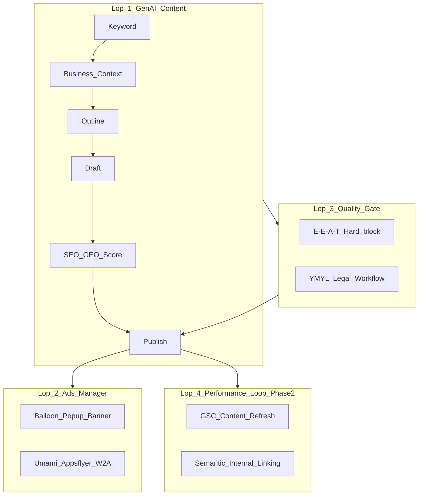
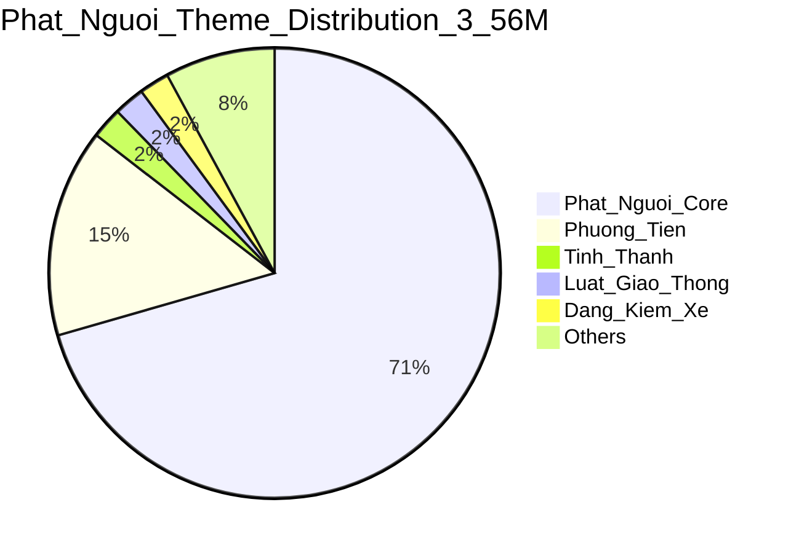

# MoSpark Strategic Deck

> **Mục đích:** Một luồng đọc chung cho C-Level và Cell Team — từ *tại sao* (thị trường) đến *làm thế nào* (onboard Use Case trên MoSpark).
>
> **Thời gian đọc:** 15–25 phút.

---

## 0. Cover & How to Read

**Audience:** Both

**Takeaway:** MoSpark là Growth OS biến nhu cầu tìm kiếm ngoài App thành traffic uy tín và chuyển đổi vào App MoMo.

| | |
|:---|:---|
| **Vision (one-liner)** | Scale Web MoMo thành **Vietnam's #1 Financial & Payment Content Hub** — Product-Led Growth, chuyển search intent → app transactions → New User / MAU |
| **Platform** | MoSpark — AI-Powered Growth OS |
| **Division** | GPD (Growth Platform Division) |
| **Governance SEO/GEO** | SEO & GEO Lead |

**Lộ trình đọc đề xuất:**

| Đối tượng | Đọc section | Bỏ qua (nếu thiếu thời gian) |
|:---|:---|:---|
| **C-Level** | 1 → 4 → 5 → 6 → 10 → 11 | 8, 9, 12 (chi tiết vận hành) |
| **Cell Team** | 1 → 4 → 7 → 8 → 9 → 12 | 5 (benchmark sâu) |

---

## 1. The Opportunity — Search Engine Market Inventory

**Audience:** C-Level · Both

**Takeaway:** Thị trường tìm kiếm khổng lồ (179M+/tháng) đang mở — MoMo có sản phẩm in-app nhưng vắng bóng hoặc SoV rất thấp trên Google.

> MoMo vận hành rất nhiều Use Case (Tài chính, Bảo hiểm, Thanh toán, Đời sống, VTTI...). Mỗi Use Case có người dùng tiềm năng đang tìm kiếm trên Google mỗi ngày — nhưng **khả năng khám phá ngoài App còn yếu**.

**Key points:**

- **~179.3 triệu** lượt tìm kiếm/tháng trên Google Search có nhu cầu liên quan các Use Case của MoMo
- Thị trường **có nhu cầu cao, MoMo vắng bóng hoặc SoV thấp** — đối thủ ngân hàng/fintech đang chiếm Google Search
- **Khoảng cách cốt lõi:** Sản phẩm mạnh trong App - Khám phá yếu ngoài App

**Bảng minh họa — Gap thị trường (SoV MoMo):**

| Ngách | Volume/tháng (ước) | SoV MoMo | Cơ hội |
|:---|---:|:---|:---|
| Giá vàng | 65.8M | 0% | Authority + utility ticker |
| Tỷ giá | 11M | 0% | pSEO / converter (Wise model) |
| Vay tiền | 3M+ | ~6% | PLG calculator + W2A |
| Phạt nguội | ~3.56M | Đang xây | Tool tra cứu + TTDK data |
| BHYT | ~1.4M | 0% | YMYL + mua trực tiếp |
| Ví Trả Sau | ~135K | 54% | Duy trì + mở rộng cluster |

---

## 2. The Gap Today — Problem Statement

**Audience:** Both

**Takeaway:** Web hiện tại chủ yếu là Landing/Blog thông tin — chưa giải JTBD, chưa có công cụ tiện ích, chưa đóng vòng chuyển đổi App.

**Key points:**

- **Hiện trạng:** Nội dung sản phẩm trên Web = trang Landing/Blog độc lập, cung cấp thông tin
- **Thiếu:** Kết nối Jobs-to-be-Done thực; công cụ/tiện ích hỗ trợ trong hành trình Search & Discovery
- **Hệ quả:** User tìm thấy MoMo nhưng không giải quyết được vấn đề → không vào App



---

## 3. North Star — Vision & Strategic Goal

**Audience:** C-Level

**Takeaway:** Web MoMo = Content Hub tài chính/thanh toán #1 VN, đo thành công bằng NU/MAU — không phải pageview.

**Product Vision:**

> Scale Web MoMo to **Vietnam's #1 Financial & Payment Content Hub** through **Product-Led Growth**, leveraging an **Agentic, SEO/GEO-first platform** to transform underserved market needs into high-authority traffic.

**Mục tiêu chiến lược:**

| Mục tiêu | Định nghĩa thành công |
|:---|:---|
| **Content Authority** | Top 3–5 Google cho từ khóa ngách trọng điểm; 3–5 vertical "đánh dứt điểm" |
| **GEO / AI Citation** | Nội dung semantic đủ sâu để ChatGPT, Gemini trích dẫn MoMo |
| **Conversion** | Search intent → discovery → **App transaction** → New User / New To Service / MAU |

**Luồng giá trị (không phải Traffic Game):**

```
Content → Keywords → Ranking → Use case → User journey → App / Transaction (NU / MAU)
```

---

## 4. Three Value Layers — Strategic Framework

**Audience:** Both

**Takeaway:** Chiến lược Web phục vụ đồng thời MoMo (brand/authority), Cell Team (PaaS), và User (PLG utility).

| Stakeholder | Pain (Today) | MoSpark / Web Platform | Outcome |
|:---|:---|:---|:---|
| **Layer 1 - MoMo** | Brand mạnh in-app; SoV 0–6% trên Google/AI ở ngách lớn; đối thủ chiếm Search | Sở hữu 3–5 Strategic Use-Cases vị trí #1; GEO citation; Content Authority | Thị trường underserved → traffic uy tín → conversion |
| **Layer 2 - Cell Team** | Use case tốt in-app; thiếu nguồn lực build Web nhanh, chuẩn, đo ROI | **Platform-as-a-Service:** tư vấn + quy trình + nền tảng PLG/AI | JTBD của Cell được giải với solution, process, platform |
| **Layer 3 - User MoMo** | Content MoMo chưa đúng/đủ để giải JTBD qua Search/AI Chatbot | **PLG Web:** Công cụ tiện ích + User Journey Search & Discovery | Chuyển đổi App → NU / New To Service / MAU |



---

## 5. Four Growth Pillars — How We Win

**Audience:** C-Level

**Takeaway:** Bốn trụ cột kỹ thuật–chất lượng–GEO–PLG vận hành đồng bộ trên toàn momo.vn.

| Pillar | Nội dung | Kết quả |
|:---|:---|:---|
| **1. Technical & pSEO** | AI-Ready DOM; programmatic pages (63 tỉnh, cluster ngách) | Phủ volume với chi phí thấp |
| **2. E-E-A-T Quality Gate** | Named Author (YMYL); Editorial Policy; PO/Legal sign-off | Trust trước thuật toán |
| **3. GEO / AIO** | Answer-first structure; Schema JSON-LD; entity clarity | Citation trên AI Overviews / ChatGPT / Gemini |
| **4. PLG & W2A** | Interactive utilities (lookup, calculator); Contextual CTA | W2A ≥ **12.5%**; Aha moment trên Web |

> **Good SEO = Good GEO** (Google stance): Không có thuật toán GEO riêng — SEO xuất sắc + E-E-A-T tự lên AI Search.

---

## 6. What is MoSpark — AI-Powered Growth OS

**Audience:** Both

**Takeaway:** MoSpark không phải CMS — là hệ điều hành tăng trưởng 4 lớp: sản xuất → monetize/contextual ads → quality gate → performance loop.

**Định nghĩa:**

> **MoSpark** = **Growth OS** cho momo.vn — "Cỗ máy tăng trưởng tự trị" sản xuất, tối ưu và chuyển đổi dựa trên Search Intent và AI.



| Lớp | Module | Vai trò |
|:---|:---|:---|
| **Lớp 1** | GenAI Content Pipeline | Workflow 7 bước; Claude/Gemini API; Skill Hub theo Use Case |
| **Lớp 2** | Ads Manager | Dynamic placement theo ngữ cảnh bài; W2A tracking |
| **Lớp 3** | Quality & Compliance | SEO/GEO score 0–100; hard-block; Legal YMYL |
| **Lớp 4** | Performance Loop *(Phase 2)* | GSC refresh; semantic linking; Health Shield |

**Roadmap tóm tắt:**

| Phase | Timeline | Focus |
|:---|:---|:---|
| **Phase 1** | Hiện tại | Landing/Blog Builder; GenAI scale; Umami + Appsflyer |
| **Phase 2** | Q3–Q4/2026 | GSC Auto-Refresher; Interactive Blocks; Health Shield |
| **Phase 3** | 2027+ | Agentic Use Case discovery; Personalized LP |

---

## 7. Platform-as-a-Service — Cell Team Model

**Audience:** Cell Team · Both

**Takeaway:** Cell Team không phải tự dựng Web từ zero — GPD cung cấp consult, platform, pipeline, và chuẩn đo lường.

**PaaS = 4 khối hỗ trợ:**

| Khối | GPD / MoSpark cung cấp | Cell Team mang lại |
|:---|:---|:---|
| **Consult** | SEO/GEO, sitemap, pSEO feasibility, cannibalization | Business Context, PO prioritization |
| **Build** | Mini Web, Landing Builder, Mobase V2 boilerplate | Dev feature, API integration |
| **Produce** | MoSpark GenAI Flow 1/2; Blog Editor; Keyword Registry | Content review, Legal (YMYL) |
| **Measure** | Umami Web layer standard; W2A spec | DA setup App-layer tracking |

**RACI rút gọn:**

| Hoạt động | GPD (MoSpark) | Cell Team | Inbound |
|:---|:---|:---|:---|
| BRD / Web scope | Consult + sign-off SEO | Owner product | SEO ranking (một số FS UC) |
| Publish gate | Audit 100% URL momo.vn | Execute build | Foundation checklist via GPD |
| GenAI content | Platform + governance | PM/Growth input context | Không trực tiếp Web Platform |

> Inbound hỗ trợ SEO plan/off-page cho một số FS use case — mọi publish trên Web Platform vẫn qua chuẩn GPD/MoSpark.

**Framework 5 bước Cell + GPD:** Research → Build Web/Function → Content Production → Tracking → Evaluation

---

## 8. PLG Product Standard — Mini Web Checklist

**Audience:** Cell Team

**Takeaway:** Mỗi Mini Web mới phải đạt chuẩn PLG + SEO/GEO trước publish — utility-first, không chỉ blog.

**Nguyên tắc Utility-First:**

- Content = **supporting layer** (discoverability + education)
- Core value = **Interactive Utility** giải friction trong vài giây (tra cứu, tính toán, so sánh)
- CTA = **contextual** theo kết quả user vừa nhận được

**10 tiêu chí bắt buộc trước Go-Live:**

| # | Tiêu chí |
|:---|:---|
| 1 | **Business Context** 12 fields hoàn chỉnh |
| 2 | SEO/GEO Project ID + URL hierarchy đã map |
| 3 | Primary Keyword + **Global** cannibalization check |
| 4 | Utility widget HOẶC documented exempt (content-only vertical) |
| 5 | Answer-first H2 + Schema JSON-LD (FAQ/HowTo nếu phù hợp) |
| 6 | E-E-A-T: Named Author nếu YMYL/tài chính |
| 7 | SEO/GEO Score đạt ngưỡng publish (hard-block nếu fail) |
| 8 | Contextual CTA + App deep link đã test |
| 9 | Umami events + W2A funnel defined (Web layer) |
| 10 | Legal sign-off (YMYL) + disclaimer compliance |

---

## 9. Content & GEO Engine — GenAI Pipeline

**Audience:** Cell Team

**Takeaway:** Mọi nội dung scale qua MoSpark GenAI với registry từ khóa toàn cục — 1 Primary Keyword = 1 URL Master.

**Workflow 7 bước:**

| Bước | Tên | Output | Owner |
|:---|:---|:---|:---|
| 1 | Tạo Use Case / Map Project | Project ID | PM/Growth |
| 2 | Business Context | Source of Truth | PM + SEO Lead |
| 3 | Keyword Creation | Registry entry | Content |
| 4 | AI Outline | Outline Final | Content |
| 5 | AI Blog Detail | Draft | Claude API |
| 6 | Review Quality | SEO/GEO Score pass | SEO/GEO Lead |
| 7 | Sync MoSpark | Live momo.vn | Content |

**Hai luồng sản xuất:**

| Luồng | Mô tả | MoSpark vai trò |
|:---|:---|:---|
| **Flow 1 - External AI** | AI cá nhân → paste Blog Editor → Publish | CMS + Publish Gate |
| **Flow 2 - In-System GenAI** *(khuyến nghị)* | 100% trên MoSpark GenAI | Production Lab |

**Quy tắc cứng (Cannibalization):**

1. Mọi Primary Keyword thuộc một SEO/GEO Project (không "mồ côi")
2. **1 Keyword - 1 Blog - 1 URL Master**
3. Registry quét **Global** — cross-project conflict → cross-link, không tạo URL trùng

---

## 10. Proof — Case Study: Phạt Nguội

**Audience:** Both

**Takeaway:** Mô hình Search → Discovery → App đã được chứng minh trên vertical 3.56M searches/tháng.

| Metric | Value |
|:---|:---|
| **Market volume** | ~3.56M searches/tháng |
| **MoMo edge** | Partnership TTDK; Official data; Trust Moat vs phatnguoi.com |
| **Model** | Wise-style pSEO + Web Tool (lookup không login) |
| **Status (05/2026)** | SEM LIVE · Umami tracking · GenAI Ready content |

**Growth framework 3 giai đoạn:**

| Giai đoạn | Hành động | Kết quả |
|:---|:---|:---|
| **Short-term** | Web Tool tra cứu real-time | W2A → New User |
| **Mid-term** | Interactive Camera Map | Chiếm cluster "camera phạt nguội" |
| **Long-term** | pSEO 63 tỉnh/thành | Topical Authority + GEO citation |



---

## 11. 2026 OKRs & Metrics

**Audience:** C-Level

**Takeaway:** Mọi initiative MoSpark align về 6M MUA, Top 3–5 keywords, 12.5% W2A, và GEO measurement.

### Objective 1 - Financial Authority (Growth)

| KR | Target | Baseline |
|:---|:---|:---|
| **KR 1.1** MUA | **6.0M** | 3.0M |
| **KR 1.2** Ranking | **Top 3–5** (50+ keywords ngách) | Đang ghi nhận |
| **KR 1.3** W2A | **≥ 12.5%** | 8.2% (05/2026) |
| **KR 1.4** AI Referral | Xác lập đo lường GEO | 0 |

### Objective 2 - AI Platform (MoSpark enablement)

| KR | Tiêu chuẩn |
|:---|:---|
| **KR 2.1** | 100% Mini Web mới đạt chuẩn SEO/GEO tự vận hành |
| **KR 2.2** | GenAI pipeline ổn định, scale chất lượng cao |
| **KR 2.3** | Help Center tối ưu SEO/GEO |

### Strategic verticals 2026 (đánh dứt điểm)

> Tập trung **3–5 verticals** trước khi mở rộng — đề xuất align với thesis: **FS (Vay/CIC)**, **VTTI**, **PS (Phạt Nguội)**, **Cinema/Merchant**. Danh sách chính thức chờ leadership chốt.

| Chỉ số chiến lược | Target 2026 |
|:---|:---|
| Vertical chiến lược | 3–5 |
| SoV | Top 3–5 Google |
| Traffic MUA | 5–6M (OKR: 6M) |
| W2A | ≥ 12.5% |

---

## 12. Cell Team Playbook — Onboard in 5 Steps

**Audience:** Cell Team

**Takeaway:** Bắt đầu Use Case mới trên MoSpark theo 5 bước — không publish nếu chưa qua checklist Section 8.

| Step | Hành động | Deliverable | Liên hệ GPD |
|:---|:---|:---|:---|
| **1. Research** | Volume/SoV, intent map, competitor gap | Keyword brief | SEO consult |
| **2. Business Context** | Điền 12 fields template | Context doc trong MoSpark | Sign-off SEO Lead |
| **3. Build** | Mini Web + utility widget + Mobase | Staging URL | PM Web Platform |
| **4. Content** | GenAI Flow 2 (khuyến nghị) hoặc Flow 1 + gate | Published URLs | Content + SEO score |
| **5. Track & Evaluate** | Umami + W2A; monthly SoV/MUA review | Dashboard | DA Cell + GPD standard |

**Ai làm gì (mỗi Cell Team):**

| Role | Trách nhiệm |
|:---|:---|
| **PO** | Roadmap, stakeholder, ưu tiên scope |
| **Growth/Business** | KPI, business case, experiment |
| **Dev** | Feature, API, deploy |
| **DA** | BigQuery truth; App-layer post-CTA |
| **Legal** | YMYL review |

**Lời mời hành động:**

1. Chọn Use Case → book **Feasibility Sync** với GPD (Out-App Traffic)
2. Hoàn thành **Business Context 12 fields** trước khi tạo keyword
3. Không bypass **Publish Gate** — mọi URL momo.vn đều audit

---

## Appendix A: Glossary

| Thuật ngữ | Định nghĩa ngắn |
|:---|:---|
| **PLG** | Product-Led Growth — Web giải JTBD bằng utility, không chỉ content |
| **GEO** | Generative Engine Optimization — tối ưu citation trên AI Search |
| **SoV** | Share of Voice — % hiển thị MoMo vs đối thủ trên SERP/AI |
| **W2A** | Web-to-App conversion — deep link sau CTA contextual |
| **YMYL** | Your Money Your Life — nội dung tài chính, cần E-E-A-T cứng |
| **pSEO** | Programmatic SEO — sinh trang scale từ template + data |
| **MUA** | Monthly Unique Audience — metric chính 2026 (BigQuery) |

---

## Appendix B: Items cần leadership chốt

- Nguồn chứng minh số **179.3M searches/tháng** — cần gắn báo cáo nội bộ khi present
- Danh sách chính thức **3–5 Strategic Use-Cases 2026**
- Executive sponsor (VP GPD / C-Level owner)

---

## Change Log

| Phiên bản | Ngày | Nội dung thay đổi |
|-----------|------|-------------------|
| **v1.0** | 2026-05-21 | Khởi tạo Strategic Deck. |
| **v1.1** | 2026-05-21 | Bổ sung Website Proposal Outline. |
| **v1.2** | 2026-05-23 | Chuẩn hóa format: xóa 30+ Obsidian links, xóa callout blocks, xóa checkboxes, xóa Website Proposal Outline (quá technical cho C-Level), xóa Appendix Document Map. Giữ nguyên 12 sections chiến lược. |

*Maintained by: GPD — Out-App Traffic · Governance: SEO & GEO Lead · v1.2 — May 2026*
