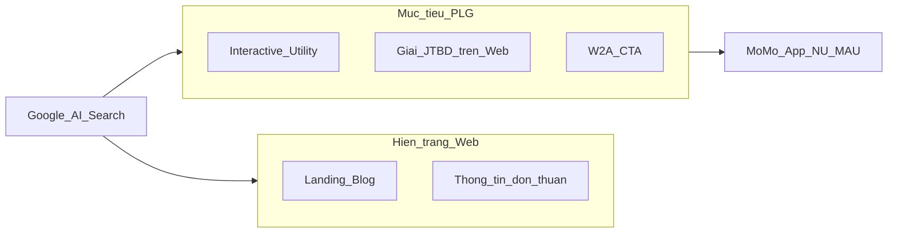
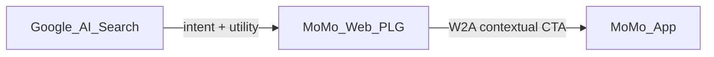
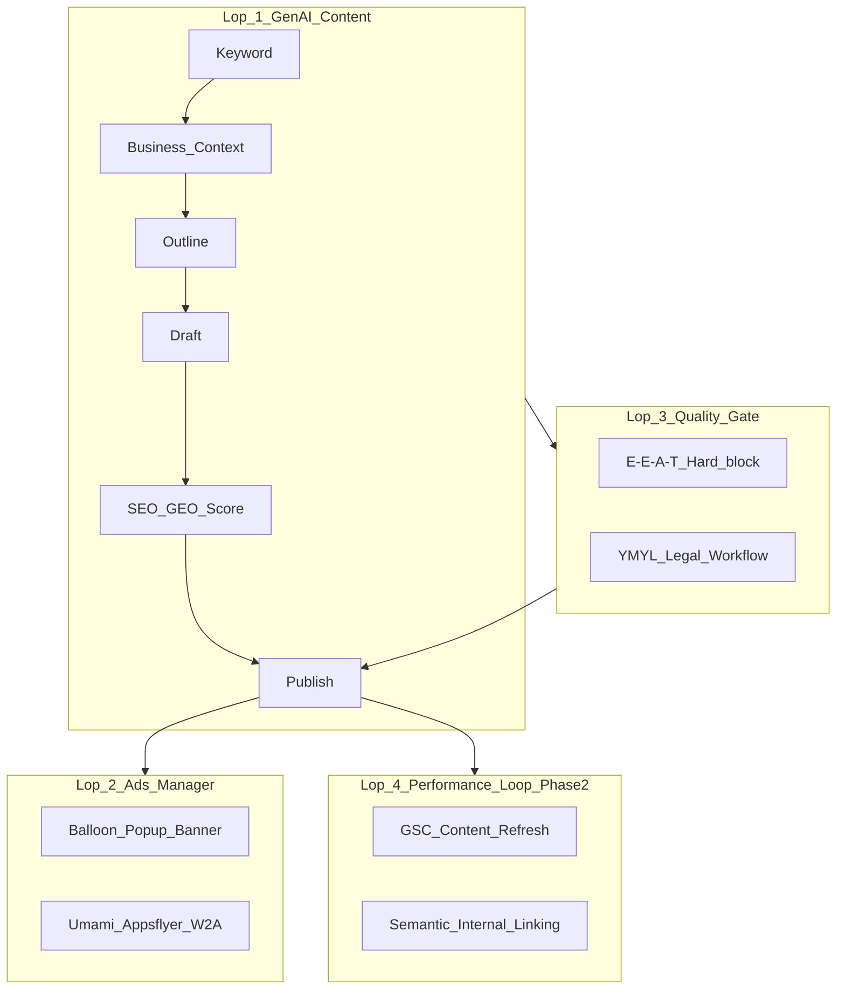
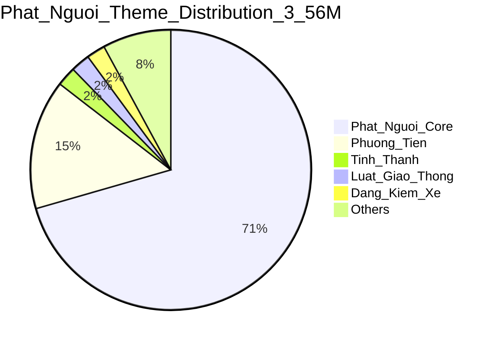

# MoSpark Strategic Deck

> **Mục đích:** Một luồng đọc chung cho C-Level và Cell Team — từ *tại sao* (thị trường) đến *làm thế nào* (onboard Use Case trên MoSpark).
>
> **Thời gian đọc:** 15–25 phút.

---

## 0. Cover & How to Read

**Audience:** Both

**Takeaway:** MoSpark là Growth OS biến nhu cầu tìm kiếm ngoài App thành traffic uy tín và chuyển đổi vào App MoMo.

<table style="width:100%; border-collapse:collapse; border:1.5px solid #64748b; margin:1em 0; font-size:0.9em;">
  <thead>
    <tr style="background-color:#f1f5f9;">
      <th style="border:1.5px solid #64748b; padding:8px 12px; text-align:left; font-weight:700;"></th>
      <th style="border:1.5px solid #64748b; padding:8px 12px; text-align:left; font-weight:700;"></th>
    </tr>
  </thead>
  <tbody>
    <tr>
      <td style="border:1px solid #94a3b8; padding:8px 12px; text-align:left;"><strong>Vision (one-liner)</strong></td>
      <td style="border:1px solid #94a3b8; padding:8px 12px; text-align:left;">Scale Web MoMo thành <strong>Vietnam's #1 Financial & Payment Content Hub</strong> — Product-Led Growth, chuyển search intent → app transactions → New User / MAU</td>
    </tr>
    <tr style="background-color:#f8fafc;">
      <td style="border:1px solid #94a3b8; padding:8px 12px; text-align:left;"><strong>Platform</strong></td>
      <td style="border:1px solid #94a3b8; padding:8px 12px; text-align:left;">MoSpark — AI-Powered Growth OS</td>
    </tr>
    <tr>
      <td style="border:1px solid #94a3b8; padding:8px 12px; text-align:left;"><strong>Division</strong></td>
      <td style="border:1px solid #94a3b8; padding:8px 12px; text-align:left;">GPD (Growth Platform Division)</td>
    </tr>
    <tr style="background-color:#f8fafc;">
      <td style="border:1px solid #94a3b8; padding:8px 12px; text-align:left;"><strong>Governance SEO/GEO</strong></td>
      <td style="border:1px solid #94a3b8; padding:8px 12px; text-align:left;">Web Product Lead</td>
    </tr>
  </tbody>
</table>

**Lộ trình đọc đề xuất:**

<table style="width:100%; border-collapse:collapse; border:1.5px solid #64748b; margin:1em 0; font-size:0.9em;">
  <thead>
    <tr style="background-color:#f1f5f9;">
      <th style="border:1.5px solid #64748b; padding:8px 12px; text-align:left; font-weight:700;">Đối tượng</th>
      <th style="border:1.5px solid #64748b; padding:8px 12px; text-align:left; font-weight:700;">Đọc section</th>
      <th style="border:1.5px solid #64748b; padding:8px 12px; text-align:left; font-weight:700;">Bỏ qua (nếu thiếu thời gian)</th>
    </tr>
  </thead>
  <tbody>
    <tr>
      <td style="border:1px solid #94a3b8; padding:8px 12px; text-align:left;"><strong>C-Level</strong></td>
      <td style="border:1px solid #94a3b8; padding:8px 12px; text-align:left;">1 → 4 → 5 → 6 → 10 → 11</td>
      <td style="border:1px solid #94a3b8; padding:8px 12px; text-align:left;">8, 9, 12 (chi tiết vận hành)</td>
    </tr>
    <tr style="background-color:#f8fafc;">
      <td style="border:1px solid #94a3b8; padding:8px 12px; text-align:left;"><strong>Cell Team</strong></td>
      <td style="border:1px solid #94a3b8; padding:8px 12px; text-align:left;">1 → 4 → 7 → 8 → 9 → 12</td>
      <td style="border:1px solid #94a3b8; padding:8px 12px; text-align:left;">5 (benchmark sâu)</td>
    </tr>
  </tbody>
</table>

---

## 1. The Opportunity — Search Engine Market Inventory

**Audience:** C-Level · Both

**Takeaway:** Thị trường tìm kiếm khổng lồ (179M+/tháng) đang mở — MoMo có sản phẩm in-app nhưng vắng bóng hoặc SoV rất thấp trên Google.

> MoMo vận hành rất nhiều Use Case (Tài chính, Bảo hiểm, Thanh toán, Đời sống, VTTI...). Mỗi Use Case có người dùng tiềm năng đang tìm kiếm trên Google mỗi ngày — nhưng **khả năng khám phá ngoài App còn yếu**.

**Key points:**

- **~179.3 triệu** lượt tìm kiếm/tháng trên Google Search có nhu cầu liên quan các Use Case của MoMo
- Thị trường **có nhu cầu cao, MoMo vắng bóng hoặc SoV thấp** — đối thủ ngân hàng/fintech đang chiếm Google Search
- **Khoảng cách cốt lõi:** Sản phẩm mạnh trong App - Khám phá yếu ngoài App

**Bảng minh họa — Gap thị trường (SoV MoMo):**

<table style="width:100%; border-collapse:collapse; border:1.5px solid #64748b; margin:1em 0; font-size:0.9em;">
  <thead>
    <tr style="background-color:#f1f5f9;">
      <th style="border:1.5px solid #64748b; padding:8px 12px; text-align:left; font-weight:700;">Ngách</th>
      <th style="border:1.5px solid #64748b; padding:8px 12px; text-align:right; font-weight:700;">Volume/tháng (ước)</th>
      <th style="border:1.5px solid #64748b; padding:8px 12px; text-align:left; font-weight:700;">SoV MoMo</th>
      <th style="border:1.5px solid #64748b; padding:8px 12px; text-align:left; font-weight:700;">Cơ hội</th>
    </tr>
  </thead>
  <tbody>
    <tr>
      <td style="border:1px solid #94a3b8; padding:8px 12px; text-align:left;">Giá vàng</td>
      <td style="border:1px solid #94a3b8; padding:8px 12px; text-align:right;">65.8M</td>
      <td style="border:1px solid #94a3b8; padding:8px 12px; text-align:left;">0%</td>
      <td style="border:1px solid #94a3b8; padding:8px 12px; text-align:left;">Authority + utility ticker</td>
    </tr>
    <tr style="background-color:#f8fafc;">
      <td style="border:1px solid #94a3b8; padding:8px 12px; text-align:left;">Tỷ giá</td>
      <td style="border:1px solid #94a3b8; padding:8px 12px; text-align:right;">11M</td>
      <td style="border:1px solid #94a3b8; padding:8px 12px; text-align:left;">0%</td>
      <td style="border:1px solid #94a3b8; padding:8px 12px; text-align:left;">pSEO / converter (Wise model)</td>
    </tr>
    <tr>
      <td style="border:1px solid #94a3b8; padding:8px 12px; text-align:left;">Vay tiền</td>
      <td style="border:1px solid #94a3b8; padding:8px 12px; text-align:right;">3M+</td>
      <td style="border:1px solid #94a3b8; padding:8px 12px; text-align:left;">~6%</td>
      <td style="border:1px solid #94a3b8; padding:8px 12px; text-align:left;">PLG calculator + W2A</td>
    </tr>
    <tr style="background-color:#f8fafc;">
      <td style="border:1px solid #94a3b8; padding:8px 12px; text-align:left;">Phạt nguội</td>
      <td style="border:1px solid #94a3b8; padding:8px 12px; text-align:right;">~3.56M</td>
      <td style="border:1px solid #94a3b8; padding:8px 12px; text-align:left;">Đang xây</td>
      <td style="border:1px solid #94a3b8; padding:8px 12px; text-align:left;">Tool tra cứu + TTDK data</td>
    </tr>
    <tr>
      <td style="border:1px solid #94a3b8; padding:8px 12px; text-align:left;">BHYT</td>
      <td style="border:1px solid #94a3b8; padding:8px 12px; text-align:right;">~1.4M</td>
      <td style="border:1px solid #94a3b8; padding:8px 12px; text-align:left;">0%</td>
      <td style="border:1px solid #94a3b8; padding:8px 12px; text-align:left;">YMYL + mua trực tiếp</td>
    </tr>
    <tr style="background-color:#f8fafc;">
      <td style="border:1px solid #94a3b8; padding:8px 12px; text-align:left;">Ví Trả Sau</td>
      <td style="border:1px solid #94a3b8; padding:8px 12px; text-align:right;">~135K</td>
      <td style="border:1px solid #94a3b8; padding:8px 12px; text-align:left;">54%</td>
      <td style="border:1px solid #94a3b8; padding:8px 12px; text-align:left;">Duy trì + mở rộng cluster</td>
    </tr>
  </tbody>
</table>

---

## 2. The Gap Today — Problem Statement

**Audience:** Both

**Takeaway:** Web hiện tại chủ yếu là Landing/Blog thông tin — chưa giải JTBD, chưa có công cụ tiện ích, chưa đóng vòng chuyển đổi App.

**Key points:**

- **Hiện trạng:** Nội dung sản phẩm trên Web = trang Landing/Blog độc lập, cung cấp thông tin
- **Thiếu:** Kết nối Jobs-to-be-Done thực; công cụ/tiện ích hỗ trợ trong hành trình Search & Discovery
- **Hệ quả:** User tìm thấy MoMo nhưng không giải quyết được vấn đề → không vào App



---

## 3. North Star — Vision & Strategic Goal

**Audience:** C-Level

**Takeaway:** Web MoMo = Content Hub tài chính/thanh toán #1 VN, đo thành công bằng NU/MAU — không phải pageview.

**Product Vision:**

> Scale Web MoMo to **Vietnam's #1 Financial & Payment Content Hub** through **Product-Led Growth**, leveraging an **Agentic, SEO/GEO-first platform** to transform underserved market needs into high-authority traffic.

**Mục tiêu chiến lược:**

<table style="width:100%; border-collapse:collapse; border:1.5px solid #64748b; margin:1em 0; font-size:0.9em;">
  <thead>
    <tr style="background-color:#f1f5f9;">
      <th style="border:1.5px solid #64748b; padding:8px 12px; text-align:left; font-weight:700;">Mục tiêu</th>
      <th style="border:1.5px solid #64748b; padding:8px 12px; text-align:left; font-weight:700;">Định nghĩa thành công</th>
    </tr>
  </thead>
  <tbody>
    <tr>
      <td style="border:1px solid #94a3b8; padding:8px 12px; text-align:left;"><strong>Content Authority</strong></td>
      <td style="border:1px solid #94a3b8; padding:8px 12px; text-align:left;">Top 3–5 Google cho từ khóa ngách trọng điểm; 3–5 vertical "đánh dứt điểm"</td>
    </tr>
    <tr style="background-color:#f8fafc;">
      <td style="border:1px solid #94a3b8; padding:8px 12px; text-align:left;"><strong>GEO / AI Citation</strong></td>
      <td style="border:1px solid #94a3b8; padding:8px 12px; text-align:left;">Nội dung semantic đủ sâu để ChatGPT, Gemini trích dẫn MoMo</td>
    </tr>
    <tr>
      <td style="border:1px solid #94a3b8; padding:8px 12px; text-align:left;"><strong>Conversion</strong></td>
      <td style="border:1px solid #94a3b8; padding:8px 12px; text-align:left;">Search intent → discovery → <strong>App transaction</strong> → New User / New To Service / MAU</td>
    </tr>
  </tbody>
</table>

**Luồng giá trị (không phải Traffic Game):**

```
Content → Keywords → Ranking → Use case → User journey → App / Transaction (NU / MAU)
```

---

## 4. Three Value Layers — Strategic Framework

**Audience:** Both

**Takeaway:** Chiến lược Web phục vụ đồng thời MoMo (brand/authority), Cell Team (PaaS), và User (PLG utility).

<table style="width:100%; border-collapse:collapse; border:1.5px solid #64748b; margin:1em 0; font-size:0.9em;">
  <thead>
    <tr style="background-color:#f1f5f9;">
      <th style="border:1.5px solid #64748b; padding:8px 12px; text-align:left; font-weight:700;">Stakeholder</th>
      <th style="border:1.5px solid #64748b; padding:8px 12px; text-align:left; font-weight:700;">Pain (Today)</th>
      <th style="border:1.5px solid #64748b; padding:8px 12px; text-align:left; font-weight:700;">MoSpark / Web Platform</th>
      <th style="border:1.5px solid #64748b; padding:8px 12px; text-align:left; font-weight:700;">Outcome</th>
    </tr>
  </thead>
  <tbody>
    <tr>
      <td style="border:1px solid #94a3b8; padding:8px 12px; text-align:left;"><strong>Layer 1 - MoMo</strong></td>
      <td style="border:1px solid #94a3b8; padding:8px 12px; text-align:left;">Brand mạnh in-app; SoV 0–6% trên Google/AI ở ngách lớn; đối thủ chiếm Search</td>
      <td style="border:1px solid #94a3b8; padding:8px 12px; text-align:left;">Sở hữu 3–5 Strategic Use-Cases vị trí #1; GEO citation; Content Authority</td>
      <td style="border:1px solid #94a3b8; padding:8px 12px; text-align:left;">Thị trường underserved → traffic uy tín → conversion</td>
    </tr>
    <tr style="background-color:#f8fafc;">
      <td style="border:1px solid #94a3b8; padding:8px 12px; text-align:left;"><strong>Layer 2 - Cell Team</strong></td>
      <td style="border:1px solid #94a3b8; padding:8px 12px; text-align:left;">Use case tốt in-app; thiếu nguồn lực build Web nhanh, chuẩn, đo ROI</td>
      <td style="border:1px solid #94a3b8; padding:8px 12px; text-align:left;"><strong>Platform-as-a-Service:</strong> tư vấn + quy trình + nền tảng PLG/AI</td>
      <td style="border:1px solid #94a3b8; padding:8px 12px; text-align:left;">JTBD của Cell được giải với solution, process, platform</td>
    </tr>
    <tr>
      <td style="border:1px solid #94a3b8; padding:8px 12px; text-align:left;"><strong>Layer 3 - User MoMo</strong></td>
      <td style="border:1px solid #94a3b8; padding:8px 12px; text-align:left;">Content MoMo chưa đúng/đủ để giải JTBD qua Search/AI Chatbot</td>
      <td style="border:1px solid #94a3b8; padding:8px 12px; text-align:left;"><strong>PLG Web:</strong> Công cụ tiện ích + User Journey Search & Discovery</td>
      <td style="border:1px solid #94a3b8; padding:8px 12px; text-align:left;">Chuyển đổi App → NU / New To Service / MAU</td>
    </tr>
  </tbody>
</table>



---

## 5. Four Growth Pillars — How We Win

**Audience:** C-Level

**Takeaway:** Bốn trụ cột kỹ thuật–chất lượng–GEO–PLG vận hành đồng bộ trên toàn momo.vn.

<table style="width:100%; border-collapse:collapse; border:1.5px solid #64748b; margin:1em 0; font-size:0.9em;">
  <thead>
    <tr style="background-color:#f1f5f9;">
      <th style="border:1.5px solid #64748b; padding:8px 12px; text-align:left; font-weight:700;">Pillar</th>
      <th style="border:1.5px solid #64748b; padding:8px 12px; text-align:left; font-weight:700;">Nội dung</th>
      <th style="border:1.5px solid #64748b; padding:8px 12px; text-align:left; font-weight:700;">Kết quả</th>
    </tr>
  </thead>
  <tbody>
    <tr>
      <td style="border:1px solid #94a3b8; padding:8px 12px; text-align:left;"><strong>1. Technical & pSEO</strong></td>
      <td style="border:1px solid #94a3b8; padding:8px 12px; text-align:left;">AI-Ready DOM; programmatic pages (63 tỉnh, cluster ngách)</td>
      <td style="border:1px solid #94a3b8; padding:8px 12px; text-align:left;">Phủ volume với chi phí thấp</td>
    </tr>
    <tr style="background-color:#f8fafc;">
      <td style="border:1px solid #94a3b8; padding:8px 12px; text-align:left;"><strong>2. E-E-A-T Quality Gate</strong></td>
      <td style="border:1px solid #94a3b8; padding:8px 12px; text-align:left;">Named Author (YMYL); Editorial Policy; PO/Legal sign-off</td>
      <td style="border:1px solid #94a3b8; padding:8px 12px; text-align:left;">Trust trước thuật toán</td>
    </tr>
    <tr>
      <td style="border:1px solid #94a3b8; padding:8px 12px; text-align:left;"><strong>3. GEO / AIO</strong></td>
      <td style="border:1px solid #94a3b8; padding:8px 12px; text-align:left;">Answer-first structure; Schema JSON-LD; entity clarity</td>
      <td style="border:1px solid #94a3b8; padding:8px 12px; text-align:left;">Citation trên AI Overviews / ChatGPT / Gemini</td>
    </tr>
    <tr style="background-color:#f8fafc;">
      <td style="border:1px solid #94a3b8; padding:8px 12px; text-align:left;"><strong>4. PLG & W2A</strong></td>
      <td style="border:1px solid #94a3b8; padding:8px 12px; text-align:left;">Interactive utilities (lookup, calculator); Contextual CTA</td>
      <td style="border:1px solid #94a3b8; padding:8px 12px; text-align:left;">W2A ≥ <strong>12.5%</strong>; Aha moment trên Web</td>
    </tr>
  </tbody>
</table>

> **Good SEO = Good GEO** (Google stance): Không có thuật toán GEO riêng — SEO xuất sắc + E-E-A-T tự lên AI Search.

---

## 6. What is MoSpark — AI-Powered Growth OS

**Audience:** Both

**Takeaway:** MoSpark không phải CMS thông thường — là hệ điều hành tăng trưởng 4 lớp (sản xuất → monetize/contextual ads → quality gate → performance loop), phục vụ song hành cả dự án PLG tăng số và Mini Web truyền thông.

**Định nghĩa:**

> **MoSpark** = **Growth OS** cho momo.vn — "Cỗ máy tăng trưởng tự trị" sản xuất, tối ưu và chuyển đổi dựa trên Search Intent và AI.

**Phân loại Trụ cột Sản phẩm trên Nền tảng:**
1. **Trụ cột PLG (Product-Led Growth Projects):** Các sản phẩm giải quyết JTBD bằng tiện ích (Calculator, Simulator, Maps) có cam kết chỉ số tăng trưởng số lượng (W2A rate, Activation, Transactions).
2. **Trụ cột Truyền thông (Communication Mini Webs & LPs):** Các trang nội dung chuyên đề, chiến dịch PR thương hiệu (như báo cáo lừa đảo dự án Trust, bản tin an toàn bảo mật) sử dụng hạ tầng CMS/Editor để tối ưu vận hành nhưng **không gán cam kết tăng trưởng số cứng**, hướng tới truyền tải thông tin và xây dựng niềm tin số.



<table style="width:100%; border-collapse:collapse; border:1.5px solid #64748b; margin:1em 0; font-size:0.9em;">
  <thead>
    <tr style="background-color:#f1f5f9;">
      <th style="border:1.5px solid #64748b; padding:8px 12px; text-align:left; font-weight:700;">Lớp</th>
      <th style="border:1.5px solid #64748b; padding:8px 12px; text-align:left; font-weight:700;">Module</th>
      <th style="border:1.5px solid #64748b; padding:8px 12px; text-align:left; font-weight:700;">Vai trò</th>
    </tr>
  </thead>
  <tbody>
    <tr>
      <td style="border:1px solid #94a3b8; padding:8px 12px; text-align:left;"><strong>Lớp 1</strong></td>
      <td style="border:1px solid #94a3b8; padding:8px 12px; text-align:left;">GenAI Content Pipeline</td>
      <td style="border:1px solid #94a3b8; padding:8px 12px; text-align:left;">Workflow 7 bước; Claude/Gemini API; Skill Hub theo Use Case</td>
    </tr>
    <tr style="background-color:#f8fafc;">
      <td style="border:1px solid #94a3b8; padding:8px 12px; text-align:left;"><strong>Lớp 2</strong></td>
      <td style="border:1px solid #94a3b8; padding:8px 12px; text-align:left;">Ads Manager</td>
      <td style="border:1px solid #94a3b8; padding:8px 12px; text-align:left;">Dynamic placement theo ngữ cảnh bài; W2A tracking</td>
    </tr>
    <tr>
      <td style="border:1px solid #94a3b8; padding:8px 12px; text-align:left;"><strong>Lớp 3</strong></td>
      <td style="border:1px solid #94a3b8; padding:8px 12px; text-align:left;">Quality & Compliance</td>
      <td style="border:1px solid #94a3b8; padding:8px 12px; text-align:left;">SEO/GEO score 0–100; hard-block; Legal YMYL</td>
    </tr>
    <tr style="background-color:#f8fafc;">
      <td style="border:1px solid #94a3b8; padding:8px 12px; text-align:left;"><strong>Lớp 4</strong></td>
      <td style="border:1px solid #94a3b8; padding:8px 12px; text-align:left;">Performance Loop <em>(Phase 2)</em></td>
      <td style="border:1px solid #94a3b8; padding:8px 12px; text-align:left;">GSC refresh; semantic linking; Health Shield</td>
    </tr>
  </tbody>
</table>

**Roadmap tóm tắt:**

<table style="width:100%; border-collapse:collapse; border:1.5px solid #64748b; margin:1em 0; font-size:0.9em;">
  <thead>
    <tr style="background-color:#f1f5f9;">
      <th style="border:1.5px solid #64748b; padding:8px 12px; text-align:left; font-weight:700;">Phase</th>
      <th style="border:1.5px solid #64748b; padding:8px 12px; text-align:left; font-weight:700;">Timeline</th>
      <th style="border:1.5px solid #64748b; padding:8px 12px; text-align:left; font-weight:700;">Focus</th>
    </tr>
  </thead>
  <tbody>
    <tr>
      <td style="border:1px solid #94a3b8; padding:8px 12px; text-align:left;"><strong>Phase 1</strong></td>
      <td style="border:1px solid #94a3b8; padding:8px 12px; text-align:left;">Hiện tại</td>
      <td style="border:1px solid #94a3b8; padding:8px 12px; text-align:left;">Landing/Blog Builder; GenAI scale; Umami + Appsflyer</td>
    </tr>
    <tr style="background-color:#f8fafc;">
      <td style="border:1px solid #94a3b8; padding:8px 12px; text-align:left;"><strong>Phase 2</strong></td>
      <td style="border:1px solid #94a3b8; padding:8px 12px; text-align:left;">Q3–Q4/2026</td>
      <td style="border:1px solid #94a3b8; padding:8px 12px; text-align:left;">GSC Auto-Refresher; Interactive Blocks; Health Shield</td>
    </tr>
    <tr>
      <td style="border:1px solid #94a3b8; padding:8px 12px; text-align:left;"><strong>Phase 3</strong></td>
      <td style="border:1px solid #94a3b8; padding:8px 12px; text-align:left;">2027+</td>
      <td style="border:1px solid #94a3b8; padding:8px 12px; text-align:left;">Agentic Use Case discovery; Personalized LP</td>
    </tr>
  </tbody>
</table>

---

## 7. Platform-as-a-Service — Cell Team Model

**Audience:** Cell Team · Both

**Takeaway:** Cell Team không phải tự dựng Web từ zero — GPD cung cấp consult, platform, pipeline, và chuẩn đo lường.

**PaaS = 4 khối hỗ trợ:**

<table style="width:100%; border-collapse:collapse; border:1.5px solid #64748b; margin:1em 0; font-size:0.9em;">
  <thead>
    <tr style="background-color:#f1f5f9;">
      <th style="border:1.5px solid #64748b; padding:8px 12px; text-align:left; font-weight:700;">Khối</th>
      <th style="border:1.5px solid #64748b; padding:8px 12px; text-align:left; font-weight:700;">GPD / MoSpark cung cấp</th>
      <th style="border:1.5px solid #64748b; padding:8px 12px; text-align:left; font-weight:700;">Cell Team mang lại</th>
    </tr>
  </thead>
  <tbody>
    <tr>
      <td style="border:1px solid #94a3b8; padding:8px 12px; text-align:left;"><strong>Consult</strong></td>
      <td style="border:1px solid #94a3b8; padding:8px 12px; text-align:left;">SEO/GEO, sitemap, pSEO feasibility, cannibalization</td>
      <td style="border:1px solid #94a3b8; padding:8px 12px; text-align:left;">Business Context, PO prioritization</td>
    </tr>
    <tr style="background-color:#f8fafc;">
      <td style="border:1px solid #94a3b8; padding:8px 12px; text-align:left;"><strong>Build</strong></td>
      <td style="border:1px solid #94a3b8; padding:8px 12px; text-align:left;">Mini Web, Landing Builder, Mobase V2 boilerplate</td>
      <td style="border:1px solid #94a3b8; padding:8px 12px; text-align:left;">Dev feature, API integration</td>
    </tr>
    <tr>
      <td style="border:1px solid #94a3b8; padding:8px 12px; text-align:left;"><strong>Produce</strong></td>
      <td style="border:1px solid #94a3b8; padding:8px 12px; text-align:left;">MoSpark GenAI Flow 1/2; Blog Editor; Keyword Registry</td>
      <td style="border:1px solid #94a3b8; padding:8px 12px; text-align:left;">Content review, Legal (YMYL)</td>
    </tr>
    <tr style="background-color:#f8fafc;">
      <td style="border:1px solid #94a3b8; padding:8px 12px; text-align:left;"><strong>Measure</strong></td>
      <td style="border:1px solid #94a3b8; padding:8px 12px; text-align:left;">Umami Web layer standard; W2A spec</td>
      <td style="border:1px solid #94a3b8; padding:8px 12px; text-align:left;">DA setup App-layer tracking</td>
    </tr>
  </tbody>
</table>

**RACI rút gọn:**

<table style="width:100%; border-collapse:collapse; border:1.5px solid #64748b; margin:1em 0; font-size:0.9em;">
  <thead>
    <tr style="background-color:#f1f5f9;">
      <th style="border:1.5px solid #64748b; padding:8px 12px; text-align:left; font-weight:700;">Hoạt động</th>
      <th style="border:1.5px solid #64748b; padding:8px 12px; text-align:left; font-weight:700;">GPD (MoSpark)</th>
      <th style="border:1.5px solid #64748b; padding:8px 12px; text-align:left; font-weight:700;">Cell Team</th>
      <th style="border:1.5px solid #64748b; padding:8px 12px; text-align:left; font-weight:700;">Media Team</th>
    </tr>
  </thead>
  <tbody>
    <tr>
      <td style="border:1px solid #94a3b8; padding:8px 12px; text-align:left;">BRD / Web scope</td>
      <td style="border:1px solid #94a3b8; padding:8px 12px; text-align:left;">Consult + sign-off SEO</td>
      <td style="border:1px solid #94a3b8; padding:8px 12px; text-align:left;">Owner product</td>
      <td style="border:1px solid #94a3b8; padding:8px 12px; text-align:left;">SEO ranking (một số FS UC)</td>
    </tr>
    <tr style="background-color:#f8fafc;">
      <td style="border:1px solid #94a3b8; padding:8px 12px; text-align:left;">Publish gate</td>
      <td style="border:1px solid #94a3b8; padding:8px 12px; text-align:left;">Audit 100% URL momo.vn</td>
      <td style="border:1px solid #94a3b8; padding:8px 12px; text-align:left;">Execute build</td>
      <td style="border:1px solid #94a3b8; padding:8px 12px; text-align:left;">Foundation checklist via GPD</td>
    </tr>
    <tr>
      <td style="border:1px solid #94a3b8; padding:8px 12px; text-align:left;">GenAI content</td>
      <td style="border:1px solid #94a3b8; padding:8px 12px; text-align:left;">Platform + governance</td>
      <td style="border:1px solid #94a3b8; padding:8px 12px; text-align:left;">PM/Growth input context</td>
      <td style="border:1px solid #94a3b8; padding:8px 12px; text-align:left;">Không trực tiếp Web Platform</td>
    </tr>
  </tbody>
</table>

> Media Team hỗ trợ SEO plan/off-page cho một số FS use case — mọi publish trên Web Platform vẫn qua chuẩn GPD/MoSpark.

**Framework 5 bước Cell + GPD:** Research → Build Web/Function → Content Production → Tracking → Evaluation

---

## 8. PLG Product Standard — Mini Web Checklist

**Audience:** Cell Team

**Takeaway:** Mỗi Mini Web mới phải đạt chuẩn PLG + SEO/GEO trước publish — utility-first, không chỉ blog.

**Nguyên tắc Utility-First:**

- Content = **supporting layer** (discoverability + education)
- Core value = **Interactive Utility** giải friction trong vài giây (tra cứu, tính toán, so sánh)
- CTA = **contextual** theo kết quả user vừa nhận được

**10 tiêu chí bắt buộc trước Go-Live:**

<table style="width:100%; border-collapse:collapse; border:1.5px solid #64748b; margin:1em 0; font-size:0.9em;">
  <thead>
    <tr style="background-color:#f1f5f9;">
      <th style="border:1.5px solid #64748b; padding:8px 12px; text-align:left; font-weight:700;">#</th>
      <th style="border:1.5px solid #64748b; padding:8px 12px; text-align:left; font-weight:700;">Tiêu chí</th>
    </tr>
  </thead>
  <tbody>
    <tr>
      <td style="border:1px solid #94a3b8; padding:8px 12px; text-align:left;">1</td>
      <td style="border:1px solid #94a3b8; padding:8px 12px; text-align:left;"><strong>Business Context</strong> 12 fields hoàn chỉnh</td>
    </tr>
    <tr style="background-color:#f8fafc;">
      <td style="border:1px solid #94a3b8; padding:8px 12px; text-align:left;">2</td>
      <td style="border:1px solid #94a3b8; padding:8px 12px; text-align:left;">SEO/GEO Project ID + URL hierarchy đã map</td>
    </tr>
    <tr>
      <td style="border:1px solid #94a3b8; padding:8px 12px; text-align:left;">3</td>
      <td style="border:1px solid #94a3b8; padding:8px 12px; text-align:left;">Primary Keyword + <strong>Global</strong> cannibalization check</td>
    </tr>
    <tr style="background-color:#f8fafc;">
      <td style="border:1px solid #94a3b8; padding:8px 12px; text-align:left;">4</td>
      <td style="border:1px solid #94a3b8; padding:8px 12px; text-align:left;">Utility widget HOẶC documented exempt (content-only vertical)</td>
    </tr>
    <tr>
      <td style="border:1px solid #94a3b8; padding:8px 12px; text-align:left;">5</td>
      <td style="border:1px solid #94a3b8; padding:8px 12px; text-align:left;">Answer-first H2 + Schema JSON-LD (FAQ/HowTo nếu phù hợp)</td>
    </tr>
    <tr style="background-color:#f8fafc;">
      <td style="border:1px solid #94a3b8; padding:8px 12px; text-align:left;">6</td>
      <td style="border:1px solid #94a3b8; padding:8px 12px; text-align:left;">E-E-A-T: Named Author nếu YMYL/tài chính</td>
    </tr>
    <tr>
      <td style="border:1px solid #94a3b8; padding:8px 12px; text-align:left;">7</td>
      <td style="border:1px solid #94a3b8; padding:8px 12px; text-align:left;">SEO/GEO Score đạt ngưỡng publish (hard-block nếu fail)</td>
    </tr>
    <tr style="background-color:#f8fafc;">
      <td style="border:1px solid #94a3b8; padding:8px 12px; text-align:left;">8</td>
      <td style="border:1px solid #94a3b8; padding:8px 12px; text-align:left;">Contextual CTA + App deep link đã test</td>
    </tr>
    <tr>
      <td style="border:1px solid #94a3b8; padding:8px 12px; text-align:left;">9</td>
      <td style="border:1px solid #94a3b8; padding:8px 12px; text-align:left;">Umami events + W2A funnel defined (Web layer)</td>
    </tr>
    <tr style="background-color:#f8fafc;">
      <td style="border:1px solid #94a3b8; padding:8px 12px; text-align:left;">10</td>
      <td style="border:1px solid #94a3b8; padding:8px 12px; text-align:left;">Legal sign-off (YMYL) + disclaimer compliance</td>
    </tr>
  </tbody>
</table>

---

## 9. Content & GEO Engine — GenAI Pipeline

**Audience:** Cell Team

**Takeaway:** Mọi nội dung scale qua MoSpark GenAI với registry từ khóa toàn cục — 1 Primary Keyword = 1 URL Master.

**Workflow 7 bước:**

<table style="width:100%; border-collapse:collapse; border:1.5px solid #64748b; margin:1em 0; font-size:0.9em;">
  <thead>
    <tr style="background-color:#f1f5f9;">
      <th style="border:1.5px solid #64748b; padding:8px 12px; text-align:left; font-weight:700;">Bước</th>
      <th style="border:1.5px solid #64748b; padding:8px 12px; text-align:left; font-weight:700;">Tên</th>
      <th style="border:1.5px solid #64748b; padding:8px 12px; text-align:left; font-weight:700;">Output</th>
      <th style="border:1.5px solid #64748b; padding:8px 12px; text-align:left; font-weight:700;">Owner</th>
    </tr>
  </thead>
  <tbody>
    <tr>
      <td style="border:1px solid #94a3b8; padding:8px 12px; text-align:left;">1</td>
      <td style="border:1px solid #94a3b8; padding:8px 12px; text-align:left;">Tạo Use Case / Map Project</td>
      <td style="border:1px solid #94a3b8; padding:8px 12px; text-align:left;">Project ID</td>
      <td style="border:1px solid #94a3b8; padding:8px 12px; text-align:left;">PM/Growth</td>
    </tr>
    <tr style="background-color:#f8fafc;">
      <td style="border:1px solid #94a3b8; padding:8px 12px; text-align:left;">2</td>
      <td style="border:1px solid #94a3b8; padding:8px 12px; text-align:left;">Business Context</td>
      <td style="border:1px solid #94a3b8; padding:8px 12px; text-align:left;">Source of Truth</td>
      <td style="border:1px solid #94a3b8; padding:8px 12px; text-align:left;">PM + Web Product Lead</td>
    </tr>
    <tr>
      <td style="border:1px solid #94a3b8; padding:8px 12px; text-align:left;">3</td>
      <td style="border:1px solid #94a3b8; padding:8px 12px; text-align:left;">Keyword Creation</td>
      <td style="border:1px solid #94a3b8; padding:8px 12px; text-align:left;">Registry entry</td>
      <td style="border:1px solid #94a3b8; padding:8px 12px; text-align:left;">Content</td>
    </tr>
    <tr style="background-color:#f8fafc;">
      <td style="border:1px solid #94a3b8; padding:8px 12px; text-align:left;">4</td>
      <td style="border:1px solid #94a3b8; padding:8px 12px; text-align:left;">AI Outline</td>
      <td style="border:1px solid #94a3b8; padding:8px 12px; text-align:left;">Outline Final</td>
      <td style="border:1px solid #94a3b8; padding:8px 12px; text-align:left;">Content</td>
    </tr>
    <tr>
      <td style="border:1px solid #94a3b8; padding:8px 12px; text-align:left;">5</td>
      <td style="border:1px solid #94a3b8; padding:8px 12px; text-align:left;">AI Blog Detail</td>
      <td style="border:1px solid #94a3b8; padding:8px 12px; text-align:left;">Draft</td>
      <td style="border:1px solid #94a3b8; padding:8px 12px; text-align:left;">Claude API</td>
    </tr>
    <tr style="background-color:#f8fafc;">
      <td style="border:1px solid #94a3b8; padding:8px 12px; text-align:left;">6</td>
      <td style="border:1px solid #94a3b8; padding:8px 12px; text-align:left;">Review Quality</td>
      <td style="border:1px solid #94a3b8; padding:8px 12px; text-align:left;">SEO/GEO Score pass</td>
      <td style="border:1px solid #94a3b8; padding:8px 12px; text-align:left;">Web Product Lead</td>
    </tr>
    <tr>
      <td style="border:1px solid #94a3b8; padding:8px 12px; text-align:left;">7</td>
      <td style="border:1px solid #94a3b8; padding:8px 12px; text-align:left;">Sync MoSpark</td>
      <td style="border:1px solid #94a3b8; padding:8px 12px; text-align:left;">Live momo.vn</td>
      <td style="border:1px solid #94a3b8; padding:8px 12px; text-align:left;">Content</td>
    </tr>
  </tbody>
</table>

**Hai luồng sản xuất:**

<table style="width:100%; border-collapse:collapse; border:1.5px solid #64748b; margin:1em 0; font-size:0.9em;">
  <thead>
    <tr style="background-color:#f1f5f9;">
      <th style="border:1.5px solid #64748b; padding:8px 12px; text-align:left; font-weight:700;">Luồng</th>
      <th style="border:1.5px solid #64748b; padding:8px 12px; text-align:left; font-weight:700;">Mô tả</th>
      <th style="border:1.5px solid #64748b; padding:8px 12px; text-align:left; font-weight:700;">MoSpark vai trò</th>
    </tr>
  </thead>
  <tbody>
    <tr>
      <td style="border:1px solid #94a3b8; padding:8px 12px; text-align:left;"><strong>Flow 1 - External AI</strong></td>
      <td style="border:1px solid #94a3b8; padding:8px 12px; text-align:left;">AI cá nhân → paste Blog Editor → Publish</td>
      <td style="border:1px solid #94a3b8; padding:8px 12px; text-align:left;">CMS + Publish Gate</td>
    </tr>
    <tr style="background-color:#f8fafc;">
      <td style="border:1px solid #94a3b8; padding:8px 12px; text-align:left;"><strong>Flow 2 - In-System GenAI</strong> <em>(khuyến nghị)</em></td>
      <td style="border:1px solid #94a3b8; padding:8px 12px; text-align:left;">100% trên MoSpark GenAI</td>
      <td style="border:1px solid #94a3b8; padding:8px 12px; text-align:left;">Production Lab</td>
    </tr>
  </tbody>
</table>

**Quy tắc cứng (Cannibalization):**

1. Mọi Primary Keyword thuộc một SEO/GEO Project (không "mồ côi")
2. **1 Keyword - 1 Blog - 1 URL Master**
3. Registry quét **Global** — cross-project conflict → cross-link, không tạo URL trùng

---

## 10. Proof — Case Study: Phạt Nguội

**Audience:** Both

**Takeaway:** Mô hình Search → Discovery → App đã được chứng minh trên vertical 3.56M searches/tháng.

<table style="width:100%; border-collapse:collapse; border:1.5px solid #64748b; margin:1em 0; font-size:0.9em;">
  <thead>
    <tr style="background-color:#f1f5f9;">
      <th style="border:1.5px solid #64748b; padding:8px 12px; text-align:left; font-weight:700;">Metric</th>
      <th style="border:1.5px solid #64748b; padding:8px 12px; text-align:left; font-weight:700;">Value</th>
    </tr>
  </thead>
  <tbody>
    <tr>
      <td style="border:1px solid #94a3b8; padding:8px 12px; text-align:left;"><strong>Market volume</strong></td>
      <td style="border:1px solid #94a3b8; padding:8px 12px; text-align:left;">~3.56M searches/tháng</td>
    </tr>
    <tr style="background-color:#f8fafc;">
      <td style="border:1px solid #94a3b8; padding:8px 12px; text-align:left;"><strong>MoMo edge</strong></td>
      <td style="border:1px solid #94a3b8; padding:8px 12px; text-align:left;">Partnership TTDK; Official data; Trust Moat vs phatnguoi.com</td>
    </tr>
    <tr>
      <td style="border:1px solid #94a3b8; padding:8px 12px; text-align:left;"><strong>Model</strong></td>
      <td style="border:1px solid #94a3b8; padding:8px 12px; text-align:left;">Intentional Location Hub + Web Tool (lookup không login)</td>
    </tr>
    <tr style="background-color:#f8fafc;">
      <td style="border:1px solid #94a3b8; padding:8px 12px; text-align:left;"><strong>Status (05/2026)</strong></td>
      <td style="border:1px solid #94a3b8; padding:8px 12px; text-align:left;">SEM LIVE · Umami tracking · GenAI Ready content</td>
    </tr>
  </tbody>
</table>

**Growth framework 3 giai đoạn:**

<table style="width:100%; border-collapse:collapse; border:1.5px solid #64748b; margin:1em 0; font-size:0.9em;">
  <thead>
    <tr style="background-color:#f1f5f9;">
      <th style="border:1.5px solid #64748b; padding:8px 12px; text-align:left; font-weight:700;">Giai đoạn</th>
      <th style="border:1.5px solid #64748b; padding:8px 12px; text-align:left; font-weight:700;">Hành động</th>
      <th style="border:1.5px solid #64748b; padding:8px 12px; text-align:left; font-weight:700;">Kết quả</th>
    </tr>
  </thead>
  <tbody>
    <tr>
      <td style="border:1px solid #94a3b8; padding:8px 12px; text-align:left;"><strong>Short-term</strong></td>
      <td style="border:1px solid #94a3b8; padding:8px 12px; text-align:left;">Web Tool tra cứu + Subscription + Interactive Camera Map + Tuyến đường (Route)</td>
      <td style="border:1px solid #94a3b8; padding:8px 12px; text-align:left;">W2A -> New User & direct checkout revenue</td>
    </tr>
    <tr style="background-color:#f8fafc;">
      <td style="border:1px solid #94a3b8; padding:8px 12px; text-align:left;"><strong>Mid-term</strong></td>
      <td style="border:1px solid #94a3b8; padding:8px 12px; text-align:left;">Khởi tạo trang Khu vực có chủ đích + Blog Batch 2</td>
      <td style="border:1px solid #94a3b8; padding:8px 12px; text-align:left;">Topical Authority + GEO citation</td>
    </tr>
    <tr>
      <td style="border:1px solid #94a3b8; padding:8px 12px; text-align:left;"><strong>Long-term</strong></td>
      <td style="border:1px solid #94a3b8; padding:8px 12px; text-align:left;">Growth Loops + Bản đồ Camera AI + Dispute Assistant</td>
      <td style="border:1px solid #94a3b8; padding:8px 12px; text-align:left;">Viral loops & advanced PLG tactics</td>
    </tr>
  </tbody>
</table>



---

## 11. 2026 OKRs & Metrics

**Audience:** C-Level

**Takeaway:** Mọi initiative MoSpark align về 6M MUA, Top 3–5 keywords, 12.5% W2A, và GEO measurement.

### Objective 1 - Financial Authority (Growth)

<table style="width:100%; border-collapse:collapse; border:1.5px solid #64748b; margin:1em 0; font-size:0.9em;">
  <thead>
    <tr style="background-color:#f1f5f9;">
      <th style="border:1.5px solid #64748b; padding:8px 12px; text-align:left; font-weight:700;">KR</th>
      <th style="border:1.5px solid #64748b; padding:8px 12px; text-align:left; font-weight:700;">Target</th>
      <th style="border:1.5px solid #64748b; padding:8px 12px; text-align:left; font-weight:700;">Baseline</th>
    </tr>
  </thead>
  <tbody>
    <tr>
      <td style="border:1px solid #94a3b8; padding:8px 12px; text-align:left;"><strong>KR 1.1</strong> MUA</td>
      <td style="border:1px solid #94a3b8; padding:8px 12px; text-align:left;"><strong>6.0M</strong></td>
      <td style="border:1px solid #94a3b8; padding:8px 12px; text-align:left;">3.0M</td>
    </tr>
    <tr style="background-color:#f8fafc;">
      <td style="border:1px solid #94a3b8; padding:8px 12px; text-align:left;"><strong>KR 1.2</strong> Ranking</td>
      <td style="border:1px solid #94a3b8; padding:8px 12px; text-align:left;"><strong>Top 3–5</strong> (50+ keywords ngách)</td>
      <td style="border:1px solid #94a3b8; padding:8px 12px; text-align:left;">Đang ghi nhận</td>
    </tr>
    <tr>
      <td style="border:1px solid #94a3b8; padding:8px 12px; text-align:left;"><strong>KR 1.3</strong> W2A</td>
      <td style="border:1px solid #94a3b8; padding:8px 12px; text-align:left;"><strong>≥ 12.5%</strong></td>
      <td style="border:1px solid #94a3b8; padding:8px 12px; text-align:left;">8.2% (05/2026)</td>
    </tr>
    <tr style="background-color:#f8fafc;">
      <td style="border:1px solid #94a3b8; padding:8px 12px; text-align:left;"><strong>KR 1.4</strong> AI Referral</td>
      <td style="border:1px solid #94a3b8; padding:8px 12px; text-align:left;">Xác lập đo lường GEO</td>
      <td style="border:1px solid #94a3b8; padding:8px 12px; text-align:left;">0</td>
    </tr>
  </tbody>
</table>

### Objective 2 - AI Platform (MoSpark enablement)

<table style="width:100%; border-collapse:collapse; border:1.5px solid #64748b; margin:1em 0; font-size:0.9em;">
  <thead>
    <tr style="background-color:#f1f5f9;">
      <th style="border:1.5px solid #64748b; padding:8px 12px; text-align:left; font-weight:700;">KR</th>
      <th style="border:1.5px solid #64748b; padding:8px 12px; text-align:left; font-weight:700;">Tiêu chuẩn</th>
    </tr>
  </thead>
  <tbody>
    <tr>
      <td style="border:1px solid #94a3b8; padding:8px 12px; text-align:left;"><strong>KR 2.1</strong></td>
      <td style="border:1px solid #94a3b8; padding:8px 12px; text-align:left;">100% Mini Web mới đạt chuẩn SEO/GEO tự vận hành</td>
    </tr>
    <tr style="background-color:#f8fafc;">
      <td style="border:1px solid #94a3b8; padding:8px 12px; text-align:left;"><strong>KR 2.2</strong></td>
      <td style="border:1px solid #94a3b8; padding:8px 12px; text-align:left;">GenAI pipeline ổn định, scale chất lượng cao</td>
    </tr>
    <tr>
      <td style="border:1px solid #94a3b8; padding:8px 12px; text-align:left;"><strong>KR 2.3</strong></td>
      <td style="border:1px solid #94a3b8; padding:8px 12px; text-align:left;">Help Center tối ưu SEO/GEO</td>
    </tr>
  </tbody>
</table>

### Strategic verticals 2026 (đánh dứt điểm)

> Tập trung **3–5 verticals** trước khi mở rộng — đề xuất align với thesis: **FS (Vay/CIC)**, **VTTI**, **PS (Phạt Nguội)**, **Cinema/Merchant**. Danh sách chính thức chờ leadership chốt.

<table style="width:100%; border-collapse:collapse; border:1.5px solid #64748b; margin:1em 0; font-size:0.9em;">
  <thead>
    <tr style="background-color:#f1f5f9;">
      <th style="border:1.5px solid #64748b; padding:8px 12px; text-align:left; font-weight:700;">Chỉ số chiến lược</th>
      <th style="border:1.5px solid #64748b; padding:8px 12px; text-align:left; font-weight:700;">Target 2026</th>
    </tr>
  </thead>
  <tbody>
    <tr>
      <td style="border:1px solid #94a3b8; padding:8px 12px; text-align:left;">Vertical chiến lược</td>
      <td style="border:1px solid #94a3b8; padding:8px 12px; text-align:left;">3–5</td>
    </tr>
    <tr style="background-color:#f8fafc;">
      <td style="border:1px solid #94a3b8; padding:8px 12px; text-align:left;">SoV</td>
      <td style="border:1px solid #94a3b8; padding:8px 12px; text-align:left;">Top 3–5 Google</td>
    </tr>
    <tr>
      <td style="border:1px solid #94a3b8; padding:8px 12px; text-align:left;">Traffic MUA</td>
      <td style="border:1px solid #94a3b8; padding:8px 12px; text-align:left;">5–6M (OKR: 6M)</td>
    </tr>
    <tr style="background-color:#f8fafc;">
      <td style="border:1px solid #94a3b8; padding:8px 12px; text-align:left;">W2A</td>
      <td style="border:1px solid #94a3b8; padding:8px 12px; text-align:left;">≥ 12.5%</td>
    </tr>
  </tbody>
</table>

---

## 12. Cell Team Playbook — Onboard in 5 Steps

**Audience:** Cell Team

**Takeaway:** Bắt đầu Use Case mới trên MoSpark theo 5 bước — không publish nếu chưa qua checklist Section 8.

<table style="width:100%; border-collapse:collapse; border:1.5px solid #64748b; margin:1em 0; font-size:0.9em;">
  <thead>
    <tr style="background-color:#f1f5f9;">
      <th style="border:1.5px solid #64748b; padding:8px 12px; text-align:left; font-weight:700;">Step</th>
      <th style="border:1.5px solid #64748b; padding:8px 12px; text-align:left; font-weight:700;">Hành động</th>
      <th style="border:1.5px solid #64748b; padding:8px 12px; text-align:left; font-weight:700;">Deliverable</th>
      <th style="border:1.5px solid #64748b; padding:8px 12px; text-align:left; font-weight:700;">Liên hệ GPD</th>
    </tr>
  </thead>
  <tbody>
    <tr>
      <td style="border:1px solid #94a3b8; padding:8px 12px; text-align:left;"><strong>1. Research</strong></td>
      <td style="border:1px solid #94a3b8; padding:8px 12px; text-align:left;">Volume/SoV, intent map, competitor gap</td>
      <td style="border:1px solid #94a3b8; padding:8px 12px; text-align:left;">Keyword brief</td>
      <td style="border:1px solid #94a3b8; padding:8px 12px; text-align:left;">SEO consult</td>
    </tr>
    <tr style="background-color:#f8fafc;">
      <td style="border:1px solid #94a3b8; padding:8px 12px; text-align:left;"><strong>2. Business Context</strong></td>
      <td style="border:1px solid #94a3b8; padding:8px 12px; text-align:left;">Điền 12 fields template</td>
      <td style="border:1px solid #94a3b8; padding:8px 12px; text-align:left;">Context doc trong MoSpark</td>
      <td style="border:1px solid #94a3b8; padding:8px 12px; text-align:left;">Sign-off Web Product Lead</td>
    </tr>
    <tr>
      <td style="border:1px solid #94a3b8; padding:8px 12px; text-align:left;"><strong>3. Build</strong></td>
      <td style="border:1px solid #94a3b8; padding:8px 12px; text-align:left;">Mini Web + utility widget + Mobase</td>
      <td style="border:1px solid #94a3b8; padding:8px 12px; text-align:left;">Staging URL</td>
      <td style="border:1px solid #94a3b8; padding:8px 12px; text-align:left;">PM Web Platform</td>
    </tr>
    <tr style="background-color:#f8fafc;">
      <td style="border:1px solid #94a3b8; padding:8px 12px; text-align:left;"><strong>4. Content</strong></td>
      <td style="border:1px solid #94a3b8; padding:8px 12px; text-align:left;">GenAI Flow 2 (khuyến nghị) hoặc Flow 1 + gate</td>
      <td style="border:1px solid #94a3b8; padding:8px 12px; text-align:left;">Published URLs</td>
      <td style="border:1px solid #94a3b8; padding:8px 12px; text-align:left;">Content + SEO score</td>
    </tr>
    <tr>
      <td style="border:1px solid #94a3b8; padding:8px 12px; text-align:left;"><strong>5. Track & Evaluate</strong></td>
      <td style="border:1px solid #94a3b8; padding:8px 12px; text-align:left;">Umami + W2A; monthly SoV/MUA review</td>
      <td style="border:1px solid #94a3b8; padding:8px 12px; text-align:left;">Dashboard</td>
      <td style="border:1px solid #94a3b8; padding:8px 12px; text-align:left;">DA Cell + GPD standard</td>
    </tr>
  </tbody>
</table>

**Ai làm gì (mỗi Cell Team):**

<table style="width:100%; border-collapse:collapse; border:1.5px solid #64748b; margin:1em 0; font-size:0.9em;">
  <thead>
    <tr style="background-color:#f1f5f9;">
      <th style="border:1.5px solid #64748b; padding:8px 12px; text-align:left; font-weight:700;">Role</th>
      <th style="border:1.5px solid #64748b; padding:8px 12px; text-align:left; font-weight:700;">Trách nhiệm</th>
    </tr>
  </thead>
  <tbody>
    <tr>
      <td style="border:1px solid #94a3b8; padding:8px 12px; text-align:left;"><strong>PO</strong></td>
      <td style="border:1px solid #94a3b8; padding:8px 12px; text-align:left;">Roadmap, stakeholder, ưu tiên scope</td>
    </tr>
    <tr style="background-color:#f8fafc;">
      <td style="border:1px solid #94a3b8; padding:8px 12px; text-align:left;"><strong>Growth/Business</strong></td>
      <td style="border:1px solid #94a3b8; padding:8px 12px; text-align:left;">KPI, business case, experiment</td>
    </tr>
    <tr>
      <td style="border:1px solid #94a3b8; padding:8px 12px; text-align:left;"><strong>Dev</strong></td>
      <td style="border:1px solid #94a3b8; padding:8px 12px; text-align:left;">Feature, API, deploy</td>
    </tr>
    <tr style="background-color:#f8fafc;">
      <td style="border:1px solid #94a3b8; padding:8px 12px; text-align:left;"><strong>DA</strong></td>
      <td style="border:1px solid #94a3b8; padding:8px 12px; text-align:left;">BigQuery truth; App-layer post-CTA</td>
    </tr>
    <tr>
      <td style="border:1px solid #94a3b8; padding:8px 12px; text-align:left;"><strong>Legal</strong></td>
      <td style="border:1px solid #94a3b8; padding:8px 12px; text-align:left;">YMYL review</td>
    </tr>
  </tbody>
</table>

**Lời mời hành động:**

1. Chọn Use Case → book **Feasibility Sync** với GPD (Web Platform)
2. Hoàn thành **Business Context 12 fields** trước khi tạo keyword
3. Không bypass **Publish Gate** — mọi URL momo.vn đều audit

---

## Appendix A: Glossary

<table style="width:100%; border-collapse:collapse; border:1.5px solid #64748b; margin:1em 0; font-size:0.9em;">
  <thead>
    <tr style="background-color:#f1f5f9;">
      <th style="border:1.5px solid #64748b; padding:8px 12px; text-align:left; font-weight:700;">Thuật ngữ</th>
      <th style="border:1.5px solid #64748b; padding:8px 12px; text-align:left; font-weight:700;">Định nghĩa ngắn</th>
    </tr>
  </thead>
  <tbody>
    <tr>
      <td style="border:1px solid #94a3b8; padding:8px 12px; text-align:left;"><strong>PLG</strong></td>
      <td style="border:1px solid #94a3b8; padding:8px 12px; text-align:left;">Product-Led Growth — Web giải JTBD bằng utility, không chỉ content</td>
    </tr>
    <tr style="background-color:#f8fafc;">
      <td style="border:1px solid #94a3b8; padding:8px 12px; text-align:left;"><strong>GEO</strong></td>
      <td style="border:1px solid #94a3b8; padding:8px 12px; text-align:left;">Generative Engine Optimization — tối ưu citation trên AI Search</td>
    </tr>
    <tr>
      <td style="border:1px solid #94a3b8; padding:8px 12px; text-align:left;"><strong>SoV</strong></td>
      <td style="border:1px solid #94a3b8; padding:8px 12px; text-align:left;">Share of Voice — % hiển thị MoMo vs đối thủ trên SERP/AI</td>
    </tr>
    <tr style="background-color:#f8fafc;">
      <td style="border:1px solid #94a3b8; padding:8px 12px; text-align:left;"><strong>W2A</strong></td>
      <td style="border:1px solid #94a3b8; padding:8px 12px; text-align:left;">Web-to-App conversion — deep link sau CTA contextual</td>
    </tr>
    <tr>
      <td style="border:1px solid #94a3b8; padding:8px 12px; text-align:left;"><strong>YMYL</strong></td>
      <td style="border:1px solid #94a3b8; padding:8px 12px; text-align:left;">Your Money Your Life — nội dung tài chính, cần E-E-A-T cứng</td>
    </tr>
    <tr style="background-color:#f8fafc;">
      <td style="border:1px solid #94a3b8; padding:8px 12px; text-align:left;"><strong>pSEO</strong></td>
      <td style="border:1px solid #94a3b8; padding:8px 12px; text-align:left;">Programmatic SEO — sinh trang scale từ template + data</td>
    </tr>
    <tr>
      <td style="border:1px solid #94a3b8; padding:8px 12px; text-align:left;"><strong>MUA</strong></td>
      <td style="border:1px solid #94a3b8; padding:8px 12px; text-align:left;">Monthly Unique Audience — metric chính 2026 (BigQuery)</td>
    </tr>
  </tbody>
</table>

---

## Appendix B: Items cần leadership chốt

- Nguồn chứng minh số **179.3M searches/tháng** — cần gắn báo cáo nội bộ khi present
- Danh sách chính thức **3–5 Strategic Use-Cases 2026**
- Executive sponsor (VP GPD / C-Level owner)

---

## Change Log

<table style="width:100%; border-collapse:collapse; border:1.5px solid #64748b; margin:1em 0; font-size:0.9em;">
  <thead>
    <tr style="background-color:#f1f5f9;">
      <th style="border:1.5px solid #64748b; padding:8px 12px; text-align:left; font-weight:700;">Phiên bản</th>
      <th style="border:1.5px solid #64748b; padding:8px 12px; text-align:left; font-weight:700;">Ngày</th>
      <th style="border:1.5px solid #64748b; padding:8px 12px; text-align:left; font-weight:700;">Nội dung thay đổi</th>
    </tr>
  </thead>
  <tbody>
    <tr>
      <td style="border:1px solid #94a3b8; padding:8px 12px; text-align:left;"><strong>v1.0</strong></td>
      <td style="border:1px solid #94a3b8; padding:8px 12px; text-align:left;">2026-05-21</td>
      <td style="border:1px solid #94a3b8; padding:8px 12px; text-align:left;">Khởi tạo Strategic Deck.</td>
    </tr>
    <tr style="background-color:#f8fafc;">
      <td style="border:1px solid #94a3b8; padding:8px 12px; text-align:left;"><strong>v1.1</strong></td>
      <td style="border:1px solid #94a3b8; padding:8px 12px; text-align:left;">2026-05-21</td>
      <td style="border:1px solid #94a3b8; padding:8px 12px; text-align:left;">Bổ sung Website Proposal Outline.</td>
    </tr>
    <tr>
      <td style="border:1px solid #94a3b8; padding:8px 12px; text-align:left;"><strong>v1.2</strong></td>
      <td style="border:1px solid #94a3b8; padding:8px 12px; text-align:left;">2026-05-23</td>
      <td style="border:1px solid #94a3b8; padding:8px 12px; text-align:left;">Chuẩn hóa format: xóa 30+ Obsidian links, xóa callout blocks, xóa checkboxes, xóa Website Proposal Outline (quá technical cho C-Level), xóa Appendix Document Map. Giữ nguyên 12 sections chiến lược.</td>
    </tr>
    <tr style="background-color:#f8fafc;">
      <td style="border:1px solid #94a3b8; padding:8px 12px; text-align:left;"><strong>v1.3</strong></td>
      <td style="border:1px solid #94a3b8; padding:8px 12px; text-align:left;">2026-07-10</td>
      <td style="border:1px solid #94a3b8; padding:8px 12px; text-align:left;">Bổ sung định hướng phân loại trụ cột sản phẩm trên MoSpark (phân biệt PLG vs PR/Truyền thông).</td>
    </tr>
  </tbody>
</table>

*Maintained by: GPD — Web Platform · Governance: Web Product Lead · v1.3 — July 2026*
