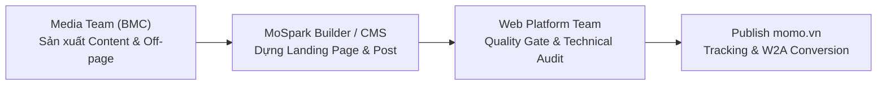
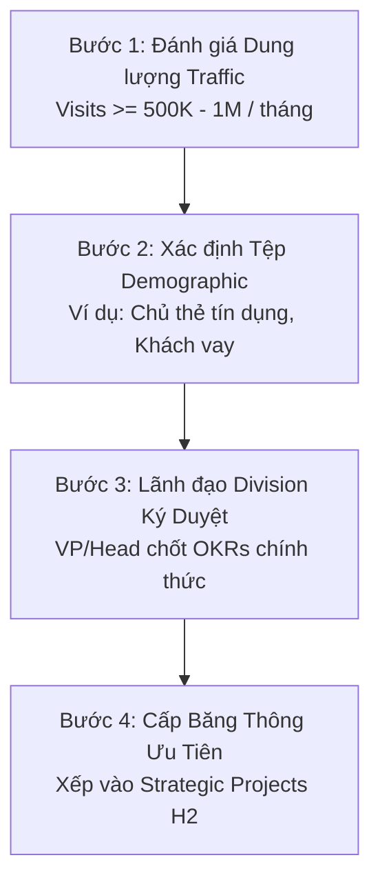

# Khung Quản Trị & Vận Hành Nhóm Dự Án Hỗ Trợ Vận Hành & Phối Hợp Nền Tảng Chưa Chốt High-Level Strategic

> - **Tài liệu:** Operational & Platform Support Projects Framework
> - **Bộ phận:** Growth Platform Division (GPD) x Web Platform
> - **Phiên bản:** 1.0
> - **Ngày phát hành:** 2026-08-12
> - **Trạng thái:** DRAFT - Đang chờ phê duyệt từ Executive Leadership

---

## 1. Context & Định Nghĩa Nhóm Dự Án

Trong quá trình vận hành Web Platform, tồn tại nhóm dự án thuộc các Division/Phòng ban **chưa thực hiện chốt Business Strategic chính thức ở cấp High-Level** (chưa có cam kết OKRs/Business Metrics dài hạn ký duyệt giữa VP/Head của Division đối tác và Executive Leadership của Web Platform). 

Tuy nhiên, trên thực tế, các dự án này **đã và đang diễn ra các hoạt động phối hợp thường xuyên** về mặt nền tảng, công cụ, giải pháp kỹ thuật, hạ tầng tracking và sản xuất nội dung kéo lưu lượng.

### Tiêu Biểu: Division BMC - Media (Inbound sát nhập)
Division BMC - Media (Inbound sát nhập) hiện đang chịu trách nhiệm trực tiếp thúc đẩy tăng trưởng cho danh mục dự án đa dạng:
- **Dịch vụ Tài chính (CreditTech):** Ví Trả Sau, Vay Nhanh.
- **Chiến dịch Thương hiệu & Sự kiện:** Campaign BMC (Lắc Xì, Mega Summer...), Trust Campaign.
- **Giải pháp Điểm bán (O2O):** Soundbox (Merchant Page / Sales Kit).

Tài liệu này xác lập khung quản trị, nguyên tắc vận hành, và lộ trình chuẩn hóa để quản lý hiệu quả nhóm dự án này mà không làm ảnh hưởng đến tài nguyên ưu tiên của các Strategic Web Hubs cốt lõi.

---

## 2. Rủi Ro Quản Trị & Nhận Diện Lỗi Logic (Risk & Assumption Audit)

### 2.1 Mâu Thuẫn Về Chỉ Tiêu Cam Kết (Un-backed Resource Burden)
*   **Vấn đề:** Theo quy chuẩn BGĐ, dự án chỉ được xếp vào danh mục Strategic Project khi có VP/Head của BU trực tiếp cam kết chỉ tiêu kinh doanh (Traffic, MEU/MAU, Transactions).
*   **Rủi ro:** Khi dự án chưa chốt Business Strategic ở cấp High-Level, mọi nguồn lực kỹ thuật và vận hành của Web Platform bỏ ra đều nằm ngoài bảng cam kết OKRs chính thức, dễ dẫn đến tình trạng phân tán nguồn lực và khó giải trình hiệu quả với Ban Giám Đốc khi tổng kết cuối kỳ.

### 2.2 Nhầm Lẫn Ranh Giới Trách Nhiệm Scope (Govern vs Execute)
*   **Vấn đề:** Có sự mơ hồ giữa vai trò thúc đẩy lưu lượng tự nhiên out-app (Media SEO / Off-page / Content Production) và vai trò hạ tầng công cụ nền tảng.
*   **Nguyên tắc:** Bài toán Ranking SEO/GEO và sản xuất nội dung vận hành thuộc Scope thực thi của **Media Team (BMC)**. Web Platform Team giữ vai trò **Govern & Enable** (Cung cấp công cụ MoSpark CMS, Landing Page Builder, Dynamic Ads Placement, Captcha, Tracking, và Quality Gate), tuyệt đối không gánh scope vận hành SEO/Content trực tiếp cho nhóm này.

### 2.3 Định Vị Sai Sử Dụng Hạ Tầng (Strategic Hub vs Self-serve Tooling)
*   **Vấn đề:** Sử dụng hạ tầng Web Platform cho các mục đích công cụ nội bộ hoặc hỗ trợ bán hàng trực tiếp (như Soundbox / Merchant Kit).
*   **Quyết định:** Dự án Soundbox đã được BGĐ chính thức đưa ra khỏi danh sách Strategic Web Hubs (do không đóng góp Organic Traffic out-app hay New User trực tiếp trên Web). Mọi hoạt động hỗ trợ Soundbox phải quy hoạch về nhóm **Productivity Zone & Self-serve Tooling**, bàn giao công cụ chuẩn hóa cho Media Team / Sales Team tự phục vụ.

---

## 3. Khung Quản Trị & Phân Loại 4 Zone (4-Zone Project Governance)

Nhóm dự án Hỗ Trợ Vận Hành chưa chốt Strategic High-Level được phân bổ vào Khung Quản Trị 4 Zone như sau:

<table style="width:100%; border-collapse:collapse; border:1.5px solid #64748b; margin:1em 0; font-size:0.9em;">
  <thead>
    <tr style="background-color:#f1f5f9;">
      <th style="border:1.5px solid #64748b; padding:8px 12px; text-align:left; font-weight:700;">Zone Phân Loại</th>
      <th style="border:1.5px solid #64748b; padding:8px 12px; text-align:left; font-weight:700;">Use Cases Tương Ứng (BMC - Media)</th>
      <th style="border:1.5px solid #64748b; padding:8px 12px; text-align:left; font-weight:700;">Mục Tiêu & Định Định Kênh Web</th>
      <th style="border:1.5px solid #64748b; padding:8px 12px; text-align:left; font-weight:700;">Mô Hình Hỗ Trợ Từ Web Platform</th>
    </tr>
  </thead>
  <tbody>
    <tr>
      <td style="border:1px solid #94a3b8; padding:8px 12px; text-align:left;"><strong>Performance & Transformation Support Zone</strong></td>
      <td style="border:1px solid #94a3b8; padding:8px 12px; text-align:left;">Ví Trả Sau, Vay Nhanh (CreditTech)</td>
      <td style="border:1px solid #94a3b8; padding:8px 12px; text-align:left;">Bắt trọn nhu cầu tìm kiếm tài chính (High-intent Search), gia tăng Share of Voice (SoV), nâng tỷ lệ CTR Web-to-App & Login App Users (MAU).</td>
      <td style="border:1px solid #94a3b8; padding:8px 12px; text-align:left;">Cung cấp Financial Utility Widgets (Finhub Calculator, CIC Tooling), tư vấn sitemap và hạ tầng Onelink/Edge Cookie tracking.</td>
    </tr>
    <tr style="background-color:#f8fafc;">
      <td style="border:1px solid #94a3b8; padding:8px 12px; text-align:left;"><strong>Incubation & Campaign Zone</strong></td>
      <td style="border:1px solid #94a3b8; padding:8px 12px; text-align:left;">Campaign BMC (Lắc Xì, Mega Summer), Trust Campaign</td>
      <td style="border:1px solid #94a3b8; padding:8px 12px; text-align:left;">Tạo đột biến lưu lượng truy cập ngắn hạn (Traffic Spikes), tăng độ phủ thương hiệu (Brand Awareness) & kích hoạt Login App.</td>
      <td style="border:1px solid #94a3b8; padding:8px 12px; text-align:left;">Cung cấp MoSpark Modular Landing Page Builder, Ads Manager Banner Placement, bảo vệ hạ tầng bằng Captcha Shield Module.</td>
    </tr>
    <tr>
      <td style="border:1px solid #94a3b8; padding:8px 12px; text-align:left;"><strong>Productivity & Self-serve Zone</strong></td>
      <td style="border:1px solid #94a3b8; padding:8px 12px; text-align:left;">Soundbox (Merchant Page / Sales Kit)</td>
      <td style="border:1px solid #94a3b8; padding:8px 12px; text-align:left;">Phục vụ lực lượng Salesman chào hàng điểm bán O2O, không gánh KPI Organic Traffic tự nhiên out-app.</td>
      <td style="border:1px solid #94a3b8; padding:8px 12px; text-align:left;">Đóng gói Merchant Page Builder chuẩn hóa dạng tự phục vụ (Self-serve), giao Media Team / Sales Team tự vận hành.</td>
    </tr>
  </tbody>
</table>

---

## 4. Mô Hình Phối Hợp Vận Hành 3 Tầng (Govern - Enable - Execute)

Luồng tương tác chuẩn hóa giữa Web Platform Team và Division/Media Team (BMC):

<table style="width:100%; border-collapse:collapse; border:1.5px solid #64748b; margin:1em 0; font-size:0.9em;">
  <thead>
    <tr style="background-color:#f1f5f9;">
      <th style="border:1.5px solid #64748b; padding:8px 12px; text-align:left; font-weight:700;">Bước</th>
      <th style="border:1.5px solid #64748b; padding:8px 12px; text-align:left; font-weight:700;">Tên Giai Đoạn</th>
      <th style="border:1.5px solid #64748b; padding:8px 12px; text-align:left; font-weight:700;">Trải Nghiệm Người Dùng (UX)</th>
      <th style="border:1.5px solid #64748b; padding:8px 12px; text-align:left; font-weight:700;">Hạ Tầng / Cơ Chế Kỹ Thuật</th>
      <th style="border:1.5px solid #64748b; padding:8px 12px; text-align:left; font-weight:700;">Nền Tảng</th>
    </tr>
  </thead>
  <tbody>
    <tr>
      <td style="border:1px solid #94a3b8; padding:8px 12px; text-align:left;">1</td>
      <td style="border:1px solid #94a3b8; padding:8px 12px; text-align:left;">Content & Campaign Execution</td>
      <td style="border:1px solid #94a3b8; padding:8px 12px; text-align:left;">Tiếp cận bài viết cẩm nang, thông tin ưu đãi Ví Trả Sau, Vay Nhanh hoặc tham gia sự kiện Lắc Xì, Mega Summer</td>
      <td style="border:1px solid #94a3b8; padding:8px 12px; text-align:left;">GenAI Content Engine / MoSpark Modular Landing Page Builder</td>
      <td style="border:1px solid #94a3b8; padding:8px 12px; text-align:left;">Web (Media Team Execute)</td>
    </tr>
    <tr style="background-color:#f8fafc;">
      <td style="border:1px solid #94a3b8; padding:8px 12px; text-align:left;">2</td>
      <td style="border:1px solid #94a3b8; padding:8px 12px; text-align:left;">Platform Quality Gate</td>
      <td style="border:1px solid #94a3b8; padding:8px 12px; text-align:left;">Trang hiển thị ổn định, chuẩn SEO/GEO, chịu được tải lưu lượng lớn không lag/sập</td>
      <td style="border:1px solid #94a3b8; padding:8px 12px; text-align:left;">SEO/GEO Scoring Engine (>=80 điểm) + Captcha DDoS Shield Module</td>
      <td style="border:1px solid #94a3b8; padding:8px 12px; text-align:left;">Web Platform Governance</td>
    </tr>
    <tr>
      <td style="border:1px solid #94a3b8; padding:8px 12px; text-align:left;">3</td>
      <td style="border:1px solid #94a3b8; padding:8px 12px; text-align:left;">Web-to-App Conversion</td>
      <td style="border:1px solid #94a3b8; padding:8px 12px; text-align:left;">Nhấp Smart CTA, chuyển tiếp mượt mà vào App MoMo để hoàn tất đăng ký / nhận quà</td>
      <td style="border:1px solid #94a3b8; padding:8px 12px; text-align:left;">Onelink Standardization / Dynamic Placement / Edge Cookie Identity Sync</td>
      <td style="border:1px solid #94a3b8; padding:8px 12px; text-align:left;">Web & App</td>
    </tr>
  </tbody>
</table>

---

## 5. Quy Trình Nâng Cấp Dự Án Lên Strategic Web Hub Chính Thức

Để đưa một dự án thuộc nhóm "Hỗ Trợ Vận Hành Chưa Align" thành "Strategic Web Hub Chính Thức", dự án bắt buộc phải đi qua quy trình 4 bước chuẩn hóa:

<table style="width:100%; border-collapse:collapse; border:1.5px solid #64748b; margin:1em 0; font-size:0.9em;">
  <thead>
    <tr style="background-color:#f1f5f9;">
      <th style="border:1.5px solid #64748b; padding:8px 12px; text-align:left; font-weight:700;">Bước</th>
      <th style="border:1.5px solid #64748b; padding:8px 12px; text-align:left; font-weight:700;">Tiêu Chí Đánh Giá</th>
      <th style="border:1.5px solid #64748b; padding:8px 12px; text-align:left; font-weight:700;">Nội Dung Chi Tiết</th>
      <th style="border:1.5px solid #64748b; padding:8px 12px; text-align:left; font-weight:700;">Đơn Vị Chịu Trách Nhiệm</th>
    </tr>
  </thead>
  <tbody>
    <tr>
      <td style="border:1px solid #94a3b8; padding:8px 12px; text-align:left;">1</td>
      <td style="border:1px solid #94a3b8; padding:8px 12px; text-align:left;">Traffic Potential Scale</td>
      <td style="border:1px solid #94a3b8; padding:8px 12px; text-align:left;">Dung lượng thị trường tìm kiếm (Search Potential) phải đạt mốc tối thiểu 500.000 - 1.000.000 visits/tháng.</td>
      <td style="border:1px solid #94a3b8; padding:8px 12px; text-align:left;">Web Product Lead</td>
    </tr>
    <tr style="background-color:#f8fafc;">
      <td style="border:1px solid #94a3b8; padding:8px 12px; text-align:left;">2</td>
      <td style="border:1px solid #94a3b8; padding:8px 12px; text-align:left;">Demographics & Use Cases</td>
      <td style="border:1px solid #94a3b8; padding:8px 12px; text-align:left;">Tệp khách hàng mục tiêu rõ ràng và sở hữu chuỗi nhu cầu kéo dài (Diverse Use Cases) có thể mở rộng.</td>
      <td style="border:1px solid #94a3b8; padding:8px 12px; text-align:left;">Division Product Owner / MKT Lead</td>
    </tr>
    <tr>
      <td style="border:1px solid #94a3b8; padding:8px 12px; text-align:left;">3</td>
      <td style="border:1px solid #94a3b8; padding:8px 12px; text-align:left;">VP/Head Sign-off</td>
      <td style="border:1px solid #94a3b8; padding:8px 12px; text-align:left;">Lãnh đạo Division (VP/Head) trực tiếp xác nhận cam kết chỉ tiêu OKRs (Traffic, MEU/MAU, Trans).</td>
      <td style="border:1px solid #94a3b8; padding:8px 12px; text-align:left;">Division Head x Web Platform Lead</td>
    </tr>
    <tr style="background-color:#f8fafc;">
      <td style="border:1px solid #94a3b8; padding:8px 12px; text-align:left;">4</td>
      <td style="border:1px solid #94a3b8; padding:8px 12px; text-align:left;">Resource Allocation</td>
      <td style="border:1px solid #94a3b8; padding:8px 12px; text-align:left;">Chính thức phân bổ nhân sự chuyên trách (Dedicated Resources) thuộc Software Engineering Team.</td>
      <td style="border:1px solid #94a3b8; padding:8px 12px; text-align:left;">Web Platform Lead</td>
    </tr>
  </tbody>
</table>

---

## 6. Danh Mục Action Items & Phân Cấp Ưu Tiên

<table style="width:100%; border-collapse:collapse; border:1.5px solid #64748b; margin:1em 0; font-size:0.9em;">
  <thead>
    <tr style="background-color:#f1f5f9;">
      <th style="border:1.5px solid #64748b; padding:8px 12px; text-align:left; font-weight:700;">Ưu Tiên</th>
      <th style="border:1.5px solid #64748b; padding:8px 12px; text-align:left; font-weight:700;">Tên Hạng Mục Hành Động</th>
      <th style="border:1.5px solid #64748b; padding:8px 12px; text-align:left; font-weight:700;">Nội Dung Chi Tiết Thực Thi</th>
      <th style="border:1.5px solid #64748b; padding:8px 12px; text-align:left; font-weight:700;">Đội Ngũ Thực Hiện</th>
    </tr>
  </thead>
  <tbody>
    <tr>
      <td style="border:1px solid #94a3b8; padding:8px 12px; text-align:left;"><strong>P0</strong></td>
      <td style="border:1px solid #94a3b8; padding:8px 12px; text-align:left;">Khai Thống Alignment Strategic Cấp Cao</td>
      <td style="border:1px solid #94a3b8; padding:8px 12px; text-align:left;">Tổ chức phiên làm việc giữa Web Platform Lead và Head of BMC - Media để chốt chỉ số đo lường tuyệt đối (Traffic, CTR, Login App) cho Ví Trả Sau & Vay Nhanh.</td>
      <td style="border:1px solid #94a3b8; padding:8px 12px; text-align:left;">Web Platform Lead x Media Lead (BMC)</td>
    </tr>
    <tr style="background-color:#f8fafc;">
      <td style="border:1px solid #94a3b8; padding:8px 12px; text-align:left;"><strong>P1</strong></td>
      <td style="border:1px solid #94a3b8; padding:8px 12px; text-align:left;">Ban Hành SOP Phân Định Trách Nhiệm</td>
      <td style="border:1px solid #94a3b8; padding:8px 12px; text-align:left;">Phân rã rõ ràng: BMC phụ trách sản xuất nội dung & Off-page Media; Web Platform phụ trách kiểm duyệt Quality Gate (Score >= 80) và cấp công cụ MoSpark.</td>
      <td style="border:1px solid #94a3b8; padding:8px 12px; text-align:left;">Web Product Lead x Media Team</td>
    </tr>
    <tr>
      <td style="border:1px solid #94a3b8; padding:8px 12px; text-align:left;"><strong>P2</strong></td>
      <td style="border:1px solid #94a3b8; padding:8px 12px; text-align:left;">Đóng Gói Financial Utilities Nhúng Bài Viết</td>
      <td style="border:1px solid #94a3b8; padding:8px 12px; text-align:left;">Đưa bộ công cụ Finhub Calculator (tính hạn mức Ví Trả Sau, tính lãi vay, giả lập điểm CIC) vào MoSpark Widget Store để BMC tự nhúng vào bài cẩm nang.</td>
      <td style="border:1px solid #94a3b8; padding:8px 12px; text-align:left;">Software Engineering Team x Media Team</td>
    </tr>
    <tr style="background-color:#f8fafc;">
      <td style="border:1px solid #94a3b8; padding:8px 12px; text-align:left;"><strong>P3</strong></td>
      <td style="border:1px solid #94a3b8; padding:8px 12px; text-align:left;">Chuyển Giao Tự Vận Hành Soundbox</td>
      <td style="border:1px solid #94a3b8; padding:8px 12px; text-align:left;">Bàn giao hoàn toàn module MoSpark Merchant Builder dạng Self-serve cho Media / Sales Team tự vận hành, không tiêu tốn nhân lực kỹ thuật Web Platform.</td>
      <td style="border:1px solid #94a3b8; padding:8px 12px; text-align:left;">Software Engineering Team x Sales / Media Team</td>
    </tr>
  </tbody>
</table>

---

## 7. Khung Chỉ Số Đo Lường & SLA Hỗ Trợ Kỹ Thuật

Dù chưa chốt High-Level Strategic, mọi dự án hỗ trợ vận hành vẫn phải tuân thủ bộ chỉ số đo lường tuyệt đối và cam kết chất lượng hạ tầng:

<table style="width:100%; border-collapse:collapse; border:1.5px solid #64748b; margin:1em 0; font-size:0.9em;">
  <thead>
    <tr style="background-color:#f1f5f9;">
      <th style="border:1.5px solid #64748b; padding:8px 12px; text-align:left; font-weight:700;">Nhóm Chỉ Số</th>
      <th style="border:1.5px solid #64748b; padding:8px 12px; text-align:left; font-weight:700;">Chỉ Số Cụ Thể</th>
      <th style="border:1.5px solid #64748b; padding:8px 12px; text-align:left; font-weight:700;">Tiêu Chuẩn Đạt / SLA</th>
      <th style="border:1.5px solid #64748b; padding:8px 12px; text-align:left; font-weight:700;">Nguồn Trích Dữ Liệu</th>
    </tr>
  </thead>
  <tbody>
    <tr>
      <td style="border:1px solid #94a3b8; padding:8px 12px; text-align:left;"><strong>Kênh Web (Web Performance)</strong></td>
      <td style="border:1px solid #94a3b8; padding:8px 12px; text-align:left;">SEO/GEO Score, PageViews, Baseline CTR</td>
      <td style="border:1px solid #94a3b8; padding:8px 12px; text-align:left;">Score >= 80/100; Baseline CTR CTA đạt 10% - 15%</td>
      <td style="border:1px solid #94a3b8; padding:8px 12px; text-align:left;">MoSpark CMS Engine & GA4 / Umami Analytics</td>
    </tr>
    <tr style="background-color:#f8fafc;">
      <td style="border:1px solid #94a3b8; padding:8px 12px; text-align:left;"><strong>Tác Động In-App (Business Impact)</strong></td>
      <td style="border:1px solid #94a3b8; padding:8px 12px; text-align:left;">Agent ID Login App, MEU, Transactions</td>
      <td style="border:1px solid #94a3b8; padding:8px 12px; text-align:left;">Đo lường chính xác lượng người dùng định danh chuyển đổi thành công</td>
      <td style="border:1px solid #94a3b8; padding:8px 12px; text-align:left;">BigQuery (Single Source of Truth) & Appsflyer</td>
    </tr>
    <tr>
      <td style="border:1px solid #94a3b8; padding:8px 12px; text-align:left;"><strong>Cam Kết Hạ Tầng (Platform SLA)</strong></td>
      <td style="border:1px solid #94a3b8; padding:8px 12px; text-align:left;">Uptime Landing Page, Captcha Protection Rate</td>
      <td style="border:1px solid #94a3b8; padding:8px 12px; text-align:left;">99.9% Uptime trong suốt thời gian diễn ra Mega Campaign; Chống DDoS Webform 100%</td>
      <td style="border:1px solid #94a3b8; padding:8px 12px; text-align:left;">Web Platform Infrastructure Monitor</td>
    </tr>
  </tbody>
</table>

---

## 8. Nhật Ký Thay Đổi (Change Log)

<table style="width:100%; border-collapse:collapse; border:1.5px solid #64748b; margin:1em 0; font-size:0.9em;">
  <thead>
    <tr style="background-color:#f1f5f9;">
      <th style="border:1.5px solid #64748b; padding:8px 12px; text-align:left; font-weight:700;">Phiên Bản</th>
      <th style="border:1.5px solid #64748b; padding:8px 12px; text-align:left; font-weight:700;">Ngày</th>
      <th style="border:1.5px solid #64748b; padding:8px 12px; text-align:left; font-weight:700;">Nội Dung Thay Đổi</th>
      <th style="border:1.5px solid #64748b; padding:8px 12px; text-align:left; font-weight:700;">Tác Giả / Phê Duyệt</th>
    </tr>
  </thead>
  <tbody>
    <tr>
      <td style="border:1px solid #94a3b8; padding:8px 12px; text-align:left;"><strong>v1.0</strong></td>
      <td style="border:1px solid #94a3b8; padding:8px 12px; text-align:left;">2026-08-12</td>
      <td style="border:1px solid #94a3b8; padding:8px 12px; text-align:left;">Khởi tạo tài liệu Khung Quản Trị & Vận Hành Nhóm Dự Án Hỗ Trợ Vận Hành Chưa Align Strategic High-Level (trường hợp điển hình BMC - Media Inbound).</td>
      <td style="border:1px solid #94a3b8; padding:8px 12px; text-align:left;">Web Product Lead, Web Platform</td>
    </tr>
  </tbody>
</table>

*Tài liệu được quản trị bởi Web Product Lead & Web Platform Team | Cập nhật lần cuối: 2026-08-12*
