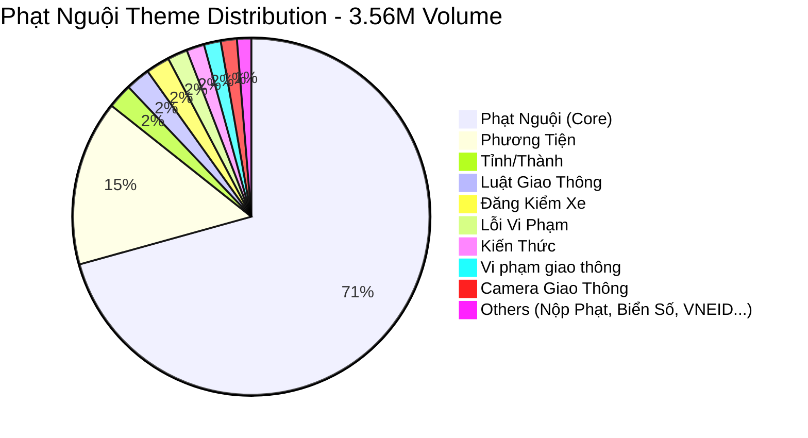
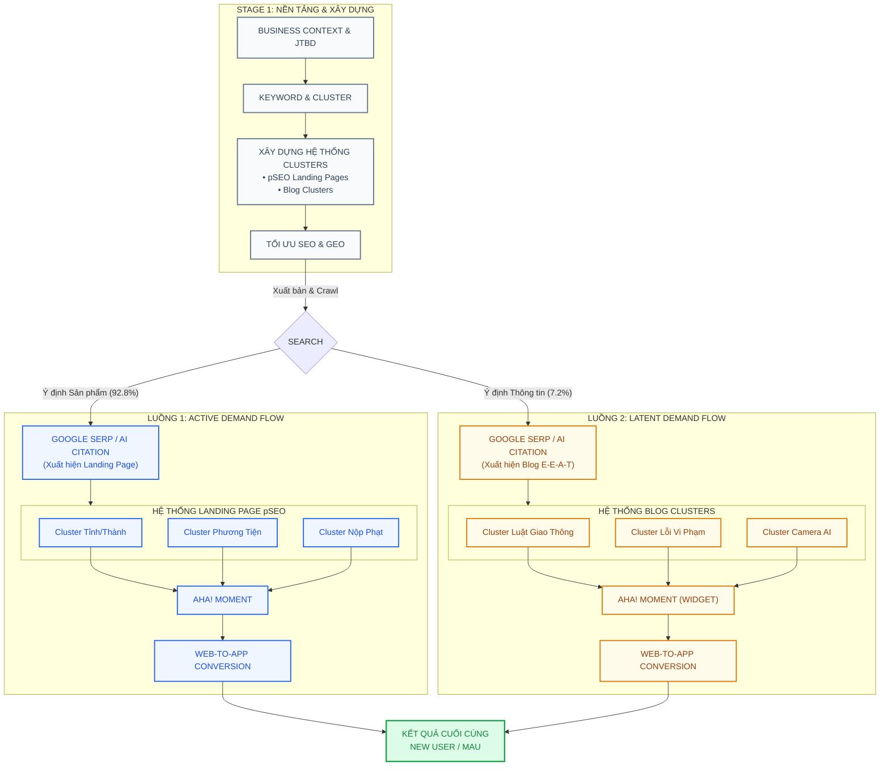

# MoMo.vn Web Strategic Thesis & Governance Framework (2026)

> - **Document:** MoMo.vn Web Strategic Thesis & Governance Framework (Thesis & BRD)
> - **Main Domain:** momo.vn
> - **Division:** Growth Platform Division (GPD)
> - **Project ID:** `web-momo-strategy-2026`
> - **Version:** 6.1 · May 2026
> - **Status:** Active - Master Strategy & Quality Gate for momo.vn
> - **Last updated:** 2026-05-23

> **Executive narrative (deck):** MoSpark Strategic Deck — đọc như proposal 15–25 phút cho C-Level và Cell Team.

## 1. Tầm nhìn và Định hướng chiến lược (2026)

### 1.1. Tầm nhìn (Vision)
Xây dựng Website MoMo thành một **Content Authority** (Nền tảng có thẩm quyền) trong lĩnh vực tài chính và thanh toán. Website không chỉ đóng vai trò thu hút lưu lượng truy cập (traffic) mà còn là công cụ tạo dựng niềm tin vững chắc, khẳng định vị thế "lựa chọn hàng đầu" của người dùng khi tìm kiếm các giải pháp tài chính số.

### 1.2. Mô hình Tăng trưởng: Từ SEO đến Product-Led Growth (PLG)
MoMo chuyển dịch chiến lược từ làm SEO truyền thống (chỉ tập trung vào ranking/traffic) sang mô hình **Product-Led Growth (PLG)**. Website không chỉ cung cấp thông tin đơn thuần mà phải cung cấp các giải pháp/công cụ thực tế (như tra cứu phạt nguội, tính toán khoản vay) để giải quyết ngay lập tức nhu cầu (Job-to-be-Done) của người dùng trên trang.

### 1.3. Chiến lược Thị trường: Đánh chiếm Under-served Markets
Không dàn trải mọi lĩnh vực cùng lúc, chiến lược tập trung nguồn lực chinh phục các **Under-served Markets** (thị trường tiềm năng nhưng chưa được đáp ứng tốt):
- **Tiêu chí:** Ưu tiên các ngách có volume tìm kiếm lớn nhưng thương hiệu chưa có sự hiển thị tương xứng, và MoMo có sẵn sản phẩm/dịch vụ để chuyển đổi.
- **Nguyên tắc "Đánh dứt điểm":** Tập trung 100% năng lực vào 3-5 ngành hàng trọng điểm để xây dựng Authority vững chắc trước khi mở rộng.

### 1.4. Mục tiêu Then chốt 2026 (Strategic OKRs)

| Chỉ số Cốt lõi | Target 2026 | Ý nghĩa |
| :--- | :--- | :--- |
| **Vertical chiến lược** | **3-5 Verticals** | Tập trung làm dứt điểm các ngành hàng trọng điểm (FS, VTTI, Cinema, Merchant) |
| **Share of Voice (SoV)** | **Top 3-5 Google** | Thước đo Authority thực sự, lọt top hiển thị cho các từ khóa quan trọng |
| **Traffic (MUA)** | **5-6M MUA** | Tăng trưởng hệ quả từ việc xây dựng Authority thành công (từ 3M lên 5-6M) |
| **Web-to-App Conversion** | **≥ 12.5%** | Tỷ lệ chuyển đổi người dùng Web sang kích hoạt App MoMo |

---

## 2. Global Fintech Benchmarks

### 2.1. Stripe: Engineering as Marketing
- **Phương châm:** Build tools that developers love.
- **Hành động:** Phát triển tài liệu kỹ thuật cực kỳ chi tiết, API clean, và các tools miễn phí (Calculators, templates).
- **Key takeaway cho MoMo:** Xây dựng các trang công cụ tiện ích tương tác trên Web (Calculators/Glossary) thay vì chỉ viết bài blog chữ đơn thuần.

### 2.2. Wise: Programmatic SEO & Scale
- **Phương châm:** Transparency at scale.
- **Hành động:** Tự động hóa tạo 10,000+ landing pages so sánh tỷ giá trực quan real-time.
- **Key takeaway cho MoMo:** Sử dụng dữ liệu và template để phủ sóng mọi use-case thanh toán ngách qua Programmatic SEO (pSEO).

### 2.3. Nubank: Community & Education
- **Phương châm:** Empowering customers.
- **Hành động:** Build "NuCommunity" để giải đáp thắc mắc tài chính cá nhân, giáo dục người dùng.
- **Key takeaway cho MoMo:** Tích hợp UGC (User-Generated Content) và Social Proof trực tiếp vào Web Platform để tăng E-E-A-T.

### 2.4. Revolut: Data-driven Storytelling
- **Phương châm:** Contextual financial alerts.
- **Hành động:** Dùng data thực tế để kể chuyện (ví dụ: "Người Việt tiêu bao nhiêu tiền cho bảo hiểm năm qua").
- **Key takeaway cho MoMo:** Cung cấp thông tin trực quan dựa trên dữ liệu thực tế độc quyền nhằm làm đòn bẩy thu hút backlink tự nhiên.

### 2.5. NerdWallet: E-E-A-T & Trust-first
- **Phương châm:** Unbiased expert advice.
- **Hành động:** 100% bài viết được viết hoặc review bởi chuyên gia tài chính danh tính rõ ràng, có quy trình biên tập nghiêm ngặt.
- **Key takeaway cho MoMo:** Thiết lập tiêu chuẩn QC và byline tác giả chuyên gia bắt buộc đối với các nội dung nhạy cảm (YMYL).

---

## 3. Gap Analysis: Global Models vs MoMo

| Trụ cột chiến lược | Tiêu chuẩn Global | Trạng thái hiện tại của MoMo | Gap cần khỏa lấp |
| :--- | :--- | :--- | :--- |
| **Technical & Speed** | Web Core Vitals "Good"; DOM siêu sạch, không JS thừa | Tốc độ tải trang di động trung bình; DOM còn chứa nhiều thẻ lồng nhau | Tối ưu hóa DOM Cleanliness; Chuẩn hóa Schema JSON-LD cấu trúc |
| **Programmatic SEO** | Tạo hàng chục nghìn trang tự động; Dữ liệu real-time từ API | Bài viết tạo thủ công chiếm 90%; Chưa tích hợp pSEO | Triển khai template pSEO cho các use-case tiện ích (Vay, Hóa đơn) |
| **Trust & E-E-A-T** | Byline chuyên gia thực thụ; Editorial Policy minh bạch | Bài viết ký danh chung chung; Thiếu Editorial policy công khai | Triển khai Named Author Policy; Công bố Editorial Policy & Quality Gate |
| **Web-to-App (W2A)** | Khách hàng tự trải nghiệm trên web; Điều hướng app mượt mà | Form đăng ký trên web nặng nề; W2A CTR thấp | Tích hợp Interactive Web Widgets; Triển khai Smart Banner/QR tối ưu |
| **AI Citation (GEO)** | Tối ưu hóa AIO click surfaces; Cấu trúc Answer-first | Định dạng bài viết kiểu cũ; Không có FAQ/Definition block | Tối ưu hóa cấu trúc Heading & định dạng Answer-first cho AI Overview |

---

## 4. The Four Strategic Pillars of Web Growth

Để đưa momo.vn bứt phá trong năm 2026, MoMo tập trung toàn lực vào 4 trụ cột tăng trưởng cốt lõi (4 Growth Pillars), kết hợp đồng bộ giữa kỹ thuật, chất lượng, công nghệ tìm kiếm mới và chuyển đổi số:

### 4.1. Pillar 1: Nền tảng Kỹ thuật & Tự động hóa (Technical & pSEO)
- **Thân thiện với AI (AI-Ready):** Nâng cấp hệ thống kỹ thuật của Website để các AI (như ChatGPT, Gemini) có thể dễ dàng "đọc hiểu" và trích dẫn nội dung của MoMo một cách nhanh chóng nhất.
- **Mở rộng Tự động (pSEO):** Sử dụng công nghệ để tự động sinh ra hàng nghìn trang web tiện ích ngách (ví dụ: tra cứu phạt nguội tại 63 tỉnh thành) dựa trên dữ liệu chuẩn xác, giúp phủ sóng toàn bộ nhu cầu thị trường với chi phí và thời gian tối thiểu.

### 4.2. Pillar 2: E-E-A-T Quality Gate (Trọng tâm YMYL)
- **Chính sách định danh (Named Author Policy):** Xây dựng uy tín và độ tin cậy tuyệt đối bằng cách bắt buộc gắn danh tính chuyên gia thực tế (Author Bio) cho mọi bài viết liên quan đến tài chính/tiền tệ (YMYL), loại bỏ hoàn toàn các bài viết ký danh chung chung.
- **Khung Biên tập & Thẩm định (Editorial Policy):** Thiết lập quy trình kiểm duyệt chất lượng độc lập, công khai quy trình biên dịch và có sự kiểm chứng chuyên môn chặt chẽ từ các PO (Product Owners) và cố vấn học thuật/pháp lý.

### 4.3. Pillar 3: Generative Engine Optimization (GEO/AIO)
- **Cấu trúc Ưu tiên Câu trả lời (Answer-First Structure):** Thiết kế định dạng bài viết có câu trả lời cô đọng, trực diện ngay ở phần đầu mục để tối ưu hóa khả năng được trích dẫn (citation) trên các bề mặt kết quả tìm kiếm AI (Google AI Overviews, Gemini, ChatGPT).
- **Chuẩn hóa Thực thể (Schema JSON-LD):** Nhúng mã hóa dữ liệu cấu trúc chi tiết để định nghĩa rõ ràng thực thể (Entities) và mối liên hệ nội dung với AI Search Engines.

### 4.4. Pillar 4: Product-Led Growth & Web-to-App Conversion (PLG & W2A)
- **Trải nghiệm Tương tác không ma sát (Interactive Utilities):** Cung cấp các công cụ tính toán lãi suất (Calculators), tra cứu phạt nguội (Lookups) miễn phí, không yêu cầu đăng nhập trực tiếp trên Web để người dùng cảm nhận giá trị tức thì (*Aha! Moment*).
- **Kích hoạt Chuyển đổi Ngữ cảnh (Contextual CTA):** Tự động đề xuất các CTA thông minh cá nhân hóa theo kết quả tính toán/tra cứu của người dùng, dẫn dắt họ đăng ký các dịch vụ canh gác tự động dài hạn trên App MoMo để tối ưu hóa conversion rate.

---

## 5. Case Study: Traffic-to-App Growth Strategy (Phạt Nguội)

Dự án Phạt Nguội được lựa chọn làm case study điển hình cho mô hình **"Search → Discovery → App"**, minh họa cách kết hợp giữa **Content Strategy** và **Product-Led Growth (PLG)** nhằm chiếm lĩnh thị trường **3.56M searches/tháng**.

### 5.1. Search Intent & Volume Analysis

Dự án Phạt Nguội sở hữu dung lượng thị trường khổng lồ lên tới **3.56M searches/tháng**. Dưới đây là bức tranh chi tiết về tỷ trọng thị trường phân bổ theo các chủ đề (Themes) và nhóm ý định tìm kiếm (Search Intent):

#### Bảng Dữ liệu Volume Search Chi tiết theo Theme

| Theme (Chủ đề) | Số lượng Keywords | Volume/Tháng | Tỷ lệ % | Loại Intent |
| :--- | :---: | :---: | :---: | :--- |
| **Phạt Nguội (Core)** | 330 | 2,513,890 | 70.69% | Transactional (Do) |
| **Phương Tiện** (xe máy, ô tô...) | 213 | 533,110 | 14.99% | Transactional (Do) |
| **Tỉnh/Thành** (Hà Nội, TP.HCM...) | 309 | 79,830 | 2.24% | Transactional (Do) |
| **Luật Giao Thông** | 236 | 78,590 | 2.21% | Informational (Know) |
| **Đăng Kiểm Xe** | 325 | 76,870 | 2.16% | Transactional (Do) |
| **Lỗi Vi Phạm** (lỗi đè vạch...) | 164 | 64,500 | 1.81% | Informational (Know) |
| **Kiến Thức** | 176 | 57,400 | 1.61% | Informational (Know) |
| **Vi phạm giao thông** | 167 | 54,200 | 1.52% | Informational (Know) |
| **Camera Giao Thông** | 228 | 51,890 | 1.46% | Transactional / Info |
| **Nộp Phạt Nguội** | 83 | 24,510 | 0.69% | Transactional / Buy |
| **Tra cứu biển số xe** | 90 | 20,450 | 0.58% | Transactional (Do) |
| **VNEID** | 9 | 1,070 | 0.03% | Navigational (Go) |
| **TỔNG CỘNG** | **2,330** | **3,556,310** | **100%** | |

#### Điều phối Traffic dựa trên Search Intent

| Phân nhóm Intent | Tỷ lệ % | Quy mô Volume | Chiến lược Điều phối (Routing) |
| :--- | :---: | :---: | :--- |
| **Transactional / Decision (Do/Buy)** | **92.84%** | **~3.30M searches/tháng** | Điều hướng thẳng vào Landing Page / Interactive Tool để giải quyết tức thì. |
| **Informational / Awareness (Know)** | **7.16%** | **~254.7K searches/tháng** | Dẫn người dùng vào các bài viết Blog E-E-A-T để giáo dục và điều hướng liên kết ngữ cảnh về Tool. |

> **Strategic Insight:** Nhóm Phạt Nguội Core chiếm >70% thị phần (tập trung toàn bộ vào nhu cầu chuyển đổi/giao dịch). Đây là "đại dương đỏ" với mức độ cạnh tranh SEO cực kỳ khốc liệt. Do đó, không thể vội vàng chỉ xây 1 trang đích `/phat-nguoi` đơn lẻ và mong lên Top ngay. MoMo bắt buộc phải có thời gian và một **Content Plan dài hạn** đánh mạnh vào các cụm từ khóa cung cấp thông tin (Evergreen Keywords - Luật, Lỗi vi phạm) nhằm bao phủ phễu tìm kiếm, xây dựng liên kết nội bộ vững chắc để đẩy sức mạnh dần dần lên trang đích chính.

### 5.2. JTBD Analysis

Người dùng tìm kiếm Phạt Nguội được phân làm 3 nhóm "thuê" giải pháp cụ thể:

- **Job 1 (Tra cứu Chủ động):** *When* tôi chuẩn bị đưa xe đi đăng kiểm vào tuần tới, *I want to* tra cứu nhanh biển số xe của mình chính xác từ API CSGT không cần đăng nhập phức tạp, *So I can* chủ động nộp phạt để tránh rủi ro bị từ chối đăng kiểm.
- **Job 2 (Tìm hiểu Thông tin):** *When* tôi vừa đi qua ngã tư đèn vàng và lo ngại bị ghi lỗi phạt nguội, *I want to* đọc một bài viết hướng dẫn luật sâu sắc, rõ ràng, *So I can* giải tỏa lo lắng mơ hồ và biết cách xử lý.
- **Job 3 (Đăng ký Cảnh báo định kỳ):** *When* tôi lái xe di chuyển hàng ngày bận rộn, *I want to* thuê hệ thống tự động canh gác biển số xe của tôi 24/7, *So I can* nhận cảnh báo ngay lập tức qua push/SMS nếu phát sinh lỗi mới.

### 5.3. End-to-End Growth Framework & Journey

Hành trình tăng trưởng Web-to-App được vận hành khép kín qua 3 giai đoạn (Build → Distribute → Convert), phản ánh chính xác mô hình đầu tư, phân phối và hiện thực hóa giá trị kinh doanh:

| Giai đoạn (Stage) | Trọng tâm Hành động (Execution) | Kết quả kỳ vọng (Outcomes) |
| :--- | :--- | :--- |
| **1. Build** *(Nền tảng & Tài sản)* | Phân tích Intent/Clusters để xây dựng **Hệ thống Landing Page pSEO** (cho truy vấn hành động) và **Blog Clusters E-E-A-T** (cho truy vấn thông tin). Tích hợp các **Interactive Widgets** ngay trên trang. | Hệ sinh thái tài sản số bao phủ mọi điểm chạm. Template sẵn sàng nhân rộng tự động (pSEO). |
| **2. Distribute** *(Phân phối)* | Tối ưu SEO kỹ thuật & E-E-A-T để lọt Top Google; cấu trúc nội dung Answer-First (GEO) để được AI Agents (Gemini, ChatGPT) trích dẫn. | Đạt **Top 3-5 Google**, thu hút **500K+ organic sessions/tháng** (Free Traffic). Trở thành nguồn trích dẫn AI. |
| **3. Convert** *(Tăng trưởng W2A)* | Dẫn user vào trang đích phù hợp ngữ cảnh, kích hoạt **Aha! Moment** (ví dụ: trả kết quả CSGT trong 2s). Điều hướng đăng ký giám sát tự động 24/7 trên App MoMo. | Tỷ lệ chuyển đổi **Web-to-App ≥ 12.5%**. Mang lại hàng chục nghìn Activated Users mới mỗi tháng một cách bền vững. |

### 5.4. Mô hình Phân phối & Chuyển đổi Use-Case (Use-Case Growth Engine)

> **Hai luồng Journey trên chứng minh tính hiệu quả của việc xây dựng tài sản số tích lũy so với quảng cáo trả phí (Paid Ads):** mỗi bài viết, mỗi công cụ tra cứu một khi đạt Top Google sẽ **tự động mang traffic miễn phí liên tục** — khắc phục được nhược điểm phụ thuộc ngân sách của các kênh quảng cáo ngắn hạn.
>
> Mô hình **Build → Distribute → Convert** này khi thành công với Phạt Nguội sẽ trở thành **blueprint chuẩn** nhân rộng cho toàn bộ hệ sinh thái MoMo: **Bảo hiểm xe máy, Vay tiêu dùng, Thanh toán hóa đơn, Dịch vụ công**, và hơn thế nữa — mỗi use-case là một cỗ máy tăng trưởng organic mới.

---

## 6. Operational Governance & Compliance

Để giải quyết nút thắt phê duyệt và vận hành trơn tru giữa các phòng ban (SEO, Content, Product, Compliance), MoMo thiết lập khuôn khổ quản trị tinh gọn.

### 6.1. Hệ thống Sản xuất và Tránh Chồng chéo (Operational Governance)
- **Vận hành qua MoSpark:** Toàn bộ quy trình từ ý tưởng, biên tập, fact-check cho đến publish được quản lý tập trung và tự động trên **MoSpark GenAI Content Engine**.
- **Quản trị tính duy nhất:** Sử dụng cơ chế **Keyword Master Registry** để kiểm soát Unique ID từ khóa, loại bỏ hoàn toàn rủi ro tranh chấp từ khóa (Keyword Cannibalization) giữa các phân nhóm sản phẩm.

### 6.2. Nguyên tắc An toàn "Safe-Harbor" cho AI Content
- **Tiered Compliance Gate:** Phân nhóm nội dung theo mức độ rủi ro (Rủi ro thấp cho tin tức/lifestyle; Rủi ro cao cho tài chính/YMYL) để PO và Compliance kiểm soát chất lượng một cách linh hoạt và tối ưu thời gian phê duyệt.
- **Không Tự Động Hóa nội dung nhạy cảm:** Tuyệt đối không tự động xuất bản (auto-publish) các bài viết thuộc nhóm rủi ro cao (như lời khuyên tài chính, vay, lãi suất) được tạo hoàn toàn bởi AI.
- **Human-in-the-loop:** Mọi bài viết thuộc nhóm rủi ro cao bắt buộc phải được thẩm định và phê duyệt thủ công bởi chuyên gia chuyên môn (SME) trước khi xuất bản.

### 6.3. Khung Hợp tác Platform-BU (Collaboration Framework)

#### Quy trình Hợp tác Chuẩn

1. **Xác định bài toán kinh doanh:** Khởi đầu từ **Business Requirement** của từng BU, kết hợp dữ liệu nghiên cứu thị trường (keyword research, competitor analysis) từ Platform để xác định cơ hội Under-served Markets.
2. **Phân tích User Journey:** Bản đồ hóa hành trình đầu cuối — từ lúc người dùng tìm kiếm bên ngoài (Google, AI Engines) cho đến lúc chuyển đổi trong App.
3. **Cấu trúc nội dung theo Clustering:** Sử dụng phương pháp **Keyword Clustering** để bao phủ toàn bộ nhu cầu người dùng xung quanh một chủ đề, đảm bảo nội dung có chiều sâu ngữ nghĩa (Semantic Depth) để AI engines có thể quét và đề xuất.

#### Mô hình Hợp tác Linh hoạt

| Loại BU | Năng lực hiện tại | Vai trò Platform | Vai trò BU |
| :--- | :--- | :--- | :--- |
| **BU mạnh** (ví dụ: Financial Services) | Có đội ngũ content & product riêng | Hỗ trợ **công cụ và quy trình** (SEO Dash, GenAI Pipeline, Technical SEO framework) | Tự chủ sản xuất nội dung & quản lý Vertical |
| **BU yếu / thiếu người** (ví dụ: Dịch vụ công) | Thiếu nhân sự chuyên trách | **"Thầu" trọn gói** từ keyword research → content production → technical optimization | Cung cấp domain expertise & phê duyệt nội dung |

#### Toolbox & Năng lực Hỗ trợ từ Platform (MoSpark Growth OS)

Để trao quyền cho các BUs, Platform cung cấp toàn bộ hạ tầng **MoSpark (Hệ điều hành Tăng trưởng)** với 4 lớp năng lực cốt lõi:

- **Lớp 1 - GenAI Content Pipeline (Xưởng sản xuất):** Workflow 7 bước khép kín (từ Keyword đến Publish) được hỗ trợ bởi Claude 3.5 & Gemini 1.5 Pro, cùng hệ thống Skill Hub (Prompts/Checklist) chuẩn hóa cho từng Use Case.
- **Lớp 2 - Ads Manager Module (Bộ điều hướng):** Tự động phân phối các block quảng cáo/chuyển đổi theo ngữ cảnh (Contextual Relevance) và đo lường Web-to-App (W2A) realtime thông qua Umami & Appsflyer.
- **Lớp 3 - Quality & Compliance Gate (Bộ lọc):** Hệ thống chấm điểm SEO/GEO tự động và luồng duyệt Legal Workflow, đóng vai trò chốt chặn (Hard-block) bảo vệ nội dung chuẩn E-E-A-T.
- **Lớp 4 - Performance Loop (Bộ tối ưu):** Tích hợp GSC tự động phát hiện bài viết giảm rank để làm mới (Content Refresh) và tự động xây dựng Internal Link qua bản đồ ngữ nghĩa (Vector Embeddings).

> Dù ở mô hình nào, **Team Web (GPD) luôn giữ vai trò giám sát và đảm bảo kết quả cuối cùng** — owning các chỉ số mục tiêu (SoV, Traffic, W2A) cho toàn bộ momo.vn. Các bộ phận khác có thể tham gia thực hiện một phần, nhưng accountability thuộc về GPD.

---

## 7. Content Lifecycle & Audit Framework

Để loại bỏ gánh nặng "Legacy Debt" (nợ nội dung cũ kém chất lượng) từ 1,000+ bài viết lịch sử trên momo.vn, MoMo áp dụng bộ lọc quản lý vòng đời nội dung.

### 7.1. Chiến lược "Update - Merge - Prune"

Hàng quý, hệ thống tự động quét dữ liệu traffic & ranking và chia nội dung cũ thành 3 nhóm xử lý:

- **Update (Làm mới):** Áp dụng cho Top 100 bài viết cốt lõi có lượng traffic tốt nhưng đang có dấu hiệu giảm thứ hạng (Content Decay). Cập nhật dữ liệu mới nhất của năm 2026, cấu trúc lại theo định dạng Answer-first cho GEO.
- **Merge (Hợp nhất):** Phát hiện các bài viết ngắn, trùng lặp từ khóa ngách. Hợp nhất chúng thành một bài **Pillar Page (Hub)** cực kỳ chất lượng và chi tiết để tránh tự cạnh tranh thứ hạng trong nội bộ (Keyword Cannibalization).
- **Prune (Cắt tỉa):** Xóa bỏ các bài viết không tạo ra organic traffic nào trong 12 tháng liên tục và không có giá trị thương hiệu. Thiết lập lệnh Redirect 301 chuyển hướng URL đó về Category tương ứng hoặc Trang chủ.

### 7.2. Cơ chế "Last Reviewed" tự động

- Mọi nội dung YMYL (Tài chính, Bảo hiểm) trên Web sau **6 tháng** kể từ ngày xuất bản sẽ tự động bị hệ thống gắn cờ *"Cần thẩm định lại"*.
- Hệ thống MoSpark sẽ tự động bắn alert thông báo cho Product Owner/SME vào kiểm tra dữ liệu. Nếu thông tin vẫn chuẩn xác, bài viết sẽ được update tag metadata `Last Reviewed: [Date]` hiển thị trực quan ở đầu bài nhằm gửi tín hiệu uy tín (Trust) cực tốt tới cả Google bots lẫn AI crawlers.

---

## 8. MoSpark: The Technical Core Enabler

MoSpark đóng vai trò là **Hệ điều hành tăng trưởng cốt lõi (Core Growth OS)** của momo.vn. Đây không chỉ là một hệ quản trị nội dung (CMS) thuần túy, mà là nền tảng công nghệ tối thượng để hiện thực hóa toàn bộ chiến lược Inbound, SEO/GEO và Product-Led Growth (PLG) trong năm 2026:

- **Động cơ Tự động hóa và Nhân rộng Quy mô (Scale & Automation Engine):** Đóng vai trò là trung tâm xử lý dữ liệu và tự động hóa quy trình sản xuất nội dung quy mô lớn qua pSEO (Programmatic SEO), giúp MoMo phủ sóng hàng vạn trang tiện ích ngách một cách nhanh chóng với chi phí tối thiểu.
- **Trình Bảo vệ Chất lượng và Tuân thủ (Quality & Compliance Guard):** Đóng vai trò là chốt chặn kỹ thuật tự động hóa, kiểm soát chặt chẽ mọi trang nội dung trước khi xuất bản phải tuân thủ tuyệt đối các chuẩn mực E-E-A-T nghiêm ngặt, tối ưu hóa hiển thị AEO/GEO cho các AI Search Engines, và đồng bộ hóa trải nghiệm chuyển đổi Web-to-App.
- **Hiện thực hóa Trải nghiệm Tương tác (Interactive Utility Hub):** Cung cấp hạ tầng kỹ thuật tích hợp mượt mà các công cụ tương tác (Calculators, Lookups) để giải quyết ngay lập tức nhu cầu Job-to-be-Done của người dùng ngay trên Web với hiệu năng tải trang tối ưu nhất (Core Web Vitals đạt chỉ số Good), tạo bàn đạp chuyển đổi mượt mà lên ứng dụng.

---

## 9. Organization Transformation & Business Ownership

Để chiến lược Web Growth thành công, MoMo cần một cuộc chuyển đổi tư duy tổ chức sâu sắc — từ mô hình **Operation Support** sang **Business Ownership**.

### 9.1. Chuyển đổi Tư duy: Từ Operation sang Business Owner

> **Team Web không còn là đơn vị "đợi đặt hàng" (Order-taker) mà phải đóng vai trò Business Owner — chủ động dẫn dắt chiến lược tăng trưởng Web, chịu trách nhiệm trực tiếp về mục tiêu kinh doanh trên momo.vn.**

| Tư duy cũ (Operation Support) | Tư duy mới (Business Owner) |
| :--- | :--- |
| Đợi BU đặt hàng, làm theo brief | Chủ động nghiên cứu thị trường, đề xuất Vertical chiến lược |
| KPI = số bài viết sản xuất | KPI = SoV, Traffic, W2A Conversion |
| Chỉ chịu trách nhiệm khâu execution | Owning toàn bộ funnel từ Discovery → Conversion |
| Phản ứng theo yêu cầu từng lần | Xây dựng hệ thống & quy trình tự vận hành |

### 9.2. Mô hình Ownership & Accountability

- **GPD owning chỉ số mục tiêu:** Team Web sở hữu và chịu trách nhiệm trực tiếp về các KPIs: Share of Voice, Organic Traffic (MUA), Web-to-App Conversion Rate cho toàn bộ domain momo.vn.
- **BU contributing:** Các đơn vị kinh doanh (BUs) và Inbound tham gia thực hiện một phần (sản xuất nội dung chuyên môn, cung cấp domain expertise), nhưng **GPD giám sát và đảm bảo kết quả cuối cùng**.
- **Escalation path:** Khi một Vertical không đạt target sau 1 quý, GPD có quyền điều chỉnh chiến lược, tái phân bổ nguồn lực, hoặc chuyển sang mô hình "thầu trọn gói".

### 9.3. Kế hoạch Nhân sự & Năng lực

Để hiện thực hóa vai trò Business Owner, cần rà soát và kiện toàn năng lực đội ngũ:

- **Rà soát Headcount hiện tại:** Kiểm kê toàn bộ nguồn lực từ các team hiện có (SEO, Content, Product, Engineering) và các vị trí đang tuyển dụng.
- **Account Plan tổng thể:** Xây dựng bản kế hoạch nhân sự (Account Plan) mapping rõ: *Ai* phụ trách *Vertical nào*, với *năng lực gì*, và cần *bổ sung gì*.
- **Năng lực cốt lõi cần thiết:** SEO/GEO Technical, Content Strategy, Product Analytics, GenAI Content Operations, Web Engineering.

---

## 10. Change Log

| Phiên bản | Ngày | Nội dung thay đổi |
| :--- | :--- | :--- |
| **v1.0** | 2026-05-12 | Khởi tạo tài liệu định hướng chiến lược. |
| **v2.0** | 2026-05-15 | Cập nhật Inbound Tactics, Content Mix Matrix, AARC Model & Editorial Workflow. |
| **v3.0** | 2026-05-18 | Sáp nhập hoàn toàn tài liệu audit skill (Seo-Geo-audit.md v3.0) vào tài liệu chiến lược làm single source of truth cho Strategy & QC Checklist. |
| **v4.0** | 2026-05-19 | Chuyển tất cả heading sang tiếng Anh ngắn gọn và lược bỏ toàn bộ liên kết nội bộ Obsidian theo yêu cầu người dùng. |
| **v5.0** | 2026-05-19 | Tích hợp Master Vertical Funnel dựa trên điểm khởi phát thực tế của User và phân tích chia nhánh định tuyến Intent. |
| **v5.5** | 2026-05-19 | Sáp nhập toàn diện momo-content-plan-strategy.md thành bản Luận đề & BRD Website 2026. Lược bỏ các mục Scorecards, Calendar, Gate Checks. Gom tụ 4 trục chiến lược cũ (Axis 1-4) thành mục 4 trụ cột vĩ mô duy nhất, nâng tầm vai trò chiến lược của MoSpark thành Hệ điều hành tăng trưởng lõi. |
| **v6.0** | 2026-05-20 | Tích hợp nội dung từ cuộc trao đổi lãnh đạo — bổ sung Section 1.5 (Under-served Markets & Vertical Focus Strategy với OKR cụ thể), Section 7.3 (Khung hợp tác Platform-BU linh hoạt & Toolbox), và Section 10 (Organization Transformation & Business Ownership). |
| **v6.1** | 2026-05-23 | Chuẩn hóa format: xóa Obsidian link trong intro. Bổ sung Section 2 (Global Fintech Benchmarks) và Section 3 (Gap Analysis) merge từ seo-geo-direction.md v5.5. Renumber sections 2-8 thành 4-10. |

*Maintained by: Web Product Lead, Out-App Traffic, GPD | Last updated: 2026-05-23*
