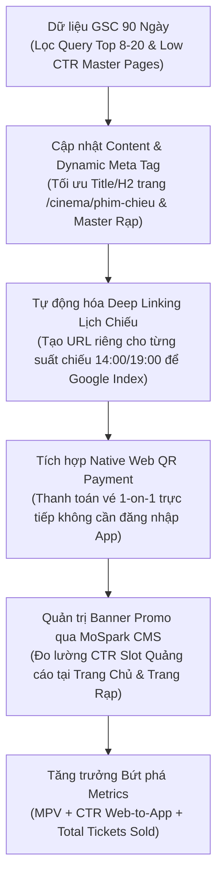

# KHUNG NGUYÊN LÝ VẬN HÀNH SEO BẰNG AI THEO TÍN HIỆU DỮ LIỆU (SIGNAL-DRIVEN AI SEO WORKFLOW ARCHITECTURE)

> **Mã tài liệu:** FRAMEWORK-SEO-AI-01  
> **Loại tài liệu:** Core Principles & Architectural Framework  
> **Phạm vi áp dụng:** Web Platform, MoSpark CMS Engine & Các dự án Strategic Hubs  

---

## 1. PHƯƠNG PHÁP LUẬN NỀN TẢNG: DỊCH CHUYỂN TỪ "ĐOÁN NGHĨ" SANG "VẬN HÀNH THEO TÍN HIỆU"

Khung vận hành này tái định nghĩa toàn bộ mô hình SEO truyền thống bằng cách chuyển dịch từ tư duy dựa trên giả định (Guesswork-based) sang tư duy dựa trên tín hiệu dữ liệu thực (Signal-driven Engine).

### So Sánh Hai Mô Hình Vận Hành

<table style="width:100%; border-collapse:collapse; border:1.5px solid #64748b; margin:1em 0; font-size:0.9em;">
  <thead>
    <tr style="background-color:#f1f5f9;">
      <th style="border:1.5px solid #64748b; padding:8px 12px; text-align:left; font-weight:700;">Tiêu Chí</th>
      <th style="border:1.5px solid #64748b; padding:8px 12px; text-align:left; font-weight:700;">Mô Hình SEO Truyền Thống (Guesswork)</th>
      <th style="border:1.5px solid #64748b; padding:8px 12px; text-align:left; font-weight:700;">Mô Hình Signal-Driven AI SEO Engine</th>
    </tr>
  </thead>
  <tbody>
    <tr>
      <td style="border:1px solid #94a3b8; padding:8px 12px; text-align:left;">Nguồn gốc ý tưởng</td>
      <td style="border:1px solid #94a3b8; padding:8px 12px; text-align:left;">Brainstorm ngẫu nhiên, suy đoán người dùng tìm gì</td>
      <td style="border:1px solid #94a3b8; padding:8px 12px; text-align:left;">Trích xuất từ dữ liệu GSC, Sitemap đối thủ, SERP thực tế & Voice of Customer</td>
    </tr>
    <tr style="background-color:#f8fafc;">
      <td style="border:1px solid #94a3b8; padding:8px 12px; text-align:left;">Vai trò của AI</td>
      <td style="border:1px solid #94a3b8; padding:8px 12px; text-align:left;">Sinh văn bản tự động thay thế người viết bài</td>
      <td style="border:1px solid #94a3b8; padding:8px 12px; text-align:left;">Bộ nén dữ liệu & Nhận diện mẫu (Data Compression & Pattern Recognition Engine)</td>
    </tr>
    <tr>
      <td style="border:1px solid #94a3b8; padding:8px 12px; text-align:left;">Trọng tâm sản xuất</td>
      <td style="border:1px solid #94a3b8; padding:8px 12px; text-align:left;">Số lượng bài viết mới xuất bản hàng tuần</td>
      <td style="border:1px solid #94a3b8; padding:8px 12px; text-align:left;">Tối ưu hóa tài sản cũ (Asset Refresh) & Phân phối nội dung đa điểm chạm</td>
    </tr>
    <tr style="background-color:#f8fafc;">
      <td style="border:1px solid #94a3b8; padding:8px 12px; text-align:left;">Mục tiêu cuối cùng</td>
      <td style="border:1px solid #94a3b8; padding:8px 12px; text-align:left;">Lưu lượng truy cập tự nhiên (Traffic bề nổi)</td>
      <td style="border:1px solid #94a3b8; padding:8px 12px; text-align:left;">Tỷ lệ chuyển đổi phễu Web-to-App, User Authentication & Transactions</td>
    </tr>
  </tbody>
</table>

---

## 2. KIẾN TRÚC 4 NGUỒN TÍN HIỆU ĐẦU VÀO (THE 4 SIGNAL DOMAINS)

Sức mạnh của mô hình nằm ở khả năng nén và mã hóa 4 nguồn tín hiệu dữ liệu độc lập:

1. **Performance Signals (Tín hiệu Hiệu suất):** Trích xuất từ Google Search Console (GSC). Nhận diện cụm từ khóa có vị trí từ **8.0 đến 20.0** (ấn tượng cao nhưng chưa vào Top 5) và các URL có tỷ lệ CTR thấp bất thường. Nguyên lý cốt lõi: *Tối ưu bài viết đã có dữ liệu lịch sử luôn mang lại ROI cao hơn và rủi ro thấp hơn so với tạo bài viết mới từ số 0.*
2. **Structural Signals (Tín hiệu Kiến trúc):** Giải mã sơ đồ Sitemap của đối thủ để hiểu nguyên lý phân bổ Topic Cluster và định dạng trang (Landing Page, Tool, Comparison, Review, Location Page).
3. **Behavioral & Qualitative Signals (Tín hiệu Tâm lý Khách hàng):** Khai thác ngôn ngữ tự nhiên từ cộng đồng (Voice of Customer). Nhận diện rào cản thực tế và từ ngữ đời thực mà khách hàng dùng để mô tả nhu cầu thay vì lạm dụng thuật ngữ chuyên môn.
4. **Algorithmic & Format Signals (Tín hiệu Thuật toán & SERP Intent):** Quan sát trực tiếp trang kết quả tìm kiếm (SERP) để xác định loại hình trang được thuật toán ưu tiên, kết hợp tối ưu cho công cụ tìm kiếm AI (Generative Engine Optimization - GEO).

---

## 3. PHÂN TÍCH PHẢN BIỆN VÀ CÁC NGUYÊN TẮC BẢO VỆ KINH DOANH

Để tránh tình trạng "SEO rời rạc với kinh doanh", khung vận hành thiết lập 3 nguyên tắc bảo hộ:

* **Nguyên tắc Phễu Chuyển Đổi Tích Hợp (Web-to-App Funnel Integration):** Lưu lượng truy cập không có ý nghĩa nếu không được điều hướng qua phễu chuyển đổi. Mọi nội dung xuất bản phải đi kèm hai thành tố bắt buộc: **Utility (Công cụ tiện ích giải quyết nhu cầu ngay)** và **W2A CTA (Nút chuyển đổi đăng nhập/tải App)**.
* **Nguyên tắc Tích hợp AI Search / Generative Engine Optimization (GEO):** Trước sự suy giảm CTR do các bảng câu trả lời tự động trên kết quả tìm kiếm (Zero-click Searches), nội dung phải được cấu trúc dưới dạng bảng so sánh, câu trả lời trực diện ngắn gọn và Schema Data để được AI Search trích xuất làm nguồn dữ liệu chính.
* **Nguyên tắc Tự Động Hóa Đường Ống Dữ Liệu (Programmatic Pipeline):** Chuyển dịch toàn bộ quy trình thao tác tay (export CSV, phân tích thủ công) thành các API tự động hóa trên hạ tầng CMS, triệt tiêu điểm nghẽn năng suất của con người khi vận hành hàng chục ngàn URL.

---

## 4. MA TRẬN NGUYÊN LÝ 7 WORKFLOWS (THE 7 WORKFLOW FUNDAMENTALS MATRIX)

<table style="width:100%; border-collapse:collapse; border:1.5px solid #64748b; margin:1em 0; font-size:0.9em;">
  <thead>
    <tr style="background-color:#f1f5f9;">
      <th style="border:1.5px solid #64748b; padding:8px 12px; text-align:left; font-weight:700;">Workflow</th>
      <th style="border:1.5px solid #64748b; padding:8px 12px; text-align:left; font-weight:700;">Tín Hiệu Nhận Biết Đầu Vào</th>
      <th style="border:1.5px solid #64748b; padding:8px 12px; text-align:left; font-weight:700;">Nguyên Lý Xử Lý Dữ Liệu</th>
      <th style="border:1.5px solid #64748b; padding:8px 12px; text-align:left; font-weight:700;">Kết Quả Kỹ Thuật / Sản Phẩm</th>
    </tr>
  </thead>
  <tbody>
    <tr>
      <td style="border:1px solid #94a3b8; padding:8px 12px; text-align:left;">1. GSC Signal Mining</td>
      <td style="border:1px solid #94a3b8; padding:8px 12px; text-align:left;">Position 8-20, Impressions cao, CTR lệch chuẩn</td>
      <td style="border:1px solid #94a3b8; padding:8px 12px; text-align:left;">Lọc các truy vấn có tín hiệu sẵn để tối ưu mật độ ngữ nghĩa và cấu trúc H2/H3</td>
      <td style="border:1px solid #94a3b8; padding:8px 12px; text-align:left;">Tối ưu bài viết tiệm cận Top 5; tăng CTR bằng Dynamic Meta Tag</td>
    </tr>
    <tr style="background-color:#f8fafc;">
      <td style="border:1px solid #94a3b8; padding:8px 12px; text-align:left;">2. Sitemap Architecture</td>
      <td style="border:1px solid #94a3b8; padding:8px 12px; text-align:left;">Sơ đồ XML Sitemap của đối thủ trong ngành</td>
      <td style="border:1px solid #94a3b8; padding:8px 12px; text-align:left;">Phân rã cấu trúc URL đối thủ thành sơ đồ Topic Clusters và loại trang</td>
      <td style="border:1px solid #94a3b8; padding:8px 12px; text-align:left;">Bảng Content Gap Matrix; Sơ đồ kiến trúc Hub & Spoke</td>
    </tr>
    <tr>
      <td style="border:1px solid #94a3b8; padding:8px 12px; text-align:left;">3. Content Repurposing</td>
      <td style="border:1px solid #94a3b8; padding:8px 12px; text-align:left;">Bài viết Master Hub có hiệu suất cao nhất</td>
      <td style="border:1px solid #94a3b8; padding:8px 12px; text-align:left;">Bóc tách 1 tài sản nội dung gốc thành các khối kiến thức nhỏ cho nhiều kênh</td>
      <td style="border:1px solid #94a3b8; padding:8px 12px; text-align:left;">Hệ thống phân phối 20 điểm chạm (Social Posts, Newsletter, Push)</td>
    </tr>
    <tr style="background-color:#f8fafc;">
      <td style="border:1px solid #94a3b8; padding:8px 12px; text-align:left;">4. Community Listening</td>
      <td style="border:1px solid #94a3b8; padding:8px 12px; text-align:left;">Thảo luận tự nhiên từ các diễn đàn, cộng đồng</td>
      <td style="border:1px solid #94a3b8; padding:8px 12px; text-align:left;">Rút ngắn khoảng cách giữa từ khóa SEO và ngôn ngữ đời thực người dùng</td>
      <td style="border:1px solid #94a3b8; padding:8px 12px; text-align:left;">Văn phong Voice of Customer; Cấu trúc FAQ giải quyết đúng nỗi đau</td>
    </tr>
    <tr>
      <td style="border:1px solid #94a3b8; padding:8px 12px; text-align:left;">5. Content Refresh</td>
      <td style="border:1px solid #94a3b8; padding:8px 12px; text-align:left;">URL giảm > 20% traffic hoặc lùi thứ hạng</td>
      <td style="border:1px solid #94a3b8; padding:8px 12px; text-align:left;">Kiểm toán bài cũ so với Top 1 hiện tại để bổ sung dữ liệu và làm mới tín hiệu</td>
      <td style="border:1px solid #94a3b8; padding:8px 12px; text-align:left;">URL được làm mới thông tin, bổ sung Internal Links và Schema.org</td>
    </tr>
    <tr style="background-color:#f8fafc;">
      <td style="border:1px solid #94a3b8; padding:8px 12px; text-align:left;">6. Multi-channel Adaptability</td>
      <td style="border:1px solid #94a3b8; padding:8px 12px; text-align:left;">Đặc tính tiêu thụ nội dung trên từng nền tảng</td>
      <td style="border:1px solid #94a3b8; padding:8px 12px; text-align:left;">Tái định dạng thông điệp cốt lõi phù hợp với thuật toán phân phối từng kênh</td>
      <td style="border:1px solid #94a3b8; padding:8px 12px; text-align:left;">Nội dung chuẩn hóa riêng cho Website, Social, Email và Video ngắn</td>
    </tr>
    <tr>
      <td style="border:1px solid #94a3b8; padding:8px 12px; text-align:left;">7. SERP-Locked Prompting</td>
      <td style="border:1px solid #94a3b8; padding:8px 12px; text-align:left;">Top 5 kết quả hiển thị trên Google Search</td>
      <td style="border:1px solid #94a3b8; padding:8px 12px; text-align:left;">Khóa cấu trúc định dạng bài viết theo đúng loại trang được thuật toán xếp hạng</td>
      <td style="border:1px solid #94a3b8; padding:8px 12px; text-align:left;">Dàn ý bài viết chuẩn xác Search Intent (Tool, Comparison, Listicles)</td>
    </tr>
  </tbody>
</table>

---

## 5. CASE STUDY NGUYÊN LÝ: ÁP DỤNG TRÊN NỀN TẢNG CINEMA HUB

Áp dụng phương pháp luận vào dữ liệu thực tế 90 ngày của Cinema Hub (Performance Zone) với 927 từ khóa chuyên biệt và 1.000 trang nội dung:

### Phân Tích Nguyên Lý Dữ Liệu Thực Tế

1. **Quy luật Tăng trưởng Vùng Tỉnh/Thành (Location Pages Performance):**
   * *Hiện tượng:* Các trang rạp cụ thể tại tỉnh/thành có CTR vượt trội (Rạp BHD Long Khánh đạt **14,93% CTR** với 43.185 clicks; CGV Hải Phòng đạt **9,39% CTR** với 34.766 clicks; Lotte Tây Ninh đạt **11,51% CTR** với 14.359 clicks).
   * *Nguyên lý:* Ý định tìm kiếm địa phương (Local Search Intent) gắn liền với nhu cầu giao dịch ngay lập tức. Cần tập trung quy hoạch hạ tầng cho toàn bộ nhóm trang địa phương.
2. **Phát Hiện Điểm Nghẽn CTR Trang Master Chuỗi Rạp:**
   * *Hiện tượng:* Trang Master CGV (`/cinema/rap/cgv`) đạt **2,3 triệu hiển thị** nhưng CTR chỉ **1,57%** (vị trí 6.92); Galaxy Cinema (`/cinema/rap/galaxy-cinema`) đạt **1,05 triệu hiển thị** nhưng CTR chỉ **0,87%** (vị trí 5.48).
   * *Nguyên lý:* Thiếu thông điệp giá trị trực quan trên SERP (Title Tag chưa làm nổi bật tính năng tra lịch chiếu real-time và mua vé nhanh không cần tải app).
3. **Cơ Hội Vị Trí 8–20 Của Từ Khóa Hạt Nhân:**
   * *Hiện tượng:* Từ khóa "phim chiếu rạp" đạt **580.275 hiển thị** ở vị trí **8.85** (CTR 0,75%).
   * *Nguyên lý:* Đang đứng trước ngưỡng cửa Top 5. Chỉ cần tối ưu cấu trúc ngữ nghĩa và trải nghiệm trang, lưu lượng sẽ bứt phá từ 4.300 lên 35.000–50.000 clicks/tháng.

### Luồng Tối Ưu Hạ Tầng Kỹ Thuật Cinema Hub

---

## 6. KHUNG ĐO LƯỜNG VÀ CHỈ SỐ MỤC TIÊU (BUSINESS & WEB METRICS)

Mọi hoạt động vận hành SEO theo tín hiệu đều phải được quy đổi về 2 tầng chỉ số chuẩn hóa:

* **Tầng Web Metrics (Chỉ số Kênh Web):**
  * **Monthly Page Views (MPV):** Đo quy mô tổng lưu lượng truy cập toàn kênh.
  * **Click-Through Rate (CTR):** Tỷ lệ nhấp từ SERP vào Web và tỷ lệ nhấp nút CTA chuyển đổi trên Web.
* **Tầng Business Metrics (Tác động Kinh doanh):**
  * **Agent ID Logged-in Users (W2A Auth Users):** Số lượng người dùng định danh đăng nhập/chuyển đổi từ Web vào App.
  * **Total Transactions & Revenue:** Số lượng giao dịch trực tiếp (mua vé rạp, mua gói dịch vụ) sinh ra từ phễu Web out-app.
