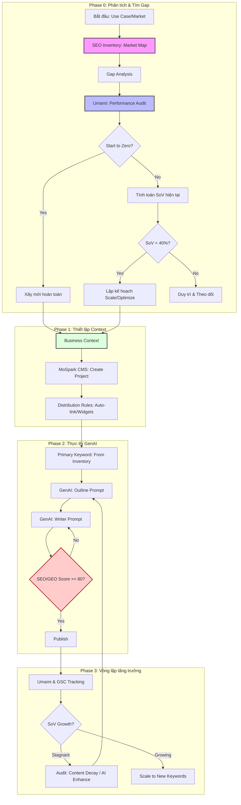
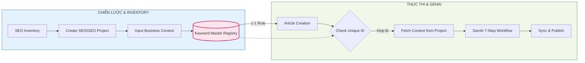

# 📘 MoSpark SEO/GEO Playbook: Strategy & Operations

Tài liệu này hợp nhất tầm nhìn chiến lược "HubSpot Parity" và quy trình thực thi thực tế để biến MoSpark thành một hệ điều hành tăng trưởng (Growth OS).

---

## 1. Tầm nhìn chiến lược: MoSpark vs HubSpot

Mục tiêu của MoSpark không phải là copy HubSpot, mà là **lấp đầy vùng MoSpark đang trống** (post-publish measurement) trong khi **giữ nguyên lợi thế MoSpark đang có** (pre-publish quality gate, GEO scoring, GenAI production).

### 1.1. Triết lý vận hành
| Chiều | HubSpot | MoSpark |
|---|---|---|
| **Mạnh nhất** | Đo lường & Giám sát sau xuất bản | Kiểm soát chất lượng & AI Production trước xuất bản |
| **Yêu nhất** | Content quality gate (không có hard block) | Visibility tracking sau khi nội dung live |
| **Triết lý** | "Đo xong mới biết cần làm gì" | "Chuẩn hóa trước khi ra ngoài" |

### 1.2. Bản đồ năng lực & Khoảng trống (Gap Analysis)
MoSpark đang hướng tới việc lấp đầy các Gap sau:
- **Nhóm A (Content Strategy):** Thiếu Cluster Map UI trực quan để PM quản lý độ phủ thị trường.
- **Nhóm B (SEO Recommendations):** Thiếu Per-article Analytics tích hợp trong Editor và cảnh báo Content Decay.
- **Nhóm C (GEO/AEO Monitoring):** Thiếu Dashboard đo lường SoV và Visibility tự động theo từng Use Case.

---

## 2. Quy trình vận hành (Project Workflow)

> **Nguyên tắc cốt lõi (SPA Framework):** Trước khi tiếp nhận bất kỳ dự án nào, đặc biệt là các request từ Head of BU, đội ngũ bắt buộc phải áp dụng **SPA Framework (reSearch - Pilot - Action)**. Không nhảy ngay vào sản xuất nội dung (Action) khi chưa làm rõ Market Cap (reSearch) và chạy thử nghiệm (Pilot). BU phải trải qua "Tier 1: Discovery" trước khi yêu cầu scale.

Mọi dự án tăng trưởng trên MoSpark phải tuân thủ quy trình khép kín dưới đây (ánh xạ trực tiếp từ mô hình SPA):

---

## 3. Chi tiết các giai đoạn thực thi

### Giai đoạn 0: Phân tích Tiền dự án (Pre-Project Analysis)
1. **Kiểm tra SEO Inventory (Market Potential):** Tra cứu **Total Market Volume** của Use Case tại tài liệu `[[mospark_seo_inventory]]`.
2. **Đo lường hiệu suất & Tính SoV (Umami Audit):** 
   - Lọc dữ liệu trên Umami theo **URL Path** của Cluster (ví dụ: `/blog/phat-nguoi/*`).
   - Lấy **Total Sessions (30 ngày gần nhất)**.
   - Tính **SoV (%) = (Sessions / Market Volume) * 100**.
3. **Quyết định thực thi (Decision Matrix):**
   - **SoV < 1% (Start to Zero):** Dự án mới hoàn toàn ➔ Sản xuất nội dung mới ồ ạt.
   - **SoV 1% - 20% (High Gap):** Đã có traffic nhưng chưa tương xứng tiềm năng ➔ Tạo satellite content để bao phủ thêm từ khóa phụ. (Nhóm < 40% SoV trong Workflow).
   - **SoV 20% - 40% (Growth Phase):** Đang tăng trưởng ➔ Ưu tiên dùng tính năng **AI Enhance** để tối ưu hóa nội dung cũ lên Top 3. (Nhóm < 40% SoV trong Workflow).
   - **SoV > 40% (Dominating):** Vị thế dẫn đầu ➔ Chỉ cần duy trì và theo dõi Content Decay.

### Giai đoạn 1: Khởi tạo Project (Initiation)
1. **Business Context:** Điền đầy đủ bối cảnh tại `[[mospark_genai_content#7. Business Context - Các trường bắt buộc|mospark_business_context]]`. Đây là "linh hồn" để AI viết đúng hướng.
2. **Cấu hình CMS:** Tạo Use Case, gán bối cảnh và thiết lập Distribution Rules (Auto-embed, Cross-linking).

### Giai đoạn 2: Sản xuất Nội dung (Production)
1. **GenAI Pipeline:** 
   - Lấy Primary Keyword từ Inventory.
   - Chạy luồng Outline ➔ Writer Prompt.
2. **Quality Gate:** Kiểm tra tại `[[mospark_seo_geo_score]]`. Đảm bảo đạt **80+ điểm** mới được Publish.

### Giai đoạn 3: Theo dõi & Tối ưu (Growth Loop)
1. **Performance Tracking:** Theo dõi Organic Sessions và Ranking hàng tuần.
2. **Self-Optimization:** Nếu traffic giảm (Content Decay), sử dụng tính năng **Enhance by AI** để cập nhật bài viết.

---

## 4. Khung Tăng Trưởng Khép Kín (End-to-End Growth Framework cho MoMo)

Để biến MoSpark thành Growth OS thực thụ, việc SEO không thể hoạt động độc lập. Dưới đây là chuỗi giá trị 6 bước yêu cầu sự phối hợp chéo (Cross-functional) từ các Cell Team trong hệ sinh thái MoMo:

### Bước 1: Inventory (Nghiên cứu & Lựa chọn)
* **Mục tiêu:** Tìm ra thị trường ngách có giá trị (Market Cap) và đánh giá độ khó.
* **Hành động (SEO/Growth Cell):** Quét tổng Volume tìm kiếm, tính toán Share of Voice (SoV) hiện tại thông qua tài liệu `[[mospark_seo_inventory]]`. Quyết định đánh mạnh (Start to Zero) hay tối ưu lại (AI Enhance).

### Bước 2: Content Plan (Lập chiến lược Cụm chủ đề - Cluster)
* **Mục tiêu:** Xây dựng bản đồ bao phủ toàn bộ Insight của người dùng MoMo.
* **Hành động (SEO/Growth Cell):** Xác định bài Pillar (Trụ cột) và các bài Satellite (Vệ tinh). Cập nhật `[[mospark_genai_content#7. Business Context - Các trường bắt buộc|mospark_business_context]]` rõ ràng để GenAI viết đúng định vị thương hiệu MoMo (Tone & Voice).

### Bước 3: Build Microsite / Blog (Chuẩn bị Hạ tầng & Luồng chuyển đổi)
* **Mục tiêu:** Tạo ra điểm chạm giữ chân và chuyển đổi user từ Web sang App MoMo.
* **Hành động (Product & Tech Cell):** 
  - **Thiết kế & Code Widget:** Xây dựng các công cụ tương tác nhúng vào bài (VD: Tool tính lãi suất trả góp, tra cứu phạt nguội).
  - **Tích hợp Deep link/Universal Link:** Nút CTA phải dẫn thẳng vào màn hình chức năng tương ứng trên App MoMo.
  - **Tối ưu UI/UX & Tracking:** Thiết lập luồng GTM, event tracking cho các phễu chuyển đổi (Traffic ➔ Click CTA ➔ Mở App ➔ Giao dịch).

### Bước 4: SEO/GEO On-Page (Sản xuất & Tối ưu nội dung)
* **Mục tiêu:** Nội dung chất lượng cao nhất, AI và Google dễ đọc nhất, đạt điểm `[[mospark_seo_geo_score]]` > 80.
* **Hành động (SEO & Tech Cell):**
  - **Sản xuất:** Dùng pipeline GenAI của MoSpark để tự động hóa viết bài.
  - **Kỹ thuật nền tảng:** Tích hợp Dynamic Schema Markup (FAQ, How-to, Calculator) để đón đầu xu hướng AEO (Answer Engine Optimization). Bắn Index API để Google nhận diện nhanh. Thiết lập quy tắc Auto Internal Link.
  - **Multimedia (Design Cell):** Bổ sung Infographic, Video hướng dẫn nhúng từ YouTube/TikTok để tăng Time on Page.

### Bước 5: Off-Page & Distribution (Khuếch đại & Xây dựng Trust)
* **Mục tiêu:** Kéo traffic mồi và tăng độ uy tín (Authority/Citation) trong giai đoạn đầu.
* **Hành động (PR & Marketing Cell):**
  - **Internal Link:** Cắm link từ các bài viết cũ/trang có authority cao nhất của MoMo Blog về trang Use Case.
  - **Distribution & Seeding:** Chia sẻ lên Fanpage, Cộng đồng MoMo. Seeding trả lời câu hỏi trên Quora, Reddit, Tinh Tế có trích dẫn link gốc (Cực kỳ quan trọng cho GEO).
  - **PR/Partnership:** Cross-promo với các đối tác (CGV, Vietjet...) hoặc đi bài PR báo chí trỏ backlink về.

### Bước 6: Measurement & Optimization (Đo lường & Tái tối ưu)
* **Mục tiêu:** Giám sát hiệu quả thực tế và chống "Lão hóa nội dung" (Content Decay), khép kín vòng lặp tăng trưởng.
* **Hành động (Data & SEO Cell):**
  - **Đo lường SoV & CVR:** Theo dõi trên Umami/Mixpanel xem Use Case đã chiếm bao nhiêu % thị phần và tỷ lệ chuyển đổi ra giao dịch in-app.
  - **Content Decay Alerts:** Nhận cảnh báo tự động khi bài viết rớt traffic 2 tuần liên tiếp.
  - **Tái tối ưu:** Sử dụng tính năng AI Enhance của MoSpark để làm mới bài viết, hoặc quay lại Bước 2 viết thêm bài vệ tinh để lấp lỗ hổng.

---

## 5. Cơ chế Tương tác Giữa các Module (System Interaction)

Để vận hành hiệu quả, hệ thống MoSpark chia tách rõ ràng giữa khâu **Chiến lược (Planning)** và khâu **Thực thi (Execution)**. Sơ đồ dưới đây mô tả cách thức module Quản lý Project tương tác với module GenAI Content:

---

## 6. Lộ trình nâng cấp (Roadmap to HubSpot Parity)

| Giai đoạn | Trọng tâm tính năng | Mục tiêu |
| :--- | :--- | :--- |
| **Tier 1 (Quick Win)** | Cluster Map UI, Per-article Analytics Embed | PM nhìn thấy độ phủ thị trường và hiệu suất bài viết ngay trong Editor. |
| **Tier 2 (Medium)** | Keyword Ranking Tracker, Content Decay Alert | Tự động cảnh báo khi từ khóa rớt hạng để kịp thời refresh. |
| **Tier 3 (Strategic)** | GEO Monitoring Dashboard, Citation Analysis | Đo lường mức độ AI trích dẫn MoMo so với đối thủ cạnh tranh. |

---

## 7. Quy tắc Dữ liệu Cốt lõi (Data Governance)

> **LƯU Ý QUAN TRỌNG:**
> *   **Bắt buộc có Project:** Keyword không thể tồn tại nếu không gắn với Project (để lấy bối cảnh).
> *   **Tính duy nhất (1-1):** Một Primary Keyword chỉ tương ứng với một bài viết duy nhất.
> *   **Chủ sở hữu duy nhất:** Một Primary Keyword chỉ thuộc về một Project duy nhất (để quản lý URL).

---

## 8. Tài liệu Liên kết (References)
- Nội dung thị trường: `[[mospark_seo_inventory]]`
- Khởi tạo dự án: `[[mospark_genai_content#7. Business Context - Các trường bắt buộc|mospark_business_context]]`
- Tiêu chuẩn chất lượng: `[[mospark_seo_geo_score]]`

---

## 9. Nhật ký Thay đổi (Version Log)

| Phiên bản | Ngày | Nội dung thay đổi | Người thực hiện |
| :--- | :--- | :--- | :--- |
| **v2.0** | 2026-05-12 | Khởi tạo Playbook kết hợp HubSpot Parity. | Văn Hiến |
| **v2.1** | 2026-05-15 | Cập nhật triết lý vận hành MoSpark (Pre-publish gate). | Văn Hiến |
| **v2.2** | 2026-05-16 | Tái cấu trúc: Tài liệu liên kết xuống cuối & thêm Version Log. | Văn Hiến |
| **v2.3** | 2026-06-03 | Bổ sung Khung Tăng Trưởng Khép Kín (End-to-End Growth Framework cho MoMo) và vai trò Cell Team; làm gọn Change Log. | Văn Hiến (AI) |

---

*Maintained by: Văn Hiến (Web Product Lead) | Last updated: 2026-06-03*
