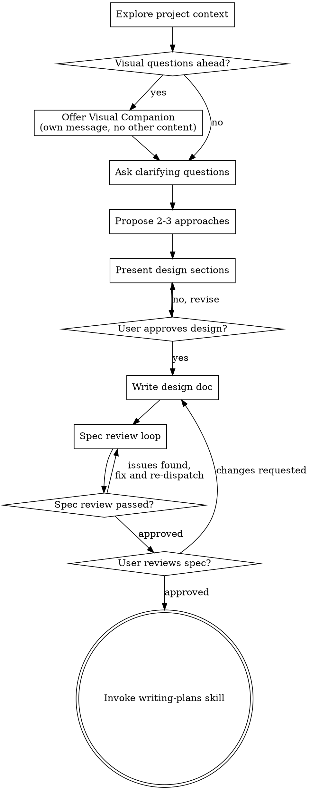
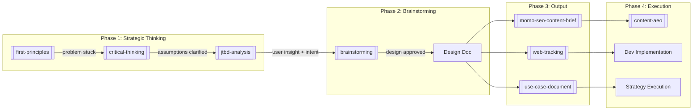

Tôi sẽ viết lại `brainstorming` skill, giữ nguyên cấu trúc và nội dung gốc, chỉ bổ sung liên kết đến các skill khác trong hệ thống MoMo Web Growth.

---

```markdown
---
name: brainstorming
description: "You MUST use this before any creative work - creating features, building components, adding functionality, or modifying behavior. Explores user intent, requirements and design before implementation."
---

## Liên kết
- Skill này là một phần của hệ thống MoMo Web Growth
- Xem tổng thể: [[SKILL_REGISTRY]]
- Workflow: [[PROJECT_ORCHESTRATOR]]
- Skill đầu vào (trước khi dùng brainstorming):
  - [[First-Principles]] - nếu problem đang stuck, cần deconstruct trước khi brainstorm
- Skill đầu ra (sau khi brainstorming xong):
  - [[jtbd-analysis]] - để phân tích user job sâu hơn sau khi có hướng tiếp cận
  - [[use-case-document]] - để document strategy sau khi design được approve
- Skill đồng hành (dùng trong quá trình brainstorming):
  - [[pyramid-principle]] - để cấu trúc design document logical
  - [[Seo-Geo-audit]] - để kiểm tra hiện trạng trước khi brainstorm giải pháp

---

# Brainstorming Ideas Into Designs

Help turn ideas into fully formed designs and specs through natural collaborative dialogue.

Start by understanding the current project context, then ask questions one at a time to refine the idea. Once you understand what you're building, present the design and get user approval.

<HARD-GATE>
Do NOT invoke any implementation skill, write any code, scaffold any project, or take any implementation action until you have presented a design and the user has approved it. This applies to EVERY project regardless of perceived simplicity.
</HARD-GATE>

## Khi nào dùng skill này (trong MoMo context)

| Tình huống | Ví dụ |
|------------|-------|
| **Cần thiết kế feature mới cho web** | "Tạo utility tính lãi suất vay cho page Credit" |
| **Cần giải pháp cho problem chưa rõ** | "Làm sao tăng Web-to-App CR cho Insurance page?" |
| **Cần cải thiện page hiện tại** | "Cần redesign layout Cinema transaction page" |
| **Cần content format mới** | "Nên dùng format nào cho bài so sánh ví điện tử?" |
| **Cần component mới (CTA, banner, popup)** | "Thiết kế smart banner cho campaign tháng 4" |

**Lưu ý:** Nếu problem đã tồn tại lâu và các giải pháp cũ không hiệu quả, chạy `[[first-principles]]` TRƯỚC khi brainstorm.

## Khi nào KHÔNG dùng skill này

| Tình huống | Lý do | Dùng skill khác |
|------------|-------|-----------------|
| **Đã có design rõ ràng, chỉ cần execute** | Không cần brainstorm nữa | `[[momo-seo-content-brief]]` hoặc `[[web-tracking]]` |
| **Problem đã có solution standard** | Ví dụ: thêm canonical tag, fix 404 | Không cần brainstorming |
| **Cần phân tích user behavior trước** | Brainstorm mà không hiểu user = sai ngay từ đầu | `[[jtbd-analysis]]` trước |
| **Cần audit hiện trạng trước** | Không biết vấn đề là gì thì brainstorm gì? | `[[seo-geo-audit]]` trước |
| **Problem đang stuck, assumption cũ sai** | Brainstorm trên nền tảng sai = càng sai | `[[first-principles]]` trước |

## Anti-Pattern: "This Is Too Simple To Need A Design"

Every project goes through this process. A todo list, a single-function utility, a config change - all of them. "Simple" projects are where unexamined assumptions cause the most wasted work. The design can be short (a few sentences for truly simple projects), but you MUST present it and get approval.

## Checklist

You MUST create a task for each of these items and complete them in order:

1. **Explore project context** - check files, docs, recent commits. Trong MoMo context: kiểm tra page hiện tại trên momo.vn, GSC data nếu có, competitor landscape.

2. **Offer visual companion** (if topic will involve visual questions) - this is its own message, not combined with a clarifying question. See the Visual Companion section below.

3. **Ask clarifying questions** - one at a time, understand purpose/constraints/success criteria. Dùng `[[critical-thinking]]` để đặt câu hỏi đúng.

4. **Propose 2-3 approaches** - with trade-offs and your recommendation. Nếu có data từ `[[seo-geo-audit]]` hoặc `[[jtbd-analysis]]`, dùng làm căn cứ cho trade-offs.

5. **Present design** - in sections scaled to their complexity, get user approval after each section. Dùng `[[pyramid-principle]]` để cấu trúc design.

6. **Write design doc** - save to `docs/superpowers/specs/YYYY-MM-DD-<topic>-design.md` and commit

7. **Spec review loop** - dispatch spec-document-reviewer subagent with precisely crafted review context (never your session history); fix issues and re-dispatch until approved (max 5 iterations, then surface to human)

8. **User reviews written spec** - ask user to review the spec file before proceeding

9. **Transition to implementation** - invoke writing-plans skill to create implementation plan

## Process Flow



**The terminal state is invoking writing-plans.** Do NOT invoke frontend-design, mcp-builder, or any other implementation skill. The ONLY skill you invoke after brainstorming is writing-plans.

Trong MoMo context, "writing-plans" có thể là:
- `[[use-case-document]]` nếu design là strategy cho toàn bộ Use Case
- `[[momo-seo-content-brief]]` nếu design là content brief
- `[[web-tracking]]` nếu design là tracking spec
- Hoặc implementation plan custom cho feature cụ thể

## The Process

**Understanding the idea:**

- Check out the current project state first (files, docs, recent commits)
- **MoMo-specific:** Nếu có URL trên momo.vn, fetch page để hiểu hiện trạng. Dùng `[[seo-geo-audit]]` nếu cần audit chuyên sâu.
- Before asking detailed questions, assess scope: if the request describes multiple independent subsystems (e.g., "build a platform with chat, file storage, billing, and analytics"), flag this immediately. Don't spend questions refining details of a project that needs to be decomposed first.
- If the project is too large for a single spec, help the user decompose into sub-projects: what are the independent pieces, how do they relate, what order should they be built? Then brainstorm the first sub-project through the normal design flow. Each sub-project gets its own spec → plan → implementation cycle.
- For appropriately-scoped projects, ask questions one at a time to refine the idea
- Prefer multiple choice questions when possible, but open-ended is fine too
- Only one question per message - if a topic needs more exploration, break it into multiple questions
- Focus on understanding: purpose, constraints, success criteria

**Trước khi hỏi, kiểm tra:**

```
□ Đã hiểu Use Case đang nói đến chưa? (Cinema, Credit, Insurance...)
□ Đã biết mục tiêu business chưa? (Traffic, Conversion, Retention...)
□ Đã có JTBD chưa? Nếu chưa → nên chạy [[jtbd-analysis]] trước
□ Đã có data hiện trạng chưa? Nếu chưa → nên chạy [[seo-geo-audit]] trước
□ Problem có đang stuck không? Nếu có → nên chạy [[first-principles]] trước
```

**Exploring approaches:**

- Propose 2-3 different approaches with trade-offs
- Present options conversationally with your recommendation and reasoning
- Lead with your recommended option and explain why
- **MoMo-specific:** Trade-offs cần đề cập: Impact trên Organic Traffic, Web-to-App Conversion, Effort implementation, dependency với Cell Team

**Presenting the design:**

- Once you believe you understand what you're building, present the design
- Scale each section to its complexity: a few sentences if straightforward, up to 200-300 words if nuanced
- Ask after each section whether it looks right so far
- Cover: architecture, components, data flow, error handling, testing
- Be ready to go back and clarify if something doesn't make sense
- **MoMo-specific:** Design cần cover: page layout, CTA placement, schema markup, tracking events, success metrics

**Design for isolation and clarity:**

- Break the system into smaller units that each have one clear purpose, communicate through well-defined interfaces, and can be understood and tested independently
- For each unit, you should be able to answer: what does it do, how do you use it, and what does it depend on?
- Can someone understand what a unit does without reading its internals? Can you change the internals without breaking consumers? If not, the boundaries need work.
- Smaller, well-bounded units are also easier for you to work with - you reason better about code you can hold in context at once, and your edits are more reliable when files are focused. When a file grows large, that's often a signal that it's doing too much.

**Working in existing codebases:**

- Explore the current structure before proposing changes. Follow existing patterns.
- Where existing code has problems that affect the work (e.g., a file that's grown too large, unclear boundaries, tangled responsibilities), include targeted improvements as part of the design - the way a good developer improves code they're working in.
- Don't propose unrelated refactoring. Stay focused on what serves the current goal.

## After the Design

**Documentation:**

- Write the validated design (spec) to `docs/superpowers/specs/YYYY-MM-DD-<topic>-design.md`
- (User preferences for spec location override this default)
- Use `[[pyramid-principle]]` skill if available để cấu trúc document
- Commit the design document to git

**Spec Review Loop:**

After writing the spec document:

1. Dispatch spec-document-reviewer subagent (see spec-document-reviewer-prompt.md)
2. If Issues Found: fix, re-dispatch, repeat until Approved
3. If loop exceeds 5 iterations, surface to human for guidance

**User Review Gate:**

After the spec review loop passes, ask the user to review the written spec before proceeding:

> "Spec written and committed to `<path>`. Please review it and let me know if you want to make any changes before we start writing out the implementation plan."

Wait for the user's response. If they request changes, make them and re-run the spec review loop. Only proceed once the user approves.

**Implementation:**

- Invoke the writing-plans skill to create a detailed implementation plan
- Do NOT invoke any other skill. writing-plans is the next step.
- **MoMo-specific:** writing-plans có thể dẫn đến:
  - `[[use-case-document]]` cho strategy-level
  - `[[momo-seo-content-brief]]` cho content-level
  - `[[web-tracking]]` cho tracking-level
  - Hoặc implementation spec custom

## Key Principles

- **One question at a time** - Don't overwhelm with multiple questions
- **Multiple choice preferred** - Easier to answer than open-ended when possible
- **YAGNI ruthlessly** - Remove unnecessary features from all designs
- **Explore alternatives** - Always propose 2-3 approaches before settling
- **Incremental validation** - Present design, get approval before moving on
- **Be flexible** - Go back and clarify when something doesn't make sense
- **MoMo-specific:** Mọi design phải trace được về North Star (Organic Traffic hoặc Web2App Conversion)

## Visual Companion

A browser-based companion for showing mockups, diagrams, and visual options during brainstorming. Available as a tool - not a mode. Accepting the companion means it's available for questions that benefit from visual treatment; it does NOT mean every question goes through the browser.

**Offering the companion:** When you anticipate that upcoming questions will involve visual content (mockups, layouts, diagrams), offer it once for consent:

> "Some of what we're working on might be easier to explain if I can show it to you in a web browser. I can put together mockups, diagrams, comparisons, and other visuals as we go. This feature is still new and can be token-intensive. Want to try it? (Requires opening a local URL)"

**This offer MUST be its own message.** Do not combine it with clarifying questions, context summaries, or any other content. The message should contain ONLY the offer above and nothing else. Wait for the user's response before continuing. If they decline, proceed with text-only brainstorming.

**Per-question decision:** Even after the user accepts, decide FOR EACH QUESTION whether to use the browser or the terminal. The test: **would the user understand this better by seeing it than reading it?**

- **Use the browser** for content that IS visual - mockups, wireframes, layout comparisons, architecture diagrams, side-by-side visual designs
- **Use the terminal** for content that is text - requirements questions, conceptual choices, tradeoff lists, A/B/C/D text options, scope decisions

A question about a UI topic is not automatically a visual question. "What does personality mean in this context?" is a conceptual question - use the terminal. "Which wizard layout works better?" is a visual question - use the browser.

If they agree to the companion, read the detailed guide before proceeding:
`skills/brainstorming/visual-companion.md`

## Flow tóm tắt: Từ ý tưởng đến implementation trong MoMo



**Rule:** Không skip Phase 1 để vào brainstorming. Nếu chưa hiểu user job, chưa có truth, brainstorming sẽ sinh ra giải pháp sai ngay từ đầu.

## Example Invocation trong MoMo context

```
User: "Cần brainstorm cải thiện conversion cho Insurance page"

Agent: 
1. Check hiện trạng: dùng [[seo-geo-audit]] để audit page hiện tại
2. Hỏi clarifying questions: 
   - "Mục tiêu là tăng CTA click hay tăng app install completion?"
   - "Đã có JTBD cho Insurance chưa?"
3. Nếu chưa có JTBD → đề xuất chạy [[jtbd-analysis]] trước
4. Sau khi có JTBD + audit → propose 2-3 approaches:
   - Approach A: Redesign layout theo JTBD order
   - Approach B: Thêm utility calculator trước CTA
   - Approach C: A/B test CTA copy variants
5. Present design → user approve → viết design doc
6. Output sang [[momo-seo-content-brief]] hoặc [[web-tracking]]
```
```

---