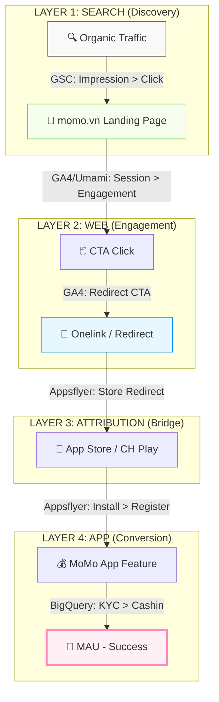

# 🛠 Web2App Pipeline
_Web2App-Pipeline
role: Conversion Optimization
category: operational-skill
tags:
  - web2app
  - conversion
  - deeplink
  - onelink
  - appsflyer
  - tracking
  - cta
  - funnel
  - momo
  - fintech
author: hienho-momo
version: 1.0.0
trigger: web2app, w2a, deeplink, onelink, CTA placement, conversion rate, app install từ web, tracking web-to-app, attribution web, funnel optimization
---

## 🧭 Điều phối

- Quy trình: [[Orchestrator_Engine_Step_2]]
- Kỹ năng bổ trợ: [[web-tracking]]
- Mục tiêu chiến lược: [[web-momo-okrs-2026]]

# Web-to-App Pipeline - MoMo Conversion Skill

## Mục tiêu cốt lõi (Core Mission)

**Chuyển đổi TOÀN BỘ traffic landing vào momo.vn thành New User & MAU trong App.** 

Đây là mục tiêu chiến lược xuyên suốt mọi Use Case. Không một trang landing nào được tồn tại trên momo.vn mà không có lộ trình chuyển đổi (Conversion Path) rõ ràng vào App.

Output của pipeline này dùng để:
1. Thiết kế CTA và deeplink tối ưu cho mọi Use Case page.
2. Spec tracking events (GA4 + Appsflyer) đồng bộ với hệ thống đo lường của MoMo.
3. Audit và tối ưu Conversion Rate (CR) theo từng chặng của funnel.
4. Chẩn đoán điểm gãy (drop-off) và thực thi A/B testing để tăng trưởng MAU bền vững.

---

## MANDATORY - Pre-flight Check

Trước khi thiết kế hoặc audit W2A cho bất kỳ Use Case nào, xác nhận đủ 4 thông tin sau:

| # | Thông tin cần có | Ghi chú |
|---|-----------------|---------|
| 1 | URL page (momo.vn/[use-case]) | Phải scrape thật |
| 2 | Maturity (Zero / Early / Growth) | Zero = chưa có deeplink, Early = có nhưng chưa track được, Growth = đang tối ưu |
| 3 | Target segment (New User hay Existing User) | Quyết định Onelink track nào dùng |
| 4 | Funnel event đã có hay chưa (GA4 + Appsflyer) | Nếu chưa → cần spec trước khi design CTA |

**Rule:** Nếu không có URL thật → không thiết kế CTA. Thiết kế CTA phải dựa trên page thực tế, không lý thuyết.

---

## Phần 1: Web-to-App Funnel Overview

### 1.1 Toàn bộ pipeline (Data Architecture)



**Mỗi bước có 1 tool đo (Multi-tool Validation):** 

| Tầng dữ liệu | Giai đoạn | Công cụ đo lường | Vai trò |
|:---:|---|---|---|
| **Discovery** | Search → Landing | **GSC** | Đo độ phủ & Intent tìm kiếm |
| **Engagement** | Web Interaction | **GA4 + Umami** | Đối soát Session & Click-to-app |
| **Attribution** | Web → Store | **Appsflyer** | Ghi nhận nguồn (pid/c) |
| **Retention** | In-app Events | **BigQuery** | **Single Source of Truth** (MUA/MUV) |

---
### 1.2 Channel Mapping & AI Traffic (GEO)
Cấu hình Source/Medium nhận diện luồng AI Traffic:
- **AI Traffic Channel:** `chatgpt.com`, `claude.ai`, `perplexity.ai`, `gemini.google.com`, `labs.google.com`, `poe.com`, `copilot.microsoft.com`.
- **Logic:** Referrer domain match → Source = `ai_traffic`.
- **Baseline Date:** Báo cáo tính từ **23/04/2026** (Full Funnel Pipeline Go-live).

### 1.3 Visitor & CR Definition (Standard)
- **Unit:** 1 Unique Visitor = 1 `user_pseudo_id` (GA4) / ngày.
- **CR Formula:** `(Click CTA Web→App / Total Visitors from source) * 100`.

### 1.4 Hai Onelink Tracks

| Track | URL | Dùng cho | Events tracked |
|-------|-----|----------|----------------|
| Track 1 | `onelink.momo.vn` | Existing Users (đã cài app) | App Open + In-app Action |
| Track 2 | `momoapp.onelink.vn` | New Users (chưa cài app) | Store → Install → Register → KYC → Cashin → MAU |

**Rule:** Mặc định dùng **Track 2 (momoapp.onelink.vn)** cho tất cả acquisition-focused pages.
Track 1 chỉ dùng khi page rõ ràng phục vụ Existing User (ví dụ: trang tra cứu, trang ưu đãi loyalty).

### 1.5 Benchmark tham chiếu

| Stage | Chỉ số | Benchmark Fintech VN | Nguồn |
|-------|--------|---------------------|-------|
| Click → Session | CTR | 3–20% (phụ thuộc ranking) | GSC |
| Session → CTA Click | Engagement Rate | 15–25% | GA4 |
| CTA Click → App Open | Deeplink Fire Rate | 60–80% | GA4 + Appsflyer |
| App Open → Install | Store Conversion | 30–50% | Appsflyer |
| Install → Register | Reg Completion Rate | 50–70% | Appsflyer |
| Register → KYC | KYC Rate | 40–60% | Appsflyer |
| KYC → Cashin (MAU) | Activation Rate | 20–40% | Appsflyer |

> **Nguồn:** Benchmark nội bộ MoMo (ước tính - ghi `[EST]` nếu dùng trong report). Luôn so sánh với baseline thực tế từ Use Case đang chạy.

---

## Phần 2: CTA Touchpoint Design

### 2.1 Ba touchpoint chuẩn

| Touchpoint | Vị trí | Trigger | CTA Text |
|------------|--------|---------|----------|
| **Smart Banner** | Top of page / cố định | Luôn hiển thị trên mobile | "Mở MoMo để [job]" |
| **Inline CTA** | Sau info/trust section | Sau khi user đọc đủ context | "So sánh xong? Làm ngay trong MoMo" |
| **Sticky Bar** | Bottom of page | Luôn on - mobile only | "[Action ngắn] → Mở MoMo" |

**Hierarchy ưu tiên:**
- Mobile: Sticky Bar + Smart Banner (Inline CTA là bonus)
- Desktop: Inline CTA prominent (Sticky ít effective hơn trên desktop)

### 2.2 CTA text formula

```
"[Verb hành động] + [Job cụ thể] + [Trong MoMo / trên MoMo]"
```

| Use Case | CTA Example |
|----------|-------------|
| Vay Nhanh | "Vay ngay trong MoMo - không cần thế chấp" |
| BH Xe Máy | "Mua bảo hiểm 2 phút trong MoMo" |
| Phạt Nguội | "Nộp phạt ngay trong MoMo" |
| Cinema | "Đặt vé phim trong MoMo" |
| eSIM | "Mua eSIM du lịch ngay trong MoMo" |

**Rule:** Không dùng CTA generic ("Tải ngay", "Mở app"). Phải reflect đúng Job của page đó.

### 2.3 Deeplink structure

```
https://momoapp.onelink.vn/[onelink-id]?
  pid=[channel]           → organic / paid / referral
  c=[campaign-name]       → [use-case]-[page-type]-[date]
  af_sub1=[page-slug]     → momo.vn/[use-case]/[slug]
  af_dp=[deeplink-path]   → app intent nếu biết (vd: momo://payment/vay-nhanh)
  af_web_dp=[fallback-url]→ store URL nếu không có app
```

**UTM naming convention:**
```
Source: organic
Medium: web
Campaign: [use-case]-[page-type]-[YYYYMM]

Ví dụ: organic / web / vay-nhanh-hub-202604
```

**Fallback chain:**
1. App đã cài → Deep link vào đúng feature
2. App chưa cài → Store (App Store / CH Play)

---

## Phần 3: Tracking Spec

### 3.1 GA4 Events chuẩn (Web Layer)

| Event | Trigger | Parameters |
|-------|---------|-----------|
| `page_view` | Mọi page load | `page_slug`, `use_case` |
| `cta_impression` | CTA visible trong viewport | `cta_type` (banner/inline/sticky), `use_case` |
| `click_cta` | User click vào CTA | `cta_type`, `use_case`, `deeplink_url` |
| `redirect_cta` | Deeplink redirect execute | `use_case`, `onelink_url` |
| `scroll_depth` | 25/50/75/100% | `depth_pct`, `use_case` |

**Rule:** `click_cta` và `redirect_cta` là **mandatory** cho mọi page có W2A intent. Không có 2 events này → tracking không valid.

> ⚠️ Naming convention khớp với GTM Container `GTM-P9JDDJZ`. Xem chi tiết tại [[web-tracking]] mục 6.

### 3.2 Appsflyer Events chuẩn (App Layer)

Tracking từ Appsflyer sau khi user rời web:

| Event | Định nghĩa | Owner |
|-------|-----------|-------|
| `af_install` | App install hoàn tất | DA (Hải/Hoàng) |
| `af_complete_registration` | Register thành công | DA |
| `kyc_completed` | Xác thực danh tính xong | DA |
| `cashin_success` | Nạp tiền lần đầu | DA |
| `mau_event` | Active trong tháng | DA |

**Ownership:** DA Cell Team (Hải/Hoàng) execute setup. Hiến define standard và verify xem events có fire đúng sau launch không.

### 3.3 Looker Studio Dashboard - W2A View

```
Nguồn dữ liệu: GSC + GA4 + Appsflyer → BigQuery

Metrics cần có trong dashboard:
Row 1: Organic Impressions | Clicks | CTR (từ GSC)
Row 2: Sessions | CTA Click Rate | Deeplink Fire Rate (từ GA4)
Row 3: App Opens | Installs | Registration Rate (từ Appsflyer)
Row 4: KYC Rate | Cashin Rate | New MAU (từ Appsflyer)

Filter theo: Use Case | Page Slug | Date Range | Device
```

---

## Phần 4: Audit Checklist (dùng khi review existing page)

### 4.1 CTA Audit

```markdown
[ ] Có đủ 3 touchpoints: Smart Banner + Inline CTA + Sticky Bar?
[ ] CTA text reflect đúng Job của page (không generic)?
[ ] Deeplink dùng Track 2 (momoapp.onelink.vn) cho New User flow?
[ ] UTM đã có đủ source/medium/campaign?
[ ] Fallback URL trỏ đúng (store → momo.vn/app)?
[ ] Mobile: Sticky Bar visible khi scroll?
[ ] Desktop: Inline CTA prominent (không bị đẩy xuống below fold)?
```

### 4.2 Tracking Audit

```markdown
[ ] GA4: `cta_click` event firing khi click?
[ ] GA4: `deeplink_fire` event firing khi redirect?
[ ] Appsflyer: Install được attribute đúng về Use Case page?
[ ] BigQuery: data từ GA4 và Appsflyer đã sync?
[ ] Dashboard: funnel hiển thị đúng theo Use Case?
```

### 4.3 Conversion Diagnostic - Drop-off Framework

Khi CR thấp hơn benchmark, trace theo thứ tự:

```
1. CTR thấp (GSC) → Vấn đề: Title/Meta không match intent → Fix: Rewrite title, check SERP format
2. Bounce Rate cao (GA4) → Vấn đề: Page không match intent → Fix: Above-fold content review
3. CTA Click Rate thấp (GA4) → Vấn đề: CTA không đủ trust / không visible → Fix: CTA text + placement
4. Deeplink Fire Rate thấp → Vấn đề: Technical bug hoặc popup blocker → Fix: Debug Onelink
5. Store → Install thấp (Appsflyer) → Vấn đề: App Store listing / device performance → Fix: App team issue
6. Install → Register thấp → Vấn đề: Onboarding friction → Fix: App team issue
```

**Rule:** Hiến sở hữu bước 1-4 (Web layer). Bước 5-6 là App team issue - không tự sửa.

---

## Phần 5: A/B Testing Standard cho CTA

### 5.1 Assignment method

- **Cookie-based** variant assignment - 14-day TTL, keyed by Use Case slug
- Không dùng round-robin (contamination risk)
- Minimum sample: 1,000 CTA impressions per variant trước khi đọc kết quả

### 5.2 Hypothesis template

```
"Nếu [thay đổi CTA X] trên [page Y] thì [CTA Click Rate / Deeplink Fire Rate]
tăng [Z%] vì [lý do dựa trên JTBD]"

Ví dụ:
"Nếu thay CTA từ 'Tải MoMo ngay' thành 'Vay ngay trong MoMo - không thế chấp'
trên /vay-nhanh thì CTA Click Rate tăng 20% vì CTA mới reflect đúng Job
'tôi muốn vay tiền nhanh không cần thủ tục phức tạp'"
```

### 5.3 GA4 Event Schema cho A/B Test

| Parameter | Giá trị |
|-----------|---------|
| `experiment_id` | `[use-case]-cta-[YYYYMM]` |
| `variant` | `control` hoặc `treatment` |
| `cta_type` | `banner` / `inline` / `sticky` |

---

## Phần 6: RACI

| Hoạt động | Hiến (Out-App Traffic) | PO Cell | DA (Hải/Hoàng) | Dev |
|-----------|----------------------|---------|----------------|-----|
| Define CTA touchpoints & text | R/A | C | I | I |
| Define deeplink + UTM structure | R/A | C | C | I |
| Spec GA4 events | C | R/A | C | C |
| Implement deeplink & CTA | C | A | I | R |
| Setup Appsflyer tracking | I | C | R/A | C |
| Verify events sau launch | R/A | C | C | C |
| Dashboard & reporting | I | I | R/A | I |
| Tối ưu CTA (A/B test) | R/A | C | C | C |

---

## Output Format

Khi dùng skill này, output gồm:

```markdown
## W2A Design: [Use Case Name]
**Page:** momo.vn/[url]
**Segment:** New User / Existing User

### CTA Touchpoints
| Touchpoint | Vị trí | CTA Text | Deeplink |
|------------|--------|----------|---------|

### Deeplink Spec
- Onelink URL: [url]
- UTM: source/medium/campaign
- Fallback: [url]

### Tracking Events Spec
| Event | Trigger | GA4 Parameter |
|-------|---------|--------------|

### Funnel Baseline & Target
| Stage | Baseline | Target | Gap |
|-------|----------|--------|-----|
```

---

## Integration

| Skill | Khi nào |
|-------|---------|
| `jtbd-analysis` | Trước khi viết CTA text - cần biết Job để viết đúng |
| `use-case-document` | Part 2.4 dùng output của skill này |
| `Seo-Geo-audit` | Audit technical foundation trước khi setup CTA |
| `brd-momo` | Section 7 Success Metrics dùng W2A CR target từ đây |

**Workflow:** jtbd-analysis → use-case-document → **web2app-pipeline** → tracking verify → post-launch monitoring

---

## Liên kết

- Skill liên quan: [[jtbd-analysis]], [[use-case-document]], [[Seo-Geo-audit]]
- Tracking Reference: [[web-tracking]] - GTM Folder Mapping & BQ Filter Rules
- Mục tiêu chiến lược: [[web-momo-okrs-2026]] - KR 1.1 (6M MUA) & KR 1.3 (W2A CR)
- Context: [[Hienho_MasterDoc_Step_1]] - Mục 4.2 Tracking Architect