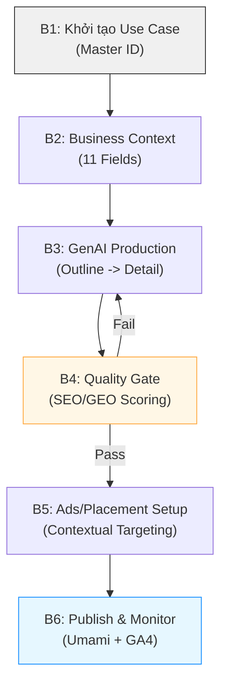

# 📄 Mospark Brd
oSpark Master BRD
role: Platform Architecture & Governance
category: strategic-document
tags:
  - mospark
  - use-case-system
  - ai-powered
  - web-to-app
  - conversion
author: hienho-momo
version: 1.0.0
---

# 🚀 MoSpark: AI-Powered Web App & Content Platform

> **Vision:** Hệ điều hành tăng trưởng (Growth OS) cho mọi sản phẩm Web của MoMo.
> **North Star:** Chinh phục OKR 6M MUA (2026) thông qua sự kết hợp giữa AI Speed và Human Quality.
> **Core Philosophy:** No Hardcode — PM/PO tự vận hành không phụ thuộc Dev.

---

## 1. Tổng Quan & Vị Thế Chiến Lược

### 1.1. MoSpark là gì?
MoSpark là nền tảng thế hệ mới thay thế hệ thống Admin Panel cũ, được thiết kế để hợp nhất mọi nguồn lực Web (Inbound, SEO, Dev, PM) vào một luồng vận hành duy nhất. Nó không chỉ là một CMS, mà là một **Nhà máy sản xuất & Phân phối Chuyển đổi (Conversion Factory)**.

### 1.2. Mục tiêu chiến lược (Link OKR)
- **KR 1.1 (6M MUA):** Cung cấp hạ tầng để scale traffic từ hàng chục lên hàng trăm Use Cases.
- **KR 1.2 (SEO/GEO Traffic):** Đảm bảo 100% nội dung đạt chuẩn E-E-A-T và được AI trích dẫn.
- **KR 1.3 (W2A CR):** Tối ưu hóa phễu chuyển đổi từ Web vào Mobile thông qua Ads Manager và Onelink.

---

## 2. Hệ Thống Cốt Lõi: Use Case System (Linh hồn MoSpark)

MoSpark từ bỏ tư duy quản trị theo "Cell Team" (ốc đảo dữ liệu) và chuyển sang **Use Case System** (tên cũ: Project System).

### 2.1. Định nghĩa Use Case
Một **Use Case** (ví dụ: Phạt Nguội, Vay Nhanh, Bảo Hiểm Ô Tô) là đơn vị định danh duy nhất (Unique ID) kết nối toàn bộ hệ sinh thái:
- **Context:** Business context (11 fields) định hướng AI.
- **Content:** Mọi bài Blog, News, Landing Page thuộc về Use Case đó.
- **Distribution:** Mọi Ads, Popup, Balloon nhắm mục tiêu dựa trên Use Case ID.
- **SEO Inventory:** Bản đồ thị trường (Market -> Cluster) và Volume tiềm năng per Use Case.
- **Analytics:** Mọi chỉ số (Visitor, Click, CR) được gom nhóm theo Use Case.

### 2.2. Cơ chế đồng bộ (Cross-Module Sync)
- **Bottom-Up:** Khi PM tạo bài Blog thủ công và nhập Primary Keyword → Hệ thống tự tạo Use Case tương ứng.
- **Top-Down:** Khi tạo Use Case trong GenAI Content → Hệ thống tự khởi tạo các bài Blog và Ads Placements liên quan.

---

## 3. Kiến Trúc 5 Module Tăng Trưởng

| Module | Chức năng chính | Ý nghĩa |
|---|---|---|
| **1. Landing Page Builder** | Kéo/thả block để tạo trang landing | PM/PO tự launch campaign trong 1 giờ. |
| **2. Use Case Ads Manager** | Phân phối Ads (Balloon, Popup) theo context | Tăng tỷ lệ chuyển đổi Web-to-App. |
| **3. GenAI Content** | Claude API tích hợp sản xuất nội dung | Scale content thần tốc với chi phí thấp nhất. |
| **4. AI Help Center** | Chuyển FAQ tĩnh sang AI Agent tự trả lời | Giảm tải CS, tăng độ hài lòng user. |
| **5. Search/GEO Policy** | Quản lý Robots.txt & LLMs.txt | Giúp AI hiểu và trích dẫn MoMo ưu tiên. |

---

## 4. Quy Trình Vận Hành End-to-End

### 4.1. Quy trình Sản xuất & Xuất bản (Standard Flow)

### 4.2. Quy trình "Từ Web vào Mobile" (W2A Pipeline)
1. **Tiếp cận:** User tìm kiếm (SEO) hoặc hỏi AI (GEO) → Landing Page MoSpark.
2. **Kích hoạt:** Ads Manager nhận diện Use Case ID → Hiển thị Balloon/Popup ưu đãi đúng nhu cầu.
3. **Chuyển đổi:** User click CTA → Onelink (Appsflyer) nhận diện thiết bị.
4. **Hạ cánh:** Mở App (Existing User) hoặc dẫn vào Store (New User).

---

## 5. Quy Định & Cơ Chế Kiểm Soát (Governance)

### 5.1. Cơ chế Quality Gate (SEO/GEO Scoring)
Mọi nội dung MoSpark xuất bản phải vượt qua trạm kiểm soát tự động:
- **Hard Block:** Chặn publish nếu CWV fail hoặc thiếu Primary Keyword.
- **Target Score:** ≥ 80 điểm (Excellent). Dưới 60 điểm cấm publish.

### 5.2. Phân vai Trách nhiệm (RACI)
- **Văn Hiến (SEO/GEO Lead):** Sign-off Business Context, Audit chất lượng, Quản trị luật chơi (Rules).
- **Anh Bảo (Project Lead):** Chốt Roadmap, Duyệt resource, Enforce policy "No Hardcode".
- **Team Tech (Thuận/Lộc/Trọng):** Đảm bảo uptime, build tính năng, tối ưu speed (CWV).
- **Inbound/BU:** Điền dữ liệu context, sản xuất nội dung, vận hành Ads hàng ngày.

---

## 6. Lộ Trình Triển Khai 2026

| Giai đoạn | Trọng tâm | Mục tiêu |
|---|---|---|
| **Phase 1: Foundation** | Migration sang MoSpark, Setup Use Case System | Hợp nhất 100% dữ liệu cũ, không mất traffic. |
| **Phase 2: Scale** | GenAI Content Production (Pilot: Phạt Nguội) | Đạt 1000+ bài viết chuẩn AI Search Citation. |
| **Phase 3: Conversion** | Ads Manager Module 2 (Inventory) | Tối ưu hóa Placement, tăng W2A CR lên >15%. |
| **Phase 4: AI Native** | LLMs.txt & AI Help Center | Biến MoMo thành thương hiệu được AI tin dùng nhất VN. |

---

## 7. Liên Kết Hệ Thống
- Chiến lược: [[web-momo-okrs-2026]]
- Điều phối: [[Orchestrator_Engine_Step_2]]
- Kỹ năng: [[Web2App-Pipeline]], [[web-tracking]], [[llms-robots-txt]]
- Chi tiết kỹ thuật: [[mospark-seo-geo-score-brd]], [[ads-manager-brd]]

---
*Document: MoSpark-Master-BRD · v1.0 · Last Updated: 09/05/20