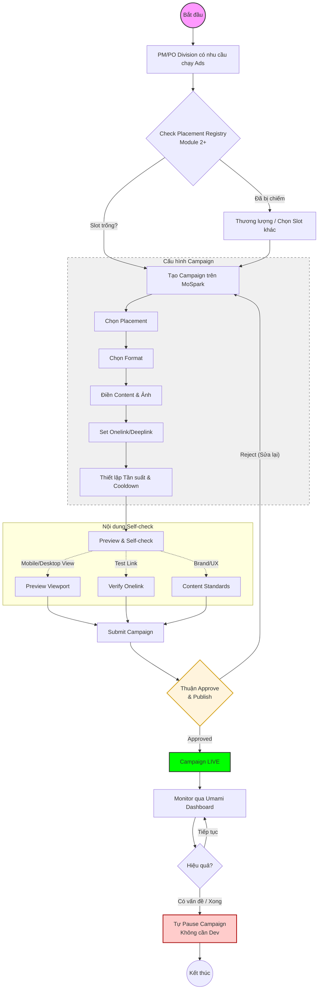

# 📄 Ads Manager Brd
> **Module thuộc:** MoSpark - AI-powered Web App/Content Platform       
> **Project Lead:** Bảo (Web Platform Manager)
> **SEO/GEO Governance & Advisor:** Văn Hiến (Out-App Traffic)
> **Owner kỹ thuật:** Thuận (Web Platform)
> **Version:** 3.0 · April 2026
> **Status:** On Progress
> **Master Strategy:** [[mospark_master]]

---

## 1. Executive Summary

### Situation

MoSpark là nền tảng AI-powered Web App/Content của MoMo, đang vận hành và quản lý toàn bộ hệ sinh thái trang momo.vn - từ Mini Web Use Case (bảo hiểm, BNPL, vay), Blog/News, FAQ, đến Landing Page và Partner Page. MoSpark cho phép PM/PO tự vận hành mà không phụ thuộc Dev - đây là triết lý cốt lõi của nền tảng.

Trong hệ sinh thái đó, **Ads Manager** là module phụ trách một bài toán cụ thể: **phân phối promotional content đúng lúc, đúng trang, đúng người** - để chuyển đổi traffic đang có trên Web thành người dùng App hoặc kích hoạt lại hành vi. Đây là mắt xích còn thiếu trong pipeline Web-to-App của MoMo.

MoMo đang vận hành **Athena** trong App - nền tảng Ads với đầy đủ Campaign/AdGroup/Ad, Segment, Bidding, Tracking. Ads Manager trên MoSpark học hỏi tư duy đó nhưng được thiết kế riêng cho đặc thù Web: không có user identity sâu, nhưng có intent trang rõ ràng qua URL.

### Complication

Thực tế đã chứng minh nhu cầu: trước khi có Ads Manager, MoMo đã thử hardcode Popup và Balloon tại một số trang. Data từ 9 ngày đầu cho thấy 201,300 impression nhưng CTR chỉ 2.4% và Dismiss Rate lên đến 78.3%. Nguyên nhân không phải vì format sai - mà vì thiếu context matching: cùng một message bắn ra trên nhiều trang có intent hoàn toàn khác nhau.

Vấn đề sâu hơn là về mô hình vận hành. Khi Web MoMo scale với nhiều trang và nhiều Division muốn chạy Ads đồng thời, cơ chế hardcode thủ công sẽ tạo ra conflict placement, thiếu visibility tổng thể, không có measurement chuẩn, và Dev phải tham gia vào mỗi campaign - trái với triết lý của MoSpark.

### Resolution

Ads Manager được phát triển theo ba module kế tiếp nhau, từ công cụ vận hành đơn lẻ tiến đến nền tảng quản lý Traffic Inventory và phân phối Ads cho toàn bộ Web MoMo:

- **Module 1 (Production):** Balloon Ads, Popup, Context-based targeting theo URL, A/B test - đang pilot với User Growth team.
- **Module 2:** Traffic Inventory Management - quản lý toàn bộ ad placements trên Mini Web theo URL/segment, cho phép nhiều Division vận hành song song mà không conflict.
- **Module 3:** Ads Distribution Platform - PM/PO các Division/Center tự cấu hình, phân phối và đo lường Ads trên toàn hệ thống Web MoMo, tích hợp Umami dashboard.

---

## 2. Vị Trí Trong MoSpark

### 2.1. MoSpark và các module

MoSpark hiện đang vận hành bốn module chính:

| Module | Trạng thái | Vai trò |
|---|---|---|
| **Landing Page Builder** | Q1 Delivered, Q2 onboarding GPD | PM/PO tự tạo Landing Page mà không cần Dev |
| **Ads Manager** | V1.2 Production - Pilot User Growth | Phân phối promotional content đúng context trên Web |
| **GenAI Content** | Building - Pilot Phạt Nguội | Tạo nội dung chuẩn E-E-A-T và GEO citation tự động |
| **Help Center** | Đăng ký Agentic Org Program | FAQ tĩnh chuyển sang AI Agent tự phục vụ |

Ads Manager là module thứ hai được đưa vào production. Trong khi Landing Page Builder giải quyết bài toán tạo trang, Ads Manager giải quyết bài toán khai thác traffic đang có trên các trang đó để convert sang App.

### 2.2. Mối quan hệ với MoSpark Content Architecture

MoSpark quản lý 7 loại trang chiến lược trên momo.vn. Ads Manager có thể phủ lên toàn bộ hệ sinh thái này:

| URL Pattern | Loại trang | Vai trò của Ads Manager | Placement Type |
|---|---|---|---|
| `/{mini-web}` | Mini Web Use Case | Intent transactional cao | Use Case-specific |
| `/{mini-web}*` | Advanced Mini Web | Traffic lớn, multi sub-page | Use Case-specific |
| `/` | Trang chủ | High traffic, awareness | **Shared-source (GPD)** |
| `/doi-tac*` | Merchant Page | Cross-sell opportunity | **Shared-source (GPD)** |
| `/blog*` | Growth Articles | Awareness và soft nudge | Mixed (Global/UC) |
| `/tin-tuc*` | Communications | Awareness | Shared-source (GPD) |
| `/hoi-dap*` | Help Center | Low interrupt | Shared-source (GPD) |
| `/huong-dan*` | Interactive Guides | Low interrupt | Shared-source (GPD) |
| `/about-us*` | Corporate Pages | Brand trust | Shared-source (GPD) |

### 2.3. Quan hệ với Athena (App Ads)

Ads Manager trên MoSpark và Athena trên App là hai hệ thống độc lập, học hỏi tư duy từ nhau nhưng không tích hợp:

| Chiều | Athena (App) | Ads Manager (Web/MoSpark) |
|---|---|---|
| User identity | Đã định danh, có lịch sử giao dịch | Phần lớn chưa đăng nhập, identity mờ |
| Targeting chính | Audience Segment (behavioral) | URL context của trang (intent-based) |
| Placement unit | Screen trong App | URL/Segment trên Web |
| Bidding | Có - 3 chiến lược | Không - priority-based |

---

## 3. Bài Toán Cần Giải

### 3.1. North Star Metric

Ads Manager đóng góp trực tiếp vào hai North Star Metric của MoMo Web:

**New User Acquisition:**
```
Web Traffic → [Ads Manager] → Click CTA → Onelink → Install → Register → New User
```

**MAU Uplift:**
```
Existing user trên Web → [Ads Manager] → Reactivation message → App Open → MAU
```

### 3.2. Hai mục tiêu phân phối

| Objective | Định nghĩa | KPI | Loại trang phù hợp |
|---|---|---|---|
| **Traffic** | Dẫn user từ Web vào App - click CTA, mở Onelink | CTR, App Open Rate, Install | Mini Web Use Case, Landing Page |
| **Awareness** | Tăng nhận diện tính năng MoMo với user đang browse | Impression, Reach | Blog, Utility Tool, Partner Page |

### 3.3. JTBD - Những việc cần được hoàn thành

**User trên Web:**

| Job | Context | Ads Manager serve như thế nào |
|---|---|---|
| "Biết MoMo có giải pháp cho việc tôi đang làm" | Đang xem trang bảo hiểm, BNPL, vay | Popup/Balloon - benefit cụ thể, CTA trực tiếp |
| "Nhớ đến MoMo khi đang đọc nội dung" | Đang đọc blog tài chính | Balloon nhẹ, Inline Banner - không interrupt |
| "Tìm ưu đãi để quyết định dùng MoMo" | Đang xem Landing Page khuyến mãi | Popup gắn Promotion Campaign |

**PM/PO Division:**

| Job | Context | Ads Manager serve như thế nào |
|---|---|---|
| "Tự chạy Ads trên trang của Division mà không cần Dev" | Muốn go-live campaign hôm nay | Self-service campaign management trên MoSpark |
| "Biết inventory nào có sẵn trên Web để đặt Ads" | Muốn biết slot trống/đã chiếm trên từng trang | Placement Registry - Module 2 |
| "Biết Ads của mình hiệu quả không để tối ưu" | Sau khi campaign chạy 1 tuần | Umami dashboard per Division - Module 3 |

---

## 4. Kiến Trúc Ba Module

### 4.1. Tổng quan lộ trình

```
Module 1 - Campaign Operations (Production)
Balloon Ads + Popup + URL targeting + A/B test
        |
        ↓ nền tảng cho
Module 2 - Traffic Inventory Management
Placement Registry + Conflict Resolution + Inventory Dashboard
        |
        ↓ nền tảng cho
Module 3 - Ads Distribution Platform
Multi-tenant per Division + Extended Formats + Umami Dashboard
```

### 4.2. Module 1 - Campaign Operations (Đang Production)

**Trạng thái:** V1.2 - Pilot với User Growth team.

**Năng lực hiện có:**
- Balloon Ads (deployed 01/04/2026), Popup, Bottom Sheet
- Promotion Scheme gắn kèm gift card / voucher bundle
- A/B testing cơ bản theo variant message và CTA
- Context-based targeting theo URL - ad chỉ hiện trên trang match pattern
- Frequency control: max per session, cooldown, stop after click
- Preview system trên mobile và desktop viewport

**Roadmap đã xác định trong Module 1:**
- Context-based targeting nâng cao theo URL segment
- Tích hợp Appsflyer/Onelink để đo attribution click → install

**Giới hạn cần Module 2 giải quyết:**
- Không có visibility về toàn bộ placement đang dùng trên Web
- Không có cơ chế resolve conflict khi nhiều campaign match cùng URL
- Không có phân quyền theo Division - tất cả chung một pool

### 4.3. Module 2 - Traffic Inventory Management

**Mục tiêu:** Biến URL và segment trên Web MoMo thành "kho inventory" có thể quản lý, phân bổ và theo dõi - tạo nền cho nhiều Division vận hành song song mà không conflict.

**Placement Registry:**

Toàn bộ ad slots trên Web MoMo được đăng ký vào registry tập trung, phân thành 2 loại:
1.  **Use Case Placements:** Thuộc sở hữu của từng Division (Insurance, BNPL, etc.). Chỉ hiện Ads liên quan đến Use Case đó.
2.  **Shared-source Placements (GPD):** Các slot trên trang dùng chung (Homepage, Merchant Page, Category...). GPD quản lý việc phân bổ traffic cho các Division dựa trên độ ưu tiên cấp công ty.

Mỗi placement xác định: URL pattern áp dụng, format được phép, Division/Team có quyền ưu tiên, số lượng Ad active tối đa cùng lúc.

**URL/Segment/Use Case Mapping:**

PM/PO có thể nhìn thấy bản đồ tổng thể - trang nào thuộc Use Case nào, placement nào đang được sử dụng, slot nào còn trống trong "kho" Shared-source của GPD.

**Conflict Resolution:**

Khi nhiều campaign match cùng một placement, hệ thống resolve theo thứ tự: 
- Đối với Shared-source: GPD Priority Level → Campaign start_at.
- Đối với Use Case-specific: Division ownership → Priority Level.
Global guardrail cứng: tối đa 1 Popup active per session, tối đa 2 Balloon cùng lúc.

**Inventory Dashboard:**

Admin view cho Web Platform team - toàn bộ placement và trạng thái sử dụng, campaign đang chạy ở đâu, conflict alert khi phát hiện tranh chấp.

### 4.4. Module 3 - Ads Distribution Platform

**Mục tiêu:** Mở platform cho PM/PO các Division/Center tự vận hành - đây là bước hoàn chỉnh tầm nhìn "PM/PO tự vận hành không phụ thuộc Dev" của MoSpark, mở rộng từ Landing Page Builder sang Ads.

**Multi-tenant per Division:**

| Role | Quyền hạn |
|---|---|
| Platform Admin (Web Platform) | Quản lý Placement Registry, resolve conflict, xem toàn bộ hệ thống |
| Division Operator (PM/PO) | Tạo và vận hành campaign trong phạm vi placement của Division mình |

**Extended Formats:**

Module 3 enable thêm Inline Banner (phù hợp Blog/News) và Sticky Bar (phù hợp Landing Page) - bổ sung cho 4 template đã có từ Module 1.

**Umami Dashboard per Division:**

Mỗi Division có dashboard riêng - Campaign performance (Impression, Click, CTR, Dismiss Rate), top performing placements, comparison theo thời gian. Umami chạy song song với GA4 và Appsflyer, không thay thế.

---

### 4.5. Module 4 & 5 - SEO Inventory & Use Case Performance Tracking

**Mục tiêu:** Cung cấp cho PM/PO từng Cell Team visibility vào Market Sizing và Web Traffic Performance của từng Use Case. Hệ thống sử dụng **"Use Case" làm đơn vị gom nhóm (Grouping)** duy nhất cho mọi loại trang (Page Type), giúp đồng bộ hóa từ khâu xây dựng nội dung đến khi thiết lập Ads placement và đo lường Reach Estimate.

#### Module 4 - SEO Inventory Dashboard

**Định nghĩa:** Dashboard hiển thị Market Sizing (Volume Search) cho mỗi Use Case, giúp PM/PO hiểu tổng thể Market opportunity trước khi allocate Ads budget.

**Nguyên tắc Grouping:**
- Một **Use Case** (ví dụ: Phạt Nguội) bao gồm nhiều **Page Types** (Mini Web, Blog bài viết, FAQ, Landing Page).
- Khi tạo bất kỳ nội dung nào trên MoSpark, PM/PO bắt buộc phải gán Use Case tương ứng.
- Metadata `use_case_id` là sợi chỉ đỏ kết nối các module.

**Data source:**
- Keyword Research input từ Hiến hoặc Inbound team (Market -> Cluster -> Volume)
- Database được Thuận build - form nhập + AppScript formula tính toán

**Data structure (Thuận build):**
- **Market (Root):** Lĩnh vực chính (ví dụ: Vay).
- **Cluster:** Nhóm hành vi tìm kiếm đa dạng được extract từ market (ví dụ: Vay tiền mặt, Vay nóng, Vay thấu chi...).
- **Volume:** Lượng tìm kiếm/tháng cho từng Cluster.
- Storage: Database (schema để Thuận confirm)
- Output: Dashboard visualization per Use Case

**Dashboard visualization:**
- Card view: Total volume per Use Case | Number of markets | Markets breakdown
- Bar chart: Volume by individual market (sorted descending)
- Filter: By Use Case selector

**Example layout:** (Reference hình user provide)
```
FS: 106.9M (29 markets)
MDS: 9.8M (7 markets)
PS: 18.2M (18 markets)
[Bar chart] Volume theo thị trường
```

**Scope Phase 1:** Focus Phạt Nguội (Phạt Nguội market data sẵn sàng hoặc sắp ready)

#### Module 5 - Use Case Performance by Umami

**Định nghĩa:** Dashboard tracking Visitor + Pageview từ Umami, grouped by Use Case (ví dụ: tất cả URL under /phat-nguoi/* = 1 group Phạt Nguội). Khi PM setup Ads placement, thấy Reach Estimate để forecast Ads impact.

**Integration point:**
- Khi PM chọn Use Case để setup campaign trên Ads Manager, hệ thống tự động quét toàn bộ Page Types (URLs) thuộc Use Case đó trong Inventory.
- System show Reach Estimate = Total Unique Visitors của toàn bộ cụm Use Case (bao gồm Blog, Tool, FAQ...) trong 28 days gần nhất.
- Metric: Visitor count + Pageview count của toàn Use Case Group.

**Data source:**
- Umami tracking setup trên momo.vn
- URL pattern mapping per Use Case (ví dụ: /phat-nguoi, /phat-nguoi/blog/*, etc.)

**Status:**
- Demo: Umami đã gắn trên Demo environment
- Live: Cuối tuần sắp tới sẽ lên Live cho Phạt Nguội
- Verification: Check data accuracy trước khi show trên Ads Manager

**Dashboard content:**
- URL group performance: Visitor, Pageview, per Use Case
- Time range: 28 days rolling window
- Show in Ads Manager: Reach Estimate when PM select placement

**Scope Phase 1:** Focus Phạt Nguội (align với Umami Live timeline)

---

**Timeline:**
- **SEO Inventory:** Database schema + form nhập by Thuận → Hiến/Inbound input data → Dashboard live
- **Use Case Performance by Umami:** Umami Live cuối tuần → URL mapping → Integration to Ads Manager
- **Integration:** Reach Estimate feature in Ads Manager campaign creation flow (Module 2-3)

---

## 5. Ad Formats & Placement Strategy

### 5.1. Format theo loại trang

Thay vì targeting theo Screen (như Athena), Ads Manager targeting theo loại trang. Format phải phù hợp với intent:

| Format | Mức interrupt | Phù hợp với | Objective |
|---|---|---|---|
| **Popup** | Cao - chiếm viewport | Mini Web Use Case, Landing Page | Traffic |
| **Balloon Standard** | Thấp - góc màn hình | Tất cả trang | Traffic + Awareness |
| **Balloon Float Icon** | Rất thấp - icon nhỏ | Blog, Utility Tool | Awareness |
| **Bottom Sheet** | Trung bình | Mobile-first pages | Traffic |
| **Inline Banner** | Trung bình - trong content | Blog/News | Awareness |
| **Sticky Bar** | Trung bình - dính đầu/cuối | Landing Page | Traffic |

### 5.2. Nguyên tắc Format-Page fit

- Popup chỉ dùng khi intent của trang đủ cao để justify interrupt - không dùng trên Blog hay Utility Tool
- Trang `/hoi-dap*` và `/huong-dan*` ưu tiên không đặt Ads interrupt - user đang cần hỗ trợ
- Tối đa 1 Popup active per session - global guardrail không thể override

### 5.3. Targeting theo URL Context

**Phase hiện tại (Module 1):**
- URL pattern match - ad chỉ hiện khi URL chứa pattern đã cấu hình
- URL exclude - ad không hiện trên trang trong danh sách loại trừ
- User logged-in state - phân biệt guest vs logged-in

**Phase tiếp theo (Module 2-3):**
- Placement-based targeting - chọn slot từ registry thay vì tự nhập URL
- User type (new/existing/churned) khi Identity có data
- Device type (mobile/desktop)

---

## 6. Way of Working

### 6.1. Workflow vận hành campaign



### 6.2. Phân vai rõ ràng

| Người | Vai trò trong Ads Manager |
|---|---|
| **Bảo** | Product direction, resource allocation, escalation, enforce "no hardcode" policy |
| **Thuận** | Owner kỹ thuật, approve và publish campaign, maintain platform |
| **Lộc** | Setup và triển khai tracking (Umami) |
| **Văn Hiến** | Observe, advise về Content Standards và SEO/GEO impact, không tham gia trực tiếp vào flow approve/publish |
| **PM/PO Division** | Tạo campaign, self-check, submit |
| **Platform Admin** | Quản lý Placement Registry, resolve conflict (Module 2+) |

**Nguyên tắc:**
- Thuận là người approve campaign - không phải Hiến
- Hiến observe health của hệ thống Ads về góc độ SEO/GEO: đảm bảo Ads không ảnh hưởng negative đến crawl, UX signal, và trust của momo.vn
- Mọi campaign phải đi qua Ads Manager - không hardcode vào code. Bảo enforce policy này
- PM/PO Division có thể pause campaign của mình bất kỳ lúc nào mà không cần Dev

### 6.3. Content Standards (PM/PO tự check trước khi submit)

PM/PO tự review trước khi submit để tăng chất lượng và giảm vòng lặp:

| Hạng mục | Câu hỏi tự kiểm tra |
|---|---|
| Benefit cụ thể | Message có nêu lợi ích rõ ràng, có thể verify không? |
| CTA khớp destination | CTA text có khớp với trang đích sau khi click không? |
| Onelink hoạt động | Đã test deeplink trước khi submit chưa? |
| Format phù hợp | Format có phù hợp với loại trang đang nhắm không? |
| Điều kiện tài chính | Nếu có số liệu tài chính, đã verify accuracy chưa? |
| Image spec | Ảnh đúng kích thước theo format spec chưa? |

---

## 7. Phạm Vi & Ưu Tiên

### 7.1. Ưu tiên triển khai theo loại trang

| Priority | Use Case | Lý do |
|---|---|---|
| P0 | Mini Web Use Case (bảo hiểm, BNPL, vay, phạt nguội) | Intent transactional cao nhất, gần điểm convert |
| P0 | Landing Page khuyến mãi | User đang tìm ưu đãi - highly receptive |
| P1 | Blog/News tài chính | Traffic lớn, cơ hội Awareness |
| P1 | Partner Page (/doi-tac) | Cross-sell opportunity |
| P2 | Help Center, Guide | Chỉ Awareness nhẹ - không interrupt flow |

### 7.2. Out of Scope

- Trang chính sách, điều khoản, giới thiệu công ty
- Trang lỗi (404, 500)
- Trang trong checkout / payment flow đang active
- Tích hợp với Athena dưới bất kỳ hình thức nào

---

## 8. Tác Động Đến North Star Metrics

### 8.1. Contribution model

Ads Manager không tạo ra traffic mới - nó khai thác traffic đang có để tăng conversion rate. Contribution vào NSM theo hai hướng:

**New User (Activation):**
User lần đầu vào web → thấy Ads đúng context → click → install app → register → **New User**

**MAU (Retention + Reactivation):**
User đã có app nhưng inactive → vào web tìm kiếm → thấy Ads nhắc nhở tính năng → mở app → **MAU**

### 8.2. KPI theo Module

**Module 1 - Baseline (đang đo):**

| Metric | Baseline (hardcode Phase 0) | Target |
|---|---|---|
| CTR (Traffic campaigns) | 2.4% | 4%+ |
| Dismiss Rate | 78.3% | Dưới 65% |
| Time-to-live | Nhiều ngày (phụ thuộc Dev) | Trong 1 ngày làm việc |

**Module 2 - Platform health:**

| Metric | Target |
|---|---|
| Placement conflict rate | Dưới 10% submissions |
| Zero hardcode violation | Không có campaign nào bypass platform |

**Module 3 - Business impact:**

| Metric | Target |
|---|---|
| Division self-service rate | 80%+ campaign do Division tự vận hành |
| Install attributed to Web Ads | TBD sau 1 tháng Module 3 data |
| MAU contribution từ Web channel | TBD - align với mục tiêu MAU 16M/2026 |

### 8.3. Success Gate per Module

**Gate vào Module 2:**
- Module 1 zero P1 bug trong 2 tuần liên tiếp
- CTR trung bình đạt 4%+ trên ít nhất 3 Traffic campaign
- Attribution chain click → install đã verify

**Gate vào Module 3:**
- Placement Registry đầy đủ cho toàn bộ Mini Web hiện tại
- Conflict resolution hoạt động đúng
- Ít nhất 2 Division đã pilot trong Module 2

---

## 9. Risks

| # | Rủi ro | Khả năng | Impact | Mitigation |
|---|---|---|---|---|
| R1 | PM/PO publish message sai trên trang tài chính - ảnh hưởng YMYL trust | Trung bình (nhiều Division, nhiều operator) | Cao | Content Standards checklist + Thuận review trước khi live |
| R2 | Placement conflict giữa các Division gây UX xấu hoặc Ads spam | Trung bình | Cao | Conflict detection tự động + Platform Admin resolve trước khi campaign live |
| R3 | Ads impact negative đến SEO - crawl, UX signal (bounce rate tăng) | Thấp | Cao | Hiến observe và alert nếu phát hiện signal bất thường; global guardrail chặt |
| R4 | Division không dùng platform - vẫn nhờ Dev hardcode | Trung bình | Cao | "No hardcode" policy enforce từ Bảo + training trước khi Division được access |
| R5 | Thuận overload khi phải build M2+M3 trong cùng 2026 | Cao | Cao | Break scope nhỏ per module; gate rõ ràng trước khi move module |

---

## 10. Lộ Trình & Next Steps

### Roadmap 2026

| Module | Timeline | Milestone |
|---|---|---|
| Module 1 | Done - Q2/2026 onboarding thêm Division | Mở rộng pilot từ User Growth sang GPD |
| Module 2 | Q2/2026 | Placement Registry MVP + Conflict Resolution + Inventory Dashboard |
| Module 3 | Q3/2026 | Multi-tenant, Umami Dashboard, Extended Formats |
| Module 4 - SEO Inventory | Q2/2026 (concurrent with M2) | Database schema + form nhập by Thuận + Hiến/Inbound input data + Dashboard visualization |
| Module 5 - Use Case Performance by Umami | Q2/2026 (End of week) | Umami Live (Phạt Nguội) + URL mapping + Integration to Ads Manager (Reach Estimate) |
| Native Component | Q4/2026+ | Widget/Form tích hợp tự nhiên vào trang - align từng Cell Team |

### Next Steps sau khi BRD được align

| Deliverable | Owner | Mục đích |
|---|---|---|
| PRD Module 2 | Thuận | Technical spec: Placement Registry schema, conflict logic, dashboard |
| Placement Registry v1 | Thuận + Bảo | Danh sách đầy đủ ad slots hiện có trên Mini Web |
| Permission Model | Bảo + Thuận | Role definition per Division cho Module 3 |
| Umami Setup Plan | Lộc + Thuận | Integration plan và dashboard template per Division |
| PM/PO Playbook | Bảo + Hiến advise | Workflow, format guide, content checklist cho Division operator |
| **SEO Inventory - Database Schema** | **Thuận** | **Build form nhập + AppScript formula + Database design (market_name + volume)** |
| **SEO Inventory - Dashboard** | **Thuận + Bảo** | **Visualization: Total volume per Use Case, Markets breakdown, Bar chart volume by market** |
| **SEO Inventory - Data Entry** | **Hiến / Inbound team** | **Input market sizing data for Phạt Nguội Use Case** |
| **Umami - URL Mapping** | **Lộc + Thuận** | **Define URL pattern per Use Case (/phat-nguoi, /phat-nguoi/blog/*, etc.) for grouping** |
| **Umami - Integration to Ads Manager** | **Thuận** | **Show Reach Estimate (28 days Visitor/Pageview) when PM setup campaign** |

---

**END OF DOCUMENT**

> Ads Manager là module trong MoSpark. Mọi thay đổi về scope sản phẩm và module mới cần align với Bảo (Project Lead) trước khi đưa vào P