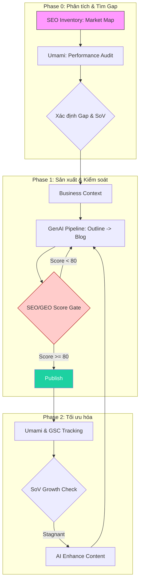

# MoSpark: AI-Powered Web Growth Engine

> **Vision:** Hệ điều hành tăng trưởng (Growth OS) cho mọi sản phẩm Web của MoMo.
> **Division:** Growth Platform Division (GPD)
> **Governance:** Văn Hiến (SEO & GEO Lead)
> **Product Manager:** Anh Bảo (Web Platform Manager)
> **North Star:** Chinh phục OKR 6M MUA (2026) thông qua sự kết hợp giữa AI Speed và Human Quality.

---

## 1. Tổng Quan & Vị Thế Chiến Lược

MoSpark là nền tảng hợp nhất mọi nguồn lực Web (Inbound, SEO, Dev, PM) vào một luồng vận hành duy nhất. Nó không chỉ là một CMS, mà là một **Nhà máy sản xuất & Phân phối Chuyết đổi (Conversion Factory)**.

### 1.1. Mục tiêu chiến lược (Link OKR)
- **KR 1.1 (6M MUA):** Cung cấp hạ tầng để scale traffic từ hàng chục lên hàng trăm Use Cases.
- **KR 1.2 (SEO/GEO Traffic):** Đảm bảo 100% nội dung đạt chuẩn E-E-A-T và được AI trích dẫn.
- **KR 1.3 (W2A CR):** Tối ưu hóa phễu chuyển đổi từ Web vào Mobile thông qua Ads Manager và Onelink.

---

## 2. Kiến Trúc Kỹ Thuật (Technology Stack)

MoSpark được xây dựng trên triết lý **"No Hardcode - AI Native"**:

| Thành phần | Công nghệ sử dụng | Vai trò |
| :--- | :--- | :--- |
| **Hạ tầng (Infrastructure)** | MoBase V2 | Nền tảng hosting và cấu trúc dữ liệu cho mọi trang Web MoMo. |
| **Soạn thảo (Editor)** | **Puckeditor** (React) | Trình soạn thảo block-based, tích hợp trực tiếp AI và SEO Scoring. |
| **Trí tuệ nhân tạo (AI)** | **Claude API** (Anthropic) | Engine chính cho việc lên dàn ý, viết bài và kiểm định (Audit). |
| **Đo lường (Measurement)** | **Umami** & **GSC API** | Theo dõi Traffic thời gian thực và vị trí từ khóa (Ranking). |
| **Dữ liệu thị trường** | **SEO Inventory** (v4) | Kho lưu trữ Total Search Volume và Share of Voice (SoV). |

---

## 3. Hệ Thống Cốt Lõi: Use Case System

MoSpark quản trị theo **Use Case System** (Unique ID) kết nối toàn bộ hệ sinh thái:
- **Context Layer:** Business Context định hướng AI (Source of Truth).
- **Keyword Master Registry:** Quản lý tập trung Primary Keywords, đảm bảo tính duy nhất (Unique ID Check).
- **Double Entry Sync:** Cơ chế đồng bộ ngược - xuôi giữa Editor và module Sản xuất.

### 3.1. Phân loại URL & Page Architecture
Hệ thống hiện đang quản lý và vận hành 7 loại hình trang chiến lược:

| URL Pattern | Loại trang | Mục tiêu & Đặc điểm |
|-------------|------------|---------------------|
| `/blog*` | **Growth Articles** | Bài viết chuyên sâu phục vụ tăng trưởng cho các Use Case. |
| `/tin-tuc*` | **Communications** | Hạng mục truyền thông theo yêu cầu của PM/PO Cell Team. |
| `/hoi-dap*` | **Help Center** | Hệ thống tự phục vụ và giải đáp thắc mắc khách hàng. |
| `/huong-dan*` | **Interactive Guides** | Sử dụng Image Carousel để hướng dẫn sử dụng tính năng App. |
| `/doi-tac*` | **Merchant Page** | Thư viện thông tin và hệ sinh thái đối tác của MoMo. |
| `/{mini-web}` | **Basic Landing Page** | Giới thiệu sản phẩm (Chưa có Simulation/API PLG). |
| `/{mini-web}*` | **Advanced Mini Web** | Đa sub-page, tập trung thúc đẩy traffic và MAU quy mô lớn. |

---

## 4. Quy Trình Vận Hành End-to-End

### 4.1. Sơ đồ luồng (Growth Workflow)

### 4.2. Cơ chế W2A Pipeline (Web-to-App)
1. **Tiếp cận:** SEO/GEO Traffic ➔ Landing Page MoSpark.
2. **Kích hoạt:** Ads Manager nhận diện Use Case ID ➔ Hiển thị Balloon/Popup contextual.
3. **Chuyển đổi:** Click CTA ➔ Onelink (Appsflyer) ➔ Mở App/Store.

---

## 5. Quy Định & Cơ Chế Kiểm Soát (Governance)

### 5.1. Hard Block Policy
Nút **Publish** bị vô hiệu hóa nếu:
- Thiếu **Primary Keyword**.
- **Core Web Vitals** (LCP, CLS, INP) không đạt chuẩn.
- Thiếu các thẻ Technical SEO bắt buộc (Canonical, Robots index).
- Không có nút CTA (Conversion Path).

### 5.2. Phân vai Trách nhiệm (RACI)
- **Văn Hiến (SEO/GEO Lead):** Governance, Audit chất lượng, Prompt Strategy.
- **Anh Bảo (Web Platform Manager):** Roadmap, Resource, Policy "No Hardcode".
- **Team Tech (Nhật/Trọng/Thuận):** Phát triển tính năng, Uptime, CWV Optimization.
- **Inbound/BU:** Cung cấp Business Context, Vận hành nội dung & Ads.

---

## 6. Lộ Trình Phát Triển Sản Phẩm (Product Roadmap)

### 6.1. Operating Modules
- **Landing Page Builder (V1.0):** Q1 Delivered, Q2 Onboarding GPD.
- **Ads Manager (V1.2):** Pilot với User Growth (Balloon, Popup, Bottom Sheet).
- **GenAI Content:** Pilot với dự án Phạt Nguội. Roadmap tích hợp GSC API.
- **AI Help Center:** Chuyển FAQ tĩnh sang AI Agent tự trả lời.

### 6.2. Use Case System Roadmap (Core Infra)
- **Phase 1: Foundation (4-6 tuần):** Quản lý UI, Mandatory Assignment, Dashboard Filtering.
- **Phase 2: Content Distribution (6-8 tuần):** Related Content Widget, Cross-content Linking, Auto-embed.
- **Phase 3: Ads Manager Integration (4-6 tuần):** Contextual Targeting theo Use Case ID, Performance Analytics per Use Case.
- **Phase 4: Analytics & Optimization (4 tuần):** Dashboard chuyên sâu, Automated Recommendations từ data.

---

## 7. Danh Mục Tài Liệu Chi Tiết (Deep-dive)
- **Sản xuất AI:** mospark_genai_content
- **Chấm điểm chất lượng:** mospark_seo_geo_score
- **Quản trị thị trường:** mospark_seo_inventory
- **Sách hướng dẫn triển khai:** mospark_seo_geo_playbook

---

## 8. Liên kết hệ thống (Optional for Mapping)
- [[mospark_genai_content]]
- [[mospark_seo_geo_score]]
- [[mospark_seo_inventory]]
- [[mospark_seo_geo_playbook]]
- [[mospark_business_context]]
- [[mospark_ads_manager]]

---
*Last Updated: 11/05/2026 | Division: Growth Platform Division (GPD)*