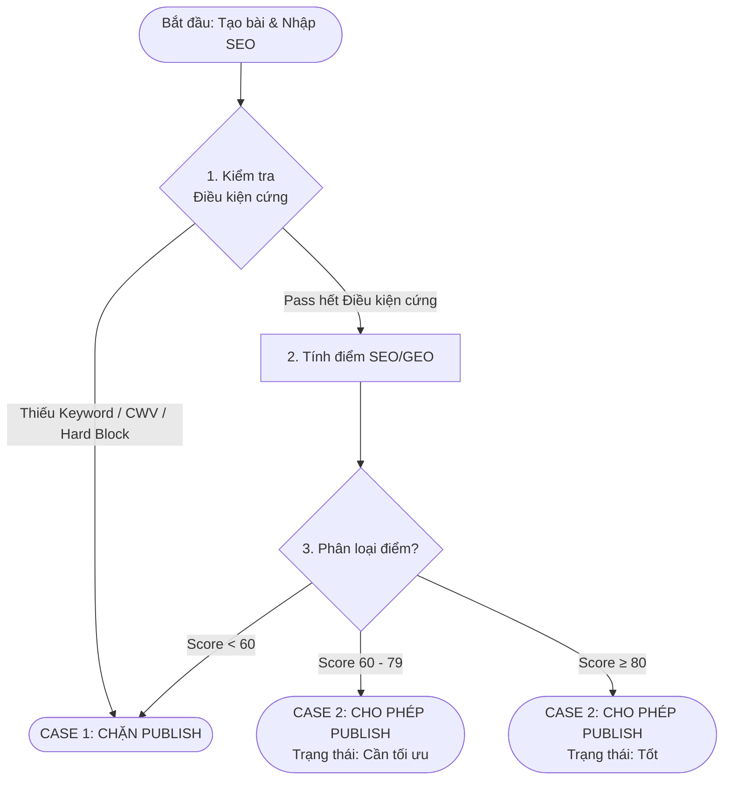

# 📄 Mospark Seo Geo Score Brd
GEO Scoring Checklist - MoSpark Admin

**Document type:** Business Requirements Document
**Team Owner:** Out-App Traffic & Web Platform · GPD
**Product Manager:** Anh Bảo (Web Platform Manager)
**Governance & Standards:** Văn Hiến (SEO & GEO Lead)
**Technical Owner:** Nhật (Web Platform Developer)
**Status:** Active - Governance Gate for all MoSpark Output
**Last updated:** Tháng 4/2026
**System Context:** [[Orchestrator_Engine_Step_2]] | [[Seo-Geo-audit]]
**Master Strategy:** [[mospark_master]]

---

## 0. Bảng Thuật Ngữ

| Thuật ngữ | Giải thích |
|-----------|-----------|
| **Hard Block** | Điều kiện chặn cứng - nếu item này fail, nút Publish bị vô hiệu hóa hoàn toàn, bất kể tổng điểm bao nhiêu. |
| **Draft** | Bản nháp - trạng thái trang đã được lưu nhưng chưa live, chưa ảnh hưởng trang đang chạy. |
| **Publish** | Hành động đưa trang mới lên live lần đầu tiên. |
| **Score Panel** | Bảng chấm điểm SEO/GEO tích hợp trong MoSpark Admin. |
| **CWV (Core Web Vitals)** | Bộ 3 chỉ số hiệu năng trang web cốt lõi của Google: LCP, INP, CLS - ảnh hưởng trực tiếp đến thứ hạng tìm kiếm. |
| **LCP** | Largest Contentful Paint - thời gian tải phần nội dung lớn nhất hiển thị lên màn hình. Ngưỡng tốt: ≤ 2.5s. |
| **INP** | Interaction to Next Paint - thời gian phản hồi khi người dùng tương tác (click, gõ phím). Ngưỡng tốt: ≤ 200ms. |
| **CLS** | Cumulative Layout Shift - mức độ giật layout bất ngờ khi trang tải. Ngưỡng tốt: ≤ 0.1. |
| **FCP** | First Contentful Paint - thời gian xuất hiện nội dung đầu tiên. Ngưỡng tốt: ≤ 1.8s. |
| **TTFB** | Time to First Byte - thời gian server phản hồi byte đầu tiên. Ngưỡng tốt: ≤ 800ms. |
| **SEO** | Search Engine Optimization - tối ưu hóa để trang được tìm thấy trên Google và các công cụ tìm kiếm. |
| **GEO** | Generative Engine Optimization - tối ưu hóa để nội dung được trích dẫn bởi AI (ChatGPT, Perplexity, Google AI Overviews). |
| **E-E-A-T** | Experience, Expertise, Authoritativeness, Trustworthiness - bộ tiêu chí Google dùng để đánh giá chất lượng nội dung. |
| **YMYL** | Your Money Your Life - nhóm nội dung nhạy cảm (tài chính, sức khỏe, pháp lý) bị Google đánh giá khắt khe hơn. |
| **Canonical tag** | Thẻ HTML khai báo URL "chính thống" của trang, giúp Google không bị confuse khi có nhiều URL tương tự. |
| **Robots meta** | Thẻ HTML chỉ định Google có được phép crawl và index trang hay không. Giá trị chuẩn: `index, follow`. |
| **DOM** | Document Object Model - cấu trúc HTML được dựng lên trong trình duyệt. System "parse DOM" nghĩa là đọc và phân tích cấu trúc HTML đó. |
| **JSON-LD** | JavaScript Object Notation for Linked Data - định dạng khai báo Schema (dữ liệu có cấu trúc) trong thẻ `<script>` của trang. |
| **Schema / Structured Data** | Dữ liệu có cấu trúc - thông tin được đánh dấu theo chuẩn Schema.org để AI và Google hiểu rõ nội dung trang hơn. |
| **SERP** | Search Engine Results Page - trang kết quả tìm kiếm của Google. |
| **GSC** | Google Search Console - công cụ miễn phí của Google để theo dõi hiệu suất tìm kiếm và phát hiện lỗi kỹ thuật. |
| **Orphan page** | Trang mồ côi - trang không được link đến từ bất kỳ trang nào khác trên site, Googlebot khó tìm thấy. |
| **Fact Density** | Mật độ số liệu - mức độ xuất hiện của số liệu, thống kê, dữ kiện cụ thể trong nội dung. AI engine ưu tiên trích dẫn nội dung có fact density cao. |
| **Topical Authority** | Thẩm quyền chủ đề - mức độ Google/AI đánh giá một site là nguồn đáng tin cậy về một chủ đề cụ thể. |
| **Disclaimer** | Tuyên bố từ chối trách nhiệm - đoạn văn bắt buộc trên nội dung tài chính, nhắc người đọc rằng nội dung chỉ mang tính thông tin, không phải tư vấn đầu tư. |
| **Lab data** | Dữ liệu đo lường trong môi trường kiểm soát (Lighthouse headless) - đo trên máy chủ, không phải dữ liệu thực từ người dùng. |
| **Field data** | Dữ liệu thực tế từ người dùng thật (Chrome UX Report) - chính xác hơn lab data nhưng chỉ có với trang đã có traffic. |
| **Signed URL** | URL tạm thời có gắn token bảo mật, cho phép truy cập trang Draft không cần đăng nhập trong thời gian giới hạn. |
| **Headless Chrome** | Trình duyệt Chrome chạy không có giao diện (ẩn), dùng để tự động hóa việc mở trang và đo hiệu năng trên server. |
| **Internal link** | Liên kết nội bộ - link từ một trang trên momo.vn trỏ đến một trang khác cũng trên momo.vn. |

---

## 1. Objective

Tích hợp SEO/GEO Checklist Scoring trực tiếp vào **Section SEO** của MoSpark Admin để validate chất lượng của mỗi page trước khi Publish. Mục tiêu: biến khu vực nhập dữ liệu SEO thành một "trạm kiểm soát" chất lượng, đảm bảo không có page nào được publish khi chưa đạt ngưỡng tối thiểu về Technical SEO, On-Page Content, và GEO readiness.

---

## 2. Scope

- **Áp dụng cho:** Tất cả page type trên MoSpark (Mini Web, Landing Page, Blog)
- **Trigger:** Editor tạo page mới trên MoSpark, page ở trạng thái Draft, editor muốn Publish lần đầu
- **Out of scope:** Post-publish monitoring, A/B test scoring, tracking parameter validation, xử lý noindex intentional (thuộc Technical Foundation)

---

## 3. User Flow



---

## 4. Input Model

Các field editor phải nhập trước khi Scoring chạy. Map với field hiện có trong MoSpark:

| Field | Source | Ghi chú |
|-------|--------|---------|
| Meta Title | Field có sẵn | Dùng để check length, keyword placement |
| Meta Description | Field có sẵn | Dùng để check length |
| **Primary Keyword** | Field Keywords - phần tử đầu tiên | 1 từ khóa duy nhất, bắt buộc nhập, không để trống |
| **Secondary Keywords** | Field Keywords - phần tử 2..n | Danh sách từ khóa phụ, cách nhau dấu phẩy, optional |

> **Lưu ý:** Field Keywords hiện tại nhập multi cách nhau dấu phẩy. System sẽ parse: `keywords[0]` = Primary, `keywords[1..n]` = Secondary. Không cần thêm field mới cho việc này.

---

## 4.1 Primary Keyword

### Định nghĩa

**Primary Keyword** là **1 từ khóa duy nhất** mà page được thiết kế để rank chính. Đây là từ khóa có priority cao nhất, thường có search volume cao, intent rõ ràng, và value conversion cao nhất.

**Ví dụ:** "vay tiền", "bảo hiểm", "chuyển tiền", "lãi suất"

### Validation Rules

| Quy tắc | Chi tiết | Error message |
|--------|---------|---------------|
| **Bắt buộc** | Không được để trống | "Primary Keyword bắt buộc phải nhập. Vui lòng nhập từ khóa chính cho trang này." |
| **Trim** | Auto remove leading/trailing space | (Internal - không cần error) |
| **Min length** | Tối thiểu 2 ký tự | "Primary Keyword phải có ít nhất 2 ký tự." |
| **Max length** | Tối đa 50 ký tự | "Primary Keyword không được vượt quá 50 ký tự." |
| **Ký tự hợp lệ** | Tiếng Việt (có dấu), chữ, số, dấu cách. Không chứa: `!@#$%^&*(){}[]<>|?` | "Primary Keyword không được chứa ký tự đặc biệt. Chỉ chữ, số, và dấu cách được phép." |
| **Không phải toàn số** | Không accept "123" (phải có ít nhất 1 chữ) | "Primary Keyword phải chứa ít nhất 1 ký tự chữ." |

### UI/UX

- **Label:** "Primary Keyword *" (asterisk đánh dấu bắt buộc)
- **Placeholder:** "Nhập từ khóa chính (ví dụ: vay tiền, bảo hiểm)"
- **Helper text:** "1 từ khóa duy nhất, cao nhất priority của trang. Dùng để check placement trong Title, H1, và On-Page Content."
- **Input type:** Text, single-line
- **Character counter:** Hiển thị "X/50 ký tự" (real-time)
- **Validation trigger:** On blur hoặc on input (real-time feedback)

---

## 4.2 Secondary Keywords

### Định nghĩa

**Secondary Keywords** là danh sách các từ khóa phụ, bổ trợ cho Primary. Chúng giúp trang cover thêm nhiều keyword variants, long-tail searches, và synonym liên quan.

**Ví dụ:** Nếu Primary = "vay tiền", Secondary có thể là: "vay nhanh, vay online, vay ngân hàng, vay tiền mặt"

### Validation Rules

| Quy tắc | Chi tiết | Error message |
|--------|---------|---------------|
| **Optional** | Được phép để trống | (Không error nếu trống) |
| **Format** | Cách nhau bởi dấu phẩy + space (", ") | Auto-fix: nếu user gõ "keyword1,keyword2" (không space), system tự thêm space: "keyword1, keyword2" |
| **Max từ khóa** | Tối đa 10 từ khóa phụ | "Tối đa 10 từ khóa phụ. Vui lòng xóa bớt." |
| **Min length mỗi từ** | Mỗi từ tối thiểu 2 ký tự | "Từ khóa '{word}' quá ngắn (tối thiểu 2 ký tự). Vui lòng xóa hoặc sửa." |
| **Max length mỗi từ** | Mỗi từ tối đa 50 ký tự | "Từ khóa '{word}' quá dài (tối đa 50 ký tự)." |
| **Ký tự hợp lệ** | Tiếng Việt (có dấu), chữ, số, dấu cách. Không chứa: `!@#$%^&*(){}[]<>|?` | "Secondary Keywords chứa ký tự không hợp lệ. Chỉ chữ, số, dấu cách được phép." |
| **Không trùng Primary** | Kiểm tra: mỗi Secondary keyword có chứa đầy đủ từ Primary không? Nếu có → warning, không block | **Warning (non-blocking):** "Từ khóa '{secondary_word}' chứa Primary Keyword '{primary}'. Bạn có thể xóa nó khỏi Secondary để tránh redundancy." |
| **Không trùng lẫn nhau** | Không cho phép 2 Secondary keywords giống hệt nhau | "Từ khóa '{word}' bị trùng lặp. Vui lòng xóa một bản." |

### UI/UX

- **Label:** "Secondary Keywords"
- **Placeholder:** "Nhập từ khóa phụ cách nhau bằng dấu phẩy (ví dụ: vay nhanh, vay online, vay ngân hàng)"
- **Helper text:** "Danh sách từ khóa bổ trợ. Giúp trang cover thêm keyword variants và long-tail searches. Optional - nhưng khuyến khích điền đầy đủ."
- **Input type:** Textarea hoặc comma-separated input field
- **Word counter:** Hiển thị "X từ / 10 tối đa"
- **Chip/Tag display:** Sau khi user nhập xong, hiển thị từng Secondary keyword dưới dạng tag/chip, cho phép xóa từng cái bằng cách click "×"
- **Validation trigger:** On blur hoặc on input (real-time feedback)

---

## 4.3 Integration với SEO/GEO Scoring

### Primary Keyword - Điểm được dùng trong:

| Block | Items | Cách dùng |
|-------|-------|----------|
| **Block 1 - Technical SEO** | 1.6 (H1) | Check H1 có chứa Primary Keyword không |
| **Block 2 - On-Page** | 2.2 (Density), 2.3 (Placement) | Tính keyword density, check placement trong Title/H1/150 từ đầu/H2 |
| **Block 3 - GEO Signals** | 3.4 (Entity) | Gián tiếp - dùng Primary để xác định entity context của trang |

### Secondary Keywords - Điểm được dùng trong:

| Block | Items | Cách dùng |
|-------|-------|----------|
| **Block 2 - On-Page** | 2.4 (Keyword frequency) | Check mỗi Secondary keyword xuất hiện 2-5 lần trong body |

### Behavior khi Primary/Secondary thay đổi:

- Nếu editor thay đổi Primary hoặc Secondary **sau khi đã Run SEO/GEO Score** → hệ thống tự động **reset Score về trạng thái "Chưa chạy"** và hiển thị tooltip: "Bạn vừa thay đổi Keywords. Vui lòng Run SEO/GEO Score lại để cập nhật điểm."
- Nút Publish vẫn enabled (nếu trước đó đã pass), nhưng Score Panel hiển thị badge "⚠ Keywords đã thay đổi - chạy lại để verify"

---

## 4.4 Lưu ý cho Dev

1. **Parse keywords field:** Sau khi user nhập Keywords và bấm Save, Dev parse field này:
   ```
   input = "vay tiền, vay nhanh, vay online"
   split by ", " → ["vay tiền", "vay nhanh", "vay online"]
   primary = keywords[0] = "vay tiền"
   secondary = keywords[1..n] = ["vay nhanh", "vay online"]
   ```

2. **Validation timing:**
   - Real-time validation **on blur** - show error message cạnh field, không block save
   - Non-blocking validation **on Save Draft** - hiển thị warning nhưng vẫn save được
   - Hard validation **on Publish** - Primary bắt buộc phải có, nếu không → disable Publish button

3. **Fallback khi Primary trống:**
   - Nếu user bấm Publish mà Primary trống → nút Publish bị disable hoàn toàn
   - Tooltip: "Primary Keyword bắt buộc. Vui lòng nhập từ khóa chính trước khi Publish."

4. **Regex pattern suggestions:**
   - Primary min/max: `/^[\p{L}\p{N}\s]{2,50}$/u` (Unicode letters + digits + spaces)
   - Secondary split: `/,\s*(?=\S)/` (split by comma + optional spaces)
   - Remove duplicates từ Secondary: deduplicate case-insensitive
   - Auto-format: `keywords.map(k => k.trim()).filter(k => k.length > 0).join(", ")`

## 5. Scoring Model

### 5.1 Tổng điểm: 100 điểm (cố định)

| Block | Điểm | Ghi chú |
|-------|------|---------|
| Block 1 - Technical SEO + CWV | 30 | Nền tảng crawl/index |
| Block 2 - On-Page Content | 35 | Signal ranking trực tiếp |
| Block 3 - Structured Data & GEO Signals | 20 | Entity signal cho Google và AI engine |
| Block 4 - OG Tags | 5 | Social sharing |
| Block 5 - Kiểm duyệt thủ công (Manual Review) | 10 | Các bước xác nhận bằng con người trước khi live |
| **Tổng** | **100** | |

> **Lưu ý phân bổ điểm:** Block 3 được nâng từ 15 lên 20 điểm để phản ánh tầm quan trọng của GEO signals (datePublished, Fact Density, Disclaimer) - các item này được tích hợp trực tiếp vào block thay vì tính bonus riêng. Block 1 giảm từ 35 xuống 30 điểm tương ứng. Tổng luôn là 100, ngưỡng Pass/Warning không thay đổi.

### 5.2 Ngưỡng publish

Dựa trên kết quả Scoring, hệ thống phân loại thành 2 Case chính:

| Case | Trạng thái | Điều kiện | Behavior |
|--------|-----------|-----------|----------|
| **CASE 1** | **Blocked** | Có Hard Block fail (Keyword, CWV, Technical) HOẶC Score < 60 | Nút Publish bị disable hoàn toàn |
| **CASE 2** | **Warning** | Score 60-79 và không có Hard Block fail | Nút Publish enabled với badge "⚠ Cần tối ưu" |
| **CASE 2** | **Pass** | Score ≥ 80 và không có Hard Block fail | Nút Publish enabled với trạng thái "Tốt" |

---

## 6. Chi tiết từng Block

### Block 1 - Technical SEO + CWV (30 điểm)

| # | Hạng mục | Điểm | Validate method | Hard Block |
|---|----------|------|----------------|------------|
| 1.1 | Canonical tag tồn tại trong `<head>` | 3 | Auto: parse `<head>`, kiểm tra sự tồn tại của `<link rel="canonical" href="...">`. Fail nếu tag không có hoặc `href` rỗng | YES |
| 1.2 | Giá trị canonical khớp với URL thực tế của trang | 3 | Auto: so sánh giá trị `href` trong canonical tag với URL hiện tại của Draft page (normalized: bỏ trailing slash, lowercase). Fail nếu hai giá trị không khớp | YES |
| 1.3 | Robots meta = `index, follow` | 3 | Auto: parse robots meta tag | YES |
| 1.4 | Title tag: có giá trị, ≤ 60 ký tự | 3 | Auto: check từ Meta Title field | NO |
| 1.5 | Meta Description: 120-160 ký tự | 2 | Auto: check từ Meta Description field | NO |
| 1.6 | H1: duy nhất 1 H1, chứa Primary Keyword | 3 | Auto: parse DOM, count H1, check keyword | NO |
| 1.7 | Heading hierarchy đúng thứ tự (H2→H3) | 2 | Auto: parse DOM, validate heading order | NO |
| 1.8 | Alt text đầy đủ cho tất cả `` | 2 | Auto: count `` không có `alt` hoặc `alt` rỗng | NO |
| 1.9 | Body trang có ít nhất 1 internal link trỏ đến trang khác trên momo.vn | 2 | Auto: parse `<body>` của Draft page, tìm tất cả `<a href="...">` có hostname là `momo.vn` và path khác với URL hiện tại. Pass nếu count ≥ 1. Lưu ý: chỉ đếm link trong `<body>`, bỏ qua link trong nav và footer | NO |
| 1.10 | **LCP ≤ 2.5s** | 3 | Performance Tool (offline) | YES |
| 1.11 | **INP ≤ 200ms** | 2 | Performance Tool (offline) | YES |
| 1.12 | **CLS ≤ 0.1** | 2 | Performance Tool (offline) | YES |
| 1.13 | FCP ≤ 1.8s | 1 | Performance Tool (offline) | NO |
| 1.14 | TTFB ≤ 800ms | 3 | Performance Tool (offline) | NO |

**Tổng Block 1: 30 điểm**

---

### Block 2 - On-Page Content (35 điểm)

#### Wordcount threshold theo Page Type

Dev implement rule: nếu visible text wordcount của trang **không đạt ngưỡng tối thiểu theo page type** thì item 2.1 fail (không block Publish nhưng trừ điểm). Không có ngưỡng trần - wordcount càng cao không bị phạt.

| Page Type | Wordcount tối thiểu | Lý do |
|-----------|-------------------|-------|
| `mini-web` | ≥ 800 từ | Trang SEO chính - cần đủ content depth để rank và pass YMYL signal. Đa phần Mini Web của MoMo là YMYL (tài chính, bảo hiểm, thanh toán), Google đánh giá E-E-A-T dựa trên content volume và chất lượng |
| `landing-page` | ≥ 300 từ | Trang campaign/promotion - không ưu tiên rank dài hạn, mục tiêu chính là conversion, wordcount thấp chấp nhận được |
| `blog` | ≥ 800 từ | Trang editorial SEO - cần đủ chiều sâu để rank cho informational query và xây dựng topical authority |

> Wordcount đếm **visible text** trong `<body>`, loại trừ: nav, footer, button label, meta tags.

| # | Hạng mục | Điểm | Validate method | Hard Block |
|---|----------|------|----------------|------------|
| 2.1 | Wordcount đạt ngưỡng theo Page Type | 6 | Auto: đếm visible text, so sánh với threshold theo loại trang (Page Type) | NO |
| 2.2 | Primary Keyword density: 1-2% | 5 | Auto: `(keyword_count / total_words) * 100`, cờ nếu < 1% hoặc > 2% | NO |
| 2.3 | Primary Keyword trong Title + H1 + 150 từ đầu + ≥ 1 H2 | 6 | Auto: parse DOM, check keyword placement | NO |
| 2.4 | Secondary Keywords: mỗi từ xuất hiện 2-5 lần | 4 | Auto: đếm frequency từng keyword trong `keywords[1..n]` | NO |
| 2.5 | Không có keyword stuffing (đọc tự nhiên) | 3 | Manual: editor checkbox + tooltip hướng dẫn | NO |
| 2.6 | Nội dung đã được review đầy đủ, không thiếu section so với brief/outline ban đầu | 4 | Manual: editor checkbox | NO |
| 2.7 | Có ít nhất 1 CTA visible | 5 | Auto: check dữ liệu field (button/CTA) khi tạo trang | YES |
| 2.8 | Không có lỗi encoding tiếng Việt | 2 | Auto: detect ký tự replacement `?` hoặc `□` trong body text | NO |

**Tổng Block 2: 35 điểm**

> **Lưu ý cho Dev về CTA detection (2.7):** MoSpark có field riêng để Editor thêm CTA button khi tạo trang. Dev implement theo quy tắc: **nếu field CTA không rỗng → pass**; nếu field rỗng → fail item 2.7. Fallback: nếu MoSpark chưa có field riêng thì dùng attribute `data-cta="true"` trên element làm convention chuẩn để detect.

---

### Block 3 - Structured Data & GEO Signals (20 điểm)

Block này gộp cả Structured Data (Schema) và GEO Signals (tín hiệu giúp AI engine trích dẫn nội dung). Item 3.6 có điều kiện áp dụng theo page type - nếu page type không bị yêu cầu, item được bỏ qua và điểm được normalize lại.

| # | Hạng mục | Điểm | Validate method | Áp dụng | Hard Block |
|---|----------|------|----------------|---------|------------|
| 3.1 | Có ít nhất 1 Schema type phù hợp với Page Type | 5 | Auto: check sự tồn tại của `<script type="application/ld+json">` trong source code, parse JSON, validate `@type` có trong danh sách hợp lệ theo page type (xem bảng Schema bên dưới) | Tất cả | NO |
| 3.2 | Organization schema có `name`, `url`, `logo` | 3 | Auto: parse JSON-LD, tìm object có `@type: "Organization"`, validate 3 field `name`, `url`, `logo` tồn tại và không rỗng | Tất cả | NO |
| 3.3 | FAQ schema nếu page có section hỏi/đáp | 3 | Semi-auto: System scan DOM theo 2 tiêu chí - (1) tồn tại element `<details>/<summary>` hoặc element có class chứa "faq"/"accordion", (2) tồn tại cặp heading + paragraph mà heading bắt đầu bằng các từ khóa "là gì", "như thế nào", "có được không", "bao nhiêu". Nếu phát hiện ≥ 2 pattern → hiển thị cảnh báo "Trang có vẻ có phần hỏi/đáp - bạn có muốn thêm FAQ Schema không?" và cho Editor xác nhận Yes/No | Tất cả | NO |
| 3.4 | Entity name "MoMo" xuất hiện trong body text | 2 | Auto: check string "MoMo" tồn tại trong visible text của `<body>` | Tất cả | NO |
| 3.5 | `datePublished` và `dateModified` có trong Schema | 2 | Auto: parse JSON-LD, check field `datePublished` và `dateModified` tồn tại và có giá trị hợp lệ theo định dạng ISO 8601 (ví dụ: `2026-04-01`) | Tất cả | NO |
| 3.6 | Fact Density: nội dung có ít nhất 3 số liệu/thống kê cụ thể | 5 | Semi-auto: System dùng regex detect các pattern số trong body text: số có đơn vị (%, triệu, tỷ, năm, ngày, lần), số tiền (VND/đồng), số nguyên standalone ≥ 4 chữ số. Đếm tổng số match, pass nếu ≥ 3. Hiển thị danh sách các số tìm được để Editor xác nhận "Các số liệu này chính xác" trước khi tính điểm | `mini-web`, `blog` | NO |

**Tổng Block 3: 20 điểm**

> **Ghi chú phân bổ điểm conditional:** Item 3.6 (5 điểm) chỉ áp dụng cho `mini-web` và `blog`. Với `landing-page`, tổng điểm khả dụng của Block 3 là 15/20. Dev cần normalize để tránh `landing-page` bị bất lợi cấu trúc.
>
> **Công thức normalize:** `score_block3_final = (điểm_đạt / điểm_khả_dụng) * 20`
>
> | Page Type | Điểm khả dụng Block 3 |
> |-----------|----------------------|
> | `mini-web` | 20 |
> | `blog` | 20 |
> | `landing-page` | 15 (bỏ item 3.6) |

#### Schema type hợp lệ theo Page Type

| Page Type | Schema khuyến nghị |
|-----------|-------------------|
| `mini-web` | `FinancialProduct`, `Service`, `LoanOrCredit`, `InsuranceAgency`, `BreadcrumbList` |
| `landing-page` | `WebPage` |
| `blog` | `Article`, `BlogPosting`, `BreadcrumbList` |
| Bất kỳ page có FAQ | Thêm `FAQPage` |
| Page có hướng dẫn step-by-step | Thêm `HowTo` |

---

### Block 4 - OG / Social Meta (5 điểm)

| # | Hạng mục | Điểm | Validate method | Hard Block |
|---|----------|------|----------------|------------|
| 4.1 | `og:title` có giá trị | 1 | Auto: parse meta og tags | NO |
| 4.2 | `og:description` có giá trị | 1 | Auto | NO |
| 4.3 | `og:image` URL valid và resolve được | 2 | Auto: HEAD request đến image URL, check HTTP 200 | NO |
| 4.4 | `og:url` trỏ đúng canonical URL | 1 | Auto | NO |

**Tổng Block 4: 5 điểm**

---

### Block 5 - Kiểm duyệt thủ công (Manual Review) (10 điểm)

*Đây là các hạng mục hệ thống không thể kiểm tra tự động, yêu cầu Editor phải tự đánh giá và tick chọn xác nhận.*

| # | Hạng mục | Điểm | Validate method | Hard Block |
|---|----------|------|----------------|------------|
| 5.1 | **Xem trước bản nháp:** Editor đã mở link Preview để kiểm tra thực tế giao diện và nội dung trang hiển thị đúng như mong đợi. | 3 | Manual: editor checkbox | NO |
| 5.2 | **Hiển thị trên Mobile:** Editor xác nhận giao diện trên điện thoại di động hiển thị tốt, không bị vỡ layout, text dễ đọc. | 3 | Manual: editor checkbox | NO |
| 5.3 | **Trạng thái URL trên GSC:** Xác nhận URL này chưa từng bị dính án phạt "Manual Action" trên Google Search Console. | 2 | Manual: editor checkbox (kèm tooltip hướng dẫn) | NO |
| 5.4 | **Sitemap Indexing:** Xác nhận trang này cần được khai báo vào Sitemap sau khi Publish để Googlebot nhận diện nhanh hơn. | 2 | Manual: editor checkbox | NO |

**Tổng Block 5: 10 điểm**

---

## 7. CWV Integration - Performance Tooling (Offline)

### Lý do tích hợp

Core Web Vitals (LCP, INP, CLS) là confirmed ranking signals của Google từ 2021 và tiếp tục được weighted trong các update thuật toán gần đây. Với MoMo cụ thể, có 2 lý do chính để tích hợp CWV ngay tại điểm publish thay vì chỉ monitor post-deploy:

**1. Mospark là nền tảng AI-generated template** - rủi ro mỗi template mới hoặc mỗi lần thay đổi layout block đều có thể gây regression CWV mà editor không nhận ra. Nếu không có gate tại publish, regression chỉ được phát hiện khi GSC báo cáo - thường sau 28 ngày, lúc đó traffic đã bị ảnh hưởng.

**2. MoMo là YMYL domain** - Google áp dụng tiêu chuẩn cao hơn với YMYL pages về cả content quality và page experience. CWV kém trên trang tài chính/bảo hiểm có hệ số ảnh hưởng ranking cao hơn so với domain thông thường. Đặc biệt LCP và CLS trực tiếp ảnh hưởng đến trust perception của người dùng trên landing tài chính.

### Implementation Method (Vượt rào cản đăng nhập cho Draft URL)

Hệ thống PageSpeed Insights API của Google mặc định không thể chấm điểm một URL nháp yêu cầu đăng nhập. Để vượt qua rào cản này, Dev có thể cân nhắc 1 trong 3 hướng sau:

- **Option 1: Dùng thư viện Lighthouse Node.js + Puppeteer (Khuyên dùng)**
  Backend MoSpark khởi tạo trình duyệt Chrome ẩn (Headless Chrome), tự động truyền (inject) Cookie/Token xác thực của phiên làm việc hiện tại, sau đó truy cập trực tiếp URL Draft nội bộ và chạy Lighthouse programmatically để lấy điểm.
  *(Ưu điểm: Dữ liệu chuẩn xác như môi trường thực tế, bảo mật hoàn toàn nội bộ).*

- **Option 2: Tạo Temporary Public URL (Signed URL)**
  Khi Editor bấm chấm điểm, hệ thống sinh ra một đường link phụ có gắn token bảo mật (ví dụ: `?token=abcxyz...`) chỉ sống trong 5 phút. Link này cho phép truy cập trang Draft public mà không cần đăng nhập, sau đó ném link này cho Google PageSpeed API chấm điểm như bình thường.
  *(Ưu điểm: Tận dụng được sức mạnh API của Google, Dev không phải setup server nội bộ để chạy headless browser nặng nề).*

- **Option 3: Chấm điểm dựa trên HTML tĩnh (Static HTML parsing)**
  Lấy toàn bộ mã HTML đã render của trang Draft và xuất thành file tĩnh, sau đó gọi công cụ Lighthouse CLI chạy cục bộ trên tệp này.
  *(Ưu điểm: Triển khai nhanh, không tốn resource mạng. Nhược điểm: Điểm số có thể lệch nhẹ nếu layout phụ thuộc nhiều vào Javascript gọi API).*

### Trigger & Default State

Nút Publish bị **disabled** cho đến khi Editor bấm "Run CWV Check" và nhận được kết quả. Đây là hard require, không có ngoại lệ.

**Default state trước khi Run:** Items 1.10, 1.11, 1.12, 1.13, 1.14 hiển thị trạng thái "Chưa có dữ liệu" (không tính vào score, không phải 0 điểm). Nút Publish hiển thị tooltip: *"Vui lòng Run CWV Check trước khi Publish"*.

**Sau khi Run:** Kết quả được áp vào score ngay lập tức. Nếu bất kỳ Hard Block CWV item nào fail → nút Publish tiếp tục disabled với lý do cụ thể.

### Response mapping

| CWV Metric | Checklist item | Pass threshold | Hard Block |
|-----------|---------------|---------------|------------|
| `largest-contentful-paint` | 1.10 LCP | ≤ 2,500ms | YES |
| `interaction-to-next-paint` | 1.11 INP | ≤ 200ms | YES |
| `cumulative-layout-shift` | 1.12 CLS | ≤ 0.1 | YES |
| `first-contentful-paint` | 1.13 FCP | ≤ 1,800ms | NO |
| `server-response-time` | 1.14 TTFB | ≤ 800ms | NO |

### Lưu ý kỹ thuật

- Tool trả về **lab data** (Lighthouse headless) - không phải field data từ Chrome UX Report. Với Draft URL chưa có traffic thực thì đây là phương án khả thi nhất. Lab data có thể khác field data 10-15% nhưng đủ để làm gate.
- Kết quả score tạm thời hiển thị trên phiên làm việc (session). Tính năng lưu lịch sử (history/timestamp) vào DB sẽ được nghiên cứu bổ sung trong Next Phase.

---

## 8. UI Requirements

### 8.1 Vị trí tích hợp (Integration Point)

Score Panel không nằm riêng lẻ mà được tích hợp trực tiếp bên dưới các trường nhập liệu trong **Section SEO** của trình soạn thảo. Khi Editor cuộn đến phần cấu hình SEO, bảng điểm sẽ tự động hiển thị để cung cấp feedback ngay lập tức.

### 8.2 Score Panel layout

```
┌─────────────────────────────────────────┐
│  SEO/GEO Score                          │
│                                         │
│  ████████████████░░░░  78/100           │
│  Status: ⚠ WARNING - Cần cải thiện      │
│                                         │
│  Block 1 Technical    23/30  ⚠          │
│  Block 2 On-Page      30/35  ✓          │
│  Block 3 GEO          15/20  ✓          │
│  Block 4 OG Tags       5/5   ✓          │
│  Block 5 Manual Check  5/10  ✗          │
│                                         │
│  [Run CWV Check]  [Xem chi tiết]        │
│                                         │
│  Hard Block items: 0 fail               │
│  [Save Draft]  [⚠ Publish - Warning]    │
└─────────────────────────────────────────┘
```

### Trạng thái màu

| Trạng thái | Màu | Điều kiện |
|-----------|-----|-----------|
| Pass | Green `#059669` | Score ≥ 80, không có Hard Block fail |
| Warning | Amber `#D97706` | Score 60-79, không có Hard Block fail |
| Blocked | Red `#DC2626` | Có Hard Block fail |

### Nút Save Draft & Publish

- **Nút "Save Draft"**: Luôn enabled. Lưu nháp các thay đổi, page chưa live.
- **Nút "Publish"**: Đưa page mới lên live lần đầu tiên.

| Trạng thái (Publish) | Behavior Nút Publish |
|-----------|----------|
| Có Hard Block fail | Disabled + tooltip hiển thị lý do từng item fail |
| Score 60-79, không Hard Block fail | Enabled với badge "⚠ Warning" |
| Score ≥ 80, không Hard Block fail | Enabled bình thường |

---

## 9. Hard Block Summary

Tổng hợp các điều kiện **disable nút Publish**:

| Điều kiện | Lý do |
|-----------|-------|
| **Primary Keyword trống** | Không có từ khóa chính để tính toán mật độ và vị trí SEO - bắt buộc nhập |
| **CWV chưa được Run** | Bắt buộc có kết quả CWV trước khi Publish - không có ngoại lệ |
| **1.1 Canonical không tồn tại** | Googlebot không xác định được URL chính thống |
| **1.2 Canonical sai URL** | Google index sai URL, trang mới không tích lũy được signal |
| **1.3 Robots = noindex** | Googlebot không index được - trang không xuất hiện trên SERP |
| **1.10 LCP > 2.5s** | Core ranking signal của Google, trực tiếp ảnh hưởng position |
| **1.11 INP > 200ms** | Core ranking signal của Google |
| **1.12 CLS > 0.1** | Core ranking signal của Google, đặc biệt nghiêm trọng với trang có form/CTA |
| **2.7 Không có CTA** | Page không có conversion path - mất toàn bộ mục đích Web-to-App |

---

## 10. Technical Notes & Hướng xử lý cho Dev

| # | Hạng mục | Hướng xử lý (Resolution) |
|---|----------|--------------------------|
| 1 | **Nhận diện nút CTA (item 2.7)** | MoSpark có field riêng để Editor thêm CTA button khi tạo trang. Dev implement theo quy tắc: **nếu field CTA không rỗng → pass**; nếu field rỗng → fail item 2.7. Fallback: nếu MoSpark chưa có field riêng thì dùng attribute `data-cta="true"` trên element làm convention chuẩn để detect. |
| 2 | **Vấn đề URL nháp (Draft URL cho CWV)** | Đề xuất 3 Option kỹ thuật để vượt qua rào cản đăng nhập. Xem chi tiết tại mục **7 (Implementation Method)** để Dev lựa chọn. |
| 3 | **Kiểm tra Schema (item 3.1, 3.2, 3.5)** | Schema đã được tích hợp vào hệ thống MoSpark ở tầng template. Dev implement bằng cách parse `<script type="application/ld+json">` trong rendered HTML của Draft page, validate JSON syntax, rồi check sự tồn tại của các field yêu cầu (`@type`, `name`, `url`, `logo`, `datePublished`, `dateModified`). |
| 4 | **Normalize điểm Block 3 theo page type (item 3.6)** | Item 3.6 chỉ áp dụng cho `mini-web` và `blog`. Với `landing-page` điểm khả dụng là 15/20. Áp dụng công thức normalize và bảng điểm khả dụng tại phần **Block 3** (mục 6). |
| 5 | **Semi-auto UI flow cho item 3.6 (Fact Density)** | Sau khi regex detect xong, system hiển thị modal hoặc inline panel liệt kê danh sách các số liệu tìm được. Editor tick "Xác nhận số liệu chính xác" → điểm được tính. Editor bỏ qua hoặc từ chối → item 3.6 = 0 điểm. |
| 6 | **CWV default state** | Trước khi Editor Run CWV, items 1.10-1.14 hiển thị badge "Chưa kiểm tra" - không tính vào score và không phải 0 điểm. Nút Publish disabled với tooltip rõ lý do. Sau khi Run, kết quả áp vào score ngay lập tức. |
| 7 | **Lưu lịch sử điểm số** | Có thể nghiên cứu bổ sung trong next phase. |

---

## 11. Phân loại validate method

| Method | Mô tả | Items |
|--------|-------|-------|
| **Auto** | System tự check thông qua field data hoặc parse source code | 1.1, 1.2, 1.3, 1.4, 1.5, 1.6, 1.7, 1.8, 1.9, 2.1, 2.2, 2.3, 2.4, 2.7, 2.8, 3.1, 3.2, 3.4, 3.5, 4.1, 4.2, 4.3, 4.4 |
| **Performance Tool** | Gọi Lighthouse/PSI khi editor bấm "Run CWV Check" - bắt buộc trước khi Publish | 1.10, 1.11, 1.12, 1.13, 1.14 |
| **Manual checkbox** | Editor tự xác nhận, system ghi nhận | 2.5, 2.6, 5.1, 5.2, 5.3, 5.4 |
| **Semi-auto** | System detect pattern, hiển thị kết quả để Editor xác nhận | 3.3, 3.