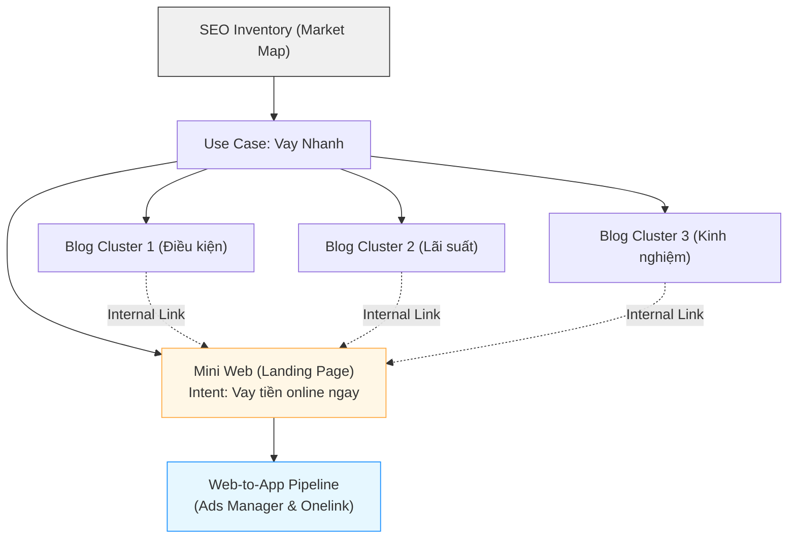

# SEO Inventory

> **Vision:** Trở thành "Bản đồ Định vị Thị trường" duy nhất cho toàn bộ hệ sinh thái MoSpark, quyết định nơi nào đáng đổ tài nguyên và nội dung nào cần sản xuất để chiếm lĩnh Traffic.
> **North Star:** Chấm dứt việc làm nội dung "mù mờ" – Mọi Mini Web/Blog trên MoMo đều phải gắn với Market Volume thực và Share of Voice (SoV).

## 1. Tổng Quan & Nhân Sự (Ownership)

SEO Inventory không chỉ là một bảng tính số liệu từ khóa, nó là **Module cốt lõi đầu não** nằm ngay tầng cao nhất của MoSpark.

- **Đơn vị chủ quản:** Out-App Traffic (GPD).
- **Owner (Chiến lược & Dữ liệu):** Thuận.
- **Support (Governance):** Văn Hiến.
- **Product Manager (Vận hành & Tính năng):** Bảo.
- **Team thực thi:** Webplatform.
- **Vai trò trong MoSpark:** Là cơ sở dữ liệu gốc để ưu tiên nguồn lực (Prioritization Framework) trước khi Dev bắt tay code Mini Web hoặc Content Team bắt tay viết Blog.

---

SEO Inventory không chỉ là một bảng tính số liệu từ khóa, nó là **Module cốt lõi đầu não** nằm ngay tầng cao nhất của MoSpark. 

Nó đóng vai trò là cơ sở dữ liệu gốc để ưu tiên nguồn lực (Prioritization Framework) trước khi Dev bắt tay code Mini Web hoặc Content Team bắt tay viết Blog.

---

## 2. Entry Point: Quy trình Khởi tạo Dự án SEO/GEO trên MoSpark

SEO Inventory chính là điểm bắt đầu (Entry Point) của mọi dự án trên MoSpark. Dưới đây là luồng chuẩn khi Product Manager (PM) hoặc Growth Team muốn tạo mới một Use Case:

### Bước 1: Define Market (Lựa chọn chiến trường)
- **Hành động:** Xác định Use Case (Ví dụ: Tra cứu Phạt Nguội).
- **Hệ thống xử lý:** Tham chiếu với cơ sở dữ liệu SEO Inventory v4.
- **Đầu ra:** Biết rõ thị trường này có bao nhiêu lượng search mỗi tháng (VD: 1.5M searches) và MoMo đang chiếm bao nhiêu % (SoV).

### Bước 2: Phân loại Priority (Mức độ ưu tiên)
Dựa trên SEO Inventory, hệ thống tự động phân Use Case thành 4 nhóm chiến lược:
1.  **Market Leader (SoV > 40%):** Ví Trả Sau. Mục tiêu: Duy trì, Scale thêm ngách.
2.  **High Potential (SoV 20-40%):** Bảo Hiểm Xe Máy. Mục tiêu: Scale mạnh nội dung để đẩy lên 40%.
3.  **Low SoV/Gap Lớn (SoV < 20%):** Vay Nhanh, Bảo Hiểm Ô Tô. Mục tiêu: Xây mới nền tảng, tái cấu trúc Mini Web.
4.  **Mass Traffic/Dịch vụ công:** Phạt nguội, BHXH. Mục tiêu: Kéo lượng User khổng lồ về hệ sinh thái.

### Bước 3: Business Context Sync (Cung cấp bối cảnh)
- Sau khi chốt được Use Case và mục tiêu, PM sẽ phải điền **11 trường thông tin Business Context**.
- Đây là bộ thông số "linh hồn" giúp định hướng cho AI (Claude) viết content đúng chuẩn thương hiệu và đúng Intent thị trường.

### Bước 4: Kick-off (Bắt đầu sản xuất)
- Kích hoạt quy trình 7 bước GenAI Content: Tạo Primary Keyword -> Draft Outline -> Manual Edit -> Blog Detail AI -> Publish.

---

## 3. Mối liên kết mật thiết với Mini Web & Blog (Architecture)

Quy hoạch SEO Inventory chia Kiến trúc Nội dung thành cấu trúc Hub & Spoke vững chắc:

**Thị trường (Market) → Cụm chủ đề (Cluster) → Landing Page/Blog**

### 3.1. Phân tách Intent rõ ràng
- **Mini Web (Landing/Transactional Pages):**
  - **Mục đích:** Hứng trọn lượng truy cập mang "Intent Mua Hàng" (VD: "Mua bảo hiểm ô tô", "Mở ví trả sau").
  - **Thiết kế:** Được build bằng *Landing Page Builder* của MoSpark. Không chứa quá nhiều chữ, tập trung vào CTA, Simulator và quy trình đăng ký.
- **Blog (Informational Pages):**
  - **Mục đích:** Vây ráp các từ khóa ngách, từ khóa tìm kiếm thông tin (VD: "Cách tính phí bảo hiểm ô tô", "Phạt nguội đi sai làn").
  - **Thiết kế:** Sản xuất hàng loạt thông qua luồng *GenAI Content* của MoSpark. Tất cả bài Blog thuộc cụm chủ đề phải cắm Link (Cross-link) dồn sức mạnh về Mini Web tương ứng.

### 3.2. Sơ đồ liên kết (Architecture Map)

---

## 4. Quy trình Vận hành Thực tế (Operational Routine)

- **Audit định kỳ (Quarterly):** SEO/GEO Lead (Hiến) tiến hành update lại Total Search Volume và đo lại SoV MoMo mỗi quý để đánh giá tốc độ tăng trưởng.
- **Cơ chế Alert:** Khi có sự thay đổi thuật toán hoặc đối thủ vươn lên chiếm SoV, Inventory sẽ cảnh báo để team Inbound và Growth có phương án xử lý ngay lập tức (Tăng ngân sách Off-page hoặc Audit On-page).
- **Tích hợp Tracking:** Kết quả SoV phải được đối chiếu lại với MUV thực tế (từ BigQuery) để tính toán hiệu suất chuyển đổi traffic thành W2A CR.

---

## 5. Lộ trình triển khai (Roadmap)

| Phase | Milestone | Tình trạng | Mục tiêu thực thi |
|---|---|---|---|
| **Phase 1** | SEO Inventory v4 (Manual) | 🟢 In Progress | Hoàn tất bảng số liệu trên Docx/Excel cho mảng Financial & Payment. |
| **Phase 2** | MoSpark Dashboard Integration | 🟡 Planning | Tích hợp thẳng số liệu Inventory vào lúc tạo Project trên hệ thống MoSpark CMS. |
| **Phase 3** | Automated Alert System | 🔴 Future | Hệ thống kết nối API với công cụ bên thứ 3 (như GSC) để tự động hóa Tracking thị phần. |

---
*Tài liệu được bảo trì và chịu trách nhiệm bởi Văn Hiến (SEO & GEO Lead