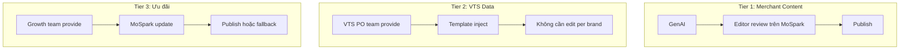
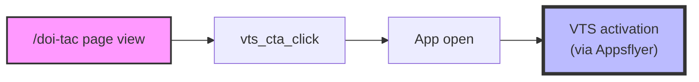
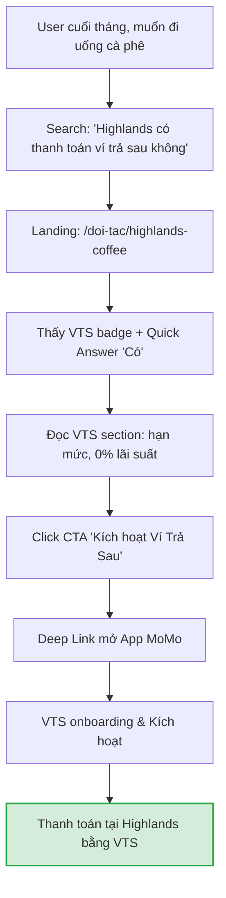
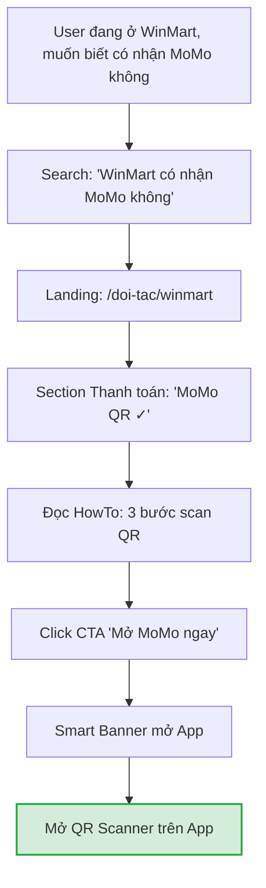
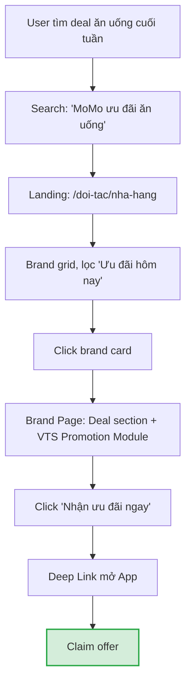

# BRD: Đối Tác MoMo - Business/Merchant Page

> **Project:** Business/Merchat Page         
> **Main URL:** momo.vn/doi-tac     
> **Owner:** GPD    
> **Version:** 1.0 · April 2026  
> **Status:** Draft

---

## 1. Executive Summary

### Situation

MoMo có hệ sinh thái merchant rộng lớn (hàng nghìn brands, từ chuỗi cà phê đến TMĐT, du lịch, bảo hiểm) nhưng trên Web hiện tại không có một Merchant Directory tập trung. Thông tin về đối tác đang phân mảnh qua 2 hệ thống legacy:

- **Merchant Landing Pages** (`/thanh-toan-momo-{brand}`): Khoảng 50-200 trang tạo trong giai đoạn 2017-2020 khi MoMo tích hợp thanh toán với từng brand. Content tĩnh, không cập nhật, 18K organic traffic/quý.
- **Official Account / Thổ Địa Ăn Uống** (`/page/{id}`): Hệ thống POI (Point of Interest) ở store-level, ban đầu phục vụ F&B review nhưng data bên dưới chứa tất cả categories. 67K organic traffic/quý. Mỗi cửa hàng = 1 URL (1 brand chain có thể có hàng trăm URLs).

Tổng cộng 85K organic traffic/quý đang đi vào 2 hệ thống không có chiến lược content thống nhất, không có conversion goal rõ ràng, và không phản ánh đúng quy mô quan hệ MoMo - Merchant hiện tại.

### Complication

**Về cơ hội đang bỏ lỡ:**

User có hành vi search "{Brand} có thanh toán ví trả sau không", "{Brand} có thanh toán qua MoMo không" - đây là bottom-funnel traffic có conversion intent cao. Hiện tại MoMo không có trang nào trả lời trực tiếp cho 1 brand cụ thể. Traffic đang rơi vào bên thứ 3 (fptshop.com.vn, mytour.vn) hoặc blog momo.vn dạng danh sách dài không specific.

Trong khi đó, ZaloPay đã build merchant directory tại `zalopay.vn/doi-tac/{brand}` cho F&B chains - tuy chưa khai thác BNPL angle nhưng đã chiếm vị trí trước.

**Về rủi ro từ legacy:**

2 hệ thống legacy đang tạo ra nhiều vấn đề cho chất lượng tổng thể của momo.vn:

- `/thanh-toan-momo-{brand}`: Content cũ 5-7 năm, thông tin hợp tác có thể đã outdated, ưu đãi hết hạn vẫn hiển thị. Backlinks PR từ 2017-2020 đang trỏ vào content không còn chính xác.
- `/page/{id}`: Hàng nghìn URLs auto-generated, phần lớn là thin content (ít review, thiếu thông tin). Gây crawl budget waste, dilute site quality signal. Nhiều trang có thông tin quán đã đóng cửa, sai giờ mở cửa, không cập nhật.

Nếu tiếp tục để 2 hệ thống này tồn tại song song với `/doi-tac` mới, sẽ tạo keyword cannibalization nội bộ (3 URLs cạnh tranh cho cùng brand query).

### Resolution

Xây dựng `/doi-tac` như một Merchant Directory thống nhất ở brand-level, đồng thời audit và xử lý 2 legacy systems. Content cho từng merchant được tạo qua GenAI Content và quản trị trên MoSpark (Landing Page Builder của Web Platform).

---

## 2. Bối Cảnh Hiện Tại

### 2.1. Hiện trạng Merchant Landing Pages (`/thanh-toan-momo-{brand}`)

| Khía cạnh | Mô tả |
|---|---|
| Mục đích ban đầu | Landing page PR khi MoMo tích hợp thanh toán với brand mới |
| Giai đoạn tạo | 2017-2020 |
| Content type | Giới thiệu hợp tác + hướng dẫn QR + CTA mở app |
| Số lượng ước tính | 50-200 URLs |
| Organic traffic | 18K/quý |
| Tình trạng content | Tĩnh, không cập nhật. Ưu đãi hết hạn vẫn hiển thị. Thông tin hợp tác có thể outdated |
| Backlinks | Có giá trị - từ PR campaigns, báo chí |
| Vấn đề | Content outdated gây sai lệch thông tin cho user. Không có VTS angle. Không có schema markup |

### 2.2. Hiện trạng OA / Thổ Địa Ăn Uống (`/page/{id}`)

| Khía cạnh | Mô tả |
|---|---|
| Mục đích ban đầu | Hệ thống review địa điểm ăn uống (kiểu Foody mini) |
| Granularity | Store-level: 1 cửa hàng = 1 URL |
| Data scope | Hiện public F&B, data bên dưới chứa tất cả categories (chưa public) |
| Số lượng ước tính | 1,000 - 10,000+ URLs |
| Organic traffic | 67K/quý (đang optimize cho local intent) |
| Content type | Tên quán, giờ mở cửa, review từ user MoMo, ảnh, tiện ích, địa chỉ, giá trung bình |
| Tình trạng content | Nhiều trang thin content (ít/không có review). Thông tin quán có thể đã đóng cửa hoặc sai |
| Vấn đề | Thin content ở quy mô lớn → dilute site quality. Auto-generated URLs → crawl budget waste. Numeric ID URL (`/page/9802125`) không SEO-friendly |

### 2.3. Vấn đề chất lượng web từ legacy (cần Audit)

2 legacy systems đang tạo ra các vấn đề chất lượng cho momo.vn tổng thể:

**Từ `/thanh-toan-momo-{brand}`:**
- Content outdated 5-7 năm có thể gây sai lệch (ưu đãi hết hạn, brand đã ngừng hợp tác)
- Không phản ánh đúng bản chất quan hệ MoMo - Merchant hiện tại (đã mở rộng hơn nhiều so với 2018)
- Một số URL có thể đã soft-404 hoặc trả về lỗi

**Từ `/page/{id}` (Thổ Địa):**
- Thin content pages ở quy mô lớn gây tín hiệu low-quality cho toàn domain
- Thông tin sai (quán đã đóng, giờ sai, giá sai) ảnh hưởng trust signal
- Crawl budget bị tiêu tốn cho hàng nghìn trang giá trị thấp thay vì tập trung vào trang quan trọng
- Canonical/index issues: nhiều trang tương tự nhau (cùng brand, khác chi nhánh) có thể bị Google đánh là duplicate

**Tác động lên SEO tổng thể:**
- Google đánh giá chất lượng ở site-level (Helpful Content System). Tỷ lệ lớn thin/outdated content kéo giảm ranking cho toàn bộ momo.vn, không chỉ cho cluster `/page/*`
- Crawl budget bị phân tán → trang mới (ví dụ `/doi-tac`) có thể bị crawl chậm hơn
- User landing vào trang outdated → bounce rate cao → negative engagement signal

### 2.4. Đối thủ đã đi trước

**ZaloPay** (`zalopay.vn/doi-tac/{brand}`):
- Đã build merchant directory cho F&B chains (Phúc Long, Highlands, Starbucks...)
- Content: brand intro + 3 bước thanh toán QR + 3 đối tác liên quan
- Chưa khai thác BNPL angle (dù có "Tài khoản trả sau")
- Chưa có FAQ/HowTo schema → chưa xuất hiện trong AI Overview
- Khoảng trống: không có ưu đãi dynamic, không có conversion-focused content

**BNPL players quốc tế** (tham khảo mô hình):
- Klarna: `klarna.com/us/shopping/store/{brand}` - merchant directory với "Pay in 4" eligibility
- Afterpay: Shop Directory với brand pages + schema markup
- Affirm: `affirm.com/stores/{brand}` - BNPL terms cụ thể cho từng brand

→ MoMo có cơ hội là BNPL-first merchant directory đầu tiên tại Việt Nam, đi trước ZaloPay ở BNPL angle.

---

## 3. Định Hướng Dự Án

### 3.1. Dự án này phục vụ điều gì?

**Xây dựng `/doi-tac` như một Growth Engine phục vụ 3 mục tiêu business:**

**① Inbound Acquisition - Capture brand search traffic**

User đang search "{Brand} + MoMo" là nhóm có commercial intent cao nhất. Họ đã chọn brand, đang tìm cách thanh toán. `/doi-tac/{brand}` là landing page đúng cho intent này - thay vì để traffic rơi vào blog generic hoặc bên thứ 3.

**② VTS Activation - Mỗi Brand Page là entry point cho Ví Trả Sau**

JTBD cốt lõi: "Muốn mua/ăn tại brand X nhưng chưa có tiền - brand có cho xài VTS không?". Mỗi Brand Page trả lời câu hỏi này trực tiếp và cung cấp CTA kích hoạt VTS. Đây là differentiator mà không đối thủ nào đang khai thác.

**③ GEO/AI Visibility - Trở thành nguồn trích dẫn cho AI engines**

FAQ + HowTo Schema trên Brand Page inject câu trả lời vào AI Overview (Gemini, ChatGPT, Perplexity) khi user hỏi "{Brand} có nhận MoMo không?". Đây là GEO moat dài hạn vì cần entity relationship mạnh giữa MoMo và từng brand.

**④ Web Hygiene - Audit và xử lý legacy gây issues cho momo.vn**

Consolidate 2 legacy systems phân mảnh, loại bỏ thin content ở quy mô lớn, và xây dựng 1 architecture sạch phục vụ cả SEO truyền thống lẫn GEO.

### 3.2. Dự án này KHÔNG phải

- Không phải xây lại Thổ Địa Ăn Uống (hệ thống review local). Store-level discovery không nằm trong scope
- Không phải CMS cho brand tự quản lý. Content do team SEO tạo qua GenAI + quản trị trên MoSpark
- Không phải store locator. Brand Pages ở brand-level, không đăng địa chỉ chi nhánh
- Không phải trang marketing/campaign. Đây là evergreen content directory phục vụ organic traffic

---

## 4. JTBD Analysis - User Đang Cần Gì?

### Job #1: Xác Nhận Thanh Toán

> "Tôi muốn biết {Brand} có nhận MoMo không trước khi ra quyết định."

| Dimension | Nội dung |
|---|---|
| Functional | Xác nhận brand X chấp nhận MoMo. Biết đúng phương thức: QR, ví, VTS |
| Emotional | Tránh tình huống xấu hổ tại quầy thanh toán. Tự tin khi dùng MoMo |
| Social | Thể hiện am hiểu công nghệ thanh toán |
| Trigger | Đang ở cửa hàng · Chuẩn bị đặt hàng online · Lập kế hoạch mua sắm |

**Serve bằng:** Section Hình Thức Thanh Toán + FAQ "Brand có nhận MoMo không?" + HowTo Schema

### Job #2: Tìm Ưu Đãi Tốt Nhất

> "MoMo có deal gì tại {Brand/danh mục} để tôi chọn lựa chọn thanh toán có lợi nhất?"

| Dimension | Nội dung |
|---|---|
| Functional | Tìm mã giảm giá, deal đang chạy. So sánh ưu đãi giữa brands |
| Emotional | Cảm giác thông minh khi mua được giá tốt. Không bỏ lỡ deal |
| Social | Chia sẻ deal tốt với bạn bè |
| Trigger | Trước khi mua sắm cuối tuần · Tìm deal sinh nhật · Mùa sale |

**Serve bằng:** Section Ưu Đãi dynamic + Category filter "Ưu đãi hôm nay" + VTS exclusive deal angle

### Job #3: Mua Khi Chưa Có Tiền (VTS Core)

> "Tôi muốn mua/ăn ngay hôm nay tại {Brand} nhưng chưa có tiền - có cho xài Ví Trả Sau không?"

| Dimension | Nội dung |
|---|---|
| Functional | Hoàn thành giao dịch mà không cần nạp tiền trước. Chia nhỏ khoản thanh toán |
| Emotional | Không phải từ chối bản thân. Linh hoạt tài chính mà không cần vay mượn |
| Social | Trải nghiệm mua sắm thoải mái. Không bị giới hạn bởi số dư |
| Trigger | Cuối tháng chưa lương · Mua item giá cao · Lần đầu biết VTS |

**Serve bằng:** VTS Section riêng trên Brand Page (`#vi-tra-sau`) + FAQ "VTS dùng tại brand được không?" + CTA Deep Link → VTS onboarding

> ⚠️ **Assumption cần validate:** Job #3 giả định user đã biết VTS tồn tại. Nếu chưa biết, content cần thêm layer giáo dục ngắn (2-3 câu) trước khi pitch. Cần A/B test: "Mua trước trả sau" vs "Kích hoạt Ví Trả Sau".

---

## 5. Scope & Requirements

### 5.1. URL Architecture

3 cấp URL. Brand Pages dùng flat URL dưới `/doi-tac/` (không nested dưới category):

| Cấp | URL Pattern | Số lượng | Vai trò |
|---|---|---|---|
| Hub | `/doi-tac` | 1 | Discovery + Navigation |
| Category | `/doi-tac/{ten-category}` | 15 | Consideration + Listing |
| Brand | `/doi-tac/{ten-brand}` | 100-300+ | Decision + Conversion (VTS) |

### 5.2. Category List (15 danh mục)

| # | Category Name | URL Path | VTS Hook |
|---|---|---|---|
| 1 | Nhà hàng | `/doi-tac/nha-hang` | Ăn nhà hàng trả sau |
| 2 | Quán ăn | `/doi-tac/quan-an` | Ăn uống trả sau |
| 3 | Cà phê | `/doi-tac/ca-phe` | Uống cà phê trả sau |
| 4 | Trà sữa | `/doi-tac/tra-sua` | Trà sữa trả sau |
| 5 | Bách hóa | `/doi-tac/bach-hoa` | Mua đồ trả sau |
| 6 | Cửa hàng tiện lợi | `/doi-tac/cua-hang-tien-loi` | Mua tiện lợi trả sau |
| 7 | Siêu thị | `/doi-tac/sieu-thi` | Mua sắm siêu thị trả sau |
| 8 | Giáo dục | `/doi-tac/giao-duc` | Học phí trả góp VTS |
| 9 | Tài chính - Bảo hiểm | `/doi-tac/tai-chinh-bao-hiem` | Đóng phí bảo hiểm trả sau |
| 10 | Giải trí | `/doi-tac/giai-tri` | Mua vé trả sau |
| 11 | Du lịch - Đi lại | `/doi-tac/du-lich-di-lai` | Đặt vé/phòng trả sau |
| 12 | Mua sắm | `/doi-tac/mua-sam` | Mua trước trả sau |
| 13 | Làm đẹp - Sức khỏe | `/doi-tac/lam-dep-suc-khoe` | Chăm sóc trả sau |
| 14 | Khác | `/doi-tac/khac` | - |
| 15 | *(Reserved - mở rộng theo data)* | - | - |

### 5.3. Brand Page - Content Requirements

Brand Page gồm 2 phần tách biệt rõ ràng:

- **Merchant Content**: Nội dung thuần túy về merchant (mô tả, FAQ, ưu đãi, hướng dẫn). Tạo qua GenAI Content, quản trị trên MoSpark
- **Platform Modules**: Các module cố định của MoMo platform (Payment Methods, VTS Promotion). Inject tự động từ template, không thuộc phạm vi content biên tập

**Nguyên tắc tách biệt:**
- Merchant Content không lồng ghép VTS một cách thái quá. Nội dung brand page phục vụ merchant, không phải trang quảng cáo VTS
- VTS xuất hiện ở 2 nơi duy nhất: Payment Methods list (liệt kê ngang hàng với Ví MoMo, Ngân hàng) và VTS Promotion Module (block cố định)
- FAQ có thể chứa 1 câu liên quan VTS nếu phù hợp (ví dụ: "{Brand} có nhận Ví Trả Sau không?"), nhưng không bắt buộc mọi FAQ đều mention VTS

#### Brand Page Structure

| # | Block | Loại | Nội dung | JTBD |
|---|---|---|---|---|
| ① | Brand Hero | Merchant Content | Logo + H1 "{Brand} x MoMo" + breadcrumb + category badge | - |
| ② | Mô tả brand | Merchant Content | 100-150 từ từ góc nhìn MoMo user. GenAI generated, reviewed. KHÔNG copy Wikipedia | - |
| ③ | Payment Methods | Platform Module | List: Ví Trả Sau (badge "Mua trước trả sau") · Ví MoMo (Quét mã QR) · Ngân hàng liên kết (Quét mã QR). Liệt kê ngang hàng, VTS ở vị trí đầu nếu eligible | #1 |
| ④ | VTS Promotion | Platform Module | Module cố định hiển thị: 0% lãi suất · Hạn mức đến 20 triệu (tùy điểm tín dụng) · Phí 33.000đ/tháng (không xài không mất phí) · Kỳ hạn 2/3/6/9/12 tháng · Điều kiện: CCCD + Liên kết NH. CTA: "Mở Ví Trả Sau chỉ trong 3 phút" → Deep Link. *Data từ VTS PO team, không do GenAI generate* | #3 |
| ⑤ | Ưu đãi hiện tại | Merchant Content | MVP: static, fallback "Xem ưu đãi trong app MoMo". V2: dynamic từ deal data API khi có | #2 |
| ⑥ | HowTo thanh toán | Merchant Content | "Cách thanh toán MoMo tại {Brand}" - 4-5 bước. GenAI generated | #1 |
| ⑦ | FAQ | Merchant Content | 4+ câu brand-specific. Format declarative-first cho AI extraction. Có thể include 1 câu VTS nếu phù hợp | #1 |
| ⑧ | Related Partners | Platform Module | 3-6 brand cùng category. Internal link flat `/doi-tac/{brand}` | - |

#### Content Production Pipeline

Brand Page content chia 3 tier theo data source và review requirement:

| Tier | Nội dung | Source | Review |
|---|---|---|---|
| **Tier 1 - Merchant Content** | Mô tả brand, HowTo, FAQ | GenAI generate → Editor review trên MoSpark | Editor review bắt buộc trước publish |
| **Tier 2 - VTS Data** | Hạn mức, lãi suất, phí, kỳ hạn, điều kiện | VTS PO team (authoritative source) | VTS PO verify. KHÔNG qua GenAI |
| **Tier 3 - Ưu đãi** | Deal, mã giảm giá | Growth team / Cell Team PO provide | Growth team own. MVP: fallback static |

MoSpark manage publish, update, version control. Schema markup (FAQPage, HowTo, Organization) inject tự động qua MoSpark template.

#### MVP vs V2

| Feature | MVP (launch) | V2 (khi có data) |
|---|---|---|
| Brand description + FAQ + HowTo | GenAI + review | GenAI + review + GSC data enrichment |
| Payment Methods | Static list từ VTS merchant data | Static list |
| VTS Promotion Module | Template cố định, data từ VTS PO | Personalized (hạn mức ước tính per user) |
| Ưu đãi section | Fallback "Xem ưu đãi trong app" | Dynamic từ deal API |
| Category page filter | Static brand grid, sorted by priority | Filter "Ưu đãi hôm nay", deal badge |

### 5.4. VTS trong Brand Page - Nguyên tắc

**VTS là payment method + acquisition hook, không phải content angle:**

- VTS xuất hiện trên brand page dưới dạng **2 platform modules** (Payment Methods + VTS Promotion), không lồng ghép vào merchant content body
- Module Payment Methods liệt kê VTS ngang hàng với Ví MoMo và Ngân hàng liên kết. VTS có badge "Mua trước trả sau" nhưng không chiếm dominant
- Module VTS Promotion là block cố định với data chuẩn từ VTS PO team (lãi suất, hạn mức, phí, kỳ hạn, điều kiện, CTA)
- Merchant content (mô tả, HowTo) viết thuần túy về merchant, không cần mention VTS
- FAQ: có thể include câu "{Brand} có nhận Ví Trả Sau không?" nếu đó là search query thực (verify GSC), nhưng không bắt buộc mọi brand FAQ đều có

**VTS Data Source (Tier 2):**

Data VTS trên brand page phải đến từ VTS PO team, KHÔNG do GenAI generate hoặc lấy từ blog posts:

| Data point | Giá trị hiện tại (cần verify) | Source |
|---|---|---|
| Lãi suất | 0% (không tính lãi) | VTS PO - cần confirm |
| Hạn mức tối đa | Đến 20 triệu (tùy điểm tín dụng) | VTS PO - cần confirm |
| Phí | 33.000đ/tháng (không xài không mất phí) | VTS PO - cần confirm |
| Kỳ hạn trả góp | 2/3/6/9/12 tháng | VTS PO - cần confirm |
| Điều kiện mở | Xác thực CCCD + Liên kết tài khoản ngân hàng | VTS PO - cần confirm |
| CTA | "Mở Ví Trả Sau chỉ trong 3 phút" | VTS PO + Growth |
| VTS-eligible merchants | [Cần danh sách chính xác] | VTS PO - **BLOCKER** |

> ⚠️ **YMYL Notice:** VTS data là thông tin tài chính. Sai data (lãi suất, hạn mức, điều kiện) có thể gây legal issue. Template inject từ 1 nguồn duy nhất (VTS PO approved), không allow editor chỉnh sửa per brand page.

### 5.5. Search Intent Mapping

| Keyword Pattern | Intent | Landing Page | CTA | VTS Angle |
|---|---|---|---|---|
| "{Brand} có nhận MoMo không" | Navigation/BoFu | `/doi-tac/{brand}` | Thanh toán ngay | Dùng VTS - không cần nạp tiền |
| "{Category} nhận MoMo" | MoFu | `/doi-tac/{category}` | Xem đối tác | VTS banner inline |
| "Ưu đãi MoMo {danh mục}" | Commercial | `/doi-tac/{category}` | Xem ưu đãi | VTS exclusive deal |
| "MoMo giảm giá {Brand}" | Commercial/BoFu | `/doi-tac/{brand}` | Lấy deal ngay | Mua trước trả sau |
| "Ví Trả Sau {Brand}" | BoFu | `/doi-tac/{brand}#vi-tra-sau` | Kích hoạt VTS | Core VTS conversion |

### 5.6. Schema & GEO Requirements

| Cấp trang | Schema bắt buộc | GEO Target |
|---|---|---|
| Hub `/doi-tac` | ItemList · FAQPage · Organization · BreadcrumbList | FAQ → AI "MoMo có những đối tác nào" |
| Category `/doi-tac/{cat}` | ItemList · FAQPage · HowTo · BreadcrumbList | HowTo → "Cách thanh toán MoMo tại {category}" |
| Brand `/doi-tac/{brand}` | Organization · FAQPage · HowTo · Offer · BreadcrumbList | FAQ + HowTo → "{Brand} có nhận VTS không" |

---

## 6. Audit & Legacy Assessment

### 6.1. Audit Scope

Trước khi launch `/doi-tac`, cần audit toàn bộ 2 legacy systems để:
- Xác định URL nào có giá trị (traffic, backlinks) cần bảo toàn
- Xác định URL nào đang gây hại cho chất lượng web tổng thể
- Xây dựng mapping table legacy → new cho migration plan (sẽ detail trong PRD)

### 6.2. Audit Framework cho `/thanh-toan-momo-{brand}`

**Data cần thu thập:**

| Data point | Source | Mục đích |
|---|---|---|
| Danh sách toàn bộ URLs | Screaming Frog crawl | Inventory |
| Clicks + Impressions 16 tháng | GSC Performance | Đánh giá traffic value |
| Backlinks (DR > 20) | Ahrefs | Đánh giá link equity |
| HTTP status code hiện tại | Screaming Frog | Phát hiện URLs lỗi |
| Content freshness | Manual sampling | Đánh giá outdated content |

**Phân loại expected:**

| Bucket | Criteria | Ước tính % |
|---|---|---|
| Có giá trị - cần preserve | Traffic > 0 HOẶC backlinks > 0 | 60-70% |
| Outdated nhưng có equity | Backlinks nhưng content sai | 15-20% |
| Không giá trị - cleanup | Zero traffic + zero backlinks | 15-25% |

### 6.3. Audit Framework cho `/page/{id}` (Thổ Địa)

**Data cần thu thập:**

| Data point | Source | Mục đích |
|---|---|---|
| Danh sách URLs + PAGE_ID → Brand mapping | Export từ Thổ Địa database (Web Platform) | Inventory + mapping |
| Clicks + Impressions 16 tháng | GSC Performance | Traffic value |
| Content quality assessment | Automated: word count, review count, image count | Phát hiện thin content |
| Business status | Cross-ref với merchant data | Phát hiện quán đã đóng |
| Query distribution | GSC: query → URL | Hiểu intent thực tế |

**Phân loại expected:**

| Bucket | Criteria | Ước tính % |
|---|---|---|
| Brand chain stores - có brand match /doi-tac | Thuộc brand chain trong roadmap | 20-30% |
| Quán độc lập - có traffic | Traffic > 0 nhưng không có brand match | 15-25% |
| Thin content - không giá trị | Zero traffic + ít/không review + content rỗng | 40-50% |
| Quán đã đóng cửa / thông tin sai | Business không còn hoạt động | 10-15% |

### 6.4. Vấn đề Web Quality cần giải quyết qua Audit

| Vấn đề | Hệ thống | Mức độ | Tác động |
|---|---|---|---|
| Thin content ở quy mô lớn | `/page/{id}` | Nghiêm trọng | Kéo giảm Helpful Content score toàn domain |
| Content outdated (ưu đãi hết hạn, brand ngừng hợp tác) | `/thanh-toan-momo-*` | Trung bình | Gây sai lệch thông tin, giảm trust |
| Thông tin quán đóng cửa | `/page/{id}` | Trung bình | User experience kém, bounce rate cao |
| Crawl budget waste | `/page/{id}` | Trung bình | Trang mới bị crawl chậm hơn |
| Numeric ID URLs không SEO-friendly | `/page/{id}` | Thấp | Không có keyword signal trong URL |
| Cannibalization nội bộ (nếu launch /doi-tac mà không xử lý) | Cả 2 | Nghiêm trọng | 3 URLs cạnh tranh cho cùng brand query |

### 6.5. Audit Output (input cho PRD)

Kết quả audit sẽ tạo ra các deliverables sau, dùng làm input cho PRD migration:

- **URL Inventory CSV**: toàn bộ legacy URLs + metrics (traffic, backlinks, content quality score)
- **Triage Decision Sheet**: phân loại từng URL theo bucket (preserve / redirect / remove)
- **Mapping Table**: legacy URL → `/doi-tac/{brand}` cho URLs cần redirect
- **Web Quality Report**: tổng hợp vấn đề chất lượng + recommended actions
- **Traffic Impact Forecast**: dự báo traffic thay đổi theo từng scenario migration
- **Migration Strategy Document**: define approach cho từng URL bucket (redirect type, noindex, delete), ownership, go/no-go criteria. Là prerequisite trước khi PRD migration được approve

---

## 7. Business KPIs

### 7.1. Success Metrics

| Metric | Baseline | Target (90 ngày post-launch) | Source |
|---|---|---|---|
| Organic traffic tổng (/doi-tac + legacy) | 85K/quý | ≥ 85K/quý (không giảm net) | GSC |
| VTS Promotion Module click rate | N/A | ≥ 3% (VTS-eligible brands only, adjust sau 30 ngày baseline) | GA4 |
| VTS activations attributed từ /doi-tac | 0 | Đo được, có baseline | GA4 + Appsflyer |
| P1 brand queries rank top 5 | [cần audit] | ≥ 80% | GSC |
| AI Overview citations cho VTS queries | 0 | ≥ 5 queries | Manual monitoring |
| Thin content URLs removed/consolidated | 0 | 80%+ identified thin pages xử lý | GSC Coverage |

### 7.2. North Star Metric

**VTS Activations từ /doi-tac** = số user kích hoạt Ví Trả Sau attributed từ trang đối tác.

**Funnel:**

---

## 8. Dependencies & Constraints

| Dependency | Owner | Mô tả | Blocker? |
|---|---|---|---|
| VTS merchant list (updated) | VTS PO team | List brands chấp nhận VTS chính xác | Có - quyết định VTS badge |
| VTS Terms Data (lãi suất, hạn mức, phí, điều kiện) | VTS PO team | Data chính xác cho VTS Promotion Module. YMYL - sai data = legal risk | Có - không launch VTS module nếu chưa có approved data |
| PAGE_ID → Brand mapping | Web Platform | Export từ Thổ Địa DB cho audit | Có - cần cho legacy audit |
| MoSpark platform readiness | Web Platform | Landing Page Builder sẵn sàng cho /doi-tac | Có - platform triển khai |
| GenAI Content pipeline | SEO team + Web Platform | Template + prompts cho brand content (Tier 1 only) | Không - team tự build |
| Deal/Ưu đãi data | Growth / Cell Team POs | Data ưu đãi dynamic cho Tier 3 | Không - MVP dùng fallback static |
| Deep Link specs per brand | App team | Onelink URLs cho CTA | Có - CTA hoạt động đúng |
| Content Governance alignment | Inbound team | Confirm /doi-tac owns VTS+brand payment content | Không - cần sync |

### Constraints

- Content production trên MoSpark (Landing Page Builder) - không custom development
- GenAI Content phải qua review/edit trước publish (không auto-publish)
- VTS badge chỉ được gắn sau khi verify với PO team (không dựa trên blog data)
- Schema markup inject qua MoSpark template (không hardcode)

---

## 9. Risk Assessment

| # | Rủi ro | Khả năng | Impact | Mitigation |
|---|---|---|---|---|
| R1 | Legacy migration gây traffic drop > 30% | Cao | Cao | Phased rollout, audit kỹ trước, content parity trên trang mới |
| R2 | VTS merchant list outdated → badge sai | Trung | Trung | Verify trực tiếp với PO team, không dựa blog 2023 |
| R3 | Content governance conflict với Inbound (VTS angle) | Thấp | Trung | Align sớm với Inbound theo SOP hiện tại |
| R4 | MoSpark chưa support schema markup cần thiết | Trung | Cao | Early validation với Web Platform |
| R5 | GenAI content quality không đạt yêu cầu E-E-A-T | Trung | Trung | Review workflow bắt buộc, template strict |
| R6 | ZaloPay mở rộng merchant directory trước MoMo | Trung | Trung | Speed-to-market: P1 launch nhanh với GenAI + MoSpark |
| R7 | Cannibalization nếu legacy không xử lý kịp trước launch | Cao | Cao | Gate: không launch /doi-tac trước khi có migration plan approved |

---

## 10. Next Steps

BRD này define Why (bối cảnh, vấn đề, cơ hội) và What (scope, requirements, KPIs). Các hoạt động tiếp theo:

| Deliverable | Owner | Mô tả |
|---|---|---|
| **PRD** | Klaus + Web Platform | Chi tiết technical specs, migration execution plan, MoSpark template requirements, GenAI pipeline, timeline, dev handoff |
| **Legacy Audit** | Klaus | Crawl + GSC + Ahrefs data → URL inventory → triage decision sheet → mapping table |
| **Content Template** | Klaus | GenAI prompt templates cho brand page content (mô tả, FAQ, HowTo per category) |
| **MoSpark Spec** | Web Platform | Template specs cho /doi-tac trên Landing Page Builder, schema injection, dynamic modules |

---

## Appendix A: Brand Page Template Example

**Brand:** Highlands Coffee  
**URL:** `/doi-tac/highlands-coffee`  
**Category:** Cà phê

**Title:** Highlands Coffee x MoMo - Thanh toán & Ưu đãi | MoMo  
**H1:** Highlands Coffee x MoMo - Thanh toán, ưu đãi & Ví Trả Sau

**Payment Methods (Platform Module):**
- Ví Trả Sau - Không cần trả ngay [badge: Mua trước trả sau]
- Ví MoMo - Quét mã QR code
- Ngân hàng liên kết - Quét mã QR code

**VTS Promotion (Platform Module - data từ VTS PO, KHÔNG GenAI):**
> Mở Ví Trả Sau - Nhận ưu đãi 35K cho giao dịch đầu  
> ✓ 0% lãi suất - Không tính lãi  
> ✓ Hạn mức đến 20 triệu - Tùy điểm tín dụng  
> ✓ Phí chỉ 33.000đ/tháng - Không xài, không mất phí  
> ✓ Kỳ hạn 2/3/6/9/12 tháng - Trả góp linh hoạt  
> Chỉ cần: Xác thực CCCD trên MoMo + Liên kết tài khoản ngân hàng  
> CTA: "Mở Ví Trả Sau chỉ trong 3 phút"
>
> ⚠️ *Tất cả data VTS trong block này là placeholder, cần verify chính xác từ VTS PO team trước khi publish. YMYL content - sai data = legal risk.*

**FAQ (Merchant Content - GenAI generated, editor reviewed):**

> **Q: Highlands Coffee có nhận thanh toán qua MoMo không?**  
> A: Có. Highlands Coffee chấp nhận thanh toán qua MoMo tại tất cả cửa hàng trên toàn quốc, bao gồm Ví MoMo, Ví Trả Sau, và quét QR qua ngân hàng liên kết.

> **Q: Cách thanh toán MoMo tại Highlands Coffee?**  
> A: Mở app MoMo → chọn "Mã thanh toán" → đưa mã QR cho nhân viên quét → xác nhận thanh toán.

> **Q: Highlands Coffee có ưu đãi MoMo nào đang chạy?**  
> A: [Dynamic từ CMS - fallback: "Mở app MoMo để xem ưu đãi mới nhất tại Highlands Coffee"]

> **Q: Thanh toán Highlands bằng MoMo có an toàn không?**  
> A: Có. MoMo là ví điện tử được Ngân hàng Nhà nước cấp phép, bảo mật theo chuẩn PCI DSS.

## Appendix B: User Journey Scenarios

**Scenario 1 - F&B "Chưa Lương" (JTBD #3):**

**Scenario 2 - Offline QR (JTBD #1):**

**Scenario 3 - Deal Seeker (JTBD #2) - *V2 khi có deal data API*:**

