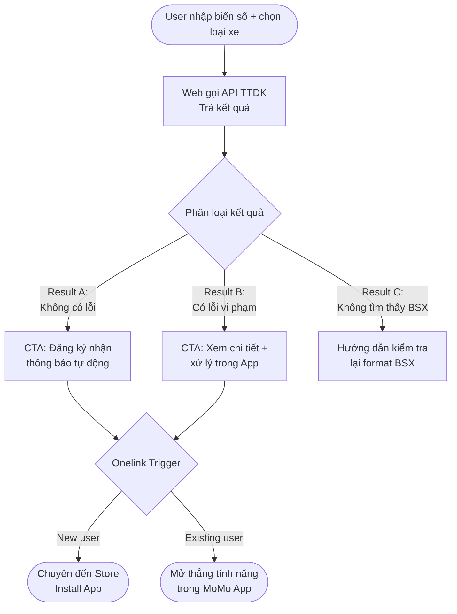

# BRD - Phạt Nguội Web Growth
## Business Requirements Document

**Dự án:** Tra Cứu Phạt Nguội - Web Growth Platform  
**URL Hub:** momo.vn/phat-nguoi  
**Prepared by:** Out-App Traffic · GPD  
**Last updated:** Tháng 4/2026  
**Status:** Draft v1.1 - 3/5 assumptions confirmed  

---

## Status Update - Tháng 4/2026

| Item | Status | Ghi chú |
|------|--------|---------|
| Launch timeline | **Q2/2026 - trong 2 tháng** | Hard deadline |
| Web Dev resource | **Confirmed - Dedicated full-time** | Available ngay |
| API TTDK cho Web | **Confirmed - Available** | Cần validate response time |
| Web platform | Pending | Open question #2 |
| Product ownership | Pending | Open question #3 |
| Legal review | Pending | Open question #4 |

> **Implication của Q2/2026 deadline:** Với 2 tháng và dedicated Dev, Phase 1 hoàn toàn khả thi nếu quyết định platform và ownership trong tuần đầu tiên. Mọi scope creep vào Phase 1 phải được cut - chỉ giữ 3 Tool Pages + 3 Blog P1 + Technical SEO setup.

---

## Executive Summary

MoMo đang sở hữu một partnership độc quyền với TTDK (Trung tâm Đăng Kiểm Việt Nam) cho tính năng Tra Cứu Phạt Nguội trong App. Tính năng này đã live nhưng **Web channel chưa tồn tại** - toàn bộ ~2.74M lượt tìm kiếm/tháng về phạt nguội đang chảy sang competitor (phạtnguoi.com, CSGT official) mà MoMo không capture được.

Dự án này build Web channel từ zero, với hai mục tiêu song song:

- **Short-term:** Web Tool tra cứu trả kết quả thực → Drive-to-App để acquire New User và kích hoạt Subscription
- **Long-term:** pSEO Camera/Vi phạm theo địa phương → Topical authority → GEO citation trong AI engines

Nếu thực thi đúng, Web channel có thể đóng góp trực tiếp vào New User, MAU và DLU growth - ba North Star metrics của Out-App Traffic team.

---

## 1. Bối cảnh & Cơ hội

### 1.1 Catalyst

Nghị định 168/2024/NĐ-CP (hiệu lực 01/01/2025) tăng mức phạt vi phạm giao thông gấp 3-5 lần. Vượt đèn đỏ ô tô: 3-5 triệu → 18-20 triệu đồng. Đây là structural demand shift, không phải seasonal - tạo ra evergreen search demand cao và duy trì trong nhiều năm.

### 1.2 Market Demand

| Metric | Con số | Nguồn |
|--------|--------|-------|
| Total search volume toàn quốc | ~2.74M / tháng | Keyword dataset (2,663 KWs) |
| Search volume HN + HCM | ~253K / tháng | TTDK deck |
| Xe đang lưu hành (moto + ô tô) | 84M+ | TTDK deck |
| MoMo users có ô tô (identified) | 700K+ | Internal data |
| Potential MAU phạt nguội (base case) | ~153K | TTDK market model |

### 1.3 Competitive Gap

MoMo có lợi thế dữ liệu (TTDK partnership) nhưng **không có Web presence**. Trong khi đó:

| Competitor | Brand search vol | Điểm yếu |
|------------|-----------------|----------|
| phạtnguoi.com | ~148,500 / tháng | 3rd party, không uy tín, sợ lộ data |
| CSGT official | ~13,500 / tháng | UX tệ, hay nghẽn |
| VNeTraffic (vr.org.vn) | ~14,800 / tháng | Semi-official, UX kém |

~9% tổng search volume (246K vol/tháng) đang tìm kiếm brand competitor trực tiếp - MoMo không thể intercept trực tiếp nhưng có thể displacement bằng trust signals mạnh hơn.

### 1.4 MoMo's Unfair Advantage

- Dữ liệu từ TTDK - chính thống, TTDK nhận data trước CSGT trong pipeline
- Hỗ trợ Ô tô + Xe máy + Xe máy điện (competitor chủ yếu chỉ ô tô)
- Brand trust: 31M+ users, không phải 3rd party scraping
- Tích hợp hệ sinh thái: sau tra cứu có thể mua BH Xe, Vay, Nộp phạt trong cùng App

---

## 2. Problem Statement

### 2.1 User Problem

Người dùng có xe tại Việt Nam đang đối mặt với ba vấn đề:

1. **Không biết mình đang bị phạt** - phạt nguội không được thông báo kịp thời, chỉ phát hiện khi đến đăng kiểm hoặc bị chặn trên đường
2. **Nộp phạt trễ bị tính lãi** - 0.05%/ngày (~18%/năm) sau khi quá hạn xử lý
3. **Không tin tưởng các tool hiện có** - 3rd party apps tiện nhưng lo ngại lộ data biển số, lừa đảo

### 2.2 Business Problem

Out-App Traffic team không có organic Web touchpoint để:
- Capture search demand ~2.74M vol/tháng cho Use Case Phạt Nguội
- Drive New User acquisition từ SEO channel
- Build topical authority cho GEO/AEO - zero AI chatbot referral traffic hiện tại

---

## 3. Goals & Success Criteria

### 3.1 Business Goals

| Goal | Mô tả |
|------|-------|
| New User from Organic | Tăng New Users được attributed từ Web channel, entry URL /phat-nguoi/* |
| MAU contribution | Web-to-App conversion dẫn đến activated users dùng tính năng phạt nguội |
| GEO Authority | MoMo được cite trong AI engine responses cho top 20 phạt nguội queries |

### 3.2 Non-Goals (Ngoài scope dự án này)

- Tracking & analytics implementation - document riêng
- Subscription pricing decisions - Product Cell Team
- App UX flow sau khi user click Onelink - App PO
- Camera Map data feed & API - App PO / TTDK negotiation
- Paid campaign trên traffic từ /phat-nguoi

---

## 4. User Personas & Jobs To Be Done

### Persona 1 - Chủ xe lo lắng (Core, 89% volume)

- **Who:** Chủ xe máy/ô tô, 25-45 tuổi, vừa đi qua camera hoặc nghe bạn bè bị phạt
- **Job:** "Tôi muốn biết ngay xe tôi có đang bị phạt nguội không - không cần cài app, không cần đăng nhập"
- **Current behavior:** Search Google → phạtnguoi.com hoặc CSGT → UX tệ, không tin tưởng
- **MoMo solves:** Tool tra cứu ngay trên Web, dữ liệu từ TTDK, không yêu cầu đăng nhập

### Persona 2 - Người muốn chủ động (Subscription Target)

- **Who:** Chủ xe ô tô, 30-50 tuổi, income khá, sợ bị phạt mà không biết
- **Job:** "Tôi muốn được thông báo ngay khi có vi phạm mới - không cần nhớ tra cứu thủ công"
- **Current behavior:** Đang dùng phạtnguoi.com VIP hoặc iNguoi premium nhưng lo ngại
- **MoMo solves:** Subscription Silver/Gold với trust cao hơn, tích hợp hệ sinh thái

### Persona 3 - Người mua xe cũ (Research Intent)

- **Who:** Đang xem xét mua xe cũ, muốn kiểm tra xe có tồn đọng phạt nguội không
- **Job:** "Trước khi mua xe này tôi cần biết nó có đang nợ phạt không"
- **MoMo solves:** Tool tra cứu + cross-sale BH Xe tự nhiên sau khi hoàn thành job

### Persona 4 - Người tìm tool uy tín (GEO Target)

- **Who:** Đã biết cần tra cứu nhưng lo ngại 3rd party
- **Job:** "Tôi muốn dùng app uy tín, không lừa đảo, không khai thác data cá nhân"
- **MoMo solves:** Brand trust + TTDK data source claim + 31M users social proof

---

## 5. Product Scope

### 5.1 Short-term - Web Tra Cứu Tool (Phase 1)

**Core flow:**



**Web hiển thị:**
- Có / Không có vi phạm
- Số lượng lỗi (nếu có)
- Mô tả lỗi: loại vi phạm, địa điểm, thời gian phát hiện
- CTA contextual theo result state

**App đảm nhận:**
- Ảnh chụp vi phạm (nếu TTDK có)
- Hướng dẫn xử lý step-by-step đầy đủ
- Thông báo push khi có vi phạm mới
- Quản lý subscription Silver/Gold
- Lịch sử tra cứu

**Lý do phân chia này:** Web deliver đủ value để trust và engage, đáp ứng trọn vẹn Search Intent để triệt tiêu rủi ro Bounce Rate. Thay vì bắt user tải App để xem kết quả, hệ thống dùng giá trị **"Tự động hóa thông báo (Real-time)"** làm mồi câu chính để kích thích tải App và đăng ký gói Silver/Gold. Điều này tạo pull force tự nhiên sang App thay vì ép buộc.

### 5.2 Long-term - Camera & Vi phạm by Location (Phase 2-3)

Scope của Web team trong long-term là **khai thác data camera/vi phạm cho SEO/GEO content**, không phải build Map product (đó là App PO's scope).

Cụ thể Web sẽ làm:

**Blog Editorial (Tier 1 - 4-6 tỉnh lớn):**
Content chất lượng cao về tuyến đường/điểm vi phạm phổ biến tại HN, HCM, Đà Nẵng, Hải Phòng. Dựa trên thống kê vi phạm aggregate từ TTDK (không phải vị trí camera exact). Tạo topical authority và local SEO signal.

**pSEO Template (Tier 2 - 20+ tỉnh còn lại):**
Chỉ triển khai khi có structured data feed từ TTDK. Template hóa với data table unique per tỉnh. Roll out dần 5-10 pages/tuần để tránh spam pattern.

**Framing content đúng để tránh rủi ro pháp lý:**
Không gọi là "vị trí camera" - gọi là "tuyến đường có nhiều phạt nguội" hoặc "điểm vi phạm phổ biến". Đây là thống kê công khai từ data vi phạm đã xảy ra, không phải chỉ dẫn né tránh camera.

---

## 6. Web Architecture

### 6.1 Page Structure

```
momo.vn/phat-nguoi                    [Pillar - P1, ~1.73M vol]
├── /phat-nguoi/o-to                  [Sub-page - P2, ~386K vol]
├── /phat-nguoi/xe-may                [Sub-page - P2, ~151K vol]
├── /phat-nguoi/xe-may-dien           [Sub-page - Emerging]
│
└── /blog/phat-nguoi/
    ├── tra-cuu-phat-nguoi-toan-quoc  [Feature, ~83K vol]
    ├── huong-dan-tra-cuu-*-online    [How-to, ~28K merged vol]
    ├── cach-tra-cuu-phat-nguoi-o-to  [How-to, ~4.7K vol]
    ├── phat-nguoi-vuot-den-do-*      [FAQ, ~3.3K vol]
    ├── cach-nop-phat-nguoi-online    [How-to+Feature, ~3.2K vol]
    ├── muc-phat-theo-loi-vi-pham     [FAQ+Table, merged cluster]
    │
    ├── [Phase 2 - Geo Editorial]
    │   ├── tra-cuu-phat-nguoi-ha-noi
    │   ├── tra-cuu-phat-nguoi-tphcm
    │   ├── tra-cuu-phat-nguoi-da-nang
    │   └── tra-cuu-phat-nguoi-hai-phong
    │
    └── [Phase 3 - pSEO Camera/Vi phạm]
        ├── camera-phat-nguoi-ha-noi
        ├── camera-phat-nguoi-tphcm
        └── camera-phat-nguoi-[tinh-thanh] × N
```

**Tổng Phase 1:** 3 Tool Pages + 6 Blog Pages = 9 pages  
**Tổng Phase 2:** thêm 4 Geo Pages = 13 pages  
**Tổng Phase 3:** thêm 10-50 pSEO pages (tùy data availability)

### 6.2 Pillar Page Anatomy (5 Sections)

| Section | Component | Mục tiêu |
|---------|-----------|---------|
| 1 | Hero: H1 + Tool Tra Cứu Functional | Capture Transactional intent ngay |
| 2 | Value Proposition - Trust Signals | GEO E-E-A-T, Persona 4 |
| 3 | Intro Subscription (Silver/Gold) | Conversion to App |
| 4 | Guideline + FAQ Accordion | GEO FAQPage schema |
| 5 | Long Content: Bảng mức phạt ND168 | Topical authority + AI citation |

### 6.3 Internal Link Architecture

Hub & Spoke model - Pillar là hub:
- Sub-pages → Pillar (breadcrumb + in-content)
- Blog posts → Pillar + Sub-page liên quan
- Pillar → Sub-pages (navigation cards)
- Không link từ Pillar về Blog (tránh dilute PageRank)

---

## 7. Growth Strategy

### 7.1 SEO Strategy

**Keyword Priority:**

| Tier | Vol | Approach |
|------|-----|---------|
| Head (tra cứu phạt nguội + variants) | ~1.73M | Tool page - rank by utility |
| Vehicle-specific (ô tô, xe máy) | ~537K | Sub-pages with dedicated tool |
| Geographic (HN, HCM, địa phương) | ~83K+ | Geo editorial + pSEO |
| Informational (ND168, hướng dẫn) | ~45K | Blog cluster |
| Long-tail FAQ | ~10K | FAQ accordion + dedicated pages |

**Differentiation strategy vs competitor:**

Competitor rank vì volume của backlinks và domain age. MoMo không thể outrank bằng links ngắn hạn. Strategy là **rank bằng product utility** - Google ưu tiên trang có tool functional thật sự hơn trang chỉ có text. Đây là lợi thế MoMo có mà competitor không có cách replicate dễ dàng.

### 7.2 GEO/AEO Strategy

**Target queries AI engines cần cite MoMo:**

1. "Tra cứu phạt nguội uy tín ở đâu?" → MoMo với TTDK data
2. "Cách tra cứu phạt nguội online 2025?" → How-to MoMo
3. "Phạt vượt đèn đỏ bao nhiêu tiền năm 2025?" → Blog ND168 table
4. "App tra cứu phạt nguội không lừa đảo?" → Trust comparison content

**Implementation:**
- FAQPage schema trên tất cả pages (highest AI extraction rate cho YMYL)
- HowTo schema trên blog hướng dẫn
- Table schema trên bảng mức phạt ND168
- WebApplication schema trên Pillar
- llms.txt: Allow crawl /phat-nguoi/*, declare TTDK data source
- robots.txt: Explicitly allow GPTBot, ClaudeBot, PerplexityBot

### 7.3 Web-to-App Conversion Strategy

**Onelink CTA theo result state:**

| State | CTA | Expected action |
|-------|-----|----------------|
| Không vi phạm | "Tải App - Nhận cảnh báo Real-time khi có phạt nguội" | Install → Register trial |
| Có vi phạm | "Bật thông báo vi phạm tự động trên MoMo" (kèm text: Đừng để bị phạt thêm mà không biết!) | Install → Activate → Urgency convert |
| BSX không tìm thấy | Hướng dẫn format + retry | Reduce bounce, second attempt |
| Từ blog content | "Kiểm tra xe bạn ngay - miễn phí" | Install → Tool use |

**Onelink behavior:** Tự detect - New user → App Store/CH Play, Existing user → Open thẳng màn hình tính năng.

---

## 8. Phased Roadmap

### Phase 1 - Foundation (Q2/2026 - 8 tuần)

> **Timeline constraint:** Launch trong vòng 2 tháng với dedicated Dev. Sprint breakdown:

| Tuần | Dev | Content / SEO |
|------|-----|--------------|
| 1-2 | Platform setup, API integration, Tool component | Confirm ownership, Legal brief, H1/meta drafts |
| 3-4 | 3 Tool pages live (Pillar + 2 sub-pages), 3 result states | Blog post #1: How-to online |
| 5-6 | Schema injection, Onelink integration, Core Web Vitals pass | Blog post #2: Toàn quốc Feature; Blog post #3: ND168 |
| 7-8 | QA, Bug fix, GSC submit, Performance audit | FAQ content, Internal links review |

**Go-live checklist trước khi publish:**
- [ ] LCP < 2.5s trên mobile
- [ ] 3 result states hoạt động đúng (clean / violation / not found)
- [ ] FAQPage + WebApplication schema validate sạch
- [ ] robots.txt allow GPTBot, ClaudeBot, PerplexityBot
- [ ] Onelink tested trên iOS và Android


**Deliverables:**
- Pillar page `/phat-nguoi` với Tool functional (API TTDK connected)
- 2 Sub-pages `/o-to`, `/xe-may`
- 3 Blog posts P1: How-to online, Toàn quốc Feature, ND168 Mức phạt
- Technical SEO setup: schema, sitemap, robots.txt, llms.txt
- Onelink integration với 3 result states

**Gate condition trước khi bước sang Phase 2:**
- Tool hoạt động ổn định (uptime > 99%)
- 3 Tool pages index và crawl được
- Có data: impressions, click-through, tool_submit rate

### Phase 2 - Local Expansion (Tháng 3-4)

**Điều kiện tiên quyết:** Phase 1 pages có GSC clicks và tool_submit rate > 20%

**Deliverables:**
- 4 Geo Editorial pages: HN, HCM, Đà Nẵng, Hải Phòng
- 3 Blog posts P2: How-to ô tô, Nộp phạt online, FAQ Mức phạt tổng hợp
- Sub-page `/xe-may-dien` (nếu volume bắt đầu hình thành)

### Phase 3 - pSEO Scale (Tháng 5+)

**Điều kiện tiên quyết:**
- TTDK cung cấp structured data thống kê vi phạm theo tỉnh
- Geo Editorial Phase 2 cho thấy ranking tín hiệu tốt
- CMS/platform hỗ trợ programmatic page generation

**Deliverables:**
- pSEO template cho Camera/Vi phạm theo tỉnh
- Roll out 5-10 pages/tuần (tối đa 50 pages)
- Data pipeline cập nhật stats block monthly

---

## 9. Technical Requirements

### 9.1 Web Platform

**Yêu cầu tối thiểu:**

- SSR hoặc SSG: page phải render static content khi JavaScript disabled - tool form có thể JS nhưng H1, meta, content chính không được JS-dependent
- LCP < 2.5s trên mobile: tối ưu font, ảnh, không có render-blocking resources
- CLS < 0.1: khai báo dimensions cho tất cả ảnh và iframe
- URL structure sạch: `/phat-nguoi`, `/phat-nguoi/o-to` - không có query params trong canonical URL

**Platform assumption (chưa confirm):** Nếu dùng Blog/CMS hiện tại của momo.vn thì cần confirm CMS hỗ trợ custom schema injection và SSR cho tool component. Nếu không → cần Next.js standalone hoặc hybrid approach.

### 9.2 API Requirements

**Yêu cầu từ TTDK API cho Web:**

| Requirement | Chi tiết |
|-------------|---------|
| Endpoint | POST /lookup với biển số + loại xe |
| Response time | < 2s (user expectation cho web tool) |
| Rate limit | Cần confirm quota: theo request hay theo BSX? |
| Response data | Có/Không + số lỗi + mô tả lỗi (loại vi phạm, địa điểm, thời gian) |
| Error handling | BSX không tồn tại, server timeout, data unavailable |
| Caching policy | Có thể cache result 24h per BSX để giảm API calls? |

**[ASSUMPTION - cần validate]:** API hiện tại của TTDK đang serve cho App. Chưa rõ Web client có được phép call trực tiếp hay phải route qua MoMo backend. Nếu route qua backend → cần Dev ticket riêng trước Phase 1.

### 9.3 Technical SEO Requirements

**On-page:**
- Title: max 60 chars, chứa head keyword
- Meta description: max 155 chars, có CTA
- H1 unique per page, không duplicate với title
- Canonical tag đúng trên tất cả pages

**Structured Data (bắt buộc Phase 1):**
- FAQPage schema: tối thiểu 5 Q&A per page
- WebApplication schema: Pillar page
- BreadcrumbList: tất cả pages
- Validate qua Google Rich Results Test trước publish

**Crawler Access:**
- robots.txt: Allow /phat-nguoi/*, Allow GPTBot, ClaudeBot, PerplexityBot
- sitemap.xml: Khai báo đầy đủ, priority 1.0 cho Pillar, 0.8 cho Sub-pages, 0.6 cho Blog
- llms.txt: Mô tả nội dung, data source, allow crawl

---

## 10. Content Requirements

### 10.1 E-E-A-T Standards (YMYL)

Phạt nguội là YMYL content. Mọi page phải có:

- Named author có bio và chức vụ trong byline
- Legal review date hiển thị
- Source citation: TTDK, ND168/2024/NĐ-CP
- Last updated date với dateModified schema markup
- Không có unverified claims về mức phạt hay quy trình pháp lý

### 10.2 Content Governance

| Loại content | Owner | Review cycle |
|-------------|-------|-------------|
| Mức phạt / Quy định pháp lý | Legal review bắt buộc | Mỗi khi có thay đổi NĐ |
| Tool result copy | Product Cell + Web team | Khi thay đổi API response |
| Blog how-to | Out-App Traffic (Inbound writer) | Quarterly |
| pSEO template | Out-App Traffic | Monthly (data update) |
| FAQ | Out-App Traffic | Quarterly |

### 10.3 Writing Guidelines

- Direct answer format cho FAQ: câu trả lời đầu tiên < 40 words (AI extraction requirement)
- Số liệu cụ thể: tiền phạt, số ngày, deadline - tránh "có thể", "khoảng"
- Không marketing speak trong tool result area - plain language
- Bảng mức phạt: header row rõ ràng, không merge cells, dùng Table schema

---

## 11. Risks & Mitigations

### 11.1 Critical Risks

| Risk | Likelihood | Impact | Mitigation |
|------|-----------|--------|-----------|
| API TTDK không available cho Web | ~~Cao~~ **RESOLVED** | ~~Critical~~ | API đã confirmed - cần validate response time < 2s trong sprint đầu |
| Data lag làm user mất trust (tra không thấy phạt, sau đó bị phạt tại đăng kiểm) | Trung bình | Cao | Set expectation rõ trên UI: "Dữ liệu có thể chậm 1-3 ngày" |
| Tool page không rank vì domain authority thấp hơn CSGT/phạtnguoi.com | Trung bình | Trung bình | Rank bằng utility (functional tool) + internal linking từ momo.vn main domain |
| pSEO pages thin content bị Google penalize | Cao (nếu không có data) | Cao | Chỉ build khi có structured data - không build trước |
| Cannibalization giữa Geo pages và Tool sub-pages | Trung bình | Thấp | Differentiate intent rõ trong H1 + meta |

### 11.2 Dependencies

| Dependency | Owner | Status |
|-----------|-------|--------|
| API TTDK cho Web channel | TTDK Cell Team + Tech | **CONFIRMED** |
| Web Dev resource | GPD Tech | **CONFIRMED - Dedicated full-time** |
| CMS platform decision | Web Platform | Chưa quyết định |
| Legal review mức phạt content | Legal team | Cần initiate |
| TTDK data feed thống kê vi phạm theo tỉnh (Phase 3) | TTDK | Chưa negotiate |

---

## 12. Assumptions

Các giả định được dùng trong BRD này - cần validate trước khi commit Phase 1:

1. **API availability:** ~~TTDK API có thể được mở cho Web call~~ - **CONFIRMED.** API TTDK đã sẵn sàng cho Web, response time cần validate trong sprint đầu
2. **Platform:** Web platform của momo.vn hỗ trợ SSR/SSG và custom schema injection
3. **Content ownership:** Out-App Traffic team có quyền publish trên /phat-nguoi/* và /blog/phat-nguoi/*
4. **Data permission:** MoMo được phép hiển thị kết quả tra cứu phạt nguội trên Web (không chỉ trong App)
5. **Writer resource:** Có ít nhất 1 Inbound writer assign cho 3 blog posts Phase 1
6. **TTDK data Phase 3:** TTDK có thể cung cấp thống kê vi phạm aggregate theo tỉnh/thành (không cần vị trí camera exact)

---

## 13. Open Questions

Các câu hỏi cần được trả lời trước khi BRD được approve:

1. ~~Web API call policy với TTDK~~ - **CLOSED. API confirmed available.**
2. Platform quyết định là gì - Blog CMS hiện tại hay Next.js standalone?
3. Ownership rõ ràng: Out-App Traffic là product owner của /phat-nguoi hay cần align với TTDK Cell Team?
4. Legal: Hiển thị mô tả chi tiết lỗi vi phạm trên Web có cần legal review không?
5. Data lag policy: Sẽ communicate thế nào với user về độ trễ của data TTDK?

---


## 14. Growth Hacks & Tactics

> **Lưu ý:** Section này liệt kê các tactics tiềm năng để tham khảo và lên kế hoạch - chưa được assign vào phase cụ thể. Từng tactic cần được evaluate và prioritize riêng trước khi triển khai.

### Tổng quan

Phạt Nguội có ba đặc điểm hiếm gặp kết hợp với nhau: **tool utility** (người dùng cần kết quả ngay), **social anxiety** (mức phạt ND168 quá cao khiến mọi người lo lắng và muốn chia sẻ cảnh báo), và **regulatory catalyst** (demand tăng đột biến và duy trì lâu dài). Ba đặc điểm này tạo ra điều kiện lý tưởng cho viral loop và earned media - nếu được khai thác đúng cách.

---

### Tactic #1 - Viral Share Loop từ Result Screen

**Cơ chế:** Người dùng không chỉ tra xe của mình - họ tra xe bạn bè, xe cũ định mua, xe người thân. Đây là natural behavior đang xảy ra mà không ai khai thác.

Không giới hạn số lần tra cứu miễn phí trên Web. Thêm share button ngay trên result screen:

```
"Xe 51K-xxx.xx không có vi phạm ✓"
[Chia sẻ kết quả]  [Tra biển số khác]
```

Share link tạo pre-filled URL `momo.vn/phat-nguoi?bsx=51Kxxx` - khi bạn bè click, họ thấy kết quả xe mình rồi tự tra xe của họ. Referral loop zero-cost.

**Tại sao hoạt động:** Mức phạt ND168 cao → "chia sẻ để cảnh báo bạn bè" là natural behavior. MoMo không cần tạo ra nhu cầu này - chỉ cần serve nó.

**Effort:** Thấp - thêm vào result screen trong sprint hiện tại.

---

### Tactic #2 - Seasonal Spike: Trước Mùa Đăng Kiểm

**Cơ chế:** Xe ô tô đăng kiểm định kỳ 1-2 năm. Nhiều người chỉ phát hiện bị phạt nguội khi đến đăng kiểm bị chặn xe. Đây là seasonal anxiety peak có thể predict được.

Tạo content và banner contextual trigger theo mùa: "Xe sắp đến hạn đăng kiểm? Kiểm tra phạt nguội trước - tránh bị chặn xe."

**Amplification tự nhiên:** Cross-link với Use Case Đặt Hẹn Đăng Kiểm nếu MoMo có - không cần paid.

**Effort:** Thấp - content + timing, không cần Dev thêm.

---

### Tactic #3 - "Điểm Đen Vi Phạm" Monthly Report

**Cơ chế:** Từ data aggregate TTDK, tạo monthly/quarterly report: "Top 10 tuyến đường có nhiều phạt nguội nhất tại Hà Nội / TP.HCM tháng X/2026."

Đây là **data moat** - MoMo là bên duy nhất có TTDK data để tạo report này, competitor không thể replicate.

**Viral mechanics:**
- Báo chí luôn cần số liệu để viết bài giao thông → earned backlinks
- Group Facebook xe hơi/xe máy (triệu members) share tự nhiên
- AI engines cite MoMo khi trả lời "đường nào hay bị phạt nguội"

**Format:** Infographic + blog post + data table. Release monthly → backlink loop tự nhiên từ báo chí.

**Điều kiện:** Cần TTDK cung cấp data thống kê vi phạm aggregate theo địa bàn - đã đề cập trong TTDK deck (slide thảo luận kỹ thuật mục 3.5).

**Effort:** Trung bình - cần data pipeline + content process.

---

### Tactic #4 - Ký Sinh vào "Frustrated User" Search Intent

**Cơ chế:** Khi user tra trên phạtnguoi.com hoặc CSGT và gặp lỗi (server lag, data thiếu, UX kém), họ thường search lại trên Google ngay sau đó. Đây là **alternative-seeking intent** - user đang chủ động tìm tool mới.

Target các query:
- "tra cứu phạt nguội không ra kết quả"
- "phạtnguoi.com không load"
- "csgt tra cứu lỗi"

Tạo 1-2 FAQ entries hoặc landing page nhỏ address trực tiếp vấn đề này, đề xuất MoMo như alternative đáng tin cậy hơn.

**Volume:** Thấp per query nhưng **conversion intent cực cao** - user này đã có nhu cầu, đã thất vọng với competitor, đang tìm giải pháp thay thế.

**Effort:** Rất thấp - 1-2 content pieces, không cần Dev.

---

### Tactic #5 - UGC "Cảnh Báo Cộng Đồng"

**Cơ chế:** Sau result screen có vi phạm, user thường muốn cảnh báo người khác đang đi qua khu vực đó. Khai thác động lực tự nhiên này.

Thêm vào result screen: "Bạn bị phạt tại [địa điểm]? Cảnh báo bạn bè đang lái qua khu vực này." → Share to Zalo/Facebook với message template sẵn kèm link momo.vn/phat-nguoi.

User tự nguyện tạo nội dung và phân phối vì họ có động lực thực sự (giúp bạn bè tránh phạt). Earned media tốt hơn paid, trust cao hơn MoMo tự quảng cáo.

**Effort:** Thấp - thêm vào result screen cùng với Tactic #1.

---

### Tactic #6 - B2B Widget Distribution

**Cơ chế:** Nhúng MoMo's tra cứu phạt nguội như một micro-feature vào các platform có relevant audience:

- **Sàn mua bán xe cũ** (Chợ Tốt, XeXuyenViet): "Kiểm tra phạt nguội xe này" button ngay trên listing
- **App gọi xe** (Be, Grab driver app): Driver tra cứu xe của họ
- **Công ty bảo hiểm xe**: Pre-check trước khi issue policy

Cung cấp branded widget/API nhúng cho đối tác - link về momo.vn/phat-nguoi. Mỗi widget impression là brand touchpoint và potential install trigger. Mỗi integration là backlink có authority.

Đây là **distribution play**, không phải SEO play - nhưng amplify SEO authority thông qua backlinks, brand mentions, và new user acquisition từ audience của đối tác.

**Effort:** Cao - cần business development + API wrapper. Phù hợp Phase 3 sau khi có traction.

---

### Tactic #7 - Dynamic BSX Pre-fill URL

**Cơ chế:** User đôi khi search thẳng biển số xe: "51K-123.45 có bị phạt không". Volume per query gần bằng 0 nhưng tổng hợp hàng triệu biển số = long-tail volume tích lũy đáng kể.

Tạo dynamic URL pattern `momo.vn/phat-nguoi?q=51K-123.45` redirect về tool với pre-filled input. `noindex` để không index trang kết quả cá nhân nhưng vẫn serve được traffic intent.

**Privacy note:** Không cache hay expose kết quả tra cứu cá nhân trên URL public. Chỉ pre-fill input, không pre-load kết quả.

**Effort:** Trung bình - cần Dev implement URL handler.

---

### Priority Matrix

| # | Tactic | ROI | Effort | Trigger condition |
|---|--------|-----|--------|------------------|
| 1 | Viral Share Loop | Cao | Thấp | Implement cùng result screen |
| 4 | Frustrated User Intent | Cao | Rất thấp | 1-2 content pieces, bất kỳ lúc nào |
| 5 | UGC Cảnh báo cộng đồng | Trung bình | Thấp | Implement cùng result screen |
| 2 | Seasonal đăng kiểm | Trung bình | Thấp | Cần calendar trigger |
| 3 | Điểm đen vi phạm report | Cao | Trung bình | Cần TTDK data feed |
| 7 | Dynamic BSX URL | Thấp-Trung | Trung bình | Sau khi có volume data |
| 6 | B2B Widget Distribution | Rất cao | Cao | Phase 3, sau khi có traction |

**Quick wins không cần sprint riêng:** Tactic #1, #4, #5 có thể implement trong sprint hiện tại của Phase 1 với minimal Dev effort - cộng dồn vào result screen và 1-2 blog posts.

## Appendix A - Keyword Universe Summary

| Cluster | Pages | Total Vol |
|---------|-------|----------|
| Tool Generic (core) | /phat-nguoi | 1,729,370 |
| Tool Ô Tô | /phat-nguoi/o-to | 386,050 |
| Tool Xe Máy | /phat-nguoi/xe-may | 150,720 |
| Địa Phương - Toàn quốc | /blog/tra-cuu-phat-nguoi-toan-quoc | 82,850 |
| How-to (merged) | /blog/huong-dan-tra-cuu-* | ~28,000 |
| Địa Phương - Tỉnh/Thành | 4 Geo pages (Phase 2) | ~24,680 |
| Feature Pages | /blog/tra-cuu-vi-pham-*, /blog/kiem-tra-* | ~14,320 |
| FAQ / Mức phạt | Merged + standalone | ~7,440 |
| How-to per vehicle | 2 pages | ~7,280 |
| Camera cluster | Phase 3 (conditional) | ~4,760 |
| **TOTAL** | **~24 pages** | **~2,435,470** |

---

## Appendix B - Page Priority Matrix

| URL | Vol | Phase | Điều kiện |
|-----|-----|-------|----------|
| /phat-nguoi | 1,729,370 | 1 | API TTDK confirmed |
| /phat-nguoi/o-to | 386,050 | 1 | API confirmed |
| /phat-nguoi/xe-may | 150,720 | 1 | API confirmed |
| /blog/tra-cuu-phat-nguoi-toan-quoc | 82,850 | 1 | None |
| /blog/huong-dan-tra-cuu-phat-nguoi-online | ~28,000 | 1 | None |
| /blog/muc-phat-theo-loi-vi-pham | ~7,000 | 1 | Legal review |
| /blog/tra-cuu-phat-nguoi-ha-noi | 7,670 | 2 | Phase 1 ranking signal |
| /blog/tra-cuu-phat-nguoi-tphcm | 6,170 | 2 | Phase 1 ranking signal |
| /blog/tra-cuu-phat-nguoi-da-nang | 6,020 | 2 | Phase 1 ranking signal |
| /blog/tra-cuu-phat-nguoi-hai-phong | 4,820 | 2 | Phase 1 ranking signal |
| /blog/cach-nop-phat-nguoi-online | 3,200 | 2 | None |
| /blog/phat-nguoi-vuot-den-do-bao-nhieu | 3,280 | 2 | Legal review |
| /blog/camera-phat-nguoi-ha-noi | TBD | 3 | TTDK data feed + Legal |
| /blog/camera-phat-nguoi-[tinh-thanh] × N | TBD | 3 | pSEO template + data pipeline |

---

*Out-App Traffic · GPD - MoMo momo.vn*  
*Document version: Draft 1.2 - Tháng 4/2026*
