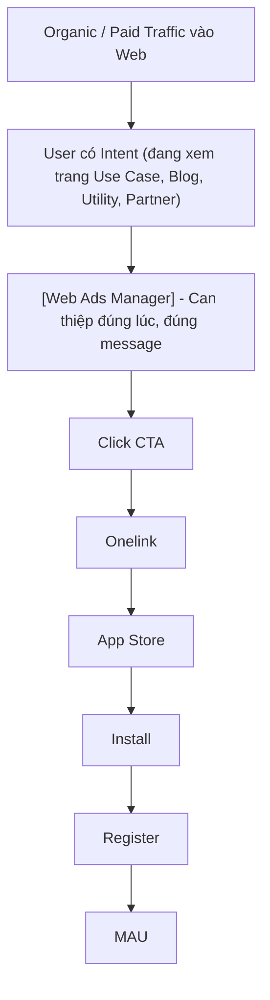
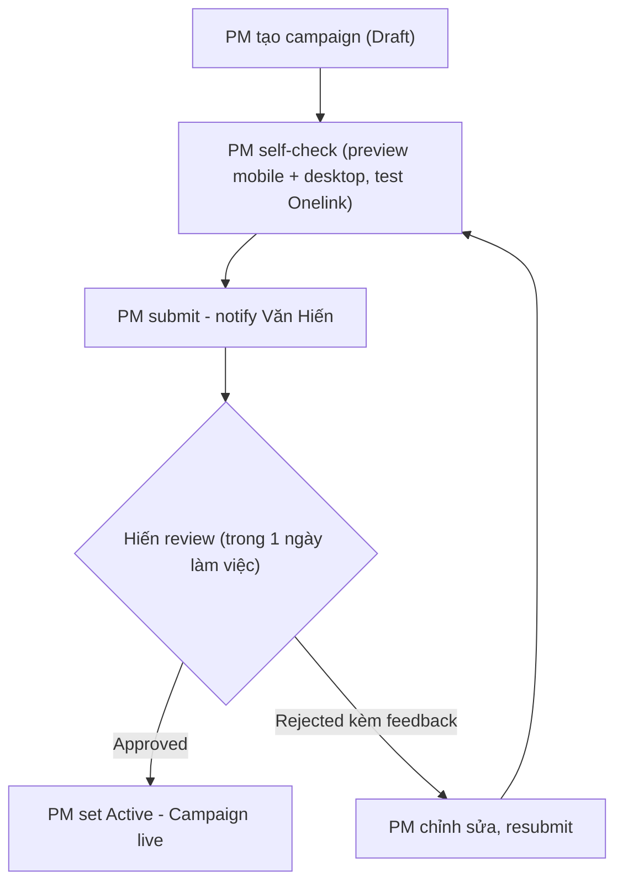

# BRD: Web Ads Manager (MoSpark Module)
> **Vision:** Trở thành nền tảng quản lý Traffic Inventory và phân phối Ads toàn diện cho Web MoMo - Học hỏi từ mô hình Athena (App).
> **Tech/Product Lead:** Võ Minh Thuận (Product Vision, Roadmap & Development)
> **Quality Gate:** Văn Hiến (SEO/GEO Standards & Compliance)
*   **Infrastructure:** Lê Đăng Lộc (Umami Integration & Analytics). Hỗ trợ bởi kỹ năng [[web-tracking]] để đảm bảo đo lường chuyển đổi Ads chính xác.
> **Status:** Active - Developing Roadmap

---

## 1. Executive Summary & Status
*   **Status**: Active - Production (V1.2). **Balloon Ads** đã deployed từ 01/04/2026.
*   **Pilot Phase**: Đang phối hợp với Team User Growth để vận hành và nâng cấp trong Q2/2026.
*   **Capabilities**: Balloon Ads, Popup, Bottom Sheet Promotion Scheme, A/B Testing. PM/PO có thể tự cấu hình mà không phụ thuộc Dev.
*   **Roadmap**: Context-based targeting (theo URL/Page segment) và tích hợp Appsflyer/Onelink để đo lường Full Funnel.

### Situation

MoMo đang vận hành **Athena** - nền tảng Ads trong App với đầy đủ năng lực: Campaign/AdGroup/Ad, đa dạng Format và Placement, Audience Segment, Frequency Cap, Bidding, và Tracking. Athena phục vụ hàng triệu MAU mỗi ngày trên các màn hình trong App.

Web MoMo (momo.vn) là kênh traffic lớn song song với App, phục vụ người dùng đang tìm kiếm thông tin, so sánh sản phẩm, hoặc có intent sử dụng dịch vụ MoMo - nhưng chưa ở trong App. Đây là nhóm user có giá trị cao: họ đang trong giai đoạn cân nhắc, và một message đúng lúc có thể chuyển đổi họ thành người dùng App hoặc kích hoạt lại hành vi.

Tuy nhiên, Web hiện tại không có hệ thống Ads tương đương. Mọi promotional message trên Web phải hardcode thủ công, phụ thuộc hoàn toàn vào Dev, không có targeting theo context trang, không có format đa dạng, và không có cơ chế đo lường hiệu quả chuẩn.

### Complication

MoMo đã thử nghiệm Popup và Balloon dưới dạng hardcode tại một số trang. Data từ Popup Billpay trong 9 ngày đầu:

| Metric | Kết quả |
|---|---|
| Impression | 201,300 |
| Click (CTA) | 4,560 |
| CTR | 2.4% |
| Dismiss (đóng popup) | 157,612 |
| Dismiss Rate | 78.3% |

CTR 2.4% thấp. Dismiss Rate 78.3% cao. Nguyên nhân không phải vì format sai - mà vì **thiếu context matching**: cùng một message bắn ra trên nhiều trang có intent hoàn toàn khác nhau. User đang đọc blog tài chính nhận popup giống hệt user đang ở trang mua bảo hiểm. Không có relevance, không có đúng thời điểm.

Ngoài vấn đề hiệu quả còn có vấn đề vận hành: mỗi campaign cần Dev code và deploy. Time-to-live nhiều ngày. Không thể iterate, không thể test nhanh. PM Growth không có tool tự vận hành.

Web MoMo có nhiều loại trang với intent rõ ràng và traffic đáng kể - Mini Web Use Case (bảo hiểm, BNPL, vay), Blog/News tài chính, Utility Tools (tra cứu phạt nguội, giá vàng), Landing Page khuyến mãi, và Partner Page. Mỗi loại trang cần message khác nhau, format khác nhau. Không thể scale với cơ chế hardcode hiện tại.

### Resolution

Xây dựng **Web Ads Manager** - nền tảng quản trị và phân phối promotional content trên toàn bộ Web MoMo, hoạt động độc lập với Athena nhưng kế thừa tư duy vận hành tương tự: Campaign cấu hình objective, Ad Group nhóm theo chiến thuật, Ad Item chứa content và format cụ thể, Placement Rule xác định khi nào và ở đâu ad xuất hiện.

Khác biệt cốt lõi so với Athena: thay vì targeting theo Audience Segment và Screen trong App, Web Ads Manager targeting theo **URL context của trang** và **trạng thái cơ bản của user**. Đây là đặc thù của Web - nơi identity user chưa hoàn chỉnh nhưng intent của trang lại rất rõ ràng.

---

## 2. Bối Cảnh & Vị Trí Trong Hệ Sinh Thái MoMo

### 2.1. Athena (App Ads) và Web Ads Manager

MoMo đang có hai kênh digital chính phục vụ người dùng:

| Kênh | Platform | Đặc điểm targeting | Hệ thống Ads |
|---|---|---|---|
| App MoMo | Mobile App | User đã định danh, có lịch sử giao dịch, segment đa dạng | Athena - đầy đủ Campaign/AdGroup/Ad, Bidding, Segment |
| Web MoMo (momo.vn) | Browser | User phần lớn chưa đăng nhập, identity chưa hoàn chỉnh, targeting chủ yếu qua URL context | Web Ads Manager - xây mới, hoạt động độc lập |

Web Ads Manager không phải bản copy của Athena, cũng không tích hợp với Athena. Đây là hệ thống độc lập được thiết kế cho đặc thù của Web: traffic đa dạng, identity mờ, nhưng intent của trang rõ ràng và có thể khai thác.

### 2.2. Vai trò trong funnel tăng trưởng

MoMo đặt mục tiêu **MAU 16M trong 2026**. Web channel contribution vào mục tiêu này thông qua pipeline:

Web Ads Manager nằm ở **conversion layer** - sau khi user đã có intent vào trang, trước khi họ rời đi mà không hành động.

### 2.3. Hiện trạng các loại trang và nhu cầu Ads

| Loại trang | Ví dụ | Intent user | Nhu cầu Ads |
|---|---|---|---|
| Mini Web Use Case | /bao-hiem-o-to, /vi-tra-sau | Transactional - muốn dùng sản phẩm | Cao - user gần điểm convert |
| Blog/News | /blog/vay-tien-online | Informational - đang research | Trung - cần nudge nhẹ, không interrupt |
| Utility/Tool | /gia-vang, /tra-cuu-phat-nguoi | Tool-seeking - cần tính năng | Trung - highlight app value mà không che tool |
| Landing Page | /khuyen-mai | Promotion-driven | Cao - user đang tìm ưu đãi |
| Partner Page | /doi-tac/{brand} | Research/Compare | Trung - cross-sell opportunity |

---

## 3. Định Hướng Sản Phẩm

### 3.1. Web Ads Manager là gì

> **Web Ads Manager là nền tảng quản trị và phân phối promotional content trên toàn bộ Web MoMo - cho phép PM tự cấu hình campaign theo context của từng loại trang, phục vụ cả Traffic (CTR) lẫn Awareness (Impression), với đa dạng format phù hợp với intent của từng user, mà không phụ thuộc Dev.**

### 3.2. Web Ads Manager KHÔNG phải

| Không phải | Lý do |
|---|---|
| Phiên bản Web của Athena | Hoạt động độc lập, không dùng chung infrastructure, targeting khác biệt hoàn toàn |
| Ads platform kiểu Google/Meta | Không có bidding, không có audience targeting phức tạp theo behavioral profile |
| AI personalization engine | Targeting dựa vào URL context, không phải user-level behavioral data |
| CMS thay thế | Chỉ quản lý promotional layer phía trên nội dung trang chính |
| Notification system | Chỉ hiển thị trong web session, không push notification |

### 3.3. Hai mục tiêu phân phối

Web Ads Manager phục vụ đồng thời hai mục tiêu, tùy vào loại trang và chiến lược campaign:

**Traffic - Tối ưu CTR:**
Dẫn user từ Web vào App. Message rõ ràng về lợi ích, CTA trực tiếp, Onelink deeplink. Phù hợp với trang transactional (Use Case) và Landing Page khuyến mãi.

**Awareness - Tối ưu Impression:**
Tăng nhận diện tính năng MoMo với user đang browse web. Message ngắn, ít interrupt, xuất hiện liên tục nhưng không làm phiền. Phù hợp với Blog, Utility Tool, Partner Page.

---

## 4. JTBD Analysis

### Nhóm 1 - Web Visitor (người nhận Ad)

**Job #1: Biết MoMo có giải pháp cho việc tôi đang làm**

> "Tôi đang xem trang bảo hiểm xe máy - MoMo có thể giúp tôi mua ngay không?"

Intent cao, trang transactional. User sẵn sàng hành động nếu có CTA đúng lúc. Phục vụ mục tiêu **Traffic**.

Serve bằng: Popup Full hoặc Balloon Standard - benefit cụ thể, CTA trực tiếp vào App.

**Job #2: Nhớ đến MoMo khi đang dùng tool hoặc đọc nội dung**

> "Tôi đang tra giá vàng / đọc bài về vay tiền - thấy MoMo có tính năng liên quan, để bụng khi nào cần."

Intent thấp hơn, đang trong giai đoạn awareness. Không muốn bị interrupt, nhưng receptive với message nhẹ. Phục vụ mục tiêu **Awareness**.

Serve bằng: Balloon Float Icon (ít interrupt) hoặc Inline Banner (tích hợp trong nội dung).

**Job #3: Tìm ưu đãi để quyết định dùng MoMo**

> "Tôi đang xem trang khuyến mãi - nếu có deal tốt tôi sẽ cài app ngay."

Intent cao, đang trong giai đoạn so sánh. Message cần nêu rõ ưu đãi cụ thể. Phục vụ cả **Traffic** lẫn **Awareness**.

Serve bằng: Popup Full gắn kèm Promotion Campaign (gift card / voucher bundle).

### Nhóm 2 - PM Growth (người vận hành)

**Job #4: Tự triển khai campaign nhanh mà không cần Dev**

> "Tôi có brief campaign cần go-live hôm nay - không muốn chờ Dev."

Hiện tại không có công cụ, mọi thứ phải qua ticket Dev. Web Ads Manager giải quyết trực tiếp.

**Job #5: Biết campaign nào hiệu quả để tối ưu**

> "Campaign A CTR 5%, campaign B CTR 1.5% - tôi cần data để quyết định."

Hiện tại không có measurement chuẩn. Web Ads Manager cần cung cấp đủ data để PM tự quyết định optimize hoặc pause.

---

## 5. Phạm Vi Sản Phẩm

### 5.1. Cấu trúc Campaign

Kế thừa tư duy Campaign - AdGroup - Ad tương tự Athena, điều chỉnh cho đặc thù Web:

| Tầng | Vai trò | Tư duy |
|---|---|---|
| **Campaign** | Định objective, thời gian, priority | "Tôi muốn đạt điều gì và khi nào?" |
| **Ad Group** | Nhóm Ad Items theo chiến thuật | "Tôi sẽ đạt điều đó bằng nhóm message nào?" |
| **Ad Item** | Format + Content + CTA + Onelink | "Tôi nói gì với user và dẫn họ đi đâu?" |
| **Placement Rule** | URL context + User signal + Frequency | "Tôi hiện Ad này ở trang nào, với ai, bao nhiêu lần?" |

### 5.2. Ad Formats

Thay vì targeting theo Screen (như Athena), Web Ads Manager targeting theo loại trang. Format phải phù hợp với intent của từng loại trang:

**Phase 1 (Q2/2026):**

| Format | Mức interrupt | Phù hợp với loại trang | Phục vụ mục tiêu |
|---|---|---|---|
| Popup | Cao - chiếm viewport | Use Case, Landing Page | Traffic |
| Balloon Standard | Thấp - góc màn hình | Tất cả trang | Traffic + Awareness |
| Balloon Float Icon | Rất thấp - icon nhỏ | Utility Tool, Blog | Awareness |

**Phase 2 (Q3/2026):**

| Format | Phù hợp | Phục vụ mục tiêu |
|---|---|---|
| Inline Banner | Blog/News - tích hợp trong nội dung | Awareness |
| Sticky Bar | Landing Page - dính đầu/cuối trang | Traffic |

**Roadmap (Q4/2026+):**

| Format | Mô tả |
|---|---|
| Native Component | Widget/Form tích hợp tự nhiên vào trang - ví dụ calculator kèm CTA "Thử ngay trên MoMo" |

**Nguyên tắc Format-Page fit:**
- Popup chỉ dùng khi intent của trang đủ cao để justify interrupt
- Trang Utility/Tool ưu tiên format interrupt thấp - không che tool user đang dùng
- Blog/Informational page ưu tiên format tích hợp tự nhiên
- Tối đa 1 Popup active tại một thời điểm trên cùng một session

### 5.3. Targeting

Thay vì Audience Segment (như Athena có CRM data), Web Ads Manager dùng **URL Context** làm signal targeting chính:

**Phase 1:**
- URL của trang - ad chỉ hiện trên trang có URL match pattern đã cấu hình
- URL exclude - ad không hiện trên trang trong danh sách loại trừ
- User logged-in state - phân biệt guest vs logged-in ở mức cơ bản
- Frequency control: max per session, cooldown hours, stop after click

**Phase 2 (khi Identity có data):**
- User type: new / existing / churned
- App installed status
- Device type: mobile / desktop
- Geo nếu cần

### 5.4. Frequency Control

Các giới hạn bắt buộc để bảo vệ UX - không thể override per campaign:

| Giới hạn | Giá trị mặc định | Mục đích |
|---|---|---|
| Max Popup / session | 1 | Không interrupt nhiều lần trong 1 session |
| Cooldown giữa 2 lần show | 24 giờ | Không xuất hiện liên tục với cùng 1 user |
| Stop after click | Bật mặc định | Không làm phiền user đã tương tác |
| Max Popup active cùng lúc / trang | 1 | Tránh conflict UX |

### 5.5. Promotion Campaign Integration

Ad Item có thể gắn với một Promotion Campaign - bundle gift card hoặc voucher hiển thị kèm theo ad. Cơ chế này cho phép PM kết nối promotional offer trực tiếp vào ad delivery mà không cần code riêng.

### 5.6. Out of Scope - Phase 1

- Trang chính sách, điều khoản, giới thiệu công ty
- Trang lỗi (404, 500)
- Trang checkout / payment flow đang active
- A/B testing delivery - schema có sẵn, chưa enable
- Analytics dashboard - Phase 2
- Tích hợp với Athena dưới bất kỳ hình thức nào

---

## 6. Content & Quality Standards

> Section này do Văn Hiến (Out-App Traffic) sở hữu và định nghĩa. Mọi thay đổi phải qua Hiến.

### 6.1. Tại sao cần Standards

Web Ads Manager cho phép PM publish mà không cần Dev - đây là tốc độ cần thiết. Nhưng momo.vn là YMYL-adjacent domain. Message sai có thể vi phạm quy định quảng cáo tài chính, gây hiểu lầm về sản phẩm, và ảnh hưởng trust signal của momo.vn với Google lẫn user. Standards không phải cổng kiểm duyệt chậm - đây là cơ chế đảm bảo tốc độ không đánh đổi chất lượng.

### 6.2. Tiêu chuẩn nội dung

| Tiêu chuẩn | Đúng | Sai |
|---|---|---|
| Benefit cụ thể, có căn cứ | "Vay tới 10 triệu trong 5 phút" | "Vay siêu nhanh, dễ dàng" |
| CTA khớp với destination | CTA "Mua bảo hiểm" - deeplink trang bảo hiểm | CTA "Xem ngay" - trang chủ |
| Không superlative vô căn cứ | "Top 1 app thanh toán VN (Nielsen 2024)" | "Tốt nhất Việt Nam" |
| Urgency có thật | "Ưu đãi đến 30/04/2026" | "Chỉ còn 5 suất!" |
| Điều kiện tài chính rõ ràng | Đúng lãi suất, đúng điều kiện | Ẩn điều kiện, phóng đại lợi ích |

### 6.3. Tiêu chuẩn format

| Tiêu chuẩn | Yêu cầu |
|---|---|
| Context relevance | Ad chỉ xuất hiện trên trang có intent phù hợp với message |
| Format-page fit | Popup chỉ dùng trên trang transactional - không dùng trên Utility/Tool |
| Non-obstruction | Ad không che nội dung chính hoặc tool user đang dùng |
| Mobile-first | Mọi format phải đảm bảo UX đúng trên mobile viewport trước |

### 6.4. Tiêu chuẩn tracking

| Tiêu chuẩn | Yêu cầu |
|---|---|
| Event coverage | 100% campaign phải track impression, click, dismiss |
| UTM chuẩn | `utm_source=web_ads&utm_medium={format}&utm_campaign={campaign_id}` |
| Onelink valid | Mọi CTA phải test deeplink hoạt động trước khi live |
| Attribution chain | Click - Onelink - Appsflyer - Install phải traceable |
| Silent fail | Nếu tracking lỗi, không được block UX của web visitor |

### 6.5. Approval Flow

### 6.6. Rollback

Khi campaign đang chạy có vấn đề: PM Pause ngay lập tức (không cần Dev), báo Hiến trong 30 phút, Hiến quyết định fix/terminate, log incident.

### 6.7. Quality Gate Checkpoints

| Checkpoint | Thời điểm | Owner |
|---|---|---|
| Pre-build spec review | Trước khi Thuận build | Hiến align với Thuận |
| Campaign review | Trước mỗi campaign live | Hiến review PM submission |
| Bi-weekly audit | Mỗi 2 tuần | Hiến review toàn bộ campaign đang chạy |
| Phase gate | Cuối Phase 1 trước Phase 2 | Hiến + Bảo |
| Monthly report | Hàng tháng | Hiến report lên Bảo |

---

## 7. Actors & Responsibilities

| Vai trò | Người | Trách nhiệm |
|---|---|---|
| Sponsor | Bảo (Web Platform Manager) | Approve direction, resource, escalation |
| Owner | Thuận (Web Platform) | Build, maintain, vận hành kỹ thuật |
| Standards & Quality Gate | Văn Hiến (Out-App Traffic) | Xác định tiêu chuẩn Ads, review campaign, đối soát định kỳ |
| Operator | PM Growth | Tạo, cấu hình, publish, monitor campaign |
| Tracking | DA (Hải/Hoàng) | Setup tracking chuẩn, verify attribution chain, dashboard |
| Creative | Designer | Tạo image asset theo format spec |

**RACI:**

| Activity | Bảo | Thuận | Văn Hiến | PM Growth | DA |
|---|---|---|---|---|---|
| Approve product direction | A | C | C | I | I |
| Build Web Ads Manager | I | R/A | C | I | C |
| Define Ads Standards | C | I | R/A | I | I |
| Define tracking spec | I | C | C | I | R/A |
| Create campaign | I | I | C | R | I |
| Review/approve campaign | I | I | R/A | C | I |
| Monitor performance | I | I | R | R | R/A |
| Incident response | A | R | C | R | C |

---

## 8. Success Metrics

### 8.1. North Star Metric

> **Số Install và Register có attribution từ Web channel, đo được qua Web Ads Manager.**

### 8.2. KPIs theo Phase

**Phase 1 - Operational KPIs:**

| Metric | Baseline (Phase 0) | Target Phase 1 | Source |
|---|---|---|---|
| CTR (Traffic campaigns) | 2.4% | 4%+ | GA4 |
| Dismiss Rate | 78.3% | Dưới 65% | GA4 |
| Impression/session (Awareness campaigns) | Chưa có baseline | TBD sau khi có data | GA4 |
| Time-to-live (idea - campaign live) | Nhiều ngày (phụ thuộc Dev) | Trong 1 ngày làm việc | Operational log |
| App Open Rate | Chưa có baseline | 30%+ của Click | Appsflyer |

**Phase 2 - Business KPIs:**

| Metric | Target | Source |
|---|---|---|
| Install attributed to Web Ads | TBD sau 1 tháng Phase 1 | Appsflyer |
| Register rate từ Web Ads installs | TBD | Appsflyer + MoMo backend |
| MAU contribution từ Web channel | TBD | Onelink funnel |

> App Open Rate, Install Rate và downstream metrics chưa có baseline vì attribution chain chưa fully setup. Target cứng sẽ được set sau khi Phase 1 vận hành đủ 1 tháng và DA verify chain hoàn chỉnh.

### 8.3. Success Gate để move sang Phase 2

- Ít nhất 5 campaign chạy thành công qua PM workflow mà không cần Dev ticket
- CTR trung bình đạt 4%+ trên ít nhất 3 Traffic campaign
- Dismiss Rate trung bình dưới 65%
- Zero P1 bug trong 2 tuần liên tiếp
- Attribution chain (click - install) đã verify bởi DA

---

## 9. Rollout Strategy

### Phase 1 - Module 1 (Hiện tại)
**Mục tiêu:** Balloon Ads, Popup, Context-based targeting, A/B test.

### Phase 2 - Module 2 (Traffic Inventory)
**Mục tiêu:** Traffic Inventory Management - quản lý toàn bộ ad placements trên Mini Web theo URL/segment.

### Phase 3 - Module 3 (Distribution Platform)
**Mục tiêu:** Ads Distribution Platform - PM/PO tự cấu hình, phân phối và đo lường Ads trên toàn hệ thống Web MoMo (Học hỏi Athena).

---

## 10. Dependencies & Constraints

| Dependency | Owner | Mô tả | Blocker? |
|---|---|---|---|
| Attribution tracking setup | DA (Hải/Hoàng) | Appsflyer chain verify trước Phase 1 launch | Có - không đo được impact |
| Onelink convention cho Web Ads | Hiến + DA | UTM standard và deeplink pattern cho toàn bộ campaign | Có - CTA không traceable |
| Image asset spec per format | Designer + Hiến | Kích thước, format, guideline ảnh per template | Có - PM không tạo được đúng creative |
| PM training | Hiến | Training workflow trước Beta launch | Có - PM không self-serve được |
| Identity user data | Data/App team | Cần cho Phase 2 extended signals | Không - Phase 1 chạy được không cần |

**Constraints:**

- Phase 1 targeting chỉ dựa vào URL context - không phân biệt được user mới/cũ sâu do Identity chưa hoàn chỉnh. Chấp nhận limitation này, mở rộng khi có data ở Phase 2.
- Web Ads Manager hoạt động hoàn toàn độc lập với Athena - không dùng chung infrastructure, asset library, hay reporting.
- Mọi campaign phải chạy qua Web Ads Manager - không cho phép hardcode ad trực tiếp vào code. Policy này được Bảo enforce từ Phase 1.
- Content YMYL-adjacent: approval flow bắt buộc, không auto-publish.

---

## 11. Risk Assessment

| # | Rủi ro | Khả năng | Impact | Mitigation |
|---|---|---|---|---|
| R1 | PM publish message sai/misleading trên trang tài chính | Trung bình | Cao | Approval flow bắt buộc qua Hiến trước mỗi campaign live |
| R2 | CTR không cải thiện sau Phase 1 - vẫn ở mức 2.4% | Trung bình | Cao | Bi-weekly audit để phát hiện sớm; A/B test message và format liên tục |
| R3 | Spam UX - interrupt quá mức làm tăng bounce rate | Thấp | Cao | Global guardrail cứng (max 1 popup/session); Quality Gate audit định kỳ |
| R4 | Attribution chain không hoạt động - không đo được contribution | Trung bình | Cao | DA verify Appsflyer chain trước Phase 1 go-live - hard dependency |
| R5 | PM không dùng tool - vẫn nhờ Dev hardcode | Thấp | Trung bình | Training bắt buộc; "no hardcode" policy enforce từ Bảo |
| R6 | Thuận overload - Q2 là trọng điểm, Ads Manager là dự án chính | Cao | Cao | Scope Phase 1 giữ lean; Hiến support clarify spec nhanh; PRD phải rõ trước Dev bắt đầu |

---

## 12. Next Steps

BRD này define Why, What, và scope sản phẩm. Sau khi BRD được align giữa Bảo - Thuận - Hiến:

| Deliverable | Owner | Mô tả |
|---|---|---|
| **PRD** | Thuận - Hiến review | Technical spec: DB schema, API, component spec, tracking implementation |
| **Tracking Spec** | DA + Hiến | GA4 event schema, UTM convention, Appsflyer attribution chain |
| **Image Asset Spec** | Designer + Hiến | Kích thước, format, guideline ảnh per template |
| **PM Campaign Playbook** | Hiến | Workflow vận hành, format selection guide, content dos/don'ts |
| **Training Session** | Hiến | Training PM Growth trước Beta launch |

---

**END OF DOCUMENT**

> Mọi thay đổi về scope sản phẩm, format mới, hoặc signal targeting mới cần align với Văn Hiến (Standards & Quality Gate) và Bảo (Sponsor) trước khi đưa vào PRD.
