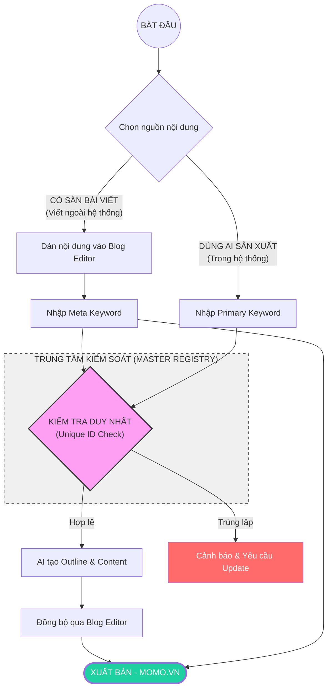
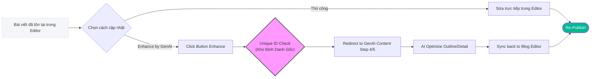

# BRD: GenAI Content - SEO/GEO Project Module

> **Product Manager:** Anh Bảo (Web Platform Manager)
> **Tech Lead:** Trần Công Hoàng Trọng (Software Engineer II)
> **Integration Support:** Bùi Minh Nhật (Senior Software Engineer)
> **Governance & Prompts:** Văn Hiến (SEO & GEO Lead)
> **Start Date:** May 2026
> **Status:** Claude API on Production - Enhanced Prompts Live - MoSpark Blog Auto-Create Integrated

---

## 6. Workflow Content - Double Entry Flow

### 6.0. Giải thích Thuật ngữ (Glossary)

Để đảm bảo sự thống nhất trong vận hành, các thuật ngữ dưới đây được định nghĩa như sau:

*   **Keyword Master Registry (Kho Định Danh Gốc):** Là "Sổ cái" trung tâm lưu trữ toàn bộ Primary Keywords của một Project. Mọi bài viết (dù tạo từ luồng nào) đều phải được đăng ký tại đây.
*   **Unique ID Check (Kiểm tra Định danh Duy nhất):** Quy trình hậu kiểm tự động. Hệ thống đối soát từ khóa mới với *Keyword Master Registry* để đảm bảo không có 2 bài viết trùng lặp nội dung/từ khóa trong cùng một Project.
*   **AI Enhance (Nâng cấp AI):** Tính năng cho phép "tái cấu trúc" một bài viết hiện có bằng sức mạnh của GenAI thông qua việc chuyển hướng về quy trình Draft Outline/Detail.
*   **Bottom-Up Sync (Đồng bộ ngược):** Cơ chế tự động tạo bản ghi tại *Keyword Master Registry* khi người dùng nhập Meta Keyword trong Blog Editor.
*   **Top-Down Sync (Đồng bộ xuôi):** Cơ chế tự động khởi tạo bài viết trong Blog Editor khi người dùng tạo Primary Keyword và Content trong module GenAI.

### 6.1. Entry Points & Operational Logic

Dự án vận hành dựa trên 2 luồng cơ bản (Double Entry) để đảm bảo tính linh hoạt giữa việc tạo mới thủ công và tạo bằng AI.

#### A. Luồng Tạo Mới (Create New)
Có 2 quy trình tách biệt hoàn toàn về cách sản xuất nội dung:

1.  **Tạo Mặc Định (Default/External Flow):** 
    - **Vận hành:** PM tự viết, thuê Freelancer, hoặc gửi Content Marketing viết bên ngoài hệ thống MoSpark.
    - **Quy trình:** Có Blog Detail sẵn -> Sử dụng tính năng "Create Blog" trong MoSpark -> Input nội dung vào Blog Editor -> Publish.
    - **Đặc điểm:** MoSpark đóng vai trò là công cụ Input & CMS.

2.  **Tạo qua GenAI Content (In-System AI Flow):**
    - **Vận hành:** Mọi bước sản xuất diễn ra 100% trên nền tảng MoSpark.
    - **Quy trình:** Nhập Từ Khóa -> AI Draft Outline -> Manual Edit Outline -> AI Draft Blog Detail -> Sync qua Blog Editor -> Publish.
    - **Đặc điểm:** MoSpark đóng vai trò là nền tảng sản xuất nội dung (Production Lab).

> [!IMPORTANT]
> **Định danh Unique:** Dù tạo bằng cách nào, hệ thống phải check trùng lặp Từ khóa. 1 Primary Keyword = 1 Blog Article.

#### B. Luồng Cập Nhật (Update)
Bài viết đã tồn tại (tạo từ bất kỳ nguồn nào) đều có thể được cập nhật theo 2 hướng:
1.  **Cập nhật thủ công:** Tự viết hoặc paste nội dung mới trực tiếp vào Blog Editor.
2.  **Enhance by GenAI Content:** Sử dụng nút bấm trong Blog Editor để chuyển hướng đến module GenAI Content của chính từ khóa đó để tối ưu hóa lại bằng AI.

### 6.1. Operational Flow - Creation Paths (Way 1 & Way 2)

Quy trình này tách biệt rõ ràng giữa việc **Nhập liệu thủ công (Way 1)** và **Sản xuất bằng AI (Way 2)**.

### 6.2. Operational Flow - Update & Enhance Path

Sơ đồ mô tả quy trình cập nhật bài viết hiện có, đặc biệt là cơ chế **Enhance by GenAI**.

### 6.3. Workflow Chi tiết - 7 Bước
- **Gate 1:** Business Context Complete (Step 2)
- **Gate 2:** Outline Final (Step 5)
- **Gate 3:** Publish (Step 7)

### 6.1. Workflow Chi tiết

| Bước | Tên | Hành động | Input/Output | Owner | Role |
|------|-----|----------|-------------|----|------|
| 1 | Tạo Project | Nhập tên Use Case (ví dụ: "Vay Nhanh") | Project ID + metadata | PM/Growth | Khởi tạo & xác nhận |
| 2 | Business Context | Nhập 11 fields bắt buộc (Business Model, Audience...) | Context Layer | PM/Growth + SEO/GEO Lead | Xác nhận & Validate |
| 3 | Create Primary Keyword | Nhập Primary keyword. **Hệ thống check tính Unique** | Keyword mapping | Content Team | Triển khai research |
| 4 | Draft Outline AI | Claude AI generate outline dựa trên Context + Keywords | Outline draft | AI (Claude API) | Auto-generate |
| 5 | Manual Edit Outline | Chỉnh sửa, add angle độc đáo. PM Approve | Outline final | Content Team + PM/Growth | Edit & Approve |
| 6 | Blog Detail AI | Claude AI generate bài viết chi tiết từ Outline | Blog Detail draft | AI (Claude API) | Auto-generate |
| 7 | Blog Editor (Publish) | Verify & Sync qua Blog Editor. Click "Sync create" | Blog live on momo.vn | Content Team + SEO/GEO Lead | Publish |

**Key Enhancement:** Tách Blog Detail AI (Step 6) và Blog Editor Publish (Step 7) - rõ ràng hóa ownership verify (SEO/GEO) vs publish action (Content).

### 6.4. Role & Responsibility Detail

#### PM/Growth (Cell Team)
**Trách nhiệm chính:** Xác nhận nội dung, chịu trách nhiệm pháp lý, bổ sung thông tin sản phẩm/dịch vụ

- **Bước 1:** Khởi tạo Project (tên Use Case)
- **Bước 2:** **Xác nhận Business Context đầy đủ - chịu trách nhiệm pháp lý & Information Gain**
  - Confirm tất cả 11 fields: Value Prop, Trust Signals, Disclaimer, Blacklist terms
  - Verify không có information sai, không recommend competitor, không overpromise tính năng
  - Ensure tất cả "thông tin lợi ích" (benefit/gain) đều chính xác về sản phẩm/dịch vụ MoMo
- **Bước 5:** Approve Outline final trước khi Claude tạo Blog Detail
  - Review outline có align với strategy & positioning của Use Case
  - Từ chối outline nếu có sai lệch, request Content chỉnh sửa
  - Max 1 lần return - không quá 2 vòng lặp

#### Content Team
**Trách nhiệm chính:** Triển khai quy trình, tạo outline, chỉnh sửa, publish blog

- **Bước 3:** Create Primary Keyword + Secondary keywords (triển khai từ keyword research)
- **Bước 5:** Chỉnh sửa Outline
  - Adjust structure, add unique angle, verify keyword integration
  - Submit Outline final cho PM/Growth approve
- **Bước 7:** Publish Blog Detail
  - Kiểm tra Blog Detail từ AI (nhanh)
  - Nếu SEO/GEO pass gate → Click "Sync create" để publish to momo.vn
  - Nếu fail → Request SEO/GEO fix & verify lại

#### SEO/GEO Lead (Văn Hiến)
**Trách nhiệm chính:** Đảm bảo Skill/Prompt apply, verify quality, ownership publish gate

- **Bước 2:** Validate Business Context framework
  - Confirm 11 fields đầy đủ, context tương thích với Prompt
  - Alert nếu có risk về SEO/GEO impact
- **Bước 6:** Check SEO/GEO Scoring (auto tự động)
  - Monitor AI output quality
  - Flag nếu có issues: E-E-A-T fail, YMYL risk, content violation
- **Bước 7:** **OWNERSHIP - Verify & Sign-off Publish**
  - Final verify content đạt tiêu chuẩn E-E-A-T, YMYL, SEO/GEO
  - Ensure OnPage chuẩn bị (metadata, structured data, CTA placement)
  - Sync Blog Detail vào Blog Editor nếu cần chỉnh sửa OnPage
  - Sign-off → Content Team proceed to publish
  - Chịu trách nhiệm chất lượng final output

### 6.5. Approval Gates

| Gate | Step | Owner | Condition |
|------|------|-------|-----------
| **Business Context Complete** | 2 | PM/Growth + SEO/GEO | Đủ 11 fields, information verify, pháp lý clear |
| **Outline Final** | 5 | PM/Growth | Content submit → PM/Growth approve |
| **Publish** | 7 | SEO/GEO Lead | Blog Detail pass scoring -> Sync to Editor -> Click "Sync create" |

### 6.6. Synchronization & Keyword Master Registry Logic

Hệ thống quản lý nội dung dựa trên nguyên tắc **GenAI Content là Keyword Master Registry (Kho lưu trữ gốc)** của toàn bộ Primary Keywords trong một Project.

1.  **Cơ chế Đồng bộ từ Luồng Mặc Định (Bottom-Up Sync):**
    - Ở Blog Editor, PM không nhập "Primary Keyword" ngay từ đầu.
    - Tuy nhiên, để đạt điểm **SEO/GEO Score**, PM buộc phải nhập **Meta Keyword**.
    - **Hành động hệ thống:** Ngay khi Meta Keyword được nhập, MoSpark sẽ tự động tạo một bản ghi (Record) tương ứng trong module GenAI Content với Keyword này.
    - Điều này đảm bảo mọi bài viết "viết tay" đều có một đại diện trong GenAI để sẵn sàng cho tính năng AI Enhance.

2.  **Cơ chế Từ Luồng GenAI Content (Top-Down Sync):**
    - Khi PM tạo một Primary Keyword trong module GenAI, hệ thống sẽ tự động khởi tạo và liên kết (Link) với một bài blog trong Editor.
    - Mọi thay đổi về nội dung từ GenAI (Step 6) sẽ được đồng bộ (Sync) đè lên hoặc cập nhật vào bài blog này.

3.  **Quản lý Tính Unique (Unique ID Check):**
    - **Vị trí kiểm soát:** Duy nhất tại module GenAI Content.
    - **Logic:** Dù bài viết đến từ luồng nào, Meta Keyword (từ Editor) hoặc Primary Keyword (từ GenAI) đều phải "check-in" tại Keyword Master Registry. 
    - Nếu Keyword đã tồn tại, hệ thống sẽ ngăn chặn việc tạo mới và yêu cầu user sử dụng bài viết hiện có để tránh "Content Cannibalization".

---

## 7. Business/Product Context - 11 Fields bắt buộc

> **Owner:** Văn Hiến
> **Thời điểm nhập:** Bắt buộc hoàn thành TRƯỚC khi generate bất kỳ bài viết nào trong Project
> **Mục đích:** Làm nền tảng context cho cả Prompt 1 (Outline) và Prompt 2 (Writer) - đảm bảo AI luôn viết đúng về sản phẩm MoMo, không recommend competitor, không bịa đặt tính năng

### 7.1. 11 Fields bắt buộc

1. **Tên sản phẩm** - Tên chính xác như hiển thị trong App/Web
2. **URL Web** - URL canonical của trang chính
3. **Mô tả sản phẩm** - 3-5 câu, phân biệt Web vs App
4. **Đối tượng sử dụng** - Persona chính (ai, ở đâu, job gì)
5. **Đối tác** - Tên đối tác cung cấp data/dịch vụ (nếu có)
6. **Điều kiện sử dụng** - Giới hạn, yêu cầu user cần biết
7. **Value Prop / USPs** - Danh sách điểm giá trị nổi bật (AI phải integrate tự nhiên)
8. **Trust Signals** - Yếu tố tạo độ tin cậy so với competitor
9. **Khác biệt vs đối thủ** - So sánh trực tiếp, honest (bao gồm cả điểm chưa bằng)
10. **Disclaimer** - Pháp lý/tài chính (theo YMYL guideline)
11. **Từ ngữ bị cấm** - Blacklist terms (sai sản phẩm, pháp lý risk, competitor)

---

## 8. Lộ trình (Roadmap)

### Phase 1: Foundation & Scaling (May 2026)
1. ✅ **7-Step Workflow live:** Blog Detail AI + Blog Editor Publish separation
2. ✅ **Phạt Nguội pilot:** Foundation complete
3. ✅ **Scale Financial products:** Vay Nhanh, Ví Trả Sau, CIC

### Phase 2: Performance Tracking & Optimization (June 2026+)
- **Google Search Console API Integration:** Theo dõi hiệu suất per Project
- **Metrics per Project:** Organic traffic, impressions, CTR, avg position
- **Automated Insights:** Gợi ý tối ưu nội dung dựa trên data
- **Content Refresh Automation:** Identify underperforming articles - suggest updates

---

*Document: BRD-MoSpark-GenAI-Content · v3.5 (Integrated Prompt Engineering Skill)*

---

## 9. GenAI Operational Standards & Prompt Strategy (Integrated Skill)

> **Role:** Văn Hiến (SEO & GEO Lead)
> **Engine:** Claude API (Integrated in MoSpark)
> **Goal:** Tạo nội dung chuẩn SEO/GEO, đạt E-E-A-T và sẵn sàng cho AI Search Citation.

### 9.1. Nguyên tắc cốt lõi (Core Principles)
*   **Zero-Hallucination**: Luôn yêu cầu AI sử dụng dữ liệu thực tế (Pháp luật, số liệu từ BU).
*   **Context Injection**: Truyền bối cảnh dự án (Primary Keyword, Target Audience) vào Prompt.
*   **Structure-First**: Luôn yêu cầu AI tạo Outline trước khi viết nội dung chi tiết.

### 9.2. Framework Prompt cho Blog Content
Quy trình này khớp với **Bước 4 & Bước 6** trong Workflow hệ thống:

*   **Phase A: Outline Generator (Step 4)**
    *   **Input**: Primary Keyword + Target Audience + Key Message.
    *   **Prompt Master**: [[momo-blog-prompt-1-outline]]
*   **Phase B: Content Writer (Step 6)**
    *   **Input**: Outline từ Phase A + [[momo-seo-geo-guideline]] + [[momo-ymyl-guideline]].
    *   **Prompt Master**: [[momo-blog-prompt-2-writer]]

### 9.3. Quality Gate Standards (SEO/GEO Score)
Nội dung sau khi GenAI tạo ra phải được tự động chấm điểm qua [[mospark-seo-geo-score-brd]]. Các tiêu chí bắt buộc:
*   Mật độ từ khóa chính.
*   Sự hiện diện của FAQ Schema.
*   Độ dài và cấu trúc Heading.
