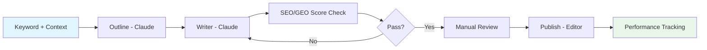

# SEO/GEO Project Playbook

> **Purpose**: Hướng dẫn vận hành end-to-end cho SEO/GEO Projects trên MoSpark
> **Owner**: Văn Hiến (SEO & GEO Lead)
> **Version**: 1.0

---

## 1. Tổng quan

### 1.1. SEO/GEO Project là gì?

Một **SEO/GEO Project** tương ứng với **một Use Case** (Phạt Nguội, Vay Nhanh, Cinema...) bao gồm:
- **Business Context**: Mô tả lĩnh vực, mục tiêu, đối tượng của Project
- **Nhiều bài viết** (nhiều keywords) được sản xuất từ context này
- **Hệ thống phân phối** qua Project System
- **Performance tracking** qua Google Search Console API

### 1.2. Các thành phần chính

| Component | Vai trò | Owner |
|-----------|---------|-------|
| **Project System** | Core infrastructure - quản lý & phân phối content | Trọng (Tech Lead) |
| **GenAI Content** | Sản xuất nội dung tự động (Outline → Writer) | Hiến (Governance) |
| **Blog Editor** | Xuất bản & quản lý bài viết | PM/PO Cell Team |
| **SEO/GEO Score** | Quality gate - kiểm tra chất lượng content | Hiến (Governance) |
| **Google Search Console** | Performance tracking (Future) | DA (Data Analytics) |

---

## 2. Project Onboarding Workflow

### Bước 1: Định nghĩa Business Context

Mỗi Project mới cần có một **BRD** (Business Requirements Document) bao gồm:

```markdown
# BRD: [Tên Project]

## Business Context
- **Use Case**: Mô tả ngắn gọn về lĩnh vực
- **Target Audience**: Đối tượng khách hàng mục tiêu
- **Key Messages**: Thông điệp chính muốn truyền tải
- **Success Metrics**: KPI đo lường thành công

## Keyword Strategy
- **Primary Keywords**: Từ khóa chính (3-5 keywords)
- **Secondary Keywords**: Từ khóa phụ (10-20 keywords)
- **Long-tail Keywords**: Từ khóa dài (50+ keywords)

## Content Pillars
- **Pillar 1**: Chủ đề nội dung chính 1
- **Pillar 2**: Chủ đề nội dung chính 2
- **Pillar 3**: Chủ đề nội dung chính 3
```

**Template**: Sử dụng cấu trúc từ các BRD hiện có (phat-nguoi-brd.md, vay-nhanh-brd.md...)

### Bước 2: Thiết lập trong Project System

1. **Tạo Project** trong Project Management UI
2. **Assign Business Context** từ BRD
3. **Cấu hình Distribution Rules**:
   - Auto-embed trên Landing Pages cùng Project
   - Related Content Widget settings
   - Cross-content Linking rules

### Bước 3: Cấu hình GenAI Content

1. **Select Content Skills**: Chọn prompt templates phù hợp (Blog, FAQ, HowTo)
2. **Configure Governance Rules**: Áp dụng momo-seo-geo-guideline, momo-ymyl-guideline
3. **Set Quality Threshold**: SEO/GEO Score minimum (60+ cho Warning, 80+ cho Good)

---

## 3. Content Production Workflow

### 3.1. Quy trình sản xuất bài viết



### 3.2. Chi tiết từng bước

**Bước 1: Keyword Input**
- Input: Primary Keyword + Business Context từ Project
- AI sử dụng context để hiểu intent và lĩnh vực

**Bước 2: Outline Generation**
- Sử dụng `[[momo-blog-prompt-1-outline]]`
- Output: Cấu trúc bài viết chuẩn SEO/GEO
- Review: Duyệt outline trước khi viết chi tiết

**Bước 3: Content Writing**
- Sử dụng `[[momo-blog-prompt-2-writer]]`
- Output: Nội dung chi tiết dựa trên outline
- Auto-apply: E-E-A-T principles, YMYL safety rules

**Bước 4: SEO/GEO Score Check**
- Tự động kiểm tra qua `[[mospark-seo-geo-score-brd]]`
- Score < 60: Không đạt - cần rewrite
- Score 60-79: Warning - vẫn publish được nhưng cần optimize
- Score 80+: Good - ready to publish

**Bước 5: Manual Review & Publish**
- PM/PO review nội dung
- Publish qua Blog Editor
- Auto-assign Project tag

---

## 4. Content Quality Loop

### 4.1. Performance Tracking (Future - Google Search Console API)

**Metrics per Project:**
- Organic Traffic
- Impressions
- Click-through Rate (CTR)
- Average Position
- Top Performing Queries

**Auto-optimization:**
- Gợi ý optimize bài viết có performance thấp
- Suggest new keywords dựa trên search queries
- Alert khi có significant traffic drop

### 4.2. Prompt Optimization

Dựa trên performance data:
1. **Analyze**: Bài viết nào có score cao nhưng performance thấp?
2. **Adjust**: Hiệu chỉnh prompts dựa trên insights
3. **Test**: A/B test với prompts mới
4. **Scale**: Apply winning prompts cho toàn Project

---

## 5. Project Templates

### 5.1. Template Structure

Mỗi Project BRD nên có cấu trúc:

```
04_Execution_Use_Cases/Project-Instances/[project-name]-brd.md
```

### 5.2. Existing Projects

| Project | Status | BRD Location |
|---------|--------|--------------|
| Phạt Nguội | Active - GenAI Pilot | `phat-nguoi-brd.md` |
| Vay Nhanh | Active - SEO/GEO Implementation | `vay-nhanh-brd.md` |
| Cinema | In Progress - Zero-Traffic Audit | `cinema-brd.md` |
| Đối Tác | Active - VTS Governance | `doi-tac-brd.md` |
| ESIM Du Lịch | Planning | `esim-du-lich-brd.md` |
| Telecom | Planning | `telecom-brd.md` |
| Bảo Hiểm XM | Planning | `bhxm-brd.md` |

---

## 6. API Contracts

### 6.1. Project System → GenAI Content

```json
{
  "project_id": "phat-nguoi",
  "business_context": {
    "use_case": "Phạt nguội giao thông",
    "target_audience": "Tài xế ô tô, xe máy",
    "key_messages": ["Tra cứu phạt nguội", "Nộp phạt online", "Giảm phạt"],
    "content_pillars": ["Hướng dẫn tra cứu", "Quy định pháp luật", "Mẹo tránh phạt"]
  },
  "keyword": "tra cứu phạt nguội",
  "content_type": "blog"
}
```

### 6.2. GenAI Content → Blog Editor

```json
{
  "article_id": "auto-generated",
  "project_id": "phat-nguoi",
  "title": "Hướng dẫn tra cứu phạt nguội online 2026",
  "content": "<html>...</html>",
  "seo_score": 85,
  "geo_score": 78,
  "meta_data": {
    "primary_keyword": "tra cứu phạt nguội",
    "secondary_keywords": ["phạt nguội online", "kiểm tra phạt nguội"],
    "category": "blog"
  }
}
```

---

## 7. Success Metrics

### 7.1. Per Project

- **Content Volume**: Số bài viết được sản xuất/tháng
- **Quality Score**: Average SEO/GEO Score
- **Organic Traffic**: Traffic từ AI Search & Traditional Search
- **Citation Rate**: Số lần được trích dẫn bởi AI (Gemini, AI Overview)

### 7.2. System-wide

- **Production Efficiency**: Thời gian trung bình từ keyword → published article
- **Quality Consistency**: % bài viết đạt score 80+
- **Distribution Accuracy**: % content được auto-distribute correctly

---

*Document: SEO-GEO-Project-Playbook · v1.0 · Last Updated: 01/05/2026*