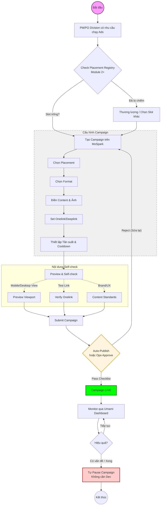

# MoSpark - Ads Manager
Nền tảng quản lý và phân phối quảng cáo tự động trên Web

> - **Project Name:** MoSpark Web Platform
> - **Division:** GPD (Growth Platform Division)
> - **Owner:** Bảo
> - **PIC:** Thuận (Tech)
> - **Version:** 3.4 · June 2026

---

## 1. Executive Summary

### Situation

MoSpark là nền tảng AI-powered Web App/Content của MoMo, đang vận hành và quản lý toàn bộ hệ sinh thái trang momo.vn - từ Mini Web Use Case (bảo hiểm, BNPL, vay), Blog/News, FAQ, đến Landing Page và Partner Page. MoSpark cho phép PM/PO tự vận hành mà không phụ thuộc Dev - đây là triết lý cốt lõi của nền tảng.

Trong hệ sinh thái đó, **Ads Manager** là module phụ trách một bài toán cụ thể: **phân phối promotional content đúng lúc, đúng trang, đúng người** - để chuyển đổi traffic đang có trên Web thành người dùng App hoặc kích hoạt lại hành vi. Đây là mắt xích còn thiếu trong pipeline Web-to-App của MoMo.

MoMo đang vận hành **Athena** trong App - nền tảng Ads với đầy đủ Campaign/AdGroup/Ad, Segment, Bidding, Tracking. Ads Manager trên MoSpark học hỏi tư duy đó nhưng được thiết kế riêng cho đặc thù Web: không có user identity sâu, nhưng có intent trang rõ ràng qua URL.

### Complication

Thực tế đã chứng minh nhu cầu: trước khi có Ads Manager, MoMo đã thử hardcode Popup và Balloon tại một số trang. Data từ 9 ngày đầu cho thấy 201,300 impression nhưng CTR chỉ 2.4% và Dismiss Rate lên đến 78.3%. Nguyên nhân không phải vì format sai - mà vì thiếu context matching: cùng một message bắn ra trên nhiều trang có intent hoàn toàn khác nhau.

Vấn đề sâu hơn là về mô hình vận hành. Khi Web MoMo scale với nhiều trang và nhiều Division muốn chạy Ads đồng thời, cơ chế hardcode thủ công sẽ tạo ra conflict placement, thiếu visibility tổng thể, không có measurement chuẩn, và Dev phải tham gia vào mỗi campaign - trái với triết lý của MoSpark.

### Resolution

Ads Manager tập trung vào nhiệm vụ tích hợp các định dạng quảng cáo hiện có từ Admin Tool như **Float**, **Balloon**, và cơ chế **A/B Testing** về nền tảng MoSpark, đồng thời cải thiện và chuẩn hóa các định dạng quảng cáo (Format Ads) cốt lõi gồm **Widget** và **Popup** để tối ưu hóa tỷ lệ chuyển đổi.

Hệ thống được phát triển theo lộ trình 3 module kế tiếp nhau:
- **Module 1 (Production - Trọng tâm hiện tại):** Tích hợp và chuyển dịch các định dạng Float, Balloon, Popup, và cơ chế A/B Testing (Landing Page variant + Ad creative) từ Admin Tool về MoSpark. Cải thiện, nâng cấp chất lượng hiển thị của Widget và Popup.
- **Module 2:** Traffic Inventory Management - quản lý toàn bộ ad placements trên Mini Web theo URL/segment, cho phép nhiều Division vận hành song song mà không conflict.
- **Module 3:** Ads Distribution Platform - PM/PO các Division/Center tự cấu hình, phân phối và đo lường Ads trên toàn hệ thống Web MoMo, tích hợp Umami dashboard.

---

## 2. Vị Trí Trong MoSpark

### 2.1. Vai trò của Ads Manager trong hệ sinh thái MoSpark

MoSpark là nền tảng Growth OS của MoMo Web nhằm mục đích tối ưu hóa nội dung và tăng trưởng người dùng. Trong hệ sinh thái MoSpark, **Ads Manager** đóng vai trò là động cơ khai thác hiệu quả toàn bộ traffic trên Web (bao gồm các trang Landing Page, Blog bài viết, FAQ, Merchant Page) để chuyển đổi thành hành vi mở App hoặc cài đặt App (Web-to-App).

Module này hoạt động như một lớp phân phối thông minh, giúp PM/PO tận dụng tối đa lượng lưu lượng truy cập hiện có nhằm thúc đẩy chuyển đổi trực tiếp sang App (W2A) mà không cần sự can thiệp của đội ngũ lập trình (Dev).

### 2.2. Mối quan hệ với MoSpark Content Architecture

MoSpark quản lý 7 loại trang chiến lược trên momo.vn. Ads Manager có thể phủ lên toàn bộ hệ sinh thái này:

<table style="width:100%; border-collapse:collapse; border:1.5px solid #64748b; margin:1em 0; font-size:0.9em;">
  <thead>
    <tr style="background-color:#f1f5f9;">
      <th style="border:1.5px solid #64748b; padding:8px 12px; text-align:left; font-weight:700;">URL Pattern</th>
      <th style="border:1.5px solid #64748b; padding:8px 12px; text-align:left; font-weight:700;">Loại trang</th>
      <th style="border:1.5px solid #64748b; padding:8px 12px; text-align:left; font-weight:700;">Vai trò của Ads Manager</th>
      <th style="border:1.5px solid #64748b; padding:8px 12px; text-align:left; font-weight:700;">Placement Type</th>
    </tr>
  </thead>
  <tbody>
    <tr>
      <td style="border:1px solid #94a3b8; padding:8px 12px; text-align:left;"><code style="background:#f1f5f9;padding:2px 4px;border-radius:4px;font-family:monospace;">/{mini-web}</code></td>
      <td style="border:1px solid #94a3b8; padding:8px 12px; text-align:left;">Mini Web Use Case</td>
      <td style="border:1px solid #94a3b8; padding:8px 12px; text-align:left;">Intent transactional cao</td>
      <td style="border:1px solid #94a3b8; padding:8px 12px; text-align:left;">Use Case-specific</td>
    </tr>
    <tr style="background-color:#f8fafc;">
      <td style="border:1px solid #94a3b8; padding:8px 12px; text-align:left;"><code style="background:#f1f5f9;padding:2px 4px;border-radius:4px;font-family:monospace;">/{mini-web}*</code></td>
      <td style="border:1px solid #94a3b8; padding:8px 12px; text-align:left;">Advanced Mini Web</td>
      <td style="border:1px solid #94a3b8; padding:8px 12px; text-align:left;">Traffic lớn, multi sub-page</td>
      <td style="border:1px solid #94a3b8; padding:8px 12px; text-align:left;">Use Case-specific</td>
    </tr>
    <tr>
      <td style="border:1px solid #94a3b8; padding:8px 12px; text-align:left;"><code style="background:#f1f5f9;padding:2px 4px;border-radius:4px;font-family:monospace;">/</code></td>
      <td style="border:1px solid #94a3b8; padding:8px 12px; text-align:left;">Trang chủ</td>
      <td style="border:1px solid #94a3b8; padding:8px 12px; text-align:left;">High traffic, awareness</td>
      <td style="border:1px solid #94a3b8; padding:8px 12px; text-align:left;"><strong>Shared-source (GPD)</strong></td>
    </tr>
    <tr style="background-color:#f8fafc;">
      <td style="border:1px solid #94a3b8; padding:8px 12px; text-align:left;"><code style="background:#f1f5f9;padding:2px 4px;border-radius:4px;font-family:monospace;">/merchant*</code></td>
      <td style="border:1px solid #94a3b8; padding:8px 12px; text-align:left;">Merchant Page</td>
      <td style="border:1px solid #94a3b8; padding:8px 12px; text-align:left;">Cross-sell opportunity</td>
      <td style="border:1px solid #94a3b8; padding:8px 12px; text-align:left;"><strong>Shared-source (GPD)</strong></td>
    </tr>
    <tr>
      <td style="border:1px solid #94a3b8; padding:8px 12px; text-align:left;"><code style="background:#f1f5f9;padding:2px 4px;border-radius:4px;font-family:monospace;">/blog*</code></td>
      <td style="border:1px solid #94a3b8; padding:8px 12px; text-align:left;">Growth Articles</td>
      <td style="border:1px solid #94a3b8; padding:8px 12px; text-align:left;">Awareness và soft nudge</td>
      <td style="border:1px solid #94a3b8; padding:8px 12px; text-align:left;">Mixed (Global/UC)</td>
    </tr>
    <tr style="background-color:#f8fafc;">
      <td style="border:1px solid #94a3b8; padding:8px 12px; text-align:left;"><code style="background:#f1f5f9;padding:2px 4px;border-radius:4px;font-family:monospace;">/tin-tuc*</code></td>
      <td style="border:1px solid #94a3b8; padding:8px 12px; text-align:left;">Communications</td>
      <td style="border:1px solid #94a3b8; padding:8px 12px; text-align:left;">Awareness</td>
      <td style="border:1px solid #94a3b8; padding:8px 12px; text-align:left;">Shared-source (GPD)</td>
    </tr>
    <tr>
      <td style="border:1px solid #94a3b8; padding:8px 12px; text-align:left;"><code style="background:#f1f5f9;padding:2px 4px;border-radius:4px;font-family:monospace;">/hoi-dap*</code></td>
      <td style="border:1px solid #94a3b8; padding:8px 12px; text-align:left;">Help Center</td>
      <td style="border:1px solid #94a3b8; padding:8px 12px; text-align:left;">Low interrupt</td>
      <td style="border:1px solid #94a3b8; padding:8px 12px; text-align:left;">Shared-source (GPD)</td>
    </tr>
    <tr style="background-color:#f8fafc;">
      <td style="border:1px solid #94a3b8; padding:8px 12px; text-align:left;"><code style="background:#f1f5f9;padding:2px 4px;border-radius:4px;font-family:monospace;">/huong-dan*</code></td>
      <td style="border:1px solid #94a3b8; padding:8px 12px; text-align:left;">Interactive Guides</td>
      <td style="border:1px solid #94a3b8; padding:8px 12px; text-align:left;">Low interrupt</td>
      <td style="border:1px solid #94a3b8; padding:8px 12px; text-align:left;">Shared-source (GPD)</td>
    </tr>
    <tr>
      <td style="border:1px solid #94a3b8; padding:8px 12px; text-align:left;"><code style="background:#f1f5f9;padding:2px 4px;border-radius:4px;font-family:monospace;">/about-us*</code></td>
      <td style="border:1px solid #94a3b8; padding:8px 12px; text-align:left;">Corporate Pages</td>
      <td style="border:1px solid #94a3b8; padding:8px 12px; text-align:left;">Brand trust</td>
      <td style="border:1px solid #94a3b8; padding:8px 12px; text-align:left;">Shared-source (GPD)</td>
    </tr>
  </tbody>
</table>

### 2.3. Quan hệ với Athena (App Ads)

Ads Manager trên MoSpark và Athena trên App là hai hệ thống độc lập, học hỏi tư duy từ nhau nhưng không tích hợp:

<table style="width:100%; border-collapse:collapse; border:1.5px solid #64748b; margin:1em 0; font-size:0.9em;">
  <thead>
    <tr style="background-color:#f1f5f9;">
      <th style="border:1.5px solid #64748b; padding:8px 12px; text-align:left; font-weight:700;">Chiều</th>
      <th style="border:1.5px solid #64748b; padding:8px 12px; text-align:left; font-weight:700;">Athena (App)</th>
      <th style="border:1.5px solid #64748b; padding:8px 12px; text-align:left; font-weight:700;">Ads Manager (Web/MoSpark)</th>
    </tr>
  </thead>
  <tbody>
    <tr>
      <td style="border:1px solid #94a3b8; padding:8px 12px; text-align:left;">User identity</td>
      <td style="border:1px solid #94a3b8; padding:8px 12px; text-align:left;">Đã định danh, có lịch sử giao dịch</td>
      <td style="border:1px solid #94a3b8; padding:8px 12px; text-align:left;">100% Anonymous (Web hiện tại chưa có tính năng Login)</td>
    </tr>
    <tr style="background-color:#f8fafc;">
      <td style="border:1px solid #94a3b8; padding:8px 12px; text-align:left;">Targeting chính</td>
      <td style="border:1px solid #94a3b8; padding:8px 12px; text-align:left;">Audience Segment (behavioral)</td>
      <td style="border:1px solid #94a3b8; padding:8px 12px; text-align:left;">URL context của trang (intent-based)</td>
    </tr>
    <tr>
      <td style="border:1px solid #94a3b8; padding:8px 12px; text-align:left;">Placement unit</td>
      <td style="border:1px solid #94a3b8; padding:8px 12px; text-align:left;">Screen trong App</td>
      <td style="border:1px solid #94a3b8; padding:8px 12px; text-align:left;">URL/Segment trên Web</td>
    </tr>
    <tr style="background-color:#f8fafc;">
      <td style="border:1px solid #94a3b8; padding:8px 12px; text-align:left;">Bidding</td>
      <td style="border:1px solid #94a3b8; padding:8px 12px; text-align:left;">Có - 3 chiến lược</td>
      <td style="border:1px solid #94a3b8; padding:8px 12px; text-align:left;">Không - priority-based</td>
    </tr>
  </tbody>
</table>

---

## 3. Bài Toán Cần Giải

### 3.1. North Star Metric

Ads Manager đóng góp trực tiếp vào hai North Star Metric của MoMo Web:

**New User Acquisition:**
```
Web Traffic → [Ads Manager] → Click CTA → Onelink → Install → Register → New User
```

**MAU Uplift:**
```
Existing user trên Web → [Ads Manager] → Reactivation message → App Open → MAU
```

### 3.2. Hai mục tiêu phân phối

<table style="width:100%; border-collapse:collapse; border:1.5px solid #64748b; margin:1em 0; font-size:0.9em;">
  <thead>
    <tr style="background-color:#f1f5f9;">
      <th style="border:1.5px solid #64748b; padding:8px 12px; text-align:left; font-weight:700;">Objective</th>
      <th style="border:1.5px solid #64748b; padding:8px 12px; text-align:left; font-weight:700;">Định nghĩa</th>
      <th style="border:1.5px solid #64748b; padding:8px 12px; text-align:left; font-weight:700;">KPI</th>
      <th style="border:1.5px solid #64748b; padding:8px 12px; text-align:left; font-weight:700;">Loại trang phù hợp</th>
    </tr>
  </thead>
  <tbody>
    <tr>
      <td style="border:1px solid #94a3b8; padding:8px 12px; text-align:left;"><strong>Traffic</strong></td>
      <td style="border:1px solid #94a3b8; padding:8px 12px; text-align:left;">Dẫn user từ Web vào App - click CTA, mở Onelink</td>
      <td style="border:1px solid #94a3b8; padding:8px 12px; text-align:left;">CTR, App Open Rate, Install</td>
      <td style="border:1px solid #94a3b8; padding:8px 12px; text-align:left;">Mini Web Use Case, Landing Page</td>
    </tr>
    <tr style="background-color:#f8fafc;">
      <td style="border:1px solid #94a3b8; padding:8px 12px; text-align:left;"><strong>Awareness</strong></td>
      <td style="border:1px solid #94a3b8; padding:8px 12px; text-align:left;">Tăng nhận diện tính năng MoMo với user đang browse</td>
      <td style="border:1px solid #94a3b8; padding:8px 12px; text-align:left;">Impression, Reach</td>
      <td style="border:1px solid #94a3b8; padding:8px 12px; text-align:left;">Blog, Utility Tool, Partner Page</td>
    </tr>
  </tbody>
</table>

### 3.3. JTBD - Những việc cần được hoàn thành

**User trên Web - Ad Format:**

<table style="width:100%; border-collapse:collapse; border:1.5px solid #64748b; margin:1em 0; font-size:0.9em;">
  <thead>
    <tr style="background-color:#f1f5f9;">
      <th style="border:1.5px solid #64748b; padding:8px 12px; text-align:left; font-weight:700;">Job</th>
      <th style="border:1.5px solid #64748b; padding:8px 12px; text-align:left; font-weight:700;">Context</th>
      <th style="border:1.5px solid #64748b; padding:8px 12px; text-align:left; font-weight:700;">Ads Manager serve như thế nào</th>
    </tr>
  </thead>
  <tbody>
    <tr>
      <td style="border:1px solid #94a3b8; padding:8px 12px; text-align:left;">"Biết MoMo có giải pháp cho việc tôi đang làm"</td>
      <td style="border:1px solid #94a3b8; padding:8px 12px; text-align:left;">Đang xem trang bảo hiểm, BNPL, vay</td>
      <td style="border:1px solid #94a3b8; padding:8px 12px; text-align:left;">Popup/Balloon - benefit cụ thể, CTA trực tiếp</td>
    </tr>
    <tr style="background-color:#f8fafc;">
      <td style="border:1px solid #94a3b8; padding:8px 12px; text-align:left;">"Nhớ đến MoMo khi đang đọc nội dung"</td>
      <td style="border:1px solid #94a3b8; padding:8px 12px; text-align:left;">Đang đọc blog tài chính</td>
      <td style="border:1px solid #94a3b8; padding:8px 12px; text-align:left;">Balloon nhẹ, Inline Banner - không interrupt</td>
    </tr>
    <tr>
      <td style="border:1px solid #94a3b8; padding:8px 12px; text-align:left;">"Tìm ưu đãi để quyết định dùng MoMo"</td>
      <td style="border:1px solid #94a3b8; padding:8px 12px; text-align:left;">Đang xem Landing Page khuyến mãi</td>
      <td style="border:1px solid #94a3b8; padding:8px 12px; text-align:left;">Popup gắn Promotion Campaign</td>
    </tr>
  </tbody>
</table>

**User trên Web - Widget JTBD:**

<table style="width:100%; border-collapse:collapse; border:1.5px solid #64748b; margin:1em 0; font-size:0.9em;">
  <thead>
    <tr style="background-color:#f1f5f9;">
      <th style="border:1.5px solid #64748b; padding:8px 12px; text-align:left; font-weight:700;">Job</th>
      <th style="border:1.5px solid #64748b; padding:8px 12px; text-align:left; font-weight:700;">Context</th>
      <th style="border:1.5px solid #64748b; padding:8px 12px; text-align:left; font-weight:700;">Widget serve như thế nào</th>
    </tr>
  </thead>
  <tbody>
    <tr>
      <td style="border:1px solid #94a3b8; padding:8px 12px; text-align:left;">"Tôi muốn biết khoản vay sẽ trả bao nhiêu mỗi tháng"</td>
      <td style="border:1px solid #94a3b8; padding:8px 12px; text-align:left;">Đang đọc bài so sánh gói vay</td>
      <td style="border:1px solid #94a3b8; padding:8px 12px; text-align:left;">Loan Calculator - nhập số tiền/kỳ hạn → output ngay lập tức</td>
    </tr>
    <tr style="background-color:#f8fafc;">
      <td style="border:1px solid #94a3b8; padding:8px 12px; text-align:left;">"Phí bảo hiểm xe tôi là bao nhiêu"</td>
      <td style="border:1px solid #94a3b8; padding:8px 12px; text-align:left;">Đang tìm hiểu BH xe máy/ô tô</td>
      <td style="border:1px solid #94a3b8; padding:8px 12px; text-align:left;">Insurance Calculator - nhập thông tin xe → phí ước tính</td>
    </tr>
    <tr>
      <td style="border:1px solid #94a3b8; padding:8px 12px; text-align:left;">"Kiểm tra xe tôi có bị phạt nguội không"</td>
      <td style="border:1px solid #94a3b8; padding:8px 12px; text-align:left;">Đang đọc bài về giao thông</td>
      <td style="border:1px solid #94a3b8; padding:8px 12px; text-align:left;">Phạt Nguội Lookup - nhập biển số → danh sách vi phạm + tổng tiền</td>
    </tr>
    <tr style="background-color:#f8fafc;">
      <td style="border:1px solid #94a3b8; padding:8px 12px; text-align:left;">"Điểm tín dụng CIC của tôi là bao nhiêu"</td>
      <td style="border:1px solid #94a3b8; padding:8px 12px; text-align:left;">Đang tìm hiểu điều kiện vay</td>
      <td style="border:1px solid #94a3b8; padding:8px 12px; text-align:left;">CIC Score Lookup - nhập CCCD → điểm + xếp loại</td>
    </tr>
  </tbody>
</table>

**User trên Web - Component JTBD:**

<table style="width:100%; border-collapse:collapse; border:1.5px solid #64748b; margin:1em 0; font-size:0.9em;">
  <thead>
    <tr style="background-color:#f1f5f9;">
      <th style="border:1.5px solid #64748b; padding:8px 12px; text-align:left; font-weight:700;">Job</th>
      <th style="border:1.5px solid #64748b; padding:8px 12px; text-align:left; font-weight:700;">Context</th>
      <th style="border:1.5px solid #64748b; padding:8px 12px; text-align:left; font-weight:700;">Component serve như thế nào</th>
    </tr>
  </thead>
  <tbody>
    <tr>
      <td style="border:1px solid #94a3b8; padding:8px 12px; text-align:left;">"Nộp phạt nguội ngay sau khi tra cứu xong - không muốn mở App"</td>
      <td style="border:1px solid #94a3b8; padding:8px 12px; text-align:left;">Vừa dùng Lookup Widget thấy có vi phạm</td>
      <td style="border:1px solid #94a3b8; padding:8px 12px; text-align:left;">Nộp Phạt Component - multi-step inline: chọn khoản → xác nhận → thanh toán</td>
    </tr>
    <tr style="background-color:#f8fafc;">
      <td style="border:1px solid #94a3b8; padding:8px 12px; text-align:left;">"Mua BH xe ngay khi đã biết phí - không cần thoát trang"</td>
      <td style="border:1px solid #94a3b8; padding:8px 12px; text-align:left;">Calculator Widget vừa cho kết quả</td>
      <td style="border:1px solid #94a3b8; padding:8px 12px; text-align:left;">Purchase Component - chọn gói → điền thông tin xe → thanh toán inline</td>
    </tr>
    <tr>
      <td style="border:1px solid #94a3b8; padding:8px 12px; text-align:left;">"Đặt vé xem phim ngay khi đang xem lịch chiếu"</td>
      <td style="border:1px solid #94a3b8; padding:8px 12px; text-align:left;">Đang trên trang Cinema Use Case</td>
      <td style="border:1px solid #94a3b8; padding:8px 12px; text-align:left;">Booking Component - chọn phim/suất/ghế → xác nhận → thanh toán inline</td>
    </tr>
  </tbody>
</table>

**PM/PO Division:**

<table style="width:100%; border-collapse:collapse; border:1.5px solid #64748b; margin:1em 0; font-size:0.9em;">
  <thead>
    <tr style="background-color:#f1f5f9;">
      <th style="border:1.5px solid #64748b; padding:8px 12px; text-align:left; font-weight:700;">Job</th>
      <th style="border:1.5px solid #64748b; padding:8px 12px; text-align:left; font-weight:700;">Context</th>
      <th style="border:1.5px solid #64748b; padding:8px 12px; text-align:left; font-weight:700;">Ads Manager serve như thế nào</th>
    </tr>
  </thead>
  <tbody>
    <tr>
      <td style="border:1px solid #94a3b8; padding:8px 12px; text-align:left;">"Tự chạy Ads trên trang của Division mà không cần Dev"</td>
      <td style="border:1px solid #94a3b8; padding:8px 12px; text-align:left;">Muốn go-live campaign hôm nay</td>
      <td style="border:1px solid #94a3b8; padding:8px 12px; text-align:left;">Self-service campaign management trên MoSpark</td>
    </tr>
    <tr style="background-color:#f8fafc;">
      <td style="border:1px solid #94a3b8; padding:8px 12px; text-align:left;">"Biết inventory nào có sẵn trên Web để đặt Ads"</td>
      <td style="border:1px solid #94a3b8; padding:8px 12px; text-align:left;">Muốn biết slot trống/đã chiếm trên từng trang</td>
      <td style="border:1px solid #94a3b8; padding:8px 12px; text-align:left;">Placement Registry - Module 2</td>
    </tr>
    <tr>
      <td style="border:1px solid #94a3b8; padding:8px 12px; text-align:left;">"Biết Ads của mình hiệu quả không để tối ưu"</td>
      <td style="border:1px solid #94a3b8; padding:8px 12px; text-align:left;">Sau khi campaign chạy 1 tuần</td>
      <td style="border:1px solid #94a3b8; padding:8px 12px; text-align:left;">Umami dashboard per Division - Module 3</td>
    </tr>
  </tbody>
</table>

---

## 4. Kiến Trúc & Phased Rollout Strategy

Thay vì triển khai đồng loạt, Ads Manager được chia thành 3 Phase độc lập nhằm giảm tải cho Dev và ưu tiên chứng minh tỷ lệ chuyển đổi (W2A) sớm nhất.

### 4.1. Tổng quan Phased Rollout

```mermaid
graph TD
    %% Phase 1
    subgraph P1 ["Phase 1 (MVP): Core Operations (Q2/2026)"]
        direction TB
        P1_Goal["Mục tiêu: Chứng minh tỷ lệ chuyển đổi W2A ở quy mô nhỏ"]
        P1_Deliverables["Deliverables chính:
- Thư viện Native Widget & CMS Shortcode
- Balloon Ads & Inline Banners
- Context-based URL Targeting
- Tích hợp Appsflyer/Onelink
- Tần suất & Preview System"]
        P1_Gate["Success Gate 1:
- Zero P1 bug trong 2 tuần
- CTR trung bình >= 4% (3+ campaigns)
- Đã verify tracking click -> install"]
        P1_Goal --> P1_Deliverables --> P1_Gate
    end

    %% Phase 2
    subgraph P2 ["Phase 2: Traffic Inventory Management (Q3/2026)"]
        direction TB
        P2_Goal["Mục tiêu: Quản lý ad slot tập trung & Xử lý conflict"]
        P2_Deliverables["Deliverables chính:
- Placement Registry (Use Case vs Shared Placements)
- Conflict Resolution Logic & Global Guardrails
- Inventory Dashboard & Conflict Alerts
- Tích hợp hiển thị Reach Estimate trong Creation Flow"]
        P2_Gate["Success Gate 2:
- Hoàn thiện Registry cho toàn bộ Mini Web
- Conflict Resolution hoạt động chuẩn xác
- Ít nhất 2 Division pilot thành công"]
        P2_Goal --> P2_Deliverables --> P2_Gate
    end

    %% Phase 3
    subgraph P3 ["Phase 3: Advanced Automation & Retargeting (Q4/2026)"]
        direction TB
        P3_Goal["Mục tiêu: Multi-tenant tự vận hành & Bám đuổi ẩn danh"]
        P3_Deliverables["Deliverables chính:
- Phân quyền Multi-tenant (Admin vs Operator)
- Extended Formats (Sticky Bar, Advanced Inline)
- On-site Retargeting (Local Storage / 1st Party Cookie)
- Dashboard Umami riêng cho từng Division"]
        P3_Goal --> P3_Deliverables
    end

    %% Flow transitions
    P1_Gate -->|"Scale-up"| P2_Goal
    P2_Gate -->|"Advanced Automation"| P3_Goal

    %% Styling for better aesthetics
    style P1 fill:#f9fafd,stroke:#3b82f6,stroke-width:2px
    style P2 fill:#fafdf9,stroke:#10b981,stroke-width:2px
    style P3 fill:#fffdf5,stroke:#f59e0b,stroke-width:2px

    style P1_Goal fill:#eff6ff,stroke:#60a5fa,stroke-width:1px
    style P2_Goal fill:#ecfdf5,stroke:#34d399,stroke-width:1px
    style P3_Goal fill:#fffbeb,stroke:#fbbf24,stroke-width:1px

    style P1_Gate fill:#fef2f2,stroke:#f87171,stroke-width:1px
    style P2_Gate fill:#fef2f2,stroke:#f87171,stroke-width:1px
```



### 4.2. Phase 1 (MVP) - Core Operations (Q2/2026)

**Trạng thái:** V1.2 - Chuyển dịch trọng tâm từ Popup sang Native Component (Widget) để phù hợp định hướng PLG.

**Năng lực hiện có & Định hướng MVP:**
- **Native Product Component (Widget):** Nhúng trực tiếp các khối tính năng (Tra cứu phạt nguội, Tra cứu BHYT, Tính lãi suất vay) vào giữa bài viết Blog thông qua CMS Shortcode (VD: `[widget:phat-nguoi]`). Đây là định dạng chủ lực cho Web-to-App.
- Balloon Ads (deployed 01/04/2026) & Inline Banner.
- *Lưu ý:* Hạn chế tối đa sử dụng Popup (chỉ dùng cho Landing page khuyến mãi) để bảo vệ trải nghiệm UX và điểm SEO.
- Promotion Scheme gắn kèm gift card / voucher bundle.
- Context-based targeting theo URL hoặc tiêm Shortcode trực tiếp.
- Frequency control & Preview system.

**Roadmap đã xác định trong Module 1:**
- Context-based targeting nâng cao theo URL segment
- Tích hợp Appsflyer/Onelink để đo attribution click → install

**Giới hạn cần Module 2 giải quyết:**
- Không có visibility về toàn bộ placement đang dùng trên Web
- Không có cơ chế resolve conflict khi nhiều campaign match cùng URL
- Không có phân quyền theo Division - tất cả chung một pool

### 4.3. Phase 2 - Traffic Inventory Management (Q3/2026)

**Mục tiêu:** Biến URL và segment trên Web MoMo thành "kho inventory" có thể quản lý, phân bổ và theo dõi - tạo nền cho nhiều Division vận hành song song mà không conflict.

**Placement Registry:**

Toàn bộ ad slots trên Web MoMo được đăng ký vào registry tập trung, phân thành 2 loại:
1.  **Use Case Placements:** Thuộc sở hữu của từng Division (Insurance, BNPL, etc.). Chỉ hiện Ads liên quan đến Use Case đó.
2.  **Shared-source Placements (GPD):** Các slot trên trang dùng chung (Homepage, Merchant Page, Category...). GPD quản lý việc phân bổ traffic cho các Division dựa trên độ ưu tiên cấp công ty.

Mỗi placement xác định: URL pattern áp dụng, format được phép, Division/Team có quyền ưu tiên, số lượng Ad active tối đa cùng lúc.

**Smart Context & Tag Auto-Targeting (Thay thế Project Mapping):**

Loại bỏ cơ chế đăng ký Project và map URL thủ công. Hệ thống tự động xác định nơi phân phối dựa trên:
- **CMS Tags & Categories:** Liên kết trực tiếp với nhãn phân loại từ CMS (ví dụ: tag `bao-hiem-xe-may`, `vay-tieu-dung`). PM chỉ cần chọn target tag tương ứng khi tạo campaign.
- **Dynamic Rules:** Cấu hình luật khớp URL/Title tự động (ví dụ: `URL chứa "/bao-hiem-"` hoặc `Title chứa "lãi suất vay"`). Hệ thống tự map trang theo thời gian thực mà không cần khai báo tĩnh.

**Conflict Resolution (Dynamic Priority Engine):**

Khi nhiều campaign cùng khớp một placement, hệ thống tính Điểm Ưu tiên (Priority Score) để quyết định hiển thị:
`Score = Campaign Weight + Matching Weight + A/B Test Factor`
- **Campaign Weight:** Phân cấp độ ưu tiên (GPD Global Priority > Division Priority).
- **Matching Weight:** Ưu tiên cao nhất cho **User Intent (Retargeting)** (+50 điểm), sau đó đến **CMS Tag** (+30 điểm) và **URL/Title Rule** (+10 điểm).
- Global guardrail cứng: tối đa 1 Popup active per session, tối đa 2 Balloon cùng lúc.

**Inventory Dashboard:**

Admin view cho Web Platform team - toàn bộ placement và trạng thái sử dụng, campaign đang chạy ở đâu, conflict alert khi phát hiện tranh chấp.

### 4.4. Phase 3 - Advanced Automation & Retargeting (Q4/2026)

**Mục tiêu:** Mở platform cho PM/PO các Division/Center tự vận hành - đây là bước hoàn chỉnh tầm nhìn "PM/PO tự vận hành không phụ thuộc Dev" của MoSpark, mở rộng từ Landing Page Builder sang Ads.

**Multi-tenant per Division:**

<table style="width:100%; border-collapse:collapse; border:1.5px solid #64748b; margin:1em 0; font-size:0.9em;">
  <thead>
    <tr style="background-color:#f1f5f9;">
      <th style="border:1.5px solid #64748b; padding:8px 12px; text-align:left; font-weight:700;">Role</th>
      <th style="border:1.5px solid #64748b; padding:8px 12px; text-align:left; font-weight:700;">Quyền hạn</th>
    </tr>
  </thead>
  <tbody>
    <tr>
      <td style="border:1px solid #94a3b8; padding:8px 12px; text-align:left;">Platform Admin (Web Platform)</td>
      <td style="border:1px solid #94a3b8; padding:8px 12px; text-align:left;">Quản lý Placement Registry, resolve conflict, xem toàn bộ hệ thống</td>
    </tr>
    <tr style="background-color:#f8fafc;">
      <td style="border:1px solid #94a3b8; padding:8px 12px; text-align:left;">Division Operator (PM/PO)</td>
      <td style="border:1px solid #94a3b8; padding:8px 12px; text-align:left;">Tạo và vận hành campaign trong phạm vi placement của Division mình</td>
    </tr>
  </tbody>
</table>

**Extended Formats:**

Module 3 enable thêm Inline Banner (phù hợp Blog/News) và Sticky Bar (phù hợp Landing Page) - bổ sung cho 4 template đã có từ Module 1.

**Umami Dashboard per Division:**

Mỗi Division có dashboard riêng - Campaign performance (Impression, Click, CTR, Dismiss Rate), top performing placements, comparison theo thời gian. Umami chạy song song với GA4 và Appsflyer, không thay thế.

---

## 5. Ad Formats & Placement Strategy

### 5.1. Format theo loại trang

Thay vì targeting theo Screen (như Athena), Ads Manager targeting theo loại trang. Format phải phù hợp với intent:

<table style="width:100%; border-collapse:collapse; border:1.5px solid #64748b; margin:1em 0; font-size:0.9em;">
  <thead>
    <tr style="background-color:#f1f5f9;">
      <th style="border:1.5px solid #64748b; padding:8px 12px; text-align:left; font-weight:700;">Format</th>
      <th style="border:1.5px solid #64748b; padding:8px 12px; text-align:left; font-weight:700;">Mức interrupt</th>
      <th style="border:1.5px solid #64748b; padding:8px 12px; text-align:left; font-weight:700;">Phù hợp với</th>
      <th style="border:1.5px solid #64748b; padding:8px 12px; text-align:left; font-weight:700;">Objective</th>
    </tr>
  </thead>
  <tbody>
    <tr>
      <td style="border:1px solid #94a3b8; padding:8px 12px; text-align:left;"><strong>Widget: Calculator</strong></td>
      <td style="border:1px solid #94a3b8; padding:8px 12px; text-align:left;">Rất Thấp - Utility tool, không interrupt</td>
      <td style="border:1px solid #94a3b8; padding:8px 12px; text-align:left;">Blog Article, Mini Web Use Case</td>
      <td style="border:1px solid #94a3b8; padding:8px 12px; text-align:left;">Intent Capture + PLG (anti-LLM moat)</td>
    </tr>
    <tr style="background-color:#f8fafc;">
      <td style="border:1px solid #94a3b8; padding:8px 12px; text-align:left;"><strong>Widget: Lookup</strong></td>
      <td style="border:1px solid #94a3b8; padding:8px 12px; text-align:left;">Rất Thấp - Utility tool, không interrupt</td>
      <td style="border:1px solid #94a3b8; padding:8px 12px; text-align:left;">Mini Web Use Case, Blog</td>
      <td style="border:1px solid #94a3b8; padding:8px 12px; text-align:left;">Intent Capture + PLG (anti-LLM moat)</td>
    </tr>
    <tr>
      <td style="border:1px solid #94a3b8; padding:8px 12px; text-align:left;"><strong>Component: Purchase Flow</strong></td>
      <td style="border:1px solid #94a3b8; padding:8px 12px; text-align:left;">Thấp - Inline form trong trang, không redirect</td>
      <td style="border:1px solid #94a3b8; padding:8px 12px; text-align:left;">Mini Web Use Case (BH, Phạt Nguội)</td>
      <td style="border:1px solid #94a3b8; padding:8px 12px; text-align:left;">Inline Transaction (mua, nộp phạt)</td>
    </tr>
    <tr style="background-color:#f8fafc;">
      <td style="border:1px solid #94a3b8; padding:8px 12px; text-align:left;"><strong>Component: Booking Flow</strong></td>
      <td style="border:1px solid #94a3b8; padding:8px 12px; text-align:left;">Thấp - Inline form trong trang, không redirect</td>
      <td style="border:1px solid #94a3b8; padding:8px 12px; text-align:left;">Cinema, Bus, eSIM, OTA</td>
      <td style="border:1px solid #94a3b8; padding:8px 12px; text-align:left;">Inline Transaction (đặt chỗ, đặt vé)</td>
    </tr>
    <tr>
      <td style="border:1px solid #94a3b8; padding:8px 12px; text-align:left;"><strong>Balloon Standard / Float Icon</strong></td>
      <td style="border:1px solid #94a3b8; padding:8px 12px; text-align:left;">Thấp - góc màn hình / icon nhỏ</td>
      <td style="border:1px solid #94a3b8; padding:8px 12px; text-align:left;">Tất cả trang</td>
      <td style="border:1px solid #94a3b8; padding:8px 12px; text-align:left;">Traffic + Awareness</td>
    </tr>
    <tr style="background-color:#f8fafc;">
      <td style="border:1px solid #94a3b8; padding:8px 12px; text-align:left;"><strong>Inline Banner</strong></td>
      <td style="border:1px solid #94a3b8; padding:8px 12px; text-align:left;">Trung bình - trong content</td>
      <td style="border:1px solid #94a3b8; padding:8px 12px; text-align:left;">Blog/News</td>
      <td style="border:1px solid #94a3b8; padding:8px 12px; text-align:left;">Awareness</td>
    </tr>
    <tr>
      <td style="border:1px solid #94a3b8; padding:8px 12px; text-align:left;"><strong>Sticky Bar</strong></td>
      <td style="border:1px solid #94a3b8; padding:8px 12px; text-align:left;">Trung bình - dính đầu/cuối</td>
      <td style="border:1px solid #94a3b8; padding:8px 12px; text-align:left;">Landing Page</td>
      <td style="border:1px solid #94a3b8; padding:8px 12px; text-align:left;">Traffic</td>
    </tr>
    <tr style="background-color:#f8fafc;">
      <td style="border:1px solid #94a3b8; padding:8px 12px; text-align:left;"><strong>Popup / Bottom Sheet</strong></td>
      <td style="border:1px solid #94a3b8; padding:8px 12px; text-align:left;">Cao - chiếm viewport</td>
      <td style="border:1px solid #94a3b8; padding:8px 12px; text-align:left;"><em>Chỉ dùng cho Landing Page khuyến mãi</em></td>
      <td style="border:1px solid #94a3b8; padding:8px 12px; text-align:left;">Traffic (Hạn chế dùng)</td>
    </tr>
  </tbody>
</table>

### 5.2. Nguyên tắc Format-Page fit

- Popup chỉ dùng khi intent của trang đủ cao để justify interrupt - không dùng trên Blog hay Utility Tool
- Trang `/hoi-dap*` và `/huong-dan*` ưu tiên không đặt Ads interrupt - user đang cần hỗ trợ
- Tối đa 1 Popup active per session - global guardrail không thể override

### 5.3. Targeting (Context & On-site Retargeting)

**Phase hiện tại (Module 1):**
- **URL Context:** Ad chỉ hiện/ẩn dựa trên URL pattern của trang hiện hành hoặc chèn mã Shortcode trực tiếp trong CMS.
- **Device type:** Phân biệt Mobile/Desktop (để định tuyến UI/UX phù hợp).

**Phase tiếp theo (Module 2-3) - Smart Targeting Engine:**
- **Context-Based Targeting (CMS Tags & Dynamic Rules):** Thay thế cơ chế mapping Project thủ công. Tận dụng tag từ CMS (e.g., `bao-hiem-xe-may`, `vay-tieu-dung`) và các Rule khớp chuỗi URL/Title tự động để phân phối Ads thông minh đến đúng trang đích.
- **Placement-based targeting:** Chọn slot từ Registry tập trung thay vì tự nhập URL pattern tĩnh.
- **On-site Retargeting (Behavior-based):** Sử dụng Local Storage / 1st Party Cookie để lưu vết Intent (Ví dụ: User từng vào `/vay-nhanh` nhưng chưa tải app). Khi user truy cập các trang dùng chung (Homepage, Blog), hệ thống tái kích hoạt Widget Vay Nhanh hoặc Sticky Bar nhắc nhở. Tính năng này giúp bám đuổi hiệu quả mà **không cần User phải Log In**, đảm bảo 100% ẩn danh và tuân thủ Data Privacy.
- **Gamified Behavioral Signal Integration:** Các tương tác vuốt (swipe right/left) trên thẻ Swipe to Match và hành vi cuộn/lưu (double tap to like) trên Doom Scroll Feed sẽ được ghi nhận vào hồ sơ sở thích ẩn danh ở Local Storage (`momo_user_interests`). Động cơ phân phối của Ads Manager sẽ đọc các nhãn sở thích này để tự động cá nhân hóa và hiển thị các chiến dịch quảng cáo liên quan (như phiếu mua hàng F&B hoặc coupon hoàn tiền) trên các trang dùng chung khác của momo.vn.

### 5.4. Chiến lược Cross-Services & Cross-Traffic bằng Native Widget / Component

Bên cạnh các định dạng hiển thị quảng cáo truyền thống (Balloon, Popup), MoSpark Ads Manager định nghĩa **Native Widget (Product Component)** là thành phần chiến lược phục vụ bài toán **phân phối chéo dịch vụ (Cross-Services)** và **điều hướng lưu lượng chéo (Cross-Traffic)**:

1. **Cơ chế Cross-Services (Chuyển đổi chéo dịch vụ):**
   - Đưa các công cụ tương tác nhỏ, có giá trị tiện ích cao (Utility Tools) vào các trang thuộc Use Case khác để thu hút người dùng một cách tự nhiên.
   - *Ví dụ:* Sau khi người dùng hoàn thành tra cứu Phạt Nguội (trang Use Case Phạt Nguội), Ads Manager tự động phân phối **Widget Đăng ký Bảo hiểm Xe máy / Ô tô** hoặc **Widget Vay tiêu dùng** ngay bên dưới kết quả.

2. **Cơ chế Cross-Traffic (Điều hướng chéo traffic):**
   - Tận dụng lưu lượng truy cập lớn của các trang tin tức/blog hoặc các trang dùng chung (Homepage, Merchant Page) để điều hướng dòng traffic sang các Use Case chuyển đổi cao thông qua các Widget nhúng.
   - *Ví dụ:* Người dùng đang đọc bài viết Blog về *"Kinh nghiệm mua xe máy cũ"* -> Ads Manager tự động phát hiện ngữ cảnh và chèn **Widget Tra cứu Phí Bảo hiểm Xe máy** hoặc **Widget Ước tính khoản vay mua xe** trực tiếp vào giữa bài viết (thông qua Shortcode động).

3. **Lợi ích chiến lược:**
   - **Zero-Interrupt Experience:** Native Widget hòa nhập hoàn hảo vào nội dung trang (Native Ad), nâng cao CTR mà không gây khó chịu hay làm suy giảm các chỉ số SEO/Core Web Vitals.
   - **Contextual Matching:** Match chính xác ý định (Intent) của người dùng tại thời điểm đọc hoặc tương tác, biến lưu lượng truy cập vãng lai thành cơ hội chuyển đổi trực tiếp Web-to-App.

### 5.5. Taxonomy: Ad Format - Widget - Component

Ads Manager phân phối 4 loại entity khác nhau về chiều sâu tương tác và mục tiêu chuyển đổi. Đây là framework phân loại chuẩn để tránh nhầm lẫn khi spec và build:

<table style="width:100%; border-collapse:collapse; border:1.5px solid #64748b; margin:1em 0; font-size:0.9em;">
  <thead>
    <tr style="background-color:#f1f5f9;">
      <th style="border:1.5px solid #64748b; padding:8px 12px; text-align:left; font-weight:700;">Loại</th>
      <th style="border:1.5px solid #64748b; padding:8px 12px; text-align:left; font-weight:700;">Định nghĩa</th>
      <th style="border:1.5px solid #64748b; padding:8px 12px; text-align:left; font-weight:700;">Chiều sâu tương tác</th>
      <th style="border:1.5px solid #64748b; padding:8px 12px; text-align:left; font-weight:700;">Output cho User</th>
      <th style="border:1.5px solid #64748b; padding:8px 12px; text-align:left; font-weight:700;">Mục tiêu chính</th>
    </tr>
  </thead>
  <tbody>
    <tr>
      <td style="border:1px solid #94a3b8; padding:8px 12px; text-align:left;"><strong>Ad Format</strong></td>
      <td style="border:1px solid #94a3b8; padding:8px 12px; text-align:left;">Promotional message - user xem và click</td>
      <td style="border:1px solid #94a3b8; padding:8px 12px; text-align:left;">Passive (view + click 1 bước)</td>
      <td style="border:1px solid #94a3b8; padding:8px 12px; text-align:left;">Thông điệp + CTA dẫn sang App</td>
      <td style="border:1px solid #94a3b8; padding:8px 12px; text-align:left;">Awareness / W2A Traffic</td>
    </tr>
    <tr style="background-color:#f8fafc;">
      <td style="border:1px solid #94a3b8; padding:8px 12px; text-align:left;"><strong>Widget</strong></td>
      <td style="border:1px solid #94a3b8; padding:8px 12px; text-align:left;">Utility tool - user nhập input, nhận output ngay</td>
      <td style="border:1px solid #94a3b8; padding:8px 12px; text-align:left;">Interactive 1 bước (nhập → kết quả)</td>
      <td style="border:1px solid #94a3b8; padding:8px 12px; text-align:left;">Kết quả tính toán hoặc tra cứu cá nhân hóa</td>
      <td style="border:1px solid #94a3b8; padding:8px 12px; text-align:left;">Intent Capture + PLG (anti-LLM moat)</td>
    </tr>
    <tr>
      <td style="border:1px solid #94a3b8; padding:8px 12px; text-align:left;"><strong>Component</strong></td>
      <td style="border:1px solid #94a3b8; padding:8px 12px; text-align:left;">Interactive flow - user thực hiện giao dịch multi-step</td>
      <td style="border:1px solid #94a3b8; padding:8px 12px; text-align:left;">Interactive nhiều bước (nhập → preview → xác nhận → hoàn tất)</td>
      <td style="border:1px solid #94a3b8; padding:8px 12px; text-align:left;">Giao dịch hoàn tất (hoặc handoff sang App)</td>
      <td style="border:1px solid #94a3b8; padding:8px 12px; text-align:left;">Inline Transaction - giảm friction</td>
    </tr>
    <tr style="background-color:#f8fafc;">
      <td style="border:1px solid #94a3b8; padding:8px 12px; text-align:left;"><strong>Gamified Widget</strong></td>
      <td style="border:1px solid #94a3b8; padding:8px 12px; text-align:left;">Công cụ khám phá giải trí - user vuốt, cuộn hoặc chạm để tìm ưu đãi</td>
      <td style="border:1px solid #94a3b8; padding:8px 12px; text-align:left;">High Engagement (cử chỉ vuốt/cuộn dọc liên tục)</td>
      <td style="border:1px solid #94a3b8; padding:8px 12px; text-align:left;">Danh sách ưu đãi đã lưu ("Túi Quà" - Local Storage)</td>
      <td style="border:1px solid #94a3b8; padding:8px 12px; text-align:left;">Giữ chân người dùng + Capture intent ẩn danh + Dopamine hook</td>
    </tr>
  </tbody>
</table>

**Nguyên tắc kiến trúc không thể bỏ qua:**

- Widget, Component và Gamified Widget là **PLG Tools độc lập** - tồn tại và hoạt động không phụ thuộc vào Ads Manager.
- Ads Manager đóng vai trò **Distribution Layer** duy nhất: quyết định Widget/Component nào được nhúng vào trang nào, vào thời điểm nào, theo context nào - thông qua CMS Shortcode hoặc Placement Registry.
- Dev build Widget/Component Library. Ads Manager quản lý việc phân phối. Hai việc này tách biệt rõ ràng.

### 5.6. Widget Library (PLG Tool - Passive Interaction)

Widget là các utility tool độc lập. User nhập input, Widget trả về kết quả ngay lập tức trên trang - không cần mở App. Widget tạo ra **unique data không scrape được từ LLM** (kết quả cá nhân hóa theo input cụ thể của user), đây là anti-LLM moat và là nguồn tín hiệu intent mạnh nhất để phân phối tiếp theo.

**Nguyên tắc Widget:**

- Mỗi Widget phải cung cấp giá trị tiện ích thực sự trước khi CTA xuất hiện - không phải "cổng bắt buộc" để xem thông tin.
- Widget có thể đứng độc lập trên trang Mini Web Use Case hoặc được Ads Manager nhúng vào Blog/Trang dùng chung qua Shortcode.
- Output phải unique (cá nhân hóa theo input của user) - không phải thông tin tĩnh có thể tìm thấy ở nơi khác.

#### Calculator Widgets

<table style="width:100%; border-collapse:collapse; border:1.5px solid #64748b; margin:1em 0; font-size:0.9em;">
  <thead>
    <tr style="background-color:#f1f5f9;">
      <th style="border:1.5px solid #64748b; padding:8px 12px; text-align:left; font-weight:700;">Widget</th>
      <th style="border:1.5px solid #64748b; padding:8px 12px; text-align:left; font-weight:700;">Use Case</th>
      <th style="border:1.5px solid #64748b; padding:8px 12px; text-align:left; font-weight:700;">Input</th>
      <th style="border:1.5px solid #64748b; padding:8px 12px; text-align:left; font-weight:700;">Output</th>
      <th style="border:1.5px solid #64748b; padding:8px 12px; text-align:left; font-weight:700;">W2A / Next Action</th>
    </tr>
  </thead>
  <tbody>
    <tr>
      <td style="border:1px solid #94a3b8; padding:8px 12px; text-align:left;">Loan Calculator</td>
      <td style="border:1px solid #94a3b8; padding:8px 12px; text-align:left;">Vay Nhanh</td>
      <td style="border:1px solid #94a3b8; padding:8px 12px; text-align:left;">Số tiền vay, kỳ hạn</td>
      <td style="border:1px solid #94a3b8; padding:8px 12px; text-align:left;">Lãi suất ước tính, số tiền trả/tháng, tổng chi phí</td>
      <td style="border:1px solid #94a3b8; padding:8px 12px; text-align:left;">"Vay ngay" → Onelink</td>
    </tr>
    <tr style="background-color:#f8fafc;">
      <td style="border:1px solid #94a3b8; padding:8px 12px; text-align:left;">Insurance Premium Calculator</td>
      <td style="border:1px solid #94a3b8; padding:8px 12px; text-align:left;">BH xe máy / BH ô tô</td>
      <td style="border:1px solid #94a3b8; padding:8px 12px; text-align:left;">Loại xe, năm sản xuất, gói BH muốn mua</td>
      <td style="border:1px solid #94a3b8; padding:8px 12px; text-align:left;">Phí bảo hiểm ước tính</td>
      <td style="border:1px solid #94a3b8; padding:8px 12px; text-align:left;">"Mua ngay" → Purchase Component hoặc App</td>
    </tr>
    <tr>
      <td style="border:1px solid #94a3b8; padding:8px 12px; text-align:left;">BNPL Calculator</td>
      <td style="border:1px solid #94a3b8; padding:8px 12px; text-align:left;">Ví Trả Sau</td>
      <td style="border:1px solid #94a3b8; padding:8px 12px; text-align:left;">Giá trị đơn hàng, số kỳ trả góp</td>
      <td style="border:1px solid #94a3b8; padding:8px 12px; text-align:left;">Số tiền trả mỗi kỳ, tổng chi phí</td>
      <td style="border:1px solid #94a3b8; padding:8px 12px; text-align:left;">"Dùng Ví Trả Sau" → App</td>
    </tr>
    <tr style="background-color:#f8fafc;">
      <td style="border:1px solid #94a3b8; padding:8px 12px; text-align:left;">Savings Calculator</td>
      <td style="border:1px solid #94a3b8; padding:8px 12px; text-align:left;">Gửi tiết kiệm</td>
      <td style="border:1px solid #94a3b8; padding:8px 12px; text-align:left;">Số tiền gốc, kỳ hạn, loại hình tiết kiệm</td>
      <td style="border:1px solid #94a3b8; padding:8px 12px; text-align:left;">Lãi dự kiến, tổng nhận về khi đáo hạn</td>
      <td style="border:1px solid #94a3b8; padding:8px 12px; text-align:left;">"Gửi tiết kiệm ngay" → App</td>
    </tr>
  </tbody>
</table>

#### Lookup Widgets

<table style="width:100%; border-collapse:collapse; border:1.5px solid #64748b; margin:1em 0; font-size:0.9em;">
  <thead>
    <tr style="background-color:#f1f5f9;">
      <th style="border:1.5px solid #64748b; padding:8px 12px; text-align:left; font-weight:700;">Widget</th>
      <th style="border:1.5px solid #64748b; padding:8px 12px; text-align:left; font-weight:700;">Use Case</th>
      <th style="border:1.5px solid #64748b; padding:8px 12px; text-align:left; font-weight:700;">Input</th>
      <th style="border:1.5px solid #64748b; padding:8px 12px; text-align:left; font-weight:700;">Output</th>
      <th style="border:1.5px solid #64748b; padding:8px 12px; text-align:left; font-weight:700;">W2A / Next Action</th>
    </tr>
  </thead>
  <tbody>
    <tr>
      <td style="border:1px solid #94a3b8; padding:8px 12px; text-align:left;">Phạt Nguội Lookup</td>
      <td style="border:1px solid #94a3b8; padding:8px 12px; text-align:left;">Phạt Nguội</td>
      <td style="border:1px solid #94a3b8; padding:8px 12px; text-align:left;">Biển số xe</td>
      <td style="border:1px solid #94a3b8; padding:8px 12px; text-align:left;">Danh sách vi phạm, tổng tiền phạt</td>
      <td style="border:1px solid #94a3b8; padding:8px 12px; text-align:left;">"Nộp phạt qua MoMo" → Purchase Component</td>
    </tr>
    <tr style="background-color:#f8fafc;">
      <td style="border:1px solid #94a3b8; padding:8px 12px; text-align:left;">BHYT Lookup</td>
      <td style="border:1px solid #94a3b8; padding:8px 12px; text-align:left;">BHXM / BHYT</td>
      <td style="border:1px solid #94a3b8; padding:8px 12px; text-align:left;">Số CCCD hoặc mã BHYT</td>
      <td style="border:1px solid #94a3b8; padding:8px 12px; text-align:left;">Thông tin BH, ngày hết hạn, nơi đăng ký KCB</td>
      <td style="border:1px solid #94a3b8; padding:8px 12px; text-align:left;">"Gia hạn BHYT" → App</td>
    </tr>
    <tr>
      <td style="border:1px solid #94a3b8; padding:8px 12px; text-align:left;">CIC Score Lookup</td>
      <td style="border:1px solid #94a3b8; padding:8px 12px; text-align:left;">Tín dụng / Vay Nhanh</td>
      <td style="border:1px solid #94a3b8; padding:8px 12px; text-align:left;">Số CCCD</td>
      <td style="border:1px solid #94a3b8; padding:8px 12px; text-align:left;">Điểm tín dụng CIC, xếp loại</td>
      <td style="border:1px solid #94a3b8; padding:8px 12px; text-align:left;">"Xem vay được bao nhiêu" → Loan Calculator hoặc App</td>
    </tr>
    <tr style="background-color:#f8fafc;">
      <td style="border:1px solid #94a3b8; padding:8px 12px; text-align:left;">Giá Vàng Lookup</td>
      <td style="border:1px solid #94a3b8; padding:8px 12px; text-align:left;">Utility / Thanh toán</td>
      <td style="border:1px solid #94a3b8; padding:8px 12px; text-align:left;">- (auto refresh)</td>
      <td style="border:1px solid #94a3b8; padding:8px 12px; text-align:left;">Bảng giá vàng real-time theo nhà cung cấp</td>
      <td style="border:1px solid #94a3b8; padding:8px 12px; text-align:left;">"Giao dịch vàng qua MoMo" → App</td>
    </tr>
  </tbody>
</table>

### 5.7. Component Library (PLG Tool - Active Transaction Flow)

Component là các interactive flow multi-step cho phép user thực hiện giao dịch **ngay trên Web** - không redirect sang App giữa chừng. Component serve bài toán Web-first experience: giảm friction, tăng completion rate cho những Use Case không bắt buộc KYC đầy đủ.

**Nguyên tắc Component (Inline Web Transaction):**

Component thực hiện toàn bộ flow trong Web. Authentication và payment được xử lý inline:
- Nếu user **chưa có tài khoản MoMo**: Component collect thông tin giao dịch đầy đủ, sau đó trigger Onelink deeplink vào đúng step trong App để authenticate và hoàn tất.
- Nếu user **đã xác định là MoMo user** (qua Onelink device check): Component trigger deeplink trực tiếp vào bước xác nhận trong App, bỏ qua các step nhập liệu.
- Mục tiêu tối thượng: **Zero redundant input** - user không phải nhập lại thông tin đã điền trong Component.

#### Purchase Flow Components

<table style="width:100%; border-collapse:collapse; border:1.5px solid #64748b; margin:1em 0; font-size:0.9em;">
  <thead>
    <tr style="background-color:#f1f5f9;">
      <th style="border:1.5px solid #64748b; padding:8px 12px; text-align:left; font-weight:700;">Component</th>
      <th style="border:1.5px solid #64748b; padding:8px 12px; text-align:left; font-weight:700;">Use Case</th>
      <th style="border:1.5px solid #64748b; padding:8px 12px; text-align:left; font-weight:700;">Luồng trong Web</th>
      <th style="border:1.5px solid #64748b; padding:8px 12px; text-align:left; font-weight:700;">Điều kiện handoff sang App</th>
    </tr>
  </thead>
  <tbody>
    <tr>
      <td style="border:1px solid #94a3b8; padding:8px 12px; text-align:left;">Nộp Phạt Nguội</td>
      <td style="border:1px solid #94a3b8; padding:8px 12px; text-align:left;">Phạt Nguội</td>
      <td style="border:1px solid #94a3b8; padding:8px 12px; text-align:left;">Lookup kết quả → Chọn khoản phạt cần nộp → Preview tổng tiền → Xác nhận → Thanh toán</td>
      <td style="border:1px solid #94a3b8; padding:8px 12px; text-align:left;">Auth + payment qua App nếu user chưa đăng nhập</td>
    </tr>
    <tr style="background-color:#f8fafc;">
      <td style="border:1px solid #94a3b8; padding:8px 12px; text-align:left;">Mua BH Xe Máy</td>
      <td style="border:1px solid #94a3b8; padding:8px 12px; text-align:left;">BH xe máy</td>
      <td style="border:1px solid #94a3b8; padding:8px 12px; text-align:left;">Chọn gói → Nhập thông tin xe và chủ xe → Preview chi phí và coverage → Xác nhận → Thanh toán</td>
      <td style="border:1px solid #94a3b8; padding:8px 12px; text-align:left;">Auth + payment qua App</td>
    </tr>
    <tr>
      <td style="border:1px solid #94a3b8; padding:8px 12px; text-align:left;">Mua BH Ô Tô</td>
      <td style="border:1px solid #94a3b8; padding:8px 12px; text-align:left;">BH ô tô vật chất</td>
      <td style="border:1px solid #94a3b8; padding:8px 12px; text-align:left;">Chọn loại BH → Nhập thông tin xe → Quote → Review coverage → Xác nhận → Thanh toán</td>
      <td style="border:1px solid #94a3b8; padding:8px 12px; text-align:left;">Auth + payment qua App</td>
    </tr>
    <tr style="background-color:#f8fafc;">
      <td style="border:1px solid #94a3b8; padding:8px 12px; text-align:left;">Mua BH Y Tế</td>
      <td style="border:1px solid #94a3b8; padding:8px 12px; text-align:left;">BHYT</td>
      <td style="border:1px solid #94a3b8; padding:8px 12px; text-align:left;">Chọn gói BH → Nhập thông tin người được BH → Review coverage và điều khoản → Thanh toán</td>
      <td style="border:1px solid #94a3b8; padding:8px 12px; text-align:left;">Auth + payment qua App</td>
    </tr>
    <tr>
      <td style="border:1px solid #94a3b8; padding:8px 12px; text-align:left;">Nạp Điện Thoại</td>
      <td style="border:1px solid #94a3b8; padding:8px 12px; text-align:left;">Telecom</td>
      <td style="border:1px solid #94a3b8; padding:8px 12px; text-align:left;">Nhập số điện thoại → Chọn mệnh giá → Xác nhận → Thanh toán</td>
      <td style="border:1px solid #94a3b8; padding:8px 12px; text-align:left;">Auth + payment qua App</td>
    </tr>
  </tbody>
</table>

#### Booking Flow Components

<table style="width:100%; border-collapse:collapse; border:1.5px solid #64748b; margin:1em 0; font-size:0.9em;">
  <thead>
    <tr style="background-color:#f1f5f9;">
      <th style="border:1.5px solid #64748b; padding:8px 12px; text-align:left; font-weight:700;">Component</th>
      <th style="border:1.5px solid #64748b; padding:8px 12px; text-align:left; font-weight:700;">Use Case</th>
      <th style="border:1.5px solid #64748b; padding:8px 12px; text-align:left; font-weight:700;">Luồng trong Web</th>
      <th style="border:1.5px solid #64748b; padding:8px 12px; text-align:left; font-weight:700;">Điều kiện handoff sang App</th>
    </tr>
  </thead>
  <tbody>
    <tr>
      <td style="border:1px solid #94a3b8; padding:8px 12px; text-align:left;">Đặt Vé Cinema</td>
      <td style="border:1px solid #94a3b8; padding:8px 12px; text-align:left;">Cinema</td>
      <td style="border:1px solid #94a3b8; padding:8px 12px; text-align:left;">Chọn phim → Chọn rạp và suất chiếu → Chọn ghế → Nhập thông tin liên hệ → Xác nhận → Thanh toán</td>
      <td style="border:1px solid #94a3b8; padding:8px 12px; text-align:left;">Auth + payment qua App</td>
    </tr>
    <tr style="background-color:#f8fafc;">
      <td style="border:1px solid #94a3b8; padding:8px 12px; text-align:left;">Đặt Vé Bus</td>
      <td style="border:1px solid #94a3b8; padding:8px 12px; text-align:left;">Bus / OTA</td>
      <td style="border:1px solid #94a3b8; padding:8px 12px; text-align:left;">Chọn tuyến → Chọn ngày/giờ → Chọn ghế → Nhập thông tin hành khách → Xác nhận → Thanh toán</td>
      <td style="border:1px solid #94a3b8; padding:8px 12px; text-align:left;">Auth + payment qua App</td>
    </tr>
  </tbody>
</table>

**Relationship giữa Widget và Component - Chuỗi tương tác:**

Widget và Component thường hoạt động theo chuỗi liên tiếp trong một trang. Widget tạo intent, Component chốt giao dịch:

```
[Lookup Widget] → Kết quả cá nhân hóa → [Purchase Component] → Giao dịch hoàn tất
Ví dụ: Tra cứu phạt nguội → Danh sách vi phạm → Nộp phạt ngay (inline)

[Calculator Widget] → Ước tính chi phí → [CTA] → [Purchase Component hoặc App]
Ví dụ: Tính phí BH xe → Phí dự kiến → Mua ngay (inline Component)
```

Ads Manager quản lý chuỗi này qua **Shortcode chain** trong CMS: `[widget:phat-nguoi] [component:nop-phat]` - render theo thứ tự, dữ liệu output của Widget có thể được pre-fill vào Component.

### 5.8. Gamified Discovery Widgets (Phase III)

Gamified Widgets là các thành phần tương tác cao để giữ chân người dùng. Ads Manager chịu trách nhiệm phân phối nội dung quảng cáo (Sponsored Cards) vào các widget này và theo dõi hành vi tương tác để retargeting:

#### 1. Swipe to Match (Tinder-style)
*   **Cơ chế Phân phối:** Ads Manager phân phối các thẻ ưu đãi (deal cards) của merchant dựa trên khoảng cách GPS và mức độ ưu tiên của chiến dịch. Có hỗ trợ thẻ tài trợ (Sponsored Card) từ các đối tác thương hiệu lớn.
*   **Tracking & Intent Capture:**
    *   **Swipe Right event:** Ghi nhận sự quan tâm (`action:like`), lưu ID vào `momo_saved_deals`, tăng điểm sở thích ngành hàng tương ứng trong Local Storage (`momo_user_interests`).
    *   **Swipe Left event:** Ghi nhận sự bỏ qua (`action:skip`), dùng làm tín hiệu để giảm phân phối ngành hàng đó cho user trong session.
    *   **Swipe Up / Info click:** Ghi nhận ý định tìm hiểu chi tiết, điều hướng đến Merchant Page.

#### 2. Doom Scroll Feed (TikTok-style)
*   **Cơ chế Phân phối:** Một luồng danh sách cuộn dọc vô tận gồm các thẻ hình ảnh/video ngắn. Ads Manager đóng vai trò kiểm soát tần suất chèn quảng cáo (Ad Pacing Engine).
*   **Cơ chế Chèn Quảng Cáo (Sponsored Card Injection):**
    *   **Quy tắc:** Cứ mỗi 5 thẻ nội dung đối tác thông thường (organic merchant cards), hệ thống sẽ chèn 1 thẻ tài trợ/quảng cáo (sponsored card) do Ads Manager phân phối.
    *   **Định dạng thẻ tài trợ:** Nhãn hiển thị bắt buộc là "Tài trợ" (Sponsored), tích hợp nút bấm mở ứng dụng trực tiếp bằng Onelink.
*   **Tracking & Analytics:**
    *   **Double-tap to like event:** Lưu vết tương thích cao, tự động kích hoạt lưu deal vào ví Local Storage.
    *   **Scroll Depth / Time spent:** Đo lường thời gian xem của từng thẻ để chấm điểm mức độ thu hút nội dung.

#### 3. Social Activity Feed (Facebook-style)
*   **Cơ chế Phân phối:** Ads Manager phân phối các bài viết và gợi ý đối tác đang thịnh hành (Trending merchants) vào feed tin hoạt động.
*   **Tracking & Social Proof Loops:**
    *   **Activity card click event:** Đo lường hiệu quả thu hút của luồng hoạt động thực tế.
    *   **Trending click event:** Theo dõi chuyển đổi chéo khi người dùng bấm vào các đối tác hot.
    *   **Q&A/Recommendation trigger:** Thu thập ý định tìm kiếm cụ thể qua chatbot hỏi đáp để trả về 3 link đối tác được tài trợ phù hợp nhất.

---

## 6. Way of Working

### 6.1. Workflow vận hành campaign



### 6.2. Phân vai rõ ràng

<table style="width:100%; border-collapse:collapse; border:1.5px solid #64748b; margin:1em 0; font-size:0.9em;">
  <thead>
    <tr style="background-color:#f1f5f9;">
      <th style="border:1.5px solid #64748b; padding:8px 12px; text-align:left; font-weight:700;">Người</th>
      <th style="border:1.5px solid #64748b; padding:8px 12px; text-align:left; font-weight:700;">Vai trò trong Ads Manager</th>
    </tr>
  </thead>
  <tbody>
    <tr>
      <td style="border:1px solid #94a3b8; padding:8px 12px; text-align:left;"><strong>Bảo (Platform Admin)</strong></td>
      <td style="border:1px solid #94a3b8; padding:8px 12px; text-align:left;">Product direction, Quản lý Placement Registry, duyệt campaign (nếu cần), enforce "no hardcode" policy</td>
    </tr>
    <tr style="background-color:#f8fafc;">
      <td style="border:1px solid #94a3b8; padding:8px 12px; text-align:left;"><strong>Thuận</strong></td>
      <td style="border:1px solid #94a3b8; padding:8px 12px; text-align:left;">Owner kỹ thuật, tập trung maintain platform và build Widget Library (Shortcode)</td>
    </tr>
    <tr>
      <td style="border:1px solid #94a3b8; padding:8px 12px; text-align:left;"><strong>Văn Hiến</strong></td>
      <td style="border:1px solid #94a3b8; padding:8px 12px; text-align:left;">Observe, advise về Content Standards và SEO/GEO impact</td>
    </tr>
    <tr style="background-color:#f8fafc;">
      <td style="border:1px solid #94a3b8; padding:8px 12px; text-align:left;"><strong>PM/PO Division</strong></td>
      <td style="border:1px solid #94a3b8; padding:8px 12px; text-align:left;">Tạo campaign, self-check, submit</td>
    </tr>
  </tbody>
</table>

**Nguyên tắc MVP (Dưới 50 Campaigns):**
- Giai đoạn MVP, ưu tiên cơ chế **Auto-Publish** sau khi PM/PO pass Content Standards Checklist để giảm rào cản vận hành.
- Tech Lead (Thuận) được giải phóng khỏi khâu duyệt Campaign để tập trung phát triển Product Component (Widget). Nếu có conflict, Platform Admin (Bảo) sẽ xử lý.
- Hiến observe health của hệ thống Ads về góc độ SEO/GEO: đảm bảo Ads không ảnh hưởng negative đến crawl và UX.
- Mọi campaign phải đi qua Ads Manager - không hardcode vào code.
- PM/PO Division có thể pause campaign của mình bất kỳ lúc nào mà không cần Dev.

### 6.3. Content Standards (PM/PO tự check trước khi submit)

PM/PO tự review trước khi submit để tăng chất lượng và giảm vòng lặp:

<table style="width:100%; border-collapse:collapse; border:1.5px solid #64748b; margin:1em 0; font-size:0.9em;">
  <thead>
    <tr style="background-color:#f1f5f9;">
      <th style="border:1.5px solid #64748b; padding:8px 12px; text-align:left; font-weight:700;">Hạng mục</th>
      <th style="border:1.5px solid #64748b; padding:8px 12px; text-align:left; font-weight:700;">Câu hỏi tự kiểm tra</th>
    </tr>
  </thead>
  <tbody>
    <tr>
      <td style="border:1px solid #94a3b8; padding:8px 12px; text-align:left;">Benefit cụ thể</td>
      <td style="border:1px solid #94a3b8; padding:8px 12px; text-align:left;">Message có nêu lợi ích rõ ràng, có thể verify không?</td>
    </tr>
    <tr style="background-color:#f8fafc;">
      <td style="border:1px solid #94a3b8; padding:8px 12px; text-align:left;">CTA khớp destination</td>
      <td style="border:1px solid #94a3b8; padding:8px 12px; text-align:left;">CTA text có khớp với trang đích sau khi click không?</td>
    </tr>
    <tr>
      <td style="border:1px solid #94a3b8; padding:8px 12px; text-align:left;">Onelink hoạt động</td>
      <td style="border:1px solid #94a3b8; padding:8px 12px; text-align:left;">Đã test deeplink trước khi submit chưa?</td>
    </tr>
    <tr style="background-color:#f8fafc;">
      <td style="border:1px solid #94a3b8; padding:8px 12px; text-align:left;">Format phù hợp</td>
      <td style="border:1px solid #94a3b8; padding:8px 12px; text-align:left;">Format có phù hợp với loại trang đang nhắm không?</td>
    </tr>
    <tr>
      <td style="border:1px solid #94a3b8; padding:8px 12px; text-align:left;">Điều kiện tài chính</td>
      <td style="border:1px solid #94a3b8; padding:8px 12px; text-align:left;">Nếu có số liệu tài chính, đã verify accuracy chưa?</td>
    </tr>
    <tr style="background-color:#f8fafc;">
      <td style="border:1px solid #94a3b8; padding:8px 12px; text-align:left;">Image spec</td>
      <td style="border:1px solid #94a3b8; padding:8px 12px; text-align:left;">Ảnh đúng kích thước theo format spec chưa?</td>
    </tr>
  </tbody>
</table>

### 6.4. A/B Testing trên Landing Page Builder

A/B Testing là feature **owned hoàn toàn bởi Ads Manager**. Landing Page Builder chỉ có trách nhiệm tạo các trang LP - toàn bộ test logic (split, distribute, track, winner) nằm trong Ads Manager.

#### Architecture & Ownership

<table style="width:100%; border-collapse:collapse; border:1.5px solid #64748b; margin:1em 0; font-size:0.9em;">
  <thead>
    <tr style="background-color:#f1f5f9;">
      <th style="border:1.5px solid #64748b; padding:8px 12px; text-align:left; font-weight:700;">Module</th>
      <th style="border:1.5px solid #64748b; padding:8px 12px; text-align:left; font-weight:700;">Trách nhiệm</th>
    </tr>
  </thead>
  <tbody>
    <tr>
      <td style="border:1px solid #94a3b8; padding:8px 12px; text-align:left;"><strong>Landing Page Builder</strong></td>
      <td style="border:1px solid #94a3b8; padding:8px 12px; text-align:left;">Tạo LP variants (A/B) và publish lên URL riêng biệt - không handle test logic</td>
    </tr>
    <tr style="background-color:#f8fafc;">
      <td style="border:1px solid #94a3b8; padding:8px 12px; text-align:left;"><strong>Ads Manager</strong></td>
      <td style="border:1px solid #94a3b8; padding:8px 12px; text-align:left;">Toàn bộ test logic: nhận variant URLs, cấu hình split ratio, phân phối traffic, quản lý vòng đời test</td>
    </tr>
    <tr>
      <td style="border:1px solid #94a3b8; padding:8px 12px; text-align:left;"><strong>Umami</strong></td>
      <td style="border:1px solid #94a3b8; padding:8px 12px; text-align:left;">Đo lường per variant: Pageview, CTR, W2A, Scroll depth, Dismiss rate</td>
    </tr>
    <tr style="background-color:#f8fafc;">
      <td style="border:1px solid #94a3b8; padding:8px 12px; text-align:left;"><strong>PM/PO</strong></td>
      <td style="border:1px solid #94a3b8; padding:8px 12px; text-align:left;">Review data, declare winner thủ công trong Ads Manager</td>
    </tr>
  </tbody>
</table>

#### 3 Loại A/B Test

<table style="width:100%; border-collapse:collapse; border:1.5px solid #64748b; margin:1em 0; font-size:0.9em;">
  <thead>
    <tr style="background-color:#f1f5f9;">
      <th style="border:1.5px solid #64748b; padding:8px 12px; text-align:left; font-weight:700;">Type</th>
      <th style="border:1.5px solid #64748b; padding:8px 12px; text-align:left; font-weight:700;">Mô tả</th>
      <th style="border:1.5px solid #64748b; padding:8px 12px; text-align:left; font-weight:700;">Khi nào dùng</th>
    </tr>
  </thead>
  <tbody>
    <tr>
      <td style="border:1px solid #94a3b8; padding:8px 12px; text-align:left;"><strong>LP Variant</strong></td>
      <td style="border:1px solid #94a3b8; padding:8px 12px; text-align:left;">2 phiên bản Landing Page khác nhau hoàn toàn - layout, copy, CTA, thứ tự module</td>
      <td style="border:1px solid #94a3b8; padding:8px 12px; text-align:left;">Test major structural change - high effort</td>
    </tr>
    <tr style="background-color:#f8fafc;">
      <td style="border:1px solid #94a3b8; padding:8px 12px; text-align:left;"><strong>Ad Creative</strong></td>
      <td style="border:1px solid #94a3b8; padding:8px 12px; text-align:left;">Cùng 1 LP nhưng Balloon/Popup dẫn vào LP có 2 creative khác nhau (ảnh, headline, CTA text)</td>
      <td style="border:1px solid #94a3b8; padding:8px 12px; text-align:left;">Test message/creative trước khi build LP mới - low effort</td>
    </tr>
    <tr>
      <td style="border:1px solid #94a3b8; padding:8px 12px; text-align:left;"><strong>CTA/Copy trên LP</strong></td>
      <td style="border:1px solid #94a3b8; padding:8px 12px; text-align:left;">Cùng 1 LP layout, chỉ thay đổi CTA text hoặc hero headline</td>
      <td style="border:1px solid #94a3b8; padding:8px 12px; text-align:left;">Test micro copy - low effort</td>
    </tr>
  </tbody>
</table>

> **Phân biệt input:** LP Variant và CTA/Copy test cần PM tạo trang trước trong LP Builder, sau đó mang URL vào Ads Manager để setup test. Ad Creative test không cần LP Builder - cấu hình toàn bộ trong Ads Manager.

#### Workflow A/B Test

<table style="width:100%; border-collapse:collapse; border:1.5px solid #64748b; margin:1em 0; font-size:0.9em;">
  <thead>
    <tr style="background-color:#f1f5f9;">
      <th style="border:1.5px solid #64748b; padding:8px 12px; text-align:left; font-weight:700;">Bước</th>
      <th style="border:1.5px solid #64748b; padding:8px 12px; text-align:left; font-weight:700;">Nơi thực hiện</th>
      <th style="border:1.5px solid #64748b; padding:8px 12px; text-align:left; font-weight:700;">Hành động</th>
    </tr>
  </thead>
  <tbody>
    <tr>
      <td style="border:1px solid #94a3b8; padding:8px 12px; text-align:left;">1</td>
      <td style="border:1px solid #94a3b8; padding:8px 12px; text-align:left;">LP Builder</td>
      <td style="border:1px solid #94a3b8; padding:8px 12px; text-align:left;">PM tạo Variant A (LP gốc) và Variant B (LP thay đổi), publish lên 2 URL riêng</td>
    </tr>
    <tr style="background-color:#f8fafc;">
      <td style="border:1px solid #94a3b8; padding:8px 12px; text-align:left;">2</td>
      <td style="border:1px solid #94a3b8; padding:8px 12px; text-align:left;">Ads Manager</td>
      <td style="border:1px solid #94a3b8; padding:8px 12px; text-align:left;">PM tạo A/B Test mới: nhập URL Variant A + B</td>
    </tr>
    <tr>
      <td style="border:1px solid #94a3b8; padding:8px 12px; text-align:left;">3</td>
      <td style="border:1px solid #94a3b8; padding:8px 12px; text-align:left;">Ads Manager</td>
      <td style="border:1px solid #94a3b8; padding:8px 12px; text-align:left;">PM cấu hình split ratio (default 50/50, có thể adjust - ví dụ 80/20 để giảm risk)</td>
    </tr>
    <tr style="background-color:#f8fafc;">
      <td style="border:1px solid #94a3b8; padding:8px 12px; text-align:left;">4</td>
      <td style="border:1px solid #94a3b8; padding:8px 12px; text-align:left;">Ads Manager</td>
      <td style="border:1px solid #94a3b8; padding:8px 12px; text-align:left;">PM set thời gian chạy test, activate</td>
    </tr>
    <tr>
      <td style="border:1px solid #94a3b8; padding:8px 12px; text-align:left;">5</td>
      <td style="border:1px solid #94a3b8; padding:8px 12px; text-align:left;">Umami</td>
      <td style="border:1px solid #94a3b8; padding:8px 12px; text-align:left;">Auto-track per variant: pageview, CTR, W2A, scroll depth</td>
    </tr>
    <tr style="background-color:#f8fafc;">
      <td style="border:1px solid #94a3b8; padding:8px 12px; text-align:left;">6</td>
      <td style="border:1px solid #94a3b8; padding:8px 12px; text-align:left;">Ads Manager</td>
      <td style="border:1px solid #94a3b8; padding:8px 12px; text-align:left;">PM xem performance dashboard per variant sau tối thiểu 7 ngày</td>
    </tr>
    <tr>
      <td style="border:1px solid #94a3b8; padding:8px 12px; text-align:left;">7</td>
      <td style="border:1px solid #94a3b8; padding:8px 12px; text-align:left;">Ads Manager</td>
      <td style="border:1px solid #94a3b8; padding:8px 12px; text-align:left;">PM declare winner - pause Variant thua, promote Variant thắng làm primary</td>
    </tr>
    <tr style="background-color:#f8fafc;">
      <td style="border:1px solid #94a3b8; padding:8px 12px; text-align:left;">8</td>
      <td style="border:1px solid #94a3b8; padding:8px 12px; text-align:left;">LP Builder</td>
      <td style="border:1px solid #94a3b8; padding:8px 12px; text-align:left;">Archive Variant thua - không delete, giữ để reference</td>
    </tr>
  </tbody>
</table>

#### Winner Declaration - Manual (PM)

Không có auto-winner detection. PM tự phán quyết trong Ads Manager dựa trên:

<table style="width:100%; border-collapse:collapse; border:1.5px solid #64748b; margin:1em 0; font-size:0.9em;">
  <thead>
    <tr style="background-color:#f1f5f9;">
      <th style="border:1.5px solid #64748b; padding:8px 12px; text-align:left; font-weight:700;">Metric</th>
      <th style="border:1.5px solid #64748b; padding:8px 12px; text-align:left; font-weight:700;">Priority</th>
      <th style="border:1.5px solid #64748b; padding:8px 12px; text-align:left; font-weight:700;">Ghi chú</th>
    </tr>
  </thead>
  <tbody>
    <tr>
      <td style="border:1px solid #94a3b8; padding:8px 12px; text-align:left;">CTR</td>
      <td style="border:1px solid #94a3b8; padding:8px 12px; text-align:left;">Primary</td>
      <td style="border:1px solid #94a3b8; padding:8px 12px; text-align:left;">Click vào Onelink / App action</td>
    </tr>
    <tr style="background-color:#f8fafc;">
      <td style="border:1px solid #94a3b8; padding:8px 12px; text-align:left;">W2A Rate</td>
      <td style="border:1px solid #94a3b8; padding:8px 12px; text-align:left;">Secondary</td>
      <td style="border:1px solid #94a3b8; padding:8px 12px; text-align:left;">Install → Register attributed từ Landing Page</td>
    </tr>
    <tr>
      <td style="border:1px solid #94a3b8; padding:8px 12px; text-align:left;">Dismiss Rate</td>
      <td style="border:1px solid #94a3b8; padding:8px 12px; text-align:left;">Tertiary</td>
      <td style="border:1px solid #94a3b8; padding:8px 12px; text-align:left;">Nếu test có Balloon/Popup dẫn vào LP</td>
    </tr>
  </tbody>
</table>

**Quy tắc vận hành:**
- Chạy tối thiểu **7 ngày** trước khi review - ít hơn thì data quá ít để conclude
- Không thay đổi nội dung bất kỳ Variant nào trong khi test đang chạy - nếu muốn change phải stop test trong Ads Manager, tạo test mới
- Không có minimum sample size bắt buộc - PM judgment call nhưng phải note lý do khi declare trong Ads Manager

#### Scope Giới Hạn (Phase 1)

A/B Testing chỉ áp dụng cho **Landing Page** trong Phase 1:
- Không A/B test Hub/Spoke page của Mini Web Use Case
- Không A/B test Blog article
- Homepage không A/B test - shared asset, thay đổi có impact rộng

### Kế hoạch Nâng cấp Tính năng trong H2/2026 (Phase 2 & 3 Implementation)

1. **Ads Placement Registry & Conflict Resolution (Bộ điều phối vị trí & Giải quyết xung đột):**
   *   Xây dựng registry quản lý tập trung các vị trí hiển thị quảng cáo theo URL/Category.
   *   Áp dụng thuật toán tự động giải quyết tranh chấp (Conflict Resolution) dựa trên điểm ưu tiên chiến dịch và thực thi nghiêm ngặt các rào cản UX Guardrails (Ví dụ: Max 1 Popup, Max 2 Balloon hiển thị đồng thời trên một trang).
2. **On-site Anonymous Retargeting Engine (Bám đuổi ẩn danh tại trang):**
   *   Cài đặt cơ chế ghi vết hành vi tương tác và drop-off của người dùng ẩn danh xuống Local Storage.
   *   Tự động phân phối Banner/Widget cá nhân hóa phù hợp với intent sử dụng khi người dùng quay lại các trang dùng chung.

### Lộ trình chi tiết theo Module
<table style="width:100%; border-collapse:collapse; border:1.5px solid #64748b; margin:1em 0; font-size:0.9em;">
  <thead>
    <tr style="background-color:#f1f5f9;">
      <th style="border:1.5px solid #64748b; padding:8px 12px; text-align:left; font-weight:700;">Module / Hạng mục</th>
      <th style="border:1.5px solid #64748b; padding:8px 12px; text-align:left; font-weight:700;">Timeline</th>
      <th style="border:1.5px solid #64748b; padding:8px 12px; text-align:left; font-weight:700;">Trọng tâm chi tiết</th>
    </tr>
  </thead>
  <tbody>
    <tr>
      <td style="border:1px solid #94a3b8; padding:8px 12px; text-align:left;"><strong>Admin Tool & Format Integration</strong></td>
      <td style="border:1px solid #94a3b8; padding:8px 12px; text-align:left;">Done - H1/2026</td>
      <td style="border:1px solid #94a3b8; padding:8px 12px; text-align:left;">Tích hợp Float, Balloon, A/B Testing từ Admin Tool về MoSpark; Nâng cấp định dạng Widget & Popup.</td>
    </tr>
    <tr style="background-color:#f8fafc;">
      <td style="border:1px solid #94a3b8; padding:8px 12px; text-align:left;"><strong>Ads Placement & Conflict Resolution</strong></td>
      <td style="border:1px solid #94a3b8; padding:8px 12px; text-align:left;">Active - H2/2026</td>
      <td style="border:1px solid #94a3b8; padding:8px 12px; text-align:left;">Placement Registry MVP + Conflict Resolution + Inventory Dashboard + UX Guardrails Enforcement.</td>
    </tr>
    <tr>
      <td style="border:1px solid #94a3b8; padding:8px 12px; text-align:left;"><strong>On-site Retargeting & Multi-tenant</strong></td>
      <td style="border:1px solid #94a3b8; padding:8px 12px; text-align:left;">Active - H2/2026</td>
      <td style="border:1px solid #94a3b8; padding:8px 12px; text-align:left;">Ghi vết Local Storage + Cá nhân hóa Ads cho user ẩn danh + Phân quyền đa BU (RBAC).</td>
    </tr>
  </tbody>
</table>

---

## 7. Phạm Vi & Ưu Tiên

### 7.1. Ưu tiên triển khai theo loại trang

<table style="width:100%; border-collapse:collapse; border:1.5px solid #64748b; margin:1em 0; font-size:0.9em;">
  <thead>
    <tr style="background-color:#f1f5f9;">
      <th style="border:1.5px solid #64748b; padding:8px 12px; text-align:left; font-weight:700;">Priority</th>
      <th style="border:1.5px solid #64748b; padding:8px 12px; text-align:left; font-weight:700;">Use Case</th>
      <th style="border:1.5px solid #64748b; padding:8px 12px; text-align:left; font-weight:700;">Lý do</th>
    </tr>
  </thead>
  <tbody>
    <tr>
      <td style="border:1px solid #94a3b8; padding:8px 12px; text-align:left;">P0</td>
      <td style="border:1px solid #94a3b8; padding:8px 12px; text-align:left;">Mini Web Use Case (bảo hiểm, BNPL, vay, phạt nguội)</td>
      <td style="border:1px solid #94a3b8; padding:8px 12px; text-align:left;">Intent transactional cao nhất, gần điểm convert</td>
    </tr>
    <tr style="background-color:#f8fafc;">
      <td style="border:1px solid #94a3b8; padding:8px 12px; text-align:left;">P0</td>
      <td style="border:1px solid #94a3b8; padding:8px 12px; text-align:left;">Landing Page khuyến mãi</td>
      <td style="border:1px solid #94a3b8; padding:8px 12px; text-align:left;">User đang tìm ưu đãi - highly receptive</td>
    </tr>
    <tr>
      <td style="border:1px solid #94a3b8; padding:8px 12px; text-align:left;">P1</td>
      <td style="border:1px solid #94a3b8; padding:8px 12px; text-align:left;">Blog/News tài chính</td>
      <td style="border:1px solid #94a3b8; padding:8px 12px; text-align:left;">Traffic lớn, cơ hội Awareness</td>
    </tr>
    <tr style="background-color:#f8fafc;">
      <td style="border:1px solid #94a3b8; padding:8px 12px; text-align:left;">P1</td>
      <td style="border:1px solid #94a3b8; padding:8px 12px; text-align:left;">Partner Page (/merchant)</td>
      <td style="border:1px solid #94a3b8; padding:8px 12px; text-align:left;">Cross-sell opportunity</td>
    </tr>
    <tr>
      <td style="border:1px solid #94a3b8; padding:8px 12px; text-align:left;">P2</td>
      <td style="border:1px solid #94a3b8; padding:8px 12px; text-align:left;">Help Center, Guide</td>
      <td style="border:1px solid #94a3b8; padding:8px 12px; text-align:left;">Chỉ Awareness nhẹ - không interrupt flow</td>
    </tr>
  </tbody>
</table>

### 7.2. Out of Scope

- Trang chính sách, điều khoản, giới thiệu công ty
- Trang lỗi (404, 500)
- Trang trong checkout / payment flow đang active
- Tích hợp với Athena dưới bất kỳ hình thức nào

---

## 8. Tác Động Đến North Star Metrics

### 8.1. Contribution model

Ads Manager không tạo ra traffic mới - nó khai thác traffic đang có để tăng conversion rate. Contribution vào NSM theo hai hướng:

**New User (Activation):**
User lần đầu vào web → thấy Ads đúng context → click → install app → register → **New User**

**MAU (Retention + Reactivation):**
User đã có app nhưng inactive → vào web tìm kiếm → thấy Ads nhắc nhở tính năng → mở app → **MAU**

### 8.2. KPI theo Module

**Module 1 - Baseline (đang đo):**

<table style="width:100%; border-collapse:collapse; border:1.5px solid #64748b; margin:1em 0; font-size:0.9em;">
  <thead>
    <tr style="background-color:#f1f5f9;">
      <th style="border:1.5px solid #64748b; padding:8px 12px; text-align:left; font-weight:700;">Metric</th>
      <th style="border:1.5px solid #64748b; padding:8px 12px; text-align:left; font-weight:700;">Baseline (hardcode Phase 0)</th>
      <th style="border:1.5px solid #64748b; padding:8px 12px; text-align:left; font-weight:700;">Target</th>
    </tr>
  </thead>
  <tbody>
    <tr>
      <td style="border:1px solid #94a3b8; padding:8px 12px; text-align:left;">CTR (Traffic campaigns)</td>
      <td style="border:1px solid #94a3b8; padding:8px 12px; text-align:left;">2.4%</td>
      <td style="border:1px solid #94a3b8; padding:8px 12px; text-align:left;">4%+</td>
    </tr>
    <tr style="background-color:#f8fafc;">
      <td style="border:1px solid #94a3b8; padding:8px 12px; text-align:left;">Dismiss Rate</td>
      <td style="border:1px solid #94a3b8; padding:8px 12px; text-align:left;">78.3%</td>
      <td style="border:1px solid #94a3b8; padding:8px 12px; text-align:left;">Dưới 65%</td>
    </tr>
    <tr>
      <td style="border:1px solid #94a3b8; padding:8px 12px; text-align:left;">Time-to-live</td>
      <td style="border:1px solid #94a3b8; padding:8px 12px; text-align:left;">Nhiều ngày (phụ thuộc Dev)</td>
      <td style="border:1px solid #94a3b8; padding:8px 12px; text-align:left;">Trong 1 ngày làm việc</td>
    </tr>
  </tbody>
</table>

**Module 2 - Platform health:**

<table style="width:100%; border-collapse:collapse; border:1.5px solid #64748b; margin:1em 0; font-size:0.9em;">
  <thead>
    <tr style="background-color:#f1f5f9;">
      <th style="border:1.5px solid #64748b; padding:8px 12px; text-align:left; font-weight:700;">Metric</th>
      <th style="border:1.5px solid #64748b; padding:8px 12px; text-align:left; font-weight:700;">Target</th>
    </tr>
  </thead>
  <tbody>
    <tr>
      <td style="border:1px solid #94a3b8; padding:8px 12px; text-align:left;">Placement conflict rate</td>
      <td style="border:1px solid #94a3b8; padding:8px 12px; text-align:left;">Dưới 10% submissions</td>
    </tr>
    <tr style="background-color:#f8fafc;">
      <td style="border:1px solid #94a3b8; padding:8px 12px; text-align:left;">Zero hardcode violation</td>
      <td style="border:1px solid #94a3b8; padding:8px 12px; text-align:left;">Không có campaign nào bypass platform</td>
    </tr>
  </tbody>
</table>

**Module 3 - Business impact:**

<table style="width:100%; border-collapse:collapse; border:1.5px solid #64748b; margin:1em 0; font-size:0.9em;">
  <thead>
    <tr style="background-color:#f1f5f9;">
      <th style="border:1.5px solid #64748b; padding:8px 12px; text-align:left; font-weight:700;">Metric</th>
      <th style="border:1.5px solid #64748b; padding:8px 12px; text-align:left; font-weight:700;">Target</th>
    </tr>
  </thead>
  <tbody>
    <tr>
      <td style="border:1px solid #94a3b8; padding:8px 12px; text-align:left;">Division self-service rate</td>
      <td style="border:1px solid #94a3b8; padding:8px 12px; text-align:left;">80%+ campaign do Division tự vận hành</td>
    </tr>
    <tr style="background-color:#f8fafc;">
      <td style="border:1px solid #94a3b8; padding:8px 12px; text-align:left;">Install attributed to Web Ads</td>
      <td style="border:1px solid #94a3b8; padding:8px 12px; text-align:left;">TBD sau 1 tháng Module 3 data</td>
    </tr>
    <tr>
      <td style="border:1px solid #94a3b8; padding:8px 12px; text-align:left;">MAU contribution từ Web channel</td>
      <td style="border:1px solid #94a3b8; padding:8px 12px; text-align:left;">TBD - align với mục tiêu MAU 16M/2026</td>
    </tr>
  </tbody>
</table>

### 8.3. Success Gate per Module

**Gate vào Module 2:**
- Module 1 zero P1 bug trong 2 tuần liên tiếp
- CTR trung bình đạt 4%+ trên ít nhất 3 Traffic campaign
- Attribution chain click → install đã verify

**Gate vào Module 3:**
- Placement Registry đầy đủ cho toàn bộ Mini Web hiện tại
- Conflict resolution hoạt động đúng
- Ít nhất 2 Division đã pilot trong Module 2

---

## 9. Risks

<table style="width:100%; border-collapse:collapse; border:1.5px solid #64748b; margin:1em 0; font-size:0.9em;">
  <thead>
    <tr style="background-color:#f1f5f9;">
      <th style="border:1.5px solid #64748b; padding:8px 12px; text-align:left; font-weight:700;">#</th>
      <th style="border:1.5px solid #64748b; padding:8px 12px; text-align:left; font-weight:700;">Rủi ro</th>
      <th style="border:1.5px solid #64748b; padding:8px 12px; text-align:left; font-weight:700;">Khả năng</th>
      <th style="border:1.5px solid #64748b; padding:8px 12px; text-align:left; font-weight:700;">Impact</th>
      <th style="border:1.5px solid #64748b; padding:8px 12px; text-align:left; font-weight:700;">Mitigation</th>
    </tr>
  </thead>
  <tbody>
    <tr>
      <td style="border:1px solid #94a3b8; padding:8px 12px; text-align:left;">R1</td>
      <td style="border:1px solid #94a3b8; padding:8px 12px; text-align:left;">PM/PO publish message sai trên trang tài chính - ảnh hưởng YMYL trust</td>
      <td style="border:1px solid #94a3b8; padding:8px 12px; text-align:left;">Trung bình (nhiều Division, nhiều operator)</td>
      <td style="border:1px solid #94a3b8; padding:8px 12px; text-align:left;">Cao</td>
      <td style="border:1px solid #94a3b8; padding:8px 12px; text-align:left;">Content Standards checklist + Thuận review trước khi live</td>
    </tr>
    <tr style="background-color:#f8fafc;">
      <td style="border:1px solid #94a3b8; padding:8px 12px; text-align:left;">R2</td>
      <td style="border:1px solid #94a3b8; padding:8px 12px; text-align:left;">Placement conflict giữa các Division gây UX xấu hoặc Ads spam</td>
      <td style="border:1px solid #94a3b8; padding:8px 12px; text-align:left;">Trung bình</td>
      <td style="border:1px solid #94a3b8; padding:8px 12px; text-align:left;">Cao</td>
      <td style="border:1px solid #94a3b8; padding:8px 12px; text-align:left;">Conflict detection tự động + Platform Admin resolve trước khi campaign live</td>
    </tr>
    <tr>
      <td style="border:1px solid #94a3b8; padding:8px 12px; text-align:left;">R3</td>
      <td style="border:1px solid #94a3b8; padding:8px 12px; text-align:left;">Ads impact negative đến SEO - crawl, UX signal (bounce rate tăng)</td>
      <td style="border:1px solid #94a3b8; padding:8px 12px; text-align:left;">Thấp</td>
      <td style="border:1px solid #94a3b8; padding:8px 12px; text-align:left;">Cao</td>
      <td style="border:1px solid #94a3b8; padding:8px 12px; text-align:left;">Hiến observe và alert nếu phát hiện signal bất thường; global guardrail chặt</td>
    </tr>
    <tr style="background-color:#f8fafc;">
      <td style="border:1px solid #94a3b8; padding:8px 12px; text-align:left;">R4</td>
      <td style="border:1px solid #94a3b8; padding:8px 12px; text-align:left;">Division không dùng platform - vẫn nhờ Dev hardcode</td>
      <td style="border:1px solid #94a3b8; padding:8px 12px; text-align:left;">Trung bình</td>
      <td style="border:1px solid #94a3b8; padding:8px 12px; text-align:left;">Cao</td>
      <td style="border:1px solid #94a3b8; padding:8px 12px; text-align:left;">"No hardcode" policy enforce từ Bảo + training trước khi Division được access</td>
    </tr>
    <tr>
      <td style="border:1px solid #94a3b8; padding:8px 12px; text-align:left;">R5</td>
      <td style="border:1px solid #94a3b8; padding:8px 12px; text-align:left;">Thuận overload khi phải build M2+M3 trong cùng 2026</td>
      <td style="border:1px solid #94a3b8; padding:8px 12px; text-align:left;">Cao</td>
      <td style="border:1px solid #94a3b8; padding:8px 12px; text-align:left;">Cao</td>
      <td style="border:1px solid #94a3b8; padding:8px 12px; text-align:left;">Break scope nhỏ per module; gate rõ ràng trước khi move module</td>
    </tr>
  </tbody>
</table>

---

## 10. Lộ Trình & Action Plan

### Roadmap 2026

<table style="width:100%; border-collapse:collapse; border:1.5px solid #64748b; margin:1em 0; font-size:0.9em;">
  <thead>
    <tr style="background-color:#f1f5f9;">
      <th style="border:1.5px solid #64748b; padding:8px 12px; text-align:left; font-weight:700;">Phase</th>
      <th style="border:1.5px solid #64748b; padding:8px 12px; text-align:left; font-weight:700;">Timeline</th>
      <th style="border:1.5px solid #64748b; padding:8px 12px; text-align:left; font-weight:700;">Mục tiêu trọng tâm</th>
    </tr>
  </thead>
  <tbody>
    <tr>
      <td style="border:1px solid #94a3b8; padding:8px 12px; text-align:left;"><strong>Phase 1: MVP & Core Ops</strong></td>
      <td style="border:1px solid #94a3b8; padding:8px 12px; text-align:left;"><strong>Q2/2026</strong></td>
      <td style="border:1px solid #94a3b8; padding:8px 12px; text-align:left;"><strong>Tích hợp các định dạng Ads từ Admin Tool (Float, Balloon, A/B Testing) về MoSpark.</strong> Đồng thời cải thiện và chuẩn hóa các Format hiển thị (Widget, Popup) để tối ưu hóa phễu chuyển đổi Web-to-App.</td>
    </tr>
    <tr style="background-color:#f8fafc;">
      <td style="border:1px solid #94a3b8; padding:8px 12px; text-align:left;"><strong>Phase 2: Inventory Mgmt</strong></td>
      <td style="border:1px solid #94a3b8; padding:8px 12px; text-align:left;"><strong>Q3/2026</strong></td>
      <td style="border:1px solid #94a3b8; padding:8px 12px; text-align:left;">Placement Registry MVP + Xử lý Conflict tự động + Tích hợp hiển thị Reach Estimate.</td>
    </tr>
    <tr>
      <td style="border:1px solid #94a3b8; padding:8px 12px; text-align:left;"><strong>Phase 3: Retargeting & Gamification</strong></td>
      <td style="border:1px solid #94a3b8; padding:8px 12px; text-align:left;"><strong>Q4/2026</strong></td>
      <td style="border:1px solid #94a3b8; padding:8px 12px; text-align:left;">Kích hoạt On-site Retargeting (bám đuổi qua Local Storage) + Gamified Discovery Widgets (Swipe to Match, Doom Scroll, Social Feed) + Phân quyền Division tự chạy Ads.</td>
    </tr>
  </tbody>
</table>

### Action Plan (Chỉ focus Phase 1)

Nhằm giải quyết dứt điểm các mục tiêu tích hợp và nâng cấp định dạng trong Phase 1 (Q2/2026), danh sách hành động của đội ngũ được quy hoạch cụ thể:

<table style="width:100%; border-collapse:collapse; border:1.5px solid #64748b; margin:1em 0; font-size:0.9em;">
  <thead>
    <tr style="background-color:#f1f5f9;">
      <th style="border:1.5px solid #64748b; padding:8px 12px; text-align:left; font-weight:700;">Deliverable</th>
      <th style="border:1.5px solid #64748b; padding:8px 12px; text-align:left; font-weight:700;">Owner</th>
      <th style="border:1.5px solid #64748b; padding:8px 12px; text-align:left; font-weight:700;">Mục đích</th>
    </tr>
  </thead>
  <tbody>
    <tr>
      <td style="border:1px solid #94a3b8; padding:8px 12px; text-align:left;">Admin Tool Ads Integration</td>
      <td style="border:1px solid #94a3b8; padding:8px 12px; text-align:left;">Thuận</td>
      <td style="border:1px solid #94a3b8; padding:8px 12px; text-align:left;">Code tích hợp, chuyển dịch các định dạng quảng cáo Float và Balloon từ Admin Tool cũ về chạy trực tiếp trên MoSpark.</td>
    </tr>
    <tr style="background-color:#f8fafc;">
      <td style="border:1px solid #94a3b8; padding:8px 12px; text-align:left;">A/B Testing Engine v1</td>
      <td style="border:1px solid #94a3b8; padding:8px 12px; text-align:left;">Thuận</td>
      <td style="border:1px solid #94a3b8; padding:8px 12px; text-align:left;">Phát triển động cơ A/B Testing trên MoSpark (split traffic, đo lường metrics của LP variant và Ad creative).</td>
    </tr>
    <tr>
      <td style="border:1px solid #94a3b8; padding:8px 12px; text-align:left;">Ads Format Improvement</td>
      <td style="border:1px solid #94a3b8; padding:8px 12px; text-align:left;">Thuận</td>
      <td style="border:1px solid #94a3b8; padding:8px 12px; text-align:left;">Cải thiện UX/UI và tối ưu hiệu suất hiển thị của Widget (nhúng CMS Shortcode) và Popup để giảm dismiss rate.</td>
    </tr>
    <tr style="background-color:#f8fafc;">
      <td style="border:1px solid #94a3b8; padding:8px 12px; text-align:left;">PM/PO Playbook</td>
      <td style="border:1px solid #94a3b8; padding:8px 12px; text-align:left;">Bảo + Hiến advise</td>
      <td style="border:1px solid #94a3b8; padding:8px 12px; text-align:left;">Tài liệu hướng dẫn PM/PO cấu hình ads, widget và các tiêu chuẩn kiểm duyệt nội dung (Content Standards).</td>
    </tr>
  </tbody>
</table>

### Kế hoạch Nâng cấp Tính năng trong H2/2026 (Phase 2 & 3 Implementation)

1. **Ads Placement Registry & Conflict Resolution (Bộ điều phối vị trí & Giải quyết xung đột):**
   *   Xây dựng registry quản lý tập trung các vị trí hiển thị quảng cáo theo URL/Category.
   *   Áp dụng thuật toán tự động giải quyết tranh chấp (Conflict Resolution) dựa trên điểm ưu tiên chiến dịch và thực thi nghiêm ngặt các rào cản UX Guardrails (Ví dụ: Max 1 Popup, Max 2 Balloon hiển thị đồng thời trên một trang).
2. **On-site Anonymous Retargeting Engine (Bám đuổi ẩn danh tại trang):**
   *   Cài đặt cơ chế ghi vết hành vi tương tác và drop-off của người dùng ẩn danh xuống Local Storage.
   *   Tự động phân phối Banner/Widget cá nhân hóa phù hợp với intent sử dụng khi người dùng quay lại các trang dùng chung.

### Lộ trình chi tiết theo Module
<table style="width:100%; border-collapse:collapse; border:1.5px solid #64748b; margin:1em 0; font-size:0.9em;">
  <thead>
    <tr style="background-color:#f1f5f9;">
      <th style="border:1.5px solid #64748b; padding:8px 12px; text-align:left; font-weight:700;">Module / Hạng mục</th>
      <th style="border:1.5px solid #64748b; padding:8px 12px; text-align:left; font-weight:700;">Timeline</th>
      <th style="border:1.5px solid #64748b; padding:8px 12px; text-align:left; font-weight:700;">Trọng tâm chi tiết</th>
    </tr>
  </thead>
  <tbody>
    <tr>
      <td style="border:1px solid #94a3b8; padding:8px 12px; text-align:left;"><strong>Admin Tool & Format Integration</strong></td>
      <td style="border:1px solid #94a3b8; padding:8px 12px; text-align:left;">Done - H1/2026</td>
      <td style="border:1px solid #94a3b8; padding:8px 12px; text-align:left;">Tích hợp Float, Balloon, A/B Testing từ Admin Tool về MoSpark; Nâng cấp định dạng Widget & Popup.</td>
    </tr>
    <tr style="background-color:#f8fafc;">
      <td style="border:1px solid #94a3b8; padding:8px 12px; text-align:left;"><strong>Ads Placement & Conflict Resolution</strong></td>
      <td style="border:1px solid #94a3b8; padding:8px 12px; text-align:left;">Active - H2/2026</td>
      <td style="border:1px solid #94a3b8; padding:8px 12px; text-align:left;">Placement Registry MVP + Conflict Resolution + Inventory Dashboard + UX Guardrails Enforcement.</td>
    </tr>
    <tr>
      <td style="border:1px solid #94a3b8; padding:8px 12px; text-align:left;"><strong>On-site Retargeting & Multi-tenant</strong></td>
      <td style="border:1px solid #94a3b8; padding:8px 12px; text-align:left;">Active - H2/2026</td>
      <td style="border:1px solid #94a3b8; padding:8px 12px; text-align:left;">Ghi vết Local Storage + Cá nhân hóa Ads cho user ẩn danh + Phân quyền đa BU (RBAC).</td>
    </tr>
  </tbody>
</table>

---

**END OF DOCUMENT**

> Ads Manager là module trong MoSpark. Mọi thay đổi về scope sản phẩm và module mới cần align với Bảo (Project Lead) trước khi đưa vào P- **Master Strategy:** [[mospark_master]]

---

## Change Log
- **Tháng 6/2026 (v3.4):** Định hướng lại trọng tâm dự án Ads tập trung vào việc tích hợp các định dạng quảng cáo từ Admin Tool (Float, Balloon, A/B Testing) về MoSpark và cải thiện các Format hiển thị (Widget, Popup).
- **Tháng 6/2026 (v3.3):** Thay thế cơ chế registry Project và mapping URL thủ công bằng cơ chế Smart Targeting Engine (CMS Tags & Categories + Dynamic Matching Rules), tích hợp thuật toán tính điểm ưu tiên (Priority Score Engine) cho phần giải quyết xung đột (Conflict Resolution).
- **Tháng 5/2026 (v3.2):** Thêm Section 6.4 - A/B Testing trên Landing Page Builder. Ownership: Ads Manager owns toàn bộ test logic (split, distribute, track, winner). LP Builder chỉ tạo trang LP. 3 loại test: LP Variant, Ad Creative, CTA/Copy. Workflow 8 bước. Winner: manual PM declare trong Ads Manager. Scope giới hạn Phase 1: chỉ Landing Page, không test Hub/Spoke/Blog/Homepage.
- **Tháng 5/2026 (v3.1):**
  - Mở rộng scope phân phối: Ads Manager không chỉ distribute Ad Format mà còn distribute Widget (PLG Tool passive) và Component (PLG Tool active flow).
  - Thêm Taxonomy section (5.5): Định nghĩa rõ 3 loại entity - Ad Format / Widget / Component - theo chiều sâu tương tác và mục tiêu chuyển đổi. Nguyên tắc kiến trúc: Widget/Component là PLG Tools độc lập, Ads Manager chỉ là Distribution Layer.
  - Thêm Widget Library (5.6): Calculator Widgets (Loan, Insurance Premium, BNPL, Savings) và Lookup Widgets (Phạt Nguội, BHYT, CIC Score, Giá Vàng) - với input/output/W2A trigger cho từng Widget.
  - Thêm Component Library (5.7): Purchase Flow Components (Nộp Phạt, BH Xe Máy, BH Ô Tô, BH Y Tế, Nạp Điện) và Booking Flow Components (Cinema, Bus) - với nguyên tắc Inline Web Transaction và điều kiện handoff sang App.
  - Cập nhật JTBD (3.3): Thêm Widget JTBD và Component JTBD để phân biệt rõ nhu cầu của user theo từng loại entity.
  - Cập nhật Format table (5.1): Tách "Native Widget (Product Component)" thành 4 rows riêng biệt: Calculator, Lookup, Purchase Flow, Booking Flow.
  - Bổ sung concept Shortcode chain: `[widget:phat-nguoi] [component:nop-phat]` - Widget output có thể pre-fill vào Component input.
- **Tháng 5/2026 (v3.0):**
  - Điều chỉnh định hướng MVP: Giảm ưu tiên Popup, tập trung vào **Native Product Component (Widget)**.
  - Cập nhật luồng vận hành (Workflow): Áp dụng cơ chế Auto-Publish cho PM/PO (scale <50 campaigns) để giảm nút thắt cổ chai ở Tech Lead.
  - Đẩy nhanh lộ trình (Roadmap): Native Widget được đôn lên làm trọng tâm của Q2/2026.
  - Tích hợp tính năng: Bổ sung On-site Retargeting (Local Storage) vào Phase 2-3 để bám đuổi người dùng ẩn danh.
  - Cập nhật sơ đồ (Diagram 4.1): Chuyển đổi từ định dạng text thô sang Mermaid diagram trực quan, thể hiện rõ mục tiêu, deliverables chính và Success Gates cho từng Phase.
  - Loại bỏ phần "Next Steps" để bảo toàn cấu trúc BRD tổng thể không bị pha lẫn kế hoạch hành động chi tiết (Action Plan).
  - Sửa lỗi hiển thị UI (Markdown Table): Bổ sung tiêu đề cột bị khuyết cho bảng lộ trình các Module thuộc phần Backlog giúp hiển thị bảng chính xác.
  - Tích hợp chiến lược Cross-Traffic & Cross-Services: Định nghĩa rõ vai trò của Native Widget/Component trong việc điều hướng chéo traffic và dịch vụ không gây gián đoạn UX.
  - Tinh lọc cấu trúc BRD: Loại bỏ hoàn toàn các Module và Dashboard không liên quan trực tiếp đến phân phối Ads (như SEO Inventory Dashboard và Use Case Performance Analytics độc lập) để tập trung 100% vào core Ads Manager.
