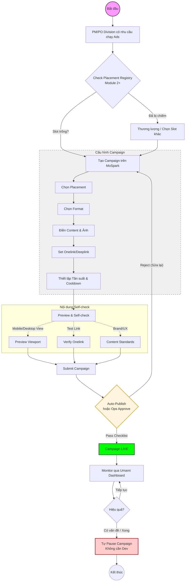

# 📄 Ads Manager Brd
MoSpark Ads Manager - Web-to-App Campaign Platform

> - **Project:** MoSpark Web Platform
> - **Main URL:** momo.vn/mospark
> - **Division:** GPD (Growth Product Division)
> - **Use Case:** Out-App Traffic
> - **Product:** Web Growth Platform
> - **SEO/GEO Project ID:** `mospark-ads-manager`
> - **Owner:** GPD - Out-App Traffic (Bảo)
> - **Governance:** Văn Hiến (Web Product Lead)
> - **Version:** 3.0 · April 2026
> - **Status:** Active - Division/Product Metadata
>
> - **SEO Score:** N/A | **Traffic:** N/A | **W2A:** N/A | **Last updated:** 2026-05-18

---

## 1. Executive Summary

### Situation

MoSpark là nền tảng AI-powered Web App/Content của MoMo, đang vận hành và quản lý toàn bộ hệ sinh thái trang momo.vn - từ Mini Web Use Case (bảo hiểm, BNPL, vay), Blog/News, FAQ, đến Landing Page và Partner Page. MoSpark cho phép PM/PO tự vận hành mà không phụ thuộc Dev - đây là triết lý cốt lõi của nền tảng.

Trong hệ sinh thái đó, **Ads Manager** là module phụ trách một bài toán cụ thể: **phân phối promotional content đúng lúc, đúng trang, đúng người** - để chuyển đổi traffic đang có trên Web thành người dùng App hoặc kích hoạt lại hành vi. Đây là mắt xích còn thiếu trong pipeline Web-to-App của MoMo.

MoMo đang vận hành **Athena** trong App - nền tảng Ads với đầy đủ Campaign/AdGroup/Ad, Segment, Bidding, Tracking. Ads Manager trên MoSpark học hỏi tư duy đó nhưng được thiết kế riêng cho đặc thù Web: không có user identity sâu, nhưng có intent trang rõ ràng qua URL.

### Complication

Thực tế đã chứng minh nhu cầu: trước khi có Ads Manager, MoMo đã thử hardcode Popup và Balloon tại một số trang. Data từ 9 ngày đầu cho thấy 201,300 impression nhưng CTR chỉ 2.4% và Dismiss Rate lên đến 78.3%. Nguyên nhân không phải vì format sai - mà vì thiếu context matching: cùng một message bắn ra trên nhiều trang có intent hoàn toàn khác nhau.

Vấn đề sâu hơn là về mô hình vận hành. Khi Web MoMo scale với nhiều trang và nhiều Division muốn chạy Ads đồng thời, cơ chế hardcode thủ công sẽ tạo ra conflict placement, thiếu visibility tổng thể, không có measurement chuẩn, và Dev phải tham gia vào mỗi campaign - trái với triết lý của MoSpark.

### Resolution

Ads Manager được phát triển theo ba module kế tiếp nhau, từ công cụ vận hành đơn lẻ tiến đến nền tảng quản lý Traffic Inventory và phân phối Ads cho toàn bộ Web MoMo:

- **Module 1 (Production):** Balloon Ads, Popup, Context-based targeting theo URL, A/B test (LP variant + Ad creative) - đang pilot với User Growth team.
- **Module 2:** Traffic Inventory Management - quản lý toàn bộ ad placements trên Mini Web theo URL/segment, cho phép nhiều Division vận hành song song mà không conflict.
- **Module 3:** Ads Distribution Platform - PM/PO các Division/Center tự cấu hình, phân phối và đo lường Ads trên toàn hệ thống Web MoMo, tích hợp Umami dashboard.

---

## 2. Vị Trí Trong MoSpark

### 2.1. Vai trò của Ads Manager trong hệ sinh thái MoSpark

MoSpark là nền tảng Growth OS của MoMo Web nhằm mục đích tối ưu hóa nội dung và tăng trưởng người dùng. Trong hệ sinh thái MoSpark, **Ads Manager** đóng vai trò là động cơ khai thác hiệu quả toàn bộ traffic trên Web (bao gồm các trang Landing Page, Blog bài viết, FAQ, Merchant Page) để chuyển đổi thành hành vi mở App hoặc cài đặt App (Web-to-App). 

Module này hoạt động như một lớp phân phối thông minh, giúp PM/PO tận dụng tối đa lượng lưu lượng truy cập hiện có nhằm thúc đẩy chuyển đổi trực tiếp sang App (W2A) mà không cần sự can thiệp của đội ngũ lập trình (Dev).

### 2.2. Mối quan hệ với MoSpark Content Architecture

MoSpark quản lý 7 loại trang chiến lược trên momo.vn. Ads Manager có thể phủ lên toàn bộ hệ sinh thái này:

| URL Pattern | Loại trang | Vai trò của Ads Manager | Placement Type |
|---|---|---|---|
| `/{mini-web}` | Mini Web Use Case | Intent transactional cao | Use Case-specific |
| `/{mini-web}*` | Advanced Mini Web | Traffic lớn, multi sub-page | Use Case-specific |
| `/` | Trang chủ | High traffic, awareness | **Shared-source (GPD)** |
| `/doi-tac*` | Merchant Page | Cross-sell opportunity | **Shared-source (GPD)** |
| `/blog*` | Growth Articles | Awareness và soft nudge | Mixed (Global/UC) |
| `/tin-tuc*` | Communications | Awareness | Shared-source (GPD) |
| `/hoi-dap*` | Help Center | Low interrupt | Shared-source (GPD) |
| `/huong-dan*` | Interactive Guides | Low interrupt | Shared-source (GPD) |
| `/about-us*` | Corporate Pages | Brand trust | Shared-source (GPD) |

### 2.3. Quan hệ với Athena (App Ads)

Ads Manager trên MoSpark và Athena trên App là hai hệ thống độc lập, học hỏi tư duy từ nhau nhưng không tích hợp:

| Chiều | Athena (App) | Ads Manager (Web/MoSpark) |
|---|---|---|
| User identity | Đã định danh, có lịch sử giao dịch | 100% Anonymous (Web hiện tại chưa có tính năng Login) |
| Targeting chính | Audience Segment (behavioral) | URL context của trang (intent-based) |
| Placement unit | Screen trong App | URL/Segment trên Web |
| Bidding | Có - 3 chiến lược | Không - priority-based |

---

## 3. Bài Toán Cần Giải

### 3.1. North Star Metric

Ads Manager đóng góp trực tiếp vào hai North Star Metric của MoMo Web:

**New User Acquisition:**
```
Web Traffic → [Ads Manager] → Click CTA → Onelink → Install → Register → New User
```

**MAU Uplift:**
```
Existing user trên Web → [Ads Manager] → Reactivation message → App Open → MAU
```

### 3.2. Hai mục tiêu phân phối

| Objective | Định nghĩa | KPI | Loại trang phù hợp |
|---|---|---|---|
| **Traffic** | Dẫn user từ Web vào App - click CTA, mở Onelink | CTR, App Open Rate, Install | Mini Web Use Case, Landing Page |
| **Awareness** | Tăng nhận diện tính năng MoMo với user đang browse | Impression, Reach | Blog, Utility Tool, Partner Page |

### 3.3. JTBD - Những việc cần được hoàn thành

**User trên Web - Ad Format:**

| Job | Context | Ads Manager serve như thế nào |
|---|---|---|
| "Biết MoMo có giải pháp cho việc tôi đang làm" | Đang xem trang bảo hiểm, BNPL, vay | Popup/Balloon - benefit cụ thể, CTA trực tiếp |
| "Nhớ đến MoMo khi đang đọc nội dung" | Đang đọc blog tài chính | Balloon nhẹ, Inline Banner - không interrupt |
| "Tìm ưu đãi để quyết định dùng MoMo" | Đang xem Landing Page khuyến mãi | Popup gắn Promotion Campaign |

**User trên Web - Widget JTBD:**

| Job | Context | Widget serve như thế nào |
|---|---|---|
| "Tôi muốn biết khoản vay sẽ trả bao nhiêu mỗi tháng" | Đang đọc bài so sánh gói vay | Loan Calculator - nhập số tiền/kỳ hạn → output ngay lập tức |
| "Phí bảo hiểm xe tôi là bao nhiêu" | Đang tìm hiểu BH xe máy/ô tô | Insurance Calculator - nhập thông tin xe → phí ước tính |
| "Kiểm tra xe tôi có bị phạt nguội không" | Đang đọc bài về giao thông | Phạt Nguội Lookup - nhập biển số → danh sách vi phạm + tổng tiền |
| "Điểm tín dụng CIC của tôi là bao nhiêu" | Đang tìm hiểu điều kiện vay | CIC Score Lookup - nhập CCCD → điểm + xếp loại |

**User trên Web - Component JTBD:**

| Job | Context | Component serve như thế nào |
|---|---|---|
| "Nộp phạt nguội ngay sau khi tra cứu xong - không muốn mở App" | Vừa dùng Lookup Widget thấy có vi phạm | Nộp Phạt Component - multi-step inline: chọn khoản → xác nhận → thanh toán |
| "Mua BH xe ngay khi đã biết phí - không cần thoát trang" | Calculator Widget vừa cho kết quả | Purchase Component - chọn gói → điền thông tin xe → thanh toán inline |
| "Đặt vé xem phim ngay khi đang xem lịch chiếu" | Đang trên trang Cinema Use Case | Booking Component - chọn phim/suất/ghế → xác nhận → thanh toán inline |

**PM/PO Division:**

| Job | Context | Ads Manager serve như thế nào |
|---|---|---|
| "Tự chạy Ads trên trang của Division mà không cần Dev" | Muốn go-live campaign hôm nay | Self-service campaign management trên MoSpark |
| "Biết inventory nào có sẵn trên Web để đặt Ads" | Muốn biết slot trống/đã chiếm trên từng trang | Placement Registry - Module 2 |
| "Biết Ads của mình hiệu quả không để tối ưu" | Sau khi campaign chạy 1 tuần | Umami dashboard per Division - Module 3 |

---

## 4. Kiến Trúc & Phased Rollout Strategy

Thay vì triển khai đồng loạt, Ads Manager được chia thành 3 Phase độc lập nhằm giảm tải cho Dev và ưu tiên chứng minh tỷ lệ chuyển đổi (W2A) sớm nhất.

### 4.1. Tổng quan Phased Rollout

```mermaid
graph TD
    %% Phase 1
    subgraph P1 ["Phase 1 (MVP): Core Operations (Q2/2026)"]
        direction TB
        P1_Goal["Mục tiêu: Chứng minh tỷ lệ chuyển đổi W2A ở quy mô nhỏ"]
        P1_Deliverables["Deliverables chính:
- Thư viện Native Widget & CMS Shortcode
- Balloon Ads & Inline Banners
- Context-based URL Targeting
- Tích hợp Appsflyer/Onelink
- Tần suất & Preview System"]
        P1_Gate["Success Gate 1:
- Zero P1 bug trong 2 tuần
- CTR trung bình >= 4% (3+ campaigns)
- Đã verify tracking click -> install"]
        P1_Goal --> P1_Deliverables --> P1_Gate
    end

    %% Phase 2
    subgraph P2 ["Phase 2: Traffic Inventory Management (Q3/2026)"]
        direction TB
        P2_Goal["Mục tiêu: Quản lý ad slot tập trung & Xử lý conflict"]
        P2_Deliverables["Deliverables chính:
- Placement Registry (Use Case vs Shared Placements)
- Conflict Resolution Logic & Global Guardrails
- Inventory Dashboard & Conflict Alerts
- Tích hợp hiển thị Reach Estimate trong Creation Flow"]
        P2_Gate["Success Gate 2:
- Hoàn thiện Registry cho toàn bộ Mini Web
- Conflict Resolution hoạt động chuẩn xác
- Ít nhất 2 Division pilot thành công"]
        P2_Goal --> P2_Deliverables --> P2_Gate
    end

    %% Phase 3
    subgraph P3 ["Phase 3: Advanced Automation & Retargeting (Q4/2026)"]
        direction TB
        P3_Goal["Mục tiêu: Multi-tenant tự vận hành & Bám đuổi ẩn danh"]
        P3_Deliverables["Deliverables chính:
- Phân quyền Multi-tenant (Admin vs Operator)
- Extended Formats (Sticky Bar, Advanced Inline)
- On-site Retargeting (Local Storage / 1st Party Cookie)
- Dashboard Umami riêng cho từng Division"]
        P3_Goal --> P3_Deliverables
    end

    %% Flow transitions
    P1_Gate -->|"Scale-up"| P2_Goal
    P2_Gate -->|"Advanced Automation"| P3_Goal

    %% Styling for better aesthetics
    style P1 fill:#f9fafd,stroke:#3b82f6,stroke-width:2px
    style P2 fill:#fafdf9,stroke:#10b981,stroke-width:2px
    style P3 fill:#fffdf5,stroke:#f59e0b,stroke-width:2px

    style P1_Goal fill:#eff6ff,stroke:#60a5fa,stroke-width:1px
    style P2_Goal fill:#ecfdf5,stroke:#34d399,stroke-width:1px
    style P3_Goal fill:#fffbeb,stroke:#fbbf24,stroke-width:1px

    style P1_Gate fill:#fef2f2,stroke:#f87171,stroke-width:1px
    style P2_Gate fill:#fef2f2,stroke:#f87171,stroke-width:1px
```




### 4.2. Phase 1 (MVP) - Core Operations (Q2/2026)

**Trạng thái:** V1.2 - Chuyển dịch trọng tâm từ Popup sang Native Component (Widget) để phù hợp định hướng PLG.

**Năng lực hiện có & Định hướng MVP:**
- **Native Product Component (Widget):** Nhúng trực tiếp các khối tính năng (Tra cứu phạt nguội, Tra cứu BHYT, Tính lãi suất vay) vào giữa bài viết Blog thông qua CMS Shortcode (VD: `[widget:phat-nguoi]`). Đây là định dạng chủ lực cho Web-to-App.
- Balloon Ads (deployed 01/04/2026) & Inline Banner.
- *Lưu ý:* Hạn chế tối đa sử dụng Popup (chỉ dùng cho Landing page khuyến mãi) để bảo vệ trải nghiệm UX và điểm SEO.
- Promotion Scheme gắn kèm gift card / voucher bundle.
- Context-based targeting theo URL hoặc tiêm Shortcode trực tiếp.
- Frequency control & Preview system.

**Roadmap đã xác định trong Module 1:**
- Context-based targeting nâng cao theo URL segment
- Tích hợp Appsflyer/Onelink để đo attribution click → install

**Giới hạn cần Module 2 giải quyết:**
- Không có visibility về toàn bộ placement đang dùng trên Web
- Không có cơ chế resolve conflict khi nhiều campaign match cùng URL
- Không có phân quyền theo Division - tất cả chung một pool

### 4.3. Phase 2 - Traffic Inventory Management (Q3/2026)

**Mục tiêu:** Biến URL và segment trên Web MoMo thành "kho inventory" có thể quản lý, phân bổ và theo dõi - tạo nền cho nhiều Division vận hành song song mà không conflict.

**Placement Registry:**

Toàn bộ ad slots trên Web MoMo được đăng ký vào registry tập trung, phân thành 2 loại:
1.  **Use Case Placements:** Thuộc sở hữu của từng Division (Insurance, BNPL, etc.). Chỉ hiện Ads liên quan đến Use Case đó.
2.  **Shared-source Placements (GPD):** Các slot trên trang dùng chung (Homepage, Merchant Page, Category...). GPD quản lý việc phân bổ traffic cho các Division dựa trên độ ưu tiên cấp công ty.

Mỗi placement xác định: URL pattern áp dụng, format được phép, Division/Team có quyền ưu tiên, số lượng Ad active tối đa cùng lúc.

**URL/Segment/Use Case Mapping:**

PM/PO có thể nhìn thấy bản đồ tổng thể - trang nào thuộc Use Case nào, placement nào đang được sử dụng, slot nào còn trống trong "kho" Shared-source của GPD.

**Conflict Resolution:**

Khi nhiều campaign match cùng một placement, hệ thống resolve theo thứ tự: 
- Đối với Shared-source: GPD Priority Level → Campaign start_at.
- Đối với Use Case-specific: Division ownership → Priority Level.
Global guardrail cứng: tối đa 1 Popup active per session, tối đa 2 Balloon cùng lúc.

**Inventory Dashboard:**

Admin view cho Web Platform team - toàn bộ placement và trạng thái sử dụng, campaign đang chạy ở đâu, conflict alert khi phát hiện tranh chấp.

### 4.4. Phase 3 - Advanced Automation & Retargeting (Q4/2026)

**Mục tiêu:** Mở platform cho PM/PO các Division/Center tự vận hành - đây là bước hoàn chỉnh tầm nhìn "PM/PO tự vận hành không phụ thuộc Dev" của MoSpark, mở rộng từ Landing Page Builder sang Ads.

**Multi-tenant per Division:**

| Role | Quyền hạn |
|---|---|
| Platform Admin (Web Platform) | Quản lý Placement Registry, resolve conflict, xem toàn bộ hệ thống |
| Division Operator (PM/PO) | Tạo và vận hành campaign trong phạm vi placement của Division mình |

**Extended Formats:**

Module 3 enable thêm Inline Banner (phù hợp Blog/News) và Sticky Bar (phù hợp Landing Page) - bổ sung cho 4 template đã có từ Module 1.

**Umami Dashboard per Division:**

Mỗi Division có dashboard riêng - Campaign performance (Impression, Click, CTR, Dismiss Rate), top performing placements, comparison theo thời gian. Umami chạy song song với GA4 và Appsflyer, không thay thế.

---

## 5. Ad Formats & Placement Strategy

### 5.1. Format theo loại trang

Thay vì targeting theo Screen (như Athena), Ads Manager targeting theo loại trang. Format phải phù hợp với intent:

| Format | Mức interrupt | Phù hợp với | Objective |
|---|---|---|---|
| **Widget: Calculator** | Rất Thấp - Utility tool, không interrupt | Blog Article, Mini Web Use Case | Intent Capture + PLG (anti-LLM moat) |
| **Widget: Lookup** | Rất Thấp - Utility tool, không interrupt | Mini Web Use Case, Blog | Intent Capture + PLG (anti-LLM moat) |
| **Component: Purchase Flow** | Thấp - Inline form trong trang, không redirect | Mini Web Use Case (BH, Phạt Nguội) | Inline Transaction (mua, nộp phạt) |
| **Component: Booking Flow** | Thấp - Inline form trong trang, không redirect | Cinema, Bus, eSIM, OTA | Inline Transaction (đặt chỗ, đặt vé) |
| **Balloon Standard / Float Icon** | Thấp - góc màn hình / icon nhỏ | Tất cả trang | Traffic + Awareness |
| **Inline Banner** | Trung bình - trong content | Blog/News | Awareness |
| **Sticky Bar** | Trung bình - dính đầu/cuối | Landing Page | Traffic |
| **Popup / Bottom Sheet** | Cao - chiếm viewport | *Chỉ dùng cho Landing Page khuyến mãi* | Traffic (Hạn chế dùng) |

### 5.2. Nguyên tắc Format-Page fit

- Popup chỉ dùng khi intent của trang đủ cao để justify interrupt - không dùng trên Blog hay Utility Tool
- Trang `/hoi-dap*` và `/huong-dan*` ưu tiên không đặt Ads interrupt - user đang cần hỗ trợ
- Tối đa 1 Popup active per session - global guardrail không thể override

### 5.3. Targeting (Context & On-site Retargeting)

**Phase hiện tại (Module 1):**
- **URL Context:** Ad chỉ hiện/ẩn dựa trên URL pattern của trang hiện hành.
- **Device type:** Phân biệt Mobile/Desktop (để định tuyến UI/UX phù hợp).

**Phase tiếp theo (Module 2-3):**
- **Placement-based targeting:** Chọn slot từ Registry thay vì tự nhập URL pattern.
- **On-site Retargeting (Behavior-based):** Sử dụng Local Storage / 1st Party Cookie để lưu vết Intent (Ví dụ: User từng vào `/vay-nhanh` nhưng chưa tải app). Khi user truy cập các trang dùng chung (Homepage, Blog), hệ thống tái kích hoạt Widget Vay Nhanh hoặc Sticky Bar nhắc nhở. Tính năng này giúp bám đuổi hiệu quả mà **không cần User phải Log In**, đảm bảo 100% ẩn danh và tuân thủ Data Privacy.

### 5.4. Chiến lược Cross-Services & Cross-Traffic bằng Native Widget / Component

Bên cạnh các định dạng hiển thị quảng cáo truyền thống (Balloon, Popup), MoSpark Ads Manager định nghĩa **Native Widget (Product Component)** là thành phần chiến lược phục vụ bài toán **phân phối chéo dịch vụ (Cross-Services)** và **điều hướng lưu lượng chéo (Cross-Traffic)**:

1. **Cơ chế Cross-Services (Chuyển đổi chéo dịch vụ):**
   - Đưa các công cụ tương tác nhỏ, có giá trị tiện ích cao (Utility Tools) vào các trang thuộc Use Case khác để thu hút người dùng một cách tự nhiên.
   - *Ví dụ:* Sau khi người dùng hoàn thành tra cứu Phạt Nguội (trang Use Case Phạt Nguội), Ads Manager tự động phân phối **Widget Đăng ký Bảo hiểm Xe máy / Ô tô** hoặc **Widget Vay tiêu dùng** ngay bên dưới kết quả.

2. **Cơ chế Cross-Traffic (Điều hướng chéo traffic):**
   - Tận dụng lưu lượng truy cập lớn của các trang tin tức/blog hoặc các trang dùng chung (Homepage, Merchant Page) để điều hướng dòng traffic sang các Use Case chuyển đổi cao thông qua các Widget nhúng.
   - *Ví dụ:* Người dùng đang đọc bài viết Blog về *"Kinh nghiệm mua xe máy cũ"* ➔ Ads Manager tự động phát hiện ngữ cảnh và chèn **Widget Tra cứu Phí Bảo hiểm Xe máy** hoặc **Widget Ước tính khoản vay mua xe** trực tiếp vào giữa bài viết (thông qua Shortcode động).

3. **Lợi ích chiến lược:**
   - **Zero-Interrupt Experience:** Native Widget hòa nhập hoàn hảo vào nội dung trang (Native Ad), nâng cao CTR mà không gây khó chịu hay làm suy giảm các chỉ số SEO/Core Web Vitals.
   - **Contextual Matching:** Match chính xác ý định (Intent) của người dùng tại thời điểm đọc hoặc tương tác, biến lưu lượng truy cập vãng lai thành cơ hội chuyển đổi trực tiếp Web-to-App.

### 5.5. Taxonomy: Ad Format - Widget - Component

Ads Manager phân phối 3 loại entity khác nhau về chiều sâu tương tác và mục tiêu chuyển đổi. Đây là framework phân loại chuẩn để tránh nhầm lẫn khi spec và build:

| Loại | Định nghĩa | Chiều sâu tương tác | Output cho User | Mục tiêu chính |
|---|---|---|---|---|
| **Ad Format** | Promotional message - user xem và click | Passive (view + click 1 bước) | Thông điệp + CTA dẫn sang App | Awareness / W2A Traffic |
| **Widget** | Utility tool - user nhập input, nhận output ngay | Interactive 1 bước (nhập → kết quả) | Kết quả tính toán hoặc tra cứu cá nhân hóa | Intent Capture + PLG (anti-LLM moat) |
| **Component** | Interactive flow - user thực hiện giao dịch multi-step | Interactive nhiều bước (nhập → preview → xác nhận → hoàn tất) | Giao dịch hoàn tất (hoặc handoff sang App) | Inline Transaction - giảm friction |

**Nguyên tắc kiến trúc không thể bỏ qua:**

- Widget và Component là **PLG Tools độc lập** - tồn tại và hoạt động không phụ thuộc vào Ads Manager.
- Ads Manager đóng vai trò **Distribution Layer** duy nhất: quyết định Widget/Component nào được nhúng vào trang nào, vào thời điểm nào, theo context nào - thông qua CMS Shortcode hoặc Placement Registry.
- Dev build Widget/Component Library. Ads Manager quản lý việc phân phối. Hai việc này tách biệt rõ ràng.

### 5.6. Widget Library (PLG Tool - Passive Interaction)

Widget là các utility tool độc lập. User nhập input, Widget trả về kết quả ngay lập tức trên trang - không cần mở App. Widget tạo ra **unique data không scrape được từ LLM** (kết quả cá nhân hóa theo input cụ thể của user), đây là anti-LLM moat và là nguồn tín hiệu intent mạnh nhất để phân phối tiếp theo.

**Nguyên tắc Widget:**

- Mỗi Widget phải cung cấp giá trị tiện ích thực sự trước khi CTA xuất hiện - không phải "cổng bắt buộc" để xem thông tin.
- Widget có thể đứng độc lập trên trang Mini Web Use Case hoặc được Ads Manager nhúng vào Blog/Trang dùng chung qua Shortcode.
- Output phải unique (cá nhân hóa theo input của user) - không phải thông tin tĩnh có thể tìm thấy ở nơi khác.

#### Calculator Widgets

| Widget | Use Case | Input | Output | W2A / Next Action |
|---|---|---|---|---|
| Loan Calculator | Vay Nhanh | Số tiền vay, kỳ hạn | Lãi suất ước tính, số tiền trả/tháng, tổng chi phí | "Vay ngay" → Onelink |
| Insurance Premium Calculator | BH xe máy / BH ô tô | Loại xe, năm sản xuất, gói BH muốn mua | Phí bảo hiểm ước tính | "Mua ngay" → Purchase Component hoặc App |
| BNPL Calculator | Ví Trả Sau | Giá trị đơn hàng, số kỳ trả góp | Số tiền trả mỗi kỳ, tổng chi phí | "Dùng Ví Trả Sau" → App |
| Savings Calculator | Gửi tiết kiệm | Số tiền gốc, kỳ hạn, loại hình tiết kiệm | Lãi dự kiến, tổng nhận về khi đáo hạn | "Gửi tiết kiệm ngay" → App |

#### Lookup Widgets

| Widget | Use Case | Input | Output | W2A / Next Action |
|---|---|---|---|---|
| Phạt Nguội Lookup | Phạt Nguội | Biển số xe | Danh sách vi phạm, tổng tiền phạt | "Nộp phạt qua MoMo" → Purchase Component |
| BHYT Lookup | BHXM / BHYT | Số CCCD hoặc mã BHYT | Thông tin BH, ngày hết hạn, nơi đăng ký KCB | "Gia hạn BHYT" → App |
| CIC Score Lookup | Tín dụng / Vay Nhanh | Số CCCD | Điểm tín dụng CIC, xếp loại | "Xem vay được bao nhiêu" → Loan Calculator hoặc App |
| Giá Vàng Lookup | Utility / Thanh toán | - (auto refresh) | Bảng giá vàng real-time theo nhà cung cấp | "Giao dịch vàng qua MoMo" → App |

### 5.7. Component Library (PLG Tool - Active Transaction Flow)

Component là các interactive flow multi-step cho phép user thực hiện giao dịch **ngay trên Web** - không redirect sang App giữa chừng. Component serve bài toán Web-first experience: giảm friction, tăng completion rate cho những Use Case không bắt buộc KYC đầy đủ.

**Nguyên tắc Component (Inline Web Transaction):**

Component thực hiện toàn bộ flow trong Web. Authentication và payment được xử lý inline:
- Nếu user **chưa có tài khoản MoMo**: Component collect thông tin giao dịch đầy đủ, sau đó trigger Onelink deeplink vào đúng step trong App để authenticate và hoàn tất.
- Nếu user **đã xác định là MoMo user** (qua Onelink device check): Component trigger deeplink trực tiếp vào bước xác nhận trong App, bỏ qua các step nhập liệu.
- Mục tiêu tối thượng: **Zero redundant input** - user không phải nhập lại thông tin đã điền trong Component.

#### Purchase Flow Components

| Component | Use Case | Luồng trong Web | Điều kiện handoff sang App |
|---|---|---|---|
| Nộp Phạt Nguội | Phạt Nguội | Lookup kết quả → Chọn khoản phạt cần nộp → Preview tổng tiền → Xác nhận → Thanh toán | Auth + payment qua App nếu user chưa đăng nhập |
| Mua BH Xe Máy | BH xe máy | Chọn gói → Nhập thông tin xe và chủ xe → Preview chi phí và coverage → Xác nhận → Thanh toán | Auth + payment qua App |
| Mua BH Ô Tô | BH ô tô vật chất | Chọn loại BH → Nhập thông tin xe → Quote → Review coverage → Xác nhận → Thanh toán | Auth + payment qua App |
| Mua BH Y Tế | BHYT | Chọn gói BH → Nhập thông tin người được BH → Review coverage và điều khoản → Thanh toán | Auth + payment qua App |
| Nạp Điện Thoại | Telecom | Nhập số điện thoại → Chọn mệnh giá → Xác nhận → Thanh toán | Auth + payment qua App |

#### Booking Flow Components

| Component | Use Case | Luồng trong Web | Điều kiện handoff sang App |
|---|---|---|---|
| Đặt Vé Cinema | Cinema | Chọn phim → Chọn rạp và suất chiếu → Chọn ghế → Nhập thông tin liên hệ → Xác nhận → Thanh toán | Auth + payment qua App |
| Đặt Vé Bus | Bus / OTA | Chọn tuyến → Chọn ngày/giờ → Chọn ghế → Nhập thông tin hành khách → Xác nhận → Thanh toán | Auth + payment qua App |

**Relationship giữa Widget và Component - Chuỗi tương tác:**

Widget và Component thường hoạt động theo chuỗi liên tiếp trong một trang. Widget tạo intent, Component chốt giao dịch:

```
[Lookup Widget] → Kết quả cá nhân hóa → [Purchase Component] → Giao dịch hoàn tất
Ví dụ: Tra cứu phạt nguội → Danh sách vi phạm → Nộp phạt ngay (inline)

[Calculator Widget] → Ước tính chi phí → [CTA] → [Purchase Component hoặc App]
Ví dụ: Tính phí BH xe → Phí dự kiến → Mua ngay (inline Component)
```

Ads Manager quản lý chuỗi này qua **Shortcode chain** trong CMS: `[widget:phat-nguoi] [component:nop-phat]` - render theo thứ tự, dữ liệu output của Widget có thể được pre-fill vào Component.

---

## 6. Way of Working

### 6.1. Workflow vận hành campaign



### 6.2. Phân vai rõ ràng

| Người | Vai trò trong Ads Manager |
|---|---|
| **Bảo (Platform Admin)** | Product direction, Quản lý Placement Registry, duyệt campaign (nếu cần), enforce "no hardcode" policy |
| **Thuận** | Owner kỹ thuật, tập trung maintain platform và build Widget Library (Shortcode) |
| **Văn Hiến** | Observe, advise về Content Standards và SEO/GEO impact |
| **PM/PO Division** | Tạo campaign, self-check, submit |

**Nguyên tắc MVP (Dưới 50 Campaigns):**
- Giai đoạn MVP, ưu tiên cơ chế **Auto-Publish** sau khi PM/PO pass Content Standards Checklist để giảm rào cản vận hành. 
- Tech Lead (Thuận) được giải phóng khỏi khâu duyệt Campaign để tập trung phát triển Product Component (Widget). Nếu có conflict, Platform Admin (Bảo) sẽ xử lý.
- Hiến observe health của hệ thống Ads về góc độ SEO/GEO: đảm bảo Ads không ảnh hưởng negative đến crawl và UX.
- Mọi campaign phải đi qua Ads Manager - không hardcode vào code.
- PM/PO Division có thể pause campaign của mình bất kỳ lúc nào mà không cần Dev.

### 6.3. Content Standards (PM/PO tự check trước khi submit)

PM/PO tự review trước khi submit để tăng chất lượng và giảm vòng lặp:

| Hạng mục | Câu hỏi tự kiểm tra |
|---|---|
| Benefit cụ thể | Message có nêu lợi ích rõ ràng, có thể verify không? |
| CTA khớp destination | CTA text có khớp với trang đích sau khi click không? |
| Onelink hoạt động | Đã test deeplink trước khi submit chưa? |
| Format phù hợp | Format có phù hợp với loại trang đang nhắm không? |
| Điều kiện tài chính | Nếu có số liệu tài chính, đã verify accuracy chưa? |
| Image spec | Ảnh đúng kích thước theo format spec chưa? |

### 6.4. A/B Testing trên Landing Page Builder

A/B Testing là feature **owned hoàn toàn bởi Ads Manager**. Landing Page Builder chỉ có trách nhiệm tạo các trang LP - toàn bộ test logic (split, distribute, track, winner) nằm trong Ads Manager.

#### Architecture & Ownership

| Module | Trách nhiệm |
|---|---|
| **Landing Page Builder** | Tạo LP variants (A/B) và publish lên URL riêng biệt - không handle test logic |
| **Ads Manager** | Toàn bộ test logic: nhận variant URLs, cấu hình split ratio, phân phối traffic, quản lý vòng đời test |
| **Umami** | Đo lường per variant: Pageview, CTR, W2A, Scroll depth, Dismiss rate |
| **PM/PO** | Review data, declare winner thủ công trong Ads Manager |

#### 3 Loại A/B Test

| Type | Mô tả | Khi nào dùng |
|---|---|---|
| **LP Variant** | 2 phiên bản Landing Page khác nhau hoàn toàn - layout, copy, CTA, thứ tự module | Test major structural change - high effort |
| **Ad Creative** | Cùng 1 LP nhưng Balloon/Popup dẫn vào LP có 2 creative khác nhau (ảnh, headline, CTA text) | Test message/creative trước khi build LP mới - low effort |
| **CTA/Copy trên LP** | Cùng 1 LP layout, chỉ thay đổi CTA text hoặc hero headline | Test micro copy - low effort |

> **Phân biệt input:** LP Variant và CTA/Copy test cần PM tạo trang trước trong LP Builder, sau đó mang URL vào Ads Manager để setup test. Ad Creative test không cần LP Builder - cấu hình toàn bộ trong Ads Manager.

#### Workflow A/B Test

| Bước | Nơi thực hiện | Hành động |
|---|---|---|
| 1 | LP Builder | PM tạo Variant A (LP gốc) và Variant B (LP thay đổi), publish lên 2 URL riêng |
| 2 | Ads Manager | PM tạo A/B Test mới: nhập URL Variant A + B |
| 3 | Ads Manager | PM cấu hình split ratio (default 50/50, có thể adjust - ví dụ 80/20 để giảm risk) |
| 4 | Ads Manager | PM set thời gian chạy test, activate |
| 5 | Umami | Auto-track per variant: pageview, CTR, W2A, scroll depth |
| 6 | Ads Manager | PM xem performance dashboard per variant sau tối thiểu 7 ngày |
| 7 | Ads Manager | PM declare winner - pause Variant thua, promote Variant thắng làm primary |
| 8 | LP Builder | Archive Variant thua - không delete, giữ để reference |

#### Winner Declaration - Manual (PM)

Không có auto-winner detection. PM tự phán quyết trong Ads Manager dựa trên:

| Metric | Priority | Ghi chú |
|---|---|---|
| CTR | Primary | Click vào Onelink / App action |
| W2A Rate | Secondary | Install → Register attributed từ Landing Page |
| Dismiss Rate | Tertiary | Nếu test có Balloon/Popup dẫn vào LP |

**Quy tắc vận hành:**
- Chạy tối thiểu **7 ngày** trước khi review - ít hơn thì data quá ít để conclude
- Không thay đổi nội dung bất kỳ Variant nào trong khi test đang chạy - nếu muốn change phải stop test trong Ads Manager, tạo test mới
- Không có minimum sample size bắt buộc - PM judgment call nhưng phải note lý do khi declare trong Ads Manager

#### Scope Giới Hạn (Phase 1)

A/B Testing chỉ áp dụng cho **Landing Page** trong Phase 1:
- Không A/B test Hub/Spoke page của Mini Web Use Case
- Không A/B test Blog article
- Homepage không A/B test - shared asset, thay đổi có impact rộng

---

## 7. Phạm Vi & Ưu Tiên

### 7.1. Ưu tiên triển khai theo loại trang

| Priority | Use Case | Lý do |
|---|---|---|
| P0 | Mini Web Use Case (bảo hiểm, BNPL, vay, phạt nguội) | Intent transactional cao nhất, gần điểm convert |
| P0 | Landing Page khuyến mãi | User đang tìm ưu đãi - highly receptive |
| P1 | Blog/News tài chính | Traffic lớn, cơ hội Awareness |
| P1 | Partner Page (/doi-tac) | Cross-sell opportunity |
| P2 | Help Center, Guide | Chỉ Awareness nhẹ - không interrupt flow |

### 7.2. Out of Scope

- Trang chính sách, điều khoản, giới thiệu công ty
- Trang lỗi (404, 500)
- Trang trong checkout / payment flow đang active
- Tích hợp với Athena dưới bất kỳ hình thức nào

---

## 8. Tác Động Đến North Star Metrics

### 8.1. Contribution model

Ads Manager không tạo ra traffic mới - nó khai thác traffic đang có để tăng conversion rate. Contribution vào NSM theo hai hướng:

**New User (Activation):**
User lần đầu vào web → thấy Ads đúng context → click → install app → register → **New User**

**MAU (Retention + Reactivation):**
User đã có app nhưng inactive → vào web tìm kiếm → thấy Ads nhắc nhở tính năng → mở app → **MAU**

### 8.2. KPI theo Module

**Module 1 - Baseline (đang đo):**

| Metric | Baseline (hardcode Phase 0) | Target |
|---|---|---|
| CTR (Traffic campaigns) | 2.4% | 4%+ |
| Dismiss Rate | 78.3% | Dưới 65% |
| Time-to-live | Nhiều ngày (phụ thuộc Dev) | Trong 1 ngày làm việc |

**Module 2 - Platform health:**

| Metric | Target |
|---|---|
| Placement conflict rate | Dưới 10% submissions |
| Zero hardcode violation | Không có campaign nào bypass platform |

**Module 3 - Business impact:**

| Metric | Target |
|---|---|
| Division self-service rate | 80%+ campaign do Division tự vận hành |
| Install attributed to Web Ads | TBD sau 1 tháng Module 3 data |
| MAU contribution từ Web channel | TBD - align với mục tiêu MAU 16M/2026 |

### 8.3. Success Gate per Module

**Gate vào Module 2:**
- Module 1 zero P1 bug trong 2 tuần liên tiếp
- CTR trung bình đạt 4%+ trên ít nhất 3 Traffic campaign
- Attribution chain click → install đã verify

**Gate vào Module 3:**
- Placement Registry đầy đủ cho toàn bộ Mini Web hiện tại
- Conflict resolution hoạt động đúng
- Ít nhất 2 Division đã pilot trong Module 2

---

## 9. Risks

| # | Rủi ro | Khả năng | Impact | Mitigation |
|---|---|---|---|---|
| R1 | PM/PO publish message sai trên trang tài chính - ảnh hưởng YMYL trust | Trung bình (nhiều Division, nhiều operator) | Cao | Content Standards checklist + Thuận review trước khi live |
| R2 | Placement conflict giữa các Division gây UX xấu hoặc Ads spam | Trung bình | Cao | Conflict detection tự động + Platform Admin resolve trước khi campaign live |
| R3 | Ads impact negative đến SEO - crawl, UX signal (bounce rate tăng) | Thấp | Cao | Hiến observe và alert nếu phát hiện signal bất thường; global guardrail chặt |
| R4 | Division không dùng platform - vẫn nhờ Dev hardcode | Trung bình | Cao | "No hardcode" policy enforce từ Bảo + training trước khi Division được access |
| R5 | Thuận overload khi phải build M2+M3 trong cùng 2026 | Cao | Cao | Break scope nhỏ per module; gate rõ ràng trước khi move module |

---

## 10. Lộ Trình & Action Plan

### Roadmap 2026

| Phase | Timeline | Mục tiêu trọng tâm |
|---|---|---|
| **Phase 1: MVP & Core Ops** | **Q2/2026** | **Thư viện Widget nhúng vào bài viết (Phạt Nguội, BHYT) thông qua CMS Shortcode.** URL Targeting cơ bản. Tích hợp Umami cơ bản. |
| **Phase 2: Inventory Mgmt** | **Q3/2026** | Placement Registry MVP + Xử lý Conflict tự động + Tích hợp hiển thị Reach Estimate. |
| **Phase 3: Retargeting & Multi-tenant** | **Q4/2026** | Kích hoạt On-site Retargeting (bám đuổi qua Local Storage) + Phân quyền Division tự chạy Ads. |

### Action Plan (Chỉ focus Phase 1)

Nhằm tránh "ngộp" resource cho Tech team, danh sách dưới đây chỉ tập trung vào các công việc cần giải quyết dứt điểm trong Phase 1 (Q2/2026). Các task của Phase 2 và 3 đã được đẩy vào Backlog.

| Deliverable | Owner | Mục đích |
|---|---|---|
| Widget Library v1 | Thuận | Hoàn thiện code cho Widget Phạt Nguội & BHYT (nhúng qua CMS Shortcode) |
| PM/PO Playbook | Bảo + Hiến advise | Workflow, format guide, content checklist cho Division operator |
| Umami - Reach Estimate | Thuận | Show Reach Estimate (28 days Visitor/Pageview) khi setup campaign |

### Backlog (Phase 2 & 3)
- PRD Phase 2 (Placement Registry schema, conflict logic, Reach Estimate integration)
- Permission Model (Role definition per Division cho Phase 3)
- On-site Retargeting Module (Local storage read/write mechanism)

### Lộ trình chi tiết theo Module
| Module / Hạng mục | Timeline | Trọng tâm chi tiết |
|---|---|---|
| **Native Widget & Shortcode** | **Q2/2026 (Trọng tâm MVP)** | **Thư viện Widget nhúng vào bài viết (Phạt Nguội, BHYT) thông qua CMS Shortcode.** |
| Module 1 | Done - Q2/2026 | Mở rộng pilot từ User Growth sang GPD (Ưu tiên Inline Banner & Widget) |
| Module 2 | Q2/2026 | Placement Registry MVP + Conflict Resolution + Inventory Dashboard |
| Module 3 | Q3/2026 | Multi-tenant, Umami Dashboard, Extended Formats |

---

**END OF DOCUMENT**

> Ads Manager là module trong MoSpark. Mọi thay đổi về scope sản phẩm và module mới cần align với Bảo (Project Lead) trước khi đưa vào P- **Master Strategy:** [[mospark_master]]

---

## Change Log
- **Tháng 5/2026 (v3.2):** Thêm Section 6.4 - A/B Testing trên Landing Page Builder. Ownership: Ads Manager owns toàn bộ test logic (split, distribute, track, winner). LP Builder chỉ tạo trang LP. 3 loại test: LP Variant, Ad Creative, CTA/Copy. Workflow 8 bước. Winner: manual PM declare trong Ads Manager. Scope giới hạn Phase 1: chỉ Landing Page, không test Hub/Spoke/Blog/Homepage.
- **Tháng 5/2026 (v3.1):**
  - Mở rộng scope phân phối: Ads Manager không chỉ distribute Ad Format mà còn distribute Widget (PLG Tool passive) và Component (PLG Tool active flow).
  - Thêm Taxonomy section (5.5): Định nghĩa rõ 3 loại entity - Ad Format / Widget / Component - theo chiều sâu tương tác và mục tiêu chuyển đổi. Nguyên tắc kiến trúc: Widget/Component là PLG Tools độc lập, Ads Manager chỉ là Distribution Layer.
  - Thêm Widget Library (5.6): Calculator Widgets (Loan, Insurance Premium, BNPL, Savings) và Lookup Widgets (Phạt Nguội, BHYT, CIC Score, Giá Vàng) - với input/output/W2A trigger cho từng Widget.
  - Thêm Component Library (5.7): Purchase Flow Components (Nộp Phạt, BH Xe Máy, BH Ô Tô, BH Y Tế, Nạp Điện) và Booking Flow Components (Cinema, Bus) - với nguyên tắc Inline Web Transaction và điều kiện handoff sang App.
  - Cập nhật JTBD (3.3): Thêm Widget JTBD và Component JTBD để phân biệt rõ nhu cầu của user theo từng loại entity.
  - Cập nhật Format table (5.1): Tách "Native Widget (Product Component)" thành 4 rows riêng biệt: Calculator, Lookup, Purchase Flow, Booking Flow.
  - Bổ sung concept Shortcode chain: `[widget:phat-nguoi] [component:nop-phat]` - Widget output có thể pre-fill vào Component input.
- **Tháng 5/2026 (v3.0):** 
  - Điều chỉnh định hướng MVP: Giảm ưu tiên Popup, tập trung vào **Native Product Component (Widget)**.
  - Cập nhật luồng vận hành (Workflow): Áp dụng cơ chế Auto-Publish cho PM/PO (scale <50 campaigns) để giảm nút thắt cổ chai ở Tech Lead.
  - Đẩy nhanh lộ trình (Roadmap): Native Widget được đôn lên làm trọng tâm của Q2/2026.
  - Tích hợp tính năng: Bổ sung On-site Retargeting (Local Storage) vào Phase 2-3 để bám đuổi người dùng ẩn danh.
  - Cập nhật sơ đồ (Diagram 4.1): Chuyển đổi từ định dạng text thô sang Mermaid diagram trực quan, thể hiện rõ mục tiêu, deliverables chính và Success Gates cho từng Phase.
  - Loại bỏ phần "Next Steps" để bảo toàn cấu trúc BRD tổng thể không bị pha lẫn kế hoạch hành động chi tiết (Action Plan).
  - Sửa lỗi hiển thị UI (Markdown Table): Bổ sung tiêu đề cột bị khuyết cho bảng lộ trình các Module thuộc phần Backlog giúp hiển thị bảng chính xác.
  - Tích hợp chiến lược Cross-Traffic & Cross-Services: Định nghĩa rõ vai trò của Native Widget/Component trong việc điều hướng chéo traffic và dịch vụ không gây gián đoạn UX.
  - Tinh lọc cấu trúc BRD: Loại bỏ hoàn toàn các Module và Dashboard không liên quan trực tiếp đến phân phối Ads (như SEO Inventory Dashboard và Use Case Performance Analytics độc lập) để tập trung 100% vào core Ads Manager.
