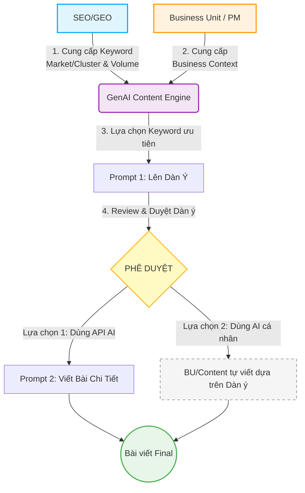
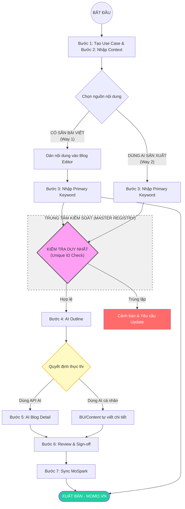
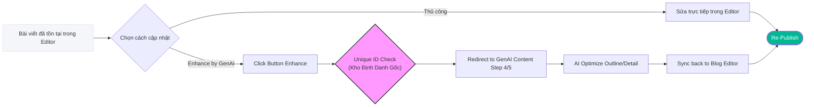

# 🤖 MoSpark GenAI Content Engine
Quy trình Sản xuất & Quản trị

> - **Project:** MoSpark Web Platform
> - **Main URL:** momo.vn/mospark
> - **Division:** GPD (Growth Product Division)
> - **Use Case:** Out-App Traffic
> - **Product:** Web Growth Platform
> - **SEO/GEO Project ID:** `mospark-genai-content`
> - **Owner:** GPD - Out-App Traffic (Bảo)
> - **Governance:** Văn Hiến (SEO & GEO Lead)
> - **Version:** 3.9 · May 2026
> - **Status:** Active - Platform Core Metadata
>
> - **SEO Score:** N/A | **Traffic:** N/A | **W2A:** N/A | **Last updated:** 2026-05-18

---

## 1. Executive Summary

### 1.1. Bối cảnh (Situation)
MoSpark cần một "cỗ máy" sản xuất nội dung không chỉ nhanh mà phải **chuẩn hóa**. Hiện tại, việc sử dụng AI cá nhân (ChatGPT/Claude) đang bị phân mảnh, thiếu tính đồng bộ và không kiểm soát được chất lượng Prompt, dẫn đến đầu ra không nhất quán với thương hiệu MoMo.

### 1.2. Vấn đề cốt lõi (Complication)
- **Tốc độ vs Chất lượng:** Content Writer mất quá nhiều thời gian để "mớm" ngữ cảnh cho AI.
- **Prompt Fragmentation:** Mỗi người dùng AI theo một cách khác nhau, không có Guideline chung cho SEO, AEO (Answer Engine Optimization) và GEO.
- **Thiếu Source of Truth:** AI dễ bị ảo giác (hallucination) nếu không được bám sát vào mô tả sản phẩm và các URL tham chiếu cụ thể của dự án.

### 1.3. Giải pháp (Resolution)
Tạo ra **AI Content Creator** - một không gian quản lý tập trung:
- **Business Context:** Sử dụng mô tả Use Case và URL làm ngữ cảnh toàn cục để định hướng AI.
- **Prompt Standardization:** Hệ thống quản trị Guideline (SEO/AEO/GEO) tự động áp dụng vào mọi bài viết.
- **Performance Intelligence:** Tích hợp tính năng đo lường **Share Of Voice (SOV)** để đánh giá mức độ xuất hiện của MoMo trong câu trả lời của AI.

### 1.4. Tam giác Dữ liệu (The Data Triangle)
Kiến trúc của GenAI Content được thiết kế dựa trên sự phân tách và kết hợp rõ ràng của 3 nguồn lực:
1. **Business Context (Từ BU):** Thông tin sản phẩm, USPs, định vị thương hiệu và rào cản pháp lý. Trả lời câu hỏi: *Viết cái gì cho đúng?*
2. **Market/Cluster (Từ Hiến - SEO Tools):** Số liệu định lượng (Volume, Keyword) từ thị trường. Trả lời câu hỏi: *Nên viết cho ai/thị trường nào để có traffic lớn nhất?*
3. **GenAI Content (Cỗ máy thực thi):** AI sẽ tiếp nhận "Từ khóa" (dựa trên số liệu của Hiến) và viết bài bám sát vào "Ranh giới nội dung" (dựa trên Business Context của BU).

**Sơ đồ Tương hỗ (Interaction Flow):**

---

## 2. Stakeholder (Nhóm người dùng chính)

| Vai trò | Trách nhiệm chính | Mục tiêu |
| :--- | :--- | :--- |
| **Content Writer** | Thực thi sản xuất bài viết | Tạo Use Case, quản lý từ khóa, thêm dữ liệu tham khảo, chỉnh sửa dàn ý và tạo bản nháp bài viết tự động. |
| **Guideline Admin** | Quản trị tiêu chuẩn | Thiết lập và cập nhật hệ thống Prompt & Guidelines (SEO, AEO, GEO) để kiểm soát chất lượng đầu ra. |
| **SEO/GEO Lead** | Kiểm soát gate cuối | Review điểm Scoring và phê duyệt xuất bản (Sign-off). |

---

## 3. Bài Toán Cần Giải & Success Metrics

### 3.1. Mục tiêu chiến lược
Biến MoSpark thành "Production Lab" duy nhất, nơi nội dung được sản xuất với chi phí thấp nhất nhưng đạt tiêu chuẩn xuất bản cao nhất của MoMo.

### 3.2. Success Metrics (SMART)
- **Productivity:** Tăng năng suất sản xuất từ trung bình **10 bài/tháng** lên **20 bài/tháng** trên mỗi Content Writer.
- **Quality:** 100% bài viết AI sinh ra phải vượt qua Hard Block của bộ lọc SEO/GEO Scoring.
- **SOV Target:** Đạt mức độ trích dẫn (Citation) từ AI search cho các Primary Keyword của Use Case tối thiểu 30%.

### 3.3. Tính năng cốt lõi (Key Features)
- **Project Mapping Field:** Liên kết Use Case với danh mục quản lý Pages tương ứng (Ví dụ: Pick "Phạt Nguội" để auto-sync bài viết vào thư mục `/blog/phat-nguoi/*` trong Blog Editor).
- **Keyword Master Registry:** Quản lý tập trung Primary Keywords, đảm bảo tính duy nhất (Unique ID Check).
- **Double Entry Sync:** Cơ chế đồng bộ bài viết từ module Sản xuất sang module Quản trị (Editor).

---

## 4. Các Giả định & Nền tảng (Assumptions)

- **Grounding Search:** Hệ thống mặc định tích hợp khả năng tìm kiếm web thực tế để AI cập nhật dữ liệu mới nhất và xác thực thông tin.
- **URL Context:** Tính năng đọc hiểu nội dung từ các liên kết (link) trong mô tả Use Case được kích hoạt mặc định để làm "Source of Truth".
- **Human-in-the-loop:** Kết quả AI chỉ mang tính chất tham khảo; Content Writer chịu trách nhiệm rà soát, hiệu đính và chịu trách nhiệm cuối cùng về nội dung.
- **Standard Chữ thường:** Toàn bộ từ khóa được chuẩn hóa về chữ thường để đảm bảo tính nhất quán và duy nhất.

---

## 5. Giải pháp đo lường Share Of Voice (SOV)

Đây là tính năng quan trọng để đánh giá hiệu quả của dự án SEO/GEO:

### 5.1. Cơ chế thu thập dữ liệu
- Hệ thống sử dụng Primary Keyword để hỏi AI (kèm Grounding Search).
- AI trả về câu trả lời kèm danh sách các nguồn tham khảo (References).

### 5.2. Logic tính toán
- **Trích xuất Domain:** Hệ thống tự động tách domain từ các URL tham khảo.
- **Thống kê:** Đếm số lần mỗi domain được trích dẫn và tính tỷ lệ phần trăm (%) dựa trên thị trường.
- **Công thức:** `SOV % = (Số lần domain MoMo xuất hiện / Total Volume Search) * 100`.

### 5.3. Tối ưu hóa vận hành
- Để tiết kiệm chi phí, hệ thống gom nhóm các Secondary Keywords khi thực hiện đo lường SOV (tối đa 6 API call cho mỗi cụm từ khóa chính).

---

## 6. Workflow Content - Double Entry Flow

### 6.0. Giải thích Thuật ngữ (Glossary)

Để đảm bảo sự thống nhất trong vận hành, các thuật ngữ dưới đây được định nghĩa như sau:

*   **Keyword Master Registry (Kho Định Danh Gốc):** Là "Sổ cái" trung tâm lưu trữ toàn bộ Primary Keywords của một Use Case. Mọi bài viết (dù tạo từ luồng nào) đều phải được đăng ký tại đây.
*   **Unique ID Check (Kiểm tra Định danh Duy nhất):** Quy trình hậu kiểm tự động. Hệ thống đối soát từ khóa mới với *Keyword Master Registry* để đảm bảo không có 2 bài viết trùng lặp nội dung/từ khóa trong cùng một Use Case.
*   **AI Enhance (Nâng cấp AI):** Tính năng cho phép "tái cấu trúc" một bài viết hiện có bằng sức mạnh của GenAI thông qua việc chuyển hướng về quy trình Draft Outline/Detail.
*   **Bottom-Up Sync (Đồng bộ ngược):** Cơ chế tự động tạo bản ghi tại *Keyword Master Registry* khi người dùng nhập Primary Keyword trong Blog Editor.
*   **Top-Down Sync (Đồng bộ xuôi):** Cơ chế tự động khởi tạo bài viết trong Blog Editor khi người dùng tạo Primary Keyword và Content trong module GenAI.

### 6.1. Entry Points & Operational Logic

Dự án vận hành dựa trên 2 luồng cơ bản (Double Entry) để đảm bảo tính linh hoạt giữa việc tạo mới thủ công và tạo bằng AI.

**Quy tắc tối thượng:** Dù tạo nội dung từ luồng nào, mọi bài viết **bắt buộc** phải xuất phát từ một **SEO/GEO Project** đã được định nghĩa sẵn **Business Context** để đảm bảo tính chuẩn xác và đồng bộ về thông tin.

#### A. Luồng Tạo Mới (Create New)
Có 2 cách sản xuất nội dung chính:

1.  **Dùng AI Cá nhân (Default/External Flow):** 
    - **Vận hành:** Người dùng sử dụng AI cá nhân (ChatGPT, Claude tự do), tự viết hoặc thuê ngoài.
    - **Quy trình:** Dùng AI cá nhân -> Có Blog Detail sẵn -> Blog Editor trong MoSpark -> Publish.
    - **Đặc điểm:** MoSpark đóng vai trò là công cụ Input & CMS.

2.  **Dùng GenAI xuyên suốt (In-System AI Flow):**
    - **Vận hành:** Mọi bước sản xuất diễn ra 100% trên nền tảng MoSpark bằng hệ thống GenAI.
    - **Quy trình:** Primary Keyword -> AI Draft Outline -> Manual Edit Outline -> AI Blog Detail -> Sync qua Blog Editor -> Publish.
    - **Đặc điểm:** MoSpark đóng vai trò là nền tảng sản xuất nội dung (Production Lab).

> [!WARNING]
> **Bất cập về Cannibalization:** Việc sử dụng song song cả 2 cách trên trong cùng một SEO/GEO Project gây ra sự bất cập và khó khăn lớn trong việc quản trị **Cannibalize từ khóa chính** (tự ăn thịt/xung đột từ khóa). Việc bài viết không đi qua luồng GenAI trung tâm ngay từ đầu sẽ khiến hệ thống lỏng lẻo trong việc rà soát trùng lặp chủ đề/từ khóa.

> [!IMPORTANT]
> **Định danh Unique:** Dù tạo bằng cách nào, hệ thống phải check trùng lặp Từ khóa. 1 Primary Keyword = 1 Blog Article.

#### B. Luồng Cập Nhật (Update)
Bài viết đã tồn tại (tạo từ bất kỳ nguồn nào) đều có thể được cập nhật theo 2 hướng:
1.  **Cập nhật thủ công:** Tự viết hoặc paste nội dung mới trực tiếp vào Blog Editor.
2.  **Enhance by GenAI Content:** Sử dụng nút bấm trong Blog Editor để chuyển hướng đến module GenAI Content của chính từ khóa đó để tối ưu hóa lại bằng AI.

### 6.2. Core Data Governance Rules (Xác nhận với Dev - Trọng)

Để đảm bảo tính toàn vẹn dữ liệu và tránh xung đột SEO (Cannibalization), hệ thống áp dụng các quy tắc cứng sau:

1.  **Project-First Requirement (Ràng buộc bối cảnh):** Mọi **Primary Keyword** bắt buộc phải thuộc về một **SEO/GEO Project** cụ thể. Keyword không được phép tồn tại "mồ côi" vì Project là nơi cung cấp *Business Context* và định nghĩa cấu trúc URL.
2.  **Strict 1-1 Mapping (Tính duy nhất):** Quy tắc **1 Bài viết ↔ 1 Primary Keyword**. Một Primary Keyword chỉ được đại diện cho một URL Master và một nội dung duy nhất. Nếu người dùng tạo trùng, hệ thống phải chặn và yêu cầu sử dụng luồng "Update/Enhance".
3.  **Single Ownership (Phân cấp URL):** Một Primary Keyword chỉ thuộc về **duy nhất 1 SEO/GEO Project**. Điều này đảm bảo sự nhất quán trong URL Hierarchy (ví dụ: `/phat-nguoi/` vs `/doi-tac/`) và tránh tranh chấp Authority giữa các Use Case.
4.  **Cross-Project Cannibalization Check (Kiểm soát Xung đột chéo):** Phạm vi quét của *Keyword Master Registry* phải mang tính **Global (Toàn cục)** toàn hệ thống MoSpark, không nằm cục bộ trong 1 Project. 
    - *Ví dụ:* Nếu Project "Phạt Nguội" đã sở hữu keyword `quy định ô tô`, thì Project "Bảo Hiểm" **không được phép** tạo mới URL với keyword này.
    - *Xử lý:* Thay vì tạo 2 URL triệt tiêu nhau, hệ thống yêu cầu sử dụng chung 1 bài viết Authority và thực hiện **Cross-linking** (Bài viết Phạt Nguội chèn Banner/CTA bán Bảo Hiểm).
5.  **Unique ID Check (Kho định danh):** Mọi Keyword khi nhập vào phải được đối soát với *Keyword Master Registry* của toàn hệ thống trước khi cho phép đi vào luồng sản xuất nội dung.

---

### 6.3. Operational Flow Diagrams

Quy trình này tách biệt rõ ràng giữa việc **Nhập liệu thủ công (Way 1)** và **Sản xuất bằng AI (Way 2)** theo 7 bước chuẩn.

**Sơ đồ cập nhật bài viết hiện có (Update & Enhance Path):**

---

### 6.4. Workflow Chi tiết - 7 Bước thực thi

Để bắt đầu sử dụng GenAI Content, người dùng thực hiện theo quy trình chuẩn sau:

| Bước | Tên Bước | Hành động | Input/Output | Owner |
| :--- | :--- | :--- | :--- | :--- |
| **1** | **Tạo Use Case** | Khởi tạo Use Case và **Mapping Project tương ứng** (Ví dụ: Phạt Nguội) | Project Mapping ID | PM/Growth |
| **2** | **Business Context** | Nhập bối cảnh theo template tại [[04_MOSPARK_PLATFORM/mospark_business_context|MoSpark Business Context]] | Context Layer (Source of Truth) | PM/Growth + SEO Lead |
| **3** | **Keyword Creation** | Tạo Primary Keyword và bộ Secondary Keywords tương ứng | Keyword Master Registry | Content Team |
| **4** | **AI Outline** | AI generate dàn ý thô. Cho phép **Chỉnh sửa & Lưu (Edit & Save)** | Outline Draft -> Final | Content Team |
| **5** | **AI Blog Detail** | AI viết bài chi tiết dựa trên Dàn ý đã chốt ở bước 4 | Blog Detail Draft | AI (Claude API) |
| **6** | **Review Quality** | Kiểm tra chất lượng, SEO/GEO Score và tính chính xác | Verified Content | SEO/GEO Lead |
| **7** | **Sync MoSpark** | Đồng bộ dữ liệu qua Blog Editor của MoSpark để xuất bản | Live on momo.vn | Content Team |

> [!TIP]
> **Business Context** là linh hồn của bài viết. Việc nhập liệu kỹ lưỡng Business Context ở Bước 2 giúp AI hiểu sâu về sản phẩm MoMo và giảm thiểu rủi ro sai lệch thông tin (Hallucination).

---

### 6.5. Role & Responsibility Detail

#### PM/Growth (Cell Team)
**Trách nhiệm chính:** Xác nhận nội dung, chịu trách nhiệm pháp lý, bổ sung thông tin sản phẩm/dịch vụ

- **Bước 1:** Khởi tạo Use Case (tên Use Case - Duy nhất)
- **Bước 2:** **Xác nhận Business Context đầy đủ - chịu trách nhiệm pháp lý & Information Gain**
  - Confirm tất cả các trường theo template: Value Prop, Trust Signals, Disclaimer, Blacklist terms
  - Verify không có information sai, không recommend competitor, không overpromise tính năng
  - Ensure tất cả "thông tin lợi ích" (benefit/gain) đều chính xác về sản phẩm/dịch vụ MoMo
- **Bước 4:** Approve Outline final trước khi AI tạo Blog Detail
  - Review outline có align với strategy & positioning của Use Case
  - Từ chối outline nếu có sai lệch, request Content chỉnh sửa

#### Content Team
**Trách nhiệm chính:** Triển khai quy trình, tạo keyword, chỉnh sửa dàn ý, đồng bộ bài viết

- **Bước 3:** Create Primary Keyword + bộ Secondary keywords
- **Bước 4:** Chỉnh sửa Outline
  - Adjust structure, add unique angle, verify keyword integration
  - Lưu và submit Outline final cho PM/Growth approve
- **Bước 7:** Sync MoSpark
  - Thực hiện đồng bộ nội dung từ GenAI qua Blog Editor của MoSpark
  - Kiểm tra lần cuối giao diện hiển thị trước khi Click Publish

#### SEO/GEO Lead (Văn Hiến)
**Trách nhiệm chính:** Đảm bảo tiêu chuẩn SEO/GEO, verify chất lượng trước khi đồng bộ

- **Bước 2:** Validate Business Context framework
  - Confirm các trường đầy đủ, context tương thích với Prompt
- **Bước 6:** **Review Quality & SEO/GEO Scoring**
  - Monitor AI output quality, check điểm Scoring tự động
  - Flag nếu có issues: E-E-A-T fail, YMYL risk, content violation
  - **OWNERSHIP - Sign-off Publish:** Xác nhận nội dung đạt chuẩn để chuyển sang bước 7.

---

### 6.6. Approval Gates

| Gate | Step | Owner | Condition |
| :--- | :--- | :--- | :--- |
| **Business Context Complete** | 2 | PM/Growth + SEO/GEO | Đủ các trường thông tin, chính xác, pháp lý clear |
| **Outline Final** | 4 | PM/Growth | Content Team lưu dàn ý -> PM/Growth approve |
| **Content Review** | 6 | SEO/GEO Lead | Bài viết pass SEO/GEO Score -> Sign-off để Sync |

---

### 6.7. Synchronization & Keyword Master Registry Logic

Hệ thống quản lý nội dung dựa trên nguyên tắc **GenAI Content là Keyword Master Registry (Kho lưu trữ gốc)** của toàn bộ Primary Keywords trong một Project.

1.  **Cơ chế Đồng bộ từ Luồng Mặc Định (Bottom-Up Sync):**
    - Ở Blog Editor, PM không nhập "Primary Keyword" ngay từ đầu quy trình tạo.
    - Tuy nhiên, để đạt điểm **SEO/GEO Score**, PM buộc phải nhập **Primary Keyword** (trước đây là Meta Keyword).
    - **Hành động hệ thống:** Ngay khi Primary Keyword được nhập, MoSpark sẽ tự động tạo một bản ghi (Record) tương ứng trong module GenAI Content với Keyword này.
    - Điều này đảm bảo mọi bài viết "viết tay" đều có một đại diện trong GenAI để sẵn sàng cho tính năng AI Enhance.

2.  **Cơ chế Từ Luồng GenAI Content (Top-Down Sync):**
    - Khi PM tạo một Primary Keyword trong module GenAI, hệ thống sẽ tự động khởi tạo và liên kết (Link) với một bài blog trong Editor.
    - Mọi thay đổi về nội dung từ GenAI (Step 6) sẽ được đồng bộ (Sync) đè lên hoặc cập nhật vào bài blog này.

3.  **Quản lý Tính Unique (Unique ID Check):**
    - **Vị trí kiểm soát:** Duy nhất tại module GenAI Content.
    - **Logic:** Dù bài viết đến từ luồng nào, Primary Keyword (từ Editor hoặc từ GenAI) đều phải "check-in" tại Keyword Master Registry. 
    - Nếu Keyword đã tồn tại, hệ thống sẽ ngăn chặn việc tạo mới và yêu cầu user sử dụng bài viết hiện có để tránh "Content Cannibalization".

---

## 7. Business Context - Các trường bắt buộc

> **Owner:** Văn Hiến
> **Thời điểm nhập:** Bắt buộc hoàn thành TRƯỚC khi generate bất kỳ bài viết nào trong Use Case
> **Mục đích:** Làm nền tảng context cho cả Prompt 1 (Outline) và Prompt 2 (Writer) - đảm bảo AI luôn viết đúng về sản phẩm MoMo, không recommend competitor, không bịa đặt tính năng

### 7.1. Các trường bắt buộc

1. **Tên sản phẩm** - Tên chính xác như hiển thị trong App/Web
2. **URL Web** - URL canonical của trang chính
3. **Mô tả sản phẩm** - 3-5 câu, phân biệt Web vs App
4. **Đối tượng sử dụng** - Persona chính (ai, ở đâu, job gì)
5. **Đối tác** - Tên đối tác cung cấp data/dịch vụ (nếu có)
6. **Điều kiện sử dụng** - Giới hạn, yêu cầu user cần biết
7. **Value Prop / USPs** - Danh sách điểm giá trị nổi bật (AI phải integrate tự nhiên)
8. **Trust Signals** - Yếu tố tạo độ tin cậy so với competitor
9. **Khác biệt vs đối thủ** - So sánh trực tiếp, honest (bao gồm cả điểm chưa bằng)
10. **Disclaimer** - Pháp lý/tài chính (theo YMYL guideline)
11. **Từ ngữ bị cấm** - Blacklist terms (sai sản phẩm, pháp lý risk, competitor)
12. **Số liệu của MoMo** - Data/Statistics chính thống của MoMo cho Use Case (User volume, Market share, Success stories, vv.)

---

## 8. Lộ trình Triển khai (Implementation Roadmap)

Dự án GenAI Content được chia làm 2 giai đoạn chính để đảm bảo tính ổn định của hệ thống trước khi mở rộng tính năng đo lường:

### Giai đoạn 1: Technical Flow & Workflow Standardization (May 2026)
**Trọng tâm:** Hoàn thiện hạ tầng kỹ thuật và quy trình sản xuất nội dung.
- Triển khai toàn bộ **Technical Flow** (Project Mapping, Business Context, Keyword Registry).
- Hoàn thiện 3 luồng vận hành (**Flow 1, 2, 3**) tích hợp với MoSpark Blog Editor.
- Tích hợp Claude API và hệ thống Prompt Master.
- Pilot thành công cho dự án **Phạt Nguội** và **Merchant Directory**.
- ✅ **7-Step Workflow live:** Blog Detail AI + Blog Editor Publish separation
- ✅ **Phạt Nguội pilot:** Foundation complete
- ✅ **Scale Financial products:** Vay Nhanh, Ví Trả Sau, CIC

### Giai đoạn 2: Share of Voice (SoV) & Visibility Tracking (June 2026+)
**Trọng tâm:** Đo lường hiệu quả và tối ưu hóa tăng trưởng.
- Tích hợp Dashboard đo lường **SoV (Share of Voice)** theo từng Use Case.
- Theo dõi **Visibility Index** của các bài viết GenAI trên Google Search & AI Search.
- Hệ thống cảnh báo **Content Decay** (Nội dung giảm sút hiệu quả).
- Tự động gợi ý từ khóa mới dựa trên Gap Analysis (SEO Inventory).
- **Market Inventory UI (by Trọng):** Hiển thị danh sách Cluster & Volume của Market tương ứng ngay trong giao diện SEO/GEO Project để PM chọn Primary Keyword.
- **Google Search Console API Integration:** Theo dõi hiệu suất per Use Case
- **Metrics per Use Case:** Organic traffic, impressions, CTR, avg position
- **Automated Insights:** Gợi ý tối ưu nội dung dựa trên data
- **Content Refresh Automation:** Identify underperforming articles - suggest updates

---

## 9. GenAI Operational Standards & Prompt Strategy

> **Role:** Văn Hiến (SEO & GEO Lead)
> **Engine:** Claude API (Integrated in MoSpark)
> **Goal:** Tạo nội dung chuẩn SEO/GEO, đạt E-E-A-T và sẵn sàng cho AI Search Citation.

### 9.1. Nguyên tắc cốt lõi (Core Principles)
*   **Zero-Hallucination**: Luôn yêu cầu AI sử dụng dữ liệu thực tế (Pháp luật, số liệu từ BU).
*   **Context Injection**: Truyền bối cảnh Use Case (Primary Keyword, Target Audience) vào Prompt.
*   **Structure-First**: Luôn yêu cầu AI tạo Outline trước khi viết nội dung chi tiết.

### 9.2. Framework Prompt cho Blog Content
Quy trình này khớp với **Bước 4 & Bước 6** trong Workflow hệ thống:

*   **Phase A: Outline Generator (Step 4)**
    *   **Input**: Primary Keyword + Target Audience + Key Message.
    *   **Prompt Master:** [[03_SKILLS/momo-blog-prompt-1-outline|GenAI Blog Prompt 1 (Outline)]]
*   **Phase B: Content Writer (Step 6)**
    *   **Input**: Outline từ Phase A + [[03_SKILLS/momo-seo-geo-guideline|MoMo SEO & GEO Prompt Guidelines]] + [[03_SKILLS/momo-ymyl-guideline|MoMo YMYL Guidelines]].
    *   **Prompt Master:** [[03_SKILLS/momo-blog-prompt-2-writer|GenAI Blog Prompt 2 (Writer)]]

### 9.3. Quality Gate Standards (SEO/GEO Score)
Nội dung sau khi GenAI tạo ra phải được tự động chấm điểm qua [[04_MOSPARK_PLATFORM/mospark_seo_geo_score|SEO/GEO Scoring System]]. Các tiêu chí bắt buộc:
*   Mật độ từ khóa chính.
*   Sự hiện diện của FAQ Schema.
*   Độ dài và cấu trúc Heading.

---

## 10. Danh mục Use Cases triển khai (Pipeline)

Hệ thống GenAI Content sẽ phục vụ sản xuất nội dung cho các dự án chiến lược sau:

1. **Dự án Phạt Nguội (Pilot):** Sản xuất 20+ bài viết Blog chuẩn E-E-A-T và pSEO địa phương.
2. **Dự án Merchant Directory (`/doi-tac`):** 
   - Sản xuất tự động **Thông tin mô tả Merchant** (Intro).
   - Tạo bộ **FAQ & HowTo thanh toán** cho từng Merchant (Ví dụ: "Highlands Coffee có nhận MoMo không?").
   - Đảm bảo tính nhất quán của thông tin ưu đãi và phương thức thanh toán (VTS/QR).

---

## 11. Tài liệu Liên kết
- [[04_MOSPARK_PLATFORM/mospark_master|MoSpark Master Doc]]
- [[04_MOSPARK_PLATFORM/mospark_seo_geo_score|SEO/GEO Scoring System]]
- [[04_MOSPARK_PLATFORM/mospark_seo_inventory|MoSpark SEO Keyword Inventory]]
- [[04_MOSPARK_PLATFORM/mospark_business_context|Business Context Management]]
- [[03_SKILLS/momo-blog-prompt-1-outline|GenAI Blog Prompt 1 (Outline)]]
- [[03_SKILLS/momo-blog-prompt-2-writer|GenAI Blog Prompt 2 (Writer)]]
- [[03_SKILLS/momo-seo-geo-guideline|MoMo SEO & GEO Prompt Guidelines]]
- [[03_SKILLS/momo-ymyl-guideline|MoMo YMYL Guidelines]]

---

## 12. Change Log
- **v3.6 (2026-05-07):** Cập nhật luồng Double Entry Flow & 7-step workflow (Hiến).
- **v3.7 (2026-05-15):** Tích hợp đo lường Share of Voice (SoV) cho AI Search (Hiến).
- **v3.8 (2026-05-16):** Tái cấu trúc: Footer Links & Version Log. Nhấn mạnh cơ chế chống Cannibalization (Hiến).
- **v3.9 (2026-05-18):** Phục hồi toàn bộ nội dung chi tiết bị mất trong quá trình di dời thư mục và chuẩn hóa liên kết Obsidian (Hiến).

---
*Maintained by: Văn Hiến (SEO & GEO Lead) | Last updated: 2026-05-18*
