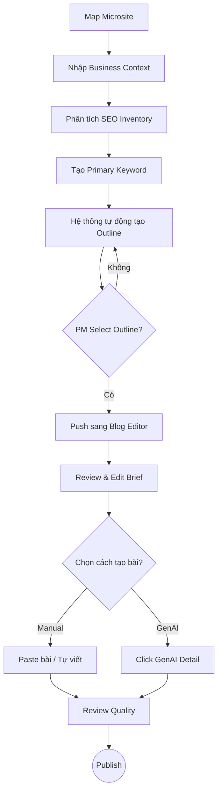
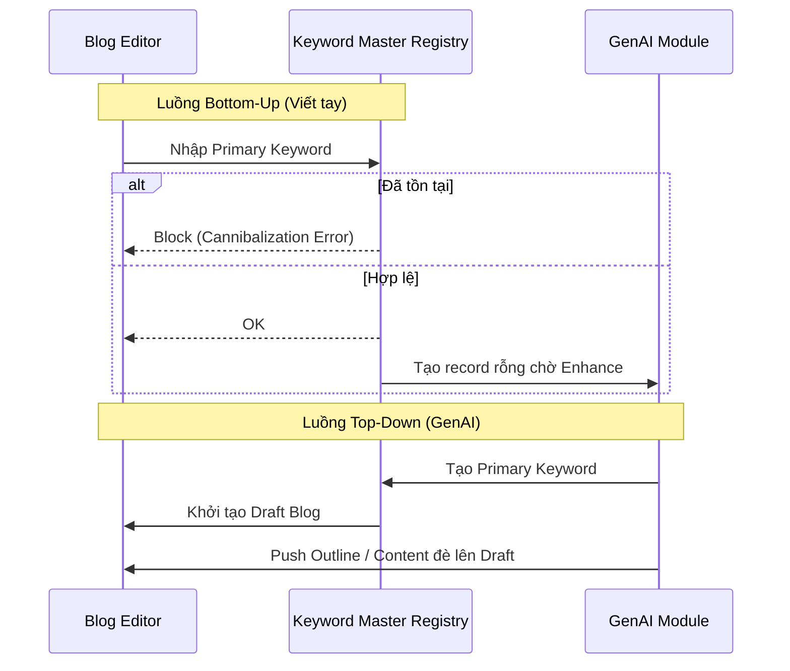

# MoSpark GenAI Content Engine
Quy trình Sản xuất & Quản trị

> - **Project:** MoSpark Web Platform
> - **Main URL:** momo.vn/mospark
> - **Division:** GPD (Growth Product Division)
> - **Use Case:** Out-App Traffic
> - **Product:** Web Growth Platform
> - **SEO/GEO Project ID:** `mospark-genai-content`
> - **Owner:** GPD - Out-App Traffic (Bảo)
> - **Governance:** Văn Hiến (Web Product Lead)
> - **Version:** 4.2 · May 2026
> - **Status:** Active - Platform Core Metadata
>
> - **SEO Score:** N/A | **Traffic:** N/A | **W2A:** N/A | **Last updated:** 2026-05-27

---

## 1. Executive Summary

### 1.1. Bối cảnh (Situation)
MoSpark cần một "cỗ máy" sản xuất nội dung không chỉ nhanh mà phải **chuẩn hóa**. Hiện tại, việc sử dụng AI cá nhân (ChatGPT/Claude) đang bị phân mảnh, thiếu tính đồng bộ và không kiểm soát được chất lượng Prompt, dẫn đến đầu ra không nhất quán với thương hiệu MoMo.

### 1.2. Vấn đề cốt lõi (Complication)
- **Tốc độ vs Chất lượng:** Content Writer mất quá nhiều thời gian để "mớm" ngữ cảnh cho AI.
- **Prompt Fragmentation:** Mỗi người dùng AI theo một cách khác nhau, không có Guideline chung cho SEO, AEO (Answer Engine Optimization) và GEO.
- **Thiếu Source of Truth:** AI dễ bị ảo giác (hallucination) nếu không được bám sát vào mô tả sản phẩm và các URL tham chiếu cụ thể của dự án.

### 1.3. Giải pháp (Resolution)
Tạo ra **AI Content Creator** - một không gian quản lý tập trung:
- **Business Context:** Sử dụng mô tả Use Case và URL làm ngữ cảnh toàn cục để định hướng AI.
- **Prompt Standardization:** Hệ thống quản trị Guideline (SEO/AEO/GEO) tự động áp dụng vào mọi bài viết.
- **Performance Intelligence:** Tích hợp tính năng đo lường **Share Of Voice (SOV)** để đánh giá mức độ xuất hiện của MoMo trong câu trả lời của AI.

### 1.4. Tam giác Dữ liệu (The Data Triangle)
Kiến trúc của GenAI Content được thiết kế dựa trên sự phân tách và kết hợp rõ ràng của 3 nguồn lực:
1. **Business Context (Từ BU/PM):** Thông tin sản phẩm, USPs, định vị thương hiệu và rào cản pháp lý. Trả lời câu hỏi: *Viết cái gì cho đúng?*
2. **SEO Inventory (Từ Hiến - SEO Tools):** Số liệu định lượng (Volume, Keyword) phân tầng TOFU/MOFU/BOFU theo Customer Journey. Trả lời câu hỏi: *Viết cho ai, keyword nào, funnel stage nào?*
3. **GenAI Content Engine:** Tiếp nhận Primary Keyword (từ SEO Inventory) và viết bài bám sát Business Context. Output đi qua Outline Selection (hard gate) trước khi vào Blog Editor.

**Luồng tương tác:**

| Input | Xử lý | Output | Gate |
|---|---|---|---|
| Business Context (PM) + SEO Inventory (Hiến) | GenAI Content Engine tiếp nhận context + keyword | AI Outline draft | - |
| PM xem TOFU/MOFU/BOFU, chọn Primary Keyword | Hệ thống generate Outline | Outline draft | - |
| PM/Content review Outline | Chọn (Select) Outline phù hợp | **Outline Selected** | **Hard gate - bắt buộc** |
| Outline Selected push sang Blog Editor | Content paste bài (A) hoặc click GenAI Detail (B) | Bài viết Final | SEO/GEO Score gate |

---

## 2. Stakeholder (Nhóm người dùng chính)

| Vai trò | Trách nhiệm chính | Mục tiêu |
| :--- | :--- | :--- |
| **Content Writer** | Thực thi sản xuất bài viết | Tạo Use Case, quản lý từ khóa, thêm dữ liệu tham khảo, chỉnh sửa dàn ý và tạo bản nháp bài viết tự động. |
| **Guideline Admin** | Quản trị tiêu chuẩn | Thiết lập và cập nhật hệ thống Prompt & Guidelines (SEO, AEO, GEO) để kiểm soát chất lượng đầu ra. |
| **Web Product Lead** | Kiểm soát gate cuối | Review điểm Scoring và phê duyệt xuất bản (Sign-off). |

---

## 3. Bài Toán Cần Giải & Success Metrics

### 3.1. Mục tiêu chiến lược
Biến MoSpark thành "Production Lab" duy nhất, nơi nội dung được sản xuất với chi phí thấp nhất nhưng đạt tiêu chuẩn xuất bản cao nhất của MoMo.

### 3.2. Success Metrics (SMART)
- **Productivity:** Tăng năng suất sản xuất từ trung bình **10 bài/tháng** lên **20 bài/tháng** trên mỗi Content Writer.
- **Quality:** 100% bài viết AI sinh ra phải vượt qua Hard Block của bộ lọc SEO/GEO Scoring.
- **SOV Target:** Đạt mức độ trích dẫn (Citation) từ AI search cho các Primary Keyword của Use Case tối thiểu 30%.

### 3.3. Tính năng cốt lõi (Key Features)
- **Project Mapping Field:** Liên kết Use Case với danh mục quản lý Pages tương ứng (Ví dụ: Pick "Phạt Nguội" để auto-sync bài viết vào thư mục `/blog/phat-nguoi/*` trong Blog Editor).
- **Keyword Master Registry:** Quản lý tập trung Primary Keywords, đảm bảo tính duy nhất (Unique ID Check).
- **Double Entry Sync:** Cơ chế đồng bộ bài viết từ module Sản xuất sang module Quản trị (Editor).

---

## 4. Các Giả định & Nền tảng (Assumptions)

- **Grounding Search:** Hệ thống mặc định tích hợp khả năng tìm kiếm web thực tế để AI cập nhật dữ liệu mới nhất và xác thực thông tin.
- **URL Context:** Tính năng đọc hiểu nội dung từ các liên kết (link) trong mô tả Use Case được kích hoạt mặc định để làm "Source of Truth".
- **Human-in-the-loop:** Kết quả AI chỉ mang tính chất tham khảo; Content Writer chịu trách nhiệm rà soát, hiệu đính và chịu trách nhiệm cuối cùng về nội dung.
- **Standard Chữ thường:** Toàn bộ từ khóa được chuẩn hóa về chữ thường để đảm bảo tính nhất quán và duy nhất.

---

## 5. Giải pháp đo lường Share Of Voice (SOV)

Đây là tính năng quan trọng để đánh giá hiệu quả của dự án SEO/GEO:

### 5.1. Cơ chế thu thập dữ liệu
- Hệ thống sử dụng Primary Keyword để hỏi AI (kèm Grounding Search).
- AI trả về câu trả lời kèm danh sách các nguồn tham khảo (References).

### 5.2. Logic tính toán
- **Trích xuất Domain:** Hệ thống tự động tách domain từ các URL tham khảo.
- **Thống kê:** Đếm số lần mỗi domain được trích dẫn và tính tỷ lệ phần trăm (%) dựa trên thị trường.
- **Công thức:** `SOV % = (Số lần domain MoMo xuất hiện / Total Volume Search) * 100`.

### 5.3. Tối ưu hóa vận hành
- Để tiết kiệm chi phí, hệ thống gom nhóm các Secondary Keywords khi thực hiện đo lường SOV (tối đa 6 API call cho mỗi cụm từ khóa chính).

---

## 6. Workflow Content

### 6.0. Giải thích Thuật ngữ (Glossary)

Để đảm bảo sự thống nhất trong vận hành, các thuật ngữ dưới đây được định nghĩa như sau:

*   **Keyword Master Registry (Kho Định Danh Gốc):** Là "Sổ cái" trung tâm lưu trữ toàn bộ Primary Keywords của một Use Case. Mọi bài viết (dù tạo từ luồng nào) đều phải được đăng ký tại đây.
*   **Unique ID Check (Kiểm tra Định danh Duy nhất):** Quy trình hậu kiểm tự động. Hệ thống đối soát từ khóa mới với *Keyword Master Registry* để đảm bảo không có 2 bài viết trùng lặp nội dung/từ khóa trong cùng một Use Case.
*   **AI Enhance (Nâng cấp AI):** Tính năng cho phép "tái cấu trúc" một bài viết hiện có bằng sức mạnh của GenAI thông qua việc chuyển hướng về quy trình Draft Outline/Detail.
*   **Bottom-Up Sync (Đồng bộ ngược):** Cơ chế tự động tạo bản ghi tại *Keyword Master Registry* khi người dùng nhập Primary Keyword trong Blog Editor.
*   **Top-Down Sync (Đồng bộ xuôi):** Cơ chế tự động khởi tạo bài viết trong Blog Editor khi người dùng tạo Primary Keyword và Content trong module GenAI.

### 6.1. Microsite - Đơn vị Quản lý Nội dung

Mỗi Microsite trên MoSpark quản lý toàn bộ tài sản nội dung của một Use Case. Blog là một module trong Microsite - không phải entity độc lập.

| Component | Nội dung quản lý | Owner |
|---|---|---|
| **Sub-pages** | Hub page, Spoke pages, Landing pages | PM/PO |
| **Content** | Blog articles, Static content | PM/Content Team |
| **Meta data** | Title, Description, OG tags, Schema markup | MoSpark auto + SEO Lead review |
| **llms.txt** | AI crawler policy per Microsite | SEO Lead |
| **Dashboard** | Traffic, W2A, Keyword ranking, SEO Inventory per Use Case | PM/PO view |
| **Blog management** | Toàn bộ blog articles của Microsite | PM/Content Team |

Blog được tạo theo 2 con đường - cả 2 đều yêu cầu Primary Keyword phải đăng ký trong Keyword Master Registry trước khi publish:
- **Manual (Blog Editor trực tiếp):** Content paste bài viết vào Blog Editor, nhập Primary Keyword để trigger Unique ID Check
- **GenAI Flow (luồng bắt buộc):** SEO/GEO Project → Business Context → SEO Inventory → Outline (Selected) → Blog Editor

**Blog Management - List View:**

Hiển thị toàn bộ bài blog của project, phân biệt rõ 2 loại bằng badge:

| Loại | Badge | Columns hiển thị |
|---|---|---|
| **GenAI** | `GenAI` (tím) | Title, Primary Keyword, Status, Ngày tạo, Model dùng, Cost |
| **Manual** | `Manual` (xám) | Title, Primary Keyword, Status, Ngày tạo |

**Blog Management - Detail View (GenAI article):**

Khi click vào bài GenAI, hiển thị 2 panel:

| Panel | Nội dung |
|---|---|
| **Editor** | Full blog editor - chỉnh sửa nội dung, metadata, publish/unpublish |
| **AI Usage** | Usage (input tokens / output tokens), Cost (ước tính theo API pricing), Model (tên model đã dùng để generate) |

> **Lý do cần AI Usage panel:** PM/PO và Finance cần biết chi phí AI thực tế per bài và per Use Case để quản lý budget GenAI. Không có data này thì không thể scale có kiểm soát.

**Blog Management - Detail View (Manual article):**

Chỉ hiển thị Editor - không có AI Usage panel vì không có API call.

### 6.2. Luồng GenAI → Blog (Mandatory Flow)

**Điều kiện tiên quyết:** SEO/GEO Project đã tạo và mapped với Microsite trước khi bắt đầu.

| Bước | Hành động | Owner | Gate |
|---|---|---|---|
| **1** | SEO/GEO Project mapped vào Microsite | PM/PO | Prerequisite cứng - không bỏ qua |
| **2** | Nhập Business Context đầy đủ theo template | PM + SEO Lead validate | Bắt buộc hoàn thành trước khi tạo keyword |
| **3** | Xem SEO Inventory + Customer Journey | PM tự ra quyết định | TOFU/MOFU/BOFU hiển thị, PM chọn stage cần tấn công |
| **4** | Tạo Primary Keyword | Content Team | Unique ID Check tự động toàn hệ thống |
| **5** | AI generate Outline | Hệ thống | - |
| **6** | **OUTLINE SELECTED** | PM/Content | **Hard gate - hệ thống block nếu chưa chọn** |
| **7** | Outline push sang Blog Editor | Tự động | Outline truyền làm structure cho bài |
| **8** | Review brief + Chọn cách tạo bài | PM + Content Team | PM review và chỉnh sửa lại dàn ý (brief) trong Blog Editor nếu cần - sau đó chọn cách tạo nội dung |
| **9** | Review & SEO/GEO Score | Web Product Lead | Hard block nếu chưa pass |
| **10** | Publish | Content Team | Live trên momo.vn |

**Bước 8 - Flow trong Blog Editor (sau khi Outline đã push sang):**

**8.1 - PM review + edit brief:**
- PM đọc lại dàn ý (brief) vừa được push sang Blog Editor
- Chỉnh sửa nếu cần: thêm/xóa section, điều chỉnh góc nhìn, clarify heading
- Đây là lần chỉnh sửa cuối trước khi nội dung được tạo - không quay lại step này sau khi đã chọn cách tạo bài

**8.2 - Chọn cách tạo bài:**

| Lựa chọn | Cơ chế | Khi nào dùng |
|---|---|---|
| **A - Manual** | Paste bài từ AI cá nhân (ChatGPT, Claude riêng) hoặc tự viết theo brief đã review | Đã có draft sẵn, hoặc muốn kiểm soát toàn bộ quá trình viết |
| **B - GenAI Detail** | Click nút "GenAI Detail" trong Blog Editor - hệ thống AI generate full article từ brief đã review | Chưa có draft, muốn AI của platform viết hoàn chỉnh từ brief |

**Bước 3 - PM thấy gì trong SEO Inventory:**

| Thông tin | Ý nghĩa với PM |
|---|---|
| Market Volume (total) | Market Sizing toàn Use Case - basis để set KPI và độ ưu tiên |
| Keyword cluster theo TOFU | Informational queries - user đang tìm hiểu, chưa có intent rõ |
| Keyword cluster theo MOFU | Commercial investigation - user đang so sánh, cần review |
| Keyword cluster theo BOFU | Transactional - user sẵn sàng hành động, gắn chặt với conversion |
| SoV MoMo hiện tại | MoMo đang chiếm bao nhiêu % thị trường - biết gap để set target |
| Keyword chưa có content | Cơ hội chưa khai thác - tạo Primary Keyword ngay từ màn hình này |

**Luồng cập nhật bài viết đã có (Update Flow):**

Bài viết đã tồn tại có thể cập nhật theo 2 cách:
1. **Thủ công:** Sửa trực tiếp trong Blog Editor
2. **Enhance by GenAI:** Click nút trong Blog Editor - redirect về GenAI Content module của keyword đó để tối ưu lại bằng AI, sau đó sync ngược về Editor

### 6.3. Core Data Governance Rules (Xác nhận với Dev - Trọng)

Để đảm bảo tính toàn vẹn dữ liệu và tránh xung đột SEO (Cannibalization), hệ thống áp dụng các quy tắc cứng sau:

1.  **Project-First Requirement (Ràng buộc bối cảnh):** Mọi **Primary Keyword** bắt buộc phải thuộc về một **SEO/GEO Project** cụ thể. Keyword không được phép tồn tại "mồ côi" vì Project là nơi cung cấp *Business Context* và định nghĩa cấu trúc URL.
2.  **Strict 1-1 Mapping (Tính duy nhất):** Quy tắc **1 Bài viết ↔ 1 Primary Keyword**. Một Primary Keyword chỉ được đại diện cho một URL Master và một nội dung duy nhất. Nếu người dùng tạo trùng, hệ thống phải chặn và yêu cầu sử dụng luồng "Update/Enhance".
3.  **Single Ownership (Phân cấp URL):** Một Primary Keyword chỉ thuộc về **duy nhất 1 SEO/GEO Project**. Điều này đảm bảo sự nhất quán trong URL Hierarchy (ví dụ: `/phat-nguoi/` vs `/doi-tac/`) và tránh tranh chấp Authority giữa các Use Case.
4.  **Cross-Project Cannibalization Check (Kiểm soát Xung đột chéo):** Phạm vi quét của *Keyword Master Registry* phải mang tính **Global (Toàn cục)** toàn hệ thống MoSpark, không nằm cục bộ trong 1 Project. 
    - *Ví dụ:* Nếu Project "Phạt Nguội" đã sở hữu keyword `quy định ô tô`, thì Project "Bảo Hiểm" **không được phép** tạo mới URL với keyword này.
    - *Xử lý:* Thay vì tạo 2 URL triệt tiêu nhau, hệ thống yêu cầu sử dụng chung 1 bài viết Authority và thực hiện **Cross-linking** (Bài viết Phạt Nguội chèn Banner/CTA bán Bảo Hiểm).
5.  **Unique ID Check (Kho định danh):** Mọi Keyword khi nhập vào phải được đối soát với *Keyword Master Registry* của toàn hệ thống trước khi cho phép đi vào luồng sản xuất nội dung.

---

### 6.4. Workflow Chi tiết - 10 Bước thực thi (GenAI Flow)

| Bước | Tên Bước | Hành động | Input/Output | Owner |
|---|---|---|---|---|
| **1** | **Map Microsite** | SEO/GEO Project mapping vào Microsite tương ứng | Project linked to Microsite | PM/PO |
| **2** | **Business Context** | Nhập đầy đủ 12 trường theo template (xem Section 7) | Context Layer - Source of Truth cho AI | PM/Growth + SEO Lead validate |
| **3** | **SEO Inventory** | Xem Market Sizing, TOFU/MOFU/BOFU cluster, SoV gap - ra quyết định keyword cần tấn công | Keyword strategy rõ ràng | PM/Growth |
| **4** | **Keyword Creation** | Tạo Primary Keyword + Secondary Keywords | Keyword vào Master Registry, Unique ID Check tự động | Content Team |
| **5** | **AI Outline** | AI generate dàn ý thô dựa trên Business Context + Primary Keyword | Outline Draft | Hệ thống |
| **6** | **OUTLINE SELECTED** | PM/Content review, chỉnh sửa (nếu cần), **bắt buộc chọn (Select) Outline** | Outline Final - confirmed | PM/Content - **Hard gate** |
| **7** | **Push sang Blog Editor** | Outline tự động truyền sang Blog Editor làm structure | Blog Editor nhận outline | Tự động |
| **8** | **Review & Edit Brief** | PM đọc lại dàn ý trong Blog Editor, chỉnh sửa nếu cần (lần review cuối trước khi tạo nội dung) | Brief final trong Blog Editor | PM/Content Team |
| **8A** | **Manual** | Paste bài từ AI cá nhân hoặc tự viết theo brief đã review | Blog detail draft | Content Team |
| **8B** | **GenAI Detail** | Click "GenAI Detail" trong Blog Editor - AI generate full article từ brief đã review | Blog detail draft | AI (Claude API) |
| **9** | **Review Quality** | Kiểm tra E-E-A-T, YMYL, SEO/GEO Score - sign-off | Verified content | Web Product Lead - Hard gate |
| **10** | **Publish** | Content Team publish từ Blog Editor | Live trên momo.vn | Content Team |

> **Business Context (Bước 2) là điều kiện để AI viết đúng.** Nhập thiếu = AI thiếu context = output hallucinate hoặc sai sản phẩm. PM chịu trách nhiệm pháp lý về nội dung Business Context nhập vào.

---

### 6.5. Role & Responsibility Detail

#### PM/Growth (Cell Team)
**Trách nhiệm chính:** Map Microsite, nhập Business Context, ra quyết định keyword, approve Outline

- **Bước 1:** Map SEO/GEO Project vào đúng Microsite
- **Bước 2:** **Nhập Business Context đầy đủ - chịu trách nhiệm pháp lý về nội dung nhập vào**
  - Confirm tất cả 12 trường theo template: Value Prop, Trust Signals, Disclaimer, Blacklist terms
  - Verify không có thông tin sai, không recommend competitor, không overpromise tính năng
- **Bước 3:** Xem SEO Inventory, đọc TOFU/MOFU/BOFU cluster, xác định stage cần tấn công
- **Bước 6:** **SELECT Outline - hard gate, không thể skip**
  - Review outline align với strategy & positioning
  - Từ chối và yêu cầu Content chỉnh sửa nếu chưa đúng hướng
- **Bước 8:** **Review + edit brief trong Blog Editor trước khi chọn cách tạo bài**
  - Đọc lại dàn ý vừa push sang Blog Editor
  - Chỉnh sửa nếu cần (thêm/bớt section, clarify heading, điều chỉnh angle)
  - Đây là lần review cuối - sau khi xác nhận mới chọn GenAI Detail hoặc Manual

#### Content Team
**Trách nhiệm chính:** Tạo keyword, chỉnh sửa dàn ý, viết nội dung, publish

- **Bước 4:** Tạo Primary Keyword + bộ Secondary keywords
- **Bước 5-6:** Chỉnh sửa Outline draft, submit để PM Select
- **Bước 8:** Review + chỉnh sửa brief trong Blog Editor
- **Bước 8A hoặc 8B:** Chọn cách tạo nội dung (Manual paste hoặc click GenAI Detail)
- **Bước 10:** Kiểm tra lần cuối giao diện, Click Publish sau khi Web Product Lead sign-off

#### Web Product Lead (Văn Hiến)
**Trách nhiệm chính:** Validate Business Context, đảm bảo tiêu chuẩn SEO/GEO, sign-off trước publish

- **Bước 2:** Validate Business Context framework - confirm đủ trường, context tương thích với Prompt
- **Bước 9:** **Review Quality & SEO/GEO Scoring - Sign-off Publish**
  - Check điểm Scoring tự động
  - Flag nếu có issues: E-E-A-T fail, YMYL risk, content vi phạm
  - Sign-off = content được phép chuyển sang Bước 10 Publish

---

### 6.6. Approval Gates

| Gate | Bước | Owner | Condition | Consequence nếu fail |
|---|---|---|---|---|
| **Business Context Complete** | 2 | PM/Growth + Web Product Lead | Đủ 12 trường, chính xác, pháp lý clear | Block - không tạo được keyword |
| **Outline Selected** | 6 | PM/Content | PM bắt buộc click Select Outline | Hard block - không push sang Blog Editor được |
| **SEO/GEO Score Pass** | 9 | Web Product Lead | Bài viết pass toàn bộ scoring criteria, sign-off | Hard block - không publish được |

---

### 6.7. Synchronization & Keyword Master Registry Logic

Hệ thống quản lý nội dung dựa trên nguyên tắc **GenAI Content là Keyword Master Registry (Kho lưu trữ gốc)** của toàn bộ Primary Keywords trong một Project.

1.  **Cơ chế Đồng bộ từ Luồng Mặc Định (Bottom-Up Sync):**
    - Ở Blog Editor, PM không nhập "Primary Keyword" ngay từ đầu quy trình tạo.
    - Tuy nhiên, để đạt điểm **SEO/GEO Score**, PM buộc phải nhập **Primary Keyword** (trước đây là Meta Keyword).
    - **Hành động hệ thống:** Ngay khi Primary Keyword được nhập, MoSpark sẽ tự động tạo một bản ghi (Record) tương ứng trong module GenAI Content với Keyword này.
    - Điều này đảm bảo mọi bài viết "viết tay" đều có một đại diện trong GenAI để sẵn sàng cho tính năng AI Enhance.

2.  **Cơ chế Từ Luồng GenAI Content (Top-Down Sync):**
    - Khi PM tạo một Primary Keyword trong module GenAI, hệ thống sẽ tự động khởi tạo và liên kết (Link) với một bài blog trong Editor.
    - Mọi thay đổi về nội dung từ GenAI (Step 6) sẽ được đồng bộ (Sync) đè lên hoặc cập nhật vào bài blog này.

3.  **Quản lý Tính Unique (Unique ID Check):**
    - **Vị trí kiểm soát:** Duy nhất tại module GenAI Content.
    - **Logic:** Dù bài viết đến từ luồng nào, Primary Keyword (từ Editor hoặc từ GenAI) đều phải "check-in" tại Keyword Master Registry. 
    - Nếu Keyword đã tồn tại, hệ thống sẽ ngăn chặn việc tạo mới và yêu cầu user sử dụng bài viết hiện có để tránh "Content Cannibalization".

---

## 7. Business Context - Các trường bắt buộc

> **Owner:** Văn Hiến
> **Thời điểm nhập:** Bắt buộc hoàn thành TRƯỚC khi generate bất kỳ bài viết nào trong Use Case
> **Mục đích:** Làm nền tảng context cho cả Prompt 1 (Outline) và Prompt 2 (Writer) - đảm bảo AI luôn viết đúng về sản phẩm MoMo, không recommend competitor, không bịa đặt tính năng

### 7.1. Các trường bắt buộc

1. **Tên sản phẩm** - Tên chính xác như hiển thị trong App/Web
2. **URL Web** - URL canonical của trang chính
3. **Mô tả sản phẩm** - 3-5 câu, phân biệt Web vs App
4. **Đối tượng sử dụng** - Persona chính (ai, ở đâu, job gì)
5. **Đối tác** - Tên đối tác cung cấp data/dịch vụ (nếu có)
6. **Điều kiện sử dụng** - Giới hạn, yêu cầu user cần biết
7. **Value Prop / USPs** - Danh sách điểm giá trị nổi bật (AI phải integrate tự nhiên)
8. **Trust Signals** - Yếu tố tạo độ tin cậy so với competitor
9. **Khác biệt vs đối thủ** - So sánh trực tiếp, honest (bao gồm cả điểm chưa bằng)
10. **Disclaimer** - Pháp lý/tài chính (theo YMYL guideline)
11. **Từ ngữ bị cấm** - Blacklist terms (sai sản phẩm, pháp lý risk, competitor)
12. **Số liệu của MoMo** - Data/Statistics chính thống của MoMo cho Use Case (User volume, Market share, Success stories, vv.)

---

## 8. Lộ trình Triển khai (Implementation Roadmap)

Dự án GenAI Content được chia làm 2 giai đoạn chính để đảm bảo tính ổn định của hệ thống trước khi mở rộng tính năng đo lường:

### Giai đoạn 1: Technical Flow & Workflow Standardization (May 2026)
**Trọng tâm:** Hoàn thiện hạ tầng kỹ thuật và quy trình sản xuất nội dung.
- Triển khai toàn bộ **Technical Flow** (Project Mapping, Business Context, Keyword Registry).
- Hoàn thiện 3 luồng vận hành (**Flow 1, 2, 3**) tích hợp với MoSpark Blog Editor.
- Tích hợp Claude API và hệ thống Prompt Master.
- Pilot thành công cho dự án **Phạt Nguội** và **Merchant Directory**.
- ✅ **7-Step Workflow live:** Blog Detail AI + Blog Editor Publish separation
- ✅ **Phạt Nguội pilot:** Foundation complete - **Target T5/2026: 10 bài/tuần, PM execute theo GenAI Flow**
- ✅ **Scale Financial products:** Vay Nhanh, Ví Trả Sau, CIC

### Giai đoạn 2: Share of Voice (SoV) & Visibility Tracking (June 2026+)
**Trọng tâm:** Đo lường hiệu quả và tối ưu hóa tăng trưởng.
- Tích hợp Dashboard đo lường **SoV (Share of Voice)** theo từng Use Case.
- Theo dõi **Visibility Index** của các bài viết GenAI trên Google Search & AI Search.
- Hệ thống cảnh báo **Content Decay** (Nội dung giảm sút hiệu quả).
- Tự động gợi ý từ khóa mới dựa trên Gap Analysis (SEO Inventory).
- **Market Inventory UI (by Trọng):** Hiển thị danh sách Cluster & Volume của Market tương ứng ngay trong giao diện SEO/GEO Project để PM chọn Primary Keyword.
- **Google Search Console API Integration:** Theo dõi hiệu suất per Use Case
- **Metrics per Use Case:** Organic traffic, impressions, CTR, avg position
- **Automated Insights:** Gợi ý tối ưu nội dung dựa trên data
- **Content Refresh Automation:** Identify underperforming articles - suggest updates

---

## 9. GenAI Operational Standards & Prompt Strategy

> **Role:** Văn Hiến (Web Product Lead)
> **Engine:** Claude API (Integrated in MoSpark)
> **Goal:** Tạo nội dung chuẩn SEO/GEO, đạt E-E-A-T và sẵn sàng cho AI Search Citation.

### 9.1. Nguyên tắc cốt lõi (Core Principles)
*   **Zero-Hallucination**: Luôn yêu cầu AI sử dụng dữ liệu thực tế (Pháp luật, số liệu từ BU).
*   **Context Injection**: Truyền bối cảnh Use Case (Primary Keyword, Target Audience) vào Prompt.
*   **Structure-First**: Luôn yêu cầu AI tạo Outline trước khi viết nội dung chi tiết.

### 9.2. Framework Prompt cho Blog Content
Quy trình này khớp với **Bước 5 (AI Outline) và Bước 8B (GenAI Detail)** trong Workflow 10 bước:

*   **Phase A: Outline Generator (Bước 5)**
    *   **Input**: Primary Keyword + Business Context (từ Bước 2) + Target Audience + Key Message.
    *   **Prompt Master:** [[03_SKILLS/momo-blog-prompt-1-outline|GenAI Blog Prompt 1 (Outline)]]
*   **Phase B: Content Writer (Bước 8B - GenAI Detail)**
    *   **Trigger**: PM/Content click "GenAI Detail" trong Blog Editor sau khi Outline đã Selected (Bước 6).
    *   **Input**: Outline từ Phase A + [[03_SKILLS/momo-seo-geo-guideline|MoMo SEO & GEO Prompt Guidelines]] + [[03_SKILLS/momo-ymyl-guideline|MoMo YMYL Guidelines]].
    *   **Prompt Master:** [[03_SKILLS/momo-blog-prompt-2-writer|GenAI Blog Prompt 2 (Writer)]]

### 9.3. Quality Gate Standards (SEO/GEO Score)
Nội dung sau khi GenAI tạo ra phải được tự động chấm điểm qua [[04_MOSPARK_PLATFORM/mospark_seo_geo_score|SEO/GEO Scoring System]]. Các tiêu chí bắt buộc:
*   Mật độ từ khóa chính.
*   Sự hiện diện của FAQ Schema.
*   Độ dài và cấu trúc Heading.

### 9.4. Định giá Model & Quy hoạch Ngân sách (Model Benchmarks & Budgeting)
Hệ thống hiện tại đang tích hợp API của hãng Anthropic (Claude) để thực hiện quy trình sản xuất nội dung gồm 2 giai đoạn (Tạo Outline dàn ý & Viết Blog Detail chi tiết) với các thông số đo lường hiệu năng và chi phí thực tế:

*   **Claude 3 Haiku (Model tối giản - Scale lớn):**
    *   *Thời gian sản xuất:* ~55 giây / bài (bao gồm cả Outline & Blog Detail).
    *   *Chi phí (API Cost):* ~7.000đ / bài viết hoàn chỉnh.
    *   *Mục đích:* Thích hợp cho các bài viết số lượng lớn (Scale), nhóm bài ngách địa phương (pSEO) hoặc các BU có ngân sách tối giản.
*   **Claude 3.5 Sonnet (Model cao cấp - Chất lượng chuyên sâu):**
    *   *Thời gian sản xuất:* ~140 giây / bài (bao gồm cả Outline & Blog Detail).
    *   *Chi phí (API Cost):* ~20.000đ / bài viết hoàn chỉnh.
    *   *Mục đích:* Dành cho các bài viết trụ cột (TOFU/BOFU Hub), yêu cầu học thuật cao, kiểm soát chặt chẽ tiêu chuẩn E-E-A-T và YMYL.

**Quản lý & Hoạch định Ngân sách (Budget Planning):**
Việc xác định rõ đơn giá cố định trên từng bài viết giúp PM/PO dễ dàng dự toán ngân sách chi tiết dựa trên số lượng bài viết của Content Plan.
*   *Ví dụ:* Content Plan cho Use Case yêu cầu **40 bài viết**:
    *   Nếu chọn chạy 100% bằng **Haiku**: 40 bài x 7.000đ = 280.000 VNĐ.
    *   Nếu chọn chạy 100% bằng **Sonnet**: 40 bài x 20.000đ = 800.000 VNĐ.

**Định hướng & Lộ trình sắp tới:**
1.  **Đa dạng hóa Model (Multi-Model Selector):** Tích hợp thêm các mô hình ngôn ngữ hàng đầu khác (GPT-4o, Gemini 1.5 Pro, Llama 3, v.v.) trực tiếp trên giao diện CMS MoSpark để PM chủ động lựa chọn tùy theo tính chất nội dung và ngân sách.
2.  **Cơ chế tích hợp API Key theo BU (Custom BU API Key Integration):** Cho phép các đơn vị kinh doanh (BUs) chủ động cấu hình API Key riêng của BU mình vào hệ thống. Chi phí API call phát sinh sẽ được tự động trừ trực tiếp vào ngân sách phân bổ riêng của BU đó, giải quyết triệt để bài toán phân bổ chi phí giữa các phòng ban.

---

## 10. Danh mục Use Cases triển khai (Pipeline)

Hệ thống GenAI Content sẽ phục vụ sản xuất nội dung cho các dự án chiến lược sau:

1. **Dự án Phạt Nguội (Pilot):** Sản xuất 20+ bài viết Blog chuẩn E-E-A-T và pSEO địa phương.
2. **Dự án Merchant Directory (`/doi-tac`):** 
   - Sản xuất tự động **Thông tin mô tả Merchant** (Intro).
   - Tạo bộ **FAQ & HowTo thanh toán** cho từng Merchant (Ví dụ: "Highlands Coffee có nhận MoMo không?").
   - Đảm bảo tính nhất quán của thông tin ưu đãi và phương thức thanh toán (VTS/QR).

---

## 11. Tài liệu Liên kết
- [[04_MOSPARK_PLATFORM/mospark_master|MoSpark Master Doc]]
- [[04_MOSPARK_PLATFORM/mospark_seo_geo_score|SEO/GEO Scoring System]]
- [[04_MOSPARK_PLATFORM/mospark_seo_inventory|MoSpark SEO Keyword Inventory]]
- [[04_MOSPARK_PLATFORM/mospark_business_context|Business Context Management]]
- [[03_SKILLS/momo-blog-prompt-1-outline|GenAI Blog Prompt 1 (Outline)]]
- [[03_SKILLS/momo-blog-prompt-2-writer|GenAI Blog Prompt 2 (Writer)]]
- [[03_SKILLS/momo-seo-geo-guideline|MoMo SEO & GEO Prompt Guidelines]]
- [[03_SKILLS/momo-ymyl-guideline|MoMo YMYL Guidelines]]

---

## 12. Change Log
- **v4.2 (2026-05-27):** Cập nhật Section 9.4: Bổ sung đơn giá và thời gian benchmark chi tiết cho Claude 3 Haiku (7.000đ - 55s) & Claude 3.5 Sonnet (20.000đ - 140s). Quy hoạch cơ chế dự toán chi phí theo Content Plan và định hướng lộ trình Multi-model Selector + tích hợp API Key theo BU (Văn Hiến).
- **v4.1 (2026-05-26):** Cập nhật Bước 8 trong workflow: bổ sung explicit step PM review + edit brief trong Blog Editor trước khi chọn cách tạo bài (GenAI Detail hoặc Manual). Phản ánh luồng thực tế Trọng đang implement. Section 6.2, 6.4, 6.5 đồng bộ. Phạt Nguội T5/2026: target 10 bài/tuần.
- **v4.0 (2026-05-26):** Tái kiến trúc toàn bộ workflow: (1) Microsite là đơn vị quản lý cấp trên - Blog là module trong Microsite; (2) Bỏ Double Entry Flow, thay bằng Mandatory GenAI Flow 10 bước với Outline Selected là hard gate; (3) TOFU/MOFU/BOFU visible trong SEO Inventory ở Bước 3; (4) Blog Editor nhận 2 lựa chọn sau khi Outline push sang: Manual paste hoặc GenAI Detail; (5) Xóa toàn bộ mermaid blocks (Hiến).
- **v3.9 (2026-05-18):** Phục hồi toàn bộ nội dung chi tiết bị mất trong quá trình di dời thư mục và chuẩn hóa liên kết Obsidian (Hiến).
- **v3.8 (2026-05-16):** Tái cấu trúc: Footer Links & Version Log. Nhấn mạnh cơ chế chống Cannibalization (Hiến).
- **v3.7 (2026-05-15):** Tích hợp đo lường Share of Voice (SoV) cho AI Search (Hiến).
- **v3.6 (2026-05-07):** Cập nhật luồng Double Entry Flow & 7-step workflow (Hiến).

---
*Maintained by: Văn Hiến (Web Product Lead) | Last updated: 2026-05-27*
