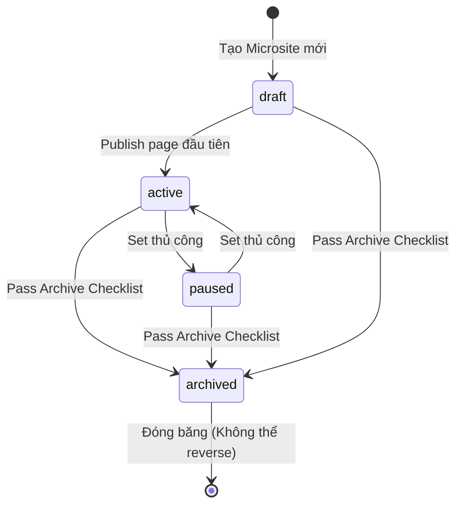

# MoSpark - Microsite Management
Hệ thống quản trị Mini Web và cấu trúc sitemap tự động

> - **Project Name:** MoSpark Web Platform
> - **Division:** GPD (Growth Platform Division)
> - **Owner:** Bảo
> - **PIC:** Hoài Anh (Architect)
> - **Version:** 1.2 · May 2026

---

## PHẦN I: PRODUCT SPECIFICATION

---

## 1. Executive Summary

### 1.1. Situation

Mỗi Use Case của MoMo (Vay Nhanh, Phạt Nguội, BH xe máy, Cinema...) cần một không gian web riêng biệt - gồm Hub page, Spoke pages, Blog, Ads và Metadata - để rank organic, convert user và đo lường toàn bộ vòng đời. Hiện tại không có nơi nào nhìn thấy toàn bộ portfolio Microsite đang tồn tại, ai own, trạng thái nào và hiệu suất ra sao.

### 1.2. Complication

PM/PO chạy Use Case nhưng không có visibility toàn cục:
- Không biết Use Case mình có Microsite chưa hay cần tạo mới.
- Khi tạo Blog, không biết mình đang publish trong namespace nào - dễ tạo trùng URL hoặc gây Keyword Cannibalization.
- Web Product Lead không có single view để audit portfolio tổng thể: Use Case nào đang active, Use Case nào cần archive.
- Không có nơi quản lý llms.txt per Use Case - AI crawler policy đang bị áp dụng chung toàn site thay vì granular theo Use Case.
- **Sitemap không phản ánh Web Structure thực tế:** URL vào/ra sitemap phụ thuộc Dev cấu hình thủ công. Không ai kiểm soát được URL nào deserves to be indexed, URL nào gây crawl budget waste. Content Strategy định nghĩa Hub-Spoke-Blog nhưng sitemap không biết có hierarchy đó tồn tại.

### 1.3. Resolution

**Microsite Management** là màn hình trung tâm của MoSpark - nơi mọi Mini Web (Microsite) được tạo, cấu hình, theo dõi và quản lý vòng đời.

Mỗi Microsite = 1 Use Case = 1 URL namespace trên momo.vn. Đây là **đơn vị gốc** kết nối toàn bộ module: Blog, Sub-pages, Ads, SEO Inventory, llms.txt và Dashboard đều sống bên trong một Microsite cụ thể.

**4 vấn đề được giải quyết:**
- PM/PO thấy tất cả Microsite của GPD trong 1 màn hình, tự tạo mới mà không cần Dev.
- Hệ thống enforce "1 Use Case = 1 Microsite" - không để URL namespace chồng lắp.
- Web Product Lead có portfolio view để ưu tiên đầu tư và audit health toàn bộ Microsite.
- **MoSpark làm chủ Sitemap theo Web Structure:** mọi URL live tự động vào sitemap với đúng priority theo tầng (Hub > Tool > Spoke > Blog), mọi URL archive/410 tự động ra khỏi sitemap và submit GSC - không cần Dev can thiệp.

---

## 2. Core Concepts

### 2.1. Microsite là gì

<table style="width:100%; border-collapse:collapse; border:1.5px solid #64748b; margin:1em 0; font-size:0.9em;">
  <thead>
    <tr style="background-color:#f1f5f9;">
      <th style="border:1.5px solid #64748b; padding:8px 12px; text-align:left; font-weight:700;">Thuật ngữ</th>
      <th style="border:1.5px solid #64748b; padding:8px 12px; text-align:left; font-weight:700;">Định nghĩa</th>
    </tr>
  </thead>
  <tbody>
    <tr>
      <td style="border:1px solid #94a3b8; padding:8px 12px; text-align:left;"><strong>Microsite</strong></td>
      <td style="border:1px solid #94a3b8; padding:8px 12px; text-align:left;">Tên trong platform - đơn vị quản lý nội dung của 1 Use Case trên MoSpark</td>
    </tr>
    <tr style="background-color:#f8fafc;">
      <td style="border:1px solid #94a3b8; padding:8px 12px; text-align:left;"><strong>Mini Web</strong></td>
      <td style="border:1px solid #94a3b8; padding:8px 12px; text-align:left;">Tên hiển thị trên UI mà PM/PO thấy - đồng nghĩa với Microsite</td>
    </tr>
    <tr>
      <td style="border:1px solid #94a3b8; padding:8px 12px; text-align:left;"><strong>URL Namespace</strong></td>
      <td style="border:1px solid #94a3b8; padding:8px 12px; text-align:left;">Toàn bộ URL nằm dưới prefix của Microsite. Ví dụ: <code style="background:#f1f5f9;padding:2px 4px;border-radius:4px;font-family:monospace;">/vay-nhanh</code>, <code style="background:#f1f5f9;padding:2px 4px;border-radius:4px;font-family:monospace;">/vay-nhanh/blog/*</code></td>
    </tr>
    <tr style="background-color:#f8fafc;">
      <td style="border:1px solid #94a3b8; padding:8px 12px; text-align:left;"><strong>Use Case ID</strong></td>
      <td style="border:1px solid #94a3b8; padding:8px 12px; text-align:left;">Định danh duy nhất của Use Case (ví dụ: <code style="background:#f1f5f9;padding:2px 4px;border-radius:4px;font-family:monospace;">vay-nhanh</code>, <code style="background:#f1f5f9;padding:2px 4px;border-radius:4px;font-family:monospace;">phat-nguoi</code>). Không thay đổi sau khi tạo</td>
    </tr>
  </tbody>
</table>

Mỗi Microsite quản lý **7 thành phần**:

<table style="width:100%; border-collapse:collapse; border:1.5px solid #64748b; margin:1em 0; font-size:0.9em;">
  <thead>
    <tr style="background-color:#f1f5f9;">
      <th style="border:1.5px solid #64748b; padding:8px 12px; text-align:left; font-weight:700;">Component</th>
      <th style="border:1.5px solid #64748b; padding:8px 12px; text-align:left; font-weight:700;">Nội dung</th>
      <th style="border:1.5px solid #64748b; padding:8px 12px; text-align:left; font-weight:700;">Owner</th>
    </tr>
  </thead>
  <tbody>
    <tr>
      <td style="border:1px solid #94a3b8; padding:8px 12px; text-align:left;"><strong>Sub-pages</strong></td>
      <td style="border:1px solid #94a3b8; padding:8px 12px; text-align:left;">Hub page, Spoke pages, Landing pages thuộc Use Case</td>
      <td style="border:1px solid #94a3b8; padding:8px 12px; text-align:left;">PM/PO</td>
    </tr>
    <tr style="background-color:#f8fafc;">
      <td style="border:1px solid #94a3b8; padding:8px 12px; text-align:left;"><strong>Content</strong></td>
      <td style="border:1px solid #94a3b8; padding:8px 12px; text-align:left;">Blog articles, Static content</td>
      <td style="border:1px solid #94a3b8; padding:8px 12px; text-align:left;">PM/Content Team</td>
    </tr>
    <tr>
      <td style="border:1px solid #94a3b8; padding:8px 12px; text-align:left;"><strong>Meta data</strong></td>
      <td style="border:1px solid #94a3b8; padding:8px 12px; text-align:left;">Title, Description, OG tags, Schema markup per page</td>
      <td style="border:1px solid #94a3b8; padding:8px 12px; text-align:left;">MoSpark auto + Web Product Lead review</td>
    </tr>
    <tr style="background-color:#f8fafc;">
      <td style="border:1px solid #94a3b8; padding:8px 12px; text-align:left;"><strong>Web Structure & Sitemap</strong></td>
      <td style="border:1px solid #94a3b8; padding:8px 12px; text-align:left;">Hierarchy Hub-Spoke-Blog-Tool + XML Sitemap tự động theo lifecycle</td>
      <td style="border:1px solid #94a3b8; padding:8px 12px; text-align:left;">MoSpark auto + Web Product Lead govern</td>
    </tr>
    <tr>
      <td style="border:1px solid #94a3b8; padding:8px 12px; text-align:left;"><strong>llms.txt</strong></td>
      <td style="border:1px solid #94a3b8; padding:8px 12px; text-align:left;">AI crawler policy riêng cho Use Case này</td>
      <td style="border:1px solid #94a3b8; padding:8px 12px; text-align:left;">Web Product Lead</td>
    </tr>
    <tr style="background-color:#f8fafc;">
      <td style="border:1px solid #94a3b8; padding:8px 12px; text-align:left;"><strong>Dashboard</strong></td>
      <td style="border:1px solid #94a3b8; padding:8px 12px; text-align:left;">Traffic, W2A conversion, Keyword ranking, SEO Inventory per Use Case</td>
      <td style="border:1px solid #94a3b8; padding:8px 12px; text-align:left;">PM/PO view</td>
    </tr>
    <tr>
      <td style="border:1px solid #94a3b8; padding:8px 12px; text-align:left;"><strong>Blog management</strong></td>
      <td style="border:1px solid #94a3b8; padding:8px 12px; text-align:left;">Toàn bộ blog articles - GenAI và Manual</td>
      <td style="border:1px solid #94a3b8; padding:8px 12px; text-align:left;">PM/Content Team</td>
    </tr>
  </tbody>
</table>

### 2.2. Quan hệ Use Case - Microsite

```
1 Use Case  =  1 Microsite  =  1 URL Namespace
```

- **Hard rule:** Không được tạo 2 Microsite cho cùng 1 Use Case. Hệ thống block nếu Use Case ID đã tồn tại.
- **URL Namespace:** Không được trùng prefix. `/vay-nhanh` đã tồn tại thì không thể tạo Microsite nào khác dùng `/vay-nhanh/*`.
- **Cross-pillar:** 1 Pillar có nhiều Microsite (bình thường). Ví dụ P1 có cả `vay-nhanh`, `vi-tra-sau`, `cic-score`.

### 2.3. Microsite States (Vòng đời)

<table style="width:100%; border-collapse:collapse; border:1.5px solid #64748b; margin:1em 0; font-size:0.9em;">
  <thead>
    <tr style="background-color:#f1f5f9;">
      <th style="border:1.5px solid #64748b; padding:8px 12px; text-align:left; font-weight:700;">Trạng thái</th>
      <th style="border:1.5px solid #64748b; padding:8px 12px; text-align:left; font-weight:700;">Ý nghĩa</th>
      <th style="border:1.5px solid #64748b; padding:8px 12px; text-align:left; font-weight:700;">Điều kiện chuyển</th>
    </tr>
  </thead>
  <tbody>
    <tr>
      <td style="border:1px solid #94a3b8; padding:8px 12px; text-align:left;"><strong>Draft</strong></td>
      <td style="border:1px solid #94a3b8; padding:8px 12px; text-align:left;">Microsite đã tạo nhưng chưa có page nào live</td>
      <td style="border:1px solid #94a3b8; padding:8px 12px; text-align:left;">Mặc định khi tạo mới</td>
    </tr>
    <tr style="background-color:#f8fafc;">
      <td style="border:1px solid #94a3b8; padding:8px 12px; text-align:left;"><strong>Active</strong></td>
      <td style="border:1px solid #94a3b8; padding:8px 12px; text-align:left;">Có ít nhất 1 page live trên momo.vn</td>
      <td style="border:1px solid #94a3b8; padding:8px 12px; text-align:left;">Khi publish page đầu tiên</td>
    </tr>
    <tr>
      <td style="border:1px solid #94a3b8; padding:8px 12px; text-align:left;"><strong>Paused</strong></td>
      <td style="border:1px solid #94a3b8; padding:8px 12px; text-align:left;">Tạm dừng - không publish thêm, pages cũ vẫn live</td>
      <td style="border:1px solid #94a3b8; padding:8px 12px; text-align:left;">PM/PO hoặc Web Product Lead set thủ công</td>
    </tr>
    <tr style="background-color:#f8fafc;">
      <td style="border:1px solid #94a3b8; padding:8px 12px; text-align:left;"><strong>Archived</strong></td>
      <td style="border:1px solid #94a3b8; padding:8px 12px; text-align:left;">Toàn bộ pages đã 301/410, không còn serve traffic</td>
      <td style="border:1px solid #94a3b8; padding:8px 12px; text-align:left;">Sau khi migrate hoặc sunset Use Case</td>
    </tr>
  </tbody>
</table>

> **Quy tắc Archive:** Không được Archive khi Microsite vẫn có traffic > 100 sessions/tháng trong GSC. Phải set 301 redirect toàn bộ URL namespace sang đích mới trước khi Archive.

### 2.4. Web Structure Model - Kiến trúc Nội dung từ Content Strategy

Web Structure là **khung xương tổ chức nội dung** của mỗi Microsite - không phải quyết định kỹ thuật, mà là output của Content Strategy. Content Strategy định nghĩa "viết cái gì, cho ai, ở tầng nào trong funnel" - Web Structure là bản dịch của điều đó thành URL hierarchy. Và URL hierarchy quyết định trực tiếp cách Google và AI crawler phân bổ crawl budget.

**Chuỗi nhân quả bất biến:**

```
Content Strategy  →  Web Structure  →  Sitemap  →  Crawl Budget  →  Indexing Speed
```

**Mô hình Hub-Spoke-Blog-Tool:**

<table style="width:100%; border-collapse:collapse; border:1.5px solid #64748b; margin:1em 0; font-size:0.9em;">
  <thead>
    <tr style="background-color:#f1f5f9;">
      <th style="border:1.5px solid #64748b; padding:8px 12px; text-align:left; font-weight:700;">Tầng</th>
      <th style="border:1.5px solid #64748b; padding:8px 12px; text-align:left; font-weight:700;">URL pattern</th>
      <th style="border:1.5px solid #64748b; padding:8px 12px; text-align:left; font-weight:700;">Vai trò SEO/Content</th>
      <th style="border:1.5px solid #64748b; padding:8px 12px; text-align:left; font-weight:700;">Sitemap Priority</th>
      <th style="border:1.5px solid #64748b; padding:8px 12px; text-align:left; font-weight:700;">Changefreq</th>
    </tr>
  </thead>
  <tbody>
    <tr>
      <td style="border:1px solid #94a3b8; padding:8px 12px; text-align:left;"><strong>Hub</strong></td>
      <td style="border:1px solid #94a3b8; padding:8px 12px; text-align:left;"><code style="background:#f1f5f9;padding:2px 4px;border-radius:4px;font-family:monospace;">/{slug}</code></td>
      <td style="border:1px solid #94a3b8; padding:8px 12px; text-align:left;">Trang trụ cột - thu gom toàn bộ Link Equity của Use Case. Target transactional keywords. Conversion page.</td>
      <td style="border:1px solid #94a3b8; padding:8px 12px; text-align:left;"><code style="background:#f1f5f9;padding:2px 4px;border-radius:4px;font-family:monospace;">1.0</code></td>
      <td style="border:1px solid #94a3b8; padding:8px 12px; text-align:left;"><code style="background:#f1f5f9;padding:2px 4px;border-radius:4px;font-family:monospace;">weekly</code></td>
    </tr>
    <tr style="background-color:#f8fafc;">
      <td style="border:1px solid #94a3b8; padding:8px 12px; text-align:left;"><strong>Tool</strong></td>
      <td style="border:1px solid #94a3b8; padding:8px 12px; text-align:left;"><code style="background:#f1f5f9;padding:2px 4px;border-radius:4px;font-family:monospace;">/{slug}/tool/{name}</code></td>
      <td style="border:1px solid #94a3b8; padding:8px 12px; text-align:left;">Utility tool tạo unique data (calculator, checker, simulator). Không LLM nào fabricate được. Anti-LLM moat.</td>
      <td style="border:1px solid #94a3b8; padding:8px 12px; text-align:left;"><code style="background:#f1f5f9;padding:2px 4px;border-radius:4px;font-family:monospace;">0.9</code></td>
      <td style="border:1px solid #94a3b8; padding:8px 12px; text-align:left;"><code style="background:#f1f5f9;padding:2px 4px;border-radius:4px;font-family:monospace;">weekly</code></td>
    </tr>
    <tr>
      <td style="border:1px solid #94a3b8; padding:8px 12px; text-align:left;"><strong>Spoke</strong></td>
      <td style="border:1px solid #94a3b8; padding:8px 12px; text-align:left;"><code style="background:#f1f5f9;padding:2px 4px;border-radius:4px;font-family:monospace;">/{slug}/{topic}</code></td>
      <td style="border:1px solid #94a3b8; padding:8px 12px; text-align:left;">Mở rộng topical authority theo chủ đề. MOFU content - comparison, guide, deep-dive. Dồn link về Hub.</td>
      <td style="border:1px solid #94a3b8; padding:8px 12px; text-align:left;"><code style="background:#f1f5f9;padding:2px 4px;border-radius:4px;font-family:monospace;">0.8</code></td>
      <td style="border:1px solid #94a3b8; padding:8px 12px; text-align:left;"><code style="background:#f1f5f9;padding:2px 4px;border-radius:4px;font-family:monospace;">weekly</code></td>
    </tr>
    <tr style="background-color:#f8fafc;">
      <td style="border:1px solid #94a3b8; padding:8px 12px; text-align:left;"><strong>Blog</strong></td>
      <td style="border:1px solid #94a3b8; padding:8px 12px; text-align:left;"><code style="background:#f1f5f9;padding:2px 4px;border-radius:4px;font-family:monospace;">/{slug}/blog/{article}</code></td>
      <td style="border:1px solid #94a3b8; padding:8px 12px; text-align:left;">Satellite content TOFU/MOFU. Capture informational queries. Dồn link về Spoke hoặc Hub.</td>
      <td style="border:1px solid #94a3b8; padding:8px 12px; text-align:left;"><code style="background:#f1f5f9;padding:2px 4px;border-radius:4px;font-family:monospace;">0.7</code></td>
      <td style="border:1px solid #94a3b8; padding:8px 12px; text-align:left;"><code style="background:#f1f5f9;padding:2px 4px;border-radius:4px;font-family:monospace;">monthly</code></td>
    </tr>
    <tr>
      <td style="border:1px solid #94a3b8; padding:8px 12px; text-align:left;"><strong>Landing Page</strong></td>
      <td style="border:1px solid #94a3b8; padding:8px 12px; text-align:left;"><code style="background:#f1f5f9;padding:2px 4px;border-radius:4px;font-family:monospace;">/landing/{campaign}</code></td>
      <td style="border:1px solid #94a3b8; padding:8px 12px; text-align:left;">Campaign ngắn hạn. Không rank dài hạn.</td>
      <td style="border:1px solid #94a3b8; padding:8px 12px; text-align:left;"><strong>Excluded</strong></td>
      <td style="border:1px solid #94a3b8; padding:8px 12px; text-align:left;">-</td>
    </tr>
  </tbody>
</table>

**Nguyên tắc quan trọng:**

- **Hub trước, Spoke sau:** Không publish Spoke khi Hub chưa live. Hub phải là trang authority cao nhất trong namespace. Spoke không có Hub để dồn link về = crawl budget lãng phí.
- **Tool là tầng cao nhất sau Hub:** Tool tạo unique data từ user interaction - đây là moat chống AI scraping. Priority 0.9 để Googlebot và AI crawlers index nhanh.
- **Blog không standalone:** Blog của Microsite phải internal link về Spoke hoặc Hub. Blog không có anchor link trong Use Case = orphan content.
- **Landing Page không vào Sitemap:** Campaign content có thể live trên site nhưng không được claim crawl budget. Loại khỏi sitemap theo mặc định.

**Hierarchy visualization (ví dụ Microsite Vay Nhanh):**

```
/vay-nhanh                          [Hub - Priority 1.0]
├── /vay-nhanh/tool/tinh-lai        [Tool - Priority 0.9]
├── /vay-nhanh/vay-nhanh-khong-the-chap  [Spoke - Priority 0.8]
├── /vay-nhanh/vay-tien-mat         [Spoke - Priority 0.8]
└── /vay-nhanh/blog/
    ├── vay-nhanh-online-co-an-toan-khong  [Blog - Priority 0.7]
    ├── lai-suat-vay-nhanh-2026     [Blog - Priority 0.7]
    └── so-sanh-app-vay-tien        [Blog - Priority 0.7]
```

> **Tại sao Microsite Management phải làm chủ Sitemap:** Chỉ Microsite Management biết tầng của từng URL (Hub, Spoke, Blog, Tool). Không có thông tin này, sitemap chỉ là danh sách phẳng - không phản ánh được content architecture, không tối ưu được crawl budget.

---

## 3. Màn hình Microsite List (Portfolio View)

### 3.1. Mô tả

Màn hình chính sau khi PM/PO đăng nhập MoSpark. Hiển thị toàn bộ Microsite trong tổ chức - không giới hạn theo Cell Team.

### 3.2. Layout

**Header:**
- Tiêu đề: "Microsites"
- Button: "Tạo Microsite mới" (primary action)
- Search: tìm theo tên hoặc URL slug

**Filters:**

<table style="width:100%; border-collapse:collapse; border:1.5px solid #64748b; margin:1em 0; font-size:0.9em;">
  <thead>
    <tr style="background-color:#f1f5f9;">
      <th style="border:1.5px solid #64748b; padding:8px 12px; text-align:left; font-weight:700;">Filter</th>
      <th style="border:1.5px solid #64748b; padding:8px 12px; text-align:left; font-weight:700;">Options</th>
    </tr>
  </thead>
  <tbody>
    <tr>
      <td style="border:1px solid #94a3b8; padding:8px 12px; text-align:left;">Pillar</td>
      <td style="border:1px solid #94a3b8; padding:8px 12px; text-align:left;">Tất cả / P1 - Tài chính & Tín dụng / P2 - Bảo hiểm / P3 - Dịch vụ Công / P4 - Đời sống & Merchant</td>
    </tr>
    <tr style="background-color:#f8fafc;">
      <td style="border:1px solid #94a3b8; padding:8px 12px; text-align:left;">Trạng thái</td>
      <td style="border:1px solid #94a3b8; padding:8px 12px; text-align:left;">Tất cả / Draft / Active / Paused / Archived</td>
    </tr>
    <tr>
      <td style="border:1px solid #94a3b8; padding:8px 12px; text-align:left;">Owner</td>
      <td style="border:1px solid #94a3b8; padding:8px 12px; text-align:left;">Tất cả / Tôi own / [Tên PM/PO]</td>
    </tr>
  </tbody>
</table>

**Danh sách Microsite - mỗi row hiển thị:**

<table style="width:100%; border-collapse:collapse; border:1.5px solid #64748b; margin:1em 0; font-size:0.9em;">
  <thead>
    <tr style="background-color:#f1f5f9;">
      <th style="border:1.5px solid #64748b; padding:8px 12px; text-align:left; font-weight:700;">Cột</th>
      <th style="border:1.5px solid #64748b; padding:8px 12px; text-align:left; font-weight:700;">Nội dung</th>
      <th style="border:1.5px solid #64748b; padding:8px 12px; text-align:left; font-weight:700;">Ghi chú</th>
    </tr>
  </thead>
  <tbody>
    <tr>
      <td style="border:1px solid #94a3b8; padding:8px 12px; text-align:left;"><strong>Tên Microsite</strong></td>
      <td style="border:1px solid #94a3b8; padding:8px 12px; text-align:left;">Tên Use Case + URL slug. Ví dụ: "Vay Nhanh · /vay-nhanh"</td>
      <td style="border:1px solid #94a3b8; padding:8px 12px; text-align:left;">Clickable - vào Detail</td>
    </tr>
    <tr style="background-color:#f8fafc;">
      <td style="border:1px solid #94a3b8; padding:8px 12px; text-align:left;"><strong>Pillar</strong></td>
      <td style="border:1px solid #94a3b8; padding:8px 12px; text-align:left;">P1 / P2 / P3 / P4</td>
      <td style="border:1px solid #94a3b8; padding:8px 12px; text-align:left;">Badge màu theo Pillar</td>
    </tr>
    <tr>
      <td style="border:1px solid #94a3b8; padding:8px 12px; text-align:left;"><strong>Trạng thái</strong></td>
      <td style="border:1px solid #94a3b8; padding:8px 12px; text-align:left;">Draft / Active / Paused / Archived</td>
      <td style="border:1px solid #94a3b8; padding:8px 12px; text-align:left;">Badge trạng thái</td>
    </tr>
    <tr style="background-color:#f8fafc;">
      <td style="border:1px solid #94a3b8; padding:8px 12px; text-align:left;"><strong>Pages</strong></td>
      <td style="border:1px solid #94a3b8; padding:8px 12px; text-align:left;">Số Sub-pages live / tổng</td>
      <td style="border:1px solid #94a3b8; padding:8px 12px; text-align:left;">Ví dụ: "3 / 5 live"</td>
    </tr>
    <tr>
      <td style="border:1px solid #94a3b8; padding:8px 12px; text-align:left;"><strong>Blogs</strong></td>
      <td style="border:1px solid #94a3b8; padding:8px 12px; text-align:left;">Tổng blog (GenAI + Manual) / số live</td>
      <td style="border:1px solid #94a3b8; padding:8px 12px; text-align:left;">Ví dụ: "12 blogs · 10 live"</td>
    </tr>
    <tr style="background-color:#f8fafc;">
      <td style="border:1px solid #94a3b8; padding:8px 12px; text-align:left;"><strong>Traffic 30d</strong></td>
      <td style="border:1px solid #94a3b8; padding:8px 12px; text-align:left;">Sessions organic 30 ngày qua</td>
      <td style="border:1px solid #94a3b8; padding:8px 12px; text-align:left;">Pull từ GSC</td>
    </tr>
    <tr>
      <td style="border:1px solid #94a3b8; padding:8px 12px; text-align:left;"><strong>SEO Score avg</strong></td>
      <td style="border:1px solid #94a3b8; padding:8px 12px; text-align:left;">Điểm trung bình Scoring Gate của các pages</td>
      <td style="border:1px solid #94a3b8; padding:8px 12px; text-align:left;">Hiển thị màu: xanh ≥80 / vàng 60-79 / đỏ <60</td>
    </tr>
    <tr style="background-color:#f8fafc;">
      <td style="border:1px solid #94a3b8; padding:8px 12px; text-align:left;"><strong>Owner</strong></td>
      <td style="border:1px solid #94a3b8; padding:8px 12px; text-align:left;">Avatar PM/PO được assign</td>
      <td style="border:1px solid #94a3b8; padding:8px 12px; text-align:left;">-</td>
    </tr>
    <tr>
      <td style="border:1px solid #94a3b8; padding:8px 12px; text-align:left;"><strong>Actions</strong></td>
      <td style="border:1px solid #94a3b8; padding:8px 12px; text-align:left;">Menu: Cài đặt / Xem Dashboard / Archive</td>
      <td style="border:1px solid #94a3b8; padding:8px 12px; text-align:left;">-</td>
    </tr>
  </tbody>
</table>

### 3.3. Sort mặc định

Traffic 30d giảm dần - Use Case có traffic cao nhất hiển thị trước.

---

## 4. Create Flow - Tạo Microsite mới

### 4.1. Điều kiện

- **Use Case ID phải duy nhất** trong toàn hệ thống.
- **URL namespace phải chưa tồn tại** trên momo.vn (bao gồm cả legacy pages đang có trong sitemap).
- **Chỉ Platform Admin và Web Product Lead** được tạo Microsite mới. PM/PO request, không tự tạo.

> **Lý do restrict Create:** Tạo Microsite = tạo URL namespace mới trên momo.vn. Sai slug = ảnh hưởng indexing toàn domain. Không để PM/PO tự tạo không qua governance check.

### 4.2. Luồng tạo (5 bước)

<table style="width:100%; border-collapse:collapse; border:1.5px solid #64748b; margin:1em 0; font-size:0.9em;">
  <thead>
    <tr style="background-color:#f1f5f9;">
      <th style="border:1.5px solid #64748b; padding:8px 12px; text-align:left; font-weight:700;">Bước</th>
      <th style="border:1.5px solid #64748b; padding:8px 12px; text-align:left; font-weight:700;">Hành động</th>
      <th style="border:1.5px solid #64748b; padding:8px 12px; text-align:left; font-weight:700;">Validation</th>
    </tr>
  </thead>
  <tbody>
    <tr>
      <td style="border:1px solid #94a3b8; padding:8px 12px; text-align:left;"><strong>1</strong></td>
      <td style="border:1px solid #94a3b8; padding:8px 12px; text-align:left;">Chọn Use Case (từ danh sách có sẵn hoặc tạo mới)</td>
      <td style="border:1px solid #94a3b8; padding:8px 12px; text-align:left;">Use Case ID không được trùng</td>
    </tr>
    <tr style="background-color:#f8fafc;">
      <td style="border:1px solid #94a3b8; padding:8px 12px; text-align:left;"><strong>2</strong></td>
      <td style="border:1px solid #94a3b8; padding:8px 12px; text-align:left;">Đặt URL slug (ví dụ: <code style="background:#f1f5f9;padding:2px 4px;border-radius:4px;font-family:monospace;">/vay-nhanh</code>)</td>
      <td style="border:1px solid #94a3b8; padding:8px 12px; text-align:left;">Slug unique toàn domain, chỉ lowercase + gạch ngang, không dấu</td>
    </tr>
    <tr>
      <td style="border:1px solid #94a3b8; padding:8px 12px; text-align:left;"><strong>3</strong></td>
      <td style="border:1px solid #94a3b8; padding:8px 12px; text-align:left;">Chọn Pillar (P1 / P2 / P3 / P4)</td>
      <td style="border:1px solid #94a3b8; padding:8px 12px; text-align:left;">Bắt buộc - quyết định governance rules áp dụng</td>
    </tr>
    <tr style="background-color:#f8fafc;">
      <td style="border:1px solid #94a3b8; padding:8px 12px; text-align:left;"><strong>4</strong></td>
      <td style="border:1px solid #94a3b8; padding:8px 12px; text-align:left;">Assign PM/PO Owner</td>
      <td style="border:1px solid #94a3b8; padding:8px 12px; text-align:left;">Ít nhất 1 owner bắt buộc</td>
    </tr>
    <tr>
      <td style="border:1px solid #94a3b8; padding:8px 12px; text-align:left;"><strong>5</strong></td>
      <td style="border:1px solid #94a3b8; padding:8px 12px; text-align:left;">Xác nhận tạo</td>
      <td style="border:1px solid #94a3b8; padding:8px 12px; text-align:left;">Hệ thống khởi tạo Microsite ở trạng thái Draft + tạo 7 tabs rỗng</td>
    </tr>
  </tbody>
</table>

### 4.3. Governance tự động theo Pillar

Khi chọn Pillar, hệ thống tự áp dụng governance rules tương ứng:

<table style="width:100%; border-collapse:collapse; border:1.5px solid #64748b; margin:1em 0; font-size:0.9em;">
  <thead>
    <tr style="background-color:#f1f5f9;">
      <th style="border:1.5px solid #64748b; padding:8px 12px; text-align:left; font-weight:700;">Pillar</th>
      <th style="border:1.5px solid #64748b; padding:8px 12px; text-align:left; font-weight:700;">Rules tự động áp dụng</th>
    </tr>
  </thead>
  <tbody>
    <tr>
      <td style="border:1px solid #94a3b8; padding:8px 12px; text-align:left;">P1 - Tài chính & Tín dụng</td>
      <td style="border:1px solid #94a3b8; padding:8px 12px; text-align:left;">Named Author Policy bắt buộc trước publish / Disclaimer block tự động thiếu</td>
    </tr>
    <tr style="background-color:#f8fafc;">
      <td style="border:1px solid #94a3b8; padding:8px 12px; text-align:left;">P2 - Bảo hiểm</td>
      <td style="border:1px solid #94a3b8; padding:8px 12px; text-align:left;">Không cho phép geo-based URL (block nếu slug chứa tên tỉnh)</td>
    </tr>
    <tr>
      <td style="border:1px solid #94a3b8; padding:8px 12px; text-align:left;">P3 - Dịch vụ Công</td>
      <td style="border:1px solid #94a3b8; padding:8px 12px; text-align:left;">llms.txt bắt buộc phải config trước khi publish page đầu tiên</td>
    </tr>
    <tr style="background-color:#f8fafc;">
      <td style="border:1px solid #94a3b8; padding:8px 12px; text-align:left;">P4 - Đời sống & Merchant</td>
      <td style="border:1px solid #94a3b8; padding:8px 12px; text-align:left;">410 Gone policy cho URL campaign hết hạn - cảnh báo khi page > 90 ngày không update</td>
    </tr>
  </tbody>
</table>

---

## 5. Màn hình Microsite Detail (7 Tabs)

Khi click vào một Microsite trong List View, mở màn hình Detail với header cố định và 7 tabs.

### 5.0. Header Detail (luôn hiển thị)

```
[Tên Microsite]  ·  [URL slug]  ·  [Badge trạng thái]  ·  [Pillar]  ·  [Owner]

[Dashboard nhanh]  Traffic 30d: 12,400  |  Blog live: 8  |  SEO Score avg: 74  |  llms.txt: Configured
```

---

### 5.1. Tab: Sub-pages

**Mục đích:** Quản lý tất cả các trang (không phải Blog) thuộc Microsite.

**Loại Sub-page:**

<table style="width:100%; border-collapse:collapse; border:1.5px solid #64748b; margin:1em 0; font-size:0.9em;">
  <thead>
    <tr style="background-color:#f1f5f9;">
      <th style="border:1.5px solid #64748b; padding:8px 12px; text-align:left; font-weight:700;">Loại</th>
      <th style="border:1.5px solid #64748b; padding:8px 12px; text-align:left; font-weight:700;">URL pattern</th>
      <th style="border:1.5px solid #64748b; padding:8px 12px; text-align:left; font-weight:700;">Vai trò</th>
    </tr>
  </thead>
  <tbody>
    <tr>
      <td style="border:1px solid #94a3b8; padding:8px 12px; text-align:left;"><strong>Hub page</strong></td>
      <td style="border:1px solid #94a3b8; padding:8px 12px; text-align:left;"><code style="background:#f1f5f9;padding:2px 4px;border-radius:4px;font-family:monospace;">/{slug}</code></td>
      <td style="border:1px solid #94a3b8; padding:8px 12px; text-align:left;">Trang chính của Use Case. Mỗi Microsite chỉ có 1 Hub.</td>
    </tr>
    <tr style="background-color:#f8fafc;">
      <td style="border:1px solid #94a3b8; padding:8px 12px; text-align:left;"><strong>Spoke page</strong></td>
      <td style="border:1px solid #94a3b8; padding:8px 12px; text-align:left;"><code style="background:#f1f5f9;padding:2px 4px;border-radius:4px;font-family:monospace;">/{slug}/{topic}</code></td>
      <td style="border:1px solid #94a3b8; padding:8px 12px; text-align:left;">Trang chuyên sâu theo chủ đề. Không giới hạn số lượng.</td>
    </tr>
    <tr>
      <td style="border:1px solid #94a3b8; padding:8px 12px; text-align:left;"><strong>Landing Page</strong></td>
      <td style="border:1px solid #94a3b8; padding:8px 12px; text-align:left;"><code style="background:#f1f5f9;padding:2px 4px;border-radius:4px;font-family:monospace;">/landing/{campaign}</code></td>
      <td style="border:1px solid #94a3b8; padding:8px 12px; text-align:left;">Campaign/promotion. Không rank dài hạn.</td>
    </tr>
  </tbody>
</table>

**List view Sub-pages - mỗi row:**

<table style="width:100%; border-collapse:collapse; border:1.5px solid #64748b; margin:1em 0; font-size:0.9em;">
  <thead>
    <tr style="background-color:#f1f5f9;">
      <th style="border:1.5px solid #64748b; padding:8px 12px; text-align:left; font-weight:700;">Cột</th>
      <th style="border:1.5px solid #64748b; padding:8px 12px; text-align:left; font-weight:700;">Nội dung</th>
    </tr>
  </thead>
  <tbody>
    <tr>
      <td style="border:1px solid #94a3b8; padding:8px 12px; text-align:left;">Tên trang</td>
      <td style="border:1px solid #94a3b8; padding:8px 12px; text-align:left;">Title + URL</td>
    </tr>
    <tr style="background-color:#f8fafc;">
      <td style="border:1px solid #94a3b8; padding:8px 12px; text-align:left;">Loại</td>
      <td style="border:1px solid #94a3b8; padding:8px 12px; text-align:left;">Hub / Spoke / Landing (badge)</td>
    </tr>
    <tr>
      <td style="border:1px solid #94a3b8; padding:8px 12px; text-align:left;">Trạng thái</td>
      <td style="border:1px solid #94a3b8; padding:8px 12px; text-align:left;">Draft / Live / Paused</td>
    </tr>
    <tr style="background-color:#f8fafc;">
      <td style="border:1px solid #94a3b8; padding:8px 12px; text-align:left;">SEO Score</td>
      <td style="border:1px solid #94a3b8; padding:8px 12px; text-align:left;">Điểm Scoring Gate</td>
    </tr>
    <tr>
      <td style="border:1px solid #94a3b8; padding:8px 12px; text-align:left;">Traffic 30d</td>
      <td style="border:1px solid #94a3b8; padding:8px 12px; text-align:left;">Sessions GSC</td>
    </tr>
    <tr style="background-color:#f8fafc;">
      <td style="border:1px solid #94a3b8; padding:8px 12px; text-align:left;">Actions</td>
      <td style="border:1px solid #94a3b8; padding:8px 12px; text-align:left;">Edit / Preview / Unpublish / Archive</td>
    </tr>
  </tbody>
</table>

**Rules:**
- Mỗi Microsite chỉ được có **1 Hub page**. Tạo Hub thứ 2 bị block.
- Hub page phải publish trước Spoke pages.
- Landing Page được tạo và publish độc lập không phụ thuộc Hub.

---

### 5.2. Tab: Blog Management

**Mục đích:** Quản lý toàn bộ blog articles của Microsite - phân biệt GenAI và Manual.

**List view Blog:**

<table style="width:100%; border-collapse:collapse; border:1.5px solid #64748b; margin:1em 0; font-size:0.9em;">
  <thead>
    <tr style="background-color:#f1f5f9;">
      <th style="border:1.5px solid #64748b; padding:8px 12px; text-align:left; font-weight:700;">Loại</th>
      <th style="border:1.5px solid #64748b; padding:8px 12px; text-align:left; font-weight:700;">Badge</th>
      <th style="border:1.5px solid #64748b; padding:8px 12px; text-align:left; font-weight:700;">Columns</th>
    </tr>
  </thead>
  <tbody>
    <tr>
      <td style="border:1px solid #94a3b8; padding:8px 12px; text-align:left;"><strong>GenAI</strong></td>
      <td style="border:1px solid #94a3b8; padding:8px 12px; text-align:left;"><code style="background:#f1f5f9;padding:2px 4px;border-radius:4px;font-family:monospace;">GenAI</code> (tím)</td>
      <td style="border:1px solid #94a3b8; padding:8px 12px; text-align:left;">Title, Primary Keyword, Status, Ngày tạo, Model, Cost</td>
    </tr>
    <tr style="background-color:#f8fafc;">
      <td style="border:1px solid #94a3b8; padding:8px 12px; text-align:left;"><strong>Manual</strong></td>
      <td style="border:1px solid #94a3b8; padding:8px 12px; text-align:left;"><code style="background:#f1f5f9;padding:2px 4px;border-radius:4px;font-family:monospace;">Manual</code> (xám)</td>
      <td style="border:1px solid #94a3b8; padding:8px 12px; text-align:left;">Title, Primary Keyword, Status, Ngày tạo</td>
    </tr>
  </tbody>
</table>

**Filters nhanh:**
- Tất cả / GenAI / Manual
- Trạng thái: Draft / Scheduled / Live / Archived
- Score: Pass / Warning / Blocked

**Khi click vào bài GenAI - Detail view:**

<table style="width:100%; border-collapse:collapse; border:1.5px solid #64748b; margin:1em 0; font-size:0.9em;">
  <thead>
    <tr style="background-color:#f1f5f9;">
      <th style="border:1.5px solid #64748b; padding:8px 12px; text-align:left; font-weight:700;">Panel</th>
      <th style="border:1.5px solid #64748b; padding:8px 12px; text-align:left; font-weight:700;">Nội dung</th>
    </tr>
  </thead>
  <tbody>
    <tr>
      <td style="border:1px solid #94a3b8; padding:8px 12px; text-align:left;"><strong>Editor</strong></td>
      <td style="border:1px solid #94a3b8; padding:8px 12px; text-align:left;">Full blog editor - chỉnh sửa nội dung, metadata, publish/unpublish</td>
    </tr>
    <tr style="background-color:#f8fafc;">
      <td style="border:1px solid #94a3b8; padding:8px 12px; text-align:left;"><strong>AI Usage</strong></td>
      <td style="border:1px solid #94a3b8; padding:8px 12px; text-align:left;">Input tokens / Output tokens / Cost (theo API pricing tại thời điểm generate) / Model name</td>
    </tr>
  </tbody>
</table>

**Khi click vào bài Manual - Detail view:**
- Chỉ hiển thị Editor. Không có AI Usage panel.

> **Lưu ý:** Cost được log tại thời điểm API call, không tính lại sau. Đảm bảo accuracy khi API pricing thay đổi.

**Tạo Blog mới - 2 con đường:**

```
[Tạo với GenAI]  →  Redirect sang GenAI Content Engine (luồng 10 bước)
[Tạo Manual]     →  Mở Blog Editor trực tiếp, nhập Primary Keyword trigger Unique ID Check
```

Cả 2 con đường đều yêu cầu Primary Keyword phải đăng ký trong Keyword Master Registry trước khi publish.

---

### 5.3. Tab: Meta data

**Mục đích:** Xem và audit metadata của tất cả pages trong Microsite.

**Hiển thị dạng bảng - mỗi page 1 row:**

<table style="width:100%; border-collapse:collapse; border:1.5px solid #64748b; margin:1em 0; font-size:0.9em;">
  <thead>
    <tr style="background-color:#f1f5f9;">
      <th style="border:1.5px solid #64748b; padding:8px 12px; text-align:left; font-weight:700;">Cột</th>
      <th style="border:1.5px solid #64748b; padding:8px 12px; text-align:left; font-weight:700;">Nội dung</th>
    </tr>
  </thead>
  <tbody>
    <tr>
      <td style="border:1px solid #94a3b8; padding:8px 12px; text-align:left;">URL</td>
      <td style="border:1px solid #94a3b8; padding:8px 12px; text-align:left;">Đường dẫn</td>
    </tr>
    <tr style="background-color:#f8fafc;">
      <td style="border:1px solid #94a3b8; padding:8px 12px; text-align:left;">Title tag</td>
      <td style="border:1px solid #94a3b8; padding:8px 12px; text-align:left;">Nội dung title - highlight đỏ nếu >60 ký tự hoặc thiếu keyword</td>
    </tr>
    <tr>
      <td style="border:1px solid #94a3b8; padding:8px 12px; text-align:left;">Meta description</td>
      <td style="border:1px solid #94a3b8; padding:8px 12px; text-align:left;">Nội dung desc - highlight đỏ nếu >160 ký tự</td>
    </tr>
    <tr style="background-color:#f8fafc;">
      <td style="border:1px solid #94a3b8; padding:8px 12px; text-align:left;">OG Title / OG Image</td>
      <td style="border:1px solid #94a3b8; padding:8px 12px; text-align:left;">Trạng thái (Có / Thiếu)</td>
    </tr>
    <tr>
      <td style="border:1px solid #94a3b8; padding:8px 12px; text-align:left;">Schema markup</td>
      <td style="border:1px solid #94a3b8; padding:8px 12px; text-align:left;">Loại schema đã áp dụng (Article, FAQPage, BreadcrumbList...)</td>
    </tr>
    <tr style="background-color:#f8fafc;">
      <td style="border:1px solid #94a3b8; padding:8px 12px; text-align:left;">Canonical</td>
      <td style="border:1px solid #94a3b8; padding:8px 12px; text-align:left;">URL canonical - cảnh báo nếu sai</td>
    </tr>
    <tr>
      <td style="border:1px solid #94a3b8; padding:8px 12px; text-align:left;">Status</td>
      <td style="border:1px solid #94a3b8; padding:8px 12px; text-align:left;">Tự động (MoSpark generate) / Tuỳ chỉnh</td>
    </tr>
  </tbody>
</table>

**Actions:**
- Click vào bất kỳ row để mở editor metadata của page đó.
- "Chạy Meta Audit" - hệ thống scan toàn bộ pages, highlight issues.

---

### 5.4. Tab: llms.txt

**Mục đích:** Quản lý AI crawler policy riêng cho Use Case này. llms.txt per Microsite supplement cho llms.txt cấp domain.

**Hiển thị:**
- Preview nội dung llms.txt hiện tại của Microsite.
- Trạng thái: Chưa config / Đã config / Cần review.
- Last updated: timestamp lần cuối chỉnh sửa + người chỉnh sửa.

**Editor llms.txt:**
- Free-text editor với syntax highlighting.
- Gợi ý template theo Pillar:
  - P1 (Tài chính): bao gồm disclaimer block, disallow speculative content.
  - P2 (Bảo hiểm): allow neutral comparison, disallow specific pricing.
  - P3 (Dịch vụ Công): allow API data context, priority indexing.
  - P4 (Đời sống): allow merchant data, disallow expired campaigns.

**Rules:**
- P3 (Dịch vụ Công): llms.txt **bắt buộc** phải Configured trước khi publish Hub page.
- Các Pillar khác: Recommended nhưng không phải hard block.

**Owner:** Chỉ Web Product Lead có quyền chỉnh sửa. PM/PO xem được nhưng không edit.

---

### 5.5. Tab: Dashboard

**Mục đích:** PM/PO thấy performance tổng thể của Microsite - không cần vào GSC hay GA4 riêng.

**A. Traffic Overview (30 ngày)**

<table style="width:100%; border-collapse:collapse; border:1.5px solid #64748b; margin:1em 0; font-size:0.9em;">
  <thead>
    <tr style="background-color:#f1f5f9;">
      <th style="border:1.5px solid #64748b; padding:8px 12px; text-align:left; font-weight:700;">Metric</th>
      <th style="border:1.5px solid #64748b; padding:8px 12px; text-align:left; font-weight:700;">Source</th>
    </tr>
  </thead>
  <tbody>
    <tr>
      <td style="border:1px solid #94a3b8; padding:8px 12px; text-align:left;">Organic Sessions</td>
      <td style="border:1px solid #94a3b8; padding:8px 12px; text-align:left;">GSC</td>
    </tr>
    <tr style="background-color:#f8fafc;">
      <td style="border:1px solid #94a3b8; padding:8px 12px; text-align:left;">Avg Position (top keywords)</td>
      <td style="border:1px solid #94a3b8; padding:8px 12px; text-align:left;">GSC</td>
    </tr>
    <tr>
      <td style="border:1px solid #94a3b8; padding:8px 12px; text-align:left;">Clicks</td>
      <td style="border:1px solid #94a3b8; padding:8px 12px; text-align:left;">GSC</td>
    </tr>
    <tr style="background-color:#f8fafc;">
      <td style="border:1px solid #94a3b8; padding:8px 12px; text-align:left;">W2A Conversion (clicks → App open)</td>
      <td style="border:1px solid #94a3b8; padding:8px 12px; text-align:left;">Appsflyer / Onelink</td>
    </tr>
    <tr>
      <td style="border:1px solid #94a3b8; padding:8px 12px; text-align:left;">New User (Install → Register)</td>
      <td style="border:1px solid #94a3b8; padding:8px 12px; text-align:left;">Appsflyer</td>
    </tr>
  </tbody>
</table>

**B. SEO Inventory - Market View**

<table style="width:100%; border-collapse:collapse; border:1.5px solid #64748b; margin:1em 0; font-size:0.9em;">
  <thead>
    <tr style="background-color:#f1f5f9;">
      <th style="border:1.5px solid #64748b; padding:8px 12px; text-align:left; font-weight:700;">Thông tin</th>
      <th style="border:1.5px solid #64748b; padding:8px 12px; text-align:left; font-weight:700;">Ý nghĩa</th>
    </tr>
  </thead>
  <tbody>
    <tr>
      <td style="border:1px solid #94a3b8; padding:8px 12px; text-align:left;">Market Volume (total)</td>
      <td style="border:1px solid #94a3b8; padding:8px 12px; text-align:left;">Tổng search volume thị trường của Use Case</td>
    </tr>
    <tr style="background-color:#f8fafc;">
      <td style="border:1px solid #94a3b8; padding:8px 12px; text-align:left;">SoV MoMo hiện tại</td>
      <td style="border:1px solid #94a3b8; padding:8px 12px; text-align:left;">MoMo đang chiếm bao nhiêu %</td>
    </tr>
    <tr>
      <td style="border:1px solid #94a3b8; padding:8px 12px; text-align:left;">SoV Gap</td>
      <td style="border:1px solid #94a3b8; padding:8px 12px; text-align:left;">Khoảng cách vs market leader</td>
    </tr>
    <tr style="background-color:#f8fafc;">
      <td style="border:1px solid #94a3b8; padding:8px 12px; text-align:left;">Keywords chưa có content</td>
      <td style="border:1px solid #94a3b8; padding:8px 12px; text-align:left;">Cơ hội chưa khai thác - số lượng keyword có volume nhưng chưa có bài</td>
    </tr>
    <tr>
      <td style="border:1px solid #94a3b8; padding:8px 12px; text-align:left;">TOFU / MOFU / BOFU breakdown</td>
      <td style="border:1px solid #94a3b8; padding:8px 12px; text-align:left;">Phân tầng volume theo funnel stage</td>
    </tr>
  </tbody>
</table>

**C. Content Health**

<table style="width:100%; border-collapse:collapse; border:1.5px solid #64748b; margin:1em 0; font-size:0.9em;">
  <thead>
    <tr style="background-color:#f1f5f9;">
      <th style="border:1.5px solid #64748b; padding:8px 12px; text-align:left; font-weight:700;">Metric</th>
      <th style="border:1.5px solid #64748b; padding:8px 12px; text-align:left; font-weight:700;">Nội dung</th>
    </tr>
  </thead>
  <tbody>
    <tr>
      <td style="border:1px solid #94a3b8; padding:8px 12px; text-align:left;">Tổng pages</td>
      <td style="border:1px solid #94a3b8; padding:8px 12px; text-align:left;">Live / Draft / Paused</td>
    </tr>
    <tr style="background-color:#f8fafc;">
      <td style="border:1px solid #94a3b8; padding:8px 12px; text-align:left;">Tổng blogs</td>
      <td style="border:1px solid #94a3b8; padding:8px 12px; text-align:left;">Live / Draft / Blocked</td>
    </tr>
    <tr>
      <td style="border:1px solid #94a3b8; padding:8px 12px; text-align:left;">Avg SEO Score</td>
      <td style="border:1px solid #94a3b8; padding:8px 12px; text-align:left;">Trung bình tất cả pages live</td>
    </tr>
    <tr style="background-color:#f8fafc;">
      <td style="border:1px solid #94a3b8; padding:8px 12px; text-align:left;">Pages cần review</td>
      <td style="border:1px solid #94a3b8; padding:8px 12px; text-align:left;">Số pages có Score < 60 hoặc có Hard Block</td>
    </tr>
    <tr>
      <td style="border:1px solid #94a3b8; padding:8px 12px; text-align:left;">Blogs cần update</td>
      <td style="border:1px solid #94a3b8; padding:8px 12px; text-align:left;">Blogs chưa update > 90 ngày (content decay signal)</td>
    </tr>
  </tbody>
</table>

---

### 5.6. Tab: Web Structure & Sitemap

**Mục đích:** Hiển thị kiến trúc nội dung của Microsite dưới dạng hierarchy + quản lý Sitemap inclusion. Đây là nơi Web Product Lead kiểm soát những URL nào được claim crawl budget trên momo.vn.

**A. Web Structure View**

Hiển thị dạng tree (cây) toàn bộ URL của Microsite theo tầng:

```
[Hub]  /vay-nhanh                                Traffic: 8.200  Score: 84  [Live]
  ├── [Tool]  /vay-nhanh/tool/tinh-lai            Traffic: 1.100  Score: 79  [Live]
  ├── [Spoke] /vay-nhanh/vay-nhanh-khong-the-chap Traffic: 3.400  Score: 82  [Live]
  ├── [Spoke] /vay-nhanh/vay-tien-mat             Traffic: 210    Score: 61  [Live]
  └── [Blog]  /vay-nhanh/blog/
        ├── lai-suat-vay-nhanh-2026               Traffic: 540    Score: 80  [Live]
        ├── so-sanh-app-vay-tien                  Traffic: 90     Score: 71  [Live]
        └── vay-nhanh-co-an-toan-khong            Traffic: 0      Score: 55  [Blocked]
```

**Cảnh báo tự động:**

<table style="width:100%; border-collapse:collapse; border:1.5px solid #64748b; margin:1em 0; font-size:0.9em;">
  <thead>
    <tr style="background-color:#f1f5f9;">
      <th style="border:1.5px solid #64748b; padding:8px 12px; text-align:left; font-weight:700;">Tình huống</th>
      <th style="border:1.5px solid #64748b; padding:8px 12px; text-align:left; font-weight:700;">Warning</th>
    </tr>
  </thead>
  <tbody>
    <tr>
      <td style="border:1px solid #94a3b8; padding:8px 12px; text-align:left;">Chưa có Hub nhưng đã có Spoke hoặc Blog</td>
      <td style="border:1px solid #94a3b8; padding:8px 12px; text-align:left;">"Microsite chưa có Hub page - Spoke/Blog không có anchor authority"</td>
    </tr>
    <tr style="background-color:#f8fafc;">
      <td style="border:1px solid #94a3b8; padding:8px 12px; text-align:left;">Blog chưa có internal link về Spoke/Hub</td>
      <td style="border:1px solid #94a3b8; padding:8px 12px; text-align:left;">"X bài Blog thiếu internal link về Spoke/Hub - orphan content"</td>
    </tr>
    <tr>
      <td style="border:1px solid #94a3b8; padding:8px 12px; text-align:left;">Spoke chưa có internal link về Hub</td>
      <td style="border:1px solid #94a3b8; padding:8px 12px; text-align:left;">"X Spoke chưa link về Hub - Link Equity bị rò rỉ"</td>
    </tr>
    <tr style="background-color:#f8fafc;">
      <td style="border:1px solid #94a3b8; padding:8px 12px; text-align:left;">Tool bị Blocked (Score < 60)</td>
      <td style="border:1px solid #94a3b8; padding:8px 12px; text-align:left;">"Tool đang bị Blocked - mất PLG data signal"</td>
    </tr>
    <tr>
      <td style="border:1px solid #94a3b8; padding:8px 12px; text-align:left;">Hub Score < 80</td>
      <td style="border:1px solid #94a3b8; padding:8px 12px; text-align:left;">"Hub page chưa đạt chuẩn - ảnh hưởng authority toàn Microsite"</td>
    </tr>
  </tbody>
</table>

**B. Sitemap Management**

Hiển thị bảng toàn bộ URL thuộc Microsite và trạng thái sitemap:

<table style="width:100%; border-collapse:collapse; border:1.5px solid #64748b; margin:1em 0; font-size:0.9em;">
  <thead>
    <tr style="background-color:#f1f5f9;">
      <th style="border:1.5px solid #64748b; padding:8px 12px; text-align:left; font-weight:700;">Cột</th>
      <th style="border:1.5px solid #64748b; padding:8px 12px; text-align:left; font-weight:700;">Nội dung</th>
    </tr>
  </thead>
  <tbody>
    <tr>
      <td style="border:1px solid #94a3b8; padding:8px 12px; text-align:left;"><strong>URL</strong></td>
      <td style="border:1px solid #94a3b8; padding:8px 12px; text-align:left;">Đường dẫn đầy đủ</td>
    </tr>
    <tr style="background-color:#f8fafc;">
      <td style="border:1px solid #94a3b8; padding:8px 12px; text-align:left;"><strong>Tầng</strong></td>
      <td style="border:1px solid #94a3b8; padding:8px 12px; text-align:left;">Hub / Tool / Spoke / Blog / Landing</td>
    </tr>
    <tr>
      <td style="border:1px solid #94a3b8; padding:8px 12px; text-align:left;"><strong>Trạng thái page</strong></td>
      <td style="border:1px solid #94a3b8; padding:8px 12px; text-align:left;">Live / Draft / Paused / Archived</td>
    </tr>
    <tr style="background-color:#f8fafc;">
      <td style="border:1px solid #94a3b8; padding:8px 12px; text-align:left;"><strong>In Sitemap</strong></td>
      <td style="border:1px solid #94a3b8; padding:8px 12px; text-align:left;">Auto-include / Auto-excluded / Force-include / Force-excluded</td>
    </tr>
    <tr>
      <td style="border:1px solid #94a3b8; padding:8px 12px; text-align:left;"><strong>Priority</strong></td>
      <td style="border:1px solid #94a3b8; padding:8px 12px; text-align:left;">Giá trị priority XML (1.0 / 0.9 / 0.8 / 0.7 / -)</td>
    </tr>
    <tr style="background-color:#f8fafc;">
      <td style="border:1px solid #94a3b8; padding:8px 12px; text-align:left;"><strong>Changefreq</strong></td>
      <td style="border:1px solid #94a3b8; padding:8px 12px; text-align:left;">weekly / monthly / -</td>
    </tr>
    <tr>
      <td style="border:1px solid #94a3b8; padding:8px 12px; text-align:left;"><strong>Last indexed</strong></td>
      <td style="border:1px solid #94a3b8; padding:8px 12px; text-align:left;">Ngày Google/AI crawler index lần cuối (pull từ GSC)</td>
    </tr>
    <tr style="background-color:#f8fafc;">
      <td style="border:1px solid #94a3b8; padding:8px 12px; text-align:left;"><strong>Override</strong></td>
      <td style="border:1px solid #94a3b8; padding:8px 12px; text-align:left;">Web Product Lead force-include / force-exclude</td>
    </tr>
  </tbody>
</table>

**Auto-include/exclude rules:**

```
Tự động vào Sitemap:    Page Live + SEO Score ≥ 60 + Tầng != Landing Page
Tự động ra Sitemap:     Page Archived hoặc 410 Gone hoặc Robots=noindex
Landing Page:           Excluded by default (Web Product Lead override nếu campaign dài hạn)
```

**Actions trong tab này:**

<table style="width:100%; border-collapse:collapse; border:1.5px solid #64748b; margin:1em 0; font-size:0.9em;">
  <thead>
    <tr style="background-color:#f1f5f9;">
      <th style="border:1.5px solid #64748b; padding:8px 12px; text-align:left; font-weight:700;">Action</th>
      <th style="border:1.5px solid #64748b; padding:8px 12px; text-align:left; font-weight:700;">Who</th>
      <th style="border:1.5px solid #64748b; padding:8px 12px; text-align:left; font-weight:700;">Mô tả</th>
    </tr>
  </thead>
  <tbody>
    <tr>
      <td style="border:1px solid #94a3b8; padding:8px 12px; text-align:left;"><strong>Force-include</strong></td>
      <td style="border:1px solid #94a3b8; padding:8px 12px; text-align:left;">Web Product Lead</td>
      <td style="border:1px solid #94a3b8; padding:8px 12px; text-align:left;">Đưa URL vào sitemap dù bị auto-exclude</td>
    </tr>
    <tr style="background-color:#f8fafc;">
      <td style="border:1px solid #94a3b8; padding:8px 12px; text-align:left;"><strong>Force-exclude</strong></td>
      <td style="border:1px solid #94a3b8; padding:8px 12px; text-align:left;">Web Product Lead</td>
      <td style="border:1px solid #94a3b8; padding:8px 12px; text-align:left;">Loại URL khỏi sitemap tạm thời mà không archive page</td>
    </tr>
    <tr>
      <td style="border:1px solid #94a3b8; padding:8px 12px; text-align:left;"><strong>Override Priority</strong></td>
      <td style="border:1px solid #94a3b8; padding:8px 12px; text-align:left;">Web Product Lead</td>
      <td style="border:1px solid #94a3b8; padding:8px 12px; text-align:left;">Thay đổi priority XML cho URL cụ thể</td>
    </tr>
    <tr style="background-color:#f8fafc;">
      <td style="border:1px solid #94a3b8; padding:8px 12px; text-align:left;"><strong>Submit to GSC</strong></td>
      <td style="border:1px solid #94a3b8; padding:8px 12px; text-align:left;">Web Product Lead</td>
      <td style="border:1px solid #94a3b8; padding:8px 12px; text-align:left;">Trigger GSC ping ngay lập tức cho sitemap của Microsite này</td>
    </tr>
    <tr>
      <td style="border:1px solid #94a3b8; padding:8px 12px; text-align:left;"><strong>Export Sitemap</strong></td>
      <td style="border:1px solid #94a3b8; padding:8px 12px; text-align:left;">Web Product Lead</td>
      <td style="border:1px solid #94a3b8; padding:8px 12px; text-align:left;">Download file XML sitemap của Microsite để kiểm tra</td>
    </tr>
  </tbody>
</table>

**Sitemap Submission Log:** Ghi lại toàn bộ lần submit: Timestamp - Người trigger - Lý do - Số URLs changed - GSC response.

---

### 5.7. Tab: Settings

**Mục đích:** Cài đặt Microsite - chỉ Platform Admin và Web Product Lead chỉnh sửa.

<table style="width:100%; border-collapse:collapse; border:1.5px solid #64748b; margin:1em 0; font-size:0.9em;">
  <thead>
    <tr style="background-color:#f1f5f9;">
      <th style="border:1.5px solid #64748b; padding:8px 12px; text-align:left; font-weight:700;">Cài đặt</th>
      <th style="border:1.5px solid #64748b; padding:8px 12px; text-align:left; font-weight:700;">Nội dung</th>
    </tr>
  </thead>
  <tbody>
    <tr>
      <td style="border:1px solid #94a3b8; padding:8px 12px; text-align:left;"><strong>Tên Microsite</strong></td>
      <td style="border:1px solid #94a3b8; padding:8px 12px; text-align:left;">Hiển thị trong platform (không ảnh hưởng URL)</td>
    </tr>
    <tr style="background-color:#f8fafc;">
      <td style="border:1px solid #94a3b8; padding:8px 12px; text-align:left;"><strong>Use Case ID</strong></td>
      <td style="border:1px solid #94a3b8; padding:8px 12px; text-align:left;">Chỉ đọc sau khi tạo. Không thể thay đổi</td>
    </tr>
    <tr>
      <td style="border:1px solid #94a3b8; padding:8px 12px; text-align:left;"><strong>URL Slug</strong></td>
      <td style="border:1px solid #94a3b8; padding:8px 12px; text-align:left;">Chỉ đọc sau khi tạo. Thay đổi yêu cầu approval flow</td>
    </tr>
    <tr style="background-color:#f8fafc;">
      <td style="border:1px solid #94a3b8; padding:8px 12px; text-align:left;"><strong>Pillar</strong></td>
      <td style="border:1px solid #94a3b8; padding:8px 12px; text-align:left;">Chỉ đọc. Thay đổi Pillar = thay đổi governance rules - không cho phép</td>
    </tr>
    <tr>
      <td style="border:1px solid #94a3b8; padding:8px 12px; text-align:left;"><strong>Owner</strong></td>
      <td style="border:1px solid #94a3b8; padding:8px 12px; text-align:left;">PM/PO được assign. Có thể thêm/xóa owner</td>
    </tr>
    <tr style="background-color:#f8fafc;">
      <td style="border:1px solid #94a3b8; padding:8px 12px; text-align:left;"><strong>Trạng thái</strong></td>
      <td style="border:1px solid #94a3b8; padding:8px 12px; text-align:left;">Thay đổi: Active ↔ Paused. Archive là action riêng với confirmation</td>
    </tr>
    <tr>
      <td style="border:1px solid #94a3b8; padding:8px 12px; text-align:left;"><strong>Archive Microsite</strong></td>
      <td style="border:1px solid #94a3b8; padding:8px 12px; text-align:left;">Button riêng - yêu cầu confirm + checklist (xem Section 6.2)</td>
    </tr>
  </tbody>
</table>

---

## 6. Governance Rules

### 6.1. Rules tạo mới

<table style="width:100%; border-collapse:collapse; border:1.5px solid #64748b; margin:1em 0; font-size:0.9em;">
  <thead>
    <tr style="background-color:#f1f5f9;">
      <th style="border:1.5px solid #64748b; padding:8px 12px; text-align:left; font-weight:700;">Rule</th>
      <th style="border:1.5px solid #64748b; padding:8px 12px; text-align:left; font-weight:700;">Mô tả</th>
      <th style="border:1.5px solid #64748b; padding:8px 12px; text-align:left; font-weight:700;">Enforcement</th>
    </tr>
  </thead>
  <tbody>
    <tr>
      <td style="border:1px solid #94a3b8; padding:8px 12px; text-align:left;"><strong>1 Use Case = 1 Microsite</strong></td>
      <td style="border:1px solid #94a3b8; padding:8px 12px; text-align:left;">Không tạo 2 Microsite cho cùng Use Case ID</td>
      <td style="border:1px solid #94a3b8; padding:8px 12px; text-align:left;">Hard block - hệ thống block khi tạo</td>
    </tr>
    <tr style="background-color:#f8fafc;">
      <td style="border:1px solid #94a3b8; padding:8px 12px; text-align:left;"><strong>URL Slug unique toàn domain</strong></td>
      <td style="border:1px solid #94a3b8; padding:8px 12px; text-align:left;">Slug không được trùng với bất kỳ URL namespace nào đang tồn tại</td>
      <td style="border:1px solid #94a3b8; padding:8px 12px; text-align:left;">Hard block - validate trước khi submit</td>
    </tr>
    <tr>
      <td style="border:1px solid #94a3b8; padding:8px 12px; text-align:left;"><strong>Slug format</strong></td>
      <td style="border:1px solid #94a3b8; padding:8px 12px; text-align:left;">Chỉ lowercase, gạch ngang, không dấu, không ký tự đặc biệt</td>
      <td style="border:1px solid #94a3b8; padding:8px 12px; text-align:left;">Validation real-time</td>
    </tr>
    <tr style="background-color:#f8fafc;">
      <td style="border:1px solid #94a3b8; padding:8px 12px; text-align:left;"><strong>Pillar bắt buộc</strong></td>
      <td style="border:1px solid #94a3b8; padding:8px 12px; text-align:left;">Mọi Microsite phải thuộc 1 trong 4 Pillar</td>
      <td style="border:1px solid #94a3b8; padding:8px 12px; text-align:left;">Bắt buộc trong create flow</td>
    </tr>
    <tr>
      <td style="border:1px solid #94a3b8; padding:8px 12px; text-align:left;"><strong>Owner bắt buộc</strong></td>
      <td style="border:1px solid #94a3b8; padding:8px 12px; text-align:left;">Ít nhất 1 PM/PO owner phải assign</td>
      <td style="border:1px solid #94a3b8; padding:8px 12px; text-align:left;">Bắt buộc trước khi confirm tạo</td>
    </tr>
  </tbody>
</table>

### 6.2. Rules Archive

Archive Microsite là action không thể reverse mà không có manual intervention. Trước khi Archive, hệ thống yêu cầu pass đủ checklist:

<table style="width:100%; border-collapse:collapse; border:1.5px solid #64748b; margin:1em 0; font-size:0.9em;">
  <thead>
    <tr style="background-color:#f1f5f9;">
      <th style="border:1.5px solid #64748b; padding:8px 12px; text-align:left; font-weight:700;">Checklist item</th>
      <th style="border:1.5px solid #64748b; padding:8px 12px; text-align:left; font-weight:700;">Validation</th>
    </tr>
  </thead>
  <tbody>
    <tr>
      <td style="border:1px solid #94a3b8; padding:8px 12px; text-align:left;">Traffic < 100 sessions/tháng (30 ngày qua)</td>
      <td style="border:1px solid #94a3b8; padding:8px 12px; text-align:left;">Pull từ GSC tự động</td>
    </tr>
    <tr style="background-color:#f8fafc;">
      <td style="border:1px solid #94a3b8; padding:8px 12px; text-align:left;">Toàn bộ pages đã set 301/410</td>
      <td style="border:1px solid #94a3b8; padding:8px 12px; text-align:left;">Kiểm tra redirect status của URL namespace</td>
    </tr>
    <tr>
      <td style="border:1px solid #94a3b8; padding:8px 12px; text-align:left;">Không có Ads campaign đang active</td>
      <td style="border:1px solid #94a3b8; padding:8px 12px; text-align:left;">Check Ads Manager module</td>
    </tr>
    <tr style="background-color:#f8fafc;">
      <td style="border:1px solid #94a3b8; padding:8px 12px; text-align:left;">Web Product Lead approval</td>
      <td style="border:1px solid #94a3b8; padding:8px 12px; text-align:left;">Sign-off bắt buộc</td>
    </tr>
  </tbody>
</table>

Nếu bất kỳ item nào chưa pass - hệ thống block Archive và hiển thị lý do cụ thể.

### 6.3. Permission Matrix

<table style="width:100%; border-collapse:collapse; border:1.5px solid #64748b; margin:1em 0; font-size:0.9em;">
  <thead>
    <tr style="background-color:#f1f5f9;">
      <th style="border:1.5px solid #64748b; padding:8px 12px; text-align:left; font-weight:700;">Hành động</th>
      <th style="border:1.5px solid #64748b; padding:8px 12px; text-align:left; font-weight:700;">PM/PO</th>
      <th style="border:1.5px solid #64748b; padding:8px 12px; text-align:left; font-weight:700;">Content Team</th>
      <th style="border:1.5px solid #64748b; padding:8px 12px; text-align:left; font-weight:700;">Web Product Lead</th>
      <th style="border:1.5px solid #64748b; padding:8px 12px; text-align:left; font-weight:700;">Platform Admin</th>
    </tr>
  </thead>
  <tbody>
    <tr>
      <td style="border:1px solid #94a3b8; padding:8px 12px; text-align:left;">Xem Microsite List</td>
      <td style="border:1px solid #94a3b8; padding:8px 12px; text-align:left;">Có</td>
      <td style="border:1px solid #94a3b8; padding:8px 12px; text-align:left;">Có</td>
      <td style="border:1px solid #94a3b8; padding:8px 12px; text-align:left;">Có</td>
      <td style="border:1px solid #94a3b8; padding:8px 12px; text-align:left;">Có</td>
    </tr>
    <tr style="background-color:#f8fafc;">
      <td style="border:1px solid #94a3b8; padding:8px 12px; text-align:left;">Tạo Microsite mới</td>
      <td style="border:1px solid #94a3b8; padding:8px 12px; text-align:left;">Không (request)</td>
      <td style="border:1px solid #94a3b8; padding:8px 12px; text-align:left;">Không</td>
      <td style="border:1px solid #94a3b8; padding:8px 12px; text-align:left;">Có</td>
      <td style="border:1px solid #94a3b8; padding:8px 12px; text-align:left;">Có</td>
    </tr>
    <tr>
      <td style="border:1px solid #94a3b8; padding:8px 12px; text-align:left;">Chỉnh sửa Settings</td>
      <td style="border:1px solid #94a3b8; padding:8px 12px; text-align:left;">Không</td>
      <td style="border:1px solid #94a3b8; padding:8px 12px; text-align:left;">Không</td>
      <td style="border:1px solid #94a3b8; padding:8px 12px; text-align:left;">Có</td>
      <td style="border:1px solid #94a3b8; padding:8px 12px; text-align:left;">Có</td>
    </tr>
    <tr style="background-color:#f8fafc;">
      <td style="border:1px solid #94a3b8; padding:8px 12px; text-align:left;">Edit Sub-pages</td>
      <td style="border:1px solid #94a3b8; padding:8px 12px; text-align:left;">Có</td>
      <td style="border:1px solid #94a3b8; padding:8px 12px; text-align:left;">Không</td>
      <td style="border:1px solid #94a3b8; padding:8px 12px; text-align:left;">Có</td>
      <td style="border:1px solid #94a3b8; padding:8px 12px; text-align:left;">Có</td>
    </tr>
    <tr>
      <td style="border:1px solid #94a3b8; padding:8px 12px; text-align:left;">Edit Blog</td>
      <td style="border:1px solid #94a3b8; padding:8px 12px; text-align:left;">Có</td>
      <td style="border:1px solid #94a3b8; padding:8px 12px; text-align:left;">Có</td>
      <td style="border:1px solid #94a3b8; padding:8px 12px; text-align:left;">Có</td>
      <td style="border:1px solid #94a3b8; padding:8px 12px; text-align:left;">Có</td>
    </tr>
    <tr style="background-color:#f8fafc;">
      <td style="border:1px solid #94a3b8; padding:8px 12px; text-align:left;">Edit Meta data</td>
      <td style="border:1px solid #94a3b8; padding:8px 12px; text-align:left;">Không</td>
      <td style="border:1px solid #94a3b8; padding:8px 12px; text-align:left;">Không</td>
      <td style="border:1px solid #94a3b8; padding:8px 12px; text-align:left;">Có</td>
      <td style="border:1px solid #94a3b8; padding:8px 12px; text-align:left;">Có</td>
    </tr>
    <tr>
      <td style="border:1px solid #94a3b8; padding:8px 12px; text-align:left;">Xem Web Structure & Sitemap</td>
      <td style="border:1px solid #94a3b8; padding:8px 12px; text-align:left;">Có (view only)</td>
      <td style="border:1px solid #94a3b8; padding:8px 12px; text-align:left;">Có (view only)</td>
      <td style="border:1px solid #94a3b8; padding:8px 12px; text-align:left;">Có</td>
      <td style="border:1px solid #94a3b8; padding:8px 12px; text-align:left;">Có</td>
    </tr>
    <tr style="background-color:#f8fafc;">
      <td style="border:1px solid #94a3b8; padding:8px 12px; text-align:left;">Force-include / Force-exclude Sitemap</td>
      <td style="border:1px solid #94a3b8; padding:8px 12px; text-align:left;">Không</td>
      <td style="border:1px solid #94a3b8; padding:8px 12px; text-align:left;">Không</td>
      <td style="border:1px solid #94a3b8; padding:8px 12px; text-align:left;">Có</td>
      <td style="border:1px solid #94a3b8; padding:8px 12px; text-align:left;">Có</td>
    </tr>
    <tr>
      <td style="border:1px solid #94a3b8; padding:8px 12px; text-align:left;">Submit to GSC</td>
      <td style="border:1px solid #94a3b8; padding:8px 12px; text-align:left;">Không</td>
      <td style="border:1px solid #94a3b8; padding:8px 12px; text-align:left;">Không</td>
      <td style="border:1px solid #94a3b8; padding:8px 12px; text-align:left;">Có</td>
      <td style="border:1px solid #94a3b8; padding:8px 12px; text-align:left;">Có</td>
    </tr>
    <tr style="background-color:#f8fafc;">
      <td style="border:1px solid #94a3b8; padding:8px 12px; text-align:left;">Edit llms.txt</td>
      <td style="border:1px solid #94a3b8; padding:8px 12px; text-align:left;">Không</td>
      <td style="border:1px solid #94a3b8; padding:8px 12px; text-align:left;">Không</td>
      <td style="border:1px solid #94a3b8; padding:8px 12px; text-align:left;">Có</td>
      <td style="border:1px solid #94a3b8; padding:8px 12px; text-align:left;">Có</td>
    </tr>
    <tr>
      <td style="border:1px solid #94a3b8; padding:8px 12px; text-align:left;">Xem Dashboard</td>
      <td style="border:1px solid #94a3b8; padding:8px 12px; text-align:left;">Có</td>
      <td style="border:1px solid #94a3b8; padding:8px 12px; text-align:left;">Có</td>
      <td style="border:1px solid #94a3b8; padding:8px 12px; text-align:left;">Có</td>
      <td style="border:1px solid #94a3b8; padding:8px 12px; text-align:left;">Có</td>
    </tr>
    <tr style="background-color:#f8fafc;">
      <td style="border:1px solid #94a3b8; padding:8px 12px; text-align:left;">Archive Microsite</td>
      <td style="border:1px solid #94a3b8; padding:8px 12px; text-align:left;">Không (request)</td>
      <td style="border:1px solid #94a3b8; padding:8px 12px; text-align:left;">Không</td>
      <td style="border:1px solid #94a3b8; padding:8px 12px; text-align:left;">Approve</td>
      <td style="border:1px solid #94a3b8; padding:8px 12px; text-align:left;">Thực hiện</td>
    </tr>
  </tbody>
</table>

### 6.4. Sitemap Governance Rules

MoSpark là **hệ thống duy nhất** có quyền quyết định URL nào của momo.vn được khai báo trong XML Sitemap.

**Auto-Include:**

<table style="width:100%; border-collapse:collapse; border:1.5px solid #64748b; margin:1em 0; font-size:0.9em;">
  <thead>
    <tr style="background-color:#f1f5f9;">
      <th style="border:1.5px solid #64748b; padding:8px 12px; text-align:left; font-weight:700;">Điều kiện</th>
      <th style="border:1.5px solid #64748b; padding:8px 12px; text-align:left; font-weight:700;">Kết quả</th>
    </tr>
  </thead>
  <tbody>
    <tr>
      <td style="border:1px solid #94a3b8; padding:8px 12px; text-align:left;">Page live + SEO Score ≥ 60 + Tầng = Hub/Spoke/Blog/Tool</td>
      <td style="border:1px solid #94a3b8; padding:8px 12px; text-align:left;">Auto-include với priority mặc định theo tầng, trong vòng 15 phút</td>
    </tr>
    <tr style="background-color:#f8fafc;">
      <td style="border:1px solid #94a3b8; padding:8px 12px; text-align:left;">Tool page live + SEO Score ≥ 60</td>
      <td style="border:1px solid #94a3b8; padding:8px 12px; text-align:left;">Auto-include Priority 0.9</td>
    </tr>
  </tbody>
</table>

**Auto-Exclude:**

<table style="width:100%; border-collapse:collapse; border:1.5px solid #64748b; margin:1em 0; font-size:0.9em;">
  <thead>
    <tr style="background-color:#f1f5f9;">
      <th style="border:1.5px solid #64748b; padding:8px 12px; text-align:left; font-weight:700;">Điều kiện</th>
      <th style="border:1.5px solid #64748b; padding:8px 12px; text-align:left; font-weight:700;">Kết quả</th>
    </tr>
  </thead>
  <tbody>
    <tr>
      <td style="border:1px solid #94a3b8; padding:8px 12px; text-align:left;">Page Archived hoặc 410 Gone</td>
      <td style="border:1px solid #94a3b8; padding:8px 12px; text-align:left;">Auto-remove + auto-submit GSC trong 15 phút</td>
    </tr>
    <tr style="background-color:#f8fafc;">
      <td style="border:1px solid #94a3b8; padding:8px 12px; text-align:left;">Page có Robots=noindex</td>
      <td style="border:1px solid #94a3b8; padding:8px 12px; text-align:left;">Auto-remove (consistency: noindex không được khai báo trong sitemap)</td>
    </tr>
    <tr>
      <td style="border:1px solid #94a3b8; padding:8px 12px; text-align:left;">SEO Score < 60</td>
      <td style="border:1px solid #94a3b8; padding:8px 12px; text-align:left;">Không vào sitemap cho đến khi pass</td>
    </tr>
    <tr style="background-color:#f8fafc;">
      <td style="border:1px solid #94a3b8; padding:8px 12px; text-align:left;">Landing Page</td>
      <td style="border:1px solid #94a3b8; padding:8px 12px; text-align:left;">Excluded by default</td>
    </tr>
  </tbody>
</table>

**Priority mặc định theo tầng:**

<table style="width:100%; border-collapse:collapse; border:1.5px solid #64748b; margin:1em 0; font-size:0.9em;">
  <thead>
    <tr style="background-color:#f1f5f9;">
      <th style="border:1.5px solid #64748b; padding:8px 12px; text-align:left; font-weight:700;">Tầng</th>
      <th style="border:1.5px solid #64748b; padding:8px 12px; text-align:left; font-weight:700;">Priority</th>
      <th style="border:1.5px solid #64748b; padding:8px 12px; text-align:left; font-weight:700;">Changefreq</th>
    </tr>
  </thead>
  <tbody>
    <tr>
      <td style="border:1px solid #94a3b8; padding:8px 12px; text-align:left;">Hub</td>
      <td style="border:1px solid #94a3b8; padding:8px 12px; text-align:left;"><code style="background:#f1f5f9;padding:2px 4px;border-radius:4px;font-family:monospace;">1.0</code></td>
      <td style="border:1px solid #94a3b8; padding:8px 12px; text-align:left;"><code style="background:#f1f5f9;padding:2px 4px;border-radius:4px;font-family:monospace;">weekly</code></td>
    </tr>
    <tr style="background-color:#f8fafc;">
      <td style="border:1px solid #94a3b8; padding:8px 12px; text-align:left;">Tool</td>
      <td style="border:1px solid #94a3b8; padding:8px 12px; text-align:left;"><code style="background:#f1f5f9;padding:2px 4px;border-radius:4px;font-family:monospace;">0.9</code></td>
      <td style="border:1px solid #94a3b8; padding:8px 12px; text-align:left;"><code style="background:#f1f5f9;padding:2px 4px;border-radius:4px;font-family:monospace;">weekly</code></td>
    </tr>
    <tr>
      <td style="border:1px solid #94a3b8; padding:8px 12px; text-align:left;">Spoke</td>
      <td style="border:1px solid #94a3b8; padding:8px 12px; text-align:left;"><code style="background:#f1f5f9;padding:2px 4px;border-radius:4px;font-family:monospace;">0.8</code></td>
      <td style="border:1px solid #94a3b8; padding:8px 12px; text-align:left;"><code style="background:#f1f5f9;padding:2px 4px;border-radius:4px;font-family:monospace;">weekly</code></td>
    </tr>
    <tr style="background-color:#f8fafc;">
      <td style="border:1px solid #94a3b8; padding:8px 12px; text-align:left;">Blog</td>
      <td style="border:1px solid #94a3b8; padding:8px 12px; text-align:left;"><code style="background:#f1f5f9;padding:2px 4px;border-radius:4px;font-family:monospace;">0.7</code></td>
      <td style="border:1px solid #94a3b8; padding:8px 12px; text-align:left;"><code style="background:#f1f5f9;padding:2px 4px;border-radius:4px;font-family:monospace;">monthly</code></td>
    </tr>
    <tr>
      <td style="border:1px solid #94a3b8; padding:8px 12px; text-align:left;">Landing Page</td>
      <td style="border:1px solid #94a3b8; padding:8px 12px; text-align:left;">excluded</td>
      <td style="border:1px solid #94a3b8; padding:8px 12px; text-align:left;">-</td>
    </tr>
  </tbody>
</table>

**Sitemap XML Structure:**

```
momo.vn/sitemap.xml                            [Sitemap Index - auto-generate]
├── momo.vn/sitemap-microsite-vay-nhanh.xml    [Sub-sitemap per Microsite]
├── momo.vn/sitemap-microsite-phat-nguoi.xml
└── ...
```

**GSC Submission triggers tự động:** page live → submit / page archive → submit / force-override → submit. Không có thay đổi → không submit (tránh spam GSC API).

---

## 7. Integration với các Module khác

<table style="width:100%; border-collapse:collapse; border:1.5px solid #64748b; margin:1em 0; font-size:0.9em;">
  <thead>
    <tr style="background-color:#f1f5f9;">
      <th style="border:1.5px solid #64748b; padding:8px 12px; text-align:left; font-weight:700;">Module</th>
      <th style="border:1.5px solid #64748b; padding:8px 12px; text-align:left; font-weight:700;">Quan hệ với Microsite</th>
    </tr>
  </thead>
  <tbody>
    <tr>
      <td style="border:1px solid #94a3b8; padding:8px 12px; text-align:left;"><strong>M1 - Landing Page Builder</strong></td>
      <td style="border:1px solid #94a3b8; padding:8px 12px; text-align:left;">LP được tạo và quản lý trong tab Sub-pages của Microsite</td>
    </tr>
    <tr style="background-color:#f8fafc;">
      <td style="border:1px solid #94a3b8; padding:8px 12px; text-align:left;"><strong>M2 - GenAI Content Engine</strong></td>
      <td style="border:1px solid #94a3b8; padding:8px 12px; text-align:left;">Blog GenAI phải được map với Microsite trước khi bắt đầu. Blog hiển thị trong tab Blog Management</td>
    </tr>
    <tr>
      <td style="border:1px solid #94a3b8; padding:8px 12px; text-align:left;"><strong>M3 - Ads Manager</strong></td>
      <td style="border:1px solid #94a3b8; padding:8px 12px; text-align:left;">Campaign Ads gắn với URL thuộc Microsite. Placement Registry kiểm tra conflict theo Microsite namespace</td>
    </tr>
    <tr style="background-color:#f8fafc;">
      <td style="border:1px solid #94a3b8; padding:8px 12px; text-align:left;"><strong>M4 - SEO/GEO Scoring Gate</strong></td>
      <td style="border:1px solid #94a3b8; padding:8px 12px; text-align:left;">Score của mọi pages thuộc Microsite được aggregate vào Dashboard. Hard block apply per page</td>
    </tr>
    <tr>
      <td style="border:1px solid #94a3b8; padding:8px 12px; text-align:left;"><strong>M5 - SEO Inventory</strong></td>
      <td style="border:1px solid #94a3b8; padding:8px 12px; text-align:left;">Data SEO Inventory per Use Case hiển thị trong Dashboard tab của Microsite</td>
    </tr>
    <tr style="background-color:#f8fafc;">
      <td style="border:1px solid #94a3b8; padding:8px 12px; text-align:left;"><strong>M6 - llms.txt</strong></td>
      <td style="border:1px solid #94a3b8; padding:8px 12px; text-align:left;">llms.txt per Microsite quản lý trong tab llms.txt. Merge với domain-level llms.txt khi serve</td>
    </tr>
    <tr>
      <td style="border:1px solid #94a3b8; padding:8px 12px; text-align:left;"><strong>M9 - PLG Tool Builder</strong></td>
      <td style="border:1px solid #94a3b8; padding:8px 12px; text-align:left;">Tool được gắn với Microsite như một Sub-page đặc biệt (type: Tool)</td>
    </tr>
  </tbody>
</table>

---

## 8. Success Metrics

<table style="width:100%; border-collapse:collapse; border:1.5px solid #64748b; margin:1em 0; font-size:0.9em;">
  <thead>
    <tr style="background-color:#f1f5f9;">
      <th style="border:1.5px solid #64748b; padding:8px 12px; text-align:left; font-weight:700;">Metric</th>
      <th style="border:1.5px solid #64748b; padding:8px 12px; text-align:left; font-weight:700;">Target</th>
      <th style="border:1.5px solid #64748b; padding:8px 12px; text-align:left; font-weight:700;">Source</th>
    </tr>
  </thead>
  <tbody>
    <tr>
      <td style="border:1px solid #94a3b8; padding:8px 12px; text-align:left;">Time-to-live Microsite mới</td>
      <td style="border:1px solid #94a3b8; padding:8px 12px; text-align:left;">Từ request → tạo xong < 1 ngày làm việc</td>
      <td style="border:1px solid #94a3b8; padding:8px 12px; text-align:left;">Timestamp log</td>
    </tr>
    <tr style="background-color:#f8fafc;">
      <td style="border:1px solid #94a3b8; padding:8px 12px; text-align:left;">% Microsite có llms.txt Configured</td>
      <td style="border:1px solid #94a3b8; padding:8px 12px; text-align:left;">100% Active Microsites</td>
      <td style="border:1px solid #94a3b8; padding:8px 12px; text-align:left;">Platform audit</td>
    </tr>
    <tr>
      <td style="border:1px solid #94a3b8; padding:8px 12px; text-align:left;">% pages live với Score ≥ 80</td>
      <td style="border:1px solid #94a3b8; padding:8px 12px; text-align:left;">≥ 80%</td>
      <td style="border:1px solid #94a3b8; padding:8px 12px; text-align:left;">Scoring Gate aggregate</td>
    </tr>
    <tr style="background-color:#f8fafc;">
      <td style="border:1px solid #94a3b8; padding:8px 12px; text-align:left;">Archive latency (URL chết đến Archive)</td>
      <td style="border:1px solid #94a3b8; padding:8px 12px; text-align:left;">< 7 ngày từ khi traffic = 0</td>
      <td style="border:1px solid #94a3b8; padding:8px 12px; text-align:left;">GSC + Archive log</td>
    </tr>
    <tr>
      <td style="border:1px solid #94a3b8; padding:8px 12px; text-align:left;">Sitemap accuracy</td>
      <td style="border:1px solid #94a3b8; padding:8px 12px; text-align:left;">100% URL live (Score ≥ 60) có trong sitemap / 0% URL archived còn trong sitemap</td>
      <td style="border:1px solid #94a3b8; padding:8px 12px; text-align:left;">Platform audit vs GSC</td>
    </tr>
    <tr style="background-color:#f8fafc;">
      <td style="border:1px solid #94a3b8; padding:8px 12px; text-align:left;">Sitemap update latency</td>
      <td style="border:1px solid #94a3b8; padding:8px 12px; text-align:left;">< 15 phút từ khi page live/archive → sitemap updated</td>
      <td style="border:1px solid #94a3b8; padding:8px 12px; text-align:left;">Timestamp log</td>
    </tr>
    <tr>
      <td style="border:1px solid #94a3b8; padding:8px 12px; text-align:left;">% Microsite có Hub page live trước Spoke</td>
      <td style="border:1px solid #94a3b8; padding:8px 12px; text-align:left;">100%</td>
      <td style="border:1px solid #94a3b8; padding:8px 12px; text-align:left;">Web Structure audit</td>
    </tr>
    <tr style="background-color:#f8fafc;">
      <td style="border:1px solid #94a3b8; padding:8px 12px; text-align:left;">% Blog có internal link về Spoke/Hub</td>
      <td style="border:1px solid #94a3b8; padding:8px 12px; text-align:left;">≥ 90%</td>
      <td style="border:1px solid #94a3b8; padding:8px 12px; text-align:left;">Crawl audit</td>
    </tr>
  </tbody>
</table>

---

## 9. Open Questions

<table style="width:100%; border-collapse:collapse; border:1.5px solid #64748b; margin:1em 0; font-size:0.9em;">
  <thead>
    <tr style="background-color:#f1f5f9;">
      <th style="border:1.5px solid #64748b; padding:8px 12px; text-align:left; font-weight:700;">#</th>
      <th style="border:1.5px solid #64748b; padding:8px 12px; text-align:left; font-weight:700;">Câu hỏi</th>
      <th style="border:1.5px solid #64748b; padding:8px 12px; text-align:left; font-weight:700;">Priority</th>
      <th style="border:1.5px solid #64748b; padding:8px 12px; text-align:left; font-weight:700;">Owner</th>
    </tr>
  </thead>
  <tbody>
    <tr>
      <td style="border:1px solid #94a3b8; padding:8px 12px; text-align:left;">1</td>
      <td style="border:1px solid #94a3b8; padding:8px 12px; text-align:left;">Slug thay đổi sau khi tạo (rename use case) - luồng approval và redirect handling như thế nào?</td>
      <td style="border:1px solid #94a3b8; padding:8px 12px; text-align:left;">CAO</td>
      <td style="border:1px solid #94a3b8; padding:8px 12px; text-align:left;">Hiến + Trọng</td>
    </tr>
    <tr style="background-color:#f8fafc;">
      <td style="border:1px solid #94a3b8; padding:8px 12px; text-align:left;">2</td>
      <td style="border:1px solid #94a3b8; padding:8px 12px; text-align:left;">1 PM/PO có thể own nhiều Microsite không? Có limit không?</td>
      <td style="border:1px solid #94a3b8; padding:8px 12px; text-align:left;">TRUNG BINH</td>
      <td style="border:1px solid #94a3b8; padding:8px 12px; text-align:left;">Bảo</td>
    </tr>
    <tr>
      <td style="border:1px solid #94a3b8; padding:8px 12px; text-align:left;">3</td>
      <td style="border:1px solid #94a3b8; padding:8px 12px; text-align:left;">Khi merge 2 Use Case (ví dụ Vay Nhanh + CIC Score → Credit Hub) - Microsite merge hay 301 về Microsite mới?</td>
      <td style="border:1px solid #94a3b8; padding:8px 12px; text-align:left;">TRUNG BINH</td>
      <td style="border:1px solid #94a3b8; padding:8px 12px; text-align:left;">Hiến</td>
    </tr>
    <tr style="background-color:#f8fafc;">
      <td style="border:1px solid #94a3b8; padding:8px 12px; text-align:left;">4</td>
      <td style="border:1px solid #94a3b8; padding:8px 12px; text-align:left;">Dashboard pull GSC real-time hay cache 24h?</td>
      <td style="border:1px solid #94a3b8; padding:8px 12px; text-align:left;">KỸ THUẬT</td>
      <td style="border:1px solid #94a3b8; padding:8px 12px; text-align:left;">Trọng</td>
    </tr>
    <tr>
      <td style="border:1px solid #94a3b8; padding:8px 12px; text-align:left;">5</td>
      <td style="border:1px solid #94a3b8; padding:8px 12px; text-align:left;">Landing Page nào hiện tại đang trong sitemap? Cần audit trước khi enforce exclude rule.</td>
      <td style="border:1px solid #94a3b8; padding:8px 12px; text-align:left;">CAO</td>
      <td style="border:1px solid #94a3b8; padding:8px 12px; text-align:left;">Hiến</td>
    </tr>
  </tbody>
</table>

---

## PHẦN II: TECHNICAL SPECIFICATION - DEVELOPER BRIEF

> **Từ:** Văn Hiến (Web Product Lead)
> **Đến:** Hoài Anh (MoSpark Architecture Owner)
> **Scope:** 5 modules - Microsite CRUD, llms.txt, Sitemap, Blog Management, Blog Widget Integration
> **Status:** Reviewing - chờ Hoài Anh confirm feasibility

### Nguyên tắc chung

Trước khi đọc từng module, cần nắm 3 nguyên tắc bất biến:

1. **Microsite = đơn vị gốc.** Mọi entity (Blog, Sub-page, Ads, llms.txt, Sitemap entry) đều phải gắn với một Microsite ID. Không có entity nào tồn tại ngoài Microsite.
2. **Automation first.** Sitemap, llms.txt merge, Keyword unique check - tất cả phải tự động. Web Product Lead chỉ override khi cần, không phải tự làm từ đầu.
3. **Hard block thay vì soft warning cho các gate quan trọng.** Hub publish trước Spoke = hard block, không phải cảnh báo bỏ qua được.

---

## Module 1: Microsite CRUD

### 1.1. Data Model

<table style="width:100%; border-collapse:collapse; border:1.5px solid #64748b; margin:1em 0; font-size:0.9em;">
  <thead>
    <tr style="background-color:#f1f5f9;">
      <th style="border:1.5px solid #64748b; padding:8px 12px; text-align:left; font-weight:700;">Field</th>
      <th style="border:1.5px solid #64748b; padding:8px 12px; text-align:left; font-weight:700;">Type</th>
      <th style="border:1.5px solid #64748b; padding:8px 12px; text-align:left; font-weight:700;">Required</th>
      <th style="border:1.5px solid #64748b; padding:8px 12px; text-align:left; font-weight:700;">Mô tả</th>
      <th style="border:1.5px solid #64748b; padding:8px 12px; text-align:left; font-weight:700;">Ghi chú</th>
    </tr>
  </thead>
  <tbody>
    <tr>
      <td style="border:1px solid #94a3b8; padding:8px 12px; text-align:left;"><code style="background:#f1f5f9;padding:2px 4px;border-radius:4px;font-family:monospace;">microsite_id</code></td>
      <td style="border:1px solid #94a3b8; padding:8px 12px; text-align:left;">UUID</td>
      <td style="border:1px solid #94a3b8; padding:8px 12px; text-align:left;">Có</td>
      <td style="border:1px solid #94a3b8; padding:8px 12px; text-align:left;">Primary key, auto-generate</td>
      <td style="border:1px solid #94a3b8; padding:8px 12px; text-align:left;">Không bao giờ thay đổi sau khi tạo</td>
    </tr>
    <tr style="background-color:#f8fafc;">
      <td style="border:1px solid #94a3b8; padding:8px 12px; text-align:left;"><code style="background:#f1f5f9;padding:2px 4px;border-radius:4px;font-family:monospace;">use_case_id</code></td>
      <td style="border:1px solid #94a3b8; padding:8px 12px; text-align:left;">string</td>
      <td style="border:1px solid #94a3b8; padding:8px 12px; text-align:left;">Có</td>
      <td style="border:1px solid #94a3b8; padding:8px 12px; text-align:left;">Unique identifier của Use Case. Ví dụ: <code style="background:#f1f5f9;padding:2px 4px;border-radius:4px;font-family:monospace;">vay-nhanh</code></td>
      <td style="border:1px solid #94a3b8; padding:8px 12px; text-align:left;">Unique toàn hệ thống. Không thay đổi sau tạo</td>
    </tr>
    <tr>
      <td style="border:1px solid #94a3b8; padding:8px 12px; text-align:left;"><code style="background:#f1f5f9;padding:2px 4px;border-radius:4px;font-family:monospace;">name</code></td>
      <td style="border:1px solid #94a3b8; padding:8px 12px; text-align:left;">string</td>
      <td style="border:1px solid #94a3b8; padding:8px 12px; text-align:left;">Có</td>
      <td style="border:1px solid #94a3b8; padding:8px 12px; text-align:left;">Tên hiển thị trong platform. Ví dụ: "Vay Nhanh"</td>
      <td style="border:1px solid #94a3b8; padding:8px 12px; text-align:left;">Thay đổi được - không ảnh hưởng URL</td>
    </tr>
    <tr style="background-color:#f8fafc;">
      <td style="border:1px solid #94a3b8; padding:8px 12px; text-align:left;"><code style="background:#f1f5f9;padding:2px 4px;border-radius:4px;font-family:monospace;">slug</code></td>
      <td style="border:1px solid #94a3b8; padding:8px 12px; text-align:left;">string</td>
      <td style="border:1px solid #94a3b8; padding:8px 12px; text-align:left;">Có</td>
      <td style="border:1px solid #94a3b8; padding:8px 12px; text-align:left;">URL prefix. Ví dụ: <code style="background:#f1f5f9;padding:2px 4px;border-radius:4px;font-family:monospace;">vay-nhanh</code></td>
      <td style="border:1px solid #94a3b8; padding:8px 12px; text-align:left;">Unique toàn domain. Không thay đổi sau tạo</td>
    </tr>
    <tr>
      <td style="border:1px solid #94a3b8; padding:8px 12px; text-align:left;"><code style="background:#f1f5f9;padding:2px 4px;border-radius:4px;font-family:monospace;">pillar</code></td>
      <td style="border:1px solid #94a3b8; padding:8px 12px; text-align:left;">enum</td>
      <td style="border:1px solid #94a3b8; padding:8px 12px; text-align:left;">Có</td>
      <td style="border:1px solid #94a3b8; padding:8px 12px; text-align:left;"><code style="background:#f1f5f9;padding:2px 4px;border-radius:4px;font-family:monospace;">P1</code> / <code style="background:#f1f5f9;padding:2px 4px;border-radius:4px;font-family:monospace;">P2</code> / <code style="background:#f1f5f9;padding:2px 4px;border-radius:4px;font-family:monospace;">P3</code> / <code style="background:#f1f5f9;padding:2px 4px;border-radius:4px;font-family:monospace;">P4</code></td>
      <td style="border:1px solid #94a3b8; padding:8px 12px; text-align:left;">Quyết định governance rules áp dụng</td>
    </tr>
    <tr style="background-color:#f8fafc;">
      <td style="border:1px solid #94a3b8; padding:8px 12px; text-align:left;"><code style="background:#f1f5f9;padding:2px 4px;border-radius:4px;font-family:monospace;">status</code></td>
      <td style="border:1px solid #94a3b8; padding:8px 12px; text-align:left;">enum</td>
      <td style="border:1px solid #94a3b8; padding:8px 12px; text-align:left;">Có</td>
      <td style="border:1px solid #94a3b8; padding:8px 12px; text-align:left;"><code style="background:#f1f5f9;padding:2px 4px;border-radius:4px;font-family:monospace;">draft</code> / <code style="background:#f1f5f9;padding:2px 4px;border-radius:4px;font-family:monospace;">active</code> / <code style="background:#f1f5f9;padding:2px 4px;border-radius:4px;font-family:monospace;">paused</code> / <code style="background:#f1f5f9;padding:2px 4px;border-radius:4px;font-family:monospace;">archived</code></td>
      <td style="border:1px solid #94a3b8; padding:8px 12px; text-align:left;">State machine - xem 1.3</td>
    </tr>
    <tr>
      <td style="border:1px solid #94a3b8; padding:8px 12px; text-align:left;"><code style="background:#f1f5f9;padding:2px 4px;border-radius:4px;font-family:monospace;">owners</code></td>
      <td style="border:1px solid #94a3b8; padding:8px 12px; text-align:left;">array(user_id)</td>
      <td style="border:1px solid #94a3b8; padding:8px 12px; text-align:left;">Có</td>
      <td style="border:1px solid #94a3b8; padding:8px 12px; text-align:left;">Ít nhất 1 PM/PO owner</td>
      <td style="border:1px solid #94a3b8; padding:8px 12px; text-align:left;">Nhiều owners được phép</td>
    </tr>
    <tr style="background-color:#f8fafc;">
      <td style="border:1px solid #94a3b8; padding:8px 12px; text-align:left;"><code style="background:#f1f5f9;padding:2px 4px;border-radius:4px;font-family:monospace;">created_by</code></td>
      <td style="border:1px solid #94a3b8; padding:8px 12px; text-align:left;">user_id</td>
      <td style="border:1px solid #94a3b8; padding:8px 12px; text-align:left;">Có</td>
      <td style="border:1px solid #94a3b8; padding:8px 12px; text-align:left;">Web Product Lead hoặc Platform Admin tạo</td>
      <td style="border:1px solid #94a3b8; padding:8px 12px; text-align:left;">Auto-assign từ session</td>
    </tr>
    <tr>
      <td style="border:1px solid #94a3b8; padding:8px 12px; text-align:left;"><code style="background:#f1f5f9;padding:2px 4px;border-radius:4px;font-family:monospace;">created_at</code></td>
      <td style="border:1px solid #94a3b8; padding:8px 12px; text-align:left;">timestamp</td>
      <td style="border:1px solid #94a3b8; padding:8px 12px; text-align:left;">Có</td>
      <td style="border:1px solid #94a3b8; padding:8px 12px; text-align:left;">Auto</td>
      <td style="border:1px solid #94a3b8; padding:8px 12px; text-align:left;">-</td>
    </tr>
    <tr style="background-color:#f8fafc;">
      <td style="border:1px solid #94a3b8; padding:8px 12px; text-align:left;"><code style="background:#f1f5f9;padding:2px 4px;border-radius:4px;font-family:monospace;">updated_at</code></td>
      <td style="border:1px solid #94a3b8; padding:8px 12px; text-align:left;">timestamp</td>
      <td style="border:1px solid #94a3b8; padding:8px 12px; text-align:left;">Có</td>
      <td style="border:1px solid #94a3b8; padding:8px 12px; text-align:left;">Auto update mỗi khi có thay đổi</td>
      <td style="border:1px solid #94a3b8; padding:8px 12px; text-align:left;">-</td>
    </tr>
    <tr>
      <td style="border:1px solid #94a3b8; padding:8px 12px; text-align:left;"><code style="background:#f1f5f9;padding:2px 4px;border-radius:4px;font-family:monospace;">pillar_rules</code></td>
      <td style="border:1px solid #94a3b8; padding:8px 12px; text-align:left;">object</td>
      <td style="border:1px solid #94a3b8; padding:8px 12px; text-align:left;">Tự động</td>
      <td style="border:1px solid #94a3b8; padding:8px 12px; text-align:left;">Rules được inject theo Pillar (xem 1.4)</td>
      <td style="border:1px solid #94a3b8; padding:8px 12px; text-align:left;">Không edit trực tiếp</td>
    </tr>
  </tbody>
</table>

### 1.2. Validation Rules khi tạo mới

**Tất cả checks phải pass trước khi commit vào DB:**

<table style="width:100%; border-collapse:collapse; border:1.5px solid #64748b; margin:1em 0; font-size:0.9em;">
  <thead>
    <tr style="background-color:#f1f5f9;">
      <th style="border:1.5px solid #64748b; padding:8px 12px; text-align:left; font-weight:700;">#</th>
      <th style="border:1.5px solid #64748b; padding:8px 12px; text-align:left; font-weight:700;">Rule</th>
      <th style="border:1.5px solid #64748b; padding:8px 12px; text-align:left; font-weight:700;">Error message khi fail</th>
    </tr>
  </thead>
  <tbody>
    <tr>
      <td style="border:1px solid #94a3b8; padding:8px 12px; text-align:left;">1</td>
      <td style="border:1px solid #94a3b8; padding:8px 12px; text-align:left;"><code style="background:#f1f5f9;padding:2px 4px;border-radius:4px;font-family:monospace;">use_case_id</code> chưa tồn tại trong bảng Microsites</td>
      <td style="border:1px solid #94a3b8; padding:8px 12px; text-align:left;">"Use Case ID đã tồn tại. Mỗi Use Case chỉ có 1 Microsite."</td>
    </tr>
    <tr style="background-color:#f8fafc;">
      <td style="border:1px solid #94a3b8; padding:8px 12px; text-align:left;">2</td>
      <td style="border:1px solid #94a3b8; padding:8px 12px; text-align:left;"><code style="background:#f1f5f9;padding:2px 4px;border-radius:4px;font-family:monospace;">slug</code> chưa tồn tại trong bảng Microsites</td>
      <td style="border:1px solid #94a3b8; padding:8px 12px; text-align:left;">"URL slug đã được dùng bởi Microsite khác."</td>
    </tr>
    <tr>
      <td style="border:1px solid #94a3b8; padding:8px 12px; text-align:left;">3</td>
      <td style="border:1px solid #94a3b8; padding:8px 12px; text-align:left;"><code style="background:#f1f5f9;padding:2px 4px;border-radius:4px;font-family:monospace;">slug</code> không trùng với bất kỳ URL path nào đang có trong sitemap momo.vn</td>
      <td style="border:1px solid #94a3b8; padding:8px 12px; text-align:left;">"URL slug này đã có trong sitemap. Kiểm tra lại với Web Product Lead."</td>
    </tr>
    <tr style="background-color:#f8fafc;">
      <td style="border:1px solid #94a3b8; padding:8px 12px; text-align:left;">4</td>
      <td style="border:1px solid #94a3b8; padding:8px 12px; text-align:left;"><code style="background:#f1f5f9;padding:2px 4px;border-radius:4px;font-family:monospace;">slug</code> format: chỉ lowercase a-z, 0-9, dấu gạch ngang (-). Không dấu. Không ký tự đặc biệt</td>
      <td style="border:1px solid #94a3b8; padding:8px 12px; text-align:left;">"Slug không hợp lệ. Chỉ dùng chữ thường, số và dấu gạch ngang."</td>
    </tr>
    <tr>
      <td style="border:1px solid #94a3b8; padding:8px 12px; text-align:left;">5</td>
      <td style="border:1px solid #94a3b8; padding:8px 12px; text-align:left;"><code style="background:#f1f5f9;padding:2px 4px;border-radius:4px;font-family:monospace;">pillar</code> thuộc enum hợp lệ</td>
      <td style="border:1px solid #94a3b8; padding:8px 12px; text-align:left;">"Pillar không hợp lệ."</td>
    </tr>
    <tr style="background-color:#f8fafc;">
      <td style="border:1px solid #94a3b8; padding:8px 12px; text-align:left;">6</td>
      <td style="border:1px solid #94a3b8; padding:8px 12px; text-align:left;"><code style="background:#f1f5f9;padding:2px 4px;border-radius:4px;font-family:monospace;">owners</code> có ít nhất 1 user_id hợp lệ</td>
      <td style="border:1px solid #94a3b8; padding:8px 12px; text-align:left;">"Cần assign ít nhất 1 owner."</td>
    </tr>
    <tr>
      <td style="border:1px solid #94a3b8; padding:8px 12px; text-align:left;">7</td>
      <td style="border:1px solid #94a3b8; padding:8px 12px; text-align:left;">Người tạo có role <code style="background:#f1f5f9;padding:2px 4px;border-radius:4px;font-family:monospace;">seo_lead</code> hoặc <code style="background:#f1f5f9;padding:2px 4px;border-radius:4px;font-family:monospace;">platform_admin</code></td>
      <td style="border:1px solid #94a3b8; padding:8px 12px; text-align:left;">"Bạn không có quyền tạo Microsite. Liên hệ Web Product Lead."</td>
    </tr>
  </tbody>
</table>

### 1.3. State Machine



**Transition rules:**

<table style="width:100%; border-collapse:collapse; border:1.5px solid #64748b; margin:1em 0; font-size:0.9em;">
  <thead>
    <tr style="background-color:#f1f5f9;">
      <th style="border:1.5px solid #64748b; padding:8px 12px; text-align:left; font-weight:700;">Từ</th>
      <th style="border:1.5px solid #64748b; padding:8px 12px; text-align:left; font-weight:700;">Sang</th>
      <th style="border:1.5px solid #64748b; padding:8px 12px; text-align:left; font-weight:700;">Trigger</th>
      <th style="border:1.5px solid #64748b; padding:8px 12px; text-align:left; font-weight:700;">Condition bắt buộc</th>
    </tr>
  </thead>
  <tbody>
    <tr>
      <td style="border:1px solid #94a3b8; padding:8px 12px; text-align:left;"><code style="background:#f1f5f9;padding:2px 4px;border-radius:4px;font-family:monospace;">draft</code></td>
      <td style="border:1px solid #94a3b8; padding:8px 12px; text-align:left;"><code style="background:#f1f5f9;padding:2px 4px;border-radius:4px;font-family:monospace;">active</code></td>
      <td style="border:1px solid #94a3b8; padding:8px 12px; text-align:left;">Khi page đầu tiên của Microsite được publish</td>
      <td style="border:1px solid #94a3b8; padding:8px 12px; text-align:left;">Tự động</td>
    </tr>
    <tr style="background-color:#f8fafc;">
      <td style="border:1px solid #94a3b8; padding:8px 12px; text-align:left;"><code style="background:#f1f5f9;padding:2px 4px;border-radius:4px;font-family:monospace;">active</code></td>
      <td style="border:1px solid #94a3b8; padding:8px 12px; text-align:left;"><code style="background:#f1f5f9;padding:2px 4px;border-radius:4px;font-family:monospace;">paused</code></td>
      <td style="border:1px solid #94a3b8; padding:8px 12px; text-align:left;">Web Product Lead hoặc PM/PO set thủ công</td>
      <td style="border:1px solid #94a3b8; padding:8px 12px; text-align:left;">Không có condition cứng</td>
    </tr>
    <tr>
      <td style="border:1px solid #94a3b8; padding:8px 12px; text-align:left;"><code style="background:#f1f5f9;padding:2px 4px;border-radius:4px;font-family:monospace;">paused</code></td>
      <td style="border:1px solid #94a3b8; padding:8px 12px; text-align:left;"><code style="background:#f1f5f9;padding:2px 4px;border-radius:4px;font-family:monospace;">active</code></td>
      <td style="border:1px solid #94a3b8; padding:8px 12px; text-align:left;">Web Product Lead hoặc PM/PO set thủ công</td>
      <td style="border:1px solid #94a3b8; padding:8px 12px; text-align:left;">Không có condition cứng</td>
    </tr>
    <tr style="background-color:#f8fafc;">
      <td style="border:1px solid #94a3b8; padding:8px 12px; text-align:left;"><code style="background:#f1f5f9;padding:2px 4px;border-radius:4px;font-family:monospace;">active</code> / <code style="background:#f1f5f9;padding:2px 4px;border-radius:4px;font-family:monospace;">paused</code></td>
      <td style="border:1px solid #94a3b8; padding:8px 12px; text-align:left;"><code style="background:#f1f5f9;padding:2px 4px;border-radius:4px;font-family:monospace;">archived</code></td>
      <td style="border:1px solid #94a3b8; padding:8px 12px; text-align:left;">Web Product Lead trigger → Platform Admin confirm</td>
      <td style="border:1px solid #94a3b8; padding:8px 12px; text-align:left;">Phải pass Archive Checklist (xem 1.5)</td>
    </tr>
    <tr>
      <td style="border:1px solid #94a3b8; padding:8px 12px; text-align:left;"><code style="background:#f1f5f9;padding:2px 4px;border-radius:4px;font-family:monospace;">archived</code></td>
      <td style="border:1px solid #94a3b8; padding:8px 12px; text-align:left;">bất kỳ</td>
      <td style="border:1px solid #94a3b8; padding:8px 12px; text-align:left;"><strong>Không cho phép</strong></td>
      <td style="border:1px solid #94a3b8; padding:8px 12px; text-align:left;">Block hoàn toàn - cần manual DB intervention</td>
    </tr>
  </tbody>
</table>

### 1.4. Pillar Rules (inject tự động khi tạo)

<table style="width:100%; border-collapse:collapse; border:1.5px solid #64748b; margin:1em 0; font-size:0.9em;">
  <thead>
    <tr style="background-color:#f1f5f9;">
      <th style="border:1.5px solid #64748b; padding:8px 12px; text-align:left; font-weight:700;">Pillar</th>
      <th style="border:1.5px solid #64748b; padding:8px 12px; text-align:left; font-weight:700;">Rules inject</th>
    </tr>
  </thead>
  <tbody>
    <tr>
      <td style="border:1px solid #94a3b8; padding:8px 12px; text-align:left;"><code style="background:#f1f5f9;padding:2px 4px;border-radius:4px;font-family:monospace;">P1</code></td>
      <td style="border:1px solid #94a3b8; padding:8px 12px; text-align:left;"><code style="background:#f1f5f9;padding:2px 4px;border-radius:4px;font-family:monospace;">require_named_author: true</code> - Block publish Hub/Spoke nếu page chưa có Author field đầy đủ. <code style="background:#f1f5f9;padding:2px 4px;border-radius:4px;font-family:monospace;">require_disclaimer: true</code> - Block publish nếu thiếu disclaimer block.</td>
    </tr>
    <tr style="background-color:#f8fafc;">
      <td style="border:1px solid #94a3b8; padding:8px 12px; text-align:left;"><code style="background:#f1f5f9;padding:2px 4px;border-radius:4px;font-family:monospace;">P2</code></td>
      <td style="border:1px solid #94a3b8; padding:8px 12px; text-align:left;"><code style="background:#f1f5f9;padding:2px 4px;border-radius:4px;font-family:monospace;">block_geo_slug: true</code> - Validate: slug và tất cả sub-page URLs không được chứa tên tỉnh thành (danh sách 63 tỉnh). Block tạo Sub-page nếu vi phạm.</td>
    </tr>
    <tr>
      <td style="border:1px solid #94a3b8; padding:8px 12px; text-align:left;"><code style="background:#f1f5f9;padding:2px 4px;border-radius:4px;font-family:monospace;">P3</code></td>
      <td style="border:1px solid #94a3b8; padding:8px 12px; text-align:left;"><code style="background:#f1f5f9;padding:2px 4px;border-radius:4px;font-family:monospace;">require_llms_txt_before_publish: true</code> - Block publish Hub page nếu llms.txt của Microsite chưa ở trạng thái <code style="background:#f1f5f9;padding:2px 4px;border-radius:4px;font-family:monospace;">configured</code>.</td>
    </tr>
    <tr style="background-color:#f8fafc;">
      <td style="border:1px solid #94a3b8; padding:8px 12px; text-align:left;"><code style="background:#f1f5f9;padding:2px 4px;border-radius:4px;font-family:monospace;">P4</code></td>
      <td style="border:1px solid #94a3b8; padding:8px 12px; text-align:left;"><code style="background:#f1f5f9;padding:2px 4px;border-radius:4px;font-family:monospace;">alert_stale_page_days: 90</code> - Tạo alert nếu page không được update sau 90 ngày. Áp dụng cho Sub-pages loại Landing.</td>
    </tr>
  </tbody>
</table>

### 1.5. Archive Checklist

Hệ thống tự động kiểm tra, hiển thị pass/fail per item, block Archive nếu bất kỳ item nào fail:

<table style="width:100%; border-collapse:collapse; border:1.5px solid #64748b; margin:1em 0; font-size:0.9em;">
  <thead>
    <tr style="background-color:#f1f5f9;">
      <th style="border:1.5px solid #64748b; padding:8px 12px; text-align:left; font-weight:700;">#</th>
      <th style="border:1.5px solid #64748b; padding:8px 12px; text-align:left; font-weight:700;">Check</th>
      <th style="border:1.5px solid #64748b; padding:8px 12px; text-align:left; font-weight:700;">Source</th>
    </tr>
  </thead>
  <tbody>
    <tr>
      <td style="border:1px solid #94a3b8; padding:8px 12px; text-align:left;">1</td>
      <td style="border:1px solid #94a3b8; padding:8px 12px; text-align:left;">Organic sessions 30 ngày qua < 100</td>
      <td style="border:1px solid #94a3b8; padding:8px 12px; text-align:left;">GSC API</td>
    </tr>
    <tr style="background-color:#f8fafc;">
      <td style="border:1px solid #94a3b8; padding:8px 12px; text-align:left;">2</td>
      <td style="border:1px solid #94a3b8; padding:8px 12px; text-align:left;">Toàn bộ URL trong namespace đã có redirect 301/308 hoặc 410</td>
      <td style="border:1px solid #94a3b8; padding:8px 12px; text-align:left;">Redirect table + crawl check</td>
    </tr>
    <tr>
      <td style="border:1px solid #94a3b8; padding:8px 12px; text-align:left;">3</td>
      <td style="border:1px solid #94a3b8; padding:8px 12px; text-align:left;">Không có Ads campaign nào đang ở trạng thái <code style="background:#f1f5f9;padding:2px 4px;border-radius:4px;font-family:monospace;">active</code> trong Ads Manager gắn với Microsite này</td>
      <td style="border:1px solid #94a3b8; padding:8px 12px; text-align:left;">Ads Manager API</td>
    </tr>
    <tr style="background-color:#f8fafc;">
      <td style="border:1px solid #94a3b8; padding:8px 12px; text-align:left;">4</td>
      <td style="border:1px solid #94a3b8; padding:8px 12px; text-align:left;">Web Product Lead đã confirm (trường <code style="background:#f1f5f9;padding:2px 4px;border-radius:4px;font-family:monospace;">seo_lead_approval: true</code>)</td>
      <td style="border:1px solid #94a3b8; padding:8px 12px; text-align:left;">Manual sign-off trong UI</td>
    </tr>
  </tbody>
</table>

---

## Module 2: llms.txt per Microsite

### 2.1. Quyết định kiến trúc

**Serving URL:** Chỉ có 1 file llms.txt tại `momo.vn/llms.txt` (cấp domain). Không tạo `/{slug}/llms.txt` per Microsite.

**Lý do:** Chuẩn llms.txt theo Anthropic/OpenAI convention chỉ định nghĩa 1 file tại root. AI inference engine chỉ fetch root. File per-Microsite sẽ không được AI đọc.

**Approach:** File `momo.vn/llms.txt` được **auto-generate** bằng cách merge:
```
[Domain-level policy - Web Product Lead quản lý]
+
[Per-Microsite sections - từng Microsite contribute 1 section]
```

### 2.2. Structure của llms.txt được generate

```markdown
# MoMo - momo.vn
[Domain-level content do Web Product Lead viết - không auto-generate]

---

## Vay Nhanh (/vay-nhanh)
[Content từ llms.txt config của Microsite vay-nhanh]

## Ví Trả Sau (/vi-tra-sau)
[Content từ llms.txt config của Microsite vi-tra-sau]

## [Tên Microsite khác]...
```

Mỗi khi Microsite llms.txt được update, hệ thống regenerate toàn bộ file merged và serve tại `momo.vn/llms.txt`.

### 2.3. Data Model

<table style="width:100%; border-collapse:collapse; border:1.5px solid #64748b; margin:1em 0; font-size:0.9em;">
  <thead>
    <tr style="background-color:#f1f5f9;">
      <th style="border:1.5px solid #64748b; padding:8px 12px; text-align:left; font-weight:700;">Field</th>
      <th style="border:1.5px solid #64748b; padding:8px 12px; text-align:left; font-weight:700;">Type</th>
      <th style="border:1.5px solid #64748b; padding:8px 12px; text-align:left; font-weight:700;">Mô tả</th>
    </tr>
  </thead>
  <tbody>
    <tr>
      <td style="border:1px solid #94a3b8; padding:8px 12px; text-align:left;"><code style="background:#f1f5f9;padding:2px 4px;border-radius:4px;font-family:monospace;">microsite_id</code></td>
      <td style="border:1px solid #94a3b8; padding:8px 12px; text-align:left;">UUID</td>
      <td style="border:1px solid #94a3b8; padding:8px 12px; text-align:left;">FK đến Microsite</td>
    </tr>
    <tr style="background-color:#f8fafc;">
      <td style="border:1px solid #94a3b8; padding:8px 12px; text-align:left;"><code style="background:#f1f5f9;padding:2px 4px;border-radius:4px;font-family:monospace;">status</code></td>
      <td style="border:1px solid #94a3b8; padding:8px 12px; text-align:left;">enum</td>
      <td style="border:1px solid #94a3b8; padding:8px 12px; text-align:left;"><code style="background:#f1f5f9;padding:2px 4px;border-radius:4px;font-family:monospace;">not_configured</code> / <code style="background:#f1f5f9;padding:2px 4px;border-radius:4px;font-family:monospace;">configured</code> / <code style="background:#f1f5f9;padding:2px 4px;border-radius:4px;font-family:monospace;">needs_review</code></td>
    </tr>
    <tr>
      <td style="border:1px solid #94a3b8; padding:8px 12px; text-align:left;"><code style="background:#f1f5f9;padding:2px 4px;border-radius:4px;font-family:monospace;">content</code></td>
      <td style="border:1px solid #94a3b8; padding:8px 12px; text-align:left;">text</td>
      <td style="border:1px solid #94a3b8; padding:8px 12px; text-align:left;">Raw content của section này trong llms.txt</td>
    </tr>
    <tr style="background-color:#f8fafc;">
      <td style="border:1px solid #94a3b8; padding:8px 12px; text-align:left;"><code style="background:#f1f5f9;padding:2px 4px;border-radius:4px;font-family:monospace;">template_applied</code></td>
      <td style="border:1px solid #94a3b8; padding:8px 12px; text-align:left;">string</td>
      <td style="border:1px solid #94a3b8; padding:8px 12px; text-align:left;">Template đã dùng: <code style="background:#f1f5f9;padding:2px 4px;border-radius:4px;font-family:monospace;">P1_financial</code> / <code style="background:#f1f5f9;padding:2px 4px;border-radius:4px;font-family:monospace;">P2_insurance</code> / <code style="background:#f1f5f9;padding:2px 4px;border-radius:4px;font-family:monospace;">P3_public_service</code> / <code style="background:#f1f5f9;padding:2px 4px;border-radius:4px;font-family:monospace;">P4_lifestyle</code> / <code style="background:#f1f5f9;padding:2px 4px;border-radius:4px;font-family:monospace;">custom</code></td>
    </tr>
    <tr>
      <td style="border:1px solid #94a3b8; padding:8px 12px; text-align:left;"><code style="background:#f1f5f9;padding:2px 4px;border-radius:4px;font-family:monospace;">updated_by</code></td>
      <td style="border:1px solid #94a3b8; padding:8px 12px; text-align:left;">user_id</td>
      <td style="border:1px solid #94a3b8; padding:8px 12px; text-align:left;">Chỉ Web Product Lead được update</td>
    </tr>
    <tr style="background-color:#f8fafc;">
      <td style="border:1px solid #94a3b8; padding:8px 12px; text-align:left;"><code style="background:#f1f5f9;padding:2px 4px;border-radius:4px;font-family:monospace;">updated_at</code></td>
      <td style="border:1px solid #94a3b8; padding:8px 12px; text-align:left;">timestamp</td>
      <td style="border:1px solid #94a3b8; padding:8px 12px; text-align:left;">Auto</td>
    </tr>
  </tbody>
</table>

### 2.4. Template mặc định theo Pillar

<table style="width:100%; border-collapse:collapse; border:1.5px solid #64748b; margin:1em 0; font-size:0.9em;">
  <thead>
    <tr style="background-color:#f1f5f9;">
      <th style="border:1.5px solid #64748b; padding:8px 12px; text-align:left; font-weight:700;">Pillar</th>
      <th style="border:1.5px solid #64748b; padding:8px 12px; text-align:left; font-weight:700;">Template ID</th>
      <th style="border:1.5px solid #64748b; padding:8px 12px; text-align:left; font-weight:700;">Nội dung gợi ý</th>
    </tr>
  </thead>
  <tbody>
    <tr>
      <td style="border:1px solid #94a3b8; padding:8px 12px; text-align:left;"><code style="background:#f1f5f9;padding:2px 4px;border-radius:4px;font-family:monospace;">P1</code></td>
      <td style="border:1px solid #94a3b8; padding:8px 12px; text-align:left;"><code style="background:#f1f5f9;padding:2px 4px;border-radius:4px;font-family:monospace;">P1_financial</code></td>
      <td style="border:1px solid #94a3b8; padding:8px 12px; text-align:left;">Use Case description + disclaimer AI không được đưa ra tư vấn tài chính cụ thể + danh sách allowed queries</td>
    </tr>
    <tr style="background-color:#f8fafc;">
      <td style="border:1px solid #94a3b8; padding:8px 12px; text-align:left;"><code style="background:#f1f5f9;padding:2px 4px;border-radius:4px;font-family:monospace;">P2</code></td>
      <td style="border:1px solid #94a3b8; padding:8px 12px; text-align:left;"><code style="background:#f1f5f9;padding:2px 4px;border-radius:4px;font-family:monospace;">P2_insurance</code></td>
      <td style="border:1px solid #94a3b8; padding:8px 12px; text-align:left;">Use Case description + disclaimer giá bảo hiểm thay đổi + allow neutral comparison queries</td>
    </tr>
    <tr>
      <td style="border:1px solid #94a3b8; padding:8px 12px; text-align:left;"><code style="background:#f1f5f9;padding:2px 4px;border-radius:4px;font-family:monospace;">P3</code></td>
      <td style="border:1px solid #94a3b8; padding:8px 12px; text-align:left;"><code style="background:#f1f5f9;padding:2px 4px;border-radius:4px;font-family:monospace;">P3_public_service</code></td>
      <td style="border:1px solid #94a3b8; padding:8px 12px; text-align:left;">Use Case description + note data là real-time từ API + priority indexing context</td>
    </tr>
    <tr style="background-color:#f8fafc;">
      <td style="border:1px solid #94a3b8; padding:8px 12px; text-align:left;"><code style="background:#f1f5f9;padding:2px 4px;border-radius:4px;font-family:monospace;">P4</code></td>
      <td style="border:1px solid #94a3b8; padding:8px 12px; text-align:left;"><code style="background:#f1f5f9;padding:2px 4px;border-radius:4px;font-family:monospace;">P4_lifestyle</code></td>
      <td style="border:1px solid #94a3b8; padding:8px 12px; text-align:left;">Use Case description + merchant data context + note campaign content có expiry</td>
    </tr>
  </tbody>
</table>

### 2.5. Trigger regenerate llms.txt root

Hệ thống regenerate `momo.vn/llms.txt` khi:
- Microsite llms.txt content được update và saved
- Microsite status thay đổi sang `archived` (remove section khỏi merged file)
- Microsite mới được tạo và llms.txt configured lần đầu

**Output:** Serve static file hoặc generate on-the-fly với cache. Web Product Lead không cần làm gì sau khi save - file tự cập nhật trong vòng 60 giây.

### 2.6. Acceptance Criteria

- [ ] Tab llms.txt trong Microsite Detail hiển thị editor với nội dung hiện tại
- [ ] Chỉ user có role `seo_lead` hoặc `platform_admin` mới thấy được nút Save
- [ ] Khi save, status tự đổi thành `configured` nếu content không rỗng
- [ ] `momo.vn/llms.txt` được regenerate trong vòng 60 giây sau khi save
- [ ] File merged có format đúng: Domain section trước, per-Microsite sections sau, mỗi section có heading `## {Microsite name} (/{slug})`
- [ ] Microsite có status `archived` không có section trong file merged
- [ ] Pillar `P3`: Nút "Publish Hub" bị disabled với tooltip "Cần config llms.txt trước" nếu `status = not_configured`

---

## Module 3: Sitemap Auto-management

### 3.1. XML Structure

```
momo.vn/sitemap.xml                           ← Sitemap Index (auto-generate)
├── momo.vn/sitemap-microsite-vay-nhanh.xml   ← Sub-sitemap per Microsite (auto-generate)
├── momo.vn/sitemap-microsite-phat-nguoi.xml
├── momo.vn/sitemap-microsite-bh-xe-may.xml
└── ...
```

Sitemap Index chứa `<sitemap>` entries cho tất cả Microsite có status `active` hoặc `paused`. Microsite `draft` và `archived` không xuất hiện trong Sitemap Index.

### 3.2. Data Model: Sitemap Entry

<table style="width:100%; border-collapse:collapse; border:1.5px solid #64748b; margin:1em 0; font-size:0.9em;">
  <thead>
    <tr style="background-color:#f1f5f9;">
      <th style="border:1.5px solid #64748b; padding:8px 12px; text-align:left; font-weight:700;">Field</th>
      <th style="border:1.5px solid #64748b; padding:8px 12px; text-align:left; font-weight:700;">Type</th>
      <th style="border:1.5px solid #64748b; padding:8px 12px; text-align:left; font-weight:700;">Mô tả</th>
    </tr>
  </thead>
  <tbody>
    <tr>
      <td style="border:1px solid #94a3b8; padding:8px 12px; text-align:left;"><code style="background:#f1f5f9;padding:2px 4px;border-radius:4px;font-family:monospace;">sitemap_entry_id</code></td>
      <td style="border:1px solid #94a3b8; padding:8px 12px; text-align:left;">UUID</td>
      <td style="border:1px solid #94a3b8; padding:8px 12px; text-align:left;">PK</td>
    </tr>
    <tr style="background-color:#f8fafc;">
      <td style="border:1px solid #94a3b8; padding:8px 12px; text-align:left;"><code style="background:#f1f5f9;padding:2px 4px;border-radius:4px;font-family:monospace;">microsite_id</code></td>
      <td style="border:1px solid #94a3b8; padding:8px 12px; text-align:left;">UUID</td>
      <td style="border:1px solid #94a3b8; padding:8px 12px; text-align:left;">FK</td>
    </tr>
    <tr>
      <td style="border:1px solid #94a3b8; padding:8px 12px; text-align:left;"><code style="background:#f1f5f9;padding:2px 4px;border-radius:4px;font-family:monospace;">page_id</code></td>
      <td style="border:1px solid #94a3b8; padding:8px 12px; text-align:left;">UUID</td>
      <td style="border:1px solid #94a3b8; padding:8px 12px; text-align:left;">FK đến Sub-page hoặc Blog</td>
    </tr>
    <tr style="background-color:#f8fafc;">
      <td style="border:1px solid #94a3b8; padding:8px 12px; text-align:left;"><code style="background:#f1f5f9;padding:2px 4px;border-radius:4px;font-family:monospace;">url</code></td>
      <td style="border:1px solid #94a3b8; padding:8px 12px; text-align:left;">string</td>
      <td style="border:1px solid #94a3b8; padding:8px 12px; text-align:left;">Full URL. Ví dụ: <code style="background:#f1f5f9;padding:2px 4px;border-radius:4px;font-family:monospace;">https://momo.vn/vay-nhanh</code></td>
    </tr>
    <tr>
      <td style="border:1px solid #94a3b8; padding:8px 12px; text-align:left;"><code style="background:#f1f5f9;padding:2px 4px;border-radius:4px;font-family:monospace;">page_type</code></td>
      <td style="border:1px solid #94a3b8; padding:8px 12px; text-align:left;">enum</td>
      <td style="border:1px solid #94a3b8; padding:8px 12px; text-align:left;"><code style="background:#f1f5f9;padding:2px 4px;border-radius:4px;font-family:monospace;">hub</code> / <code style="background:#f1f5f9;padding:2px 4px;border-radius:4px;font-family:monospace;">spoke</code> / <code style="background:#f1f5f9;padding:2px 4px;border-radius:4px;font-family:monospace;">blog</code> / <code style="background:#f1f5f9;padding:2px 4px;border-radius:4px;font-family:monospace;">tool</code> / <code style="background:#f1f5f9;padding:2px 4px;border-radius:4px;font-family:monospace;">landing</code></td>
    </tr>
    <tr style="background-color:#f8fafc;">
      <td style="border:1px solid #94a3b8; padding:8px 12px; text-align:left;"><code style="background:#f1f5f9;padding:2px 4px;border-radius:4px;font-family:monospace;">inclusion_mode</code></td>
      <td style="border:1px solid #94a3b8; padding:8px 12px; text-align:left;">enum</td>
      <td style="border:1px solid #94a3b8; padding:8px 12px; text-align:left;"><code style="background:#f1f5f9;padding:2px 4px;border-radius:4px;font-family:monospace;">auto</code> / <code style="background:#f1f5f9;padding:2px 4px;border-radius:4px;font-family:monospace;">force_include</code> / <code style="background:#f1f5f9;padding:2px 4px;border-radius:4px;font-family:monospace;">force_exclude</code></td>
    </tr>
    <tr>
      <td style="border:1px solid #94a3b8; padding:8px 12px; text-align:left;"><code style="background:#f1f5f9;padding:2px 4px;border-radius:4px;font-family:monospace;">priority</code></td>
      <td style="border:1px solid #94a3b8; padding:8px 12px; text-align:left;">decimal</td>
      <td style="border:1px solid #94a3b8; padding:8px 12px; text-align:left;">0.0 - 1.0</td>
    </tr>
    <tr style="background-color:#f8fafc;">
      <td style="border:1px solid #94a3b8; padding:8px 12px; text-align:left;"><code style="background:#f1f5f9;padding:2px 4px;border-radius:4px;font-family:monospace;">changefreq</code></td>
      <td style="border:1px solid #94a3b8; padding:8px 12px; text-align:left;">enum</td>
      <td style="border:1px solid #94a3b8; padding:8px 12px; text-align:left;"><code style="background:#f1f5f9;padding:2px 4px;border-radius:4px;font-family:monospace;">daily</code> / <code style="background:#f1f5f9;padding:2px 4px;border-radius:4px;font-family:monospace;">weekly</code> / <code style="background:#f1f5f9;padding:2px 4px;border-radius:4px;font-family:monospace;">monthly</code> / <code style="background:#f1f5f9;padding:2px 4px;border-radius:4px;font-family:monospace;">yearly</code></td>
    </tr>
    <tr>
      <td style="border:1px solid #94a3b8; padding:8px 12px; text-align:left;"><code style="background:#f1f5f9;padding:2px 4px;border-radius:4px;font-family:monospace;">last_modified</code></td>
      <td style="border:1px solid #94a3b8; padding:8px 12px; text-align:left;">timestamp</td>
      <td style="border:1px solid #94a3b8; padding:8px 12px; text-align:left;">Ngày page được update lần cuối</td>
    </tr>
    <tr style="background-color:#f8fafc;">
      <td style="border:1px solid #94a3b8; padding:8px 12px; text-align:left;"><code style="background:#f1f5f9;padding:2px 4px;border-radius:4px;font-family:monospace;">included_in_sitemap</code></td>
      <td style="border:1px solid #94a3b8; padding:8px 12px; text-align:left;">boolean</td>
      <td style="border:1px solid #94a3b8; padding:8px 12px; text-align:left;">Kết quả cuối cùng: có trong sitemap hay không</td>
    </tr>
    <tr>
      <td style="border:1px solid #94a3b8; padding:8px 12px; text-align:left;"><code style="background:#f1f5f9;padding:2px 4px;border-radius:4px;font-family:monospace;">exclusion_reason</code></td>
      <td style="border:1px solid #94a3b8; padding:8px 12px; text-align:left;">string</td>
      <td style="border:1px solid #94a3b8; padding:8px 12px; text-align:left;">Null nếu included. Ghi lý do nếu excluded: <code style="background:#f1f5f9;padding:2px 4px;border-radius:4px;font-family:monospace;">low_score</code> / <code style="background:#f1f5f9;padding:2px 4px;border-radius:4px;font-family:monospace;">landing_page</code> / <code style="background:#f1f5f9;padding:2px 4px;border-radius:4px;font-family:monospace;">noindex</code> / <code style="background:#f1f5f9;padding:2px 4px;border-radius:4px;font-family:monospace;">archived</code> / <code style="background:#f1f5f9;padding:2px 4px;border-radius:4px;font-family:monospace;">force_excluded</code></td>
    </tr>
  </tbody>
</table>

### 3.3. Logic quyết định included_in_sitemap

```
if inclusion_mode == 'force_include':
    included = true

elif inclusion_mode == 'force_exclude':
    included = false

else:  # auto mode
    if page_type == 'landing':
        included = false
        exclusion_reason = 'landing_page'
    elif page.status in ['archived', '410']:
        included = false
        exclusion_reason = 'archived'
    elif page.robots_noindex == true:
        included = false
        exclusion_reason = 'noindex'
    elif page.seo_score < 60:
        included = false
        exclusion_reason = 'low_score'
    else:
        included = true
```

### 3.4. Priority mặc định theo page_type

<table style="width:100%; border-collapse:collapse; border:1.5px solid #64748b; margin:1em 0; font-size:0.9em;">
  <thead>
    <tr style="background-color:#f1f5f9;">
      <th style="border:1.5px solid #64748b; padding:8px 12px; text-align:left; font-weight:700;">page_type</th>
      <th style="border:1.5px solid #64748b; padding:8px 12px; text-align:left; font-weight:700;">priority</th>
      <th style="border:1.5px solid #64748b; padding:8px 12px; text-align:left; font-weight:700;">changefreq</th>
    </tr>
  </thead>
  <tbody>
    <tr>
      <td style="border:1px solid #94a3b8; padding:8px 12px; text-align:left;"><code style="background:#f1f5f9;padding:2px 4px;border-radius:4px;font-family:monospace;">hub</code></td>
      <td style="border:1px solid #94a3b8; padding:8px 12px; text-align:left;"><code style="background:#f1f5f9;padding:2px 4px;border-radius:4px;font-family:monospace;">1.0</code></td>
      <td style="border:1px solid #94a3b8; padding:8px 12px; text-align:left;"><code style="background:#f1f5f9;padding:2px 4px;border-radius:4px;font-family:monospace;">weekly</code></td>
    </tr>
    <tr style="background-color:#f8fafc;">
      <td style="border:1px solid #94a3b8; padding:8px 12px; text-align:left;"><code style="background:#f1f5f9;padding:2px 4px;border-radius:4px;font-family:monospace;">tool</code></td>
      <td style="border:1px solid #94a3b8; padding:8px 12px; text-align:left;"><code style="background:#f1f5f9;padding:2px 4px;border-radius:4px;font-family:monospace;">0.9</code></td>
      <td style="border:1px solid #94a3b8; padding:8px 12px; text-align:left;"><code style="background:#f1f5f9;padding:2px 4px;border-radius:4px;font-family:monospace;">weekly</code></td>
    </tr>
    <tr>
      <td style="border:1px solid #94a3b8; padding:8px 12px; text-align:left;"><code style="background:#f1f5f9;padding:2px 4px;border-radius:4px;font-family:monospace;">spoke</code></td>
      <td style="border:1px solid #94a3b8; padding:8px 12px; text-align:left;"><code style="background:#f1f5f9;padding:2px 4px;border-radius:4px;font-family:monospace;">0.8</code></td>
      <td style="border:1px solid #94a3b8; padding:8px 12px; text-align:left;"><code style="background:#f1f5f9;padding:2px 4px;border-radius:4px;font-family:monospace;">weekly</code></td>
    </tr>
    <tr style="background-color:#f8fafc;">
      <td style="border:1px solid #94a3b8; padding:8px 12px; text-align:left;"><code style="background:#f1f5f9;padding:2px 4px;border-radius:4px;font-family:monospace;">blog</code></td>
      <td style="border:1px solid #94a3b8; padding:8px 12px; text-align:left;"><code style="background:#f1f5f9;padding:2px 4px;border-radius:4px;font-family:monospace;">0.7</code></td>
      <td style="border:1px solid #94a3b8; padding:8px 12px; text-align:left;"><code style="background:#f1f5f9;padding:2px 4px;border-radius:4px;font-family:monospace;">monthly</code></td>
    </tr>
    <tr>
      <td style="border:1px solid #94a3b8; padding:8px 12px; text-align:left;"><code style="background:#f1f5f9;padding:2px 4px;border-radius:4px;font-family:monospace;">landing</code></td>
      <td style="border:1px solid #94a3b8; padding:8px 12px; text-align:left;">excluded</td>
      <td style="border:1px solid #94a3b8; padding:8px 12px; text-align:left;">-</td>
    </tr>
  </tbody>
</table>

Web Product Lead override được bằng cách set trực tiếp `priority` và `changefreq` + set `inclusion_mode = force_include`.

### 3.5. Trigger Events

<table style="width:100%; border-collapse:collapse; border:1.5px solid #64748b; margin:1em 0; font-size:0.9em;">
  <thead>
    <tr style="background-color:#f1f5f9;">
      <th style="border:1.5px solid #64748b; padding:8px 12px; text-align:left; font-weight:700;">Event</th>
      <th style="border:1.5px solid #64748b; padding:8px 12px; text-align:left; font-weight:700;">Action</th>
      <th style="border:1.5px solid #64748b; padding:8px 12px; text-align:left; font-weight:700;">Latency target</th>
    </tr>
  </thead>
  <tbody>
    <tr>
      <td style="border:1px solid #94a3b8; padding:8px 12px; text-align:left;">Page status → <code style="background:#f1f5f9;padding:2px 4px;border-radius:4px;font-family:monospace;">live</code> + seo_score ≥ 60 + page_type != <code style="background:#f1f5f9;padding:2px 4px;border-radius:4px;font-family:monospace;">landing</code></td>
      <td style="border:1px solid #94a3b8; padding:8px 12px; text-align:left;">Thêm entry vào sitemap sub-microsite</td>
      <td style="border:1px solid #94a3b8; padding:8px 12px; text-align:left;">< 15 phút</td>
    </tr>
    <tr style="background-color:#f8fafc;">
      <td style="border:1px solid #94a3b8; padding:8px 12px; text-align:left;">Page seo_score vượt ngưỡng 60 (trước đó < 60)</td>
      <td style="border:1px solid #94a3b8; padding:8px 12px; text-align:left;">Thêm entry vào sitemap</td>
      <td style="border:1px solid #94a3b8; padding:8px 12px; text-align:left;">< 15 phút</td>
    </tr>
    <tr>
      <td style="border:1px solid #94a3b8; padding:8px 12px; text-align:left;">Page status → <code style="background:#f1f5f9;padding:2px 4px;border-radius:4px;font-family:monospace;">archived</code> hoặc <code style="background:#f1f5f9;padding:2px 4px;border-radius:4px;font-family:monospace;">410</code></td>
      <td style="border:1px solid #94a3b8; padding:8px 12px; text-align:left;">Remove entry khỏi sitemap + submit GSC</td>
      <td style="border:1px solid #94a3b8; padding:8px 12px; text-align:left;">< 15 phút</td>
    </tr>
    <tr style="background-color:#f8fafc;">
      <td style="border:1px solid #94a3b8; padding:8px 12px; text-align:left;">Page robots_noindex = true</td>
      <td style="border:1px solid #94a3b8; padding:8px 12px; text-align:left;">Remove entry khỏi sitemap</td>
      <td style="border:1px solid #94a3b8; padding:8px 12px; text-align:left;">< 15 phút</td>
    </tr>
    <tr>
      <td style="border:1px solid #94a3b8; padding:8px 12px; text-align:left;">Web Product Lead force-include / force-exclude</td>
      <td style="border:1px solid #94a3b8; padding:8px 12px; text-align:left;">Update ngay + submit GSC</td>
      <td style="border:1px solid #94a3b8; padding:8px 12px; text-align:left;">< 5 phút</td>
    </tr>
    <tr style="background-color:#f8fafc;">
      <td style="border:1px solid #94a3b8; padding:8px 12px; text-align:left;">Web Product Lead click "Submit to GSC"</td>
      <td style="border:1px solid #94a3b8; padding:8px 12px; text-align:left;">Ping GSC API với URL của sub-sitemap Microsite</td>
      <td style="border:1px solid #94a3b8; padding:8px 12px; text-align:left;">Ngay lập tức</td>
    </tr>
    <tr>
      <td style="border:1px solid #94a3b8; padding:8px 12px; text-align:left;">Microsite status → <code style="background:#f1f5f9;padding:2px 4px;border-radius:4px;font-family:monospace;">archived</code></td>
      <td style="border:1px solid #94a3b8; padding:8px 12px; text-align:left;">Remove sub-sitemap khỏi Sitemap Index + submit</td>
      <td style="border:1px solid #94a3b8; padding:8px 12px; text-align:left;">< 15 phút</td>
    </tr>
  </tbody>
</table>

### 3.6. GSC Integration

Dùng **Google Search Console Sitemap Submission API**:
- Endpoint: `POST https://searchconsole.googleapis.com/v1/sitemaps/{sitemapUrl}:submit`
- Authentication: Service account của momo.vn GSC property
- Khi trigger: Submit URL của sub-sitemap cụ thể (`momo.vn/sitemap-microsite-{slug}.xml`), không submit toàn bộ sitemap index

**Submission Log table:**

<table style="width:100%; border-collapse:collapse; border:1.5px solid #64748b; margin:1em 0; font-size:0.9em;">
  <thead>
    <tr style="background-color:#f1f5f9;">
      <th style="border:1.5px solid #64748b; padding:8px 12px; text-align:left; font-weight:700;">Field</th>
      <th style="border:1.5px solid #64748b; padding:8px 12px; text-align:left; font-weight:700;">Type</th>
    </tr>
  </thead>
  <tbody>
    <tr>
      <td style="border:1px solid #94a3b8; padding:8px 12px; text-align:left;"><code style="background:#f1f5f9;padding:2px 4px;border-radius:4px;font-family:monospace;">log_id</code></td>
      <td style="border:1px solid #94a3b8; padding:8px 12px; text-align:left;">UUID</td>
    </tr>
    <tr style="background-color:#f8fafc;">
      <td style="border:1px solid #94a3b8; padding:8px 12px; text-align:left;"><code style="background:#f1f5f9;padding:2px 4px;border-radius:4px;font-family:monospace;">microsite_id</code></td>
      <td style="border:1px solid #94a3b8; padding:8px 12px; text-align:left;">UUID</td>
    </tr>
    <tr>
      <td style="border:1px solid #94a3b8; padding:8px 12px; text-align:left;"><code style="background:#f1f5f9;padding:2px 4px;border-radius:4px;font-family:monospace;">trigger_type</code></td>
      <td style="border:1px solid #94a3b8; padding:8px 12px; text-align:left;"><code style="background:#f1f5f9;padding:2px 4px;border-radius:4px;font-family:monospace;">auto_page_live</code> / <code style="background:#f1f5f9;padding:2px 4px;border-radius:4px;font-family:monospace;">auto_page_archive</code> / <code style="background:#f1f5f9;padding:2px 4px;border-radius:4px;font-family:monospace;">manual_seo_lead</code></td>
    </tr>
    <tr style="background-color:#f8fafc;">
      <td style="border:1px solid #94a3b8; padding:8px 12px; text-align:left;"><code style="background:#f1f5f9;padding:2px 4px;border-radius:4px;font-family:monospace;">triggered_by</code></td>
      <td style="border:1px solid #94a3b8; padding:8px 12px; text-align:left;">user_id (null nếu auto)</td>
    </tr>
    <tr>
      <td style="border:1px solid #94a3b8; padding:8px 12px; text-align:left;"><code style="background:#f1f5f9;padding:2px 4px;border-radius:4px;font-family:monospace;">sitemap_url</code></td>
      <td style="border:1px solid #94a3b8; padding:8px 12px; text-align:left;">string</td>
    </tr>
    <tr style="background-color:#f8fafc;">
      <td style="border:1px solid #94a3b8; padding:8px 12px; text-align:left;"><code style="background:#f1f5f9;padding:2px 4px;border-radius:4px;font-family:monospace;">urls_changed_count</code></td>
      <td style="border:1px solid #94a3b8; padding:8px 12px; text-align:left;">int</td>
    </tr>
    <tr>
      <td style="border:1px solid #94a3b8; padding:8px 12px; text-align:left;"><code style="background:#f1f5f9;padding:2px 4px;border-radius:4px;font-family:monospace;">gsc_response_code</code></td>
      <td style="border:1px solid #94a3b8; padding:8px 12px; text-align:left;">int</td>
    </tr>
    <tr style="background-color:#f8fafc;">
      <td style="border:1px solid #94a3b8; padding:8px 12px; text-align:left;"><code style="background:#f1f5f9;padding:2px 4px;border-radius:4px;font-family:monospace;">submitted_at</code></td>
      <td style="border:1px solid #94a3b8; padding:8px 12px; text-align:left;">timestamp</td>
    </tr>
  </tbody>
</table>

### 3.7. Web Structure Validation

Hệ thống tự động check và hiển thị warnings sau khi mỗi page publish:

<table style="width:100%; border-collapse:collapse; border:1.5px solid #64748b; margin:1em 0; font-size:0.9em;">
  <thead>
    <tr style="background-color:#f1f5f9;">
      <th style="border:1.5px solid #64748b; padding:8px 12px; text-align:left; font-weight:700;">Condition</th>
      <th style="border:1.5px solid #64748b; padding:8px 12px; text-align:left; font-weight:700;">Warning type</th>
      <th style="border:1.5px solid #64748b; padding:8px 12px; text-align:left; font-weight:700;">Severity</th>
    </tr>
  </thead>
  <tbody>
    <tr>
      <td style="border:1px solid #94a3b8; padding:8px 12px; text-align:left;">Microsite có Spoke page live nhưng chưa có Hub live</td>
      <td style="border:1px solid #94a3b8; padding:8px 12px; text-align:left;"><code style="background:#f1f5f9;padding:2px 4px;border-radius:4px;font-family:monospace;">no_hub</code></td>
      <td style="border:1px solid #94a3b8; padding:8px 12px; text-align:left;">Error</td>
    </tr>
    <tr style="background-color:#f8fafc;">
      <td style="border:1px solid #94a3b8; padding:8px 12px; text-align:left;">Blog page không có internal link href trỏ về domain momo.vn/{slug}/*</td>
      <td style="border:1px solid #94a3b8; padding:8px 12px; text-align:left;"><code style="background:#f1f5f9;padding:2px 4px;border-radius:4px;font-family:monospace;">orphan_blog</code></td>
      <td style="border:1px solid #94a3b8; padding:8px 12px; text-align:left;">Warning</td>
    </tr>
    <tr>
      <td style="border:1px solid #94a3b8; padding:8px 12px; text-align:left;">Spoke page không có internal link href trỏ về <code style="background:#f1f5f9;padding:2px 4px;border-radius:4px;font-family:monospace;">/{slug}</code> (Hub)</td>
      <td style="border:1px solid #94a3b8; padding:8px 12px; text-align:left;"><code style="background:#f1f5f9;padding:2px 4px;border-radius:4px;font-family:monospace;">spoke_no_hub_link</code></td>
      <td style="border:1px solid #94a3b8; padding:8px 12px; text-align:left;">Warning</td>
    </tr>
    <tr style="background-color:#f8fafc;">
      <td style="border:1px solid #94a3b8; padding:8px 12px; text-align:left;">Tool page bị Blocked (seo_score < 60)</td>
      <td style="border:1px solid #94a3b8; padding:8px 12px; text-align:left;"><code style="background:#f1f5f9;padding:2px 4px;border-radius:4px;font-family:monospace;">tool_blocked</code></td>
      <td style="border:1px solid #94a3b8; padding:8px 12px; text-align:left;">Warning</td>
    </tr>
    <tr>
      <td style="border:1px solid #94a3b8; padding:8px 12px; text-align:left;">Hub page seo_score < 80</td>
      <td style="border:1px solid #94a3b8; padding:8px 12px; text-align:left;"><code style="background:#f1f5f9;padding:2px 4px;border-radius:4px;font-family:monospace;">hub_low_score</code></td>
      <td style="border:1px solid #94a3b8; padding:8px 12px; text-align:left;">Info</td>
    </tr>
  </tbody>
</table>

**Cách detect orphan:** Parse content HTML của page khi publish, extract tất cả `<a href>`, check xem có link nào match pattern. Không cần crawl external - chỉ parse content tại thời điểm save/publish.

### 3.8. Acceptance Criteria

- [ ] `momo.vn/sitemap.xml` là Sitemap Index, chứa `<sitemap>` entries cho tất cả Microsite active/paused
- [ ] Mỗi Microsite active có 1 file `momo.vn/sitemap-microsite-{slug}.xml`
- [ ] Khi page live và score ≥ 60 và không phải Landing: xuất hiện trong sub-sitemap trong vòng 15 phút
- [ ] Khi page archive/410: biến mất khỏi sub-sitemap trong vòng 15 phút + GSC submit tự động
- [ ] Landing Page không bao giờ xuất hiện trong sitemap (trừ force_include)
- [ ] Priority đúng theo page_type (hub=1.0, tool=0.9, spoke=0.8, blog=0.7)
- [ ] Web Product Lead có thể force-include/exclude và thay đổi priority từ UI
- [ ] Nút "Submit to GSC" hoạt động và log kết quả vào Submission Log
- [ ] Warning `no_hub` hiển thị khi Spoke live nhưng Hub chưa live
- [ ] Tab Web Structure hiển thị tree view đúng theo tầng với traffic + score per node

---

## Module 4: Blog Management

### 4.1. Blog Entity Data Model

<table style="width:100%; border-collapse:collapse; border:1.5px solid #64748b; margin:1em 0; font-size:0.9em;">
  <thead>
    <tr style="background-color:#f1f5f9;">
      <th style="border:1.5px solid #64748b; padding:8px 12px; text-align:left; font-weight:700;">Field</th>
      <th style="border:1.5px solid #64748b; padding:8px 12px; text-align:left; font-weight:700;">Type</th>
      <th style="border:1.5px solid #64748b; padding:8px 12px; text-align:left; font-weight:700;">Required</th>
      <th style="border:1.5px solid #64748b; padding:8px 12px; text-align:left; font-weight:700;">Mô tả</th>
    </tr>
  </thead>
  <tbody>
    <tr>
      <td style="border:1px solid #94a3b8; padding:8px 12px; text-align:left;"><code style="background:#f1f5f9;padding:2px 4px;border-radius:4px;font-family:monospace;">blog_id</code></td>
      <td style="border:1px solid #94a3b8; padding:8px 12px; text-align:left;">UUID</td>
      <td style="border:1px solid #94a3b8; padding:8px 12px; text-align:left;">Có</td>
      <td style="border:1px solid #94a3b8; padding:8px 12px; text-align:left;">PK</td>
    </tr>
    <tr style="background-color:#f8fafc;">
      <td style="border:1px solid #94a3b8; padding:8px 12px; text-align:left;"><code style="background:#f1f5f9;padding:2px 4px;border-radius:4px;font-family:monospace;">microsite_id</code></td>
      <td style="border:1px solid #94a3b8; padding:8px 12px; text-align:left;">UUID</td>
      <td style="border:1px solid #94a3b8; padding:8px 12px; text-align:left;">Có</td>
      <td style="border:1px solid #94a3b8; padding:8px 12px; text-align:left;">FK - Blog phải thuộc 1 Microsite</td>
    </tr>
    <tr>
      <td style="border:1px solid #94a3b8; padding:8px 12px; text-align:left;"><code style="background:#f1f5f9;padding:2px 4px;border-radius:4px;font-family:monospace;">primary_keyword</code></td>
      <td style="border:1px solid #94a3b8; padding:8px 12px; text-align:left;">string</td>
      <td style="border:1px solid #94a3b8; padding:8px 12px; text-align:left;">Có</td>
      <td style="border:1px solid #94a3b8; padding:8px 12px; text-align:left;">Lowercase, chuẩn hóa. Unique per Microsite (Keyword Master Registry)</td>
    </tr>
    <tr style="background-color:#f8fafc;">
      <td style="border:1px solid #94a3b8; padding:8px 12px; text-align:left;"><code style="background:#f1f5f9;padding:2px 4px;border-radius:4px;font-family:monospace;">title</code></td>
      <td style="border:1px solid #94a3b8; padding:8px 12px; text-align:left;">string</td>
      <td style="border:1px solid #94a3b8; padding:8px 12px; text-align:left;">Có</td>
      <td style="border:1px solid #94a3b8; padding:8px 12px; text-align:left;">H1/Title tag</td>
    </tr>
    <tr>
      <td style="border:1px solid #94a3b8; padding:8px 12px; text-align:left;"><code style="background:#f1f5f9;padding:2px 4px;border-radius:4px;font-family:monospace;">slug</code></td>
      <td style="border:1px solid #94a3b8; padding:8px 12px; text-align:left;">string</td>
      <td style="border:1px solid #94a3b8; padding:8px 12px; text-align:left;">Có</td>
      <td style="border:1px solid #94a3b8; padding:8px 12px; text-align:left;">URL path. Ví dụ: <code style="background:#f1f5f9;padding:2px 4px;border-radius:4px;font-family:monospace;">lai-suat-vay-nhanh-2026</code> → URL: <code style="background:#f1f5f9;padding:2px 4px;border-radius:4px;font-family:monospace;">/{microsite_slug}/blog/{blog_slug}</code></td>
    </tr>
    <tr style="background-color:#f8fafc;">
      <td style="border:1px solid #94a3b8; padding:8px 12px; text-align:left;"><code style="background:#f1f5f9;padding:2px 4px;border-radius:4px;font-family:monospace;">status</code></td>
      <td style="border:1px solid #94a3b8; padding:8px 12px; text-align:left;">enum</td>
      <td style="border:1px solid #94a3b8; padding:8px 12px; text-align:left;">Có</td>
      <td style="border:1px solid #94a3b8; padding:8px 12px; text-align:left;"><code style="background:#f1f5f9;padding:2px 4px;border-radius:4px;font-family:monospace;">draft</code> / <code style="background:#f1f5f9;padding:2px 4px;border-radius:4px;font-family:monospace;">scheduled</code> / <code style="background:#f1f5f9;padding:2px 4px;border-radius:4px;font-family:monospace;">live</code> / <code style="background:#f1f5f9;padding:2px 4px;border-radius:4px;font-family:monospace;">archived</code></td>
    </tr>
    <tr>
      <td style="border:1px solid #94a3b8; padding:8px 12px; text-align:left;"><code style="background:#f1f5f9;padding:2px 4px;border-radius:4px;font-family:monospace;">creation_type</code></td>
      <td style="border:1px solid #94a3b8; padding:8px 12px; text-align:left;">enum</td>
      <td style="border:1px solid #94a3b8; padding:8px 12px; text-align:left;">Có</td>
      <td style="border:1px solid #94a3b8; padding:8px 12px; text-align:left;"><code style="background:#f1f5f9;padding:2px 4px;border-radius:4px;font-family:monospace;">genai</code> / <code style="background:#f1f5f9;padding:2px 4px;border-radius:4px;font-family:monospace;">manual</code> - Set khi tạo, <strong>không thay đổi được sau đó</strong></td>
    </tr>
    <tr style="background-color:#f8fafc;">
      <td style="border:1px solid #94a3b8; padding:8px 12px; text-align:left;"><code style="background:#f1f5f9;padding:2px 4px;border-radius:4px;font-family:monospace;">seo_score</code></td>
      <td style="border:1px solid #94a3b8; padding:8px 12px; text-align:left;">int</td>
      <td style="border:1px solid #94a3b8; padding:8px 12px; text-align:left;">Auto</td>
      <td style="border:1px solid #94a3b8; padding:8px 12px; text-align:left;">0-100 từ Scoring Gate</td>
    </tr>
    <tr>
      <td style="border:1px solid #94a3b8; padding:8px 12px; text-align:left;"><code style="background:#f1f5f9;padding:2px 4px;border-radius:4px;font-family:monospace;">hard_block</code></td>
      <td style="border:1px solid #94a3b8; padding:8px 12px; text-align:left;">boolean</td>
      <td style="border:1px solid #94a3b8; padding:8px 12px; text-align:left;">Auto</td>
      <td style="border:1px solid #94a3b8; padding:8px 12px; text-align:left;">true nếu có Hard Block trong Scoring Gate</td>
    </tr>
    <tr style="background-color:#f8fafc;">
      <td style="border:1px solid #94a3b8; padding:8px 12px; text-align:left;"><code style="background:#f1f5f9;padding:2px 4px;border-radius:4px;font-family:monospace;">author_id</code></td>
      <td style="border:1px solid #94a3b8; padding:8px 12px; text-align:left;">user_id</td>
      <td style="border:1px solid #94a3b8; padding:8px 12px; text-align:left;">Conditional</td>
      <td style="border:1px solid #94a3b8; padding:8px 12px; text-align:left;">Bắt buộc với Microsite Pillar P1 (Named Author Policy)</td>
    </tr>
    <tr>
      <td style="border:1px solid #94a3b8; padding:8px 12px; text-align:left;"><code style="background:#f1f5f9;padding:2px 4px;border-radius:4px;font-family:monospace;">created_by</code></td>
      <td style="border:1px solid #94a3b8; padding:8px 12px; text-align:left;">user_id</td>
      <td style="border:1px solid #94a3b8; padding:8px 12px; text-align:left;">Có</td>
      <td style="border:1px solid #94a3b8; padding:8px 12px; text-align:left;">Auto</td>
    </tr>
    <tr style="background-color:#f8fafc;">
      <td style="border:1px solid #94a3b8; padding:8px 12px; text-align:left;"><code style="background:#f1f5f9;padding:2px 4px;border-radius:4px;font-family:monospace;">created_at</code></td>
      <td style="border:1px solid #94a3b8; padding:8px 12px; text-align:left;">timestamp</td>
      <td style="border:1px solid #94a3b8; padding:8px 12px; text-align:left;">Có</td>
      <td style="border:1px solid #94a3b8; padding:8px 12px; text-align:left;">Auto</td>
    </tr>
    <tr>
      <td style="border:1px solid #94a3b8; padding:8px 12px; text-align:left;"><code style="background:#f1f5f9;padding:2px 4px;border-radius:4px;font-family:monospace;">published_at</code></td>
      <td style="border:1px solid #94a3b8; padding:8px 12px; text-align:left;">timestamp</td>
      <td style="border:1px solid #94a3b8; padding:8px 12px; text-align:left;"></td>
      <td style="border:1px solid #94a3b8; padding:8px 12px; text-align:left;">Set khi status → live</td>
    </tr>
    <tr style="background-color:#f8fafc;">
      <td style="border:1px solid #94a3b8; padding:8px 12px; text-align:left;"><code style="background:#f1f5f9;padding:2px 4px;border-radius:4px;font-family:monospace;">updated_at</code></td>
      <td style="border:1px solid #94a3b8; padding:8px 12px; text-align:left;">timestamp</td>
      <td style="border:1px solid #94a3b8; padding:8px 12px; text-align:left;">Có</td>
      <td style="border:1px solid #94a3b8; padding:8px 12px; text-align:left;">Auto</td>
    </tr>
  </tbody>
</table>

**Nếu creation_type = `genai`, thêm bảng Blog_GenAI_Usage:**

<table style="width:100%; border-collapse:collapse; border:1.5px solid #64748b; margin:1em 0; font-size:0.9em;">
  <thead>
    <tr style="background-color:#f1f5f9;">
      <th style="border:1.5px solid #64748b; padding:8px 12px; text-align:left; font-weight:700;">Field</th>
      <th style="border:1.5px solid #64748b; padding:8px 12px; text-align:left; font-weight:700;">Type</th>
      <th style="border:1.5px solid #64748b; padding:8px 12px; text-align:left; font-weight:700;">Mô tả</th>
    </tr>
  </thead>
  <tbody>
    <tr>
      <td style="border:1px solid #94a3b8; padding:8px 12px; text-align:left;"><code style="background:#f1f5f9;padding:2px 4px;border-radius:4px;font-family:monospace;">blog_id</code></td>
      <td style="border:1px solid #94a3b8; padding:8px 12px; text-align:left;">UUID</td>
      <td style="border:1px solid #94a3b8; padding:8px 12px; text-align:left;">FK</td>
    </tr>
    <tr style="background-color:#f8fafc;">
      <td style="border:1px solid #94a3b8; padding:8px 12px; text-align:left;"><code style="background:#f1f5f9;padding:2px 4px;border-radius:4px;font-family:monospace;">outline_id</code></td>
      <td style="border:1px solid #94a3b8; padding:8px 12px; text-align:left;">UUID</td>
      <td style="border:1px solid #94a3b8; padding:8px 12px; text-align:left;">FK đến Outline đã được Selected trong GenAI flow</td>
    </tr>
    <tr>
      <td style="border:1px solid #94a3b8; padding:8px 12px; text-align:left;"><code style="background:#f1f5f9;padding:2px 4px;border-radius:4px;font-family:monospace;">model_name</code></td>
      <td style="border:1px solid #94a3b8; padding:8px 12px; text-align:left;">string</td>
      <td style="border:1px solid #94a3b8; padding:8px 12px; text-align:left;">Ví dụ: <code style="background:#f1f5f9;padding:2px 4px;border-radius:4px;font-family:monospace;">claude-sonnet-4-6</code></td>
    </tr>
    <tr style="background-color:#f8fafc;">
      <td style="border:1px solid #94a3b8; padding:8px 12px; text-align:left;"><code style="background:#f1f5f9;padding:2px 4px;border-radius:4px;font-family:monospace;">input_tokens</code></td>
      <td style="border:1px solid #94a3b8; padding:8px 12px; text-align:left;">int</td>
      <td style="border:1px solid #94a3b8; padding:8px 12px; text-align:left;">Token count của prompt</td>
    </tr>
    <tr>
      <td style="border:1px solid #94a3b8; padding:8px 12px; text-align:left;"><code style="background:#f1f5f9;padding:2px 4px;border-radius:4px;font-family:monospace;">output_tokens</code></td>
      <td style="border:1px solid #94a3b8; padding:8px 12px; text-align:left;">int</td>
      <td style="border:1px solid #94a3b8; padding:8px 12px; text-align:left;">Token count của response</td>
    </tr>
    <tr style="background-color:#f8fafc;">
      <td style="border:1px solid #94a3b8; padding:8px 12px; text-align:left;"><code style="background:#f1f5f9;padding:2px 4px;border-radius:4px;font-family:monospace;">cost_usd</code></td>
      <td style="border:1px solid #94a3b8; padding:8px 12px; text-align:left;">decimal</td>
      <td style="border:1px solid #94a3b8; padding:8px 12px; text-align:left;">Chi phí tính tại thời điểm API call theo pricing hiện tại</td>
    </tr>
    <tr>
      <td style="border:1px solid #94a3b8; padding:8px 12px; text-align:left;"><code style="background:#f1f5f9;padding:2px 4px;border-radius:4px;font-family:monospace;">cost_locked_at</code></td>
      <td style="border:1px solid #94a3b8; padding:8px 12px; text-align:left;">timestamp</td>
      <td style="border:1px solid #94a3b8; padding:8px 12px; text-align:left;">Timestamp lúc log cost - <strong>không recalculate sau này</strong></td>
    </tr>
    <tr style="background-color:#f8fafc;">
      <td style="border:1px solid #94a3b8; padding:8px 12px; text-align:left;"><code style="background:#f1f5f9;padding:2px 4px;border-radius:4px;font-family:monospace;">generation_step</code></td>
      <td style="border:1px solid #94a3b8; padding:8px 12px; text-align:left;">enum</td>
      <td style="border:1px solid #94a3b8; padding:8px 12px; text-align:left;"><code style="background:#f1f5f9;padding:2px 4px;border-radius:4px;font-family:monospace;">outline</code> / <code style="background:#f1f5f9;padding:2px 4px;border-radius:4px;font-family:monospace;">detail</code> - bước nào trigger API call</td>
    </tr>
  </tbody>
</table>

> **Quan trọng - Cost logging:** `cost_usd` được tính và lock tại thời điểm API call. Không recalculate dù pricing thay đổi sau đó.

### 4.2. Keyword Master Registry (Unique Check)

**Rule:** Trong cùng 1 Microsite, không được có 2 Blog cùng `primary_keyword`.

<table style="width:100%; border-collapse:collapse; border:1.5px solid #64748b; margin:1em 0; font-size:0.9em;">
  <thead>
    <tr style="background-color:#f1f5f9;">
      <th style="border:1.5px solid #64748b; padding:8px 12px; text-align:left; font-weight:700;">Field</th>
      <th style="border:1.5px solid #64748b; padding:8px 12px; text-align:left; font-weight:700;">Type</th>
      <th style="border:1.5px solid #64748b; padding:8px 12px; text-align:left; font-weight:700;">Mô tả</th>
    </tr>
  </thead>
  <tbody>
    <tr>
      <td style="border:1px solid #94a3b8; padding:8px 12px; text-align:left;"><code style="background:#f1f5f9;padding:2px 4px;border-radius:4px;font-family:monospace;">registry_id</code></td>
      <td style="border:1px solid #94a3b8; padding:8px 12px; text-align:left;">UUID</td>
      <td style="border:1px solid #94a3b8; padding:8px 12px; text-align:left;">PK</td>
    </tr>
    <tr style="background-color:#f8fafc;">
      <td style="border:1px solid #94a3b8; padding:8px 12px; text-align:left;"><code style="background:#f1f5f9;padding:2px 4px;border-radius:4px;font-family:monospace;">microsite_id</code></td>
      <td style="border:1px solid #94a3b8; padding:8px 12px; text-align:left;">UUID</td>
      <td style="border:1px solid #94a3b8; padding:8px 12px; text-align:left;">FK</td>
    </tr>
    <tr>
      <td style="border:1px solid #94a3b8; padding:8px 12px; text-align:left;"><code style="background:#f1f5f9;padding:2px 4px;border-radius:4px;font-family:monospace;">primary_keyword</code></td>
      <td style="border:1px solid #94a3b8; padding:8px 12px; text-align:left;">string</td>
      <td style="border:1px solid #94a3b8; padding:8px 12px; text-align:left;">Lowercase, chuẩn hóa (trim, lowercase, collapse spaces)</td>
    </tr>
    <tr style="background-color:#f8fafc;">
      <td style="border:1px solid #94a3b8; padding:8px 12px; text-align:left;"><code style="background:#f1f5f9;padding:2px 4px;border-radius:4px;font-family:monospace;">blog_id</code></td>
      <td style="border:1px solid #94a3b8; padding:8px 12px; text-align:left;">UUID</td>
      <td style="border:1px solid #94a3b8; padding:8px 12px; text-align:left;">FK đến Blog đang sở hữu keyword này</td>
    </tr>
    <tr>
      <td style="border:1px solid #94a3b8; padding:8px 12px; text-align:left;"><code style="background:#f1f5f9;padding:2px 4px;border-radius:4px;font-family:monospace;">registered_at</code></td>
      <td style="border:1px solid #94a3b8; padding:8px 12px; text-align:left;">timestamp</td>
      <td style="border:1px solid #94a3b8; padding:8px 12px; text-align:left;">Khi nào keyword được đăng ký</td>
    </tr>
    <tr style="background-color:#f8fafc;">
      <td style="border:1px solid #94a3b8; padding:8px 12px; text-align:left;"><code style="background:#f1f5f9;padding:2px 4px;border-radius:4px;font-family:monospace;">source</code></td>
      <td style="border:1px solid #94a3b8; padding:8px 12px; text-align:left;">enum</td>
      <td style="border:1px solid #94a3b8; padding:8px 12px; text-align:left;"><code style="background:#f1f5f9;padding:2px 4px;border-radius:4px;font-family:monospace;">genai_flow</code> / <code style="background:#f1f5f9;padding:2px 4px;border-radius:4px;font-family:monospace;">manual_editor</code> (Bottom-Up Sync từ Blog Editor)</td>
    </tr>
  </tbody>
</table>

**Unique constraint:** `(microsite_id, primary_keyword)` phải unique.

**Top-Down Sync:** Khi PM/PO tạo Primary Keyword trong GenAI module → tự động tạo record trong Registry + tạo Blog draft với `creation_type = genai`.

**Bottom-Up Sync:** Khi Content Team nhập Primary Keyword vào Blog Editor (manual path) → check Registry trước khi cho phép save. Nếu keyword đã tồn tại → hiển thị error: "Keyword này đã có bài viết: [{Title}](/link). Dùng từ khóa khác hoặc cập nhật bài cũ."

**Chuẩn hóa keyword:**
```
normalized = keyword.strip().lower().replace(/\s+/g, ' ')
```

### 4.3. Blog List View UI

**2 badge types:**

<table style="width:100%; border-collapse:collapse; border:1.5px solid #64748b; margin:1em 0; font-size:0.9em;">
  <thead>
    <tr style="background-color:#f1f5f9;">
      <th style="border:1.5px solid #64748b; padding:8px 12px; text-align:left; font-weight:700;">Badge</th>
      <th style="border:1.5px solid #64748b; padding:8px 12px; text-align:left; font-weight:700;">Màu</th>
      <th style="border:1.5px solid #64748b; padding:8px 12px; text-align:left; font-weight:700;">Khi nào hiển thị</th>
    </tr>
  </thead>
  <tbody>
    <tr>
      <td style="border:1px solid #94a3b8; padding:8px 12px; text-align:left;"><code style="background:#f1f5f9;padding:2px 4px;border-radius:4px;font-family:monospace;">GenAI</code></td>
      <td style="border:1px solid #94a3b8; padding:8px 12px; text-align:left;">Tím (#8B5CF6)</td>
      <td style="border:1px solid #94a3b8; padding:8px 12px; text-align:left;"><code style="background:#f1f5f9;padding:2px 4px;border-radius:4px;font-family:monospace;">creation_type = genai</code></td>
    </tr>
    <tr style="background-color:#f8fafc;">
      <td style="border:1px solid #94a3b8; padding:8px 12px; text-align:left;"><code style="background:#f1f5f9;padding:2px 4px;border-radius:4px;font-family:monospace;">Manual</code></td>
      <td style="border:1px solid #94a3b8; padding:8px 12px; text-align:left;">Xám (#6B7280)</td>
      <td style="border:1px solid #94a3b8; padding:8px 12px; text-align:left;"><code style="background:#f1f5f9;padding:2px 4px;border-radius:4px;font-family:monospace;">creation_type = manual</code></td>
    </tr>
  </tbody>
</table>

**Columns trong List:**

<table style="width:100%; border-collapse:collapse; border:1.5px solid #64748b; margin:1em 0; font-size:0.9em;">
  <thead>
    <tr style="background-color:#f1f5f9;">
      <th style="border:1.5px solid #64748b; padding:8px 12px; text-align:left; font-weight:700;">Column</th>
      <th style="border:1.5px solid #64748b; padding:8px 12px; text-align:left; font-weight:700;">GenAI row</th>
      <th style="border:1.5px solid #64748b; padding:8px 12px; text-align:left; font-weight:700;">Manual row</th>
    </tr>
  </thead>
  <tbody>
    <tr>
      <td style="border:1px solid #94a3b8; padding:8px 12px; text-align:left;">Badge</td>
      <td style="border:1px solid #94a3b8; padding:8px 12px; text-align:left;"><code style="background:#f1f5f9;padding:2px 4px;border-radius:4px;font-family:monospace;">GenAI</code> (tím)</td>
      <td style="border:1px solid #94a3b8; padding:8px 12px; text-align:left;"><code style="background:#f1f5f9;padding:2px 4px;border-radius:4px;font-family:monospace;">Manual</code> (xám)</td>
    </tr>
    <tr style="background-color:#f8fafc;">
      <td style="border:1px solid #94a3b8; padding:8px 12px; text-align:left;">Title</td>
      <td style="border:1px solid #94a3b8; padding:8px 12px; text-align:left;">Có</td>
      <td style="border:1px solid #94a3b8; padding:8px 12px; text-align:left;">Có</td>
    </tr>
    <tr>
      <td style="border:1px solid #94a3b8; padding:8px 12px; text-align:left;">Primary Keyword</td>
      <td style="border:1px solid #94a3b8; padding:8px 12px; text-align:left;">Có</td>
      <td style="border:1px solid #94a3b8; padding:8px 12px; text-align:left;">Có</td>
    </tr>
    <tr style="background-color:#f8fafc;">
      <td style="border:1px solid #94a3b8; padding:8px 12px; text-align:left;">Status</td>
      <td style="border:1px solid #94a3b8; padding:8px 12px; text-align:left;">Có</td>
      <td style="border:1px solid #94a3b8; padding:8px 12px; text-align:left;">Có</td>
    </tr>
    <tr>
      <td style="border:1px solid #94a3b8; padding:8px 12px; text-align:left;">Ngày tạo</td>
      <td style="border:1px solid #94a3b8; padding:8px 12px; text-align:left;">Có</td>
      <td style="border:1px solid #94a3b8; padding:8px 12px; text-align:left;">Có</td>
    </tr>
    <tr style="background-color:#f8fafc;">
      <td style="border:1px solid #94a3b8; padding:8px 12px; text-align:left;">Model</td>
      <td style="border:1px solid #94a3b8; padding:8px 12px; text-align:left;">Có</td>
      <td style="border:1px solid #94a3b8; padding:8px 12px; text-align:left;">Không hiển thị (empty cell)</td>
    </tr>
    <tr>
      <td style="border:1px solid #94a3b8; padding:8px 12px; text-align:left;">Cost</td>
      <td style="border:1px solid #94a3b8; padding:8px 12px; text-align:left;">Có (USD, 4 decimals)</td>
      <td style="border:1px solid #94a3b8; padding:8px 12px; text-align:left;">Không hiển thị</td>
    </tr>
    <tr style="background-color:#f8fafc;">
      <td style="border:1px solid #94a3b8; padding:8px 12px; text-align:left;">SEO Score</td>
      <td style="border:1px solid #94a3b8; padding:8px 12px; text-align:left;">Có</td>
      <td style="border:1px solid #94a3b8; padding:8px 12px; text-align:left;">Có</td>
    </tr>
  </tbody>
</table>

**Filters:** Creation type / Status / Score (Pass ≥80 / Warning 60-79 / Blocked <60)

### 4.4. Blog Detail View UI

**GenAI blog → 2-panel layout:**

```
+-----------------------------------+------------------+
<table style="width:100%; border-collapse:collapse; border:1.5px solid #64748b; margin:1em 0; font-size:0.9em;">
  <thead>
    <tr style="background-color:#f1f5f9;">
      <th style="border:1.5px solid #64748b; padding:8px 12px; text-align:left; font-weight:700;"></th>
      <th style="border:1.5px solid #64748b; padding:8px 12px; text-align:left; font-weight:700;"></th>
    </tr>
  </thead>
  <tbody>
    <tr>
      <td style="border:1px solid #94a3b8; padding:8px 12px; text-align:left;">EDITOR PANEL</td>
      <td style="border:1px solid #94a3b8; padding:8px 12px; text-align:left;">AI USAGE PANEL</td>
    </tr>
    <tr style="background-color:#f8fafc;">
      <td style="border:1px solid #94a3b8; padding:8px 12px; text-align:left;">(full blog editor, metadata,</td>
      <td style="border:1px solid #94a3b8; padding:8px 12px; text-align:left;"></td>
    </tr>
    <tr>
      <td style="border:1px solid #94a3b8; padding:8px 12px; text-align:left;">publish controls)</td>
      <td style="border:1px solid #94a3b8; padding:8px 12px; text-align:left;">Model: claude-</td>
    </tr>
    <tr style="background-color:#f8fafc;">
      <td style="border:1px solid #94a3b8; padding:8px 12px; text-align:left;"></td>
      <td style="border:1px solid #94a3b8; padding:8px 12px; text-align:left;">sonnet-4-6</td>
    </tr>
    <tr>
      <td style="border:1px solid #94a3b8; padding:8px 12px; text-align:left;"></td>
      <td style="border:1px solid #94a3b8; padding:8px 12px; text-align:left;">Input: 4,231</td>
    </tr>
    <tr style="background-color:#f8fafc;">
      <td style="border:1px solid #94a3b8; padding:8px 12px; text-align:left;"></td>
      <td style="border:1px solid #94a3b8; padding:8px 12px; text-align:left;">Output: 1,847</td>
    </tr>
    <tr>
      <td style="border:1px solid #94a3b8; padding:8px 12px; text-align:left;"></td>
      <td style="border:1px solid #94a3b8; padding:8px 12px; text-align:left;">Cost: $0.0182</td>
    </tr>
    <tr style="background-color:#f8fafc;">
      <td style="border:1px solid #94a3b8; padding:8px 12px; text-align:left;"></td>
      <td style="border:1px solid #94a3b8; padding:8px 12px; text-align:left;">(locked at</td>
    </tr>
    <tr>
      <td style="border:1px solid #94a3b8; padding:8px 12px; text-align:left;"></td>
      <td style="border:1px solid #94a3b8; padding:8px 12px; text-align:left;">2026-05-26)</td>
    </tr>
  </tbody>
</table>
+-----------------------------------+------------------+
```

**Manual blog → 1-panel layout:** Chỉ Editor panel. Không có AI Usage panel - không phải placeholder hay empty state, không render gì cả.

### 4.5. Publish Gate

<table style="width:100%; border-collapse:collapse; border:1.5px solid #64748b; margin:1em 0; font-size:0.9em;">
  <thead>
    <tr style="background-color:#f1f5f9;">
      <th style="border:1.5px solid #64748b; padding:8px 12px; text-align:left; font-weight:700;">#</th>
      <th style="border:1.5px solid #64748b; padding:8px 12px; text-align:left; font-weight:700;">Check</th>
      <th style="border:1.5px solid #64748b; padding:8px 12px; text-align:left; font-weight:700;">Enforcement</th>
    </tr>
  </thead>
  <tbody>
    <tr>
      <td style="border:1px solid #94a3b8; padding:8px 12px; text-align:left;">1</td>
      <td style="border:1px solid #94a3b8; padding:8px 12px; text-align:left;"><code style="background:#f1f5f9;padding:2px 4px;border-radius:4px;font-family:monospace;">primary_keyword</code> đã đăng ký trong Keyword Master Registry</td>
      <td style="border:1px solid #94a3b8; padding:8px 12px; text-align:left;">Hard block nếu chưa đăng ký</td>
    </tr>
    <tr style="background-color:#f8fafc;">
      <td style="border:1px solid #94a3b8; padding:8px 12px; text-align:left;">2</td>
      <td style="border:1px solid #94a3b8; padding:8px 12px; text-align:left;"><code style="background:#f1f5f9;padding:2px 4px;border-radius:4px;font-family:monospace;">seo_score >= 60</code> và <code style="background:#f1f5f9;padding:2px 4px;border-radius:4px;font-family:monospace;">hard_block = false</code></td>
      <td style="border:1px solid #94a3b8; padding:8px 12px; text-align:left;">Hard block nếu fail</td>
    </tr>
    <tr>
      <td style="border:1px solid #94a3b8; padding:8px 12px; text-align:left;">3</td>
      <td style="border:1px solid #94a3b8; padding:8px 12px; text-align:left;"><code style="background:#f1f5f9;padding:2px 4px;border-radius:4px;font-family:monospace;">author_id</code> không null (chỉ với Microsite P1)</td>
      <td style="border:1px solid #94a3b8; padding:8px 12px; text-align:left;">Hard block nếu thiếu</td>
    </tr>
    <tr style="background-color:#f8fafc;">
      <td style="border:1px solid #94a3b8; padding:8px 12px; text-align:left;">4</td>
      <td style="border:1px solid #94a3b8; padding:8px 12px; text-align:left;"><code style="background:#f1f5f9;padding:2px 4px;border-radius:4px;font-family:monospace;">seo_score < 80</code></td>
      <td style="border:1px solid #94a3b8; padding:8px 12px; text-align:left;">Warning (có thể bỏ qua)</td>
    </tr>
  </tbody>
</table>

**GenAI blog:** Bước 6 (Outline Selected) phải là `true` trước khi Blog Draft được tạo. Nếu Outline chưa được Select, nút "Push to Blog Editor" bị disabled.

### 4.6. Blog URL Pattern

```
/{microsite_slug}/blog/{blog_slug}
```

Ví dụ: `/vay-nhanh/blog/lai-suat-vay-nhanh-2026`

`blog_slug` auto-generate từ title (lowercase, no diacritics, gạch ngang). Cho phép Web Product Lead edit thủ công trước khi publish. Không thay đổi sau khi live (cần redirect nếu đổi).

### 4.7. Acceptance Criteria

- [ ] Tạo Blog Manual từ Blog Editor: nhập Primary Keyword → trigger Unique ID Check → hiện error nếu trùng
- [ ] Tạo Blog GenAI: chỉ tạo được khi Outline đã Selected trong GenAI Flow
- [ ] `creation_type` không thể thay đổi sau khi tạo (readonly field)
- [ ] GenAI blog list row hiển thị đủ: Model name, Cost (4 decimals USD)
- [ ] Manual blog list row không hiển thị Model và Cost columns (empty, không phải 0 hay "-")
- [ ] GenAI blog detail: 2-panel layout, AI Usage panel hiển thị đúng data từ Blog_GenAI_Usage
- [ ] Manual blog detail: chỉ 1 panel Editor, không có AI Usage panel
- [ ] Nút Publish bị block nếu seo_score < 60 hoặc hard_block = true
- [ ] Nút Publish bị block nếu primary_keyword chưa có trong Keyword Master Registry
- [ ] Cost trong AI Usage panel là giá trị lock tại `cost_locked_at`, không recalculate
- [ ] Blog URL pattern đúng: `/{microsite_slug}/blog/{blog_slug}`
- [ ] Khi blog live: tự động thêm vào Sitemap sub-microsite nếu seo_score ≥ 60 (Module 3)

---

## Module 5: Blog Widget Integration

### 5.1. Bối cảnh và Vai trò Widget trong Blog

Widget là **Native Product Component** nhúng trực tiếp vào nội dung Blog thông qua shortcode. Khác với Ads/Banner, Widget là chức năng thực của dịch vụ - user tương tác ngay trên trang mà không cần mở App. Đây là format W2A conversion cao nhất và không interrupt SEO.

**Hai loại Widget trong Blog:**

<table style="width:100%; border-collapse:collapse; border:1.5px solid #64748b; margin:1em 0; font-size:0.9em;">
  <thead>
    <tr style="background-color:#f1f5f9;">
      <th style="border:1.5px solid #64748b; padding:8px 12px; text-align:left; font-weight:700;">Loại</th>
      <th style="border:1.5px solid #64748b; padding:8px 12px; text-align:left; font-weight:700;">Shortcode</th>
      <th style="border:1.5px solid #64748b; padding:8px 12px; text-align:left; font-weight:700;">Owner</th>
      <th style="border:1.5px solid #64748b; padding:8px 12px; text-align:left; font-weight:700;">Governed bởi</th>
    </tr>
  </thead>
  <tbody>
    <tr>
      <td style="border:1px solid #94a3b8; padding:8px 12px; text-align:left;"><strong>Primary Widget</strong></td>
      <td style="border:1px solid #94a3b8; padding:8px 12px; text-align:left;"><code style="background:#f1f5f9;padding:2px 4px;border-radius:4px;font-family:monospace;">[widget:{microsite_use_case_id}]</code></td>
      <td style="border:1px solid #94a3b8; padding:8px 12px; text-align:left;">Widget của cùng Use Case với Microsite</td>
      <td style="border:1px solid #94a3b8; padding:8px 12px; text-align:left;">Blog Management (module này)</td>
    </tr>
    <tr style="background-color:#f8fafc;">
      <td style="border:1px solid #94a3b8; padding:8px 12px; text-align:left;"><strong>Cross-service Widget</strong></td>
      <td style="border:1px solid #94a3b8; padding:8px 12px; text-align:left;"><code style="background:#f1f5f9;padding:2px 4px;border-radius:4px;font-family:monospace;">[widget:{other_use_case_id}]</code></td>
      <td style="border:1px solid #94a3b8; padding:8px 12px; text-align:left;">Widget từ Use Case khác (cross-sell)</td>
      <td style="border:1px solid #94a3b8; padding:8px 12px; text-align:left;">Ads Manager - ngoài scope module này</td>
    </tr>
  </tbody>
</table>

> **Scope:** Chỉ cover Primary Widget. Cross-service Widget do Ads Manager quản lý, Blog Editor chỉ render shortcode nếu Ads Manager inject vào.

### 5.2. Data Model

**Bảng Widget_Library:**

<table style="width:100%; border-collapse:collapse; border:1.5px solid #64748b; margin:1em 0; font-size:0.9em;">
  <thead>
    <tr style="background-color:#f1f5f9;">
      <th style="border:1.5px solid #64748b; padding:8px 12px; text-align:left; font-weight:700;">Field</th>
      <th style="border:1.5px solid #64748b; padding:8px 12px; text-align:left; font-weight:700;">Type</th>
      <th style="border:1.5px solid #64748b; padding:8px 12px; text-align:left; font-weight:700;">Required</th>
      <th style="border:1.5px solid #64748b; padding:8px 12px; text-align:left; font-weight:700;">Mô tả</th>
    </tr>
  </thead>
  <tbody>
    <tr>
      <td style="border:1px solid #94a3b8; padding:8px 12px; text-align:left;"><code style="background:#f1f5f9;padding:2px 4px;border-radius:4px;font-family:monospace;">widget_id</code></td>
      <td style="border:1px solid #94a3b8; padding:8px 12px; text-align:left;">UUID</td>
      <td style="border:1px solid #94a3b8; padding:8px 12px; text-align:left;">Có</td>
      <td style="border:1px solid #94a3b8; padding:8px 12px; text-align:left;">PK</td>
    </tr>
    <tr style="background-color:#f8fafc;">
      <td style="border:1px solid #94a3b8; padding:8px 12px; text-align:left;"><code style="background:#f1f5f9;padding:2px 4px;border-radius:4px;font-family:monospace;">use_case_id</code></td>
      <td style="border:1px solid #94a3b8; padding:8px 12px; text-align:left;">string</td>
      <td style="border:1px solid #94a3b8; padding:8px 12px; text-align:left;">Có</td>
      <td style="border:1px solid #94a3b8; padding:8px 12px; text-align:left;">Unique. Ví dụ: <code style="background:#f1f5f9;padding:2px 4px;border-radius:4px;font-family:monospace;">phat-nguoi</code>, <code style="background:#f1f5f9;padding:2px 4px;border-radius:4px;font-family:monospace;">vay-nhanh</code></td>
    </tr>
    <tr>
      <td style="border:1px solid #94a3b8; padding:8px 12px; text-align:left;"><code style="background:#f1f5f9;padding:2px 4px;border-radius:4px;font-family:monospace;">shortcode</code></td>
      <td style="border:1px solid #94a3b8; padding:8px 12px; text-align:left;">string</td>
      <td style="border:1px solid #94a3b8; padding:8px 12px; text-align:left;">Có</td>
      <td style="border:1px solid #94a3b8; padding:8px 12px; text-align:left;">Format chuẩn: <code style="background:#f1f5f9;padding:2px 4px;border-radius:4px;font-family:monospace;">[widget:{use_case_id}]</code>. Auto-generate từ use_case_id</td>
    </tr>
    <tr style="background-color:#f8fafc;">
      <td style="border:1px solid #94a3b8; padding:8px 12px; text-align:left;"><code style="background:#f1f5f9;padding:2px 4px;border-radius:4px;font-family:monospace;">display_name</code></td>
      <td style="border:1px solid #94a3b8; padding:8px 12px; text-align:left;">string</td>
      <td style="border:1px solid #94a3b8; padding:8px 12px; text-align:left;">Có</td>
      <td style="border:1px solid #94a3b8; padding:8px 12px; text-align:left;">Tên hiển thị trong Editor dropdown. Ví dụ: "Tra cứu Phạt Nguội"</td>
    </tr>
    <tr>
      <td style="border:1px solid #94a3b8; padding:8px 12px; text-align:left;"><code style="background:#f1f5f9;padding:2px 4px;border-radius:4px;font-family:monospace;">component_type</code></td>
      <td style="border:1px solid #94a3b8; padding:8px 12px; text-align:left;">enum</td>
      <td style="border:1px solid #94a3b8; padding:8px 12px; text-align:left;">Có</td>
      <td style="border:1px solid #94a3b8; padding:8px 12px; text-align:left;"><code style="background:#f1f5f9;padding:2px 4px;border-radius:4px;font-family:monospace;">lookup</code> / <code style="background:#f1f5f9;padding:2px 4px;border-radius:4px;font-family:monospace;">calculator</code> / <code style="background:#f1f5f9;padding:2px 4px;border-radius:4px;font-family:monospace;">purchase_flow</code> / <code style="background:#f1f5f9;padding:2px 4px;border-radius:4px;font-family:monospace;">registration</code></td>
    </tr>
    <tr style="background-color:#f8fafc;">
      <td style="border:1px solid #94a3b8; padding:8px 12px; text-align:left;"><code style="background:#f1f5f9;padding:2px 4px;border-radius:4px;font-family:monospace;">status</code></td>
      <td style="border:1px solid #94a3b8; padding:8px 12px; text-align:left;">enum</td>
      <td style="border:1px solid #94a3b8; padding:8px 12px; text-align:left;">Có</td>
      <td style="border:1px solid #94a3b8; padding:8px 12px; text-align:left;"><code style="background:#f1f5f9;padding:2px 4px;border-radius:4px;font-family:monospace;">active</code> / <code style="background:#f1f5f9;padding:2px 4px;border-radius:4px;font-family:monospace;">inactive</code></td>
    </tr>
    <tr>
      <td style="border:1px solid #94a3b8; padding:8px 12px; text-align:left;"><code style="background:#f1f5f9;padding:2px 4px;border-radius:4px;font-family:monospace;">preview_thumbnail_url</code></td>
      <td style="border:1px solid #94a3b8; padding:8px 12px; text-align:left;">string</td>
      <td style="border:1px solid #94a3b8; padding:8px 12px; text-align:left;"></td>
      <td style="border:1px solid #94a3b8; padding:8px 12px; text-align:left;">URL ảnh preview của Widget</td>
    </tr>
    <tr style="background-color:#f8fafc;">
      <td style="border:1px solid #94a3b8; padding:8px 12px; text-align:left;"><code style="background:#f1f5f9;padding:2px 4px;border-radius:4px;font-family:monospace;">created_at</code></td>
      <td style="border:1px solid #94a3b8; padding:8px 12px; text-align:left;">timestamp</td>
      <td style="border:1px solid #94a3b8; padding:8px 12px; text-align:left;">Có</td>
      <td style="border:1px solid #94a3b8; padding:8px 12px; text-align:left;">Auto</td>
    </tr>
  </tbody>
</table>

**Bảng Blog_Widget:**

<table style="width:100%; border-collapse:collapse; border:1.5px solid #64748b; margin:1em 0; font-size:0.9em;">
  <thead>
    <tr style="background-color:#f1f5f9;">
      <th style="border:1.5px solid #64748b; padding:8px 12px; text-align:left; font-weight:700;">Field</th>
      <th style="border:1.5px solid #64748b; padding:8px 12px; text-align:left; font-weight:700;">Type</th>
      <th style="border:1.5px solid #64748b; padding:8px 12px; text-align:left; font-weight:700;">Required</th>
      <th style="border:1.5px solid #64748b; padding:8px 12px; text-align:left; font-weight:700;">Mô tả</th>
    </tr>
  </thead>
  <tbody>
    <tr>
      <td style="border:1px solid #94a3b8; padding:8px 12px; text-align:left;"><code style="background:#f1f5f9;padding:2px 4px;border-radius:4px;font-family:monospace;">blog_widget_id</code></td>
      <td style="border:1px solid #94a3b8; padding:8px 12px; text-align:left;">UUID</td>
      <td style="border:1px solid #94a3b8; padding:8px 12px; text-align:left;">Có</td>
      <td style="border:1px solid #94a3b8; padding:8px 12px; text-align:left;">PK</td>
    </tr>
    <tr style="background-color:#f8fafc;">
      <td style="border:1px solid #94a3b8; padding:8px 12px; text-align:left;"><code style="background:#f1f5f9;padding:2px 4px;border-radius:4px;font-family:monospace;">blog_id</code></td>
      <td style="border:1px solid #94a3b8; padding:8px 12px; text-align:left;">UUID</td>
      <td style="border:1px solid #94a3b8; padding:8px 12px; text-align:left;">Có</td>
      <td style="border:1px solid #94a3b8; padding:8px 12px; text-align:left;">FK → Blog</td>
    </tr>
    <tr>
      <td style="border:1px solid #94a3b8; padding:8px 12px; text-align:left;"><code style="background:#f1f5f9;padding:2px 4px;border-radius:4px;font-family:monospace;">widget_id</code></td>
      <td style="border:1px solid #94a3b8; padding:8px 12px; text-align:left;">UUID</td>
      <td style="border:1px solid #94a3b8; padding:8px 12px; text-align:left;">Có</td>
      <td style="border:1px solid #94a3b8; padding:8px 12px; text-align:left;">FK → Widget_Library</td>
    </tr>
    <tr style="background-color:#f8fafc;">
      <td style="border:1px solid #94a3b8; padding:8px 12px; text-align:left;"><code style="background:#f1f5f9;padding:2px 4px;border-radius:4px;font-family:monospace;">placement_mode</code></td>
      <td style="border:1px solid #94a3b8; padding:8px 12px; text-align:left;">enum</td>
      <td style="border:1px solid #94a3b8; padding:8px 12px; text-align:left;">Có</td>
      <td style="border:1px solid #94a3b8; padding:8px 12px; text-align:left;"><code style="background:#f1f5f9;padding:2px 4px;border-radius:4px;font-family:monospace;">auto</code> / <code style="background:#f1f5f9;padding:2px 4px;border-radius:4px;font-family:monospace;">manual</code></td>
    </tr>
    <tr>
      <td style="border:1px solid #94a3b8; padding:8px 12px; text-align:left;"><code style="background:#f1f5f9;padding:2px 4px;border-radius:4px;font-family:monospace;">auto_insert_disabled</code></td>
      <td style="border:1px solid #94a3b8; padding:8px 12px; text-align:left;">boolean</td>
      <td style="border:1px solid #94a3b8; padding:8px 12px; text-align:left;">Có</td>
      <td style="border:1px solid #94a3b8; padding:8px 12px; text-align:left;">Default <code style="background:#f1f5f9;padding:2px 4px;border-radius:4px;font-family:monospace;">false</code>. Khi <code style="background:#f1f5f9;padding:2px 4px;border-radius:4px;font-family:monospace;">true</code>: auto-placement bị tắt cho Blog này</td>
    </tr>
    <tr style="background-color:#f8fafc;">
      <td style="border:1px solid #94a3b8; padding:8px 12px; text-align:left;"><code style="background:#f1f5f9;padding:2px 4px;border-radius:4px;font-family:monospace;">shortcode_in_content</code></td>
      <td style="border:1px solid #94a3b8; padding:8px 12px; text-align:left;">boolean</td>
      <td style="border:1px solid #94a3b8; padding:8px 12px; text-align:left;">Có</td>
      <td style="border:1px solid #94a3b8; padding:8px 12px; text-align:left;"><code style="background:#f1f5f9;padding:2px 4px;border-radius:4px;font-family:monospace;">true</code> nếu shortcode đang tồn tại trong content của Blog</td>
    </tr>
  </tbody>
</table>

### 5.3. Auto-placement Logic

**Trigger:** Khi Blog chuyển status từ `draft` → `live` (publish lần đầu tiên).

```
if blog.auto_insert_disabled == true:
    → Bỏ qua, không insert

if shortcode của Primary Widget đã tồn tại trong blog.content:
    → Shortcode đã có (manual đặt sẵn), không insert thêm
    → Ghi Blog_Widget record với placement_mode = 'manual'

else:
    → Tự động inject shortcode vào content
    → Ghi Blog_Widget record với placement_mode = 'auto'
```

**Vị trí auto-insert (theo thứ tự ưu tiên):**

<table style="width:100%; border-collapse:collapse; border:1.5px solid #64748b; margin:1em 0; font-size:0.9em;">
  <thead>
    <tr style="background-color:#f1f5f9;">
      <th style="border:1.5px solid #64748b; padding:8px 12px; text-align:left; font-weight:700;">Ưu tiên</th>
      <th style="border:1.5px solid #64748b; padding:8px 12px; text-align:left; font-weight:700;">Điều kiện</th>
      <th style="border:1.5px solid #64748b; padding:8px 12px; text-align:left; font-weight:700;">Vị trí insert</th>
    </tr>
  </thead>
  <tbody>
    <tr>
      <td style="border:1px solid #94a3b8; padding:8px 12px; text-align:left;">1</td>
      <td style="border:1px solid #94a3b8; padding:8px 12px; text-align:left;">Bài có từ 2 <code style="background:#f1f5f9;padding:2px 4px;border-radius:4px;font-family:monospace;"><h2></code> trở lên</td>
      <td style="border:1px solid #94a3b8; padding:8px 12px; text-align:left;">Trước <code style="background:#f1f5f9;padding:2px 4px;border-radius:4px;font-family:monospace;"><h2></code> cuối cùng trong bài</td>
    </tr>
    <tr style="background-color:#f8fafc;">
      <td style="border:1px solid #94a3b8; padding:8px 12px; text-align:left;">2</td>
      <td style="border:1px solid #94a3b8; padding:8px 12px; text-align:left;">Bài có <code style="background:#f1f5f9;padding:2px 4px;border-radius:4px;font-family:monospace;"><h2></code> nhưng chỉ 1 cái</td>
      <td style="border:1px solid #94a3b8; padding:8px 12px; text-align:left;">Sau <code style="background:#f1f5f9;padding:2px 4px;border-radius:4px;font-family:monospace;"><h2></code> đầu tiên + 2 paragraph</td>
    </tr>
    <tr>
      <td style="border:1px solid #94a3b8; padding:8px 12px; text-align:left;">3</td>
      <td style="border:1px solid #94a3b8; padding:8px 12px; text-align:left;">Bài không có <code style="background:#f1f5f9;padding:2px 4px;border-radius:4px;font-family:monospace;"><h2></code> nào</td>
      <td style="border:1px solid #94a3b8; padding:8px 12px; text-align:left;">Sau paragraph thứ 3 (đếm từ đầu)</td>
    </tr>
    <tr style="background-color:#f8fafc;">
      <td style="border:1px solid #94a3b8; padding:8px 12px; text-align:left;">4</td>
      <td style="border:1px solid #94a3b8; padding:8px 12px; text-align:left;">Bài có dưới 3 paragraph</td>
      <td style="border:1px solid #94a3b8; padding:8px 12px; text-align:left;">Cuối nội dung, trước <code style="background:#f1f5f9;padding:2px 4px;border-radius:4px;font-family:monospace;"></article></code></td>
    </tr>
  </tbody>
</table>

**Auto-placement chỉ chạy một lần khi publish lần đầu. Không re-run khi update bài đã live.**

### 5.4. Manual Placement UI trong Blog Editor

**Toolbar button "Chèn Widget":** Trong toolbar của Blog Editor (cùng row với Bold, Italic, Insert Image). Click → mở Widget Picker.

**Widget Picker:**
```
[Thumbnail] Tra cứu Phạt Nguội          [widget:phat-nguoi]    [Chèn]
[Thumbnail] Tính lãi suất Vay Nhanh     [widget:vay-nhanh]     [Chèn]
[Thumbnail] Tra cứu BHYT                [widget:bhyt]          [Chèn]
...
```

- Highlight Widget của Microsite hiện tại (Primary Widget) ở đầu danh sách
- Click "Chèn" → insert shortcode tại vị trí cursor hiện tại

**Shortcode render trong Editor (placeholder block - không render Widget thật):**

```
┌─────────────────────────────────────────┐
│  [Widget: Tra cứu Phạt Nguội]           │
│  [widget:phat-nguoi]    [Xóa] [Di chuyển] │
└─────────────────────────────────────────┘
```

- **Xóa:** Remove shortcode. Nếu là Primary Widget được auto-insert → confirm: "Widget này được auto-insert. Xóa sẽ tắt auto-placement cho bài này. Tiếp tục không?"
- **Di chuyển:** Drag-and-drop sang vị trí khác trong content

**Preview mode:** Widget render thật - hiển thị component đúng như trên production.

### 5.5. Disable Auto-placement Per Blog

Toggle trong Blog Settings panel:
```
[Toggle] Tắt Auto Widget
Khi bật: hệ thống sẽ không tự chèn Widget vào bài này khi publish.
```

- Default: OFF (auto-placement hoạt động bình thường)
- Khi toggle ON: set `Blog_Widget.auto_insert_disabled = true`
- Khi toggle ON sau khi Widget đã được auto-insert: cảnh báo "Widget hiện đang trong bài. Bật toggle này sẽ không xóa Widget đang có, nhưng sẽ không tự chèn lại nếu bạn xóa nó."

### 5.6. Rendering trên Production

```
[widget:phat-nguoi]
      ↓
<div class="mospark-widget" data-widget="phat-nguoi" data-microsite="phat-nguoi">

</div>
```

**Yêu cầu SEO cứng:**
- Widget container phải có `data-widget` attribute
- Không dùng `display: none` hay lazy-load quá chậm - ảnh hưởng CLS và INP
- Rendering approach (SSR vs CSR): Hoài Anh quyết định theo architecture hiện tại

**SEO-safe fallback:**

```html
<div class="mospark-widget" data-widget="phat-nguoi">

  <noscript>
    <a href="https://onelink.momo.vn/..." class="widget-cta-fallback">
      Tra cứu Phạt Nguội trên MoMo
    </a>
  </noscript>
</div>
```

### 5.7. Blog Widget Status trong List View

Thêm column **Widget** vào Blog List View:

<table style="width:100%; border-collapse:collapse; border:1.5px solid #64748b; margin:1em 0; font-size:0.9em;">
  <thead>
    <tr style="background-color:#f1f5f9;">
      <th style="border:1.5px solid #64748b; padding:8px 12px; text-align:left; font-weight:700;">State</th>
      <th style="border:1.5px solid #64748b; padding:8px 12px; text-align:left; font-weight:700;">Hiển thị</th>
    </tr>
  </thead>
  <tbody>
    <tr>
      <td style="border:1px solid #94a3b8; padding:8px 12px; text-align:left;">Auto-insert hoạt động</td>
      <td style="border:1px solid #94a3b8; padding:8px 12px; text-align:left;"><code style="background:#f1f5f9;padding:2px 4px;border-radius:4px;font-family:monospace;">Auto</code> (xanh)</td>
    </tr>
    <tr style="background-color:#f8fafc;">
      <td style="border:1px solid #94a3b8; padding:8px 12px; text-align:left;">Content writer đặt thủ công</td>
      <td style="border:1px solid #94a3b8; padding:8px 12px; text-align:left;"><code style="background:#f1f5f9;padding:2px 4px;border-radius:4px;font-family:monospace;">Manual</code> (xám)</td>
    </tr>
    <tr>
      <td style="border:1px solid #94a3b8; padding:8px 12px; text-align:left;">auto_insert_disabled = true</td>
      <td style="border:1px solid #94a3b8; padding:8px 12px; text-align:left;"><code style="background:#f1f5f9;padding:2px 4px;border-radius:4px;font-family:monospace;">Tắt</code> (đỏ)</td>
    </tr>
    <tr style="background-color:#f8fafc;">
      <td style="border:1px solid #94a3b8; padding:8px 12px; text-align:left;">Không có Widget</td>
      <td style="border:1px solid #94a3b8; padding:8px 12px; text-align:left;"><code style="background:#f1f5f9;padding:2px 4px;border-radius:4px;font-family:monospace;">Chưa có</code></td>
    </tr>
  </tbody>
</table>

### 5.8. Rules tổng hợp

<table style="width:100%; border-collapse:collapse; border:1.5px solid #64748b; margin:1em 0; font-size:0.9em;">
  <thead>
    <tr style="background-color:#f1f5f9;">
      <th style="border:1.5px solid #64748b; padding:8px 12px; text-align:left; font-weight:700;">#</th>
      <th style="border:1.5px solid #64748b; padding:8px 12px; text-align:left; font-weight:700;">Rule</th>
      <th style="border:1.5px solid #64748b; padding:8px 12px; text-align:left; font-weight:700;">Enforcement</th>
    </tr>
  </thead>
  <tbody>
    <tr>
      <td style="border:1px solid #94a3b8; padding:8px 12px; text-align:left;">1</td>
      <td style="border:1px solid #94a3b8; padding:8px 12px; text-align:left;">Mỗi Blog chỉ có tối đa <strong>1 Primary Widget</strong> (cùng Use Case với Microsite)</td>
      <td style="border:1px solid #94a3b8; padding:8px 12px; text-align:left;">Warning trong Editor nếu insert Primary Widget 2 lần</td>
    </tr>
    <tr style="background-color:#f8fafc;">
      <td style="border:1px solid #94a3b8; padding:8px 12px; text-align:left;">2</td>
      <td style="border:1px solid #94a3b8; padding:8px 12px; text-align:left;">Cross-service Widget (từ Use Case khác) không bị limit - do Ads Manager quản lý</td>
      <td style="border:1px solid #94a3b8; padding:8px 12px; text-align:left;">Blog Editor không validate Cross-service, chỉ render shortcode</td>
    </tr>
    <tr>
      <td style="border:1px solid #94a3b8; padding:8px 12px; text-align:left;">3</td>
      <td style="border:1px solid #94a3b8; padding:8px 12px; text-align:left;">Widget của Use Case <code style="background:#f1f5f9;padding:2px 4px;border-radius:4px;font-family:monospace;">inactive</code> trong Widget_Library vẫn render shortcode đã có trong content cũ</td>
      <td style="border:1px solid #94a3b8; padding:8px 12px; text-align:left;">Hiển thị warning trong Editor: "Widget này đang inactive"</td>
    </tr>
    <tr style="background-color:#f8fafc;">
      <td style="border:1px solid #94a3b8; padding:8px 12px; text-align:left;">4</td>
      <td style="border:1px solid #94a3b8; padding:8px 12px; text-align:left;">Khi Microsite archived → Widget của Microsite đó tự động set <code style="background:#f1f5f9;padding:2px 4px;border-radius:4px;font-family:monospace;">inactive</code></td>
      <td style="border:1px solid #94a3b8; padding:8px 12px; text-align:left;">Alert tất cả Blogs đang có shortcode của Widget này</td>
    </tr>
    <tr>
      <td style="border:1px solid #94a3b8; padding:8px 12px; text-align:left;">5</td>
      <td style="border:1px solid #94a3b8; padding:8px 12px; text-align:left;">Auto-placement chỉ chạy một lần khi publish lần đầu tiên</td>
      <td style="border:1px solid #94a3b8; padding:8px 12px; text-align:left;">Không re-run khi update bài đã live</td>
    </tr>
  </tbody>
</table>

### 5.9. Acceptance Criteria

- [ ] Auto-placement inject shortcode `[widget:{microsite_use_case_id}]` khi Blog publish lần đầu, đúng vị trí theo priority table (5.3)
- [ ] Auto-placement bỏ qua nếu shortcode Primary Widget đã có trong content
- [ ] Auto-placement bỏ qua nếu `auto_insert_disabled = true`
- [ ] Toolbar có nút "Chèn Widget" → mở Widget Picker với danh sách Widgets active
- [ ] Primary Widget của Microsite hiện tại được highlight ở đầu danh sách trong Widget Picker
- [ ] Shortcode render dưới dạng placeholder block trong Editor (không render Widget thật khi đang edit)
- [ ] Preview mode render Widget thật
- [ ] Blog List View có column Widget hiển thị đúng 4 states: Auto / Manual / Tắt / Chưa có
- [ ] Toggle "Tắt Auto Widget" hoạt động và persist vào `auto_insert_disabled`
- [ ] Xóa Primary Widget shortcode từ Editor → hiện confirm dialog nếu Widget đó được auto-insert
- [ ] Production render: `[widget:xxx]` → `<div class="mospark-widget" data-widget="xxx">` với fallback noscript CTA
- [ ] Widget container không dùng `display:none` lazy-load - phải visible trong initial render để không affect CLS

---

## Checklist trước khi bắt đầu build

Hoài Anh cần confirm với Hiến trước khi code:

<table style="width:100%; border-collapse:collapse; border:1.5px solid #64748b; margin:1em 0; font-size:0.9em;">
  <thead>
    <tr style="background-color:#f1f5f9;">
      <th style="border:1.5px solid #64748b; padding:8px 12px; text-align:left; font-weight:700;">#</th>
      <th style="border:1.5px solid #64748b; padding:8px 12px; text-align:left; font-weight:700;">Câu hỏi cần confirm</th>
      <th style="border:1.5px solid #64748b; padding:8px 12px; text-align:left; font-weight:700;">Quyết định trong spec này</th>
    </tr>
  </thead>
  <tbody>
    <tr>
      <td style="border:1px solid #94a3b8; padding:8px 12px; text-align:left;">1</td>
      <td style="border:1px solid #94a3b8; padding:8px 12px; text-align:left;">GSC Indexing API hay Sitemap Submission API?</td>
      <td style="border:1px solid #94a3b8; padding:8px 12px; text-align:left;"><strong>Sitemap Submission API</strong> (submit URL của sub-sitemap)</td>
    </tr>
    <tr style="background-color:#f8fafc;">
      <td style="border:1px solid #94a3b8; padding:8px 12px; text-align:left;">2</td>
      <td style="border:1px solid #94a3b8; padding:8px 12px; text-align:left;">llms.txt: serve static file hay generate on-the-fly?</td>
      <td style="border:1px solid #94a3b8; padding:8px 12px; text-align:left;">Cần Hoài Anh đề xuất - static (cache cần invalidate) hay dynamic (mỗi request merge)</td>
    </tr>
    <tr>
      <td style="border:1px solid #94a3b8; padding:8px 12px; text-align:left;">3</td>
      <td style="border:1px solid #94a3b8; padding:8px 12px; text-align:left;">Orphan blog detection: real-time khi publish hay background job?</td>
      <td style="border:1px solid #94a3b8; padding:8px 12px; text-align:left;"><strong>Parse HTML khi publish</strong> - real-time</td>
    </tr>
    <tr style="background-color:#f8fafc;">
      <td style="border:1px solid #94a3b8; padding:8px 12px; text-align:left;">4</td>
      <td style="border:1px solid #94a3b8; padding:8px 12px; text-align:left;">Blog_GenAI_Usage: lưu per generation hay aggregate per blog?</td>
      <td style="border:1px solid #94a3b8; padding:8px 12px; text-align:left;"><strong>Per generation</strong> (có thể có nhiều API calls cho 1 blog: outline + detail)</td>
    </tr>
    <tr>
      <td style="border:1px solid #94a3b8; padding:8px 12px; text-align:left;">5</td>
      <td style="border:1px solid #94a3b8; padding:8px 12px; text-align:left;">Sitemap sub-file: cache TTL bao lâu?</td>
      <td style="border:1px solid #94a3b8; padding:8px 12px; text-align:left;">Đề xuất của Hoài Anh - target serve latency < 2s</td>
    </tr>
    <tr style="background-color:#f8fafc;">
      <td style="border:1px solid #94a3b8; padding:8px 12px; text-align:left;">6</td>
      <td style="border:1px solid #94a3b8; padding:8px 12px; text-align:left;">Landing Page URL pattern nằm ở đâu? <code style="background:#f1f5f9;padding:2px 4px;border-radius:4px;font-family:monospace;">/{slug}/landing/<em></code> hay <code style="background:#f1f5f9;padding:2px 4px;border-radius:4px;font-family:monospace;">/landing/{slug}-</em></code>?</td>
      <td style="border:1px solid #94a3b8; padding:8px 12px; text-align:left;">Cần confirm với Bảo + Hiến trước khi code</td>
    </tr>
    <tr>
      <td style="border:1px solid #94a3b8; padding:8px 12px; text-align:left;">7</td>
      <td style="border:1px solid #94a3b8; padding:8px 12px; text-align:left;">Widget rendering: server-side render hay client-side hydration?</td>
      <td style="border:1px solid #94a3b8; padding:8px 12px; text-align:left;">Hoài Anh đề xuất - yêu cầu cứng: không CLS, fallback noscript bắt buộc</td>
    </tr>
    <tr style="background-color:#f8fafc;">
      <td style="border:1px solid #94a3b8; padding:8px 12px; text-align:left;">8</td>
      <td style="border:1px solid #94a3b8; padding:8px 12px; text-align:left;">Widget_Library được seed từ đâu? Dev hardcode hay có UI để thêm Widget mới?</td>
      <td style="border:1px solid #94a3b8; padding:8px 12px; text-align:left;">Cần confirm với Bảo - hiện tại Phạt Nguội + BHYT + BH xe máy đang active</td>
    </tr>
  </tbody>
</table>

---

## Version Log

- **Tháng 5/2026 (v1.2):** Merge `mospark_microsite_dev-brief.md` vào tài liệu này. Hai file (Product Spec + Developer Brief) về cùng 1 subject được hợp nhất thành 1 document với 2 phần rõ ràng: Phần I Product Specification và Phần II Technical Specification.
- **Tháng 5/2026 (v1.1):** Bổ sung Web Structure & Sitemap. Thêm Section 2.4 (Web Structure Model). Thêm Tab 5.6 (Web Structure & Sitemap). Thêm Section 6.4 (Sitemap Governance Rules). Update Permission Matrix và Success Metrics.
- **Tháng 5/2026 (v1.0 - mospark_microsite_dev-brief):** Khởi tạo Developer Brief. 4 modules ban đầu: Microsite CRUD, llms.txt, Sitemap, Blog Management. Thêm Module 5 - Blog Widget Integration. Checklist 8 câu hỏi cần confirm.
- **Tháng 5/2026 (v1.0):** Khởi tạo tài liệu Product Spec. Định nghĩa Microsite concept, 7-tab structure, Create Flow, Archive checklist, Permission Matrix, Open Questions.
