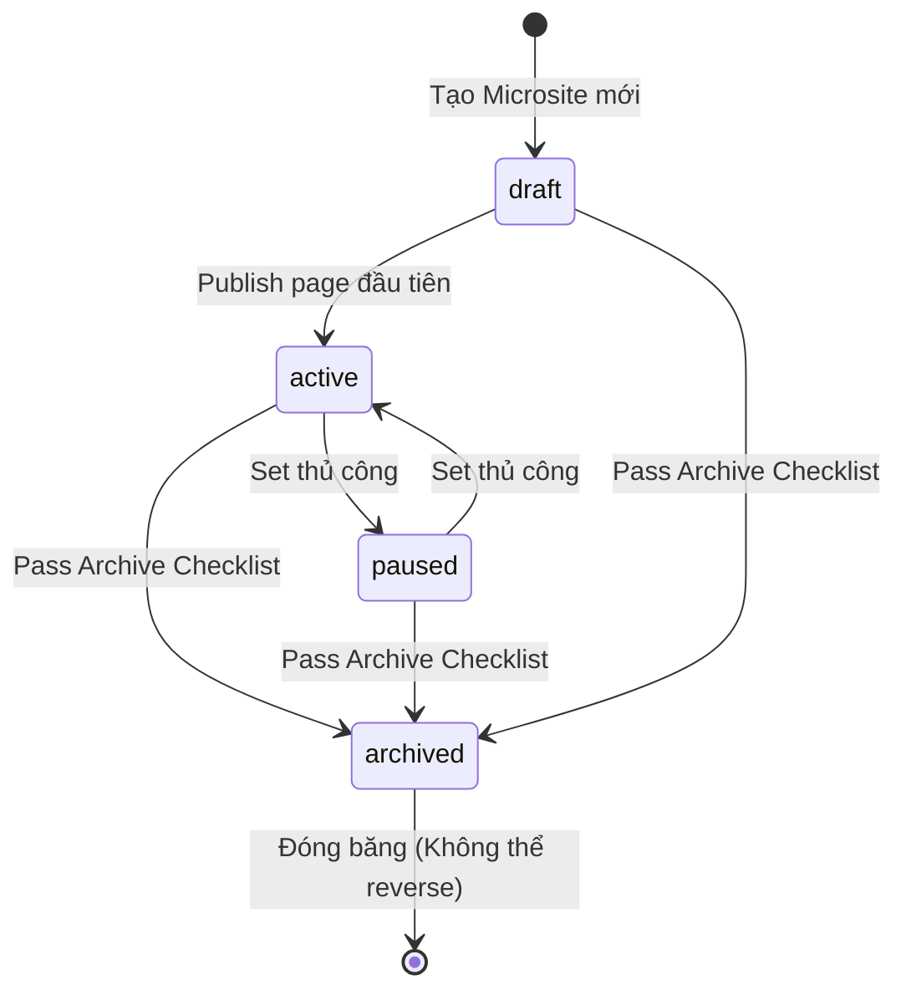

# MoSpark Microsite Management
Quản lý Mini Web theo Use Case + Developer Brief

> - **Project:** MoSpark Web Platform
> - **Module:** Microsite Management
> - **Division:** GPD (Growth Product Division)
> - **Owner:** GPD - Out-App Traffic (Bảo)
> - **Governance:** Văn Hiến (Web Product Lead)
> - **Developer Brief:** Hoài Anh (MoSpark Architecture Owner)
> - **Tài liệu tham chiếu:** [[04_MOSPARK_PLATFORM/mospark_master]]
> - **Version:** 1.2 · May 2026
> - **Status:** Active - Spec Phase

---

## PHẦN I: PRODUCT SPECIFICATION

---

## 1. Executive Summary

### 1.1. Situation

Mỗi Use Case của MoMo (Vay Nhanh, Phạt Nguội, BH xe máy, Cinema...) cần một không gian web riêng biệt - gồm Hub page, Spoke pages, Blog, Ads và Metadata - để rank organic, convert user và đo lường toàn bộ vòng đời. Hiện tại không có nơi nào nhìn thấy toàn bộ portfolio Microsite đang tồn tại, ai own, trạng thái nào và hiệu suất ra sao.

### 1.2. Complication

PM/PO chạy Use Case nhưng không có visibility toàn cục:
- Không biết Use Case mình có Microsite chưa hay cần tạo mới.
- Khi tạo Blog, không biết mình đang publish trong namespace nào - dễ tạo trùng URL hoặc gây Keyword Cannibalization.
- SEO Lead không có single view để audit portfolio tổng thể: Use Case nào đang active, Use Case nào cần archive.
- Không có nơi quản lý llms.txt per Use Case - AI crawler policy đang bị áp dụng chung toàn site thay vì granular theo Use Case.
- **Sitemap không phản ánh Web Structure thực tế:** URL vào/ra sitemap phụ thuộc Dev cấu hình thủ công. Không ai kiểm soát được URL nào deserves to be indexed, URL nào gây crawl budget waste. Content Strategy định nghĩa Hub-Spoke-Blog nhưng sitemap không biết có hierarchy đó tồn tại.

### 1.3. Resolution

**Microsite Management** là màn hình trung tâm của MoSpark - nơi mọi Mini Web (Microsite) được tạo, cấu hình, theo dõi và quản lý vòng đời.

Mỗi Microsite = 1 Use Case = 1 URL namespace trên momo.vn. Đây là **đơn vị gốc** kết nối toàn bộ module: Blog, Sub-pages, Ads, SEO Inventory, llms.txt và Dashboard đều sống bên trong một Microsite cụ thể.

**4 vấn đề được giải quyết:**
- PM/PO thấy tất cả Microsite của GPD trong 1 màn hình, tự tạo mới mà không cần Dev.
- Hệ thống enforce "1 Use Case = 1 Microsite" - không để URL namespace chồng lắp.
- SEO Lead có portfolio view để ưu tiên đầu tư và audit health toàn bộ Microsite.
- **MoSpark làm chủ Sitemap theo Web Structure:** mọi URL live tự động vào sitemap với đúng priority theo tầng (Hub > Tool > Spoke > Blog), mọi URL archive/410 tự động ra khỏi sitemap và submit GSC - không cần Dev can thiệp.

---

## 2. Core Concepts

### 2.1. Microsite là gì

| Thuật ngữ | Định nghĩa |
|---|---|
| **Microsite** | Tên trong platform - đơn vị quản lý nội dung của 1 Use Case trên MoSpark |
| **Mini Web** | Tên hiển thị trên UI mà PM/PO thấy - đồng nghĩa với Microsite |
| **URL Namespace** | Toàn bộ URL nằm dưới prefix của Microsite. Ví dụ: `/vay-nhanh`, `/vay-nhanh/blog/*` |
| **Use Case ID** | Định danh duy nhất của Use Case (ví dụ: `vay-nhanh`, `phat-nguoi`). Không thay đổi sau khi tạo |

Mỗi Microsite quản lý **7 thành phần**:

| Component | Nội dung | Owner |
|---|---|---|
| **Sub-pages** | Hub page, Spoke pages, Landing pages thuộc Use Case | PM/PO |
| **Content** | Blog articles, Static content | PM/Content Team |
| **Meta data** | Title, Description, OG tags, Schema markup per page | MoSpark auto + SEO Lead review |
| **Web Structure & Sitemap** | Hierarchy Hub-Spoke-Blog-Tool + XML Sitemap tự động theo lifecycle | MoSpark auto + SEO Lead govern |
| **llms.txt** | AI crawler policy riêng cho Use Case này | SEO Lead |
| **Dashboard** | Traffic, W2A conversion, Keyword ranking, SEO Inventory per Use Case | PM/PO view |
| **Blog management** | Toàn bộ blog articles - GenAI và Manual | PM/Content Team |

### 2.2. Quan hệ Use Case - Microsite

```
1 Use Case  =  1 Microsite  =  1 URL Namespace
```

- **Hard rule:** Không được tạo 2 Microsite cho cùng 1 Use Case. Hệ thống block nếu Use Case ID đã tồn tại.
- **URL Namespace:** Không được trùng prefix. `/vay-nhanh` đã tồn tại thì không thể tạo Microsite nào khác dùng `/vay-nhanh/*`.
- **Cross-pillar:** 1 Pillar có nhiều Microsite (bình thường). Ví dụ P1 có cả `vay-nhanh`, `vi-tra-sau`, `cic-score`.

### 2.3. Microsite States (Vòng đời)

| Trạng thái | Ý nghĩa | Điều kiện chuyển |
|---|---|---|
| **Draft** | Microsite đã tạo nhưng chưa có page nào live | Mặc định khi tạo mới |
| **Active** | Có ít nhất 1 page live trên momo.vn | Khi publish page đầu tiên |
| **Paused** | Tạm dừng - không publish thêm, pages cũ vẫn live | PM/PO hoặc SEO Lead set thủ công |
| **Archived** | Toàn bộ pages đã 301/410, không còn serve traffic | Sau khi migrate hoặc sunset Use Case |

> **Quy tắc Archive:** Không được Archive khi Microsite vẫn có traffic > 100 sessions/tháng trong GSC. Phải set 301 redirect toàn bộ URL namespace sang đích mới trước khi Archive.

### 2.4. Web Structure Model - Kiến trúc Nội dung từ Content Strategy

Web Structure là **khung xương tổ chức nội dung** của mỗi Microsite - không phải quyết định kỹ thuật, mà là output của Content Strategy. Content Strategy định nghĩa "viết cái gì, cho ai, ở tầng nào trong funnel" - Web Structure là bản dịch của điều đó thành URL hierarchy. Và URL hierarchy quyết định trực tiếp cách Google và AI crawler phân bổ crawl budget.

**Chuỗi nhân quả bất biến:**

```
Content Strategy  →  Web Structure  →  Sitemap  →  Crawl Budget  →  Indexing Speed
```

**Mô hình Hub-Spoke-Blog-Tool:**

| Tầng | URL pattern | Vai trò SEO/Content | Sitemap Priority | Changefreq |
|---|---|---|---|---|
| **Hub** | `/{slug}` | Trang trụ cột - thu gom toàn bộ Link Equity của Use Case. Target transactional keywords. Conversion page. | `1.0` | `weekly` |
| **Tool** | `/{slug}/tool/{name}` | Utility tool tạo unique data (calculator, checker, simulator). Không LLM nào fabricate được. Anti-LLM moat. | `0.9` | `weekly` |
| **Spoke** | `/{slug}/{topic}` | Mở rộng topical authority theo chủ đề. MOFU content - comparison, guide, deep-dive. Dồn link về Hub. | `0.8` | `weekly` |
| **Blog** | `/{slug}/blog/{article}` | Satellite content TOFU/MOFU. Capture informational queries. Dồn link về Spoke hoặc Hub. | `0.7` | `monthly` |
| **Landing Page** | `/landing/{campaign}` | Campaign ngắn hạn. Không rank dài hạn. | **Excluded** | - |

**Nguyên tắc quan trọng:**

- **Hub trước, Spoke sau:** Không publish Spoke khi Hub chưa live. Hub phải là trang authority cao nhất trong namespace. Spoke không có Hub để dồn link về = crawl budget lãng phí.
- **Tool là tầng cao nhất sau Hub:** Tool tạo unique data từ user interaction - đây là moat chống AI scraping. Priority 0.9 để Googlebot và AI crawlers index nhanh.
- **Blog không standalone:** Blog của Microsite phải internal link về Spoke hoặc Hub. Blog không có anchor link trong Use Case = orphan content.
- **Landing Page không vào Sitemap:** Campaign content có thể live trên site nhưng không được claim crawl budget. Loại khỏi sitemap theo mặc định.

**Hierarchy visualization (ví dụ Microsite Vay Nhanh):**

```
/vay-nhanh                          [Hub - Priority 1.0]
├── /vay-nhanh/tool/tinh-lai        [Tool - Priority 0.9]
├── /vay-nhanh/vay-nhanh-khong-the-chap  [Spoke - Priority 0.8]
├── /vay-nhanh/vay-tien-mat         [Spoke - Priority 0.8]
└── /vay-nhanh/blog/
    ├── vay-nhanh-online-co-an-toan-khong  [Blog - Priority 0.7]
    ├── lai-suat-vay-nhanh-2026     [Blog - Priority 0.7]
    └── so-sanh-app-vay-tien        [Blog - Priority 0.7]
```

> **Tại sao Microsite Management phải làm chủ Sitemap:** Chỉ Microsite Management biết tầng của từng URL (Hub, Spoke, Blog, Tool). Không có thông tin này, sitemap chỉ là danh sách phẳng - không phản ánh được content architecture, không tối ưu được crawl budget.

---

## 3. Màn hình Microsite List (Portfolio View)

### 3.1. Mô tả

Màn hình chính sau khi PM/PO đăng nhập MoSpark. Hiển thị toàn bộ Microsite trong tổ chức - không giới hạn theo Cell Team.

### 3.2. Layout

**Header:**
- Tiêu đề: "Microsites"
- Button: "Tạo Microsite mới" (primary action)
- Search: tìm theo tên hoặc URL slug

**Filters:**

| Filter | Options |
|---|---|
| Pillar | Tất cả / P1 - Tài chính & Tín dụng / P2 - Bảo hiểm / P3 - Dịch vụ Công / P4 - Đời sống & Merchant |
| Trạng thái | Tất cả / Draft / Active / Paused / Archived |
| Owner | Tất cả / Tôi own / [Tên PM/PO] |

**Danh sách Microsite - mỗi row hiển thị:**

| Cột | Nội dung | Ghi chú |
|---|---|---|
| **Tên Microsite** | Tên Use Case + URL slug. Ví dụ: "Vay Nhanh · /vay-nhanh" | Clickable - vào Detail |
| **Pillar** | P1 / P2 / P3 / P4 | Badge màu theo Pillar |
| **Trạng thái** | Draft / Active / Paused / Archived | Badge trạng thái |
| **Pages** | Số Sub-pages live / tổng | Ví dụ: "3 / 5 live" |
| **Blogs** | Tổng blog (GenAI + Manual) / số live | Ví dụ: "12 blogs · 10 live" |
| **Traffic 30d** | Sessions organic 30 ngày qua | Pull từ GSC |
| **SEO Score avg** | Điểm trung bình Scoring Gate của các pages | Hiển thị màu: xanh ≥80 / vàng 60-79 / đỏ <60 |
| **Owner** | Avatar PM/PO được assign | - |
| **Actions** | Menu: Cài đặt / Xem Dashboard / Archive | - |

### 3.3. Sort mặc định

Traffic 30d giảm dần - Use Case có traffic cao nhất hiển thị trước.

---

## 4. Create Flow - Tạo Microsite mới

### 4.1. Điều kiện

- **Use Case ID phải duy nhất** trong toàn hệ thống.
- **URL namespace phải chưa tồn tại** trên momo.vn (bao gồm cả legacy pages đang có trong sitemap).
- **Chỉ Platform Admin và SEO Lead** được tạo Microsite mới. PM/PO request, không tự tạo.

> **Lý do restrict Create:** Tạo Microsite = tạo URL namespace mới trên momo.vn. Sai slug = ảnh hưởng indexing toàn domain. Không để PM/PO tự tạo không qua governance check.

### 4.2. Luồng tạo (5 bước)

| Bước | Hành động | Validation |
|---|---|---|
| **1** | Chọn Use Case (từ danh sách có sẵn hoặc tạo mới) | Use Case ID không được trùng |
| **2** | Đặt URL slug (ví dụ: `/vay-nhanh`) | Slug unique toàn domain, chỉ lowercase + gạch ngang, không dấu |
| **3** | Chọn Pillar (P1 / P2 / P3 / P4) | Bắt buộc - quyết định governance rules áp dụng |
| **4** | Assign PM/PO Owner | Ít nhất 1 owner bắt buộc |
| **5** | Xác nhận tạo | Hệ thống khởi tạo Microsite ở trạng thái Draft + tạo 7 tabs rỗng |

### 4.3. Governance tự động theo Pillar

Khi chọn Pillar, hệ thống tự áp dụng governance rules tương ứng:

| Pillar | Rules tự động áp dụng |
|---|---|
| P1 - Tài chính & Tín dụng | Named Author Policy bắt buộc trước publish / Disclaimer block tự động thiếu |
| P2 - Bảo hiểm | Không cho phép geo-based URL (block nếu slug chứa tên tỉnh) |
| P3 - Dịch vụ Công | llms.txt bắt buộc phải config trước khi publish page đầu tiên |
| P4 - Đời sống & Merchant | 410 Gone policy cho URL campaign hết hạn - cảnh báo khi page > 90 ngày không update |

---

## 5. Màn hình Microsite Detail (7 Tabs)

Khi click vào một Microsite trong List View, mở màn hình Detail với header cố định và 7 tabs.

### 5.0. Header Detail (luôn hiển thị)

```
[Tên Microsite]  ·  [URL slug]  ·  [Badge trạng thái]  ·  [Pillar]  ·  [Owner]

[Dashboard nhanh]  Traffic 30d: 12,400  |  Blog live: 8  |  SEO Score avg: 74  |  llms.txt: Configured
```

---

### 5.1. Tab: Sub-pages

**Mục đích:** Quản lý tất cả các trang (không phải Blog) thuộc Microsite.

**Loại Sub-page:**

| Loại | URL pattern | Vai trò |
|---|---|---|
| **Hub page** | `/{slug}` | Trang chính của Use Case. Mỗi Microsite chỉ có 1 Hub. |
| **Spoke page** | `/{slug}/{topic}` | Trang chuyên sâu theo chủ đề. Không giới hạn số lượng. |
| **Landing Page** | `/landing/{campaign}` | Campaign/promotion. Không rank dài hạn. |

**List view Sub-pages - mỗi row:**

| Cột | Nội dung |
|---|---|
| Tên trang | Title + URL |
| Loại | Hub / Spoke / Landing (badge) |
| Trạng thái | Draft / Live / Paused |
| SEO Score | Điểm Scoring Gate |
| Traffic 30d | Sessions GSC |
| Actions | Edit / Preview / Unpublish / Archive |

**Rules:**
- Mỗi Microsite chỉ được có **1 Hub page**. Tạo Hub thứ 2 bị block.
- Hub page phải publish trước Spoke pages.
- Landing Page được tạo và publish độc lập không phụ thuộc Hub.

---

### 5.2. Tab: Blog Management

**Mục đích:** Quản lý toàn bộ blog articles của Microsite - phân biệt GenAI và Manual.

**List view Blog:**

| Loại | Badge | Columns |
|---|---|---|
| **GenAI** | `GenAI` (tím) | Title, Primary Keyword, Status, Ngày tạo, Model, Cost |
| **Manual** | `Manual` (xám) | Title, Primary Keyword, Status, Ngày tạo |

**Filters nhanh:**
- Tất cả / GenAI / Manual
- Trạng thái: Draft / Scheduled / Live / Archived
- Score: Pass / Warning / Blocked

**Khi click vào bài GenAI - Detail view:**

| Panel | Nội dung |
|---|---|
| **Editor** | Full blog editor - chỉnh sửa nội dung, metadata, publish/unpublish |
| **AI Usage** | Input tokens / Output tokens / Cost (theo API pricing tại thời điểm generate) / Model name |

**Khi click vào bài Manual - Detail view:**
- Chỉ hiển thị Editor. Không có AI Usage panel.

> **Lưu ý:** Cost được log tại thời điểm API call, không tính lại sau. Đảm bảo accuracy khi API pricing thay đổi.

**Tạo Blog mới - 2 con đường:**

```
[Tạo với GenAI]  →  Redirect sang GenAI Content Engine (luồng 10 bước)
[Tạo Manual]     →  Mở Blog Editor trực tiếp, nhập Primary Keyword trigger Unique ID Check
```

Cả 2 con đường đều yêu cầu Primary Keyword phải đăng ký trong Keyword Master Registry trước khi publish.

---

### 5.3. Tab: Meta data

**Mục đích:** Xem và audit metadata của tất cả pages trong Microsite.

**Hiển thị dạng bảng - mỗi page 1 row:**

| Cột | Nội dung |
|---|---|
| URL | Đường dẫn |
| Title tag | Nội dung title - highlight đỏ nếu >60 ký tự hoặc thiếu keyword |
| Meta description | Nội dung desc - highlight đỏ nếu >160 ký tự |
| OG Title / OG Image | Trạng thái (Có / Thiếu) |
| Schema markup | Loại schema đã áp dụng (Article, FAQPage, BreadcrumbList...) |
| Canonical | URL canonical - cảnh báo nếu sai |
| Status | Tự động (MoSpark generate) / Tuỳ chỉnh |

**Actions:**
- Click vào bất kỳ row để mở editor metadata của page đó.
- "Chạy Meta Audit" - hệ thống scan toàn bộ pages, highlight issues.

---

### 5.4. Tab: llms.txt

**Mục đích:** Quản lý AI crawler policy riêng cho Use Case này. llms.txt per Microsite supplement cho llms.txt cấp domain.

**Hiển thị:**
- Preview nội dung llms.txt hiện tại của Microsite.
- Trạng thái: Chưa config / Đã config / Cần review.
- Last updated: timestamp lần cuối chỉnh sửa + người chỉnh sửa.

**Editor llms.txt:**
- Free-text editor với syntax highlighting.
- Gợi ý template theo Pillar:
  - P1 (Tài chính): bao gồm disclaimer block, disallow speculative content.
  - P2 (Bảo hiểm): allow neutral comparison, disallow specific pricing.
  - P3 (Dịch vụ Công): allow API data context, priority indexing.
  - P4 (Đời sống): allow merchant data, disallow expired campaigns.

**Rules:**
- P3 (Dịch vụ Công): llms.txt **bắt buộc** phải Configured trước khi publish Hub page.
- Các Pillar khác: Recommended nhưng không phải hard block.

**Owner:** Chỉ SEO Lead có quyền chỉnh sửa. PM/PO xem được nhưng không edit.

---

### 5.5. Tab: Dashboard

**Mục đích:** PM/PO thấy performance tổng thể của Microsite - không cần vào GSC hay GA4 riêng.

**A. Traffic Overview (30 ngày)**

| Metric | Source |
|---|---|
| Organic Sessions | GSC |
| Avg Position (top keywords) | GSC |
| Clicks | GSC |
| W2A Conversion (clicks → App open) | Appsflyer / Onelink |
| New User (Install → Register) | Appsflyer |

**B. SEO Inventory - Market View**

| Thông tin | Ý nghĩa |
|---|---|
| Market Volume (total) | Tổng search volume thị trường của Use Case |
| SoV MoMo hiện tại | MoMo đang chiếm bao nhiêu % |
| SoV Gap | Khoảng cách vs market leader |
| Keywords chưa có content | Cơ hội chưa khai thác - số lượng keyword có volume nhưng chưa có bài |
| TOFU / MOFU / BOFU breakdown | Phân tầng volume theo funnel stage |

**C. Content Health**

| Metric | Nội dung |
|---|---|
| Tổng pages | Live / Draft / Paused |
| Tổng blogs | Live / Draft / Blocked |
| Avg SEO Score | Trung bình tất cả pages live |
| Pages cần review | Số pages có Score < 60 hoặc có Hard Block |
| Blogs cần update | Blogs chưa update > 90 ngày (content decay signal) |

---

### 5.6. Tab: Web Structure & Sitemap

**Mục đích:** Hiển thị kiến trúc nội dung của Microsite dưới dạng hierarchy + quản lý Sitemap inclusion. Đây là nơi SEO Lead kiểm soát những URL nào được claim crawl budget trên momo.vn.

**A. Web Structure View**

Hiển thị dạng tree (cây) toàn bộ URL của Microsite theo tầng:

```
[Hub]  /vay-nhanh                                Traffic: 8.200  Score: 84  [Live]
  ├── [Tool]  /vay-nhanh/tool/tinh-lai            Traffic: 1.100  Score: 79  [Live]
  ├── [Spoke] /vay-nhanh/vay-nhanh-khong-the-chap Traffic: 3.400  Score: 82  [Live]
  ├── [Spoke] /vay-nhanh/vay-tien-mat             Traffic: 210    Score: 61  [Live]
  └── [Blog]  /vay-nhanh/blog/
        ├── lai-suat-vay-nhanh-2026               Traffic: 540    Score: 80  [Live]
        ├── so-sanh-app-vay-tien                  Traffic: 90     Score: 71  [Live]
        └── vay-nhanh-co-an-toan-khong            Traffic: 0      Score: 55  [Blocked]
```

**Cảnh báo tự động:**

| Tình huống | Warning |
|---|---|
| Chưa có Hub nhưng đã có Spoke hoặc Blog | "Microsite chưa có Hub page - Spoke/Blog không có anchor authority" |
| Blog chưa có internal link về Spoke/Hub | "X bài Blog thiếu internal link về Spoke/Hub - orphan content" |
| Spoke chưa có internal link về Hub | "X Spoke chưa link về Hub - Link Equity bị rò rỉ" |
| Tool bị Blocked (Score < 60) | "Tool đang bị Blocked - mất PLG data signal" |
| Hub Score < 80 | "Hub page chưa đạt chuẩn - ảnh hưởng authority toàn Microsite" |

**B. Sitemap Management**

Hiển thị bảng toàn bộ URL thuộc Microsite và trạng thái sitemap:

| Cột | Nội dung |
|---|---|
| **URL** | Đường dẫn đầy đủ |
| **Tầng** | Hub / Tool / Spoke / Blog / Landing |
| **Trạng thái page** | Live / Draft / Paused / Archived |
| **In Sitemap** | Auto-include / Auto-excluded / Force-include / Force-excluded |
| **Priority** | Giá trị priority XML (1.0 / 0.9 / 0.8 / 0.7 / -) |
| **Changefreq** | weekly / monthly / - |
| **Last indexed** | Ngày Google/AI crawler index lần cuối (pull từ GSC) |
| **Override** | SEO Lead force-include / force-exclude |

**Auto-include/exclude rules:**

```
Tự động vào Sitemap:    Page Live + SEO Score ≥ 60 + Tầng != Landing Page
Tự động ra Sitemap:     Page Archived hoặc 410 Gone hoặc Robots=noindex
Landing Page:           Excluded by default (SEO Lead override nếu campaign dài hạn)
```

**Actions trong tab này:**

| Action | Who | Mô tả |
|---|---|---|
| **Force-include** | SEO Lead | Đưa URL vào sitemap dù bị auto-exclude |
| **Force-exclude** | SEO Lead | Loại URL khỏi sitemap tạm thời mà không archive page |
| **Override Priority** | SEO Lead | Thay đổi priority XML cho URL cụ thể |
| **Submit to GSC** | SEO Lead | Trigger GSC ping ngay lập tức cho sitemap của Microsite này |
| **Export Sitemap** | SEO Lead | Download file XML sitemap của Microsite để kiểm tra |

**Sitemap Submission Log:** Ghi lại toàn bộ lần submit: Timestamp - Người trigger - Lý do - Số URLs changed - GSC response.

---

### 5.7. Tab: Settings

**Mục đích:** Cài đặt Microsite - chỉ Platform Admin và SEO Lead chỉnh sửa.

| Cài đặt | Nội dung |
|---|---|
| **Tên Microsite** | Hiển thị trong platform (không ảnh hưởng URL) |
| **Use Case ID** | Chỉ đọc sau khi tạo. Không thể thay đổi |
| **URL Slug** | Chỉ đọc sau khi tạo. Thay đổi yêu cầu approval flow |
| **Pillar** | Chỉ đọc. Thay đổi Pillar = thay đổi governance rules - không cho phép |
| **Owner** | PM/PO được assign. Có thể thêm/xóa owner |
| **Trạng thái** | Thay đổi: Active ↔ Paused. Archive là action riêng với confirmation |
| **Archive Microsite** | Button riêng - yêu cầu confirm + checklist (xem Section 6.2) |

---

## 6. Governance Rules

### 6.1. Rules tạo mới

| Rule | Mô tả | Enforcement |
|---|---|---|
| **1 Use Case = 1 Microsite** | Không tạo 2 Microsite cho cùng Use Case ID | Hard block - hệ thống block khi tạo |
| **URL Slug unique toàn domain** | Slug không được trùng với bất kỳ URL namespace nào đang tồn tại | Hard block - validate trước khi submit |
| **Slug format** | Chỉ lowercase, gạch ngang, không dấu, không ký tự đặc biệt | Validation real-time |
| **Pillar bắt buộc** | Mọi Microsite phải thuộc 1 trong 4 Pillar | Bắt buộc trong create flow |
| **Owner bắt buộc** | Ít nhất 1 PM/PO owner phải assign | Bắt buộc trước khi confirm tạo |

### 6.2. Rules Archive

Archive Microsite là action không thể reverse mà không có manual intervention. Trước khi Archive, hệ thống yêu cầu pass đủ checklist:

| Checklist item | Validation |
|---|---|
| Traffic < 100 sessions/tháng (30 ngày qua) | Pull từ GSC tự động |
| Toàn bộ pages đã set 301/410 | Kiểm tra redirect status của URL namespace |
| Không có Ads campaign đang active | Check Ads Manager module |
| SEO Lead approval | Sign-off bắt buộc |

Nếu bất kỳ item nào chưa pass - hệ thống block Archive và hiển thị lý do cụ thể.

### 6.3. Permission Matrix

| Hành động | PM/PO | Content Team | SEO Lead | Platform Admin |
|---|---|---|---|---|
| Xem Microsite List | Có | Có | Có | Có |
| Tạo Microsite mới | Không (request) | Không | Có | Có |
| Chỉnh sửa Settings | Không | Không | Có | Có |
| Edit Sub-pages | Có | Không | Có | Có |
| Edit Blog | Có | Có | Có | Có |
| Edit Meta data | Không | Không | Có | Có |
| Xem Web Structure & Sitemap | Có (view only) | Có (view only) | Có | Có |
| Force-include / Force-exclude Sitemap | Không | Không | Có | Có |
| Submit to GSC | Không | Không | Có | Có |
| Edit llms.txt | Không | Không | Có | Có |
| Xem Dashboard | Có | Có | Có | Có |
| Archive Microsite | Không (request) | Không | Approve | Thực hiện |

### 6.4. Sitemap Governance Rules

MoSpark là **hệ thống duy nhất** có quyền quyết định URL nào của momo.vn được khai báo trong XML Sitemap.

**Auto-Include:**

| Điều kiện | Kết quả |
|---|---|
| Page live + SEO Score ≥ 60 + Tầng = Hub/Spoke/Blog/Tool | Auto-include với priority mặc định theo tầng, trong vòng 15 phút |
| Tool page live + SEO Score ≥ 60 | Auto-include Priority 0.9 |

**Auto-Exclude:**

| Điều kiện | Kết quả |
|---|---|
| Page Archived hoặc 410 Gone | Auto-remove + auto-submit GSC trong 15 phút |
| Page có Robots=noindex | Auto-remove (consistency: noindex không được khai báo trong sitemap) |
| SEO Score < 60 | Không vào sitemap cho đến khi pass |
| Landing Page | Excluded by default |

**Priority mặc định theo tầng:**

| Tầng | Priority | Changefreq |
|---|---|---|
| Hub | `1.0` | `weekly` |
| Tool | `0.9` | `weekly` |
| Spoke | `0.8` | `weekly` |
| Blog | `0.7` | `monthly` |
| Landing Page | excluded | - |

**Sitemap XML Structure:**

```
momo.vn/sitemap.xml                            [Sitemap Index - auto-generate]
├── momo.vn/sitemap-microsite-vay-nhanh.xml    [Sub-sitemap per Microsite]
├── momo.vn/sitemap-microsite-phat-nguoi.xml
└── ...
```

**GSC Submission triggers tự động:** page live → submit / page archive → submit / force-override → submit. Không có thay đổi → không submit (tránh spam GSC API).

---

## 7. Integration với các Module khác

| Module | Quan hệ với Microsite |
|---|---|
| **M1 - Landing Page Builder** | LP được tạo và quản lý trong tab Sub-pages của Microsite |
| **M2 - GenAI Content Engine** | Blog GenAI phải được map với Microsite trước khi bắt đầu. Blog hiển thị trong tab Blog Management |
| **M3 - Ads Manager** | Campaign Ads gắn với URL thuộc Microsite. Placement Registry kiểm tra conflict theo Microsite namespace |
| **M4 - SEO/GEO Scoring Gate** | Score của mọi pages thuộc Microsite được aggregate vào Dashboard. Hard block apply per page |
| **M5 - SEO Inventory** | Data SEO Inventory per Use Case hiển thị trong Dashboard tab của Microsite |
| **M6 - llms.txt** | llms.txt per Microsite quản lý trong tab llms.txt. Merge với domain-level llms.txt khi serve |
| **M9 - PLG Tool Builder** | Tool được gắn với Microsite như một Sub-page đặc biệt (type: Tool) |

---

## 8. Success Metrics

| Metric | Target | Source |
|---|---|---|
| Time-to-live Microsite mới | Từ request → tạo xong < 1 ngày làm việc | Timestamp log |
| % Microsite có llms.txt Configured | 100% Active Microsites | Platform audit |
| % pages live với Score ≥ 80 | ≥ 80% | Scoring Gate aggregate |
| Archive latency (URL chết đến Archive) | < 7 ngày từ khi traffic = 0 | GSC + Archive log |
| Sitemap accuracy | 100% URL live (Score ≥ 60) có trong sitemap / 0% URL archived còn trong sitemap | Platform audit vs GSC |
| Sitemap update latency | < 15 phút từ khi page live/archive → sitemap updated | Timestamp log |
| % Microsite có Hub page live trước Spoke | 100% | Web Structure audit |
| % Blog có internal link về Spoke/Hub | ≥ 90% | Crawl audit |

---

## 9. Open Questions

| # | Câu hỏi | Priority | Owner |
|---|---|---|---|
| 1 | Slug thay đổi sau khi tạo (rename use case) - luồng approval và redirect handling như thế nào? | CAO | Hiến + Trọng |
| 2 | 1 PM/PO có thể own nhiều Microsite không? Có limit không? | TRUNG BINH | Bảo |
| 3 | Khi merge 2 Use Case (ví dụ Vay Nhanh + CIC Score → Credit Hub) - Microsite merge hay 301 về Microsite mới? | TRUNG BINH | Hiến |
| 4 | Dashboard pull GSC real-time hay cache 24h? | KỸ THUẬT | Trọng |
| 5 | Landing Page nào hiện tại đang trong sitemap? Cần audit trước khi enforce exclude rule. | CAO | Hiến |

---

## PHẦN II: TECHNICAL SPECIFICATION - DEVELOPER BRIEF

> **Từ:** Văn Hiến (Web Product Lead)
> **Đến:** Hoài Anh (MoSpark Architecture Owner)
> **Scope:** 5 modules - Microsite CRUD, llms.txt, Sitemap, Blog Management, Blog Widget Integration
> **Status:** Spec Phase - chờ Hoài Anh confirm feasibility

### Nguyên tắc chung

Trước khi đọc từng module, cần nắm 3 nguyên tắc bất biến:

1. **Microsite = đơn vị gốc.** Mọi entity (Blog, Sub-page, Ads, llms.txt, Sitemap entry) đều phải gắn với một Microsite ID. Không có entity nào tồn tại ngoài Microsite.
2. **Automation first.** Sitemap, llms.txt merge, Keyword unique check - tất cả phải tự động. SEO Lead chỉ override khi cần, không phải tự làm từ đầu.
3. **Hard block thay vì soft warning cho các gate quan trọng.** Hub publish trước Spoke = hard block, không phải cảnh báo bỏ qua được.

---

## Module 1: Microsite CRUD

### 1.1. Data Model

| Field | Type | Required | Mô tả | Ghi chú |
|---|---|---|---|---|
| `microsite_id` | UUID | Có | Primary key, auto-generate | Không bao giờ thay đổi sau khi tạo |
| `use_case_id` | string | Có | Unique identifier của Use Case. Ví dụ: `vay-nhanh` | Unique toàn hệ thống. Không thay đổi sau tạo |
| `name` | string | Có | Tên hiển thị trong platform. Ví dụ: "Vay Nhanh" | Thay đổi được - không ảnh hưởng URL |
| `slug` | string | Có | URL prefix. Ví dụ: `vay-nhanh` | Unique toàn domain. Không thay đổi sau tạo |
| `pillar` | enum | Có | `P1` / `P2` / `P3` / `P4` | Quyết định governance rules áp dụng |
| `status` | enum | Có | `draft` / `active` / `paused` / `archived` | State machine - xem 1.3 |
| `owners` | array(user_id) | Có | Ít nhất 1 PM/PO owner | Nhiều owners được phép |
| `created_by` | user_id | Có | SEO Lead hoặc Platform Admin tạo | Auto-assign từ session |
| `created_at` | timestamp | Có | Auto | - |
| `updated_at` | timestamp | Có | Auto update mỗi khi có thay đổi | - |
| `pillar_rules` | object | Tự động | Rules được inject theo Pillar (xem 1.4) | Không edit trực tiếp |

### 1.2. Validation Rules khi tạo mới

**Tất cả checks phải pass trước khi commit vào DB:**

| # | Rule | Error message khi fail |
|---|---|---|
| 1 | `use_case_id` chưa tồn tại trong bảng Microsites | "Use Case ID đã tồn tại. Mỗi Use Case chỉ có 1 Microsite." |
| 2 | `slug` chưa tồn tại trong bảng Microsites | "URL slug đã được dùng bởi Microsite khác." |
| 3 | `slug` không trùng với bất kỳ URL path nào đang có trong sitemap momo.vn | "URL slug này đã có trong sitemap. Kiểm tra lại với SEO Lead." |
| 4 | `slug` format: chỉ lowercase a-z, 0-9, dấu gạch ngang (-). Không dấu. Không ký tự đặc biệt | "Slug không hợp lệ. Chỉ dùng chữ thường, số và dấu gạch ngang." |
| 5 | `pillar` thuộc enum hợp lệ | "Pillar không hợp lệ." |
| 6 | `owners` có ít nhất 1 user_id hợp lệ | "Cần assign ít nhất 1 owner." |
| 7 | Người tạo có role `seo_lead` hoặc `platform_admin` | "Bạn không có quyền tạo Microsite. Liên hệ SEO Lead." |

### 1.3. State Machine



**Transition rules:**

| Từ | Sang | Trigger | Condition bắt buộc |
|---|---|---|---|
| `draft` | `active` | Khi page đầu tiên của Microsite được publish | Tự động |
| `active` | `paused` | SEO Lead hoặc PM/PO set thủ công | Không có condition cứng |
| `paused` | `active` | SEO Lead hoặc PM/PO set thủ công | Không có condition cứng |
| `active` / `paused` | `archived` | SEO Lead trigger → Platform Admin confirm | Phải pass Archive Checklist (xem 1.5) |
| `archived` | bất kỳ | **Không cho phép** | Block hoàn toàn - cần manual DB intervention |

### 1.4. Pillar Rules (inject tự động khi tạo)

| Pillar | Rules inject |
|---|---|
| `P1` | `require_named_author: true` - Block publish Hub/Spoke nếu page chưa có Author field đầy đủ. `require_disclaimer: true` - Block publish nếu thiếu disclaimer block. |
| `P2` | `block_geo_slug: true` - Validate: slug và tất cả sub-page URLs không được chứa tên tỉnh thành (danh sách 63 tỉnh). Block tạo Sub-page nếu vi phạm. |
| `P3` | `require_llms_txt_before_publish: true` - Block publish Hub page nếu llms.txt của Microsite chưa ở trạng thái `configured`. |
| `P4` | `alert_stale_page_days: 90` - Tạo alert nếu page không được update sau 90 ngày. Áp dụng cho Sub-pages loại Landing. |

### 1.5. Archive Checklist

Hệ thống tự động kiểm tra, hiển thị pass/fail per item, block Archive nếu bất kỳ item nào fail:

| # | Check | Source |
|---|---|---|
| 1 | Organic sessions 30 ngày qua < 100 | GSC API |
| 2 | Toàn bộ URL trong namespace đã có redirect 301/308 hoặc 410 | Redirect table + crawl check |
| 3 | Không có Ads campaign nào đang ở trạng thái `active` trong Ads Manager gắn với Microsite này | Ads Manager API |
| 4 | SEO Lead đã confirm (trường `seo_lead_approval: true`) | Manual sign-off trong UI |

---

## Module 2: llms.txt per Microsite

### 2.1. Quyết định kiến trúc

**Serving URL:** Chỉ có 1 file llms.txt tại `momo.vn/llms.txt` (cấp domain). Không tạo `/{slug}/llms.txt` per Microsite.

**Lý do:** Chuẩn llms.txt theo Anthropic/OpenAI convention chỉ định nghĩa 1 file tại root. AI inference engine chỉ fetch root. File per-Microsite sẽ không được AI đọc.

**Approach:** File `momo.vn/llms.txt` được **auto-generate** bằng cách merge:
```
[Domain-level policy - SEO Lead quản lý]
+
[Per-Microsite sections - từng Microsite contribute 1 section]
```

### 2.2. Structure của llms.txt được generate

```markdown
# MoMo - momo.vn
[Domain-level content do SEO Lead viết - không auto-generate]

---

## Vay Nhanh (/vay-nhanh)
[Content từ llms.txt config của Microsite vay-nhanh]

## Ví Trả Sau (/vi-tra-sau)
[Content từ llms.txt config của Microsite vi-tra-sau]

## [Tên Microsite khác]...
```

Mỗi khi Microsite llms.txt được update, hệ thống regenerate toàn bộ file merged và serve tại `momo.vn/llms.txt`.

### 2.3. Data Model

| Field | Type | Mô tả |
|---|---|---|
| `microsite_id` | UUID | FK đến Microsite |
| `status` | enum | `not_configured` / `configured` / `needs_review` |
| `content` | text | Raw content của section này trong llms.txt |
| `template_applied` | string | Template đã dùng: `P1_financial` / `P2_insurance` / `P3_public_service` / `P4_lifestyle` / `custom` |
| `updated_by` | user_id | Chỉ SEO Lead được update |
| `updated_at` | timestamp | Auto |

### 2.4. Template mặc định theo Pillar

| Pillar | Template ID | Nội dung gợi ý |
|---|---|---|
| `P1` | `P1_financial` | Use Case description + disclaimer AI không được đưa ra tư vấn tài chính cụ thể + danh sách allowed queries |
| `P2` | `P2_insurance` | Use Case description + disclaimer giá bảo hiểm thay đổi + allow neutral comparison queries |
| `P3` | `P3_public_service` | Use Case description + note data là real-time từ API + priority indexing context |
| `P4` | `P4_lifestyle` | Use Case description + merchant data context + note campaign content có expiry |

### 2.5. Trigger regenerate llms.txt root

Hệ thống regenerate `momo.vn/llms.txt` khi:
- Microsite llms.txt content được update và saved
- Microsite status thay đổi sang `archived` (remove section khỏi merged file)
- Microsite mới được tạo và llms.txt configured lần đầu

**Output:** Serve static file hoặc generate on-the-fly với cache. SEO Lead không cần làm gì sau khi save - file tự cập nhật trong vòng 60 giây.

### 2.6. Acceptance Criteria

- [ ] Tab llms.txt trong Microsite Detail hiển thị editor với nội dung hiện tại
- [ ] Chỉ user có role `seo_lead` hoặc `platform_admin` mới thấy được nút Save
- [ ] Khi save, status tự đổi thành `configured` nếu content không rỗng
- [ ] `momo.vn/llms.txt` được regenerate trong vòng 60 giây sau khi save
- [ ] File merged có format đúng: Domain section trước, per-Microsite sections sau, mỗi section có heading `## {Microsite name} (/{slug})`
- [ ] Microsite có status `archived` không có section trong file merged
- [ ] Pillar `P3`: Nút "Publish Hub" bị disabled với tooltip "Cần config llms.txt trước" nếu `status = not_configured`

---

## Module 3: Sitemap Auto-management

### 3.1. XML Structure

```
momo.vn/sitemap.xml                           ← Sitemap Index (auto-generate)
├── momo.vn/sitemap-microsite-vay-nhanh.xml   ← Sub-sitemap per Microsite (auto-generate)
├── momo.vn/sitemap-microsite-phat-nguoi.xml
├── momo.vn/sitemap-microsite-bh-xe-may.xml
└── ...
```

Sitemap Index chứa `<sitemap>` entries cho tất cả Microsite có status `active` hoặc `paused`. Microsite `draft` và `archived` không xuất hiện trong Sitemap Index.

### 3.2. Data Model: Sitemap Entry

| Field | Type | Mô tả |
|---|---|---|
| `sitemap_entry_id` | UUID | PK |
| `microsite_id` | UUID | FK |
| `page_id` | UUID | FK đến Sub-page hoặc Blog |
| `url` | string | Full URL. Ví dụ: `https://momo.vn/vay-nhanh` |
| `page_type` | enum | `hub` / `spoke` / `blog` / `tool` / `landing` |
| `inclusion_mode` | enum | `auto` / `force_include` / `force_exclude` |
| `priority` | decimal | 0.0 - 1.0 |
| `changefreq` | enum | `daily` / `weekly` / `monthly` / `yearly` |
| `last_modified` | timestamp | Ngày page được update lần cuối |
| `included_in_sitemap` | boolean | Kết quả cuối cùng: có trong sitemap hay không |
| `exclusion_reason` | string | Null nếu included. Ghi lý do nếu excluded: `low_score` / `landing_page` / `noindex` / `archived` / `force_excluded` |

### 3.3. Logic quyết định included_in_sitemap

```
if inclusion_mode == 'force_include':
    included = true

elif inclusion_mode == 'force_exclude':
    included = false

else:  # auto mode
    if page_type == 'landing':
        included = false
        exclusion_reason = 'landing_page'
    elif page.status in ['archived', '410']:
        included = false
        exclusion_reason = 'archived'
    elif page.robots_noindex == true:
        included = false
        exclusion_reason = 'noindex'
    elif page.seo_score < 60:
        included = false
        exclusion_reason = 'low_score'
    else:
        included = true
```

### 3.4. Priority mặc định theo page_type

| page_type | priority | changefreq |
|---|---|---|
| `hub` | `1.0` | `weekly` |
| `tool` | `0.9` | `weekly` |
| `spoke` | `0.8` | `weekly` |
| `blog` | `0.7` | `monthly` |
| `landing` | excluded | - |

SEO Lead override được bằng cách set trực tiếp `priority` và `changefreq` + set `inclusion_mode = force_include`.

### 3.5. Trigger Events

| Event | Action | Latency target |
|---|---|---|
| Page status → `live` + seo_score ≥ 60 + page_type != `landing` | Thêm entry vào sitemap sub-microsite | < 15 phút |
| Page seo_score vượt ngưỡng 60 (trước đó < 60) | Thêm entry vào sitemap | < 15 phút |
| Page status → `archived` hoặc `410` | Remove entry khỏi sitemap + submit GSC | < 15 phút |
| Page robots_noindex = true | Remove entry khỏi sitemap | < 15 phút |
| SEO Lead force-include / force-exclude | Update ngay + submit GSC | < 5 phút |
| SEO Lead click "Submit to GSC" | Ping GSC API với URL của sub-sitemap Microsite | Ngay lập tức |
| Microsite status → `archived` | Remove sub-sitemap khỏi Sitemap Index + submit | < 15 phút |

### 3.6. GSC Integration

Dùng **Google Search Console Sitemap Submission API**:
- Endpoint: `POST https://searchconsole.googleapis.com/v1/sitemaps/{sitemapUrl}:submit`
- Authentication: Service account của momo.vn GSC property
- Khi trigger: Submit URL của sub-sitemap cụ thể (`momo.vn/sitemap-microsite-{slug}.xml`), không submit toàn bộ sitemap index

**Submission Log table:**

| Field | Type |
|---|---|
| `log_id` | UUID |
| `microsite_id` | UUID |
| `trigger_type` | `auto_page_live` / `auto_page_archive` / `manual_seo_lead` |
| `triggered_by` | user_id (null nếu auto) |
| `sitemap_url` | string |
| `urls_changed_count` | int |
| `gsc_response_code` | int |
| `submitted_at` | timestamp |

### 3.7. Web Structure Validation

Hệ thống tự động check và hiển thị warnings sau khi mỗi page publish:

| Condition | Warning type | Severity |
|---|---|---|
| Microsite có Spoke page live nhưng chưa có Hub live | `no_hub` | Error |
| Blog page không có internal link href trỏ về domain momo.vn/{slug}/* | `orphan_blog` | Warning |
| Spoke page không có internal link href trỏ về `/{slug}` (Hub) | `spoke_no_hub_link` | Warning |
| Tool page bị Blocked (seo_score < 60) | `tool_blocked` | Warning |
| Hub page seo_score < 80 | `hub_low_score` | Info |

**Cách detect orphan:** Parse content HTML của page khi publish, extract tất cả `<a href>`, check xem có link nào match pattern. Không cần crawl external - chỉ parse content tại thời điểm save/publish.

### 3.8. Acceptance Criteria

- [ ] `momo.vn/sitemap.xml` là Sitemap Index, chứa `<sitemap>` entries cho tất cả Microsite active/paused
- [ ] Mỗi Microsite active có 1 file `momo.vn/sitemap-microsite-{slug}.xml`
- [ ] Khi page live và score ≥ 60 và không phải Landing: xuất hiện trong sub-sitemap trong vòng 15 phút
- [ ] Khi page archive/410: biến mất khỏi sub-sitemap trong vòng 15 phút + GSC submit tự động
- [ ] Landing Page không bao giờ xuất hiện trong sitemap (trừ force_include)
- [ ] Priority đúng theo page_type (hub=1.0, tool=0.9, spoke=0.8, blog=0.7)
- [ ] SEO Lead có thể force-include/exclude và thay đổi priority từ UI
- [ ] Nút "Submit to GSC" hoạt động và log kết quả vào Submission Log
- [ ] Warning `no_hub` hiển thị khi Spoke live nhưng Hub chưa live
- [ ] Tab Web Structure hiển thị tree view đúng theo tầng với traffic + score per node

---

## Module 4: Blog Management

### 4.1. Blog Entity Data Model

| Field | Type | Required | Mô tả |
|---|---|---|---|
| `blog_id` | UUID | Có | PK |
| `microsite_id` | UUID | Có | FK - Blog phải thuộc 1 Microsite |
| `primary_keyword` | string | Có | Lowercase, chuẩn hóa. Unique per Microsite (Keyword Master Registry) |
| `title` | string | Có | H1/Title tag |
| `slug` | string | Có | URL path. Ví dụ: `lai-suat-vay-nhanh-2026` → URL: `/{microsite_slug}/blog/{blog_slug}` |
| `status` | enum | Có | `draft` / `scheduled` / `live` / `archived` |
| `creation_type` | enum | Có | `genai` / `manual` - Set khi tạo, **không thay đổi được sau đó** |
| `seo_score` | int | Auto | 0-100 từ Scoring Gate |
| `hard_block` | boolean | Auto | true nếu có Hard Block trong Scoring Gate |
| `author_id` | user_id | Conditional | Bắt buộc với Microsite Pillar P1 (Named Author Policy) |
| `created_by` | user_id | Có | Auto |
| `created_at` | timestamp | Có | Auto |
| `published_at` | timestamp | | Set khi status → live |
| `updated_at` | timestamp | Có | Auto |

**Nếu creation_type = `genai`, thêm bảng Blog_GenAI_Usage:**

| Field | Type | Mô tả |
|---|---|---|
| `blog_id` | UUID | FK |
| `outline_id` | UUID | FK đến Outline đã được Selected trong GenAI flow |
| `model_name` | string | Ví dụ: `claude-sonnet-4-6` |
| `input_tokens` | int | Token count của prompt |
| `output_tokens` | int | Token count của response |
| `cost_usd` | decimal | Chi phí tính tại thời điểm API call theo pricing hiện tại |
| `cost_locked_at` | timestamp | Timestamp lúc log cost - **không recalculate sau này** |
| `generation_step` | enum | `outline` / `detail` - bước nào trigger API call |

> **Quan trọng - Cost logging:** `cost_usd` được tính và lock tại thời điểm API call. Không recalculate dù pricing thay đổi sau đó.

### 4.2. Keyword Master Registry (Unique Check)

**Rule:** Trong cùng 1 Microsite, không được có 2 Blog cùng `primary_keyword`.

| Field | Type | Mô tả |
|---|---|---|
| `registry_id` | UUID | PK |
| `microsite_id` | UUID | FK |
| `primary_keyword` | string | Lowercase, chuẩn hóa (trim, lowercase, collapse spaces) |
| `blog_id` | UUID | FK đến Blog đang sở hữu keyword này |
| `registered_at` | timestamp | Khi nào keyword được đăng ký |
| `source` | enum | `genai_flow` / `manual_editor` (Bottom-Up Sync từ Blog Editor) |

**Unique constraint:** `(microsite_id, primary_keyword)` phải unique.

**Top-Down Sync:** Khi PM/PO tạo Primary Keyword trong GenAI module → tự động tạo record trong Registry + tạo Blog draft với `creation_type = genai`.

**Bottom-Up Sync:** Khi Content Team nhập Primary Keyword vào Blog Editor (manual path) → check Registry trước khi cho phép save. Nếu keyword đã tồn tại → hiển thị error: "Keyword này đã có bài viết: [{Title}](/link). Dùng từ khóa khác hoặc cập nhật bài cũ."

**Chuẩn hóa keyword:**
```
normalized = keyword.strip().lower().replace(/\s+/g, ' ')
```

### 4.3. Blog List View UI

**2 badge types:**

| Badge | Màu | Khi nào hiển thị |
|---|---|---|
| `GenAI` | Tím (#8B5CF6) | `creation_type = genai` |
| `Manual` | Xám (#6B7280) | `creation_type = manual` |

**Columns trong List:**

| Column | GenAI row | Manual row |
|---|---|---|
| Badge | `GenAI` (tím) | `Manual` (xám) |
| Title | Có | Có |
| Primary Keyword | Có | Có |
| Status | Có | Có |
| Ngày tạo | Có | Có |
| Model | Có | Không hiển thị (empty cell) |
| Cost | Có (USD, 4 decimals) | Không hiển thị |
| SEO Score | Có | Có |

**Filters:** Creation type / Status / Score (Pass ≥80 / Warning 60-79 / Blocked <60)

### 4.4. Blog Detail View UI

**GenAI blog → 2-panel layout:**

```
+-----------------------------------+------------------+
|                                   |                  |
|         EDITOR PANEL              |  AI USAGE PANEL  |
|   (full blog editor, metadata,    |                  |
|    publish controls)              |  Model: claude-  |
|                                   |  sonnet-4-6      |
|                                   |  Input: 4,231    |
|                                   |  Output: 1,847   |
|                                   |  Cost: $0.0182   |
|                                   |  (locked at      |
|                                   |  2026-05-26)     |
+-----------------------------------+------------------+
```

**Manual blog → 1-panel layout:** Chỉ Editor panel. Không có AI Usage panel - không phải placeholder hay empty state, không render gì cả.

### 4.5. Publish Gate

| # | Check | Enforcement |
|---|---|---|
| 1 | `primary_keyword` đã đăng ký trong Keyword Master Registry | Hard block nếu chưa đăng ký |
| 2 | `seo_score >= 60` và `hard_block = false` | Hard block nếu fail |
| 3 | `author_id` không null (chỉ với Microsite P1) | Hard block nếu thiếu |
| 4 | `seo_score < 80` | Warning (có thể bỏ qua) |

**GenAI blog:** Bước 6 (Outline Selected) phải là `true` trước khi Blog Draft được tạo. Nếu Outline chưa được Select, nút "Push to Blog Editor" bị disabled.

### 4.6. Blog URL Pattern

```
/{microsite_slug}/blog/{blog_slug}
```

Ví dụ: `/vay-nhanh/blog/lai-suat-vay-nhanh-2026`

`blog_slug` auto-generate từ title (lowercase, no diacritics, gạch ngang). Cho phép SEO Lead edit thủ công trước khi publish. Không thay đổi sau khi live (cần redirect nếu đổi).

### 4.7. Acceptance Criteria

- [ ] Tạo Blog Manual từ Blog Editor: nhập Primary Keyword → trigger Unique ID Check → hiện error nếu trùng
- [ ] Tạo Blog GenAI: chỉ tạo được khi Outline đã Selected trong GenAI Flow
- [ ] `creation_type` không thể thay đổi sau khi tạo (readonly field)
- [ ] GenAI blog list row hiển thị đủ: Model name, Cost (4 decimals USD)
- [ ] Manual blog list row không hiển thị Model và Cost columns (empty, không phải 0 hay "-")
- [ ] GenAI blog detail: 2-panel layout, AI Usage panel hiển thị đúng data từ Blog_GenAI_Usage
- [ ] Manual blog detail: chỉ 1 panel Editor, không có AI Usage panel
- [ ] Nút Publish bị block nếu seo_score < 60 hoặc hard_block = true
- [ ] Nút Publish bị block nếu primary_keyword chưa có trong Keyword Master Registry
- [ ] Cost trong AI Usage panel là giá trị lock tại `cost_locked_at`, không recalculate
- [ ] Blog URL pattern đúng: `/{microsite_slug}/blog/{blog_slug}`
- [ ] Khi blog live: tự động thêm vào Sitemap sub-microsite nếu seo_score ≥ 60 (Module 3)

---

## Module 5: Blog Widget Integration

### 5.1. Bối cảnh và Vai trò Widget trong Blog

Widget là **Native Product Component** nhúng trực tiếp vào nội dung Blog thông qua shortcode. Khác với Ads/Banner, Widget là chức năng thực của dịch vụ - user tương tác ngay trên trang mà không cần mở App. Đây là format W2A conversion cao nhất và không interrupt SEO.

**Hai loại Widget trong Blog:**

| Loại | Shortcode | Owner | Governed bởi |
|---|---|---|---|
| **Primary Widget** | `[widget:{microsite_use_case_id}]` | Widget của cùng Use Case với Microsite | Blog Management (module này) |
| **Cross-service Widget** | `[widget:{other_use_case_id}]` | Widget từ Use Case khác (cross-sell) | Ads Manager - ngoài scope module này |

> **Scope:** Chỉ cover Primary Widget. Cross-service Widget do Ads Manager quản lý, Blog Editor chỉ render shortcode nếu Ads Manager inject vào.

### 5.2. Data Model

**Bảng Widget_Library:**

| Field | Type | Required | Mô tả |
|---|---|---|---|
| `widget_id` | UUID | Có | PK |
| `use_case_id` | string | Có | Unique. Ví dụ: `phat-nguoi`, `vay-nhanh` |
| `shortcode` | string | Có | Format chuẩn: `[widget:{use_case_id}]`. Auto-generate từ use_case_id |
| `display_name` | string | Có | Tên hiển thị trong Editor dropdown. Ví dụ: "Tra cứu Phạt Nguội" |
| `component_type` | enum | Có | `lookup` / `calculator` / `purchase_flow` / `registration` |
| `status` | enum | Có | `active` / `inactive` |
| `preview_thumbnail_url` | string | | URL ảnh preview của Widget |
| `created_at` | timestamp | Có | Auto |

**Bảng Blog_Widget:**

| Field | Type | Required | Mô tả |
|---|---|---|---|
| `blog_widget_id` | UUID | Có | PK |
| `blog_id` | UUID | Có | FK → Blog |
| `widget_id` | UUID | Có | FK → Widget_Library |
| `placement_mode` | enum | Có | `auto` / `manual` |
| `auto_insert_disabled` | boolean | Có | Default `false`. Khi `true`: auto-placement bị tắt cho Blog này |
| `shortcode_in_content` | boolean | Có | `true` nếu shortcode đang tồn tại trong content của Blog |

### 5.3. Auto-placement Logic

**Trigger:** Khi Blog chuyển status từ `draft` → `live` (publish lần đầu tiên).

```
if blog.auto_insert_disabled == true:
    → Bỏ qua, không insert

if shortcode của Primary Widget đã tồn tại trong blog.content:
    → Shortcode đã có (manual đặt sẵn), không insert thêm
    → Ghi Blog_Widget record với placement_mode = 'manual'

else:
    → Tự động inject shortcode vào content
    → Ghi Blog_Widget record với placement_mode = 'auto'
```

**Vị trí auto-insert (theo thứ tự ưu tiên):**

| Ưu tiên | Điều kiện | Vị trí insert |
|---|---|---|
| 1 | Bài có từ 2 `<h2>` trở lên | Trước `<h2>` cuối cùng trong bài |
| 2 | Bài có `<h2>` nhưng chỉ 1 cái | Sau `<h2>` đầu tiên + 2 paragraph |
| 3 | Bài không có `<h2>` nào | Sau paragraph thứ 3 (đếm từ đầu) |
| 4 | Bài có dưới 3 paragraph | Cuối nội dung, trước `</article>` |

**Auto-placement chỉ chạy một lần khi publish lần đầu. Không re-run khi update bài đã live.**

### 5.4. Manual Placement UI trong Blog Editor

**Toolbar button "Chèn Widget":** Trong toolbar của Blog Editor (cùng row với Bold, Italic, Insert Image). Click → mở Widget Picker.

**Widget Picker:**
```
[Thumbnail] Tra cứu Phạt Nguội          [widget:phat-nguoi]    [Chèn]
[Thumbnail] Tính lãi suất Vay Nhanh     [widget:vay-nhanh]     [Chèn]
[Thumbnail] Tra cứu BHYT                [widget:bhyt]          [Chèn]
...
```

- Highlight Widget của Microsite hiện tại (Primary Widget) ở đầu danh sách
- Click "Chèn" → insert shortcode tại vị trí cursor hiện tại

**Shortcode render trong Editor (placeholder block - không render Widget thật):**

```
┌─────────────────────────────────────────┐
│  [Widget: Tra cứu Phạt Nguội]           │
│  [widget:phat-nguoi]    [Xóa] [Di chuyển] │
└─────────────────────────────────────────┘
```

- **Xóa:** Remove shortcode. Nếu là Primary Widget được auto-insert → confirm: "Widget này được auto-insert. Xóa sẽ tắt auto-placement cho bài này. Tiếp tục không?"
- **Di chuyển:** Drag-and-drop sang vị trí khác trong content

**Preview mode:** Widget render thật - hiển thị component đúng như trên production.

### 5.5. Disable Auto-placement Per Blog

Toggle trong Blog Settings panel:
```
[Toggle] Tắt Auto Widget
Khi bật: hệ thống sẽ không tự chèn Widget vào bài này khi publish.
```

- Default: OFF (auto-placement hoạt động bình thường)
- Khi toggle ON: set `Blog_Widget.auto_insert_disabled = true`
- Khi toggle ON sau khi Widget đã được auto-insert: cảnh báo "Widget hiện đang trong bài. Bật toggle này sẽ không xóa Widget đang có, nhưng sẽ không tự chèn lại nếu bạn xóa nó."

### 5.6. Rendering trên Production

```
[widget:phat-nguoi]
      ↓
<div class="mospark-widget" data-widget="phat-nguoi" data-microsite="phat-nguoi">
  <!-- Widget component render tại đây -->
</div>
```

**Yêu cầu SEO cứng:**
- Widget container phải có `data-widget` attribute
- Không dùng `display: none` hay lazy-load quá chậm - ảnh hưởng CLS và INP
- Rendering approach (SSR vs CSR): Hoài Anh quyết định theo architecture hiện tại

**SEO-safe fallback:**

```html
<div class="mospark-widget" data-widget="phat-nguoi">
  <!-- Rendered by JS -->
  <noscript>
    <a href="https://onelink.momo.vn/..." class="widget-cta-fallback">
      Tra cứu Phạt Nguội trên MoMo
    </a>
  </noscript>
</div>
```

### 5.7. Blog Widget Status trong List View

Thêm column **Widget** vào Blog List View:

| State | Hiển thị |
|---|---|
| Auto-insert hoạt động | `Auto` (xanh) |
| Content writer đặt thủ công | `Manual` (xám) |
| auto_insert_disabled = true | `Tắt` (đỏ) |
| Không có Widget | `Chưa có` |

### 5.8. Rules tổng hợp

| # | Rule | Enforcement |
|---|---|---|
| 1 | Mỗi Blog chỉ có tối đa **1 Primary Widget** (cùng Use Case với Microsite) | Warning trong Editor nếu insert Primary Widget 2 lần |
| 2 | Cross-service Widget (từ Use Case khác) không bị limit - do Ads Manager quản lý | Blog Editor không validate Cross-service, chỉ render shortcode |
| 3 | Widget của Use Case `inactive` trong Widget_Library vẫn render shortcode đã có trong content cũ | Hiển thị warning trong Editor: "Widget này đang inactive" |
| 4 | Khi Microsite archived → Widget của Microsite đó tự động set `inactive` | Alert tất cả Blogs đang có shortcode của Widget này |
| 5 | Auto-placement chỉ chạy một lần khi publish lần đầu tiên | Không re-run khi update bài đã live |

### 5.9. Acceptance Criteria

- [ ] Auto-placement inject shortcode `[widget:{microsite_use_case_id}]` khi Blog publish lần đầu, đúng vị trí theo priority table (5.3)
- [ ] Auto-placement bỏ qua nếu shortcode Primary Widget đã có trong content
- [ ] Auto-placement bỏ qua nếu `auto_insert_disabled = true`
- [ ] Toolbar có nút "Chèn Widget" → mở Widget Picker với danh sách Widgets active
- [ ] Primary Widget của Microsite hiện tại được highlight ở đầu danh sách trong Widget Picker
- [ ] Shortcode render dưới dạng placeholder block trong Editor (không render Widget thật khi đang edit)
- [ ] Preview mode render Widget thật
- [ ] Blog List View có column Widget hiển thị đúng 4 states: Auto / Manual / Tắt / Chưa có
- [ ] Toggle "Tắt Auto Widget" hoạt động và persist vào `auto_insert_disabled`
- [ ] Xóa Primary Widget shortcode từ Editor → hiện confirm dialog nếu Widget đó được auto-insert
- [ ] Production render: `[widget:xxx]` → `<div class="mospark-widget" data-widget="xxx">` với fallback noscript CTA
- [ ] Widget container không dùng `display:none` lazy-load - phải visible trong initial render để không affect CLS

---

## Checklist trước khi bắt đầu build

Hoài Anh cần confirm với Hiến trước khi code:

| # | Câu hỏi cần confirm | Quyết định trong spec này |
|---|---|---|
| 1 | GSC Indexing API hay Sitemap Submission API? | **Sitemap Submission API** (submit URL của sub-sitemap) |
| 2 | llms.txt: serve static file hay generate on-the-fly? | Cần Hoài Anh đề xuất - static (cache cần invalidate) hay dynamic (mỗi request merge) |
| 3 | Orphan blog detection: real-time khi publish hay background job? | **Parse HTML khi publish** - real-time |
| 4 | Blog_GenAI_Usage: lưu per generation hay aggregate per blog? | **Per generation** (có thể có nhiều API calls cho 1 blog: outline + detail) |
| 5 | Sitemap sub-file: cache TTL bao lâu? | Đề xuất của Hoài Anh - target serve latency < 2s |
| 6 | Landing Page URL pattern nằm ở đâu? `/{slug}/landing/*` hay `/landing/{slug}-*`? | Cần confirm với Bảo + Hiến trước khi code |
| 7 | Widget rendering: server-side render hay client-side hydration? | Hoài Anh đề xuất - yêu cầu cứng: không CLS, fallback noscript bắt buộc |
| 8 | Widget_Library được seed từ đâu? Dev hardcode hay có UI để thêm Widget mới? | Cần confirm với Bảo - hiện tại Phạt Nguội + BHYT + BH xe máy đang active |

---

## Version Log

- **Tháng 5/2026 (v1.2):** Merge `mospark_microsite_dev-brief.md` vào tài liệu này. Hai file (Product Spec + Developer Brief) về cùng 1 subject được hợp nhất thành 1 document với 2 phần rõ ràng: Phần I Product Specification và Phần II Technical Specification.
- **Tháng 5/2026 (v1.1):** Bổ sung Web Structure & Sitemap. Thêm Section 2.4 (Web Structure Model). Thêm Tab 5.6 (Web Structure & Sitemap). Thêm Section 6.4 (Sitemap Governance Rules). Update Permission Matrix và Success Metrics.
- **Tháng 5/2026 (v1.0 - mospark_microsite_dev-brief):** Khởi tạo Developer Brief. 4 modules ban đầu: Microsite CRUD, llms.txt, Sitemap, Blog Management. Thêm Module 5 - Blog Widget Integration. Checklist 8 câu hỏi cần confirm.
- **Tháng 5/2026 (v1.0):** Khởi tạo tài liệu Product Spec. Định nghĩa Microsite concept, 7-tab structure, Create Flow, Archive checklist, Permission Matrix, Open Questions.
