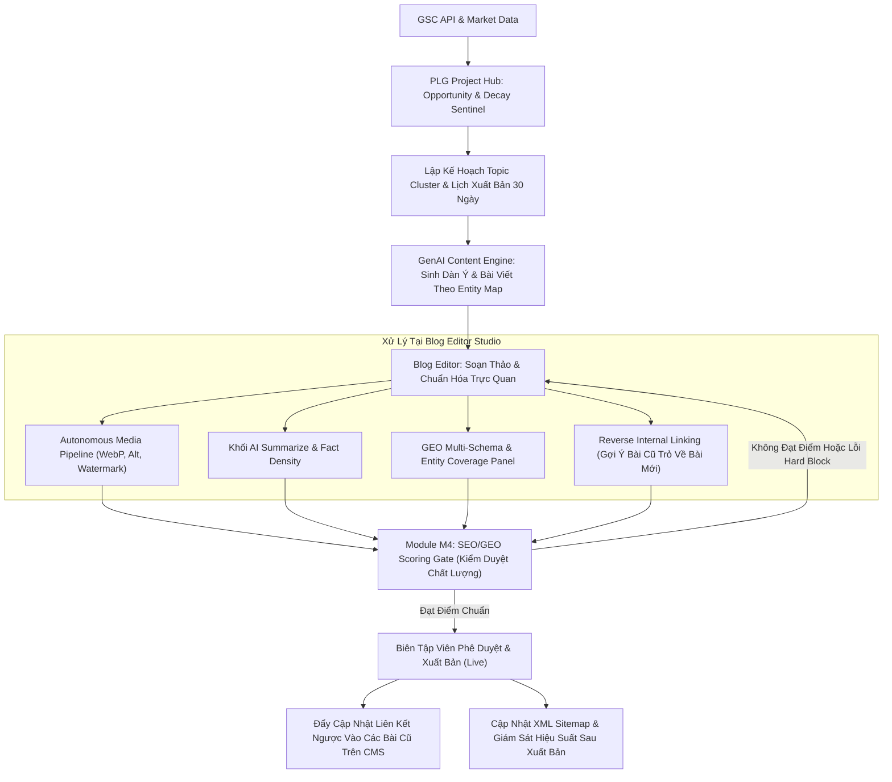

# MoSpark Platform Enhancement Specification: PLG Project & Blog Editor Engine
Nâng cấp Nền tảng Điều phối Chiến lược và Trình soạn thảo Nội dung Chuẩn SEO/GEO Enterprise

> - Project: MoSpark Growth OS (momo.vn)
> - Division: Growth Product Division (GPD)
> - Document Type: Technical Enhancement & PRD Specification
> - Version: 2.0 - October 2026
> - Status: Draft - Ready for Review

---

## 1. Executive Summary & Problem Statement

### 1.1. Bối cảnh Vận hành
MoSpark là Growth OS (hệ điều hành tăng trưởng) trung tâm của Web Platform momo.vn, điều phối toàn bộ vòng đời sản phẩm web từ SEO Inventory, cấu trúc dự án PLG (Product-Led Growth), cỗ máy sản xuất GenAI Content, cho đến hệ thống phân phối quảng cáo Web-to-App.

Trong cấu trúc hiện tại:
- **PLG Project** đóng vai trò là "Tổng hành dinh" (Management Hub) phân bổ cấu trúc phân cấp (Theme -> Cluster -> Keyword) và ánh xạ với các Microsite sản phẩm.
- **Blog Editor (Tiptap WYSIWYG & CMS Engine)** đóng vai trò là "Xưởng hoàn thiện nội dung" trước khi bài viết được kiểm duyệt qua Module M4 (SEO/GEO Scoring Gate) và xuất bản chính thức.

### 1.2. Khoảng trống Kỹ thuật & Vận hành (Current Gaps)
Qua quá trình vận hành thực tế và đối chiếu với các chuẩn mực công nghệ SEO/GEO thế hệ mới, hệ thống bộc lộ 4 điểm nghẽn trọng yếu:

1. **Thiếu phản hồi dữ liệu thời gian thực (Static Planning vs. Live Demand):**
   PLG Project hiện đang quản lý từ khóa dựa trên kế hoạch tĩnh nhập từ file CSV ban đầu. Hệ thống chưa có cơ chế kết nối hai chiều với Google Search Console (GSC) để tự động phát hiện các từ khóa cận biên (Striking Distance Keywords ở vị trí 4-20) và các truy vấn có tỷ lệ hiển thị cao nhưng CTR thấp để chủ động bổ sung vào kế hoạch nội dung.

2. **Thoái hóa lưu lượng không được cảnh báo (Content Decay Blindspot):**
   Hàng nghìn bài viết hiện hữu về dịch vụ tài chính, biểu phí và hướng dẫn tiện ích sau 6-12 tháng bị rớt thứ hạng do thông tin lỗi thời. MoSpark chưa có radar tự động phát hiện sụt giảm traffic theo chuỗi thời gian (time-series), dẫn đến việc tài nguyên liên tục dồn vào viết bài mới trong khi lượng traffic cũ bị thất thoát nghiêm trọng.

3. **Phân mảnh liên kết nội bộ (Internal Linking Fragmentation):**
   Việc liên kết nội bộ trong Blog Editor phụ thuộc 100% vào thao tác thủ công. Khi một bài viết mới xuất bản, biên tập viên không thể mở lại hàng chục bài viết cũ liên quan để chèn link trỏ về bài mới. Điều này tạo ra các trang cô lập (Orphan Pages) và làm nghẽn dòng chảy PageRank toàn sàn.

4. **Chưa chuẩn hóa cấu trúc dữ liệu cho AI Search (GEO Readiness Gap):**
   Các công cụ tìm kiếm AI (ChatGPT Search, Perplexity, Gemini) trích xuất dữ liệu dựa trên Đồ thị thực thể (Entity Graph) và Schema JSON-LD đa tầng. Trình soạn thảo Blog Editor hiện chỉ tập trung vào thẻ HTML truyền thống, thiếu công cụ trực quan để đo lường độ bao phủ thực thể (Entity Coverage) và tự động sinh cấu trúc dữ liệu chuyên sâu cho từng ngành hàng tài chính.

### 1.3. Mục tiêu Nâng cấp Chiến lược
- Tự động hóa chu trình phát hiện cơ hội từ khóa và giám sát thoái hóa nội dung trực tiếp từ dữ liệu GSC vào PLG Project Hub.
- Triển khai cơ chế Reverse Internal Linking bán tự động dựa trên Vector Search (pgvector) trong Blog Editor.
- Chuẩn hóa quy trình sản xuất nội dung GEO: Tự động trích xuất thực thể, sinh Multi-Schema JSON-LD, tạo khối AI Summarize giàu mật độ dữ kiện (Fact Density).
- Tự động hóa hạ tầng đa phương tiện (Media Pipeline): Chuẩn hóa WebP, sinh Alt Text ngữ nghĩa, gắn Watermark nhận diện thương hiệu nhằm bảo vệ chỉ số Core Web Vitals (LCP <= 2.5s, CLS <= 0.1).
- Tuyệt đối tuân thủ nguyên tắc Human-in-the-loop đối với lĩnh vực Fintech/YMYL; không áp dụng các cơ chế tự động xuất bản (Autopilot) hoặc mạng lưới trao đổi liên kết (Link Exchange) tiềm ẩn rủi ro thuật toán.

---

## 2. Đặc tả Nâng cấp Module PLG Project (Management Hub)

Module PLG Project được nâng cấp từ một bảng quản lý tĩnh thành một **Trung tâm Điều phối Chiến lược Động (Dynamic Growth Engine)** với 4 cấu phần mới:

### 2.1. Dynamic Opportunity Engine (GSC Striking Distance Radar)
- **Mục tiêu:** Tự động phát hiện các cơ hội tăng trưởng organic traffic nhanh nhất từ chính kho tài nguyên đang có.
- **Cơ chế kỹ thuật:**
  - Kết nối Google Search Console API định kỳ quét dữ liệu hiệu suất của toàn bộ URL thuộc phạm vi dự án.
  - Áp dụng thuật toán phân loại và tự động đẩy vào danh sách đề xuất (Opportunity Queue):
    - *Nhóm Striking Distance:* Các truy vấn có vị trí trung bình từ 4.0 đến 20.0, Impressions >= 500/tháng. Đây là nhóm chỉ cần bổ sung 1 đoạn H2/H3 chuyên sâu hoặc làm rõ thực thể là có thể lọt Top 3.
    - *Nhóm Low CTR High Impression:* Vị trí Top 5 nhưng CTR thấp hơn mức chuẩn ngành 30%. Đây là nhóm cần tối ưu lại Title Tag, Meta Description và Search Intent.
  - **Tương tác trên UI PLG Project:** Hiển thị thẻ thông báo "Cơ hội mới từ GSC". Khi nhấn vào, hệ thống tự động gán từ khóa vào đúng Cluster liên quan và cho phép chuyển thành Task sản xuất nội dung chỉ với 1 cú nhấp chuột.

### 2.2. Content Decay Sentinel (Giám sát & Phục hồi Thoái hóa Lưu lượng)
- **Mục tiêu:** Bảo vệ lưu lượng tìm kiếm dài hạn (Evergreen Traffic) cho các nội dung tài chính và tiện ích quan trọng.
- **Cơ chế kỹ thuật:**
  - Thiết lập Cron Job chạy hàng tuần, so sánh lưu lượng theo cửa sổ trượt (Rolling Window: 30 ngày gần nhất so với 30 ngày trước đó, và so với cùng kỳ năm trước).
  - Thuật toán kích hoạt cảnh báo Decay:
    - Clicks giảm >= 20% liên tục trong 2 chu kỳ đo lường, HOẶC
    - Vị trí trung bình của từ khóa chính bị tụt >= 3 bậc.
  - **Quy trình xử lý:**
    - Hệ thống chuyển trạng thái bài viết sang nhãn `Needs Refresh`.
    - Tự động phân tích lại Top 3 SERP hiện tại để bóc tách các khoảng trống thông tin mới xuất hiện (Information Gap).
    - Tạo bản thảo cập nhật (Update Draft) đưa vào hàng đợi của Blog Editor để biên tập viên kiểm tra.

### 2.3. Quy hoạch Cụm Chủ quyền Nội dung (Topical Authority & 30-Day Planner)
- **Cấu trúc Pillar - Cluster chuẩn mực:**
  - 1 Pillar Page (Trang trụ cột toàn diện, bao quát toàn bộ khái niệm lớn của Use Case).
  - 4-6 Cluster Pages (Các bài viết vệ tinh giải quyết triệt để từng Search Intent ngách).
- **Lịch phân phối nội dung tự động (Content Calendar Engine):**
  - Cho phép thiết lập kế hoạch xuất bản phân bổ đều theo chu kỳ 30 - 60 ngày.
  - Tự động kiểm tra xung đột từ khóa (Cannibalization Check) trên toàn sàn momo.vn trước khi xếp lịch, ngăn chặn việc 2 bài viết trong cùng dự án hoặc khác dự án cùng nhắm chung 1 Primary Keyword.

### 2.4. Project-Level GEO Entity Map
- **Mục tiêu:** Định hình mạng lưới thực thể cho toàn bộ dự án trước khi triển khai từng bài viết.
- **Cơ chế:**
  - Cho phép định nghĩa danh mục thực thể hạt nhân (Core Entities) của dự án: Tên thương hiệu, sản phẩm dịch vụ liên kết, quy định pháp luật (Nghị định/Thông tư), đối tác ngân hàng/rạp chiếu phim.
  - Mạng lưới thực thể này đóng vai trò là Grounding Context bắt buộc cho GenAI Content Engine khi sinh dàn ý và nội dung chi tiết.

---

## 3. Đặc tả Nâng cấp Module Blog Editor (Tiptap Content Studio)

Trình soạn thảo Blog Editor được nâng cấp thành một **Studio Sản xuất & Chuẩn hóa SEO/GEO Thông minh** với 5 tính năng cốt lõi:

### 3.1. Semantic Reverse Internal Linking (Liên kết Nội bộ Ngược 1-Click)
- **Vấn đề giải quyết:** Khắc phục triệt để bài viết mồ côi và phân phối luồng PageRank từ bài cũ sang bài mới một cách tự động.
- **Kiến trúc kỹ thuật:**
  - Hệ thống sử dụng Vector Database (`pgvector` trên Supabase) lưu trữ Vector Embeddings của toàn bộ đoạn văn và bài viết đã xuất bản trên `momo.vn`.
  - Khi bài viết mới hoàn thành bản thảo (trạng thái Review hoặc chuẩn bị Live):
    - Hệ thống tính toán độ tương đồng ngữ nghĩa (Cosine Similarity) của bài mới với kho dữ liệu bài viết cũ.
    - Tìm kiếm chính xác các đoạn văn trong bài viết cũ có ngữ cảnh liên quan chặt chẽ đến chủ đề bài mới.
    - Đề xuất Anchor Text tự nhiên và chuẩn xác nhất.
  - **Giao diện Editor:**
    - Cột bên phải hiển thị bảng `Reverse Linking Hub`: Liệt kê danh sách 3-5 bài viết cũ được gợi ý kèm đoạn văn mẫu trước/sau khi chèn link.
    - Biên tập viên chỉ cần bấm "Approve & Inject", hệ thống sẽ tự động cập nhật bản ghi của các bài viết cũ trên database mà không cần mở từng bài ra sửa thủ công.

### 3.2. GEO Multi-Schema Generator & Entity Coverage Panel
- **Tự động sinh cấu trúc dữ liệu JSON-LD đa tầng:**
  Hệ thống nhận diện loại nội dung và Hub tương ứng để tự động sinh mã `<script type="application/ld+json">` chuẩn:
  - *Financial Hub:* Schema `FinancialProduct`, `HowTo`, `FAQPage`.
  - *Cinema Hub:* Schema `Movie`, `ScreeningEvent`, `FAQPage`.
  - *E-Commerce / Merchant:* Schema `LocalBusiness`, `Product`, `Review`.
  - *Chung toàn sàn:* Schema `Article`, `BreadcrumbList`, `Person` (Author Profile).
- **Thanh công cụ Entity Coverage thời gian thực:**
  - Phân tích trực tiếp văn bản đang gõ trong Tiptap Editor.
  - Đo lường và đối chiếu danh sách thực thể trong bài với Knowledge Graph chuẩn của ngành.
  - Cảnh báo trực quan nếu bài viết thiếu các thực thể quan trọng mà AI Search thường tìm kiếm khi tổng hợp câu trả lời.

### 3.3. Autonomous Media Pipeline & Core Web Vitals Guard
- **Tự động hóa xử lý hình ảnh:**
  - Khi biên tập viên tải ảnh lên (kéo thả vào editor):
    - Tự động nén và chuyển đổi định dạng sang WebP chuẩn hóa với mức chất lượng 85%.
    - Cố định tỷ lệ khung hình: 16:9 cho Hero Banner và tỷ lệ tùy biến cho ảnh nội dung, tự động khai báo thuộc tính `width` và `height` trong thẻ HTML để triệt tiêu lỗi Cumulative Layout Shift (CLS).
    - Tự động đóng Watermark nhận diện thương hiệu MoMo ở góc dưới ảnh.
    - Sử dụng Vision AI phân tích nội dung ảnh kết hợp tiêu đề H2 liền kề để sinh thẻ Alt Text giàu ngữ nghĩa và tối ưu hóa file slug.
    - Đồng bộ tải tệp lên hệ thống lưu trữ đám mây CDN MoMo / S3.

### 3.4. Khối AI Summarize & Fact Density (Tối ưu Trải nghiệm Skimmer & AI Citation)
- **Mục tiêu:** Nâng cao thời gian tương tác (Time-on-site) cho người dùng di động và cung cấp mật độ dữ kiện chuẩn xác cho các hệ thống AI Search trích dẫn.
- **Quy chuẩn hiển thị:**
  - Đặt ngay bên dưới tiêu đề H1 và thông tin Metadata.
  - Khối giao diện chuẩn hóa Mobase: Viền bo nhẹ, nền xám sáng, huy hiệu nhận diện "AI Tóm tắt", chứa 3-4 gạch đầu dòng cô đọng nhất về giải pháp/kết luận của bài viết.
  - Cho phép biên tập viên chỉnh sửa thủ công nội dung tóm tắt do AI sinh ra trước khi xuất bản.

### 3.5. Kiểm soát Chất lượng E-E-A-T & Cơ chế Hard Block (Module M4 Integration)
- Bài viết bắt buộc phải gắn với hồ sơ tác giả thực tế (Author Profile) có đầy đủ chức danh, tiểu sử chuyên môn và liên kết mạng xã hội để tự động khớp với `Person Schema`.
- Ràng buộc Hard Block: Hệ thống tự động khóa nút xuất bản (Disable Publish Button) nếu bài viết không vượt qua các tiêu chí chất lượng tối thiểu:
  - Điểm SEO Onpage < 85/100.
  - Thiếu thẻ Schema bắt buộc.
  - Chứa từ khóa vi phạm danh mục tuân thủ pháp lý/tài chính YMYL.
  - Chưa được kiểm duyệt bởi biên tập viên (không cho phép xuất bản tự động hoàn toàn).

---

## 4. Kiến trúc Luồng Người dùng Toàn trình (End-to-End User Flow)



### Bảng Phân Tích Chi Tiết Các Bước (Step Breakdown Table)

| Bước | Tên Giai Đoạn | Trải Nghiệm Người Dùng (UX) | Hạ Tầng / Cơ Chế Kỹ Thuật | Nền Tảng |
| :--- | :--- | :--- | :--- | :--- |
| **1** | Thu thập & Quét Cơ Hội | Hệ thống tự động gắn nhãn "Cơ hội mới" (Striking Distance) hoặc "Cảnh báo tụt hạng" (Decay) trên bảng điều khiển. | Cron Job gọi GSC API định kỳ; thuật toán lọc Position 4-20 và tỷ lệ sụt giảm traffic > 20%. | MoSpark Backend |
| **2** | Quy hoạch Kế Hoạch | Quản lý dự án kéo thả từ khóa vào cụm chủ đề (Cluster) và xếp lịch phân phối trên lịch biên tập. | Content Calendar Engine tự động phân bổ ngày xuất bản và chạy cơ chế chống xung đột từ khóa. | MoSpark PLG Hub |
| **3** | Khởi tạo Bản Thảo AI | Biên tập viên nhận bài viết nháp đã bám sát khung thực thể (Entity Map) và tài liệu kinh doanh của sản phẩm. | GenAI Content Engine kết nối LLM API kèm grounding context từ tài liệu Markdown của dự án. | MoSpark M2 Engine |
| **4** | Biên tập & Xử lý Media | Biên tập viên thả ảnh vào bài; hệ thống tự nén, tự đóng dấu mờ và điền thẻ Alt mà không cần mở tool ngoài. | WebP Converter Service chạy tại edge; Vision AI trích xuất ngữ cảnh ảnh; lưu trữ đám mây S3/CDN. | Blog Editor (Tiptap) |
| **5** | Tối ưu Hóa GEO & Schema | Biên tập viên quan sát thanh đo độ phủ thực thể tăng dần và xem trước khối dữ liệu Schema JSON-LD tự sinh. | Trình phân tích cú pháp NLP bóc tách thực thể theo thời gian thực; Schema Generator sinh mã JSON-LD. | Blog Editor (Tiptap) |
| **6** | Kích hoạt Liên Kết Ngược | Biên tập viên duyệt danh sách 3-5 bài cũ được gợi ý và bấm nút chèn link 1-click. | Vector Search truy vấn Cosine Similarity trên bảng `mospark_article_embeddings` trong cơ sở dữ liệu. | Blog Editor & Database |
| **7** | Thẩm định Chất Lượng Gate | Hệ thống hiển thị bảng điểm 100 tiêu chí; cảnh báo lỗi đỏ nếu vi phạm quy định pháp lý hoặc kỹ thuật. | Module M4 Scoring Gate kiểm tra các quy tắc Hard Block; chặn xuất bản nếu không đạt chuẩn. | MoSpark M4 Gate |
| **8** | Xuất bản & Đồng bộ Toàn Sàn | Bài viết chuyển sang trạng thái Live trên website momo.vn; các bài cũ tự động được chèn link ngược. | Database Trigger cập nhật nội dung bài cũ; Sitemap Generator bổ sung URL mới; đồng bộ chỉ số về Umami. | momo.vn Core Platform |

---

## 4. Đặc tả Kỹ thuật Hệ thống & Cơ sở Dữ liệu

### 4.1. Kiến trúc Tích hợp Dịch vụ
- **Database & Storage:** PostgreSQL kết hợp tiện ích mở rộng `pgvector` trên nền tảng Supabase; Cloudflare/AWS S3 làm CDN lưu trữ tài nguyên hình ảnh.
- **AI & NLP Pipeline:**
  - LLM API chuyên trách sản xuất nội dung chuyên sâu và tóm tắt thông tin.
  - Text-embedding Model chuyên trách chuyển đổi nội dung bài viết thành vector đa chiều (độ dài 1536 chiều) phục vụ so khớp ngữ nghĩa.
- **Analytics & Webmaster Integration:** Kết nối Google Search Console API qua OAuth Service Account để trích xuất số liệu truy vấn hàng tuần; Umami Analytics theo dõi tương tác người dùng thời gian thực.

### 4.2. Thiết kế Mô hình Dữ liệu Bổ sung (Data Schema Enhancements)

#### A. Bảng Quản lý Cơ hội GSC (`plg_gsc_opportunities`)
```sql
CREATE TABLE plg_gsc_opportunities (
    id UUID PRIMARY KEY DEFAULT gen_random_uuid(),
    project_id UUID REFERENCES plg_projects(id) ON DELETE CASCADE,
    cluster_id UUID REFERENCES plg_clusters(id) ON DELETE SET NULL,
    query_text VARCHAR(255) NOT NULL,
    target_url TEXT NOT NULL,
    average_position NUMERIC(4, 2) NOT NULL,
    monthly_impressions INT NOT NULL,
    monthly_clicks INT NOT NULL,
    ctr NUMERIC(5, 4) NOT NULL,
    opportunity_type VARCHAR(50) NOT NULL, -- 'STRIKING_DISTANCE' | 'LOW_CTR' | 'DECAY'
    status VARCHAR(50) DEFAULT 'PENDING',  -- 'PENDING' | 'ACCEPTED' | 'DISMISSED' | 'IN_PRODUCTION'
    detected_at TIMESTAMP WITH TIME ZONE DEFAULT NOW(),
    updated_at TIMESTAMP WITH TIME ZONE DEFAULT NOW()
);
```

#### B. Bảng Lưu trữ Vector Embeddings Phục vụ Reverse Linking (`mospark_article_embeddings`)
```sql
CREATE TABLE mospark_article_embeddings (
    id UUID PRIMARY KEY DEFAULT gen_random_uuid(),
    article_id UUID REFERENCES mospark_articles(id) ON DELETE CASCADE,
    section_index INT NOT NULL,
    paragraph_text TEXT NOT NULL,
    embedding VECTOR(1536) NOT NULL,
    created_at TIMESTAMP WITH TIME ZONE DEFAULT NOW()
);

-- Khởi tạo chỉ mục tìm kiếm vector tốc độ cao
CREATE INDEX idx_article_embeddings ON mospark_article_embeddings USING ivfflat (embedding vector_cosine_ops) WITH (lists = 100);
```

#### C. Bảng Hàng đợi Cập nhật Liên kết Ngược (`mospark_reverse_links_queue`)
```sql
CREATE TABLE mospark_reverse_links_queue (
    id UUID PRIMARY KEY DEFAULT gen_random_uuid(),
    source_article_id UUID REFERENCES mospark_articles(id) ON DELETE CASCADE, -- Bài viết cũ cần chèn link
    target_article_id UUID REFERENCES mospark_articles(id) ON DELETE CASCADE, -- Bài viết mới được trỏ tới
    suggested_anchor_text VARCHAR(255) NOT NULL,
    paragraph_context TEXT NOT NULL,
    status VARCHAR(50) DEFAULT 'SUGGESTED', -- 'SUGGESTED' | 'APPROVED' | 'INJECTED' | 'REJECTED'
    approved_by VARCHAR(100),
    injected_at TIMESTAMP WITH TIME ZONE,
    created_at TIMESTAMP WITH TIME ZONE DEFAULT NOW()
);
```

---

## 5. Tiêu chuẩn Chấp thuận & Bảng Tiêu chí Đo lường (Acceptance Criteria)

### 5.1. Tiêu chí Chấp thuận Chức năng (Functional Acceptance Criteria)
1. **Khả năng quét GSC tự động:** Hệ thống phải đồng bộ dữ liệu Search Console hàng tuần và tự động bóc tách tối thiểu 90% các từ khóa thuộc dải vị trí 4.0 - 20.0 chưa có bài viết chuyên biệt tương ứng.
2. **Cảnh báo thoái hóa chuẩn xác:** Khi một bài viết có lượt nhấp giảm >= 20% trong 30 ngày, hệ thống phải kích hoạt trạng thái cảnh báo và gửi thông báo lên bảng điều khiển PLG Project trong vòng 24 giờ kể từ khi có dữ liệu mới.
3. **Độ chính xác của Reverse Internal Linking:** Thuật toán đề xuất liên kết ngược phải đạt độ tương đồng ngữ nghĩa Cosine Similarity >= 0.82; đoạn văn được chọn phải chứa ngữ cảnh liên quan tự nhiên, không làm gián đoạn mạch đọc.
4. **Hiệu năng xử lý Media:** Toàn bộ ảnh tải lên qua Blog Editor phải được tự động chuyển thành WebP, giảm tối thiểu 40% dung lượng so với ảnh gốc mà không làm vỡ nét hiển thị, đồng thời sinh đầy đủ Alt Text và thuộc tính kích thước tĩnh.
5. **Định dạng Schema chuẩn hóa:** 100% mã Schema JSON-LD sinh ra từ Editor phải vượt qua công cụ kiểm tra Rich Results Test của Google mà không phát sinh bất kỳ lỗi nghiêm trọng (Zero Critical Errors).

### 5.2. Tiêu chí Hiệu năng Kỹ thuật & Tuân thủ (Technical & Compliance Guardrails)
- **Core Web Vitals:** Mọi trang bài viết xuất bản mới bắt buộc phải đạt tiêu chuẩn Lab Data và Field Data: LCP <= 2.5s, CLS <= 0.1, INP <= 200ms trên môi trường giả lập mạng 4G di động.
- **Bảo mật & Phân quyền:** Thao tác chèn liên kết ngược tự động vào bài viết cũ phải được lưu vết lịch sử (Audit Log) chi tiết, chỉ tài khoản có vai trò Biên tập viên hoặc Quản trị viên mới có quyền phê duyệt.
- **Fintech & Legal Safety:** Tuyệt đối không cho phép cơ chế tự động xuất bản bỏ qua bước kiểm tra thủ công của con người (Zero Full-Autopilot on YMYL Content).

---

## 6. Lộ trình Triển khai & Cột mốc (Roadmap & Milestones)

| Giai đoạn | Thời gian | Tên Giai Đoạn | Chi Tiết Triển Khai & Mục Tiêu |
| :--- | :--- | :--- | :--- |
| **Giai đoạn 1** | Tuần 1 - Tuần 2 | Hạ tầng Dữ liệu & Tích hợp GSC | Thiết lập Service Account kết nối Google Search Console API; xây dựng schema cơ sở dữ liệu `plg_gsc_opportunities`; hoàn thiện thuật toán lọc Striking Distance Keywords và cảnh báo Content Decay. |
| **Giai đoạn 2** | Tuần 3 - Tuần 4 | Nâng cấp Editor & Media Pipeline | Triển khai bộ xử lý ảnh tự động (WebP compression, Watermark, auto Alt Text); tích hợp khối AI Summarize vào Tiptap Editor; bổ sung bộ sinh Multi-Schema JSON-LD theo từng Hub. |
| **Giai đoạn 3** | Tuần 5 - Tuần 6 | Cỗ máy Reverse Internal Linking | Cài đặt tiện ích mở rộng `pgvector` trên cơ sở dữ liệu; xây dựng pipeline tạo vector embeddings cho kho bài viết hiện có; phát triển giao diện 1-Click Reverse Linking Hub trên thanh công cụ của Blog Editor. |
| **Giai đoạn 4** | Tuần 7 - Tuần 8 | Tích hợp Gate M4 & UAT Thử nghiệm | Kết nối toàn bộ các tiêu chí mới vào Module M4 (Scoring Gate) với cơ chế Hard Block; chạy thử nghiệm UAT trên 30 bài viết thực tế thuộc Financial Hub và Cinema Hub; hoàn thiện tài liệu hướng dẫn vận hành cho đội ngũ nội dung. |
