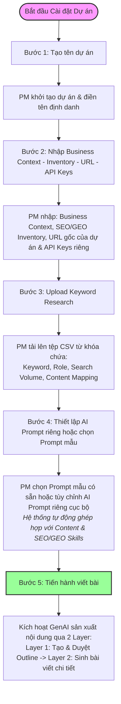

# MoSpark - PLG Project
Trung tâm Điều phối Chiến lược Nội dung

> - **Project:** MoSpark Web Platform
> - **Division:** GPD (Growth Product Division)
> - **Product:** Web Growth Platform
> - **Governance:** Văn Hiến (Web Product Lead)
> - **Version:** 1.1 · June 2026
> - **Status:** Active - Core Strategy Hub

---

## 1. Executive Summary

### 1.1. Tầm nhìn (Vision)
PLG Project đóng vai trò là "Tổng hành dinh" (Management Hub) của toàn bộ chiến dịch nội dung trên MoMo.vn. Đây là nơi tiếp nhận dữ liệu thị trường từ hệ thống SEO Inventory, cấu trúc lại thành chiến lược nội dung cụ thể, và điều phối quy trình sản xuất thông qua GenAI Content Engine.

### 1.2. Mối quan hệ kiến trúc (The Triad Architecture)
Hệ thống MoSpark vận hành dựa trên "kiềng 3 chân" được kết nối trực tiếp bởi PLG Project:

1. **SEO Inventory (Data Source):** Nơi chứa Market Volume, SOV, và phân tích rào cản. Cung cấp dữ liệu "thô" về thị trường.
2. **PLG Project (The Brain):** Nơi tổ chức lại Market Data thành cấu trúc phân cấp, quy hoạch chiến lược (Topic -> Cluster -> Keyword) và thiết lập mapping 1-1 với Microsite.
3. **GenAI Content Engine (The Factory):** Nơi nhận các từ khóa đã được chỉ định từ Hub này để bắt đầu sản xuất nội dung tự động.

### 1.3. Tiêu chuẩn Khởi tạo Dự án Product Growth (Initiation Standards & Prerequisites)
Mỗi dự án PLG trên MoSpark được định nghĩa chính thức là một dự án **Product Growth**. Để bắt đầu khởi động dự án này, hệ thống và tổ chức yêu cầu đáp ứng đầy đủ các điều kiện tiên quyết sau:

*   **Yếu tố Kỹ thuật & Tổ chức (Technical & Organizational Readiness):**
    *   **API Integration:** Sản phẩm cốt lõi của Cell Team phải hoàn tất kết nối API để sẵn sàng tích hợp các tính năng tương tác hoặc trigger luồng chuyển đổi.
    *   **Cell Team Collaboration:** Có sự tham gia trực tiếp và xuyên suốt của Product Owner (PO) hoặc Growth Lead từ Cell Team phụ trách sản phẩm.
    *   **Plan & Budgets:** Dự án phải có kế hoạch tăng trưởng (Growth Plan) cụ thể và được duyệt ngân sách SEO (SEO Budgets).
*   **Yếu tố Content & Thị trường (Content & Market Readiness):**
    *   **Potential Sizing:** Xác định rõ quy mô thị trường tiềm năng (Market Cap) dựa trên tổng dung lượng tìm kiếm (Search Volume) thu thập từ hệ thống SEO Inventory.
*   **Vai trò Quyết định Kích hoạt (Activation Governance):**
    *   **Hiến (Web Product Lead)** đóng vai trò là **người cầm cờ (Flag Bearer)**, chịu trách nhiệm chính trong việc đánh giá tổng thể mức độ sẵn sàng của cả hai yếu tố Kỹ thuật và Content, và đưa ra quyết định kích hoạt chính thức dự án Product Growth trên MoSpark.

### 1.3b. Dữ liệu Đầu vào khi Khởi tạo Dự án (Project Creation Inputs)

Khi thực hiện khởi tạo một dự án Product Growth trên MoSpark, hệ thống yêu cầu cấu hình các dữ liệu đầu vào bắt buộc sau để thiết lập nền tảng chiến lược và kỹ thuật:

1. **Business Content (Dạng Markdown):**
   * *Mô tả:* Tài liệu chi tiết về bối cảnh kinh doanh, đặc tả tính năng sản phẩm, quy định pháp lý, các rào cản và thông điệp cốt lõi (USP).
   * *Quy trình:* Được Product Owner (PO) hoặc Quản lý Content tiếp nhận trực tiếp từ BU Cell Team để đưa vào hệ thống làm cơ sở dữ liệu tham chiếu (Grounding Context) cho AI, đảm bảo nội dung sinh ra chính xác và tuân thủ các quy tắc kinh doanh.
2. **Theme/Cluster (Danh sách từ khóa từ Intent Search dưới dạng CSV):**
   * *Mô tả:* Tệp CSV chứa danh sách từ khóa đã nghiên cứu kỹ lưỡng, được phân loại theo cấu trúc phân cấp (Theme -> Cluster -> Keyword) cùng các thông số Search Volume, Search Intent.
   * *Quy trình:* PM/Content Lead tải file CSV này lên hệ thống để thiết lập cấu trúc Content Strategy, từ đó xác định rõ **Page Type** (Loại trang) tương ứng để triển khai:
     * **Blog Page (Informational Intent):** Phục vụ cho các từ khóa có ý định tìm kiếm thông tin để thu hút traffic dải rộng.
     * **Landing Page / Tool Page (Transactional / Commercial Intent):** Phục vụ cho các từ khóa có ý định giao dịch hoặc tìm kiếm tính năng/công cụ để tối ưu hóa phễu chuyển đổi Web-to-App.
3. **AI Prompt riêng (Project-Specific Prompt):**
   * *Mô tả:* Vùng cấu hình Prompt cục bộ độc lập cho dự án bao gồm Outline Prompt (sinh dàn ý) và Writer Prompt (sinh bài viết).
   * *Quy trình:* Hệ thống tự động nhân bản (clone) từ Master Template lúc khởi tạo. PM/Content Lead tùy chỉnh lại bối cảnh, giọng điệu, từ khóa bắt buộc/cấm riêng biệt để bám sát định vị sản phẩm của BU Cell Team mà không ảnh hưởng đến các dự án khác.
4. **API Keys riêng (Project-Specific API Keys & Credentials):**
   * *Mô tả:* Thiết lập các mã khóa kết nối riêng biệt cho dự án như Gemini API/Vertex AI API Key, Google Ads Developer Token, Google Search Console Access, Ahrefs/Semrush API key...
   * *Quy trình:* Nhập và cấu hình tại màn hình cài đặt dự án. Giúp cô lập quota/rate limit, phân bổ chi phí chuẩn xác cho từng Division (không dùng chung pool tài nguyên chung của hệ thống để tránh một dự án bị nghẽn làm ảnh hưởng toàn sàn).

### 1.4. Quy trình Phối hợp Set-up & Triển khai (Collaboration & Setup Flow)
Khi bắt đầu triển khai và thiết lập (Set-up) một dự án Product Growth trong MoSpark, các đội ngũ phối hợp song song theo hai mũi nhọn chiến lược:

1.  **Phát triển Microsite (Hạ tầng Kỹ thuật):**
    *   *Nhân sự:* **Hoài Anh & Hùng** chịu trách nhiệm thiết kế và code giao diện; **Thuận** chịu trách nhiệm cài đặt hệ thống đo lường (Tracking).
    *   *Nội dung:* Tiến hành xây dựng sản phẩm (Microsite) dựa trên Sitemap do **Hiến** thiết lập. Đảm bảo hoàn thiện đồng bộ: UI/UX/Content + API kết nối + Tracking đo lường hiệu năng.
2.  **Định hướng Product Growth (Chiến lược Nội dung & AI Engine):**
    *   *Nhân sự:* **Product Marketing** (Vị trí chuyên trách mới).
    *   *Nội dung:*
        *   Nghiên cứu từ khóa (Keyword Research) $->$ Chiến lược nội dung (Content Strategy) $->$ Kế hoạch nội dung (Content Plan) để xác định rõ SEO Inventory + Topic Cluster (Phân tách từ khóa chính, từ khóa phụ) + Search Volume của từng từ khóa.
        *   Nghiên cứu và xây dựng Cơ sở tri thức (Knowledge Base) kết hợp với Prompting đi kèm **Business Context** của Cell Team để huấn luyện AI sinh Content tối ưu (Blog/Long Content/Mini Web).

---

## 2. Phân Loại Dự Án & Kiến Trúc Phân Cấp Nội Dung (Project Types & Content Strategy Structure)

Hệ thống PLG Project phân tách rạch ròi thành **2 loại dự án chính** với mục tiêu, cấu trúc nội dung và đơn vị vận hành chuyên biệt, nhưng đều sử dụng chung một cấu trúc cơ sở dữ liệu phân cấp cây 3 tầng (Topic -> Cluster -> Keyword) để tối ưu hóa phát triển:

### 2.1. Phân loại 2 Loại Dự Án (Two Distinct Project Types)

#### A. Dự án Use Case (Do Cell Team vận hành)
*   **Định nghĩa:** Tập trung vào các sản phẩm, tính năng tài chính hoặc dịch vụ công nghệ cụ thể của các Cell Team (Ví dụ: Phạt Nguội, Vay Nhanh, Bảo Hiểm Ô Tô, eSIM...).
*   **Mục tiêu:** Thu hút tệp traffic dải rộng theo hành trình tìm kiếm thông tin của người dùng (Search Intent), giới thiệu tính năng và điều hướng người dùng Web mở/kích hoạt app MoMo (Web-to-App conversion).
*   **Quy hoạch phân cấp:**
    *   **Tầng 1 (TOPIC):** Nhóm chủ đề sản phẩm/dịch vụ lớn. Ví dụ: `Tiện ích Giao thông` hoặc `Tài chính cá nhân`.
    *   **Tầng 2 (CLUSTER):** Cụm chủ đề con giải quyết một nhóm Search Intent cụ thể. Ví dụ: `Phạt nguội xe máy` hoặc `Đăng kiểm xe ô tô`.
    *   **Tầng 3 (KEYWORD):** Từ khóa mục tiêu cụ thể, tương ứng 1-1 với **1 bài viết độc lập (Blog Page)** hoặc **1 Landing/Tool Page**. Ví dụ: `tra cứu phạt nguội xe máy online` (Transactional/Tool Page) hoặc `mức phạt nguội xe máy không gương` (Informational/Blog Page).

#### B. Dự án Merchant Page (Do Web Platform vận hành)
*   **Định nghĩa:** Tập trung xây dựng hiện diện số (Digital Presence) cho hàng vạn đối tác cửa hàng vật lý (SME offline và các chuỗi lớn Brand Chains) có chấp nhận Ví Trả Sau MoMo hoặc sử dụng thiết bị Soundbox.
*   **Mục tiêu:** Đưa thông tin cửa hàng (NAP, Menu cào tự động, Maps, Reviews) lên Google/AI Search để tăng organic discovery, đồng thời kích hoạt dòng tiền BNPL offline qua Ví Trả Sau tại điểm bán.
*   **Quy hoạch phân cấp:**
    *   **Tầng 1 (TOPIC):** Ngành hàng hoặc Danh mục kinh doanh. Ví dụ: `Ẩm thực / F&B` hoặc `Làm đẹp / Spa`.
    *   **Tầng 2 (CLUSTER):** Tên thực thể một **đối tác Merchant cụ thể**. Ví dụ: `Tiệm Mì Chú Cao` hoặc `Highlands Coffee Nguyễn Du`.
    *   **Tầng 3 (KEYWORD):** Các từ khóa liên quan đến thương hiệu, địa chỉ, thực đơn hoặc Ví Trả Sau của chính Merchant đó. Ví dụ: `tiệm mì chú cao` (Từ khóa chính/Primary), `thực đơn tiệm mì chú cao` hoặc `địa chỉ tiệm mì chú cao ví trả sau` (Từ khóa phụ/Secondary).

---

### 2.2. Ánh xạ Mô Hình Dữ Liệu Đồng Nhất (Unified Data Model Mapping)

Để đội ngũ Dev chỉ cần phát triển một cơ sở dữ liệu và cấu trúc giao diện dạng cây (Hierarchical Table Grid) duy nhất cho cả 2 loại dự án, cấu trúc của chúng được mapping đồng bộ như sau:

<table style="width:100%; border-collapse:collapse; border:1.5px solid #64748b; margin:1em 0; font-size:0.9em;">
  <thead>
    <tr style="background-color:#f1f5f9;">
      <th style="border:1.5px solid #64748b; padding:8px 12px; text-align:left; font-weight:700;">Tầng Hệ thống (Dev)</th>
      <th style="border:1.5px solid #64748b; padding:8px 12px; text-align:left; font-weight:700;">Dự án Use Case (Cell Team)</th>
      <th style="border:1.5px solid #64748b; padding:8px 12px; text-align:left; font-weight:700;">Dự án Merchant Page (Web Platform)</th>
      <th style="border:1.5px solid #64748b; padding:8px 12px; text-align:left; font-weight:700;">Định nghĩa & Ví dụ</th>
    </tr>
  </thead>
  <tbody>
    <tr>
      <td style="border:1px solid #94a3b8; padding:8px 12px; text-align:left;"><strong>Tầng 1: TOPIC</strong></td>
      <td style="border:1px solid #94a3b8; padding:8px 12px; text-align:left;"><strong>Chủ đề sản phẩm lớn</strong></td>
      <td style="border:1px solid #94a3b8; padding:8px 12px; text-align:left;"><strong>Ngành hàng / Danh mục</strong></td>
      <td style="border:1px solid #94a3b8; padding:8px 12px; text-align:left;">Phân nhóm cấp cao nhất. Ví dụ: <code style="background:#f1f5f9;padding:2px 4px;border-radius:4px;font-family:monospace;">Phương Tiện</code> (Use Case) / <code style="background:#f1f5f9;padding:2px 4px;border-radius:4px;font-family:monospace;">F&B</code> (Merchant).</td>
    </tr>
    <tr style="background-color:#f8fafc;">
      <td style="border:1px solid #94a3b8; padding:8px 12px; text-align:left;"><strong>Tầng 2: CLUSTER</strong></td>
      <td style="border:1px solid #94a3b8; padding:8px 12px; text-align:left;"><strong>Cụm chủ đề con (Intent)</strong></td>
      <td style="border:1px solid #94a3b8; padding:8px 12px; text-align:left;"><strong>Thực thể đối tác (Merchant)</strong></td>
      <td style="border:1px solid #94a3b8; padding:8px 12px; text-align:left;">Đại diện cho nhóm thực thể. Ví dụ: <code style="background:#f1f5f9;padding:2px 4px;border-radius:4px;font-family:monospace;">Phạt nguội xe máy</code> (Use Case) / <code style="background:#f1f5f9;padding:2px 4px;border-radius:4px;font-family:monospace;">Tiệm Mì Chú Cao</code> (Merchant).</td>
    </tr>
    <tr>
      <td style="border:1px solid #94a3b8; padding:8px 12px; text-align:left;"><strong>Tầng 3: KEYWORD</strong></td>
      <td style="border:1px solid #94a3b8; padding:8px 12px; text-align:left;"><strong>Từ khóa mục tiêu</strong></td>
      <td style="border:1px solid #94a3b8; padding:8px 12px; text-align:left;"><strong>Từ khóa của quán</strong></td>
      <td style="border:1px solid #94a3b8; padding:8px 12px; text-align:left;">Hạt nhân cơ sở. Có thuộc tính <code style="background:#f1f5f9;padding:2px 4px;border-radius:4px;font-family:monospace;">Role</code> và <code style="background:#f1f5f9;padding:2px 4px;border-radius:4px;font-family:monospace;">Mapping Type</code>.</td>
    </tr>
  </tbody>
</table>

#### Chi tiết thuộc tính mở rộng của Keyword ở tầng DB:
*   **Role (Vai trò từ khóa):**
    *   *Dự án Use Case:* `TOFU` | `MOFU` | `BOFU` (phân chia theo phễu marketing).
    *   *Dự án Merchant:* `Primary` (Từ khóa thương hiệu chính của quán) | `Secondary` (Từ khóa phụ/Intent mở rộng: menu, địa chỉ...).
*   **Content Mapping Type (Cơ chế sinh trang):**
    *   `new_page`: Tự động tạo 1 bài viết/URL riêng biệt (áp dụng cho tất cả Keyword của Use Case và Keyword `Primary` của Merchant).
    *   `merge_page`: Không tạo bài viết mới mà tự động chèn nội dung thành Heading phụ (H2/H3) của bài viết chính cùng Cluster (áp dụng cho các Keyword `Secondary` của Merchant).

#### Cơ chế Gom nhóm Tích lũy (Total Inventory Calculation):
*   **Cluster-Level Inventory:** Tổng lượng tìm kiếm của một Cửa hàng (Cluster) hoặc một Cụm chủ đề bằng: `Volume(Primary) + Sum(Volume(Secondary))`.
*   **Total Project Inventory:** Tổng quy mô thị trường của dự án bằng tổng tích lũy từ tất cả các Cluster thuộc dự án:
    $$	ext{Total Project Inventory} = \sum 	ext{Cluster-Level Inventory}$$

---

### 2.3. Nguyên lý Cốt lõi & Phương thức Xây dựng Trang đối tác (Merchant Page Fundamentals & Pipeline)

Để tự động hóa việc khởi tạo và đảm bảo tính chính xác cho hàng vạn trang Merchant trên Web, quy trình xây dựng phải tuân thủ 4 nguyên lý cốt lõi sau:

1. **Chuẩn hóa Hiện diện số (Local SEO Foundation):**
   * **Nguyên lý:** Xây dựng trang đối tác chuẩn mực được tối ưu hóa cho Google Search để người dùng dễ dàng tìm thấy địa điểm quán.
   * **Cơ chế:** Đồng bộ chuẩn dữ liệu N.A.P (Name - Address - Phone) của cửa hàng từ hệ thống M4B để đảm bảo tính xác thực thông tin.

2. **Quy trình làm giàu dữ liệu tự động (Data Enrichment Pipeline):**
   * **Cách thức xây dựng:**
     * *Đầu vào:* Dữ liệu hành chính cơ bản (Tên, Mã đối tác) được đồng bộ tự động từ hệ thống M4B (MoMo for Business).
     * *Làm giàu bằng AI:* Hệ thống MoSpark tự động cào thông tin thực tế từ Google Maps API (Thực đơn số, giờ hoạt động, hình ảnh, Amenities như Wifi/Bãi đỗ xe) và các đánh giá (Reviews) của khách hàng.
     * *Đóng gói:* Đưa toàn bộ dữ liệu trên vào Dynamic Merchant Context làm nguyên liệu đầu vào cho GenAI Content Engine.

3. **Vòng lặp Chuyển đổi O2O (Offline-to-Online Loop):**
   * **Nguyên lý:** Trang Web Merchant đóng vai trò là Hub trung chuyển dòng traffic.
   * **Cách thức xây dựng:**
     * *Offline-to-Online:* Mã QR đặt tại quầy hoặc thiết bị Soundbox của quán dẫn người dùng về trang Web đối tác để xem menu số hoặc nhận voucher.
     * *Online-to-App:* Trên trang Web chèn các nút CTA (W2A Trigger Points) chứa Deep Link đưa người dùng trực tiếp vào luồng thanh toán hoặc kích hoạt Ví Trả Sau cho đúng mã cửa hàng đó trên App MoMo.

4. **Kiểm tra Chất lượng & Tuân thủ (Quality & Compliance Gate):**
   * **Nguyên lý:** Đảm bảo bài viết của từng đối tác đạt chuẩn SEO và không vi phạm pháp lý.
   * **Cơ chế:** Bài viết sau khi AI sinh ra sẽ được chấm điểm chất lượng tự động qua hệ thống Scoring System và rà quét từ khóa cấm (Blacklist). Chỉ các bài viết vượt qua bộ lọc này mới được duyệt xuất bản tự động lên production.

---

### 2.4. Quản lý Prompt Định hướng theo Dự án (Project-Specific Localized Prompt Management)

Để tối ưu hóa tốc độ vận hành và đáp ứng linh hoạt văn phong (Tone of Voice) cho từng ngành hàng khác nhau, hệ thống áp dụng cơ chế **Prompt Đóng gói Cục bộ (Project-Specific Localized Prompt)**.

*   *Cơ chế hoạt động:* Khi tạo Project mới, PM chọn một **Master Prompt Template** chuẩn mực từ hệ thống (do Guideline Admin cấu hình sẵn). Hệ thống sẽ tự động nhân bản (Clone) template này vào Project đó. PM/Content Lead có thể tùy biến bản sao Prompt này cục bộ cho phù hợp với đặc thù sản phẩm (Ví dụ: Giọng điệu YMYL của Vay Nhanh vs Giọng điệu năng động của Cinema) mà không ảnh hưởng tới các dự án khác hoặc template gốc.
*   *Lợi ích:*
    *   Trải nghiệm "1-Click" ở tầng Keyword: PM chỉ cần cấu hình Prompt một lần ở tầng Project, sau đó việc tạo Outline/Detail cho từng Keyword vẫn diễn ra tự động 1-click.
    *   Cá nhân hóa tối đa: Đảm bảo văn phong bài viết bám sát định vị thương hiệu của từng chiến dịch cụ thể.
    *   Đảm bảo 100% bài viết sinh ra đều pass qua vòng chấm điểm của hệ thống SEO/GEO Scoring System.
---

## 3. Kiến trúc Quản trị Prompt & Guideline (Project-Specific Localized Prompt Management)

### 3.1. Quy trình Cài đặt & Vận hành Dự án (Project Setup & Content Generation Flow)
Quy trình thiết lập dự án và xuất bản nội dung của PM trên MoSpark tuân thủ nghiêm ngặt 5 bước:

1. **Bước 1: Tạo tên dự án**
   * PM khởi tạo dự án PLG mới bằng cách điền thông tin định danh (Tên dự án, Division phụ trách).
2. **Bước 2: Cấu hình Business Context - Inventory - URL - API Keys**
   * PM cấu hình bối cảnh nghiệp vụ (Markdown), khai báo thông số lượng search volume ban đầu (SEO Inventory), thiết lập URL gốc của dự án (ví dụ: `momo.vn/merchant`) và cấu hình các API Key riêng biệt (Gemini/Vertex AI key, Google Ads API Credentials...) cho dự án để đảm bảo tính cô lập và kiểm soát quota chi phí.
3. **Bước 3: Upload Keyword Research**
   * PM tải lên tệp CSV chứa danh sách từ khóa đầy đủ bao gồm phân vai trò từ khóa (Primary/Secondary), lượng search volume của từng từ khóa, và ánh xạ nội dung (Content Mapping).
4. **Bước 4: Thiết lập AI Prompt riêng (Hoặc chọn Prompt mẫu)**
   * PM thiết lập prompt chuyên gia cho dự án (AI Prompt riêng bao gồm Outline Prompt & Writer Prompt) bằng cách chọn một Prompt Template mẫu hệ thống (ví dụ: *Finance YMYL*, *Commerce & Café*...) hoặc tự do tùy chỉnh Prompt riêng cục bộ. Hệ thống sẽ tự động nhân bản và ánh xạ cục bộ cho dự án, ghép hợp (matching) prompt này với các Content Skills và SEO/GEO Skills tương ứng trong cơ sở dữ liệu.
5. **Bước 5: Tiến hành viết bài**
   * PM bắt đầu quy trình sinh bài viết bằng GenAI qua 2 Layer: AI tự động tạo dàn ý (Outline) -> PM chỉnh sửa/duyệt dàn ý -> AI tự động viết bài viết chi tiết dựa trên dàn ý đã duyệt và xuất bản lên Web.

### 3.2. Sơ đồ Luồng Cài đặt Dự án (Project Setup Workflow Diagram for Dev)

Dưới đây là sơ đồ mô tả chi tiết 5 bước thiết lập và vận hành dự án trên MoSpark để đội ngũ Phát triển (Dev) xây dựng hệ thống:

### 3.3. Thiết kế Giao diện & Trải nghiệm Người dùng (UI/UX Specification)
*   **Màn hình Quản trị Master Template:** Dành cho Guideline Admin để tạo và cấu hình các template chung của hệ thống.
*   **Màn hình Cấu hình Prompt trong Project:** Dành cho PM. Hiển thị tab `AI Prompts` với 2 phân vùng chỉnh sửa (Outline Prompt và Content Prompt), nút Lưu, nút So sánh khác biệt (Diff Viewer) với Master Template, và nút Reset về mặc định.
*   **Giao diện Diff Viewer:** Trực quan hóa phần văn bản thêm/bớt (Red/Green) giữa Prompt cục bộ và Master Template nguồn để hỗ trợ hậu kiểm chất lượng.

### 3.4. Cấu trúc Phân quyền Đơn giản (Simple Permission Roles)
Hệ thống không xây dựng bộ phân quyền phức tạp, chỉ mặc định phân chia thành 2 vai trò cơ bản:
*   **Editor (Biên tập viên):**
    *   Quyền hạn: Xem thông tin dự án, cấu trúc Topic Clusters/Merchant, và tiến hành tạo bài (kích hoạt luồng sản xuất GenAI qua 2 Layer: sinh Outline, duyệt Outline và tạo bài viết chi tiết).
    *   Giới hạn: Không được quyền chỉnh sửa bối cảnh nghiệp vụ (Business Context), cấu hình dự án, prompt cục bộ hay các thiết lập cốt lõi khác.
*   **Admin (Quản trị viên):**
    *   Quyền hạn: Sở hữu toàn quyền kiểm soát hệ thống, bao gồm chỉnh sửa bối cảnh nghiệp vụ (Business Context), tùy chỉnh prompt cục bộ (Project-specific Prompt), thay đổi cấu hình dự án, import tệp CSV từ khóa, và quản lý các template chung của hệ thống.

### 3.5. Quy tắc Kỹ thuật & Ràng buộc Hệ thống (Technical Specs & Integrity Rules)
*   **Cascade Delete Block:** Hệ thống chặn việc xóa Master Template nếu đang có Project liên kết sử dụng.
*   **Audit Logging:** Mọi chỉnh sửa prompt và bối cảnh nghiệp vụ của Project đều được ghi nhận lịch sử (`updated_by`, `updated_at`, `diff_content`) để Admin kiểm soát chất lượng trước khi xuất bản.

### 3.6. Kiến trúc UI/UX Bảng Cây Phân Cấp (Hierarchical Accordion Table Grid) cho Dự án Merchant

Để hiển thị phân tán hàng vạn thực thể đối tác (Merchant) và các Topic Cluster/Keywords tương ứng một cách trực quan trên một màn hình duy nhất, hệ thống áp dụng thiết kế **Bảng cây phân cấp (Hierarchical Accordion Table Grid)**:

#### 1. Khối Tổng quan dự án (Project Overview)
Hiển thị ở đầu màn hình dự án `Merchant`:
*   **URL:** `momo.vn/merchant` (Địa chỉ trang chủ gốc).
*   **Total Keywords:** Tổng số lượng từ khóa (Primary + Secondary) (ví dụ: `20`).
*   **Total Volume:** Tổng lượng search volume tích lũy của toàn dự án (ví dụ: `1.9M searches/tháng`).
*   **Division:** Division sở hữu dự án (ví dụ: `GPD`).

#### 2. Khối Thẻ Chỉ số (Summary Cards)
*   **Merchants:** Tổng số lượng đối tác/topic clusters cần quản lý (ví dụ: `5`).
*   **Primary Keywords:** Số lượng từ khóa chính tương ứng (ví dụ: `5` - quy tắc *1 Merchant = 1 Primary Keyword*).
*   **Total Search Volume:** Tổng lượng tìm kiếm tích lũy (ví dụ: `1.9M`).
*   **Published Articles:** Số lượng bài viết đã xuất bản (ví dụ: `2/5` bài viết chính).

#### 3. Bảng Phân cấp Từ khóa Đối tác (Hierarchical Table Grid)
Bảng chính hiển thị danh sách đối tác và có cấu trúc cây mở rộng (Accordion):
*   **Dòng cấp Cha (Parent Row - Đối tác):**
    *   *Merchant (Cột 1):* Tên đối tác và nhãn ngành nghề (ví dụ: `Tiệm Mì Chú Cao` - *F&B*, `Highlands Coffee` - *Café*).
    *   *Primary Keyword (Cột 2):* Từ khóa thương hiệu chính (ví dụ: `tiệm mì chú cao`).
    *   *Search Volume (Cột 3):* Tổng Volume của Merchant đó và Volume của từ khóa chính (ví dụ: `38K` - *Primary 22K*).
    *   *Secondaries (Cột 4):* Số lượng từ khóa phụ liên quan (ví dụ: `3 supporting keywords`).
    *   *Writing Status (Cột 5):* Nhãn trạng thái (ví dụ: `Chưa viết` - Xám, `Chờ duyệt outline` - Vàng, `Đang viết` - Xanh dương, `Đã xuất bản` - Xanh lá).
    *   *Action (Cột 6):* Nút hành động tương ứng trạng thái (ví dụ: `Sinh Outline` cho Chưa viết, `Sửa & Duyệt` cho Chờ duyệt outline, `Viết bài / Sinh Draft` cho Đang viết, `Xem bài viết` cho Đã xuất bản).
*   **Bảng cấp Con (Nested Child Table - Chi tiết từ khóa):** Khi bấm nút mũi tên để mở rộng dòng cấp Cha, một bảng con hiển thị chi tiết các từ khóa liên quan:
    *   *Role:* Nhãn phân vai trò từ khóa (`Primary` - Đỏ hồng hoặc `Secondary` - Xanh dương).
    *   *Keyword:* Từ khóa cụ thể (ví dụ: `tiệm mì chú cao`, `menu mì chú cao`, `tiệm mì chú cao ở đâu`, `tiệm mì chú cao ví trả sau momo`).
    *   *Volume:* Lượng tìm kiếm của từ khóa cụ thể đó.
    *   *Content Mapping (Chiến lược Gom cụm bài viết):*
        *   Đối với từ khóa **Primary**: Được gán nhãn `Bài viết chính` (Quy định mỗi Merchant có duy nhất 1 bài viết URL).
        *   Đối với các từ khóa **Secondary**: Được gán nhãn `Cùng bài viết`. Điều này chỉ định AI chèn nội dung của từ khóa này làm Heading phụ (H2/H3) trong bài viết chính của Merchant thay vì tạo bài viết mới độc lập, giúp tối ưu hóa cấu trúc bài, tập trung sức mạnh SEO và chống tự trùng lặp từ khóa (Cannibalization).

---

## 4. Quản trị Định tuyến và Microsite Mapping

PLG Project đóng vai trò gác cổng (Gatekeeper) đối với hệ thống URL của MoSpark.

### 4.1. Ràng buộc Mapping 1-1
Mỗi PLG Project bắt buộc phải được gắn với **chính xác 1 Microsite** (ví dụ: `mospark-vay-nhanh` gắn với Microsite Vay Nhanh).

### 4.2. Thực thi URL Routing (`/{use-case}/blog*`)
*   Toàn bộ Keyword được chọn để sản xuất bài viết từ Project này sẽ tự động được gán tiền tố đường dẫn kế thừa từ Microsite.
*   *Ví dụ:* Từ khóa `điều kiện vay nhanh` sinh ra bài viết sẽ có URL tự động là `/vay-nhanh/blog/dieu-kien-vay-nhanh`.
*   *Mục đích:* Tránh xung đột URL giữa các Use Case, giữ cấu trúc Silo chuẩn SEO.

---

## 5. Luồng Vận hành Sản xuất (The 2-Layer Generation Flow)

Để kiểm soát chất lượng tuyệt đối và định hướng nội dung đúng mục tiêu kinh doanh, bất kỳ một Keyword nào khi chạy qua GenAI đều bị ép buộc tuân thủ quy trình **"Human-in-the-loop" (Có bàn tay con người can thiệp)** qua 2 Layer sản xuất:

### Bước 1: Setup Strategy (Thiết lập ban đầu)
1.  PM tiếp nhận dữ liệu báo cáo từ **SEO Inventory**.
2.  Quy hoạch các Keyword vào cấu trúc **Topic -> Cluster**.

### Bước 2: Layer 1 - Sinh Dàn bài (Outline Generation)
1.  PM chọn các Keyword cần triển khai trong Sprint.
2.  Kích hoạt lệnh `Generate Outline`.
3.  GenAI Engine sử dụng **Project-Specific Localized Prompt (Outline)** của Project để phân tích Keyword và trả về một bộ Khung Dàn ý (Heading 2, Heading 3, các Bullet point ý chính). *Quá trình này diễn ra rất nhanh và tốn ít Token.*

### Bước 3: Human Gate - Con người kiểm duyệt (Edit by Human)
1.  Trạng thái Keyword lúc này chuyển thành `Pending Outline Review`.
2.  PM hoặc Content Creator vào xem bản Outline do AI đề xuất. Tại đây, con người đóng vai trò là "Tổng biên tập":
    *   Sửa lại các tiêu đề (Heading) cho thu hút hơn.
    *   Cắt bỏ các ý AI vẽ hươu vẽ vượn không cần thiết.
    *   **Quan trọng nhất:** Chèn thêm các ý định hướng Business (Ví dụ: "Nhớ nhắc đến tính năng trả góp của MoMo ở đoạn này").
3.  Người dùng bấm `Approve Outline` để chốt dàn bài.

### Bước 4: Layer 2 - Sinh Nội dung chi tiết (Content Detail Generation)
1.  Chỉ khi Outline được Approve, hệ thống mới kích hoạt Layer 2: `Generate Content Detail`.
2.  GenAI Engine sẽ bám **chính xác 100%** vào bộ Outline đã được con người duyệt và sử dụng **Project-Specific Localized Prompt (Writer)** của Project để "đắp thịt" (sinh ra đoạn văn chi tiết, chèn bảng biểu, Internal Link).
3.  Bài viết hoàn thiện được trả về trạng thái `Ready to Publish` trên bảng quản lý của Project.

---

## 7. Kế hoạch Nâng cấp Tính năng H2/2026

Nhằm tối ưu hóa hiệu quả vận hành và đưa dữ liệu thị trường thực tế vào quy trình kiểm soát, hệ thống sẽ được nâng cấp các tính năng sau trong H2/2026:

1. **Mô hình Agent tự vận hành (Autonomous Content Production Agent):** Định hình mỗi dự án (PLG Project) như một thực thể tự vận hành khép kín (Self-contained Tenant) sở hữu: một Business Context riêng, một Market Cap (SEO Inventory) riêng, và một GenAI Content Writer Agent riêng (với prompt chuyên dụng) để triển khai tự động hóa toàn phễu sản xuất nội dung.
2. **BigQuery Search Console Sync:** Đồng bộ hóa dữ liệu từ Google Search Console (GSC) và GA4 qua BigQuery về MoSpark để hiển thị thứ hạng (Position) trung bình của từng từ khóa đối với mỗi Cluster trực tiếp trong giao diện quản lý.
3. **Google Ads Keyword Planner API:** Tự động kết nối API lấy dung lượng tìm kiếm (Volume Search) thực tế khi PM thực hiện lập kế hoạch từ khóa (Keyword research/Content Plan) thay vì upload file CSV thủ công.
4. **Cluster-level Quality Scoring Dashboard:** Hiển thị điểm SEO/GEO trung bình của toàn bộ Cluster để PM có cái nhìn tổng quan về chất lượng nội dung của cụm chủ đề vệ tinh.
5. **Priority Scoring Engine (SEO-ICE):** Tính năng tự động tính toán điểm ưu tiên từ khóa dựa trên công thức `Search Volume x SoV Gap x Expected W2A CR / Complexity` để PM chọn lọc keyword có hiệu quả đầu tư cao nhất.
6. **Enforce Ràng buộc logic 1-1 & Xóa từ gốc:** Khóa chặt liên kết 1-1 giữa Cluster Keyword và bài viết. Vô hiệu hóa nút xóa bài viết trên Blog Editor; bắt buộc PM/Editor phải xóa bài viết từ gốc tại màn hình quản lý của PLG Project.
7. **Cơ chế Điều phối Từ khóa & Loại Trang đích (Keyword Destination Routing):** Tự động phân loại và định tuyến từ khóa: từ khóa Transactional (Giao dịch) về Landing Page Builder, từ khóa Informational (Thông tin) về Blog Article.

---

## 6. Tài liệu Liên kết
*   **Data Source:** MoSpark SEO Keyword Inventory
*   **Production Engine:** MoSpark GenAI Content Engine

---
*Maintained by: Văn Hiến (Web Product Lead) | Last updated: 2026-06-12*
