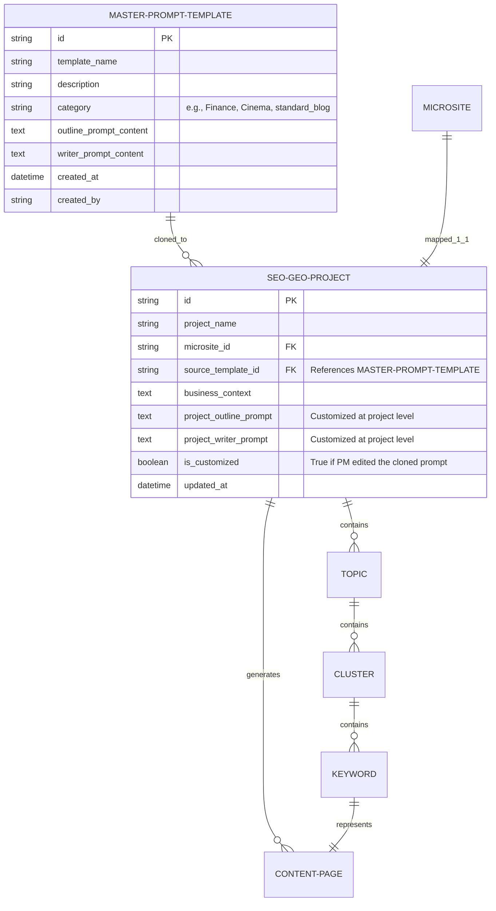

# MoSpark - SEO/GEO Project
Trung tâm Điều phối Chiến lược Nội dung

> - **Project:** MoSpark Web Platform
> - **Division:** GPD (Growth Product Division)
> - **Product:** Web Growth Platform
> - **Governance:** Văn Hiến (Web Product Lead)
> - **Version:** 1.1 · June 2026
> - **Status:** Active - Core Strategy Hub

---

## 1. Executive Summary

### 1.1. Tầm nhìn (Vision)
SEO/GEO Project đóng vai trò là "Tổng hành dinh" (Management Hub) của toàn bộ chiến dịch nội dung trên MoMo.vn. Đây là nơi tiếp nhận dữ liệu thị trường từ hệ thống SEO Inventory, cấu trúc lại thành chiến lược nội dung cụ thể, và điều phối quy trình sản xuất thông qua GenAI Content Engine.

### 1.2. Mối quan hệ kiến trúc (The Triad Architecture)
Hệ thống MoSpark vận hành dựa trên "kiềng 3 chân" được kết nối trực tiếp bởi SEO/GEO Project:

1. **[SEO Inventory](file:///Users/hienhv/Documents/Obsidian_Vault/hovanhien_knowledgebase_momo/04_MOSPARK_PLATFORM/mospark_seo_inventory.md) (Data Source):** Nơi chứa Market Volume, SOV, và phân tích rào cản. Cung cấp dữ liệu "thô" về thị trường.
2. **SEO/GEO Project (The Brain):** Nơi tổ chức lại Market Data thành cấu trúc phân cấp, quy hoạch chiến lược (Topic -> Cluster -> Keyword) và thiết lập mapping 1-1 với Microsite.
3. **[GenAI Content Engine](file:///Users/hienhv/Documents/Obsidian_Vault/hovanhien_knowledgebase_momo/04_MOSPARK_PLATFORM/mospark_genai_content.md) (The Factory):** Nơi nhận các từ khóa đã được chỉ định từ Hub này để bắt đầu sản xuất nội dung tự động.

### 1.3. Tiêu chuẩn Khởi tạo Dự án Product Growth (Initiation Standards & Prerequisites)
Mỗi dự án SEO/GEO trên MoSpark được định nghĩa chính thức là một dự án **Product Growth**. Để bắt đầu khởi động dự án này, hệ thống và tổ chức yêu cầu đáp ứng đầy đủ các điều kiện tiên quyết sau:

*   **Yếu tố Kỹ thuật & Tổ chức (Technical & Organizational Readiness):**
    *   **API Integration:** Sản phẩm cốt lõi của Cell Team phải hoàn tất kết nối API để sẵn sàng tích hợp các tính năng tương tác hoặc trigger luồng chuyển đổi.
    *   **Cell Team Collaboration:** Có sự tham gia trực tiếp và xuyên suốt của Product Owner (PO) hoặc Growth Lead từ Cell Team phụ trách sản phẩm.
    *   **Plan & Budgets:** Dự án phải có kế hoạch tăng trưởng (Growth Plan) cụ thể và được duyệt ngân sách SEO (SEO Budgets).
*   **Yếu tố Content & Thị trường (Content & Market Readiness):**
    *   **Potential Sizing:** Xác định rõ quy mô thị trường tiềm năng (Market Cap) dựa trên tổng dung lượng tìm kiếm (Search Volume) thu thập từ hệ thống SEO Inventory.
*   **Vai trò Quyết định Kích hoạt (Activation Governance):**
    *   **Hiến (Web Product Lead)** đóng vai trò là **người cầm cờ (Flag Bearer)**, chịu trách nhiệm chính trong việc đánh giá tổng thể mức độ sẵn sàng của cả hai yếu tố Kỹ thuật và Content, và đưa ra quyết định kích hoạt chính thức dự án Product Growth trên MoSpark.

### 1.4. Quy trình Phối hợp Set-up & Triển khai (Collaboration & Setup Flow)
Khi bắt đầu triển khai và thiết lập (Set-up) một dự án Product Growth trong MoSpark, các đội ngũ phối hợp song song theo hai mũi nhọn chiến lược:

```
                  +----------------------------------------------+
                  |  KHỞI ĐỘNG DỰ ÁN PRODUCT GROWTH (SEO/GEO)   |
                  +----------------------------------------------+
                                         |
                   +---------------------+---------------------+
                   | (Hạ tầng & Kỹ thuật)                      | (Nội dung & Chiến lược AI)
                   v                                           v
+------------------------------------+      +------------------------------------+
|             MICROSITE              |      |           PRODUCT GROWTH           |
| (Hoài Anh & Hùng + Thuận Tracking) |      |        (Product Marketing)         |
|                                    |      |                                    |
| - Sitemap (Hiến)                   |      | - Keyword Research                 |
| - UI/UX & Content                  |      | - Content Strategy & Plan          |
| - API Integration                  |      | - Topic Clusters & SEO Inventory   |
| - Tracking System Setup            |      | - Knowledge Base & Context Setup   |
+------------------------------------+      +------------------------------------+
```

1.  **Phát triển Microsite (Hạ tầng Kỹ thuật):**
    *   *Nhân sự:* **Hoài Anh & Hùng** chịu trách nhiệm thiết kế và code giao diện; **Thuận** chịu trách nhiệm cài đặt hệ thống đo lường (Tracking).
    *   *Nội dung:* Tiến hành xây dựng sản phẩm (Microsite) dựa trên Sitemap do **Hiến** thiết lập. Đảm bảo hoàn thiện đồng bộ: UI/UX/Content + API kết nối + Tracking đo lường hiệu năng.
2.  **Định hướng Product Growth (Chiến lược Nội dung & AI Engine):**
    *   *Nhân sự:* **Product Marketing** (Vị trí chuyên trách mới).
    *   *Nội dung:*
        *   Nghiên cứu từ khóa (Keyword Research) $\rightarrow$ Chiến lược nội dung (Content Strategy) $\rightarrow$ Kế hoạch nội dung (Content Plan) để xác định rõ SEO Inventory + Topic Cluster (Phân tách từ khóa chính, từ khóa phụ) + Search Volume của từng từ khóa.
        *   Nghiên cứu và xây dựng Cơ sở tri thức (Knowledge Base) kết hợp với Prompting đi kèm **Business Context** của Cell Team để huấn luyện AI sinh Content tối ưu (Blog/Long Content/Mini Web).

---

## 2. Kiến trúc Phân cấp Nội dung (Content Strategy Structure)

Giao diện cốt lõi của SEO/GEO Project được thiết kế dưới dạng cây thư mục 3 tầng, giúp Product Manager (PM) dễ dàng quản lý khối lượng lớn nội dung:

### 2.1. Cấu trúc Topic -> Cluster -> Keyword
*   **Tầng 1: TOPIC (Chủ đề lớn)**
    *   *Định nghĩa:* Là các nhóm chủ đề cốt lõi, thường tương ứng với một góc độ sản phẩm hoặc một nhu cầu bao quát của người dùng (Customer Journey: TOFU/MOFU/BOFU).
    *   *Ví dụ:* `Phương Tiện`.
    *   *Thông số hiển thị:* Tổng Volume của toàn bộ Topic.

*   **Tầng 2: CLUSTER (Nhóm từ khóa)**
    *   *Định nghĩa:* Các cụm chủ đề con nằm trong Topic, tập trung giải quyết một Search Intent cụ thể. Các bài viết sinh ra từ một Cluster phải có sự liên kết nội bộ (Internal Link) chặt chẽ với nhau.
    *   *Ví dụ:* (Topic: Phương Tiện) -> Cluster: `Phạt nguội xe máy`, `Phạt nguội ô tô`.
    *   *Thông số hiển thị:* Tổng Volume của Cluster.

*   **Tầng 3: KEYWORD (Từ khóa mục tiêu)**
    *   *Định nghĩa:* Là hạt nhân cơ sở nhất. Mỗi Keyword tương ứng với **1 bài viết duy nhất** (bảo vệ bằng Unique ID Check) được sinh ra để xếp hạng trên Google/AI Search.
    *   *Ví dụ:* (Cluster: Phạt nguội xe máy) -> Keyword: `phạt nguội xe máy online`, `app phạt nguội xe máy`, `check phạt nguội xe máy`...
    *   *Thông số hiển thị chi tiết (Data Table):*
        *   **Trend (Biểu đồ):** Xu hướng tìm kiếm 12 tháng.
        *   **Trending (Tag):** Gắn cờ các từ khóa đang lên.
        *   **Volume:** Lượng tìm kiếm trung bình tháng.
        *   **CPC:** Giá thầu quảng cáo (phản ánh giá trị thương mại).
        *   **Word Count:** Độ dài trung bình của câu truy vấn.

### 2.2. Cơ chế Điều phối Từ khóa (Keyword Routing Mechanism)

Hệ thống phân loại và điều phối Keyword về đúng kênh sản xuất dựa trên **Search Intent (Ý định tìm kiếm)** và **Mức độ ưu tiên**.

#### A. Phân loại Cấp phát Trang đích (Destination Routing)
Mỗi Keyword sẽ được gán 1 trong 2 luồng định tuyến:

1.  **Luồng 1: Điều phối về Landing Page / Tool Page (LDP Builder M1)**
    *   *Tiêu chí:* Từ khóa mang tính **Giao dịch (Transactional)**, tìm kiếm công cụ, tính năng hoặc có tỷ lệ chuyển đổi Web-to-App cao. Đòi hỏi UI/UX tùy chỉnh.
    *   *Ví dụ:* `Kiểm tra phạt nguội ô tô`, `Tra cứu phạt nguội toàn quốc`.
    *   *Hành động:* Gửi tín hiệu đến Landing Page Builder. Trang này sẽ đóng vai trò là Hub (Trang đích chính) để hứng Traffic chuyển đổi.

2.  **Luồng 2: Điều phối về Blog Article (GenAI Content Engine M2)**
    *   *Tiêu chí:* Từ khóa mang tính **Thông tin (Informational)**, giáo dục, giải đáp. Phục vụ mục đích kéo Traffic dải rộng.
    *   *Ví dụ:* `Lỗi vượt đèn đỏ phạt bao nhiêu`, `Phân biệt lỗi sai làn`.
    *   *Hành động:* Gửi lệnh sản xuất hàng loạt sang GenAI Content Engine. Các trang này đóng vai trò là Spoke (Trang vệ tinh) bắn Internal Link về Hub.

#### B. Quản lý Prompt Định hướng theo Dự án (Project-Specific Localized Prompt)
Để tối ưu hóa tốc độ vận hành và đáp ứng linh hoạt văn phong (Tone of Voice) cho từng ngành hàng khác nhau, hệ thống áp dụng cơ chế **Prompt Đóng gói Cục bộ (Project-Specific Localized Prompt)**. Chi tiết thiết kế xem tại: [Phần 3. Kiến trúc Quản trị Prompt & Guideline](#3-kien-truc-quan-tri-prompt--guideline-dinh-huong-theo-du-an-project-specific-localized-prompt-management) bên dưới.

*   *Cơ chế hoạt động:* Khi tạo Project mới, PM chọn một **Master Prompt Template** chuẩn mực từ hệ thống (do Guideline Admin cấu hình sẵn). Hệ thống sẽ tự động nhân bản (Clone) template này vào Project đó. PM/Content Lead có thể tùy biến bản sao Prompt này cục bộ cho phù hợp với đặc thù sản phẩm (Ví dụ: Giọng điệu YMYL của Vay Nhanh vs Giọng điệu năng động của Cinema) mà không ảnh hưởng tới các dự án khác hoặc template gốc.
*   *Lợi ích:*
    *   Trải nghiệm "1-Click" ở tầng Keyword: PM chỉ cần cấu hình Prompt một lần ở tầng Project, sau đó việc tạo Outline/Detail cho từng Keyword vẫn diễn ra tự động 1-click.
    *   Cá nhân hóa tối đa: Đảm bảo văn phong bài viết bám sát định vị thương hiệu của từng chiến dịch cụ thể.
    *   Đảm bảo 100% bài viết sinh ra đều pass qua vòng chấm điểm của hệ thống SEO/GEO Scoring System.

---

## 3. Kiến trúc Quản trị Prompt & Guideline (Project-Specific Localized Prompt Management)

### 3.1. Mô hình Phân cấp & Thực thể (Data Model & ERD)
Mỗi dự án SEO/GEO Project sẽ đóng gói riêng (encapsulate) một bản sao Prompt & Guideline, cô lập dữ liệu giữa các dự án.



### 3.2. Quy trình Vận hành Prompt (Workflow Lifecycle)
Quy trình nhân bản và chỉnh sửa prompt được mô tả qua 4 bước:

1.  **Thiết lập Master Prompt Template (Guideline Admin):**
    *   Guideline Admin tạo và lưu trữ các prompt mẫu chuẩn mực (ví dụ: *Finance YMYL*, *Cinema & Commerce*, *Standard Blog*) vào bảng `master_prompt_templates`.
2.  **Khởi tạo Project & Nhân bản Prompt (Project Setup & Cloning):**
    *   Khi PM tạo SEO/GEO Project mới, họ chọn 1 Master Prompt Template. Hệ thống tự động **Clone (sao chép)** nội dung template đó vào trường `project_outline_prompt` và `project_writer_prompt` của Project.
3.  **Tùy biến Prompt Cục bộ (Project-level Customization):**
    *   PM/Content Lead của dự án có thể vào tab `Project Settings` -> `AI Prompts` để chỉnh sửa, thêm thắt rules đặc thù (Ví dụ: *"Luôn xưng hô Mình - Bạn"*, *"Luôn chèn link CTA mua vé xem phim"*).
    *   Thay đổi này chỉ áp dụng cho Project hiện hành, không ảnh hưởng đến Master Template gốc hay Project khác. Hệ thống đánh dấu `is_customized = true`. PM có thể bấm **Reset to Default** để ghi đè, khôi phục lại từ Master Template nguồn.
4.  **Biên dịch & Triển khai LLM (Execution Prompt Assembly):**
    *   Khi kích hoạt sinh bài viết cho Keyword, hệ thống biên dịch Prompt theo công thức:
        `Final LLM Prompt = {Project-Specific Prompt} + {Business Context} + {Primary Keyword & Selected Outline}`.

### 3.3. Thiết kế Giao diện & Trải nghiệm Người dùng (UI/UX Specification)
*   **Màn hình Quản trị Master Template:** Dành cho Guideline Admin để tạo và cấu hình các template chung của hệ thống.
*   **Màn hình Cấu hình Prompt trong Project:** Dành cho PM. Hiển thị tab `AI Prompts` với 2 phân vùng chỉnh sửa (Outline Prompt và Content Prompt), nút Lưu, nút So sánh khác biệt (Diff Viewer) với Master Template, và nút Reset về mặc định.
*   **Giao diện Diff Viewer:** Trực quan hóa phần văn bản thêm/bớt (Red/Green) giữa Prompt cục bộ và Master Template nguồn để hỗ trợ hậu kiểm chất lượng.

### 3.4. Quy tắc Kỹ thuật & Ràng buộc Hệ thống (Technical Specs & Integrity Rules)
*   **Phân quyền (RBAC):** Chỉ Guideline Admin được sửa Master Templates. PM được chọn template nguồn và sửa prompt cục bộ của Project.
*   **Cascade Delete Block:** Hệ thống chặn việc xóa Master Template nếu đang có Project liên kết sử dụng.
*   **Audit Logging:** Mọi chỉnh sửa prompt của Project đều được ghi nhận lịch sử (`updated_by`, `updated_at`, `diff_content`) để kiểm soát chất lượng nội dung trước khi xuất bản.

---

## 4. Quản trị Định tuyến và Microsite Mapping

SEO/GEO Project đóng vai trò gác cổng (Gatekeeper) đối với hệ thống URL của MoSpark. 

### 4.1. Ràng buộc Mapping 1-1
Mỗi SEO/GEO Project bắt buộc phải được gắn với **chính xác 1 Microsite** (ví dụ: `mospark-vay-nhanh` gắn với Microsite Vay Nhanh). 

### 4.2. Thực thi URL Routing (`/{use-case}/blog*`)
*   Toàn bộ Keyword được chọn để sản xuất bài viết từ Project này sẽ tự động được gán tiền tố đường dẫn kế thừa từ Microsite.
*   *Ví dụ:* Từ khóa `điều kiện vay nhanh` sinh ra bài viết sẽ có URL tự động là `/vay-nhanh/blog/dieu-kien-vay-nhanh`.
*   *Mục đích:* Tránh xung đột URL giữa các Use Case, giữ cấu trúc Silo chuẩn SEO.

---

## 5. Luồng Vận hành Sản xuất (The 2-Layer Generation Flow)

Để kiểm soát chất lượng tuyệt đối và định hướng nội dung đúng mục tiêu kinh doanh, bất kỳ một Keyword nào khi chạy qua GenAI đều bị ép buộc tuân thủ quy trình **"Human-in-the-loop" (Có bàn tay con người can thiệp)** qua 2 Layer sản xuất:

### Bước 1: Setup Strategy (Thiết lập ban đầu)
1.  PM tiếp nhận dữ liệu báo cáo từ **SEO Inventory**.
2.  Quy hoạch các Keyword vào cấu trúc **Topic -> Cluster**.

### Bước 2: Layer 1 - Sinh Dàn bài (Outline Generation)
1.  PM chọn các Keyword cần triển khai trong Sprint.
2.  Kích hoạt lệnh `Generate Outline`.
3.  GenAI Engine sử dụng **Project-Specific Localized Prompt (Outline)** của Project để phân tích Keyword và trả về một bộ Khung Dàn ý (Heading 2, Heading 3, các Bullet point ý chính). *Quá trình này diễn ra rất nhanh và tốn ít Token.*

### Bước 3: Human Gate - Con người kiểm duyệt (Edit by Human)
1.  Trạng thái Keyword lúc này chuyển thành `Pending Outline Review`.
2.  PM hoặc Content Creator vào xem bản Outline do AI đề xuất. Tại đây, con người đóng vai trò là "Tổng biên tập":
    *   Sửa lại các tiêu đề (Heading) cho thu hút hơn.
    *   Cắt bỏ các ý AI vẽ hươu vẽ vượn không cần thiết.
    *   **Quan trọng nhất:** Chèn thêm các ý định hướng Business (Ví dụ: "Nhớ nhắc đến tính năng trả góp của MoMo ở đoạn này").
3.  Người dùng bấm `Approve Outline` để chốt dàn bài.

### Bước 4: Layer 2 - Sinh Nội dung chi tiết (Content Detail Generation)
1.  Chỉ khi Outline được Approve, hệ thống mới kích hoạt Layer 2: `Generate Content Detail`.
2.  GenAI Engine sẽ bám **chính xác 100%** vào bộ Outline đã được con người duyệt và sử dụng **Project-Specific Localized Prompt (Writer)** của Project để "đắp thịt" (sinh ra đoạn văn chi tiết, chèn bảng biểu, Internal Link).
3.  Bài viết hoàn thiện được trả về trạng thái `Ready to Publish` trên bảng quản lý của Project.

---

## 6. Tài liệu Liên kết
*   **Data Source:** [MoSpark SEO Keyword Inventory](file:///Users/hienhv/Documents/Obsidian_Vault/hovanhien_knowledgebase_momo/04_MOSPARK_PLATFORM/mospark_seo_inventory.md)
*   **Production Engine:** [MoSpark GenAI Content Engine](file:///Users/hienhv/Documents/Obsidian_Vault/hovanhien_knowledgebase_momo/04_MOSPARK_PLATFORM/mospark_genai_content.md)

---
*Maintained by: Văn Hiến (Web Product Lead) | Last updated: 2026-06-12*
