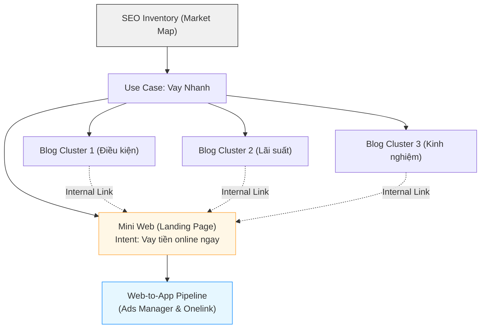

# 📊 MoSpark SEO Keyword Inventory
Bản đồ Tài nguyên & Thị phần (SoV)

> - **Project:** MoSpark Web Platform
> - **Main URL:** momo.vn/mospark
> - **Division:** GPD (Growth Product Division)
> - **Use Case:** Out-App Traffic
> - **Product:** Web Growth Platform
> - **SEO/GEO Project ID:** `mospark-seo-inventory`
> - **Owner:** GPD - Out-App Traffic (Thuận)
> - **Governance:** Văn Hiến (SEO & GEO Lead)
> - **Version:** 4.5 · May 2026
> - **Status:** Active - Platform Core Metadata
>
> - **SEO Score:** N/A | **Traffic:** N/A | **W2A:** N/A | **Last updated:** 2026-05-18

---

## 1. Executive Summary

### 1.1. Tầm nhìn (Vision)
Trở thành "Bản đồ Định vị Thị trường" duy nhất cho toàn bộ hệ sinh thái MoSpark, quyết định nơi nào đáng đổ tài nguyên và nội dung nào cần sản xuất để chiếm lĩnh Traffic.

### 1.2. Mục tiêu tối thượng (North Star)
Chấm dứt việc làm nội dung "mù mờ" – Mọi Mini Web/Blog trên MoMo đều phải gắn với Market Volume thực và Share of Voice (SoV) nhằm tối ưu hóa tỷ lệ chuyển đổi Web-to-App.

---

## 2. Tổng Quan Vận Hành (Overview)

SEO Inventory không chỉ là một bảng tính số liệu từ khóa, nó là **Module cốt lõi đầu não** nằm ngay tầng cao nhất của MoSpark. 

Nó đóng vai trò là cơ sở dữ liệu gốc để thiết lập khung ưu tiên nguồn lực (Prioritization Framework) trước khi đội ngũ kỹ thuật bắt tay phát triển Mini Web hoặc Content Team bắt tay sản xuất Blog chi tiết thông qua công cụ AI.

---

## 3. Entry Point: Quy trình Khởi tạo Dự án SEO/GEO trên MoSpark

SEO Inventory chính là điểm bắt đầu (Entry Point) của mọi dự án trên MoSpark. Dưới đây là luồng chuẩn khi Product Manager (PM) hoặc Growth Team muốn tạo mới một Use Case:

### Bước 1: Define Market (Lựa chọn chiến trường)
*   **Hành động:** Xác định Use Case (Ví dụ: Tra cứu Phạt Nguội).
*   **Hệ thống xử lý:** Tham chiếu với cơ sở dữ liệu SEO Inventory v4.
*   **Đầu ra:** Biết rõ thị trường này có bao nhiêu lượng search mỗi tháng (VD: 1.5M searches) và MoMo đang chiếm bao nhiêu % (SoV).

### Bước 2: Phân loại Priority (Mức độ ưu tiên)
Dựa trên SEO Inventory, hệ thống tự động phân Use Case thành 4 nhóm chiến lược:
1.  **Market Leader (SoV > 40%):** Ví Trả Sau. *Mục tiêu:* Duy trì, Scale thêm ngách.
2.  **High Potential (SoV 20-40%):** Bảo Hiểm Xe Máy. *Mục tiêu:* Scale mạnh nội dung để đẩy lên 40%.
3.  **Low SoV/Gap Lớn (SoV < 20%):** Vay Nhanh, Bảo Hiểm Ô Tô. *Mục tiêu:* Xây mới nền tảng, tái cấu trúc Mini Web.
4.  **Mass Traffic/Dịch vụ công:** Phạt nguội, BHXH. *Mục tiêu:* Kéo lượng User khổng lồ về hệ sinh thái.

### Bước 3: Business Context Sync (Cung cấp bối cảnh)
*   Sau khi chốt được Use Case và mục tiêu, PM sẽ phải điền **Business Context** theo mẫu chuẩn.
*   Đây là bộ thông số "linh hồn" giúp định hướng cho AI (Claude) viết content đúng chuẩn thương hiệu và đúng Intent thị trường.

### Bước 4: Kick-off (Bắt đầu sản xuất)
*   Kích hoạt quy trình 7 bước GenAI Content: Tạo Primary Keyword -> Draft Outline -> Manual Edit -> Blog Detail AI -> Publish.

---

## 4. Mối liên kết mật thiết với Mini Web & Blog (Architecture)

Quy hoạch SEO Inventory chia Kiến trúc Nội dung thành cấu trúc Hub & Spoke vững chắc:

**Thị trường (Market) → Cụm chủ đề (Cluster) → Landing Page/Blog**

### 4.1. Phân tách Intent rõ ràng
*   **Mini Web (Landing/Transactional Pages):**
    *   **Mục đích:** Hứng trọn lượng truy cập mang "Intent Mua Hàng" (VD: "Mua bảo hiểm ô tô", "Mở ví trả sau").
    *   **Thiết kế:** Được build bằng *Landing Page Builder* của MoSpark. Không chứa quá nhiều chữ, tập trung vào CTA, Simulator và quy trình đăng ký.
*   **Blog (Informational Pages):**
    *   **Mục đích:** Vây ráp các từ khóa ngách, từ khóa tìm kiếm thông tin (VD: "Cách tính phí bảo hiểm ô tô", "Phạt nguội đi sai làn").
    *   **Thiết kế:** Sản xuất hàng loạt thông qua luồng *GenAI Content* của MoSpark. Tất cả bài Blog thuộc cụm chủ đề phải cắm Link (Cross-link) dồn sức mạnh về Mini Web tương ứng.

### 4.2. Sơ đồ liên kết (Architecture Map)

---

## 5. Quy trình Vận hành Thực tế (Operational Routine)

*   **Audit định kỳ (Quarterly):** SEO/GEO Lead (Hiến) tiến hành update lại Total Search Volume và đo lại SoV MoMo mỗi quý để đánh giá tốc độ tăng trưởng.
*   **Cơ chế Alert:** Khi có sự thay đổi thuật toán hoặc đối thủ vươn lên chiếm SoV, Inventory sẽ cảnh báo để team Inbound và Growth có phương án xử lý ngay lập tức (Tăng ngân sách Off-page hoặc Audit On-page).
*   **Tích hợp Tracking:** Kết quả SoV phải được đối chiếu lại với MUV thực tế (từ BigQuery) để tính toán hiệu suất chuyển đổi traffic thành W2A CR.

---

## 6. Lộ trình Triển khai (Implementation Roadmap)

| Phase | Milestone | Tình trạng | Mục tiêu thực thi |
|---|---|---|---|
| **Phase 1** | SEO Inventory v4 (Manual) | 🟢 Live / Active | Hoàn tất bảng số liệu trên Docx/Excel cho mảng Financial & Payment. |
| **Phase 2** | MoSpark Dashboard Integration | 🟡 Planning | Tích hợp thẳng số liệu Inventory vào lúc tạo Project trên hệ thống MoSpark CMS. |
| **Phase 3** | Automated Alert System | 🔴 Future | Hệ thống kết nối API với công cụ bên thứ 3 (như GSC) để tự động hóa Tracking thị phần. |

---

## 7. Kỹ thuật & Cấu trúc Dữ liệu (Database Schema)

Để Web Platform Team (Tech) có thể lập trình cơ sở dữ liệu gốc cho SEO Inventory, cơ sở dữ liệu sẽ lưu trữ bảng thông tin từ khóa theo Schema chuẩn dưới đây:

### Bảng: `mospark_seo_inventory`

| Field | Type | Constraint | Description |
|---|---|---|---|
| `id` | INT | PRIMARY KEY, AUTO_INCREMENT | ID tự tăng của bản ghi. |
| `use_case_id` | VARCHAR(50) | FOREIGN KEY | Liên kết với `use_case_id` của GenAI Content Engine & Ads Manager. |
| `market_name` | VARCHAR(100) | NOT NULL | Tên thị trường (ví dụ: `FS - InsurTech`, `MDS - Merchant Page`). |
| `cluster_name` | VARCHAR(100) | NOT NULL | Tên cụm chủ đề con (ví dụ: `Tra cứu Phạt Nguội`, `Giá BHXM`). |
| `primary_keyword` | VARCHAR(100) | UNIQUE, NOT NULL | Từ khóa chính của cụm. Đóng vai trò gác cổng chống Cannibalization. |
| `search_volume` | INT | NOT NULL, DEFAULT 0 | Lượng tìm kiếm trung bình hàng tháng (Google Search Volume). |
| `current_position` | INT | DEFAULT 100 | Thứ hạng hiện tại của trang đích MoMo trên SERPs (Google). |
| `momo_sov` | DECIMAL(5,2) | DEFAULT 0.00 | Thị phần Share of Voice hiện tại của MoMo (%). |
| `target_sov` | DECIMAL(5,2) | NOT NULL, DEFAULT 40.00 | Thị phần SoV mục tiêu (%). |
| `canonical_url` | VARCHAR(255) | UNIQUE, NOT NULL | URL trang đích duy nhất chịu trách nhiệm xếp hạng cho từ khóa này. |
| `priority_score` | DECIMAL(5,2) | DEFAULT 0.00 | Điểm số ưu tiên do hệ thống tự động tính toán (SEO-ICE). |
| `status` | ENUM | NOT NULL | Trạng thái: `Unexplored`, `In-Progress`, `Dominated`. |

---

## 8. Thuật toán Vận hành & Cơ chế Gatekeeper

Nhằm loại bỏ hoàn toàn các quyết định cảm tính và rủi ro kỹ thuật khi vận hành trên quy mô lớn, hệ thống áp dụng 3 thuật toán và cơ chế tự động hóa:

### 8.1. Thuật toán ưu tiên nguồn lực (SEO-ICE Scoring)
Hệ thống tự động xếp hạng thứ tự ưu tiên sản xuất (Priority Score) của các Cluster trong Use Case bằng công thức:

$$\text{Opportunity Score} = \text{Search Volume} \times (\text{Target SoV} - \text{Momo SoV}) \times \text{Expected W2A CR}$$

$$\text{Priority Score} = \frac{\text{Opportunity Score}}{\text{Complexity (1-5)}}$$

*   **Expected W2A CR:** Tỷ lệ chuyển đổi Web-to-App dự kiến (ví dụ: 8.5% cho InsurTech, 12% cho BNPL).
*   **Complexity (1-5):** Độ khó kỹ thuật/độ khó nội dung (Dev/Content Effort).
*   *Hệ thống tự động quét định kỳ hằng đêm, sắp xếp danh sách từ khóa có Priority Score từ cao xuống thấp để gợi ý thứ tự làm nội dung cho Content Team.*

### 8.2. Công thức tính Share of Voice (SoV Calculation Model)
Thị phần Share of Voice (SoV) của MoMo trên từng cụm từ khóa/chủ đề được đo lường tự động qua chỉ số hiển thị thực tế từ Google Search Console (GSC) chia cho tổng nhu cầu tìm kiếm của thị trường:

$$\text{SoV MoMo} = \frac{\text{Impression (GSC)}}{\text{Total Volume Search}}$$

*   **Impression (GSC):** Số lượt hiển thị thực tế của các URL thuộc Use Case trên kết quả tìm kiếm Google (được lấy qua API kết nối trực tiếp với Google Search Console).
*   **Total Volume Search:** Tổng lượng tìm kiếm của cụm từ khóa (được lưu trong cơ sở dữ liệu SEO Inventory).

### 8.3. Cơ chế gác cổng chống chồng chéo từ khóa (Keyword Cannibalization Guardrail)
Để bảo vệ sức mạnh SEO của từng URL đích trên hệ thống, MoSpark CMS áp dụng một rào cản cứng (Hard Block):
*   Khi PM khởi tạo một Use Case hoặc một bài viết mới, hệ thống tự động kiểm tra `primary_keyword` nhập vào với database `mospark_seo_inventory`.
*   If từ khóa chính này **đã được gán cho một URL khác**, CMS sẽ lập tức **Block không cho lưu bản nháp** và hiển thị cảnh báo: 
    > ⚠ *Từ khóa chính "{Keyword}" đã được tối ưu cho URL chính thống "{URL}". Để tránh chồng chéo từ khóa (Keyword Cannibalization), vui lòng chọn Primary Keyword khác hoặc tối ưu hóa trực tiếp trên URL cũ.*

---

## 9. Tài liệu Liên kết
*   **Master Strategy:** [[04_MOSPARK_PLATFORM/mospark_master|MoSpark Master Doc]]
*   **Quy trình GenAI Content:** [[04_MOSPARK_PLATFORM/mospark_genai_content|MoSpark GenAI Content Engine]]
*   **Quản trị Bối cảnh:** [[04_MOSPARK_PLATFORM/mospark_business_context|Business Context Management]]
*   **Chỉ đạo tối cao:** [[00_HARNESS_CORE/hienho_master_doc|Hienho Master Doc]]
*   **Bản đồ Tri thức chính:** [[README|Master README]]

---

## 10. Change Log
*   **v4.0 (Tháng 5/2026):** Khởi tạo tài liệu và chuẩn hóa cấu trúc thư mục (Hiến).
*   **v4.1 (2026-05-18):** Chuẩn hóa Metadata Frontmatter, dọn dẹp các đoạn nội dung trùng lặp, khôi phục vết lỗi hiển thị ở footer và thiết lập hệ thống liên kết cuối bài (Hiến).
*   **v4.2 (2026-05-18):** Tái cấu trúc chuẩn hóa: Đưa thông tin Nhân sự và Trạng thái (Status) lên khối Metadata đầu trang; chuyển mục Tầm nhìn (Vision) và North Star thành phần Executive Summary (Hiến).
*   **v4.3 (2026-05-18):** Tinh chỉnh khối Metadata: Chuyển sang định dạng văn bản thuần không có ký tự blockquote `>` và loại bỏ toàn bộ các liên kết double-bracket trong khối Metadata theo chỉ đạo của anh Hiến.
*   **v4.4 (2026-05-18):** Nâng cấp tài liệu lên hàng Master BRD: Thiết lập cấu trúc dữ liệu cơ sở dữ liệu gốc (12 trường dữ liệu), tích hợp Thuật toán ưu tiên SEO-ICE, Công thức tính SoV và Cơ chế gác cổng chống chồng chéo từ khóa (Hiến).
*   **v4.5 (2026-05-18):** Tinh chỉnh mô hình tính toán SoV theo chỉ đạo thực tế của anh Hiến: SoV = Impression (GSC) / Total Volume Search (Hiến).

---
*Maintained by: Văn Hiến (SEO & GEO Lead) | Last updated: 2026-05-18*
