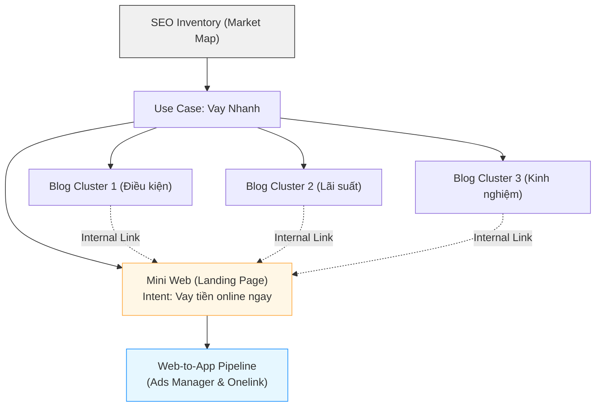

# 📊 MoSpark SEO Keyword Inventory
Bản đồ Tài nguyên & Thị phần (SoV)

> - **Project:** MoSpark Web Platform
> - **Main URL:** momo.vn/mospark
> - **Division:** GPD (Growth Product Division)
> - **Use Case:** Out-App Traffic
> - **Product:** Web Growth Platform
> - **SEO/GEO Project ID:** `mospark-seo-inventory`
> - **Owner:** GPD - Out-App Traffic (Thuận)
> - **Governance:** Văn Hiến (Web Product Lead)
> - **Version:** 4.7 · May 2026
> - **Status:** Active - Platform Core Metadata
>
> - **SEO Score:** N/A | **Traffic:** N/A | **W2A:** N/A | **Last updated:** 2026-05-18

---

## 1. Executive Summary

### 1.1. Tầm nhìn (Vision)
Trở thành "Bản đồ Định vị Thị trường" duy nhất cho toàn bộ hệ sinh thái MoSpark, quyết định nơi nào đáng đổ tài nguyên và nội dung nào cần sản xuất để chiếm lĩnh Traffic.

### 1.2. Mục tiêu tối thượng (North Star)
Chấm dứt việc làm nội dung "mù mờ" – Mọi Mini Web/Blog trên MoMo đều phải gắn với Market Volume thực và Share of Voice (SoV) nhằm tối ưu hóa tỷ lệ chuyển đổi Web-to-App.

---

## 2. Vị trí trong chuỗi MoSpark (Chain Position)

SEO Inventory là **tầng đầu tiên** trong chuỗi vận hành MoSpark - module Market Intelligence. Không sản xuất content, không chạy quảng cáo. Nhiệm vụ duy nhất: **Cho biết đánh vào thị trường nào, ưu tiên Use Case nào, và MoMo đang chiếm bao nhiêu % thị trường.**

### 2.1. Mắc xích trong chuỗi

```
[Keyword Research] + [GA4 Traffic Data] + [Business Direction]
                            ↓ INPUT
            ┌───────────────────────────────┐
            │   📊 SEO INVENTORY            │
            │   - Market sizing             │
            │   - Priority ranking          │
            │   - Market Share tracking     │
            │   - Cannibalization gate      │
            └───────────────────────────────┘
                            ↓ OUTPUT
        ┌───────────────────┬───────────────────┐
        │  ✍️ GenAI Content  │  🛡️ Quality Gate  │
        │  Engine           │  (Scoring BRD)    │
        │  Nhận: Priority   │  Nhận: Keyword    │
        │  + keyword target │  ownership map    │
        └───────────────────┴───────────────────┘
                            ↓
            ┌───────────────────────────────┐
            │   📈 Performance Loop         │
            │   Trả về traffic data →       │
            │   cập nhật Market Share,      │
            │   kích hoạt re-audit          │
            └───────────────────────────────┘
```

### 2.2. Input - Output

| Chiều | Dữ liệu | Nguồn | Chu kỳ |
|---|---|---|---|
| **INPUT** | Total search volume theo Use Case | Ahrefs / Google KP | Quarterly |
| **INPUT** | Traffic thực tế MoMo | GA4 / BigQuery | Monthly |
| **INPUT** | Business priority từ leadership | OKR / Company Direction | Quarterly |
| **OUTPUT** | Priority Use Case list + Priority Score | → GenAI Content Engine | Quarterly |
| **OUTPUT** | Market Share % theo Use Case | → Performance Loop | Monthly |
| **OUTPUT** | Keyword ownership map | → Quality Gate (Cannibalization block) | Per project |
| **OUTPUT** | Market sizing data | → BRD mới (North Star, KPI input) | Ad-hoc |

---

## 3. Entry Point: Quy trình Khởi tạo Dự án SEO/GEO trên MoSpark

SEO Inventory chính là điểm bắt đầu (Entry Point) của mọi dự án trên MoSpark. Dưới đây là luồng chuẩn khi Product Manager (PM) hoặc Growth Team muốn tạo mới một Use Case:

### Bước 1: Define Market (Lựa chọn chiến trường)
*   **Hành động:** Xác định Use Case (Ví dụ: Tra cứu Phạt Nguội).
*   **Hệ thống xử lý:** Tham chiếu với cơ sở dữ liệu SEO Inventory v4.
*   **Đầu ra:** Biết rõ thị trường này có bao nhiêu lượng search mỗi tháng (VD: 1.5M searches) và MoMo đang chiếm bao nhiêu % (SoV).

### Bước 2: Phân loại Priority (Mức độ ưu tiên)
Dựa trên SEO Inventory, hệ thống tự động phân Use Case thành 4 nhóm chiến lược:
1.  **Market Leader (SoV > 40%):** Ví Trả Sau. *Mục tiêu:* Duy trì, Scale thêm ngách.
2.  **High Potential (SoV 20-40%):** Bảo Hiểm Xe Máy. *Mục tiêu:* Scale mạnh nội dung để đẩy lên 40%.
3.  **Low SoV/Gap Lớn (SoV < 20%):** Vay Nhanh, Bảo Hiểm Ô Tô. *Mục tiêu:* Xây mới nền tảng, tái cấu trúc Mini Web.
4.  **Mass Traffic/Dịch vụ công:** Phạt nguội, BHXH. *Mục tiêu:* Kéo lượng User khổng lồ về hệ sinh thái.

### Bước 3: Business Context Sync (Cung cấp bối cảnh)
*   Sau khi chốt được Use Case và mục tiêu, PM sẽ phải điền **Business Context** theo mẫu chuẩn.
*   Đây là bộ thông số "linh hồn" giúp định hướng cho AI (Claude) viết content đúng chuẩn thương hiệu và đúng Intent thị trường.

### Bước 4: Kick-off (Bắt đầu sản xuất)
*   Kích hoạt quy trình 7 bước GenAI Content: Tạo Primary Keyword -> Draft Outline -> Manual Edit -> Blog Detail AI -> Publish.

---

## 4. Mối liên kết mật thiết với Mini Web & Blog (Architecture)

Quy hoạch SEO Inventory chia Kiến trúc Nội dung thành cấu trúc Hub & Spoke vững chắc:

**Thị trường (Market) → Cụm chủ đề (Cluster) → Landing Page/Blog**

### 4.1. Phân tách Intent rõ ràng
*   **Mini Web (Landing/Transactional Pages):**
    *   **Mục đích:** Hứng trọn lượng truy cập mang "Intent Mua Hàng" (VD: "Mua bảo hiểm ô tô", "Mở ví trả sau").
    *   **Thiết kế:** Được build bằng *Landing Page Builder* của MoSpark. Không chứa quá nhiều chữ, tập trung vào CTA, Simulator và quy trình đăng ký.
*   **Blog (Informational Pages):**
    *   **Mục đích:** Vây ráp các từ khóa ngách, từ khóa tìm kiếm thông tin (VD: "Cách tính phí bảo hiểm ô tô", "Phạt nguội đi sai làn").
    *   **Thiết kế:** Sản xuất hàng loạt thông qua luồng *GenAI Content* của MoSpark. Tất cả bài Blog thuộc cụm chủ đề phải cắm Link (Cross-link) dồn sức mạnh về Mini Web tương ứng.

### 4.2. Sơ đồ liên kết (Architecture Map)


---

## 5. Quy trình Vận hành Thực tế (Operational Routine)

*   **Audit định kỳ (Quarterly):** Web Product Lead (Hiến) tiến hành update lại Total Search Volume và đo lại SoV MoMo mỗi quý để đánh giá tốc độ tăng trưởng.
*   **Cơ chế Alert:** Khi có sự thay đổi thuật toán hoặc đối thủ vươn lên chiếm SoV, Inventory sẽ cảnh báo để team Inbound và Growth có phương án xử lý ngay lập tức (Tăng ngân sách Off-page hoặc Audit On-page).
*   **Tích hợp Tracking:** Kết quả SoV phải được đối chiếu lại với MUV thực tế (từ BigQuery) để tính toán hiệu suất chuyển đổi traffic thành W2A CR.

---

## 6. Lộ trình Triển khai (Implementation Roadmap)

| Phase | Milestone | Tình trạng | Mục tiêu thực thi |
|---|---|---|---|
| **Phase 1** | SEO Inventory v4 (Manual) | 🟢 Live / Active | Hoàn tất bảng số liệu trên Docx/Excel cho mảng Financial & Payment. |
| **Phase 2** | MoSpark Dashboard Integration | 🟡 Planning | Tích hợp thẳng số liệu Inventory vào lúc tạo Project trên hệ thống MoSpark CMS. |
| **Phase 3** | Automated Alert System | 🔴 Future | Hệ thống kết nối API với công cụ bên thứ 3 (như GSC) để tự động hóa Tracking thị phần. |

---

## 7. Dữ liệu cần duy trì & Trách nhiệm vận hành

Ba nhóm dữ liệu cốt lõi cần được duy trì để SEO Inventory hoạt động đúng. Không phải DB schema - đây là **"dữ liệu gì cần sống"** và **ai chịu trách nhiệm**.

### 7.1. Market Data (Thị trường)

Trả lời: *"Thị trường này lớn bao nhiêu? User đang tìm gì?"*

| Dữ liệu | Mô tả | Cập nhật | Owner |
|---|---|---|---|
| Total Search Volume | Tổng lượng tìm kiếm/tháng của Use Case | Quarterly | Hiến |
| Keyword Cluster map | Danh sách từ khóa chính + phụ theo Use Case | Per project | Hiến |
| Search Intent mix | Tỷ lệ Informational / Commercial / Transactional | Quarterly | Hiến |

Nguồn: Ahrefs, Google Keyword Planner, GSC.

### 7.2. MoMo Performance (Hiệu suất thực tế)

Trả lời: *"MoMo đang nắm bao nhiêu % thị trường?"*

| Dữ liệu | Mô tả | Cập nhật | Owner |
|---|---|---|---|
| Total Traffic MoMo | Tổng traffic thực tế vào các URL của Use Case (sessions/tháng) | Monthly | Thuận |
| Market Share % | Traffic MoMo / Total Search Volume × 100 | Monthly (tính tự động) | Thuận |
| Keyword Ranking | Vị trí trang đích MoMo trên Google (từ khóa chính) | Quarterly | Hiến |
| W2A CR | Tỷ lệ chuyển đổi Web-to-App của Use Case (%) | Quarterly | Hiến (define) / Thuận (track) |

Nguồn: GA4/BigQuery (traffic), GSC (ranking), Appsflyer (W2A CR).

### 7.3. Priority & Governance

Trả lời: *"Làm cái nào trước? Ai làm? Tránh trùng lặp thế nào?"*

| Dữ liệu | Mô tả | Cập nhật | Owner |
|---|---|---|---|
| Priority Score | Điểm ưu tiên Use Case/Cluster - tính tự động theo SEO-ICE (xem Section 8.1) | Quarterly (tính lại sau mỗi audit) | System |
| Target Market Share | Mục tiêu % thị trường của Use Case (benchmark mặc định: 40%) | Per project | Hiến |
| Canonical URL | URL chính thức được gán cho từng keyword cluster (dùng để chống Cannibalization) | Per project | Hiến |
| Status | Unexplored / In-Progress / Dominated | Ongoing | Thuận |
| Last verified | Ngày cập nhật dữ liệu lần cuối - alert khi quá 90 ngày | Ongoing | Thuận |

---

## 8. Cơ chế Tự động hóa

Ba cơ chế giúp SEO Inventory vận hành mà không cần quyết định thủ công mỗi lần.

### 8.1. Cơ chế Ưu tiên Nguồn lực (SEO-ICE)

**Nguyên lý: Use Case có Market Gap lớn + CR cao + Độ khó thấp = Làm trước.**

- **Market Gap:** Khoảng cách giữa Market Share mục tiêu và Market Share hiện tại, nhân với tổng search volume. Use Case càng xa mục tiêu và thị trường càng lớn → càng cần đầu tư ngay.
- **W2A CR:** Tỷ lệ chuyển đổi Web-to-App thực tế của Use Case. Thị trường có CR cao → mỗi traffic thu về giá trị hơn. Do Hiến define theo baseline thực tế - không dùng số ước chừng.
- **Độ khó triển khai (1-5):** Chia Priority Score để điều chỉnh theo chi phí thực tế. Dự án dễ → khuếch đại ưu tiên; dự án phức tạp → giảm tương đối.

Sau mỗi quarterly audit, hệ thống tự tính lại Priority Score và sắp xếp danh sách Use Case từ cao xuống thấp - làm input cho GenAI Content Engine chu kỳ tiếp theo.

**Rubric độ khó (1-5):**

| Điểm | Định nghĩa | Ví dụ |
|---|---|---|
| **1** | Chỉ cần viết/edit bài Blog. Không cần Dev. | Blog post đơn thuần, không có tool tương tác. |
| **2** | Landing Page đơn giản. Dev < 1 sprint. Không tích hợp API ngoài. | Mini Web giới thiệu sản phẩm (BH xe máy). |
| **3** | Landing Page + 1 tính năng tương tác (Calculator, Checker). Dev 1-2 sprint. | Trang Vay Nhanh có Loan Simulator. |
| **4** | Mini Web nhiều trang (Hub + Spoke). Cần tích hợp API hoặc dữ liệu động. | Merchant Page (VTS) với dynamic slug. |
| **5** | Hệ thống phức tạp, nhiều nguồn dữ liệu, cần luồng compliance riêng. Dev > 3 sprint. | Tra cứu CIC Score, Tra cứu Phạt Nguội. |

### 8.2. Cơ chế đo Market Share

**Market Share % = Traffic MoMo thực tế / Tổng Search Volume × 100**

Dùng traffic thực (GA4/BigQuery), không dùng Impressions (GSC). Impressions đếm mỗi lần URL xuất hiện kể cả vị trí thấp không ai click - không phản ánh user đã vào trang. Traffic = người dùng thực sự tiếp cận, sát hơn với W2A funnel và business outcome.

**Ngưỡng đánh giá:**

| Ngưỡng | Phân loại | Hành động |
|---|---|---|
| > 40% | Market Leader | Duy trì, mở rộng ngách. |
| 20-40% | Cạnh tranh tốt | Scale content, tăng tốc. |
| < 20% | Gap lớn | Audit lại Mini Web, xây nền tảng. |
| 0% | Chưa có mặt | Ưu tiên xây mới hoàn toàn. |

### 8.3. Cơ chế Chống Keyword Cannibalization

Mỗi keyword cluster chỉ được gán cho đúng 1 URL trên momo.vn. Khi PM tạo content mới trên MoSpark CMS, hệ thống tự kiểm tra:

- Keyword **chưa được gán** → cho phép tạo mới.
- Keyword **đã có URL sở hữu** → block, hiển thị cảnh báo và trỏ về URL cũ để tối ưu thay vì tạo trang mới.

Mục đích: Tránh tình huống 2 trang cùng tối ưu cho 1 từ khóa - chúng sẽ tự cạnh tranh nhau và không trang nào rank được.

---

## 9. Tài liệu Liên kết
*   **Master Strategy:** [[04_MOSPARK_PLATFORM/mospark_master|MoSpark Master Doc]]
*   **Quy trình GenAI Content:** [[04_MOSPARK_PLATFORM/mospark_genai_content|MoSpark GenAI Content Engine]]
*   **Quản trị Bối cảnh:** [[04_MOSPARK_PLATFORM/mospark_business_context|Business Context Management]]
*   **Chỉ đạo tối cao:** [[00_HARNESS_CORE/hienho_master_doc|Hienho Master Doc]]
*   **Bản đồ Tri thức chính:** [[README|Master README]]

---

## 10. Change Log
*   **v4.0 (Tháng 5/2026):** Khởi tạo tài liệu và chuẩn hóa cấu trúc thư mục (Hiến).
*   **v4.1 (2026-05-18):** Chuẩn hóa Metadata Frontmatter, dọn dẹp các đoạn nội dung trùng lặp, khôi phục vết lỗi hiển thị ở footer và thiết lập hệ thống liên kết cuối bài (Hiến).
*   **v4.2 (2026-05-18):** Tái cấu trúc chuẩn hóa: Đưa thông tin Nhân sự và Trạng thái (Status) lên khối Metadata đầu trang; chuyển mục Tầm nhìn (Vision) và North Star thành phần Executive Summary (Hiến).
*   **v4.3 (2026-05-18):** Tinh chỉnh khối Metadata: Chuyển sang định dạng văn bản thuần không có ký tự blockquote `>` và loại bỏ toàn bộ các liên kết double-bracket trong khối Metadata theo chỉ đạo của anh Hiến.
*   **v4.4 (2026-05-18):** Nâng cấp tài liệu lên hàng Master BRD: Thiết lập cấu trúc dữ liệu cơ sở dữ liệu gốc (12 trường dữ liệu), tích hợp Thuật toán ưu tiên SEO-ICE, Công thức tính SoV và Cơ chế gác cổng chống chồng chéo từ khóa (Hiến).
*   **v4.5 (2026-05-18):** Tinh chỉnh mô hình tính toán SoV - phiên bản tạm thời dùng Impression/Volume (đã được thay thế ở v4.6).
*   **v4.6 (2026-05-24):** P1 Fixes - Sửa formula Market Share = Traffic/Volume × 100; Bổ sung Complexity Rubric (1-5); W2A CR governance: do Hiến define theo baseline thực tế (Hiến).
*   **v4.7 (2026-05-24):** Restructure toàn bộ document từ DB spec sang operational doc - (1) Rewrite Section 2: chain position diagram + Input/Output table; (2) Replace Section 7 DB Schema → "Dữ liệu cần duy trì & Trách nhiệm" với 3 nhóm: Market Data / MoMo Performance / Priority & Governance + RACI rõ ràng; (3) Simplify Section 8: bỏ field references, giữ nguyên lý vận hành (Hiến).

---
*Maintained by: Văn Hiến (Web Product Lead) | Last updated: 2026-05-24*
