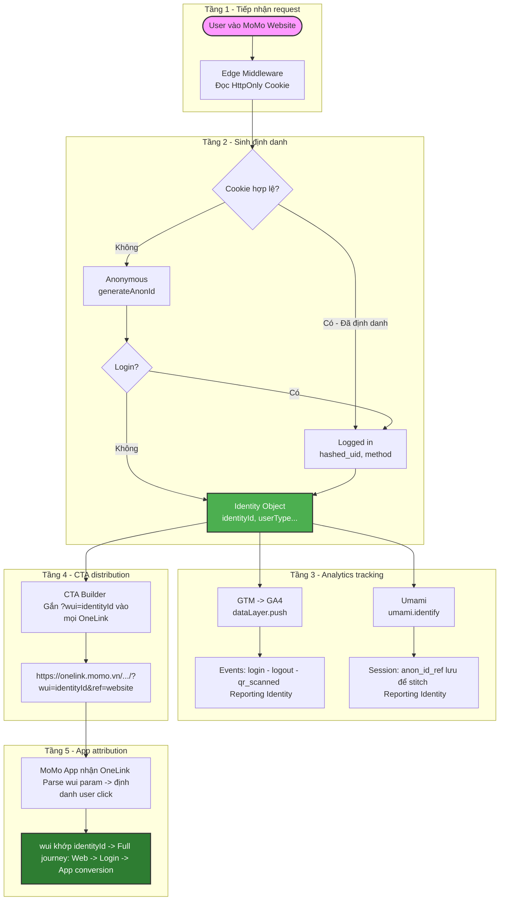

# MoSpark Platform - User Identity: Web To App Tracking
Tài liệu đặc tả kỹ thuật và kiến trúc hệ thống định danh người dùng xuyên suốt từ Web sang App của MoSpark.

> - **Project Name:** User Identity - Web To App Tracking
> - **Platform:** MoSpark Web Platform
> - **Division:** GPD (Growth Platform Division)
> - **PIC:** Hiếu (Tracking Lead)
> - **Version:** 1.0 · June 2026

---

## 1. Job To Be Done (JTBD)
> Khi cần tối ưu tỷ lệ chuyển đổi từ Website sang App, tôi muốn định danh và liên kết người dùng xuyên suốt giữa Web và App, nhằm theo dõi đầy đủ hành trình từ **Anonymous User ➔ Logged-in User ➔ Click-to-App ➔ In-App User**, từ đó đo lường hiệu quả chuyển đổi và tối ưu các chiến dịch tăng trưởng.

---

## 2. Kiến Trúc Luồng Định Danh (Architecture Diagram)

---

## 3. Quy Trình Vận Hành Chi Tiết (5 Layers Data Flow)

### Tầng 1. User Identification Request
Khi người dùng truy cập website MoMo, hệ thống sử dụng **Edge Middleware** để kiểm tra cookie định danh hiện có để xác định người dùng đã được nhận diện trước đó hay chưa (Đọc HttpOnly Cookie).

### Tầng 2. Identity Generation
Hệ thống tiến hành khởi tạo và chuẩn hóa định danh người dùng:
*   **Trường hợp đã có định danh:** Sử dụng thông tin từ cookie để khởi tạo **Identity Object**.
*   **Trường hợp chưa có định danh:** Hệ thống tạo **Identity Object** mới dựa trên trạng thái người dùng tại thời điểm đó:
    *   *Anonymous User:* Gọi hàm `generateAnonId()`.
    *   *Logged-in User:* Sử dụng `hashed_uid` và lưu vết `method` đăng nhập.
*   Mọi trạng thái của người dùng đều được chuẩn hóa và hợp nhất thành một **Identity Object** duy nhất chứa `{ identityId, userType... }`.

### Tầng 3. Analytics Tracking
Identity Object được gửi đồng thời đến các nền tảng phân tích dữ liệu ngay sau khi được khởi tạo thành công:
*   **GTM ➔ GA4:** Gửi dữ liệu qua `dataLayer.push({ user_identity_init: [...] })`. Ghi nhận các sự kiện quan trọng: `login`, `logout`, `qr_scanned` để đồng bộ Reporting Identity.
*   **Umami:** Gọi hàm `umami.identify(identityId, { user_type... })`. Lưu trữ `anon_id_ref` trong session để phục vụ cơ chế stitch dữ liệu hành vi.

### Tầng 4. CTA Distribution
Identity ID được đính kèm vào tất cả các nút bấm CTA (Call to Action) điều hướng từ Web sang App thông qua tham số `wui` (Website User ID).
*   **Cơ chế:** Nền tảng **CTA Builder** tự động phát hiện các link Appsflyer OneLink và chèn thêm query parameter: `?wui=<identityId>&ref=website`.
*   **Ví dụ định dạng URL:**
    `https://onelink.momo.vn/WZPv/4QaAScb4?wui=<identityId>&ref=website`
*   **Mục tiêu:** Đảm bảo 100% lượt chuyển dịch (referral) từ Website sang App đều mang theo định danh người dùng.

### Tầng 5. App Attribution
Khi người dùng mở App thông qua link OneLink đã được cá nhân hóa:
*   App MoMo ghi nhận nguồn truy cập (`ref=website`).
*   App tiếp nhận giá trị `wui` từ OneLink để ánh xạ trực tiếp với Identity ID trên Web.
*   Hệ thống Backend & Data thực hiện liên kết dữ liệu (Data Stitching) giữa: **Web Identity / MoMo User / In-App Activity**.

---

## 4. Kết Quả Kỳ Vọng (Expected Outcome)
Xây dựng thành công hành trình người dùng xuyên suốt và không đứt gãy từ Website đến App (Web-to-App). Hệ thống cung cấp dữ liệu sạch hỗ trợ đắc lực cho:
1.  Đo lường chính xác tỷ lệ chuyển đổi (Conversion Rate).
2.  Phân tích sâu hành vi người dùng (Behavioral Analytics).
3.  Tối ưu hóa các chiến dịch tăng trưởng (Growth Campaign Optimization).

---
*Maintained by: GPD - Web Platform | PIC: Hiếu (Tracking Lead) | Last updated: 2026-06-09*
