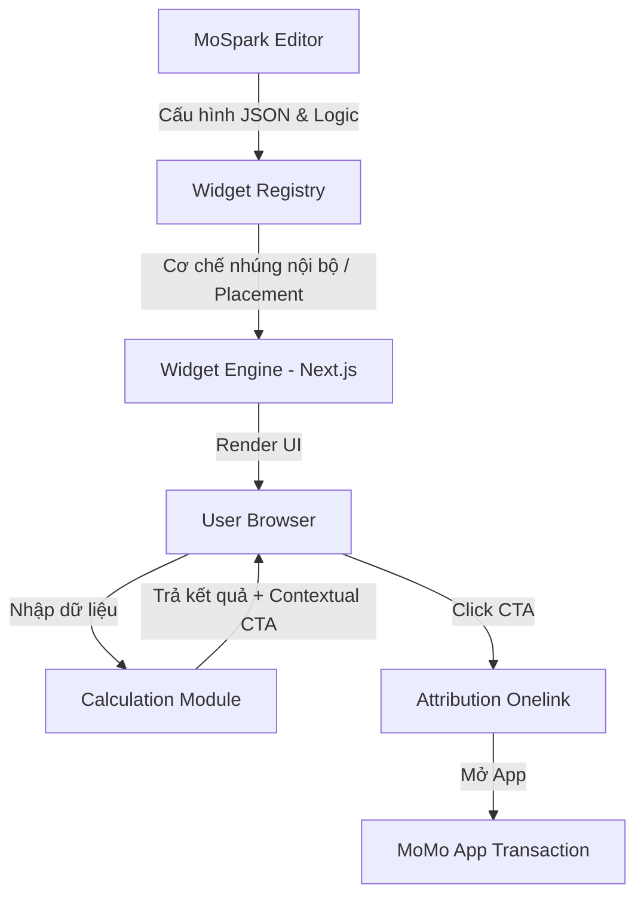

# MoSpark - Widget Store

Nền tảng kho tiện ích tương tác (Widget Store) trên MoSpark, hỗ trợ tích hợp và phân phối linh hoạt các cấu phần động (calculators, simulators, forms) nhằm tối ưu SEO, thu hút lưu lượng tự nhiên và thúc đẩy chuyển đổi Web-to-App.

> - **Project Name:** MoSpark Widget Store Platform
> - **Division:** GPD (Growth Platform Division)
> - **Owner:** Web Platform
> - **PIC:** Hiếu (Build Lead), Thuận (Widget & Utility Manager), Hiến (Project Manager), Hoài Anh (Backend/API & Widget Engine)
> - **Sponsors:** GPD & Business Units (Finhub BU - internal - làm đơn vị thí điểm Phase 1)
> - **Status:** In Progress - MVP Phase
> - **Version:** 3.5 — 2026-06-10

---

### 🎯 Elegant Framing (Bối cảnh & Nỗi đau)

*   **Situation (Thực trạng):** MoSpark Builder hiện chỉ hỗ trợ tạo trang nội dung tĩnh (Text, Image, FAQ). Khi các Business Units (BUs) cần tích hợp các công cụ tương tác động (như bộ tính toán, bảng so sánh, biểu mẫu thu thập dữ liệu) để giữ chân khách hàng và tạo leads, họ phải yêu cầu đội ngũ Dev xây dựng trang tùy chỉnh (custom page) riêng lẻ.
*   **Complication (Nút thắt):** Việc phát triển ad-hoc cho từng BU gây tốn nguồn lực lập trình, kéo dài thời gian Time-to-Market và không thể tái sử dụng. Đồng thời, hàng triệu lượt tìm kiếm hàng tháng từ người dùng có mục đích tương tác rõ ràng (Search Intent) trên Google (như tính thuế, tính lãi, giả lập đầu tư) đang bị bỏ lỡ hoặc thất thoát sang các bên thứ ba vì MoMo thiếu các tiện ích động để giữ chân và chuyển đổi.
*   **Resolution (Giải pháp):** Xây dựng **Widget Store Platform** — một kho tiện ích tương tác tập trung trên MoSpark. Cho phép PM/PO của bất kỳ BU nào tự cấu hình công thức, giao diện và nhúng widget động trực tiếp vào các Landing Page hoặc bài viết Blog (theo cơ chế nhúng của hệ thống). Dự án sẽ triển khai thí điểm trong **Phase 1** với bộ công cụ giả lập tài chính (Finhub Simulator Pilot) để hoàn thiện và kiểm nghiệm hệ thống.

*   **KPI Owned:** Conversion Rate (Web-to-App Click CTR), Completion Rate (Tỷ lệ hoàn thành nhập liệu), Organic Search Traffic (SEO/GEO Visibility).
*   **Consumer Flow:** Người dùng tìm kiếm nhu cầu thực tế (ví dụ: "Tính thuế TNCN") ➡️ Landing Page chứa Widget tương tác tương ứng ➡️ Nhập thông tin & Nhận kết quả trực quan ➡️ Click Contextual CTA (Onelink) ➡️ Chuyển đổi thành người dùng hoạt động (MAU/Reactivation) trong App MoMo.

---

# PHẦN I: PRODUCT STRATEGY

## 1. Executive Summary

Dự án xây dựng **Widget Store** trên nền tảng MoSpark nhằm mục tiêu tự động hóa việc xuất bản các trang tiện ích tương tác (Utility Pages) giúp tăng trưởng lưu lượng truy cập tự nhiên và tối ưu tỷ lệ chuyển đổi Web-to-App (W2A) trên toàn hệ thống MoMo Web Channel.

Thay vì lập trình riêng lẻ từng công cụ cho mỗi Business Unit, Widget Store cung cấp một hạ tầng dùng chung (Widget Engine). Để chứng minh tính hiệu quả của mô hình và tối ưu hóa hạ tầng kỹ thuật trước khi mở rộng, dự án sẽ triển khai thí điểm **Phase 1** với bộ công cụ giả lập tài chính **Finhub Simulation Tools** (bao gồm 10 công cụ tương tác cốt lõi).

## 2. Market Context & Widget Store Rationale

### 2.1 Bảng Đồng bộ Dữ liệu Thị trường (Master Market Sizing)
Tra cứu và tính toán tài chính là nhóm từ khóa có lượng tìm kiếm khổng lồ (YMYL). Dựa trên Master Inventory, dự án đã Pivot chiến lược để bổ sung ngay 2 "Mỏ vàng" khổng lồ nhất (Gold & Exchange Rate) vào Phase 1 nhằm tối đa hóa Traffic:

| Thị trường (Market) | Volume/tháng | Trạng thái SERP hiện tại | Cơ hội của MoMo (Widget) |
|---|---|---|---|
| **Gold (Giá Vàng)** | **85.758.870** | Các trang báo đài, công cụ sơ sài, nhiều quảng cáo | Widget theo dõi/quy đổi giá vàng SJC/Nhẫn trực quan, CTA Mua Vàng. |
| **Exchange Rate (Tỷ giá)** | **18.128.060** | Công cụ của ngân hàng rời rạc, ít ngoại tệ | Máy tính tỷ giá ngoại tệ real-time, so sánh tỷ giá. |
| Loan (Vay) | 2.958.140 | Các bảng tính lãi vay ngân hàng tĩnh, khó hiểu | Công cụ tính dư nợ giảm dần trực quan, CTA Vay Nhanh |
| Stock (Chứng khoán) | 3.000.000 | App chuyên biệt phức tạp | Công cụ giả lập đầu tư CCQ/Cổ phiếu đơn giản trên Web |
| Social Insurance (BHXH) | 938.090 | Các trang BHXH nhà nước khó sử dụng | Trực quan hóa mức đóng, tra cứu nhanh, CTA tiết kiệm |
| Heath Insurance (BHSK) | 396.910 | Các bảng tính phí phức tạp, nặng thuật ngữ | Công cụ tính phí BHSK nhanh gọn, trực quan |
| Saving (Lãi tiết kiệm) | 209.000 | Các trang ngân hàng rời rạc | Nhập số ➔ Xem lãi ➔ Gửi trực tiếp qua MoMo |
| Personal Income Tax (Thuế TNCN) | *Chưa có dữ liệu* | Các trang báo, trang luật, giao diện cũ | Widget sạch, tính chính xác cao, CTA gửi tiết kiệm |
| Pension (Lương hưu) | *Chưa có dữ liệu* | Các bảng tính phức tạp, thủ công | Ước tính lương hưu tự động, CTA quỹ hưu trí/tiết kiệm |

### 2.2 Competitor Landscape
1.  **Nhóm Chuyên trang Nhân sự/Tuyển dụng (e.g., TopCV):** Thành công lớn nhờ công cụ tính lương Gross-Net để kéo traffic và chuyển đổi user.
2.  **Nhóm Báo chí & Tin tức Tài chính/Đời sống:** Traffic lớn nhưng trải nghiệm tệ, ngập quảng cáo, không có giá trị chuyển đổi dịch vụ sau khi tính.
3.  **Nhóm Website Ngân hàng/Fintech:** Công cụ đơn giản, chỉ tập trung vào một sản phẩm nội bộ, thiếu tính đa dạng và tính cá nhân hóa.

### 2.3 Rationale cho Widget Store Platform
Thay vì lập trình riêng lẻ từng công cụ (tốn 2-3 tuần phát triển/công cụ), Widget Store cung cấp một **Widget Engine** dùng chung. Sau khi Engine được phát triển:
*   PM/PO có thể tự cấu hình công thức tính, giao diện (slider, input fields) và CTA thông qua MoSpark.
*   Hỗ trợ nhúng linh hoạt widget vào bài viết Blog bất kỳ (theo cơ chế tích hợp do Dev phát triển).

## 3. Job-to-be-Done (JTBD) Analysis

### 3.1 Khách hàng cuối (End-User JTBD)
*   *Khi* tôi có nhu cầu tra cứu thông tin hoặc tính toán số liệu liên quan đến đời sống/tài chính cá nhân (lương, thuế, lãi suất, tiện ích),
*   *Tôi muốn* sử dụng các công cụ tính toán/giả lập chính xác, trực quan, bảo mật ngay trên trình duyệt Web di động/máy tính,
*   *Để tôi có thể* đưa ra quyết định nhanh chóng và lựa chọn dịch vụ/sản phẩm phù hợp mà không cần tải app hay đăng ký tài khoản phức tạp từ đầu.

### 3.2 Người vận hành (PM/PO MoMo JTBD)
*   *Khi* tôi cần chạy chiến dịch hoặc thúc đẩy chỉ số kinh doanh cho một dòng sản phẩm của BU (e.g. Tiết kiệm, Đầu tư, Bảo hiểm, Du lịch),
*   *Tôi muốn* tự cấu hình, kéo-thả và phân phối một công cụ tương tác vào landing page hoặc bài viết trong vòng vài phút thông qua CMS,
*   *Để tôi có thể* gia tăng tỷ lệ chuyển đổi Web-to-App (W2A) mà không phụ thuộc vào chu kỳ phát triển phần mềm (Sprint) của đội Dev.

## 4. Product Vision & Scope Limits

### 4.1 Định hướng theo [Khung Tăng trưởng S-P-A](file:///Users/hienhv/HienHv/Klaus/Hienho_MoMo-Base/02_FRAMEWORKS/spa-framework.md) (reSearch - Pilot - Action)
*(Xem chi tiết quy trình tăng trưởng và biểu mẫu yêu cầu tính năng tại [S-P-A Playbook & Template](file:///Users/hienhv/HienHv/Klaus/Hienho_MoMo-Base/02_FRAMEWORKS/spa-framework.md))*

Dự án Widget Store đóng vai trò then chốt trong việc thực thi giai đoạn **Pilot** (thử nghiệm tính năng qua MVP) và **Action** (sản xuất hàng loạt, tối ưu Smart CTA để thúc đẩy tăng trưởng) cho các Use Case:
*   **reSearch & Strategy (Stage S):** Xác định nhu cầu tính toán/giả lập của người dùng từ lượng traffic tự nhiên lớn (SEO/GEO).
*   **Pilot & Plan (Stage P):** Build nhanh các Widget MVP (tiện ích tương tác) nhúng vào các trang Pilot để đo lường phễu Web-to-App.
*   **Action & Amplifier (Stage A):** Scale rộng rãi các Widget trên hệ thống, kích hoạt luồng Smart CTA và Zero-Party Data Passing để tối đa hóa chuyển đổi MAU/MEU cho các BU.

### 4.2 Dự án này KHÔNG phải là:
*   Nơi thực hiện các giao dịch thanh toán trực tiếp (Mọi giao dịch thanh toán, KYC sâu đều được điều hướng về App MoMo thông qua Onelink).
*   Công cụ tư vấn chuyên sâu hoặc cam kết đầu tư tài chính (Mọi kết quả tính toán đều đi kèm Disclaimer miễn trừ trách nhiệm pháp lý).

### 4.3 Phasing & Implementation Roadmap

Để tối ưu hóa tài nguyên phát triển và liên tục cải tiến nền tảng, lộ trình triển khai Widget Store Platform được phân tách thành các giai đoạn:

| Phase | Phạm vi & Tiện ích triển khai | Mục tiêu | Trạng thái |
|---|---|---|---|
| **Phase 1** | **Pilot Siêu Tiện ích & Finhub Simulators**: - Bộ 10 tiện ích: Giá Vàng (Gold), Tỷ giá (Exchange Rate), Lãi Vay (Loan), Trắc nghiệm (Quiz), Thuế TNCN, Lãi Tiết kiệm, BHXH, Lương hưu, Đầu tư CCQ, Phí BHSK+. - Kiến trúc: Hub & Spoke | - Khởi dựng **Widget Engine** và tích hợp CMS. - Thử nghiệm quy trình render Widget trên trang landing page. - Kiểm chứng luồng chuyển đổi Web-to-App và SEO/GEO. | **Discovery & MVP** (Tháng 6-7/2026) |
| **Phase 2** | **Mở rộng các BU thuộc khối Dịch vụ & Tiêu dùng**: - Tích hợp các Widget mới từ Bảo hiểm (như Phí BHXM, BHYT), Du lịch & Đi lại (tính giá vé, gợi ý tour), hoặc Tiện ích đời sống. | - Tối ưu hóa hiệu năng Widget Engine. - Chuẩn hóa hệ thống thiết kế (Design System) của Widget Store trên CMS. | *Lên kế hoạch* (Dự kiến Q3/2026) |
| **Phase 3** | **Platform hóa toàn diện (Self-serve) & Creator Marketplace**: - Mở rộng CMS Editor để PM/PO tự tạo widget. - **KOL/KOC Marketplace**: Mở công cụ cho Creator (Chuyên gia tài chính) tự build Widget mang thương hiệu cá nhân để phân phối cho followers. | - Biến MoMo thành nền tảng Low-code (như Shopify/Linktree) cho KOLs. - Tận dụng Traffic miễn phí từ Kênh MXH của KOLs. | *Lên kế hoạch* (Dự kiến Q4/2026) |

---

# PHẦN II: PRODUCT SPECIFICATION

## 5. Platform Architecture & Widget Engine Specs

Widget Store đóng vai trò là "Vũ khí lõi" của **Luồng 1 (LDP Builder M1)** trong Hệ thống Điều phối Từ khóa (Keyword Routing). Mọi Keyword được gán nhãn Transactional/Tool từ SEO/GEO Project (ví dụ: `tính thuế tncn`) sẽ dùng hệ thống Widget này làm trung tâm để chốt chuyển đổi.

Hạ tầng Widget Store Platform được trang bị 2 năng lực chiến lược cực mạnh (Strategic Capabilities):
1. **Smart CTA (Điều hướng theo Intent):** Hệ thống không fix cứng CTA. Logic Engine sẽ phân tích Input của người dùng để trả về CTA chốt sale phù hợp nhất (Ví dụ: Nhập lương thấp -> Rủ mở Ví Trả Sau; Nhập lương cao -> Rủ mở thẻ Tín dụng hạn mức cao).

> **Smart CTA Rule Engine - PIC & Governance:** Rule Engine do **Hiến (PM)** define và approve; **Hiếu (Build Lead)** implement. Rules được lưu dưới dạng config (không hardcode) để PM/PO có thể update qua CMS mà không cần Sprint mới. Mọi thay đổi rule phải qua approval của Hiến trước khi deploy.

2. **Trải nghiệm Onboarding Cá nhân hóa (Zero-Party Data Engine):** Dữ liệu người dùng khai báo trên Web (Số tuổi, Lương, Mức kỳ vọng) sẽ được mã hóa vào Token của Onelink. Khi mở App MoMo, người dùng sẽ nhận được ngay gói dịch vụ thiết kế cá nhân hóa 1-1, tối đa hóa chuyển đổi.

> **Legal Flag - Zero-Party Data Flow:** Đây là personal data flow từ web (anonymous) vào app (authenticated). Yêu cầu: (1) Consent mechanism rõ ràng trên Web trước khi encode vào Onelink token - user phải biết dữ liệu được truyền sang App; (2) Legal sign-off riêng biệt cho flow này - không gộp vào YMYL Content Gate. **PIC xác nhận Legal clearance trước khi build.**

Hạ tầng này được phát triển dựa trên **Widget Engine** tích hợp sẵn vào MoSpark để phục vụ tất cả các BU:

### 5.1 Sơ đồ vận hành hệ thống (CMS Integration)

### 5.2 Cơ chế nhúng Widget (Embedding Mechanism)

CMS Editor và Widget Engine sẽ sử dụng cơ chế nhúng động do phía Dev thiết kế và phát triển (ví dụ: Dynamic block component trong trình soạn thảo, cấu hình registry hoặc iframe). Cú pháp shortcode cụ thể sẽ không được quy định cứng trong đặc tả sản phẩm mà hoàn toàn do đội ngũ kỹ thuật (PIC Hiếu & Hoài Anh) quyết định để đảm bảo tính tối ưu và an toàn hệ thống.

### 5.3 Page Template Chuẩn (Bố cục 6 Slots)
Bất kỳ trang tiện ích (Utility Page) nào được tạo ra để phục vụ việc nhúng widget từ Widget Store đều cần tuân thủ bố cục cấu trúc chuẩn hóa gồm 6 Slots dưới đây để đảm bảo trải nghiệm người dùng tối ưu và chuẩn SEO/GEO:
1.  **Slot 1 (Header Banner):** Tiêu đề công cụ, đoạn giới thiệu ngắn và rating (Schema markup).
2.  **Slot 2 (Calculator Form):** Các thanh kéo slider và ô nhập dữ liệu trực quan.
3.  **Slot 3 (Results Dashboard):** Hiển thị kết quả dưới dạng số liệu lớn kèm biểu đồ sinh động.
4.  **Slot 4 (Financial/Comparative Context):** So sánh đa chiều (Ví dụ: So sánh gửi tiết kiệm MoMo vs mua Vàng/Đầu tư).
5.  **Slot 5 (Contextual CTA):** Banner quảng cáo động dẫn sâu vào App MoMo qua Onelink.
6.  **Slot 6 (FAQ & Content Hub - Internal Linking):** Điểm cắm Internal Link bắt buộc từ các bài Blog vệ tinh (Spoke) thuộc cùng Topic Cluster, tạo thành mạng nhện SEO vững chắc đẩy Traffic về trang Widget (Hub).

---

## 6. Phase 1 Pilot: Finhub Simulation Specs

Bộ công cụ giả lập tài chính Finhub Simulation là nhóm tiện ích thí điểm đầu tiên sử dụng Widget Store Platform.

### 6.1 Kiến trúc & Trải nghiệm liền mạch (Hub & Spoke + Context Passing)
Để tuân thủ nguyên tắc Topical Authority và Mapping 1-1 của MoSpark, hệ thống sẽ KHÔNG gom chung các Widget vào một trang duy nhất. Thay vào đó, kiến trúc được phân tách rõ ràng nhưng kết nối chặt chẽ về mặt dữ liệu:
*   **Master Widget (Hub):** Trang `/trung-tam-tai-chinh` không chỉ là Category Index tĩnh, mà được nâng cấp thành **Widget Phân Bổ Lương**. Người dùng nhập thu nhập 1 lần, hệ thống tự động tính toán các rổ tài chính (Tiết kiệm, Đầu tư, Bảo hiểm, Dự phòng).
*   **Landing Page Độc Lập (Spokes):** Mỗi tiện ích con (Tính thuế, Lãi tiết kiệm, Đầu tư) nằm trên một Landing Page riêng biệt (`momo.vn/tinh-lai-tiet-kiem`). Điều này tối ưu tuyệt đối cho SEO.
*   **Context Passing (Truyền tham số tự động):** Khi click từ rổ của Master Widget sang trang Spoke tương ứng, số tiền được tự động truyền qua URL Parameters (Ví dụ: `?prefill=4000000`) để tự động điền (pre-fill) vào thanh công cụ của Spoke, tạo trải nghiệm Cross-selling mượt mà, không đứt gãy.

> **SEO Note - robots.txt Compatibility:** `Disallow: /*?` đã được deploy trên MoSpark. Các URL Spoke khi có parameter `?prefill=` sẽ bị crawler disallow - đây là behavior đúng vì các URL có parameter không phải canonical page. Dev cần đảm bảo: (1) Canonical URL của Spoke luôn là phiên bản không có parameter; (2) Không tạo indexable variant nào từ `?prefill=`. Confirm với Hoài Anh trước khi build.
*   **Khả năng phân phối chéo:** Các Widget con có thể được nhúng (embed) vào các bài viết Blog vệ tinh thông qua cơ chế nhúng của hệ thống.

### 6.2 Chi tiết 10 Tiện ích Phase 1 Pilot (Phân Tích JTBD & Product Value)

Thay vì đi sâu vào đặc tả kỹ thuật lập trình (Tech Spec), mỗi tiện ích tương tác trong Phase 1 được thiết kế xoay quanh việc giải quyết một Job-to-be-Done (JTBD) cụ thể của người dùng và tạo cầu nối chuyển đổi (W2A) tự nhiên nhất:

#### 1. Gold Tracker & Converter (Theo dõi & Quy đổi Giá Vàng)
*   **Bối cảnh & Nỗi đau:** Người dùng muốn mua vàng tích lũy nhưng giá biến động liên tục. Họ sợ mua đắt bán rẻ tại các tiệm vàng truyền thống do thiếu thông tin minh bạch.
*   **Nhiệm vụ người dùng (JTBD):**
    *   *Functional:* Cập nhật giá vàng SJC/vàng nhẫn thời gian thực và quy đổi nhanh số lượng vàng mong muốn sang tiền mặt.
    *   *Emotional:* An tâm tích lũy tài sản dài hạn; cảm thấy chủ động kiểm soát giá trị tài sản tích trữ.
*   **Giải pháp của Widget:** Hiển thị biểu đồ xu hướng giá vàng trực quan, bảng giá cập nhật hôm nay và công cụ nhập số chỉ/lượng để tính toán số tiền tương ứng ngay lập tức.
*   **Cầu nối chuyển đổi (W2A):** CTA *"Mua vàng miếng/vàng nhẫn bảo chứng an toàn trực tiếp trên MoMo"*.

#### 2. Exchange Rate Calculator (Tỷ giá Ngoại tệ)
*   **Bối cảnh & Nỗi đau:** Người chuẩn bị du lịch nước ngoài hoặc mua sắm trên các trang thương mại điện tử quốc tế gặp khó khăn trong việc nhẩm tính giá trị món đồ sang tiền Việt.
*   **Nhiệm vụ người dùng (JTBD):**
    *   *Functional:* Quy đổi tức thời các đồng ngoại tệ phổ biến sang tiền Việt (VND) theo tỷ giá thực tế ngân hàng.
    *   *Emotional:* Tự tin chi tiêu và đưa ra quyết định mua sắm ở nước ngoài mà không sợ bị hớ tỷ giá.
*   **Giải pháp của Widget:** Ô nhập số tiền ngoại tệ nhanh và chọn cặp tiền quy đổi (USD, JPY, EUR...) sang VND hiển thị tức thì.
*   **Cầu nối chuyển đổi (W2A):** CTA *"Mở thẻ tín dụng quốc tế MoMo - Không phí chuyển đổi ngoại tệ"* hoặc *"Chuyển tiền quốc tế qua MoMo"*.

#### 3. Gross-Net Salary Simulator (Tính lương Thực nhận)
*   **Bối cảnh & Nỗi đau:** Ứng viên chuẩn bị nhận việc (deal lương Gross) nhưng mơ hồ về số tiền thực tế sẽ "bỏ túi" sau khi trừ bảo hiểm bắt buộc và thuế thu nhập cá nhân (TNCN).
*   **Nhiệm vụ người dùng (JTBD):**
    *   *Functional:* Quy đổi lương Gross sang lương Net thực nhận chính xác theo biểu thuế lũy tiến mới nhất.
    *   *Emotional:* Tự tin thương lượng lương với HR; an tâm quyền lợi bảo hiểm xã hội được đóng đầy đủ.
    *   *Social:* Thể hiện là người lao động chuyên nghiệp, am hiểu luật pháp.
*   **Giải pháp của Widget:** Form nhập mức lương Gross và số người phụ thuộc -> Trả về biểu đồ phân rã trực quan: số tiền thực nhận (Net), số tiền đóng bảo hiểm (BHXH, BHYT, BHTN) và tiền thuế đóng cho nhà nước.
*   **Cầu nối chuyển đổi (W2A):** 
    *   Lương Net thấp -> CTA *"Mở Ví Trả Sau MoMo chi tiêu trước trả sau"*.
    *   Lương Net cao -> CTA *"Gửi tiết kiệm tích lũy tự động từ lương"*.

#### 4. Savings Yield Calculator (Tính Lãi Tiết Kiệm)
*   **Bối cảnh & Nỗi đau:** Người dùng có tiền nhàn rỗi muốn gửi tiết kiệm nhưng không biết gửi kỳ hạn nào có lợi nhất và tổng số tiền lãi nhận về là bao nhiêu giữa các ngân hàng.
*   **Nhiệm vụ người dùng (JTBD):**
    *   *Functional:* Tính toán và so sánh số tiền lãi nhận được giữa các kỳ hạn và phương thức trả lãi (cuối kỳ vs hàng tháng).
    *   *Emotional:* Cảm thấy tiền bạc đang sinh sôi an toàn; giải tỏa nỗi lo tiền mất giá.
*   **Giải pháp của Widget:** Thanh kéo (slider) chọn số tiền gửi và kỳ hạn -> Trả về số tiền lãi nhận được và biểu đồ tăng trưởng số dư tổng.
*   **Cầu nối chuyển đổi (W2A):** CTA *"Mở sổ tiết kiệm online nhận lãi suất ưu đãi từ đối tác Finhub trên MoMo"*.

#### 5. Social Insurance Calculator (BHXH Một lần / Đóng BHXH)
*   **Bối cảnh & Nỗi đau:** Người lao động chuẩn bị nghỉ việc phân vân có nên rút bảo hiểm xã hội (BHXH) một lần không, lo sợ mất mát quyền lợi nhưng đang cần một khoản tiền gấp.
*   **Nhiệm vụ người dùng (JTBD):**
    *   *Functional:* Ước tính số tiền BHXH một lần có thể nhận được hoặc tính toán mức đóng BHXH tự nguyện hàng tháng.
    *   *Emotional:* Giảm bớt hoang mang, đưa ra lựa chọn tài chính sáng suốt khi đổi việc hoặc nghỉ việc.
*   **Giải pháp của Widget:** Nhập tổng số năm đóng bảo hiểm và mức lương đóng trung bình -> Ước tính nhanh số tiền nhận được kèm cảnh báo tác động tài chính dài hạn.
*   **Cầu nối chuyển đổi (W2A):** CTA *"Gửi tích lũy an toàn trên MoMo để bù đắp quỹ dự phòng thay vì rút non BHXH"*.

#### 6. Pension Estimator (Ước tính Lương Hưu)
*   **Bối cảnh & Nỗi đau:** Người đi làm lo sợ về già trở thành gánh nặng tài chính cho con cái hoặc lương hưu không đủ trang trải chi phí sinh hoạt tối thiểu.
*   **Nhiệm vụ người dùng (JTBD):**
    *   *Functional:* Dự toán độ tuổi nghỉ hưu và số tiền lương hưu dự kiến nhận được hàng tháng dựa trên mức đóng hiện tại.
    *   *Emotional:* Yên tâm về kế hoạch nghỉ hưu; nhận thức rõ khoảng hụt lương hưu (Retirement Gap) để lên phương án tự tích lũy.
*   **Giải pháp của Widget:** Nhập tuổi, giới tính và thu nhập đóng bảo hiểm -> Dự báo số tiền hưu trí hàng tháng kèm biểu đồ so sánh mức sống.
*   **Cầu nối chuyển đổi (W2A):** CTA *"Đầu tư chứng chỉ quỹ tích lũy hưu trí dài hạn trên MoMo"*.

#### 7. Investment Simulator (Giả lập Đầu tư CCQ / Cổ phiếu)
*   **Bối cảnh & Nỗi đau:** Muốn tham gia đầu tư tài chính để gia tăng tài sản nhưng sợ rủi ro thua lỗ, không tin vào các cam kết lợi nhuận sáo rỗng trên mạng.
*   **Nhiệm vụ người dùng (JTBD):**
    *   *Functional:* Mô phỏng lợi nhuận đầu tư dựa trên dữ liệu tăng trưởng lịch sử thực tế của các quỹ đầu tư top đầu.
    *   *Emotional:* Vượt qua nỗi sợ ban đầu; cảm thấy tự tin bắt đầu hành trình đầu tư với số vốn nhỏ.
*   **Giải pháp của Widget:** Chọn số tiền đầu tư định kỳ hàng tháng và khẩu vị rủi ro -> Hiển thị số tiền lãi giả lập (Ví dụ: *"Nếu bạn tích lũy 1 triệu/tháng vào Quỹ CCQ từ 3 năm trước, hôm nay bạn nhận được X triệu"*).
*   **Cầu nối chuyển đổi (W2A):** CTA *"Mở tài khoản đầu tư Chứng chỉ quỹ/Chứng khoán chỉ từ 10.000đ trên MoMo"*.

#### 8. Health Cost & Insurance Simulator (Phí & Chi phí Y tế BHSK+)
*   **Bối cảnh & Nỗi đau:** Sợ ốm đau bệnh tật đột xuất cuốn trôi toàn bộ tiền tiết kiệm của gia đình, nhưng lại mơ hồ về chi phí chữa trị thực tế và vai trò của bảo hiểm sức khỏe bổ trợ.
*   **Nhiệm vụ người dùng (JTBD):**
    *   *Functional:* Ước tính chi phí y tế cho các nhóm bệnh lý cụ thể và so sánh số tiền tự chi trả khi có vs không có bảo hiểm sức khỏe bổ trợ.
    *   *Emotional:* Cảm thấy gia đình được bảo vệ an toàn; giải tỏa nỗi sợ khánh kiệt vì viện phí.
*   **Giải pháp của Widget:** Chọn nhóm bệnh lý và mức độ nghiêm trọng -> Hiển thị biểu đồ phân tách rổ chi phí (BHYT trả, Bảo hiểm tự nguyện trả, và Tiền túi tự trả).
*   **Cầu nối chuyển đổi (W2A):** CTA *"Tham gia Sức Khỏe+ chỉ từ 89k/tháng - Bảo vệ tài chính gia đình"* (Onelink dẫn thẳng vào luồng đăng ký app).

#### 9. Loan Amortization Calculator (Tính lãi khoản vay)
*   **Bối cảnh & Nỗi đau:** Người cần vay mua xe/mua nhà bối rối trước cách tính lãi suất của ngân hàng (dư nợ giảm dần vs gốc chia đều) và lo sợ áp lực nợ xấu vượt quá khả năng chi trả hàng tháng.
*   **Nhiệm vụ người dùng (JTBD):**
    *   *Functional:* Tính lịch trả nợ chi tiết (gốc + lãi) hàng tháng theo phương thức dư nợ giảm dần.
    *   *Emotional:* Chủ động cân đối thu chi gia đình; giảm áp lực tâm lý trả nợ quá hạn.
*   **Giải pháp của Widget:** Nhập số tiền vay, thời hạn và lãi suất -> Trả lịch thanh toán từng tháng trực quan kèm biểu đồ dư nợ.
*   **Cầu nối chuyển đổi (W2A):** CTA *"Kiểm tra hạn mức Ví Trả Sau hoặc đăng ký vay nhanh giải ngân trong 5 phút"*.

#### 10. Financial Quiz & Gamified Assessment (Trắc nghiệm tài chính)
*   **Bối cảnh & Nỗi đau:** Kiến thức tài chính cá nhân khô khan, nhàm chán. Người dùng lười đọc các bài phân tích dài dòng và muốn tự đánh giá sức khỏe tài chính của mình một cách vui vẻ.
*   **Nhiệm vụ người dùng (JTBD):**
    *   *Functional:* Kiểm tra nhanh mức độ hiểu biết tài chính hoặc khẩu vị rủi ro cá nhân qua hình thức trắc nghiệm tương tác.
    *   *Emotional:* Được giải trí, tò mò về kết quả tính cách tài chính của mình.
*   **Giải pháp của Widget:** Giao diện Tinder-swipe (vuốt chọn Đúng/Sai) hoặc chọn câu trả lời nhanh -> Trả về xếp hạng Persona (Ví dụ: *"Sói già tài chính"*, *"Mầm non tích lũy"*) kèm thẻ kết quả chia sẻ mạng xã hội.
*   **Cầu nối chuyển đổi (W2A):** Tặng ngay voucher mua bảo hiểm/sổ tiết kiệm khi hoàn thành quiz ➔ CTA *"Mở App dùng ngay quà tặng"*.

---

# PHẦN III: PROJECT MANAGEMENT

## 8. Success Metrics

*(Lưu ý: Target chưa được set do chưa có baseline. KPI sẽ được lock sau 2 tuần đầu measure từ ngày launch Phase 1. Dự án thống nhất bám sát các chỉ số tăng trưởng - Growth Metrics lõi của Web Platform. PIC lock target: Hiến + Hải/Hoàng (DA Team).)*

| Nhóm Metric | Chỉ số đo lường (KPI) | Mục tiêu (Target) | Nguồn đo lường |
|---|---|---|---|
| **Growth (User Acquisition)** | MEU (Monthly Earning Users) | *TBD (To be defined)* | BI Dashboard / Appsflyer |
| **Growth (Retention)** | MAU (Monthly Active Users) | *TBD (To be defined)* | BI Dashboard / Appsflyer |
| **Growth (New User)** | Lượt cài đặt App mới (New Install) | *TBD (To be defined)* | Appsflyer |

## 9. Dependencies & Constraints

### 9.1 Technical Dependencies & API Availability
1.  **API Availability Mapping:**
    *   **Tiết kiệm (Savings)** và **Chứng khoán (CCQ/Đầu tư)**: Có sẵn **API in-app** (Finhub và đối tác cung cấp dữ liệu thời gian thực). Yêu cầu backend sync dữ liệu mượt mòn từ App ra Web thông qua API Gateway của MoSpark (Hoài Anh phụ trách).
    *   **Thu nhập sau thuế**, **BHXH**, **Lương hưu**, và **BHSK+**: **Không có API từ App**. Các tiện ích này sẽ hoạt động độc lập (offline calculation) dựa trên công thức chuẩn quy định hiện hành hoặc file cấu hình tĩnh (JSON config) trên CMS để PM/PO tự quản trị.
2.  **Onelink Deep-linking:** Sự phối hợp của App Team để đảm bảo user khi click từ Web sẽ mở đúng màn hình tính năng in-app (không bị đẩy về Homepage của app).

### 9.2 Constraints & Compliance
*   **YMYL Content Gate:** Nội dung và công thức tính toán phải đi qua quy trình duyệt pháp lý (Legal Sign-off) để tránh các khiếu nại về tư vấn tài chính.
*   **Performance (Core Web Vitals):** Trang tiện ích bắt buộc đạt điểm LCP < 2.5s và INP < 200ms để không bị Google đánh tụt thứ hạng.

## 10. Project Status & Change Log

### 10.1 Kanban Board
*   **To Do:** Cấu hình API CCQ/Chứng khoán; Thiết lập Content FAQ cho BHSK+.
*   **In Progress:** Phát triển Widget Engine dùng chung; Cấu hình UI Gross-Net Simulator.
*   **Done:** Định vị chiến lược (Refactor v3.0); URL Architecture and sitemap pattern.

### Change Log
*   **Tháng 6/2026 (v3.5):**
    *   Loại bỏ hoàn toàn các tiện ích Phase 2 phi logic (The Latte Factor, Traffic Fine, Trip Budget, Rent vs Buy) và danh mục chiến lược truyền thông & phân phối (Comm & Distribution Strategy) theo phản hồi của PO vì chưa có kế hoạch triển khai.
*   **Tháng 6/2026 (v3.5):**
    *   Fix 6 issues từ PM review: (1) Clarify Smart CTA Rule Engine ownership - Hiến define, Hiếu implement, config-based không hardcode; (2) Thêm Legal Flag cho Zero-Party Data flow (consent + separate Legal sign-off); (3) Thêm SEO note về robots.txt compatibility với Context Passing `?prefill=`; (4) Move B2B Syndication vào Phase 2 scope và flag cần BD; (5) Fix duplicate Section 7.2 -> 7.3; (6) Replace hardcoded Phạt Nguội volume bằng [CẦN VERIFY] reference; (7) Clarify Finhub là internal BU; (8) Clarify KPI chưa có baseline và cơ chế lock sau launch.
*   **Tháng 6/2026 (v3.4):**
    *   Xóa Section 7.1 B2B Syndication (iframe/JS embed cho báo đài) - out-of-scope. Widget Store chỉ vận hành trên domain momo.vn, không có kế hoạch distribute ra ngoài. Renumber 7.2/7.3 lại.
*   **Tháng 6/2026 (v3.4):**
    *   Loại bỏ chi tiết về cú pháp shortcode tĩnh (`[widget:type-id]`) trong đặc tả sản phẩm theo phản hồi của PO. Cơ chế nhúng động/nhúng nội bộ sẽ hoàn toàn do phía Dev chủ động thiết kế (như block component/iframe) để đảm bảo linh hoạt.
*   **Tháng 6/2026 (v3.3):**
    *   Tinh chỉnh tiêu đề và loại bỏ hoàn toàn các đề cập đến "Finhub" cụ thể trong phần định vị định hướng chung (Elegant Framing).
    *   Chuẩn hóa cấu trúc tài liệu tập trung vào nền tảng Widget Store nói chung.
    *   Phân rã lộ trình triển khai rõ ràng (Phasing Roadmap), đưa bộ công cụ Finhub Simulation Tools làm thí điểm (Pilot) thuộc Phase 1.
    *   Cập nhật liên kết chỉ mục tại [README.md](file:///Users/hienhv/Documents/Obsidian_Vault/hovanhien_knowledgebase_momo/08_PRD/README.md).
*   **Tháng 6/2026 (v3.2):**
    *   Cập nhật phân loại hạ tầng kỹ thuật (API Availability Mapping): Phân tách rõ các tiện ích có API in-app hỗ trợ (Chứng khoán, Tiết kiệm) và các tiện ích dùng động cơ tính toán offline/tĩnh (Thuế TNCN, BHXH, Lương hưu, BHSK+).
*   **Tháng 6/2026 (v3.1):**
    *   Loại bỏ tiện ích "Vay Nhanh" (được phát triển và quản lý độc lập tại [vay-nhanh-brd.md](file:///Users/hienhv/Documents/Obsidian_Vault/hovanhien_knowledgebase_momo/05_USE_CASE_MOMO/vay-nhanh-brd.md)).
    *   Bổ sung thêm 2 tiện ích tương tác mới: **Tính Bảo hiểm xã hội (BHXH)** và **Tính Lương hưu** (tổng số nâng lên thành 6 công cụ giả lập).
*   **Tháng 6/2026 (v3.0):**
    *   Refactor toàn diện tài liệu từ dạng "5 công cụ giả lập riêng lẻ" thành định vị **Nền tảng Widget Store**.
    *   Cập nhật PIC: Giao **Hiếu làm Build Lead** phát triển Onelink/Widget Engine; **Thuận làm Widget & Utility Manager** (quản lý phân phối qua Ads Manager); Hoài Anh phụ trách Backend API; Hiến giữ vai trò Project Manager & SEO Governance.
    *   Định vị URL dự án hoạt động trên một trang duy nhất `/trung-tam-tai-chinh`, chưa triển khai Microsite.
    *   Thêm bố cục 6 slots chuẩn cho giao diện trang tiện ích.
*   **Tháng 5/2026 (v2.0):** Khởi tạo tài liệu MVP về 5 công cụ giả lập Finhub.

---
**END OF DOCUMENT**
