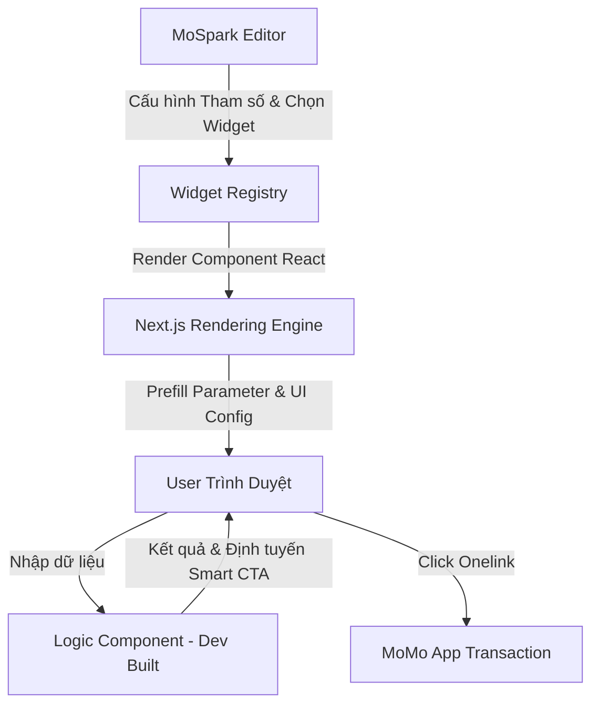

# MoSpark - Widget Store Platform Specification

> - **Project Name:** MoSpark Widget Store Platform
> - **Division:** GPD (Growth Platform Division)
> - **Owner:** Web Platform
> - **PIC:** Hiếu (Backend, API Config & Logic Builder), Thuận (Widget & Utility Manager - Đóng gói & quản trị Widget để phân phối qua Ads Manager), Hiến (Project Manager)
> - **Sponsors:** GPD & Business Units (Finhub BU - internal - làm đơn vị thí điểm Phase 1)
> - **Status:** Active - Restructured & PLG Reoriented
> - **Version:** 3.6 — 2026-06-25

---

# PHẦN I: PRODUCT STRATEGY

## 1. Executive Summary & Core Widget Definition

### 1.1 Executive Summary
Dự án **Widget Store** trên MoSpark cung cấp một thư viện các tiện ích tương tác chuẩn hóa nhằm mục tiêu tăng trưởng lưu lượng truy cập tự nhiên (SEO/GEO) và tối ưu tỷ lệ chuyển đổi Web-to-App (W2A) trên toàn hệ thống MoMo Web Channel.

Thay vì lập trình riêng lẻ từng công cụ hoặc cho phép các BU tự xây dựng tự do (dễ gây lỗi giao diện và tính toán), hệ thống cung cấp một hạ tầng Registry dùng chung để render các Component được phát triển tập trung. Phase 1 sẽ triển khai thí điểm bộ công cụ giả lập tài chính **Finhub Simulation Tools** (10 công cụ tương tác cốt lõi).

### 1.2 Định nghĩa Widget (Core Definition)
**Widget (Tiện ích Tương tác Tăng trưởng)** trong hệ sinh thái MoSpark là một thành phần tương tác hoàn chỉnh, khép kín về mặt giao diện (UI), logic nghiệp vụ (Logic) và dữ liệu (Data) chạy trên Web.

*   **Nguyên tắc "3 Không"**:
    1.  **Không** phải là một UI component đơn lẻ (như Button, Slider) mà là tổ hợp tương tác hoàn chỉnh.
    2.  **Không** cho phép BUs tùy biến giao diện tự do để bảo vệ sự đồng bộ thiết kế (Design System).
    3.  **Không** cho phép BUs tự cấu hình công thức toán học nghiệp vụ trên CMS để phòng tránh rủi ro pháp lý/tài chính (YMYL).
*   **Nguyên tắc "3 Có"**:
    1.  **Có** logic tự tính toán độc lập (Offline calculation hoặc API real-time).
    2.  **Có** cơ chế truyền/nhận tham số qua URL (`?prefill=`).
    3.  **Có** cơ chế tự động chuyển đổi nút hành động theo ngữ cảnh dữ liệu nhập vào (Smart CTA).

---

## 2. Market Context & Competitor Landscape

### 2.1 Bảng Đồng bộ Dữ liệu Thị trường (Master Market Sizing)
Dựa trên nhu cầu tìm kiếm khổng lồ (Search Intent) của người dùng liên quan đến YMYL, MoMo tập trung phủ các mỏ vàng traffic sau:

| Thị trường (Market) | Volume/tháng | Trạng thái SERP hiện tại | Cơ hội của MoMo (Widget) |
|---|---|---|---|
| **Gold (Giá Vàng)** | **85.758.870** | Các trang báo đài, công cụ sơ sài, nhiều quảng cáo | Widget theo dõi/quy đổi giá vàng SJC/Nhẫn trực quan, CTA Mua Vàng. |
| **Exchange Rate (Tỷ giá)** | **18.128.060** | Công cụ của ngân hàng rời rạc, ít ngoại tệ | Máy tính tỷ giá ngoại tệ real-time, so sánh tỷ giá. |
| Loan (Vay) | 2.958.140 | Các bảng tính lãi vay ngân hàng tĩnh, khó hiểu | Công cụ tính dư nợ giảm dần trực quan, CTA Vay Nhanh |
| Stock (Chứng khoán) | 3.000.000 | App chuyên biệt phức tạp | Công cụ giả lập đầu tư CCQ/Cổ phiếu đơn giản trên Web |
| Social Insurance (BHXH) | 938.090 | Các trang BHXH nhà nước khó sử dụng | Trực quan hóa mức đóng, tra cứu nhanh, CTA tiết kiệm |
| Heath Insurance (BHSK) | 396.910 | Các bảng tính phí phức tạp, nặng thuật ngữ | Công cụ tính phí BHSK nhanh gọn, trực quan |
| Saving (Lãi tiết kiệm) | 209.000 | Các trang ngân hàng rời rạc | Nhập số ➔ Xem lãi ➔ Gửi trực tiếp qua MoMo |
| Personal Income Tax (Thuế TNCN) | *Chưa có dữ liệu* | Các trang báo, trang luật, giao diện cũ | Widget sạch, tính chính xác cao, CTA gửi tiết kiệm |
| Pension (Lương hưu) | *Chưa có dữ liệu* | Các bảng tính phức tạp, thủ công | Ước tính lương hưu tự động, CTA quỹ hưu trí/tiết kiệm |

---

## 3. Job-to-be-Done (JTBD) Analysis

### 3.1 Khách hàng cuối (End-User JTBD)
*   **Job 1 (Tra cứu Chủ động):** *When* tôi cần tính toán số liệu tài chính nhanh chóng (như tính thuế Gross-Net), *I want to* nhập liệu và xem kết quả ngay trên trình duyệt di động mà không cần đăng nhập hay tải app, *So I can* biết số tiền thực nhận của mình trong 2 giây.
*   **Job 2 (Hiểu thông tin & Tin cậy):** *When* tôi xem kết quả số liệu, *I want to* thấy thông tin giải thích dễ hiểu, khách quan và có nguồn kiểm chứng đáng tin cậy, *So I can* an tâm đưa ra quyết định.
*   **Job 3 (Tự động canh gác):** *When* tôi muốn giám sát một chỉ số biến động liên tục (như giá vàng hoặc phạt nguội), *I want to* đăng ký nhận cảnh báo tự động, *So I can* nhận được thông báo ngay khi có thay đổi mà không cần kiểm tra thủ công.

### 3.2 Người vận hành (PM/PO MoMo JTBD)
*   *When* tôi chạy chiến dịch thúc đẩy chỉ số kinh doanh (chuyển đổi W2A) cho sản phẩm của BU,
*   *Tôi muốn* chọn nhanh một Widget chuẩn hóa từ Registry, cấu hình tham số (default values, CTA Onelink) và nhúng vào trang Landing Page chỉ trong 5 phút qua CMS,
*   *Để tôi có thể* gia tăng chuyển đổi mà không phụ thuộc vào chu kỳ Sprint phát triển UI của đội Dev.

---

## 4. Product Vision & Scope Limits

### 4.1 Định hướng tăng trưởng (S-P-A Framework)
Dự án Widget Store đóng vai trò then chốt trong việc thực thi giai đoạn **Pilot** (thử nghiệm tính năng qua MVP) và **Action** (sản xuất hàng loạt, tối ưu Smart CTA để thúc đẩy tăng trưởng) cho các Use Case:
*   **reSearch & Strategy (Stage S):** Xác định nhu cầu tính toán/giả lập của người dùng từ lượng traffic tự nhiên lớn (SEO/GEO).
*   **Pilot & Plan (Stage P):** Build nhanh các Widget MVP (tiện ích tương tác) nhúng vào các trang Pilot để đo lường phễu Web-to-App.
*   **Action & Amplifier (Stage A):** Scale rộng rãi các Widget trên hệ thống, kích hoạt luồng Smart CTA và Zero-Party Data Passing để tối đa hóa chuyển đổi MAU/MEU cho các BU.

### 4.2 Lộ trình phát hành (Roadmap)

| Phase | Phạm vi & Tiện ích triển khai | Mục tiêu | Trạng thái |
|---|---|---|---|
| **Phase 1** | **Pilot Siêu Tiện ích & Finhub Simulators**:<br>- Bộ 10 tiện ích: Giá Vàng (Gold), Tỷ giá (Exchange Rate), Lãi Vay (Loan), Trắc nghiệm (Quiz), Thuế TNCN, Lãi Tiết kiệm, BHXH, Lương hưu, Đầu tư CCQ, Phí BHSK+.<br>- Kiến trúc: Hub & Spoke | - Khởi dựng **Widget Engine** và tích hợp CMS.<br>- Thử nghiệm quy trình render Widget trên trang landing page.<br>- Kiểm chứng luồng chuyển đổi Web-to-App và SEO/GEO. | **Discovery & MVP** (Tháng 6-7/2026) |
| **Phase 2** | **Mở rộng các BU thuộc khối Dịch vụ & Tiêu dùng**:<br>- Tích hợp các Widget mới từ Bảo hiểm (như Phí BHXM, BHYT), Du lịch & Đi lại (tính giá vé, gợi ý tour), hoặc Tiện ích đời sống. | - Tối ưu hóa hiệu năng Widget Engine.<br>- Chuẩn hóa hệ thống thiết kế (Design System) của Widget Store trên CMS. | *Lên kế hoạch* (Dự kiến Q3/2026) |
| **Phase 3** | **Advanced PLG Scaling & Distribution**:<br>- Mở rộng quy mô công cụ tra cứu địa phương hóa (Programmatic lookups).<br>- Tích hợp AI Intent-based routing cho Smart CTA.<br>- Phát triển giải pháp **B2B Syndication** (nhúng các widget chuẩn của MoMo sang các báo điện tử, trang tin tức tài chính của đối tác). | - Tối đa hóa traffic thông qua Programmatic pSEO.<br>- Cá nhân hóa phễu W2A bằng AI.<br>- Phân phối widget để thu hút traffic ngoài hệ sinh thái MoMo. | *Lên kế hoạch* (Dự kiến Q4/2026) |

---

# PHẦN II: TECHNICAL ARCHITECTURE & SPECS

## 5. Widget Registry & Rendering Engine (Next.js)

Hệ thống Next.js Engine của MoSpark đóng vai trò là một Registry quản lý các Component React tĩnh. CMS Editor sẽ không cho phép tự thiết kế HTML/CSS của Widget, mà chỉ nhúng Widget theo định danh và truyền tham số cấu hình:



## 6. CMS Parameter JSON Schemas (Cấu hình tham số CMS)

Để ngăn BU làm hỏng thiết kế hoặc công thức tính toán, CMS chỉ cung cấp giao diện điền tham số (Parameters) được định nghĩa qua JSON Schema chuẩn cho mỗi Widget.

Ví dụ JSON Schema cấu hình cho **Savings Yield Calculator (Widget Lãi Tiết kiệm)**:
```json
{
  "$schema": "http://json-schema.org/draft-07/schema#",
  "title": "SavingsWidgetConfig",
  "type": "object",
  "properties": {
    "widgetId": { "type": "string", "const": "savings_calculator" },
    "defaultAmount": { "type": "number", "default": 50000000 },
    "minAmount": { "type": "number", "default": 1000000 },
    "maxAmount": { "type": "number", "default": 1000000000 },
    "stepAmount": { "type": "number", "default": 5000000 },
    "defaultTermMonths": { "type": "integer", "default": 6 },
    "ctaDestination": { "type": "string", "format": "uri" },
    "utmCampaign": { "type": "string", "default": "saving_widget_mospark" }
  },
  "required": ["widgetId", "ctaDestination"]
}
```

## 7. Smart CTA Rule Engine

Hệ thống không fix cứng CTA. Nút kêu gọi hành động sẽ tự động thay đổi dựa trên Intent được phân tích từ Input dữ liệu của người dùng.

*   **Quy trình quản lý:**
    *   **Hiến (PM)** định nghĩa và duyệt (Approve) các Rule dưới dạng file JSON cấu hình. Mọi thay đổi rule phải qua phê duyệt của Hiến trước khi chạy.
    *   **Hiếu (Backend & Logic)** triển khai kịch bản Rule Engine trong code logic của Component.
*   **Ví dụ Rule cấu hình:**
    ```json
    {
      "widgetId": "gross_net_calculator",
      "rules": [
        {
          "condition": "salaryNet < 15000000",
          "ctaText": "Nhận ngay hạn mức Ví Trả Sau chi tiêu trước",
          "deepLink": "momo://app/vitrasau"
        },
        {
          "condition": "salaryNet >= 40000000",
          "ctaText": "Mở thẻ tín dụng hạn mức cao miễn phí",
          "deepLink": "momo://app/creditcard"
        }
      ],
      "defaultCta": {
        "ctaText": "Gửi tiết kiệm tích lũy online nhận lãi suất cao",
        "deepLink": "momo://app/saving"
      }
    }
    ```

## 8. Zero-Party Data Engine

Dữ liệu người dùng khai báo trên Web (số tiền muốn gửi, mức lương, số năm đóng bảo hiểm) sẽ được mã hóa an toàn nhằm cá nhân hóa luồng Onboarding trên App:
1.  **Mã hóa:** Logic Component (Next.js) nén dữ liệu nhập vào thành chuỗi Base64 bảo mật (đã được loại bỏ các thông tin định danh cá nhân PII dạng plain text).
2.  **Đính kèm:** Chuỗi dữ liệu được gắn vào token tham số của Onelink.
3.  **Onboarding 1-1 trên App:** Khi người dùng mở App, App đọc token này và tự động điền sẵn (pre-fill) các trường dữ liệu tương ứng trên màn hình in-app.
4.  **Legal Gate:** Luồng dữ liệu yêu cầu cơ chế đồng ý (Consent mechanism) rõ ràng từ người dùng trên Web trước khi chuyển đổi dữ liệu và phải được pháp lý phê duyệt riêng biệt.

## 9. Page Template Standard (Bố cục 6 Slots)

Mọi trang Landing Page (LDP) nhúng Widget đều phải tuân thủ bố cục cấu trúc chuẩn để tối ưu SEO/GEO và phễu W2A:
*   **Slot 1 (Header Banner):** Tiêu đề H1 chuẩn SEO, đoạn giới thiệu ngắn và Rating Schema.
*   **Slot 2 (Calculator Form):** Form kéo slider và nhập dữ liệu (Component React tĩnh kết xuất từ Registry).
*   **Slot 3 (Results Dashboard):** Hiển thị số liệu lớn và biểu đồ sinh động (Pie/Bar chart).
*   **Slot 4 (Comparative Context):** So sánh trực quan lợi ích của sản phẩm MoMo vs đối thủ/hình thức truyền thống.
*   **Slot 5 (Contextual CTA):** Nút CTA động áp dụng Smart CTA Rule Engine dẫn sâu vào App.
*   **Slot 6 (FAQ & Content Hub):** Block câu hỏi thường gặp (FAQ Schema) định dạng câu trả lời ngắn gọn (Answer-first) và các Internal Link đến Topic Cluster vệ tinh.

---

# PHẦN III: 10 PILOT SIMULATORS SPECIFICATIONS

Mỗi tiện ích trong Phase 1 Pilot được thiết kế xoay quanh giải quyết JTBD và tạo cầu nối chuyển đổi (W2A) tự nhiên nhất:

### 1. Gold Tracker & Converter (Theo dõi & Quy đổi Giá Vàng)
*   **JTBD giải quyết:** Tra cứu giá vàng real-time và quy đổi nhanh số lượng vàng mong muốn sang VND để an tâm tích lũy dài hạn.
*   **Cầu nối W2A:** Nút CTA mở app dẫn trực tiếp tới luồng *"Mua vàng miếng/vàng nhẫn bảo chứng an toàn trên MoMo"*.

### 2. Exchange Rate Calculator (Tỷ giá Ngoại tệ)
*   **JTBD giải quyết:** Quy đổi tức thời các đồng ngoại tệ phổ biến (USD, JPY, EUR...) sang VND theo tỷ giá thực tế ngân hàng để chi tiêu du lịch/mua sắm quốc tế hiệu quả.
*   **Cầu nối W2A:** CTA *"Mở thẻ tín dụng quốc tế MoMo - Không phí chuyển đổi ngoại tệ"* hoặc *"Chuyển tiền quốc tế qua MoMo"*.

### 3. Gross-Net Salary Simulator (Tính lương Thực nhận)
*   **JTBD giải quyết:** Quy đổi lương Gross sang lương Net thực nhận chính xác theo biểu thuế TNCN và bảo hiểm bắt buộc mới nhất để HR deal lương tự tin.
*   **Cầu nối W2A:** Áp dụng Smart CTA Rule Engine (Lương thấp -> CTA Ví Trả Sau; Lương cao -> CTA Gửi tiết kiệm tích lũy).

### 4. Savings Yield Calculator (Tính Lãi Tiết Kiệm)
*   **JTBD giải quyết:** Tính toán và so sánh số tiền lãi nhận được giữa các kỳ hạn và phương thức trả lãi để tối ưu hóa tiền nhàn rỗi.
*   **Cầu nối W2A:** CTA *"Mở sổ tiết kiệm online nhận lãi suất cao từ đối tác Finhub trên MoMo"*.

### 5. Social Insurance Calculator (BHXH Một lần)
*   **JTBD giải quyết:** Ước tính số tiền BHXH một lần có thể nhận được hoặc tính toán mức đóng BHXH tự nguyện để ra quyết định tài chính sáng suốt khi nghỉ việc.
*   **Cầu nối W2A:** CTA *"Gửi tích lũy an toàn trên MoMo để làm quỹ dự phòng thay vì rút non BHXH"*.

### 6. Pension Estimator (Ước tính Lương Hưu)
*   **JTBD giải quyết:** Dự toán tuổi nghỉ hưu và số tiền lương hưu dự kiến nhận được hàng tháng để tự tin xây dựng kế hoạch an dưỡng tuổi già.
*   **Cầu nối W2A:** CTA *"Đầu tư chứng chỉ quỹ tích lũy hưu trí dài hạn chỉ từ 10.000đ trên MoMo"*.

### 7. Investment Simulator (Giả lập Đầu tư CCQ / Cổ phiếu)
*   **JTBD giải quyết:** Mô phỏng số tiền tích lũy và lợi nhuận đầu tư dựa trên dữ liệu tăng trưởng lịch sử thực tế của các quỹ đầu tư top đầu để vượt qua nỗi sợ rủi ro.
*   **Cầu nối W2A:** CTA *"Mở tài khoản đầu tư Chứng chỉ quỹ/Chứng khoán chỉ từ 10.000đ trên MoMo"*.

### 8. Health Cost & Insurance Simulator (Phí & Chi phí Y tế BHSK+)
*   **JTBD giải quyết:** Dự tính chi phí y tế cho các nhóm bệnh lý cụ thể và so sánh số tiền tự chi trả khi có vs không có bảo hiểm sức khỏe bổ trợ để bảo vệ gia đình an tâm.
*   **Cầu nối W2A:** CTA *"Tham gia Sức Khỏe+ chỉ từ 89k/tháng - Bảo vệ tài chính gia đình"*.

### 9. Loan Amortization Calculator (Tính lãi khoản vay)
*   **JTBD giải quyết:** Tính lịch trả nợ chi tiết (gốc + lãi dư nợ giảm dần) hàng tháng để chủ động cân đối thu chi tài chính gia đình khi vay mua xe/nhà.
*   **Cầu nối W2A:** CTA *"Kiểm tra hạn mức Ví Trả Sau hoặc đăng ký vay nhanh giải ngân trong 5 phút"*.

### 10. Financial Quiz & Gamified Assessment (Trắc nghiệm tài chính)
*   **JTBD giải quyết:** Kiểm tra nhanh mức độ hiểu biết tài chính hoặc khẩu vị rủi ro cá nhân qua hình thức trắc nghiệm vuốt (Tinder-style) để giải trí và nhận quà tặng.
*   **Cầu nối W2A:** Tặng ngay voucher mua bảo hiểm/sổ tiết kiệm khi hoàn thành quiz ➔ CTA *"Mở App dùng ngay quà tặng"*.

---

# PHẦN IV: PROJECT GOVERNANCE & PICS

## 10. Technical Dependencies & API Availability

Hệ thống Next.js Engine phân tách rõ 2 nhóm tiện ích để duy trì tính sẵn sàng và hiệu năng:

1.  **Nhóm Tích hợp API Real-time (Gold Tracker, Exchange Rate, Savings, Investment):**
    *   Yêu cầu kết nối API Gateway của MoSpark để đồng bộ dữ liệu thời gian thực từ API nội bộ App MoMo.
    *   **Hiếu (Backend & Logic)** phụ trách cấu hình Gateway, quản lý cơ chế Cache (Redis 15-30 phút) để tránh quá tải API.
2.  **Nhóm Offline Calculation (Tax, BHXH, Pension, Health Cost, Loan Calculator, Quiz):**
    *   Hoạt động độc lập không phụ thuộc API in-app, tính toán trực tiếp bằng code logic của Component trên trình duyệt dựa trên file cấu hình tĩnh.

## 11. Compliance, robots.txt SEO limits, and Formula Lock

*   **Formula Lock (Khóa công thức nghiệp vụ):** BUs tuyệt đối không được cấu hình hay thay đổi công thức toán học trên giao diện CMS. Mọi thay đổi công thức (đặc biệt là biểu thuế, cách tính lãi) phải được chỉnh sửa trong file JSON cấu hình và deploy tập trung bởi đội Dev (Hiếu phụ trách kỹ thuật) sau khi có sự đồng ý của Hiến và đội ngũ Pháp lý (Legal Sign-off).
*   **SEO robots.txt Compatibility:** Để hỗ trợ truyền tham số pre-fill qua URL (Context-Passing) mà không gây ảnh hưởng đến thứ hạng SEO do trùng lặp nội dung:
    *   Tất cả các URL đích (Spoke pages) chứa tham số `?prefill=` bắt buộc phải có thẻ `<link rel="canonical" href="...">` trỏ về phiên bản URL sạch không chứa parameter.
    *   File `robots.txt` đã cấu hình `Disallow: /*?` để chặn các bot tìm kiếm cào dữ liệu các URL biến thể có tham số.
    *   **Hiếu** kiểm thử kỹ hành vi này trên môi trường staging trước khi deploy.

## 12. Success Metrics & Change Log

*   **Success Metrics (Growth Metrics):** Đo lường và tối ưu dựa trên 3 chỉ số chính: MEU (Monthly Earning Users), MAU (Monthly Active Users), và Lượt cài đặt App mới (New Install) thông qua Appsflyer. Target cụ thể sẽ được lock 2 tuần sau khi có baseline của Phase 1.
*   **Change Log:**
    *   **v3.6 (2026-06-25):** Tái cấu trúc tài liệu theo mô hình 4 phần chuẩn hóa; định nghĩa lại khái niệm Widget theo nguyên lý "3 Có & 3 Không"; phân bổ lại vai trò PIC chi tiết (Hiếu phụ trách Backend/Logic/APIs, Thuận phụ trách Đóng gói/Quản trị Widget cho Ads Manager, Hiến quản lý chung & duyệt Smart CTA).

---
**END OF SPECIFICATION**
