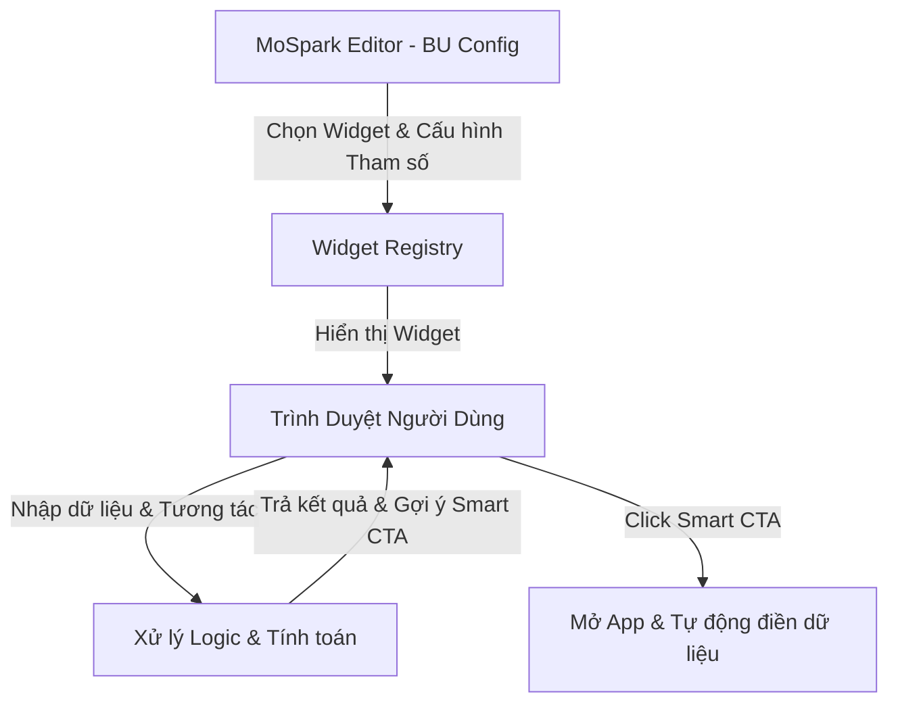

# MoSpark - Widget Store Platform Specification

> - **Project Name:** MoSpark Widget Store Platform
> - **Division:** GPD (Growth Platform Division)
> - **Owner:** Web Platform
> - **PIC:** Hiếu (Prototype & Logic Builder), Thuận (Widget Standards & Packaging), Hiến (Project Manager)
> - **Sponsors:** GPD & Business Units (Finhub BU - internal - làm đơn vị thí điểm Phase 1)
> - **Status:** Active - Restructured & PLG Reoriented
> - **Version:** 4.4 — 2026-07-02

---

# PHẦN I: PRODUCT STRATEGY

## 1. Executive Summary & Core Widget Definition

### 1.1 Executive Summary & Platform Product Vision
Dự án **Widget Store Platform** được phát triển theo định hướng là **Một Nền tảng Tương tác Tăng trưởng hợp nhất (Unified PLG Growth Platform)** trên toàn hệ thống MoMo Web Channel, nhằm mục tiêu thúc đẩy các chỉ số **MEU (Monthly Earning Users)**, **MAU (Monthly Active Users)** và **Login App (DLU/MLU)** theo định hướng **Product-Led Growth (PLG)**.

Để giúp các Stakeholders hiểu rõ định hướng, Product Vision của Nền tảng được chia nhỏ (break down) cụ thể như sau:

#### 👥 Giá trị đạt được theo Stakeholders (Value Proposition & Outcomes)
*   **Với Business Units & Cell Teams (BUs):**
    *   **Tự chủ & Tốc độ (Go-to-market in 5 mins):** Chọn, cấu hình tham số JSON Schema và deploy Widget lên Landing Page/Blog trong 5 phút qua CMS, hoàn toàn không phụ thuộc lực lượng FE Developer của từng team hay chu kỳ Sprint phát triển UI.
    *   **Đo lường & Tối ưu dễ dàng:** Tự do cấu hình kịch bản **Smart CTA Rules** và thực hiện **A/B Testing** thông điệp CTA để tối ưu tỷ lệ chuyển đổi.
*   **Với End-Users (Người dùng cuối):**
    *   **Giải quyết JTBD tức thời:** Tra cứu thuế, tính lãi tiết kiệm, xem giá vàng... trực tiếp trên Web trong 2 giây mà không cần login hay tải app, nhận giá trị tức thì (*Aha! Moment*).
    *   **Trải nghiệm chuyển đổi mượt mà (W2A Contextual Onboarding):** Khi bấm CTA vào App MoMo, toàn bộ dữ liệu đã nhập trên Web sẽ tự động điền sẵn (prefill), loại bỏ rào cản nhập liệu lặp lại.
*   **Với MoSpark (Sở hữu nền tảng):**
    *   **Tăng trưởng Organic Traffic (SEO/GEO):** Các widget hữu ích là thỏi nam châm thu hút lưu lượng truy cập chất lượng cao từ Google SERP / AI Search, xây dựng hào bảo vệ nội dung (Anti-LLM Moat).
    *   **Tối ưu W2A & Thúc đẩy Login:** Chuyển đổi traffic ẩn danh trên Web thành người dùng đăng nhập app có phát sinh giao dịch tài chính (MEU) thông qua cơ chế tracking parameter và Smart CTA cá nhân hóa theo hành vi nhập liệu.

#### 🛠️ Việc cần làm / Các trụ cột thực thi của Platform (Key Platform Pillars - What to do)
1.  **Utilities Ingestion & Refactoring Pipeline (Quy trình Tiếp nhận & Xây dựng):** Quản lý tập trung toàn bộ các Utilities (tiện ích tương tác) của MoMo do Cell Team yêu cầu (request) hoặc do Platform chủ động tự xây dựng nhằm gia tăng chỉ số Product-Led Growth (PLG) trên Web. Hỗ trợ song song 2 quy trình linh hoạt:
    *   *Workflow A (Brief to Prototype - Hiếu phụ trách):* Tiếp nhận brief nghiệp vụ (Logic/Công thức) từ Cell Team/Platform $\rightarrow$ Hiếu dựng bản prototype nhanh để verify.
    *   *Workflow B (HTML Ingestion - Thuận phụ trách):* Tiếp nhận bản HTML Prototype thô từ Cell Teams tự viết $\rightarrow$ Thuận refactor chuẩn Mobase và UI/UX để đóng gói.
2.  **Widget Registry & Dynamic Rendering Engine:** Xây dựng danh mục quản lý và hiển thị động các cấu phần tương tác dựa trên cấu hình từ CMS Editor.
3.  **Smart CTA & Zero-Party Data Engine:** Thiết kế cơ chế điều hướng nút hành động thông minh theo hành vi người dùng và đồng bộ dữ liệu ngữ cảnh an toàn qua URL parameter của Onelink.
4.  **API Governance Gateway:** Tích hợp dữ liệu realtime in-app của MoMo (giá vàng, tỷ giá) với cơ chế cache tự động và cơ chế khóa cứng công thức (Formula Lock) kiểm duyệt pháp lý/tài chính YMYL tập trung.
5.  **Microsite-to-Widget Auto-Mapping & Ads Manager Cross-sell:** Thiết lập cơ chế tự động gán Widget 1-1 với Microsite tương ứng (ví dụ: CIC Simulator gán với `/diem-tin-dung`). Bất kỳ trang con nào thuộc Microsite đó sẽ tự động thừa kế và hiển thị Widget tại đúng vị trí quy chuẩn mà không cần Cell Team phải nhúng mã Shortcode hay sử dụng editor kéo thả các block code tự build (chưa hỗ trợ kéo thả tiện ích tự build). Đồng thời, khóa hiển thị trực tiếp ở ngoài Microsite và chỉ cho phép phân phối ra các trang/dự án khác có liên quan thông qua **Ads Manager** bằng cách "khoét slot" quảng cáo tương thích để thực hiện kịch bản bán chéo (cross-sell).

Thay vì lập trình riêng lẻ từng công cụ hoặc cho phép các BU tự xây dựng tự do (dễ gây lỗi giao diện và tính toán), hệ thống cung cấp một hạ tầng Registry dùng chung để render các Component được phát triển tập trung. Phase 1 sẽ triển khai thí điểm bộ công cụ giả lập tài chính **Finhub Simulation Tools** (10 công cụ tương tác cốt lõi).

### 1.2 Định nghĩa Widget (Core Definition)
**Widget (Tiện ích Tương tác Tăng trưởng)** trong hệ sinh thái MoSpark là một thành phần tương tác hoàn chỉnh, khép kín về mặt giao diện (UI), logic nghiệp vụ (Logic) và dữ liệu (Data) chạy trên Web.

*   **Nguyên tắc "3 Không"**:
    1.  **Không** phải là một UI component đơn lẻ (như Button, Slider) mà là tổ hợp tương tác hoàn chỉnh.
    2.  **Không** cho phép BUs tùy biến giao diện tự do để bảo vệ sự đồng bộ thiết kế (Design System).
    3.  **Không** cho phép BUs tự cấu hình công thức toán học nghiệp vụ trên CMS để phòng tránh rủi ro pháp lý/tài chính (YMYL).
*   **Nguyên tắc "3 Có"**:
    1.  **Có** logic tự tính toán độc lập (Offline calculation hoặc API real-time).
    2.  **Có** cơ chế truyền/nhận tham số qua URL (`?prefill=`).
    3.  **Có** cơ chế tự động chuyển đổi nút hành động theo ngữ cảnh dữ liệu nhập vào (Smart CTA).

---

## 2. Market Context & Competitor Landscape

### 2.1 Bảng Đồng bộ Dữ liệu Thị trường (Master Market Sizing)
Dựa trên nhu cầu tìm kiếm khổng lồ (Search Intent) của người dùng liên quan đến YMYL, MoMo tập trung phủ các mỏ vàng traffic sau:

| Thị trường (Market) | Volume/tháng | Trạng thái SERP hiện tại | Cơ hội của MoMo (Widget) |
|---|---|---|---|
| **Gold (Giá Vàng)** | **85.758.870** | Các trang báo đài, công cụ sơ sài, nhiều quảng cáo | Widget theo dõi/quy đổi giá vàng SJC/Nhẫn trực quan, CTA Mua Vàng. |
| **Exchange Rate (Tỷ giá)** | **18.128.060** | Công cụ của ngân hàng rời rạc, ít ngoại tệ | Máy tính tỷ giá ngoại tệ real-time, so sánh tỷ giá. |
| Loan (Vay) | 2.958.140 | Các bảng tính lãi vay ngân hàng tĩnh, khó hiểu | Công cụ tính dư nợ giảm dần trực quan, CTA Vay Nhanh |
| Stock (Chứng khoán) | 3.000.000 | App chuyên biệt phức tạp | Công cụ giả lập đầu tư CCQ/Cổ phiếu đơn giản trên Web |
| Social Insurance (BHXH) | 938.090 | Các trang BHXH nhà nước khó sử dụng | Trực quan hóa mức đóng, tra cứu nhanh, CTA tiết kiệm |
| Heath Insurance (BHSK) | 396.910 | Các bảng tính phí phức tạp, nặng thuật ngữ | Công cụ tính phí BHSK nhanh gọn, trực quan |
| Saving (Lãi tiết kiệm) | 209.000 | Các trang ngân hàng rời rạc | Nhập số ➔ Xem lãi ➔ Gửi trực tiếp qua MoMo |
| Personal Income Tax (Thuế TNCN) | *Chưa có dữ liệu* | Các trang báo, trang luật, giao diện cũ | Widget sạch, tính chính xác cao, CTA gửi tiết kiệm |
| Pension (Lương hưu) | *Chưa có dữ liệu* | Các bảng tính phức tạp, thủ công | Ước tính lương hưu tự động, CTA quỹ hưu trí/tiết kiệm |

---

## 3. Job-to-be-Done (JTBD) Analysis

### 3.1 Khách hàng cuối (End-User JTBD)
*   **Job 1 (Tra cứu Chủ động):** *When* tôi cần tính toán số liệu tài chính nhanh chóng (như tính thuế Gross-Net), *I want to* nhập liệu và xem kết quả ngay trên trình duyệt di động mà không cần đăng nhập hay tải app, *So I can* biết số tiền thực nhận của mình trong 2 giây.
*   **Job 2 (Hiểu thông tin & Tin cậy):** *When* tôi xem kết quả số liệu, *I want to* thấy thông tin giải thích dễ hiểu, khách quan và có nguồn kiểm chứng đáng tin cậy, *So I can* an tâm đưa ra quyết định.
*   **Job 3 (Tự động canh gác):** *When* tôi muốn giám sát một chỉ số biến động liên tục (như giá vàng hoặc phạt nguội), *I want to* đăng ký nhận cảnh báo tự động, *So I can* nhận được thông báo ngay khi có thay đổi mà không cần kiểm tra thủ công.

### 3.2 Người vận hành (PM/PO MoMo JTBD)
*   *When* tôi chạy chiến dịch thúc đẩy chỉ số kinh doanh (chuyển đổi W2A) cho sản phẩm của BU,
*   *Tôi muốn* chọn nhanh một Widget chuẩn hóa từ Registry, cấu hình tham số (default values, CTA Onelink) và nhúng vào trang Landing Page chỉ trong 5 phút qua CMS,
*   *Để tôi có thể* gia tăng chuyển đổi mà không phụ thuộc vào chu kỳ Sprint phát triển UI của đội Dev.

---

## 4. Operational Framework & Scope Limits

### 4.1 Quy trình thực thi S-P-A cho các Cell Teams (Operational Workflow)
Khung làm việc **S-P-A (Strategy - Pilot - Action) Framework** được định nghĩa là **quy trình thực thi thực tế** mà các Cell Teams/BUs sẽ áp dụng để triển khai các Utilities/Widgets của họ trên nền tảng:
*   **reSearch & Strategy (Stage S):** Xác định nhu cầu tính toán/giả lập của người dùng dựa trên nghiên cứu và phân tích lượng traffic tự nhiên tiềm năng (SEO/GEO/Search Intent).
*   **Pilot & Plan (Stage P):** Đưa bản HTML Prototype thô vào platform để refactor và đóng gói, triển khai các Widget MVP trên các trang Landing Page thử nghiệm nhằm đo lường mức độ tương tác và phễu W2A ban đầu.
*   **Action & Amplifier (Stage A):** Phát hành rộng rãi Widget trên hệ thống, tối ưu hóa Smart CTA và Zero-Party Data Passing để tối đa hóa chuyển đổi MAU/MEU cho BU.

### 4.2 Lộ trình phát hành (Roadmap)

| Phase | Phạm vi & Tiện ích triển khai | Mục tiêu | Trạng thái |
|---|---|---|---|
| **Phase 1** | **Pilot Siêu Tiện ích & Finhub Simulators**: - Bộ 10 tiện ích: Giá Vàng (Gold), Tỷ giá (Exchange Rate), Lãi Vay (Loan), Trắc nghiệm (Quiz), Thuế TNCN, Lãi Tiết kiệm, BHXH, Lương hưu, Đầu tư CCQ, Phí BHSK+. - Kiến trúc: Hub & Spoke | - Khởi dựng **Widget Engine** và tích hợp CMS. - Thử nghiệm quy trình render Widget trên trang landing page. - Kiểm chứng luồng chuyển đổi Web-to-App và SEO/GEO. | **Discovery & MVP** (Tháng 6-7/2026) |
| **Phase 2** | **Mở rộng các BU thuộc khối Dịch vụ & Tiêu dùng**: - Tích hợp các Widget mới từ Bảo hiểm (như Phí BHXM, BHYT), Du lịch & Đi lại (tính giá vé, gợi ý tour), hoặc Tiện ích đời sống. | - Tối ưu hóa hiệu năng Widget Engine. - Chuẩn hóa hệ thống thiết kế (Design System) của Widget Store trên CMS. | *Lên kế hoạch* (Dự kiến Q3/2026) |
| **Phase 3** | **Advanced PLG Scaling & Distribution**: - Mở rộng quy mô công cụ tra cứu địa phương hóa (Programmatic lookups). - Tích hợp AI Intent-based routing cho Smart CTA. - Phát triển giải pháp **B2B Syndication** (nhúng các widget chuẩn của MoMo sang các báo điện tử, trang tin tức tài chính của đối tác). | - Tối đa hóa traffic thông qua Programmatic pSEO. - Cá nhân hóa phễu W2A bằng AI. - Phân phối widget để thu hút traffic ngoài hệ sinh thái MoMo. | *Lên kế hoạch* (Dự kiến Q4/2026) |

---

# PHẦN II: PRODUCT CAPABILITIES & STANDARDS

## 5. Widget Registry & Distribution Capabilities (Hạ tầng quản trị và phân phối)

Hệ thống quản lý tiện ích của MoSpark hoạt động như một danh mục quản lý tập trung (Registry) các cấu phần tương tác. CMS Editor chỉ cho phép người quản trị BU lựa chọn Widget từ thư viện có sẵn và cấu hình tham số đầu vào, đảm bảo tính nhất quán về UI/UX và tính chính xác về mặt logic.

### 5.1. Microsite-to-Widget Mapping (Cơ chế gán tự động và thừa kế)

Để tối ưu hóa vận hành và kiểm soát chặt chẽ sự xuất hiện của các công cụ trên hệ thống ở quy mô lớn, Nền tảng áp dụng cơ chế mapping tự động thay vì cấu hình thủ công cho từng trang con trong Puck Editor:
*   **Nguyên tắc Mapping 1-1:** Mỗi Widget khi được xây dựng (ví dụ: CIC Simulator) sẽ được map trực tiếp với một Microsite / Mini Web gốc tương ứng (ví dụ: `/diem-tin-dung`).
*   **Cơ chế Thừa kế Tự động (Auto-Inheritance):** Sau khi được map, bất kỳ trang con, trang đích chi tiết hay bài viết Blog nào thuộc Microsite đó đều sẽ tự động kế thừa và hiển thị Widget tương ứng tại đúng vị trí quy chuẩn (ví dụ: Slot 2) mà không cần người quản trị phải vào từng trang để kéo thả thủ công bằng Puck Editor.
*   **Kiểm soát hiển thị (Governance Gate):** 
    *   *Trong Microsite gốc:* Hiển thị tự động theo thừa kế cấu hình của Microsite.
    *   *Ngoài Microsite:* Khối kéo thả trực tiếp của Widget đó bị khóa hoàn toàn trong Puck Editor đối với các trang khác để tránh việc BU tự ý nhúng bừa bãi. Việc phân phối ra ngoài Microsite gốc bắt buộc phải thông qua **Ads Manager** định tuyến động để phục vụ chiến dịch phân phối chéo (Cross-sell).

## 6. CMS Configuration Standards (Cơ chế cấu hình tham số trên CMS)

Để bảo vệ tính nhất quán của thiết kế và ngăn chặn việc can thiệp làm sai lệch logic tính toán, BUs sẽ không được chỉnh sửa HTML/CSS hay viết mã code. Thay vào đó, CMS cung cấp một bộ trường cấu hình (Configuration Form) được định nghĩa sẵn cho mỗi Widget bao gồm các giá trị mặc định, giới hạn thanh kéo (giá trị tối thiểu, tối đa, bước nhảy), đường dẫn đích (CTA Link) và các tham số chiến dịch (UTM parameters).

## 7. Smart CTA Capability (Định tuyến nút hành động thông minh)

Nút hành động (CTA) trên Widget không cố định mà tự động thay đổi thông điệp và đường dẫn sâu (Deep Link) dựa trên kết quả tương tác hoặc dữ liệu nhập vào của người dùng để tối đa hóa tỷ lệ chuyển đổi:
*   **Ví dụ ứng dụng:** Đối với công cụ tính lương thực nhận, nếu lương tính ra thấp (dưới 15 triệu đồng), Widget tự động hiển thị CTA đề xuất ví trả sau. Nếu lương cao (từ 40 triệu đồng trở lên), Widget tự động chuyển thành đề xuất mở thẻ tín dụng hạn mức cao.
*   **Quản trị kịch bản:** Các kịch bản định tuyến thông minh này sẽ được cấu hình tập trung và phê duyệt trước bởi Product Manager để đảm bảo tính phù hợp của đề xuất tài chính.

## 8. Zero-Party Data Passing (Cơ chế đồng bộ dữ liệu ngữ cảnh)

Dữ liệu do người dùng chủ động khai báo khi tương tác với Widget trên Web sẽ được đồng bộ trực tiếp vào màn hình in-app tương ứng nhằm tối ưu hóa trải nghiệm chuyển đổi (W2A):
1.  **Thu nhận & Mã hóa:** Widget tự động đóng gói các tham số người dùng nhập (như số tiền muốn gửi, kỳ hạn) thành một mã bảo mật (đã loại bỏ mọi thông tin định danh cá nhân).
2.  **Đính kèm:** Mã dữ liệu này được gắn trực tiếp vào đường dẫn sâu của nút CTA.
3.  **Tự động điền (Pre-fill):** Khi người dùng chuyển tiếp sang App MoMo, ứng dụng sẽ đọc mã này và điền sẵn dữ liệu vào các trường tương ứng trên màn hình dịch vụ.
4.  **Tuân thủ pháp lý:** Luồng đồng bộ dữ liệu này yêu cầu hiển thị thông báo và nhận được sự đồng ý rõ ràng (Consent) của người dùng trên Web trước khi thực hiện chuyển tiếp.

## 9. Page Template Standard (Bố cục 6 Slots)

Mọi trang Landing Page (LDP) nhúng Widget đều phải tuân thủ bố cục cấu trúc chuẩn để tối ưu SEO/GEO và phễu W2A:
*   **Slot 1 (Header Banner):** Tiêu đề H1 chuẩn SEO, đoạn giới thiệu ngắn và Rating Schema.
*   **Slot 2 (Calculator Form):** Form kéo slider và nhập dữ liệu (Component React tĩnh kết xuất từ Registry).
*   **Slot 3 (Results Dashboard):** Hiển thị số liệu lớn và biểu đồ sinh động (Pie/Bar chart).
*   **Slot 4 (Comparative Context):** So sánh trực quan lợi ích của sản phẩm MoMo vs đối thủ/hình thức truyền thống.
*   **Slot 5 (Contextual CTA):** Nút CTA động áp dụng Smart CTA Rule Engine dẫn sâu vào App.
*   **Slot 6 (FAQ & Content Hub):** Block câu hỏi thường gặp (FAQ Schema) định dạng câu trả lời ngắn gọn (Answer-first) và các Internal Link đến Topic Cluster vệ tinh.

---

# PHẦN III: 10 PILOT SIMULATORS SPECIFICATIONS

Mỗi tiện ích trong Phase 1 Pilot được thiết kế xoay quanh giải quyết JTBD và tạo cầu nối chuyển đổi (W2A) tự nhiên nhất:

### 1. Gold Tracker & Converter (Theo dõi & Quy đổi Giá Vàng)
*   **JTBD giải quyết:** Tra cứu giá vàng real-time và quy đổi nhanh số lượng vàng mong muốn sang VND để an tâm tích lũy dài hạn.
*   **Cầu nối W2A:** Nút CTA mở app dẫn trực tiếp tới luồng *"Mua vàng miếng/vàng nhẫn bảo chứng an toàn trên MoMo"*.

### 2. Exchange Rate Calculator (Tỷ giá Ngoại tệ)
*   **JTBD giải quyết:** Quy đổi tức thời các đồng ngoại tệ phổ biến (USD, JPY, EUR...) sang VND theo tỷ giá thực tế ngân hàng để chi tiêu du lịch/mua sắm quốc tế hiệu quả.
*   **Cầu nối W2A:** CTA *"Mở thẻ tín dụng quốc tế MoMo - Không phí chuyển đổi ngoại tệ"* hoặc *"Chuyển tiền quốc tế qua MoMo"*.

### 3. Gross-Net Salary Simulator (Tính lương Thực nhận)
*   **JTBD giải quyết:** Quy đổi lương Gross sang lương Net thực nhận chính xác theo biểu thuế TNCN và bảo hiểm bắt buộc mới nhất để HR deal lương tự tin.
*   **Cầu nối W2A:** Áp dụng Smart CTA Rule Engine (Lương thấp -> CTA Ví Trả Sau; Lương cao -> CTA Gửi tiết kiệm tích lũy).

### 4. Savings Yield Calculator (Tính Lãi Tiết Kiệm)
*   **JTBD giải quyết:** Tính toán và so sánh số tiền lãi nhận được giữa các kỳ hạn và phương thức trả lãi để tối ưu hóa tiền nhàn rỗi.
*   **Cầu nối W2A:** CTA *"Mở sổ tiết kiệm online nhận lãi suất cao từ đối tác Finhub trên MoMo"*.

### 5. Social Insurance Calculator (BHXH Một lần)
*   **JTBD giải quyết:** Ước tính số tiền BHXH một lần có thể nhận được hoặc tính toán mức đóng BHXH tự nguyện để ra quyết định tài chính sáng suốt khi nghỉ việc.
*   **Cầu nối W2A:** CTA *"Gửi tích lũy an toàn trên MoMo để làm quỹ dự phòng thay vì rút non BHXH"*.

### 6. Pension Estimator (Ước tính Lương Hưu)
*   **JTBD giải quyết:** Dự toán tuổi nghỉ hưu và số tiền lương hưu dự kiến nhận được hàng tháng để tự tin xây dựng kế hoạch an dưỡng tuổi già.
*   **Cầu nối W2A:** CTA *"Đầu tư chứng chỉ quỹ tích lũy hưu trí dài hạn chỉ từ 10.000đ trên MoMo"*.

### 7. Investment Simulator (Giả lập Đầu tư CCQ / Cổ phiếu)
*   **JTBD giải quyết:** Mô phỏng số tiền tích lũy và lợi nhuận đầu tư dựa trên dữ liệu tăng trưởng lịch sử thực tế của các quỹ đầu tư top đầu để vượt qua nỗi sợ rủi ro.
*   **Cầu nối W2A:** CTA *"Mở tài khoản đầu tư Chứng chỉ quỹ/Chứng khoán chỉ từ 10.000đ trên MoMo"*.

### 8. Health Cost & Insurance Simulator (Phí & Chi phí Y tế BHSK+)
*   **JTBD giải quyết:** Dự tính chi phí y tế cho các nhóm bệnh lý cụ thể và so sánh số tiền tự chi trả khi có vs không có bảo hiểm sức khỏe bổ trợ để bảo vệ gia đình an tâm.
*   **Cầu nối W2A:** CTA *"Tham gia Sức Khỏe+ chỉ từ 89k/tháng - Bảo vệ tài chính gia đình"*.

### 9. Loan Amortization Calculator (Tính lãi khoản vay)
*   **JTBD giải quyết:** Tính lịch trả nợ chi tiết (gốc + lãi dư nợ giảm dần) hàng tháng để chủ động cân đối thu chi tài chính gia đình khi vay mua xe/nhà.
*   **Cầu nối W2A:** CTA *"Kiểm tra hạn mức Ví Trả Sau hoặc đăng ký vay nhanh giải ngân trong 5 phút"*.

### 10. Financial Quiz & Gamified Assessment (Trắc nghiệm tài chính)
*   **JTBD giải quyết:** Kiểm tra nhanh mức độ hiểu biết tài chính hoặc khẩu vị rủi ro cá nhân qua hình thức trắc nghiệm vuốt (Tinder-style) để giải trí và nhận quà tặng.
*   **Cầu nối W2A:** Tặng ngay voucher mua bảo hiểm/sổ tiết kiệm khi hoàn thành quiz ➔ CTA *"Mở App dùng ngay quà tặng"*.

---

# PHẦN IV: PROJECT GOVERNANCE & PICS

## 10. Core Service Integrations & Operations (Tích hợp dịch vụ & Vận hành)

Để duy trì tính sẵn sàng và hiệu năng cao nhất, các tiện ích trên Platform được chia làm 2 nhóm vận hành chính:
1.  **Nhóm Tích hợp Dữ liệu Thời gian thực (Real-time Utilities):** Bao gồm theo dõi giá vàng, tỷ giá ngoại tệ, tính lãi tiết kiệm, giả lập đầu tư. Nhóm này tự động cập nhật dữ liệu mới nhất từ nguồn dữ liệu thực tế in-app của MoMo với cơ chế lưu bộ đệm (cache) tự động để tránh nghẽn luồng truy cập.
2.  **Nhóm Tính toán Nội bộ (Offline Calculation Utilities):** Bao gồm máy tính thuế Gross-Net, BHXH, lương hưu, tính phí bảo hiểm sức khỏe, tính lãi vay, và trắc nghiệm. Nhóm này hoạt động hoàn toàn bằng thuật toán nội bộ ngay trên trình duyệt mà không cần kết nối dữ liệu in-app.

## 11. Compliance & Security Governance (Quản trị tuân thủ & An toàn)

*   **Formula Lock (Khóa công thức nghiệp vụ):** BUs tuyệt đối không được tự ý sửa đổi công thức tính toán trên CMS. Mọi thay đổi liên quan đến thuật toán (đặc biệt là biểu thuế, lãi suất) phải được rà soát bởi Compliance/Pháp lý và do đội kỹ thuật thực thi cập nhật qua hệ thống cấu hình tĩnh.
*   **SEO Compliance:** Nền tảng tự động xử lý các cấu hình kỹ thuật để hỗ trợ việc truyền tham số mà không tạo ra lỗi trùng lặp nội dung (Duplicate Content) làm ảnh hưởng đến thứ hạng tìm kiếm tự nhiên của trang.
*   **Data Privacy:** Cam kết bảo mật thông tin người dùng. Mọi tham số truyền dữ liệu ngữ cảnh qua URL tuyệt đối không chứa thông tin định danh cá nhân (PII) dưới dạng văn bản thô.

## 12. Widget Development Workflow (Quy trình phát triển)

Quy trình phát triển Widget từ yêu cầu của BU được quy định rõ ràng nhằm tối ưu hóa tiến độ và chất lượng:
*   **Bước 1: Tiếp nhận Brief & Build Prototype (Hiếu):** Hiếu trực tiếp tiếp nhận thông tin Brief của BU về các yêu cầu Logic/Formula, các thông tin cần hiển thị cho người dùng về các Utilities/Component/Widget/... Sau đó, Hiếu tiến hành build bản Prototype nhanh (chưa cần tuân thủ chuẩn MoBase Design System) để xác thực (verify) lại trực tiếp với BU.
*   **Bước 2: Refactor & Đóng gói (Thuận):** Sau khi bản Prototype được BU xác nhận, Thuận chịu trách nhiệm refactor lại prototype theo chuẩn Design System (MoBase), đưa vào quản lý và thực hiện đóng gói (packaging) để sẵn sàng phân phối qua Ads Manager.

---

## 12.5. Kế hoạch Nâng cấp Tính năng trong H2/2026 (Utilities & Merchant Page Upgrades)

Trong H2/2026, nền tảng Widget Store và Merchant Page sẽ được nâng cấp các tính năng tự động hóa và tối ưu trải nghiệm sau:

1. **Low-code Drag-and-drop Tool Configurator:** Nâng cấp từ cấu hình bằng code tay sang trình cấu hình kéo thả trực quan. Cho phép PM tự xây dựng các trường nhập liệu (input fields), định nghĩa logic tính toán (Calculator) hoặc cấu hình API tra cứu (Checker) nhanh chóng.
2. **Tool Data Pipeline (GEO Moat Generator):** Hệ thống tự động thu thập và tổng hợp dữ liệu tương tác ẩn danh của người dùng trên các tiện ích tính toán/tra cứu để sinh tự động các bài báo cáo insight tiêu dùng, tạo hàng rào GEO Moat độc quyền cho momo.vn.
3. **Merchant Listing & Category Hub Pages (Merchant):** Phát triển các trang danh sách (Listing Pages) và trang Hub cho phép tìm kiếm, lọc các địa điểm chấp nhận thanh toán Ví Trả Sau theo Khu vực địa lý (Tỉnh/Thành, Quận/Huyện), Category ngành hàng (F&B, Mua sắm, Làm đẹp...) và các Điều kiện ngữ cảnh đặc biệt (gần trường học, gần trung tâm thương mại/mall, mở cửa 24/7...).
4. **Automated Sitemap Splitting Engine (Merchant):** Tự động phân tách và quản lý sitemap động cho hơn 200K+ trang merchant giúp tối ưu hóa crawl budget của các công cụ tìm kiếm.
5. **Local SEO Schema Auto-Generator (Merchant):** Tự động sinh cấu trúc schema LocalBusiness (NAP data - Name, Address, Phone) chuẩn xác cho từng cửa hàng để gia tăng tốc độ index và hiển thị trên Google Map.
6. **Dynamic O2O Deep-linking Generator (Merchant):** Tự động sinh Onelink deep-link gắn mã cửa hàng động phục vụ cho kịch bản quét QR Code/Soundbox thanh toán nhanh tại quầy của merchant.
7. **Grabfood/Shopeefood Menu Crawling Engine (Merchant):** Tích hợp tính năng cào dữ liệu (crawl) thực đơn (Menu) và hình ảnh món ăn từ Grabfood/Shopeefood để hiển thị trực tiếp danh mục món ăn (Dishes/Items) của cửa hàng trên trang Merchant Page.

---

## 13. Success Metrics & Change Log

*   **Success Metrics (Growth Metrics):** Đo lường và tối ưu dựa trên 3 chỉ số chính: MEU (Monthly Earning Users), MAU (Monthly Active Users), và Lượt cài đặt App mới (New Install) thông qua Appsflyer. Target cụ thể sẽ được lock 2 tuần sau khi có baseline của Phase 1.
*   **Change Log:**
    *   **v4.4 (2026-07-02):** Bổ sung đặc tả 2 quy trình tiếp nhận (Workflow A & B) của Ingestion & Refactoring Pipeline trong Key Platform Pillars và đồng bộ hóa loại bỏ các thuật ngữ kỹ thuật.
    *   **v4.3 (2026-07-02):** Thêm quy hoạch Microsite-to-Widget Mapping tự động kế thừa (Auto-Inheritance) để tối ưu vận hành và kiểm soát chặt chẽ sự xuất hiện của các công cụ trên hệ thống.
    *   **v4.2 (2026-07-02):** Loại bỏ các đặc tả kỹ thuật chi tiết của Dev (Next.js, JSON Schema, Base64, Redis, robots.txt) để tập trung tài liệu hoàn toàn vào định hướng sản phẩm và nghiệp vụ của PM.
    *   **v4.1 (2026-07-02):** Chuẩn hóa lại tên Stakeholder sở hữu nền tảng là MoSpark (thay vì MoMo Growth & Platform).
    *   **v4.0 (2026-07-02):** Tái định nghĩa Product Vision của cả nền tảng theo định hướng Platform (phân rã chi tiết Giá trị cần đạt & Việc cần làm cho stakeholders), phân định rõ S-P-A Framework là quy trình thực thi cho Cell Teams.
    *   **v3.9 (2026-07-02):** Điều chỉnh Product Vision & Scope định vị Widget Store thành Một Nền tảng Tương tác Tăng trưởng hợp nhất (Unified PLG Growth Platform).
    *   **v3.8 (2026-07-02):** Cập nhật định hướng Product Vision & Scope của Widget Store theo định hướng PLG, tăng trưởng MEU/DLU/MLU và vai trò platform tiếp nhận Prototype HTML từ các Cell Teams.
    *   **v3.7 (2026-06-26):** Cập nhật quy trình phối hợp làm việc mới: Hiếu tiếp nhận brief BU về Logic/Formula & hiển thị để build Prototype nhanh và verify với BU; Thuận chịu trách nhiệm refactor prototype chuẩn Design System (MoBase), quản lý và đóng gói.
    *   **v3.6 (2026-06-25):** Tái cấu trúc tài liệu theo mô hình 4 phần chuẩn hóa; định nghĩa lại khái niệm Widget theo nguyên lý "3 Có & 3 Không"; phân bổ lại vai trò PIC chi tiết (Hiếu phụ trách Backend/Logic/APIs, Thuận phụ trách Đóng gói/Quản trị Widget cho Ads Manager, Hiến quản lý chung & duyệt Smart CTA).

---
**END OF SPECIFICATION**
