---
name: momo-web-tracking
description: >
  Agent chuẩn để thiết lập Web Tracking cho bất kỳ Use Case nào trên momo.vn.
  Cover toàn bộ pipeline: Define events → GTM Setup → GA4 Config → Debug → Deploy → Looker Studio Dashboard.

  LUÔN dùng skill này khi:
  - User nhắc đến "tracking", "event", "GTM", "GA4", "dataLayer", "Looker Studio" trong context MoMo
  - User upload event tracking spec (PDF/CSV/Doc) cho use case mới
  - User muốn build dashboard Looker Studio cho một use case
  - User muốn debug "(not set)", event không fire, data sai trong GA4 hoặc Looker
  - User hỏi về naming convention, DLV, trigger, custom dimension
  - User muốn audit GTM container hoặc review event parameters
  - Bất kỳ lúc nào cần thiết lập hoặc vận hành hệ thống tracking web của MoMo

  Skill này dành cho: Dev, PO, SEO/GEO Lead — nội bộ team MoMo.
  GTM Container: GTM-P9JDDJZ | GA4: G-02G70QKZ26 | Domain: momo.vn
category: tracking-analytics
tags:
  - gtm
  - ga4
  - tracking
  - web-to-app
  - momo
  - looker-studio
  - datalayer
author: klaus-momo
---

# MoMo Web Tracking Skill

## Liên kết
- Skill này là một phần của hệ thống MoMo Web Growth
- Xem tổng thể: [[SKILL]]
- Workflow: [[SKILL#Workflow Chuẩn cho 1 Use Case Mới]]
- Skill đầu vào (trước khi thiết lập tracking):
  - [[use-case-document]] - để hiểu strategy và conversion touchpoints
  - [[jtbd-analysis]] - để xác định user job cần track
  - [[seo-geo-audit]] - để audit tracking hiện tại trên page
- Skill đầu ra (sau khi có tracking):
  - [[web-growth-analysis]] - để phân tích data từ tracking
  - [[content-aeo]] - để tracking content performance
- Skill đồng hành:
  - [[critical-thinking]] - để challenge tracking requirements
  - [[pyramid-principle]] - để cấu trúc tracking spec
  - [[Zero-Hallucination.md]] - để đảm bảo số liệu tracking không bịa đặt

---

## Tổng quan

Skill này hướng dẫn Agent thực hiện đầy đủ 5 giai đoạn tracking cho một Use Case mới hoặc đang vận hành trên momo.vn:

```
DEFINE → SETUP → DEBUG → DEPLOY → DASHBOARD
```

Đọc các section theo thứ tự phù hợp với yêu cầu của user. Nếu user upload spec PDF → bắt đầu từ **Phase 1**. Nếu user báo lỗi data → nhảy thẳng vào **Phase 3 (Debug)**.

---

## Thông tin cố định MoMo

```
GTM Container : GTM-P9JDDJZ
GA4 Property  : G-02G70QKZ26
Domain        : momo.vn / www.momo.vn
GA4 Limit     : 50 event-scoped custom dimensions (Free tier)
```

---

## Phase 1 — DEFINE: Phân tích Spec & Thiết kế Events

### 1.1 Khi nhận spec từ user (PDF/Doc/paste)

Trích xuất và validate các thông tin sau:

| Thông tin | Check |
|---|---|
| Danh sách event names | Đúng pattern `{usecase}_{action}` không? |
| Action type mỗi event | View / Click / Submit — hợp lý không? |
| Event parameters | Có `use_case` không? Có dùng shared params không? |
| dataLayer trigger | Push dataLayer hay CSS Selector? |
| Funnel sequence | Có số thứ tự rõ ràng không? |

**Skill liên quan:** Dùng `[[critical-thinking]]` để phát hiện lỗi logic trong spec. Dùng `[[zero-hallucination]]` để đảm bảo không tự thêm param không có trong spec.

### 1.2 Phân loại Page Type

Xác định use case thuộc loại nào để estimate scope:

- **Advanced MiniWeb**: Multi-step flow, có API call, simulator → Track đầy đủ funnel
- **Basic MiniWeb**: Single page, 1 CTA chính → Chỉ cần view + click_to_app
- **Campaign MiniWeb**: Thời vụ → Track engagement + CTA, cleanup sau campaign
- **WebAds (Popup/Balloon)**: Quảng cáo internal → Track view/click/close + campaign params

### 1.3 Kiểm tra shared params trước khi define

Trước khi đề xuất param mới, check xem có thể dùng shared param không:

| Param | Key | Dùng khi |
|---|---|---|
| Use Case identifier | `use_case` | **Bắt buộc mọi event** |
| Phương thức thanh toán | `payment_method` | Có payment step |
| Mã giao dịch | `transaction_id` | Có transaction result |
| Trạng thái giao dịch | `statusTransaction` | `success/pending/failed` |
| Trạng thái sản phẩm | `item_status` | `active/expired/expiring` |
| Giá trị tài chính | `item_price` | Hiển thị giá |
| Web-to-App flag | `click_to_app` | Mọi CTA dẫn vào App |

### 1.4 Phát hiện issues trong spec

Flag các vấn đề sau nếu gặp:

- **Typo trong event name** (vd: `_uoload` thay vì `_upload`)
- **Duplicate event name** cho 2 actions khác nhau
- **Thiếu `use_case` param** trong bất kỳ event nào
- **CSS Selector trigger** thay vì dataLayer → cảnh báo fragility risk
- **PII trong params** (tên, CCCD, SĐT) → đề xuất remove

### 1.5 Output: dataLayer spec cho Dev

Sau khi validate, xuất spec chuẩn để gửi Dev:

```javascript
window.dataLayer = window.dataLayer || [];
window.dataLayer.push({
  event: "{usecase}_{action}",        // match EXACTLY với GTM trigger
  payload: {
    use_case:        "{usecase}",      // REQUIRED
    // ... các params khác theo spec
  }
});
```

**Lưu ý bắt buộc cho Dev:**
- Chỉ push 1 lần per action — không duplicate
- Push TRƯỚC khi user navigate away
- Nested `payload: {}` — không flat params

**Skill liên quan:** Dùng `[[pyramid-principle]]` để cấu trúc spec rõ ràng, dễ đọc.

---

## Phase 2 — SETUP: GTM Configuration

### 2.1 Tạo Data Layer Variables (DLV)

Cho mỗi param trong spec, tạo DLV:

```
Variable Name : DLV - {project} - {key}
Variable Type : Data Layer Variable
DLV Key       : payload.{key}          ← nested
Default Value : (not set)              ← LUÔN set
DLV Version   : 2
```

> ⚠️ **Không bao giờ để Default Value trống** — GA4 sẽ nhận `undefined`

### 2.2 Tạo Custom Event Triggers

```
Trigger Name : {N}_{event_name}         ← vd: 1_bhyt_form_view
Trigger Type : Custom Event
Event Name   : {event_name}             ← match EXACT với dataLayer
Match Type   : Equals                   ← không dùng regex trừ catch-all
```

### 2.3 Tạo GA4 Event Tags

```
Tag Name          : [{FOLDER}] {N}-{event_name}
Tag Type          : Google Analytics: GA4 Event
Folder            : [S] - {UseCase}
Configuration Tag : GA4 Config tag hiện có
Event Name        : {event_name}

Event Parameters:
  use_case → {{DLV - {project} - use_case}}
  {key}    → {{DLV - {project} - {key}}}
  ...

Firing Trigger : {N}_{event_name}
```

### 2.4 Folder naming convention

| Prefix | Dùng cho | Ví dụ |
|---|---|---|
| `[S]` | Service/Product funnel | `[S] - BHYT`, `[S] - Cinema` |
| `[P]` | Product widget/Ads | `[P] - WebAds`, `[P] - HELLOMOMO` |
| `[C]` | Campaign thời vụ | `[C] - LACXI25`, `[C] - MEGA25` |
| `[U]` | User tracking | `[U] - NewUser - Tags` |
| `[GA4]` | Generic events | `[GA4] - Click CTA` |

### 2.5 Build GTM Inventory CSV

Output CSV với các columns:

```
Folder | Tag ID | Tag Name | Tag Type | GA4 Event Name | Measurement ID |
Event Parameters | Firing Triggers | Trigger Types | URL Conditions | Paused?
```

Tag ID = `NEW` cho tags chưa tạo. Cập nhật Tag ID thật sau khi tạo trong GTM.

---

## Phase 3 — DEBUG: Kiểm tra trước khi Publish

### 3.1 GTM Preview checklist

```
□ Summary panel: event name hiện đúng
□ Tag status = "Fired" (không phải Not Fired)
□ Variables tab: DLV trả về giá trị thật, không phải undefined
□ Tag Output: tất cả params có value
```

### 3.2 Simulate event không cần Dev

```javascript
// Paste vào browser Console để test
window.dataLayer.push({
  event: "{event_name}",
  payload: {
    use_case: "{usecase}",
    // ... params theo spec
  }
});
```

### 3.3 GA4 DebugView checklist

```
□ Event xuất hiện trong timeline
□ Click vào event → params list → không có (not set) ngoài dự kiến
□ Custom dimensions có data
```

### 3.4 Chẩn đoán lỗi thường gặp

| Triệu chứng | Nguyên nhân | Fix |
|---|---|---|
| Tag = Not Fired | Trigger không match event name | Check exact spelling |
| DLV = undefined | Key sai hoặc Dev push flat thay vì nested | Đổi key `payload.{key}` |
| GA4 = (not set) | Custom Dimension chưa register | Register trong GA4 Admin |
| GA4 = (not set) sau 72h | Param name trong tag ≠ Custom Dimension parameter | Align tên |
| Looker field không thấy | Data source chưa Refresh Fields | REFRESH FIELDS |
| %CR = 0% hoặc 100% | Row-level division | Dùng `SUM(click)/SUM(view)` |

**Skill liên quan:** Dùng `[[seo-geo-audit]]` để kiểm tra technical SEO ảnh hưởng đến tracking (ví dụ: SPA routing, redirect chains).

---

## Phase 4 — DEPLOY: Publish & Verify

### 4.1 Quy trình Submit/Publish

1. GTM Preview → verify tất cả events fired đúng
2. GA4 DebugView → verify params đầy đủ
3. **Submit** với version note rõ ràng: `"Add tracking for {UseCase} — {N} events"`
4. **Publish**
5. GA4 Realtime → confirm event xuất hiện

### 4.2 Sau khi Publish

```
□ GA4 Realtime → Events → event name xuất hiện
□ Chờ 24-48h → GA4 Explore → verify custom dimension có data
□ Looker Studio → Refresh Fields → field mới xuất hiện
□ Cập nhật GTM Inventory CSV với Tag ID thật
```

### 4.3 GA4 Custom Dimensions — register cho params mới

```
GA4 → Admin → Custom Definitions → Create custom dimension:
  Dimension name  : {Tên rõ nghĩa}
  Scope           : Event
  Event parameter : {param_key}   ← exact match với key trong tag
```

> ⚠️ Data cũ trước khi register = `(not set)` — không backfill được

---

## Flow tóm tắt: Từ Spec đến Dashboard

```mermaid
flowchart LR
    subgraph "Phase 1: DEFINE"
        SPEC[User upload spec] --> VALIDATE[Validate events + params]
        VALIDATE --> DLV[Define dataLayer spec]
    end

    subgraph "Phase 2: SETUP"
        DLV --> GTM[GTM: DLV + Triggers + Tags]
        GTM --> CSV[Build GTM Inventory CSV]
    end

    subgraph "Phase 3: DEBUG"
        CSV --> PREVIEW[GTM Preview]
        PREVIEW --> DEBUG[GA4 DebugView]
        DEBUG --> FIX[Fix issues if any]
    end

    subgraph "Phase 4: DEPLOY"
        FIX --> SUBMIT[Submit GTM]
        SUBMIT --> REGISTER[Register Custom Dimensions]
        REGISTER --> VERIFY[Verify GA4 Realtime]
    end

    subgraph "Phase 5: DASHBOARD"
        VERIFY --> LS[Looker Studio]
        LS --> REFRESH[Refresh Fields]
        REFRESH --> PUBLISH[Publish Dashboard]
    end
```



---
