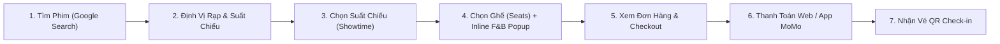
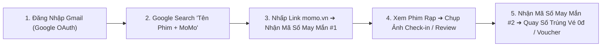

# BRD: Cinema Hub - Cổng Giải Trí & Điện Ảnh MoMo

> - **Project:** Cinema Hub (Web Platform & Cinema Ecosystem Strategy Q2-Q4/2026)
> - **Division:** Marketing Distribution Services (MDS) / Web Platform
> - **Owner:** Web Platform Team x BU Movies
> - **Version:** v4.0 - Tháng 9/2026
> - **Status:** Active & Production Pilot Ready (`momo.vn/cinema`)

## I. Executive Summary

### 1.1 Core Problems & Objectives
* **Vấn đề thực tế (Problem Statement):** Khách hàng khi có nhu cầu xem phim sẽ chủ động tìm kiếm lịch chiếu/suất chiếu trên Google. Tuy nhiên, MoMo chưa tối ưu hóa chuyên sâu về kỹ thuật và trải nghiệm Web trong các chu kỳ trước, dẫn đến việc chưa khai thác triệt để tệp từ khóa ngành (tổng quy mô nhu cầu tìm kiếm đạt **20.850.490 search volume/tháng** với 12.067 từ khóa, riêng head-term "phim chiếu rạp" đạt ~309.8K search volume/tháng). Đồng thời, việc thiếu cổng thanh toán trực tiếp trên Web (Non-App payment barrier) khiến tỷ lệ chuyển đổi Web-to-App (W2A CR) giảm mạnh từ 12.10% xuống 4.37%, gây lãng phí lượng lớn cơ hội giao dịch.
* **Mục tiêu định lượng H2/2026:** Uplift **100% mọi chỉ số** so với H1/2026:
  * **Organic Traffic:** Đạt **>4.020.000 visits/H2** (so với 2.01M H1).
  * **Total Traffic:** Đạt **>8.070.000 visits/H2** (so với 4.03M H1).
  * **Booking Clicks:** Đạt **>1.740.000 clicks/H2** (so với 870K H1).
  * **Tickets Sold (Số vé bán):** Đạt **>214.292 vé/H2** (so với 107K H1).
  * **Target Conversion Rate (% W2A):** Khôi phục và nâng CR đạt **≥ 4.50%** nhờ triển khai luồng Native Web Payment.
* **Triết lý cốt lõi:** **"Một bộ phim - Trọn vẹn hành trình điện ảnh"**, biến Web `momo.vn/cinema` thành trung tâm kết nối tự động:
  1. **Tìm kiếm 0-Click, giữ chỗ realtime:** Search Google  ➔  Thấy ngay lịch chiếu rạp gần nhất trên Web MoMo mà không cần chuyển app hay nhập lại địa điểm.
  2. **Thanh toán liền mạch Native Web Payment:** Người dùng Non-App có thể hoàn tất mua vé và thanh toán trực tiếp trên Web hoặc chuyển tiếp sang App 1-click.
  3. **Vòng đời nội dung tự động (Lifecycle Automation):** Phim đang chiếu  ➔  Phim hết suất chiếu rạp tự động chuyển hướng sang các nền tảng xem phim OTT đối tác, đảm bảo không lãng phí bất kỳ lượt Traffic nào.

### 1.2 Situation - Complication - Resolution
* **Situation (Bối cảnh & Vị thế):** Cinema là Use Case trưởng thành và có tiềm năng giao dịch lớn nhất của Khối Web Platform (~1M organic/3 tháng Q1/2026, chiếm giữ Top 1 SERP cho từ khóa "vé xem phim"). Website đóng vai trò là **"cửa ngõ hứng nhu cầu và cổng dẫn dắt chuyển đổi"** cho hệ sinh thái vé xem phim MoMo.
* **Complication (Khó khăn & Thách thức):** Tỷ lệ chuyển đổi suy giảm do 4 vấn đề cốt lõi:
  1. *Drop-off ở luồng thanh toán:* Khách hàng Non-App bị chặn lại do bắt buộc tải App mới mua được vé.
  2. *Keyword Gap lớn:* Chưa phủ sóng hết tệp từ khóa ngành với tổng quy mô nhu cầu tìm kiếm **20.850.490 search volume/tháng** trên 12.067 từ khóa (bao gồm head-terms lớn như "phimmoi" 1M, "phim" 1M, "cgv" 450K, "phim chiếu rạp" 301K, "lotte cinema" 165K...).
  3. *Rủi ro từ Google AI Overview (AIO):* Thiếu cấu trúc dữ liệu chuẩn Schema khiến Google AI trả về kết quả trực tiếp làm người dùng không click vào Web.
  4. *Nội dung lỗi thời do vận hành thủ công:* Phim hết suất chiếu rạp nhưng Web vẫn hiển thị "Đang chiếu", gây trải nghiệm tệ và lãng phí traffic.
* **Resolution (Giải pháp H2/2026):** Tái cấu trúc toàn diện và chuyển dịch hạ tầng sang nền tảng **MoSpark**, xây dựng **Cinema Hub** theo mô hình Product-Led Growth (PLG) & Hub-and-Spoke. Triển khai **Native Web Payment**, ứng dụng **GenAI Content** tự động hóa vòng đời phim và điều hướng sang các dịch vụ xem phim OTT.

### 1.3 Product-Led Growth (PLG) Drivers
Cơ chế PLG của Cinema Hub dựa trên 5 Phễu Mồi Câu (Acquisition & Engagement Hooks) giải quyết tức thời nhu cầu tìm kiếm trên Open Web:

1. **Phễu Tra Cứu Lịch Chiếu Realtime (Acquisition Gate):** Hứng nhu cầu tìm "lịch chiếu phim [tên phim] [tỉnh thành]"  ➔  Hiển thị suất chiếu của 13 chuỗi rạp đối tác (CGV, Lotte Cinema, Galaxy Cinema, BHD Star, Beta Cinemas, Cinestar, Mega GS, Cinemax, DCINE, Starlight, Rio Cinemas, Trung Tâm Chiếu Phim Quốc Gia, AEON Beta) theo vị trí GPS realtime.
2. **Phễu Báo Giá & Ưu Đãi Cụm Rạp (Retention Magnet):** Tra cứu bảng giá vé, chương trình khuyến mãi theo từng rạp  ➔  Gợi ý Combo Bỏng Nước & Thẻ quà tặng ưu đãi độc quyền MoMo.
3. **Phễu Bách Khoa Toàn Thư Điện Ảnh & Review (Topical Authority Hook):** Đón đầu nhu cầu tìm trailer, diễn viên, đạo diễn, điểm IMDb/Rotten Tomatoes  ➔  Kích hoạt tính năng đánh giá/review từ cộng đồng người xem MoMo.
4. **Phễu Native Web Payment (Conversion Hook):** Cho phép đặt ghế và thanh toán trực tiếp trên Web không cần mở App đối với khách hàng mới/Non-App.
5. **Phễu Chuyển Đổi Vòng Đời Phim sang OTT (Lifecycle Reminder Hook):** Tự động phát hiện phim đã hết suất chiếu rạp  ➔  Gợi ý link xem trực tuyến trên các nền tảng OTT đối tác (Netflix, VieON, Galaxy Play, FPT Play).

### 1.4 Key Metrics & Targets

#### Dual North Star Metrics

<table style="width:100%; border-collapse:collapse; border:1.5px solid #64748b; margin:1em 0; font-size:0.9em;">
  <thead>
    <tr style="background-color:#f1f5f9;">
      <th style="border:1.5px solid #64748b; padding:8px 12px; text-align:left; font-weight:700;">Platform Layer</th>
      <th style="border:1.5px solid #64748b; padding:8px 12px; text-align:left; font-weight:700;">North Star Metric</th>
      <th style="border:1.5px solid #64748b; padding:8px 12px; text-align:left; font-weight:700;">Definition</th>
      <th style="border:1.5px solid #64748b; padding:8px 12px; text-align:left; font-weight:700;">Target H2/2026</th>
      <th style="border:1.5px solid #64748b; padding:8px 12px; text-align:left; font-weight:700;">Strategic Role</th>
    </tr>
  </thead>
  <tbody>
    <tr>
      <td style="border:1px solid #94a3b8; padding:8px 12px; text-align:left;"><strong>Web Platform</strong> <em>(Primary Goal)</em></td>
      <td style="border:1px solid #94a3b8; padding:8px 12px; text-align:left;"><strong>Total Organic Web Traffic</strong></td>
      <td style="border:1px solid #94a3b8; padding:8px 12px; text-align:left;">Tổng số lượt truy cập tự nhiên từ Google Search và AI Search vào Cinema Hub trên Kênh Web mỗi tháng.</td>
      <td style="border:1px solid #94a3b8; padding:8px 12px; text-align:left;"><strong>>4.020.082 Visits/H2</strong> <em>(Uplift 100%)</em></td>
      <td style="border:1px solid #94a3b8; padding:8px 12px; text-align:left;">Mục tiêu cốt lõi: Hứng trọn nhu cầu tìm kiếm điện ảnh ngoài Open Web, mở rộng tệp Acquisition.</td>
    </tr>
    <tr style="background-color:#f8fafc;">
      <td style="border:1px solid #94a3b8; padding:8px 12px; text-align:left;"><strong>In-App & Web Booking</strong> <em>(Secondary Layer)</em></td>
      <td style="border:1px solid #94a3b8; padding:8px 12px; text-align:left;"><strong>Total Tickets Sold</strong></td>
      <td style="border:1px solid #94a3b8; padding:8px 12px; text-align:left;">Tổng số lượng vé xem phim được xuất bản thành công qua luồng Web & Web-to-App.</td>
      <td style="border:1px solid #94a3b8; padding:8px 12px; text-align:left;"><strong>>214.292 Vé/H2</strong> <em>(Uplift 100%)</em></td>
      <td style="border:1px solid #94a3b8; padding:8px 12px; text-align:left;">Đo lường hiệu quả chuyển đổi kinh doanh trực tiếp cho BU Movies và các chuỗi rạp đối tác.</td>
    </tr>
  </tbody>
</table>

#### Web Platform Metric Tree (Chi tiết H2/2026)

<table style="width:100%; border-collapse:collapse; border:1.5px solid #64748b; margin:1em 0; font-size:0.9em;">
  <thead>
    <tr style="background-color:#f1f5f9;">
      <th style="border:1.5px solid #64748b; padding:8px 12px; text-align:left; font-weight:700;">Metric</th>
      <th style="border:1.5px solid #64748b; padding:8px 12px; text-align:left; font-weight:700;">2025 Full Year</th>
      <th style="border:1.5px solid #64748b; padding:8px 12px; text-align:left; font-weight:700;">Q1/2026 (Baseline)</th>
      <th style="border:1.5px solid #64748b; padding:8px 12px; text-align:left; font-weight:700;">H1/2026 (Actual)</th>
      <th style="border:1.5px solid #64748b; padding:8px 12px; text-align:left; font-weight:700;"><strong>H2/2026 (Target)</strong></th>
    </tr>
  </thead>
  <tbody>
    <tr>
      <td style="border:1px solid #94a3b8; padding:8px 12px; text-align:left;">Organic Traffic</td>
      <td style="border:1px solid #94a3b8; padding:8px 12px; text-align:left;">6,387,700</td>
      <td style="border:1px solid #94a3b8; padding:8px 12px; text-align:left;">1,066,000</td>
      <td style="border:1px solid #94a3b8; padding:8px 12px; text-align:left;">2,010,041</td>
      <td style="border:1px solid #94a3b8; padding:8px 12px; text-align:left;"><strong>4,020,082</strong></td>
    </tr>
    <tr style="background-color:#f8fafc;">
      <td style="border:1px solid #94a3b8; padding:8px 12px; text-align:left;">Total Traffic</td>
      <td style="border:1px solid #94a3b8; padding:8px 12px; text-align:left;">12,425,040</td>
      <td style="border:1px solid #94a3b8; padding:8px 12px; text-align:left;">2,980,000</td>
      <td style="border:1px solid #94a3b8; padding:8px 12px; text-align:left;">4,035,028</td>
      <td style="border:1px solid #94a3b8; padding:8px 12px; text-align:left;"><strong>8,070,056</strong></td>
    </tr>
    <tr>
      <td style="border:1px solid #94a3b8; padding:8px 12px; text-align:left;">Booking Clicks</td>
      <td style="border:1px solid #94a3b8; padding:8px 12px; text-align:left;">266,258</td>
      <td style="border:1px solid #94a3b8; padding:8px 12px; text-align:left;">81,517</td>
      <td style="border:1px solid #94a3b8; padding:8px 12px; text-align:left;">870,467</td>
      <td style="border:1px solid #94a3b8; padding:8px 12px; text-align:left;"><strong>1,740,934</strong></td>
    </tr>
    <tr style="background-color:#f8fafc;">
      <td style="border:1px solid #94a3b8; padding:8px 12px; text-align:left;">Traffic to App (W2A Users)</td>
      <td style="border:1px solid #94a3b8; padding:8px 12px; text-align:left;">78,735</td>
      <td style="border:1px solid #94a3b8; padding:8px 12px; text-align:left;">9,866</td>
      <td style="border:1px solid #94a3b8; padding:8px 12px; text-align:left;">38,079</td>
      <td style="border:1px solid #94a3b8; padding:8px 12px; text-align:left;"><strong>76,158</strong></td>
    </tr>
    <tr>
      <td style="border:1px solid #94a3b8; padding:8px 12px; text-align:left;">Transactions (via App/Web)</td>
      <td style="border:1px solid #94a3b8; padding:8px 12px; text-align:left;">52,311</td>
      <td style="border:1px solid #94a3b8; padding:8px 12px; text-align:left;">9,212</td>
      <td style="border:1px solid #94a3b8; padding:8px 12px; text-align:left;">48,830</td>
      <td style="border:1px solid #94a3b8; padding:8px 12px; text-align:left;"><strong>97,660</strong></td>
    </tr>
    <tr style="background-color:#f8fafc;">
      <td style="border:1px solid #94a3b8; padding:8px 12px; text-align:left;">Tickets Sold (Số vé bán)</td>
      <td style="border:1px solid #94a3b8; padding:8px 12px; text-align:left;">N/A</td>
      <td style="border:1px solid #94a3b8; padding:8px 12px; text-align:left;">N/A</td>
      <td style="border:1px solid #94a3b8; padding:8px 12px; text-align:left;">107,146</td>
      <td style="border:1px solid #94a3b8; padding:8px 12px; text-align:left;"><strong>214,292</strong></td>
    </tr>
    <tr>
      <td style="border:1px solid #94a3b8; padding:8px 12px; text-align:left;"><strong>% W2A (Conversion Rate)</strong></td>
      <td style="border:1px solid #94a3b8; padding:8px 12px; text-align:left;"><strong>29.57%</strong></td>
      <td style="border:1px solid #94a3b8; padding:8px 12px; text-align:left;"><strong>12.10%</strong></td>
      <td style="border:1px solid #94a3b8; padding:8px 12px; text-align:left;"><strong>4.37%</strong></td>
      <td style="border:1px solid #94a3b8; padding:8px 12px; text-align:left;"><strong>≥ 4.50%+</strong></td>
    </tr>
  </tbody>
</table>

### 1.5 Báo Cáo Hiệu Suất MTD 26/09/2026 & Tiến Độ Thực Thi Sản Phẩm

#### A. Dữ Liệu Hiệu Suất Vận Hành MTD 26 Ngày (01/09 - 26/09/2026)
* **Lưu lượng MTD 26d:** Đạt **1.033.573 Pageviews** (chiếm **30.25% tổng lưu lượng Kênh Web**), chính thức **VƯỢT MỐC LỊCH SỬ >1 TRIỆU PVS MTD**, giữ vững vị thế động cơ kéo traffic số 1 toàn sàn.
* **Tốc độ vận hành (Daily Pace):** Đạt **39.753 PV/ngày**.
* **Dự báo trọn tháng (Run-rate Forecast 30d):** Ước tính đạt **1.192.584 PVs** (đạt 79.5% Target Hub 1.5M).
* **Phân rã theo Sub-pages MTD 26d:**
  - Trang Cụm rạp (Cinema_Cineplex): **407.962 PVs** (39.5% Hub)
  - Trang Chi tiết phim (Cinema_Page): **418.064 PVs** (40.4% Hub)
  - Trang Blog điện ảnh (Cinema_Blog): **139.759 PVs** (13.5% Hub)
  - Trang chủ Cinema & News: Lần lượt đạt **60.334 PVs** và **8.397 PVs**
* **Paid Traffic MTD 26d:** Đạt **356.556 Pageviews** (chiếm 31.8% tổng Paid toàn Kênh Web).

#### B. Cột Mốc Sản Phẩm & Chiến Lược Vận Hành Mới
* **Tự Chủ Sản Xuất Content:** Web Platform Team chủ động 100% quy trình sản xuất nội dung review/tin tức điện ảnh qua MoSpark GenAI Pipeline, tự chủ vận hành không lệ thuộc vào nguồn lực Cell Team.
* **Thử Nghiệm UI/UX Trang Rạp Mới (NCC Pilot):** Đã Go-live giao diện UI/UX trang rạp mới, đang áp dụng thử nghiệm tại **Trung Tâm Chiếu Phim Quốc Gia (NCC)** để đo lường hiệu suất Impression/Click CTR trước khi roll-out toàn bộ, bảo vệ lưu lượng của các cụm rạp best-performing (CGV, Lotte, Galaxy, BHD).
* **Reusable Mini Game Framework:** Hoạch định xây dựng 1 mô-đun Mini Game đơn giản áp dụng đồng loạt cho tất cả các đầu phim chiếu rạp để bứt phá CVR ngoài Web.

## II. Market Context & Strategy

### 2.1 Market Sizing & Opportunity
* **Quy mô thị trường rạp chiếu phim Việt Nam:** Doanh thu thị trường rạp chiếu phim Việt Nam tăng trưởng mạnh mẽ với hơn 45 triệu lượt vé bán ra hàng năm.
* **Mạng lưới đối tác:** MoMo kết nối trực tiếp với 13 chuỗi rạp chiếu phim lớn nhất Việt Nam: **CGV, Lotte Cinema, Galaxy Cinema, BHD Star, Beta Cinemas, Cinestar, Mega GS, Cinemax, DCINE, Starlight, Rio Cinemas, Trung Tâm Chiếu Phim Quốc Gia, AEON Beta**.
* **Xu hướng AI Search & Open Web:** Hơn 85% người xem phim thực hiện tìm kiếm "lịch chiếu phim", "review phim" trên Google trước khi quyết định ra rạp. Việc đón đầu Google AI Overview (AIO) giúp MoMo chiếm lĩnh vị thế Top-of-Mind.

### 2.2 Collaboration Model & Cross-BU Synergy

Dự án được vận hành dưới mô hình đối tác chiến lược giữa **BU Movies** và **Khối Web Platform**:

#### 1. BU Movies (Business Owner)
* **Business Ownership:** Nắm giữ quyền quyết định và chịu trách nhiệm toàn trình đối với kết quả kinh doanh (P&L, Doanh thu, New Users, MAU, Transactions, Số vé bán).
* **Domain Strategy & Merchant Ecosystem:** Hoạch định chiến lược kinh doanh, đàm phán thương lượng thương mại và định hướng khai thác hệ sinh thái đối tác (13 chuỗi Rạp & Nền tảng OTT).
* **Luồng Gửi Vé & Fulfillment (E-ticket Delivery Ownership):** Chịu trách nhiệm toàn bộ đối với luồng gửi vé điện tử đa kênh sau khi giao dịch hoàn tất (gửi tin nhắn Zalo ZNS, gửi Email xác nhận vé, nhắn SMS mã check-in và gửi thông báo push nhắc giờ xem phim). Quản lý ngân sách và hạ tầng phát hành vé.
* **Kênh Push Marketing Nội Bộ In-App (MDS-Movies Social Post Feed):** Vận hành kênh tin tức In-App Social Post (Feed MoMo) để đăng tải các bài viết truyền thông, tin hot bom tấn và deal ưu đãi, biến đây thành **Kênh Push Marketing Nội Bổ In-App** kéo lượt truy cập (driven-traffic) trực tiếp về Mini App và phối hợp đồng bộ traffic với Web Cinema Hub.
* **Media & Off-Page Investment:** Chủ động đầu tư ngân sách và triển khai các hoạt động Media, Truyền thông PR, Social Marketing và Xây dựng liên kết Off-Page (Backlink Authority) để thúc đẩy độ phủ thương hiệu và sức mạnh SEO của Cinema Hub trên Open Web.

#### 2. Web Platform (Product & Tech Partner)
* **Product & Growth Ownership:** Sở hữu, định hướng và vận hành Trải nghiệm Sản phẩm (Web Product), Tỷ lệ Chuyển đổi (CR) và Tăng trưởng Organic Traffic.
* **Trọng tâm thực thi H2/2026:**
  * **Product-Led Growth (PLG):** Chuyển hóa luồng Booking thành hệ thống thu hút và giữ chân người dùng tự nhiên.
  * **MoSpark Migration:** Hiện đại hóa hạ tầng công nghệ, nâng cao khả năng chịu tải và tốc độ phát triển.
  * **GenAI Content:** Ứng dụng AI tự động hóa sản xuất nội dung theo Content Plan của BU Movies.

### 2.3 Search Demand & Keyword Research

Bộ dữ liệu Keyword Research chuẩn mới nhất của Cinema Hub gồm **12.067 từ khóa hợp pháp độc lập** với tổng quy mô nhu cầu tìm kiếm đạt **20.850.490 lượt/tháng** trên Open Web tại Việt Nam (đã chuẩn hóa và loại bỏ các từ khóa rác).

Dưới đây là Bảng phân tích nhu cầu tìm kiếm theo 7 Cụm Chủ Đề (Themes) và các Cụm Chi Tiết (Sub-Clusters):

<table style="width:100%; border-collapse:collapse; border:1.5px solid #64748b; margin:1em 0; font-size:0.9em;">
  <thead>
    <tr style="background-color:#f1f5f9;">
      <th style="border:1.5px solid #64748b; padding:8px 12px; text-align:center; font-weight:700;">Mã Cụm</th>
      <th style="border:1.5px solid #64748b; padding:8px 12px; text-align:left; font-weight:700;">Cụm Chủ Đề (Theme Content Plan)</th>
      <th style="border:1.5px solid #64748b; padding:8px 12px; text-align:left; font-weight:700;">Cụm Chi Tiết (Sub-Cluster Editorial)</th>
      <th style="border:1.5px solid #64748b; padding:8px 12px; text-align:center; font-weight:700;">Search Volume / Tháng</th>
      <th style="border:1.5px solid #64748b; padding:8px 12px; text-align:center; font-weight:700;">Tỷ Lệ %</th>
      <th style="border:1.5px solid #64748b; padding:8px 12px; text-align:left; font-weight:700;">Ý Nghĩa Nhu Cầu Tìm Kiếm (Search Intent)</th>
    </tr>
  </thead>
  <tbody>
    <tr>
      <td style="border:1px solid #94a3b8; padding:8px 12px; text-align:center;"><strong>1</strong></td>
      <td style="border:1px solid #94a3b8; padding:8px 12px; text-align:left;"><strong>THƯƠNG HIỆU RẠP & CỤM RẠP ĐỊA PHƯƠNG</strong></td>
      <td style="border:1px solid #94a3b8; padding:8px 12px; text-align:left;"><strong>Tổng Cụm Rạp & Địa Điểm</strong></td>
      <td style="border:1px solid #94a3b8; padding:8px 12px; text-align:center;"><strong>4.633.370</strong></td>
      <td style="border:1px solid #94a3b8; padding:8px 12px; text-align:center;"><strong>22.22%</strong></td>
      <td style="border:1px solid #94a3b8; padding:8px 12px; text-align:left;"><strong>Nhu cầu tìm thương hiệu rạp và rạp gần vị trí người dùng</strong></td>
    </tr>
    <tr style="background-color:#f8fafc;">
      <td style="border:1px solid #94a3b8; padding:8px 12px; text-align:center;">1.1</td>
      <td style="border:1px solid #94a3b8; padding:8px 12px; text-align:left;">Thương Hiệu Rạp & Cụm Rạp Địa Phương</td>
      <td style="border:1px solid #94a3b8; padding:8px 12px; text-align:left;">Rạp CGV Cinema</td>
      <td style="border:1px solid #94a3b8; padding:8px 12px; text-align:center;">1.626.460</td>
      <td style="border:1px solid #94a3b8; padding:8px 12px; text-align:center;">7.80%</td>
      <td style="border:1px solid #94a3b8; padding:8px 12px; text-align:left;">Intent tìm rạp CGV gần nhất, tra cứu lịch chiếu rạp CGV & giá vé CGV.</td>
    </tr>
    <tr>
      <td style="border:1px solid #94a3b8; padding:8px 12px; text-align:center;">1.2</td>
      <td style="border:1px solid #94a3b8; padding:8px 12px; text-align:left;">Thương Hiệu Rạp & Cụm Rạp Địa Phương</td>
      <td style="border:1px solid #94a3b8; padding:8px 12px; text-align:left;">Rạp Galaxy Cinema</td>
      <td style="border:1px solid #94a3b8; padding:8px 12px; text-align:center;">876.400</td>
      <td style="border:1px solid #94a3b8; padding:8px 12px; text-align:center;">4.20%</td>
      <td style="border:1px solid #94a3b8; padding:8px 12px; text-align:left;">Intent tìm lịch chiếu rạp Galaxy và cụm rạp Galaxy gần nhà.</td>
    </tr>
    <tr style="background-color:#f8fafc;">
      <td style="border:1px solid #94a3b8; padding:8px 12px; text-align:center;">1.3</td>
      <td style="border:1px solid #94a3b8; padding:8px 12px; text-align:left;">Thương Hiệu Rạp & Cụm Rạp Địa Phương</td>
      <td style="border:1px solid #94a3b8; padding:8px 12px; text-align:left;">Rạp Lotte Cinema</td>
      <td style="border:1px solid #94a3b8; padding:8px 12px; text-align:center;">668.700</td>
      <td style="border:1px solid #94a3b8; padding:8px 12px; text-align:center;">3.21%</td>
      <td style="border:1px solid #94a3b8; padding:8px 12px; text-align:left;">Intent tra cứu rạp Lotte Cinema và vị trí rạp tại các trung tâm thương mại.</td>
    </tr>
    <tr>
      <td style="border:1px solid #94a3b8; padding:8px 12px; text-align:center;">1.4</td>
      <td style="border:1px solid #94a3b8; padding:8px 12px; text-align:left;">Thương Hiệu Rạp & Cụm Rạp Địa Phương</td>
      <td style="border:1px solid #94a3b8; padding:8px 12px; text-align:left;">Rạp Cinestar Cinema</td>
      <td style="border:1px solid #94a3b8; padding:8px 12px; text-align:center;">300.620</td>
      <td style="border:1px solid #94a3b8; padding:8px 12px; text-align:center;">1.44%</td>
      <td style="border:1px solid #94a3b8; padding:8px 12px; text-align:left;">Intent tìm rạp Cinestar, vé xem phim giá rẻ & vé học sinh sinh viên.</td>
    </tr>
    <tr style="background-color:#f8fafc;">
      <td style="border:1px solid #94a3b8; padding:8px 12px; text-align:center;">1.5</td>
      <td style="border:1px solid #94a3b8; padding:8px 12px; text-align:left;">Thương Hiệu Rạp & Cụm Rạp Địa Phương</td>
      <td style="border:1px solid #94a3b8; padding:8px 12px; text-align:left;">Rạp Beta Cinemas & AEON Beta</td>
      <td style="border:1px solid #94a3b8; padding:8px 12px; text-align:center;">221.210</td>
      <td style="border:1px solid #94a3b8; padding:8px 12px; text-align:center;">1.06%</td>
      <td style="border:1px solid #94a3b8; padding:8px 12px; text-align:left;">Intent tra cứu rạp Beta Cinemas, suất chiếu & cụm rạp Beta local.</td>
    </tr>
    <tr>
      <td style="border:1px solid #94a3b8; padding:8px 12px; text-align:center;">1.6</td>
      <td style="border:1px solid #94a3b8; padding:8px 12px; text-align:left;">Thương Hiệu Rạp & Cụm Rạp Địa Phương</td>
      <td style="border:1px solid #94a3b8; padding:8px 12px; text-align:left;">Trung Tâm Chiếu Phim Quốc Gia (NCC)</td>
      <td style="border:1px solid #94a3b8; padding:8px 12px; text-align:center;">182.080</td>
      <td style="border:1px solid #94a3b8; padding:8px 12px; text-align:center;">0.87%</td>
      <td style="border:1px solid #94a3b8; padding:8px 12px; text-align:left;">Intent tìm lịch chiếu & giá vé tại Trung Tâm Chiếu Phim Quốc Gia Hà Nội.</td>
    </tr>
    <tr style="background-color:#f8fafc;">
      <td style="border:1px solid #94a3b8; padding:8px 12px; text-align:center;">1.7</td>
      <td style="border:1px solid #94a3b8; padding:8px 12px; text-align:left;">Thương Hiệu Rạp & Cụm Rạp Địa Phương</td>
      <td style="border:1px solid #94a3b8; padding:8px 12px; text-align:left;">Rạp Starlight Cinema</td>
      <td style="border:1px solid #94a3b8; padding:8px 12px; text-align:center;">163.090</td>
      <td style="border:1px solid #94a3b8; padding:8px 12px; text-align:center;">0.78%</td>
      <td style="border:1px solid #94a3b8; padding:8px 12px; text-align:left;">Intent tìm rạp Starlight Cinema tại các tỉnh miền Trung & Tây Nguyên.</td>
    </tr>
    <tr>
      <td style="border:1px solid #94a3b8; padding:8px 12px; text-align:center;">1.8</td>
      <td style="border:1px solid #94a3b8; padding:8px 12px; text-align:left;">Thương Hiệu Rạp & Cụm Rạp Địa Phương</td>
      <td style="border:1px solid #94a3b8; padding:8px 12px; text-align:left;">Rạp BHD Star Cinema</td>
      <td style="border:1px solid #94a3b8; padding:8px 12px; text-align:center;">98.180</td>
      <td style="border:1px solid #94a3b8; padding:8px 12px; text-align:center;">0.47%</td>
      <td style="border:1px solid #94a3b8; padding:8px 12px; text-align:left;">Intent tra cứu cụm rạp BHD Star Cineplex tại TPHCM & Hà Nội.</td>
    </tr>
    <tr style="background-color:#f8fafc;">
      <td style="border:1px solid #94a3b8; padding:8px 12px; text-align:center;">1.9</td>
      <td style="border:1px solid #94a3b8; padding:8px 12px; text-align:left;">Thương Hiệu Rạp & Cụm Rạp Địa Phương</td>
      <td style="border:1px solid #94a3b8; padding:8px 12px; text-align:left;">Tra Cứu Rạp Theo Tỉnh / Thành (GEO)</td>
      <td style="border:1px solid #94a3b8; padding:8px 12px; text-align:center;">459.530</td>
      <td style="border:1px solid #94a3b8; padding:8px 12px; text-align:center;">2.20%</td>
      <td style="border:1px solid #94a3b8; padding:8px 12px; text-align:left;">Intent tìm địa điểm rạp chiếu phim gần vị trí hiện tại theo Tỉnh/Thành/Quận/Huyện.</td>
    </tr>
    <tr>
      <td style="border:1px solid #94a3b8; padding:8px 12px; text-align:center;">1.10</td>
      <td style="border:1px solid #94a3b8; padding:8px 12px; text-align:left;">Thương Hiệu Rạp & Cụm Rạp Địa Phương</td>
      <td style="border:1px solid #94a3b8; padding:8px 12px; text-align:left;">Các Chuỗi Rạp Khác (DCINE, Rio, Touch, Mega GS...)</td>
      <td style="border:1px solid #94a3b8; padding:8px 12px; text-align:center;">37.100</td>
      <td style="border:1px solid #94a3b8; padding:8px 12px; text-align:center;">0.18%</td>
      <td style="border:1px solid #94a3b8; padding:8px 12px; text-align:left;">Intent tra cứu thông tin suất chiếu & vị trí các rạp đối tác khác.</td>
    </tr>
    <tr style="background-color:#f8fafc;">
      <td style="border:1px solid #94a3b8; padding:8px 12px; text-align:center;"><strong>2</strong></td>
      <td style="border:1px solid #94a3b8; padding:8px 12px; text-align:left;"><strong>KHÁM PHÁ & GỢI Ý PHIM CHIẾU RẠP</strong></td>
      <td style="border:1px solid #94a3b8; padding:8px 12px; text-align:left;"><strong>Tổng Cụm Gợi Ý & Thể Loại Phim</strong></td>
      <td style="border:1px solid #94a3b8; padding:8px 12px; text-align:center;"><strong>646.650</strong></td>
      <td style="border:1px solid #94a3b8; padding:8px 12px; text-align:center;"><strong>3.10%</strong></td>
      <td style="border:1px solid #94a3b8; padding:8px 12px; text-align:left;"><strong>Nhu cầu khám phá phim rạp mới và tìm gợi ý phim hay</strong></td>
    </tr>
    <tr>
      <td style="border:1px solid #94a3b8; padding:8px 12px; text-align:center;">2.1</td>
      <td style="border:1px solid #94a3b8; padding:8px 12px; text-align:left;">Khám Phá & Gợi Ý Phim Chiếu Rạp</td>
      <td style="border:1px solid #94a3b8; padding:8px 12px; text-align:left;">Phim Đang Chiếu Rạp Mới Nhất</td>
      <td style="border:1px solid #94a3b8; padding:8px 12px; text-align:center;">43.020</td>
      <td style="border:1px solid #94a3b8; padding:8px 12px; text-align:center;">0.21%</td>
      <td style="border:1px solid #94a3b8; padding:8px 12px; text-align:left;">Intent khám phá các bộ phim mới công chiếu tại rạp hôm nay.</td>
    </tr>
    <tr style="background-color:#f8fafc;">
      <td style="border:1px solid #94a3b8; padding:8px 12px; text-align:center;">2.2</td>
      <td style="border:1px solid #94a3b8; padding:8px 12px; text-align:left;">Khám Phá & Gợi Ý Phim Chiếu Rạp</td>
      <td style="border:1px solid #94a3b8; padding:8px 12px; text-align:left;">Top Phim Rạp Hay & Phim Hot Tuần Này</td>
      <td style="border:1px solid #94a3b8; padding:8px 12px; text-align:center;">22.540</td>
      <td style="border:1px solid #94a3b8; padding:8px 12px; text-align:center;">0.11%</td>
      <td style="border:1px solid #94a3b8; padding:8px 12px; text-align:left;">Intent tìm kiếm danh sách phim hay, phim được đánh giá cao tuần này.</td>
    </tr>
    <tr>
      <td style="border:1px solid #94a3b8; padding:8px 12px; text-align:center;">2.3</td>
      <td style="border:1px solid #94a3b8; padding:8px 12px; text-align:left;">Khám Phá & Gợi Ý Phim Chiếu Rạp</td>
      <td style="border:1px solid #94a3b8; padding:8px 12px; text-align:left;">Phim Theo Thể Loại & Quốc Gia (Hành Động, Kinh Dị...)</td>
      <td style="border:1px solid #94a3b8; padding:8px 12px; text-align:center;">581.090</td>
      <td style="border:1px solid #94a3b8; padding:8px 12px; text-align:center;">2.79%</td>
      <td style="border:1px solid #94a3b8; padding:8px 12px; text-align:left;">Intent tìm phim chiếu rạp theo thể loại (hành động, kinh dị, tình cảm, Việt Nam...).</td>
    </tr>
    <tr style="background-color:#f8fafc;">
      <td style="border:1px solid #94a3b8; padding:8px 12px; text-align:center;"><strong>3</strong></td>
      <td style="border:1px solid #94a3b8; padding:8px 12px; text-align:left;"><strong>THÔNG TIN PHIM, VŨ TRỤ PHIM & NHÂN VẬT</strong></td>
      <td style="border:1px solid #94a3b8; padding:8px 12px; text-align:left;"><strong>Tổng Cụm Phim, Vũ Trụ Phim & Diễn Viên</strong></td>
      <td style="border:1px solid #94a3b8; padding:8px 12px; text-align:center;"><strong>13.022.970</strong></td>
      <td style="border:1px solid #94a3b8; padding:8px 12px; text-align:center;"><strong>62.46%</strong></td>
      <td style="border:1px solid #94a3b8; padding:8px 12px; text-align:left;"><strong>Nhu cầu tra cứu tác phẩm cụ thể, phim bộ, diễn viên và đạo diễn</strong></td>
    </tr>
    <tr>
      <td style="border:1px solid #94a3b8; padding:8px 12px; text-align:center;">3.1</td>
      <td style="border:1px solid #94a3b8; padding:8px 12px; text-align:left;">Thông Tin Phim, Vũ Trụ Phim & Nhân Vật</td>
      <td style="border:1px solid #94a3b8; padding:8px 12px; text-align:left;">Phim Hoạt Hình & Vũ Trụ Anime</td>
      <td style="border:1px solid #94a3b8; padding:8px 12px; text-align:center;">1.515.560</td>
      <td style="border:1px solid #94a3b8; padding:8px 12px; text-align:center;">7.27%</td>
      <td style="border:1px solid #94a3b8; padding:8px 12px; text-align:left;">Intent tìm kiếm các thương hiệu Anime/Hoạt hình nổi tiếng (Doraemon, Conan, One Piece).</td>
    </tr>
    <tr style="background-color:#f8fafc;">
      <td style="border:1px solid #94a3b8; padding:8px 12px; text-align:center;">3.2</td>
      <td style="border:1px solid #94a3b8; padding:8px 12px; text-align:left;">Thông Tin Phim, Vũ Trụ Phim & Nhân Vật</td>
      <td style="border:1px solid #94a3b8; padding:8px 12px; text-align:left;">Điện Ảnh Việt Nam Bom Tấn</td>
      <td style="border:1px solid #94a3b8; padding:8px 12px; text-align:center;">558.710</td>
      <td style="border:1px solid #94a3b8; padding:8px 12px; text-align:center;">2.68%</td>
      <td style="border:1px solid #94a3b8; padding:8px 12px; text-align:left;">Intent tra cứu thông tin, lịch chiếu phim điện ảnh Việt Nam bom tấn.</td>
    </tr>
    <tr>
      <td style="border:1px solid #94a3b8; padding:8px 12px; text-align:center;">3.3</td>
      <td style="border:1px solid #94a3b8; padding:8px 12px; text-align:left;">Thông Tin Phim, Vũ Trụ Phim & Nhân Vật</td>
      <td style="border:1px solid #94a3b8; padding:8px 12px; text-align:left;">Bom Tấn Hollywood & Quốc Tế</td>
      <td style="border:1px solid #94a3b8; padding:8px 12px; text-align:center;">43.150</td>
      <td style="border:1px solid #94a3b8; padding:8px 12px; text-align:center;">0.21%</td>
      <td style="border:1px solid #94a3b8; padding:8px 12px; text-align:left;">Intent tìm kiếm phim bom tấn Hollywood và các thương hiệu điện ảnh lớn.</td>
    </tr>
    <tr style="background-color:#f8fafc;">
      <td style="border:1px solid #94a3b8; padding:8px 12px; text-align:center;">3.4</td>
      <td style="border:1px solid #94a3b8; padding:8px 12px; text-align:left;">Thông Tin Phim, Vũ Trụ Phim & Nhân Vật</td>
      <td style="border:1px solid #94a3b8; padding:8px 12px; text-align:left;">Đạo Diễn, Diễn Viên & Nhân Vật Nổi Tiếng</td>
      <td style="border:1px solid #94a3b8; padding:8px 12px; text-align:center;">2.887.650</td>
      <td style="border:1px solid #94a3b8; padding:8px 12px; text-align:center;">13.85%</td>
      <td style="border:1px solid #94a3b8; padding:8px 12px; text-align:left;">Intent tra cứu tiểu sử, sự nghiệp & danh sách phim của đạo diễn, diễn viên.</td>
    </tr>
    <tr>
      <td style="border:1px solid #94a3b8; padding:8px 12px; text-align:center;">3.5</td>
      <td style="border:1px solid #94a3b8; padding:8px 12px; text-align:left;">Thông Tin Phim, Vũ Trụ Phim & Nhân Vật</td>
      <td style="border:1px solid #94a3b8; padding:8px 12px; text-align:left;">Chi Tiết Phim & Thứ Tự Xem Phim (Watch Order)</td>
      <td style="border:1px solid #94a3b8; padding:8px 12px; text-align:center;">8.017.900</td>
      <td style="border:1px solid #94a3b8; padding:8px 12px; text-align:center;">38.45%</td>
      <td style="border:1px solid #94a3b8; padding:8px 12px; text-align:left;">Intent tra cứu thông tin chi tiết từng tác phẩm điện ảnh cụ thể.</td>
    </tr>
    <tr style="background-color:#f8fafc;">
      <td style="border:1px solid #94a3b8; padding:8px 12px; text-align:center;"><strong>4</strong></td>
      <td style="border:1px solid #94a3b8; padding:8px 12px; text-align:left;"><strong>LỊCH CHIẾU, VÉ RẠP & TRẢI NGHIỆM PHÒNG CHIẾU</strong></td>
      <td style="border:1px solid #94a3b8; padding:8px 12px; text-align:left;"><strong>Tổng Cụm Suất Chiếu & Đặt Vé Rạp</strong></td>
      <td style="border:1px solid #94a3b8; padding:8px 12px; text-align:center;"><strong>1.119.290</strong></td>
      <td style="border:1px solid #94a3b8; padding:8px 12px; text-align:center;"><strong>5.37%</strong></td>
      <td style="border:1px solid #94a3b8; padding:8px 12px; text-align:left;"><strong>Nhu cầu giao dịch trực tiếp, tra cứu suất chiếu và đặt vé rạp</strong></td>
    </tr>
    <tr>
      <td style="border:1px solid #94a3b8; padding:8px 12px; text-align:center;">4.1</td>
      <td style="border:1px solid #94a3b8; padding:8px 12px; text-align:left;">Lịch Chiếu, Vé Rạp & Trải Nghiệm Phòng Chiếu</td>
      <td style="border:1px solid #94a3b8; padding:8px 12px; text-align:left;">Tra Cứu Lịch Chiếu & Suất Chiếu Rạp</td>
      <td style="border:1px solid #94a3b8; padding:8px 12px; text-align:center;">810.530</td>
      <td style="border:1px solid #94a3b8; padding:8px 12px; text-align:center;">3.89%</td>
      <td style="border:1px solid #94a3b8; padding:8px 12px; text-align:left;">Intent tìm khung giờ chiếu, suất chiếu cụ thể tại từng rạp.</td>
    </tr>
    <tr style="background-color:#f8fafc;">
      <td style="border:1px solid #94a3b8; padding:8px 12px; text-align:center;">4.2</td>
      <td style="border:1px solid #94a3b8; padding:8px 12px; text-align:left;">Lịch Chiếu, Vé Rạp & Trải Nghiệm Phòng Chiếu</td>
      <td style="border:1px solid #94a3b8; padding:8px 12px; text-align:left;">Trải Nghiệm Phòng Chiếu Đặc Biệt (IMAX, 3D, 4DX)</td>
      <td style="border:1px solid #94a3b8; padding:8px 12px; text-align:center;">303.410</td>
      <td style="border:1px solid #94a3b8; padding:8px 12px; text-align:center;">1.46%</td>
      <td style="border:1px solid #94a3b8; padding:8px 12px; text-align:left;">Intent tìm phim chiếu định dạng đặc biệt (IMAX, 3D, 4DX).</td>
    </tr>
    <tr>
      <td style="border:1px solid #94a3b8; padding:8px 12px; text-align:center;">4.3</td>
      <td style="border:1px solid #94a3b8; padding:8px 12px; text-align:left;">Lịch Chiếu, Vé Rạp & Trải Nghiệm Phòng Chiếu</td>
      <td style="border:1px solid #94a3b8; padding:8px 12px; text-align:left;">Bảng Giá Vé Rạp & Ưu Đãi Khuyến Mãi</td>
      <td style="border:1px solid #94a3b8; padding:8px 12px; text-align:center;">3.000</td>
      <td style="border:1px solid #94a3b8; padding:8px 12px; text-align:center;">0.01%</td>
      <td style="border:1px solid #94a3b8; padding:8px 12px; text-align:left;">Intent so sánh bảng giá vé rạp và tìm mã giảm giá vé phim.</td>
    </tr>
    <tr style="background-color:#f8fafc;">
      <td style="border:1px solid #94a3b8; padding:8px 12px; text-align:center;">4.4</td>
      <td style="border:1px solid #94a3b8; padding:8px 12px; text-align:left;">Lịch Chiếu, Vé Rạp & Trải Nghiệm Phòng Chiếu</td>
      <td style="border:1px solid #94a3b8; padding:8px 12px; text-align:left;">Đặt Vé Xem Phim Trực Tuyến</td>
      <td style="border:1px solid #94a3b8; padding:8px 12px; text-align:center;">2.350</td>
      <td style="border:1px solid #94a3b8; padding:8px 12px; text-align:center;">0.01%</td>
      <td style="border:1px solid #94a3b8; padding:8px 12px; text-align:left;">Intent mua vé xem phim trực tuyến và chọn giữ ghế nhanh trên web.</td>
    </tr>
    <tr>
      <td style="border:1px solid #94a3b8; padding:8px 12px; text-align:center;"><strong>5</strong></td>
      <td style="border:1px solid #94a3b8; padding:8px 12px; text-align:left;"><strong>REVIEW PHIM & PHÂN TÍCH NỘI DUNG</strong></td>
      <td style="border:1px solid #94a3b8; padding:8px 12px; text-align:left;"><strong>Tổng Cụm Review & Đánh Giá Phim</strong></td>
      <td style="border:1px solid #94a3b8; padding:8px 12px; text-align:center;"><strong>159.040</strong></td>
      <td style="border:1px solid #94a3b8; padding:8px 12px; text-align:center;"><strong>0.76%</strong></td>
      <td style="border:1px solid #94a3b8; padding:8px 12px; text-align:left;"><strong>Nhu cầu tham khảo nhận xét, điểm số và bài viết phân tích phim</strong></td>
    </tr>
    <tr style="background-color:#f8fafc;">
      <td style="border:1px solid #94a3b8; padding:8px 12px; text-align:center;">5.1</td>
      <td style="border:1px solid #94a3b8; padding:8px 12px; text-align:left;">Review Phim & Phân Tích Nội Dung</td>
      <td style="border:1px solid #94a3b8; padding:8px 12px; text-align:left;">Review Phim & Nhận Xét Chi Tiết</td>
      <td style="border:1px solid #94a3b8; padding:8px 12px; text-align:center;">158.810</td>
      <td style="border:1px solid #94a3b8; padding:8px 12px; text-align:center;">0.76%</td>
      <td style="border:1px solid #94a3b8; padding:8px 12px; text-align:left;">Intent đọc nhận xét, bài đánh giá phim trước khi mua vé ra rạp.</td>
    </tr>
    <tr>
      <td style="border:1px solid #94a3b8; padding:8px 12px; text-align:center;">5.2</td>
      <td style="border:1px solid #94a3b8; padding:8px 12px; text-align:left;">Review Phim & Phân Tích Nội Dung</td>
      <td style="border:1px solid #94a3b8; padding:8px 12px; text-align:left;">Giải Thích Kết Phim, Spoilers & Chấm Điểm IMDb</td>
      <td style="border:1px solid #94a3b8; padding:8px 12px; text-align:center;">230</td>
      <td style="border:1px solid #94a3b8; padding:8px 12px; text-align:center;">0.00%</td>
      <td style="border:1px solid #94a3b8; padding:8px 12px; text-align:left;">Intent tìm bài phân tích kết phim, giải thích tình tiết và điểm số IMDb.</td>
    </tr>
    <tr style="background-color:#f8fafc;">
      <td style="border:1px solid #94a3b8; padding:8px 12px; text-align:center;"><strong>6</strong></td>
      <td style="border:1px solid #94a3b8; padding:8px 12px; text-align:left;"><strong>PHIM BỘ TRỰC TUYẾN & GÓI CƯỚC OTT</strong></td>
      <td style="border:1px solid #94a3b8; padding:8px 12px; text-align:left;"><strong>Tổng Cụm Phim Bộ & Gói OTT</strong></td>
      <td style="border:1px solid #94a3b8; padding:8px 12px; text-align:center;"><strong>1.261.740</strong></td>
      <td style="border:1px solid #94a3b8; padding:8px 12px; text-align:center;"><strong>6.05%</strong></td>
      <td style="border:1px solid #94a3b8; padding:8px 12px; text-align:left;"><strong>Nhu cầu xem phim bộ, TV Series trực tuyến tại nhà trên nền tảng OTT</strong></td>
    </tr>
    <tr>
      <td style="border:1px solid #94a3b8; padding:8px 12px; text-align:center;">6.1</td>
      <td style="border:1px solid #94a3b8; padding:8px 12px; text-align:left;">Phim Bộ Trực Tuyến & Gói Cước OTT</td>
      <td style="border:1px solid #94a3b8; padding:8px 12px; text-align:left;">Phim Nổi Bật Trên Netflix & OTT</td>
      <td style="border:1px solid #94a3b8; padding:8px 12px; text-align:center;">16.210</td>
      <td style="border:1px solid #94a3b8; padding:8px 12px; text-align:center;">0.08%</td>
      <td style="border:1px solid #94a3b8; padding:8px 12px; text-align:left;">Intent tìm kiếm các bộ phim phát sóng trên nền tảng Netflix.</td>
    </tr>
    <tr style="background-color:#f8fafc;">
      <td style="border:1px solid #94a3b8; padding:8px 12px; text-align:center;">6.2</td>
      <td style="border:1px solid #94a3b8; padding:8px 12px; text-align:left;">Phim Bộ Trực Tuyến & Gói Cước OTT</td>
      <td style="border:1px solid #94a3b8; padding:8px 12px; text-align:left;">Gói Cước Xem Phim VieON, FPT Play, Galaxy Play</td>
      <td style="border:1px solid #94a3b8; padding:8px 12px; text-align:center;">270</td>
      <td style="border:1px solid #94a3b8; padding:8px 12px; text-align:center;">0.00%</td>
      <td style="border:1px solid #94a3b8; padding:8px 12px; text-align:left;">Intent mua gói cước & xem phim trên nền tảng đối tác Việt Nam.</td>
    </tr>
    <tr>
      <td style="border:1px solid #94a3b8; padding:8px 12px; text-align:center;">6.3</td>
      <td style="border:1px solid #94a3b8; padding:8px 12px; text-align:left;">Phim Bộ Trực Tuyến & Gói Cước OTT</td>
      <td style="border:1px solid #94a3b8; padding:8px 12px; text-align:left;">Phim Bộ & TV Series Trực Tuyến</td>
      <td style="border:1px solid #94a3b8; padding:8px 12px; text-align:center;">1.245.260</td>
      <td style="border:1px solid #94a3b8; padding:8px 12px; text-align:center;">5.97%</td>
      <td style="border:1px solid #94a3b8; padding:8px 12px; text-align:left;">Intent tìm phim bộ, Kdrama, Anime xem trực tuyến tại nhà.</td>
    </tr>
    <tr style="background-color:#f8fafc;">
      <td style="border:1px solid #94a3b8; padding:8px 12px; text-align:center;"><strong>7</strong></td>
      <td style="border:1px solid #94a3b8; padding:8px 12px; text-align:left;"><strong>TIN TỨC PHIM SẮP CHIẾU & TRAILER</strong></td>
      <td style="border:1px solid #94a3b8; padding:8px 12px; text-align:left;"><strong>Tổng Cụm Phim Sắp Chiếu & Trailer</strong></td>
      <td style="border:1px solid #94a3b8; padding:8px 12px; text-align:center;"><strong>7.430</strong></td>
      <td style="border:1px solid #94a3b8; padding:8px 12px; text-align:center;"><strong>0.04%</strong></td>
      <td style="border:1px solid #94a3b8; padding:8px 12px; text-align:left;"><strong>Nhu cầu đón đầu thông tin phim bom tấn chuẩn bị công chiếu</strong></td>
    </tr>
    <tr>
      <td style="border:1px solid #94a3b8; padding:8px 12px; text-align:center;">7.1</td>
      <td style="border:1px solid #94a3b8; padding:8px 12px; text-align:left;">Tin Tức Phim Sắp Chiếu & Trailer</td>
      <td style="border:1px solid #94a3b8; padding:8px 12px; text-align:left;">Lịch Khởi Chiếu Phim Sắp Ra Mắt</td>
      <td style="border:1px solid #94a3b8; padding:8px 12px; text-align:center;">3.100</td>
      <td style="border:1px solid #94a3b8; padding:8px 12px; text-align:center;">0.01%</td>
      <td style="border:1px solid #94a3b8; padding:8px 12px; text-align:left;">Intent theo dõi lịch công chiếu các phim bom tấn chuẩn bị ra rạp.</td>
    </tr>
    <tr style="background-color:#f8fafc;">
      <td style="border:1px solid #94a3b8; padding:8px 12px; text-align:center;">7.2</td>
      <td style="border:1px solid #94a3b8; padding:8px 12px; text-align:left;">Tin Tức Phim Sắp Chiếu & Trailer</td>
      <td style="border:1px solid #94a3b8; padding:8px 12px; text-align:left;">Trailer Official & Tin Tức Hậu Trường</td>
      <td style="border:1px solid #94a3b8; padding:8px 12px; text-align:center;">4.330</td>
      <td style="border:1px solid #94a3b8; padding:8px 12px; text-align:center;">0.02%</td>
      <td style="border:1px solid #94a3b8; padding:8px 12px; text-align:left;">Intent xem trailer chính thức và video xem trước của phim.</td>
    </tr>
  </tbody>
</table>

### 2.4 Competitive Landscape, Gap Analysis & MoMo Strategic Advantage

#### 2.4.1 Ma Trận Phân Loại Đối Thủ Thị Trường (Market Competitor Mapping)

Thị trường thông tin và đặt vé xem phim điện ảnh trực tuyến tại Việt Nam hiện được chia thành 3 nhóm đối thủ chính:

1. **Nhóm Website Chuỗi Rạp Đơn Lẻ (CGV.vn, Lottecinema.com.vn, Galaxycine.vn, Betacinemas.vn):**
   * **Thế mạnh:** Dữ liệu suất chiếu gốc trực tiếp, chương trình thành viên rạp (Loyalty) và thương hiệu mạnh.
   * **Hạn chế:** Giới hạn rạp độc quyền (không thể so sánh suất chiếu giữa các chuỗi rạp), trải nghiệm Web SEO hạn chế ngoài từ khóa tên phim gốc, thiếu sự linh hoạt trong các giải pháp thanh toán tài chính.
2. **Nhóm Trang Trang Aggregator & Tổng Hợp Điện Ảnh (Moveek.com, Rapchieuphim.com):**
   * **Thế mạnh:** Lượng truy cập tự nhiên (Organic Traffic) lớn từ từ khóa long-tail, kho nội dung bài viết tin tức và review phong phú.
   * **Hạn chế:** Luồng thanh toán đứt gãy (phải chuyển hướng hoặc phụ thuộc công cụ bên thứ ba), hạ tầng công nghệ cũ kỹ, không có hệ sinh thái thanh toán bù trừ tài chính.
3. **Nhóm Nền Tảng Siêu Ứng Dụng (ZaloPay, Shopee, Traveloka, VinID):**
   * **Thế mạnh:** Tệp người dùng ứng dụng có sẵn, khả năng bán chéo dịch vụ In-App.
   * **Hạn chế:** Không có năng lực hiển thị và chiếm lĩnh thứ hạng trên Open Web (phụ thuộc 95%+ vào quảng cáo In-App và Banner), trải nghiệm trang Web Landing Page mờ nhạt.

#### 2.4.2 Bảng Phân Tích Khoảng Trống Thị Trường (Gap Analysis Matrix)

<table style="width:100%; border-collapse:collapse; border:1.5px solid #64748b; margin:1em 0; font-size:0.9em;">
  <thead>
    <tr style="background-color:#f1f5f9;">
      <th style="border:1.5px solid #64748b; padding:8px 12px; text-align:left; font-weight:700;">Tiêu Chí Phân Tích</th>
      <th style="border:1.5px solid #64748b; padding:8px 12px; text-align:left; font-weight:700;">Chuỗi Rạp Đơn Lẻ (CGV, Galaxy, Lotte)</th>
      <th style="border:1.5px solid #64748b; padding:8px 12px; text-align:left; font-weight:700;">Trang Aggregator Truyền Thống (Moveek, Rapchieuphim)</th>
      <th style="border:1.5px solid #64748b; padding:8px 12px; text-align:left; font-weight:700;">Ứng Dụng Khác (ZaloPay, Shopee)</th>
      <th style="border:1.5px solid #64748b; padding:8px 12px; text-align:left; font-weight:700;"><strong>MoMo Cinema Hub (momo.vn/cinema)</strong></th>
      <th style="border:1.5px solid #64748b; padding:8px 12px; text-align:left; font-weight:700;"><strong>Khoảng Trống Thị Trường & Lợi Thế MoMo</strong></th>
    </tr>
  </thead>
  <tbody>
    <tr>
      <td style="border:1px solid #94a3b8; padding:8px 12px; text-align:left;"><strong>1. Khả Năng Phủ 13 Chuỗi Rạp Trên 1 Giao Diện</strong></td>
      <td style="border:1px solid #94a3b8; padding:8px 12px; text-align:left;">Không (Chỉ hiển thị rạp thuộc chuỗi)</td>
      <td style="border:1px solid #94a3b8; padding:8px 12px; text-align:left;">Có (Hiển thị nhiều rạp nhưng đứt gãy thanh toán)</td>
      <td style="border:1px solid #94a3b8; padding:8px 12px; text-align:left;">Yếu (Không có Web Hub Open Web)</td>
      <td style="border:1px solid #94a3b8; padding:8px 12px; text-align:left;"><strong>Có (Tra cứu & mua vé 13 chuỗi rạp trên 1 giao diện duy nhất)</strong></td>
      <td style="border:1px solid #94a3b8; padding:8px 12px; text-align:left;"><strong>MoMo là Hub duy nhất cho phép so sánh suất chiếu & giá vé 13 chuỗi rạp trên 1 bản đồ.</strong></td>
    </tr>
    <tr style="background-color:#f8fafc;">
      <td style="border:1px solid #94a3b8; padding:8px 12px; text-align:left;"><strong>2. Luồng Thanh Toán Native Web Payment</strong></td>
      <td style="border:1px solid #94a3b8; padding:8px 12px; text-align:left;">Nhập thẻ ngân hàng / quét QR lâu</td>
      <td style="border:1px solid #94a3b8; padding:8px 12px; text-align:left;">Chuyển hướng bên thứ ba, đứt gãy luồng</td>
      <td style="border:1px solid #94a3b8; padding:8px 12px; text-align:left;">Chỉ thanh toán In-App</td>
      <td style="border:1px solid #94a3b8; padding:8px 12px; text-align:left;"><strong>Thanh toán Web Native 1-Click (Ví MoMo, Ví Trả Sau, Thẻ Ngân Hàng)</strong></td>
      <td style="border:1px solid #94a3b8; padding:8px 12px; text-align:left;"><strong>Triệt tiêu đứt gãy checkout, tỷ lệ chuyển đổi đơn hàng cao hơn 30%-40% đối thủ Web.</strong></td>
    </tr>
    <tr>
      <td style="border:1px solid #94a3b8; padding:8px 12px; text-align:left;"><strong>3. Giải Pháp Tài Chính & Hỗ Trợ Dòng Tiền</strong></td>
      <td style="border:1px solid #94a3b8; padding:8px 12px; text-align:left;">Không có Ví Trả Sau</td>
      <td style="border:1px solid #94a3b8; padding:8px 12px; text-align:left;">Không có</td>
      <td style="border:1px solid #94a3b8; padding:8px 12px; text-align:left;">Hạn chế</td>
      <td style="border:1px solid #94a3b8; padding:8px 12px; text-align:left;"><strong>Ví Trả Sau (BNPL 0% lãi suất), Hoàn tiền MoMo Rewards</strong></td>
      <td style="border:1px solid #94a3b8; padding:8px 12px; text-align:left;"><strong>Độc quyền Ví Trả Sau MoMo thúc đẩy mua sắm vé xem phim & combo bắp nước giá trị cao.</strong></td>
    </tr>
    <tr style="background-color:#f8fafc;">
      <td style="border:1px solid #94a3b8; padding:8px 12px; text-align:left;"><strong>4. Open Web SEO & Phủ Từ Khóa Long-Tail</strong></td>
      <td style="border:1px solid #94a3b8; padding:8px 12px; text-align:left;">Yếu (Chỉ xếp hạng từ khóa tên nhà)</td>
      <td style="border:1px solid #94a3b8; padding:8px 12px; text-align:left;">Mạnh (Hạ tầng cũ, tốc độ load chậm)</td>
      <td style="border:1px solid #94a3b8; padding:8px 12px; text-align:left;">Rất yếu (Gần như không có dữ liệu Web)</td>
      <td style="border:1px solid #94a3b8; padding:8px 12px; text-align:left;"><strong>Rất mạnh (Hạ tầng MoSpark, pSEO 120+ chi nhánh rạp, 12.067 KWs - 20,85M volume)</strong></td>
      <td style="border:1px solid #94a3b8; padding:8px 12px; text-align:left;"><strong>Chiếm lĩnh vị trí Top 1-3 Google Search cho tệp từ khóa Rạp Local, Review & Lịch chiếu.</strong></td>
    </tr>
    <tr>
      <td style="border:1px solid #94a3b8; padding:8px 12px; text-align:left;"><strong>5. Vòng Đời Dịch Vụ Điện Ảnh Khép Kín (End-to-End)</strong></td>
      <td style="border:1px solid #94a3b8; padding:8px 12px; text-align:left;">Chỉ dừng ở vé chiếu rạp</td>
      <td style="border:1px solid #94a3b8; padding:8px 12px; text-align:left;">Chỉ dừng ở bài viết tin tức</td>
      <td style="border:1px solid #94a3b8; padding:8px 12px; text-align:left;">Chỉ dừng ở giao dịch mua vé</td>
      <td style="border:1px solid #94a3b8; padding:8px 12px; text-align:left;"><strong>Rạp Chiếu + OTT (VieON/Netflix) + Combo Bắp Nước + Voucher Ăn Uống</strong></td>
      <td style="border:1px solid #94a3b8; padding:8px 12px; text-align:left;"><strong>Tự động chuyển đổi người dùng từ Phim Rạp sang Phim OTT khi hết đợt chiếu.</strong></td>
    </tr>
  </tbody>
</table>

#### 2.4.3 Các Nhóm Năng Lực Cần Xác Nhận & Định Hướng Khai Thác (Capability Alignment)

1. **Năng Lực Thanh Toán Native Web Payment:** Đánh giá khả năng tích hợp luồng thanh toán trực tiếp trên Web (Ví MoMo, Ví Trả Sau, Thẻ Ngân Hàng) để tối ưu tỷ lệ chuyển đổi đơn hàng mà không bắt buộc người dùng chuyển tiếp ứng dụng.
2. **Năng Lực Kết Nối API 13 Chuỗi Rạp & Nền Tảng OTT:** Đánh giá mức độ sẵn sàng và độ trễ của hệ thống API kết nối giữ ghế realtime với 13 chuỗi rạp đối tác và dịch vụ bán gói cước OTT.
3. **Hạ Tầng Công Nghệ Web Platform:** Đánh giá năng lực hạ tầng Web trong việc đáp ứng tốc độ tải trang, tối ưu hóa các chỉ số kỹ thuật Core Web Vitals và khả năng mở rộng trang địa điểm rạp (pSEO).
4. **Hệ Sinh Thái Phương Thức Thanh Toán:** Khai thác các phương thức thanh toán linh hoạt hiện có như Ví Trả Sau và chương trình ưu đãi MoMo Rewards để hỗ trợ kích cầu giao dịch.

 

### 3.1 Multi-sided Value Proposition
* **Cho Người Xem Phim (Consumers):** Tìm kiếm suất chiếu của tất cả các rạp xung quanh trên 1 bản đồ duy nhất, đặt vé không cần tải app, nhận ưu đãi độc quyền combo bỏng nước.
* **Cho 13 Chuỗi Rạp Đối Tác (Cinema Merchants):** Tiếp cận tệp khách hàng mua vé dồi dào từ Open Web (Open Web Traffic Acquisition), tối ưu tỷ lệ lấp đầy ghế trống các suất chiếu.
* **Cho MoMo Platform:** Biến Web thành kênh thu hút người dùng mới (Acquisition Engine), tăng trưởng lượng giao dịch (Transactions) và tối ưu hóa LTV người dùng.

### 3.2 Web Onboarding & Booking Flow

#### Bảng Phân Tích Chi Tiết Các Bước (Step Breakdown Table)

<table style="width:100%; border-collapse:collapse; border:1.5px solid #64748b; margin:1em 0; font-size:0.9em;">
  <thead>
    <tr style="background-color:#f1f5f9;">
      <th style="border:1.5px solid #64748b; padding:8px 12px; text-align:center; font-weight:700;">Bước</th>
      <th style="border:1.5px solid #64748b; padding:8px 12px; text-align:left; font-weight:700;">Tên Giai Đoạn</th>
      <th style="border:1.5px solid #64748b; padding:8px 12px; text-align:left; font-weight:700;">Trải Nghiệm Người Dùng (UX)</th>
      <th style="border:1.5px solid #64748b; padding:8px 12px; text-align:left; font-weight:700;">Hạ Tầng / Cơ Chế Kỹ Thuật</th>
      <th style="border:1.5px solid #64748b; padding:8px 12px; text-align:left; font-weight:700;">Nền Tảng</th>
    </tr>
  </thead>
  <tbody>
    <tr>
      <td style="border:1px solid #94a3b8; padding:8px 12px; text-align:center;"><strong>1</strong></td>
      <td style="border:1px solid #94a3b8; padding:8px 12px; text-align:left;"><strong>Khởi Tạo Nhu Cầu (Search Trigger)</strong></td>
      <td style="border:1px solid #94a3b8; padding:8px 12px; text-align:left;">Người dùng tìm kiếm từ khóa lịch chiếu, tên phim hoặc cụm rạp trên Google Search.</td>
      <td style="border:1px solid #94a3b8; padding:8px 12px; text-align:left;">Google Indexing & SEO Metadata Schema.org (<code style="background:#f1f5f9;padding:2px 4px;border-radius:4px;font-family:monospace;">ScreeningEvent</code>, <code style="background:#f1f5f9;padding:2px 4px;border-radius:4px;font-family:monospace;">Movie</code>).</td>
      <td style="border:1px solid #94a3b8; padding:8px 12px; text-align:left;">Open Web (Google SERP)</td>
    </tr>
    <tr style="background-color:#f8fafc;">
      <td style="border:1px solid #94a3b8; padding:8px 12px; text-align:center;"><strong>2</strong></td>
      <td style="border:1px solid #94a3b8; padding:8px 12px; text-align:left;"><strong>Truy Cập & Định Vị GEO (Onboarding)</strong></td>
      <td style="border:1px solid #94a3b8; padding:8px 12px; text-align:left;">Chuyển hướng về <code style="background:#f1f5f9;padding:2px 4px;border-radius:4px;font-family:monospace;">momo.vn/cinema</code>, tự động xác định vị trí GPS để gợi ý suất chiếu rạp gần nhất.</td>
      <td style="border:1px solid #94a3b8; padding:8px 12px; text-align:left;">GeoIP Lookup API & Browser HTML5 Geolocation API.</td>
      <td style="border:1px solid #94a3b8; padding:8px 12px; text-align:left;">MoSpark Web Platform</td>
    </tr>
    <tr>
      <td style="border:1px solid #94a3b8; padding:8px 12px; text-align:center;"><strong>3</strong></td>
      <td style="border:1px solid #94a3b8; padding:8px 12px; text-align:left;"><strong>Chọn Suất Chiếu (Showtime Selection)</strong></td>
      <td style="border:1px solid #94a3b8; padding:8px 12px; text-align:left;">Chọn ngày xem, cụm rạp phù hợp và khung giờ suất chiếu mong muốn (ví dụ: 14:00).</td>
      <td style="border:1px solid #94a3b8; padding:8px 12px; text-align:left;">Showtime Inventory API sync realtime với 13 chuỗi rạp đối tác.</td>
      <td style="border:1px solid #94a3b8; padding:8px 12px; text-align:left;">MoSpark Web & Partner APIs</td>
    </tr>
    <tr style="background-color:#f8fafc;">
      <td style="border:1px solid #94a3b8; padding:8px 12px; text-align:center;"><strong>4</strong></td>
      <td style="border:1px solid #94a3b8; padding:8px 12px; text-align:left;"><strong>Chọn Ghế & Modal Bắp Nước (Seat & F&B Modal)</strong></td>
      <td style="border:1px solid #94a3b8; padding:8px 12px; text-align:left;">Chọn ghế trên sơ đồ phòng chiếu ➔ Bấm "Tiếp tục" ➔ Bật Popup Modal / Bottom Sheet chọn combo bắp nước ➔ Sang Checkout.</td>
      <td style="border:1px solid #94a3b8; padding:8px 12px; text-align:left;">Realtime Seat Map Lock API + Dynamic Modal Component (Client State).</td>
      <td style="border:1px solid #94a3b8; padding:8px 12px; text-align:left;">MoSpark Web Platform</td>
    </tr>
    <tr>
      <td style="border:1px solid #94a3b8; padding:8px 12px; text-align:center;"><strong>5</strong></td>
      <td style="border:1px solid #94a3b8; padding:8px 12px; text-align:left;"><strong>Xem Đơn Hàng & Checkout (Review & Info)</strong></td>
      <td style="border:1px solid #94a3b8; padding:8px 12px; text-align:left;">Xem lại chi tiết đơn hàng (vé + bắp nước chọn từ modal + voucher), nhập Email/SĐT nhận vé điện tử.</td>
      <td style="border:1px solid #94a3b8; padding:8px 12px; text-align:left;">Order Calculation Engine & Guest Profile Session.</td>
      <td style="border:1px solid #94a3b8; padding:8px 12px; text-align:left;">MoSpark Web Platform</td>
    </tr>
    <tr style="background-color:#f8fafc;">
      <td style="border:1px solid #94a3b8; padding:8px 12px; text-align:center;"><strong>6</strong></td>
      <td style="border:1px solid #94a3b8; padding:8px 12px; text-align:left;"><strong>Thanh Toán & Fallback (Native Payment)</strong></td>
      <td style="border:1px solid #94a3b8; padding:8px 12px; text-align:left;">Thanh toán qua Ví MoMo hoặc All-in-One QR Code. Nếu sự cố API rạp sau khi nhận tiền, kích hoạt Fallback Queue retry hoặc Instant Refund 100% trong 5 phút.</td>
      <td style="border:1px solid #94a3b8; padding:8px 12px; text-align:left;">Gateway Payment API, All-in-One QR Engine, Instant Refund Fallback Service.</td>
      <td style="border:1px solid #94a3b8; padding:8px 12px; text-align:left;">MoMo Payment Gateway</td>
    </tr>
    <tr>
      <td style="border:1px solid #94a3b8; padding:8px 12px; text-align:center;"><strong>7</strong></td>
      <td style="border:1px solid #94a3b8; padding:8px 12px; text-align:left;"><strong>Hiển Thị Vé & Gửi Vé (Fulfillment)</strong></td>
      <td style="border:1px solid #94a3b8; padding:8px 12px; text-align:left;">Web Platform hiển thị mã QR vé điện tử trực tiếp trên màn hình web. Luồng gửi vé đa kênh (Zalo ZNS, Email, SMS) do BU Movies vận hành.</td>
      <td style="border:1px solid #94a3b8; padding:8px 12px; text-align:left;">Web QR Display Engine, Payment Webhook Trigger ➔ BU Movies Fulfillment System.</td>
      <td style="border:1px solid #94a3b8; padding:8px 12px; text-align:left;">Web Platform (UI) & BU Movies (Delivery)</td>
    </tr>
  </tbody>
</table>

### 3.3 Kick-off Alignment Rules & Web Compliance
1. **Chuyển đổi trạng thái phim tự động (Lifecycle Automation):** Phim khi hết suất chiếu rạp phải tự động chuyển trạng thái sang *"Đang chiếu Online"* và gợi ý link xem trên OTT đối tác, tuyệt đối không để trang trống hoặc báo lỗi 404.
2. **Đồng bộ sơ đồ ghế Realtime (Realtime Seat Map Sync):** Đảm bảo giữ ghế chính xác với API của 13 chuỗi rạp đối tác, không xảy ra tình trạng trùng ghế khi thanh toán qua Web.
3. **Web Payment Security Compliance:** Tuân thủ chuẩn bảo mật thanh toán PCI-DSS đối với luồng Native Web Payment, xác thực OTP SMS/Biometric khi thanh toán qua Ví MoMo/Thẻ ngân hàng.

### 3.4 Core Use Cases & KPIs Matrix

Bảng chuẩn hóa các Nhóm Trải Nghiệm Sản Phẩm Cốt Lõi (Product Use Cases) và Chỉ Số Cam Kết Kinh Doanh:

<table style="width:100%; border-collapse:collapse; border:1.5px solid #64748b; margin:1em 0; font-size:0.9em;">
  <thead>
    <tr style="background-color:#f1f5f9;">
      <th style="border:1.5px solid #64748b; padding:8px 12px; text-align:center; font-weight:700;">#</th>
      <th style="border:1.5px solid #64748b; padding:8px 12px; text-align:left; font-weight:700;">Nhóm Trải Nghiệm Cốt Lõi (Core Product Use Case)</th>
      <th style="border:1.5px solid #64748b; padding:8px 12px; text-align:left; font-weight:700;">Luồng Trải Nghiệm & Tính Năng Sản Phẩm</th>
      <th style="border:1.5px solid #64748b; padding:8px 12px; text-align:left; font-weight:700;">Mục Tiêu Nhu Cầu Gốc</th>
      <th style="border:1.5px solid #64748b; padding:8px 12px; text-align:left; font-weight:700;">Chỉ Số Cam Kết (KPIs H2/2026)</th>
    </tr>
  </thead>
  <tbody>
    <tr>
      <td style="border:1px solid #94a3b8; padding:8px 12px; text-align:center;"><strong>1</strong></td>
      <td style="border:1px solid #94a3b8; padding:8px 12px; text-align:left;"><strong>Phễu Tra Cứu Lịch Chiếu & Đặt Vé Rạp</strong></td>
      <td style="border:1px solid #94a3b8; padding:8px 12px; text-align:left;">Tra cứu suất chiếu realtime 13 chuỗi rạp, sơ đồ giữ ghế, mua combo bắp nước & thanh toán Native Web Checkout.</td>
      <td style="border:1px solid #94a3b8; padding:8px 12px; text-align:left;">Tra cứu suất chiếu & mua vé rạp gần bạn nhất.</td>
      <td style="border:1px solid #94a3b8; padding:8px 12px; text-align:left;"><strong>>214.292 Vé bán ra</strong>; Tỷ lệ chuyển đổi <strong>CR ≥ 4.50%</strong>.</td>
    </tr>
    <tr style="background-color:#f8fafc;">
      <td style="border:1px solid #94a3b8; padding:8px 12px; text-align:center;"><strong>2</strong></td>
      <td style="border:1px solid #94a3b8; padding:8px 12px; text-align:left;"><strong>Phễu Khám Phá Phim & Trang Chi Tiết Phim</strong></td>
      <td style="border:1px solid #94a3b8; padding:8px 12px; text-align:left;">Trang thông tin phim chiếu rạp, trailer HD, thông tin đạo diễn/diễn viên & gợi ý rạp chiếu theo GPS.</td>
      <td style="border:1px solid #94a3b8; padding:8px 12px; text-align:left;">Tìm hiểu nội dung phim, suất chiếu & lịch công chiếu.</td>
      <td style="border:1px solid #94a3b8; padding:8px 12px; text-align:left;"><strong>>2.0M Organic Traffic/H2</strong>; Top 1-3 SERP phim hot; <strong>CTR vào Booking >35%</strong>.</td>
    </tr>
    <tr>
      <td style="border:1px solid #94a3b8; padding:8px 12px; text-align:center;"><strong>3</strong></td>
      <td style="border:1px solid #94a3b8; padding:8px 12px; text-align:left;"><strong>Phễu Khám Phá Rạp Chi Tiết & Local GEO</strong></td>
      <td style="border:1px solid #94a3b8; padding:8px 12px; text-align:left;">Trang thông tin 13 chuỗi rạp đối tác (CGV, Galaxy, Lotte...) và pSEO 120+ chi nhánh rạp local kèm chỉ đường Google Maps.</td>
      <td style="border:1px solid #94a3b8; padding:8px 12px; text-align:left;">Tìm vị trí rạp gần nhà, bảng giá vé & ưu đãi rạp.</td>
      <td style="border:1px solid #94a3b8; padding:8px 12px; text-align:left;"><strong>Thâu tóm tệp từ khóa Rạp Local (4.63M volume)</strong>; phủ 120+ chi nhánh rạp.</td>
    </tr>
    <tr style="background-color:#f8fafc;">
      <td style="border:1px solid #94a3b8; padding:8px 12px; text-align:center;"><strong>4</strong></td>
      <td style="border:1px solid #94a3b8; padding:8px 12px; text-align:left;"><strong>Phễu Đọc Review & Đánh Giá Phim</strong></td>
      <td style="border:1px solid #94a3b8; padding:8px 12px; text-align:left;">Bài viết nhận xét chi tiết, tổng hợp điểm IMDb/Rotten Tomatoes, giải thích kết phim & nhận xét từ cộng đồng MoMo.</td>
      <td style="border:1px solid #94a3b8; padding:8px 12px; text-align:left;">Đánh giá chất lượng phim trước & sau khi ra rạp.</td>
      <td style="border:1px solid #94a3b8; padding:8px 12px; text-align:left;"><strong>>50k lượt đánh giá mới</strong>; hiển thị trích dẫn Google AI Overview (AIO).</td>
    </tr>
    <tr>
      <td style="border:1px solid #94a3b8; padding:8px 12px; text-align:center;"><strong>5</strong></td>
      <td style="border:1px solid #94a3b8; padding:8px 12px; text-align:left;"><strong>Phễu Thanh Toán Gói Cước Xem Phim OTT</strong></td>
      <td style="border:1px solid #94a3b8; padding:8px 12px; text-align:left;">Trang chi tiết TV Series/Phim bộ trực tuyến (Kdrama, Anime, Netflix), mua gói cước & Voucher OTT trực tiếp qua Ví MoMo.</td>
      <td style="border:1px solid #94a3b8; padding:8px 12px; text-align:left;">Tìm phim xem tại nhà & thanh toán gói cước OTT.</td>
      <td style="border:1px solid #94a3b8; padding:8px 12px; text-align:left;"><strong>Tăng trưởng doanh thu gói cước OTT</strong> trực tiếp trên MoMo.</td>
    </tr>
    <tr style="background-color:#f8fafc;">
      <td style="border:1px solid #94a3b8; padding:8px 12px; text-align:center;"><strong>6</strong></td>
      <td style="border:1px solid #94a3b8; padding:8px 12px; text-align:left;"><strong>Phễu Săn Deal & Khuyến Mãi Vé Phim</strong></td>
      <td style="border:1px solid #94a3b8; padding:8px 12px; text-align:left;">Chuyên mục tổng hợp mã giảm giá rạp, chương trình hoàn tiền Ví MoMo, ưu đãi Ví Trả Sau & vé giá rẻ Học sinh - Sinh viên.</td>
      <td style="border:1px solid #94a3b8; padding:8px 12px; text-align:left;">Săn mã ưu đãi & vé xem phim tiết kiệm.</td>
      <td style="border:1px solid #94a3b8; padding:8px 12px; text-align:left;"><strong>Tỷ lệ đính kèm Combo Bắp nước >20%</strong>; thu hút tệp khách hàng trẻ.</td>
    </tr>
  </tbody>
</table>

### 3.5 Out of Scope
* Không tự vận hành cụm rạp chiếu phim vật lý.
* Không tự sản xuất phim điện ảnh thương mại.
* Không ôm kho vé cứng (chỉ kết nối API giữ vé realtime với các hệ thống Rạp đối tác).

## IV. Target Personas & JTBD

### 4.1 Target Personas
* **Persona 1: Gen Z / Bạn trẻ nghiện phim (Movie Buffs):** Thường xuyên tìm kiếm phim hot, xem review trước khi ra rạp, thích đặt vé nhanh không muốn tải thêm app rườm rà.
* **Persona 2: Cặp đôi & Gia đình đi xem phim cuối tuần:** Nhu cầu tìm rạp gần nhà, tiện đường đi ăn uống, chọn rạp có ghế đôi (Sweetbox) hoặc phòng chiếu trẻ em.
* **Persona 3: Người dùng tìm xem phim Online / Phim bộ:** Tìm kiếm các bộ phim đã rời rạp để xem lại trên các ứng dụng OTT tại nhà.

### 4.2 Consumer Journey (4 Stages)
1. **Trigger:** Thấy bài PR/Trailer phim mới trên Facebook/TikTok hoặc có nhu cầu đi chơi cuối tuần.
2. **Search & Discovery:** Search Google *"lịch chiếu phim [tên phim]"*  ➔  Truy cập `momo.vn/cinema` hiển thị rạp gần nhất theo vị trí GPS.
3. **Booking & Payment:** Chọn rạp  ➔  Chọn suất chiếu & ghế đẹp  ➔  Thanh toán trực tiếp trên Web bằng Native Web Payment (hoặc mở App MoMo).
4. **Experience & Retention:** Nhận vé điện tử có mã QR check-in tại rạp  ➔  Nhận thông báo đánh giá phim sau khi xem  ➔  Gợi ý các phim cùng thể loại sắp ra mắt.

### 4.3 Multi-sided JTBD Matrix

<table style="width:100%; border-collapse:collapse; border:1.5px solid #64748b; margin:1em 0; font-size:0.9em;">
  <thead>
    <tr style="background-color:#f1f5f9;">
      <th style="border:1.5px solid #64748b; padding:8px 12px; text-align:left; font-weight:700;">Đối tượng</th>
      <th style="border:1.5px solid #64748b; padding:8px 12px; text-align:left; font-weight:700;">Job-To-Be-Done chính (Job Statement)</th>
      <th style="border:1.5px solid #64748b; padding:8px 12px; text-align:left; font-weight:700;">Pain Points cần giải quyết</th>
      <th style="border:1.5px solid #64748b; padding:8px 12px; text-align:left; font-weight:700;">Thay đổi sau khi dùng Cinema Hub</th>
    </tr>
  </thead>
  <tbody>
    <tr>
      <td style="border:1px solid #94a3b8; padding:8px 12px; text-align:left;"><strong>Người xem phim (Consumers)</strong></td>
      <td style="border:1px solid #94a3b8; padding:8px 12px; text-align:left;"><em>"Giúp tôi tìm suất chiếu phim phù hợp nhất tại các rạp gần tôi và đặt vé nhanh chóng mà không cần tải nhiều app từng chuỗi rạp."</em></td>
      <td style="border:1px solid #94a3b8; padding:8px 12px; text-align:left;">- Phải tải app của từng rạp riêng lẻ (CGV app, Lotte app...). - Bị đứt gãy luồng mua vé khi dùng Web do bắt tải App. - Thông tin lịch chiếu rạp không cập nhật đúng realtime.</td>
      <td style="border:1px solid #94a3b8; padding:8px 12px; text-align:left;">- Tất cả 13 chuỗi rạp đối tác trên 1 giao diện duy nhất. - Mua vé & thanh toán mượt mà trên Native Web. - Lịch chiếu tự động cập nhật chuẩn xác.</td>
    </tr>
    <tr style="background-color:#f8fafc;">
      <td style="border:1px solid #94a3b8; padding:8px 12px; text-align:left;"><strong>Chuỗi Rạp Đối Tác (Cinemas)</strong></td>
      <td style="border:1px solid #94a3b8; padding:8px 12px; text-align:left;"><em>"Giúp rạp của tôi tiếp cận lượng lớn khách hàng tìm kiếm tự nhiên trên Google để lấp đầy các suất chiếu còn trống."</em></td>
      <td style="border:1px solid #94a3b8; padding:8px 12px; text-align:left;">- Phụ thuộc vào kênh traffic tự có của app rạp. - Chi phí quảng cáo tìm khách hàng mới trên Open Web đắt đỏ. - Tỷ lệ hủy vé cao nếu luồng đặt vé rườm rà.</td>
      <td style="border:1px solid #94a3b8; padding:8px 12px; text-align:left;">- Hứng hàng triệu lượt search tự nhiên từ MoMo Web. - Đồng bộ ghế và bán vé tự động 24/7. - Đẩy mạnh bán kèm Combo Bỏng nước tăng ARPU.</td>
    </tr>
    <tr>
      <td style="border:1px solid #94a3b8; padding:8px 12px; text-align:left;"><strong>Nền tảng (MoMo Platform)</strong></td>
      <td style="border:1px solid #94a3b8; padding:8px 12px; text-align:left;"><em>"Giúp MoMo biến Web Cinema thành kênh thu hút người dùng mới, khôi phục CR và tối đa hóa số lượng vé bán ra."</em></td>
      <td style="border:1px solid #94a3b8; padding:8px 12px; text-align:left;">- CR luồng W2A suy giảm xuống 4.37% do rào cản ứng dụng. - Chưa phủ trọn tệp từ khóa ngành ~20,85M search volume/tháng. - Phim hết rạp không mang lại giá trị gia tăng.</td>
      <td style="border:1px solid #94a3b8; padding:8px 12px; text-align:left;">- Tăng trưởng Traffic H2 đạt >8.07M. - Khôi phục CR ≥ 4.50% nhờ Native Web Payment. - Tận dụng traffic phim hết rạp để monetization qua OTT.</td>
    </tr>
  </tbody>
</table>

## V. Site Structure & SEO/GEO

### 5.1 Site Structure Blueprint

#### 5.1.1 Cấu Trúc Website Hiện Tại (Current Site Structure)
Bảng tổng hợp các trang và tuyến đường dẫn sản phẩm đang vận hành hiện tại trên `momo.vn/cinema`:

<table style="width:100%; border-collapse:collapse; border:1.5px solid #64748b; margin:1em 0; font-size:0.9em;">
  <thead>
    <tr style="background-color:#f1f5f9;">
      <th style="border:1.5px solid #64748b; padding:8px 12px; text-align:left; font-weight:700;">Tên Trang (Page Name)</th>
      <th style="border:1.5px solid #64748b; padding:8px 12px; text-align:left; font-weight:700;">Cấu Trúc Đường Dẫn (Current URL Structure)</th>
      <th style="border:1.5px solid #64748b; padding:8px 12px; text-align:left; font-weight:700;">Chức Năng Cốt Lõi</th>
    </tr>
  </thead>
  <tbody>
    <tr>
      <td style="border:1px solid #94a3b8; padding:8px 12px; text-align:left;"><strong>Trang Chủ Cinema Hub</strong></td>
      <td style="border:1px solid #94a3b8; padding:8px 12px; text-align:left;"><code style="background:#f1f5f9;padding:2px 4px;border-radius:4px;font-family:monospace;">/cinema</code></td>
      <td style="border:1px solid #94a3b8; padding:8px 12px; text-align:left;">Trang chủ tổng hợp: Định vị rạp gần nhất, banner phim hot, widget tìm kiếm & giá vé rạp.</td>
    </tr>
    <tr style="background-color:#f8fafc;">
      <td style="border:1px solid #94a3b8; padding:8px 12px; text-align:left;"><strong>Lịch Chiếu Phim</strong></td>
      <td style="border:1px solid #94a3b8; padding:8px 12px; text-align:left;"><code style="background:#f1f5f9;padding:2px 4px;border-radius:4px;font-family:monospace;">/cinema/lich-chieu-phim</code></td>
      <td style="border:1px solid #94a3b8; padding:8px 12px; text-align:left;">Tra cứu lịch chiếu và suất chiếu rạp theo vị trí địa lý hoặc Tỉnh/Thành.</td>
    </tr>
    <tr>
      <td style="border:1px solid #94a3b8; padding:8px 12px; text-align:left;"><strong>Phim Chiếu Rạp</strong></td>
      <td style="border:1px solid #94a3b8; padding:8px 12px; text-align:left;"><code style="background:#f1f5f9;padding:2px 4px;border-radius:4px;font-family:monospace;">/cinema/phim-chieu</code></td>
      <td style="border:1px solid #94a3b8; padding:8px 12px; text-align:left;">Danh mục tổng hợp phim đang chiếu tại rạp.</td>
    </tr>
    <tr style="background-color:#f8fafc;">
      <td style="border:1px solid #94a3b8; padding:8px 12px; text-align:left;"><strong>Phim Sắp Chiếu Rạp</strong></td>
      <td style="border:1px solid #94a3b8; padding:8px 12px; text-align:left;"><code style="background:#f1f5f9;padding:2px 4px;border-radius:4px;font-family:monospace;">/cinema/phim-sap-chieu</code></td>
      <td style="border:1px solid #94a3b8; padding:8px 12px; text-align:left;">Danh mục tổng hợp phim chuẩn bị công chiếu & nhận thông báo mở bán vé (Notify Me).</td>
    </tr>
    <tr>
      <td style="border:1px solid #94a3b8; padding:8px 12px; text-align:left;"><strong>Chi Tiết Phim</strong></td>
      <td style="border:1px solid #94a3b8; padding:8px 12px; text-align:left;"><code style="background:#f1f5f9;padding:2px 4px;border-radius:4px;font-family:monospace;">/cinema/{movie-slug}-{movie-id}</code></td>
      <td style="border:1px solid #94a3b8; padding:8px 12px; text-align:left;">Trang thông tin chi tiết bộ phim tích hợp Widget Tra Cứu Suất Chiếu & Chọn Ghế Realtime.</td>
    </tr>
    <tr style="background-color:#f8fafc;">
      <td style="border:1px solid #94a3b8; padding:8px 12px; text-align:left;"><strong>Săn Deal & Khuyến Mãi Vé Phim</strong></td>
      <td style="border:1px solid #94a3b8; padding:8px 12px; text-align:left;"><code style="background:#f1f5f9;padding:2px 4px;border-radius:4px;font-family:monospace;">/cinema/khuyen-mai</code></td>
      <td style="border:1px solid #94a3b8; padding:8px 12px; text-align:left;">Hub tổng hợp mã giảm giá rạp, ưu đãi bắp nước & vé giá rẻ Học sinh - Sinh viên.</td>
    </tr>
    <tr>
      <td style="border:1px solid #94a3b8; padding:8px 12px; text-align:left;"><strong>Danh Sách Chuỗi Rạp (Tầng 1)</strong></td>
      <td style="border:1px solid #94a3b8; padding:8px 12px; text-align:left;"><code style="background:#f1f5f9;padding:2px 4px;border-radius:4px;font-family:monospace;">/cinema/rap</code></td>
      <td style="border:1px solid #94a3b8; padding:8px 12px; text-align:left;">Trang tổng hợp 13 thương hiệu chuỗi rạp đối tác (CGV, Lotte, Galaxy, BHD...).</td>
    </tr>
    <tr style="background-color:#f8fafc;">
      <td style="border:1px solid #94a3b8; padding:8px 12px; text-align:left;"><strong>Chuỗi Rạp Chi Tiết (Tầng 2)</strong></td>
      <td style="border:1px solid #94a3b8; padding:8px 12px; text-align:left;"><code style="background:#f1f5f9;padding:2px 4px;border-radius:4px;font-family:monospace;">/cinema/rap/{ten-rap}</code></td>
      <td style="border:1px solid #94a3b8; padding:8px 12px; text-align:left;">Trang thông tin từng thương hiệu chuỗi rạp (Ví dụ: <code style="background:#f1f5f9;padding:2px 4px;border-radius:4px;font-family:monospace;">/cinema/rap/cgv</code>, <code style="background:#f1f5f9;padding:2px 4px;border-radius:4px;font-family:monospace;">/cinema/rap/galaxy-cinema</code>).</td>
    </tr>
    <tr>
      <td style="border:1px solid #94a3b8; padding:8px 12px; text-align:left;"><strong>Rạp Chi Tiết (Tầng 3)</strong></td>
      <td style="border:1px solid #94a3b8; padding:8px 12px; text-align:left;"><code style="background:#f1f5f9;padding:2px 4px;border-radius:4px;font-family:monospace;">/cinema/rap/{ten-rap}/{ten-chi-nhanh}</code></td>
      <td style="border:1px solid #94a3b8; padding:8px 12px; text-align:left;">Trang địa điểm rạp cụ thể (Ví dụ: <code style="background:#f1f5f9;padding:2px 4px;border-radius:4px;font-family:monospace;">/cinema/rap/cgv/cgv-crescent-mall</code> - bản đồ, bảng giá, suất chiếu).</td>
    </tr>
    <tr style="background-color:#f8fafc;">
      <td style="border:1px solid #94a3b8; padding:8px 12px; text-align:left;"><strong>Top Phim & Danh Sách Chọn Lọc</strong></td>
      <td style="border:1px solid #94a3b8; padding:8px 12px; text-align:left;"><code style="background:#f1f5f9;padding:2px 4px;border-radius:4px;font-family:monospace;">/cinema/top-phim</code></td>
      <td style="border:1px solid #94a3b8; padding:8px 12px; text-align:left;">Danh mục bài viết tổng hợp, xếp hạng top phim hay theo chủ đề và mùa giải.</td>
    </tr>
    <tr>
      <td style="border:1px solid #94a3b8; padding:8px 12px; text-align:left;"><strong>Danh Mục Review Phim (Master Hub)</strong></td>
      <td style="border:1px solid #94a3b8; padding:8px 12px; text-align:left;"><code style="background:#f1f5f9;padding:2px 4px;border-radius:4px;font-family:monospace;">/cinema/review</code></td>
      <td style="border:1px solid #94a3b8; padding:8px 12px; text-align:left;">Chuyên mục tổng hợp tất cả các bài viết nhận xét và đánh giá phim.</td>
    </tr>
    <tr style="background-color:#f8fafc;">
      <td style="border:1px solid #94a3b8; padding:8px 12px; text-align:left;"><strong>Bài Review Phim Chi Tiết</strong></td>
      <td style="border:1px solid #94a3b8; padding:8px 12px; text-align:left;"><code style="background:#f1f5f9;padding:2px 4px;border-radius:4px;font-family:monospace;">/cinema/{film-detail-ID}/review</code></td>
      <td style="border:1px solid #94a3b8; padding:8px 12px; text-align:left;">Trang bài viết phân tích, đánh giá chuyên sâu cho một bộ phim cụ thể (Ví dụ: <code style="background:#f1f5f9;padding:2px 4px;border-radius:4px;font-family:monospace;">/cinema/ho-linh-trang-si-10452/review</code>). Tích hợp điểm MoMo Rating & Widget Đặt Vé 1-Click.</td>
    </tr>
    <tr style="background-color:#f8fafc;">
      <td style="border:1px solid #94a3b8; padding:8px 12px; text-align:left;"><strong>Blog Điện Ảnh</strong></td>
      <td style="border:1px solid #94a3b8; padding:8px 12px; text-align:left;"><code style="background:#f1f5f9;padding:2px 4px;border-radius:4px;font-family:monospace;">/cinema/blog</code></td>
      <td style="border:1px solid #94a3b8; padding:8px 12px; text-align:left;">Tin tức, sự kiện và bài viết blog cập nhật xu hướng điện ảnh.</td>
    </tr>
    <tr>
      <td style="border:1px solid #94a3b8; padding:8px 12px; text-align:left;"><strong>Vũ Trụ Phim & Phim Bộ (Blog)</strong></td>
      <td style="border:1px solid #94a3b8; padding:8px 12px; text-align:left;"><code style="background:#f1f5f9;padding:2px 4px;border-radius:4px;font-family:monospace;">/cinema/blog/phim-bo-vu-tru-phim</code></td>
      <td style="border:1px solid #94a3b8; padding:8px 12px; text-align:left;">Master Topic tổng hợp bài viết thứ tự xem phim (Watch Order), Anime IPs & TV Series.</td>
    </tr>
    <tr style="background-color:#f8fafc;">
      <td style="border:1px solid #94a3b8; padding:8px 12px; text-align:left;"><strong>Doanh Thu Phòng Vé (Box Office)</strong></td>
      <td style="border:1px solid #94a3b8; padding:8px 12px; text-align:left;"><code style="background:#f1f5f9;padding:2px 4px;border-radius:4px;font-family:monospace;">/cinema/doanh-thu-phong-ve</code> <i>(Alias: <code style="background:#f1f5f9;padding:2px 4px;border-radius:4px;font-family:monospace;">/doanh-thu-phong-ve</code>)</i></td>
      <td style="border:1px solid #94a3b8; padding:8px 12px; text-align:left;">Bảng xếp hạng doanh thu phim chiếu rạp theo thời gian thực (Box Office Vietnam Live Feed), CLB Phim Trăm Tỷ & nút Mua Vé Trực Tiếp.</td>
    </tr>
    <tr>
      <td style="border:1px solid #94a3b8; padding:8px 12px; text-align:left;"><strong>Thanh Toán Vé - Chọn Suất Chiếu</strong></td>
      <td style="border:1px solid #94a3b8; padding:8px 12px; text-align:left;"><code style="background:#f1f5f9;padding:2px 4px;border-radius:4px;font-family:monospace;">/cinema/dat-ve/suat-chieu/{movie-slug}</code></td>
      <td style="border:1px solid #94a3b8; padding:8px 12px; text-align:left;">Giao diện chọn cụm rạp, ngày chiếu và khung giờ suất chiếu realtime.</td>
    </tr>
    <tr style="background-color:#f8fafc;">
      <td style="border:1px solid #94a3b8; padding:8px 12px; text-align:left;"><strong>Thanh Toán Vé - Chọn Ghế & Modal F&B</strong></td>
      <td style="border:1px solid #94a3b8; padding:8px 12px; text-align:left;"><code style="background:#f1f5f9;padding:2px 4px;border-radius:4px;font-family:monospace;">/cinema/dat-ve/chon-ghe/{booking-id}</code></td>
      <td style="border:1px solid #94a3b8; padding:8px 12px; text-align:left;">Sơ đồ giữ ghế realtime tích hợp Modal Popup / Bottom Sheet chọn bắp nước ưu đãi inline.</td>
    </tr>
    <tr>
      <td style="border:1px solid #94a3b8; padding:8px 12px; text-align:left;"><strong>Thanh Toán Vé - Checkout</strong></td>
      <td style="border:1px solid #94a3b8; padding:8px 12px; text-align:left;"><code style="background:#f1f5f9;padding:2px 4px;border-radius:4px;font-family:monospace;">/cinema/dat-ve/checkout/{booking-id}</code></td>
      <td style="border:1px solid #94a3b8; padding:8px 12px; text-align:left;">Trang nhập thông tin khách hàng, xem lại tổng đơn hàng (vé + combo bắp nước) và chọn phương thức thanh toán.</td>
    </tr>
    <tr>
      <td style="border:1px solid #94a3b8; padding:8px 12px; text-align:left;"><strong>Thanh Toán Vé - Xác Thực</strong></td>
      <td style="border:1px solid #94a3b8; padding:8px 12px; text-align:left;"><code style="background:#f1f5f9;padding:2px 4px;border-radius:4px;font-family:monospace;">/cinema/dat-ve/thanh-toan/{booking-id}</code></td>
      <td style="border:1px solid #94a3b8; padding:8px 12px; text-align:left;">Trang xác thực thanh toán Native Web / QR Code Payment.</td>
    </tr>
    <tr style="background-color:#f8fafc;">
      <td style="border:1px solid #94a3b8; padding:8px 12px; text-align:left;"><strong>Thanh Toán Vé - Vé Điện Tử</strong></td>
      <td style="border:1px solid #94a3b8; padding:8px 12px; text-align:left;"><code style="background:#f1f5f9;padding:2px 4px;border-radius:4px;font-family:monospace;">/cinema/dat-ve/ve-dien-tu/{booking-id}</code></td>
      <td style="border:1px solid #94a3b8; padding:8px 12px; text-align:left;">Trang hiển thị mã QR vé điện tử check-in rạp và thông tin suất chiếu.</td>
    </tr>
  </tbody>
</table>

#### 5.1.2 Đề Xuất Mở Rộng Cấu Trúc Website H2/2026 (Suggested Site Structure Extensions - Lean & Anti-Spam Control)

Để tránh lạm dụng pSEO sinh ra hàng ngàn URL tĩnh mỏng (Thin Pages), Cinema Hub áp dụng chiến lược mở rộng **Tinh gọn & Có Quality Gate kiểm soát chỉ mục**:

<table style="width:100%; border-collapse:collapse; border:1.5px solid #64748b; margin:1em 0; font-size:0.9em;">
  <thead>
    <tr style="background-color:#f1f5f9;">
      <th style="border:1.5px solid #64748b; padding:8px 12px; text-align:left; font-weight:700;">Tên Trang Đề Xuất (Suggested Page)</th>
      <th style="border:1.5px solid #64748b; padding:8px 12px; text-align:left; font-weight:700;">Cấu Trúc Đường Dẫn Mới (Proposed URL)</th>
      <th style="border:1.5px solid #64748b; padding:8px 12px; text-align:left; font-weight:700;">Tiêu Chẩn Quality Gate & Cơ Chế Index Control</th>
    </tr>
  </thead>
  <tbody>
    <tr>
      <td style="border:1px solid #94a3b8; padding:8px 12px; text-align:left;"><strong>Phim Chiếu Rạp Theo Thể Loại Big 3</strong></td>
      <td style="border:1px solid #94a3b8; padding:8px 12px; text-align:left;"><code style="background:#f1f5f9;padding:2px 4px;border-radius:4px;font-family:monospace;">/cinema/phim-chieu/{the-loai}</code></td>
      <td style="border:1px solid #94a3b8; padding:8px 12px; text-align:left;">Chỉ mở URL tĩnh indexable cho Top 3 thể loại siêu lớn (Anime, Kinh Dị, Việt Nam). Các thể loại còn lại dùng Client-side Filter Parameter (<code style="background:#f1f5f9;padding:2px 4px;border-radius:4px;font-family:monospace;">?genre=...</code>) và Canonical về Master Hub.</td>
    </tr>
    <tr style="background-color:#f8fafc;">
      <td style="border:1px solid #94a3b8; padding:8px 12px; text-align:left;"><strong>Master Hub TV Series & OTT</strong></td>
      <td style="border:1px solid #94a3b8; padding:8px 12px; text-align:left;"><code style="background:#f1f5f9;padding:2px 4px;border-radius:4px;font-family:monospace;">/cinema/tv-series</code></td>
      <td style="border:1px solid #94a3b8; padding:8px 12px; text-align:left;">Gom 100% phim hết chiếu rạp và phim bộ OTT vào 1 Master Hub duy nhất. Tuyệt đối không tự động sinh hàng ngàn trang phim bộ rác.</td>
    </tr>
    <tr>
      <td style="border:1px solid #94a3b8; padding:8px 12px; text-align:left;"><strong>Bách Khoa Diễn Viên / Đạo Diễn (Production URL)</strong></td>
      <td style="border:1px solid #94a3b8; padding:8px 12px; text-align:left;"><code style="background:#f1f5f9;padding:2px 4px;border-radius:4px;font-family:monospace;">/cinema/person/{tên-diễn-viên}</code></td>
      <td style="border:1px solid #94a3b8; padding:8px 12px; text-align:left;">Trang Profile Diễn viên chuẩn Production. Chỉ cho phép Index khi trang qua Quality Gate: ≥3 bộ phim tham gia + Có điểm MoMo Rating + Có Widget phim đang chiếu. Hồ sơ mỏng tự động cắm thẻ <code style="background:#f1f5f9;padding:2px 4px;border-radius:4px;font-family:monospace;">noindex, follow</code>.</td>
    </tr>
    <tr style="background-color:#f8fafc;">
      <td style="border:1px solid #94a3b8; padding:8px 12px; text-align:left;"><strong>Bảng Xếp Hạng Doanh Thu Phòng Vé</strong></td>
      <td style="border:1px solid #94a3b8; padding:8px 12px; text-align:left;"><code style="background:#f1f5f9;padding:2px 4px;border-radius:4px;font-family:monospace;">/cinema/doanh-thu-phong-ve</code> <i>(Short link: <code style="background:#f1f5f9;padding:2px 4px;border-radius:4px;font-family:monospace;">/doanh-thu-phong-ve</code>)</i></td>
      <td style="border:1px solid #94a3b8; padding:8px 12px; text-align:left;">Data-driven Hub kết nối Box Office Vietnam (cập nhật Ngày/Tuần/Tích lũy). Đính kèm Schema <code style="background:#f1f5f9;padding:2px 4px;border-radius:4px;font-family:monospace;">Dataset</code> & <code style="background:#f1f5f9;padding:2px 4px;border-radius:4px;font-family:monospace;">ItemList</code> phục vụ trích dẫn số liệu tự động cho Google AI Overview và báo chí, đính kèm nút Mua vé 1-click.</td>
    </tr>
  </tbody>
</table>

### 5.1.1 Đề Xuất Tối Ưu Cấu Trúc Website & Giải Pháp Chống Duplicate / Thin Content

Dựa trên phản biện chuyên sâu về Kỹ thuật SEO (Technical SEO), việc lạm dụng pSEO tạo hàng loạt URL con tĩnh (Location Pages / Format Pages) sẽ dẫn tới rủi ro nghiêm trọng về **Duplicate Content, Thin Content và Lãng phí Crawl Budget**. 

Do đó, Cinema Hub áp dụng **3 Cơ Chế Kiểm Soát Kỹ Thuật Nghiêm Ngặt** để vừa hứng traffic vừa bảo vệ chất lượng chỉ mục Google:

#### 1. Luồng Lịch Chiếu Local GEO: Dynamic Client-Side Filter & Canonical Consolidation
* **Vấn đề:** Các trang `/cinema/lich-chieu-phim/tphcm/quan-1` hay `/cinema/lich-chieu-phim/lam-dong/da-lat` nếu tạo URL tĩnh riêng lẻ sẽ bị trùng lặp 90% nội dung danh sách phim với trang lịch chiếu chung.
* **Giải pháp Kỹ thuật:**
  * **Master Page:** Giữ nguyên trang chủ Lịch chiếu `/cinema/lich-chieu-phim` làm URL gốc duy nhất được Google Index.
  * **Dynamic URL Parameters:** Nhu cầu lọc rạp theo Tỉnh/Thành/Quận/Huyện vận hành bằng URL Parameter (`/cinema/lich-chieu-phim?city=ha-noi&district=quan-1`) hoặc Client-side State.
  * **Canonical Tag Consolidation:** Toàn bộ các URL parameter lọc địa phương đều khai báo `rel="canonical"` trỏ ngược về Master Page `/cinema/lich-chieu-phim` (hoặc đặt `<meta name="robots" content="noindex, follow">` cho các bộ lọc cấp Quận/Huyện) ➔ Triệt tiêu 100% nguy cơ Duplicate Content và bảo toàn Crawl Budget.
  * **Ngoại lệ Index (Top 5 Tỉnh/Thành lớn):** Chỉ khởi tạo URL tĩnh indexable cho Top 5 Tỉnh/Thành có volume tìm kiếm khổng lồ (Hà Nội, TP.HCM, Đà Nẵng, Hải Phòng, Cần Thơ) KHI VÀ CHỈ KHI trang đó được bổ sung nội dung độc bản (Unique Content) như: Hướng dẫn cụm rạp hot nhất khu vực, Bảng giá vé trung bình địa phương & Voucher bắp nước độc quyền.

#### 2. Vũ Trụ Phim & Franchise IPs: Gom Nhóm 100% Vào 1 Chuyên Mục Blog Master Duy Nhất (`/cinema/blog/phim-bo-vu-tru-phim`)
* **Vấn đề:** Việc xé lẻ tạo thêm hàng chục Category chi tiết cho từng Franchise (`/cinema/blog/doraemon`, `/cinema/blog/conan`, `/cinema/blog/marvel`...) sẽ gây phình to cấu trúc Blog Taxonomy, lãng phí PageRank và dễ phát sinh các Category mỏng (Thin Categories).
* **Giải pháp Kỹ thuật Chuẩn hóa Cốt lõi:**
  * **1 Master Topic Category duy nhất:** Toàn bộ nội dung về Vũ trụ điện ảnh, Series hoạt hình & Franchise IPs được **gom gọn 100% vào 1 Chuyên Mục Blog Master duy nhất**: `/cinema/blog/phim-bo-vu-tru-phim` (hoặc `/cinema/blog/chuoi-phim`).
  * **Quản lý bằng Article Tags (#Tag):** Các thương hiệu chi tiết (`Doraemon`, `Conan`, `Marvel`, `Anime`...) được phân loại hoàn toàn bằng **Hệ thống Tags trong bài viết** (`#doraemon`, `#conan`, `#marvel`, `#anime`), TUYỆT ĐỐI KHÔNG sinh thêm Category URL tĩnh mới.
  * **Ưu điểm Architecture:**
    1. Giữ Blog Taxonomy tối giản nhất (chỉ gồm 3 Chuyên mục Master: `/cinema/blog/review`, `/cinema/blog/tin-tuc`, `/cinema/blog/phim-bo-vu-tru-phim`).
    2. Tập trung tối đa Authority & PageRank vào 1 Chuyên mục Topic lớn thay vì phân tán sức mạnh SEO.
    3. Triệt tiêu 100% rủi ro Thin Category hay Duplicate Category.

#### 3. Chống Trang Rác & Tự Động Hóa Quản Lý Index (Thin Content Defense Matrix)
* **Dynamic Noindex Rule:** Đối với bất kỳ trang địa điểm hay chuyên mục nào có số lượng suất chiếu rạp active **< 2 phim** hoặc không có thông tin suất chiếu realtime, hệ thống tự động chèn `<meta name="robots" content="noindex, follow">`.
* **Crawl Budget Protection:** Đảm bảo Googlebot chỉ dành năng lực thu thập dữ liệu cho các trang chất lượng cao (`/cinema/{movie-slug}` và `/cinema/rap/{ten-rap}`), loại bỏ hoàn toàn các trang rác / trang trống dữ liệu.

#### 5.1.3 Chuẩn Cấu Trúc Bố Cục Trang Bài Viết Review Phim Chi Tiết (Editorial Movie Review Page Architecture)

Để tối ưu hóa trải nghiệm đọc, đảm bảo uy tín SEO (Topical Authority) và chuyển đổi tối đa lượng truy cập Informational sang giao dịch mua vé rạp (CVR ≥ 4.5% - 8%), trang Review Phim Chi Tiết (`/cinema/{film-detail-ID}/review`) tuân thủ **Cấu Trúc Bố Cục 8 Khu Vực (8-Zone Page Architecture)**:

<table style="width:100%; border-collapse:collapse; border:1.5px solid #64748b; margin:1em 0; font-size:0.9em;">
  <thead>
    <tr style="background-color:#f1f5f9;">
      <th style="border:1.5px solid #64748b; padding:8px 12px; text-align:center; font-weight:700;">Zone</th>
      <th style="border:1.5px solid #64748b; padding:8px 12px; text-align:left; font-weight:700;">Tên Khu Vực Giao Diện</th>
      <th style="border:1.5px solid #64748b; padding:8px 12px; text-align:left; font-weight:700;">Thành Phần Cốt Lõi & Tính Năng Kỹ Thuật</th>
      <th style="border:1.5px solid #64748b; padding:8px 12px; text-align:left; font-weight:700;">Mục Tiêu UX & Tối Ưu Chuyển Đổi (CVR)</th>
    </tr>
  </thead>
  <tbody>
    <tr>
      <td style="border:1px solid #94a3b8; padding:8px 12px; text-align:center;"><strong>Zone 1</strong></td>
      <td style="border:1px solid #94a3b8; padding:8px 12px; text-align:left;"><strong>Header & Breadcrumb Navigation</strong></td>
      <td style="border:1px solid #94a3b8; padding:8px 12px; text-align:left;">Thẻ Breadcrumb Schema: <code style="background:#f1f5f9;padding:2px 4px;border-radius:4px;font-family:monospace;">Trang chủ > Điện Ảnh > Review Phim > {Tên Phim}</code>. Canonical URL trỏ về đường dẫn chuẩn.</td>
      <td style="border:1px solid #94a3b8; padding:8px 12px; text-align:left;">Khai báo cấu trúc phân cấp chuẩn Google Crawler & hỗ trợ navigation.</td>
    </tr>
    <tr style="background-color:#f8fafc;">
      <td style="border:1px solid #94a3b8; padding:8px 12px; text-align:center;"><strong>Zone 2</strong></td>
      <td style="border:1px solid #94a3b8; padding:8px 12px; text-align:left;"><strong>Hero Article Header & Rating Badge</strong></td>
      <td style="border:1px solid #94a3b8; padding:8px 12px; text-align:left;">Tiêu đề H1 dạng: <code style="background:#f1f5f9;padding:2px 4px;border-radius:4px;font-family:monospace;">Review Phim {Tên Phim}: [Slogan/Nhận xét 1 câu]</code>. Metadata (Tác giả, Ngày đăng, Thời gian đọc ~3 phút) + Thẻ <strong>MoMo Rating Badge (8.8/10 ⭐)</strong>.</td>
      <td style="border:1px solid #94a3b8; padding:8px 12px; text-align:left;">Gây ấn tượng thị giác mạnh mẽ & khẳng định uy tín nội dung biên tập.</td>
    </tr>
    <tr>
      <td style="border:1px solid #94a3b8; padding:8px 12px; text-align:center;"><strong>Zone 3</strong></td>
      <td style="border:1px solid #94a3b8; padding:8px 12px; text-align:left;"><strong>Verdict Box (Tóm Tắt 1 Phút)</strong></td>
      <td style="border:1px solid #94a3b8; padding:8px 12px; text-align:left;">Khối tóm tắt nhanh: <strong>Điểm cộng (Pros)</strong>, <strong>Điểm trừ (Cons)</strong>, <strong>Đánh giá chung (Verdict)</strong> + Nút CTA Mua Vé Nhanh: <i>"Đặt Vé Rạp Gần Bạn (Đồng Giá 79K)"</i>.</td>
      <td style="border:1px solid #94a3b8; padding:8px 12px; text-align:left;">Phục vụ 40% người đọc lười, chốt đơn mua vé ngẫu hứng ngay mốc 30s đầu.</td>
    </tr>
    <tr style="background-color:#f8fafc;">
      <td style="border:1px solid #94a3b8; padding:8px 12px; text-align:center;"><strong>Zone 4</strong></td>
      <td style="border:1px solid #94a3b8; padding:8px 12px; text-align:left;"><strong>Smart Intent Interception Widget</strong></td>
      <td style="border:1px solid #94a3b8; padding:8px 12px; text-align:left;">Nhúng trực tiếp Widget Tra cứu suất chiếu 13 rạp realtime ngay dưới Verdict Box (Bộ lọc Tỉnh/Thành ➔ Ngày chiếu ➔ Suất chiếu + Nút Giữ Ghế 1-Click).</td>
      <td style="border:1px solid #94a3b8; padding:8px 12px; text-align:left;">Biến lưu lượng truy cập bài viết Informational thành giao dịch bán vé trực tiếp.</td>
    </tr>
    <tr>
      <td style="border:1px solid #94a3b8; padding:8px 12px; text-align:center;"><strong>Zone 5</strong></td>
      <td style="border:1px solid #94a3b8; padding:8px 12px; text-align:left;"><strong>Editorial Content (Phân Tích Chi Tiết)</strong></td>
      <td style="border:1px solid #94a3b8; padding:8px 12px; text-align:left;">Nội dung bài viết chuẩn hóa theo các thẻ H2/H3: • H2. Cốt truyện & Thông điệp (No Spoiler Alert) • H2. Diễn xuất & Điểm sáng nhân vật (đính kèm link diễn viên) • H2. Hình ảnh, Âm thanh & Trải nghiệm phòng chiếu (IMAX/3D/4DX) • H2. Cảnh After-Credit & Quy định độ tuổi ra rạp (P/T13/T16/T18)</td>
      <td style="border:1px solid #94a3b8; padding:8px 12px; text-align:left;">Giải đáp triệt để tất cả thắc mắc của người đọc, kéo dài Time-on-Site (3-5 phút).</td>
    </tr>
    <tr style="background-color:#f8fafc;">
      <td style="border:1px solid #94a3b8; padding:8px 12px; text-align:center;"><strong>Zone 6</strong></td>
      <td style="border:1px solid #94a3b8; padding:8px 12px; text-align:left;"><strong>MoMo Verified Community Rating</strong></td>
      <td style="border:1px solid #94a3b8; padding:8px 12px; text-align:left;">Bảng thống kê tỷ lệ % Đánh giá + Danh sách bài nhận xét từ người dùng có Badge xác thực <strong>"Đã Mua Vé Trên MoMo"</strong> + Bộ lọc <i>[Không Spoiler] / [Có Spoiler]</i> + Nút Upvote/Thả tim.</td>
      <td style="border:1px solid #94a3b8; padding:8px 12px; text-align:left;">Tạo nguồn dữ liệu UGC Content thật 100%, nâng cao độ tin cậy Social Proof.</td>
    </tr>
    <tr>
      <td style="border:1px solid #94a3b8; padding:8px 12px; text-align:center;"><strong>Zone 7</strong></td>
      <td style="border:1px solid #94a3b8; padding:8px 12px; text-align:left;"><strong>Related Topic Clusters (Bài Viết Liên Quan)</strong></td>
      <td style="border:1px solid #94a3b8; padding:8px 12px; text-align:left;">Carousel/Grid bài viết liên quan: Bài viết Giải thích Kết thúc Phim (Ending Explained), Thứ tự xem phim (Watch Order), Top Phim cùng thể loại.</td>
      <td style="border:1px solid #94a3b8; padding:8px 12px; text-align:left;">Tăng số trang xem (Pages per Session từ 1.2 ➔ 3.5+ trang) & tối ưu Internal Linking.</td>
    </tr>
    <tr style="background-color:#f8fafc;">
      <td style="border:1px solid #94a3b8; padding:8px 12px; text-align:center;"><strong>Zone 8</strong></td>
      <td style="border:1px solid #94a3b8; padding:8px 12px; text-align:left;"><strong>Sticky Bottom Intent Bar (Mobile Web)</strong></td>
      <td style="border:1px solid #94a3b8; padding:8px 12px; text-align:left;">Thanh Sticky Bar nổi dưới chân màn hình Mobile khi cuộn trang: Hiển thị <i>[Điểm MoMo Rating: 8.8/10]</i> + Nút <strong>"Đặt Vé Ngay - Giữ Ghế Đẹp"</strong>.</td>
      <td style="border:1px solid #94a3b8; padding:8px 12px; text-align:left;">Giữ nút CTA mua vé luôn xuất hiện trong tầm mắt người dùng trên giao diện di động.</td>
    </tr>
  </tbody>
</table>

#### Phân Tích Khoảng Trống & Lộ Trình Nâng Cấp (Gap Analysis: As-Is vs To-Be Architecture)

Dựa trên cấu trúc 4 khối hiện trạng (`Tiêu đề`, `Nội dung review`, `Block User Rating Review`, `Block Đặt vé nếu phim còn chiếu`), Web Platform triển khai lộ trình nâng cấp lên Cấu trúc 8 Khu Vực để bứt phá tỷ lệ chuyển đổi:

<table style="width:100%; border-collapse:collapse; border:1.5px solid #64748b; margin:1em 0; font-size:0.9em;">
  <thead>
    <tr style="background-color:#f1f5f9;">
      <th style="border:1.5px solid #64748b; padding:8px 12px; text-align:left; font-weight:700;">Khối Chức Năng</th>
      <th style="border:1.5px solid #64748b; padding:8px 12px; text-align:left; font-weight:700;">Hiện Trạng (As-Is Current State)</th>
      <th style="border:1.5px solid #64748b; padding:8px 12px; text-align:left; font-weight:700;">Đề Xuất Nâng Cấp (To-Be Target H2/2026)</th>
      <th style="border:1.5px solid #64748b; padding:8px 12px; text-align:left; font-weight:700;">Tác Động Sản Phẩm & Metric Tăng Trưởng</th>
    </tr>
  </thead>
  <tbody>
    <tr>
      <td style="border:1px solid #94a3b8; padding:8px 12px; text-align:left;"><strong>Tiêu Đề & Header</strong></td>
      <td style="border:1px solid #94a3b8; padding:8px 12px; text-align:left;">Tiêu đề bài viết thô.</td>
      <td style="border:1px solid #94a3b8; padding:8px 12px; text-align:left;">Tiêu đề H1 chuẩn SEO + Metadata + <strong>MoMo Rating Badge (8.8/10 ⭐)</strong>.</td>
      <td style="border:1px solid #94a3b8; padding:8px 12px; text-align:left;">Gây ấn tượng thị giác mạnh & khẳng định uy tín nội dung biên tập.</td>
    </tr>
    <tr style="background-color:#f8fafc;">
      <td style="border:1px solid #94a3b8; padding:8px 12px; text-align:left;"><strong>Tóm Tắt 1 Phút</strong></td>
      <td style="border:1px solid #94a3b8; padding:8px 12px; text-align:left;">Chưa có (User phải cuộn đọc hết bài).</td>
      <td style="border:1px solid #94a3b8; padding:8px 12px; text-align:left;">Bổ sung <strong>Verdict Box (Pros/Cons/Verdict)</strong> + Nút CTA Đặt Vé 79K Nhanh.</td>
      <td style="border:1px solid #94a3b8; padding:8px 12px; text-align:left;">Giữ chân & chốt đơn ngẫu hứng cho 40% người đọc lười.</td>
    </tr>
    <tr>
      <td style="border:1px solid #94a3b8; padding:8px 12px; text-align:left;"><strong>Block Đặt Vé Phim</strong></td>
      <td style="border:1px solid #94a3b8; padding:8px 12px; text-align:left;">Nằm cố định ở cuối bài viết (đáy trang).</td>
      <td style="border:1px solid #94a3b8; padding:8px 12px; text-align:left;">Đẩy lên vị trí <strong>Inline ngay dưới Verdict Box</strong> + <strong>Sticky Bar chân màn hình Mobile</strong>.</td>
      <td style="border:1px solid #94a3b8; padding:8px 12px; text-align:left;">Tối ưu vị trí mắt nhìn, nâng W2A CTR từ baseline 1% lên ≥4.5% - 8%.</td>
    </tr>
    <tr style="background-color:#f8fafc;">
      <td style="border:1px solid #94a3b8; padding:8px 12px; text-align:left;"><strong>Phim Hết Chiếu Rạp</strong></td>
      <td style="border:1px solid #94a3b8; padding:8px 12px; text-align:left;">Ẩn Block hoặc để khoảng trống.</td>
      <td style="border:1px solid #94a3b8; padding:8px 12px; text-align:left;">Tự động đổi thành <strong>Block Xem Online trên OTT</strong> (VieON, FPT Play, Netflix).</td>
      <td style="border:1px solid #94a3b8; padding:8px 12px; text-align:left;">Triệt tiêu lỗi 404 & thương mại hóa danh mục phim hết rạp.</td>
    </tr>
    <tr>
      <td style="border:1px solid #94a3b8; padding:8px 12px; text-align:left;"><strong>User Rating Review</strong></td>
      <td style="border:1px solid #94a3b8; padding:8px 12px; text-align:left;">Block đánh giá cơ bản.</td>
      <td style="border:1px solid #94a3b8; padding:8px 12px; text-align:left;">Hệ thống 10 sao đính kèm Badge <strong>"Đã Mua Vé Trên MoMo"</strong> + Filter spoiler + Upvote.</td>
      <td style="border:1px solid #94a3b8; padding:8px 12px; text-align:left;">Tạo nguồn UGC thật & hiển thị điểm sao vàng Schema trên Google SERP.</td>
    </tr>
  </tbody>
</table>

### 5.2 Chiến Lược Tối Ưu SEO & GEO (Generative Engine Optimization & Local GEO Targeting)

#### 1. Chiến Lược GEO (Generative Engine Optimization - Phủ Sóng Công Cụ Tìm Kiếm AI)
Chiến lược GEO tối ưu hóa cấu trúc dữ liệu để các công cụ tìm kiếm AI (Google AI Overview, ChatGPT Search, Perplexity) ưu tiên trích dẫn MoMo Cinema Hub làm nguồn dữ liệu trả lời chính xác cho người dùng:
* **Cấu Trúc Dữ Liệu Schema.org Nâng Cao:** Khai báo mã liên kết JSON-LD đa tầng cho các thực thể: `Movie` ➔ `ScreeningEvent` ➔ `MovieTheater` ➔ `Person` (Actor/Director) ➔ `AggregateRating` & `FAQPage`. Giúp các mô hình AI đọc hiểu chính xác suất chiếu và thông tin tác phẩm mà không bị ảo giác thông tin (Hallucination).
* **Trích Xuất Thông Tin Nhanh (Fact Density & Direct Answer Block):** Xây dựng khối thông tin tóm tắt cô đọng (bullet points về nội dung, thời lượng, độ tuổi, điểm IMDb, lịch công chiếu) ngay đầu trang phim, giúp Google AI Overview dễ dàng trích dẫn làm câu trả lời nổi bật (Featured Snippets).
* **Tích Hợp Đánh Giá Người Dùng Thật (Original UGC & Community Reviews):** Khai báo cấu trúc Schema `Review` từ các nhận xét của cộng đồng người dùng MoMo, giúp các công cụ AI ưu tiên hiển thị trích dẫn nguồn đánh giá người dùng thực tế.

#### 2. Chiến Lược Local GEO Search (Tối Ưu Tìm Kiếm Theo Vị Trí Địa Lý / Tỉnh Thành / Quận Huyện)
Chiến lược Local GEO tối ưu hóa cho các từ khóa tìm kiếm rạp theo vị trí địa lý gần người dùng (`rạp chiếu phim gần đây`, `rạp cgv quận 1`, `lịch chiếu phim đà lạt`):
* **Tự Động Nhận Diện Vị Trí GPS (Auto Location Detection):** Kích hoạt GeoIP Lookup API và Browser Geolocation API để ưu tiên hiển thị rạp chiếu và suất chiếu trong bán kính 5km gần nhất ngay khi người dùng truy cập `/cinema/lich-chieu-phim`.
* **Cấu Trúc Trang pSEO Rạp Local (120+ Chi Nhánh Rạp):** Xây dựng các trang chi tiết địa điểm rạp chuẩn hóa (`/cinema/rap/{ten-rap}/{ten-chi-nhanh}`), nhúng bản đồ vị trí Google Maps, địa chỉ chính xác, hướng dẫn gửi xe, bảng giá vé và thông tin suất chiếu realtime.
* **Cơ Chế Canonical Consolidation:** Khai báo thẻ `rel="canonical"` trỏ về Master Page `/cinema/lich-chieu-phim` cho các bộ lọc tham số địa phương động (`?city=ha-noi&district=quan-1`) để bảo tồn Crawl Budget và triệt tiêu Duplicate Content.

#### 3. Tối Ưu Hạ Tầng Kỹ Thuật (Technical SEO trên MoSpark Platform)
* **Kiến Trúc Hybrid Rendering (SSR / SSG):** Render trước thông tin phim tĩnh và hydrate dữ liệu suất chiếu realtime, đảm bảo tốc độ phản hồi máy chủ TTFB < 200ms và chỉ số LCP < 1.2s.
* **Tối Ưu Chỉ Số Core Web Vitals:** Đạt chỉ số xanh 100/100 Mobile PageSpeed, triệt tiêu hoàn toàn độ trễ layout (CLS = 0) khi tải sơ đồ giữ ghế.
* **Cấu Trúc Mạng Lưới Liên Kết Nội Bộ (Hub-and-Spoke Internal Link Building):** Tạo luồng liên kết tự nhiên từ Trang Danh Mục ➔ Trang Chi Tiết Phim ➔ Trang Diễn Viên/Đạo Diễn ➔ Trang Địa Điểm Rạp.

#### 4. Đầu Tư Truyền Thông & Sức Mạnh Liên Kết Off-Page (Media & Authority Building)
* **Chiến Lược Off-Page Investment của BU Movies:** Thực hiện chiến dịch PR báo chí chính thống (VnExpress, Tuổi Trẻ, Thanh Niên, Kenh14) về các sự kiện công chiếu phim bom tấn, đính kèm liên kết uy tín về .
* **Xác Thực Thực Thể Thương Hiệu (Entity Verification):** Khai báo thực thể thương hiệu MoMo Cinema trên IMDb, Wikipedia và Google Knowledge Panel.

## VI. Gamification & Promotions

## VI. Gamification, User Engagement & Retention Tactics

Để khắc phục tình trạng người dùng chỉ xem lịch chiếu rồi thoát trang (Bounce rate cao), Cinema Hub triển khai **6 Chiến thuật Tăng trưởng Tương tác (Product-Led Engagement Tactics)** nhằm tăng Time-on-Site (từ 45s ➔ 3-5 phút), tăng số trang xem (Pages/Session từ 1.2 ➔ 3.5+) và tỷ lệ quay lại web:

### 6.1 6 Tactics Tối Ưu Engagement Kênh Web Cinema Hub

1. **Interactive Quiz "Hôm Nay Xem Gì?" (Personalized Movie Matcher):**
   * *Cơ chế:* Bộ trắc nghiệm 3 câu hỏi siêu nhanh (Cảm xúc hiện tại? Xem với ai? Thể loại yêu thích?).
   * *Output:* Trả kết quả *"Match 99% 1 Phim Chiếu Rạp Tối Nay"* kèm Widget chọn suất chiếu rạp gần nhất 1-Click. Tăng time-on-site +40%.
2. **Dự Đoán Doanh Thu Phòng Vé nhận Voucher (Box Office Predictor & Mini Poll):**
   * *Cơ chế:* Nhúng Widget bình chọn dự đoán trên trang Doanh Thu Phòng Vé (`/doanh-thu-phong-ve`) & Trang Phim: *"Dự đoán phim [Hộ Linh Tráng Sĩ] đạt mốc 100 tỷ trong bao nhiêu ngày?"* hoặc *"Top 1 Doanh thu Cuối tuần này"*.
   * *Phần thưởng:* Dự đoán đúng nhận Voucher Combo Bắp Nước 0đ hoặc Mã giảm 20k vé phim. Giữ chân người dùng quay lại hàng tuần.
3. **MoMo Verified User Rating & Spoiler-Free Community Reviews:**
   * *Cơ chế:* Hệ thống chấm điểm 10 sao đính kèm Badge *"Đã Mua Vé Trên MoMo"*. Bộ lọc review thông minh: *"Nhanh 1 Phút (Nên Xem/Không)"*, *"Phân Tích Chi Tiết (Không Spoiler)"*, *"Thấu Thị Cổ Trại (Có Spoiler)"*.
   * *Tác động:* Tính năng Upvote/Thả tim nhận xét hay giúp kéo dài Session Duration và tăng độ uy tín SEO (UGC Content).
4. **Sơ Đồ Tương Tác Vũ Trụ Phim & Thứ Tự Xem (Interactive Franchise Flowchart):**
   * *Cơ chế:* Ứng dụng cho các Theme Vũ trụ phim & Franchise IPs (Marvel, DC, Anime IPs, Doraemon, Conan). Sơ đồ Flowchart click tương tác từng phần phim + Thanh tiến trình *"Đã xem X/15 phim"*.
   * *Tác động:* Tăng số trang xem (Pages/Session) từ 1.2 lên 4.0+ trang.
5. **Countdown & Early Bird Ticket Alert (Rèm Phim Bom Tấn & Nhắc Vé Sớm):**
   * *Cơ chế:* Đồng hồ đếm ngược (Live Countdown Timer) tại trang Phim Sắp Chiếu (`/cinema/phim-sap-chieu`) + Nút *"Nhận Thông Báo Mở Bán Vé Sớm (Notify Me)"*.
   * *Tác động:* Thu thập Data Seed (Email/SĐT) và tự động kích hoạt thông báo khi rạp mở bán vé.
6. **Vòng Quay May Mắn & Đố Vui Điện Ảnh 0đ (Daily Movie Trivia & Spin Wheel):**
   * *Cơ chế:* Đố vui điện ảnh 1 câu mỗi ngày hoặc Vòng quay vé 0đ cho người dùng hoàn tất đặt vé. Trả thưởng Voucher F&B và mã giảm giá vé phim. Tăng tỷ lệ quay lại web hàng ngày (Daily Retention Rate).

### 6.2 Chiến Lược Phục Vụ Người Dùng "Lười Khám Phá" (Zero-Friction Discovery Framework)

Khi tâm lý người dùng ngày càng thụ động và ngại gõ tìm kiếm/lướt trang (Decision Paralysis & Choice Overload), Cinema Hub chuyển từ mô hình *"Search & Browse"* (Chờ user tự đi tìm) sang mô hình **"Zero-Friction Push" (Tự động đẩy nội dung đút tận miệng)** thông qua 4 trụ cột UX:

1. **Short Video Trailers & Vertical Reels Carousel:** Thay bài viết dài bằng chuỗi Short Trailer / Highlights 15s lướt dọc/ngang trên Hero Banner. Nhúng lớp phủ (Overlay) nút *"Đặt Vé Suất Gần Bạn"* trực tiếp trên clip.
2. **Contextual Micro-Pills (Nút Ngữ Cảnh 1-Chạm):** Đưa sẵn các nút lọc 1-touch dựa trên ngữ cảnh thực tế: `[🔥 Phim Đang Hot Tối Nay]`, `[🍿 Rạp Gần Bạn Còn Ghế Đẹp]`, `[💑 Phim Cặp Đôi Mua Nhiều Nhất]`.
3. **Zero-Click GeoIP Hero Card:** Vừa vào web, hệ thống tự đọc GPS/GeoIP đút sẵn **1 Hero Card duy nhất**: *"Rạp CGV Crescent Mall (cách 1.2km) có 2 suất phim hot tối nay 19:30 & 20:15"*, triệt tiêu 100% bước lọc tỉnh/thành/rạp.
4. **Contextual Trigger Notifications:** Bắn thông báo Zalo ZNS / App Push vào khung giờ vàng (17h thứ 6 / 11h30 thứ 7): *"Tối nay đi xem Hộ Linh Tráng Sĩ? Rạp gần bạn còn 4 ghế đẹp. Đặt vé giảm 20k!"* ➔ 1-Click mở thẳng Sơ đồ chọn ghế.

### 6.3 Chiến Dịch Gamification O2O: Săn Mã Số May Mắn (Search & Check-in Lucky Draw)

Đây là **Ý tưởng Tăng trưởng Đột phá (Growth Hacking Campaign)** giúp tăng vọt Organic CTR trên Google SERP, định danh khách hàng Web và kích hoạt luồng Vòng lặp O2O (Online-to-Offline-to-Online):

#### Phân Tích Cơ Chế & Tác Động Sản Phẩm:
1. **Bước 1 - Single Sign-On (Google OAuth Login):** Người dùng đăng nhập nhanh bằng Gmail trên Web Cinema Hub ➔ Định danh nhanh khách hàng Non-App, thu thập Data Seed (Email) cho chiến dịch Retargeting.
2. **Bước 2 - SEO Traffic Húc Rank Google (Search Trigger):** 
   * Người dùng nhận hướng dẫn tìm kiếm từ khóa dạng `"tên phim + momo"` (Ví dụ: `phim hộ linh tráng sĩ momo`, `review nghỉ hè sợ nghỉ hưu momo`) trên Google Search và nhấp vào kết quả `momo.vn`.
   * *Tác động SEO:* Gửi tín hiệu **High Organic CTR & Branded Search Frequency** cực mạnh lên thuật toán Google RankBrain ➔ Đẩy từ khóa `momo.vn` lên **Top 1 Google SERP** với tốc độ kỷ lục!
   * *Xác minh kỹ thuật:* Hệ thống kiểm tra `document.referrer` chứa `google.com` ➔ Tự động cấp **Mã Số May Mắn Ngẫu Nhiên #1**.
3. **Bước 3 - Vòng Lặp O2O & Review Check-in Rạp (Social Proof Trigger):**
   * Sau khi xem phim tại rạp, người dùng tải ảnh chụp check-in tại rạp / viết review trên trang phim (`/cinema/{film-detail-ID}/review`).
   * *Tác động:* Tạo nguồn dữ liệu **UGC Content Thật 100%** (User-Generated Content có hình ảnh tại CGV/Lotte/Galaxy), giúp nâng cao uy tín thương hiệu Cinema Hub và điểm SEO Schema `Review`.
   * *Xác minh kỹ thuật:* Hệ thống xác minh ảnh check-in / vé rạp ➔ Tự động cấp **Mã Số May Mắn Ngẫu Nhiên #2** (Tỷ lệ trúng thưởng cao gấp 3 lần).
4. **Bước 4 - Quay Số Trúng Thưởng (Lucky Draw / Spin Wheel):**
   * Tổ chức Quay số trực tiếp hàng tuần (Live Stream / Auto-draw) hoặc Vòng quay may mắn trúng ngay: Vé xem phim 0đ, Voucher F&B 100k, Combo Bắp Nước 0đ hoặc Vé xem phim 1 năm miễn phí.

### 6.4 Báo Cáo Kết Quả Thực Tế Đợt Testing Minigame Cào Vé (Testing Performance Audit)

Cập nhật kết quả đo lường dữ liệu thực tế từ hệ thống Tracking Analytics cho đợt Testing Minigame Cào Vé trên Cinema Web:

#### 1. Bảng Tổng Hợp Event Tracking & Phễu Chuyển Đổi Đợt Testing:
* **`cinema_traffic_google_detected` (Traffic Google đầu phễu):** **304 lượt**
* **`cinema_game_click_start` (Kích hoạt cào vé):** **130 lượt** *(CVR từ Traffic: 42.76%)*
* **`cinema_game_scratch_completed` (Cào hoàn tất):** **97 lượt** *(CVR từ Start: **74.61%**)*
* **`cinema_game_click_copy_code` (Sao chép code):** **115 lượt**
* **`cinema_game_click_to_app` (Bấm Mở App MoMo):** **104 lượt** *(CVR từ Cào Done: 107.2%)*
* **`cinema_game_click_download_app` (Bấm Tải App):** **4 lượt**
* **User chơi game trong App HỢP LỆ (Valid In-App Users):** **70 users** *(CVR từ Cào Done: **72.16%** | End-to-End CVR: **23.03%**)*

#### 2. Đánh Giá Hiệu Năng & Phương Án Tối Ưu Cho Production:
* **Điểm Sáng:** Tỷ lệ cào hoàn tất trên Web đạt **74.61%** và tỷ lệ user thực sự chơi game hợp lệ trong App đạt **72.16%** (End-to-End CVR đạt **23.03%**, gấp 5 lần trung bình ngành).
* **Khắc Phục Đứt Gãy Đầu Phễu (57.24% Drop-off):** Tự động bật Sticky Floating Banner 1-touch ngay khi detect `cinema_traffic_google_detected = true` để kéo user vào game.
* **Tối Ưu Kỹ Thuật Deep Link Handoff (Bảo Mật OS Compliant):** Thay thế cơ chế dán clipboard (vi phạm chính sách OS iOS/Android) bằng phương án truyền mã đính kèm trong tham số đường dẫn Deep Link `momo://cinema/claim?code=MOMO79K`. Khi App MoMo mở ra, Native App Handler tự động đọc URL Params và **Pre-fill mã Code vào ô nhập** hoàn toàn hợp lệ.

## VII. Compliance & Risk Governance

### 7.1 Compliance & Security Rules
* **Tuân thủ Bảo vệ Dữ liệu Cá nhân (PDPD - NĐ 13/2023/NĐ-CP):** Bảo mật thông tin giao dịch, SĐT và Email của khách hàng mua vé trên Web.
* **Cơ Chế Payment Settlement & Fallback (MoMo & All-in-One QR):** 
  * Xử lý giao dịch thanh toán trực tiếp qua Ví MoMo hoặc All-in-One QR Code.
  * Trường hợp thanh toán thành công nhưng xảy ra sự cố API hệ thống rạp nghẽn hoặc đứt gãy giữ ghế: Hệ thống Web Platform tự động đưa đơn hàng vào **Pending Retry Queue (5 phút)**. Nếu quá thời gian retry không xuất được vé, hệ thống tự động hoàn tiền 100% (Instant Refund) về tài khoản thanh toán của khách hàng và gửi voucher đền bù.
* **Phân Định Trách Nhiệm Luồng Gửi Vé (Fulfillment Ownership):** Khối Web Platform chịu trách nhiệm hiển thị mã vé QR điện tử trực tiếp trên giao diện màn hình xác nhận web (`/cinema/dat-ve/ve-dien-tu/{booking-id}`). Toàn bộ luồng gửi vé qua các kênh hạ tầng bên ngoài (Zalo ZNS, Email xác nhận, nhắn tin SMS mã vé) do **BU Movies** chịu trách nhiệm vận hành và quản lý ngân sách.

### 7.2 Risk Management Matrix

<table style="width:100%; border-collapse:collapse; border:1.5px solid #64748b; margin:1em 0; font-size:0.9em;">
  <thead>
    <tr style="background-color:#f1f5f9;">
      <th style="border:1.5px solid #64748b; padding:8px 12px; text-align:left; font-weight:700;">Rủi ro tiềm tàng</th>
      <th style="border:1.5px solid #64748b; padding:8px 12px; text-align:center; font-weight:700;">Mức độ</th>
      <th style="border:1.5px solid #64748b; padding:8px 12px; text-align:left; font-weight:700;">Phương án xử lý</th>
      <th style="border:1.5px solid #64748b; padding:8px 12px; text-align:left; font-weight:700;">Đơn vị chịu trách nhiệm</th>
    </tr>
  </thead>
  <tbody>
    <tr>
      <td style="border:1px solid #94a3b8; padding:8px 12px; text-align:left;"><strong>API Chuỗi Rạp bị nghẽn</strong> vào khung giờ cao điểm mở bán phim bom tấn.</td>
      <td style="border:1px solid #94a3b8; padding:8px 12px; text-align:center;">Cao</td>
      <td style="border:1px solid #94a3b8; padding:8px 12px; text-align:left;">Triển khai cơ chế Caching lịch chiếu MoSpark & Queue giữ chỗ tạm thời trong 5 phút.</td>
      <td style="border:1px solid #94a3b8; padding:8px 12px; text-align:left;">Technical Team (Lead Eng: Hùng)</td>
    </tr>
    <tr style="background-color:#f8fafc;">
      <td style="border:1px solid #94a3b8; padding:8px 12px; text-align:left;"><strong>Người dùng hủy vé / Muốn đổi suất chiếu</strong> sau khi thanh toán trên Web.</td>
      <td style="border:1px solid #94a3b8; padding:8px 12px; text-align:center;">Trung bình</td>
      <td style="border:1px solid #94a3b8; padding:8px 12px; text-align:left;">Hiển thị rõ quy định hủy vé của từng chuỗi rạp trước khi bấm thanh toán.</td>
      <td style="border:1px solid #94a3b8; padding:8px 12px; text-align:left;">Product Team & Operations</td>
    </tr>
    <tr>
      <td style="border:1px solid #94a3b8; padding:8px 12px; text-align:left;"><strong>Phim bị hoãn/hủy công chiếu</strong> từ phía nhà phát hành.</td>
      <td style="border:1px solid #94a3b8; padding:8px 12px; text-align:center;">Thấp</td>
      <td style="border:1px solid #94a3b8; padding:8px 12px; text-align:left;">Tự động quét cập nhật trạng thái phim từ hệ thống rạp và thông báo hoàn tiền tự động.</td>
      <td style="border:1px solid #94a3b8; padding:8px 12px; text-align:left;">Operations Team & BU Movies</td>
    </tr>
  </tbody>
</table>

## VIII. Growth Roadmap & Changelog

### 8.1 Accelerated Sprint Roadmap (Actual August Scope & September 30, 2026 Full Product Completion)

Để đảm bảo hoàn thiện 100% tính năng sản phẩm Cinema Hub trước mốc **30/09/2026**, kế hoạch phát triển được phân bổ chính xác theo tình hình thực tế Tháng 8/2026 và nén tiến độ thực thi trong Tháng 9/2026:

* **Thực Tế Tháng 8/2026 (Actual August Scope - Đang Triển Khai):**
  * **Revamp Film Detail UI/UX:** Thiết kế lại toàn bộ giao diện Trang Chi Tiết Phim (`/cinema/{film-detail-ID}`) & Trang Review Phim (`/cinema/{film-detail-ID}/review`), nhúng Widget Tra cứu suất chiếu rạp realtime 13 chuỗi rạp.
  * **Minigame Platform cho Cinema:** Xây dựng Nền tảng Minigame Platform (Google OAuth 1-tap, Thẻ Cào Scratch Card, Săn Mã Số May Mắn) húc Organic Search CTR từ từ khóa *'Tên Phim + MoMo'* trên Google SERP, kết nối In-App Social Feed Comment với đội MDS-Movies.
  * **Blog Migration sang MoSpark CMS:** Chuyển dịch toàn bộ kho bài viết Blog, Review phim và Cẩm nang điện ảnh cũ sang hạ tầng MoSpark CMS mới.
  * **Co-Promotion 2 Phim Hợp Tác:** Thúc đẩy *Hộ Linh Tráng Sĩ* & *Nghỉ Hè Sợ Nghỉ Hưu* (Hero Banner Slot #1 & #2 + Review Hub + Smart Intent Interception).
* **Sprint 3 (01/09 - 15/09/2026): Native Web Payment, Data Hub & Zero-Friction UX:**
  * **Native Web QR Payment:** Chuẩn hóa phễu checkout 7 bước (tích hợp Modal F&B inline) + Native QR Payment (Ví MoMo / All-in-One QR) kèm Instant Refund Service 5m.
  * **Data-Driven Box Office Leaderboard:** Ra mắt trang Doanh Thu Phòng Vé (`/cinema/doanh-thu-phong-ve` & alias `/doanh-thu-phong-ve`) kết nối Box Office Vietnam Live Feed + Schema `Dataset` & `ItemList` cho Google AI Overview.
  * **Automated Post-Theater Lifecycle:** Tự động hóa chuyển đổi phim hết suất chiếu sang OTT (VieON, FPT Play, Netflix).
  * **pSEO Local GEO & Zero-Friction UX:** Trang rạp địa phương Top 5 Tỉnh/Thành lớn & Khung trải nghiệm Zero-Friction Discovery (Short Reels 15s + Micro-Pills + GeoIP Hero Card).
* **Sprint 4 (16/09 - 30/09/2026): RAG AI Engine, UGC Community & Full Product Go-Live (Mục Tiêu 30/09):**
  * **RAG AI Knowledge Base Chatbot Engine:** Tích hợp Vector DB (`pgvector` trên PostgreSQL) đồng bộ kho bài viết MoSpark CMS + Function Calling `get_showtimes()` trả về Widget UI Chọn Ghế 1-Click.
  * **MoMo Verified User Rating:** Ra mắt hệ thống chấm điểm 10 sao & Schema `Review` sao vàng trên kết quả tìm kiếm Google SERP.
  * **Full Product Sign-off & Grand Launch:** Tối ưu hạ tầng tracking Umami, kiểm định PCI-DSS Security & Nghiệm thu hoàn thiện 100% sản phẩm với Ban Giám Đốc (VP/CEO) mốc 30/09/2026 (Target Baseline 4M MUV, W2A CTR ≥ 4.5% - 8%).

### 8.2 Detailed Action Items for August 2026 (Kế Hoạch Hoạt Động Trọng Tâm Tháng 8/2026)

Dựa trên biên bản thống nhất nội bộ giữa `Web Product Lead`, `Software Engineering Team` và `Out-App Traffic Team`, các hoạt động trọng tâm cho Cinema Hub trong tháng 08/2026 được phân loại theo 2 trụ cột thực thi:

#### 1. Software Engineering (Technical Workstream)
* **Tối ưu hóa Luồng Đặt Vé (Booking Flow):**
  * Triển khai giao diện UI step-by-step để tăng tính thân thiện và giảm đứt gãy trải nghiệm.
  * Xây dựng Deep Linking cho Lịch chiếu: Tạo đường dẫn URL độc lập cho từng suất chiếu cụ thể (ví dụ: suất 14:00), giúp Google Crawlers & AI dễ dàng cào dữ liệu và hiển thị suất chiếu trực tiếp trên trang kết quả tìm kiếm Google.
* **Tích hợp Thanh toán QR Trực tiếp trên Web (Native Web Payment):**
  * Xây dựng cơ chế thanh toán 1-on-1 QR trực tiếp trên Web không bắt buộc tải App hoặc đăng nhập rườm rà cho khách hàng Non-App, nhằm khôi phục CVR Web-to-App ≥ 4.50%.
* **Quản trị Slot Quảng cáo qua MoSpark:**
  * Phân hoạch các zone quảng cáo trên Trang chủ, Trang Rạp và Trang Phim.
  * Cho phép team vận hành chủ động đăng tải và quản lý banner khuyến mãi trên MoSpark và đo lường CTR.

#### 2. Out-App Traffic (Research & Content Strategy Workstream)
* **Audit & Migrate Kho Nội dung sang MoSpark:**
  * Rà soát kho bài viết blog, review phim và thông tin cụm rạp cũ.
  * Kiên quyết loại bỏ/noindex các bài viết kém chất lượng hoặc zero-traffic để tránh làm ảnh hưởng đến Crawl Budget và điểm uy tín domain trên Google.
  * Tối ưu hóa các trang chi tiết rạp và phim đang có lưu lượng truy cập tự nhiên lớn.
* **Vận hành Quy trình GenAI Content Pipeline:**
  * Phân tích nhu cầu tìm kiếm  ➔  Quy hoạch Topic Cluster  ➔  Sinh Outline  ➔  Sản xuất bài viết chi tiết bằng GenAI trên MoSpark.
  * Ưu tiên các định dạng nội dung: Blog phim, review phim và bài viết xếp hạng Top phim.
* **Chuẩn hóa Nền tảng Dữ liệu, Vector DB & RAG Chatbot Engine:**
  * Xây dựng hạ tầng tracking (Umami, Analytics Dashboard) bóc tách phễu chuyển đổi W2A.
  * Tích hợp **RAG Knowledge Base Chatbot Engine** (Retrieval-Augmented Generation): Đồng bộ toàn bộ kho bài viết MoSpark CMS (Blog, Review, Watch Order, FAQ rạp) vào Vector Database (`pgvector`). Chatbot tự động trả lời các thắc mắc điện ảnh (có/không After-credit, thứ tự xem phim, quy định rạp) và **đính kèm Clickable Link trỏ về URL bài viết trên Web** + Widget Đặt Vé 1-Click.

#### 3. Strategic Movie Co-Promotion Workstream (Chiến Dịch Thúc Đẩy Phim Hợp Tác Tháng 8/2026 - Top 1 & Top 2 Dominance)
Tập trung toàn bộ nguồn lực Web Platform & Out-App Traffic để thúc đẩy bộ đôi phim hợp tác chiến lược MoMo đồng hành trong Tháng 8/2026: **Hộ Linh Tráng Sĩ** và **Nghỉ Hè Sợ Nghỉ Hưu** đạt vị trí Top 1 & Top 2 Google SERP và tối đa hóa số lượng vé bán ra:

* **Trụ Cột 1: Kiến Trúc URL & Schema Topic Cluster (Entity SEO Dominance):**
  * Thiết lập cấu trúc URL Siloted:
    * *Hộ Linh Tráng Sĩ:* Entity Page `/cinema/ho-linh-trang-si-10452` & Review Page `/cinema/ho-linh-trang-si-10452/review`.
    * *Nghỉ Hè Sợ Nghỉ Hưu:* Entity Page `/cinema/nghi-he-so-nghi-huu-10453` & Review Page `/cinema/nghi-he-so-nghi-huu-10453/review`.
  * Tối ưu Schema.org `Movie`, `ScreeningEvent`, `Review`, `AggregateRating` kết nối Wikidata/IMDb để đạt điểm Entity Authority tối đa trên Google.
* **Trụ Cột 2: MoSpark Ads Manager & Hero Placement (Ghim Vị Trí Kim Cương):**
  * Ghim 2 bộ phim lên vị trí **Hero Carousel Slot #1 & Slot #2** trên Trang chủ Cinema Hub (`/cinema`) và Trang Lịch chiếu (`/cinema/lich-chieu-phim`).
  * Đặt Spotlight Banner trên trang Bảng Xếp Hạng Doanh Thu Phòng Vé (`/doanh-thu-phong-ve` / `/doanh-thu-phong-ve`).
  * Tự động nhúng Floating Sticky Widget Tra cứu suất chiếu rạp 1-Click vào 62.46% các bài viết điện ảnh liên quan.
* **Trụ Cột 3: Ưu Đãi Thanh Toán Độc Quyền & Phễu Checkout 1-Click:**
  * Đính kèm gói ưu đãi: Vé đồng giá 79k, Tặng Voucher Combo Bắp Nước 0đ (Popup Modal F&B) hoặc Giảm 20% khi thanh toán bằng Ví MoMo / Ví Trả Sau.
  * Phễu 7 bước tối ưu: Giữ ghế realtime ➔ Modal Popup F&B ➔ Native Web QR Code Payment (Ví MoMo / All-in-One QR Code).
* **Trụ Cột 4: Off-Page PR Media & Backlink Authority (Đòn Bẩy Truyền Thông BU Movies):**
  * BU Movies tài trợ bài viết PR trên VnExpress, Tuổi Trẻ, Thanh Niên, Kenh14, Zing News về 2 phim bom tấn, đính kèm DoFollow Backlinks về URL trang phim MoMo.
  * Kết nối KOC/Reviewer TikTok & Facebook Cinema Groups gắn link mua vé MoMo Web.
* **Trụ Cột 5: Realtime Data Tracking & A/B Testing (Umami Analytics):**
  * Bóc tách W2A CTR, CVR checkout và Session Time của 2 trang phim realtime trên Umami Dashboard.
  * A/B Testing mẫu nút CTA: *"Mua Vé Đồng Giá 79K"* vs *"Đặt Vé Ngay - Giữ Ghế Đẹp"*.

#### 4. Quy Trình Phối Hợp & Đề Xuất (Proposal Standard)
* Mọi đề xuất tính năng PO bắt buộc phải chuẩn bị slide gồm 4 phần: Vấn đề/Thách thức  ➔  Giải pháp đề xuất  ➔  Tác động kinh doanh dự kiến  ➔  UI Mockup phác thảo.
* Cập nhật báo cáo định kỳ cho Ban Giám Đốc (VP/CEO) về tiến độ thực thi và điều chỉnh kế hoạch vận hành.

### 8.3 Change Log

<table style="width:100%; border-collapse:collapse; border:1.5px solid #64748b; margin:1em 0; font-size:0.9em;">
  <thead>
    <tr style="background-color:#f1f5f9;">
      <th style="border:1.5px solid #64748b; padding:8px 12px; text-align:left; font-weight:700;">Phiên bản</th>
      <th style="border:1.5px solid #64748b; padding:8px 12px; text-align:left; font-weight:700;">Ngày cập nhật</th>
      <th style="border:1.5px solid #64748b; padding:8px 12px; text-align:left; font-weight:700;">Người thực hiện</th>
      <th style="border:1.5px solid #64748b; padding:8px 12px; text-align:left; font-weight:700;">Nội dung thay đổi</th>
    </tr>
  </thead>
  <tbody>
    <tr>
      <td style="border:1px solid #94a3b8; padding:8px 12px; text-align:left;"><strong>v3.1</strong></td>
      <td style="border:1px solid #94a3b8; padding:8px 12px; text-align:left;">2026-08-05</td>
      <td style="border:1px solid #94a3b8; padding:8px 12px; text-align:left;">Web Product Lead</td>
      <td style="border:1px solid #94a3b8; padding:8px 12px; text-align:left;"><strong>Cập nhật Kế hoạch Hoạt động Trọng tâm Tháng 8/2026:</strong> Bổ sung phân loại hoạt động theo 2 trụ cột Software Engineering & Out-App Traffic Strategy, quy định chuẩn slide Proposal và chuyển đổi MoSpark.</td>
    </tr>
    <tr style="background-color:#f8fafc;">
      <td style="border:1px solid #94a3b8; padding:8px 12px; text-align:left;"><strong>v3.0</strong></td>
      <td style="border:1px solid #94a3b8; padding:8px 12px; text-align:left;">2026-07-30</td>
      <td style="border:1px solid #94a3b8; padding:8px 12px; text-align:left;">Web Product Lead</td>
      <td style="border:1px solid #94a3b8; padding:8px 12px; text-align:left;"><strong>Chuyển đổi sang Cinema Hub Master BRD:</strong> Tái cấu trúc toàn bộ nội dung từ <code style="background:#f1f5f9;padding:2px 4px;border-radius:4px;font-family:monospace;">06_USE_CASE_MOMO/cinema-alignment.md</code> theo định dạng Hub chuẩn (<code style="background:#f1f5f9;padding:2px 4px;border-radius:4px;font-family:monospace;">05_HUBS</code>). Bổ sung 5 Phễu PLG, Native Web Payment Flow, Hub-and-Spoke Sitemap, Schema.org Matrix và 5-Phase Roadmap H2/2026.</td>
    </tr>
    <tr>
      <td style="border:1px solid #94a3b8; padding:8px 12px; text-align:left;"><strong>v2.6</strong></td>
      <td style="border:1px solid #94a3b8; padding:8px 12px; text-align:left;">2026-07-22</td>
      <td style="border:1px solid #94a3b8; padding:8px 12px; text-align:left;">Web Product Lead x BU Movies</td>
      <td style="border:1px solid #94a3b8; padding:8px 12px; text-align:left;">Thống nhất Kế hoạch H2/2026: Cam kết Uplift 100% các chỉ số (Organic Traffic 4.02M, Total Traffic 8.07M, Tickets Sold 214K vé), phân định Collaboration Model giữa BU Movies & Web Platform.</td>
    </tr>
  </tbody>
</table>
