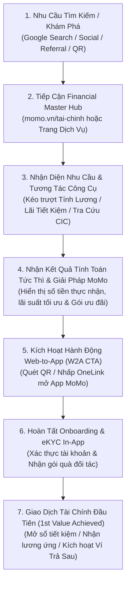

# BRD: Financial Master Hub (momo.vn/tai-chinh)

> - **Tên Dự Án:** Financial Master Hub (Cổng Khám Phá & Ra Quyết Định Dịch Vụ Tài Chính MoMo)
> - **Phân Khối Phụ Trách:** Growth Platform Division x Financial Services Division (CreditTech)
> - **Đội Ngũ Triển Khai:** Web Development Team, Backend Team, SEO & Content Team, Product Growth Team
> - **Phiên Bản:** v3.1 - Tháng 8/2026
> - **Trạng Thái:** Aligned & Production Ready (`momo.vn/tai-chinh`)

---

**MoMo Financial Master Hub:** Rút ngắn hành trình từ nhu cầu tìm kiếm đến quyết định sử dụng dịch vụ tài chính MoMo (Pre-install Discovery & Decision Gateway).

---

## 1. PHÁT BIỂU VẤN ĐỀ (PROBLEM STATEMENT)

1. **Người dùng không nhận diện được hệ sinh thái tài chính toàn diện của MoMo để giải quyết JTBD (Jobs-To-Be-Done):** Trước đây, các sản phẩm tài chính trên Web tồn tại dưới dạng 11 trang đích độc lập nằm rời rạc (`/tiet-kiem-online`, `/vay-nhanh`, `/vi-tra-sau`, `/the-tin-dung`...). Khi người dùng có nhu cầu tài chính tổng thể (như tính toán thu nhập ròng, tìm kênh tiết kiệm sinh lời, kiểm tra lịch sử tín dụng CIC để vay vốn, hay quản lý thuế), họ chỉ tiếp cận một trang đơn lẻ từ Google rồi rời đi, hoàn toàn không biết MoMo có đầy đủ giải pháp từ Tín Dụng, Tiết Kiệm, Đầu Tư đến Ngân Hàng.
2. **Khoảng cách lớn giữa Tra cứu thông tin và Kích hoạt giao dịch đầu tiên (Time-to-First-Value):** Người dùng bị đẩy quá nhanh sang bước tải app hoặc yêu cầu định danh (eKYC) phức tạp trong khi chưa được trải nghiệm giá trị cụ thể của sản phẩm trên Web, dẫn đến tỷ lệ bỏ cuộc (drop-off) cao sau khi cài đặt.
3. **Chưa khai thác tối đa dung lượng tìm kiếm toàn ngành 101.89 triệu lượt/tháng:** Nhu cầu tìm kiếm tài chính tại Việt Nam rất lớn nhưng phân tán. Thiếu một Cổng Trung Tâm (Master Hub) có năng lực kết nối chuyên đề để thâu tóm các từ khóa có lượng truy cập cao và chuyển đổi thành người dùng định danh.

---

## 2. GIẢ THUYẾT GIẢI PHÁP (SOLUTION HYPOTHESIS)

Nếu MoMo xây dựng **Financial Master Hub (`momo.vn/tai-chinh`)** làm cổng khám phá tập trung, bao phủ toàn diện 5 trụ cột dịch vụ tài chính (*Tín Dụng & Vay, Tiết Kiệm & Lãi Suất, Đầu Tư & Tích Sản, Ngân Hàng & Thẻ, Thu Nhập & Thuế*), đồng thời cung cấp **Bộ Công Cụ Tiện Ích Tương Tác Trực Tiếp (Interactive Tools & Calculators)** không cần đăng nhập cho từng bài toán thực tế:
* Người dùng sẽ tự nhận diện nhu cầu và trải nghiệm giá trị tính toán ngay lập tức trên Web (Instant Value).
* Hiểu rõ sản phẩm tài chính của MoMo giải quyết bài toán của mình như thế nào trước khi tải app.
* Tạo động lực rõ ràng để mở App, hoàn tất eKYC và kích hoạt Giao dịch Tài chính Đầu tiên (1st Financial Transaction).

---

## 3. MỤC TIÊU KINH DOANH (BUSINESS OBJECTIVES)

1. **Xây dựng Cổng Dịch Vụ Tài Chính Toàn Diện (Master Financial Gateway):** Thiết lập `momo.vn/tai-chinh` thành trung tâm điều hướng và thâu tóm nhu cầu tìm kiếm cho toàn bộ 5 khối dịch vụ tài chính (101.89M lượt tìm kiếm/tháng).
2. **Kiểm chứng giá trị của Pre-install Product Discovery & Interactive Tools:** Chứng minh việc cho người dùng tính toán và trải nghiệm công cụ trực quan trước cài đặt giúp rút ngắn thời gian tiếp cận giá trị (Time-to-First-Value) và tăng tỷ lệ kích hoạt tài chính in-app.
3. **Đánh chiếm dứt điểm các Quick Wins hàng đầu (P0):** Tận dụng thẩm quyền tên miền của MoMo (DR 78) để chiếm lĩnh Top 1-3 Google ở các mảng có rào cản kỹ thuật thấp và chênh lệch DR lớn: Tính Lương Gross-Net 2026, Quyết Toán Thuế TNCN, Tra cứu CIC/Điểm Tín Dụng, Tiết Kiệm Live và Cổng 34 Ngân Hàng.
4. **Hạ tầng Công cụ Tiện ích Dùng chung (Embeddable Widgets):** Chuẩn hóa các bộ công cụ tính toán để nhúng linh hoạt vào mọi điểm chạm trên toàn bộ Kênh Web MoMo.

---

## 4. MA TRẬN BỐI CẢNH (CONTEXT MATRIX)

| Phân Loại | Nội Dung Chi Tiết |
| :--- | :--- |
| **FACT (Sự Thật Hệ Thống)** | - MoMo là sản phẩm App-first; Web không thay thế App. - Trang Web <code style="background:#f1f5f9;padding:2px 4px;border-radius:4px;font-family:monospace;">momo.vn</code> không yêu cầu đăng nhập. - Người dùng bắt buộc phải hoàn tất định danh eKYC trên App MoMo trước khi đủ điều kiện mở sổ tiết kiệm, mở ví trả sau, vay tiêu dùng hoặc đầu tư chứng chỉ quỹ. |
| **OBSERVATION (Quan Sát Dữ Liệu)** | - Các trang sản phẩm độc lập trước đây chủ yếu thúc đẩy tải app nhanh nhưng thiếu bước giáo dục và trải nghiệm sản phẩm trước cài đặt, dẫn đến tỷ lệ drop-off lớn sau khi cài đặt/mở App. - Phần lớn nhu cầu tìm kiếm tài chính tập trung vào dạng tra cứu/công cụ tính toán (Tool Intent) thay vì đọc bài viết chữ đơn thuần. |
| **AVAILABLE SIGNALS (Tín Hiệu Có Sẵn)** | - Nguồn truy cập (Source / Referrer / UTM Campaign). - Chủ đề tìm kiếm (Search Query / Topic Cluster). - Dữ liệu người dùng tự nhập trên công cụ Web (Mức lương, Số tiền gửi, Số tiền vay, Nhóm nợ tín dụng). - Thiết bị và bối cảnh truy cập (Mobile vs Desktop). |
| **ASSUMPTION (Giả Định Cần Test)** | - Cung cấp công cụ tính toán miễn phí không cần đăng nhập (No-login Tool) trên Web sẽ tạo ra nhóm người dùng tải app có ý định sử dụng (Intent) và độ gắn kết sản phẩm cao hơn đáng kể so với việc chỉ hiển thị bài viết giới thiệu tĩnh. |

---

## 5. TỔNG QUAN SẢN PHẨM & CÁC TRỤ CỘT DỊCH VỤ (PRODUCT OVERVIEW)

### 5.1 Năm Trụ Cột Dịch Vụ Tài Chính Tại Financial Hub

Financial Hub quy hoạch toàn bộ giải pháp tài chính MoMo thành 5 khối nghiệp vụ chính:

1. **Khối Tín Dụng, Vay Vốn & Sức Khỏe Tín Dụng:**
   * *Dịch vụ:* Vay Tín Chấp (Vay Nhanh), Trả Góp (Ví Trả Sau), Vay Thế Chấp (Mua Nhà), Tra Cứu CIC, Điểm Tín Dụng, Xóa Nợ Xấu.
   * *Công cụ cốt lõi:* Máy tính lịch trả nợ giảm dần, Máy tính trả góp 0%, Widget tự đánh giá nhóm nợ 1-5.
2. **Khối Tiết Kiệm & Lãi Suất Ngân Hàng:**
   * *Dịch vụ:* Gửi Tiết Kiệm Online (Đối tác Bản Việt, VPBank), Bảng So Sánh Lãi Suất 30+ Ngân Hàng.
   * *Công cụ cốt lõi:* Hero Widget tính lãi đơn gửi 1 lần vs lãi kép gửi tích lũy định kỳ hàng tháng.
3. **Khối Đầu Tư, Chứng Khoán & Tích Sản:**
   * *Dịch vụ:* Giá Vàng SJC/9999 Realtime, Chứng Khoán, Cổ Phiếu, Chứng Chỉ Quỹ SIP từ 10.000đ, Trái Phiếu.
   * *Công cụ cốt lõi:* Bảng giá vàng & biểu đồ biến động lịch sử, Bộ giả lập lãi kép đầu tư Quỹ mở SIP.
4. **Khối Ngân Hàng & Thẻ Thanh Toán:**
   * *Dịch vụ:* Programmatic Hub 34 Ngân Hàng, Thẻ Tín Dụng Hoàn Tiền, Thẻ Visa/Mastercard, Napas 247, Thẻ Ghi Nợ ATM.
   * *Công cụ cốt lõi:* Ma trận so sánh quyền lợi & phí thường niên thẻ tín dụng, Cổng tra cứu Swift code/hotline 34 bank.
5. **Khối Tiện Ích Thu Nhập & Thuế:**
   * *Dịch vụ:* Tính Lương Gross - Net luật mới 2026, Quyết Toán Thuế TNCN Tự Động, Tỷ Giá Ngoại Tệ & Quy Đổi Live.
   * *Công cụ cốt lõi:* Máy tính Gross-Net 2026 kèm thanh trượt phân bổ 50/30/20, Bộ chuyển đổi ngoại tệ live.

### 5.2 Cơ Chế Hợp Nhất Hệ Sinh Thái & Bảo Toàn Thẩm Quyền SEO

Để bảo vệ 100% thứ hạng SEO và lượng truy cập hiện có của các trang sản phẩm độc lập (`/tiet-kiem-online`, `/vay-nhanh`, `/vi-tra-sau`, `/the-tin-dung`...), hệ thống giữ nguyên cấu trúc URL gốc và thực hiện hợp nhất trải nghiệm qua **3 Cơ Chế**:
* **Trang Cổng Trung Tâm (`momo.vn/tai-chinh`):** Đóng vai trò là mặt tiền tổng hợp Dashboard thị trường và điều hướng phân luồng theo đúng JTBD.
* **Thanh Điều Hướng Thống Nhất (Global Financial Navigation Bar):** Xuất hiện đồng bộ trên tất cả các trang sản phẩm, kết nối liền mạch 5 trụ cột dịch vụ.
* **Cơ Chế Bán Chéo Theo Ngữ Cảnh (Contextual Cross-Sell Engine):** Nhúng đề xuất giải pháp liên quan ngay sau khi người dùng nhận kết quả tính toán trên công cụ.

### 5.3 Sơ Đồ Luồng Trải Nghiệm Người Dùng (Visual User Flow)

### 5.4 Bảng Phân Tích Chi Tiết Các Bước Trải Nghiệm

<table style="width:100%; border-collapse:collapse; border:1.5px solid #64748b; margin:1em 0; font-size:0.85em;">
  <thead>
    <tr style="background-color:#f1f5f9;">
      <th style="border:1.5px solid #64748b; padding:6px; text-align:center; font-weight:700;">Bước</th>
      <th style="border:1.5px solid #64748b; padding:6px; text-align:left; font-weight:700;">Tên Giai Đoạn</th>
      <th style="border:1.5px solid #64748b; padding:6px; text-align:left; font-weight:700;">Trải Nghiệm Người Dùng (UX)</th>
      <th style="border:1.5px solid #64748b; padding:6px; text-align:left; font-weight:700;">Hạ Tầng / Cơ Chế Kỹ Thuật</th>
      <th style="border:1.5px solid #64748b; padding:6px; text-align:center; font-weight:700;">Nền Tảng</th>
    </tr>
  </thead>
  <tbody>
    <tr>
      <td style="border:1px solid #94a3b8; padding:6px; text-align:center;">1</td>
      <td style="border:1px solid #94a3b8; padding:6px;"><strong>Tìm Kiếm & Tiếp Cận</strong></td>
      <td style="border:1px solid #94a3b8; padding:6px;">Tìm kiếm từ khóa nhu cầu trên Google (ví dụ: "tính lương net", "lãi suất tiết kiệm cao nhất", "tra cứu cic") và click vào kết quả MoMo.</td>
      <td style="border:1px solid #94a3b8; padding:6px;">SEO Hub-and-Spoke, Schema Markup, Programmatic SEO.</td>
      <td style="border:1px solid #94a3b8; padding:6px; text-align:center;">Web</td>
    </tr>
    <tr style="background-color:#f8fafc;">
      <td style="border:1px solid #94a3b8; padding:6px; text-align:center;">2</td>
      <td style="border:1px solid #94a3b8; padding:6px;"><strong>Khám Phá & Tương Tác</strong></td>
      <td style="border:1px solid #94a3b8; padding:6px;">Sử dụng ngay các công cụ tính toán trực quan, kéo thanh trượt chọn số tiền/kỳ hạn mà không bị chặn bởi màn hình đăng nhập.</td>
      <td style="border:1px solid #94a3b8; padding:6px;">Client-side Javascript Widgets, Mobase Component System, Zero-Latency UI.</td>
      <td style="border:1px solid #94a3b8; padding:6px; text-align:center;">Web</td>
    </tr>
    <tr>
      <td style="border:1px solid #94a3b8; padding:6px; text-align:center;">3</td>
      <td style="border:1px solid #94a3b8; padding:6px;"><strong>Nhận Diện Giá Trị</strong></td>
      <td style="border:1px solid #94a3b8; padding:6px;">Xem kết quả chi tiết kèm đề xuất giải pháp tài chính MoMo phù hợp (lãi suất gửi tiết kiệm 7.0%, hạn mức Ví Trả Sau 20 triệu).</td>
      <td style="border:1px solid #94a3b8; padding:6px;">Dynamic Recommendation Engine, Dynamic CTA Rendering.</td>
      <td style="border:1px solid #94a3b8; padding:6px; text-align:center;">Web</td>
    </tr>
    <tr style="background-color:#f8fafc;">
      <td style="border:1px solid #94a3b8; padding:6px; text-align:center;">4</td>
      <td style="border:1px solid #94a3b8; padding:6px;"><strong>Chuyển Đổi Web-to-App</strong></td>
      <td style="border:1px solid #94a3b8; padding:6px;">Nhấp nút CTA hoặc quét mã QR để mở thẳng màn hình tính năng tương ứng trên App MoMo.</td>
      <td style="border:1px solid #94a3b8; padding:6px;">Appsflyer OneLink, Deep Linking, UTM Context Passing.</td>
      <td style="border:1px solid #94a3b8; padding:6px; text-align:center;">Web ➔ App</td>
    </tr>
    <tr>
      <td style="border:1px solid #94a3b8; padding:6px; text-align:center;">5</td>
      <td style="border:1px solid #94a3b8; padding:6px;"><strong>Kích Hoạt Giá Trị Đầu Tiên</strong></td>
      <td style="border:1px solid #94a3b8; padding:6px;">Hoàn tất eKYC và thực hiện giao dịch tài chính đầu tiên (mở sổ, rút tiền ứng, thanh toán hóa đơn).</td>
      <td style="border:1px solid #94a3b8; padding:6px;">In-App Onboarding Flow, Financial Partner Core Banking APIs.</td>
      <td style="border:1px solid #94a3b8; padding:6px; text-align:center;">App MoMo</td>
    </tr>
  </tbody>
</table>

---

## 6. ĐỐI SOÁT BENCHMARK QUỐC TẾ (REFERENCE & BENCHMARK)

* **NerdWallet & Bankrate (Hoa Kỳ):** Cổng tài chính hàng đầu chuyển đổi hàng triệu lượt tìm kiếm thành người dùng sản phẩm tài chính nhờ hệ thống **Interactive Calculators** và so sánh minh bạch theo từng bài toán của người dùng (Mua nhà, Mở thẻ, Gửi tiết kiệm).
* **Revolut (<18 & Products Hub):** Tiếp cận người dùng bằng định vị giải pháp theo từng phân khúc, giải thích rõ năng lực sản phẩm (Product Capabilities) trước khi dùng phần thưởng (Reward) để thúc đẩy hoàn tất cài đặt và định danh.

---

## 7. CƠ SỞ ĐẶT CƯỢC SẢN PHẨM (WHY BETTING ON THIS MVP)

* **`[HYPOTHESIS]`** Một phần lớn tỷ lệ drop-off sau cài đặt bắt nguồn từ việc người dùng chưa thấy đủ sự liên quan của sản phẩm (Product Relevance) trước khi phải đầu tư công sức vào quy trình eKYC phức tạp.
* **`[HYPOTHESIS]`** Xây dựng Financial Hub tập trung sẽ tạo sức mạnh liên kết chuyên đề (Topical Authority), giúp website MoMo vượt mặt các bài viết tĩnh của đối thủ và chiếm lĩnh Top 1-3 Google.
* **`[HYPOTHESIS]`** Việc triển khai công cụ tính toán không cần đăng nhập (No-login Client-side Tools) sẽ giữ chân người dùng lâu hơn gấp 3-5 lần (Dwell time) và thúc đẩy tỷ lệ nhấp chuyển đổi sang App có chủ đích cao hơn.
* **`[RECOMMENDATION]`** Tập trung toàn lực triển khai **4 Cụm Quick Win** (Tính Lương, Thuế TNCN, Tra cứu CIC, Tiết Kiệm Live, Programmatic 34 Bank) trong Sprint 1 & 2 để gặt hái kết quả tăng trưởng MAU ngay lập tức trước khi đầu tư hạ tầng Realtime phức tạp cho các Big Bet (Giá Vàng, Tỷ Giá).

---

## 8. KẾT QUẢ KỲ VỌNG & KHUNG CHỈ SỐ ĐO LƯỜNG (EXPECTED OUTCOME & TARGET METRICS)

<table style="width:100%; border-collapse:collapse; border:1.5px solid #64748b; margin:1em 0; font-size:0.85em;">
  <thead>
    <tr style="background-color:#f1f5f9;">
      <th style="border:1.5px solid #64748b; padding:6px; text-align:left; font-weight:700;">Tầng Chỉ Số</th>
      <th style="border:1.5px solid #64748b; padding:6px; text-align:left; font-weight:700;">Tên Chỉ Số Cốt Lõi</th>
      <th style="border:1.5px solid #64748b; padding:6px; text-align:center; font-weight:700;">Mục Tiêu Cam Kết (Targets)</th>
      <th style="border:1.5px solid #64748b; padding:6px; text-align:left; font-weight:700;">Ý Nghĩa Nghiệp Vụ & Đo Lường</th>
    </tr>
  </thead>
  <tbody>
    <tr>
      <td style="border:1px solid #94a3b8; padding:6px;"><strong>Kênh Web (Top-of-Funnel)</strong></td>
      <td style="border:1px solid #94a3b8; padding:6px;"><strong>Monthly Pageviews (MPV)</strong></td>
      <td style="border:1px solid #94a3b8; padding:6px; text-align:center;"><strong>≥ 1.000.000 lượt/tháng</strong></td>
      <td style="border:1px solid #94a3b8; padding:6px;">Quy mô truy cập toàn bộ hệ thống Financial Hub (<code style="background:#f1f5f9;padding:2px 4px;border-radius:4px;font-family:monospace;">momo.vn/tai-chinh</code> và các trang tiện ích liên quan).</td>
    </tr>
    <tr style="background-color:#f8fafc;">
      <td style="border:1px solid #94a3b8; padding:6px;"><strong>Kênh Web (Engagement)</strong></td>
      <td style="border:1px solid #94a3b8; padding:6px;"><strong>Utility Engagement Rate</strong></td>
      <td style="border:1px solid #94a3b8; padding:6px; text-align:center;"><strong>≥ 25% tổng session</strong></td>
      <td style="border:1px solid #94a3b8; padding:6px;">Tỷ lệ người dùng thực hiện tính toán trên các công cụ (Tính Lương, Thuế, Lãi Tiết Kiệm, CIC).</td>
    </tr>
    <tr>
      <td style="border:1px solid #94a3b8; padding:6px;"><strong>Kênh Web (Conversion)</strong></td>
      <td style="border:1px solid #94a3b8; padding:6px;"><strong>Web-to-App CTR</strong></td>
      <td style="border:1px solid #94a3b8; padding:6px; text-align:center;"><strong>15% - 25%</strong></td>
      <td style="border:1px solid #94a3b8; padding:6px;">Tỷ lệ người dùng nhấp nút CTA chuyển đổi mở App MoMo sau khi sử dụng công cụ.</td>
    </tr>
    <tr style="background-color:#f8fafc;">
      <td style="border:1px solid #94a3b8; padding:6px;"><strong>In-App (Downstream)</strong></td>
      <td style="border:1px solid #94a3b8; padding:6px;"><strong>Web-to-App Activated Users</strong></td>
      <td style="border:1px solid #94a3b8; padding:6px; text-align:center;"><strong>Tăng trưởng 30% MoM</strong></td>
      <td style="border:1px solid #94a3b8; padding:6px;">Số lượng người dùng mở App thành công và hoàn tất eKYC định danh qua liên kết Web.</td>
    </tr>
    <tr>
      <td style="border:1px solid #94a3b8; padding:6px;"><strong>In-App (Business Value)</strong></td>
      <td style="border:1px solid #94a3b8; padding:6px;"><strong>1st Financial Transactions</strong></td>
      <td style="border:1px solid #94a3b8; padding:6px; text-align:center;"><strong>Tăng trưởng 25% MoM</strong></td>
      <td style="border:1px solid #94a3b8; padding:6px;">Số lượng giao dịch tài chính đầu tiên được kích hoạt (Mở sổ tiết kiệm, Mở Ví Trả Sau, Vay Nhanh, Đầu tư Quỹ Mở).</td>
    </tr>
  </tbody>
</table>

---

## 9. MA TRẬN 24 DỊCH VỤ CREDITTECH & ĐỘ KHÓ ĐÁNH CHIẾM

Tổng hợp toàn bộ 24 thị trường dịch vụ của Phân khối CreditTech (đã khử trùng lặp và tính điểm theo 8 tiêu chí chuẩn):

<table style="width:100%; border-collapse:collapse; border:1.5px solid #64748b; margin:1em 0; font-size:0.82em;">
  <thead>
    <tr style="background-color:#f1f5f9;">
      <th style="border:1.5px solid #64748b; padding:6px; text-align:center; font-weight:700;">STT</th>
      <th style="border:1.5px solid #64748b; padding:6px; text-align:left; font-weight:700;">Thị Trường / Dịch Vụ</th>
      <th style="border:1.5px solid #64748b; padding:6px; text-align:left; font-weight:700;">Khối Nghiệp Vụ</th>
      <th style="border:1.5px solid #64748b; padding:6px; text-align:right; font-weight:700;">Search Volume / Tháng</th>
      <th style="border:1.5px solid #64748b; padding:6px; text-align:center; font-weight:700;">Độ Khó (1-10)</th>
      <th style="border:1.5px solid #64748b; padding:6px; text-align:center; font-weight:700;">Xếp Loại Độ Khó</th>
      <th style="border:1.5px solid #64748b; padding:6px; text-align:center; font-weight:700;">Điểm QW Index</th>
      <th style="border:1.5px solid #64748b; padding:6px; text-align:center; font-weight:700;">Phân Nhóm Chiến Lược</th>
      <th style="border:1.5px solid #64748b; padding:6px; text-align:center; font-weight:700;">Mức Độ Ưu Tiên</th>
    </tr>
  </thead>
  <tbody>
    <tr>
      <td style="border:1px solid #94a3b8; padding:5px; text-align:center;">1</td>
      <td style="border:1px solid #94a3b8; padding:5px;"><strong>Giá Vàng</strong></td>
      <td style="border:1px solid #94a3b8; padding:5px;">Đầu Tư & Tích Sản</td>
      <td style="border:1px solid #94a3b8; padding:5px; text-align:right;"><strong>78,879,270</strong></td>
      <td style="border:1px solid #94a3b8; padding:5px; text-align:center;">7.95</td>
      <td style="border:1px solid #94a3b8; padding:5px; text-align:center;">Rất Khó</td>
      <td style="border:1px solid #94a3b8; padding:5px; text-align:center;">10.6</td>
      <td style="border:1px solid #94a3b8; padding:5px; text-align:center;">Big Bet</td>
      <td style="border:1px solid #94a3b8; padding:5px; text-align:center;">P1</td>
    </tr>
    <tr style="background-color:#f8fafc;">
      <td style="border:1px solid #94a3b8; padding:5px; text-align:center;">2</td>
      <td style="border:1px solid #94a3b8; padding:5px;"><strong>Tỷ Giá</strong></td>
      <td style="border:1px solid #94a3b8; padding:5px;">Tiền Tệ & Ngoại Hối</td>
      <td style="border:1px solid #94a3b8; padding:5px; text-align:right;"><strong>8,516,910</strong></td>
      <td style="border:1px solid #94a3b8; padding:5px; text-align:center;">7.65</td>
      <td style="border:1px solid #94a3b8; padding:5px; text-align:center;">Rất Khó</td>
      <td style="border:1px solid #94a3b8; padding:5px; text-align:center;">10.3</td>
      <td style="border:1px solid #94a3b8; padding:5px; text-align:center;">Big Bet</td>
      <td style="border:1px solid #94a3b8; padding:5px; text-align:center;">P1</td>
    </tr>
    <tr>
      <td style="border:1px solid #94a3b8; padding:5px; text-align:center;">3</td>
      <td style="border:1px solid #94a3b8; padding:5px;"><strong>Ngân Hàng</strong></td>
      <td style="border:1px solid #94a3b8; padding:5px;">Ngân Hàng & Thẻ</td>
      <td style="border:1px solid #94a3b8; padding:5px; text-align:right;"><strong>6,629,420</strong></td>
      <td style="border:1px solid #94a3b8; padding:5px; text-align:center;">6.08</td>
      <td style="border:1px solid #94a3b8; padding:5px; text-align:center;">Trung Bình</td>
      <td style="border:1px solid #94a3b8; padding:5px; text-align:center;">14.8</td>
      <td style="border:1px solid #94a3b8; padding:5px; text-align:center;">Big Bet (Programmatic)</td>
      <td style="border:1px solid #94a3b8; padding:5px; text-align:center;">P1</td>
    </tr>
    <tr style="background-color:#f8fafc;">
      <td style="border:1px solid #94a3b8; padding:5px; text-align:center;">4</td>
      <td style="border:1px solid #94a3b8; padding:5px;"><strong>Chứng Khoán</strong></td>
      <td style="border:1px solid #94a3b8; padding:5px;">Đầu Tư & Tích Sản</td>
      <td style="border:1px solid #94a3b8; padding:5px; text-align:right;"><strong>3,026,340</strong></td>
      <td style="border:1px solid #94a3b8; padding:5px; text-align:center;">7.28</td>
      <td style="border:1px solid #94a3b8; padding:5px; text-align:center;">Khó</td>
      <td style="border:1px solid #94a3b8; padding:5px; text-align:center;">11.8</td>
      <td style="border:1px solid #94a3b8; padding:5px; text-align:center;">Big Bet</td>
      <td style="border:1px solid #94a3b8; padding:5px; text-align:center;">P1</td>
    </tr>
    <tr>
      <td style="border:1px solid #94a3b8; padding:5px; text-align:center;">5</td>
      <td style="border:1px solid #94a3b8; padding:5px;"><strong>Lãi Suất</strong></td>
      <td style="border:1px solid #94a3b8; padding:5px;">Tiết Kiệm & Lãi Suất</td>
      <td style="border:1px solid #94a3b8; padding:5px; text-align:right;"><strong>1,246,620</strong></td>
      <td style="border:1px solid #94a3b8; padding:5px; text-align:center;">6.78</td>
      <td style="border:1px solid #94a3b8; padding:5px; text-align:center;">Khó</td>
      <td style="border:1px solid #94a3b8; padding:5px; text-align:center;">12.7</td>
      <td style="border:1px solid #94a3b8; padding:5px; text-align:center;">Big Bet</td>
      <td style="border:1px solid #94a3b8; padding:5px; text-align:center;">P1</td>
    </tr>
    <tr style="background-color:#eff6ff;">
      <td style="border:1px solid #94a3b8; padding:5px; text-align:center;">6</td>
      <td style="border:1px solid #94a3b8; padding:5px;"><strong>Thuế (TNCN)</strong></td>
      <td style="border:1px solid #94a3b8; padding:5px;">Thu Nhập & Thuế</td>
      <td style="border:1px solid #94a3b8; padding:5px; text-align:right;"><strong>1,159,450</strong></td>
      <td style="border:1px solid #94a3b8; padding:5px; text-align:center;">5.80</td>
      <td style="border:1px solid #94a3b8; padding:5px; text-align:center;">Trung Bình</td>
      <td style="border:1px solid #94a3b8; padding:5px; text-align:center; font-weight:700; color:#1e40af;">13.8</td>
      <td style="border:1px solid #94a3b8; padding:5px; text-align:center; font-weight:700; color:#15803d;">High-Impact Quick Win</td>
      <td style="border:1px solid #94a3b8; padding:5px; text-align:center; font-weight:700; color:#b91c1c;">P0</td>
    </tr>
    <tr style="background-color:#f8fafc;">
      <td style="border:1px solid #94a3b8; padding:5px; text-align:center;">7</td>
      <td style="border:1px solid #94a3b8; padding:5px;"><strong>Cổ Phiếu</strong></td>
      <td style="border:1px solid #94a3b8; padding:5px;">Đầu Tư & Tích Sản</td>
      <td style="border:1px solid #94a3b8; padding:5px; text-align:right;"><strong>1,077,540</strong></td>
      <td style="border:1px solid #94a3b8; padding:5px; text-align:center;">7.13</td>
      <td style="border:1px solid #94a3b8; padding:5px; text-align:center;">Khó</td>
      <td style="border:1px solid #94a3b8; padding:5px; text-align:center;">11.2</td>
      <td style="border:1px solid #94a3b8; padding:5px; text-align:center;">Big Bet</td>
      <td style="border:1px solid #94a3b8; padding:5px; text-align:center;">P1</td>
    </tr>
    <tr>
      <td style="border:1px solid #94a3b8; padding:5px; text-align:center;">8</td>
      <td style="border:1px solid #94a3b8; padding:5px;"><strong>Ngoại Tệ</strong></td>
      <td style="border:1px solid #94a3b8; padding:5px;">Tiền Tệ & Ngoại Hối</td>
      <td style="border:1px solid #94a3b8; padding:5px; text-align:right;"><strong>959,340</strong></td>
      <td style="border:1px solid #94a3b8; padding:5px; text-align:center;">6.33</td>
      <td style="border:1px solid #94a3b8; padding:5px; text-align:center;">Khó</td>
      <td style="border:1px solid #94a3b8; padding:5px; text-align:center;">11.1</td>
      <td style="border:1px solid #94a3b8; padding:5px; text-align:center;">Standard Feature</td>
      <td style="border:1px solid #94a3b8; padding:5px; text-align:center;">P2</td>
    </tr>
    <tr style="background-color:#f8fafc;">
      <td style="border:1px solid #94a3b8; padding:5px; text-align:center;">9</td>
      <td style="border:1px solid #94a3b8; padding:5px;"><strong>Crypto</strong></td>
      <td style="border:1px solid #94a3b8; padding:5px;">Tài Sản Số</td>
      <td style="border:1px solid #94a3b8; padding:5px; text-align:right;"><strong>469,420</strong></td>
      <td style="border:1px solid #94a3b8; padding:5px; text-align:center;">5.90</td>
      <td style="border:1px solid #94a3b8; padding:5px; text-align:center;">Trung Bình</td>
      <td style="border:1px solid #94a3b8; padding:5px; text-align:center;">6.4</td>
      <td style="border:1px solid #94a3b8; padding:5px; text-align:center;">Low Priority</td>
      <td style="border:1px solid #94a3b8; padding:5px; text-align:center;">P2</td>
    </tr>
    <tr>
      <td style="border:1px solid #94a3b8; padding:5px; text-align:center;">10</td>
      <td style="border:1px solid #94a3b8; padding:5px;"><strong>Thẻ Tín Dụng</strong></td>
      <td style="border:1px solid #94a3b8; padding:5px;">Ngân Hàng & Thẻ</td>
      <td style="border:1px solid #94a3b8; padding:5px; text-align:right;"><strong>394,590</strong></td>
      <td style="border:1px solid #94a3b8; padding:5px; text-align:center;">6.38</td>
      <td style="border:1px solid #94a3b8; padding:5px; text-align:center;">Khó</td>
      <td style="border:1px solid #94a3b8; padding:5px; text-align:center;">12.9</td>
      <td style="border:1px solid #94a3b8; padding:5px; text-align:center;">Big Bet</td>
      <td style="border:1px solid #94a3b8; padding:5px; text-align:center;">P1</td>
    </tr>
    <tr style="background-color:#f8fafc;">
      <td style="border:1px solid #94a3b8; padding:5px; text-align:center;">11</td>
      <td style="border:1px solid #94a3b8; padding:5px;"><strong>Vay Tín Chấp</strong></td>
      <td style="border:1px solid #94a3b8; padding:5px;">Tín Dụng & Vay Vốn</td>
      <td style="border:1px solid #94a3b8; padding:5px; text-align:right;"><strong>389,820</strong></td>
      <td style="border:1px solid #94a3b8; padding:5px; text-align:center;">6.65</td>
      <td style="border:1px solid #94a3b8; padding:5px; text-align:center;">Khó</td>
      <td style="border:1px solid #94a3b8; padding:5px; text-align:center;">12.3</td>
      <td style="border:1px solid #94a3b8; padding:5px; text-align:center;">Big Bet</td>
      <td style="border:1px solid #94a3b8; padding:5px; text-align:center;">P1</td>
    </tr>
    <tr>
      <td style="border:1px solid #94a3b8; padding:5px; text-align:center;">12</td>
      <td style="border:1px solid #94a3b8; padding:5px;"><strong>Thẻ Visa</strong></td>
      <td style="border:1px solid #94a3b8; padding:5px;">Ngân Hàng & Thẻ</td>
      <td style="border:1px solid #94a3b8; padding:5px; text-align:right;"><strong>243,110</strong></td>
      <td style="border:1px solid #94a3b8; padding:5px; text-align:center;">5.27</td>
      <td style="border:1px solid #94a3b8; padding:5px; text-align:center;">Trung Bình</td>
      <td style="border:1px solid #94a3b8; padding:5px; text-align:center;">13.5</td>
      <td style="border:1px solid #94a3b8; padding:5px; text-align:center;">Core Driver</td>
      <td style="border:1px solid #94a3b8; padding:5px; text-align:center;">P1</td>
    </tr>
    <tr style="background-color:#eff6ff;">
      <td style="border:1px solid #94a3b8; padding:5px; text-align:center;">13</td>
      <td style="border:1px solid #94a3b8; padding:5px;"><strong>Gửi Tiết Kiệm</strong></td>
      <td style="border:1px solid #94a3b8; padding:5px;">Tiết Kiệm & Lãi Suất</td>
      <td style="border:1px solid #94a3b8; padding:5px; text-align:right;"><strong>230,110</strong></td>
      <td style="border:1px solid #94a3b8; padding:5px; text-align:center;">5.67</td>
      <td style="border:1px solid #94a3b8; padding:5px; text-align:center;">Trung Bình</td>
      <td style="border:1px solid #94a3b8; padding:5px; text-align:center; font-weight:700; color:#1e40af;">14.5</td>
      <td style="border:1px solid #94a3b8; padding:5px; text-align:center; font-weight:700; color:#15803d;">High-Impact Quick Win</td>
      <td style="border:1px solid #94a3b8; padding:5px; text-align:center; font-weight:700; color:#b91c1c;">P0</td>
    </tr>
    <tr style="background-color:#eff6ff;">
      <td style="border:1px solid #94a3b8; padding:5px; text-align:center;">14</td>
      <td style="border:1px solid #94a3b8; padding:5px;"><strong>Tính Lương</strong></td>
      <td style="border:1px solid #94a3b8; padding:5px;">Thu Nhập & Thuế</td>
      <td style="border:1px solid #94a3b8; padding:5px; text-align:right;"><strong>190,690</strong></td>
      <td style="border:1px solid #94a3b8; padding:5px; text-align:center;">5.13</td>
      <td style="border:1px solid #94a3b8; padding:5px; text-align:center;">Trung Bình</td>
      <td style="border:1px solid #94a3b8; padding:5px; text-align:center; font-weight:700; color:#1e40af;">13.1</td>
      <td style="border:1px solid #94a3b8; padding:5px; text-align:center; font-weight:700; color:#15803d;">Top Quick Win</td>
      <td style="border:1px solid #94a3b8; padding:5px; text-align:center; font-weight:700; color:#b91c1c;">P0</td>
    </tr>
    <tr>
      <td style="border:1px solid #94a3b8; padding:5px; text-align:center;">15</td>
      <td style="border:1px solid #94a3b8; padding:5px;"><strong>Vay Thế Chấp</strong></td>
      <td style="border:1px solid #94a3b8; padding:5px;">Tín Dụng & Vay Vốn</td>
      <td style="border:1px solid #94a3b8; padding:5px; text-align:right;"><strong>125,960</strong></td>
      <td style="border:1px solid #94a3b8; padding:5px; text-align:center;">6.00</td>
      <td style="border:1px solid #94a3b8; padding:5px; text-align:center;">Trung Bình</td>
      <td style="border:1px solid #94a3b8; padding:5px; text-align:center;">11.2</td>
      <td style="border:1px solid #94a3b8; padding:5px; text-align:center;">Core Driver</td>
      <td style="border:1px solid #94a3b8; padding:5px; text-align:center;">P1</td>
    </tr>
    <tr style="background-color:#eff6ff;">
      <td style="border:1px solid #94a3b8; padding:5px; text-align:center;">16</td>
      <td style="border:1px solid #94a3b8; padding:5px;"><strong>Trả Góp</strong></td>
      <td style="border:1px solid #94a3b8; padding:5px;">Tín Dụng & Vay Vốn</td>
      <td style="border:1px solid #94a3b8; padding:5px; text-align:right;"><strong>116,390</strong></td>
      <td style="border:1px solid #94a3b8; padding:5px; text-align:center;">5.23</td>
      <td style="border:1px solid #94a3b8; padding:5px; text-align:center;">Trung Bình</td>
      <td style="border:1px solid #94a3b8; padding:5px; text-align:center; font-weight:700; color:#1e40af;">13.8</td>
      <td style="border:1px solid #94a3b8; padding:5px; text-align:center; font-weight:700; color:#15803d;">Top Quick Win</td>
      <td style="border:1px solid #94a3b8; padding:5px; text-align:center; font-weight:700; color:#b91c1c;">P0</td>
    </tr>
    <tr style="background-color:#f8fafc;">
      <td style="border:1px solid #94a3b8; padding:5px; text-align:center;">17</td>
      <td style="border:1px solid #94a3b8; padding:5px;"><strong>Tiền Số & Tiền Ảo</strong></td>
      <td style="border:1px solid #94a3b8; padding:5px;">Tài Sản Số</td>
      <td style="border:1px solid #94a3b8; padding:5px; text-align:right;"><strong>104,500</strong></td>
      <td style="border:1px solid #94a3b8; padding:5px; text-align:center;">5.03</td>
      <td style="border:1px solid #94a3b8; padding:5px; text-align:center;">Trung Bình</td>
      <td style="border:1px solid #94a3b8; padding:5px; text-align:center;">6.0</td>
      <td style="border:1px solid #94a3b8; padding:5px; text-align:center;">Low Priority</td>
      <td style="border:1px solid #94a3b8; padding:5px; text-align:center;">P2</td>
    </tr>
    <tr style="background-color:#eff6ff;">
      <td style="border:1px solid #94a3b8; padding:5px; text-align:center;">18</td>
      <td style="border:1px solid #94a3b8; padding:5px;"><strong>CIC (Điểm tín dụng)</strong></td>
      <td style="border:1px solid #94a3b8; padding:5px;">Tín Dụng & Vay Vốn</td>
      <td style="border:1px solid #94a3b8; padding:5px; text-align:right;"><strong>339,000</strong></td>
      <td style="border:1px solid #94a3b8; padding:5px; text-align:center;">4.65</td>
      <td style="border:1px solid #94a3b8; padding:5px; text-align:center; font-weight:700; color:#15803d;">Dễ (Low)</td>
      <td style="border:1px solid #94a3b8; padding:5px; text-align:center; font-weight:700; color:#1e40af;">14.6</td>
      <td style="border:1px solid #94a3b8; padding:5px; text-align:center; font-weight:700; color:#15803d;">Top Quick Win</td>
      <td style="border:1px solid #94a3b8; padding:5px; text-align:center; font-weight:700; color:#b91c1c;">P0</td>
    </tr>
    <tr>
      <td style="border:1px solid #94a3b8; padding:5px; text-align:center;">19</td>
      <td style="border:1px solid #94a3b8; padding:5px;"><strong>Trái Phiếu</strong></td>
      <td style="border:1px solid #94a3b8; padding:5px;">Đầu Tư & Tích Sản</td>
      <td style="border:1px solid #94a3b8; padding:5px; text-align:right;"><strong>79,580</strong></td>
      <td style="border:1px solid #94a3b8; padding:5px; text-align:center;">5.65</td>
      <td style="border:1px solid #94a3b8; padding:5px; text-align:center;">Trung Bình</td>
      <td style="border:1px solid #94a3b8; padding:5px; text-align:center;">9.0</td>
      <td style="border:1px solid #94a3b8; padding:5px; text-align:center;">Standard Feature</td>
      <td style="border:1px solid #94a3b8; padding:5px; text-align:center;">P2</td>
    </tr>
    <tr style="background-color:#eff6ff;">
      <td style="border:1px solid #94a3b8; padding:5px; text-align:center;">20</td>
      <td style="border:1px solid #94a3b8; padding:5px;"><strong>Thẻ Ghi Nợ (ATM)</strong></td>
      <td style="border:1px solid #94a3b8; padding:5px;">Ngân Hàng & Thẻ</td>
      <td style="border:1px solid #94a3b8; padding:5px; text-align:right;"><strong>73,290</strong></td>
      <td style="border:1px solid #94a3b8; padding:5px; text-align:center;">4.50</td>
      <td style="border:1px solid #94a3b8; padding:5px; text-align:center; font-weight:700; color:#15803d;">Dễ (Low)</td>
      <td style="border:1px solid #94a3b8; padding:5px; text-align:center; font-weight:700; color:#1e40af;">13.8</td>
      <td style="border:1px solid #94a3b8; padding:5px; text-align:center; font-weight:700; color:#15803d;">Top Quick Win</td>
      <td style="border:1px solid #94a3b8; padding:5px; text-align:center; font-weight:700; color:#b91c1c;">P0</td>
    </tr>
    <tr style="background-color:#eff6ff;">
      <td style="border:1px solid #94a3b8; padding:5px; text-align:center;">21</td>
      <td style="border:1px solid #94a3b8; padding:5px;"><strong>Nợ Xấu</strong></td>
      <td style="border:1px solid #94a3b8; padding:5px;">Tín Dụng & Vay Vốn</td>
      <td style="border:1px solid #94a3b8; padding:5px; text-align:right;"><strong>59,890</strong></td>
      <td style="border:1px solid #94a3b8; padding:5px; text-align:center;">4.90</td>
      <td style="border:1px solid #94a3b8; padding:5px; text-align:center; font-weight:700; color:#15803d;">Dễ (Low)</td>
      <td style="border:1px solid #94a3b8; padding:5px; text-align:center; font-weight:700; color:#1e40af;">12.7</td>
      <td style="border:1px solid #94a3b8; padding:5px; text-align:center; font-weight:700; color:#15803d;">Top Quick Win</td>
      <td style="border:1px solid #94a3b8; padding:5px; text-align:center; font-weight:700; color:#b91c1c;">P0</td>
    </tr>
    <tr style="background-color:#eff6ff;">
      <td style="border:1px solid #94a3b8; padding:5px; text-align:center;">22</td>
      <td style="border:1px solid #94a3b8; padding:5px;"><strong>Napas</strong></td>
      <td style="border:1px solid #94a3b8; padding:5px;">Ngân Hàng & Thẻ</td>
      <td style="border:1px solid #94a3b8; padding:5px; text-align:right;"><strong>51,100</strong></td>
      <td style="border:1px solid #94a3b8; padding:5px; text-align:center;">4.33</td>
      <td style="border:1px solid #94a3b8; padding:5px; text-align:center; font-weight:700; color:#15803d;">Dễ (Low)</td>
      <td style="border:1px solid #94a3b8; padding:5px; text-align:center; font-weight:700; color:#1e40af;">14.3</td>
      <td style="border:1px solid #94a3b8; padding:5px; text-align:center; font-weight:700; color:#15803d;">Top Quick Win</td>
      <td style="border:1px solid #94a3b8; padding:5px; text-align:center; font-weight:700; color:#b91c1c;">P0</td>
    </tr>
    <tr style="background-color:#eff6ff;">
      <td style="border:1px solid #94a3b8; padding:5px; text-align:center;">23</td>
      <td style="border:1px solid #94a3b8; padding:5px;"><strong>Chứng Chỉ Quỹ</strong></td>
      <td style="border:1px solid #94a3b8; padding:5px;">Đầu Tư & Tích Sản</td>
      <td style="border:1px solid #94a3b8; padding:5px; text-align:right;"><strong>25,790</strong></td>
      <td style="border:1px solid #94a3b8; padding:5px; text-align:center;">5.00</td>
      <td style="border:1px solid #94a3b8; padding:5px; text-align:center;">Trung Bình</td>
      <td style="border:1px solid #94a3b8; padding:5px; text-align:center; font-weight:700; color:#1e40af;">12.6</td>
      <td style="border:1px solid #94a3b8; padding:5px; text-align:center; font-weight:700; color:#15803d;">Top Quick Win</td>
      <td style="border:1px solid #94a3b8; padding:5px; text-align:center; font-weight:700; color:#b91c1c;">P0</td>
    </tr>
    <tr>
      <td style="border:1px solid #94a3b8; padding:5px; text-align:center;">24</td>
      <td style="border:1px solid #94a3b8; padding:5px;"><strong>Mastercard</strong></td>
      <td style="border:1px solid #94a3b8; padding:5px;">Ngân Hàng & Thẻ</td>
      <td style="border:1px solid #94a3b8; padding:5px; text-align:right;"><strong>18,630</strong></td>
      <td style="border:1px solid #94a3b8; padding:5px; text-align:center;">4.85</td>
      <td style="border:1px solid #94a3b8; padding:5px; text-align:center; font-weight:700; color:#15803d;">Dễ (Low)</td>
      <td style="border:1px solid #94a3b8; padding:5px; text-align:center;">10.9</td>
      <td style="border:1px solid #94a3b8; padding:5px; text-align:center;">Core Driver</td>
      <td style="border:1px solid #94a3b8; padding:5px; text-align:center;">P1</td>
    </tr>
    <tr style="background-color:#f1f5f9; font-weight:700;">
      <td style="border:1.5px solid #64748b; padding:6px; text-align:center;" colspan="3">TỔNG CREDITTECH (DEDUPLICATED)</td>
      <td style="border:1.5px solid #64748b; padding:6px; text-align:right;"><strong>102,140,030</strong></td>
      <td style="border:1.5px solid #64748b; padding:6px; text-align:center;">—</td>
      <td style="border:1.5px solid #64748b; padding:6px; text-align:center;">—</td>
      <td style="border:1.5px solid #64748b; padding:6px; text-align:center;">—</td>
      <td style="border:1.5px solid #64748b; padding:6px; text-align:center;">58,164 Unique Keywords</td>
      <td style="border:1.5px solid #64748b; padding:6px; text-align:center;">Master SSOT</td>
    </tr>
  </tbody>
</table>

---

## 10. LỘ TRÌNH TRIỂN KHAI TOÀN DIỆN CÁC DỰ ÁN FINANCIAL HUB (THỰC TẾ TRIỂN KHAI)

<table style="width:100%; border-collapse:collapse; border:1.5px solid #64748b; margin:1em 0; font-size:0.85em;">
  <thead>
    <tr style="background-color:#f1f5f9;">
      <th style="border:1.5px solid #64748b; padding:6px; text-align:center; font-weight:700;">Giai Đoạn (Phase)</th>
      <th style="border:1.5px solid #64748b; padding:6px; text-align:center; font-weight:700;">Thời Gian</th>
      <th style="border:1.5px solid #64748b; padding:6px; text-align:left; font-weight:700;">Tên Dự Án / Module Trọng Tâm</th>
      <th style="border:1.5px solid #64748b; padding:6px; text-align:left; font-weight:700;">Chi Tiết Triển Khai & Nhiệm Vụ Kỹ Thuật</th>
      <th style="border:1.5px solid #64748b; padding:6px; text-align:center; font-weight:700;">Trạng Thái</th>
    </tr>
  </thead>
  <tbody>
    <!-- PHASE 1 - THÁNG 8/2026 -->
    <tr style="background-color:#f0fdf4;">
      <td style="border:1px solid #94a3b8; padding:6px; text-align:center; font-weight:700;" rowspan="4"><strong>Phase 1</strong></td>
      <td style="border:1px solid #94a3b8; padding:6px; text-align:center;">Tháng 8/2026</td>
      <td style="border:1px solid #94a3b8; padding:6px;"><strong>Dự Án 1: Master Financial Hub</strong></td>
      <td style="border:1px solid #94a3b8; padding:6px;">Xây dựng trang cổng trung tâm, thiết kế Mega Menu 5 nhóm nhu cầu tài chính, thanh Trợ thủ đồng hành và các thẻ điều hướng sản phẩm.</td>
      <td style="border:1px solid #94a3b8; padding:6px; text-align:center; font-weight:700; color:#15803d; background-color:#dcfce7;">Done</td>
    </tr>
    <tr style="background-color:#f0fdf4;">
      <td style="border:1px solid #94a3b8; padding:6px; text-align:center;">Tháng 8/2026</td>
      <td style="border:1px solid #94a3b8; padding:6px;"><strong>Dự Án 2: CIC, Tiết Kiệm</strong></td>
      <td style="border:1px solid #94a3b8; padding:6px;">Công cụ CIC Simulator và Nợ Xấu. Công cụ tiết lãi suất tiết kiệm cho TKO</td>
      <td style="border:1px solid #94a3b8; padding:6px; text-align:center; font-weight:700; color:#15803d; background-color:#dcfce7;">Done</td>
    </tr>
    <tr style="background-color:#fefce8;">
      <td style="border:1px solid #94a3b8; padding:6px; text-align:center;">Tháng 8/2026</td>
      <td style="border:1px solid #94a3b8; padding:6px;"><strong>Dự Án 3: Content Strategy & Blog Tài Chính</strong></td>
      <td style="border:1px solid #94a3b8; padding:6px;">Thiết lập quy trình tự động hóa xuất bản cẩm nang tài chính bằng AI độc lập trên MoSpark</td>
      <td style="border:1px solid #94a3b8; padding:6px; text-align:center; font-weight:700; color:#b45309; background-color:#fef9c3;">In Progress</td>
    </tr>
    <tr style="background-color:#f0fdf4;">
      <td style="border:1px solid #94a3b8; padding:6px; text-align:center;">Tháng 8/2026</td>
      <td style="border:1px solid #94a3b8; padding:6px;"><strong>Dự Án 4: Tra Cứu Giá Vàng Realtime</strong></td>
      <td style="border:1px solid #94a3b8; padding:6px;">Xây dựng bảng giá vàng realtime (SJC, PNJ, DOJI, 24K, 9999, Nhẫn trơn), biểu đồ lịch sử 7-30 ngày</td>
      <td style="border:1px solid #94a3b8; padding:6px; text-align:center; font-weight:700; color:#15803d; background-color:#dcfce7;">Done</td>
    </tr>
    <!-- PHASE 1 - THÁNG 9/2026 -->
    <tr style="background-color:#fefce8;">
      <td style="border:1px solid #94a3b8; padding:6px; text-align:center; font-weight:700;" rowspan="3"><strong>Phase 1</strong></td>
      <td style="border:1px solid #94a3b8; padding:6px; text-align:center;">Tháng 9/2026</td>
      <td style="border:1px solid #94a3b8; padding:6px;"><strong>Dự Án 5: Tính Lương & Thuế TNCN 2026</strong></td>
      <td style="border:1px solid #94a3b8; padding:6px;">Bộ công cụ tính lương Gross - Net (áp dụng luật thuế mới 2026) và cẩm nang tự quyết toán/hoàn thuế TNCN.</td>
      <td style="border:1px solid #94a3b8; padding:6px; text-align:center; font-weight:700; color:#b45309; background-color:#fef9c3;">In Progress</td>
    </tr>
    <tr style="background-color:#fefce8;">
      <td style="border:1px solid #94a3b8; padding:6px; text-align:center;">Tháng 9/2026</td>
      <td style="border:1px solid #94a3b8; padding:6px;"><strong>Dự Án 7: Bộ Quy Đổi Ngoại Tệ & Tỷ Giá</strong></td>
      <td style="border:1px solid #94a3b8; padding:6px;">Trang Cổng Master /ty-gia và Hệ thống Programmatic Subpages theo từng cặp tiền (/tai-chinh/ty-gia/[pair-slug]: USD/VND, JPY/VND, EUR/VND, KRW/VND, CNY/VND, GBP/VND...) kèm biểu đồ biến động lịch sử và so sánh tỷ giá đa ngân hàng.</td>
      <td style="border:1px solid #94a3b8; padding:6px; text-align:center; font-weight:700; color:#b45309; background-color:#fef9c3;">In Progress</td>
    </tr>
    <tr style="background-color:#eff6ff;">
      <td style="border:1px solid #94a3b8; padding:6px; text-align:center;">Tháng 9/2026</td>
      <td style="border:1px solid #94a3b8; padding:6px;"><strong>Dự Án 8: Thực Tập Sinh Đầu Tư (Chứng Khoán)</strong></td>
      <td style="border:1px solid #94a3b8; padding:6px;">Công cụ tra cứu, hướng dẫn và giả lập Đầu Tư Chứng Khoán</td>
      <td style="border:1px solid #94a3b8; padding:6px; text-align:center; font-weight:700; color:#1d4ed8; background-color:#dbeafe;">Planned</td>
    </tr>
    <!-- PHASE 2 - THÁNG 10/2026 -->
    <tr style="background-color:#f8fafc;">
      <td style="border:1px solid #94a3b8; padding:6px; text-align:center; font-weight:700;" rowspan="2"><strong>Phase 2</strong></td>
      <td style="border:1px solid #94a3b8; padding:6px; text-align:center;">Tháng 10/2026</td>
      <td style="border:1px solid #94a3b8; padding:6px;"><strong>Dự Án 9: Bổ sung các công cụ tính toán tài chính</strong></td>
      <td style="border:1px solid #94a3b8; padding:6px;">Công cụ 'Có Tiền Đầu Tư Gì?' phân bổ tài sản Lump Sum (An toàn, Tăng trưởng, Mạo hiểm), Bộ giả lập Lãi kép tích lũy SIP và FIRE.</td>
      <td style="border:1px solid #94a3b8; padding:6px; text-align:center; font-weight:700; color:#1d4ed8; background-color:#dbeafe;">Planned</td>
    </tr>
    <tr style="background-color:#f8fafc;">
      <td style="border:1px solid #94a3b8; padding:6px; text-align:center;">Tháng 10/2026</td>
      <td style="border:1px solid #94a3b8; padding:6px;"><strong>Dự Án 9: Trung Tâm Đầu Tư & Tích Sản FIRE</strong></td>
      <td style="border:1px solid #94a3b8; padding:6px;">Công cụ 'Có Tiền Đầu Tư Gì?' phân bổ tài sản Lump Sum (An toàn, Tăng trưởng, Mạo hiểm), Bộ giả lập Lãi kép tích lũy SIP và FIRE.</td>
      <td style="border:1px solid #94a3b8; padding:6px; text-align:center; font-weight:700; color:#1d4ed8; background-color:#dbeafe;">Planned</td>
    </tr>
  </tbody>
</table>
