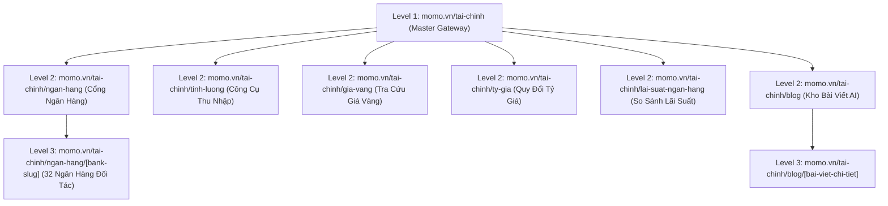

# BRD: Financial Master Hub (Finhub) - Cổng Tiện Ích Tài Chính MoMo

> - **Project:** Financial Master Hub / Finhub (Cổng Tổng Hợp & Điều Hướng Lưu Lượng Tài Chính MoMo)
> - **Division:** Growth Platform Division (GPD) x Financial Services (FS Division)
> - **Owner:** Web Platform Team x BU Financial Hub (CreditTech Division)
> - **Version:** v2.5 - Tháng 8/2026
> - **Status:** Aligned & Production Ready (`momo.vn/tai-chinh`)

## 1. BỐI CẢNH DỰ ÁN & TỔNG QUAN SẢN PHẨM

### 1.0 Định Hướng Chiến Lược
**Financial Master Hub (Finhub)** tại địa chỉ **`momo.vn/tai-chinh`** đóng vai trò là **Trang Cổng Trung Tâm (Master Gateway)** và **Trung Tâm Điều Hướng Truy Cập Nội Bộ (Traffic Exchange)** ngoài ứng dụng. Dự án đại diện cho sự chuyển dịch chiến lược của Web MoMo từ mô hình tin tức/SEO truyền thống sang mô hình sản phẩm dịch vụ (**Platform-based Product**).

Finhub vận hành dựa trên **Mô Hình Giữ Chân Người Dùng Kép (Dual Engagement)**:
* **Nội dung tra cứu thường xuyên (Non-financial Engagement):** Thu hút và duy trì lượt truy cập tự nhiên hàng ngày thông qua bảng thông tin thị trường cập nhật liên tục 24/7 (Giá vàng SJC/9999, Tỷ giá ngoại tệ các ngân hàng commercial, So sánh lãi suất gửi tiết kiệm).
* **Công cụ tài chính trực quan (Financial Engagement):** Gia tăng tương tác có chủ đích với **Widget Công Cụ Tính Lãi Tiết Kiệm Online** đã hoạt động trực tiếp tại màn hình chính `momo.vn/tai-chinh` (cho phép tính lãi đơn gửi 1 lần và lãi kép gửi hàng tháng không cần đăng nhập), kết hợp bộ công cụ mở rộng (Công cụ tính lương Gross-Net 2026 `/tai-chinh/tinh-luong`, Phân bổ thu nhập 50/30/20) và chuyên mục bài viết `/tai-chinh/blog`.

### 1.1 Bài Toán Cần Giải & Cơ Hội Thị Trường
* **Rào cản tải App và xác thực tài khoản:** Khách hàng tìm kiếm trên Google có tâm lý ngại tải App hoặc thực hiện các bước xác thực tài khoản (eKYC) phức tạp chỉ để tra cứu giá vàng, tỷ giá ngoại tệ, tính thử tiền lãi tiết kiệm hoặc tính thuế thu nhập cá nhân.
* **Nhu cầu tra cứu minh bạch trước khi quyết định:** Người dùng luôn có thói quen chủ động tìm kiếm các công cụ tính toán thu nhập, tiền gửi và so sánh lãi suất ngân hàng trước khi mở sổ tiết kiệm, mở thẻ tín dụng hoặc đăng ký khoản vay.
* **Chuẩn hóa địa chỉ trang cổng (Master Gateway URL):** Chuyển đổi tên đường dẫn từ `momo.vn/trung-tam-tai-chinh` sang `momo.vn/tai-chinh` giúp địa chỉ ngắn gọn (10 ký tự), dễ nhớ, đồng bộ cấu trúc trang với các Hub lớn khác (`/sinh-vien`, `/tien-ich-giao-thong`, `/rap-chieu-phim`), tối ưu hiển thị trên điện thoại và tăng thứ hạng tìm kiếm trên Google & các công cụ tra cứu AI (ChatGPT, Gemini, Perplexity).

### 1.2 Định Hướng Phát Triển & Quy Tắc Tái Sử Dụng Công Cụ (Embeddable Strategy)
* **Tăng trưởng từ sản phẩm (PLG Strategy):** Cung cấp công cụ tra cứu tức thì theo cơ chế **Mở là dùng ngay (No-Login)**, giúp người dùng nhận kết quả tính toán thu nhập và thị trường ngay lập tức mà không bị cản trở bởi yêu cầu đăng nhập.
* **Đăng nhập nhanh bằng Email/Social (Soft Auth):** Cho phép đăng nhập nhẹ qua tài khoản Google/Facebook để lưu danh mục theo dõi và nhận báo cáo tài chính, giúp ghi nhận thông tin người dùng trước khi điều hướng sang mở App MoMo.
* **Cấu trúc trang phân cấp 2 tầng (2-Tier Structure):** Trang cổng `momo.vn/tai-chinh` giữ vai trò làm đầu mối thu hút và điều hướng lượt truy cập tự nhiên; toàn bộ các dịch vụ tài chính chuyên sâu được vận hành độc lập theo từng trang dự án riêng biệt nhằm tối ưu tỷ lệ đăng ký mà không gây rối trang cổng.
* **Chiến lược nhúng công cụ đa điểm chạm (Embeddable Utilities Governance):** Master Hub `momo.vn/tai-chinh` đóng vai trò là nơi quản lý gốc (Single Source of Truth) toàn bộ bộ công cụ tiện ích. Toàn bộ các Widget công cụ tính toán (Máy tính Lãi tiết kiệm, Máy tính Lương Gross-Net, Phân bổ 50/30/20, Giả lập đầu tư) được thiết kế theo dạng thành phần linh hoạt (**Embeddable Widgets**) để nhúng trực tiếp vào mọi điểm chạm liên quan trên toàn bộ hệ thống Web MoMo (`/tiet-kiem-online`, `/vay-nhanh`, `/vi-tra-sau`...), giải quyết trọn vẹn từng nhu cầu (JTBD) của người dùng tại đúng ngữ cảnh trải nghiệm.

### 1.3 Khung Chỉ Số Đo Lường (Metrics Framework Align Với BUs & Giám Đốc)

<table style="width:100%; border-collapse:collapse; border:1.5px solid #64748b; margin:1em 0; font-size:0.9em;">
  <thead>
    <tr style="background-color:#f1f5f9;">
      <th style="border:1.5px solid #64748b; padding:8px 12px; text-align:left; font-weight:700;">Tầng Chỉ Số</th>
      <th style="border:1.5px solid #64748b; padding:8px 12px; text-align:left; font-weight:700;">Tên Chỉ Số Cốt Lõi</th>
      <th style="border:1.5px solid #64748b; padding:8px 12px; text-align:left; font-weight:700;">Mục Tiêu Cam Kết (H2/2026 Targets)</th>
      <th style="border:1.5px solid #64748b; padding:8px 12px; text-align:left; font-weight:700;">Ý Nghĩa Nghiệp Vụ & Phương Pháp Đo Lường</th>
    </tr>
  </thead>
  <tbody>
    <tr>
      <td style="border:1px solid #94a3b8; padding:8px 12px; text-align:left;"><strong>Web Metrics (Kênh Web)</strong></td>
      <td style="border:1px solid #94a3b8; padding:8px 12px; text-align:left;"><strong>Monthly Pageviews (MPV)</strong></td>
      <td style="border:1px solid #94a3b8; padding:8px 12px; text-align:left;"><strong>1.000.000 lượt xem trang / tháng</strong></td>
      <td style="border:1px solid #94a3b8; padding:8px 12px; text-align:left;">Đo lường quy mô tổng thể lưu lượng truy cập Kênh Web <code style="background:#f1f5f9;padding:2px 4px;border-radius:4px;font-family:monospace;">momo.vn/tai-chinh</code> và các trang tiện ích liên quan.</td>
    </tr>
    <tr style="background-color:#f8fafc;">
      <td style="border:1px solid #94a3b8; padding:8px 12px; text-align:left;"><strong>Web Metrics (Kênh Web)</strong></td>
      <td style="border:1px solid #94a3b8; padding:8px 12px; text-align:left;"><strong>Utility Engagement Rate</strong></td>
      <td style="border:1px solid #94a3b8; padding:8px 12px; text-align:left;"><strong>≥ 25% người dùng tương tác công cụ</strong></td>
      <td style="border:1px solid #94a3b8; padding:8px 12px; text-align:left;">Tỷ lệ người dùng thực hiện tính toán trên các Widget (Công cụ Tính Lãi Tiết Kiệm Live, Tính Lương 2026, Phân Bổ 50/30/20).</td>
    </tr>
    <tr>
      <td style="border:1px solid #94a3b8; padding:8px 12px; text-align:left;"><strong>Web Metrics (Kênh Web)</strong></td>
      <td style="border:1px solid #94a3b8; padding:8px 12px; text-align:left;"><strong>CTA Click-Through Rate (CTR)</strong></td>
      <td style="border:1px solid #94a3b8; padding:8px 12px; text-align:left;">
        - <strong>Baseline CTR thực tế (11 trang sản phẩm): 94.51%</strong> 
        - <strong>Target CTR trang cổng Gateway (<code style="background:#f1f5f9;padding:2px 4px;border-radius:4px;font-family:monospace;">/tai-chinh</code>): 15% - 25%</strong>
      </td>
      <td style="border:1px solid #94a3b8; padding:8px 12px; text-align:left;">Tỷ lệ người dùng nhấp vào các nút CTA chuyển đổi từ Web điều hướng mở App MoMo (Thực tế GA4 30 ngày ghi nhận 84.544 clicks / 89.451 sessions).</td>
    </tr>
    <tr style="background-color:#f8fafc;">
      <td style="border:1px solid #94a3b8; padding:8px 12px; text-align:left;"><strong>Business Metrics (Tác Động In-App)</strong></td>
      <td style="border:1px solid #94a3b8; padding:8px 12px; text-align:left;"><strong>Web-to-App Engaged Users (W2A MEU)</strong></td>
      <td style="border:1px solid #94a3b8; padding:8px 12px; text-align:left;"><strong>Tăng trưởng người dùng mở App định danh</strong></td>
      <td style="border:1px solid #94a3b8; padding:8px 12px; text-align:left;">Số lượng người dùng mở App MoMo thành công từ Kênh Web qua mã hóa Appsflyer OneLink / Deep Link.</td>
    </tr>
    <tr>
      <td style="border:1px solid #94a3b8; padding:8px 12px; text-align:left;"><strong>Business Metrics (Tác Động In-App)</strong></td>
      <td style="border:1px solid #94a3b8; padding:8px 12px; text-align:left;"><strong>In-App Service Conversions</strong></td>
      <td style="border:1px solid #94a3b8; padding:8px 12px; text-align:left;"><strong>Tăng trưởng giao dịch tài chính In-App</strong></td>
      <td style="border:1px solid #94a3b8; padding:8px 12px; text-align:left;">Số lượng người dùng đăng ký mở tài khoản Tiết kiệm online, Ví Trả Sau, Vay Nhanh và Mua Gói Điểm Tín Dụng CIC.</td>
    </tr>
    <tr style="background-color:#f8fafc;">
      <td style="border:1px solid #94a3b8; padding:8px 12px; text-align:left;"><strong>Business Metrics (Tác Động In-App)</strong></td>
      <td style="border:1px solid #94a3b8; padding:8px 12px; text-align:left;"><strong>Student Brand Coverage</strong></td>
      <td style="border:1px solid #94a3b8; padding:8px 12px; text-align:left;"><strong>Phủ rộng phân khúc Sinh viên Q3/2026</strong></td>
      <td style="border:1px solid #94a3b8; padding:8px 12px; text-align:left;">Đo lường độ phủ thương hiệu và giáo dục tài chính cho phân khúc Sinh viên (U18 - U23) hợp tác cùng S-Hub trong Q3/2026.</td>
    </tr>
  </tbody>
</table>

### 1.4 Baseline Performance & Analytics Benchmark (Dữ Liệu Thực Tế 30 Ngày Gần Nhất: 13/07 – 11/08/2026)

Số liệu ghi nhận thực tế từ hệ thống Google Analytics 4 (GA4) cho danh mục 11 Trang Sản Phẩm Độc Lập trong 30 ngày gần nhất:

<table style="width:100%; border-collapse:collapse; border:1.5px solid #64748b; margin:1em 0; font-size:0.9em;">
  <thead>
    <tr style="background-color:#f1f5f9;">
      <th style="border:1.5px solid #64748b; padding:8px 12px; text-align:left; font-weight:700;">#</th>
      <th style="border:1.5px solid #64748b; padding:8px 12px; text-align:left; font-weight:700;">Trang Sản Phẩm (URL Route)</th>
      <th style="border:1.5px solid #64748b; padding:8px 12px; text-align:right; font-weight:700;">Session View Page</th>
      <th style="border:1.5px solid #64748b; padding:8px 12px; text-align:right; font-weight:700;">Session Click CTA</th>
      <th style="border:1.5px solid #64748b; padding:8px 12px; text-align:right; font-weight:700;">%CTR</th>
      <th style="border:1.5px solid #64748b; padding:8px 12px; text-align:left; font-weight:700;">Đánh Giá & Nhận Xét Chuyên Môn</th>
    </tr>
  </thead>
  <tbody>
    <tr>
      <td style="border:1px solid #94a3b8; padding:8px 12px; text-align:left;">1</td>
      <td style="border:1px solid #94a3b8; padding:8px 12px; text-align:left;"><code style="background:#f1f5f9;padding:2px 4px;border-radius:4px;font-family:monospace;">/vay-nhanh</code></td>
      <td style="border:1px solid #94a3b8; padding:8px 12px; text-align:right;"><strong>68,655</strong></td>
      <td style="border:1px solid #94a3b8; padding:8px 12px; text-align:right;"><strong>75,427</strong></td>
      <td style="border:1px solid #94a3b8; padding:8px 12px; text-align:right;"><strong>109.86%</strong></td>
      <td style="border:1px solid #94a3b8; padding:8px 12px; text-align:left;">Trang kéo traffic lớn nhất (chiếm 76.7% tổng traffic toàn bộ 11 trang). Tỷ lệ CTR vượt 100% cho thấy nhu cầu đăng ký khoản vay rất cao (user bấm CTA nhiều lần trong 1 session).</td>
    </tr>
    <tr style="background-color:#f8fafc;">
      <td style="border:1px solid #94a3b8; padding:8px 12px; text-align:left;">2</td>
      <td style="border:1px solid #94a3b8; padding:8px 12px; text-align:left;"><code style="background:#f1f5f9;padding:2px 4px;border-radius:4px;font-family:monospace;">/vi-tra-sau</code></td>
      <td style="border:1px solid #94a3b8; padding:8px 12px; text-align:right;"><strong>7,953</strong></td>
      <td style="border:1px solid #94a3b8; padding:8px 12px; text-align:right;">4,128</td>
      <td style="border:1px solid #94a3b8; padding:8px 12px; text-align:right;"><strong>51.92%</strong></td>
      <td style="border:1px solid #94a3b8; padding:8px 12px; text-align:left;">Traffic đứng thứ 2, tỷ lệ nhấp chuyển đổi tốt (>50%). Cần tiếp tục duy trì vị thế từ khóa thương hiệu và tối ưu Banner mở Ví.</td>
    </tr>
    <tr>
      <td style="border:1px solid #94a3b8; padding:8px 12px; text-align:left;">3</td>
      <td style="border:1px solid #94a3b8; padding:8px 12px; text-align:left;"><code style="background:#f1f5f9;padding:2px 4px;border-radius:4px;font-family:monospace;">/diem-tin-dung</code></td>
      <td style="border:1px solid #94a3b8; padding:8px 12px; text-align:right;"><strong>6,610</strong></td>
      <td style="border:1px solid #94a3b8; padding:8px 12px; text-align:right;">776</td>
      <td style="border:1px solid #94a3b8; padding:8px 12px; text-align:right;"><strong>11.74%</strong></td>
      <td style="border:1px solid #94a3b8; padding:8px 12px; text-align:left;">Traffic khá cao (đứng thứ 3) nhưng CTR thấp nhất hệ thống (11.74%). Lý do: Người dùng thiếu nội dung giáo dục & chưa thấy rõ giá trị gói Alert. Minh chứng cho việc cần thực thi ngay kế hoạch 38 bài MoSpark.</td>
    </tr>
    <tr style="background-color:#f8fafc;">
      <td style="border:1px solid #94a3b8; padding:8px 12px; text-align:left;">4</td>
      <td style="border:1px solid #94a3b8; padding:8px 12px; text-align:left;"><code style="background:#f1f5f9;padding:2px 4px;border-radius:4px;font-family:monospace;">/tui-than-tai</code></td>
      <td style="border:1px solid #94a3b8; padding:8px 12px; text-align:right;">2,259</td>
      <td style="border:1px solid #94a3b8; padding:8px 12px; text-align:right;">1,171</td>
      <td style="border:1px solid #94a3b8; padding:8px 12px; text-align:right;">51.84%</td>
      <td style="border:1px solid #94a3b8; padding:8px 12px; text-align:left;">Traffic tích lũy ổn định, CTR đạt mức cơ sở >50%.</td>
    </tr>
    <tr>
      <td style="border:1px solid #94a3b8; padding:8px 12px; text-align:left;">5</td>
      <td style="border:1px solid #94a3b8; padding:8px 12px; text-align:left;"><code style="background:#f1f5f9;padding:2px 4px;border-radius:4px;font-family:monospace;">/mo-the-tin-dung</code></td>
      <td style="border:1px solid #94a3b8; padding:8px 12px; text-align:right;">1,401</td>
      <td style="border:1px solid #94a3b8; padding:8px 12px; text-align:right;">1,171</td>
      <td style="border:1px solid #94a3b8; padding:8px 12px; text-align:right;"><strong>83.58%</strong></td>
      <td style="border:1px solid #94a3b8; padding:8px 12px; text-align:left;">Ý định mở thẻ rất cao (CTR 83.58%). Cần đẩy mạnh traffic kéo người dùng vào trang này.</td>
    </tr>
    <tr style="background-color:#f8fafc;">
      <td style="border:1px solid #94a3b8; padding:8px 12px; text-align:left;">6</td>
      <td style="border:1px solid #94a3b8; padding:8px 12px; text-align:left;"><code style="background:#f1f5f9;padding:2px 4px;border-radius:4px;font-family:monospace;">/thanh-toan-khoan-vay</code></td>
      <td style="border:1px solid #94a3b8; padding:8px 12px; text-align:right;">820</td>
      <td style="border:1px solid #94a3b8; padding:8px 12px; text-align:right;">345</td>
      <td style="border:1px solid #94a3b8; padding:8px 12px; text-align:right;">42.07%</td>
      <td style="border:1px solid #94a3b8; padding:8px 12px; text-align:left;">Trang tiện ích nộp tiền khoản vay, duy trì nhịp sử dụng ổn định.</td>
    </tr>
    <tr>
      <td style="border:1px solid #94a3b8; padding:8px 12px; text-align:left;">7</td>
      <td style="border:1px solid #94a3b8; padding:8px 12px; text-align:left;"><code style="background:#f1f5f9;padding:2px 4px;border-radius:4px;font-family:monospace;">/chung-khoan</code></td>
      <td style="border:1px solid #94a3b8; padding:8px 12px; text-align:right;">676</td>
      <td style="border:1px solid #94a3b8; padding:8px 12px; text-align:right;">593</td>
      <td style="border:1px solid #94a3b8; padding:8px 12px; text-align:right;"><strong>87.72%</strong></td>
      <td style="border:1px solid #94a3b8; padding:8px 12px; text-align:left;">Tỷ lệ CTR xuất sắc (87.72%), đối tượng vào trang sẵn sàng mở tài khoản chứng khoán trên MoMo.</td>
    </tr>
    <tr style="background-color:#f8fafc;">
      <td style="border:1px solid #94a3b8; padding:8px 12px; text-align:left;">8</td>
      <td style="border:1px solid #94a3b8; padding:8px 12px; text-align:left;"><code style="background:#f1f5f9;padding:2px 4px;border-radius:4px;font-family:monospace;">/tiet-kiem-online</code></td>
      <td style="border:1px solid #94a3b8; padding:8px 12px; text-align:right;">487</td>
      <td style="border:1px solid #94a3b8; padding:8px 12px; text-align:right;">280</td>
      <td style="border:1px solid #94a3b8; padding:8px 12px; text-align:right;">57.49%</td>
      <td style="border:1px solid #94a3b8; padding:8px 12px; text-align:left;">CTR đạt 57.49%. Việc nhúng Widget Công Cụ Tính Lãi Tiết Kiệm Live từ <code style="background:#f1f5f9;padding:2px 4px;border-radius:4px;font-family:monospace;">/tai-chinh</code> vào trang này sẽ bứt phá cả traffic lẫn CTR.</td>
    </tr>
    <tr>
      <td style="border:1px solid #94a3b8; padding:8px 12px; text-align:left;">9</td>
      <td style="border:1px solid #94a3b8; padding:8px 12px; text-align:left;"><code style="background:#f1f5f9;padding:2px 4px;border-radius:4px;font-family:monospace;">/thanh-toan-phi-bao-hiem</code></td>
      <td style="border:1px solid #94a3b8; padding:8px 12px; text-align:right;">278</td>
      <td style="border:1px solid #94a3b8; padding:8px 12px; text-align:right;">212</td>
      <td style="border:1px solid #94a3b8; padding:8px 12px; text-align:right;"><strong>76.26%</strong></td>
      <td style="border:1px solid #94a3b8; padding:8px 12px; text-align:left;">Ý định đóng phí bảo hiểm rất cao (CTR 76.26%).</td>
    </tr>
    <tr style="background-color:#f8fafc;">
      <td style="border:1px solid #94a3b8; padding:8px 12px; text-align:left;">10</td>
      <td style="border:1px solid #94a3b8; padding:8px 12px; text-align:left;"><code style="background:#f1f5f9;padding:2px 4px;border-radius:4px;font-family:monospace;">/bao-hiem-xa-hoi</code></td>
      <td style="border:1px solid #94a3b8; padding:8px 12px; text-align:right;">199</td>
      <td style="border:1px solid #94a3b8; padding:8px 12px; text-align:right;">128</td>
      <td style="border:1px solid #94a3b8; padding:8px 12px; text-align:right;">64.32%</td>
      <td style="border:1px solid #94a3b8; padding:8px 12px; text-align:left;">Trang phục vụ nhu cầu nộp BHXH tự nguyện.</td>
    </tr>
    <tr>
      <td style="border:1px solid #94a3b8; padding:8px 12px; text-align:left;">11</td>
      <td style="border:1px solid #94a3b8; padding:8px 12px; text-align:left;"><code style="background:#f1f5f9;padding:2px 4px;border-radius:4px;font-family:monospace;">/chung-chi-quy</code></td>
      <td style="border:1px solid #94a3b8; padding:8px 12px; text-align:right;">183</td>
      <td style="border:1px solid #94a3b8; padding:8px 12px; text-align:right;">113</td>
      <td style="border:1px solid #94a3b8; padding:8px 12px; text-align:right;">61.75%</td>
      <td style="border:1px solid #94a3b8; padding:8px 12px; text-align:left;">Trang đầu tư chứng chỉ quỹ, CTR khá ổn định.</td>
    </tr>
    <tr style="background-color:#f1f5f9; font-weight:bold;">
      <td style="border:1.5px solid #64748b; padding:8px 12px; text-align:left;" colspan="2"><strong>TỔNG CỘNG 11 TRANG SẢN PHẨM</strong></td>
      <td style="border:1.5px solid #64748b; padding:8px 12px; text-align:right;"><strong>89,451</strong></td>
      <td style="border:1.5px solid #64748b; padding:8px 12px; text-align:right;"><strong>84,544</strong></td>
      <td style="border:1.5px solid #64748b; padding:8px 12px; text-align:right;"><strong>94.51% (TB)</strong></td>
      <td style="border:1.5px solid #64748b; padding:8px 12px; text-align:left;">Tổng thể các trang sản phẩm độc lập có CTR mở App cực kỳ ấn tượng. Mũi nhọn bùng nổ tiếp theo là xây dựng Master Gateway <code style="background:#f1f5f9;padding:2px 4px;border-radius:4px;font-family:monospace;">momo.vn/tai-chinh</code> để phân phối traffic.</td>
    </tr>
  </tbody>
</table>

## 2. PHÂN TÍCH ĐỐI THỦ CẠNH TRANH, CHỈ SỐ DOMAIN RATING (DR) & ĐỘ KHÓ THỊ TRƯỜNG

### 2.1 Ma Trận Thẩm Quyền Tên Miền (MoMo DR 78 vs Đối Thủ Toàn Ngành)

Website MoMo (`momo.vn`) hiện sở hữu chỉ số **Domain Rating (DR) = 78**, thuộc nhóm website có thẩm quyền tên miền mạnh nhất tại Việt Nam. Khi đối chiếu với các đối thủ trong từng thị trường ngách:
*   **Nhóm Fintech & Aggregators đối thủ (Thebank, Topi, Infina, Finhay, Timo, Fmarket):** DR chỉ dao động từ **42 - 58**. MoMo có **lợi thế thẩm quyền vượt trội từ +20 đến +28 điểm DR**, cho phép thâu tóm nhanh các từ khóa Intent cao nếu xây dựng được công cụ tương tác mượt mà.
*   **Nhóm Cổng Tra Cứu Giá Vàng & Tỷ Giá (Webgia, Tygia.vn, Giavang.org):** DR dao động từ **46 - 54**, giao diện cũ kỹ và ngập tràn banner quảng cáo. MoMo dễ dàng chiếm ưu thế nhờ trải nghiệm UI/UX tối ưu và thương hiệu tài chính số uy tín.
*   **Nhóm Báo Tài Chính & Big4 Ngân Hàng (Cafef, VnExpress, Vietcombank, BIDV, VietinBank):** DR cao tương đương (**70 - 88**). MoMo không cạnh tranh bằng bài viết tin tức dàn trải mà cạnh tranh bằng **Bộ Công Cụ Tiện Ích Trực Quan (Interactive Tools & Calculators)** và **Programmatic Hub 34 Ngân Hàng** gắn liền với luồng chuyển đổi Web-to-App.

### 2.2 Bảng Chi Tiết Đối Thủ, Chỉ Số DR & Khoảng Trống Cạnh Tranh 27 Dịch Vụ

<table style="width:100%; border-collapse:collapse; border:1.5px solid #64748b; margin:1em 0; font-size:0.80em;">
  <thead>
    <tr style="background-color:#f1f5f9;">
      <th style="border:1.5px solid #64748b; padding:6px; text-align:center; font-weight:700;">STT</th>
      <th style="border:1.5px solid #64748b; padding:6px; text-align:left; font-weight:700;">Dịch Vụ</th>
      <th style="border:1.5px solid #64748b; padding:6px; text-align:right; font-weight:700;">Search Volume</th>
      <th style="border:1.5px solid #64748b; padding:6px; text-align:left; font-weight:700;">Top Đối Thủ Thống Trị SERP (Kèm DR)</th>
      <th style="border:1.5px solid #64748b; padding:6px; text-align:center; font-weight:700;">DR Đối Thủ</th>
      <th style="border:1.5px solid #64748b; padding:6px; text-align:center; font-weight:700;">MoMo DR 78 vs Đối Thủ</th>
      <th style="border:1.5px solid #64748b; padding:6px; text-align:left; font-weight:700;">Khoảng Trống Cạnh Tranh & Lợi Thế Độc Tôn Của MoMo (Moat)</th>
      <th style="border:1.5px solid #64748b; padding:6px; text-align:center; font-weight:700;">Mức Độ Khó</th>
    </tr>
  </thead>
  <tbody>
    <tr>
      <td style="border:1px solid #94a3b8; padding:5px; text-align:center;">1</td>
      <td style="border:1px solid #94a3b8; padding:5px;"><strong>Giá Vàng</strong></td>
      <td style="border:1px solid #94a3b8; padding:5px; text-align:right;"><strong>78,879,270</strong></td>
      <td style="border:1px solid #94a3b8; padding:5px;">Webgia.com (DR 52), Giavang.org (DR 46), Sjc.com.vn (DR 62), 24h.com.vn (DR 82), Cafef (DR 79)</td>
      <td style="border:1px solid #94a3b8; padding:5px; text-align:center;">64</td>
      <td style="border:1px solid #94a3b8; padding:5px; text-align:center; color:#1e40af; font-weight:700;">+14 (Vượt trội Webgia/Giavang)</td>
      <td style="border:1px solid #94a3b8; padding:5px;">Đối thủ Webgia/Giavang UX cũ, ngập quảng cáo; Báo chí chỉ viết bài tĩnh. MoMo thắng bằng UI sạch, biểu đồ tương tác và nút Mua Vàng Online.</td>
      <td style="border:1px solid #94a3b8; padding:5px; text-align:center; font-weight:700;">Rất Cao</td>
    </tr>
    <tr style="background-color:#f8fafc;">
      <td style="border:1px solid #94a3b8; padding:5px; text-align:center;">2</td>
      <td style="border:1px solid #94a3b8; padding:5px;"><strong>Tỷ Giá</strong></td>
      <td style="border:1px solid #94a3b8; padding:5px; text-align:right;"><strong>8,516,910</strong></td>
      <td style="border:1px solid #94a3b8; padding:5px;">Vietcombank (DR 75), Webgia (DR 52), Tygia.vn (DR 54), Cafef (DR 79), Thebank (DR 58)</td>
      <td style="border:1px solid #94a3b8; padding:5px; text-align:center;">63</td>
      <td style="border:1px solid #94a3b8; padding:5px; text-align:center; color:#1e40af; font-weight:700;">+15 (Mạnh hơn cổng tỷ giá)</td>
      <td style="border:1px solid #94a3b8; padding:5px;">Các bank chỉ hiển thị tỷ giá của riêng mình; các web tỷ giá giao diện tệ. MoMo xây Bộ Quy Đổi Ngoại Tệ Live + So sánh đa bank.</td>
      <td style="border:1px solid #94a3b8; padding:5px; text-align:center; font-weight:700;">Cao</td>
    </tr>
    <tr>
      <td style="border:1px solid #94a3b8; padding:5px; text-align:center;">3</td>
      <td style="border:1px solid #94a3b8; padding:5px;"><strong>Ngân Hàng</strong></td>
      <td style="border:1px solid #94a3b8; padding:5px; text-align:right;"><strong>6,629,420</strong></td>
      <td style="border:1px solid #94a3b8; padding:5px;">Trang chủ 34 Ngân hàng (DR 64-75), Thebank (DR 58), Bankhub (DR 42), Topi (DR 45)</td>
      <td style="border:1px solid #94a3b8; padding:5px; text-align:center;">62</td>
      <td style="border:1px solid #94a3b8; padding:5px; text-align:center; color:#1e40af; font-weight:700;">+16 (Đủ sức cạnh tranh Big4)</td>
      <td style="border:1px solid #94a3b8; padding:5px;">Các bank không có nội dung kết nối MoMo; Aggregator thiếu tính năng liên kết ví. MoMo làm Programmatic Hub cho 34 bank kèm quà tân thủ 500k.</td>
      <td style="border:1px solid #94a3b8; padding:5px; text-align:center; font-weight:700;">Trung Bình</td>
    </tr>
    <tr style="background-color:#f8fafc;">
      <td style="border:1px solid #94a3b8; padding:5px; text-align:center;">4</td>
      <td style="border:1px solid #94a3b8; padding:5px;"><strong>Chứng Khoán</strong></td>
      <td style="border:1px solid #94a3b8; padding:5px; text-align:right;"><strong>3,026,340</strong></td>
      <td style="border:1px solid #94a3b8; padding:5px;">Cafef.vn (DR 79), Vietstock.vn (DR 74), SSI (DR 66), VNDirect (DR 68), TCBS (DR 62)</td>
      <td style="border:1px solid #94a3b8; padding:5px; text-align:center;">70</td>
      <td style="border:1px solid #94a3b8; padding:5px; text-align:center; color:#1e40af; font-weight:700;">+8 (Ngang ngửa Top 1)</td>
      <td style="border:1px solid #94a3b8; padding:5px;">Đối thủ tập trung cho trader chuyên nghiệp. MoMo đánh vào tệp F0/Beginner với Tool 'Có Tiền Đầu Tư Gì' và mua CCQ từ 10k.</td>
      <td style="border:1px solid #94a3b8; padding:5px; text-align:center; font-weight:700;">Cao</td>
    </tr>
    <tr>
      <td style="border:1px solid #94a3b8; padding:5px; text-align:center;">5</td>
      <td style="border:1px solid #94a3b8; padding:5px;"><strong>Lãi Suất</strong></td>
      <td style="border:1px solid #94a3b8; padding:5px; text-align:right;"><strong>1,246,620</strong></td>
      <td style="border:1px solid #94a3b8; padding:5px;">Webgia (DR 52), Thebank (DR 58), Topi (DR 45), Cafef (DR 79), VietnamBiz (DR 68)</td>
      <td style="border:1px solid #94a3b8; padding:5px; text-align:center;">60</td>
      <td style="border:1px solid #94a3b8; padding:5px; text-align:center; color:#1e40af; font-weight:700;">+18 (Vượt trội Aggregators)</td>
      <td style="border:1px solid #94a3b8; padding:5px;">Đối thủ chỉ làm bảng tĩnh cập nhật chậm. MoMo tạo Bảng so sánh 30+ bank lọc theo kỳ hạn cao nhất + mở sổ online trực tiếp.</td>
      <td style="border:1px solid #94a3b8; padding:5px; text-align:center; font-weight:700;">Trung Bình Cao</td>
    </tr>
    <tr style="background-color:#f8fafc;">
      <td style="border:1px solid #94a3b8; padding:5px; text-align:center;">6</td>
      <td style="border:1px solid #94a3b8; padding:5px;"><strong>Thuế (TNCN)</strong></td>
      <td style="border:1px solid #94a3b8; padding:5px; text-align:right;"><strong>1,159,450</strong></td>
      <td style="border:1px solid #94a3b8; padding:5px;">Thuvienphapluat (DR 76), Luatvietnam (DR 73), TopCV (DR 65), MISA (DR 64)</td>
      <td style="border:1px solid #94a3b8; padding:5px; text-align:center;">69</td>
      <td style="border:1px solid #94a3b8; padding:5px; text-align:center; color:#1e40af; font-weight:700;">+9 (Tương đương Top Pháp luật)</td>
      <td style="border:1px solid #94a3b8; padding:5px;">Thư viện pháp luật nhiều text khó hiểu; TopCV tool đơn giản. MoMo thắng bằng Tool Quyết Toán Thuế TNCN tự động luật mới + Nộp thuế in-app.</td>
      <td style="border:1px solid #94a3b8; padding:5px; text-align:center; font-weight:700;">Thấp / Dễ thâm nhập</td>
    </tr>
    <tr>
      <td style="border:1px solid #94a3b8; padding:5px; text-align:center;">7</td>
      <td style="border:1px solid #94a3b8; padding:5px;"><strong>Cổ Phiếu</strong></td>
      <td style="border:1px solid #94a3b8; padding:5px; text-align:right;"><strong>1,077,540</strong></td>
      <td style="border:1px solid #94a3b8; padding:5px;">Cafef (DR 79), Vietstock (DR 74), FireAnt (DR 56), 24hmoney (DR 54), TCBS (DR 62)</td>
      <td style="border:1px solid #94a3b8; padding:5px; text-align:center;">65</td>
      <td style="border:1px solid #94a3b8; padding:5px; text-align:center; color:#1e40af; font-weight:700;">+13 (Vượt trội nền tảng tài chính)</td>
      <td style="border:1px solid #94a3b8; padding:5px;">Tập trung vào kiến thức cơ bản cho người mới bắt đầu + danh mục cổ phiếu khuyến nghị từ đối tác Chứng khoán Bản Việt.</td>
      <td style="border:1px solid #94a3b8; padding:5px; text-align:center; font-weight:700;">Cao</td>
    </tr>
    <tr style="background-color:#f8fafc;">
      <td style="border:1px solid #94a3b8; padding:5px; text-align:center;">8</td>
      <td style="border:1px solid #94a3b8; padding:5px;"><strong>Ngoại Tệ</strong></td>
      <td style="border:1px solid #94a3b8; padding:5px; text-align:right;"><strong>959,340</strong></td>
      <td style="border:1px solid #94a3b8; padding:5px;">Vietcombank (DR 75), BIDV (DR 72), Webgia (DR 52), Thebank (DR 58)</td>
      <td style="border:1px solid #94a3b8; padding:5px; text-align:center;">64</td>
      <td style="border:1px solid #94a3b8; padding:5px; text-align:center; color:#1e40af; font-weight:700;">+14 (Cạnh tranh trực tiếp)</td>
      <td style="border:1px solid #94a3b8; padding:5px;">So sánh tỷ giá mua tiền mặt/chuyển khoản giữa các ngân hàng + gợi ý mở thẻ quốc tế miễn phí giao dịch ngoại tệ.</td>
      <td style="border:1px solid #94a3b8; padding:5px; text-align:center; font-weight:700;">Trung Bình</td>
    </tr>
    <tr>
      <td style="border:1px solid #94a3b8; padding:5px; text-align:center;">9</td>
      <td style="border:1px solid #94a3b8; padding:5px;"><strong>Crypto</strong></td>
      <td style="border:1px solid #94a3b8; padding:5px; text-align:right;"><strong>469,420</strong></td>
      <td style="border:1px solid #94a3b8; padding:5px;">Coin68 (DR 56), Blogtienao (DR 52), Binance Academy (DR 85), MarginATM (DR 48)</td>
      <td style="border:1px solid #94a3b8; padding:5px; text-align:center;">60</td>
      <td style="border:1px solid #94a3b8; padding:5px; text-align:center; color:#1e40af; font-weight:700;">+18 (Thẩm quyền cao hơn web crypto)</td>
      <td style="border:1px solid #94a3b8; padding:5px;">MoMo chỉ đóng vai trò cung cấp tin tức và cảnh báo lừa đảo, không cạnh tranh giao dịch.</td>
      <td style="border:1px solid #94a3b8; padding:5px; text-align:center; font-weight:700;">Trung Bình</td>
    </tr>
    <tr style="background-color:#f8fafc;">
      <td style="border:1px solid #94a3b8; padding:5px; text-align:center;">10</td>
      <td style="border:1px solid #94a3b8; padding:5px;"><strong>Thẻ Tín Dụng</strong></td>
      <td style="border:1px solid #94a3b8; padding:5px; text-align:right;"><strong>394,590</strong></td>
      <td style="border:1px solid #94a3b8; padding:5px;">Thebank (DR 58), Topi (DR 45), VPBank (DR 68), VIB (DR 64), Techcombank (DR 68)</td>
      <td style="border:1px solid #94a3b8; padding:5px; text-align:center;">61</td>
      <td style="border:1px solid #94a3b8; padding:5px; text-align:center; color:#1e40af; font-weight:700;">+17 (Vượt trội Aggregators)</td>
      <td style="border:1px solid #94a3b8; padding:5px;">Aggregator trải nghiệm rườm rà. MoMo tạo ma trận so sánh thẻ hoàn tiền/phí thường niên + Mở thẻ trực tuyến 100% không chứng minh thu nhập.</td>
      <td style="border:1px solid #94a3b8; padding:5px; text-align:center; font-weight:700;">Trung Bình Cao</td>
    </tr>
    <tr>
      <td style="border:1px solid #94a3b8; padding:5px; text-align:center;">11</td>
      <td style="border:1px solid #94a3b8; padding:5px;"><strong>Vay Tín Chấp</strong></td>
      <td style="border:1px solid #94a3b8; padding:5px; text-align:right;"><strong>389,820</strong></td>
      <td style="border:1px solid #94a3b8; padding:5px;">FE Credit (DR 58), Home Credit (DR 60), Thebank (DR 58), Tima (DR 54), Shinhan Finance (DR 56)</td>
      <td style="border:1px solid #94a3b8; padding:5px; text-align:center;">57</td>
      <td style="border:1px solid #94a3b8; padding:5px; text-align:center; color:#1e40af; font-weight:700;">+21 (Thẩm quyền vượt trội đối thủ vay)</td>
      <td style="border:1px solid #94a3b8; padding:5px;">Thị trường cho vay ngập web lừa đảo. Uy tín MoMo vượt trội + Tool tính lịch trả nợ giảm dần + Duyệt Vay Nhanh 1 phút trên App.</td>
      <td style="border:1px solid #94a3b8; padding:5px; text-align:center; font-weight:700;">Trung Bình Cao</td>
    </tr>
    <tr style="background-color:#f8fafc;">
      <td style="border:1px solid #94a3b8; padding:5px; text-align:center;">12</td>
      <td style="border:1px solid #94a3b8; padding:5px;"><strong>Thẻ Visa</strong></td>
      <td style="border:1px solid #94a3b8; padding:5px; text-align:right;"><strong>243,110</strong></td>
      <td style="border:1px solid #94a3b8; padding:5px;">Visa.com.vn (DR 72), Vietcombank (DR 75), Techcombank (DR 68), Thebank (DR 58)</td>
      <td style="border:1px solid #94a3b8; padding:5px; text-align:center;">68</td>
      <td style="border:1px solid #94a3b8; padding:5px; text-align:center; color:#1e40af; font-weight:700;">+10 (Ngang ngửa ngân hàng)</td>
      <td style="border:1px solid #94a3b8; padding:5px;">Bài viết hướng dẫn phân biệt Visa Debit vs Credit + liên kết thẻ nhận ưu đãi thanh toán quốc tế.</td>
      <td style="border:1px solid #94a3b8; padding:5px; text-align:center; font-weight:700;">Thấp / Dễ thâm nhập</td>
    </tr>
    <tr>
      <td style="border:1px solid #94a3b8; padding:5px; text-align:center;">13</td>
      <td style="border:1px solid #94a3b8; padding:5px;"><strong>Tiết Kiệm</strong></td>
      <td style="border:1px solid #94a3b8; padding:5px; text-align:right;"><strong>230,110</strong></td>
      <td style="border:1px solid #94a3b8; padding:5px;">Thebank (DR 58), Topi (DR 45), Infina (DR 48), VPBank (DR 68), BVBank (DR 50)</td>
      <td style="border:1px solid #94a3b8; padding:5px; text-align:center;">54</td>
      <td style="border:1px solid #94a3b8; padding:5px; text-align:center; color:#1e40af; font-weight:700;">+24 (Áp đảo các Fintech tiết kiệm)</td>
      <td style="border:1px solid #94a3b8; padding:5px;">Fintech khác DR thấp (Topi 45, Infina 48). MoMo DR 78 áp đảo hoàn toàn + Widget tính lãi kép live chuyển đổi thẳng vào BVBank/VPBank.</td>
      <td style="border:1px solid #94a3b8; padding:5px; text-align:center; font-weight:700;">Rất Thấp (Quick Win)</td>
    </tr>
    <tr style="background-color:#f8fafc;">
      <td style="border:1px solid #94a3b8; padding:5px; text-align:center;">14</td>
      <td style="border:1px solid #94a3b8; padding:5px;"><strong>Tính Lương</strong></td>
      <td style="border:1px solid #94a3b8; padding:5px; text-align:right;"><strong>190,690</strong></td>
      <td style="border:1px solid #94a3b8; padding:5px;">TopCV (DR 65), VietnamWorks (DR 68), CareerViet (DR 66), Luatvietnam (DR 73)</td>
      <td style="border:1px solid #94a3b8; padding:5px; text-align:center;">68</td>
      <td style="border:1px solid #94a3b8; padding:5px; text-align:center; color:#1e40af; font-weight:700;">+10 (Thẩm quyền tương đương)</td>
      <td style="border:1px solid #94a3b8; padding:5px;">Các trang tuyển dụng tool nặng, nhiều banner. MoMo làm Tool Gross-Net 2026 siêu mượt, không quảng cáo + Gợi ý phân bổ 50/30/20.</td>
      <td style="border:1px solid #94a3b8; padding:5px; text-align:center; font-weight:700;">Rất Thấp (Quick Win)</td>
    </tr>
    <tr>
      <td style="border:1px solid #94a3b8; padding:5px; text-align:center;">15</td>
      <td style="border:1px solid #94a3b8; padding:5px;"><strong>Vay Thế Chấp (Mua Nhà)</strong></td>
      <td style="border:1px solid #94a3b8; padding:5px; text-align:right;"><strong>125,960</strong></td>
      <td style="border:1px solid #94a3b8; padding:5px;">Batdongsan.com.vn (DR 72), Homedy (DR 58), Thebank (DR 58), Vietcombank (DR 75)</td>
      <td style="border:1px solid #94a3b8; padding:5px; text-align:center;">66</td>
      <td style="border:1px solid #94a3b8; padding:5px; text-align:center; color:#1e40af; font-weight:700;">+12 (Vượt trội cổng BĐS nhỏ)</td>
      <td style="border:1px solid #94a3b8; padding:5px;">Batdongsan chỉ tập trung tin rao. MoMo cung cấp Bảng tính lãi vay mua nhà chi tiết (dư nợ giảm dần) + Thẩm định gói vay đối tác.</td>
      <td style="border:1px solid #94a3b8; padding:5px; text-align:center; font-weight:700;">Trung Bình</td>
    </tr>
    <tr style="background-color:#f8fafc;">
      <td style="border:1px solid #94a3b8; padding:5px; text-align:center;">16</td>
      <td style="border:1px solid #94a3b8; padding:5px;"><strong>Trả Góp</strong></td>
      <td style="border:1px solid #94a3b8; padding:5px; text-align:right;"><strong>116,390</strong></td>
      <td style="border:1px solid #94a3b8; padding:5px;">Thegioididong (DR 76), FPT Shop (DR 74), CellphoneS (DR 70), Dienmayxanh (DR 75)</td>
      <td style="border:1px solid #94a3b8; padding:5px; text-align:center;">74</td>
      <td style="border:1px solid #94a3b8; padding:5px; text-align:center; color:#1e40af; font-weight:700;">+4 (Cạnh tranh chuỗi bán lẻ)</td>
      <td style="border:1px solid #94a3b8; padding:5px;">Chuỗi bán lẻ chỉ tính cho sản phẩm của họ. MoMo xây dựng Tool tính trả góp 0% tổng quát + Mở hạn mức Ví Trả Sau dùng cho mọi sàn.</td>
      <td style="border:1px solid #94a3b8; padding:5px; text-align:center; font-weight:700;">Thấp / Dễ thâm nhập</td>
    </tr>
    <tr>
      <td style="border:1px solid #94a3b8; padding:5px; text-align:center;">17</td>
      <td style="border:1px solid #94a3b8; padding:5px;"><strong>Trái Phiếu</strong></td>
      <td style="border:1px solid #94a3b8; padding:5px; text-align:right;"><strong>79,580</strong></td>
      <td style="border:1px solid #94a3b8; padding:5px;">TCBS (DR 62), VNDirect (DR 68), Cafef (DR 79), Vietstock (DR 74)</td>
      <td style="border:1px solid #94a3b8; padding:5px; text-align:center;">71</td>
      <td style="border:1px solid #94a3b8; padding:5px; text-align:center; color:#1e40af; font-weight:700;">+7 (Thẩm quyền tương đương)</td>
      <td style="border:1px solid #94a3b8; padding:5px;">Cung cấp cẩm nang định giá trái phiếu, phân biệt trái phiếu doanh nghiệp vs ngân hàng + hướng dẫn chuyển dòng tiền sang Chứng chỉ quỹ.</td>
      <td style="border:1px solid #94a3b8; padding:5px; text-align:center; font-weight:700;">Trung Bình</td>
    </tr>
    <tr style="background-color:#f8fafc;">
      <td style="border:1px solid #94a3b8; padding:5px; text-align:center;">18</td>
      <td style="border:1px solid #94a3b8; padding:5px;"><strong>CIC (Điểm Tín Dụng)</strong></td>
      <td style="border:1px solid #94a3b8; padding:5px; text-align:right;"><strong>75,050</strong></td>
      <td style="border:1px solid #94a3b8; padding:5px;">Cic.gov.vn (DR 65), Thebank (DR 58), Topi (DR 45), Timo (DR 52)</td>
      <td style="border:1px solid #94a3b8; padding:5px; text-align:center;">55</td>
      <td style="border:1px solid #94a3b8; padding:5px; text-align:center; color:#1e40af; font-weight:700;">+23 (Thẩm quyền vượt trội)</td>
      <td style="border:1px solid #94a3b8; padding:5px;">Trang cổng CIC chính thức UX rất khó dùng; các web tài chính DR thấp. MoMo hướng dẫn tra cứu chuẩn + Check Điểm Tín Dụng MoMo miễn phí 100%.</td>
      <td style="border:1px solid #94a3b8; padding:5px; text-align:center; font-weight:700;">Rất Thấp (Quick Win)</td>
    </tr>
    <tr>
      <td style="border:1px solid #94a3b8; padding:5px; text-align:center;">19</td>
      <td style="border:1px solid #94a3b8; padding:5px;"><strong>Thẻ Ghi Nợ (ATM)</strong></td>
      <td style="border:1px solid #94a3b8; padding:5px; text-align:right;"><strong>73,290</strong></td>
      <td style="border:1px solid #94a3b8; padding:5px;">Thebank (DR 58), Timo (DR 52), Vietcombank (DR 75), Napas (DR 50)</td>
      <td style="border:1px solid #94a3b8; padding:5px; text-align:center;">59</td>
      <td style="border:1px solid #94a3b8; padding:5px; text-align:center; color:#1e40af; font-weight:700;">+19 (Vượt trội)</td>
      <td style="border:1px solid #94a3b8; padding:5px;">Hướng dẫn các bước mở thẻ ATM nội địa + Liên kết tài khoản MoMo nhận gói quà 500k.</td>
      <td style="border:1px solid #94a3b8; padding:5px; text-align:center; font-weight:700;">Rất Thấp (Quick Win)</td>
    </tr>
    <tr style="background-color:#f8fafc;">
      <td style="border:1px solid #94a3b8; padding:5px; text-align:center;">20</td>
      <td style="border:1px solid #94a3b8; padding:5px;"><strong>Nợ Xấu</strong></td>
      <td style="border:1px solid #94a3b8; padding:5px; text-align:right;"><strong>59,890</strong></td>
      <td style="border:1px solid #94a3b8; padding:5px;">Cic.gov.vn (DR 65), Thebank (DR 58), Luatvietnam (DR 73), Topi (DR 45)</td>
      <td style="border:1px solid #94a3b8; padding:5px; text-align:center;">60</td>
      <td style="border:1px solid #94a3b8; padding:5px; text-align:center; color:#1e40af; font-weight:700;">+18 (Vượt trội)</td>
      <td style="border:1px solid #94a3b8; padding:5px;">Người dùng lo lắng về nợ nhóm 2, 3, 4, 5. MoMo làm nội dung cẩm nang pháp lý minh bạch + giải pháp cải thiện điểm tín dụng.</td>
      <td style="border:1px solid #94a3b8; padding:5px; text-align:center; font-weight:700;">Thấp / Dễ thâm nhập</td>
    </tr>
    <tr>
      <td style="border:1px solid #94a3b8; padding:5px; text-align:center;">21</td>
      <td style="border:1px solid #94a3b8; padding:5px;"><strong>Napas</strong></td>
      <td style="border:1px solid #94a3b8; padding:5px; text-align:right;"><strong>51,100</strong></td>
      <td style="border:1px solid #94a3b8; padding:5px;">Napas.com.vn (DR 50), Vietcombank (DR 75), Timo (DR 52)</td>
      <td style="border:1px solid #94a3b8; padding:5px; text-align:center;">59</td>
      <td style="border:1px solid #94a3b8; padding:5px; text-align:center; color:#1e40af; font-weight:700;">+19 (Vượt trội Napas web)</td>
      <td style="border:1px solid #94a3b8; padding:5px;">Web Napas thông tin nghèo nàn. MoMo định vị là cổng Chuyển tiền liên ngân hàng Napas 247 tức thì miễn phí 100%.</td>
      <td style="border:1px solid #94a3b8; padding:5px; text-align:center; font-weight:700;">Rất Thấp (Quick Win)</td>
    </tr>
    <tr style="background-color:#f8fafc;">
      <td style="border:1px solid #94a3b8; padding:5px; text-align:center;">22</td>
      <td style="border:1px solid #94a3b8; padding:5px;"><strong>Tiền Số</strong></td>
      <td style="border:1px solid #94a3b8; padding:5px; text-align:right;"><strong>47,140</strong></td>
      <td style="border:1px solid #94a3b8; padding:5px;">Thuvienphapluat (DR 76), Cafef (DR 79), VTV (DR 86)</td>
      <td style="border:1px solid #94a3b8; padding:5px; text-align:center;">80</td>
      <td style="border:1px solid #94a3b8; padding:5px; text-align:center; color:#1e40af; font-weight:700;">-2 (Báo đài chính thống lớn)</td>
      <td style="border:1px solid #94a3b8; padding:5px;">Cung cấp kiến thức định nghĩa tiền kỹ thuật số của ngân hàng trung ương (CBDC), không đầu tư tài nguyên lớn.</td>
      <td style="border:1px solid #94a3b8; padding:5px; text-align:center; font-weight:700;">Trung Bình</td>
    </tr>
    <tr>
      <td style="border:1px solid #94a3b8; padding:5px; text-align:center;">23</td>
      <td style="border:1px solid #94a3b8; padding:5px;"><strong>Tiền Ảo</strong></td>
      <td style="border:1px solid #94a3b8; padding:5px; text-align:right;"><strong>36,920</strong></td>
      <td style="border:1px solid #94a3b8; padding:5px;">Thuvienphapluat (DR 76), Congan.com.vn (DR 65), Cafef (DR 79)</td>
      <td style="border:1px solid #94a3b8; padding:5px; text-align:center;">73</td>
      <td style="border:1px solid #94a3b8; padding:5px; text-align:center; color:#1e40af; font-weight:700;">+5 (Ngang ngửa báo chí)</td>
      <td style="border:1px solid #94a3b8; padding:5px;">Cảnh báo các mô hình đa cấp tài chính tiền ảo lừa đảo, bảo vệ người dùng và củng cố uy tín thương hiệu.</td>
      <td style="border:1px solid #94a3b8; padding:5px; text-align:center; font-weight:700;">Thấp</td>
    </tr>
    <tr style="background-color:#f8fafc;">
      <td style="border:1px solid #94a3b8; padding:5px; text-align:center;">24</td>
      <td style="border:1px solid #94a3b8; padding:5px;"><strong>Chứng Chỉ Quỹ</strong></td>
      <td style="border:1px solid #94a3b8; padding:5px; text-align:right;"><strong>25,790</strong></td>
      <td style="border:1px solid #94a3b8; padding:5px;">Dragon Capital (DR 54), VinaCapital (DR 56), Fmarket (DR 46), Topi (DR 45)</td>
      <td style="border:1px solid #94a3b8; padding:5px; text-align:center;">50</td>
      <td style="border:1px solid #94a3b8; padding:5px; text-align:center; color:#1e40af; font-weight:700;">+28 (Áp đảo tuyệt đối các quỹ)</td>
      <td style="border:1px solid #94a3b8; padding:5px;">Các công ty quản lý quỹ DR rất thấp (45-56). MoMo DR 78 áp đảo tuyệt đối -> Dễ dàng chiếm Top 1 Google + Tool SIP mua từ 10k.</td>
      <td style="border:1px solid #94a3b8; padding:5px; text-align:center; font-weight:700;">Rất Thấp (Top Quick Win)</td>
    </tr>
    <tr>
      <td style="border:1px solid #94a3b8; padding:5px; text-align:center;">25</td>
      <td style="border:1px solid #94a3b8; padding:5px;"><strong>Tiền Điện Tử</strong></td>
      <td style="border:1px solid #94a3b8; padding:5px; text-align:right;"><strong>21,560</strong></td>
      <td style="border:1px solid #94a3b8; padding:5px;">MoMo (DR 78), ZaloPay (DR 66), VNPay (DR 62), Viettel Money (DR 64)</td>
      <td style="border:1px solid #94a3b8; padding:5px; text-align:center;">68</td>
      <td style="border:1px solid #94a3b8; padding:5px; text-align:center; color:#1e40af; font-weight:700;">+10 (Dẫn đầu ngành ví)</td>
      <td style="border:1px solid #94a3b8; padding:5px;">MoMo đã là thương hiệu số 1 về ví điện tử, củng cố vị thế dẫn đầu.</td>
      <td style="border:1px solid #94a3b8; padding:5px; text-align:center; font-weight:700;">Thấp</td>
    </tr>
    <tr style="background-color:#f8fafc;">
      <td style="border:1px solid #94a3b8; padding:5px; text-align:center;">26</td>
      <td style="border:1px solid #94a3b8; padding:5px;"><strong>Điểm Tín Dụng</strong></td>
      <td style="border:1px solid #94a3b8; padding:5px; text-align:right;"><strong>20,580</strong></td>
      <td style="border:1px solid #94a3b8; padding:5px;">Cic.gov.vn (DR 65), MoMo (DR 78), Timo (DR 52), Thebank (DR 58)</td>
      <td style="border:1px solid #94a3b8; padding:5px; text-align:center;">58</td>
      <td style="border:1px solid #94a3b8; padding:5px; text-align:center; color:#1e40af; font-weight:700;">+20 (Áp đảo)</td>
      <td style="border:1px solid #94a3b8; padding:5px;">Từ khóa gắn liền sản phẩm độc quyền của MoMo. Chiếm lĩnh 100% Top 1-3 Google.</td>
      <td style="border:1px solid #94a3b8; padding:5px; text-align:center; font-weight:700;">Rất Thấp (Top Quick Win)</td>
    </tr>
    <tr>
      <td style="border:1px solid #94a3b8; padding:5px; text-align:center;">27</td>
      <td style="border:1px solid #94a3b8; padding:5px;"><strong>Mastercard</strong></td>
      <td style="border:1px solid #94a3b8; padding:5px; text-align:right;"><strong>18,630</strong></td>
      <td style="border:1px solid #94a3b8; padding:5px;">Mastercard.com.vn (DR 70), Vietcombank (DR 75), VPBank (DR 68)</td>
      <td style="border:1px solid #94a3b8; padding:5px; text-align:center;">71</td>
      <td style="border:1px solid #94a3b8; padding:5px; text-align:center; color:#1e40af; font-weight:700;">+7 (Ngang ngửa ngân hàng)</td>
      <td style="border:1px solid #94a3b8; padding:5px;">Hướng dẫn làm thẻ tín dụng Mastercard + mở thẻ online không cần chứng minh thu nhập.</td>
      <td style="border:1px solid #94a3b8; padding:5px; text-align:center; font-weight:700;">Thấp</td>
    </tr>
  </tbody>
</table>

## 3. CẤU TRÚC GIAO DIỆN & DANH MỤC TRANG (`momo.vn/tai-chinh`)

### 3.1 Ma Trận Chi Tiết Bộ 4 Công Cụ Tiện Ích Từ Cell Team Master File (Tái Sử Dụng Đa Điểm Chạm)

<table style="width:100%; border-collapse:collapse; border:1.5px solid #64748b; margin:1em 0; font-size:0.9em;">
  <thead>
    <tr style="background-color:#f1f5f9;">
      <th style="border:1.5px solid #64748b; padding:8px 12px; text-align:left; font-weight:700;">#</th>
      <th style="border:1.5px solid #64748b; padding:8px 12px; text-align:left; font-weight:700;">Tên Công Cụ Tiện Ích (Embeddable Widget)</th>
      <th style="border:1.5px solid #64748b; padding:8px 12px; text-align:left; font-weight:700;">Thông Số Dữ Liệu Đầu Vào (Input)</th>
      <th style="border:1.5px solid #64748b; padding:8px 12px; text-align:left; font-weight:700;">Công Thức & Quy Định Áp Dụng</th>
      <th style="border:1.5px solid #64748b; padding:8px 12px; text-align:left; font-weight:700;">Phạm Vi Nhúng & Điểm Chạm Hiển Thị</th>
    </tr>
  </thead>
  <tbody>
    <tr>
      <td style="border:1px solid #94a3b8; padding:8px 12px; text-align:left;"><strong>Tool 1</strong></td>
      <td style="border:1px solid #94a3b8; padding:8px 12px; text-align:left;"><strong>Công cụ Tính Lương Gross ➔ Net & Thuế TNCN (Năm 2026)</strong></td>
      <td style="border:1px solid #94a3b8; padding:8px 12px; text-align:left;">
        - Thanh kéo chọn Lương Gross (5tr - 100tr) 
        - Số người phụ thuộc (0, 1, 2, 3, 4+) 
        - Mức lương đóng Bảo hiểm & Vùng sinh sống (I, II, III, IV) 
        - Nút chuyển Biểu thuế: 2026 (5 bậc) hoặc Trước 2026 (7 bậc)
      </td>
      <td style="border:1px solid #94a3b8; padding:8px 12px; text-align:left;">
        - Luật Thuế TNCN 2026 (Giảm trừ bản thân 15.5tr, người phụ thuộc 4.4tr) 
        - Mức đóng BHXH 8%, BHYT 1.5%, BHTN 1% theo quy định luật mới 
        - <code style="background:#f1f5f9;padding:2px 4px;border-radius:4px;font-family:monospace;">Lương Net = Gross - Tổng Bảo Hiểm - Thuế TNCN</code>
      </td>
      <td style="border:1px solid #94a3b8; padding:8px 12px; text-align:left;">
        - Trang cổng <code style="background:#f1f5f9;padding:2px 4px;border-radius:4px;font-family:monospace;">/tai-chinh/tinh-luong</code> 
        - Nhúng tại các trang dự án <code style="background:#f1f5f9;padding:2px 4px;border-radius:4px;font-family:monospace;">/mo-the-tin-dung</code>, <code style="background:#f1f5f9;padding:2px 4px;border-radius:4px;font-family:monospace;">/vay-nhanh</code>
      </td>
    </tr>
    <tr style="background-color:#f8fafc;">
      <td style="border:1px solid #94a3b8; padding:8px 12px; text-align:left;"><strong>Tool 2</strong></td>
      <td style="border:1px solid #94a3b8; padding:8px 12px; text-align:left;"><strong>Phân Bổ Thu Nhập (Quy tắc 50/30/20) & Dự Phóng Tích Lũy</strong></td>
      <td style="border:1px solid #94a3b8; padding:8px 12px; text-align:left;">
        - Tự động lấy số tiền Lương Net từ Tool 1 hoặc nhập tay 
        - Điều chỉnh tỷ lệ % Chi tiêu thiết yếu (mặc định 50%), Nhu cầu cá nhân (30%), Tiết kiệm & Đầu tư (20%)
      </td>
      <td style="border:1px solid #94a3b8; padding:8px 12px; text-align:left;">
        - Quy tắc quản lý tài khoản 50/30/20 tiêu chuẩn 
        - Công thức tính lãi kép tích lũy gửi hàng tháng: 
        <code style="background:#f1f5f9;padding:2px 4px;border-radius:4px;font-family:monospace;">Số tiền tích lũy = M * ((1 + r/12)^(Y*12) - 1) / (r/12)</code>
      </td>
      <td style="border:1px solid #94a3b8; padding:8px 12px; text-align:left;">
        - Trang cổng <code style="background:#f1f5f9;padding:2px 4px;border-radius:4px;font-family:monospace;">/tai-chinh/tinh-luong</code> 
        - Nhúng tại chuyên mục bài viết giáo dục tài chính <code style="background:#f1f5f9;padding:2px 4px;border-radius:4px;font-family:monospace;">/tai-chinh/blog</code>
      </td>
    </tr>
    <tr>
      <td style="border:1px solid #94a3b8; padding:8px 12px; text-align:left;"><strong>Tool 3</strong></td>
      <td style="border:1px solid #94a3b8; padding:8px 12px; text-align:left;"><strong>Công cụ Tính Lãi Tiết Kiệm Online (Lãi Đơn & Gửi Đều)</strong></td>
      <td style="border:1px solid #94a3b8; padding:8px 12px; text-align:left;">
        - Tự động lấy số tiền từ Tool 2 hoặc nhập tay 
        - Chọn hình thức: Gửi 1 lần hoặc Gửi đều hàng tháng 
        - Chọn kỳ hạn gửi (1, 2, 3, 6, 9, 12, 24 tháng)
      </td>
      <td style="border:1px solid #94a3b8; padding:8px 12px; text-align:left;">
        - Tính lãi đơn: <code style="background:#f1f5f9;padding:2px 4px;border-radius:4px;font-family:monospace;">Tiền lãi = Tiền gốc * (Lãi suất/100) * (Số tháng/12)</code> 
        - Tính lãi kép: Tự động cộng dồn tiền lãi vào gốc khi đáo hạn theo biểu lãi suất Tiết Kiệm Online MoMo
      </td>
      <td style="border:1px solid #94a3b8; padding:8px 12px; text-align:left;">
        - Màn hình chính <code style="background:#f1f5f9;padding:2px 4px;border-radius:4px;font-family:monospace;">momo.vn/tai-chinh</code> (Khối Ước tính nhanh) 
        - Nhúng tại trang sản phẩm <code style="background:#f1f5f9;padding:2px 4px;border-radius:4px;font-family:monospace;">/tiet-kiem-online</code> & <code style="background:#f1f5f9;padding:2px 4px;border-radius:4px;font-family:monospace;">/tui-than-tai</code>
      </td>
    </tr>
    <tr style="background-color:#f8fafc;">
      <td style="border:1px solid #94a3b8; padding:8px 12px; text-align:left;"><strong>Tool 4</strong></td>
      <td style="border:1px solid #94a3b8; padding:8px 12px; text-align:left;"><strong>Công cụ Giả Lập Đầu Tư & Sức Mạnh Lãi Kép</strong></td>
      <td style="border:1px solid #94a3b8; padding:8px 12px; text-align:left;">
        - Nhập số tiền vốn ban đầu & số tiền tích lũy thêm hàng tháng 
        - Chọn danh mục phân bổ (Tiết kiệm 7%, Đầu tư an toàn 10-12%, Đầu tư tăng trưởng 15%)
      </td>
      <td style="border:1px solid #94a3b8; padding:8px 12px; text-align:left;">
        - Tỷ suất sinh lời trung bình lịch sử thị trường chứng khoán VN-Index (giai đoạn 2000 - 2025) 
        - Mô hình tính toán tài sản gia tăng theo thời gian (1 đến 20 năm)
      </td>
      <td style="border:1px solid #94a3b8; padding:8px 12px; text-align:left;">
        - Trang cổng <code style="background:#f1f5f9;padding:2px 4px;border-radius:4px;font-family:monospace;">/tai-chinh/tinh-luong</code> 
        - Nhúng tại trang dịch vụ <code style="background:#f1f5f9;padding:2px 4px;border-radius:4px;font-family:monospace;">/chung-khoan</code> & <code style="background:#f1f5f9;padding:2px 4px;border-radius:4px;font-family:monospace;">/chung-chi-quy</code>
      </td>
    </tr>
  </tbody>
</table>

### 3.2 Cấu Trúc Giao Diện Màn Hình Chính (`momo.vn/tai-chinh` UI Layout)

<table style="width:100%; border-collapse:collapse; border:1.5px solid #64748b; margin:1em 0; font-size:0.9em;">
  <thead>
    <tr style="background-color:#f1f5f9;">
      <th style="border:1.5px solid #64748b; padding:8px 12px; text-align:left; font-weight:700;">Vị Trí Khối UI</th>
      <th style="border:1.5px solid #64748b; padding:8px 12px; text-align:left; font-weight:700;">Tên Khối Giao Diện (Section)</th>
      <th style="border:1.5px solid #64748b; padding:8px 12px; text-align:left; font-weight:700;">Nội Dung & Thành Phần Tương Tác</th>
      <th style="border:1.5px solid #64748b; padding:8px 12px; text-align:center; font-weight:700;">Trạng Thái Thực Tế</th>
    </tr>
  </thead>
  <tbody>
    <tr>
      <td style="border:1px solid #94a3b8; padding:8px 12px; text-align:left;"><strong>Khối 1</strong></td>
      <td style="border:1px solid #94a3b8; padding:8px 12px; text-align:left;"><strong>Banner Đầu Trang (Hero Banner)</strong></td>
      <td style="border:1px solid #94a3b8; padding:8px 12px; text-align:left;">Tiêu đề "Trung Tâm Tài Chính - tốt hơn với tiền mỗi ngày", 4 lợi ích chính (Quản lý thu chi, Tiết kiệm, Biến động giá vàng/tỷ giá, Đề xuất cá nhân) và nút bấm "Tải ứng dụng ngay".</td>
      <td style="border:1px solid #94a3b8; padding:8px 12px; text-align:center;"><strong>Đã Hoạt Động (Live)</strong></td>
    </tr>
    <tr style="background-color:#f8fafc;">
      <td style="border:1px solid #94a3b8; padding:8px 12px; text-align:left;"><strong>Khối 2</strong></td>
      <td style="border:1px solid #94a3b8; padding:8px 12px; text-align:left;"><strong>Thanh Dịch Vụ "Trợ Thủ Đồng Hành"</strong></td>
      <td style="border:1px solid #94a3b8; padding:8px 12px; text-align:left;">Danh sách biểu tượng icon chuyển hướng nhanh sang 11 trang dịch vụ riêng biệt (Ví Trả Sau, Vay Nhanh, Điểm Tín Dụng, Mở Thẻ Tín Dụng, Tiết Kiệm Online, Chứng Khoán, Túi Thần Tài).</td>
      <td style="border:1px solid #94a3b8; padding:8px 12px; text-align:center;"><strong>Đã Hoạt Động (Live)</strong></td>
    </tr>
    <tr>
      <td style="border:1px solid #94a3b8; padding:8px 12px; text-align:left;"><strong>Khối 3</strong></td>
      <td style="border:1px solid #94a3b8; padding:8px 12px; text-align:left;"><strong>Khối Tiện Ích "Ước Tính Nhanh"</strong></td>
      <td style="border:1px solid #94a3b8; padding:8px 12px; text-align:left;">Widget **Công Cụ Tính Lãi Tiết Kiệm Online** tương tác trực tiếp: Chọn "Gửi 1 lần / Gửi hàng tháng", Nhập số tiền gửi, Chọn kỳ hạn (1-24 tháng), Ô hiển thị tiền lãi nhận về & Nút bấm "Gửi tiết kiệm Online".</td>
      <td style="border:1px solid #94a3b8; padding:8px 12px; text-align:center;"><strong>Đã Hoạt Động (Live)</strong></td>
    </tr>
    <tr style="background-color:#f8fafc;">
      <td style="border:1px solid #94a3b8; padding:8px 12px; text-align:left;"><strong>Khối 4</strong></td>
      <td style="border:1px solid #94a3b8; padding:8px 12px; text-align:left;"><strong>Khối Nổi Bật Giá Trị Sản Phẩm</strong></td>
      <td style="border:1px solid #94a3b8; padding:8px 12px; text-align:left;">Phần giới thiệu "Từ thiếu trước hụt sau đến thấu thịnh tài chính" minh họa các tính năng quản lý chi tiêu và tích lũy tự động.</td>
      <td style="border:1px solid #94a3b8; padding:8px 12px; text-align:center;"><strong>Đã Hoạt Động (Live)</strong></td>
    </tr>
    <tr>
      <td style="border:1px solid #94a3b8; padding:8px 12px; text-align:left;"><strong>Khối 5</strong></td>
      <td style="border:1px solid #94a3b8; padding:8px 12px; text-align:left;"><strong>Chuyên Mục "Blog Khỏe Tài Chính"</strong></td>
      <td style="border:1px solid #94a3b8; padding:8px 12px; text-align:left;">Danh sách 6 bài viết cẩm nang kiến thức quản lý tài chính cá nhân tại địa chỉ <code style="background:#f1f5f9;padding:2px 4px;border-radius:4px;font-family:monospace;">momo.vn/tai-chinh/blog</code>.</td>
      <td style="border:1px solid #94a3b8; padding:8px 12px; text-align:center;"><strong>Đã Hoạt Động (Live)</strong></td>
    </tr>
    <tr style="background-color:#f8fafc;">
      <td style="border:1px solid #94a3b8; padding:8px 12px; text-align:left;"><strong>Khối 6</strong></td>
      <td style="border:1px solid #94a3b8; padding:8px 12px; text-align:left;"><strong>Hướng Dẫn Mở App & Hỏi Đáp (FAQ)</strong></td>
      <td style="border:1px solid #94a3b8; padding:8px 12px; text-align:left;">Khối "Khám phá Trung Tâm Tài Chính của riêng bạn" gồm 7 bước thao tác trên App MoMo + Khối giải đáp các câu hỏi thường gặp (Accordion FAQ).</td>
      <td style="border:1px solid #94a3b8; padding:8px 12px; text-align:center;"><strong>Đã Hoạt Động (Live)</strong></td>
    </tr>
  </tbody>
</table>

### 3.3 Sơ Đồ Cấu Trúc Trang & Phân Luồng Đường Dẫn (Sitemap & Page Hierarchy)

<table style="width:100%; border-collapse:collapse; border:1.5px solid #64748b; margin:1em 0; font-size:0.9em;">
  <thead>
    <tr style="background-color:#f1f5f9;">
      <th style="border:1.5px solid #64748b; padding:8px 12px; text-align:left; font-weight:700;">Nhóm Trang</th>
      <th style="border:1.5px solid #64748b; padding:8px 12px; text-align:left; font-weight:700;">Đường Dẫn (URL Route)</th>
      <th style="border:1.5px solid #64748b; padding:8px 12px; text-align:left; font-weight:700;">Chức Năng & Mục Tiêu Nghiệp Vụ</th>
    </tr>
  </thead>
  <tbody>
    <tr>
      <td style="border:1px solid #94a3b8; padding:8px 12px; text-align:left;"><strong>Trang Cổng Trung Tâm (Master Gateway)</strong></td>
      <td style="border:1px solid #94a3b8; padding:8px 12px; text-align:left;"><code style="background:#f1f5f9;padding:2px 4px;border-radius:4px;font-family:monospace;">momo.vn/tai-chinh</code></td>
      <td style="border:1px solid #94a3b8; padding:8px 12px; text-align:left;">Trang đầu mối tổng hợp toàn bộ dịch vụ tài chính, tích hợp sẵn Widget Công cụ Tính Lãi Tiết Kiệm Live và các thẻ điều hướng sang 11 trang sản phẩm. <i>(Cấu hình chuyển hướng 301 từ /trung-tam-tai-chinh)</i>.</td>
    </tr>
    <tr style="background-color:#f8fafc;">
      <td style="border:1px solid #94a3b8; padding:8px 12px; text-align:left;"><strong>Cổng Ngân Hàng & Đối Tác (Bank Hub Pages)</strong></td>
      <td style="border:1px solid #94a3b8; padding:8px 12px; text-align:left;">
        <code style="background:#f1f5f9;padding:2px 4px;border-radius:4px;font-family:monospace;">momo.vn/tai-chinh/ngan-hang</code> (Master Hub) 
        <code style="background:#f1f5f9;padding:2px 4px;border-radius:4px;font-family:monospace;">momo.vn/tai-chinh/ngan-hang/[bank-slug]</code> (32 Ngân hàng đối tác)
      </td>
      <td style="border:1px solid #94a3b8; padding:8px 12px; text-align:left;">Hồ sơ đối tác toàn diện cho 32 ngân hàng liên kết: Bảng biểu lãi suất, Tỷ giá ngoại tệ riêng của bank, Hướng dẫn liên kết MoMo nhận quà, Thanh toán thẻ tín dụng, Chuyển tiền 24/7 và Tra cứu Swift code.</td>
    </tr>
    <tr>
      <td style="border:1px solid #94a3b8; padding:8px 12px; text-align:left;"><strong>Trang Tra Cứu Thị Trường (Market Info Pages)</strong></td>
      <td style="border:1px solid #94a3b8; padding:8px 12px; text-align:left;">
        <code style="background:#f1f5f9;padding:2px 4px;border-radius:4px;font-family:monospace;">momo.vn/tai-chinh/gia-vang</code> 
        <code style="background:#f1f5f9;padding:2px 4px;border-radius:4px;font-family:monospace;">momo.vn/tai-chinh/ty-gia</code> 
        <code style="background:#f1f5f9;padding:2px 4px;border-radius:4px;font-family:monospace;">momo.vn/tai-chinh/lai-suat-ngan-hang</code>
      </td>
      <td style="border:1px solid #94a3b8; padding:8px 12px; text-align:left;">Cung cấp dữ liệu tra cứu liên tục 24/7 (Biểu đồ giá vàng SJC/9999, Bảng tỷ giá ngoại tệ ngân hàng thương mại, So sánh lãi suất tiết kiệm 30+ ngân hàng). <i>(Quản lý tập trung thuộc /tai-chinh)</i>.</td>
    </tr>
    <tr>
      <td style="border:1px solid #94a3b8; padding:8px 12px; text-align:left;"><strong>Trang Công Cụ Tính Thu Nhập (Income Calculators)</strong></td>
      <td style="border:1px solid #94a3b8; padding:8px 12px; text-align:left;"><code style="background:#f1f5f9;padding:2px 4px;border-radius:4px;font-family:monospace;">momo.vn/tai-chinh/tinh-luong</code></td>
      <td style="border:1px solid #94a3b8; padding:8px 12px; text-align:left;">Tập hợp các công cụ tiện ích mở rộng: Công cụ tính lương Gross-Net (Luật 2026 5 bậc/7 bậc), Phân bổ thu nhập 50/30/20 và Giả lập đầu tư & Lãi kép. <i>(Quản lý tập trung thuộc /tai-chinh)</i>.</td>
    </tr>
    <tr style="background-color:#f8fafc;">
      <td style="border:1px solid #94a3b8; padding:8px 12px; text-align:left;"><strong>Trang Cẩm Nang Kiến Thức (Blog Hub)</strong></td>
      <td style="border:1px solid #94a3b8; padding:8px 12px; text-align:left;"><code style="background:#f1f5f9;padding:2px 4px;border-radius:4px;font-family:monospace;">momo.vn/tai-chinh/blog</code></td>
      <td style="border:1px solid #94a3b8; padding:8px 12px; text-align:left;">Kho bài viết hướng dẫn quản lý tài chính cá nhân, kinh nghiệm tích lũy và đầu tư an toàn cho Sinh viên & Người đi làm.</td>
    </tr>
    <tr>
      <td style="border:1px solid #94a3b8; padding:8px 12px; text-align:left;"><strong>Danh Mục 11 Trang Sản Phẩm Độc Lập (Vertical Landing Pages)</strong></td>
      <td style="border:1px solid #94a3b8; padding:8px 12px; text-align:left;">
        <code style="background:#f1f5f9;padding:2px 4px;border-radius:4px;font-family:monospace;">/vi-tra-sau</code>, <code style="background:#f1f5f9;padding:2px 4px;border-radius:4px;font-family:monospace;">/vay-nhanh</code>, <code style="background:#f1f5f9;padding:2px 4px;border-radius:4px;font-family:monospace;">/diem-tin-dung</code>, <code style="background:#f1f5f9;padding:2px 4px;border-radius:4px;font-family:monospace;">/chung-khoan</code>, <code style="background:#f1f5f9;padding:2px 4px;border-radius:4px;font-family:monospace;">/bao-hiem-xa-hoi</code>, <code style="background:#f1f5f9;padding:2px 4px;border-radius:4px;font-family:monospace;">/mo-the-tin-dung</code>, <code style="background:#f1f5f9;padding:2px 4px;border-radius:4px;font-family:monospace;">/tiet-kiem-online</code>, <code style="background:#f1f5f9;padding:2px 4px;border-radius:4px;font-family:monospace;">/chung-chi-quy</code>, <code style="background:#f1f5f9;padding:2px 4px;border-radius:4px;font-family:monospace;">/tui-than-tai</code>, <code style="background:#f1f5f9;padding:2px 4px;border-radius:4px;font-family:monospace;">/thanh-toan-khoan-vay</code>, <code style="background:#f1f5f9;padding:2px 4px;border-radius:4px;font-family:monospace;">/thanh-toan-phi-bao-hiem</code>
      </td>
      <td style="border:1px solid #94a3b8; padding:8px 12px; text-align:left;">Các trang đích giới thiệu chi tiết từng dịch vụ tài chính chuyên sâu. <i>(Nhúng linh hoạt các Widget công cụ tiện ích phù hợp ngữ cảnh để giải quyết JTBD của người dùng tại điểm chạm)</i>.</td>
    </tr>
  </tbody>
</table>

### 3.4 Quy Trình Trải Nghiệm Người Dùng & Chuyển Đổi (User Journey)

<table style="width:100%; border-collapse:collapse; border:1.5px solid #64748b; margin:1em 0; font-size:0.9em;">
  <thead>
    <tr style="background-color:#f1f5f9;">
      <th style="border:1.5px solid #64748b; padding:8px 12px; text-align:center; font-weight:700;">Bước</th>
      <th style="border:1.5px solid #64748b; padding:8px 12px; text-align:left; font-weight:700;">Giai Đoạn Trải Nghiệm</th>
      <th style="border:1.5px solid #64748b; padding:8px 12px; text-align:left; font-weight:700;">Hành Vi Người Dùng (UX)</th>
      <th style="border:1.5px solid #64748b; padding:8px 12px; text-align:left; font-weight:700;">Nhu Cầu Kích Hoạt (Trigger)</th>
      <th style="border:1.5px solid #64748b; padding:8px 12px; text-align:left; font-weight:700;">Cơ Chế Hạ Tầng Kỹ Thuật</th>
      <th style="border:1.5px solid #64748b; padding:8px 12px; text-align:center; font-weight:700;">Nền Tảng</th>
    </tr>
  </thead>
  <tbody>
    <tr>
      <td style="border:1px solid #94a3b8; padding:8px 12px; text-align:center;"><strong>Step 1</strong></td>
      <td style="border:1px solid #94a3b8; padding:8px 12px; text-align:left;"><strong>Truy cập trang cổng</strong></td>
      <td style="border:1px solid #94a3b8; padding:8px 12px; text-align:left;">Hứng toàn bộ lượt tìm kiếm tự nhiên từ Google về thông tin giá vàng, tỷ giá, lãi suất và tính tiền tiết kiệm tại <code style="background:#f1f5f9;padding:2px 4px;border-radius:4px;font-family:monospace;">momo.vn/tai-chinh</code>.</td>
      <td style="border:1px solid #94a3b8; padding:8px 12px; text-align:left;">Nhu cầu tìm kiếm thông tin thị trường và tính toán số tiền lãi tiết kiệm online.</td>
      <td style="border:1px solid #94a3b8; padding:8px 12px; text-align:left;">Master Hub Layout Engine + Real-time Savings Interest Engine + GenAI Content System</td>
      <td style="border:1px solid #94a3b8; padding:8px 12px; text-align:center;"><strong>Web</strong></td>
    </tr>
    <tr style="background-color:#f8fafc;">
      <td style="border:1px solid #94a3b8; padding:8px 12px; text-align:center;"><strong>Step 2</strong></td>
      <td style="border:1px solid #94a3b8; padding:8px 12px; text-align:left;"><strong>Dùng công cụ miễn phí & Đăng nhập nhanh</strong></td>
      <td style="border:1px solid #94a3b8; padding:8px 12px; text-align:left;">Sử dụng Widget Công cụ Tính Lãi Tiết Kiệm 0-Click (No Login). Chọn đăng nhập nhanh bằng Google/Facebook để lưu thông tin tra cứu.</td>
      <td style="border:1px solid #94a3b8; padding:8px 12px; text-align:left;">Muốn nhận kết quả tính toán nhanh và lưu danh mục theo dõi định kỳ.</td>
      <td style="border:1px solid #94a3b8; padding:8px 12px; text-align:left;">Client-side Calculation Engine + Soft Auth System (Google / Facebook OAuth)</td>
      <td style="border:1px solid #94a3b8; padding:8px 12px; text-align:center;"><strong>Web</strong></td>
    </tr>
    <tr>
      <td style="border:1px solid #94a3b8; padding:8px 12px; text-align:center;"><strong>Step 3</strong></td>
      <td style="border:1px solid #94a3b8; padding:8px 12px; text-align:left;"><strong>Gợi ý dịch vụ phù hợp</strong></td>
      <td style="border:1px solid #94a3b8; padding:8px 12px; text-align:left;">Người dùng nhìn thấy các Banner đề xuất cá nhân hóa để chuyển hướng sang đúng 11 trang dịch vụ chuyên sâu.</td>
      <td style="border:1px solid #94a3b8; padding:8px 12px; text-align:left;">Phát sinh nhu cầu mở thẻ, gửi tiết kiệm hoặc đăng ký khoản vay sau khi dùng công cụ.</td>
      <td style="border:1px solid #94a3b8; padding:8px 12px; text-align:left;">Contextual Internal Linking + Dynamic Placement Banner Engine (MoSpark CMS)</td>
      <td style="border:1px solid #94a3b8; padding:8px 12px; text-align:center;"><strong>Web</strong></td>
    </tr>
    <tr style="background-color:#f8fafc;">
      <td style="border:1px solid #94a3b8; padding:8px 12px; text-align:center;"><strong>Step 4</strong></td>
      <td style="border:1px solid #94a3b8; padding:8px 12px; text-align:left;"><strong>Chuyển sang trang dịch vụ</strong></td>
      <td style="border:1px solid #94a3b8; padding:8px 12px; text-align:left;">Xem thông tin chi tiết tại trang sản phẩm (<code style="background:#f1f5f9;padding:2px 4px;border-radius:4px;font-family:monospace;">/vi-tra-sau</code>, <code style="background:#f1f5f9;padding:2px 4px;border-radius:4px;font-family:monospace;">/tiet-kiem-online</code>...) và bấm nút "Gửi tiết kiệm Online".</td>
      <td style="border:1px solid #94a3b8; padding:8px 12px; text-align:left;">Sẵn sàng đăng ký trải nghiệm dịch vụ tài chính của MoMo.</td>
      <td style="border:1px solid #94a3b8; padding:8px 12px; text-align:left;">Standalone Product Landing Page + Appsflyer OneLink / Deep Link Generation</td>
      <td style="border:1px solid #94a3b8; padding:8px 12px; text-align:center;"><strong>Web ➔ App</strong></td>
    </tr>
    <tr>
      <td style="border:1px solid #94a3b8; padding:8px 12px; text-align:center;"><strong>Step 5</strong></td>
      <td style="border:1px solid #94a3b8; padding:8px 12px; text-align:left;"><strong>Hoàn tất giao dịch trên App</strong></td>
      <td style="border:1px solid #94a3b8; padding:8px 12px; text-align:left;">Tự động mở App MoMo đúng màn hình dịch vụ, hoàn tất xác thực khuôn mặt/OTP và nộp tiền gửi tiết kiệm hoặc nhận hạn mức.</td>
      <td style="border:1px solid #94a3b8; padding:8px 12px; text-align:left;">Hoàn tất đăng ký & sử dụng dịch vụ tài chính In-App.</td>
### 3.5 Cấu Trúc Thanh Điều Hướng & Menu Gom Nhóm (Header Navigation & Mega Menu Layout)

Để tối ưu hóa luồng trải nghiệm người dùng (UX) và phân phối lưu lượng truy cập từ Master Gateway `momo.vn/tai-chinh` sang 11 trang sản phẩm độc lập và các trang tiện ích, thanh điều hướng Header (Mega Menu) được quy hoạch thành **6 Cụm Danh Mục Cốt Lõi**:

```mermaid
graph TD
    HEADER["Thanh Điều Hướng Header (momo.vn/tai-chinh Navigation Bar)"]

    HEADER --> NAV1["Cụm 1: Tín Dụng & Vay"]
    HEADER --> NAV2["Cụm 2: Tiết Kiệm & Tích Lũy"]
    HEADER --> NAV3["Cụm 3: Đầu Tư & Thị Trường"]
    HEADER --> NAV4["Cụm 4: Công Cụ Tính Toán"]
    HEADER --> NAV5["Cụm 5: Bảo Hiểm & Tiện Ích"]
    HEADER --> NAV6["Cụm 6: Cẩm Nang Blog"]

    NAV1 --> NAV1_1["Ví Trả Sau (/vi-tra-sau)"]
    NAV1 --> NAV1_2["Vay Nhanh (/vay-nhanh)"]
    NAV1 --> NAV1_3["Mở Thẻ Tín Dụng (/mo-the-tin-dung)"]
    NAV1 --> NAV1_4["Điểm Tín Dụng CIC (/diem-tin-dung)"]
    NAV1 --> NAV1_5["Thanh Toán Khoản Vay (/thanh-toan-khoan-vay)"]

    NAV2 --> NAV2_1["Tiết Kiệm Online (/tiet-kiem-online)"]
    NAV2 --> NAV2_2["Túi Thần Tài (/tui-than-tai)"]
    NAV2 --> NAV2_3["Bảng Lãi Suất Ngân Hàng (/tai-chinh/lai-suat-ngan-hang)"]

    NAV3 --> NAV3_1["Chứng Khoán (/chung-khoan)"]
    NAV3 --> NAV3_2["Chứng Chỉ Quỹ (/chung-chi-quy)"]
    NAV3 --> NAV3_3["Giá Vàng Real-time (/tai-chinh/gia-vang)"]

    NAV4 --> NAV4_1["Tính Lương Gross-Net 2026 (/tai-chinh/tinh-luong#gross-net)"]
    NAV4 --> NAV4_2["Phân Bổ Thu Nhập 50/30/20 (/tai-chinh/tinh-luong#50-30-20)"]
    NAV4 --> NAV4_3["Giả Lập Đầu Tư & Lãi Kép (/tai-chinh/tinh-luong#lai-kep)"]
    NAV4 --> NAV4_4["Widget Tính Lãi Tiết Kiệm (/tai-chinh#tinh-lai-tiet-kiem)"]

    NAV5 --> NAV5_1["Bảo Hiểm Xã Hội (/bao-hiem-xa-hoi)"]
    NAV5 --> NAV5_2["Thanh Toán Phí Bảo Hiểm (/thanh-toan-phi-bao-hiem)"]
    NAV5 --> NAV5_3["Tỷ Giá Ngoại Tệ (/tai-chinh/ty-gia)"]

    NAV6 --> NAV6_1["Blog Khỏe Tài Chính (/tai-chinh/blog)"]
```

<table style="width:100%; border-collapse:collapse; border:1.5px solid #64748b; margin:1em 0; font-size:0.9em;">
  <thead>
    <tr style="background-color:#f1f5f9;">
      <th style="border:1.5px solid #64748b; padding:8px 12px; text-align:left; font-weight:700;">Menu Cấp 1 (Primary Category)</th>
      <th style="border:1.5px solid #64748b; padding:8px 12px; text-align:left; font-weight:700;">Item Cấp 2 (Sub-menu Item)</th>
      <th style="border:1.5px solid #64748b; padding:8px 12px; text-align:left; font-weight:700;">Đường Dẫn (URL Route)</th>
      <th style="border:1.5px solid #64748b; padding:8px 12px; text-align:left; font-weight:700;">Mục Tiêu Nhu Cầu Người Dùng (User JTBD)</th>
    </tr>
  </thead>
  <tbody>
    <tr>
      <td style="border:1px solid #94a3b8; padding:8px 12px; text-align:left;" rowspan="5"><strong>1. Tín Dụng & Vay</strong></td>
      <td style="border:1px solid #94a3b8; padding:8px 12px; text-align:left;">Ví Trả Sau</td>
      <td style="border:1px solid #94a3b8; padding:8px 12px; text-align:left;"><code style="background:#f1f5f9;padding:2px 4px;border-radius:4px;font-family:monospace;">/vi-tra-sau</code></td>
      <td style="border:1px solid #94a3b8; padding:8px 12px; text-align:left;">Chi tiêu trước trả sau 0% lãi suất, hỗ trợ thanh toán hóa đơn tức thì.</td>
    </tr>
    <tr>
      <td style="border:1px solid #94a3b8; padding:8px 12px; text-align:left;">Vay Nhanh</td>
      <td style="border:1px solid #94a3b8; padding:8px 12px; text-align:left;"><code style="background:#f1f5f9;padding:2px 4px;border-radius:4px;font-family:monospace;">/vay-nhanh</code></td>
      <td style="border:1px solid #94a3b8; padding:8px 12px; text-align:left;">Vay tiền mặt tiêu dùng hạn mức linh hoạt duyệt nhanh 1 phút.</td>
    </tr>
    <tr>
      <td style="border:1px solid #94a3b8; padding:8px 12px; text-align:left;">Mở Thẻ Tín Dụng</td>
      <td style="border:1px solid #94a3b8; padding:8px 12px; text-align:left;"><code style="background:#f1f5f9;padding:2px 4px;border-radius:4px;font-family:monospace;">/mo-the-tin-dung</code></td>
      <td style="border:1px solid #94a3b8; padding:8px 12px; text-align:left;">Đăng ký mở thẻ tín dụng 100% online từ các ngân hàng đối tác uy tín.</td>
    </tr>
    <tr>
      <td style="border:1px solid #94a3b8; padding:8px 12px; text-align:left;">Điểm Tín Dụng CIC</td>
      <td style="border:1px solid #94a3b8; padding:8px 12px; text-align:left;"><code style="background:#f1f5f9;padding:2px 4px;border-radius:4px;font-family:monospace;">/diem-tin-dung</code></td>
      <td style="border:1px solid #94a3b8; padding:8px 12px; text-align:left;">Tra cứu điểm tín dụng chính thức CIC và đăng ký tính năng Cảnh báo nợ xấu.</td>
    </tr>
    <tr>
      <td style="border:1px solid #94a3b8; padding:8px 12px; text-align:left;">Thanh Toán Khoản Vay</td>
      <td style="border:1px solid #94a3b8; padding:8px 12px; text-align:left;"><code style="background:#f1f5f9;padding:2px 4px;border-radius:4px;font-family:monospace;">/thanh-toan-khoan-vay</code></td>
      <td style="border:1px solid #94a3b8; padding:8px 12px; text-align:left;">Nộp tiền thanh toán hợp đồng vay trả góp đúng hạn.</td>
    </tr>
    <tr style="background-color:#f8fafc;">
      <td style="border:1px solid #94a3b8; padding:8px 12px; text-align:left;" rowspan="3"><strong>2. Tiết Kiệm & Tích Lũy</strong></td>
      <td style="border:1px solid #94a3b8; padding:8px 12px; text-align:left;">Tiết Kiệm Online</td>
      <td style="border:1px solid #94a3b8; padding:8px 12px; text-align:left;"><code style="background:#f1f5f9;padding:2px 4px;border-radius:4px;font-family:monospace;">/tiet-kiem-online</code></td>
      <td style="border:1px solid #94a3b8; padding:8px 12px; text-align:left;">Gửi tiết kiệm ngân hàng online kỳ hạn 1 - 24 tháng lãi suất cạnh tranh.</td>
    </tr>
    <tr style="background-color:#f8fafc;">
      <td style="border:1px solid #94a3b8; padding:8px 12px; text-align:left;">Túi Thần Tài</td>
      <td style="border:1px solid #94a3b8; padding:8px 12px; text-align:left;"><code style="background:#f1f5f9;padding:2px 4px;border-radius:4px;font-family:monospace;">/tui-than-tai</code></td>
      <td style="border:1px solid #94a3b8; padding:8px 12px; text-align:left;">Gửi tích lũy linh hoạt sinh lời mỗi ngày, cho phép rút tiền bất kỳ lúc nào.</td>
    </tr>
    <tr style="background-color:#f8fafc;">
      <td style="border:1px solid #94a3b8; padding:8px 12px; text-align:left;">Bảng Lãi Suất Ngân Hàng</td>
      <td style="border:1px solid #94a3b8; padding:8px 12px; text-align:left;"><code style="background:#f1f5f9;padding:2px 4px;border-radius:4px;font-family:monospace;">/tai-chinh/lai-suat-ngan-hang</code></td>
      <td style="border:1px solid #94a3b8; padding:8px 12px; text-align:left;">So sánh bảng lãi suất gửi tiền tiết kiệm của 30+ ngân hàng thương mại.</td>
    </tr>
    <tr>
      <td style="border:1px solid #94a3b8; padding:8px 12px; text-align:left;" rowspan="3"><strong>3. Đầu Tư & Thị Trường</strong></td>
      <td style="border:1px solid #94a3b8; padding:8px 12px; text-align:left;">Chứng Khoán</td>
      <td style="border:1px solid #94a3b8; padding:8px 12px; text-align:left;"><code style="background:#f1f5f9;padding:2px 4px;border-radius:4px;font-family:monospace;">/chung-khoan</code></td>
      <td style="border:1px solid #94a3b8; padding:8px 12px; text-align:left;">Mở tài khoản và mua bán cổ phiếu trực tiếp qua công ty chứng khoán đối tác.</td>
    </tr>
    <tr>
      <td style="border:1px solid #94a3b8; padding:8px 12px; text-align:left;">Chứng Chỉ Quỹ</td>
      <td style="border:1px solid #94a3b8; padding:8px 12px; text-align:left;"><code style="background:#f1f5f9;padding:2px 4px;border-radius:4px;font-family:monospace;">/chung-chi-quy</code></td>
      <td style="border:1px solid #94a3b8; padding:8px 12px; text-align:left;">Đầu tư chứng chỉ quỹ mở với vốn chỉ từ 10.000đ được quản lý bởi các quỹ hàng đầu.</td>
    </tr>
    <tr>
      <td style="border:1px solid #94a3b8; padding:8px 12px; text-align:left;">Giá Vàng Real-time</td>
      <td style="border:1px solid #94a3b8; padding:8px 12px; text-align:left;"><code style="background:#f1f5f9;padding:2px 4px;border-radius:4px;font-family:monospace;">/tai-chinh/gia-vang</code></td>
      <td style="border:1px solid #94a3b8; padding:8px 12px; text-align:left;">Theo dõi biểu đồ biến động giá vàng SJC, PNJ, nhẫn 9999 cập nhật liên tục 24/7.</td>
    </tr>
    <tr style="background-color:#f8fafc;">
      <td style="border:1px solid #94a3b8; padding:8px 12px; text-align:left;" rowspan="4"><strong>4. Công Cụ Tính Toán</strong></td>
      <td style="border:1px solid #94a3b8; padding:8px 12px; text-align:left;">Tính Lương Gross - Net 2026</td>
      <td style="border:1px solid #94a3b8; padding:8px 12px; text-align:left;"><code style="background:#f1f5f9;padding:2px 4px;border-radius:4px;font-family:monospace;">/tai-chinh/tinh-luong#gross-net</code></td>
      <td style="border:1px solid #94a3b8; padding:8px 12px; text-align:left;">Công cụ quy đổi lương Gross sang Net & tính Thuế TNCN theo luật mới 2026.</td>
    </tr>
    <tr style="background-color:#f8fafc;">
      <td style="border:1px solid #94a3b8; padding:8px 12px; text-align:left;">Phân Bổ Thu Nhập 50/30/20</td>
      <td style="border:1px solid #94a3b8; padding:8px 12px; text-align:left;"><code style="background:#f1f5f9;padding:2px 4px;border-radius:4px;font-family:monospace;">/tai-chinh/tinh-luong#50-30-20</code></td>
      <td style="border:1px solid #94a3b8; padding:8px 12px; text-align:left;">Tính toán hạn mức chi tiêu thiết yếu, cá nhân và tỷ lệ tích lũy hàng tháng.</td>
    </tr>
    <tr style="background-color:#f8fafc;">
      <td style="border:1px solid #94a3b8; padding:8px 12px; text-align:left;">Giả Lập Đầu Tư & Lãi Kép</td>
      <td style="border:1px solid #94a3b8; padding:8px 12px; text-align:left;"><code style="background:#f1f5f9;padding:2px 4px;border-radius:4px;font-family:monospace;">/tai-chinh/tinh-luong#lai-kep</code></td>
      <td style="border:1px solid #94a3b8; padding:8px 12px; text-align:left;">Dự phóng tổng tài sản tăng trưởng theo thời gian dài hạn nhờ sức mạnh lãi kép.</td>
    </tr>
    <tr style="background-color:#f8fafc;">
      <td style="border:1px solid #94a3b8; padding:8px 12px; text-align:left;">Tính Lãi Tiết Kiệm Live</td>
      <td style="border:1px solid #94a3b8; padding:8px 12px; text-align:left;"><code style="background:#f1f5f9;padding:2px 4px;border-radius:4px;font-family:monospace;">/tai-chinh#tinh-lai-tiet-kiem</code></td>
      <td style="border:1px solid #94a3b8; padding:8px 12px; text-align:left;">Ước tính tiền lãi nhận về khi gửi 1 lần hoặc gửi định kỳ hàng tháng.</td>
    </tr>
    <tr>
      <td style="border:1px solid #94a3b8; padding:8px 12px; text-align:left;" rowspan="3"><strong>5. Bảo Hiểm & Tiện Ích</strong></td>
      <td style="border:1px solid #94a3b8; padding:8px 12px; text-align:left;">Bảo Hiểm Xã Hội</td>
      <td style="border:1px solid #94a3b8; padding:8px 12px; text-align:left;"><code style="background:#f1f5f9;padding:2px 4px;border-radius:4px;font-family:monospace;">/bao-hiem-xa-hoi</code></td>
      <td style="border:1px solid #94a3b8; padding:8px 12px; text-align:left;">Tra cứu thông tin và nộp tiền bảo hiểm xã hội tự nguyện.</td>
    </tr>
    <tr>
      <td style="border:1px solid #94a3b8; padding:8px 12px; text-align:left;">Thanh Toán Phí Bảo Hiểm</td>
      <td style="border:1px solid #94a3b8; padding:8px 12px; text-align:left;"><code style="background:#f1f5f9;padding:2px 4px;border-radius:4px;font-family:monospace;">/thanh-toan-phi-bao-hiem</code></td>
      <td style="border:1px solid #94a3b8; padding:8px 12px; text-align:left;">Đóng phí định kỳ các hợp đồng bảo hiểm nhân thọ & phi nhân thọ.</td>
    </tr>
    <tr>
      <td style="border:1px solid #94a3b8; padding:8px 12px; text-align:left;">Tỷ Giá Ngoại Tệ</td>
      <td style="border:1px solid #94a3b8; padding:8px 12px; text-align:left;"><code style="background:#f1f5f9;padding:2px 4px;border-radius:4px;font-family:monospace;">/tai-chinh/ty-gia</code></td>
      <td style="border:1px solid #94a3b8; padding:8px 12px; text-align:left;">Bảng tỷ giá quy đổi ngoại tệ USD/EUR/JPY và thông tin kiều hối.</td>
    </tr>
    <tr style="background-color:#f8fafc;">
      <td style="border:1px solid #94a3b8; padding:8px 12px; text-align:left;"><strong>6. Cẩm Nang</strong></td>
      <td style="border:1px solid #94a3b8; padding:8px 12px; text-align:left;">Blog Khỏe Tài Chính</td>
      <td style="border:1px solid #94a3b8; padding:8px 12px; text-align:left;"><code style="background:#f1f5f9;padding:2px 4px;border-radius:4px;font-family:monospace;">/tai-chinh/blog</code></td>
      <td style="border:1px solid #94a3b8; padding:8px 12px; text-align:left;">Kho bài viết cẩm nang quản lý tiền bạc, kiến thức tích lũy & đầu tư an toàn.</td>
    </tr>
  </tbody>
</table>

## 4. MA TRẬN 24 DỊCH VỤ CREDITTECH & HỆ THỐNG ĐỐI TÁC NGÂN HÀNG

### 4.0 Danh Mục 24 Dịch Vụ CreditTech (Dung Lượng Tìm Kiếm Toàn Ngành)

Hệ thống Financial Hub (CreditTech) quy hoạch **24 Dịch Vụ Tài Chính Lõi** (sau khi hợp nhất CIC & Điểm tín dụng; Tiền ảo, Tiền số & Tiền điện tử) với tổng dung lượng tìm kiếm đạt **101,896,660 lượt tìm kiếm/tháng**:

<table style="width:100%; border-collapse:collapse; border:1.5px solid #64748b; margin:1em 0; font-size:0.82em;">
  <thead>
    <tr style="background-color:#f1f5f9;">
      <th style="border:1.5px solid #64748b; padding:6px 8px; text-align:center; font-weight:700;">STT</th>
      <th style="border:1.5px solid #64748b; padding:6px 8px; text-align:left; font-weight:700;">Dịch Vụ / Thị Trường</th>
      <th style="border:1.5px solid #64748b; padding:6px 8px; text-align:left; font-weight:700;">Khối Nghiệp Vụ</th>
      <th style="border:1.5px solid #64748b; padding:6px 8px; text-align:center; font-weight:700;">Số Từ Khóa</th>
      <th style="border:1.5px solid #64748b; padding:6px 8px; text-align:right; font-weight:700;">Search Volume / Tháng</th>
      <th style="border:1.5px solid #64748b; padding:6px 8px; text-align:center; font-weight:700;">Tỷ Trọng</th>
      <th style="border:1.5px solid #64748b; padding:6px 8px; text-align:left; font-weight:700;">Kịch Bản Web-to-App (W2A CTA)</th>
    </tr>
  </thead>
  <tbody>
    <tr>
      <td style="border:1px solid #94a3b8; padding:5px; text-align:center;">1</td>
      <td style="border:1px solid #94a3b8; padding:5px;"><strong>Giá vàng</strong></td>
      <td style="border:1px solid #94a3b8; padding:5px;">Đầu Tư & Tích Sản</td>
      <td style="border:1px solid #94a3b8; padding:5px; text-align:center;">4,188</td>
      <td style="border:1px solid #94a3b8; padding:5px; text-align:right;"><strong>78,879,270</strong></td>
      <td style="border:1px solid #94a3b8; padding:5px; text-align:center;">75.73%</td>
      <td style="border:1px solid #94a3b8; padding:5px;">Mua Vàng Online / Vàng Thần Tài</td>
    </tr>
    <tr style="background-color:#f8fafc;">
      <td style="border:1px solid #94a3b8; padding:5px; text-align:center;">2</td>
      <td style="border:1px solid #94a3b8; padding:5px;"><strong>Tỷ giá</strong></td>
      <td style="border:1px solid #94a3b8; padding:5px;">Tiền Tệ & Ngoại Hối</td>
      <td style="border:1px solid #94a3b8; padding:5px; text-align:center;">3,639</td>
      <td style="border:1px solid #94a3b8; padding:5px; text-align:right;"><strong>8,516,910</strong></td>
      <td style="border:1px solid #94a3b8; padding:5px; text-align:center;">8.18%</td>
      <td style="border:1px solid #94a3b8; padding:5px;">Bộ Quy Đổi Ngoại Tệ Live -> Mở Thẻ Quốc Tế</td>
    </tr>
    <tr>
      <td style="border:1px solid #94a3b8; padding:5px; text-align:center;">3</td>
      <td style="border:1px solid #94a3b8; padding:5px;"><strong>Ngân hàng</strong></td>
      <td style="border:1px solid #94a3b8; padding:5px;">Ngân Hàng & Thẻ</td>
      <td style="border:1px solid #94a3b8; padding:5px; text-align:center;">1,319</td>
      <td style="border:1px solid #94a3b8; padding:5px; text-align:right;"><strong>6,629,420</strong></td>
      <td style="border:1px solid #94a3b8; padding:5px; text-align:center;">6.36%</td>
      <td style="border:1px solid #94a3b8; padding:5px;">Cổng 34 Ngân Hàng -> Liên Kết Ví / Chuyển Tiền</td>
    </tr>
    <tr style="background-color:#f8fafc;">
      <td style="border:1px solid #94a3b8; padding:5px; text-align:center;">4</td>
      <td style="border:1px solid #94a3b8; padding:5px;"><strong>Chứng khoán</strong></td>
      <td style="border:1px solid #94a3b8; padding:5px;">Đầu Tư & Tích Sản</td>
      <td style="border:1px solid #94a3b8; padding:5px; text-align:center;">5,225</td>
      <td style="border:1px solid #94a3b8; padding:5px; text-align:right;"><strong>3,026,340</strong></td>
      <td style="border:1px solid #94a3b8; padding:5px; text-align:center;">2.91%</td>
      <td style="border:1px solid #94a3b8; padding:5px;">Tool Có Tiền Đầu Tư Gì -> Mở TK Chứng Khoán</td>
    </tr>
    <tr>
      <td style="border:1px solid #94a3b8; padding:5px; text-align:center;">5</td>
      <td style="border:1px solid #94a3b8; padding:5px;"><strong>Lãi suất</strong></td>
      <td style="border:1px solid #94a3b8; padding:5px;">Tiết Kiệm & Lãi Suất</td>
      <td style="border:1px solid #94a3b8; padding:5px; text-align:center;">3,887</td>
      <td style="border:1px solid #94a3b8; padding:5px; text-align:right;"><strong>1,246,620</strong></td>
      <td style="border:1px solid #94a3b8; padding:5px; text-align:center;">1.20%</td>
      <td style="border:1px solid #94a3b8; padding:5px;">Bảng So Sánh Lãi Suất 30+ Bank -> Mở Sổ Online</td>
    </tr>
    <tr style="background-color:#f8fafc;">
      <td style="border:1px solid #94a3b8; padding:5px; text-align:center;">6</td>
      <td style="border:1px solid #94a3b8; padding:5px;"><strong>Thuế (TNCN)</strong></td>
      <td style="border:1px solid #94a3b8; padding:5px;">Thu Nhập & Thuế</td>
      <td style="border:1px solid #94a3b8; padding:5px; text-align:center;">502</td>
      <td style="border:1px solid #94a3b8; padding:5px; text-align:right;"><strong>1,159,450</strong></td>
      <td style="border:1px solid #94a3b8; padding:5px; text-align:center;">1.11%</td>
      <td style="border:1px solid #94a3b8; padding:5px;">Công Cụ Quyết Toán Thuế TNCN -> Tích Lũy Túi Thần Tài</td>
    </tr>
    <tr>
      <td style="border:1px solid #94a3b8; padding:5px; text-align:center;">7</td>
      <td style="border:1px solid #94a3b8; padding:5px;"><strong>Cổ phiếu</strong></td>
      <td style="border:1px solid #94a3b8; padding:5px;">Đầu Tư & Tích Sản</td>
      <td style="border:1px solid #94a3b8; padding:5px; text-align:center;">1,042</td>
      <td style="border:1px solid #94a3b8; padding:5px; text-align:right;"><strong>1,077,540</strong></td>
      <td style="border:1px solid #94a3b8; padding:5px; text-align:center;">1.03%</td>
      <td style="border:1px solid #94a3b8; padding:5px;">Bảng Giá Cổ Phiếu -> Mở Tài Khoản Giao Dịch</td>
    </tr>
    <tr style="background-color:#f8fafc;">
      <td style="border:1px solid #94a3b8; padding:5px; text-align:center;">8</td>
      <td style="border:1px solid #94a3b8; padding:5px;"><strong>Ngoại Tệ</strong></td>
      <td style="border:1px solid #94a3b8; padding:5px;">Tiền Tệ & Ngoại Hối</td>
      <td style="border:1px solid #94a3b8; padding:5px; text-align:center;">2,111</td>
      <td style="border:1px solid #94a3b8; padding:5px; text-align:right;"><strong>959,340</strong></td>
      <td style="border:1px solid #94a3b8; padding:5px; text-align:center;">0.92%</td>
      <td style="border:1px solid #94a3b8; padding:5px;">Bảng Tỷ Giá Mua Bán Ngoại Tệ -> Mở Thẻ Tín Dụng</td>
    </tr>
    <tr>
      <td style="border:1px solid #94a3b8; padding:5px; text-align:center;">9</td>
      <td style="border:1px solid #94a3b8; padding:5px;"><strong>Crypto</strong></td>
      <td style="border:1px solid #94a3b8; padding:5px;">Tài Sản Số</td>
      <td style="border:1px solid #94a3b8; padding:5px; text-align:center;">6,215</td>
      <td style="border:1px solid #94a3b8; padding:5px; text-align:right;"><strong>469,420</strong></td>
      <td style="border:1px solid #94a3b8; padding:5px; text-align:center;">0.45%</td>
      <td style="border:1px solid #94a3b8; padding:5px;">Thông Tin Thị Trường Tài Sản Số</td>
    </tr>
    <tr style="background-color:#f8fafc;">
      <td style="border:1px solid #94a3b8; padding:5px; text-align:center;">10</td>
      <td style="border:1px solid #94a3b8; padding:5px;"><strong>Thẻ tín dụng</strong></td>
      <td style="border:1px solid #94a3b8; padding:5px;">Ngân Hàng & Thẻ</td>
      <td style="border:1px solid #94a3b8; padding:5px; text-align:center;">4,062</td>
      <td style="border:1px solid #94a3b8; padding:5px; text-align:right;"><strong>394,590</strong></td>
      <td style="border:1px solid #94a3b8; padding:5px; text-align:center;">0.38%</td>
      <td style="border:1px solid #94a3b8; padding:5px;">Bảng So Sánh Thẻ Hoàn Tiền -> Mở Thẻ 100% Online</td>
    </tr>
    <tr>
      <td style="border:1px solid #94a3b8; padding:5px; text-align:center;">11</td>
      <td style="border:1px solid #94a3b8; padding:5px;"><strong>Vay tín chấp (Vay nhanh)</strong></td>
      <td style="border:1px solid #94a3b8; padding:5px;">Tín Dụng & Vay Vốn</td>
      <td style="border:1px solid #94a3b8; padding:5px; text-align:center;">3,562</td>
      <td style="border:1px solid #94a3b8; padding:5px; text-align:right;"><strong>389,820</strong></td>
      <td style="border:1px solid #94a3b8; padding:5px; text-align:center;">0.37%</td>
      <td style="border:1px solid #94a3b8; padding:5px;">Tool Tính Lãi Vay -> Vay Nhanh MoMo</td>
    </tr>
    <tr style="background-color:#f8fafc;">
      <td style="border:1px solid #94a3b8; padding:5px; text-align:center;">12</td>
      <td style="border:1px solid #94a3b8; padding:5px;"><strong>Thẻ Visa</strong></td>
      <td style="border:1px solid #94a3b8; padding:5px;">Ngân Hàng & Thẻ</td>
      <td style="border:1px solid #94a3b8; padding:5px; text-align:center;">3,868</td>
      <td style="border:1px solid #94a3b8; padding:5px; text-align:right;"><strong>243,110</strong></td>
      <td style="border:1px solid #94a3b8; padding:5px; text-align:center;">0.23%</td>
      <td style="border:1px solid #94a3b8; padding:5px;">So Sánh Thẻ Visa Debit/Credit -> Mở Thẻ Visa</td>
    </tr>
    <tr>
      <td style="border:1px solid #94a3b8; padding:5px; text-align:center;">13</td>
      <td style="border:1px solid #94a3b8; padding:5px;"><strong>Gửi tiết kiệm</strong></td>
      <td style="border:1px solid #94a3b8; padding:5px;">Tiết Kiệm & Lãi Suất</td>
      <td style="border:1px solid #94a3b8; padding:5px; text-align:center;">3,639</td>
      <td style="border:1px solid #94a3b8; padding:5px; text-align:right;"><strong>230,110</strong></td>
      <td style="border:1px solid #94a3b8; padding:5px; text-align:center;">0.22%</td>
      <td style="border:1px solid #94a3b8; padding:5px;">Tool Tính Lãi Tiết Kiệm Live -> Mở Sổ Online</td>
    </tr>
    <tr style="background-color:#f8fafc;">
      <td style="border:1px solid #94a3b8; padding:5px; text-align:center;">14</td>
      <td style="border:1px solid #94a3b8; padding:5px;"><strong>Tính lương</strong></td>
      <td style="border:1px solid #94a3b8; padding:5px;">Thu Nhập & Thuế</td>
      <td style="border:1px solid #94a3b8; padding:5px; text-align:center;">2,476</td>
      <td style="border:1px solid #94a3b8; padding:5px; text-align:right;"><strong>190,690</strong></td>
      <td style="border:1px solid #94a3b8; padding:5px; text-align:center;">0.18%</td>
      <td style="border:1px solid #94a3b8; padding:5px;">Tool Tính Lương Gross - Net 2026 -> Ứng Lương</td>
    </tr>
    <tr>
      <td style="border:1px solid #94a3b8; padding:5px; text-align:center;">15</td>
      <td style="border:1px solid #94a3b8; padding:5px;"><strong>Vay thế chấp (Mua nhà)</strong></td>
      <td style="border:1px solid #94a3b8; padding:5px;">Tín Dụng & Vay Vốn</td>
      <td style="border:1px solid #94a3b8; padding:5px; text-align:center;">2,175</td>
      <td style="border:1px solid #94a3b8; padding:5px; text-align:right;"><strong>125,960</strong></td>
      <td style="border:1px solid #94a3b8; padding:5px; text-align:center;">0.12%</td>
      <td style="border:1px solid #94a3b8; padding:5px;">Bảng Tính Lãi Vay Mua Nhà / Đất -> Vay Nhanh</td>
    </tr>
    <tr style="background-color:#f8fafc;">
      <td style="border:1px solid #94a3b8; padding:5px; text-align:center;">16</td>
      <td style="border:1px solid #94a3b8; padding:5px;"><strong>Trả góp</strong></td>
      <td style="border:1px solid #94a3b8; padding:5px;">Tín Dụng & Vay Vốn</td>
      <td style="border:1px solid #94a3b8; padding:5px; text-align:center;">2,785</td>
      <td style="border:1px solid #94a3b8; padding:5px; text-align:right;"><strong>116,390</strong></td>
      <td style="border:1px solid #94a3b8; padding:5px; text-align:center;">0.11%</td>
      <td style="border:1px solid #94a3b8; padding:5px;">Tool Tính Trả Góp 0% -> Kích Hoạt Ví Trả Sau</td>
    </tr>
    <tr>
      <td style="border:1px solid #94a3b8; padding:5px; text-align:center;">17</td>
      <td style="border:1px solid #94a3b8; padding:5px;"><strong>Tiền số & Tiền ảo</strong></td>
      <td style="border:1px solid #94a3b8; padding:5px;">Tài Sản Số</td>
      <td style="border:1px solid #94a3b8; padding:5px; text-align:center;">2,660</td>
      <td style="border:1px solid #94a3b8; padding:5px; text-align:right;"><strong>104,500</strong></td>
      <td style="border:1px solid #94a3b8; padding:5px; text-align:center;">0.10%</td>
      <td style="border:1px solid #94a3b8; padding:5px;">Cẩm Nang Tiền Kỹ Thuật Số & Cảnh Báo Lừa Đảo</td>
    </tr>
    <tr style="background-color:#f8fafc;">
      <td style="border:1px solid #94a3b8; padding:5px; text-align:center;">18</td>
      <td style="border:1px solid #94a3b8; padding:5px;"><strong>CIC (Điểm tín dụng)</strong></td>
      <td style="border:1px solid #94a3b8; padding:5px;">Tín Dụng & Vay Vốn</td>
      <td style="border:1px solid #94a3b8; padding:5px; text-align:center;">557</td>
      <td style="border:1px solid #94a3b8; padding:5px; text-align:right;"><strong>95,630</strong></td>
      <td style="border:1px solid #94a3b8; padding:5px; text-align:center;">0.09%</td>
      <td style="border:1px solid #94a3b8; padding:5px;">Cổng Tra Cứu CIC & Xem Điểm Tín Dụng MoMo</td>
    </tr>
    <tr>
      <td style="border:1px solid #94a3b8; padding:5px; text-align:center;">19</td>
      <td style="border:1px solid #94a3b8; padding:5px;"><strong>Trái phiếu</strong></td>
      <td style="border:1px solid #94a3b8; padding:5px;">Đầu Tư & Tích Sản</td>
      <td style="border:1px solid #94a3b8; padding:5px; text-align:center;">1,969</td>
      <td style="border:1px solid #94a3b8; padding:5px; text-align:right;"><strong>79,580</strong></td>
      <td style="border:1px solid #94a3b8; padding:5px; text-align:center;">0.08%</td>
      <td style="border:1px solid #94a3b8; padding:5px;">Kiến Thức Trái Phiếu -> Đầu Tư Chứng Chỉ Quỹ SIP</td>
    </tr>
    <tr style="background-color:#f8fafc;">
      <td style="border:1px solid #94a3b8; padding:5px; text-align:center;">20</td>
      <td style="border:1px solid #94a3b8; padding:5px;"><strong>Thẻ ghi nợ (ATM)</strong></td>
      <td style="border:1px solid #94a3b8; padding:5px;">Ngân Hàng & Thẻ</td>
      <td style="border:1px solid #94a3b8; padding:5px; text-align:center;">1,430</td>
      <td style="border:1px solid #94a3b8; padding:5px; text-align:right;"><strong>73,290</strong></td>
      <td style="border:1px solid #94a3b8; padding:5px; text-align:center;">0.07%</td>
      <td style="border:1px solid #94a3b8; padding:5px;">Hướng Dẫn Mở Thẻ Ghi Nợ -> Liên Kết Thẻ ATM</td>
    </tr>
    <tr>
      <td style="border:1px solid #94a3b8; padding:5px; text-align:center;">21</td>
      <td style="border:1px solid #94a3b8; padding:5px;"><strong>Nợ xấu</strong></td>
      <td style="border:1px solid #94a3b8; padding:5px;">Tín Dụng & Vay Vốn</td>
      <td style="border:1px solid #94a3b8; padding:5px; text-align:center;">419</td>
      <td style="border:1px solid #94a3b8; padding:5px; text-align:right;"><strong>59,890</strong></td>
      <td style="border:1px solid #94a3b8; padding:5px; text-align:center;">0.06%</td>
      <td style="border:1px solid #94a3b8; padding:5px;">Hướng Dẫn Xóa Nợ Xấu -> Cải Thiện Điểm Tín Dụng</td>
    </tr>
    <tr style="background-color:#f8fafc;">
      <td style="border:1px solid #94a3b8; padding:5px; text-align:center;">22</td>
      <td style="border:1px solid #94a3b8; padding:5px;"><strong>Napas</strong></td>
      <td style="border:1px solid #94a3b8; padding:5px;">Ngân Hàng & Thẻ</td>
      <td style="border:1px solid #94a3b8; padding:5px; text-align:center;">1,992</td>
      <td style="border:1px solid #94a3b8; padding:5px; text-align:right;"><strong>51,100</strong></td>
      <td style="border:1px solid #94a3b8; padding:5px; text-align:center;">0.05%</td>
      <td style="border:1px solid #94a3b8; padding:5px;">Mạng Lưới Napas 247 -> Chuyển Tiền Miễn Phí</td>
    </tr>
    <tr>
      <td style="border:1px solid #94a3b8; padding:5px; text-align:center;">23</td>
      <td style="border:1px solid #94a3b8; padding:5px;"><strong>Chứng chỉ quỹ</strong></td>
      <td style="border:1px solid #94a3b8; padding:5px;">Đầu Tư & Tích Sản</td>
      <td style="border:1px solid #94a3b8; padding:5px; text-align:center;">840</td>
      <td style="border:1px solid #94a3b8; padding:5px; text-align:right;"><strong>25,790</strong></td>
      <td style="border:1px solid #94a3b8; padding:5px; text-align:center;">0.02%</td>
      <td style="border:1px solid #94a3b8; padding:5px;">Tool Giả Lập Lãi Kép SIP -> Đầu Tư Quỹ Mở 10k</td>
    </tr>
    <tr style="background-color:#f8fafc;">
      <td style="border:1px solid #94a3b8; padding:5px; text-align:center;">24</td>
      <td style="border:1px solid #94a3b8; padding:5px;"><strong>Mastercard</strong></td>
      <td style="border:1px solid #94a3b8; padding:5px;">Ngân Hàng & Thẻ</td>
      <td style="border:1px solid #94a3b8; padding:5px; text-align:center;">549</td>
      <td style="border:1px solid #94a3b8; padding:5px; text-align:right;"><strong>18,630</strong></td>
      <td style="border:1px solid #94a3b8; padding:5px; text-align:center;">0.02%</td>
      <td style="border:1px solid #94a3b8; padding:5px;">Mở Thẻ Tín Dụng Quốc Tế Mastercard MoMo</td>
    </tr>
    <tr style="background-color:#eff6ff; font-weight:700;">
      <td style="border:1.5px solid #64748b; padding:6px; text-align:center;" colspan="3">TỔNG SEARCH VOLUME CREDITTECH (DEDUPLICATED)</td>
      <td style="border:1.5px solid #64748b; padding:6px; text-align:center;">58,164</td>
      <td style="border:1.5px solid #64748b; padding:6px; text-align:right;"><strong>101,896,660</strong></td>
      <td style="border:1.5px solid #64748b; padding:6px; text-align:center;">100.0%</td>
      <td style="border:1.5px solid #64748b; padding:6px;">Lượt tìm kiếm / Tháng (Đã loại trừ 2,984 từ khóa trùng)</td>
    </tr>
  </tbody>
</table>

### 4.0.1 Ma Trận Đánh Giá Độ Khó, Tác Động & Phân Nhóm Quick Wins

Để tối ưu hóa nguồn lực kỹ thuật và đẩy nhanh tốc độ mang lại kết quả tăng trưởng (Traffic & MAU Chuyển Đổi), toàn bộ **27 Dịch Vụ CreditTech** được chấm điểm và phân loại theo 4 nhóm chiến lược dựa trên 2 trục:
*   **Trục Tác Động (Impact Score):** Kết hợp giữa Dung lượng tìm kiếm (Search Volume) và Giá trị Chuyển đổi Kinh doanh Web-to-App cho MoMo (Take-rate / Margin).
*   **Trục Độ Khó (Difficulty Score):** Kết hợp giữa Mức độ cạnh tranh SEO thực tế và Độ phức tạp tích hợp kỹ thuật / Data feed.
*   **Chỉ Số Quick Win (QW Index):** $	ext{QW Index} = rac{	ext{Impact Score}}{	ext{Difficulty Score}} 	imes 10$.

<table style="width:100%; border-collapse:collapse; border:1.5px solid #64748b; margin:1em 0; font-size:0.82em;">
  <thead>
    <tr style="background-color:#f1f5f9;">
      <th style="border:1.5px solid #64748b; padding:6px; text-align:center; font-weight:700;">Hạng QW</th>
      <th style="border:1.5px solid #64748b; padding:6px; text-align:left; font-weight:700;">Dịch Vụ CreditTech</th>
      <th style="border:1.5px solid #64748b; padding:6px; text-align:right; font-weight:700;">Search Volume</th>
      <th style="border:1.5px solid #64748b; padding:6px; text-align:center; font-weight:700;">Độ Khó (1-10)</th>
      <th style="border:1.5px solid #64748b; padding:6px; text-align:center; font-weight:700;">Tác Động (1-10)</th>
      <th style="border:1.5px solid #64748b; padding:6px; text-align:center; font-weight:700;">Điểm QW</th>
      <th style="border:1.5px solid #64748b; padding:6px; text-align:center; font-weight:700;">Phân Nhóm Chiến Lược</th>
      <th style="border:1.5px solid #64748b; padding:6px; text-align:left; font-weight:700;">Đánh Giá Nghiệp Vụ & Rationale</th>
    </tr>
  </thead>
  <tbody>
    <!-- TOP QUICK WINS -->
    <tr style="background-color:#e2f0d9;">
      <td style="border:1px solid #94a3b8; padding:5px; text-align:center;">1</td>
      <td style="border:1px solid #94a3b8; padding:5px;"><strong>Tính Lương</strong></td>
      <td style="border:1px solid #94a3b8; padding:5px; text-align:right;">190,690</td>
      <td style="border:1px solid #94a3b8; padding:5px; text-align:center;">2.6</td>
      <td style="border:1px solid #94a3b8; padding:5px; text-align:center;">6.7</td>
      <td style="border:1px solid #94a3b8; padding:5px; text-align:center;"><strong>25.8</strong></td>
      <td style="border:1px solid #94a3b8; padding:5px; text-align:center;"><strong>Quick Win (P0)</strong></td>
      <td style="border:1px solid #94a3b8; padding:5px;">Tool Gross-Net luật mới cực thu hút văn phòng, kỹ thuật Client-side JS nhẹ, chuyển đổi Ứng Lương / Ví Trả Sau.</td>
    </tr>
    <tr style="background-color:#e2f0d9;">
      <td style="border:1px solid #94a3b8; padding:5px; text-align:center;">2</td>
      <td style="border:1px solid #94a3b8; padding:5px;"><strong>Điểm Tín Dụng</strong></td>
      <td style="border:1px solid #94a3b8; padding:5px; text-align:right;">20,580</td>
      <td style="border:1px solid #94a3b8; padding:5px; text-align:center;">2.6</td>
      <td style="border:1px solid #94a3b8; padding:5px; text-align:center;">6.3</td>
      <td style="border:1px solid #94a3b8; padding:5px; text-align:center;"><strong>24.2</strong></td>
      <td style="border:1px solid #94a3b8; padding:5px; text-align:center;"><strong>Quick Win (P0)</strong></td>
      <td style="border:1px solid #94a3b8; padding:5px;">Từ khóa trực diện tính năng độc quyền của MoMo, ít cạnh tranh, mở thẳng tính năng Điểm Tín Dụng in-app.</td>
    </tr>
    <tr style="background-color:#e2f0d9;">
      <td style="border:1px solid #94a3b8; padding:5px; text-align:center;">3</td>
      <td style="border:1px solid #94a3b8; padding:5px;"><strong>Tiết Kiệm</strong></td>
      <td style="border:1px solid #94a3b8; padding:5px; text-align:right;">230,110</td>
      <td style="border:1px solid #94a3b8; padding:5px; text-align:center;">3.6</td>
      <td style="border:1px solid #94a3b8; padding:5px; text-align:center;">8.2</td>
      <td style="border:1px solid #94a3b8; padding:5px; text-align:center;"><strong>22.8</strong></td>
      <td style="border:1px solid #94a3b8; padding:5px; text-align:center;"><strong>Quick Win (P0)</strong></td>
      <td style="border:1px solid #94a3b8; padding:5px;">Widget tính lãi đơn/kép gửi hàng tháng, người dùng có intent mở sổ rõ ràng, kết nối mở sổ online BVBank/VPBank.</td>
    </tr>
    <tr style="background-color:#e2f0d9;">
      <td style="border:1px solid #94a3b8; padding:5px; text-align:center;">4</td>
      <td style="border:1px solid #94a3b8; padding:5px;"><strong>Thuế (TNCN)</strong></td>
      <td style="border:1px solid #94a3b8; padding:5px; text-align:right;">1,159,450</td>
      <td style="border:1px solid #94a3b8; padding:5px; text-align:center;">3.6</td>
      <td style="border:1px solid #94a3b8; padding:5px; text-align:center;">8.0</td>
      <td style="border:1px solid #94a3b8; padding:5px; text-align:center;"><strong>22.2</strong></td>
      <td style="border:1px solid #94a3b8; padding:5px; text-align:center;"><strong>Quick Win (P0)</strong></td>
      <td style="border:1px solid #94a3b8; padding:5px;">Volume lớn (1.16M), ít công cụ tự động trực quan, độ khó kỹ thuật thấp, chuyển đổi sang Túi Thần Tài & Nộp thuế.</td>
    </tr>
    <tr style="background-color:#fce4d6;">
      <td style="border:1px solid #94a3b8; padding:5px; text-align:center;">5</td>
      <td style="border:1px solid #94a3b8; padding:5px;"><strong>Ngân Hàng</strong></td>
      <td style="border:1px solid #94a3b8; padding:5px; text-align:right;">6,629,420</td>
      <td style="border:1px solid #94a3b8; padding:5px; text-align:center;">4.5</td>
      <td style="border:1px solid #94a3b8; padding:5px; text-align:center;">9.0</td>
      <td style="border:1px solid #94a3b8; padding:5px; text-align:center;"><strong>20.0</strong></td>
      <td style="border:1px solid #94a3b8; padding:5px; text-align:center;"><strong>Core Driver (P0)</strong></td>
      <td style="border:1px solid #94a3b8; padding:5px;">Volume 6.6M trên 34 ngân hàng. Triển khai Programmatic template tự động ăn hàng ngàn keyword ngách, chuyển đổi Onboarding ví.</td>
    </tr>
    <tr style="background-color:#e2f0d9;">
      <td style="border:1px solid #94a3b8; padding:5px; text-align:center;">6</td>
      <td style="border:1px solid #94a3b8; padding:5px;"><strong>Trả Góp</strong></td>
      <td style="border:1px solid #94a3b8; padding:5px; text-align:right;">116,390</td>
      <td style="border:1px solid #94a3b8; padding:5px; text-align:center;">3.6</td>
      <td style="border:1px solid #94a3b8; padding:5px; text-align:center;">7.2</td>
      <td style="border:1px solid #94a3b8; padding:5px; text-align:center;"><strong>20.0</strong></td>
      <td style="border:1px solid #94a3b8; padding:5px; text-align:center;"><strong>Quick Win (P0)</strong></td>
      <td style="border:1px solid #94a3b8; padding:5px;">Tool tính trả góp 0%, intent chuyển đổi trực tiếp sang mở hạn mức Ví Trả Sau MoMo.</td>
    </tr>
    <tr style="background-color:#e2f0d9;">
      <td style="border:1px solid #94a3b8; padding:5px; text-align:center;">7</td>
      <td style="border:1px solid #94a3b8; padding:5px;"><strong>CIC (Điểm Tín Dụng)</strong></td>
      <td style="border:1px solid #94a3b8; padding:5px; text-align:right;">75,050</td>
      <td style="border:1px solid #94a3b8; padding:5px; text-align:center;">3.6</td>
      <td style="border:1px solid #94a3b8; padding:5px; text-align:center;">6.8</td>
      <td style="border:1px solid #94a3b8; padding:5px; text-align:center;"><strong>18.9</strong></td>
      <td style="border:1px solid #94a3b8; padding:5px; text-align:center;"><strong>Quick Win (P0)</strong></td>
      <td style="border:1px solid #94a3b8; padding:5px;">Cổng hướng dẫn tra cứu CIC chuẩn, độ cạnh tranh thấp, chuyển đổi sang xem Điểm Tín Dụng MoMo.</td>
    </tr>
    <tr style="background-color:#e2f0d9;">
      <td style="border:1px solid #94a3b8; padding:5px; text-align:center;">8</td>
      <td style="border:1px solid #94a3b8; padding:5px;"><strong>Chứng Chỉ Quỹ</strong></td>
      <td style="border:1px solid #94a3b8; padding:5px; text-align:right;">25,790</td>
      <td style="border:1px solid #94a3b8; padding:5px; text-align:center;">3.6</td>
      <td style="border:1px solid #94a3b8; padding:5px; text-align:center;">6.3</td>
      <td style="border:1px solid #94a3b8; padding:5px; text-align:center;"><strong>17.5</strong></td>
      <td style="border:1px solid #94a3b8; padding:5px; text-align:center;"><strong>Quick Win (P0)</strong></td>
      <td style="border:1px solid #94a3b8; padding:5px;">Giả lập tích lũy định kỳ SIP, ít đối thủ làm tool hay, chuyển đổi mua Quỹ mở từ 10.000đ.</td>
    </tr>
    <!-- BIG BETS & CORE VALUE DRIVERS -->
    <tr style="background-color:#fff2cc;">
      <td style="border:1px solid #94a3b8; padding:5px; text-align:center;">14</td>
      <td style="border:1px solid #94a3b8; padding:5px;"><strong>Thẻ Tín Dụng</strong></td>
      <td style="border:1px solid #94a3b8; padding:5px; text-align:right;">394,590</td>
      <td style="border:1px solid #94a3b8; padding:5px; text-align:center;">5.7</td>
      <td style="border:1px solid #94a3b8; padding:5px; text-align:center;">8.2</td>
      <td style="border:1px solid #94a3b8; padding:5px; text-align:center;"><strong>14.4</strong></td>
      <td style="border:1px solid #94a3b8; padding:5px; text-align:center;"><strong>Big Bet (P1)</strong></td>
      <td style="border:1px solid #94a3b8; padding:5px;">Giá trị hoa hồng/doanh thu mở thẻ rất cao, cạnh tranh gay gắt từ các bank và aggregator (Thebank).</td>
    </tr>
    <tr style="background-color:#fff2cc;">
      <td style="border:1px solid #94a3b8; padding:5px; text-align:center;">15</td>
      <td style="border:1px solid #94a3b8; padding:5px;"><strong>Lãi Suất</strong></td>
      <td style="border:1px solid #94a3b8; padding:5px; text-align:right;">1,246,620</td>
      <td style="border:1px solid #94a3b8; padding:5px; text-align:center;">6.1</td>
      <td style="border:1px solid #94a3b8; padding:5px; text-align:center;">8.6</td>
      <td style="border:1px solid #94a3b8; padding:5px; text-align:center;"><strong>14.1</strong></td>
      <td style="border:1px solid #94a3b8; padding:5px; text-align:center;"><strong>Big Bet (P1)</strong></td>
      <td style="border:1px solid #94a3b8; padding:5px;">Volume 1.25M, bảng so sánh lãi suất 30+ bank cần cập nhật liên tục, chuyển đổi mở sổ Tiết kiệm.</td>
    </tr>
    <tr style="background-color:#fff2cc;">
      <td style="border:1px solid #94a3b8; padding:5px; text-align:center;">16</td>
      <td style="border:1px solid #94a3b8; padding:5px;"><strong>Vay Tín Chấp</strong></td>
      <td style="border:1px solid #94a3b8; padding:5px; text-align:right;">389,820</td>
      <td style="border:1px solid #94a3b8; padding:5px; text-align:center;">6.2</td>
      <td style="border:1px solid #94a3b8; padding:5px; text-align:center;">8.2</td>
      <td style="border:1px solid #94a3b8; padding:5px; text-align:center;"><strong>13.2</strong></td>
      <td style="border:1px solid #94a3b8; padding:5px; text-align:center;"><strong>Big Bet (P1)</strong></td>
      <td style="border:1px solid #94a3b8; padding:5px;">Sản phẩm cho vay có biên lợi nhuận cao nhất (Vay Nhanh), cạnh tranh SEO cực lớn từ các công ty tài chính.</td>
    </tr>
    <tr style="background-color:#fff2cc;">
      <td style="border:1px solid #94a3b8; padding:5px; text-align:center;">18</td>
      <td style="border:1px solid #94a3b8; padding:5px;"><strong>Chứng Khoán</strong></td>
      <td style="border:1px solid #94a3b8; padding:5px; text-align:right;">3,026,340</td>
      <td style="border:1px solid #94a3b8; padding:5px; text-align:center;">7.1</td>
      <td style="border:1px solid #94a3b8; padding:5px; text-align:center;">8.6</td>
      <td style="border:1px solid #94a3b8; padding:5px; text-align:center;"><strong>12.1</strong></td>
      <td style="border:1px solid #94a3b8; padding:5px; text-align:center;"><strong>Big Bet (P1)</strong></td>
      <td style="border:1px solid #94a3b8; padding:5px;">Volume 3.0M, đối thủ sừng sỏ (Cafef, CTCK), giá trị chuyển đổi mở tài khoản chứng khoán đối tác cực cao.</td>
    </tr>
    <tr style="background-color:#fff2cc;">
      <td style="border:1px solid #94a3b8; padding:5px; text-align:center;">21</td>
      <td style="border:1px solid #94a3b8; padding:5px;"><strong>Tỷ Giá</strong></td>
      <td style="border:1px solid #94a3b8; padding:5px; text-align:right;">8,516,910</td>
      <td style="border:1px solid #94a3b8; padding:5px; text-align:center;">7.6</td>
      <td style="border:1px solid #94a3b8; padding:5px; text-align:center;">7.9</td>
      <td style="border:1px solid #94a3b8; padding:5px; text-align:center;"><strong>10.4</strong></td>
      <td style="border:1px solid #94a3b8; padding:5px; text-align:center;"><strong>Big Bet (P1)</strong></td>
      <td style="border:1px solid #94a3b8; padding:5px;">Volume khổng lồ (8.5M), cạnh tranh từ Big4 Bank, cần engine cập nhật tỷ giá liên tục, kéo organic traffic khủng.</td>
    </tr>
    <tr style="background-color:#fff2cc;">
      <td style="border:1px solid #94a3b8; padding:5px; text-align:center;">24</td>
      <td style="border:1px solid #94a3b8; padding:5px;"><strong>Giá Vàng</strong></td>
      <td style="border:1px solid #94a3b8; padding:5px; text-align:right;">78,879,270</td>
      <td style="border:1px solid #94a3b8; padding:5px; text-align:center;">8.6</td>
      <td style="border:1px solid #94a3b8; padding:5px; text-align:center;">8.4</td>
      <td style="border:1px solid #94a3b8; padding:5px; text-align:center;"><strong>9.8</strong></td>
      <td style="border:1px solid #94a3b8; padding:5px; text-align:center;"><strong>Big Bet (P1)</strong></td>
      <td style="border:1px solid #94a3b8; padding:5px;">Mỏ neo traffic lớn nhất (78.8M), độ khó cạnh tranh và kỹ thuật realtime cao, mở kênh Mua Vàng Online.</td>
    </tr>
  </tbody>
</table>

### 4.1 Danh Mục Chi Tiết 34 Ngân Hàng Đối Tác & Dung Lượng Tìm Kiếm (Từ `ngan-hang.csv`)

Tổng dung lượng tìm kiếm trực tiếp gắn liền với từ khóa thương hiệu của 34 ngân hàng đối tác đạt **5,508,880 lượt tìm kiếm/tháng** (chiếm 83.1% tổng volume ngành ngân hàng):

<table style="width:100%; border-collapse:collapse; border:1.5px solid #64748b; margin:1em 0; font-size:0.82em;">
  <thead>
    <tr style="background-color:#f1f5f9;">
      <th style="border:1.5px solid #64748b; padding:6px 8px; text-align:center; font-weight:700;">STT</th>
      <th style="border:1.5px solid #64748b; padding:6px 8px; text-align:left; font-weight:700;">Tên Thương Hiệu</th>
      <th style="border:1.5px solid #64748b; padding:6px 8px; text-align:left; font-weight:700;">Tên Đầy Đủ</th>
      <th style="border:1.5px solid #64748b; padding:6px 8px; text-align:right; font-weight:700;">Search Volume / Tháng</th>
      <th style="border:1.5px solid #64748b; padding:6px 8px; text-align:center; font-weight:700;">Số Từ Khóa</th>
      <th style="border:1.5px solid #64748b; padding:6px 8px; text-align:left; font-weight:700;">Nhóm Phân Loại</th>
      <th style="border:1.5px solid #64748b; padding:6px 8px; text-align:left; font-weight:700;">URL Slug Chuẩn Hóa</th>
      <th style="border:1.5px solid #64748b; padding:6px 8px; text-align:center; font-weight:700;">Ưu Tiên</th>
    </tr>
  </thead>
  <tbody>
    <tr><td style="border:1px solid #94a3b8; padding:5px; text-align:center;">1</td><td style="border:1px solid #94a3b8; padding:5px;"><strong>Vietcombank</strong></td><td style="border:1px solid #94a3b8; padding:5px;">Ngân hàng TMCP Ngoại Thương Việt Nam</td><td style="border:1px solid #94a3b8; padding:5px; text-align:right;"><strong>1,534,380</strong></td><td style="border:1px solid #94a3b8; padding:5px; text-align:center;">115</td><td style="border:1px solid #94a3b8; padding:5px;">Big4 (Nhà nước)</td><td style="border:1px solid #94a3b8; padding:5px;"><code>/ngan-hang/vietcombank</code></td><td style="border:1px solid #94a3b8; padding:5px; text-align:center;"><strong>P0</strong></td></tr>
    <tr style="background-color:#f8fafc;"><td style="border:1px solid #94a3b8; padding:5px; text-align:center;">2</td><td style="border:1px solid #94a3b8; padding:5px;"><strong>VietinBank</strong></td><td style="border:1px solid #94a3b8; padding:5px;">Ngân hàng TMCP Công Thương Việt Nam</td><td style="border:1px solid #94a3b8; padding:5px; text-align:right;"><strong>1,345,210</strong></td><td style="border:1px solid #94a3b8; padding:5px; text-align:center;">74</td><td style="border:1px solid #94a3b8; padding:5px;">Big4 (Nhà nước)</td><td style="border:1px solid #94a3b8; padding:5px;"><code>/ngan-hang/vietinbank</code></td><td style="border:1px solid #94a3b8; padding:5px; text-align:center;"><strong>P0</strong></td></tr>
    <tr><td style="border:1px solid #94a3b8; padding:5px; text-align:center;">3</td><td style="border:1px solid #94a3b8; padding:5px;"><strong>MBBank (MB)</strong></td><td style="border:1px solid #94a3b8; padding:5px;">Ngân hàng TMCP Quân Đội</td><td style="border:1px solid #94a3b8; padding:5px; text-align:right;"><strong>842,020</strong></td><td style="border:1px solid #94a3b8; padding:5px; text-align:center;">311</td><td style="border:1px solid #94a3b8; padding:5px;">TMCP Lớn</td><td style="border:1px solid #94a3b8; padding:5px;"><code>/ngan-hang/mbbank</code></td><td style="border:1px solid #94a3b8; padding:5px; text-align:center;"><strong>P0</strong></td></tr>
    <tr style="background-color:#f8fafc;"><td style="border:1px solid #94a3b8; padding:5px; text-align:center;">4</td><td style="border:1px solid #94a3b8; padding:5px;"><strong>Techcombank</strong></td><td style="border:1px solid #94a3b8; padding:5px;">Ngân hàng TMCP Kỹ Thương Việt Nam</td><td style="border:1px solid #94a3b8; padding:5px; text-align:right;"><strong>581,000</strong></td><td style="border:1px solid #94a3b8; padding:5px; text-align:center;">51</td><td style="border:1px solid #94a3b8; padding:5px;">TMCP Lớn</td><td style="border:1px solid #94a3b8; padding:5px;"><code>/ngan-hang/techcombank</code></td><td style="border:1px solid #94a3b8; padding:5px; text-align:center;"><strong>P0</strong></td></tr>
    <tr><td style="border:1px solid #94a3b8; padding:5px; text-align:center;">5</td><td style="border:1px solid #94a3b8; padding:5px;"><strong>BIDV</strong></td><td style="border:1px solid #94a3b8; padding:5px;">Ngân hàng TMCP Đầu tư và Phát triển VN</td><td style="border:1px solid #94a3b8; padding:5px; text-align:right;"><strong>239,990</strong></td><td style="border:1px solid #94a3b8; padding:5px; text-align:center;">70</td><td style="border:1px solid #94a3b8; padding:5px;">Big4 (Nhà nước)</td><td style="border:1px solid #94a3b8; padding:5px;"><code>/ngan-hang/bidv</code></td><td style="border:1px solid #94a3b8; padding:5px; text-align:center;"><strong>P0</strong></td></tr>
    <tr style="background-color:#f8fafc;"><td style="border:1px solid #94a3b8; padding:5px; text-align:center;">6</td><td style="border:1px solid #94a3b8; padding:5px;"><strong>ACB</strong></td><td style="border:1px solid #94a3b8; padding:5px;">Ngân hàng TMCP Á Châu</td><td style="border:1px solid #94a3b8; padding:5px; text-align:right;"><strong>233,200</strong></td><td style="border:1px solid #94a3b8; padding:5px; text-align:center;">43</td><td style="border:1px solid #94a3b8; padding:5px;">TMCP Lớn</td><td style="border:1px solid #94a3b8; padding:5px;"><code>/ngan-hang/acb</code></td><td style="border:1px solid #94a3b8; padding:5px; text-align:center;"><strong>P0</strong></td></tr>
    <tr><td style="border:1px solid #94a3b8; padding:5px; text-align:center;">7</td><td style="border:1px solid #94a3b8; padding:5px;"><strong>TPBank</strong></td><td style="border:1px solid #94a3b8; padding:5px;">Ngân hàng TMCP Tiên Phong</td><td style="border:1px solid #94a3b8; padding:5px; text-align:right;"><strong>231,280</strong></td><td style="border:1px solid #94a3b8; padding:5px; text-align:center;">69</td><td style="border:1px solid #94a3b8; padding:5px;">TMCP Lớn</td><td style="border:1px solid #94a3b8; padding:5px;"><code>/ngan-hang/tpbank</code></td><td style="border:1px solid #94a3b8; padding:5px; text-align:center;"><strong>P0</strong></td></tr>
    <tr style="background-color:#f8fafc;"><td style="border:1px solid #94a3b8; padding:5px; text-align:center;">8</td><td style="border:1px solid #94a3b8; padding:5px;"><strong>Agribank</strong></td><td style="border:1px solid #94a3b8; padding:5px;">Ngân hàng Nông nghiệp & PTNT Việt Nam</td><td style="border:1px solid #94a3b8; padding:5px; text-align:right;"><strong>148,360</strong></td><td style="border:1px solid #94a3b8; padding:5px; text-align:center;">99</td><td style="border:1px solid #94a3b8; padding:5px;">Big4 (Nhà nước)</td><td style="border:1px solid #94a3b8; padding:5px;"><code>/ngan-hang/agribank</code></td><td style="border:1px solid #94a3b8; padding:5px; text-align:center;"><strong>P0</strong></td></tr>
    <tr><td style="border:1px solid #94a3b8; padding:5px; text-align:center;">9</td><td style="border:1px solid #94a3b8; padding:5px;"><strong>VPBank</strong></td><td style="border:1px solid #94a3b8; padding:5px;">Ngân hàng TMCP Việt Nam Thịnh Vượng</td><td style="border:1px solid #94a3b8; padding:5px; text-align:right;"><strong>117,920</strong></td><td style="border:1px solid #94a3b8; padding:5px; text-align:center;">59</td><td style="border:1px solid #94a3b8; padding:5px;">TMCP Lớn (Đối tác)</td><td style="border:1px solid #94a3b8; padding:5px;"><code>/ngan-hang/vpbank</code></td><td style="border:1px solid #94a3b8; padding:5px; text-align:center;"><strong>P0</strong></td></tr>
    <tr style="background-color:#f8fafc;"><td style="border:1px solid #94a3b8; padding:5px; text-align:center;">10</td><td style="border:1px solid #94a3b8; padding:5px;"><strong>Sacombank</strong></td><td style="border:1px solid #94a3b8; padding:5px;">Ngân hàng TMCP Sài Gòn Thương Tín</td><td style="border:1px solid #94a3b8; padding:5px; text-align:right;"><strong>61,440</strong></td><td style="border:1px solid #94a3b8; padding:5px; text-align:center;">76</td><td style="border:1px solid #94a3b8; padding:5px;">TMCP Lớn</td><td style="border:1px solid #94a3b8; padding:5px;"><code>/ngan-hang/sacombank</code></td><td style="border:1px solid #94a3b8; padding:5px; text-align:center;"><strong>P0</strong></td></tr>
    <tr><td style="border:1px solid #94a3b8; padding:5px; text-align:center;">11</td><td style="border:1px solid #94a3b8; padding:5px;"><strong>VIB</strong></td><td style="border:1px solid #94a3b8; padding:5px;">Ngân hàng TMCP Quốc Tế Việt Nam</td><td style="border:1px solid #94a3b8; padding:5px; text-align:right;"><strong>43,380</strong></td><td style="border:1px solid #94a3b8; padding:5px; text-align:center;">30</td><td style="border:1px solid #94a3b8; padding:5px;">TMCP Quy mô lớn</td><td style="border:1px solid #94a3b8; padding:5px;"><code>/ngan-hang/vib</code></td><td style="border:1px solid #94a3b8; padding:5px; text-align:center;"><strong>P1</strong></td></tr>
    <tr style="background-color:#f8fafc;"><td style="border:1px solid #94a3b8; padding:5px; text-align:center;">12</td><td style="border:1px solid #94a3b8; padding:5px;"><strong>HDBank</strong></td><td style="border:1px solid #94a3b8; padding:5px;">Ngân hàng TMCP Phát triển TP.HCM</td><td style="border:1px solid #94a3b8; padding:5px; text-align:right;"><strong>20,410</strong></td><td style="border:1px solid #94a3b8; padding:5px; text-align:center;">12</td><td style="border:1px solid #94a3b8; padding:5px;">TMCP Quy mô lớn</td><td style="border:1px solid #94a3b8; padding:5px;"><code>/ngan-hang/hdbank</code></td><td style="border:1px solid #94a3b8; padding:5px; text-align:center;"><strong>P1</strong></td></tr>
    <tr><td style="border:1px solid #94a3b8; padding:5px; text-align:center;">13</td><td style="border:1px solid #94a3b8; padding:5px;"><strong>ABBANK</strong></td><td style="border:1px solid #94a3b8; padding:5px;">Ngân hàng TMCP An Bình</td><td style="border:1px solid #94a3b8; padding:5px; text-align:right;"><strong>10,970</strong></td><td style="border:1px solid #94a3b8; padding:5px; text-align:center;">8</td><td style="border:1px solid #94a3b8; padding:5px;">TMCP Tiêu chuẩn</td><td style="border:1px solid #94a3b8; padding:5px;"><code>/ngan-hang/abbank</code></td><td style="border:1px solid #94a3b8; padding:5px; text-align:center;"><strong>P2</strong></td></tr>
    <tr style="background-color:#f8fafc;"><td style="border:1px solid #94a3b8; padding:5px; text-align:center;">14</td><td style="border:1px solid #94a3b8; padding:5px;"><strong>Shinhan Bank</strong></td><td style="border:1px solid #94a3b8; padding:5px;">Ngân hàng TNHH MTV Shinhan Việt Nam</td><td style="border:1px solid #94a3b8; padding:5px; text-align:right;"><strong>10,740</strong></td><td style="border:1px solid #94a3b8; padding:5px; text-align:center;">12</td><td style="border:1px solid #94a3b8; padding:5px;">Ngân hàng Nước ngoài</td><td style="border:1px solid #94a3b8; padding:5px;"><code>/ngan-hang/shinhan-bank</code></td><td style="border:1px solid #94a3b8; padding:5px; text-align:center;"><strong>P0</strong></td></tr>
    <tr><td style="border:1px solid #94a3b8; padding:5px; text-align:center;">15</td><td style="border:1px solid #94a3b8; padding:5px;"><strong>LPBank</strong></td><td style="border:1px solid #94a3b8; padding:5px;">Ngân hàng TMCP Lộc Phát Việt Nam</td><td style="border:1px solid #94a3b8; padding:5px; text-align:right;"><strong>10,120</strong></td><td style="border:1px solid #94a3b8; padding:5px; text-align:center;">15</td><td style="border:1px solid #94a3b8; padding:5px;">TMCP Quy mô lớn</td><td style="border:1px solid #94a3b8; padding:5px;"><code>/ngan-hang/lpbank</code></td><td style="border:1px solid #94a3b8; padding:5px; text-align:center;"><strong>P1</strong></td></tr>
    <tr style="background-color:#f8fafc;"><td style="border:1px solid #94a3b8; padding:5px; text-align:center;">16</td><td style="border:1px solid #94a3b8; padding:5px;"><strong>MSB</strong></td><td style="border:1px solid #94a3b8; padding:5px;">Ngân hàng TMCP Hàng Hải Việt Nam</td><td style="border:1px solid #94a3b8; padding:5px; text-align:right;"><strong>9,610</strong></td><td style="border:1px solid #94a3b8; padding:5px; text-align:center;">14</td><td style="border:1px solid #94a3b8; padding:5px;">TMCP Quy mô lớn</td><td style="border:1px solid #94a3b8; padding:5px;"><code>/ngan-hang/msb</code></td><td style="border:1px solid #94a3b8; padding:5px; text-align:center;"><strong>P1</strong></td></tr>
    <tr><td style="border:1px solid #94a3b8; padding:5px; text-align:center;">17</td><td style="border:1px solid #94a3b8; padding:5px;"><strong>SHB</strong></td><td style="border:1px solid #94a3b8; padding:5px;">Ngân hàng TMCP Sài Gòn - Hà Nội</td><td style="border:1px solid #94a3b8; padding:5px; text-align:right;"><strong>8,950</strong></td><td style="border:1px solid #94a3b8; padding:5px; text-align:center;">15</td><td style="border:1px solid #94a3b8; padding:5px;">TMCP Quy mô lớn</td><td style="border:1px solid #94a3b8; padding:5px;"><code>/ngan-hang/shb</code></td><td style="border:1px solid #94a3b8; padding:5px; text-align:center;"><strong>P1</strong></td></tr>
    <tr style="background-color:#f8fafc;"><td style="border:1px solid #94a3b8; padding:5px; text-align:center;">18</td><td style="border:1px solid #94a3b8; padding:5px;"><strong>Bac A Bank</strong></td><td style="border:1px solid #94a3b8; padding:5px;">Ngân hàng TMCP Bắc Á</td><td style="border:1px solid #94a3b8; padding:5px; text-align:right;"><strong>7,350</strong></td><td style="border:1px solid #94a3b8; padding:5px; text-align:center;">7</td><td style="border:1px solid #94a3b8; padding:5px;">TMCP Tiêu chuẩn</td><td style="border:1px solid #94a3b8; padding:5px;"><code>/ngan-hang/bac-a-bank</code></td><td style="border:1px solid #94a3b8; padding:5px; text-align:center;"><strong>P2</strong></td></tr>
    <tr><td style="border:1px solid #94a3b8; padding:5px; text-align:center;">19</td><td style="border:1px solid #94a3b8; padding:5px;"><strong>Nam A Bank</strong></td><td style="border:1px solid #94a3b8; padding:5px;">Ngân hàng TMCP Nam Á</td><td style="border:1px solid #94a3b8; padding:5px; text-align:right;"><strong>7,020</strong></td><td style="border:1px solid #94a3b8; padding:5px; text-align:center;">7</td><td style="border:1px solid #94a3b8; padding:5px;">TMCP Tiêu chuẩn</td><td style="border:1px solid #94a3b8; padding:5px;"><code>/ngan-hang/nam-a-bank</code></td><td style="border:1px solid #94a3b8; padding:5px; text-align:center;"><strong>P1</strong></td></tr>
    <tr style="background-color:#f8fafc;"><td style="border:1px solid #94a3b8; padding:5px; text-align:center;">20</td><td style="border:1px solid #94a3b8; padding:5px;"><strong>OCB</strong></td><td style="border:1px solid #94a3b8; padding:5px;">Ngân hàng TMCP Phương Đông</td><td style="border:1px solid #94a3b8; padding:5px; text-align:right;"><strong>6,400</strong></td><td style="border:1px solid #94a3b8; padding:5px; text-align:center;">3</td><td style="border:1px solid #94a3b8; padding:5px;">TMCP Quy mô lớn</td><td style="border:1px solid #94a3b8; padding:5px;"><code>/ngan-hang/ocb</code></td><td style="border:1px solid #94a3b8; padding:5px; text-align:center;"><strong>P1</strong></td></tr>
    <tr><td style="border:1px solid #94a3b8; padding:5px; text-align:center;">21</td><td style="border:1px solid #94a3b8; padding:5px;"><strong>VietBank</strong></td><td style="border:1px solid #94a3b8; padding:5px;">Ngân hàng TMCP Việt Nam Thương Tín</td><td style="border:1px solid #94a3b8; padding:5px; text-align:right;"><strong>6,210</strong></td><td style="border:1px solid #94a3b8; padding:5px; text-align:center;">7</td><td style="border:1px solid #94a3b8; padding:5px;">TMCP Tiêu chuẩn</td><td style="border:1px solid #94a3b8; padding:5px;"><code>/ngan-hang/vietbank</code></td><td style="border:1px solid #94a3b8; padding:5px; text-align:center;"><strong>P2</strong></td></tr>
    <tr style="background-color:#f8fafc;"><td style="border:1px solid #94a3b8; padding:5px; text-align:center;">22</td><td style="border:1px solid #94a3b8; padding:5px;"><strong>BaoViet Bank</strong></td><td style="border:1px solid #94a3b8; padding:5px;">Ngân hàng TMCP Bảo Việt</td><td style="border:1px solid #94a3b8; padding:5px; text-align:right;"><strong>5,600</strong></td><td style="border:1px solid #94a3b8; padding:5px; text-align:center;">3</td><td style="border:1px solid #94a3b8; padding:5px;">TMCP Tiêu chuẩn</td><td style="border:1px solid #94a3b8; padding:5px;"><code>/ngan-hang/baoviet-bank</code></td><td style="border:1px solid #94a3b8; padding:5px; text-align:center;"><strong>P2</strong></td></tr>
    <tr><td style="border:1px solid #94a3b8; padding:5px; text-align:center;">23</td><td style="border:1px solid #94a3b8; padding:5px;"><strong>PVcomBank</strong></td><td style="border:1px solid #94a3b8; padding:5px;">Ngân hàng TMCP Đại Chúng Việt Nam</td><td style="border:1px solid #94a3b8; padding:5px; text-align:right;"><strong>5,460</strong></td><td style="border:1px solid #94a3b8; padding:5px; text-align:center;">5</td><td style="border:1px solid #94a3b8; padding:5px;">TMCP Tiêu chuẩn</td><td style="border:1px solid #94a3b8; padding:5px;"><code>/ngan-hang/pvcombank</code></td><td style="border:1px solid #94a3b8; padding:5px; text-align:center;"><strong>P2</strong></td></tr>
    <tr style="background-color:#f8fafc;"><td style="border:1px solid #94a3b8; padding:5px; text-align:center;">24</td><td style="border:1px solid #94a3b8; padding:5px;"><strong>NCB</strong></td><td style="border:1px solid #94a3b8; padding:5px;">Ngân hàng TMCP Quốc Dân</td><td style="border:1px solid #94a3b8; padding:5px; text-align:right;"><strong>4,480</strong></td><td style="border:1px solid #94a3b8; padding:5px; text-align:center;">2</td><td style="border:1px solid #94a3b8; padding:5px;">TMCP Tiêu chuẩn</td><td style="border:1px solid #94a3b8; padding:5px;"><code>/ngan-hang/ncb</code></td><td style="border:1px solid #94a3b8; padding:5px; text-align:center;"><strong>P2</strong></td></tr>
    <tr><td style="border:1px solid #94a3b8; padding:5px; text-align:center;">25</td><td style="border:1px solid #94a3b8; padding:5px;"><strong>DongA Bank</strong></td><td style="border:1px solid #94a3b8; padding:5px;">Ngân hàng TMCP Đông Á</td><td style="border:1px solid #94a3b8; padding:5px; text-align:right;"><strong>3,110</strong></td><td style="border:1px solid #94a3b8; padding:5px; text-align:center;">12</td><td style="border:1px solid #94a3b8; padding:5px;">TMCP Tiêu chuẩn</td><td style="border:1px solid #94a3b8; padding:5px;"><code>/ngan-hang/donga-bank</code></td><td style="border:1px solid #94a3b8; padding:5px; text-align:center;"><strong>P2</strong></td></tr>
    <tr style="background-color:#f8fafc;"><td style="border:1px solid #94a3b8; padding:5px; text-align:center;">26</td><td style="border:1px solid #94a3b8; padding:5px;"><strong>Saigonbank</strong></td><td style="border:1px solid #94a3b8; padding:5px;">Ngân hàng TMCP Sài Gòn Công Thương</td><td style="border:1px solid #94a3b8; padding:5px; text-align:right;"><strong>2,630</strong></td><td style="border:1px solid #94a3b8; padding:5px; text-align:center;">4</td><td style="border:1px solid #94a3b8; padding:5px;">TMCP Tiêu chuẩn</td><td style="border:1px solid #94a3b8; padding:5px;"><code>/ngan-hang/saigonbank</code></td><td style="border:1px solid #94a3b8; padding:5px; text-align:center;"><strong>P2</strong></td></tr>
    <tr><td style="border:1px solid #94a3b8; padding:5px; text-align:center;">27</td><td style="border:1px solid #94a3b8; padding:5px;"><strong>SeABank</strong></td><td style="border:1px solid #94a3b8; padding:5px;">Ngân hàng TMCP Đông Nam Á</td><td style="border:1px solid #94a3b8; padding:5px; text-align:right;"><strong>2,470</strong></td><td style="border:1px solid #94a3b8; padding:5px; text-align:center;">3</td><td style="border:1px solid #94a3b8; padding:5px;">TMCP Quy mô lớn</td><td style="border:1px solid #94a3b8; padding:5px;"><code>/ngan-hang/seabank</code></td><td style="border:1px solid #94a3b8; padding:5px; text-align:center;"><strong>P1</strong></td></tr>
    <tr style="background-color:#f8fafc;"><td style="border:1px solid #94a3b8; padding:5px; text-align:center;">28</td><td style="border:1px solid #94a3b8; padding:5px;"><strong>Eximbank</strong></td><td style="border:1px solid #94a3b8; padding:5px;">Ngân hàng TMCP Xuất Nhập Khẩu VN</td><td style="border:1px solid #94a3b8; padding:5px; text-align:right;"><strong>2,400</strong></td><td style="border:1px solid #94a3b8; padding:5px; text-align:center;">5</td><td style="border:1px solid #94a3b8; padding:5px;">TMCP Quy mô lớn</td><td style="border:1px solid #94a3b8; padding:5px;"><code>/ngan-hang/eximbank</code></td><td style="border:1px solid #94a3b8; padding:5px; text-align:center;"><strong>P1</strong></td></tr>
    <tr><td style="border:1px solid #94a3b8; padding:5px; text-align:center;">29</td><td style="border:1px solid #94a3b8; padding:5px;"><strong>SCB</strong></td><td style="border:1px solid #94a3b8; padding:5px;">Ngân hàng TMCP Sài Gòn</td><td style="border:1px solid #94a3b8; padding:5px; text-align:right;"><strong>2,130</strong></td><td style="border:1px solid #94a3b8; padding:5px; text-align:center;">36</td><td style="border:1px solid #94a3b8; padding:5px;">TMCP Tiêu chuẩn</td><td style="border:1px solid #94a3b8; padding:5px;"><code>/ngan-hang/scb</code></td><td style="border:1px solid #94a3b8; padding:5px; text-align:center;"><strong>P2</strong></td></tr>
    <tr style="background-color:#f8fafc;"><td style="border:1px solid #94a3b8; padding:5px; text-align:center;">30</td><td style="border:1px solid #94a3b8; padding:5px;"><strong>KienlongBank</strong></td><td style="border:1px solid #94a3b8; padding:5px;">Ngân hàng TMCP Kiên Long</td><td style="border:1px solid #94a3b8; padding:5px; text-align:right;"><strong>1,590</strong></td><td style="border:1px solid #94a3b8; padding:5px; text-align:center;">2</td><td style="border:1px solid #94a3b8; padding:5px;">TMCP Tiêu chuẩn</td><td style="border:1px solid #94a3b8; padding:5px;"><code>/ngan-hang/kienlongbank</code></td><td style="border:1px solid #94a3b8; padding:5px; text-align:center;"><strong>P2</strong></td></tr>
    <tr><td style="border:1px solid #94a3b8; padding:5px; text-align:center;">31</td><td style="border:1px solid #94a3b8; padding:5px;"><strong>BVBank</strong></td><td style="border:1px solid #94a3b8; padding:5px;">Ngân hàng TMCP Bản Việt (Đối tác Tiết kiệm)</td><td style="border:1px solid #94a3b8; padding:5px; text-align:right;"><strong>1,200</strong></td><td style="border:1px solid #94a3b8; padding:5px; text-align:center;">4</td><td style="border:1px solid #94a3b8; padding:5px;">TMCP (Đối tác cốt lõi)</td><td style="border:1px solid #94a3b8; padding:5px;"><code>/ngan-hang/bvbank</code></td><td style="border:1px solid #94a3b8; padding:5px; text-align:center;"><strong>P0</strong></td></tr>
    <tr style="background-color:#f8fafc;"><td style="border:1px solid #94a3b8; padding:5px; text-align:center;">32</td><td style="border:1px solid #94a3b8; padding:5px;"><strong>VRB</strong></td><td style="border:1px solid #94a3b8; padding:5px;">Ngân hàng Liên doanh Việt - Nga</td><td style="border:1px solid #94a3b8; padding:5px; text-align:right;"><strong>1,110</strong></td><td style="border:1px solid #94a3b8; padding:5px; text-align:center;">2</td><td style="border:1px solid #94a3b8; padding:5px;">Ngân hàng Liên doanh</td><td style="border:1px solid #94a3b8; padding:5px;"><code>/ngan-hang/vrb</code></td><td style="border:1px solid #94a3b8; padding:5px; text-align:center;"><strong>P2</strong></td></tr>
    <tr><td style="border:1px solid #94a3b8; padding:5px; text-align:center;">33</td><td style="border:1px solid #94a3b8; padding:5px;"><strong>OceanBank</strong></td><td style="border:1px solid #94a3b8; padding:5px;">Ngân hàng Thương mại TNHH MTV Đại Dương</td><td style="border:1px solid #94a3b8; padding:5px; text-align:right;"><strong>740</strong></td><td style="border:1px solid #94a3b8; padding:5px; text-align:center;">3</td><td style="border:1px solid #94a3b8; padding:5px;">Ngân hàng TNHH MTV</td><td style="border:1px solid #94a3b8; padding:5px;"><code>/ngan-hang/oceanbank</code></td><td style="border:1px solid #94a3b8; padding:5px; text-align:center;"><strong>P2</strong></td></tr>
    <tr style="background-color:#f8fafc;"><td style="border:1px solid #94a3b8; padding:5px; text-align:center;">34</td><td style="border:1px solid #94a3b8; padding:5px;"><strong>Indovina Bank</strong></td><td style="border:1px solid #94a3b8; padding:5px;">Ngân hàng TNHH Indovina</td><td style="border:1px solid #94a3b8; padding:5px; text-align:right;"><strong>0</strong></td><td style="border:1px solid #94a3b8; padding:5px; text-align:center;">0</td><td style="border:1px solid #94a3b8; padding:5px;">Ngân hàng Liên doanh</td><td style="border:1px solid #94a3b8; padding:5px;"><code>/ngan-hang/indovinabank</code></td><td style="border:1px solid #94a3b8; padding:5px; text-align:center;"><strong>P2</strong></td></tr>
    <tr style="background-color:#eff6ff; font-weight:700;"><td style="border:1.5px solid #64748b; padding:6px; text-align:center;" colspan="3">TỔNG SEARCH VOLUME 34 NGÂN HÀNG</td><td style="border:1.5px solid #64748b; padding:6px; text-align:right;"><strong>5,508,880</strong></td><td style="border:1.5px solid #64748b; padding:6px; text-align:center;">1,178</td><td style="border:1.5px solid #64748b; padding:6px;" colspan="3">Lượt tìm kiếm / Tháng</td></tr>
  </tbody>
</table>

*   **Tổ chức thẻ & Cổng thanh toán đối tác:** **NAPAS** (Chuyển tiền liên ngân hàng 24/7 & Thẻ nội địa), **VISA & MASTERCARD** (Thẻ thanh toán quốc tế).

## 6. LỘ TRÌNH TRIỂN KHAI TOÀN DIỆN CÁC DỰ ÁN (MASTER ROADMAP)

Hệ thống Financial Hub được quy hoạch thành **11 Dự Án Trọng Tâm** triển khai qua 3 Giai đoạn (Phase 1 đến Phase 3) nhằm chiếm lĩnh toàn bộ dung lượng tìm kiếm tự nhiên và tối đa hóa tỷ lệ chuyển đổi Web-to-App cho mảng Dịch vụ Tài chính:

<table style="width:100%; border-collapse:collapse; border:1.5px solid #64748b; margin:1em 0; font-size:0.85em;">
  <thead>
    <tr style="background-color:#f1f5f9;">
      <th style="border:1.5px solid #64748b; padding:6px 8px; text-align:center; font-weight:700;">Giai Đoạn</th>
      <th style="border:1.5px solid #64748b; padding:6px 8px; text-align:center; font-weight:700;">Thời Gian</th>
      <th style="border:1.5px solid #64748b; padding:6px 8px; text-align:left; font-weight:700;">Tên Dự Án / Module Trọng Tâm</th>
      <th style="border:1.5px solid #64748b; padding:6px 8px; text-align:left; font-weight:700;">Sản Phẩm Đầu Ra (URL Route)</th>
      <th style="border:1.5px solid #64748b; padding:6px 8px; text-align:right; font-weight:700;">Dung Lượng Search</th>
      <th style="border:1.5px solid #64748b; padding:6px 8px; text-align:left; font-weight:700;">Chi Tiết Triển Khai Kỹ Thuật & Kịch Bản Chuyển Đổi (W2A)</th>
    </tr>
  </thead>
  <tbody>
    <!-- Phase 1 -->
    <tr>
      <td style="border:1px solid #94a3b8; padding:6px; text-align:center;" rowspan="3"><strong>Phase 1</strong> <i>(Nền tảng & Tiết kiệm)</i></td>
      <td style="border:1px solid #94a3b8; padding:6px; text-align:center;">Tháng 8/2026</td>
      <td style="border:1px solid #94a3b8; padding:6px;"><strong>Dự Án 1: Master Gateway & Mega Navigation</strong></td>
      <td style="border:1px solid #94a3b8; padding:6px;"><code>momo.vn/tai-chinh</code></td>
      <td style="border:1px solid #94a3b8; padding:6px; text-align:right;">150K+ PV/tháng</td>
      <td style="border:1px solid #94a3b8; padding:6px;">Trang cổng trung tâm, Mega Menu 5 nhóm nhu cầu tài chính, thanh Trợ thủ đồng hành và các thẻ điều hướng sang 11 trang sản phẩm độc lập.</td>
    </tr>
    <tr style="background-color:#f8fafc;">
      <td style="border:1px solid #94a3b8; padding:6px; text-align:center;">Tháng 8/2026</td>
      <td style="border:1px solid #94a3b8; padding:6px;"><strong>Dự Án 2: Widget Tính Lãi Tiết Kiệm Live</strong></td>
      <td style="border:1px solid #94a3b8; padding:6px;"><code>momo.vn/tai-chinh</code> (Hero Widget)</td>
      <td style="border:1px solid #94a3b8; padding:6px; text-align:right;">Tương tác On-page</td>
      <td style="border:1px solid #94a3b8; padding:6px;">Công cụ tính lãi đơn gửi 1 lần & lãi kép gửi hàng tháng (1-24 tháng), nhập tiền tùy biến ➔ CTA Gửi Tiết Kiệm Online MoMo (BVBank, VPBank).</td>
    </tr>
    <tr>
      <td style="border:1px solid #94a3b8; padding:6px; text-align:center;">Tháng 8/2026</td>
      <td style="border:1px solid #94a3b8; padding:6px;"><strong>Dự Án 3: Hệ Thống AI Blog Khỏe Tài Chính</strong></td>
      <td style="border:1px solid #94a3b8; padding:6px;"><code>momo.vn/tai-chinh/blog</code></td>
      <td style="border:1px solid #94a3b8; padding:6px; text-align:right;">500K+ search</td>
      <td style="border:1px solid #94a3b8; padding:6px;">Tự động hóa xuất bản tin tức thị trường (vàng, tỷ giá, lãi suất) và cẩm nang tài chính bằng AI độc lập Backend ➔ Chuyển đổi sang Điểm Tín Dụng & Túi Thần Tài.</td>
    </tr>

    <!-- Phase 2 -->
    <tr style="background-color:#f1f5f9;">
      <td style="border:1px solid #94a3b8; padding:6px; text-align:center;" rowspan="5"><strong>Phase 2</strong> <i>(Mỏ neo Traffic & Bank Hub)</i></td>
      <td style="border:1px solid #94a3b8; padding:6px; text-align:center;">Tháng 9/2026</td>
      <td style="border:1px solid #94a3b8; padding:6px;"><strong>Dự Án 4: Siêu Động Cơ Tra Cứu Giá Vàng Realtime</strong></td>
      <td style="border:1px solid #94a3b8; padding:6px;"><code>momo.vn/tai-chinh/gia-vang</code></td>
      <td style="border:1px solid #94a3b8; padding:6px; text-align:right;"><strong>78,000,000</strong></td>
      <td style="border:1px solid #94a3b8; padding:6px;">Bảng giá vàng SJC/9999 realtime, biểu đồ lịch sử 7-30 ngày, công cụ tính chênh lệch Mua-Bán ➔ CTA Mua Vàng Online / Vàng Thần Tài trên MoMo.</td>
    </tr>
    <tr>
      <td style="border:1px solid #94a3b8; padding:6px; text-align:center;">Tháng 9/2026</td>
      <td style="border:1px solid #94a3b8; padding:6px;"><strong>Dự Án 5: Bộ Quy Đổi Ngoại Tệ & Tỷ Giá Live</strong></td>
      <td style="border:1px solid #94a3b8; padding:6px;"><code>momo.vn/tai-chinh/ty-gia</code></td>
      <td style="border:1px solid #94a3b8; padding:6px; text-align:right;"><strong>8,500,000</strong></td>
      <td style="border:1px solid #94a3b8; padding:6px;">Bộ công cụ quy đổi tiền tệ 20+ ngoại tệ và bảng so sánh tỷ giá ngân hàng lớn ➔ CTA Mở Thẻ Tín Dụng Quốc Tế Phí 0đ & Bảo Hiểm Du Lịch.</td>
    </tr>
    <tr style="background-color:#f8fafc;">
      <td style="border:1px solid #94a3b8; padding:6px; text-align:center;">Tháng 9/2026</td>
      <td style="border:1px solid #94a3b8; padding:6px;"><strong>Dự Án 6: Programmatic Bank Hub (34 Ngân Hàng)</strong></td>
      <td style="border:1px solid #94a3b8; padding:6px;"><code>/tai-chinh/ngan-hang/[slug]</code></td>
      <td style="border:1px solid #94a3b8; padding:6px; text-align:right;"><strong>6,910,370</strong></td>
      <td style="border:1px solid #94a3b8; padding:6px;">Programmatic template 34 ngân hàng đối tác và 3 tổ chức thẻ (Visa, Mastercard, Napas). Tích hợp Lãi suất, Tỷ giá, Liên kết ví, Chuyển tiền 24/7, Swift code.</td>
    </tr>
    <tr>
      <td style="border:1px solid #94a3b8; padding:6px; text-align:center;">Tháng 10/2026</td>
      <td style="border:1px solid #94a3b8; padding:6px;"><strong>Dự Án 7: Bảng So Sánh Lãi Suất 30+ Ngân Hàng</strong></td>
      <td style="border:1px solid #94a3b8; padding:6px;"><code>momo.vn/tai-chinh/lai-suat-ngan-hang</code></td>
      <td style="border:1px solid #94a3b8; padding:6px; text-align:right;">1,237,000</td>
      <td style="border:1px solid #94a3b8; padding:6px;">Bảng so sánh biểu lãi suất tiền gửi 1-36 tháng của 30+ ngân hàng, bộ lọc ngân hàng có lãi suất cao nhất ➔ CTA Mở Sổ Tiết Kiệm Online MoMo.</td>
    </tr>
    <tr style="background-color:#f8fafc;">
      <td style="border:1px solid #94a3b8; padding:6px; text-align:center;">Tháng 10/2026</td>
      <td style="border:1px solid #94a3b8; padding:6px;"><strong>Dự Án 8: Trung Tâm Tính Lương & Thuế TNCN 2026</strong></td>
      <td style="border:1px solid #94a3b8; padding:6px;"><code>momo.vn/tai-chinh/tinh-luong</code></td>
      <td style="border:1px solid #94a3b8; padding:6px; text-align:right;">323,000</td>
      <td style="border:1px solid #94a3b8; padding:6px;">Tool tính lương Gross - Net (luật thuế 2026 mới), Phân bổ thu chi 50/30/20 và Cẩm nang tự hoàn thuế ➔ CTA Ứng Lương & Tích Lũy Túi Thần Tài.</td>
    </tr>

    <!-- Phase 3 -->
    <tr>
      <td style="border:1px solid #94a3b8; padding:6px; text-align:center;" rowspan="3"><strong>Phase 3</strong> <i>(Đầu tư, Tín dụng & Đóng gói)</i></td>
      <td style="border:1px solid #94a3b8; padding:6px; text-align:center;">Tháng 11/2026</td>
      <td style="border:1px solid #94a3b8; padding:6px;"><strong>Dự Án 9: Trung Tâm Đầu Tư & Tích Sản FIRE</strong></td>
      <td style="border:1px solid #94a3b8; padding:6px;"><code>momo.vn/tai-chinh/dau-tu</code></td>
      <td style="border:1px solid #94a3b8; padding:6px; text-align:right;">600K+ search</td>
      <td style="border:1px solid #94a3b8; padding:6px;">Tool "Có Tiền Đầu Tư Gì?" (Lump Sum Allocation 3 gu), Giả lập Lãi kép tích lũy SIP ➔ CTA Mở Tài Khoản Chứng Khoán & Mua Chứng Chỉ Quỹ từ 10k.</td>
    </tr>
    <tr style="background-color:#f8fafc;">
      <td style="border:1px solid #94a3b8; padding:6px; text-align:center;">Tháng 12/2026</td>
      <td style="border:1px solid #94a3b8; padding:6px;"><strong>Dự Án 10: Trung Tâm Tín Dụng & Lịch Trả Nợ Vay</strong></td>
      <td style="border:1px solid #94a3b8; padding:6px;"><code>momo.vn/tai-chinh/tin-dung</code></td>
      <td style="border:1px solid #94a3b8; padding:6px; text-align:right;">1.5M+ search</td>
      <td style="border:1px solid #94a3b8; padding:6px;">Công cụ tính lãi vay theo dư nợ giảm dần, Cổng tra cứu CIC và hướng dẫn xử lý nợ xấu ➔ CTA Vay Nhanh MoMo & Kiểm Tra Điểm Tín Dụng.</td>
    </tr>
    <tr>
      <td style="border:1px solid #94a3b8; padding:6px; text-align:center;">Tháng 01/2027</td>
      <td style="border:1px solid #94a3b8; padding:6px;"><strong>Dự Án 11: Đóng Gói Toàn Diện Embeddable Widgets</strong></td>
      <td style="border:1px solid #94a3b8; padding:6px;">Embed Component SDK</td>
      <td style="border:1px solid #94a3b8; padding:6px; text-align:right;">Cross-sell Web</td>
      <td style="border:1px solid #94a3b8; padding:6px;">Đóng gói 7 bộ công cụ tiện ích thành React Components nhúng trực tiếp vào 11 trang sản phẩm độc lập và toàn bộ bài viết Blog để tối ưu phễu Web-to-App.</td>
    </tr>
  </tbody>
</table>

