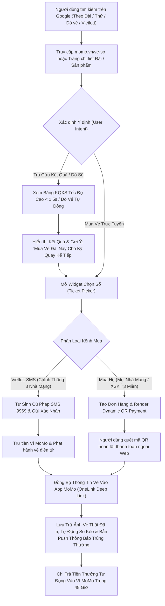

# BRD: Cổng Tiện Ích Vé Số & Mua Vé Số Trực Tuyến MoMo (MoMo Lottery Hub)
## Cổng Tra Cứu Kết Quả Vé Số Sạch, Mua Vé Số Chính Thống & Công Cụ Tăng Trưởng Người Dùng Mới (PLG Web-to-App Engine)

> - **Project:** Cổng Tiện Ích Vé Số & Mua Vé Số Trực Tuyến (MoMo Lottery Hub)
> - **Main URL:** momo.vn/ve-so
> - **Division:** Growth Platform Division (Web Platform)
> - **Governance:** Web Product Lead
> - **Version:** 2.6 · Tháng 09/2026
> - **Status:** Active / Sẵn sàng triển khai
> - **Business Model:** Utility-Led Product-Led Growth (PLG), Chuyển đổi Web-to-App, Phí giao dịch thanh toán & Doanh thu hợp tác phân phối

---

> **Problem:** Nhu cầu tìm kiếm tra cứu kết quả xổ số và mua vé số tại Việt Nam cực kỳ khổng lồ (> 1,54 tỷ lượt tìm kiếm/năm trong bộ dữ liệu thị trường), nhưng 100% website tra cứu hiện nay đều phân mảnh, giao diện cũ kỹ, ngập tràn quảng cáo cờ bạc lừa đảo; trong khi người dùng có nhu cầu tra cứu chi tiết theo từng đài phát hành (28,8 triệu search) và theo thứ/ngày (106,7 triệu search) kèm ý định mua vé số trực tuyến chính thống an toàn, tự động trả thưởng về ví điện tử mà không bị giới hạn nhà mạng viễn thông.
> **KPI Owned:** Lượng người dùng tương tác hàng tháng ngoài Web (Monthly Engaged Users - MEU) đạt >= 500.000 MEU/tháng, đóng góp 25.000 - 35.000 New Installs & Logins/tháng vào App MoMo; Tỷ lệ nhấp chuyển đổi (Click-to-App CTR) đạt >= 12.0% → Đo lường qua GA4, AppsFlyer OneLink và MoMo Analytics.
> **Conversion Flow:** [Tìm kiếm Google theo Đài / Thứ / Dò vé / Vietlott] → [Truy cập momo.vn/ve-so hoặc Trang chi tiết Đài/Sản phẩm] → [Tra cứu KQXS Real-time / Dò số tự động / Chọn số vé may mắn trên Web Utility] → [Thanh toán Native Web Dynamic QR hoặc Nhận SMS Đặt vé] → [Mở App MoMo nhận thông báo trúng thưởng & Tự động trả thưởng về Ví MoMo].

---

## 1. Executive Summary

### 1.1 Situation (Hiện Trạng)
Xổ số kiến thiết (XSKT) và Xổ số điện toán (Vietlott) là thói quen giải trí thường nhật gắn liền với đời sống của hàng chục triệu người dân Việt Nam. Dữ liệu thực tế từ 4 bộ tệp từ khóa thị trường (8.387 keywords) ghi nhận tổng dung lượng tìm kiếm đạt **1.544.758.200 lượt tìm kiếm** (hơn **1,54 tỷ lượt**), phân bổ thành các nhóm nhu cầu lớn:
* Nhóm tra cứu kết quả theo vùng miền và toàn quốc: > 1,44 tỷ lượt search.
* Nhóm tra cứu chi tiết theo thứ trong tuần, ngày mở thưởng và chu kỳ lịch sử: > 106,7 triệu lượt search.
* Nhóm tra cứu đích danh theo 41 đài phát hành XSKT tỉnh thành (Đà Lạt, TP.HCM, Khánh Hòa, Cần Thơ...): > 28,8 triệu lượt search.
* Nhóm tìm kiếm dòng sản phẩm Vietlott (Power 6/55, Mega 6/45, Keno, Max 3D, Lotto 5/35, Bingo18): > 86,2 triệu lượt search.

### 1.2 Quyết Định Kiến Trúc Tên Miền Gốc: `momo.vn/ve-so`
Dự án thống nhất chọn **`momo.vn/ve-so`** làm thư mục gốc (Root Path) thay vì `/xo-so` vì các lý do chiến lược:
1. **Định Vị Thiên Về Hành Động & Thương Mại (Action & Transactional Focus):** Danh từ *"Vé Số"* mang tính vật thể, gắn liền trực tiếp với hành vi **Mua vé**, **Dò vé**, **Lưu vé** và **Trả thưởng**, phù hợp trọn vẹn với định vị Product-Led Growth (PLG) của MoMo (không đơn thuần là một trang cào kết quả tĩnh).
2. **Bao Quát Cả 2 Trục Sản Phẩm:** Cụm từ *"Vé số"* là thuật ngữ chung bao hàm trọn vẹn cả *Vé số Vietlott*, *Vé số Kiến thiết 3 Miền* và *Vé số Điện toán Thủ Đô*.
3. **Cấu Trúc Topic Silo Rõ Ràng:** Mọi nhánh con phục vụ Dò số (`/ve-so/do-so`), Trực tiếp (`/ve-so/truc-tiep`), Đài tỉnh thành (`/ve-so/da-lat`, `/ve-so/ho-chi-minh`), Vietlott (`/ve-so/vietlott/...`) và Cẩm nang (`/ve-so/blog/...`) đều được gom vào một hệ sinh thái đồng nhất.

### 1.3 Resolution (Giải Pháp & Chiến Lược Đánh Bất Đối Xứng)
Xây dựng **Cổng Tiện Ích Vé Số & Mua Vé Số Trực Tuyến (MoMo Lottery Hub)** tại `momo.vn/ve-so` theo mô hình **Product-Led Growth (PLG)**, áp dụng chiến lược tấn công bất đối xứng:
* **Đánh ngách High-intent & Đài Tỉnh Thành (Station Matrix & Day-of-Week):** Khởi tạo hệ thống Programmatic SEO (pSEO) phủ 41 đài phát hành XSKT và 21 trang theo thứ trong tuần, kết hợp 5 cụm Quick Wins (Dò vé số thông minh, Trực tiếp real-time, Vietlott SMS hướng dẫn sửa lỗi, Bảng tính thuế TNCN, Thống kê chu kỳ).
* **Định vị Cổng Kết Quả Sạch Sẽ (Zero-Ad Experience):** Tải trang < 1.5s, 100% không quảng cáo rác, bảo chứng bằng uy tín thương hiệu tài chính số 1 Việt Nam.
* **Hạ Tầng Mua Vé & Thanh Toán Native Web Dynamic QR:** Cho phép chọn số trực quan cho toàn bộ 4 nhóm sản phẩm Vietlott và XSKT 3 miền, thanh toán tức thì ngoài Web không bắt buộc tải app trước.
* **Cơ Chế Khóa Người Dùng Vào App (Web-to-App Retention):** Lưu giữ vé điện tử định danh CCCD, tự động so kết quả và chi trả thưởng tự động về Ví MoMo (< 10 triệu) trong 48 giờ.

---

## 2. Bối Cảnh Thị Trường & Phân Tích Dữ Liệu Intent (Market Opportunity)

### 2.1 Quy Mô Nhu Cầu Tìm Kiếm Tổng Thể

<table style="width:100%; border-collapse:collapse; border:1.5px solid #64748b; margin:1em 0; font-size:0.9em;">
  <thead>
    <tr style="background-color:#f1f5f9;">
      <th style="border:1.5px solid #64748b; padding:8px 12px; text-align:left; font-weight:700;">Cụm Từ Khóa Tìm Kiếm</th>
      <th style="border:1.5px solid #64748b; padding:8px 12px; text-align:left; font-weight:700;">Nội Dung Trọng Tâm</th>
      <th style="border:1.5px solid #64748b; padding:8px 12px; text-align:left; font-weight:700;">Số Lượng Keywords</th>
      <th style="border:1.5px solid #64748b; padding:8px 12px; text-align:left; font-weight:700;">Tổng Search Volume</th>
      <th style="border:1.5px solid #64748b; padding:8px 12px; text-align:left; font-weight:700;">Tỷ Trọng (%)</th>
    </tr>
  </thead>
  <tbody>
    <tr>
      <td style="border:1px solid #94a3b8; padding:8px 12px; text-align:left;"><strong>Cụm Xổ Số Truyền Thống</strong></td>
      <td style="border:1px solid #94a3b8; padding:8px 12px; text-align:left;">Tra cứu KQXS 3 miền, kết quả trực tiếp, xổ số các tỉnh thành</td>
      <td style="border:1px solid #94a3b8; padding:8px 12px; text-align:left;">5.114</td>
      <td style="border:1px solid #94a3b8; padding:8px 12px; text-align:left;"><strong>1.445.235.780</strong></td>
      <td style="border:1px solid #94a3b8; padding:8px 12px; text-align:left;">93,56%</td>
    </tr>
    <tr style="background-color:#f8fafc;">
      <td style="border:1px solid #94a3b8; padding:8px 12px; text-align:left;"><strong>Cụm Vietlott & Điện Toán</strong></td>
      <td style="border:1px solid #94a3b8; padding:8px 12px; text-align:left;">Vietlott SMS, Power 6/55, Mega 6/45, Keno, Max 3D, Lotto 5/35</td>
      <td style="border:1px solid #94a3b8; padding:8px 12px; text-align:left;">1.319</td>
      <td style="border:1px solid #94a3b8; padding:8px 12px; text-align:left;"><strong>86.246.420</strong></td>
      <td style="border:1px solid #94a3b8; padding:8px 12px; text-align:left;">5,58%</td>
    </tr>
    <tr>
      <td style="border:1px solid #94a3b8; padding:8px 12px; text-align:left;"><strong>Cụm Từ Khóa Viết Tắt XSKT</strong></td>
      <td style="border:1px solid #94a3b8; padding:8px 12px; text-align:left;">Từ khóa viết tắt tra cứu XSKT theo đài và khu vực</td>
      <td style="border:1px solid #94a3b8; padding:8px 12px; text-align:left;">281</td>
      <td style="border:1px solid #94a3b8; padding:8px 12px; text-align:left;"><strong>12.743.240</strong></td>
      <td style="border:1px solid #94a3b8; padding:8px 12px; text-align:left;">0,82%</td>
    </tr>
    <tr style="background-color:#f8fafc;">
      <td style="border:1px solid #94a3b8; padding:8px 12px; text-align:left;"><strong>Cụm Dò Vé & Mua Vé Trực Tuyến</strong></td>
      <td style="border:1px solid #94a3b8; padding:8px 12px; text-align:left;">Dò vé số, cơ cấu trúng giải, vé số cào, đại lý vé số</td>
      <td style="border:1px solid #94a3b8; padding:8px 12px; text-align:left;">1.673</td>
      <td style="border:1px solid #94a3b8; padding:8px 12px; text-align:left;"><strong>532.760</strong></td>
      <td style="border:1px solid #94a3b8; padding:8px 12px; text-align:left;">0,04%</td>
    </tr>
    <tr>
      <td style="border:1.5px solid #64748b; padding:8px 12px; text-align:left; font-weight:700;"><strong>TỔNG CỘNG</strong></td>
      <td style="border:1.5px solid #64748b; padding:8px 12px; text-align:left; font-weight:700;">Toàn bộ vertical Xổ Số / Vé Số</td>
      <td style="border:1.5px solid #64748b; padding:8px 12px; text-align:left; font-weight:700;"><strong>8.387</strong></td>
      <td style="border:1.5px solid #64748b; padding:8px 12px; text-align:left; font-weight:700;"><strong>1.544.758.200</strong></td>
      <td style="border:1.5px solid #64748b; padding:8px 12px; text-align:left; font-weight:700;"><strong>100%</strong></td>
    </tr>
  </tbody>
</table>

---

### 2.2 Phân Rã Dữ Liệu Tra Cứu Theo 41 Đài Phát Hành Tỉnh Thành (28,8 Triệu Search)

<table style="width:100%; border-collapse:collapse; border:1.5px solid #64748b; margin:1em 0; font-size:0.9em;">
  <thead>
    <tr style="background-color:#f1f5f9;">
      <th style="border:1.5px solid #64748b; padding:8px 12px; text-align:left; font-weight:700;">Khu Vực</th>
      <th style="border:1.5px solid #64748b; padding:8px 12px; text-align:left; font-weight:700;">Tên Đài Phát Hành</th>
      <th style="border:1.5px solid #64748b; padding:8px 12px; text-align:left; font-weight:700;">Lịch Mở Thưởng</th>
      <th style="border:1.5px solid #64748b; padding:8px 12px; text-align:left; font-weight:700;">Search Volume Thực Tế</th>
      <th style="border:1.5px solid #64748b; padding:8px 12px; text-align:left; font-weight:700;">Từ Khóa Mẫu Tiêu Biểu</th>
    </tr>
  </thead>
  <tbody>
    <tr>
      <td style="border:1px solid #94a3b8; padding:8px 12px; text-align:left;" rowspan="9"><strong>Miền Nam (21 Đài)</strong></td>
      <td style="border:1px solid #94a3b8; padding:8px 12px; text-align:left;"><strong>TP. Hồ Chí Minh</strong></td>
      <td style="border:1px solid #94a3b8; padding:8px 12px; text-align:left;">Thứ 2 & Thứ 7</td>
      <td style="border:1px solid #94a3b8; padding:8px 12px; text-align:left;"><strong>1.703.420</strong></td>
      <td style="border:1px solid #94a3b8; padding:8px 12px; text-align:left;"><code>vé số hcm</code>, <code>xổ số tphcm hôm nay</code>, <code>xshcm thứ 7</code></td>
    </tr>
    <tr style="background-color:#f8fafc;">
      <td style="border:1px solid #94a3b8; padding:8px 12px; text-align:left;"><strong>Kiên Giang</strong></td>
      <td style="border:1px solid #94a3b8; padding:8px 12px; text-align:left;">Chủ Nhật</td>
      <td style="border:1px solid #94a3b8; padding:8px 12px; text-align:left;"><strong>919.190</strong></td>
      <td style="border:1px solid #94a3b8; padding:8px 12px; text-align:left;"><code>vé số kiên giang</code>, <code>xổ số kiên giang tuần rồi</code></td>
    </tr>
    <tr>
      <td style="border:1px solid #94a3b8; padding:8px 12px; text-align:left;"><strong>Bạc Liêu</strong></td>
      <td style="border:1px solid #94a3b8; padding:8px 12px; text-align:left;">Thứ 3</td>
      <td style="border:1px solid #94a3b8; padding:8px 12px; text-align:left;"><strong>832.750</strong></td>
      <td style="border:1px solid #94a3b8; padding:8px 12px; text-align:left;"><code>xổ số bạc liêu</code>, <code>xskt bạc liêu</code></td>
    </tr>
    <tr style="background-color:#f8fafc;">
      <td style="border:1px solid #94a3b8; padding:8px 12px; text-align:left;"><strong>Cần Thơ</strong></td>
      <td style="border:1px solid #94a3b8; padding:8px 12px; text-align:left;">Thứ 4</td>
      <td style="border:1px solid #94a3b8; padding:8px 12px; text-align:left;"><strong>792.950</strong></td>
      <td style="border:1px solid #94a3b8; padding:8px 12px; text-align:left;"><code>xổ số cần thơ</code>, <code>vé số cần thơ hôm nay</code></td>
    </tr>
    <tr>
      <td style="border:1px solid #94a3b8; padding:8px 12px; text-align:left;"><strong>An Giang</strong></td>
      <td style="border:1px solid #94a3b8; padding:8px 12px; text-align:left;">Thứ 5</td>
      <td style="border:1px solid #94a3b8; padding:8px 12px; text-align:left;"><strong>775.360</strong></td>
      <td style="border:1px solid #94a3b8; padding:8px 12px; text-align:left;"><code>xổ số an giang</code>, <code>xs an giang hôm nay</code></td>
    </tr>
    <tr style="background-color:#f8fafc;">
      <td style="border:1px solid #94a3b8; padding:8px 12px; text-align:left;"><strong>Bình Dương</strong></td>
      <td style="border:1px solid #94a3b8; padding:8px 12px; text-align:left;">Thứ 6</td>
      <td style="border:1px solid #94a3b8; padding:8px 12px; text-align:left;"><strong>686.820</strong></td>
      <td style="border:1px solid #94a3b8; padding:8px 12px; text-align:left;"><code>xổ số bình dương</code>, <code>xskt bình dương</code></td>
    </tr>
    <tr>
      <td style="border:1px solid #94a3b8; padding:8px 12px; text-align:left;"><strong>Đồng Tháp</strong></td>
      <td style="border:1px solid #94a3b8; padding:8px 12px; text-align:left;">Thứ 2</td>
      <td style="border:1px solid #94a3b8; padding:8px 12px; text-align:left;"><strong>673.400</strong></td>
      <td style="border:1px solid #94a3b8; padding:8px 12px; text-align:left;"><code>xổ số đồng tháp</code>, <code>xs đồng tháp thứ 2</code></td>
    </tr>
    <tr style="background-color:#f8fafc;">
      <td style="border:1px solid #94a3b8; padding:8px 12px; text-align:left;"><strong>Vũng Tàu</strong></td>
      <td style="border:1px solid #94a3b8; padding:8px 12px; text-align:left;">Thứ 3</td>
      <td style="border:1px solid #94a3b8; padding:8px 12px; text-align:left;"><strong>570.880</strong></td>
      <td style="border:1px solid #94a3b8; padding:8px 12px; text-align:left;"><code>xổ số vũng tàu</code>, <code>vé số vũng tàu hôm nay</code></td>
    </tr>
    <tr>
      <td style="border:1px solid #94a3b8; padding:8px 12px; text-align:left;"><strong>Đà Lạt (Lâm Đồng)</strong></td>
      <td style="border:1px solid #94a3b8; padding:8px 12px; text-align:left;">Chủ Nhật</td>
      <td style="border:1px solid #94a3b8; padding:8px 12px; text-align:left;"><strong>447.400</strong></td>
      <td style="border:1px solid #94a3b8; padding:8px 12px; text-align:left;"><code>vé số đà lạt</code>, <code>xổ số đà lạt hôm nay</code>, <code>xs đà lạt cn</code></td>
    </tr>
    <tr style="background-color:#f8fafc;">
      <td style="border:1px solid #94a3b8; padding:8px 12px; text-align:left;" rowspan="5"><strong>Miền Trung (14 Đài)</strong></td>
      <td style="border:1px solid #94a3b8; padding:8px 12px; text-align:left;"><strong>Khánh Hòa (Nha Trang)</strong></td>
      <td style="border:1px solid #94a3b8; padding:8px 12px; text-align:left;">Thứ 4 & Chủ Nhật</td>
      <td style="border:1px solid #94a3b8; padding:8px 12px; text-align:left;"><strong>2.627.790</strong></td>
      <td style="border:1px solid #94a3b8; padding:8px 12px; text-align:left;"><code>xổ số khánh hòa</code>, <code>vé số khánh hòa hôm nay</code></td>
    </tr>
    <tr>
      <td style="border:1px solid #94a3b8; padding:8px 12px; text-align:left;"><strong>Bình Định</strong></td>
      <td style="border:1px solid #94a3b8; padding:8px 12px; text-align:left;">Thứ 5</td>
      <td style="border:1px solid #94a3b8; padding:8px 12px; text-align:left;"><strong>1.443.190</strong></td>
      <td style="border:1px solid #94a3b8; padding:8px 12px; text-align:left;"><code>xổ số bình định</code>, <code>xskt bình định</code></td>
    </tr>
    <tr style="background-color:#f8fafc;">
      <td style="border:1px solid #94a3b8; padding:8px 12px; text-align:left;"><strong>Gia Lai</strong></td>
      <td style="border:1px solid #94a3b8; padding:8px 12px; text-align:left;">Thứ 6</td>
      <td style="border:1px solid #94a3b8; padding:8px 12px; text-align:left;"><strong>1.365.480</strong></td>
      <td style="border:1px solid #94a3b8; padding:8px 12px; text-align:left;"><code>xổ số gia lai</code>, <code>xs gia lai hôm nay</code></td>
    </tr>
    <tr>
      <td style="border:1px solid #94a3b8; padding:8px 12px; text-align:left;"><strong>Phú Yên</strong></td>
      <td style="border:1px solid #94a3b8; padding:8px 12px; text-align:left;">Thứ 2</td>
      <td style="border:1px solid #94a3b8; padding:8px 12px; text-align:left;"><strong>1.247.960</strong></td>
      <td style="border:1px solid #94a3b8; padding:8px 12px; text-align:left;"><code>xổ số phú yên</code>, <code>xskt phú yên</code></td>
    </tr>
    <tr style="background-color:#f8fafc;">
      <td style="border:1px solid #94a3b8; padding:8px 12px; text-align:left;"><strong>Đà Nẵng</strong></td>
      <td style="border:1px solid #94a3b8; padding:8px 12px; text-align:left;">Thứ 4 & Thứ 7</td>
      <td style="border:1px solid #94a3b8; padding:8px 12px; text-align:left;"><strong>997.600</strong></td>
      <td style="border:1px solid #94a3b8; padding:8px 12px; text-align:left;"><code>xổ số đà nẵng</code>, <code>xs đà nẵng hôm nay</code></td>
    </tr>
    <tr>
      <td style="border:1px solid #94a3b8; padding:8px 12px; text-align:left;"><strong>Miền Bắc (6 Đài)</strong></td>
      <td style="border:1px solid #94a3b8; padding:8px 12px; text-align:left;"><strong>Hà Nội (Thủ Đô)</strong></td>
      <td style="border:1px solid #94a3b8; padding:8px 12px; text-align:left;">Thứ 2 & Thứ 5</td>
      <td style="border:1px solid #94a3b8; padding:8px 12px; text-align:left;"><strong>4.561.380</strong></td>
      <td style="border:1px solid #94a3b8; padding:8px 12px; text-align:left;"><code>xổ số hà nội</code>, <code>vé số thủ đô hôm nay</code>, <code>xskt hà nội</code></td>
    </tr>
    <tr style="background-color:#f8fafc;">
      <td style="border:1.5px solid #64748b; padding:8px 12px; text-align:left; font-weight:700;" colspan="3"><strong>TỔNG CỘNG THEO ĐÀI PHÁT HÀNH (41 ĐÀI)</strong></td>
      <td style="border:1.5px solid #64748b; padding:8px 12px; text-align:left; font-weight:700;"><strong>28.894.340</strong></td>
      <td style="border:1.5px solid #64748b; padding:8px 12px; text-align:left;">Nhu cầu tra cứu đài địa phương lặp lại cố định theo tuần.</td>
    </tr>
  </tbody>
</table>

---

### 2.3 Phân Tích Nhu Cầu Chi Tiết: Đài x Thứ x Chu Kỳ (106,7 Triệu Search)

Có **1.326 từ khóa** thể hiện rõ ý định tìm kiếm kết hợp giữa `[Xem KQXS] + [Đài/Tỉnh/Miền] + [Ngày/Thứ/Thời gian]`:
* **Nhóm Đài/Miền + Thứ trong tuần (550k/từ):** `xổ số miền nam thứ tư` (550k), `xổ số miền nam chủ nhật hàng tuần` (550k), `xổ số miền bắc thứ hai hàng tuần` (368k).
* **Nhóm Tỉnh thành + Hôm nay/Hôm qua:** `xổ số hà nội hôm nay` (201k), `xổ số khánh hòa hôm nay` (165k), `xổ số gia lai hôm nay` (90.5k).
* **Nhóm Chu kỳ lịch sử 30–100 ngày:** `kết quả xổ số miền bắc 30 ngày` (1.000.000), `xsmb 30 ngày` (550k), `xổ số miền bắc 90 ngày` (165k).

---

### 2.4 Tiêu Chuẩn Đánh Giá Của Google & Lợi Thế Cạnh Tranh E-E-A-T / YMYL Của MoMo

Google xếp vertical vé số và tài chính trúng thưởng vào nhóm phân loại rủi ro cao nhất là **YMYL (Your Money Your Life - Financial Information)** và áp dụng các tiêu chuẩn thuật toán nghiêm ngặt:

1. **Phân Định Xổ Số Nhà Nước (Legal State Lottery) vs Cờ Bạc Phi Pháp (Illegal Gambling):**
   * XSKT và Vietlott là dịch vụ xổ số do Nhà nước Việt Nam quản lý, được Google coi là nội dung hợp pháp.
   * Các đối thủ cũ (Minh Ngọc, XSKT, Ketqua.net...) kiếm tiền bằng cách nhúng mã theo dõi và banner quảng cáo cá cược lậu (Kubet, 888...), liên tục bị Google trừng phạt trong các đợt cập nhật *Spam & Site Reputation Abuse Update*. MoMo định vị **100% Zero-Ad** đạt điểm tín nhiệm cao nhất.
2. **Ma Trận Đánh Giá E-E-A-T Giữa MoMo Và Đối Thủ:**

<table style="width:100%; border-collapse:collapse; border:1.5px solid #64748b; margin:1em 0; font-size:0.9em;">
  <thead>
    <tr style="background-color:#f1f5f9;">
      <th style="border:1.5px solid #64748b; padding:8px 12px; text-align:left; font-weight:700;">Trụ Cột E-E-A-T</th>
      <th style="border:1.5px solid #64748b; padding:8px 12px; text-align:left; font-weight:700;">Yêu Cầu Của Thuật Toán Google</th>
      <th style="border:1.5px solid #64748b; padding:8px 12px; text-align:left; font-weight:700;">Đánh Giá Về MoMo</th>
      <th style="border:1.5px solid #64748b; padding:8px 12px; text-align:left; font-weight:700;">Đánh Giá Về Đối Thủ Hiện Tại</th>
    </tr>
  </thead>
  <tbody>
    <tr>
      <td style="border:1px solid #94a3b8; padding:8px 12px; text-align:left;"><strong>Trustworthiness<br>(Độ Tin Cậy)</strong></td>
      <td style="border:1px solid #94a3b8; padding:8px 12px; text-align:left;">Pháp nhân minh bạch, có giấy phép tài chính, cổng thanh toán bảo mật PCI DSS, kết nối chính thống.</td>
      <td style="border:1px solid #94a3b8; padding:8px 12px; text-align:left;"><strong>Điểm Entity Trust tối đa:</strong> Trung gian thanh toán cấp phép bởi NHNN, đối tác chính thức Vietlott.</td>
      <td style="border:1px solid #94a3b8; padding:8px 12px; text-align:left;"><strong>Rất thấp:</strong> Ẩn danh chủ sở hữu, không có giấy phép tài chính, đặt server lậu.</td>
    </tr>
    <tr style="background-color:#f8fafc;">
      <td style="border:1px solid #94a3b8; padding:8px 12px; text-align:left;"><strong>Authoritativeness<br>(Thẩm Quyền)</strong></td>
      <td style="border:1px solid #94a3b8; padding:8px 12px; text-align:left;">Được báo chí và cơ quan nhà nước dẫn nguồn, Domain Rating cao.</td>
      <td style="border:1px solid #94a3b8; padding:8px 12px; text-align:left;"><strong>Rất cao:</strong> Domain Rating DR 80+, thương hiệu Fintech số 1 Việt Nam.</td>
      <td style="border:1px solid #94a3b8; padding:8px 12px; text-align:left;"><strong>Trung bình:</strong> Chỉ có backlink cào dữ liệu, thiếu uy tín tài chính.</td>
    </tr>
    <tr>
      <td style="border:1px solid #94a3b8; padding:8px 12px; text-align:left;"><strong>Expertise<br>(Chuyên Môn)</strong></td>
      <td style="border:1px solid #94a3b8; padding:8px 12px; text-align:left;">Luật chơi chính xác, minh bạch thuế TNCN, không có nội dung soi cầu lừa đảo.</td>
      <td style="border:1px solid #94a3b8; padding:8px 12px; text-align:left;"><strong>Chuẩn mực:</strong> Dữ liệu từ Bộ Tài chính và Vietlott SMS, có bảng tính thuế tự động.</td>
      <td style="border:1px solid #94a3b8; padding:8px 12px; text-align:left;"><strong>Kém:</strong> Nội dung rác tự động, nhồi nhét từ khóa soi cầu bất hợp pháp.</td>
    </tr>
    <tr style="background-color:#f8fafc;">
      <td style="border:1px solid #94a3b8; padding:8px 12px; text-align:left;"><strong>Experience<br>(Trải Nghiệm)</strong></td>
      <td style="border:1px solid #94a3b8; padding:8px 12px; text-align:left;">Hướng dẫn thao tác thực tế, công cụ tiện ích tương tác thật.</td>
      <td style="border:1px solid #94a3b8; padding:8px 12px; text-align:left;"><strong>Vượt trội:</strong> Có Widget Dò vé số, Ticket Picker chọn số, trả thưởng tự động về Ví.</td>
      <td style="border:1px solid #94a3b8; padding:8px 12px; text-align:left;"><strong>Không có:</strong> Chỉ là bảng số tĩnh, không có tiện ích giao dịch.</td>
    </tr>
  </tbody>
</table>

3. **Core Web Vitals & Trải Nghiệm Trang Đích:**
   * Tốc độ tải trang (LCP) < 1.5s (chuẩn Google < 2.5s).
   * Độ ổn định giao diện (CLS) đạt mức tuyệt đối 0.00 do 100% không chứa banner quảng cáo tự động nhảy khung hình.
   * Tích hợp cấu trúc dữ liệu Schema JSON-LD chuẩn (`LotteryResult`, `HowTo`, `FAQPage`) để chiếm vị trí **Top 0 (Featured Snippets)** và **Google AI Overviews**.

---

## 3. Nghiên Cứu Sâu Hệ Sinh Thái Sản Phẩm Vietlott & Vé Số

### 3.1 4 Nhóm Loại Hình Sản Phẩm Vietlott Cốt Lõi

<table style="width:100%; border-collapse:collapse; border:1.5px solid #64748b; margin:1em 0; font-size:0.9em;">
  <thead>
    <tr style="background-color:#f1f5f9;">
      <th style="border:1.5px solid #64748b; padding:8px 12px; text-align:left; font-weight:700;">Nhóm Loại Hình</th>
      <th style="border:1.5px solid #64748b; padding:8px 12px; text-align:left; font-weight:700;">Sản Phẩm Cụ Thể</th>
      <th style="border:1.5px solid #64748b; padding:8px 12px; text-align:left; font-weight:700;">Cơ Chế Chọn Số</th>
      <th style="border:1.5px solid #64748b; padding:8px 12px; text-align:left; font-weight:700;">Lịch Quay Mở Thưởng</th>
      <th style="border:1.5px solid #64748b; padding:8px 12px; text-align:left; font-weight:700;">Cơ Cấu Giải Thưởng Cao Nhất</th>
      <th style="border:1.5px solid #64748b; padding:8px 12px; text-align:left; font-weight:700;">Hạn Mức Đặt Vé</th>
    </tr>
  </thead>
  <tbody>
    <tr>
      <td style="border:1px solid #94a3b8; padding:8px 12px; text-align:left;" rowspan="2"><strong>1. Ma Trận Tích Lũy Jackpot (Matrix Games)</strong></td>
      <td style="border:1px solid #94a3b8; padding:8px 12px; text-align:left;"><strong>Power 6/55</strong></td>
      <td style="border:1px solid #94a3b8; padding:8px 12px; text-align:left;">Chọn 6 số từ 01 đến 55 (+ 1 số đặc biệt xét Jackpot 2).</td>
      <td style="border:1px solid #94a3b8; padding:8px 12px; text-align:left;">18h00 Thứ 3, Thứ 5, Thứ 7</td>
      <td style="border:1px solid #94a3b8; padding:8px 12px; text-align:left;"><strong>Jackpot 1:</strong> Tối thiểu 30 tỷ + tích lũy.<br><strong>Jackpot 2:</strong> Tối thiểu 3 tỷ + tích lũy.</td>
      <td style="border:1px solid #94a3b8; padding:8px 12px; text-align:left;">5.000.000đ/ngày</td>
    </tr>
    <tr style="background-color:#f8fafc;">
      <td style="border:1px solid #94a3b8; padding:8px 12px; text-align:left;"><strong>Mega 6/45</strong></td>
      <td style="border:1px solid #94a3b8; padding:8px 12px; text-align:left;">Chọn 6 số từ 01 đến 45.</td>
      <td style="border:1px solid #94a3b8; padding:8px 12px; text-align:left;">18h00 Thứ 4, Thứ 6, Chủ Nhật</td>
      <td style="border:1px solid #94a3b8; padding:8px 12px; text-align:left;"><strong>Jackpot:</strong> Tối thiểu 12 tỷ + tích lũy không giới hạn.</td>
      <td style="border:1px solid #94a3b8; padding:8px 12px; text-align:left;">5.000.000đ/ngày</td>
    </tr>
    <tr>
      <td style="border:1px solid #94a3b8; padding:8px 12px; text-align:left;" rowspan="3"><strong>2. Dãy Số Cố Định (Digit Games)</strong></td>
      <td style="border:1px solid #94a3b8; padding:8px 12px; text-align:left;"><strong>Max 3D</strong></td>
      <td style="border:1px solid #94a3b8; padding:8px 12px; text-align:left;">Chọn 1 bộ ba số từ 000 đến 999.</td>
      <td style="border:1px solid #94a3b8; padding:8px 12px; text-align:left;">18h00 Thứ 2, Thứ 4, Thứ 6</td>
      <td style="border:1px solid #94a3b8; padding:8px 12px; text-align:left;">Giải Đặc biệt: <strong>1.000.000đ/vé</strong>.</td>
      <td style="border:1px solid #94a3b8; padding:8px 12px; text-align:left;" rowspan="2">5.000.000đ/ngày (tổng 2 loại)</td>
    </tr>
    <tr style="background-color:#f8fafc;">
      <td style="border:1px solid #94a3b8; padding:8px 12px; text-align:left;"><strong>Max 3D+</strong></td>
      <td style="border:1px solid #94a3b8; padding:8px 12px; text-align:left;">Chọn 1 cặp gồm 2 bộ ba số từ 000 đến 999.</td>
      <td style="border:1px solid #94a3b8; padding:8px 12px; text-align:left;">18h00 Thứ 2, Thứ 4, Thứ 6</td>
      <td style="border:1px solid #94a3b8; padding:8px 12px; text-align:left;">Giải Đặc biệt: <strong>1 tỷ đồng/vé</strong> (trùng 2 bộ giống nhau nhận 2 tỷ).</td>
    </tr>
    <tr>
      <td style="border:1px solid #94a3b8; padding:8px 12px; text-align:left;"><strong>Max 3D Pro</strong></td>
      <td style="border:1px solid #94a3b8; padding:8px 12px; text-align:left;">Chọn 2 bộ ba số từ 000 đến 999 (theo thứ tự quay).</td>
      <td style="border:1px solid #94a3b8; padding:8px 12px; text-align:left;">18h00 Thứ 3, Thứ 5, Thứ 7</td>
      <td style="border:1px solid #94a3b8; padding:8px 12px; text-align:left;">Giải Đặc biệt: <strong>2 tỷ đồng/vé</strong>.<br>Giải phụ Đặc biệt: 400 triệu.</td>
      <td style="border:1px solid #94a3b8; padding:8px 12px; text-align:left;">5.000.000đ/ngày</td>
    </tr>
    <tr style="background-color:#f8fafc;">
      <td style="border:1px solid #94a3b8; padding:8px 12px; text-align:left;"><strong>3. Ma Trận Lai & Chia Độc Đắc (Hybrid)</strong></td>
      <td style="border:1px solid #94a3b8; padding:8px 12px; text-align:left;"><strong>Lotto 5/35</strong></td>
      <td style="border:1px solid #94a3b8; padding:8px 12px; text-align:left;">Chọn 5 số chính (01–35) + 1 số đặc biệt (01–12).</td>
      <td style="border:1px solid #94a3b8; padding:8px 12px; text-align:left;"><strong>2 lần/ngày:</strong> 13h00 & 21h00 hàng ngày</td>
      <td style="border:1px solid #94a3b8; padding:8px 12px; text-align:left;">Giải Độc đắc: Tối thiểu <strong>6 tỷ đồng + tích lũy</strong>.<br><em>Khi Độc đắc > 12 tỷ:</em> Chia giải cho hạng Nhất - Năm vào kỳ 21h00 hôm sau.</td>
      <td style="border:1px solid #94a3b8; padding:8px 12px; text-align:left;">1.000.000đ/kỳ quay</td>
    </tr>
    <tr>
      <td style="border:1px solid #94a3b8; padding:8px 12px; text-align:left;" rowspan="2"><strong>4. Xổ Nhanh Liên Tục (Fast Draw)</strong></td>
      <td style="border:1px solid #94a3b8; padding:8px 12px; text-align:left;"><strong>Keno</strong></td>
      <td style="border:1px solid #94a3b8; padding:8px 12px; text-align:left;">Chọn 1–10 số trong tập 01–80 (quay 20 số).</td>
      <td style="border:1px solid #94a3b8; padding:8px 12px; text-align:left;"><strong>8 phút/kỳ:</strong> 191 kỳ/ngày (06h00–21h52)</td>
      <td style="border:1px solid #94a3b8; padding:8px 12px; text-align:left;">Bậc 10 trùng 10: <strong>2 tỷ đồng/vé</strong>.</td>
      <td style="border:1px solid #94a3b8; padding:8px 12px; text-align:left;">Theo hạn mức đối tác</td>
    </tr>
    <tr style="background-color:#f8fafc;">
      <td style="border:1px solid #94a3b8; padding:8px 12px; text-align:left;"><strong>Bingo18</strong></td>
      <td style="border:1px solid #94a3b8; padding:8px 12px; text-align:left;">Dự đoán 3 số (từ 1 đến 6), cộng tổng, Lớn - Hòa - Nhỏ.</td>
      <td style="border:1px solid #94a3b8; padding:8px 12px; text-align:left;"><strong>6 phút/kỳ:</strong> 159 kỳ/ngày (06h00–21h54)</td>
      <td style="border:1px solid #94a3b8; padding:8px 12px; text-align:left;">Tỷ lệ trả thưởng lên đến <strong>x120 lần tiền đặt</strong>.</td>
      <td style="border:1px solid #94a3b8; padding:8px 12px; text-align:left;">1.000.000đ/kỳ quay</td>
    </tr>
  </tbody>
</table>

### 3.2 Các Hình Thức Chơi Nâng Cao
* **Chơi Bao Số (Bao 5, 7, 8, 9... 18):** Cho phép người chơi tăng xác suất trúng Jackpot lên gấp hàng chục lần và nhận nhiều giải phụ cộng dồn.
* **Đặt Trước Nhiều Kỳ (Advance Draw):** Tự động mua vé cho 2–6 kỳ quay kế tiếp mà không lo quên ngày quay.

### 3.3 Phân Định 2 Trục Phân Phối Trên MoMo
1. **Trục 1: Vietlott SMS Chính Thống:** Phục vụ khách hàng dùng 3 nhà mạng (Viettel, VinaPhone, MobiFone), tạo cú pháp SMS 9969 tự động, trả thưởng tự động từ Vietlott về Ví MoMo (< 10 triệu) trong 48 giờ.
2. **Trục 2: Mua Hộ Vé Số (Đối tác Hợp Phong):** Phục vụ 100% người dùng thuộc mọi nhà mạng viễn thông, mở rộng sang Keno, Xổ số Điện toán Thủ Đô (Lô tô 2-3-5 số, Thần tài 4, 6x36) và Vé số Kiến thiết truyền thống 3 miền.

---

## 4. Định Hướng Dự Án: 2 Trọng Tâm Cốt Lõi (PLG Engine & Content Strategy)

### 4.1 Trục Product-Led Growth (PLG Engine) - Dò Vé & Mua Vé Trực Tiếp
* **Interactive Dò Vé Số Widget (`momo.vn/ve-so/do-so`):**
  * Nhập dãy số hoặc chọn ngày/đài ➔ Trả kết quả tức thì trong 0.5s: Giải thưởng, số tiền thực nhận sau thuế TNCN 10%.
  * Trigger: Nếu không trúng ➔ Gợi ý chọn vé Jackpot kỳ tới; nếu trúng thưởng ➔ Mở App MoMo kích hoạt nhận thưởng tự động.
* **Direct Web Ticket Picker (`momo.vn/ve-so/vietlott/...` & `/ve-so/[ma-dai]`):**
  * Khay chọn số trực quan (Tự chọn, Quick pick máy chọn, Chơi vé bao).
  * Thanh toán tức thì qua **Native Web Dynamic QR** hoặc **SMS Dispatcher** không bắt buộc tải app trước.
  * Khóa giá trị vào App: Đồng bộ vé điện tử có định danh CCCD và nhận push thông báo kết quả.

### 4.2 Trục Content Strategy - Cẩm Nang Toàn Tập Cách Chơi (`momo.vn/ve-so/blog`)
* **Kiến trúc Hub Blog Cẩm Nang:** Quy hoạch toàn bộ bài viết hướng dẫn luật chơi 7 game Vietlott, luật chơi bao số, hướng dẫn khắc phục lỗi Vietlott SMS (SIM 2 sóng, phân quyền iOS/Android) và công thức tính thuế TNCN (sử dụng URL tiền tố `/ve-so/blog/`, hiển thị nhãn UI Breadcrumbs là "Cẩm Nang").
* **Tối ưu E-E-A-T & GEO:** Sử dụng Schema `HowTo`, `FAQPage` để chiếm vị trí Top 0 (Featured Snippets) trên Google và làm nguồn dữ liệu trích dẫn chuẩn cho các mô hình AI (ChatGPT, Gemini, Perplexity).
* **Vòng lặp hợp lực (Synergy Loop):** Mọi bài viết cẩm nang đều nhúng Inline Ticket Picker để người dùng vừa đọc luật vừa có thể bấm chọn thử 1 vé may mắn ngay lập tức.

---

## 5. Phân Tích JTBD (Jobs-To-Be-Done)

### Job #1: Tra Cứu Kết Quả Theo Đài & Ngày Mở Thưởng
> "Tôi muốn kiểm tra kết quả của đài phát hành tờ vé số tôi đang giữ (ví dụ Đà Lạt hôm nay hoặc TP.HCM thứ 7) một cách nhanh chóng, chính xác mà không bị quảng cáo làm rối mắt."

<table style="width:100%; border-collapse:collapse; border:1.5px solid #64748b; margin:1em 0; font-size:0.9em;">
  <thead>
    <tr style="background-color:#f1f5f9;">
      <th style="border:1.5px solid #64748b; padding:8px 12px; text-align:left; font-weight:700;">Khía Cạnh (Dimension)</th>
      <th style="border:1.5px solid #64748b; padding:8px 12px; text-align:left; font-weight:700;">Nội Dung Chi Tiết</th>
    </tr>
  </thead>
  <tbody>
    <tr>
      <td style="border:1px solid #94a3b8; padding:8px 12px; text-align:left;">Functional</td>
      <td style="border:1px solid #94a3b8; padding:8px 12px; text-align:left;">Xem bảng kết quả đúng đài mở thưởng, đối chiếu các giải và xem thống kê đầu đuôi loto.</td>
    </tr>
    <tr style="background-color:#f8fafc;">
      <td style="border:1px solid #94a3b8; padding:8px 12px; text-align:left;">Emotional</td>
      <td style="border:1px solid #94a3b8; padding:8px 12px; text-align:left;">Hồi hộp, an tâm vì thông tin chính thống từ MoMo, không sợ sai lệch số.</td>
    </tr>
    <tr>
      <td style="border:1px solid #94a3b8; padding:8px 12px; text-align:left;">Social</td>
      <td style="border:1px solid #94a3b8; padding:8px 12px; text-align:left;">Bàn luận kết quả cùng người thân hoặc đồng nghiệp sau giờ làm.</td>
    </tr>
    <tr style="background-color:#f8fafc;">
      <td style="border:1px solid #94a3b8; padding:8px 12px; text-align:left;">Trigger</td>
      <td style="border:1px solid #94a3b8; padding:8px 12px; text-align:left;">Đến khung giờ quay thưởng của đài địa phương (16h15 XSMN, 17h15 XSMT, 18h15 XSMB).</td>
    </tr>
    <tr>
      <td style="border:1px solid #94a3b8; padding:8px 12px; text-align:left;">Search → App</td>
      <td style="border:1px solid #94a3b8; padding:8px 12px; text-align:left;">"vé số đà lạt hôm nay" → momo.vn/ve-so/da-lat → Tra cứu kết quả → CTA "Đặt mua vé đài Đà Lạt kỳ tới" → Mở App MoMo.</td>
    </tr>
  </tbody>
</table>

---

### Job #2: Mua Vé Vietlott Trực Tuyến & Săn Jackpot
> "Tôi thấy giải Jackpot Power 6/55 lên hơn 100 tỷ đồng, tôi muốn chọn nhanh bộ số yêu thích và mua vé chính thống ngay trên điện thoại mà không cần chạy ra đại lý."

<table style="width:100%; border-collapse:collapse; border:1.5px solid #64748b; margin:1em 0; font-size:0.9em;">
  <thead>
    <tr style="background-color:#f1f5f9;">
      <th style="border:1.5px solid #64748b; padding:8px 12px; text-align:left; font-weight:700;">Khía Cạnh (Dimension)</th>
      <th style="border:1.5px solid #64748b; padding:8px 12px; text-align:left; font-weight:700;">Nội Dung Chi Tiết</th>
    </tr>
  </thead>
  <tbody>
    <tr>
      <td style="border:1px solid #94a3b8; padding:8px 12px; text-align:left;">Functional</td>
      <td style="border:1px solid #94a3b8; padding:8px 12px; text-align:left;">Tự chọn 6 số (Power 6/55, Mega 6/45) hoặc chọn vé Bao 5/7/8/9, quét mã QR thanh toán 10.000đ/bộ số.</td>
    </tr>
    <tr style="background-color:#f8fafc;">
      <td style="border:1px solid #94a3b8; padding:8px 12px; text-align:left;">Emotional</td>
      <td style="border:1px solid #94a3b8; padding:8px 12px; text-align:left;">Kỳ vọng trúng thưởng lớn, hào hứng đón chờ kỳ quay 18h00.</td>
    </tr>
    <tr>
      <td style="border:1px solid #94a3b8; padding:8px 12px; text-align:left;">Social</td>
      <td style="border:1px solid #94a3b8; padding:8px 12px; text-align:left;">Chia sẻ bộ số may mắn với bạn bè, người thân cùng theo dõi.</td>
    </tr>
    <tr style="background-color:#f8fafc;">
      <td style="border:1px solid #94a3b8; padding:8px 12px; text-align:left;">Trigger</td>
      <td style="border:1px solid #94a3b8; padding:8px 12px; text-align:left;">Đọc tin tức Jackpot tăng cao kỷ lục hoặc thấy cảnh báo Jackpot vượt 100 tỷ trên MoMo.</td>
    </tr>
    <tr>
      <td style="border:1px solid #94a3b8; padding:8px 12px; text-align:left;">Search → App</td>
      <td style="border:1px solid #94a3b8; padding:8px 12px; text-align:left;">"mua vé vietlott online" → momo.vn/ve-so/vietlott/power-6-55 → Chọn số trên Ticket Picker → Quét QR thanh toán → Nhận vé trong App MoMo.</td>
    </tr>
  </tbody>
</table>

---

### Job #3: Dò Vé Số Tự Động & Kiểm Tra Quy Định Trả Thưởng
> "Tôi có vài tờ vé số mua của người bán dạo, tôi muốn nhập số vào xem trúng giải gì, giải an ủi tính sao và số tiền nhận được sau khi trừ thuế là bao nhiêu."

<table style="width:100%; border-collapse:collapse; border:1.5px solid #64748b; margin:1em 0; font-size:0.9em;">
  <thead>
    <tr style="background-color:#f1f5f9;">
      <th style="border:1.5px solid #64748b; padding:8px 12px; text-align:left; font-weight:700;">Khía Cạnh (Dimension)</th>
      <th style="border:1.5px solid #64748b; padding:8px 12px; text-align:left; font-weight:700;">Nội Dung Chi Tiết</th>
    </tr>
  </thead>
  <tbody>
    <tr>
      <td style="border:1px solid #94a3b8; padding:8px 12px; text-align:left;">Functional</td>
      <td style="border:1px solid #94a3b8; padding:8px 12px; text-align:left;">Nhập dãy số vào công cụ dò tự động, xem giải thích quy định giải phụ/an ủi và công thức tính thuế TNCN 10%.</td>
    </tr>
    <tr style="background-color:#f8fafc;">
      <td style="border:1px solid #94a3b8; padding:8px 12px; text-align:left;">Emotional</td>
      <td style="border:1px solid #94a3b8; padding:8px 12px; text-align:left;">Nhẹ nhõm, rõ ràng, không sợ bị tính thiếu tiền hay lừa đảo khi đi đổi thưởng.</td>
    </tr>
    <tr>
      <td style="border:1px solid #94a3b8; padding:8px 12px; text-align:left;">Social</td>
      <td style="border:1px solid #94a3b8; padding:8px 12px; text-align:left;">Hướng dẫn lại cho người thân cách dò số thông minh trên MoMo.</td>
    </tr>
    <tr style="background-color:#f8fafc;">
      <td style="border:1px solid #94a3b8; padding:8px 12px; text-align:left;">Trigger</td>
      <td style="border:1px solid #94a3b8; padding:8px 12px; text-align:left;">Vừa mua vé số xong và muốn kiểm tra kết quả ngay khi có kết quả quay thưởng.</td>
    </tr>
    <tr>
      <td style="border:1px solid #94a3b8; padding:8px 12px; text-align:left;">Search → App</td>
      <td style="border:1px solid #94a3b8; padding:8px 12px; text-align:left;">"dò vé số hôm nay" → momo.vn/ve-so/do-so → Nhập số → Nhận kết quả đối chiếu → Lưu kết quả vào App MoMo.</td>
    </tr>
  </tbody>
</table>

---

## 6. Kiến Trúc Web, Luồng Chuyển Đổi & Ma Trận Đài (Architecture & Station Matrix)

### 6.1 Cấu Trúc Sitemap Đơn Giản & Gọn Nhẹ (Chỉ 5 Nhóm Trang Chính)

Để tránh tạo trang tràn lan thiếu kiểm soát, toàn bộ Web Hub được khống chế gọn gàng trong **chỉ 5 nhóm trang cốt lõi**:

1. **Trang Chủ Master (`momo.vn/ve-so`):** 1 trang duy nhất ➔ Xem kết quả tổng hợp 3 miền & Vietlott hôm nay, dò vé nhanh.
2. **Trang 6 Dòng Vietlott (`momo.vn/ve-so/vietlott/...`):** 7 trang ➔ Xem Jackpot tích lũy, bảng KQXS kỳ mới nhất và khay chọn mua vé.
3. **Trang 41 Đài Tỉnh Thành (`momo.vn/ve-so/[ma-dai]`):** 41 đài ➔ Tra kết quả đài địa phương, quay số nóng/lạnh, thần số học và chọn 6 vé.
4. **Trang Theo Thứ Trong Tuần (`momo.vn/ve-so/[mien]/[thu]`):** 21 trang ➔ Xem nhanh kết quả tất cả các đài quay cùng ngày trong tuần.
5. **Cẩm Nang & Tiện Ích (`momo.vn/ve-so/blog` & `/ve-so/do-so`):** ~20 trang ➔ Hướng dẫn cách chơi, công cụ tính thuế và cào vé số nhận quà.

> **Quy tắc kiểm soát:** 100% các trang đài tỉnh thành và trang thứ trong tuần sử dụng chung **1 Dynamic Template** duy nhất, tự động đổ dữ liệu từ API, tuyệt đối không viết thủ công hay tạo trang rác trùng lặp.

```
momo.vn/ve-so (Master Hub)
│
├── /ve-so/vietlott (Landing Vietlott & 6 game: power-6-55, mega-6-45, keno...)
├── /ve-so/[ma-dai] (41 đài tỉnh thành: ho-chi-minh, da-lat, can-tho...)
├── /ve-so/[mien]/[thu] (21 trang theo thứ: mien-nam/thu-hai...)
├── /ve-so/do-so & /ve-so/tinh-thue (Bộ tiện ích dò vé & tính thuế)
└── /ve-so/blog (Sổ tay cẩm nang & hướng dẫn cách chơi)
```

### 6.2 Cấu Trúc Hiển Thị Kết Quả Vietlott 3 Cấp Độ & Mô Hình Trang Hybrid (3-Tier Vietlott Results Architecture)

<table style="width:100%; border-collapse:collapse; border:1.5px solid #64748b; margin:1em 0; font-size:0.9em;">
  <thead>
    <tr style="background-color:#f1f5f9;">
      <th style="border:1.5px solid #64748b; padding:8px 12px; text-align:left; font-weight:700;">Cấp Độ</th>
      <th style="border:1.5px solid #64748b; padding:8px 12px; text-align:left; font-weight:700;">Đường Dẫn URL</th>
      <th style="border:1.5px solid #64748b; padding:8px 12px; text-align:left; font-weight:700;">Nội Dung Kết Quả Hiển Thị</th>
      <th style="border:1.5px solid #64748b; padding:8px 12px; text-align:left; font-weight:700;">Target Search Intent</th>
    </tr>
  </thead>
  <tbody>
    <tr>
      <td style="border:1px solid #94a3b8; padding:8px 12px; text-align:left;"><strong>Cấp 1: Master Hub</strong></td>
      <td style="border:1px solid #94a3b8; padding:8px 12px; text-align:left;"><code>momo.vn/ve-so</code><br>(Tab "Vietlott")</td>
      <td style="border:1px solid #94a3b8; padding:8px 12px; text-align:left;">Widget tóm tắt kết quả kỳ quay mới nhất của các game mở thưởng trong ngày (Power 6/55, Mega 6/45, Keno...) kèm giá trị Jackpot tích lũy.</td>
      <td style="border:1px solid #94a3b8; padding:8px 12px; text-align:left;"><code>kết quả xổ số</code>, <code>kqxs hôm nay</code>, <code>xổ số vietlott</code></td>
    </tr>
    <tr style="background-color:#f8fafc;">
      <td style="border:1px solid #94a3b8; padding:8px 12px; text-align:left;"><strong>Cấp 2: Hub Vietlott Tổng Hợp</strong></td>
      <td style="border:1px solid #94a3b8; padding:8px 12px; text-align:left;"><code>momo.vn/ve-so/vietlott</code></td>
      <td style="border:1px solid #94a3b8; padding:8px 12px; text-align:left;">Bảng tổng hợp toàn bộ kết quả của 7 sản phẩm Vietlott; đồng hồ đếm ngược giờ quay 18h00 và các kỳ xổ nhanh Keno/Bingo18 theo phút.</td>
      <td style="border:1px solid #94a3b8; padding:8px 12px; text-align:left;"><code>kết quả vietlott hôm nay</code> (550k), <code>kqxs vietlott</code>, <code>vietlott hôm nay</code></td>
    </tr>
    <tr>
      <td style="border:1px solid #94a3b8; padding:8px 12px; text-align:left;" rowspan="6"><strong>Cấp 3: Trang Chi Tiết Từng Dòng Game (Trọng Tâm SEO & Chuyển Đổi)</strong></td>
      <td style="border:1px solid #94a3b8; padding:8px 12px; text-align:left;"><code>momo.vn/ve-so/vietlott/power-6-55</code></td>
      <td style="border:1px solid #94a3b8; padding:8px 12px; text-align:left;">Bảng kết quả Power 6/55 mới nhất (6 số chính + 1 số đặc biệt Jackpot 2) + Lịch sử 30 kỳ quay + Giá trị Jackpot 1 & 2 tích lũy.</td>
      <td style="border:1px solid #94a3b8; padding:8px 12px; text-align:left;"><code>kết quả power 6 55</code> (110k), <code>kết quả vietlott 6 55 hôm nay</code></td>
    </tr>
    <tr style="background-color:#f8fafc;">
      <td style="border:1px solid #94a3b8; padding:8px 12px; text-align:left;"><code>momo.vn/ve-so/vietlott/mega-6-45</code></td>
      <td style="border:1px solid #94a3b8; padding:8px 12px; text-align:left;">Bảng kết quả 6 số Mega 6/45 + Lịch sử trúng giải + Trạng thái nổ Jackpot.</td>
      <td style="border:1px solid #94a3b8; padding:8px 12px; text-align:left;"><code>kết quả mega 6 45</code> (90k), <code>kết quả vietlott 6 45</code></td>
    </tr>
    <tr>
      <td style="border:1px solid #94a3b8; padding:8px 12px; text-align:left;"><code>momo.vn/ve-so/vietlott/keno</code></td>
      <td style="border:1px solid #94a3b8; padding:8px 12px; text-align:left;">Bảng kết quả 20 con số xổ nhanh trực tiếp theo từng kỳ 8 phút (191 kỳ/ngày).</td>
      <td style="border:1px solid #94a3b8; padding:8px 12px; text-align:left;"><code>kết quả keno</code> (49,5k), <code>kết quả keno hôm nay</code></td>
    </tr>
    <tr style="background-color:#f8fafc;">
      <td style="border:1px solid #94a3b8; padding:8px 12px; text-align:left;"><code>momo.vn/ve-so/vietlott/bingo-18</code></td>
      <td style="border:1px solid #94a3b8; padding:8px 12px; text-align:left;">Kết quả 3 con số, tổng điểm (3–18), kết quả Lớn - Hòa - Nhỏ theo từng kỳ 6 phút.</td>
      <td style="border:1px solid #94a3b8; padding:8px 12px; text-align:left;"><code>kết quả bingo 18</code>, <code>xổ số bingo18 hôm nay</code></td>
    </tr>
    <tr>
      <td style="border:1px solid #94a3b8; padding:8px 12px; text-align:left;"><code>momo.vn/ve-so/vietlott/max-3d-pro</code></td>
      <td style="border:1px solid #94a3b8; padding:8px 12px; text-align:left;">Kết quả 2 bộ ba số theo thứ tự quay thưởng của giải Đặc biệt và các giải phụ.</td>
      <td style="border:1px solid #94a3b8; padding:8px 12px; text-align:left;"><code>kết quả max 3d pro</code> (33k), <code>kqxs max 3d pro</code></td>
    </tr>
    <tr style="background-color:#f8fafc;">
      <td style="border:1px solid #94a3b8; padding:8px 12px; text-align:left;"><code>momo.vn/ve-so/vietlott/lotto-5-35</code></td>
      <td style="border:1px solid #94a3b8; padding:8px 12px; text-align:left;">Kết quả 5 số chính + 1 số đặc biệt của kỳ 13h00 và 21h00 hàng ngày.</td>
      <td style="border:1px solid #94a3b8; padding:8px 12px; text-align:left;"><code>kết quả lotto 5 35</code>, <code>lotto 5 35 hôm nay</code></td>
    </tr>
  </tbody>
</table>

**Mô Hình Trang Hybrid Chi Tiết Cho Từng Dòng Game (Hybrid Page Anatomy):**
1. **Hero Live Results:** Bảng kết quả kỳ mới nhất (Bộ số trúng thưởng + Quả bóng đặc biệt Jackpot 2 + Giá trị Jackpot tích lũy).
2. **Instant Ticket Checker:** Widget nhập số dự thưởng để đối soát ngay giải trúng.
3. **Direct Ticket Picker:** Khay chọn bộ số may mắn cho kỳ quay kế tiếp kèm nút quét mã QR MoMo thanh toán 10.000đ.
4. **Draw History & Frequency Matrix:** Bảng lịch sử 10–30 kỳ quay trước và bảng thống kê tần suất xuất hiện các con số.
5. **Contextual Knowledge Link:** Khối liên kết điều hướng sang cẩm nang luật chơi chi tiết tại `/ve-so/blog/...`.

---

### 6.3 Cấu Trúc Trang Đài Tỉnh Thành & Module Tiện Ích Tương Tác 41 Đài (Station Page Anatomy & Interactive Utilities)

Mỗi trang trong hệ sinh thái 41 đài phát hành tỉnh thành (ví dụ: `momo.vn/ve-so/da-lat`, `momo.vn/ve-so/ho-chi-minh`...) được quy hoạch thành một điểm bán vé và tương tác hoàn chỉnh gồm 6 khối chức năng:

<table style="width:100%; border-collapse:collapse; border:1.5px solid #64748b; margin:1em 0; font-size:0.9em;">
  <thead>
    <tr style="background-color:#f1f5f9;">
      <th style="border:1.5px solid #64748b; padding:8px 12px; text-align:left; font-weight:700;">Khối Giao Diện</th>
      <th style="border:1.5px solid #64748b; padding:8px 12px; text-align:left; font-weight:700;">Chức Năng Chi Tiết</th>
      <th style="border:1.5px solid #64748b; padding:8px 12px; text-align:left; font-weight:700;">Trải Nghiệm Tương Tác & Cơ Chế Kỹ Thuật</th>
    </tr>
  </thead>
  <tbody>
    <tr>
      <td style="border:1px solid #94a3b8; padding:8px 12px; text-align:left;"><strong>Khối 1: Hero KQXS Live Đài</strong></td>
      <td style="border:1px solid #94a3b8; padding:8px 12px; text-align:left;">Bảng kết quả kỳ mới nhất của riêng đài đó; đồng hồ đếm ngược đến kỳ quay tiếp theo.</td>
      <td style="border:1px solid #94a3b8; padding:8px 12px; text-align:left;">Real-time Lottery Feed API, tự động cập nhật ngay khi lồng cầu quay (16h15 XSMN, 17h15 XSMT, 18h15 XSMB).</td>
    </tr>
    <tr style="background-color:#f8fafc;">
      <td style="border:1px solid #94a3b8; padding:8px 12px; text-align:left;"><strong>Khối 2: Lịch Sử & Đầu Đuôi Loto</strong></td>
      <td style="border:1px solid #94a3b8; padding:8px 12px; text-align:left;">Lịch sử 30 kỳ quay liên tiếp và bảng thống kê đầu đuôi loto 2 số (00 đến 99).</td>
      <td style="border:1px solid #94a3b8; padding:8px 12px; text-align:left;">Tra cứu nhanh số liệu chu kỳ mở thưởng theo lịch phát hành cố định hàng tuần của đài.</td>
    </tr>
    <tr>
      <td style="border:1px solid #94a3b8; padding:8px 12px; text-align:left;"><strong>Khối 3: Số Nóng / Số Lạnh & Smart Shuffle</strong></td>
      <td style="border:1px solid #94a3b8; padding:8px 12px; text-align:left;">Thống kê Top 5 cặp số về nhiều nhất (Số Nóng) và lâu chưa về (Số Lạnh); nút bấm "Quay Số May Mắn".</td>
      <td style="border:1px solid #94a3b8; padding:8px 12px; text-align:left;">Hoạt họa lồng cầu quay sinh số có trọng số (< 1s) ➔ Nhả dãy 6 số hoàn chỉnh và tự động điền vào Khay vé.</td>
    </tr>
    <tr style="background-color:#f8fafc;">
      <td style="border:1px solid #94a3b8; padding:8px 12px; text-align:left;"><strong>Khối 4: Thần Số Học & Phong Thủy Bản Mệnh</strong></td>
      <td style="border:1px solid #94a3b8; padding:8px 12px; text-align:left;">Nhập ngày sinh ➔ Tính Con số chủ đạo (Life Path) + Ngũ hành Can Chi tương sinh với ngày quay đài ➔ Gợi ý 3 bộ số tài lộc.</td>
      <td style="border:1px solid #94a3b8; padding:8px 12px; text-align:left;">Tích hợp nút <strong>"Chia sẻ Thẻ Vận May"</strong> (Ảnh Story kèm mã QR lan truyền); gắn Schema <code>WebApplication</code>.</td>
    </tr>
    <tr>
      <td style="border:1px solid #94a3b8; padding:8px 12px; text-align:left;"><strong>Khối 5: Khay Chọn Đa Vé & Thanh Toán Kép</strong></td>
      <td style="border:1px solid #94a3b8; padding:8px 12px; text-align:left;">Khay chứa tối đa 6 bộ số (tự nhập hoặc lấy từ Khối 3, 4); Bộ tính tổng tiền tự động (10k - 60k).</td>
      <td style="border:1px solid #94a3b8; padding:8px 12px; text-align:left;">2 Cổng thanh toán: <strong>MoMo Native Dynamic QR</strong> (Quét mã/App MoMo) hoặc <strong>SMS 9969</strong> (Deep Link <code>sms:9969?body=...</code>); hỗ trợ lưu "Nuôi số bản mệnh" và Fallback tồn kho vé.</td>
    </tr>
    <tr style="background-color:#f8fafc;">
      <td style="border:1px solid #94a3b8; padding:8px 12px; text-align:left;"><strong>Khối 6: Cẩm Nang & Địa Chỉ Đổi Thưởng</strong></td>
      <td style="border:1px solid #94a3b8; padding:8px 12px; text-align:left;">Cơ cấu giải thưởng của đài, hướng dẫn thủ tục đổi vé trúng thưởng và quy định trả thưởng tự động về Ví MoMo.</td>
      <td style="border:1px solid #94a3b8; padding:8px 12px; text-align:left;">Nội dung chuẩn E-E-A-T và liên kết nội bộ (Internal Link) về <code>/ve-so/blog/...</code>.</td>
    </tr>
  </tbody>
</table>

---

### 6.4 Sơ Đồ Luồng Chuyển Đổi Người Dùng (Conversion Flow)



### 6.5 Bảng Phân Tích Chi Tiết Các Bước (Step Breakdown Table)

<table style="width:100%; border-collapse:collapse; border:1.5px solid #64748b; margin:1em 0; font-size:0.9em;">
  <thead>
    <tr style="background-color:#f1f5f9;">
      <th style="border:1.5px solid #64748b; padding:8px 12px; text-align:left; font-weight:700;">Bước</th>
      <th style="border:1.5px solid #64748b; padding:8px 12px; text-align:left; font-weight:700;">Tên Giai Đoạn</th>
      <th style="border:1.5px solid #64748b; padding:8px 12px; text-align:left; font-weight:700;">Trải Nghiệm Người Dùng (UX)</th>
      <th style="border:1.5px solid #64748b; padding:8px 12px; text-align:left; font-weight:700;">Hạ Tầng / Cơ Chế Kỹ Thuật</th>
      <th style="border:1.5px solid #64748b; padding:8px 12px; text-align:left; font-weight:700;">Nền Tảng</th>
    </tr>
  </thead>
  <tbody>
    <tr>
      <td style="border:1px solid #94a3b8; padding:8px 12px; text-align:left;">1</td>
      <td style="border:1px solid #94a3b8; padding:8px 12px; text-align:left;">Intent Discovery & Landing</td>
      <td style="border:1px solid #94a3b8; padding:8px 12px; text-align:left;">Tiếp cận trang web tốc độ cao (< 1.5s), xem đúng kết quả của đài/thứ tìm kiếm mà không bị quảng cáo rác làm phiền.</td>
      <td style="border:1px solid #94a3b8; padding:8px 12px; text-align:left;">MoSpark SSR / Next.js Edge Caching, Dynamic Lottery Real-time API.</td>
      <td style="border:1px solid #94a3b8; padding:8px 12px; text-align:left;">Web (Desktop & Mobile Web)</td>
    </tr>
    <tr style="background-color:#f8fafc;">
      <td style="border:1px solid #94a3b8; padding:8px 12px; text-align:left;">2</td>
      <td style="border:1px solid #94a3b8; padding:8px 12px; text-align:left;">Interactive Utility & Ticket Picker</td>
      <td style="border:1px solid #94a3b8; padding:8px 12px; text-align:left;">Dò vé tự động hoặc chọn các bộ số may mắn (tự chọn, máy chọn ngẫu nhiên, chơi vé bao, tra thần số học/số nóng).</td>
      <td style="border:1px solid #94a3b8; padding:8px 12px; text-align:left;">Web Ticket Picker Module, Bộ lọc đài thông minh theo định vị IP Vùng miền.</td>
      <td style="border:1px solid #94a3b8; padding:8px 12px; text-align:left;">Web Utility Component</td>
    </tr>
    <tr>
      <td style="border:1px solid #94a3b8; padding:8px 12px; text-align:left;">3</td>
      <td style="border:1px solid #94a3b8; padding:8px 12px; text-align:left;">Frictionless Checkout</td>
      <td style="border:1px solid #94a3b8; padding:8px 12px; text-align:left;">Thanh toán bằng cách quét mã QR MoMo hiển thị ngay trên màn hình hoặc gửi SMS xác nhận 9969.</td>
      <td style="border:1px solid #94a3b8; padding:8px 12px; text-align:left;">MoMo Native Dynamic QR Gateway API / Telecom Protocol Dispatcher.</td>
      <td style="border:1px solid #94a3b8; padding:8px 12px; text-align:left;">Web & Telecom Gateway</td>
    </tr>
    <tr style="background-color:#f8fafc;">
      <td style="border:1px solid #94a3b8; padding:8px 12px; text-align:left;">4</td>
      <td style="border:1px solid #94a3b8; padding:8px 12px; text-align:left;">Web-to-App Synchronization</td>
      <td style="border:1px solid #94a3b8; padding:8px 12px; text-align:left;">Mở App MoMo nhận thông báo mua vé thành công, lưu giữ hình ảnh vé thật đã in và theo dõi kỳ quay thưởng.</td>
      <td style="border:1px solid #94a3b8; padding:8px 12px; text-align:left;">AppsFlyer OneLink Deep Link, Cross-platform Identity Stitching.</td>
      <td style="border:1px solid #94a3b8; padding:8px 12px; text-align:left;">Web to App Bridge</td>
    </tr>
    <tr>
      <td style="border:1px solid #94a3b8; padding:8px 12px; text-align:left;">5</td>
      <td style="border:1px solid #94a3b8; padding:8px 12px; text-align:left;">Automated Payout & Retention</td>
      <td style="border:1px solid #94a3b8; padding:8px 12px; text-align:left;">Nhận thông báo trúng thưởng qua App/SMS và nhận tiền thưởng tự động chuyển vào Ví MoMo trong 48h.</td>
      <td style="border:1px solid #94a3b8; padding:8px 12px; text-align:left;">MoMo Auto-Disbursement Engine, Vietlott Payout Webhook.</td>
      <td style="border:1px solid #94a3b8; padding:8px 12px; text-align:left;">In-App MoMo Ecosystem</td>
    </tr>
  </tbody>
</table>

### 6.6 Danh Mục Tính Năng & Mức Độ Ưu Tiên (Feature Breakdown)

<table style="width:100%; border-collapse:collapse; border:1.5px solid #64748b; margin:1em 0; font-size:0.9em;">
  <thead>
    <tr style="background-color:#f1f5f9;">
      <th style="border:1.5px solid #64748b; padding:8px 12px; text-align:left; font-weight:700;">Hạng Mục Tính Năng</th>
      <th style="border:1.5px solid #64748b; padding:8px 12px; text-align:left; font-weight:700;">Mô Tả Chi Tiết</th>
      <th style="border:1.5px solid #64748b; padding:8px 12px; text-align:left; font-weight:700;">Ưu Tiên</th>
      <th style="border:1.5px solid #64748b; padding:8px 12px; text-align:left; font-weight:700;">Giai Đoạn</th>
    </tr>
  </thead>
  <tbody>
    <tr>
      <td style="border:1px solid #94a3b8; padding:8px 12px; text-align:left;"><strong>Master Template pSEO (41 Đài & 21 Thứ)</strong></td>
      <td style="border:1px solid #94a3b8; padding:8px 12px; text-align:left;">Tự động khởi tạo và cập nhật dữ liệu KQXS cho 41 đài phát hành và 21 trang theo thứ trong tuần dưới cây <code>/ve-so/</code>.</td>
      <td style="border:1px solid #94a3b8; padding:8px 12px; text-align:left;">P1 (Launch Blocker)</td>
      <td style="border:1px solid #94a3b8; padding:8px 12px; text-align:left;">Phase 1</td>
    </tr>
    <tr style="background-color:#f8fafc;">
      <td style="border:1px solid #94a3b8; padding:8px 12px; text-align:left;"><strong>Interactive Dò Vé Số Widget</strong></td>
      <td style="border:1px solid #94a3b8; padding:8px 12px; text-align:left;">Công cụ nhập số đối soát trúng thưởng trực tiếp tại <code>/ve-so/do-so</code>, tự động tính tiền thưởng thực nhận sau thuế.</td>
      <td style="border:1px solid #94a3b8; padding:8px 12px; text-align:left;">P1 (Launch Blocker)</td>
      <td style="border:1px solid #94a3b8; padding:8px 12px; text-align:left;">Phase 1</td>
    </tr>
    <tr>
      <td style="border:1px solid #94a3b8; padding:8px 12px; text-align:left;"><strong>Khay Chọn Đa Vé & Dual Checkout</strong></td>
      <td style="border:1px solid #94a3b8; padding:8px 12px; text-align:left;">Khay chọn tối đa 6 bộ số, bộ tính tiền tự động (10k-60k) và 2 cổng thanh toán MoMo Dynamic QR / SMS Dispatcher 9969.</td>
      <td style="border:1px solid #94a3b8; padding:8px 12px; text-align:left;">P1 (Launch Blocker)</td>
      <td style="border:1px solid #94a3b8; padding:8px 12px; text-align:left;">Phase 1</td>
    </tr>
    <tr style="background-color:#f8fafc;">
      <td style="border:1px solid #94a3b8; padding:8px 12px; text-align:left;"><strong>Module Số Nóng/Lạnh & Thần Số Học Đài</strong></td>
      <td style="border:1px solid #94a3b8; padding:8px 12px; text-align:left;">Tiện ích Shuffle quay số theo tần suất và công cụ tính con số tài lộc theo ngày sinh & ngũ hành đài trên 41 trang đài.</td>
      <td style="border:1px solid #94a3b8; padding:8px 12px; text-align:left;">P1 (Launch Blocker)</td>
      <td style="border:1px solid #94a3b8; padding:8px 12px; text-align:left;">Phase 1</td>
    </tr>
    <tr>
      <td style="border:1px solid #94a3b8; padding:8px 12px; text-align:left;"><strong>Sổ Tay Hướng Dẫn Vietlott E-E-A-T</strong></td>
      <td style="border:1px solid #94a3b8; padding:8px 12px; text-align:left;">Hệ thống bài viết tại <code>/ve-so/blog/</code> giải đáp luật chơi, cách chơi bao và khắc phục lỗi SMS.</td>
      <td style="border:1px solid #94a3b8; padding:8px 12px; text-align:left;">P1 (Launch Blocker)</td>
      <td style="border:1px solid #94a3b8; padding:8px 12px; text-align:left;">Phase 1</td>
    </tr>
    <tr style="background-color:#f8fafc;">
      <td style="border:1px solid #94a3b8; padding:8px 12px; text-align:left;"><strong>Thẻ Vận May Viral & Nuôi Số Bản Mệnh</strong></td>
      <td style="border:1px solid #94a3b8; padding:8px 12px; text-align:left;">Xuất ảnh Story Card chia sẻ bạn bè kèm QR mời gọi; lưu số may mắn và tự động gửi Push nhắc mua vé trước giờ quay.</td>
      <td style="border:1px solid #94a3b8; padding:8px 12px; text-align:left;">P2</td>
      <td style="border:1px solid #94a3b8; padding:8px 12px; text-align:left;">Phase 2</td>
    </tr>
    <tr>
      <td style="border:1px solid #94a3b8; padding:8px 12px; text-align:left;"><strong>Cảnh Báo Jackpot & Trigger Chia Độc Đắc</strong></td>
      <td style="border:1px solid #94a3b8; padding:8px 12px; text-align:left;">Tự động bật thông báo khi Jackpot Power 6/55 > 100 tỷ hoặc Lotto 5/35 > 12 tỷ (chia giải).</td>
      <td style="border:1px solid #94a3b8; padding:8px 12px; text-align:left;">P2</td>
      <td style="border:1px solid #94a3b8; padding:8px 12px; text-align:left;">Phase 2</td>
    </tr>
    <tr style="background-color:#f8fafc;">
      <td style="border:1px solid #94a3b8; padding:8px 12px; text-align:left;"><strong>Đặt Vé Trước Nhiều Kỳ (Advance Draw)</strong></td>
      <td style="border:1px solid #94a3b8; padding:8px 12px; text-align:left;">Tính năng đặt trước và giữ số dự thưởng tự động cho 2–6 kỳ quay liên tiếp.</td>
      <td style="border:1px solid #94a3b8; padding:8px 12px; text-align:left;">P2</td>
      <td style="border:1px solid #94a3b8; padding:8px 12px; text-align:left;">Phase 2</td>
    </tr>
    <tr>
      <td style="border:1px solid #94a3b8; padding:8px 12px; text-align:left;"><strong>Quét Vé Số Bằng Camera (OCR Web)</strong></td>
      <td style="border:1px solid #94a3b8; padding:8px 12px; text-align:left;">Nhận diện số trên vé giấy bằng camera trên trình duyệt để tự động điền vào công cụ dò vé.</td>
      <td style="border:1px solid #94a3b8; padding:8px 12px; text-align:left;">P3</td>
      <td style="border:1px solid #94a3b8; padding:8px 12px; text-align:left;">Phase 3</td>
    </tr>
  </tbody>
</table>

---

## 7. Mục Tiêu Thành Công (Success Metrics & KPIs)

### 7.1 Khung Chỉ Số Đo Lường

<table style="width:100%; border-collapse:collapse; border:1.5px solid #64748b; margin:1em 0; font-size:0.9em;">
  <thead>
    <tr style="background-color:#f1f5f9;">
      <th style="border:1.5px solid #64748b; padding:8px 12px; text-align:left; font-weight:700;">Chỉ Số (Metric)</th>
      <th style="border:1.5px solid #64748b; padding:8px 12px; text-align:left; font-weight:700;">Phân Nhóm</th>
      <th style="border:1.5px solid #64748b; padding:8px 12px; text-align:left; font-weight:700;">Mục Tiêu Baseline (Sau 3 Tháng)</th>
      <th style="border:1.5px solid #64748b; padding:8px 12px; text-align:left; font-weight:700;">Mục Tiêu Scale (Sau 6 Tháng)</th>
      <th style="border:1.5px solid #64748b; padding:8px 12px; text-align:left; font-weight:700;">Công Cụ Đo Lường</th>
    </tr>
  </thead>
  <tbody>
    <tr>
      <td style="border:1px solid #94a3b8; padding:8px 12px; text-align:left;"><strong>Monthly Engaged Users (MEU)</strong></td>
      <td style="border:1px solid #94a3b8; padding:8px 12px; text-align:left;">North Star Metric</td>
      <td style="border:1px solid #94a3b8; padding:8px 12px; text-align:left;">300.000 MEU/tháng</td>
      <td style="border:1px solid #94a3b8; padding:8px 12px; text-align:left;">>= 600.000 MEU/tháng</td>
      <td style="border:1px solid #94a3b8; padding:8px 12px; text-align:left;">GA4 + Umami Real-time</td>
    </tr>
    <tr style="background-color:#f8fafc;">
      <td style="border:1px solid #94a3b8; padding:8px 12px; text-align:left;"><strong>New App Installs & W2A Logins</strong></td>
      <td style="border:1px solid #94a3b8; padding:8px 12px; text-align:left;">North Star Metric</td>
      <td style="border:1px solid #94a3b8; padding:8px 12px; text-align:left;">15.000 Installs/tháng</td>
      <td style="border:1px solid #94a3b8; padding:8px 12px; text-align:left;">30.000 - 40.000 Installs/tháng</td>
      <td style="border:1px solid #94a3b8; padding:8px 12px; text-align:left;">AppsFlyer OneLink + BigQuery</td>
    </tr>
    <tr>
      <td style="border:1px solid #94a3b8; padding:8px 12px; text-align:left;"><strong>Monthly Pageviews (MPV)</strong></td>
      <td style="border:1px solid #94a3b8; padding:8px 12px; text-align:left;">Tier B Indicator</td>
      <td style="border:1px solid #94a3b8; padding:8px 12px; text-align:left;">1.500.000 MPV/tháng</td>
      <td style="border:1px solid #94a3b8; padding:8px 12px; text-align:left;">3.000.000 - 5.000.000 MPV/tháng</td>
      <td style="border:1px solid #94a3b8; padding:8px 12px; text-align:left;">Google Search Console + GA4</td>
    </tr>
    <tr style="background-color:#f8fafc;">
      <td style="border:1px solid #94a3b8; padding:8px 12px; text-align:left;"><strong>Click-to-App CTR</strong></td>
      <td style="border:1px solid #94a3b8; padding:8px 12px; text-align:left;">Tier B Indicator</td>
      <td style="border:1px solid #94a3b8; padding:8px 12px; text-align:left;">>= 10.0%</td>
      <td style="border:1px solid #94a3b8; padding:8px 12px; text-align:left;">>= 14.5%</td>
      <td style="border:1px solid #94a3b8; padding:8px 12px; text-align:left;">GA4 Event Tracking</td>
    </tr>
    <tr>
      <td style="border:1px solid #94a3b8; padding:8px 12px; text-align:left;"><strong>Top 3 Organic Search Rankings</strong></td>
      <td style="border:1px solid #94a3b8; padding:8px 12px; text-align:left;">Tier B Indicator</td>
      <td style="border:1px solid #94a3b8; padding:8px 12px; text-align:left;">Top 3 cho cụm từ khóa 41 Đài, Dò vé & Vietlott SMS</td>
      <td style="border:1px solid #94a3b8; padding:8px 12px; text-align:left;">Top 3 cho cụm từ khóa KQXS theo thứ trong tuần</td>
      <td style="border:1px solid #94a3b8; padding:8px 12px; text-align:left;">Google Search Console & SEO Tools</td>
    </tr>
  </tbody>
</table>

---

## 8. Phụ Thuộc, Giới Hạn & Ràng Buộc (Dependencies & Constraints)

### 8.1 Bảng Phụ Thuộc Dự Án (Dependencies Table)

<table style="width:100%; border-collapse:collapse; border:1.5px solid #64748b; margin:1em 0; font-size:0.9em;">
  <thead>
    <tr style="background-color:#f1f5f9;">
      <th style="border:1.5px solid #64748b; padding:8px 12px; text-align:left; font-weight:700;">Hạng Mục Phụ Thuộc</th>
      <th style="border:1.5px solid #64748b; padding:8px 12px; text-align:left; font-weight:700;">Mô Tả Chi Tiết</th>
      <th style="border:1.5px solid #64748b; padding:8px 12px; text-align:left; font-weight:700;">Blocker?</th>
      <th style="border:1.5px solid #64748b; padding:8px 12px; text-align:left; font-weight:700;">Đội Ngũ Đầu Mối</th>
    </tr>
  </thead>
  <tbody>
    <tr>
      <td style="border:1px solid #94a3b8; padding:8px 12px; text-align:left;"><strong>Lottery Data Feed API</strong></td>
      <td style="border:1px solid #94a3b8; padding:8px 12px; text-align:left;">Nguồn cấp dữ liệu kết quả xổ số trực tiếp 41 đài với độ trễ < 2 giây so với lồng cầu quay thưởng.</td>
      <td style="border:1px solid #94a3b8; padding:8px 12px; text-align:left;">Có (Hard Blocker)</td>
      <td style="border:1px solid #94a3b8; padding:8px 12px; text-align:left;">Backend Team & Đối tác Data Provider</td>
    </tr>
    <tr style="background-color:#f8fafc;">
      <td style="border:1px solid #94a3b8; padding:8px 12px; text-align:left;"><strong>Partner Booking Gateway (Hợp Phong)</strong></td>
      <td style="border:1px solid #94a3b8; padding:8px 12px; text-align:left;">API tạo đơn hàng mua hộ, in vé thật và cập nhật trạng thái vé điện tử.</td>
      <td style="border:1px solid #94a3b8; padding:8px 12px; text-align:left;">Có (Hard Blocker)</td>
      <td style="border:1px solid #94a3b8; padding:8px 12px; text-align:left;">Backend Team & Partner Tech Team</td>
    </tr>
    <tr>
      <td style="border:1px solid #94a3b8; padding:8px 12px; text-align:left;"><strong>Native Web Dynamic QR Payment</strong></td>
      <td style="border:1px solid #94a3b8; padding:8px 12px; text-align:left;">Cổng thanh toán sinh mã QR động và lắng nghe webhook xác nhận giao dịch tức thì trên Web.</td>
      <td style="border:1px solid #94a3b8; padding:8px 12px; text-align:left;">Có (Hard Blocker)</td>
      <td style="border:1px solid #94a3b8; padding:8px 12px; text-align:left;">Payment Gateway Team & Web Dev</td>
    </tr>
    <tr style="background-color:#f8fafc;">
      <td style="border:1px solid #94a3b8; padding:8px 12px; text-align:left;"><strong>GenAI Content & QC Pipeline</strong></td>
      <td style="border:1px solid #94a3b8; padding:8px 12px; text-align:left;">Hệ thống sản xuất tự động và kiểm duyệt nội dung cẩm nang luật chơi, FAQ tuân thủ E-E-A-T.</td>
      <td style="border:1px solid #94a3b8; padding:8px 12px; text-align:left;">Không (Soft Dependency)</td>
      <td style="border:1px solid #94a3b8; padding:8px 12px; text-align:left;">Content Strategy Team & MoSpark Team</td>
    </tr>
  </tbody>
</table>

### 8.2 Giới Hạn & Ràng Buộc Tuân Thủ (Constraints)
* **Phân Vùng Địa Lý Theo Pháp Luật:**
  * Sản phẩm Vietlott: Phân phối toàn quốc (cả 3 miền).
  * Sản phẩm Điện toán Thủ Đô: Chỉ hiển thị và bán cho người dùng thuộc Miền Bắc.
  * Sản phẩm Vé số Kiến Thiết: Khách hàng thuộc miền nào chỉ được mua vé phát hành của các đài thuộc miền đó.
* **Khấu Trừ Thuế TNCN Trúng Thưởng:** Giá trị giải thưởng trên 10.000.000đ tự động khấu trừ thuế TNCN 10% trên phần vượt trước khi chi trả thưởng theo quy định Bộ Tài chính.
* **Hạn Mức Trả Thưởng Qua Ví:** Ví MoMo hỗ trợ nhận thưởng trực tiếp tối đa 50.000.000đ/giao dịch; trên 50 triệu đến 10 tỷ chuyển khoản ngân hàng; trên 10 tỷ nhận trực tiếp tại chi nhánh Vietlott.
* **Quy Định Đóng Bán Vé Trước Giờ Quay:**
  * Power 6/55, Mega 6/45, Max 3D/3D+/Pro: Ngừng nhận đặt vé trước 15 phút so với giờ quay thưởng (trước 17h45).
  * Lotto 5/35: Ngừng nhận đặt vé trước 30 phút so với giờ quay thưởng.

---

### 8.3 Đặc Tả Kỹ Thuật API Kết Quả Xổ Số Trực Tiếp (Real-Time Lottery Feed API Specifications v1.1)

Hệ thống MoSpark Growth Engine kết nối trực tiếp với API cấp dữ liệu kết quả xổ số Việt Nam (`api.hp-connect.vn`) theo các thông số kỹ thuật chuẩn hóa:

* **Base Endpoint:** `GET https://api.hp-connect.vn/api/v1/lottery-results`
* **Format & Protocol:** JSON UTF-8 (Header: `Accept: application/json`), Public REST API (No Auth Token).
* **Quy tắc Query Parameter:**
  * *Xem Kỳ Mới Nhất:* Truyền `productid={id}` (Trả về 1 Object).
  * *Xem Theo Khoảng Mã Kỳ (Vietlott Group A):* Truyền `productid={id}&fromid={id1}&toid={id2}` (Trả về Array).
  * *Xem Theo Khoảng Ngày (Traditional Group B):* Truyền `productid={id}&fromdate={dd-MM-yyyy}&todate={dd-MM-yyyy}` (Trả về Array).

<table style="width:100%; border-collapse:collapse; border:1.5px solid #64748b; margin:1em 0; font-size:0.9em;">
  <thead>
    <tr style="background-color:#f1f5f9;">
      <th style="border:1.5px solid #64748b; padding:8px 12px; text-align:left; font-weight:700;">Nhóm Sản Phẩm</th>
      <th style="border:1.5px solid #64748b; padding:8px 12px; text-align:left; font-weight:700;">productid</th>
      <th style="border:1.5px solid #64748b; padding:8px 12px; text-align:left; font-weight:700;">Tên Sản Phẩm</th>
      <th style="border:1.5px solid #64748b; padding:8px 12px; text-align:left; font-weight:700;">Tham Số Khoảng Tìm Kiếm</th>
      <th style="border:1.5px solid #64748b; padding:8px 12px; text-align:left; font-weight:700;">Cấu Trúc Dữ Liệu Kết Quả Đã Định Nghĩa</th>
    </tr>
  </thead>
  <tbody>
    <tr>
      <td style="border:1px solid #94a3b8; padding:8px 12px; text-align:left;" rowspan="6"><strong>Nhóm A: Vietlott (Tùy chọn Query theo Mã Kỳ)</strong></td>
      <td style="border:1px solid #94a3b8; padding:8px 12px; text-align:left;"><code>1</code></td>
      <td style="border:1px solid #94a3b8; padding:8px 12px; text-align:left;">Mega 6/45</td>
      <td style="border:1px solid #94a3b8; padding:8px 12px; text-align:left;"><code>fromid</code> / <code>toid</code></td>
      <td style="border:1px solid #94a3b8; padding:8px 12px; text-align:left;"><code>id</code>, <code>date</code>, <code>termDate</code>, <code>result</code> (6 số), <code>statistical</code> (Jackpot amount/count, Giải nhất).</td>
    </tr>
    <tr style="background-color:#f8fafc;">
      <td style="border:1px solid #94a3b8; padding:8px 12px; text-align:left;"><code>2</code></td>
      <td style="border:1px solid #94a3b8; padding:8px 12px; text-align:left;">Power 6/55</td>
      <td style="border:1px solid #94a3b8; padding:8px 12px; text-align:left;"><code>fromid</code> / <code>toid</code></td>
      <td style="border:1px solid #94a3b8; padding:8px 12px; text-align:left;"><code>id</code>, <code>date</code>, <code>termDate</code>, <code>result</code> (6 số + 1 bóng JP2), <code>statistical</code> (Jackpot 1 & 2).</td>
    </tr>
    <tr>
      <td style="border:1px solid #94a3b8; padding:8px 12px; text-align:left;"><code>4</code></td>
      <td style="border:1px solid #94a3b8; padding:8px 12px; text-align:left;">Max 3D</td>
      <td style="border:1px solid #94a3b8; padding:8px 12px; text-align:left;"><code>fromid</code> / <code>toid</code></td>
      <td style="border:1px solid #94a3b8; padding:8px 12px; text-align:left;"><code>id</code>, <code>date</code>, <code>termDate</code>, <code>result</code> mảng đối tượng các hạng giải (Nhất, Nhì, Ba, Khuyến khích).</td>
    </tr>
    <tr style="background-color:#f8fafc;">
      <td style="border:1px solid #94a3b8; padding:8px 12px; text-align:left;"><code>6</code></td>
      <td style="border:1px solid #94a3b8; padding:8px 12px; text-align:left;">Keno (8 Phút)</td>
      <td style="border:1px solid #94a3b8; padding:8px 12px; text-align:left;"><code>fromid</code> / <code>toid</code></td>
      <td style="border:1px solid #94a3b8; padding:8px 12px; text-align:left;"><code>id</code>, <code>date</code>, <code>time</code> (hh:mm:ss), <code>result</code> (20 con số xổ nhanh).</td>
    </tr>
    <tr>
      <td style="border:1px solid #94a3b8; padding:8px 12px; text-align:left;"><code>12</code></td>
      <td style="border:1px solid #94a3b8; padding:8px 12px; text-align:left;">Max 3D Pro</td>
      <td style="border:1px solid #94a3b8; padding:8px 12px; text-align:left;"><code>fromid</code> / <code>toid</code></td>
      <td style="border:1px solid #94a3b8; padding:8px 12px; text-align:left;"><code>id</code>, <code>date</code>, <code>termDate</code>, <code>result</code> mảng đối tượng giải (Đặc biệt: 2 bộ ba số, Nhất, Nhì, Ba).</td>
    </tr>
    <tr style="background-color:#f8fafc;">
      <td style="border:1px solid #94a3b8; padding:8px 12px; text-align:left;"><code>16</code></td>
      <td style="border:1px solid #94a3b8; padding:8px 12px; text-align:left;">Lotto 5/35</td>
      <td style="border:1px solid #94a3b8; padding:8px 12px; text-align:left;"><code>fromid</code> / <code>toid</code></td>
      <td style="border:1px solid #94a3b8; padding:8px 12px; text-align:left;"><code>id</code>, <code>date</code>, <code>result</code> (5 số + 1 số đặc biệt), <code>statistical</code> (currentJackpot, jackpotAmount...).</td>
    </tr>
    <tr>
      <td style="border:1px solid #94a3b8; padding:8px 12px; text-align:left;" rowspan="6"><strong>Nhóm B: XSKT & Điện Toán (Bắt buộc Query theo Ngày)</strong></td>
      <td style="border:1px solid #94a3b8; padding:8px 12px; text-align:left;"><code>7</code></td>
      <td style="border:1px solid #94a3b8; padding:8px 12px; text-align:left;">XSMB - Miền Bắc</td>
      <td style="border:1px solid #94a3b8; padding:8px 12px; text-align:left;"><code>fromdate</code> / <code>todate</code></td>
      <td style="border:1px solid #94a3b8; padding:8px 12px; text-align:left;"><code>id</code>, <code>date</code>, <code>termDate</code>, <code>result</code> 27 giải, <code>code</code> mảng mã ký hiệu vé phụ đặc biệt.</td>
    </tr>
    <tr style="background-color:#f8fafc;">
      <td style="border:1px solid #94a3b8; padding:8px 12px; text-align:left;"><code>14</code></td>
      <td style="border:1px solid #94a3b8; padding:8px 12px; text-align:left;">XSMN - Miền Nam</td>
      <td style="border:1px solid #94a3b8; padding:8px 12px; text-align:left;"><code>fromdate</code> / <code>todate</code></td>
      <td style="border:1px solid #94a3b8; padding:8px 12px; text-align:left;">Mảng các đài mở thưởng trong ngày (phân biệt qua <code>area</code>), đầy đủ 18 giải (dacbiet ➔ giaitam).</td>
    </tr>
    <tr>
      <td style="border:1px solid #94a3b8; padding:8px 12px; text-align:left;"><code>15</code></td>
      <td style="border:1px solid #94a3b8; padding:8px 12px; text-align:left;">XSMT - Miền Trung</td>
      <td style="border:1px solid #94a3b8; padding:8px 12px; text-align:left;"><code>fromdate</code> / <code>todate</code></td>
      <td style="border:1px solid #94a3b8; padding:8px 12px; text-align:left;">Mảng các đài mở thưởng trong ngày (phân biệt qua <code>area</code>), đầy đủ 18 giải (dacbiet ➔ giaitam).</td>
    </tr>
    <tr style="background-color:#f8fafc;">
      <td style="border:1px solid #94a3b8; padding:8px 12px; text-align:left;"><code>9</code></td>
      <td style="border:1px solid #94a3b8; padding:8px 12px; text-align:left;">Xổ số 6x36</td>
      <td style="border:1px solid #94a3b8; padding:8px 12px; text-align:left;"><code>fromdate</code> / <code>todate</code></td>
      <td style="border:1px solid #94a3b8; padding:8px 12px; text-align:left;"><code>id</code>, <code>date</code>, <code>termDate</code>, <code>result</code> chuỗi 6 con số.</td>
    </tr>
    <tr>
      <td style="border:1px solid #94a3b8; padding:8px 12px; text-align:left;"><code>10</code></td>
      <td style="border:1px solid #94a3b8; padding:8px 12px; text-align:left;">Thần Tài</td>
      <td style="border:1px solid #94a3b8; padding:8px 12px; text-align:left;"><code>fromdate</code> / <code>todate</code></td>
      <td style="border:1px solid #94a3b8; padding:8px 12px; text-align:left;"><code>id</code>, <code>date</code>, <code>termDate</code>, <code>result</code> chuỗi 4 chữ số.</td>
    </tr>
    <tr style="background-color:#f8fafc;">
      <td style="border:1px solid #94a3b8; padding:8px 12px; text-align:left;"><code>11</code></td>
      <td style="border:1px solid #94a3b8; padding:8px 12px; text-align:left;">Điện toán 123</td>
      <td style="border:1px solid #94a3b8; padding:8px 12px; text-align:left;"><code>fromdate</code> / <code>todate</code></td>
      <td style="border:1px solid #94a3b8; padding:8px 12px; text-align:left;"><code>id</code>, <code>date</code>, <code>termDate</code>, <code>result</code> chuỗi 3 bộ số (1 số, 2 số, 3 số).</td>
    </tr>
  </tbody>
</table>

**Danh Mục Mã Đài (Area Code Mapping):**
* **KTMN - Miền Nam (21 Mã):** `HCM` (TP.HCM), `DTHAP` (Đồng Tháp), `CMAU` (Cà Mau), `BTRE` (Bến Tre), `VTAU` (Vũng Tàu), `BLIEU` (Bạc Liêu), `DNAI` (Đồng Nai), `CTHO` (Cần Thơ), `STRANG` (Sóc Trăng), `TNINH` (Tây Ninh), `AGIANG` (An Giang), `BTHUAN` (Bình Thuận), `VLONG` (Vĩnh Long), `BDUONG` (Bình Dương), `TVINH` (Trà Vinh), `LAN` (Long An), `BPHUOC` (Bình Phước), `HGIANG` (Hậu Giang), `TGIANG` (Tiền Giang), `KGIANG` (Kiên Giang), `DLAT` (Đà Lạt).
* **KTMT - Miền Trung (14 Mã):** `KTUM` (Kon Tum), `KHOA` (Khánh Hòa), `PYEN` (Phú Yên), `TTHUE` (Thừa Thiên Huế), `DLAK` (Đắc Lắc), `QNAM` (Quảng Nam), `DNANG` (Đà Nẵng), `BDINH` (Bình Định), `QBINH` (Quảng Bình), `QTRI` (Quảng Trị), `GLAI` (Gia Lai), `NTHUAN` (Ninh Thuận), `DNONG` (Đắc Nông), `QNGAI` (Quảng Ngãi).

---

## 9. Lộ Trình Triển Khai (Roadmap & Milestones)

| Giai đoạn | Thời gian | Tên Giai Đoạn | Chi Tiết Triển Khai & Mục Tiêu |
| --- | --- | --- | --- |
| Giai đoạn 1 | 01/09 - 15/09/2026 | Technical Foundation & Master Hub MVP | Dựng Master Hub `momo.vn/ve-so`, Widget KQXS Real-time 3 miền & Vietlott kết nối API `api.hp-connect.vn`; deploy 5 cụm Quick Wins (Dò vé số thông minh tại `/ve-so/do-so`, Sổ tay Vietlott SMS E-E-A-T tại `/ve-so/blog/`, Bảng tính thuế). |
| Giai đoạn 2 | 16/09 - 30/09/2026 | Web Ticket Picker & Native QR Payment | Tích hợp khay chọn số trực tiếp trên Web cho Power 6/55, Mega 6/45, Keno và XSKT; kích hoạt cổng thanh toán Native Web Dynamic QR Code và SMS Dispatcher 9969. |
| Giai đoạn 3 | 01/10 - 15/10/2026 | Station Matrix & Day-of-Week pSEO | Deploy hệ thống 41 trang đài tỉnh thành (`/ve-so/da-lat`, `/ve-so/ho-chi-minh`...) tích hợp Module Số Nóng/Lạnh, Thần Số Học, Khay 6 vé và 21 trang theo thứ trong tuần; kích hoạt bộ lọc IP Geo-location. |
| Giai đoạn 4 | 16/10 - 31/10/2026 | PLG Automation & W2A Funnel Optimization | Hoàn thiện cơ chế cảnh báo Jackpot > 100 tỷ, trigger chia độc đắc Lotto 5/35 > 12 tỷ, đồng bộ vé điện tử và tối ưu hóa phễu chuyển đổi Web-to-App. |

---

## Change Log
- **Tháng 09/2026 (v2.6):** Nghiệm thu hoàn thành 100% việc kết nối API dữ liệu kết quả xổ số thực tế (`api.hp-connect.vn`) và thiết kế hoàn chỉnh giao diện UI/UX cho công cụ Tra cứu / Dò vé số tự động (Smart Ticket Checker) XSKT 3 miền và Vietlott.
- **Tháng 09/2026 (v2.5):** Bổ sung mục 8.3 Đặc tả kỹ thuật API Kết quả xổ số v1.1 (`https://api.hp-connect.vn/api/v1/lottery-results`), định nghĩa ma trận 12 `productid`, quy tắc query theo mã kỳ / ngày quay và danh mục 35 mã đài `area` cho XSMN và XSMT.
- **Tháng 08/2026 (v2.4):** Bổ sung mục 6.3 Cấu trúc trang Đài tỉnh thành & Module tiện ích tương tác 41 Đài (Bảng Số Nóng/Lạnh & Smart Shuffle, Công cụ Thần số học & Phong thủy bản mệnh, Khay chọn tối đa 6 vé & Thanh toán kép Dynamic QR / SMS 9969, Thẻ vận may Viral Card, Nuôi số bản mệnh); loại bỏ triệt để tính năng Mua chung (Co-buying) để phù hợp chính sách sản phẩm MoMo.
- **Tháng 08/2026 (v2.3):** Bổ sung mục 2.4 Tiêu chuẩn đánh giá của Google (YMYL & E-E-A-T); chuẩn hóa toàn bộ đường dẫn cẩm nang sang `/ve-so/blog/` (hiển thị UI là "Cẩm Nang"); định hình mô hình Hybrid Product Page kết hợp PLG (Dò vé & Mua vé) và Content (Luật chơi & FAQ) cho 6 dòng game Vietlott.
- **Tháng 08/2026 (v2.2):** Bổ sung mục 6.2 Kiến trúc hiển thị kết quả Vietlott 3 cấp độ.
- **Tháng 08/2026 (v2.1):** Thống nhất chuẩn hóa URL Root Domain chính thức về **`momo.vn/ve-so`**.
- **Tháng 08/2026 (v2.0):** Bổ sung phân tích chuyên sâu 41 đài XSKT, 4 nhóm sản phẩm Vietlott, 5 cụm Quick Wins và chiến lược đánh bất đối xứng.
- **Tháng 08/2026 (v1.0):** Khởi tạo tài liệu BRD ban đầu.
