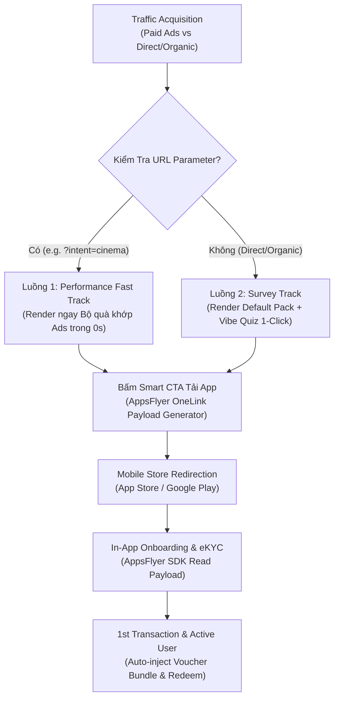

# Master BRD: Web-to-App New User Acquisition & Pre-install Personalization Engine

> - **Project:** New User Hub & Web-to-App Personalization Journey
> - **Division:** Growth Platform Division (GPD)
> - **Owners:** Web Platform Team x User Growth Team
> - **Version:** 2.0 · Tháng 8/2026
> - **Status:** Active (Strategic Alignment & Execution)

---

## I. Business Context, Problem Statement & Strategic Vision

### 1.1 Thách Thức Kép Trong Thu Hút Người Dùng Mới (Acquisition & Activation Pain Points)
1. **Điểm gãy giữa Click Ads và Cài Đặt/Đăng Ký (Install -> REG Drop-off):** 
   Việc quảng cáo đẩy người dùng thô từ trình duyệt về App Store/Google Play tạo ra ma sát cực lớn. Dữ liệu thực tế ghi nhận tỷ lệ chuyển đổi từ Install sang Đăng ký thành công (REG) chỉ đạt **32.10%** (rớt **67.90%** ngay tại luồng đăng ký sau khi tải App).
2. **Khoảng cách giữa Cài Đặt và Giao Dịch Đầu Tiên (Install -> 1st Transaction Gap):**
   Phần lớn giá trị sản phẩm MoMo chỉ được khám phá sau quá trình đăng ký và eKYC In-App. Việc bắt người dùng cài đặt khi chưa hiểu rõ lợi ích dẫn đến bỏ dở ứng dụng trước khi phát sinh giao dịch đầu tiên.

### 1.2 Dữ Liệu Thực Tế Chuỗi Tăng Trưởng New User (Tháng 7, Tháng 8 & Chính Thức Tháng 9/2026)
Dữ liệu đo lường thực tế phễu Ads thu hút New User từ tháng 7 đến hết tháng 9/2026 (Nguồn dữ liệu tracking chính thức):

<table style="width:100%; border-collapse:collapse; border:1.5px solid #64748b; margin:1em 0; font-size:0.9em;">
  <thead>
    <tr style="background-color:#f1f5f9;">
      <th style="border:1.5px solid #64748b; padding:8px 12px; text-align:left; font-weight:700;">Chỉ Số Phễu (Ads New User Funnel)</th>
      <th style="border:1.5px solid #64748b; padding:8px 12px; text-align:right; font-weight:700;">Tháng 07/2026</th>
      <th style="border:1.5px solid #64748b; padding:8px 12px; text-align:right; font-weight:700;">Tháng 08/2026</th>
      <th style="border:1.5px solid #64748b; padding:8px 12px; text-align:right; font-weight:700;">Tháng 09/2026 (Full Month)</th>
      <th style="border:1.5px solid #64748b; padding:8px 12px; text-align:left; font-weight:700;">Đánh Giá Xu Hướng & Tăng Trưởng MoM</th>
    </tr>
  </thead>
  <tbody>
    <tr>
      <td style="border:1px solid #94a3b8; padding:8px 12px; text-align:left;"><strong>1. Total Install App</strong></td>
      <td style="border:1px solid #94a3b8; padding:8px 12px; text-align:right;">5.239</td>
      <td style="border:1px solid #94a3b8; padding:8px 12px; text-align:right;">10.041</td>
      <td style="border:1px solid #94a3b8; padding:8px 12px; text-align:right; font-weight:700; color:#16a34a;">10.501</td>
      <td style="border:1px solid #94a3b8; padding:8px 12px; text-align:left;">Tăng +4.6% MoM và tăng gấp 2.0 lần (+100.4%) so với Tháng 7.</td>
    </tr>
    <tr style="background-color:#f8fafc;">
      <td style="border:1px solid #94a3b8; padding:8px 12px; text-align:left;"><strong>2. Đăng Ký Tài Khoản (REG)</strong></td>
      <td style="border:1px solid #94a3b8; padding:8px 12px; text-align:right;">1.682</td>
      <td style="border:1px solid #94a3b8; padding:8px 12px; text-align:right;">3.229</td>
      <td style="border:1px solid #94a3b8; padding:8px 12px; text-align:right; font-weight:700; color:#16a34a;">3.569</td>
      <td style="border:1px solid #94a3b8; padding:8px 12px; text-align:left;">Tăng +10.5% MoM; CVR Install -> REG tăng từ 32.1% lên 34.0%.</td>
    </tr>
    <tr>
      <td style="border:1px solid #94a3b8; padding:8px 12px; text-align:left;"><strong>3. Liên Kết Ngân Hàng (Map Bank / N2MM)</strong></td>
      <td style="border:1px solid #94a3b8; padding:8px 12px; text-align:right;">948</td>
      <td style="border:1px solid #94a3b8; padding:8px 12px; text-align:right;">1.818</td>
      <td style="border:1px solid #94a3b8; padding:8px 12px; text-align:right; font-weight:700; color:#16a34a;">2.239 (~2.3K)</td>
      <td style="border:1px solid #94a3b8; padding:8px 12px; text-align:left;">Tăng trưởng bứt phá +23.2% MoM; CVR REG -> Map tăng lên 62.7%.</td>
    </tr>
    <tr style="background-color:#f8fafc;">
      <td style="border:1px solid #94a3b8; padding:8px 12px; text-align:left;"><strong>4. Active MAU (Giao dịch đầu)</strong></td>
      <td style="border:1px solid #94a3b8; padding:8px 12px; text-align:right;">536</td>
      <td style="border:1px solid #94a3b8; padding:8px 12px; text-align:right;">1.029</td>
      <td style="border:1px solid #94a3b8; padding:8px 12px; text-align:right; font-weight:700; color:#16a34a;">1.306 (~1.3K)</td>
      <td style="border:1px solid #94a3b8; padding:8px 12px; text-align:left;">Tăng +26.9% MoM; CVR Map -> MAU duy trì mức cao 58.3%.</td>
    </tr>
  </tbody>
</table>

#### Chi Tiết Phân Bổ 13 Campaign Ads Kênh Web Tháng 09/2026 (Nguồn Dữ Liệu CSV Pivot)

<table style="width:100%; border-collapse:collapse; border:1.5px solid #64748b; margin:1em 0; font-size:0.85em;">
  <thead>
    <tr style="background-color:#f1f5f9;">
      <th style="border:1.5px solid #64748b; padding:6px 8px; text-align:left; font-weight:700;">Tên Chiến Dịch (Campaign Tracking Code)</th>
      <th style="border:1.5px solid #64748b; padding:6px 8px; text-align:center; font-weight:700;">Hệ Điều Hành</th>
      <th style="border:1.5px solid #64748b; padding:6px 8px; text-align:right; font-weight:700;">Installs</th>
      <th style="border:1.5px solid #64748b; padding:6px 8px; text-align:right; font-weight:700;">REG</th>
      <th style="border:1.5px solid #64748b; padding:6px 8px; text-align:right; font-weight:700;">CVR REG</th>
      <th style="border:1.5px solid #64748b; padding:6px 8px; text-align:right; font-weight:700;">Map Bank</th>
      <th style="border:1.5px solid #64748b; padding:6px 8px; text-align:right; font-weight:700;">CVR Map</th>
      <th style="border:1.5px solid #64748b; padding:6px 8px; text-align:right; font-weight:700;">Active MAU</th>
      <th style="border:1.5px solid #64748b; padding:6px 8px; text-align:right; font-weight:700;">CVR End-to-End</th>
    </tr>
  </thead>
  <tbody>
    <tr>
      <td style="border:1px solid #94a3b8; padding:6px 8px; text-align:left;"><code>260805_NEW_WEB_N2MM_INS_C.CHAOMOMO</code></td>
      <td style="border:1px solid #94a3b8; padding:6px 8px; text-align:center;">Android</td>
      <td style="border:1px solid #94a3b8; padding:6px 8px; text-align:right; font-weight:700;">4.826</td>
      <td style="border:1px solid #94a3b8; padding:6px 8px; text-align:right;">1.619</td>
      <td style="border:1px solid #94a3b8; padding:6px 8px; text-align:right;">33,5%</td>
      <td style="border:1px solid #94a3b8; padding:6px 8px; text-align:right;">939</td>
      <td style="border:1px solid #94a3b8; padding:6px 8px; text-align:right;">58,0%</td>
      <td style="border:1px solid #94a3b8; padding:6px 8px; text-align:right;">521</td>
      <td style="border:1px solid #94a3b8; padding:6px 8px; text-align:right;">10,8%</td>
    </tr>
    <tr style="background-color:#f8fafc;">
      <td style="border:1px solid #94a3b8; padding:6px 8px; text-align:left;"><code>260805_NEW_WEB_N2MM_INS_C.CHAOMOMO</code></td>
      <td style="border:1px solid #94a3b8; padding:6px 8px; text-align:center; font-weight:700; color:#1e40af;">iOS</td>
      <td style="border:1px solid #94a3b8; padding:6px 8px; text-align:right; font-weight:700;">3.864</td>
      <td style="border:1px solid #94a3b8; padding:6px 8px; text-align:right;">1.373</td>
      <td style="border:1px solid #94a3b8; padding:6px 8px; text-align:right;">35,5%</td>
      <td style="border:1px solid #94a3b8; padding:6px 8px; text-align:right; font-weight:700; color:#16a34a;">1.005</td>
      <td style="border:1px solid #94a3b8; padding:6px 8px; text-align:right; font-weight:700; color:#16a34a;">73,2%</td>
      <td style="border:1px solid #94a3b8; padding:6px 8px; text-align:right; font-weight:700; color:#16a34a;">591</td>
      <td style="border:1px solid #94a3b8; padding:6px 8px; text-align:right; font-weight:700; color:#16a34a;">15,3%</td>
    </tr>
    <tr>
      <td style="border:1px solid #94a3b8; padding:6px 8px; text-align:left;"><code>260805_NEW_WEB_N2MM_INS_C.PSN-CINEMA</code></td>
      <td style="border:1px solid #94a3b8; padding:6px 8px; text-align:center; font-weight:700; color:#1e40af;">iOS</td>
      <td style="border:1px solid #94a3b8; padding:6px 8px; text-align:right; font-weight:700;">903</td>
      <td style="border:1px solid #94a3b8; padding:6px 8px; text-align:right;">278</td>
      <td style="border:1px solid #94a3b8; padding:6px 8px; text-align:right;">30,8%</td>
      <td style="border:1px solid #94a3b8; padding:6px 8px; text-align:right;">189</td>
      <td style="border:1px solid #94a3b8; padding:6px 8px; text-align:right;">68,0%</td>
      <td style="border:1px solid #94a3b8; padding:6px 8px; text-align:right;">124</td>
      <td style="border:1px solid #94a3b8; padding:6px 8px; text-align:right;">13,7%</td>
    </tr>
    <tr style="background-color:#f8fafc;">
      <td style="border:1px solid #94a3b8; padding:6px 8px; text-align:left;"><code>260805_NEW_WEB_N2MM_INS_C.PSN-CINEMA</code></td>
      <td style="border:1px solid #94a3b8; padding:6px 8px; text-align:center;">Android</td>
      <td style="border:1px solid #94a3b8; padding:6px 8px; text-align:right;">272</td>
      <td style="border:1px solid #94a3b8; padding:6px 8px; text-align:right;">102</td>
      <td style="border:1px solid #94a3b8; padding:6px 8px; text-align:right;">37,5%</td>
      <td style="border:1px solid #94a3b8; padding:6px 8px; text-align:right;">43</td>
      <td style="border:1px solid #94a3b8; padding:6px 8px; text-align:right;">42,2%</td>
      <td style="border:1px solid #94a3b8; padding:6px 8px; text-align:right;">29</td>
      <td style="border:1px solid #94a3b8; padding:6px 8px; text-align:right;">10,7%</td>
    </tr>
    <tr>
      <td style="border:1px solid #94a3b8; padding:6px 8px; text-align:left;"><code>260805_NEW_WEB_N2MM_INS_C.PSN-MERCHANT</code></td>
      <td style="border:1px solid #94a3b8; padding:6px 8px; text-align:center;">Android</td>
      <td style="border:1px solid #94a3b8; padding:6px 8px; text-align:right;">200</td>
      <td style="border:1px solid #94a3b8; padding:6px 8px; text-align:right;">71</td>
      <td style="border:1px solid #94a3b8; padding:6px 8px; text-align:right;">35,5%</td>
      <td style="border:1px solid #94a3b8; padding:6px 8px; text-align:right;">19</td>
      <td style="border:1px solid #94a3b8; padding:6px 8px; text-align:right;">26,8%</td>
      <td style="border:1px solid #94a3b8; padding:6px 8px; text-align:right;">12</td>
      <td style="border:1px solid #94a3b8; padding:6px 8px; text-align:right;">6,0%</td>
    </tr>
    <tr style="background-color:#f8fafc;">
      <td style="border:1px solid #94a3b8; padding:6px 8px; text-align:left;"><code>251007_NEW_INTERNAL_WEB_N2MM_INS_WEB_BRT_C.CHAOMOMO</code></td>
      <td style="border:1px solid #94a3b8; padding:6px 8px; text-align:center;">Android</td>
      <td style="border:1px solid #94a3b8; padding:6px 8px; text-align:right;">134</td>
      <td style="border:1px solid #94a3b8; padding:6px 8px; text-align:right;">36</td>
      <td style="border:1px solid #94a3b8; padding:6px 8px; text-align:right;">26,9%</td>
      <td style="border:1px solid #94a3b8; padding:6px 8px; text-align:right;">14</td>
      <td style="border:1px solid #94a3b8; padding:6px 8px; text-align:right;">38,9%</td>
      <td style="border:1px solid #94a3b8; padding:6px 8px; text-align:right;">10</td>
      <td style="border:1px solid #94a3b8; padding:6px 8px; text-align:right;">7,5%</td>
    </tr>
    <tr>
      <td style="border:1px solid #94a3b8; padding:6px 8px; text-align:left;"><code>260805_NEW_WEB_N2MM_INS_C.PSN-MERCHANT</code></td>
      <td style="border:1px solid #94a3b8; padding:6px 8px; text-align:center; font-weight:700; color:#1e40af;">iOS</td>
      <td style="border:1px solid #94a3b8; padding:6px 8px; text-align:right;">117</td>
      <td style="border:1px solid #94a3b8; padding:6px 8px; text-align:right;">28</td>
      <td style="border:1px solid #94a3b8; padding:6px 8px; text-align:right;">23,9%</td>
      <td style="border:1px solid #94a3b8; padding:6px 8px; text-align:right; font-weight:700; color:#16a34a;">22</td>
      <td style="border:1px solid #94a3b8; padding:6px 8px; text-align:right; font-weight:700; color:#16a34a;">78,6%</td>
      <td style="border:1px solid #94a3b8; padding:6px 8px; text-align:right;">14</td>
      <td style="border:1px solid #94a3b8; padding:6px 8px; text-align:right;">12,0%</td>
    </tr>
    <tr style="background-color:#f8fafc;">
      <td style="border:1px solid #94a3b8; padding:6px 8px; text-align:left;"><code>251007_NEW_INTERNAL_WEB_N2MM_INS_WEB_BRT_C.CHAOMOMO</code></td>
      <td style="border:1px solid #94a3b8; padding:6px 8px; text-align:center; font-weight:700; color:#1e40af;">iOS</td>
      <td style="border:1px solid #94a3b8; padding:6px 8px; text-align:right;">82</td>
      <td style="border:1px solid #94a3b8; padding:6px 8px; text-align:right;">17</td>
      <td style="border:1px solid #94a3b8; padding:6px 8px; text-align:right;">20,7%</td>
      <td style="border:1px solid #94a3b8; padding:6px 8px; text-align:right; font-weight:700; color:#16a34a;">13</td>
      <td style="border:1px solid #94a3b8; padding:6px 8px; text-align:right; font-weight:700; color:#16a34a;">76,5%</td>
      <td style="border:1px solid #94a3b8; padding:6px 8px; text-align:right;">5</td>
      <td style="border:1px solid #94a3b8; padding:6px 8px; text-align:right;">6,1%</td>
    </tr>
    <tr>
      <td style="border:1px solid #94a3b8; padding:6px 8px; text-align:left;"><code>260805_NEW_WEB_N2MM_INS_C.PSN-CINEMA_G.BalloonPU-cinema-rap-lotte-cinema</code></td>
      <td style="border:1px solid #94a3b8; padding:6px 8px; text-align:center; font-weight:700; color:#1e40af;">iOS</td>
      <td style="border:1px solid #94a3b8; padding:6px 8px; text-align:right;">38</td>
      <td style="border:1px solid #94a3b8; padding:6px 8px; text-align:right; font-weight:700; color:#16a34a;">24</td>
      <td style="border:1px solid #94a3b8; padding:6px 8px; text-align:right; font-weight:700; color:#16a34a;">63,2%</td>
      <td style="border:1px solid #94a3b8; padding:6px 8px; text-align:right; font-weight:700; color:#16a34a;">17</td>
      <td style="border:1px solid #94a3b8; padding:6px 8px; text-align:right; font-weight:700; color:#16a34a;">70,8%</td>
      <td style="border:1px solid #94a3b8; padding:6px 8px; text-align:right; font-weight:700; color:#16a34a;">14</td>
      <td style="border:1px solid #94a3b8; padding:6px 8px; text-align:right; font-weight:700; color:#16a34a;">36,8%</td>
    </tr>
    <tr style="background-color:#f8fafc;">
      <td style="border:1px solid #94a3b8; padding:6px 8px; text-align:left;"><code>260805_NEW_WEB_N2MM_INS_C.PNS-BAOHIEM</code></td>
      <td style="border:1px solid #94a3b8; padding:6px 8px; text-align:center; font-weight:700; color:#1e40af;">iOS</td>
      <td style="border:1px solid #94a3b8; padding:6px 8px; text-align:right;">31</td>
      <td style="border:1px solid #94a3b8; padding:6px 8px; text-align:right;">9</td>
      <td style="border:1px solid #94a3b8; padding:6px 8px; text-align:right;">29,0%</td>
      <td style="border:1px solid #94a3b8; padding:6px 8px; text-align:right; font-weight:700; color:#16a34a;">8</td>
      <td style="border:1px solid #94a3b8; padding:6px 8px; text-align:right; font-weight:700; color:#16a34a;">88,9%</td>
      <td style="border:1px solid #94a3b8; padding:6px 8px; text-align:right;">5</td>
      <td style="border:1px solid #94a3b8; padding:6px 8px; text-align:right;">16,1%</td>
    </tr>
    <tr>
      <td style="border:1px solid #94a3b8; padding:6px 8px; text-align:left;"><code>260805_NEW_WEB_N2MM_INS_C.PNS-BAOHIEM</code></td>
      <td style="border:1px solid #94a3b8; padding:6px 8px; text-align:center;">Android</td>
      <td style="border:1px solid #94a3b8; padding:6px 8px; text-align:right;">25</td>
      <td style="border:1px solid #94a3b8; padding:6px 8px; text-align:right;">7</td>
      <td style="border:1px solid #94a3b8; padding:6px 8px; text-align:right;">28,0%</td>
      <td style="border:1px solid #94a3b8; padding:6px 8px; text-align:right;">4</td>
      <td style="border:1px solid #94a3b8; padding:6px 8px; text-align:right;">57,1%</td>
      <td style="border:1px solid #94a3b8; padding:6px 8px; text-align:right;">1</td>
      <td style="border:1px solid #94a3b8; padding:6px 8px; text-align:right;">4,0%</td>
    </tr>
    <tr style="background-color:#f8fafc;">
      <td style="border:1px solid #94a3b8; padding:6px 8px; text-align:left;"><code>260805_NEW_WEB_N2MM_INS_C.PSN-CINEMA_G.BalloonPU-cinema-rap-lotte-cinema</code></td>
      <td style="border:1px solid #94a3b8; padding:6px 8px; text-align:center;">Android</td>
      <td style="border:1px solid #94a3b8; padding:6px 8px; text-align:right;">8</td>
      <td style="border:1px solid #94a3b8; padding:6px 8px; text-align:right;">5</td>
      <td style="border:1px solid #94a3b8; padding:6px 8px; text-align:right; font-weight:700; color:#16a34a;">62,5%</td>
      <td style="border:1px solid #94a3b8; padding:6px 8px; text-align:right;">3</td>
      <td style="border:1px solid #94a3b8; padding:6px 8px; text-align:right;">60,0%</td>
      <td style="border:1px solid #94a3b8; padding:6px 8px; text-align:right;">2</td>
      <td style="border:1px solid #94a3b8; padding:6px 8px; text-align:right; font-weight:700; color:#16a34a;">25,0%</td>
    </tr>
    <tr>
      <td style="border:1px solid #94a3b8; padding:6px 8px; text-align:left;"><code>260707_NEW_INTERNAL_WEB_ALL_INS_WEB_BRT_C.PXTĐH26</code></td>
      <td style="border:1px solid #94a3b8; padding:6px 8px; text-align:center;">Android</td>
      <td style="border:1px solid #94a3b8; padding:6px 8px; text-align:right;">1</td>
      <td style="border:1px solid #94a3b8; padding:6px 8px; text-align:right;">0</td>
      <td style="border:1px solid #94a3b8; padding:6px 8px; text-align:right;">0,0%</td>
      <td style="border:1px solid #94a3b8; padding:6px 8px; text-align:right;">0</td>
      <td style="border:1px solid #94a3b8; padding:6px 8px; text-align:right;">0,0%</td>
      <td style="border:1px solid #94a3b8; padding:6px 8px; text-align:right;">0</td>
      <td style="border:1px solid #94a3b8; padding:6px 8px; text-align:right;">0,0%</td>
    </tr>
    <tr style="background-color:#e2e8f0; font-weight:700;">
      <td style="border:1.5px solid #64748b; padding:6px 8px; text-align:left;" colspan="2">Tổng Toàn Sàn (13 Campaigns)</td>
      <td style="border:1.5px solid #64748b; padding:6px 8px; text-align:right; color:#16a34a;">10.501</td>
      <td style="border:1.5px solid #64748b; padding:6px 8px; text-align:right; color:#16a34a;">3.569</td>
      <td style="border:1.5px solid #64748b; padding:6px 8px; text-align:right;">34,0%</td>
      <td style="border:1.5px solid #64748b; padding:6px 8px; text-align:right; color:#16a34a;">2.276</td>
      <td style="border:1.5px solid #64748b; padding:6px 8px; text-align:right; color:#16a34a;">63,8%</td>
      <td style="border:1.5px solid #64748b; padding:6px 8px; text-align:right; color:#16a34a;">1.328</td>
      <td style="border:1.5px solid #64748b; padding:6px 8px; text-align:right; color:#16a34a;">12,6%</td>
    </tr>
  </tbody>
</table>

#### Tổng Hợp Theo Kênh / Cụm Sản Phẩm (Placement Aggregation)

<table style="width:100%; border-collapse:collapse; border:1.5px solid #64748b; margin:1em 0; font-size:0.88em;">
  <thead>
    <tr style="background-color:#f1f5f9;">
      <th style="border:1.5px solid #64748b; padding:8px 10px; text-align:left; font-weight:700;">Cụm Sản Phẩm / Kênh</th>
      <th style="border:1.5px solid #64748b; padding:8px 10px; text-align:right; font-weight:700;">Installs</th>
      <th style="border:1.5px solid #64748b; padding:8px 10px; text-align:right; font-weight:700;">Tỷ Trọng Installs</th>
      <th style="border:1.5px solid #64748b; padding:8px 10px; text-align:right; font-weight:700;">REG</th>
      <th style="border:1.5px solid #64748b; padding:8px 10px; text-align:right; font-weight:700;">Map Bank (N2MM)</th>
      <th style="border:1.5px solid #64748b; padding:8px 10px; text-align:right; font-weight:700;">Active MAU</th>
      <th style="border:1.5px solid #64748b; padding:8px 10px; text-align:right; font-weight:700;">CVR (Install -> MAU)</th>
    </tr>
  </thead>
  <tbody>
    <tr>
      <td style="border:1px solid #94a3b8; padding:8px 10px; text-align:left;"><strong>1. C.CHAOMOMO (Quảng cáo đại trà)</strong></td>
      <td style="border:1px solid #94a3b8; padding:8px 10px; text-align:right; font-weight:700;">8.906</td>
      <td style="border:1px solid #94a3b8; padding:8px 10px; text-align:right;">84,8%</td>
      <td style="border:1px solid #94a3b8; padding:8px 10px; text-align:right;">3.045</td>
      <td style="border:1px solid #94a3b8; padding:8px 10px; text-align:right; font-weight:700;">1.971</td>
      <td style="border:1px solid #94a3b8; padding:8px 10px; text-align:right;">1.127</td>
      <td style="border:1px solid #94a3b8; padding:8px 10px; text-align:right;">12,7%</td>
    </tr>
    <tr style="background-color:#f8fafc;">
      <td style="border:1px solid #94a3b8; padding:8px 10px; text-align:left;"><strong>2. Cinema Hub (Rạp phim & Lotte)</strong></td>
      <td style="border:1px solid #94a3b8; padding:8px 10px; text-align:right; font-weight:700;">1.221</td>
      <td style="border:1px solid #94a3b8; padding:8px 10px; text-align:right;">11,6%</td>
      <td style="border:1px solid #94a3b8; padding:8px 10px; text-align:right;">409</td>
      <td style="border:1px solid #94a3b8; padding:8px 10px; text-align:right; font-weight:700;">252</td>
      <td style="border:1px solid #94a3b8; padding:8px 10px; text-align:right;">169</td>
      <td style="border:1px solid #94a3b8; padding:8px 10px; text-align:right; font-weight:700; color:#16a34a;">13,8%</td>
    </tr>
    <tr>
      <td style="border:1px solid #94a3b8; padding:8px 10px; text-align:left;"><strong>3. Merchant Hub (Đối tác)</strong></td>
      <td style="border:1px solid #94a3b8; padding:8px 10px; text-align:right;">317</td>
      <td style="border:1px solid #94a3b8; padding:8px 10px; text-align:right;">3,0%</td>
      <td style="border:1px solid #94a3b8; padding:8px 10px; text-align:right;">99</td>
      <td style="border:1px solid #94a3b8; padding:8px 10px; text-align:right;">41</td>
      <td style="border:1px solid #94a3b8; padding:8px 10px; text-align:right;">26</td>
      <td style="border:1px solid #94a3b8; padding:8px 10px; text-align:right;">8,2%</td>
    </tr>
    <tr style="background-color:#f8fafc;">
      <td style="border:1px solid #94a3b8; padding:8px 10px; text-align:left;"><strong>4. Bảo Hiểm (InsurTech)</strong></td>
      <td style="border:1px solid #94a3b8; padding:8px 10px; text-align:right;">56</td>
      <td style="border:1px solid #94a3b8; padding:8px 10px; text-align:right;">0,5%</td>
      <td style="border:1px solid #94a3b8; padding:8px 10px; text-align:right;">16</td>
      <td style="border:1px solid #94a3b8; padding:8px 10px; text-align:right;">12</td>
      <td style="border:1px solid #94a3b8; padding:8px 10px; text-align:right;">6</td>
      <td style="border:1px solid #94a3b8; padding:8px 10px; text-align:right;">10,7%</td>
    </tr>
    <tr>
      <td style="border:1px solid #94a3b8; padding:8px 10px; text-align:left;"><strong>5. Khác (PXTĐH26)</strong></td>
      <td style="border:1px solid #94a3b8; padding:8px 10px; text-align:right;">1</td>
      <td style="border:1px solid #94a3b8; padding:8px 10px; text-align:right;">0,0%</td>
      <td style="border:1px solid #94a3b8; padding:8px 10px; text-align:right;">0</td>
      <td style="border:1px solid #94a3b8; padding:8px 10px; text-align:right;">0</td>
      <td style="border:1px solid #94a3b8; padding:8px 10px; text-align:right;">0</td>
      <td style="border:1px solid #94a3b8; padding:8px 10px; text-align:right;">0,0%</td>
    </tr>
  </tbody>
</table>

#### So Sánh Hiệu Suất Theo Hệ Điều Hành (Android vs iOS)

<table style="width:100%; border-collapse:collapse; border:1.5px solid #64748b; margin:1em 0; font-size:0.88em;">
  <thead>
    <tr style="background-color:#f1f5f9;">
      <th style="border:1.5px solid #64748b; padding:8px 10px; text-align:left; font-weight:700;">Hệ Điều Hành</th>
      <th style="border:1.5px solid #64748b; padding:8px 10px; text-align:right; font-weight:700;">Installs</th>
      <th style="border:1.5px solid #64748b; padding:8px 10px; text-align:right; font-weight:700;">Tỷ Trọng Installs</th>
      <th style="border:1.5px solid #64748b; padding:8px 10px; text-align:right; font-weight:700;">REG</th>
      <th style="border:1.5px solid #64748b; padding:8px 10px; text-align:right; font-weight:700;">CVR REG</th>
      <th style="border:1.5px solid #64748b; padding:8px 10px; text-align:right; font-weight:700;">Map Bank</th>
      <th style="border:1.5px solid #64748b; padding:8px 10px; text-align:right; font-weight:700;">CVR (Map/REG)</th>
      <th style="border:1.5px solid #64748b; padding:8px 10px; text-align:right; font-weight:700;">Active MAU</th>
      <th style="border:1.5px solid #64748b; padding:8px 10px; text-align:right; font-weight:700;">End-to-End CVR</th>
    </tr>
  </thead>
  <tbody>
    <tr>
      <td style="border:1px solid #94a3b8; padding:8px 10px; text-align:left;"><strong>Android</strong></td>
      <td style="border:1px solid #94a3b8; padding:8px 10px; text-align:right; font-weight:700;">5.466</td>
      <td style="border:1px solid #94a3b8; padding:8px 10px; text-align:right;">52,1%</td>
      <td style="border:1px solid #94a3b8; padding:8px 10px; text-align:right;">1.840</td>
      <td style="border:1px solid #94a3b8; padding:8px 10px; text-align:right;">33,7%</td>
      <td style="border:1px solid #94a3b8; padding:8px 10px; text-align:right;">1.022</td>
      <td style="border:1px solid #94a3b8; padding:8px 10px; text-align:right;">55,5%</td>
      <td style="border:1px solid #94a3b8; padding:8px 10px; text-align:right;">575</td>
      <td style="border:1px solid #94a3b8; padding:8px 10px; text-align:right;">10,5%</td>
    </tr>
    <tr style="background-color:#f8fafc;">
      <td style="border:1px solid #94a3b8; padding:8px 10px; text-align:left;"><strong>iOS</strong></td>
      <td style="border:1px solid #94a3b8; padding:8px 10px; text-align:right; font-weight:700;">5.035</td>
      <td style="border:1px solid #94a3b8; padding:8px 10px; text-align:right;">47,9%</td>
      <td style="border:1px solid #94a3b8; padding:8px 10px; text-align:right;">1.729</td>
      <td style="border:1px solid #94a3b8; padding:8px 10px; text-align:right;">34,3%</td>
      <td style="border:1px solid #94a3b8; padding:8px 10px; text-align:right; font-weight:700; color:#16a34a;">1.254</td>
      <td style="border:1px solid #94a3b8; padding:8px 10px; text-align:right; font-weight:700; color:#16a34a;">72,5%</td>
      <td style="border:1px solid #94a3b8; padding:8px 10px; text-align:right; font-weight:700; color:#16a34a;">753</td>
      <td style="border:1px solid #94a3b8; padding:8px 10px; text-align:right; font-weight:700; color:#16a34a;">15,0%</td>
    </tr>
  </tbody>
</table>

### 1.3 Triết Lý Sản Phẩm Cốt Lõi: "Trải Nghiệm Trước, Cài Đặt Sau"
Thống nhất xây dựng **New User Master Hub (`momo.vn/welcome`)** làm trang cửa ngõ giáo dục giá trị và cá nhân hóa nhu cầu trước khi tải App:
* Thay các quảng cáo hứa hẹn bằng **Kho tiện ích dùng thử (Pre-install Micro-utilities)** và **Giỏ quà tự chọn (Gamified Gift Selection)** trực tiếp trên Web.
* Nhận diện nhu cầu (Need-state) của người dùng sớm hơn ở bước Pre-install để tăng động lực đăng ký và thúc đẩy 1st Transaction hạ nguồn.

### 1.4 Mục Tiêu Chiến Lược H2 & Chỉ Số KPI (Strategic Growth Targets)

<table style="width:100%; border-collapse:collapse; border:1.5px solid #64748b; margin:1em 0; font-size:0.9em;">
  <thead>
    <tr style="background-color:#f1f5f9;">
      <th style="border:1.5px solid #64748b; padding:8px 12px; text-align:left; font-weight:700;">Chỉ số Chiến lược</th>
      <th style="border:1.5px solid #64748b; padding:8px 12px; text-align:center; font-weight:700;">Baseline Cũ (T7/2026)</th>
      <th style="border:1.5px solid #64748b; padding:8px 12px; text-align:center; font-weight:700;">Thực tế Tháng 08/2026</th>
      <th style="border:1.5px solid #64748b; padding:8px 12px; text-align:center; font-weight:700;">Thực tế Tháng 09/2026</th>
      <th style="border:1.5px solid #64748b; padding:8px 12px; text-align:center; font-weight:700;">Mục tiêu H2 (Mỗi tháng)</th>
      <th style="border:1.5px solid #64748b; padding:8px 12px; text-align:left; font-weight:700;">Cơ sở & Phương pháp Đo lường</th>
    </tr>
  </thead>
  <tbody>
    <tr>
      <td style="border:1px solid #94a3b8; padding:8px 12px; text-align:left;"><strong>New to MoMo (N2MM)</strong></td>
      <td style="border:1px solid #94a3b8; padding:8px 12px; text-align:center;">948 users</td>
      <td style="border:1px solid #94a3b8; padding:8px 12px; text-align:center;">1.818 users</td>
      <td style="border:1px solid #94a3b8; padding:8px 12px; text-align:center; font-weight:700; color:#16a34a;">2.239 users (~2.3K)</td>
      <td style="border:1px solid #94a3b8; padding:8px 12px; text-align:center;"><strong>5.000 users/tháng</strong></td>
      <td style="border:1px solid #94a3b8; padding:8px 12px; text-align:left;">Người dùng mới hoàn tất đăng ký & liên kết ngân hàng qua Web-to-App.</td>
    </tr>
    <tr style="background-color:#f8fafc;">
      <td style="border:1px solid #94a3b8; padding:8px 12px; text-align:left;"><strong>Total Installs</strong></td>
      <td style="border:1px solid #94a3b8; padding:8px 12px; text-align:center;">5.239 installs</td>
      <td style="border:1px solid #94a3b8; padding:8px 12px; text-align:center;">10.041 installs</td>
      <td style="border:1px solid #94a3b8; padding:8px 12px; text-align:center; font-weight:700; color:#16a34a;">10.501 installs</td>
      <td style="border:1px solid #94a3b8; padding:8px 12px; text-align:center;"><strong>20.000 - 30.000 installs/tháng</strong></td>
      <td style="border:1px solid #94a3b8; padding:8px 12px; text-align:left;">Tổng lượt tải App ghi nhận attribution qua AppsFlyer OneLink.</td>
    </tr>
    <tr>
      <td style="border:1px solid #94a3b8; padding:8px 12px; text-align:left;"><strong>CVR Install -> REG</strong></td>
      <td style="border:1px solid #94a3b8; padding:8px 12px; text-align:center;">32.10%</td>
      <td style="border:1px solid #94a3b8; padding:8px 12px; text-align:center;">32.10%</td>
      <td style="border:1px solid #94a3b8; padding:8px 12px; text-align:center; font-weight:700; color:#16a34a;">33.99%</td>
      <td style="border:1px solid #94a3b8; padding:8px 12px; text-align:center;"><strong>≥ 50.0% - 60.0%</strong></td>
      <td style="border:1px solid #94a3b8; padding:8px 12px; text-align:left;">Nâng cao nhờ cơ chế chọn quà trước và luồng Hybrid Onboarding tại momo.vn/welcome.</td>
    </tr>
    <tr style="background-color:#f8fafc;">
      <td style="border:1px solid #94a3b8; padding:8px 12px; text-align:left;"><strong>Active MAU (Kích hoạt)</strong></td>
      <td style="border:1px solid #94a3b8; padding:8px 12px; text-align:center;">536 MAU</td>
      <td style="border:1px solid #94a3b8; padding:8px 12px; text-align:center;">1.029 MAU</td>
      <td style="border:1px solid #94a3b8; padding:8px 12px; text-align:center; font-weight:700; color:#16a34a;">1.306 MAU (~1.3K)</td>
      <td style="border:1px solid #94a3b8; padding:8px 12px; text-align:center;"><strong>2.500 MAU/tháng</strong></td>
      <td style="border:1px solid #94a3b8; padding:8px 12px; text-align:left;">Người dùng mới phát sinh ít nhất 1 giao dịch thực tế trên App.</td>
    </tr>
  </tbody>
</table>

---

## II. Product Framework, Core Pillars & Relevance Test Layers

### 2.1 Ba Trụ Cột Sản Phẩm Chính (Core Product Pillars)
1. **Pillar 1: Segment-based Personalization (Cá nhân hóa theo phân khúc):**
   Tùy biến Hero Banner và đề xuất use case dựa trên UTM Campaign hoặc vị trí GeoIP mà không yêu cầu đăng nhập.
2. **Pillar 2: Interactive Utility Store (Kho tiện ích dùng thử):**
   Cho phép người dùng tương tác trực tiếp công cụ trên Web (Check CIC, Tính lương Net-to-Gross, Trắc nghiệm tài chính).
3. **Pillar 3: Gamified Gift Cart ("Đi Chợ Quà"):**
   Cho phép chọn 3/10 thẻ quà tự chọn vào giỏ ➔ Mã hóa Payload qua AppsFlyer OneLink ➔ Đón vào App tự động nhả đúng giỏ quà vào Ví Voucher sau khi eKYC.

### 2.2 Kiến Trúc 2 Luồng Chuyển Đổi Song Song (Hybrid Acquisition Architecture)

Nhằm tối ưu hóa đồng thời tốc độ chuyển đổi của quảng cáo Performance Ads và tính giải trí/cá nhân hóa của lượng truy cập tự do, hệ thống triển khai mô hình Hybrid 2 luồng chuyển đổi:

1. **Luồng 1 - Performance Fast Track (Dành cho Paid Ads qua URL Parameter):**
   * **Cơ chế:** Khi người dùng nhấp từ quảng cáo có đính kèm tham số nhu cầu (ví dụ: `momo.vn/welcome?intent=cinema`), MoSpark Edge Node đọc tham số trong < 15ms và hiển thị **ngay lập tức** bộ Thẻ quà khớp với nội dung quảng cáo trong 0 giây chờ, không bắt làm khảo sát.
   * **Mục tiêu:** Triệt tiêu ma sát ở Upper Funnel, giảm tối đa tỷ lệ thoát trang (Bounce Rate) và thúc đẩy hành động bấm nút "Tải App Nhận Quà".

2. **Luồng 2 - Interactive Survey Track (Dành cho Direct / Organic Traffic):**
   * **Cơ chế:** Khi người dùng tự gõ địa chỉ `momo.vn/welcome` (hoặc vào từ Google không có tham số), trang Web hiển thị Bộ quà Mặc định (Best-Seller Pack) đính kèm **Khung trắc nghiệm Vibe Quiz 1-Click** (*"Cuối tuần có tiền, gu của bạn là gì?"* với 4 lựa chọn: Xem phim, Game & Data, F&B Mua sắm, Học tập).
   * **Mục tiêu:** Tạo trải nghiệm giải trí cá nhân hóa và tâm lý cam kết (Endowment Effect) cho người dùng vãng lai trước khi cài đặt.

### 2.3 Phân Khúc Thử Nghiệm Đầu Tiên: U18 & Back to School (`momo.vn/welcome`)
* **Định vị:** Nhóm U18 (học sinh cấp 3 chuẩn bị bước vào Đại học / Tân sinh viên) được chọn làm phân khúc thử nghiệm đầu tiên (Validation Segment).
* **Touchpoint chuyên biệt:** Trang Master Hub `momo.vn/welcome` đóng vai trò là cửa ngõ chính, thay thế cho các trang landing page ngắn hạn, tích hợp gói quà tân thủ và bộ voucher tiếp sức mùa nhập học.

---

## III. Mô Hình Tăng Trưởng Song Mã (Dual Acquisition Engine)

### 3.1 Chân Kiềng 1: Organic Intent Search Engine (pSEO & GEO/AI Search)
* **Quy hoạch kho từ khóa:** Xây dựng Topic Clusters xung quanh nhu cầu tìm kiếm tuyển sinh, lệ phí xét tuyển, cẩm nang sinh viên, cách tính lương và kiểm tra CIC.
* **Tối ưu hiển thị AI Search:** Thiết lập cấu trúc dữ liệu Schema.org (`HowTo`, `FAQPage`), định dạng nội dung Answer-first và duy trì chính sách crawler qua file `llms.txt` để đảm bảo trích dẫn (citations) trên Google AI Overview và Gemini.

### 3.2 Chân Kiềng 2: Performance Media Plan (SEM & Paid Social Injection)
Tổng ngân sách truyền thông Performance Ads được phân bổ **300.000.000 VND**:
* **TikTok Ads Plan (60% ngân sách - 100.000.000 VND):** Tối ưu hóa lượt Install & Registration qua dạng video ngắn UGC (KOC `thuhuong.is.here`).
* **Google Ads UAC Plan (40% ngân sách - 200.000.000 VND):** Tối ưu hóa lượt App Installs qua Banner tĩnh (JPEG-5070, JPEG_5138), Responsive Search Ads và YouTube Videos.

### 3.3 Media Mix & Performance Benchmark Table

<table style="width:100%; border-collapse:collapse; border:1.5px solid #64748b; margin:1em 0; font-size:0.9em;">
  <thead>
    <tr style="background-color:#f1f5f9;">
      <th style="border:1.5px solid #64748b; padding:8px 12px; text-align:left; font-weight:700;">Chỉ số (Metrics)</th>
      <th style="border:1.5px solid #64748b; padding:8px 12px; text-align:center; font-weight:700;">TikTok Ads (Install/Reg)</th>
      <th style="border:1.5px solid #64748b; padding:8px 12px; text-align:center; font-weight:700;">Google Ads UAC (Install/Reg)</th>
      <th style="border:1.5px solid #64748b; padding:8px 12px; text-align:center; font-weight:700;">Blended Total</th>
    </tr>
  </thead>
  <tbody>
    <tr>
      <td style="border:1px solid #94a3b8; padding:8px 12px; text-align:left;"><strong>Ngân sách (Budget)</strong></td>
      <td style="border:1px solid #94a3b8; padding:8px 12px; text-align:center;">100.000.000 VND</td>
      <td style="border:1px solid #94a3b8; padding:8px 12px; text-align:center;">200.000.000 VND</td>
      <td style="border:1px solid #94a3b8; padding:8px 12px; text-align:center;"><strong>300.000.000 VND</strong></td>
    </tr>
    <tr style="background-color:#f8fafc;">
      <td style="border:1px solid #94a3b8; padding:8px 12px; text-align:left;"><strong>CPM Target</strong></td>
      <td style="border:1px solid #94a3b8; padding:8px 12px; text-align:center;">12.000 VND</td>
      <td style="border:1px solid #94a3b8; padding:8px 12px; text-align:center;">15.188 VND</td>
      <td style="border:1px solid #94a3b8; padding:8px 12px; text-align:center;"><strong>13.952 VND</strong></td>
    </tr>
    <tr>
      <td style="border:1px solid #94a3b8; padding:8px 12px; text-align:left;"><strong>Lượt hiển thị (Impressions)</strong></td>
      <td style="border:1px solid #94a3b8; padding:8px 12px; text-align:center;">8.333.333</td>
      <td style="border:1px solid #94a3b8; padding:8px 12px; text-align:center;">13.168.724</td>
      <td style="border:1px solid #94a3b8; padding:8px 12px; text-align:center;"><strong>21.502.057</strong></td>
    </tr>
    <tr style="background-color:#f8fafc;">
      <td style="border:1px solid #94a3b8; padding:8px 12px; text-align:left;"><strong>Lượt click (Clicks)</strong></td>
      <td style="border:1px solid #94a3b8; padding:8px 12px; text-align:center;">41.667</td>
      <td style="border:1px solid #94a3b8; padding:8px 12px; text-align:center;">177.778</td>
      <td style="border:1px solid #94a3b8; padding:8px 12px; text-align:center;"><strong>219.444</strong></td>
    </tr>
    <tr>
      <td style="border:1px solid #94a3b8; padding:8px 12px; text-align:left;"><strong>Số lượt cài đặt (Installs)</strong></td>
      <td style="border:1px solid #94a3b8; padding:8px 12px; text-align:center;">16.667</td>
      <td style="border:1px solid #94a3b8; padding:8px 12px; text-align:center;">44.444</td>
      <td style="border:1px solid #94a3b8; padding:8px 12px; text-align:center;"><strong>61.111</strong></td>
    </tr>
    <tr style="background-color:#f8fafc;">
      <td style="border:1px solid #94a3b8; padding:8px 12px; text-align:left;"><strong>Số lượt đăng ký (Registrations)</strong></td>
      <td style="border:1px solid #94a3b8; padding:8px 12px; text-align:center;">10.833</td>
      <td style="border:1px solid #94a3b8; padding:8px 12px; text-align:center;">22.222</td>
      <td style="border:1px solid #94a3b8; padding:8px 12px; text-align:center;"><strong>33.056</strong></td>
    </tr>
    <tr>
      <td style="border:1px solid #94a3b8; padding:8px 12px; text-align:left;"><strong>Target CPI (Cost-per-Install)</strong></td>
      <td style="border:1px solid #94a3b8; padding:8px 12px; text-align:center;">6.000 VND</td>
      <td style="border:1px solid #94a3b8; padding:8px 12px; text-align:center;">4.500 VND</td>
      <td style="border:1px solid #94a3b8; padding:8px 12px; text-align:center;"><strong>4.909 VND</strong></td>
    </tr>
    <tr style="background-color:#f8fafc;">
      <td style="border:1px solid #94a3b8; padding:8px 12px; text-align:left;"><strong>Target CPR (Cost-per-Reg)</strong></td>
      <td style="border:1px solid #94a3b8; padding:8px 12px; text-align:center;">9.231 VND</td>
      <td style="border:1px solid #94a3b8; padding:8px 12px; text-align:center;">9.000 VND</td>
      <td style="border:1px solid #94a3b8; padding:8px 12px; text-align:center;"><strong>9.076 VND</strong></td>
    </tr>
    <tr>
      <td style="border:1px solid #94a3b8; padding:8px 12px; text-align:left;"><strong>Target CAC (Cost-per-MAU)</strong></td>
      <td style="border:1px solid #94a3b8; padding:8px 12px; text-align:center;">45.000 VND</td>
      <td style="border:1px solid #94a3b8; padding:8px 12px; text-align:center;">40.000 VND</td>
      <td style="border:1px solid #94a3b8; padding:8px 12px; text-align:center;"><strong>41.538 VND</strong></td>
    </tr>
  </tbody>
</table>

---

## IV. Technical Architecture & Integration Specifications

### 4.1 Luồng Mã Hóa & Truyền Tham Số (Deferred Deep Linking Engine)
Nút CTA "Tải App Nhận Quà" trên Web mã hóa toàn bộ bối cảnh nhu cầu và giỏ quà đã chọn vào AppsFlyer OneLink:

`https://momo.onelink.me/abc?af_dp=momo%3A%2F%2Fonboarding&gift_ids=1,4,7&intent_id=entertainment&utm_source=web_hub`

Sau khi người dùng cài App và mở lần đầu (First Open), AppsFlyer SDK đọc Payload và kích hoạt Backend API `ClaimVoucherBundle(userId, [1,4,7])` để inject quà trực tiếp vào Ví Voucher.

### 4.2 Yêu Cầu Hạ Tầng MoSpark CMS & Performance Specs
* **Framework:** Next.js kết hợp Edge Middleware (Cloudflare Workers).
* **Tốc độ tải trang:** TTFB < 150ms, LCP < 1.5s, CLS = 0.
* **Caching Strategy:** Cache 100% khung tĩnh trên CDN Edge Nodes; cá nhân hóa Hero Section xử lý tại Edge dựa trên query params trong < 15ms.

---

## V. Kiến Trúc Luồng Người Dùng & Bảng Phân Tích Các Bước

<table style="width:100%; border-collapse:collapse; border:1.5px solid #64748b; margin:1em 0; font-size:0.9em;">
  <thead>
    <tr style="background-color:#f1f5f9;">
      <th style="border:1.5px solid #64748b; padding:8px 12px; text-align:left; font-weight:700;">Bước</th>
      <th style="border:1.5px solid #64748b; padding:8px 12px; text-align:left; font-weight:700;">Tên Giai Đoạn</th>
      <th style="border:1.5px solid #64748b; padding:8px 12px; text-align:left; font-weight:700;">Trải Nghiệm Người Dùng (UX)</th>
      <th style="border:1.5px solid #64748b; padding:8px 12px; text-align:left; font-weight:700;">Hạ Tầng / Cơ Chế Kỹ Thuật</th>
      <th style="border:1.5px solid #64748b; padding:8px 12px; text-align:left; font-weight:700;">Nền Tảng</th>
    </tr>
  </thead>
  <tbody>
    <tr>
      <td style="border:1px solid #94a3b8; padding:8px 12px; text-align:left;">1</td>
      <td style="border:1px solid #94a3b8; padding:8px 12px; text-align:left;">Traffic Entry</td>
      <td style="border:1px solid #94a3b8; padding:8px 12px; text-align:left;">Bấm vào link Ads có tham số (TikTok/Google Ads) hoặc tự gõ momo.vn/welcome</td>
      <td style="border:1px solid #94a3b8; padding:8px 12px; text-align:left;">Campaign UTM / Parameter Parsing Engine</td>
      <td style="border:1px solid #94a3b8; padding:8px 12px; text-align:left;">External Channels / Browser</td>
    </tr>
    <tr style="background-color:#f8fafc;">
      <td style="border:1px solid #94a3b8; padding:8px 12px; text-align:left;">2</td>
      <td style="border:1px solid #94a3b8; padding:8px 12px; text-align:left;">Hybrid Web Landing</td>
      <td style="border:1px solid #94a3b8; padding:8px 12px; text-align:left;">Khách từ Ads thấy ngay Bộ quà khớp Ads (Fast Track). Khách gõ tay thấy Bộ quà Mặc định + Vibe Quiz 1-Click</td>
      <td style="border:1px solid #94a3b8; padding:8px 12px; text-align:left;">MoSpark Edge Dynamic Intent Router (< 15ms)</td>
      <td style="border:1px solid #94a3b8; padding:8px 12px; text-align:left;">Web (momo.vn/welcome)</td>
    </tr>
    <tr>
      <td style="border:1px solid #94a3b8; padding:8px 12px; text-align:left;">3</td>
      <td style="border:1px solid #94a3b8; padding:8px 12px; text-align:left;">Gift Customization</td>
      <td style="border:1px solid #94a3b8; padding:8px 12px; text-align:left;">Xem bộ quà hiển thị hoặc bấm Tab Vibe Quiz chọn 3/10 quà vào Giỏ quà cá nhân</td>
      <td style="border:1px solid #94a3b8; padding:8px 12px; text-align:left;">MoSpark Client State Store (< 50ms)</td>
      <td style="border:1px solid #94a3b8; padding:8px 12px; text-align:left;">Web (momo.vn/welcome)</td>
    </tr>
    <tr style="background-color:#f8fafc;">
      <td style="border:1px solid #94a3b8; padding:8px 12px; text-align:left;">4</td>
      <td style="border:1px solid #94a3b8; padding:8px 12px; text-align:left;">Payload Generation</td>
      <td style="border:1px solid #94a3b8; padding:8px 12px; text-align:left;">Bấm Smart CTA "Tải App Nhận Quà" để chuyển sang App Store / Google Play</td>
      <td style="border:1px solid #94a3b8; padding:8px 12px; text-align:left;">AppsFlyer OneLink Payload Encoder (`gift_ids`, `intent_id`)</td>
      <td style="border:1px solid #94a3b8; padding:8px 12px; text-align:left;">Web to Store</td>
    </tr>
    <tr>
      <td style="border:1px solid #94a3b8; padding:8px 12px; text-align:left;">5</td>
      <td style="border:1px solid #94a3b8; padding:8px 12px; text-align:left;">Store Redirection</td>
      <td style="border:1px solid #94a3b8; padding:8px 12px; text-align:left;">Cài đặt ứng dụng từ App Store hoặc Google Play Store</td>
      <td style="border:1px solid #94a3b8; padding:8px 12px; text-align:left;">Native Store Distribution & Deferred Match Engine</td>
      <td style="border:1px solid #94a3b8; padding:8px 12px; text-align:left;">Mobile Store</td>
    </tr>
    <tr style="background-color:#f8fafc;">
      <td style="border:1px solid #94a3b8; padding:8px 12px; text-align:left;">6</td>
      <td style="border:1px solid #94a3b8; padding:8px 12px; text-align:left;">In-App Fulfillment</td>
      <td style="border:1px solid #94a3b8; padding:8px 12px; text-align:left;">Đăng ký số điện thoại, eKYC và nhận ngay 3 quà vào Ví Voucher</td>
      <td style="border:1px solid #94a3b8; padding:8px 12px; text-align:left;">AppsFlyer SDK Read Payload ➔ Auto-inject Voucher API</td>
      <td style="border:1px solid #94a3b8; padding:8px 12px; text-align:left;">App MoMo</td>
    </tr>
    <tr>
      <td style="border:1px solid #94a3b8; padding:8px 12px; text-align:left;">7</td>
      <td style="border:1px solid #94a3b8; padding:8px 12px; text-align:left;">Activation & 1st Trans</td>
      <td style="border:1px solid #94a3b8; padding:8px 12px; text-align:left;">Sử dụng voucher thực hiện giao dịch đầu tiên (vé xem phim / nạp điện thoại / data)</td>
      <td style="border:1px solid #94a3b8; padding:8px 12px; text-align:left;">Core Payment Engine & Promotion Redemption Gateway</td>
      <td style="border:1px solid #94a3b8; padding:8px 12px; text-align:left;">App MoMo</td>
    </tr>
  </tbody>
</table>

---

## VI. RACI Matrix & Lộ Trình Triển Khai (Roadmap)

### 6.1 Bảng Phân Công Trách Nhiệm (RACI Matrix)

<table style="width:100%; border-collapse:collapse; border:1.5px solid #64748b; margin:1em 0; font-size:0.9em;">
  <thead>
    <tr style="background-color:#f1f5f9;">
      <th style="border:1.5px solid #64748b; padding:8px 12px; text-align:left; font-weight:700;">Hạng mục Công việc</th>
      <th style="border:1.5px solid #64748b; padding:8px 12px; text-align:center; font-weight:700;">Web Platform Team</th>
      <th style="border:1.5px solid #64748b; padding:8px 12px; text-align:center; font-weight:700;">User Growth Team</th>
      <th style="border:1.5px solid #64748b; padding:8px 12px; text-align:center; font-weight:700;">Native App Team</th>
      <th style="border:1.5px solid #64748b; padding:8px 12px; text-align:center; font-weight:700;">Media Team</th>
    </tr>
  </thead>
  <tbody>
    <tr>
      <td style="border:1px solid #94a3b8; padding:8px 12px; text-align:left;"><strong>Xây dựng UI/UX & Web Engine Hub</strong></td>
      <td style="border:1px solid #94a3b8; padding:8px 12px; text-align:center;"><strong>A / R</strong></td>
      <td style="border:1px solid #94a3b8; padding:8px 12px; text-align:center;">C</td>
      <td style="border:1px solid #94a3b8; padding:8px 12px; text-align:center;">I</td>
      <td style="border:1px solid #94a3b8; padding:8px 12px; text-align:center;">C</td>
    </tr>
    <tr style="background-color:#f8fafc;">
      <td style="border:1px solid #94a3b8; padding:8px 12px; text-align:left;"><strong>Định nghĩa Bộ Thẻ Quà & Quy Tắc Quà</strong></td>
      <td style="border:1px solid #94a3b8; padding:8px 12px; text-align:center;">C</td>
      <td style="border:1px solid #94a3b8; padding:8px 12px; text-align:center;"><strong>A / R</strong></td>
      <td style="border:1px solid #94a3b8; padding:8px 12px; text-align:center;">I</td>
      <td style="border:1px solid #94a3b8; padding:8px 12px; text-align:center;">C</td>
    </tr>
    <tr>
      <td style="border:1px solid #94a3b8; padding:8px 12px; text-align:left;"><strong>Phát triển Dynamic Deferred OneLink</strong></td>
      <td style="border:1px solid #94a3b8; padding:8px 12px; text-align:center;"><strong>A / R</strong></td>
      <td style="border:1px solid #94a3b8; padding:8px 12px; text-align:center;">C</td>
      <td style="border:1px solid #94a3b8; padding:8px 12px; text-align:center;">R</td>
      <td style="border:1px solid #94a3b8; padding:8px 12px; text-align:center;">I</td>
    </tr>
    <tr style="background-color:#f8fafc;">
      <td style="border:1px solid #94a3b8; padding:8px 12px; text-align:left;"><strong>Xử lý Auto-claim Voucher In-App</strong></td>
      <td style="border:1px solid #94a3b8; padding:8px 12px; text-align:center;">I</td>
      <td style="border:1px solid #94a3b8; padding:8px 12px; text-align:center;">C</td>
      <td style="border:1px solid #94a3b8; padding:8px 12px; text-align:center;"><strong>A / R</strong></td>
      <td style="border:1px solid #94a3b8; padding:8px 12px; text-align:center;">I</td>
    </tr>
    <tr>
      <td style="border:1px solid #94a3b8; padding:8px 12px; text-align:left;"><strong>Vận hành SEM Ads & Organic pSEO</strong></td>
      <td style="border:1px solid #94a3b8; padding:8px 12px; text-align:center;">R (pSEO)</td>
      <td style="border:1px solid #94a3b8; padding:8px 12px; text-align:center;">C</td>
      <td style="border:1px solid #94a3b8; padding:8px 12px; text-align:center;">I</td>
      <td style="border:1px solid #94a3b8; padding:8px 12px; text-align:center;"><strong>A / R (Ads)</strong></td>
    </tr>
  </tbody>
</table>

*(A: Accountable - Chịu trách nhiệm chính; R: Responsible - Thực thi; C: Consulted - Tham vấn; I: Informed - Thông báo)*

### 6.2 Lộ Trình Triển Khai & Các Cột Mốc (Roadmap)

<table style="width:100%; border-collapse:collapse; border:1.5px solid #64748b; margin:1em 0; font-size:0.9em;">
  <thead>
    <tr style="background-color:#f1f5f9;">
      <th style="border:1.5px solid #64748b; padding:8px 12px; text-align:left; font-weight:700;">Giai đoạn</th>
      <th style="border:1.5px solid #64748b; padding:8px 12px; text-align:center; font-weight:700;">Thời gian</th>
      <th style="border:1.5px solid #64748b; padding:8px 12px; text-align:left; font-weight:700;">Tên Giai Đoạn</th>
      <th style="border:1.5px solid #64748b; padding:8px 12px; text-align:left; font-weight:700;">Chi Tiết Triển Khai & Scope Mục Tiêu</th>
    </tr>
  </thead>
  <tbody>
    <tr>
      <td style="border:1px solid #94a3b8; padding:8px 12px; text-align:left;">Phase 1</td>
      <td style="border:1px solid #94a3b8; padding:8px 12px; text-align:center;">Tháng 08/2026</td>
      <td style="border:1px solid #94a3b8; padding:8px 12px; text-align:left;">MVP Validation (U18 & Phí Xét Tuyển)</td>
      <td style="border:1px solid #94a3b8; padding:8px 12px; text-align:left;">Dựng Welcome Hub (<code style="background:#f1f5f9;padding:2px 4px;border-radius:4px;font-family:monospace;">momo.vn/welcome</code>) & Trang Phí xét tuyển (<code style="background:#f1f5f9;padding:2px 4px;border-radius:4px;font-family:monospace;">/phi-xet-tuyen</code>). Tích hợp 10 quà tự chọn + mã <code style="background:#f1f5f9;padding:2px 4px;border-radius:4px;font-family:monospace;">EMCHUA18</code>. Kiểm chứng CVR Install -> REG vượt mốc 38.14%.</td>
    </tr>
    <tr style="background-color:#f8fafc;">
      <td style="border:1px solid #94a3b8; padding:8px 12px; text-align:left;">Phase 2</td>
      <td style="border:1px solid #94a3b8; padding:8px 12px; text-align:center;">Tháng 09 - 10/2026</td>
      <td style="border:1px solid #94a3b8; padding:8px 12px; text-align:left;">Expansion & Intent Personalization</td>
      <td style="border:1px solid #94a3b8; padding:8px 12px; text-align:left;">Phát triển thêm Micro-tools (Net-Gross, Personality Quiz). Nhận diện 3 phân khúc (Công nhân, Sinh viên, Tỉnh thành) qua UTM. Nâng mục tiêu lên 15.000 Installs/tháng.</td>
    </tr>
    <tr>
      <td style="border:1px solid #94a3b8; padding:8px 12px; text-align:left;">Phase 3</td>
      <td style="border:1px solid #94a3b8; padding:8px 12px; text-align:center;">Tháng 11 - 12/2026</td>
      <td style="border:1px solid #94a3b8; padding:8px 12px; text-align:left;">Scaling & Organic Dual Engine</td>
      <td style="border:1px solid #94a3b8; padding:8px 12px; text-align:left;">Đẩy mạnh kho bài viết pSEO thu hút traffic tự nhiên kết hợp scale ngân sách Performance Ads (Google Ads / TikTok Ads 300M). Cán mốc <strong>30.000 Installs/tháng</strong> và <strong>5.000 New to MoMo/tháng</strong>.</td>
    </tr>
  </tbody>
</table>
