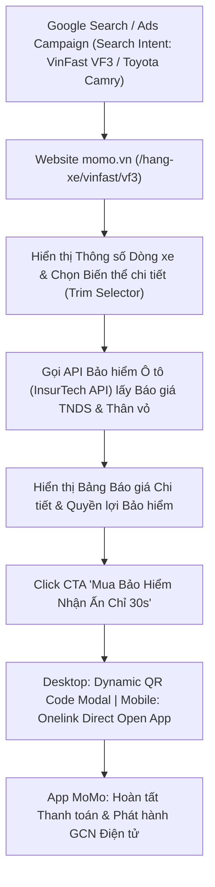

# PRD: Trang Chi Tiết Dòng Xe & Báo Giá Bảo Hiểm Ô Tô (/hang-xe/[brand]/[model])

> - **Dự án:** Vehicle Hub - Web Platform
> - **Đơn vị phụ trách:** Web Platform Team x InsurTech BU
> - **Đường dẫn chuẩn (URL Schema):** `momo.vn/tien-ich-giao-thong/hang-xe/[brand]/[model]` (VD: `momo.vn/tien-ich-giao-thong/hang-xe/vinfast/vf3`)
> - **Trạng thái:** P0 Priority Sprint Tuần Này (Hoàn thành trước 05/10/2026)

---

## I. TỔNG QUAN VÀ MỤC TIÊU CHIẾN LƯỢC

### 1. Context & Business Intent
- **Bối cảnh:** Trang Hãng xe chi tiết (`/hang-xe/[brand]/[model]`) là mắt xích đầu phễu trong cấu trúc pSEO (Programmatic SEO) với 264 trang dòng xe, phục vụ nhóm người dùng có ý định mua sắm, tìm hiểu và thẩm định chi phí ô tô.
- **Mục tiêu ưu tiên tuần này:** Đưa trang Chi tiết Dòng xe lên **P0 Priority**, tập trung tối đa vào 2 khối chức năng cốt lõi:
  1. **Khối Báo giá Bảo hiểm Ô tô Real-time (InsurTech API Integration):** Cho phép người dùng chọn từng phiên bản/đời xe và nhận báo giá chính xác cho Bảo hiểm Bắt buộc TNDS và Bảo hiểm Thân vỏ ô tô.
  2. **Khối Tên xe & Biến thể chi tiết (Car Trim Catalog):** Truy xuất danh mục toàn bộ các phiên bản xe (Trim/Variant) kèm thông số kỹ thuật và ma trận định giá khấu hao.
- **Kế thừa ngân sách Paid Ads 550 Triệu:** Đóng vai trò là trang đích (Landing Page) tiếp nhận lưu lượng từ ngân sách 550 triệu VNĐ Paid Ads của InsurTech BU đến hết năm 2026, tối ưu tỷ lệ chuyển đổi Web-to-App (CTR ≥ 8.0%).

---

## II. SƠ ĐỒ LUỒNG NGƯỜI DÙNG & BẢNG PHÂN TÍCH BƯỚC (USER FLOW & STEP BREAKDOWN)



<table style="width:100%; border-collapse:collapse; border:1.5px solid #64748b; margin:1em 0; font-size:0.9em;">
  <thead>
    <tr style="background-color:#f1f5f9;">
      <th style="border:1.5px solid #64748b; padding:8px 12px; text-align:left; font-weight:700;">Bước</th>
      <th style="border:1.5px solid #64748b; padding:8px 12px; text-align:left; font-weight:700;">Tên Giai Đoạn</th>
      <th style="border:1.5px solid #64748b; padding:8px 12px; text-align:left; font-weight:700;">Trải Nghiệm Người Dùng (UX)</th>
      <th style="border:1.5px solid #64748b; padding:8px 12px; text-align:left; font-weight:700;">Hạ Tầng / Cơ Chế Kỹ Thuật</th>
      <th style="border:1.5px solid #64748b; padding:8px 12px; text-align:left; font-weight:700;">Nền Tảng</th>
    </tr>
  </thead>
  <tbody>
    <tr>
      <td style="border:1px solid #94a3b8; padding:8px 12px; text-align:left;">1</td>
      <td style="border:1px solid #94a3b8; padding:8px 12px; text-align:left;">Truy cập trang Dòng xe</td>
      <td style="border:1px solid #94a3b8; padding:8px 12px; text-align:left;">Người dùng nhấp vào link SEO/Ads từ Google vào đúng trang chi tiết mẫu xe mong muốn.</td>
      <td style="border:1px solid #94a3b8; padding:8px 12px; text-align:left;">Next.js Dynamic Route (/hang-xe/[brand]/[model]) + Schema AutoRental / Car</td>
      <td style="border:1px solid #94a3b8; padding:8px 12px; text-align:left;">Web Platform</td>
    </tr>
    <tr style="background-color:#f8fafc;">
      <td style="border:1px solid #94a3b8; padding:8px 12px; text-align:left;">2</td>
      <td style="border:1px solid #94a3b8; padding:8px 12px; text-align:left;">Chọn Biến thể & Đời xe</td>
      <td style="border:1px solid #94a3b8; padding:8px 12px; text-align:left;">Chọn chính xác phiên bản xe (Trim/Variant) và năm sản xuất (2017 - 2026).</td>
      <td style="border:1px solid #94a3b8; padding:8px 12px; text-align:left;">Client-side State Sync từ Car Data Master Catalog</td>
      <td style="border:1px solid #94a3b8; padding:8px 12px; text-align:left;">Web Platform</td>
    </tr>
    <tr>
      <td style="border:1px solid #94a3b8; padding:8px 12px; text-align:left;">3</td>
      <td style="border:1px solid #94a3b8; padding:8px 12px; text-align:left;">Tính Báo giá Bảo hiểm Real-time</td>
      <td style="border:1px solid #94a3b8; padding:8px 12px; text-align:left;">Màn hình trả ngay mức phí Bảo hiểm TNDS bắt buộc và Phí Bảo hiểm Thân vỏ 9 hãng.</td>
      <td style="border:1px solid #94a3b8; padding:8px 12px; text-align:left;">Gọi REST API InsurTech Car Insurance Engine (/api/v1/insurance/car/quote)</td>
      <td style="border:1px solid #94a3b8; padding:8px 12px; text-align:left;">InsurTech Backend API</td>
    </tr>
    <tr style="background-color:#f8fafc;">
      <td style="border:1px solid #94a3b8; padding:8px 12px; text-align:left;">4</td>
      <td style="border:1px solid #94a3b8; padding:8px 12px; text-align:left;">Chuyển đổi Web-to-App</td>
      <td style="border:1px solid #94a3b8; padding:8px 12px; text-align:left;">Bấm 'Mua Bảo Hiểm Ngay', ứng dụng mở ra màn hình thanh toán đính kèm thông tin xe đã điền.</td>
      <td style="border:1px solid #94a3b8; padding:8px 12px; text-align:left;">Dynamic QR Modal (Desktop) / Appsflyer Onelink Deep Link (Mobile)</td>
      <td style="border:1px solid #94a3b8; padding:8px 12px; text-align:left;">Web to App</td>
    </tr>
  </tbody>
</table>

---

## III. ĐẶC TẢ CHI TIẾT CÁC KHỐI GIAO DIỆN & TÍCH HỢP KỸ THUẬT

### 1. Khối P0 Core: Widget Báo Giá Bảo Hiểm Ô Tô Real-time
- **Chức năng:** Tích hợp công cụ tính toán phí bảo hiểm trực tiếp từ **InsurTech Car Insurance API**.
- **Luồng dữ liệu Input -> Output:**
  - **Inputs:** `Make` (Hãng xe) -> `Model` (Dòng xe) -> `Variant/Trim` (Phiên bản chi tiết) -> `Year` (Năm sản xuất) -> `Seats` (Số chỗ) -> `Purpose` (Xe cá nhân / Xe kinh doanh).
  - **API Request:** `POST /api/v1/insurance/car/quote`
    ```json
    {
      "make": "VINFAST",
      "model": "VF3",
      "variant": "VINFASTVF3.Plus",
      "manufacture_year": 2024,
      "seats": 4,
      "engine_type": "Electric",
      "usage_type": "PERSONAL"
    }
    ```
  - **API Response Output:**
    - Phí Bảo hiểm TNDS Bắt buộc (Fixed theo Bộ Tài Chính): `480.700 VNĐ/năm` (đã bao gồm VAT).
    - Phí Bảo hiểm Thân vỏ / Vật chất xe (Biến đổi 9 hãng bảo hiểm: Bảo Việt, PVI, Liberty, PJICO, MIC, BSG...): Từ `3.850.000 VNĐ/năm` (Tỷ lệ phí ~ 1.30% x Giá trị thị trường xe).
- **Quy chuẩn UX/UI:**
  - Hiển thị badge so sánh phí bảo hiểm 9 hãng lớn nhất thị trường.
  - Nút CTA nổi bật: **[Mua Bảo Hiểm Nhận GCN Điện Tử 30s]**.

### 2. Khối P0 Core: Danh Sách Tên Xe & Biến Thể Chi Tiết (Car Trim Master Catalog)
- **Chức năng:** Liệt kê toàn bộ các phiên bản xe thuộc Dòng xe đang xem, lấy từ Master Catalog 1,534 biến thể.
- **Ví dụ hiển thị cho dòng VinFast VF3:**
  - `VinFast VF3 Plus` | 4 chỗ | Động cơ Điện | Giá niêm yết 2024: 322,000,000 VNĐ | Phí BH Thân vỏ từ: 4,180,000 VNĐ/năm.
  - `VinFast VF3 Base` | 4 chỗ | Động cơ Điện | Giá niêm yết 2024: 240,000,000 VNĐ | Phí BH Thân vỏ từ: 3,120,000 VNĐ/năm.
- **Bảng thông số kỹ thuật chuẩn hóa:** Kiểu dáng (`Type`), Số chỗ (`Seats`), Động cơ (`Engine type`), Mức tiêu thụ nhiên liệu/dung lượng pin.

### 3. Khối Bổ Trợ: Bản Đồ Hạ Tầng Dịch Vụ Tương Thích (Geolocated Services)
- **Đối với Dòng xe Điện (EV - VinFast VF3, VF8, VF9, MG4...):**
  - Tự động hiển thị **Bản đồ Trạm sạc V-Green / VinFast** gần nhất theo GPS của người dùng.
- **Đối với Dòng xe Xăng/Dầu (Toyota, Hyundai, Ford, Kia...):**
  - Tự động hiển thị **Bản đồ Gara sửa chữa & Trung tâm bảo hành chính hãng** từ cơ sở dữ liệu 11,001 gara đối tác.

---

## IV. LỘ TRÌNH VÀ CỘT MỐC TRIỂN KHAI SPRINT TUẦN NÀY (ROADMAP & MILESTONES)

| Giai Đoạn | Thời Gian | Tên Giai Đoạn | Chi Tiết Triển Khai & Mục Tiêu |
| :--- | :--- | :--- | :--- |
| **Giai đoạn 1** | **Thứ 2 (28/09)** | Technical Alignment & Spec Finalize | Khóa API Schema với InsurTech Tech Team (`/quote` & `/car-catalog`). Chốt giao diện UI Widget Báo giá Bảo hiểm. |
| **Giai đoạn 2** | **Thứ 3 - Thứ 4 (29 - 30/09)** | Frontend Development & API Binding | Web Dev lập trình Next.js Dynamic Template `/hang-xe/[brand]/[model]`, nhúng Widget Báo giá Bảo hiểm và Render danh sách Biến thể chi tiết. |
| **Giai đoạn 3** | **Thứ 5 (01/10)** | Testing & InsurTech Integration QA | Kiểm thử tích hợp luồng gọi API Báo giá Bảo hiểm real-time, test Dynamic QR / Onelink chuyển đổi Web-to-App. |
| **Giai đoạn 4** | **Thứ 6 (02/10)** | Staging Review & SEO Schema Injection | Đưa trang lên môi trường Staging, kiểm tra JSON-LD Schema (`AutoRental`, `Car`, `FAQPage`), kiểm tra tốc độ tải trang Mobile. |
| **Giai đoạn 5** | **Cuối tuần (03 - 05/10)** | Production Go-Live & Paid Ads Ready | Chính thức Go-live toàn bộ 264 trang Dòng xe. Sẵn sàng tiếp nhận Paid Ads Campaign 550M từ InsurTech BU. |

## V. CẤU TRÚC GIAO DIỆN 8 BLOCK CHUẨN HOÁ (PAGE BLOCK ARCHITECTURE)

Toàn bộ chuyên trang Chi Tiết Dòng Xe (`/hang-xe/[brand]/[model]`) được thiết kế dạng 8 Block Section dọc tối ưu cho Mobile Viewport và Google Indexing:

| Block STT | Tên Khối Giao Diện | Vai Trò & Tương Tác UX | Dữ Liệu & API Nạp | Nút Hành Động & W2A Hook |
| :---: | :--- | :--- | :--- | :--- |
| **Block 1** | **Hero Section & Thẻ Tổng Quan Dòng Xe** | Hiển thị Tên xe, Hãng sản xuất, Ảnh đại diện, Huy hiệu Phân khúc, Tùy chọn Năm sản xuất (2017 - 2026). | Local Dynamic Storage / CMS `car_models` | Nút **[Thêm Xe Vào Ví Xe In-App]** |
| **Block 2** | **Widget Báo Giá Bảo Hiểm Real-time (P0 Core)** | Chọn Biến thể xe & Năm sản xuất ➔ Tính ngay Phí TNDS Bắt buộc & Phí Thân vỏ 9 hãng bảo hiểm. | REST API InsurTech `/quote` | Nút **[Mua Bảo Hiểm Nhận GCN Điện Tử 30s]** (QR / Onelink) |
| **Block 3** | **Danh Sách Biến Thể Chi Tiết (P0 Core Catalog)** | Bảng liệt kê toàn bộ các phiên bản xe (Trims/Variants) kèm số chỗ, động cơ, giá niêm yết và phí bảo hiểm tối thiểu. | Database Master 1,534 biến thể (`Car Data.xlsx`) | Nút **[Báo Giá Phiên Bản Này]** |
| **Block 4** | **Máy Tính Giá Lăn Bánh & Thuế Trước Bạ** | Dự toán Tổng chi phí đăng ký xe mới (Thuế trước bạ, Phí biển số, Phí đường bộ, Phí đăng kiểm, BH TNDS). | Calculator Engine Client-side (`/lan-banh` logic) | Nút **[Xem Chi Tiết Bảng Phí Lăn Bánh]** |
| **Block 5** | **Widget Dự Toán Chi Phí Nuôi Xe Hàng Tháng** | Tự động tính 8 khoản phí nuôi xe (Xăng/Điện, Gửi xe, Rửa xe, Bảo dưỡng, BH, Vietmap/4G, Phụ kiện, Dự phòng). | Pre-filled Widget từ `/chi-phi-nuoi-xe` Spec | Nút **[Mở Rộng Bảng Tính & So Sánh Xe]** |
| **Block 6** | **Bản Đồ Định Vị Hạ Tầng Dịch Vụ Tương Thích** | • Xe Điện: Bản đồ Trạm sạc V-Green/VinFast theo GPS.<br>• Xe Xăng/Dầu: Bản đồ Gara sửa chữa & Trung tâm bảo hành chính hãng. | Master Dataset Trạm sạc & 11,001 Gara đối tác | Nút **[Tìm Trạm Sạc / Gara Gần Nhất]** |
| **Block 7** | **Bài Viết Đánh Giá Chuyên Sâu & Cẩm Nang (pSEO)** | Đánh giá ưu/nhược điểm dòng xe, cẩm nang bảo dưỡng, lịch thay dầu định kỳ và kinh nghiệm sử dụng thực tế. | MoSpark GenAI Pipeline / CMS Content | Link bài viết liên quan nội khu |
| **Block 8** | **Footer Internal Links & FAQPage Schema** | Hệ thống Link nội bộ kết nối 264 trang dòng xe cùng hãng/phân khúc & Khối câu hỏi thường gặp có cấu trúc. | JSON-LD Schema (`AutoRental`, `Car`, `FAQPage`) | Dynamic Internal Links |
