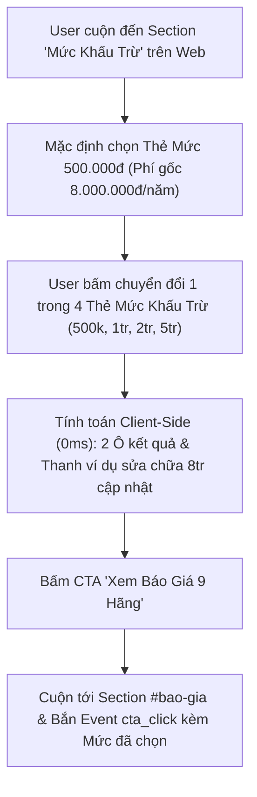

# PRD SPEC & CÔNG THỨC: Tool Mô Phỏng Mức Khấu Trừ Bảo Hiểm Ô Tô (/muc-khau-tru)

> - **Dự án:** Vehicle Hub & Trang Bảo Hiểm Ô Tô (`momo.vn/bao-hiem-o-to` & `momo.vn/tien-ich-giao-thong/muc-khau-tru`)
> - **Tài liệu gốc (Source PRD):** `/Users/hienhv/Downloads/PRD Tool mô phỏng mức khấu trừ, trang Bảo hiểm thân vỏ ô tô (web).docx`
> - **Đơn vị phụ trách:** Web Platform Team (Chịu trách nhiệm máy tính phí & UI/UX) x InsurTech BU (Chịu trách nhiệm file config tỷ lệ)
> - **Trạng thái:** PRD Approved & Production Spec Ready

---

## I. MỤC TIÊU & USER STORY

- **User Story:** Là chủ xe đang tìm hiểu bảo hiểm thân vỏ, tôi muốn biết chọn mức khấu trừ cao hơn thì phí bảo hiểm đóng hàng năm giảm bao nhiêu và mỗi lần xe gặp sự cố tôi tự trả bao nhiêu, để chọn mức hợp với thói quen lái xe của mình trước khi xem báo giá 9 hãng.
- **Hành vi tương tác:**
  - Mặc định chọn mức **500.000đ** (Mức phí gốc ví dụ cho xe 800 triệu là **8.000.000đ/năm**).
  - Người dùng bấm chuyển đổi 1 trong 4 thẻ mức khấu trừ (500k, 1tr, 2tr, 5tr) -> **2 ô kết quả và thanh ví dụ vụ sửa 8 triệu cập nhật ngay tức thì (0ms, không tải lại trang)**.
  - Khi bấm CTA **"Xem báo giá 9 hãng"**, trang cuộn xuống section `#bao-gia` và bắn event `cta_click` kèm thông tin mức khấu trừ đã chọn.

---

## II. SƠ ĐỒ LUỒNG TƯƠNG TÁC (USER FLOW & STEP BREAKDOWN)



<table style="width:100%; border-collapse:collapse; border:1.5px solid #64748b; margin:1em 0; font-size:0.9em;">
  <thead>
    <tr style="background-color:#f1f5f9;">
      <th style="border:1.5px solid #64748b; padding:8px 12px; text-align:left; font-weight:700;">Bước</th>
      <th style="border:1.5px solid #64748b; padding:8px 12px; text-align:left; font-weight:700;">Tên Giai Đoạn</th>
      <th style="border:1.5px solid #64748b; padding:8px 12px; text-align:left; font-weight:700;">Trải Nghiệm Người Dùng (UX)</th>
      <th style="border:1.5px solid #64748b; padding:8px 12px; text-align:left; font-weight:700;">Hạ Tầng / Cơ Chế Kỹ Thuật</th>
      <th style="border:1.5px solid #64748b; padding:8px 12px; text-align:left; font-weight:700;">Nền Tảng</th>
    </tr>
  </thead>
  <tbody>
    <tr>
      <td style="border:1px solid #94a3b8; padding:8px 12px; text-align:left;">1</td>
      <td style="border:1px solid #94a3b8; padding:8px 12px; text-align:left;">Tiếp Nhận Section</td>
      <td style="border:1px solid #94a3b8; padding:8px 12px; text-align:left;">Cuộn tới section hoặc nhấp Chip điều hướng 'Mức khấu trừ'. Mặc định chọn mức 500.000đ.</td>
      <td style="border:1px solid #94a3b8; padding:8px 12px; text-align:left;">Client Component State Initialization (React/Next.js)</td>
      <td style="border:1px solid #94a3b8; padding:8px 12px; text-align:left;">Web Platform</td>
    </tr>
    <tr style="background-color:#f8fafc;">
      <td style="border:1px solid #94a3b8; padding:8px 12px; text-align:left;">2</td>
      <td style="border:1px solid #94a3b8; padding:8px 12px; text-align:left;">Chọn Thẻ Mức Khấu Trừ</td>
      <td style="border:1px solid #94a3b8; padding:8px 12px; text-align:left;">Bấm chọn 1 trong 4 thẻ (500k, 1tr, 2tr, 5tr).</td>
      <td style="border:1px solid #94a3b8; padding:8px 12px; text-align:left;">State Update onClick Handler (No Re-render delay)</td>
      <td style="border:1px solid #94a3b8; padding:8px 12px; text-align:left;">Web Platform</td>
    </tr>
    <tr>
      <td style="border:1px solid #94a3b8; padding:8px 12px; text-align:left;">3</td>
      <td style="border:1px solid #94a3b8; padding:8px 12px; text-align:left;">Cập Nhật Kết Quả & Thanh Ví Dụ</td>
      <td style="border:1px solid #94a3b8; padding:8px 12px; text-align:left;">Ô Phí bảo hiểm đóng/năm, Ô Số tiền tự trả/vụ và Thanh ví dụ sửa 8 triệu cập nhật ngay.</td>
      <td style="border:1px solid #94a3b8; padding:8px 12px; text-align:left;">Pure JS View Function (`calculateDeductible`)</td>
      <td style="border:1px solid #94a3b8; padding:8px 12px; text-align:left;">Web Platform</td>
    </tr>
    <tr style="background-color:#f8fafc;">
      <td style="border:1px solid #94a3b8; padding:8px 12px; text-align:left;">4</td>
      <td style="border:1px solid #94a3b8; padding:8px 12px; text-align:left;">Điều Hướng Báo Giá 9 Hãng</td>
      <td style="border:1px solid #94a3b8; padding:8px 12px; text-align:left;">Bấm nút CTA 'Xem báo giá 9 hãng', trang cuộn tới section #bao-gia.</td>
      <td style="border:1px solid #94a3b8; padding:8px 12px; text-align:left;">Smooth Scroll `#bao-gia` + Bắn Event GA4 `cta_click`</td>
      <td style="border:1px solid #94a3b8; padding:8px 12px; text-align:left;">Web Platform</td>
    </tr>
  </tbody>
</table>

---

## III. BẢN ĐỒ KHỐI GIAO DIỆN 9 THÀNH PHẦN (UI SPEC & COPY)

| Thành Phần STT | Tên Thành Phần | Nội Dung Copy & Trạng Thái 500k (Mặc định) | Trạng Thái Khi Chọn Mức 1tr, 2tr, 5tr | Cơ Chế Cập Nhật |
| :---: | :--- | :--- | :--- | :--- |
| **1** | Tiêu đề Bước 1 | `Bước 1: Chọn mức khấu trừ` | Không đổi | Cố định |
| **2** | 4 Thẻ Mức Khấu Trừ | 4 Thẻ: `500.000đ` (Active), `1.000.000đ`, `2.000.000đ`, `5.000.000đ` | Thẻ được chọn sáng Active | User bấm chọn |
| **3** | Ghi chú pháp lý dưới Bước 1 | `Mức giảm thực tế tùy hãng bảo hiểm, có hãng giảm đến 30% ở mức 5.000.000đ. Không phải hãng nào cũng có đủ 4 mức.` | Không đổi | Cố định (Legal Approved) |
| **4** | Tiêu đề Bước 2 | `Bước 2: Xem thay đổi` | Không đổi | Cố định |
| **5** | Ô Phí bảo hiểm đóng/năm | Số lớn: `8.000.000đ`<br>Badge xám: `Mức phí gốc` | Số lớn: `[Phí mới]` (VD: `7.200.000đ`)<br>Gạch ngang: `8.000.000đ`<br>Badge xanh: `Rẻ hơn [Số tiền] mỗi năm (giảm [X]%)` | User bấm chọn |
| **6** | Ô Mỗi lần sự cố tự trả | Số lớn: `500.000đ`<br>Dòng phụ: `Hãng bảo hiểm chi trả phần còn lại.` | Số lớn: `[Mức đã chọn]` (VD: `2.000.000đ`)<br>Dòng phụ: `Nhiều hơn [Mức - 500k] so với mức 500.000đ. Hãng bảo hiểm chi trả phần còn lại.` | User bấm chọn |
| **7** | Thanh ví dụ vụ sửa 8 triệu | Tiêu đề: `Ví dụ: xe va chạm, chi phí sửa chữa 8.000.000đ`<br>Phần đỏ (Tự trả): `500.000đ` (6.25%)<br>Phần xanh (Hãng trả): `7.500.000đ` | Phần đỏ dài theo `Mức tự trả / 8.000.000đ`<br>Phần xanh là phần còn lại | User bấm chọn |
| **8** | Dòng chú thích ví dụ | `Căn cứ theo vụ sửa chữa ví dụ 8.000.000đ` | Không đổi | Cố định |
| **9** | Nút CTA | `Xem báo giá 9 hãng` | Không đổi | Cuộn `#bao-gia` + Bắn Event |

---

## IV. BẢNG TRẠNG THÁI TEST ORACLE CHO QA & DEVELOPER

(Dựa trên hằng số Phí gốc `8.000.000đ/năm` và Chi phí sửa chữa ví dụ `8.000.000đ/vụ` năm 2026)

| Mức Khấu Trừ | Tỷ Lệ Giảm | Ô 1: Phí Đóng Hàng Năm | Badge Tiết Kiệm | Ô 2: Bạn Tự Trả | Dòng Phụ Ô 2 | Thanh Ví Dụ (Bạn Trả / Hãng Trả) |
| :---: | :---: | :---: | :--- | :---: | :--- | :---: |
| **500.000đ** | **0%** | **8.000.000đ** | Mức phí gốc | **500.000đ** | Hãng bảo hiểm chi trả phần còn lại. | **500.000đ / 7.500.000đ** |
| **1.000.000đ** | **5%** | **7.600.000đ** *(Gạch 8.000.000đ)* | Rẻ hơn 400.000đ mỗi năm (giảm 5%) | **1.000.000đ** | Nhiều hơn 500.000đ so với mức 500.000đ… | **1.000.000đ / 7.000.000đ** |
| **2.000.000đ** | **10%** | **7.200.000đ** *(Gạch 8.000.000đ)* | Rẻ hơn 800.000đ mỗi năm (giảm 10%) | **2.000.000đ** | Nhiều hơn 1.500.000đ so với mức 500.000đ… | **2.000.000đ / 6.000.000đ** |
| **5.000.000đ** | **20%** | **6.400.000đ** *(Gạch 8.000.000đ)* | Rẻ hơn 1.600.000đ mỗi năm (giảm 20%) | **5.000.000đ** | Nhiều hơn 4.500.000đ so với mức 500.000đ… | **5.000.000đ / 3.000.000đ** |

---

## V. MÃ NGUỒN CHUẨN THAM KHẢO CHO DEVELOPER (IMPLEMENTATION CODE)

```javascript
// Hằng số cố định năm 2026 (Khai báo đầu file Component, không gọi CMS API)
const BASE_PREMIUM = 8000000;  // Phí gốc ví dụ cho xe 800 triệu
const REPAIR_COST = 8000000;   // Chi phí sửa chữa ví dụ

const DEDUCTIBLE_LEVELS = [
  { amount: 500000,  discount: 0.00, label: "500.000đ" },
  { amount: 1000000, discount: 0.05, label: "1.000.000đ" },
  { amount: 2000000, discount: 0.10, label: "2.000.000đ" },
  { amount: 5000000, discount: 0.20, label: "5.000.000đ" },
];

function calculateDeductibleView(selectedLevel) {
  const currentFee = BASE_PREMIUM * (1 - selectedLevel.discount);
  const savingAmount = BASE_PREMIUM - currentFee;
  const extraDeductible = selectedLevel.amount - 500000;
  const insurerPays = REPAIR_COST - selectedLevel.amount;
  
  return {
    annualFee: currentFee,                                      // Ô 1: Phí đóng năm
    savingAmount: savingAmount,                                // Badge số tiền tiết kiệm
    discountPercent: selectedLevel.discount * 100,             // Badge % giảm
    deductibleAmount: selectedLevel.amount,                    // Ô 2: Số tiền tự trả
    extraVsBase: extraDeductible,                              // Dòng phụ so với 500k
    barYouPay: selectedLevel.amount,                           // Thanh ví dụ: Phần Đỏ
    barInsurerPays: insurerPays,                               // Thanh ví dụ: Phần Xanh
    barRedWidthPercent: (selectedLevel.amount / REPAIR_COST) * 100 // Tỷ lệ % thanh đỏ
  };
}
```
