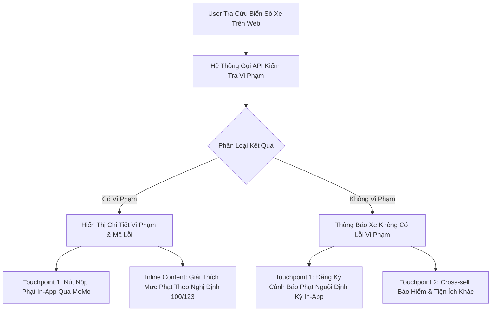

# BRD: Vehicle Hub - Cổng Tiện Ích & Hồ Sơ Phương Tiện MoMo

> - **Project:** Vehicle Hub (Web Platform & Vehicle Profile Identity)
> - **Division:** Growth Platform Division (GPD)
> - **Owner:** Web Platform Team x Cell Teams (VTTI & InsurTech)
> - **Version:** v4.0 - Tháng 9/2026
> - **Status:** Active & Production Ready (`momo.vn/tien-ich-giao-thong`)

---

### 3.5 Đặc Tả Kỹ Thuật Thuật Toán: Phong Thủy Biển Số Xe

Tiện ích tra cứu phong thủy đóng vai trò là "Traffic Magnet" kéo lượng lớn người dùng tự nhiên (989K Volume Search). Logic xử lý được thiết kế tĩnh (không cần AI):

**1. Dữ liệu nạp tĩnh (Database):**
*   **Bảng mã 80 Dịch Lý (JSON):** 80 bản ghi chứa ý nghĩa Cát/Hung.
*   **Dictionary Biển Đẹp/Xấu:** Chứa các cụm Regex số đẹp (Tứ quý, 39, 79, 68) hoặc kỵ (49, 53).

**2. Công thức chạy tuần tự (Logic Flow):**
*   **Bước 1 (Regex Check):** Quét 4-5 số cuối. Nếu khớp Dictionary Biển Đẹp/Xấu ➔ In luôn kết quả Cát/Hung.
*   **Bước 2 (Công thức 80):** Gọi `N` = Số đuôi. Tính `R = (N/80 - INT(N/80)) * 80`. Lấy kết quả `R` tra bảng JSON 80 Dịch Lý.
*   **Bước 3 (Tổng Nút):** `Sum(các chữ số) % 10` để trả số nút biển.

---

## I. OVERVIEW

### 1.1 Scope & Objectives

#### A. Context & Goals
* **Thực trạng:** Chủ xe ô tô và xe máy tại Việt Nam phải sử dụng nhiều ứng dụng và trang web khác nhau để tra cứu phạt nguội, nạp tiền ETC, theo dõi hạn đăng kiểm, mua bảo hiểm và tìm cây xăng/bãi đỗ.
* **Mục tiêu:** Hợp nhất các tiện ích này trên website `momo.vn` để thu hút traffic tự nhiên từ kết quả tìm kiếm Google, khởi tạo Hồ sơ xe (Vehicle Profile) và điều hướng người dùng sang App MoMo để hoàn tất giao dịch.

#### B. Web vs In-App Scope

| Tiêu Chí So Sánh | Kênh Website (Web Vehicle Hub) | In-App Mini App (Vehicle Center) |
| :--- | :--- | :--- |
| **Tên Sản Phẩm** | Cổng Tiện Ích Giao Thông | Vehicle Center Mini App |
| **Nền Tảng / URL** | Website (`momo.vn/tien-ich-giao-thong`, `momo.vn/phat-nguoi`) | Ứng dụng di động MoMo (iOS & Android) |
| **Đơn Vị Phụ Trách** | Web Platform | VTTI x InsurTech |
| **Vai Trò Cốt Lõi** | Thu hút traffic tự nhiên & Khởi tạo Hồ sơ xe | Quản lý phương tiện, tự động hóa & thanh toán |
| **Trải Nghiệm (UX)** | Tra cứu công khai, không bắt buộc đăng nhập | Quản lý Thẻ Xe Số, nhận thông báo tự động, nộp phạt, mua bảo hiểm |
| **Cơ Chế Chuyển Đổi** | • Desktop: Dynamic QR Code • Mobile: Onelink mở Mini App (Store nếu chưa cài) | Thanh toán trực tiếp qua Ví MoMo / Ví Trả Sau |
| **KPIs Cam Kết** | • Total Traffic: 500.000 (Phase 1 Pilot) • CTR chuyển đổi Web-to-App: ≥ 5.0% - 10.0% | • MAU In-App: 250.000 • Hồ sơ xe mới: 100.000 |

---

### 1.2 Web-to-App Flywheel

Kênh Website vận hành dựa trên các tiện ích tra cứu miễn phí để thu hút người dùng từ Google Search, tạo đòn bẩy thu thập biển số xe và chuyển đổi sang App:

* **Chuỗi hành trình chuyển đổi (Web-to-App Flow):**
  `[Google Search Demand]` ➔ `[Website momo.vn (Tra cứu công khai)]` ➔ `[Trả kết quả + Đề xuất tiện ích]` ➔ `[Thu thập Biển số xe]` ➔ `[Chuyển đổi qua QR Code / Onelink]` ➔ `[App MoMo: Quản lý Thẻ Xe Số]`

| Bước | Giai Đoạn | Hành Động Của Người Dùng | Cơ Chế Phản Hồi Của Hệ Thống | Nền Tảng |
| :---: | :--- | :--- | :--- | :--- |
| **1** | Tìm kiếm thông tin | Search từ khóa (Phạt nguội, Giá xăng, Phong thủy, Đăng kiểm) trên Google | Hiển thị kết quả tìm kiếm tự nhiên của momo.vn | Google Search |
| **2** | Trải nghiệm tiện ích | Truy cập trang Web, nhập biển số xe để tra cứu miễn phí | Trả kết quả tra cứu tốc độ cao, không yêu cầu đăng nhập | Website momo.vn |
| **3** | Nhận diện giá trị | Xem kết quả tra cứu và đề xuất gói ưu đãi đính kèm | Hiển thị nút CTA chuyển tiếp mở App MoMo để nhận nhắc lịch | Website momo.vn |
| **4** | Chuyển đổi kênh | Quét Dynamic QR Code (trên máy tính) hoặc bấm nút Onelink (trên điện thoại) | Hệ thống phân luồng mở ứng dụng MoMo hoặc chuyển về Store | QR / Onelink |
| **5** | Kích hoạt In-App | Đăng nhập ứng dụng MoMo | Lưu Thẻ Xe Số vào hồ sơ, nhận cảnh báo tự động & thanh toán | App MoMo |

#### Web Spoke Directory

* **Nhóm Tiện Ích Tra Cứu & Thu Hút Traffic (Traffic Magnets):**
  1. **Tiện ích Phạt Nguội (`/phat-nguoi`):** Tra cứu vi phạm giao thông theo biển số xe. Đặt khối bán chéo bảo hiểm và nút lưu biển số xe để nhận thông báo tự động hàng tuần.
  2. **Tiện ích Bảng Giá Xăng Dầu (`/tien-ich-giao-thong/gia-xang`):** Cập nhật bảng giá xăng dầu realtime kỳ điều hành và vị trí cây xăng Petrolimex/PVOil chấp nhận Ví MoMo.
  3. **Tiện ích Phong Thủy & Đấu Giá Biển Số (`/tien-ich-giao-thong/phong-thuy-bien-so`):** Giải mã ý nghĩa phong thủy 5 số cuối, tính số nút và tra cứu kết quả đấu giá biển số để thúc đẩy người dùng nhập biển số xe.
  4. **Tra Cứu Mức Phạt Giao Thông (`/tien-ich-giao-thong/tra-cuu-muc-phat`):** Danh bạ tra cứu mức tiền phạt & hình phạt tước GPLX theo Nghị định 100/123.
  5. **Tiện ích Đăng Kiểm Xe (`/tien-ich-giao-thong/dang-kiem`):** Tra cứu hạn kiểm định xe và đăng ký nhận thông báo nhắc lịch tự động qua App MoMo.

* **Nhóm Dịch Vụ Thanh Toán & Giao Dịch Cốt Lõi (Core Transactional Spokes):**
  6. **Bảo Hiểm Ô Tô & Xe Máy (`/bao-hiem-o-to`, `/bao-hiem-xe-may`):** Bán trực tuyến và gia hạn bảo hiểm TNDS bắt buộc & Bảo hiểm Thân vỏ ô tô cấp ấn chỉ điện tử tức thì.
  7. **Thu Phí Không Dừng (`/phi-khong-dung`):** Tra cứu số dư, hướng dẫn liên kết tài khoản ePass và kích hoạt tính năng tự động nạp tiền (Auto-Topup).

* **Nhóm Tiện Ích Bản Đồ Local & Công Cụ Hỗ Trợ Lộ Trình (Local GEO & Calculators):**
  8. **Trạm Sạc Xe Điện (`/tien-ich-giao-thong/tram-sac`):** Định vị trạm sạc VinFast, V-Green theo vị trí GPS và đề xuất gói bảo hiểm xe điện.
  9. **Bản Đồ Garage & Bảo Dưỡng (`/tien-ich-giao-thong/tim-garage`):** Định vị garage sửa chữa ô tô/xe máy, trung tâm rửa xe & detailing gần nhất.
  10. **Bãi Đỗ Xe & Cứu Hộ Đường Bộ 24/7 (`/tien-ich-giao-thong/bai-do-xe`):** Bản đồ bãi đỗ xe ô tô, dịch vụ gọi xe cứu hộ sự cố khẩn cấp và công cụ dự toán chi phí nuôi xe/thuế trước bạ.

---

### 1.3 Metrics & Targets

#### North Star Metrics

| Tầng Đo Lường | Chỉ Số KPI Cốt Lõi | Định Nghĩa Chỉ Số | Target Phase 1 Pilot | Vai Trò Quản Trị |
| :--- | :--- | :--- | :--- | :--- |
| **Kênh Website** | **Total Traffic (Pageview)** | Tổng lượt truy cập vào các trang tiện ích giao thông trên website `momo.vn`. | **500.000** | Hứng tối đa nhu cầu tìm kiếm của chủ xe trên Google Search. |
| **Kênh Website** | **%CTR Chuyển Đổi (W2A)** | Tỷ lệ nhấp nút chuyển đổi từ website sang mở ứng dụng MoMo. | **≥ 5.0% - 10.0%** | Đo lường hiệu quả chuyển đổi từ kênh Web sang App. |
| **Kênh App** | **Logged-in MAU** | Số lượng người dùng định danh hoạt động hàng tháng trong ứng dụng. | **250.000** | Đo lường mức độ giữ chân người dùng trong ứng dụng. |
| **Kênh App** | **New Vehicle Profiles** | Số lượng Thẻ Xe Số (Hồ sơ xe) được khởi tạo mới thành công In-App. | **100.000** | Xây dựng kho dữ liệu phương tiện tập trung cho MoMo. |

#### Target & Run-Rate Alignment

> **Lưu ý về chỉ số:** Các chỉ số tổng Target Phase 1 Pilot (*Total Traffic 500.000, %CTR W2A ≥ 5.0% - 10.0%, Logged-in MAU 250.000, New Vehicle Profiles 100.000*) **đã được Ban Giám Đốc phê duyệt chính thức**. 

### 1.4 Báo Cáo Hiệu Suất MTD 27/09/2026 & Cột Mốc Sản Phẩm Mới

#### A. Dữ Liệu Hiệu Suất Vận Hành MTD 27 Ngày (01/09 - 27/09/2026)
* **Lưu lượng MTD 27d:** Đạt **61.907 Pageviews** (chiếm 1.76% tổng lưu lượng Kênh Web).
* **Tốc độ vận hành (Daily Pace):** Đạt **2.293 PV/ngày**.
* **Dự báo trọn tháng (Run-rate Forecast 30d):** Ước tính đạt **68.786 PVs** (34.4% Target Hub 200K).
* **Phân rã theo Verticals MTD 27d:**
  * Phạt Nguội: **37.109 PVs** (59.9% Hub)
  * Bảo Hiểm Ô Tô: **17.398 PVs** (28.1% Hub)
  * Bảo Hiểm Xe Máy: **5.826 PVs** (9.4% Hub)
  * Phí Không Dừng & Tiện Ích Giao Thông: Lần lượt đạt **952 PVs** và **622 PVs**

#### B. Tiến Độ Sản Phẩm & Content Realignment
* **Tự Chủ Sản Xuất Content PLG:** Web Platform Team tiếp tục chủ động sản xuất nội dung bài viết chuyên sâu trên các dự án PLG (Phạt nguội, Giá xăng, Trạm sạc, Đăng kiểm) qua GenAI Pipeline.
* **Staging Trang Tìm Garage:** Đã hoàn thành đưa lên **Staging** trang **Tìm Garage (`/tien-ich-giao-thong/tim-garage`)**, dự kiến chính thức **Go-live trước 30/09/2026**.
* **Hỗ Trợ InsurTech BU & Ads Budget 550 Triệu:** Phối hợp hỗ trợ Cell Team triển khai hệ thống Blog cho **Bảo Hiểm Ô Tô** (được duyệt ngân sách **Paid Ads 550 triệu VND** chạy từ nay đến hết 2026), tối ưu UI/UX và phễu acquire New User.

##### Số Liệu Baseline Thực Tế Kênh Web (Full Month T5 - T8/2026 & T9 MTD)

Dưới đây là số liệu lưu lượng truy cập thực tế (Page Views) đã ghi nhận qua các tháng theo từng nhóm sản phẩm và kênh tiếp cận:

| Dự Án (Project) | Kênh (Channel) | T5/2026 | T6/2026 | T7/2026 | T8/2026 | T9/2026 (MTD 08/09) | So Với Tháng Trước (VS. LM) |
| :--- | :--- | :---: | :---: | :---: | :---: | :---: | :---: |
| **Tổng Traffic (Page Views)** | **Toàn Bộ** | **311.592** | **588.459** | **172.586** | **234.359** | **12.024** | **-222.335** |
| *Net Change* | | *311.592* | *+276.867* | *-415.873* | *+61.773* | *-222.335* | |
| *Growth Rate (%)* | | *0,00%* | *188,86%* | *29,33%* | *135,79%* | *5,13%* | *-94,87%* |
| **Phạt Nguội** | **Tổng Nhóm** | **294.668** | **573.611** | **154.889** | **213.826** | **11.526** | **-202.300** |
| | Paid | 278.869 | 504.852 | 55.564 | 123.171 | 2.775 | -120.396 |
| | Direct | 7.817 | 36.982 | 53.135 | 48.868 | 3.723 | -45.145 |
| | Organic | 6.842 | 28.426 | 44.530 | 39.949 | 4.809 | -35.140 |
| | Others | 757 | 2.976 | 1.210 | 976 | 30 | -946 |
| | Referral | 383 | 375 | 450 | 862 | 189 | -673 |
| **Bảo Hiểm Ô Tô** | **Tổng Nhóm** | **12.014** | **10.943** | **12.417** | **13.266** | **285** | **-12.981** |
| | Organic | 10.614 | 9.363 | 10.518 | 10.730 | 240 | -10.490 |
| | Direct | 795 | 954 | 918 | 1.002 | 22 | -980 |
| | Referral | 444 | 457 | 479 | 377 | 9 | -368 |
| | Paid | 20 | 24 | 303 | 907 | 0 | -907 |
| | Others | 141 | 145 | 199 | 250 | 14 | -236 |
| **Bảo Hiểm Xe Máy** | **Tổng Nhóm** | **4.910** | **3.905** | **5.280** | **7.267** | **213** | **-7.054** |
| | Organic | 4.269 | 2.931 | 4.285 | 4.426 | 176 | -4.250 |
| | Direct | 277 | 236 | 286 | 1.224 | 28 | -1.196 |
| | Referral | 248 | 157 | 245 | 226 | 5 | -221 |
| | Paid | 14 | 537 | 404 | 1.267 | 2 | -1.265 |
| | Others | 102 | 44 | 60 | 124 | 2 | -122 |

---

## II. MARKET DEMAND & COMPLIANCE

### 2.1 Search Demand

Theo phân tích dữ liệu thực tế từ bộ từ khóa giao thông và hệ thống nghiên cứu thị trường, tổng nhu cầu tìm kiếm tự nhiên của chủ xe đạt hơn **23.2 triệu lượt/tháng (23.215.290 search/tháng)**, phân bổ trực tiếp qua 19 thị trường ngành và nhóm tiện ích cốt lõi:

| STT | Thị Trường (Market) | Lượt Tìm Kiếm / Tháng (Volume) | Tỷ Trọng (%) | Ý Định Tìm Kiếm (Search Intent) |
| :---: | :--- | :---: | :---: | :--- |
| **1** | **Giá Xăng** | 10.520.000 | 45,30% | Commercial / Info |
| **2** | **Trạm Sạc (EV)** | 1.240.000 | 5,30% | Transactional / Local |
| **3** | **Cây Xăng** | 550.000 | 2,40% | Transactional / Local |
| **4** | **Phạt Nguội** | 6.575.000 | 28,30% | Transactional / Urgent Need |
| **5** | **Xăng Sinh Học E10** | 127.000 | 0,50% | Informational / Utility |
| **6** | **Định Giá Xe** | 16.140 | 0,10% | Commercial / High Intent |
| **7** | **Thu Phí Không Dừng (ETC)** | 1.308.210 | 5,60% | Commercial / Transactional |
| **8** | **Trạm Thu Phí (BOT)** | 95.000 | 0,40% | Commercial / Route |
| **9** | **Đăng Kiểm Xe** | 182.000 | 0,80% | Commercial / Legal |
| **10** | **Bãi Đỗ Xe** | 180.000 | 0,80% | Transactional / Local |
| **11** | **Chi Phí Nuôi Xe** | 18.500 | 0,10% | Informational / Finance |
| **12** | **Giá Lăn Bánh & Trước Bạ** | 44.000 | 0,20% | Commercial / Calc |
| **13** | **So Sánh Xe** | 45.000 | 0,20% | Commercial / Research |
| **14** | **Cứu Hộ Giao Thông** | 788.400 | 3,40% | Transactional / Urgent SOS |
| **15** | **Sửa Chữa Xe & Garage** | 934.000 | 4,00% | Transactional / Local |
| **16** | **Bảo Hiểm Phương Tiện** | 116.320 | 0,50% | Transactional / Monetize |
| **17** | **Rửa Xe & Detailing** | 284.000 | 1,20% | Commercial / Care |
| **18** | **Biển Số Xe & Phong Thủy** | 146.720 | 0,60% | Informational / Viral |
| **19** | **Camera Giao Thông** | 45.000 | 0,20% | Informational / Realtime |
| **--** | **TỔNG CỘNG TOÀN BỘ THỊ TRƯỜNG** | **23.215.290** | **100,00%** | |

### 2.2 Khung Kiến Trúc 4 Vòng Đời Chủ Xe Trên Web Platform (Vehicle Owner Lifecycle Framework)

Toàn bộ 19 thị trường ngành (23.2 triệu search volume) và các tính năng của Vehicle Hub được chuẩn hóa và quy hoạch theo **4 giai đoạn vòng đời sử dụng xe thực tế của người dùng**, đảm bảo sự kết hợp cân bằng giữa Tần suất sử dụng giữ chân người dùng (Retention) và Giá trị thương mại chuyển đổi doanh thu (Monetization):

| Vòng Đời Chủ Xe | Tần Suất Hành Vi | Ý Định Tìm Kiếm (Intent) | Danh Sách Sản Phẩm & Tiện Ích Web Tương Ứng | Mục Tiêu Kinh Doanh & W2A Hook |
| :--- | :---: | :--- | :--- | :--- |
| **Vòng Đời 1: Vận Hành Hàng Ngày** *(Daily Mobility)* | Hàng ngày / Hàng tuần | Tìm kiếm tức thời, tra cứu giá & dẫn đường: Cây xăng gần nhất, trạm sạc EV, nạp tiền ePass, bãi gửi xe, giá xăng dầu. | • Bảng giá xăng dầu (`/gia-xang`) & Xăng E10 (`/xang-e10`) • Bản đồ Cây xăng (`/cay-xang`) & Trạm sạc EV (`/tram-sac`) • Thu phí tự động ePass (`/phi-khong-dung`, `/tram-thu-phi`) • Bản đồ bãi đỗ xe 24/7 (`/bai-do-xe`) • Kênh trực tiếp Camera giao thông (`/camera-giao-thong`) | **Tần suất sử dụng cao (High Frequency):** Thúc đẩy thanh toán mã QR tại trụ bơm, nạp tài khoản giao thông 0đ phí, gia tăng số lượng Active Users hàng tháng (MAU). |
| **Vòng Đời 2: Bảo Trì & Sự Cố** *(Maintenance & Repair)* | Định kỳ 3 - 6 tháng / Khẩn cấp | Giải quyết sự cố & bảo dưỡng định kỳ: Tìm garage uy tín, dự toán chi phí sửa xe tránh vẽ bệnh, gọi xe kéo cứu hộ, rửa xe. | • Tìm Garage & Sửa xe (`/tim-garage`) • Tool Dự toán chi phí sửa chữa chuẩn (Fair Price Estimator) • Cứu hộ giao thông khẩn cấp 24/7 (`/cuu-ho`) • Dịch vụ Rửa xe & Detailing chăm sóc xe | **Giải quyết việc tức thì (Action Fulfillment):** Đặt lịch hẹn bảo dưỡng giữ chỗ, gọi Hotline cứu hộ 1-chạm, phát triển mạng lưới điểm chấp nhận thanh toán MoMo (M4B Garage). |
| **Vòng Đời 3: Pháp Lý & Giấy Tờ** *(Legal & Paperwork)* | Định kỳ 6 - 24 tháng | Bắt buộc theo luật định: Tra cứu vi phạm phạt nguội CSGT, hạn kiểm định đăng kiểm, mua bảo hiểm TNDS, tra cứu biển số xe. | • Cổng tra cứu Phạt nguội 0-CAPTCHA (`/phat-nguoi` & 63 tỉnh) • Tra cứu & Đặt lịch Đăng kiểm (`/dang-kiem`) • Bảo hiểm bắt buộc TNDS xe máy & ô tô • Tra cứu Phong thủy biển số xe (`/phong-thuy-bien-so`) | **Móc câu hút Traffic khổng lồ (Traffic Magnets):** Khai thác 6.5M volume phạt nguội, thúc đẩy nộp phạt trực tuyến xóa cảnh báo đăng kiểm, thanh toán dịch vụ công. |
| **Vòng Đời 4: Tài Chính & Tài Sản** *(Financial & Asset)* | 1 - 5 năm / Khi mua bán xe | Quyết định tài chính lớn: Định giá xe thị trường, tính chi phí lăn bánh, dự toán chi phí nuôi xe hàng tháng, mua bảo hiểm thân vỏ, vay mua xe. | • Công cụ Định giá xe thông minh (`/dinh-gia-xe`) • Máy tính Dự toán chi phí lăn bánh (`/lan-banh`) • Máy tính Chi phí nuôi ô tô hàng tháng (`/chi-phi-nuoi-xe`) • Đặt lên bàn cân So sánh xe (`/so-sanh-xe`) • Hệ thống 264 trang chi tiết Dòng xe (`/hang-xe/*`) • Sàn so sánh Bảo hiểm vật chất thân vỏ 9 hãng | **Doanh thu trực tiếp (Direct Monetization):** Giá trị đơn hàng lớn (High ARPU/LTV), tạo Lead chất lượng cao cho Bảo hiểm thân vỏ và Gói vay mua xe đối tác ngân hàng MoMo. |

---

### 2.3 Legal & Compliance

1. **Tuân Thủ Luật Biển Số Định Danh (Thông tư 24/2023/TT-BCA):**
   * Biển số xe gắn với mã định danh cá nhân (CCCD) của chủ xe và được giữ lại 5 năm khi bán xe.
   * Xây dựng tính năng quản lý danh sách biển số định danh thuộc sở hữu của người dùng theo CCCD trên App MoMo.
2. **Đấu Giá Biển Số Xe (Nghị quyết 73/2022/QH15):**
   * Cho phép tra cứu kết quả đấu giá biển số chính thức và công cụ định giá tham khảo cho biển số đẹp.
3. **Quy Tắc Bảo Mật Thông Tin Trên Website (Web Compliance):**
   * Khi hiển thị kết quả trên website công cộng, **tuyệt đối không hiển thị thông tin cá nhân (CCCD, Họ tên, Địa chỉ), bảo hiểm tư nhân hoặc giá trị tài sản của chủ xe**. Thông tin chi tiết chỉ hiển thị sau khi người dùng đăng nhập xác thực trên App MoMo.

---

## III. PRODUCT SPEC

### 3.1 Value Exchange Mechanism
* **Biển số xe:** Là chiếc chìa khóa định danh kết nối phương tiện ngoài đời thực với tài khoản MoMo (Agent ID).
* **Cơ chế trao đổi giá trị:** Cung cấp miễn phí các công cụ tra cứu tốc độ cao (Phạt nguội, Giá xăng, Phong thủy, Hạn đăng kiểm) để người dùng tự nguyện nhập Biển số xe ➔ Khởi tạo Thẻ Xe Số (Vehicle Profile).
* **Công cụ kiểm tra thông tin trước khi xuất phát:** Kiểm tra 4 yếu tố trước khi di chuyển: Phạt nguội, Số dư ePass, Giá xăng và Hạn Đăng kiểm/Bảo hiểm.

---

### 3.2 Master Page Block Spec

* **Main Headline:** `Một chiếc xe – Một tài khoản quản lý tự động trên MoMo`
* **Sub-headline:** `Tự động hóa toàn bộ nhắc lịch, cảnh báo vi phạm và đơn giản hóa thủ tục xe cộ ngay trên App MoMo.`

| Cột | Tiêu Đề Thẻ | Nội Dung Mô Tả Chi Tiết |
| :---: | :--- | :--- |
| **Cột 1** | **Cảnh báo vi phạm tự động** | Tự động quét và phát thông báo lỗi phạt nguội mới vào thứ Hai hàng tuần, chủ động xử lý trước kỳ đăng kiểm. |
| **Cột 2** | **Nhắc lịch đăng kiểm & bảo hiểm** | Tự động thông báo nhắc hạn kiểm định xe và gia hạn bảo hiểm TNDS/Thân vỏ trước 30, 15 và 7 ngày. |
| **Cột 3** | **Tự động nạp phí ePass** | Tự động bù tiền vào tài khoản thu phí không dừng khi số dư dưới hạn mức, di chuyển thông suốt qua mọi trạm BOT. |

---

### 3.3 Header Navigation Menu Specification

Thanh Menu Header (Header Navigation Bar) xuất hiện đồng bộ trên Trang chủ Master Hub (`/tien-ich-giao-thong`) và toàn bộ các Subpages vệ tinh, đóng vai trò là khung điều hướng trải nghiệm người dùng và phân luồng traffic nội bộ:

#### A. Cấu Trúc Thành Phần Header (Header Component Hierarchy)

| Thành Phần | Định Dạng Hiển Thị | Cơ Chế Điều Hướng (Target URL) | Vai Trò & Trải Nghiệm Người Dùng (UX) |
| :--- | :--- | :--- | :--- |
| **Logo & Brand Anchor** | Logo MoMo + Chữ *"Tiện Ích Giao Thông"* | `momo.vn/tien-ich-giao-thong` | Điểm neo thương hiệu, nhấp để quay về Trang chủ Hub trung tâm. |
| **Menu 1: Tra Cứu Vi Phạm** | Dropdown Menu (Kèm nhãn *Hot*) | • Tra cứu phạt nguội: `/phat-nguoi` • Biểu phí mức phạt: `/tien-ich-giao-thong/tra-cuu-muc-phat` | Dẫn luồng người dùng vào công cụ tra cứu vi phạm camera và bảng tra cứu mức phạt giao thông theo Nghị định 100/123. |
| **Menu 2: Nhiên Liệu & Trạm Sạc** | Dropdown Menu | • Bảng giá xăng dầu hôm nay: `/tien-ich-giao-thong/gia-xang` • Cây xăng gần nhất: `/tien-ich-giao-thong/cay-xang` • Trạm sạc xe điện EV: `/tien-ich-giao-thong/tram-sac` | Nhóm tiện ích hàng ngày, hỗ trợ kiểm tra biến động giá xăng dầu và định vị trạm tiếp nhiên liệu/trạm sạc theo vị trí GPS. |
| **Menu 3: Dịch Vụ & Bảo Dưỡng** | Dropdown Menu | • Garage & Sửa xe: `/tien-ich-giao-thong/tim-garage` • Bãi đỗ xe & Cứu hộ 24/7: `/tien-ich-giao-thong/bai-do-xe` • Tra cứu hạn đăng kiểm: `/tien-ich-giao-thong/dang-kiem` | Hỗ trợ tìm kiếm garage bảo dưỡng, gọi xe cứu hộ khẩn cấp và theo dõi chu kỳ kiểm định phương tiện. |
| **Menu 4: Bảo Hiểm Phương Tiện** | Dropdown Menu | • Bảo hiểm ô tô 9 hãng: `/bao-hiem-o-to` • Bảo hiểm xe máy điện tử: `/bao-hiem-xe-may` | Dẫn sang các trang sản phẩm độc lập để so sánh quyền lợi và mua bảo hiểm bắt buộc TNDS / Thân vỏ trực tuyến. |
| **Menu 5: Thu Phí Không Dừng** | Link Đơn (Single Link) | • ePass: `/phi-khong-dung` | Hướng dẫn liên kết tài khoản thu phí tự động và kích hoạt tính năng nạp tiền tự động (Auto-Topup) khi qua trạm BOT. |
| **Menu 6: Tiện Ích Mở Rộng** | Link Đơn (Single Link) | • Phong thủy & Đấu giá biển số: `/tien-ich-giao-thong/phong-thuy-bien-so` | Công cụ giải mã ý nghĩa phong thủy 5 số cuối và tra cứu kết quả đấu giá biển số đẹp. |
| **Header CTA (Bên Phải)** | Nút Nổi Bật (Primary Button) | • **Desktop:** Kích hoạt Dynamic QR Code Modal • **Mobile:** Kích hoạt Onelink mở App MoMo | Nút hành động kêu gọi chuyển đổi *"Mở Thẻ Xe Số"* / *"Quản Lý Xe Trên App"* nhằm tối đa hóa tỷ lệ W2A CTR. |

#### B. Quy Chuẩn Kỹ Thuật & Trải Nghiệm Responsive (UX Behavior)
* **Sticky Navigation:** Header cố định ở mép trên màn hình khi người dùng cuộn trang (Sticky Header), giúp điểm chạm chuyển đổi CTA và các menu tiện ích luôn sẵn sàng tương tác.
* **Hiển thị trên Mobile (Mobile Viewport):** Tự động thu gọn thành **Hamburger Menu (Icon 3 gạch)**; khi mở ra sẽ hiển thị dạng Accordion phân cấp theo từng nhóm tiện ích kèm nút CTA *"Mở App MoMo"* cố định ở chân menu trượt.
* **Tối ưu hóa SEO & Tracking:** Khai báo cấu trúc thẻ `<nav>` chuẩn HTML5 semantic, gắn mã tracking phân tích sự kiện `click_header_menu` và `click_header_cta` đồng bộ lên hệ thống GA4.

---

### 3.4 Sitemap Architecture (Tổng Hợp 22 URLs)

Hệ sinh thái Tiện Ích Giao Thông bao gồm **22 URLs** được phân bổ theo 8 nhóm chức năng cốt lõi:

#### 1. Trang Chủ Master Hub

| STT | URL | Mô Tả Chức Năng |
| :---: | :--- | :--- |
| 1 | `https://www.momo.vn/tien-ich-giao-thong` | Master Hub trung tâm kết nối toàn bộ tiện ích & phân luồng phương tiện. |

#### 2. Dòng Xe & Hãng Xe (Auto Catalog pSEO)

| STT | URL | Mô Tả Chức Năng |
| :---: | :--- | :--- |
| 2 | `https://www.momo.vn/tien-ich-giao-thong/hang-xe/[brand]` | Danh sách dòng xe theo thương hiệu (Toyota, Honda, VinFast...). |
| 3 | `https://www.momo.vn/tien-ich-giao-thong/hang-xe/[brand]/[model]` | Chi tiết thông số, giá lăn bánh & phụ tùng từng mẫu xe cụ thể. |

#### 3. Phạt Nguội & Cẩm Nang Luật (Traffic Fines & Regulations)

| STT | URL | Mô Tả Chức Năng |
| :---: | :--- | :--- |
| 4 | `https://www.momo.vn/tien-ich-giao-thong/tra-cuu-muc-phat` | Từ điển tra cứu mức phạt giao thông ô tô/xe máy theo Nghị định. |
| 5 | `https://www.momo.vn/tien-ich-giao-thong/bien-bao-giao-thong` | Danh mục & ý nghĩa các loại biển báo đường bộ chuẩn QCVN. |
| 6 | `https://www.momo.vn/tien-ich-giao-thong/kinh-nghiem-lai-xe` | Cẩm nang mẹo lái xe an toàn, bảo dưỡng xe & luật giao thông mới. |

#### 4. Bản Đồ Tiện Ích & Nhiên Liệu (Maps & Fuel Stations)

| STT | URL | Mô Tả Chức Năng |
| :---: | :--- | :--- |
| 7 | `https://www.momo.vn/tien-ich-giao-thong/tram-sac` | Bản đồ & tìm kiếm trạm sạc xe điện toàn quốc theo GPS. |
| 8 | `https://www.momo.vn/tien-ich-giao-thong/tram-sac/vinfast` | Chuyên trang trạm sạc xe điện VinFast, V-Green. |
| 9 | `https://www.momo.vn/tien-ich-giao-thong/cay-xang` | Bản đồ tìm cây xăng gần nhất chấp nhận thanh toán MoMo. |
| 10 | `https://www.momo.vn/tien-ich-giao-thong/gia-xang` | Cập nhật bảng giá xăng dầu RON 95, E5, Diesel kỳ điều hành. |

#### 5. Công Cụ Tính Toán & So Sánh (Calculators & Comparison)

| STT | URL | Mô Tả Chức Năng |
| :---: | :--- | :--- |
| 11 | `https://www.momo.vn/tien-ich-giao-thong/lan-banh` | Tính chi phí lăn bánh ô tô (Thuế trước bạ, biển số, phí đường bộ). |
| 12 | `https://www.momo.vn/tien-ich-giao-thong/chi-phi-nuoi-xe` | Công cụ tính tổng chi phí vận hành & nuôi xe hàng tháng. |
| 13 | `https://www.momo.vn/tien-ich-giao-thong/so-sanh-xe` | So sánh thông số kỹ thuật & giá bán giữa 2-3 mẫu xe. |

#### 6. Pháp Lý, Đăng Kiểm & Hồ Sơ Xe (Vehicle Paperwork & Legal)

| STT | URL | Mô Tả Chức Năng |
| :---: | :--- | :--- |
| 14 | `https://www.momo.vn/tien-ich-giao-thong/dang-kiem` | Tra cứu hạn đăng kiểm & đặt lịch kiểm định xe. |
| 15 | `https://www.momo.vn/tien-ich-giao-thong/phong-thuy-bien-so` | Tra cứu Cát/Hung phong thủy biển số xe. |
| 16 | `https://www.momo.vn/tien-ich-giao-thong/bao-hiem-o-to` | Mua & so sánh bảo hiểm TNDS, Thân vỏ xe 9 hãng. |

#### 7. Bãi Đỗ, Cứu Hộ, Bảo Dưỡng & Giao Thông (Mobility Services)

| STT | URL | Mô Tả Chức Năng |
| :---: | :--- | :--- |
| 17 | `https://www.momo.vn/tien-ich-giao-thong/bai-do-xe` | Tìm kiếm & đặt chỗ bãi đỗ ô tô / xe máy (Bãi Đỗ Xe Thông Minh). |
| 18 | `https://www.momo.vn/tien-ich-giao-thong/cuu-ho` | Gọi cứu hộ xe 24/7 (Kéo xe, vá lốp, kích bình). |
| 19 | `https://www.momo.vn/tien-ich-giao-thong/tram-thu-phi` | Tra cứu biểu phí ePass các trạm thu phí BOT. |
| 20 | `https://www.momo.vn/tien-ich-giao-thong/camera-giao-thong` | Xem camera giao thông quan sát điểm kẹt xe realtime. |
| 21 | `https://www.momo.vn/tien-ich-giao-thong/bao-duong` | Đặt lịch bảo dưỡng, rửa xe & chăm sóc xe (Detailing). |
| 22 | `https://www.momo.vn/tien-ich-giao-thong/chuyen-di` | Nhật ký chuyến đi & công cụ quản lý lộ trình. |

---

#### 8. Standalone Root Pages Liên Kết Hệ Sinh Thái

Các trang sản phẩm độc lập có cấu trúc đường dẫn Root URL cấp 1 (`https://www.momo.vn/[slug]`), giữ nguyên vai trò SEO và giao dịch chuyên sâu, kết nối hai chiều với Master Hub theo Growth Strategy:

| Tên Trang Độc Lập | URL | Loại Trang | Mục Đích Tồn Tại & Cơ Chế Liên Kết Với Master Hub |
| :--- | :--- | :--- | :--- |
| **Tra Cứu Phạt Nguội** | `https://www.momo.vn/phat-nguoi` | Standalone Page (Root) | Cổng tra cứu vi phạm camera giao thông tốc độ cao (Top 1 Google, 6.1M traffic); giữ vai trò 'đầu phễu hút khách' lớn nhất để dẫn sang Master Hub lưu biển số và bán chéo bảo hiểm. |
| **Bảo Hiểm Ô Tô** | `https://www.momo.vn/bao-hiem-o-to` | Standalone Page (Root) | Trang so sánh quyền lợi và tính phí tự động của 9 hãng bảo hiểm; giúp chủ xe mua bảo hiểm TNDS & Thân vỏ online, nhận ấn chỉ điện tử sau 30 giây (nhận traffic từ Master Hub). |
| **Bảo Hiểm Xe Máy** | `https://www.momo.vn/bao-hiem-xe-may` | Standalone Page (Root) | Trang mua nhanh bảo hiểm bắt buộc xe máy 66k/năm bằng 1 chạm, nhận ngay giấy chứng nhận điện tử có mã QR để xuất trình CSGT (nhận traffic mua nhanh từ Master Hub). |
| **Thu Phí Không Dừng** | `https://www.momo.vn/phi-khong-dung` | Standalone Page (Root) | Hướng dẫn liên kết tài khoản và kích hoạt tính năng tự động nạp tiền ePass khi số dư dưới hạn mức, giúp tài xế qua trạm BOT thông suốt không bị kẹt xe. |

---

### 3.5 Web-to-App Entry Points & Routing Scope Boundaries

#### A. Ranh Giới Scope Web Platform vs App Product Team
* **Trách Nhiệm Kênh Web (Web Platform Scope):** Web Platform **chỉ chịu trách nhiệm khởi tạo và thiết lập các điểm chạm Entry Points trên Kênh Web** (`momo.vn`) để người dùng nhấp nút hoặc quét mã chuyển tiếp mở ứng dụng MoMo. Web Platform không gánh scope vận hành hay xây dựng luồng sản phẩm phía App.
  * **Trên thiết bị Desktop (Máy tính):** Web Platform thiết lập Entry Point dưới dạng **Dynamic QR Code Modal** chứa thông tin tra cứu / mã biển số.
  * **Trên thiết bị Mobile (Điện thoại/Tablet):** Web Platform thiết lập Entry Point dưới dạng **Nút bấm CTA / Banner** gắn đường dẫn Onelink tiêu chuẩn.
* **Trách Nhiệm Sản Phẩm Phía App (App Product Scope - Cell Teams / App Team):** Đội ngũ Sản phẩm phía App chịu trách nhiệm 100% về luồng sản phẩm In-App (App Product Flow), bao gồm: tiếp nhận luồng mở App từ Onelink/QR, điều hướng màn hình In-App (Internal Routing Schema), hiển thị màn hình Mini App / Vehicle Center và xử lý logic giao dịch.

#### B. Chuỗi Chuyển Tiếp & Phân Định Đỉnh Trạm Entry Points

* **Chuỗi phân luồng chuyển tiếp Entry Points:**
  `[Bấm nút Entry Point trên Web Mobile]` ➔ `[Kích hoạt đường dẫn Onelink tiêu chuẩn]` ➔ `[Hệ thống Onelink phân luồng: Đã cài App ➔ Mở App MoMo / Chưa cài App ➔ Điều hướng về App Store / Google Play]` ➔ `[Chuyển giao cho Luồng Sản Phẩm Phía App xử lý]`

| Bước | Tên Giai Đoạn | Trải Nghiệm Người Dùng (UX) | Hạ Tầng / Cơ Chế Kỹ Thuật | Phân Định Trách Nhiệm Scope |
| :---: | :--- | :--- | :--- | :--- |
| **1** | Nhấp điểm chạm Entry Point trên Web | Bấm nút hành động ('Lưu biển số' / 'Nhận thông báo' / 'Mua ngay') | Bắt sự kiện Click trên Web, kích hoạt mở đường dẫn Onelink tiêu chuẩn | **100% Web Platform Scope (Entry Point)** |
| **2** | Phân luồng chuyển tiếp | Chuyển tiếp tức thì, không bị gián đoạn màn hình trắng | Onelink Engine (Appsflyer) xử lý định tuyến theo trạng thái thiết bị | **Web Platform x InsurTech / VTTI Scope** |
| **3A** | Mở ứng dụng In-App | Mở ứng dụng MoMo vào đúng màn hình tiện ích xe tương ứng | Luồng tiếp nhận schema và chuyển tiếp màn hình nội bộ trên App | **100% App Product Scope (InsurTech / VTTI)** |
| **3B** | Cài đặt ứng dụng | Chuyển đến trang tải ứng dụng MoMo trên Store | Điều hướng Store (App Store trên iOS / Google Play trên Android) | **Store Platform Scope** |

#### C. Phối Hợp Đội Ngũ (Team Alignment)
* **Web Platform:** Chủ trì thiết kế và phát triển Kênh Web, tối ưu lưu lượng tìm kiếm tự nhiên (500K Traffic) và tích hợp các điểm chạm Entry Points (nút bấm CTA, mã Dynamic QR, Onelink) dẫn dắt chuyển đổi W2A.
* **InsurTech Cell:** Đơn vị chủ trì chính về **Khung KPI, Mục tiêu Tăng trưởng (Growth) và Doanh thu Bảo hiểm**; vận hành luồng mua Bảo hiểm xe máy, Bảo hiểm ô tô và thúc đẩy tỷ lệ hoàn tất đơn hàng (+10% CR Uplift) qua cơ chế Auto-fill từ dữ liệu Web.
* **VTTI:** Đơn vị chủ trì và sở hữu toàn bộ **API Sản Phẩm và Dữ Liệu Đối Tác** (API Cây xăng, Trạm sạc EV, Garage, Biểu phí BOT, ePass); quản trị hạ tầng backend của tính năng Thẻ Xe Số (Vehicle Profile) In-App.
* **Content Team:** Chủ trì sản xuất bài viết cẩm nang và nội dung hướng dẫn giao thông.

---

### 3.6 Technical SEO, Local GEO & Data Sync

* **Tối ưu hóa Technical SEO & Local GEO Sản Phẩm:**
  * **Cấu trúc dữ liệu có cấu trúc (Schema Markup JSON-LD):** Nhúng toàn diện các Schema chuẩn Google (`AutoRental`, `LocalBusiness`, `GeoCoordinates`, `ItemList`, `FAQPage`) giúp tăng tỷ lệ xuất hiện Rich Snippets và Google AI Overview (AIO).
  * **Tối ưu Local GEO & GPS Maps:** Định vị tọa độ địa lý chuẩn xác cho mạng lưới Cây xăng, Trạm sạc EV và Garage sửa xe theo vị trí thời gian thực của người dùng và hệ thống bộ lọc Top 5 tỉnh/thành phố lớn (Hà Nội, TP.HCM, Đà Nẵng, Hải Phòng, Cần Thơ).
  * **Tối ưu tốc độ tải trang:** Tối ưu hóa cấu trúc mã nguồn, nén ảnh và tài nguyên tĩnh đảm bảo tốc độ phản hồi nhanh trên nền tảng Next.js / MoSpark CMS.
* **Cơ chế lưu và cập nhật dữ liệu (CDN Cache):**
  * Trang Web chỉ đọc dữ liệu tĩnh từ CDN Cache, không gọi API trực tiếp vào máy chủ giao dịch In-App.
  * **Bảng giá xăng:** Cập nhật tự động lúc 15:00 thứ Năm hàng tuần theo kỳ điều hành của Bộ Công Thương.
  * **Bản đồ cây xăng & Trạm sạc EV:** Nhận file dữ liệu nạp vào CDN 1 lần/tuần (tiếp nhận ngày 11/09/2026).

---

### 3.7 Đặc Tả Kỹ Thuật: Chuyên Trang Giá Xăng & Cây Xăng (/gia-xang)

Trang Giá Xăng (`/gia-xang`) đóng vai trò là phễu lưu lượng truy cập lớn nhất toàn hệ sinh thái (10.523.210 search volume/tháng). Ngoài các khối bài viết tĩnh tối ưu SEO/GEO cẩm nang, giao diện người dùng (UI) bắt buộc phải tích hợp **3 thành phần động (Dynamic Components)** cốt lõi:

#### A. Component 1: Bảng Giá Xăng Realtime & Biểu Đồ Lịch Sử (Chart)
* **Quy Tắc Kiến Trúc URL (Bắt Buộc):** Trang Giá Xăng duy nhất tồn tại ở đường dẫn `/tien-ich-giao-thong/gia-xang`. **Tuyệt đối KHÔNG tạo trang con theo Tỉnh/Thành** (như `/gia-xang/ha-noi`, `/gia-xang/tp-hcm`...). Giá bán lẻ xăng dầu do Nhà nước quản lý đồng nhất theo 2 phân vùng (Vùng 1 & Vùng 2), giá giữa các tỉnh Vùng 1 hoàn toàn giống nhau; việc tạo trang theo tỉnh sẽ gây lỗi Duplicate Content (Trùng lặp nội dung 100%) và bị Google phạt rớt hạng. Sự khác biệt theo vùng được giải quyết bằng nút gạt chuyển đổi nhanh [Giá Vùng 1] vs [Giá Vùng 2] ngay trên bảng giá.

* **Bảng Giá Xăng Dầu Chuẩn Hóa:**
  * Phân loại hiển thị theo 2 vùng địa lý: **Giá Vùng 1** (các tỉnh thành gần cảng/kho đầu mối) và **Giá Vùng 2** (các địa bàn xa cảng/kho, quy định giá cao hơn tối đa 2%).
  * Danh mục chuẩn hóa gồm 7 mặt hàng nhiên liệu chính thức niêm yết theo kỳ điều hành của Bộ Công Thương / Petrolimex / PVOil:
    1. **Xăng RON 95-V (Euro 5):** Xăng cao cấp nhất thị trường, tiêu chuẩn khí thải Mức 5 (hàm lượng lưu huỳnh <10 ppm), chuyên dụng cho xe sang, ô tô đời mới từ 2022 trở đi để bảo vệ động cơ và chống đóng cặn kim phun.
    2. **Xăng RON 95-III (Euro 3):** Loại xăng phổ biến nhất toàn quốc (chiếm >70% thị phần RON 95), dành cho ô tô phổ thông và toàn bộ các dòng xe máy tay ga (Vision, SH, Air Blade, Lead...).
    3. **Xăng Sinh Học E5 RON 92-II (Euro 2):** Xăng pha 5% cồn sinh học Ethanol E100, giá thành tiết kiệm, phù hợp cho xe máy số (Wave, Sirius) và tài xế xe công nghệ/taxi.
    4. **Dầu Diesel DO 0,001S-V (Euro 5):** Dầu diesel cao cấp đạt chuẩn Euro 5 (lưu huỳnh <10 ppm), bắt buộc dùng cho các dòng ô tô máy dầu thế hệ mới (Ford Everest/Ranger, Hyundai SantaFe, Kia Carnival, Isuzu D-Max...) để tránh nghẹt bộ lọc hạt khí xả (DPF) và hư kim phun điện tử.
    5. **Dầu Diesel DO 0,05S-II (Euro 2):** Dầu diesel thông dụng (lưu huỳnh <500 ppm), dùng cho xe tải thương mại, xe khách, máy nông cơ và công trình.
    6. **Dầu Hỏa (Kerosene):** Dầu dân dụng phục vụ nhu cầu đun nấu, nhiệt luyện và công nghiệp nhẹ.
    7. **Dầu Mazut 180CST 3.5S (FO):** Nhiên liệu đốt lò công nghiệp và động cơ tàu biển (niêm yết đơn vị tính VNĐ/kg).
  * *Lộ trình tương lai:* Sẵn sàng module hiển thị xăng **E10** (pha 10% Ethanol) theo đề án lộ trình chuyển đổi năng lượng xanh của Chính phủ.
  * Cấu trúc hiển thị: `Loại Nhiên Liệu`, `Giá Hiện Tại (VNĐ/lít)`, `Biến Động So Với Kỳ Trước (+/- VNĐ/lít)`, `Kỳ Điều Hành Trước`.
  * Nhãn trạng thái (Status Badge): "Cập nhật lúc 15:00 DD/MM/YYYY" (tô màu xanh lá nếu giá giảm, đỏ nếu giá tăng, xám nếu giữ nguyên).
* **Biểu Đồ Lịch Sử Biến Động (Interactive Line Chart):**
  * Tương tác chọn khung thời gian: 1 Tháng, 3 Tháng, 6 Tháng, 1 Năm.
  * Đường đồ thị so sánh trực quan giữa RON 95, E5 và Diesel. Tooltip hiển thị giá cụ thể tại từng mốc kỳ điều hành.

#### B. Component 2: Bản Đồ Định Vị & Tìm Cây Xăng Gần Đây
* **Cơ Chế Định Vị & Tìm Kiếm:**
  * Tự động bắt tọa độ GPS của người dùng (với sự đồng thuận - Location Permission) hoặc Dropdown chọn Tỉnh/Thành phố ➔ Quận/Huyện.
  * Bộ lọc thương hiệu cây xăng: Petrolimex, PVOil, Comeco, Saigon Petro, Khác.
  * Bộ lọc tiện ích: "Chấp nhận MoMo", "Mở cửa 24/7", "Có vòi rửa xe / cứu hộ".
* **Giao Diện Kép (Dual View):**
  * Bản đồ nhúng (Interactive Map): Hiển thị các pin cây xăng kèm logo nhận diện chính thức (PVOil, Comeco) hoặc icon mặc định.
  * Danh sách hiển thị liền kề: Liệt kê các trạm gần nhất theo thứ tự khoảng cách (mét/km), địa chỉ chi tiết, nhãn "Chấp nhận MoMo" và nút CTA "Chỉ đường" (Google Maps) + "Thu thập Voucher MoMo".

#### C. Component 3: Bộ Công Cụ Máy Tính Giá Xăng Đa Năng (Calculator 3 Chế Độ)

Bộ máy tính được thiết kế dạng Multi-tab, cho phép chuyển đổi tức thì giữa 3 chế độ tính toán. Mọi phép tính đều chạy Client-side (JavaScript) với độ trễ 0ms.

##### 1. Hệ Thống Biến Số Toán Học (Mathematical Variables)
* $P_{curr}$: Đơn giá nhiên liệu hiện tại (VNĐ/lít), phụ thuộc vào loại xăng được chọn và phân vùng địa lý (Vùng 1 hoặc Vùng 2). Mặc định chọn RON 95-III Vùng 1.
* $P_{prev}$: Đơn giá nhiên liệu kỳ điều hành trước liền kề (VNĐ/lít).
* $\Delta P = P_{curr} - P_{prev}$: Độ biến động đơn giá (+/- VNĐ/lít).
* $V_{refill}$: Thể tích nhiên liệu cần nạp vào bình (Lít).
* $V_{tank}$: Dung tích toàn phần của bình nhiên liệu phương tiện (Lít).
* $R_{\%} \in [0.0, 1.0]$: Tỷ lệ nhiên liệu hiện còn lại trong bình (0% - Bình cạn, 25%, 50%, 75%).
* $D$: Tổng quãng đường di chuyển của chuyến đi (Km).
* $FC$: Định mức tiêu hao nhiên liệu trung bình (Fuel Consumption) (Lít / 100 Km).
* $N_{passengers}$: Số người tham gia chuyến đi (dùng để chia tiền bình quân).

##### 2. Chi Tiết Công Thức Toán Học Theo Từng Chế Độ

**Chế độ 1: Tính Theo Số Lít (Liters Mode)**
* **Mục đích:** Người dùng muốn biết đổ bao nhiêu lít xăng thì hết bao nhiêu tiền và đắt/rẻ hơn kỳ trước bao nhiêu.
* **Input:** Số lít cần đổ $V_{refill}$ (Slider kéo từ 1.0L đến 150.0L, bước nhảy 0.5L hoặc ô nhập số tay) + Loại xăng ($P_{curr}$).
* **Công thức tính tổng tiền:**
  $$\text{Total\_Cost} = \text{round}(V_{refill} \times P_{curr})$$
* **Công thức tính chênh lệch so với kỳ điều hành trước:**
  $$\Delta \text{Cost} = \text{round}(V_{refill} \times \Delta P) = \text{round}(V_{refill} \times (P_{curr} - P_{prev}))$$
* **Logic hiển thị kết quả:**
  * Nếu $\Delta \text{Cost} > 0$: Hiển thị *"Trả thêm +[\Delta \text{Cost}] đ so với kỳ trước"* (chữ màu đỏ).
  * Nếu $\Delta \text{Cost} < 0$: Hiển thị *"Tiết kiệm [|\Delta \text{Cost}|] đ so với kỳ trước"* (chữ màu xanh lá).
  * Nếu $\Delta \text{Cost} = 0$: Hiển thị *"Giá không đổi so với kỳ trước"* (chữ màu xám).

**Chế độ 2: Tính Theo Loại Xe / Đầy Bình (Vehicle Tank Mode)**
* **Mục đích:** Người dùng chọn xe của mình để biết đổ đầy bình hết bao nhiêu tiền mà không cần nhớ bình xăng xe mình bao nhiêu lít.
* **Input:** Chọn Nhóm xe (Xe máy / Ô tô) ➔ Chọn Hãng xe ➔ Chọn Dòng xe ➔ Chọn Mức xăng còn lại $R_{\%}$ (0%, 25%, 50%, 75%).
* **Bước 1 (Tra cứu dung tích chuẩn):** Hệ thống lấy $V_{tank} = \text{Lookup}(\text{Hãng}, \text{Dòng xe})$ từ Database nạp sẵn:
  * *Bảng tham chiếu xe máy phổ biến:* Honda Wave Alpha (3.7L), Honda Vision (5.2L), Honda Lead (6.0L), Honda Air Blade (4.4L), Honda SH 125/160 (7.8L), Yamaha Grande (4.4L), Yamaha Exciter 155 (5.4L).
  * *Bảng tham chiếu ô tô phổ biến:* Hyundai Grand i10 (37L), Toyota Vios (42L), Honda City (40L), Mazda 3 (51L), Mitsubishi Xpander (45L), Mazda CX-5 (56L), Hyundai SantaFe (67L), Toyota Fortuner (80L), Ford Everest (80L).
* **Bước 2 (Tính lượng xăng cần nạp):**
  $$V_{refill} = \text{round}\big(V_{tank} \times (1.0 - R_{\%}), 2\big)$$
* **Bước 3 (Tính tổng tiền đổ đầy bình):**
  $$\text{Total\_Cost\_Tank} = \text{round}(V_{refill} \times P_{curr})$$
* **Bước 4 (Tính tiền chênh lệch khi đổ đầy bình):**
  $$\Delta \text{Cost\_Tank} = \text{round}(V_{refill} \times (P_{curr} - P_{prev}))$$

**Chế độ 3: Tính Theo Khoảng Cách & Lộ Trình (Distance / Route Mode)**
* **Mục đích:** Dự toán ngân sách tiền xăng cho các chuyến công tác, về quê, hoặc đi du lịch phượt; hỗ trợ tính chi phí trên mỗi Km và chia tiền cho đoàn.
* **Input:**
  * Quãng đường $D$ (Km): Nhập trực tiếp số Km hoặc bấm chọn nút lộ trình gợi ý sẵn (Hà Nội - Hải Phòng: 120km; Hà Nội - Ninh Bình: 95km; TP.HCM - Vũng Tàu: 100km; TP.HCM - Phan Thiết: 215km).
  * Định mức tiêu hao nhiên liệu $FC$ (Lít/100km): Tự động nạp theo phân khúc xe được chọn hoặc người dùng tự kéo thanh chỉnh (từ 1.5 đến 20.0 L/100km).
    * *Định mức chuẩn:* Xe số (1.7L/100km), Xe ga (2.3L/100km), Ô tô Sedan (6.5L/100km), Ô tô Crossover/SUV 5 chỗ (8.0L/100km), Ô tô SUV lớn 7 chỗ (9.8L/100km).
  * Số lượng người trên xe $N_{passengers}$ (mặc định = 1, cho phép chọn từ 1 đến 7 người).
  * Loại hành trình: 1 Chiều (One-way) hoặc Khứ Hồi (Round-trip, nhân đôi quãng đường).
* **Bước 1 (Tính tổng lượng nhiên liệu tiêu thụ của hành trình):**
  $$V_{trip} = \text{round}\left( \frac{D}{100} \times FC, 2 \right)$$
  *(Nếu chọn Khứ Hồi: $V_{trip\_round} = V_{trip} \times 2$)*
* **Bước 2 (Tính tổng chi phí xăng cho chuyến đi):**
  $$\text{Total\_Cost\_Trip} = \text{round}(V_{trip} \times P_{curr})$$
* **Bước 3 (Tính chi phí trung bình trên mỗi 1 Km di chuyển):**
  $$\text{Cost\_Per\_Km} = \text{round}\left( \frac{\text{Total\_Cost\_Trip}}{D} \right) = \text{round}\left( \frac{FC \times P_{curr}}{100} \right)$$
* **Bước 4 (Tính chi phí chia theo đầu người):**
  $$\text{Cost\_Per\_Person} = \text{round}\left( \frac{\text{Total\_Cost\_Trip}}{N_{passengers}} \right)$$

##### 3. Quy Tắc Validation & Xử Lý Biên (Edge Cases & Formatting)
* **Quy tắc làm tròn:**
  * Số tiền (VNĐ): Luôn làm tròn đến hàng đơn vị (`Math.round`), hiển thị chuẩn phân tách hàng nghìn bằng dấu chấm (`.`) kèm ký hiệu `đ` (Ví dụ: `1.045.000 đ`).
  * Số lít ($V$): Làm tròn chính xác 2 chữ số thập phân (Ví dụ: `31.50 Lít`).
* **Trigger Re-calculate:**
  * Khi người dùng thay đổi vùng giá (Vùng 1 ➔ Vùng 2) hoặc đổi loại xăng (RON 95 ➔ E5 ➔ Diesel), hệ thống tự động cập nhật lại toàn bộ kết quả đang hiển thị trên cả 3 tab mà không làm mất các thông số người dùng đã chọn trước đó.
* **Validation Input:**
  * Quãng đường $D$ phải $> 0$ và $\le 3.000$ km. Nếu nhập số âm hoặc để trống, hiển thị cảnh báo viền đỏ inline và vô hiệu hóa nút tính.
  * Số người $N_{passengers} \in [1, 50]$.

#### D. Luồng Chuyển Đổi Web-to-App (W2A Hooks)
* **CTA Nhận Voucher Đổ Xăng:** Gắn Onelink mở App MoMo nhận gói quà ưu đãi 20.000đ khi thanh toán xăng dầu tại trạm Petrolimex/PVOil.
* **CTA Lưu Lộ Trình:** Dẫn vào Mini App tiện ích giao thông để theo dõi chi phí xăng thực tế và nhận thông báo tự động trước giờ điều chỉnh giá xăng (14:30 thứ Năm hàng tuần).

---

### 3.8 Đặc Tả Kỹ Thuật: Chuyên Trang Bản Đồ Cây Xăng Gần Đây (/cay-xang) & 5 Trang Location Trọng Điểm

Chuyên trang Cây Xăng (`/cay-xang`) thâu tóm toàn bộ nhóm từ khóa có ý định hành động khẩn cấp (Local & Urgent Search - 550.000 volume/tháng). Sản phẩm được thiết kế gồm **1 Trang Master Map** và **5 Trang Con (Subpages)** đánh vào các khu vực có mật độ tìm kiếm cao nhất cả nước:

#### A. Định Vị Trang Chính Master Hub (/cay-xang)
* **Trọng tâm sản phẩm:** Tập trung giải quyết 2 bài toán tìm kiếm lớn nhất: **"Cây xăng gần đây"** (theo định vị GPS tức thời) và **"Cây xăng mở cửa 24/24"** (đáp ứng nhu cầu ban đêm).
* **Cơ chế hiển thị:**
  * Bản đồ tương tác kết hợp Bottom Sheet trượt trên Mobile.
  * Tự động tính khoảng cách theo công thức Haversine chạy Client-side (<15ms).
  * Bộ lọc nhanh (Filter Chips): Thương hiệu (Petrolimex, PVOil, Comeco), Đang mở cửa / Mở 24/7, Chấp nhận thanh toán MoMo.
  * Thao tác 1 chạm: Bấm nút "Chỉ đường" mở thẳng ứng dụng Google Maps / Apple Maps với tọa độ đích `{lat, lng}`.

#### B. Danh Mục 5 Trang Location Trọng Điểm (Target Subpages)

Nhằm tối ưu hóa nguồn lực sản xuất nội dung, hệ thống không làm dàn trải mà tập trung xây dựng chuẩn xác **5 trang location có Search Volume lớn nhất**:

| STT | Phân Nhóm | Tên Trang Con | URL Chuẩn Hóa | Mục Tiêu Từ Khóa & Đặc Điểm Khu Vực |
| :---: | :--- | :--- | :--- | :--- |
| **1** | **Tỉnh / Thành** | Cây Xăng TP. Hồ Chí Minh | `/tien-ich-giao-thong/cay-xang/tp-hcm` | Thâu tóm thị trường lớn nhất phía Nam; tích hợp mạng lưới trạm Comeco, Petrolimex, PVOil. |
| **2** | **Tỉnh / Thành** | Cây Xăng Hà Nội | `/tien-ich-giao-thong/cay-xang/ha-noi` | Thị trường lớn nhất phía Bắc; tập trung các trạm Petrolimex & MIPEC mở cửa 24/7 nội đô. |
| **3** | **Tỉnh / Thành** | Cây Xăng Đà Nẵng | `/tien-ich-giao-thong/cay-xang/da-nang` | Trung tâm du lịch miền Trung; tập trung phục vụ khách thuê xe máy và tài xế du lịch. |
| **4** | **Tỉnh / Thành** | Cây Xăng Bình Dương | `/tien-ich-giao-thong/cay-xang/binh-duong` | Thủ phủ khu công nghiệp; tập trung lưu lượng xe tải, container và phương tiện công nhân. |
| **5** | **Tỉnh / Thành** | Cây Xăng Đồng Nai | `/tien-ich-giao-thong/cay-xang/dong-nai` | Nút giao thông trọng điểm Đông Nam Bộ; tập trung các trạm xăng Quốc lộ 1A và khu vực Biên Hòa. |

#### C. Hai Yêu Cầu Kỹ Thuật & Tăng Trưởng Bắt Buộc Khi Triển Khai (Critical Requirements)

Để cụm trang Cây Xăng thực sự giải quyết được bài toán người dùng và chiếm lĩnh thứ hạng Top Google, đội ngũ Dev và Content bắt buộc phải thực thi nghiêm ngặt 2 tiêu chí cốt lõi:

##### 1. Yêu Cầu 1: Năng Lực Lọc Đa Thuộc Tính Của Component (Multi-Property Filtering Engine)
Component Bản đồ và Danh sách trạm phải được lập trình theo cơ chế lọc kết hợp (Multi-facet Filters) hoàn toàn trên Client-side, cho phép người dùng hoặc URL tự động lọc theo toàn bộ các thuộc tính nghiệp vụ:
* **Lọc theo Khu vực (Location Facet):** Tham số hóa theo Tỉnh/Thành (`city`), Quận/Huyện (`district`) hoặc Tuyến đường huyết mạch (`route` - ví dụ: Quốc Lộ 1A). Khi vào trang con nào, Component tự động apply filter khu vực đó làm giá trị mặc định.
* **Lọc theo Thương hiệu (Brand Facet):** Lọc theo Petrolimex, PVOil, Comeco, Saigon Petro, Khác.
* **Lọc theo Giờ hoạt động (Operating Hours Facet):**
  * `is_open_now`: Tự động so khớp giờ hiện tại của thiết bị với `open_hours` của trạm để chỉ hiển thị các trạm đang mở cửa.
  * `is_24h`: Lọc riêng danh sách các cây xăng mở cửa 24/24 xuyên đêm (đáp ứng đúng nhu cầu tìm kiếm sau 22h).
* **Lọc theo Phương thức thanh toán (Payment Facet):**
  * `momo_accepted: true`: Lọc các trạm chấp nhận thanh toán MoMo QR hoặc liên kết PVOil Easy, ưu tiên đẩy lên đầu danh sách kèm nhãn badge nổi bật.
* **Lọc theo Chủng loại nhiên liệu (Fuel Availability Facet):** Lọc trạm có bán Xăng cao cấp RON 95-V (Euro 5) hoặc Dầu Diesel cao cấp DO 0,001S-V (Euro 5) cho các dòng xe đời mới.
* **Hiệu năng xử lý:** Kết quả lọc bản đồ và danh sách phải cập nhật tức thì (độ trễ <20ms), tuyệt đối không reload lại trang.

##### 2. Yêu Cầu 2: Tối Ưu Hóa Chuyên Sâu Nội Dung SEO / Local GEO
Mỗi trang trong cụm 10 trang con bắt buộc phải đi kèm khối nội dung chuẩn hóa để tối đa hóa thứ hạng Google SERP:
* **Tự động sinh Metadata chuẩn Local SEO (Programmatic Metadata):**
  * **Title:** `Cây Xăng [Tên Khu Vực] Gần Nhất - Mở Cửa 24/24, Có Thanh Toán MoMo | MoMo`
  * **Meta Description:** `Danh sách tổng hợp các cây xăng uy tín tại [Tên Khu Vực] mở cửa 24/7, chỉ đường Google Maps nhanh chóng, cập nhật giờ hoạt động và hướng dẫn thanh toán MoMo nhận ưu đãi hoàn tiền 20K.`
* **Cấu trúc dữ liệu có cấu trúc chuẩn mực (Schema JSON-LD):**
  * Khai báo Schema `LocalBusiness` / `GasStation` cho từng cây xăng xuất hiện trong danh sách (tên, địa chỉ, tọa độ GPS `GeoCoordinates`, giờ mở cửa `openingHoursSpecification`).
  * Khai báo Schema `ItemList` định danh danh bạ địa phương chuẩn Google.
  * Khai báo Schema `FAQPage` cho các câu hỏi thường gặp đặc thù khu vực (Ví dụ: *"Cây xăng nào ở Quận 1 mở cửa qua đêm?"*, *"Cây xăng ở Cầu Giấy có thanh toán chuyển khoản/MoMo không?"*).
* **Khối bài viết SEO Local hữu ích (Onpage Content Block):**
  * Nằm dưới khối bản đồ, cung cấp bài viết ngắn 600 - 800 từ phân tích các tuyến đường tập trung nhiều trạm xăng lớn trong khu vực, khung giờ cao điểm hay kẹt xe tại các trạm và mẹo đổ xăng tiết kiệm.

##### 3. Cơ Chế Chuyển Đổi Web-to-App (W2A Conversion Hook)
* Dưới chân mỗi Card trạm xăng đối tác, tích hợp nút hành động: *"Nhận Voucher 20K Đổ Xăng"* kích hoạt Onelink mở App MoMo nhận gói quà ưu đãi.
* Nút *"Chỉ đường"* kích hoạt Intent mở thẳng ứng dụng Google Maps / Apple Maps với tọa độ đích chính xác của trạm.---

### 3.9 Đặc Tả Kỹ Thuật: Chuyên Trang Trạm Sạc Xe Điện (/tram-sac) & Bộ Tiện Ích Sạc Pin

Chuyên trang Trạm Sạc Xe Điện (`/tram-sac`) thâu tóm lưu lượng tìm kiếm đứng thứ 3 toàn hệ sinh thái (1.237.970 search volume/tháng). Nhằm tối ưu hóa tài nguyên và tập trung 100% vào tệp ô tô điện có giá trị kinh tế cao (High ARPU), hệ thống quy hoạch **7 trang trọng điểm** và **duy nhất 1 tiện ích lõi (Core Utility)**:

#### A. Danh Mục 7 Trang Trọng Điểm Cụm Trạm Sạc EV
1. `/tien-ich-giao-thong/tram-sac`: Bản đồ trạm sạc xe điện toàn quốc (Master Hub).
2. `/tien-ich-giao-thong/tram-sac/vinfast`: Chuyên trang mạng lưới trạm sạc VinFast / V-Green (thâu tóm 85% lượng tìm kiếm toàn thị trường).
3. `/tien-ich-giao-thong/tram-sac/cao-toc`: Mạng lưới trụ sạc nhanh DC tại các trạm dừng nghỉ trên các trục cao tốc huyết mạch (Pháp Vân - Cầu Giẽ, Hà Nội - Hải Phòng, Long Thành - Dầu Giây - Phan Thiết).
4. `/tien-ich-giao-thong/tram-sac/ha-noi`: Trạm sạc ô tô điện tại Hà Nội (mật độ chung cư & Vincom lớn nhất miền Bắc).
5. `/tien-ich-giao-thong/tram-sac/tp-hcm`: Trạm sạc ô tô điện tại TP. Hồ Chí Minh.
6. `/tien-ich-giao-thong/tram-sac/da-nang`: Trạm sạc ô tô điện tại Đà Nẵng.
7. `/tien-ich-giao-thong/tram-sac/hai-phong`: Trạm sạc ô tô điện tại Hải Phòng (thủ phủ xe điện VinFast).

*(Toàn bộ các trang trên dùng chung 1 Component Template bản đồ, chỉ thay đổi tham số lọc khu vực `network=VINFAST`, `city=...`, `type=HIGHWAY`).*

#### B. Utility Duy Nhất: Máy Tính Thời Gian & Chi Phí Sạc Pin (EV Charging & Cost Estimator)

Bộ công cụ tính toán được thiết kế siêu gọn nhẹ theo nguyên tắc 1 chạm (Zero-Friction UX), giải quyết trực diện 2 câu hỏi lớn nhất của tài xế: *"Sạc bao lâu?"* và *"Hết bao nhiêu tiền so với đổ xăng?"*.

##### 1. Hệ Thống Biến Số & Cơ Sở Dữ Liệu Xe Điện (EV Database)
* $E_{cap}$: Tổng dung lượng pin khả dụng của xe (kWh). Nạp sẵn từ Database:
  * VinFast VF 3: 18.64 kWh
  * VinFast VF 5 Plus: 37.23 kWh
  * VinFast VF 6 (Base / Plus): 59.60 kWh
  * VinFast VF 7 (Base / Plus): 75.30 kWh
  * VinFast VF 8 (Eco / Plus): 87.70 kWh
  * VinFast VF 9 (Eco / Plus): 123.00 kWh
  * Hãng khác (BYD Atto 3: 60.48 kWh, Hyundai Ioniq 5: 72.60 kWh, Porsche Taycan: 93.40 kWh).
* $P_{charger}$: Công suất danh định của trụ sạc (kW):
  * Trụ siêu nhanh DC: 150 kW - 250 kW
  * Trụ nhanh DC: 60 kW
  * Trụ thường AC: 11 kW
* $P_{unit}$: Đơn giá điện sạc công cộng hiện hành (mặc định lấy theo biểu phí V-Green: **3.858 VNĐ/kWh**).
* $Target_{\%}$ và $Current_{\%}$: Mức pin mục tiêu và mức pin hiện tại. Cung cấp 2 nút chọn nhanh:
  * **Chế độ 1 (Mặc định): Sạc Nhanh Đường Dài [ 20% ➔ 80% ]** (Khung sạc tối ưu bảo vệ pin và nhanh nhất).
  * **Chế độ 2: Sạc Đầy Kịch Khung [ 10% ➔ 100% ]** (Sạc trước chuyến đi xa).

##### 2. Chi Tiết Công Thức Thuật Toán (Calculation Formulas)
* **Bước 1 - Tính lượng điện năng thực tế cần nạp:**
  $$\Delta E = \text{round}\big(E_{cap} \times (Target_{\%} - Current_{\%}), 2\big) \quad (\text{kWh})$$
* **Bước 2 - Tính thời gian sạc ước tính (Phút):**
  * Hiệu suất tiếp nhận thực tế của xe đạt trung bình $\eta = 0.85$ (85% công suất trụ do giới hạn hệ thống quản lý pin BMS của xe):
    $$P_{effective} = \min(P_{charger}, P_{max\_car\_input}) \times \eta$$
  * Thời gian sạc:
    $$T_{charge} = \text{round}\left( \frac{\Delta E}{P_{effective}} \times 60 \right) \quad (\text{Phút})$$
* **Bước 3 - Tính tổng chi phí sạc điện (VNĐ):**
  $$\text{Total\_Cost\_EV} = \text{round}(\Delta E \times P_{unit})$$
* **Bước 4 - Tính tiền xăng tương đương & Khoản tiền tiết kiệm:**
  * Quãng đường đi thêm được: $Range_{added} = \text{round}\left( \frac{\Delta E}{FC_{ev}} \times 100 \right)$ Km (với $FC_{ev}$ là định mức tiêu thụ điện ~14-18 kWh/100km).
  * Chi phí xe xăng cùng quãng đường: $\text{Cost\_Gas} = \text{round}\left( \frac{Range_{added}}{100} \times 7.5 \times P_{RON95} \right)$.
  * Khoản tiền tiết kiệm: $\text{Savings} = \text{Cost\_Gas} - \text{Total\_Cost\_EV}$.

##### 3. Kết Quả Hiển Thị Mẫu (Output Card)
Khi người dùng chọn **[ VF 5 ]** ➔ Bấm **[ Sạc 20% - 80% tại trụ DC 60kW ]**:
* **Thời gian chờ sạc:** **~28 Phút** (vừa đủ thời gian uống nước/nghỉ ngơi).
* **Tổng tiền sạc:** **86.000 đ** (nạp được ~22.3 kWh điện, đi thêm được khoảng 190 km).
* **So sánh tài chính:** *"Cùng quãng đường này xe xăng tốn ~220.000 đ ➔ Bạn tiết kiệm được ~134.000 đ"*.

#### C. Luồng Chuyển Đổi Web-to-App (W2A Hooks)
* **Bán chéo Bảo hiểm Thân vỏ Ô tô điện:** Khối banner chân trang: *"Bảo hiểm xe điện MoMo – Bảo vệ pin toàn diện, cam kết đền bù thủy kích 100%"*.
* **Nạp ví ePass:** Đón đầu các tài xế xe điện chạy cao tốc.

---

### 3.10 Nguyên Tắc Quản Trị URL & Phòng Chống Trùng Lặp Nội Dung (Anti-Cannibalization & De-Duplication)

Nhằm tránh nhầm lẫn giữa các đội ngũ Dev, Product và Content trong quá trình triển khai thực tế, toàn bộ hệ thống tuân thủ nghiêm ngặt **Khung kiểm soát ranh giới URL và phòng chống trùng lặp**:

#### A. Ma Trận Quy Hoạch URL Theo Đặc Thù Quản Lý & Search Volume
* **Nhóm Tuyệt Đối Không Sinh Trang Con (Chỉ 1 Trang Đơn Lẻ):**
  * **Giá Xăng (`/gia-xang`):** 1 Trang duy nhất. Không chia theo tỉnh/thành vì xăng dầu niêm yết theo Vùng 1 và Vùng 2 toàn quốc.
  * **Đăng Kiểm (`/dang-kiem`):** 1 Trang duy nhất. Dữ liệu từ khóa cho thấy Volume tìm kiếm theo địa phương bằng 0. Toàn bộ tiện ích tra hạn, chu kỳ Thông tư mới và bản đồ trạm đăng kiểm 63 tỉnh được gom gọn trong 1 trang duy nhất để dồn sức mạnh SEO.
  * **Thu Phí BOT (`/phi-khong-dung`), Cứu Hộ (`/cuu-ho`), Bãi Đỗ Xe (`/bai-do-xe`), Máy Tính Lăn Bánh (`/lan-banh`):** Đều là các trang độc lập đơn lẻ.
* **Nhóm Được Phép Tạo Trang Con (Có Search Volume Lớn & Dữ Liệu POI Thực Tế):**
  * **Cây Xăng (`/cay-xang`):** 1 Master Map + **Chính xác 5 Trang con** có Search Volume lớn nhất (5 Tỉnh/Thành: TP.HCM, Hà Nội, Đà Nẵng, Bình Dương, Đồng Nai).
  * **Trạm Sạc EV (`/tram-sac`):** 1 Master Map + **Chính xác 6 Trang con trọng điểm** (Chuyên trang VinFast/V-Green chiếm 85% volume; Trục Cao tốc liên tỉnh; 4 Thành phố lớn: Hà Nội, TP.HCM, Đà Nẵng, Hải Phòng). Đã loại bỏ hoàn toàn trang sạc xe máy điện.
  * **Phạt Nguội (`/phat-nguoi`):** 1 Standalone Master + 63 Trang Location Pages theo các tỉnh/thành phố để hứng từ khóa công an tỉnh.

#### B. 4 Rào Chắn Kỹ Thuật Chống Phạt Thuật Toán Google (Doorway Pages / Duplicate)
1. **Dữ liệu POI độc bản (100% Unique Data):** Mỗi trang con Cây xăng hoặc Trạm sạc bắt buộc phải nạp danh sách địa điểm thực tế của riêng khu vực đó từ CDN Cache (không chia sẻ chung danh sách để tránh trùng lặp mã nguồn).
2. **Khai báo Schema tách biệt theo chuyên ngành:**
   * Cây xăng khai báo: `type: "GasStation"`
   * Trạm sạc xe điện khai báo: `type: "EVChargingStation"`
   * Cổng phạt nguội khai báo: `type: "GovernmentService"` / `FAQPage`
3. **Thẻ Canonical tự tham chiếu (Self-referencing Canonical):** Mỗi trang con đều phải có thẻ `<link rel="canonical" href="...">` trỏ chính xác về URL của chính nó để xác nhận tính pháp lý của thực thể trang trước Google Bot.
4. **Địa phương hóa nội dung bổ trợ (Localized FAQ):** Tuyệt đối không sao chép văn bản tĩnh giữa các trang con; mỗi địa phương bắt buộc có 2-3 câu hỏi giải đáp đặc thù cho khu vực đó.

---

### 3.11 Đặc Tả Kỹ Thuật: Chuyên Trang Trạm Thu Phí & Dự Toán Phí Tuyến Đường A ➔ B (/tram-thu-phi)

Nhằm đáp ứng đúng nhu cầu lên kế hoạch hành trình (Trip Planning) của tài xế khi di chuyển liên tỉnh từ điểm A đến điểm B, hệ thống tách bạch hoàn toàn 2 chuyên trang:
*   **Trang 1: Cổng Dịch Vụ ePass (`/tien-ich-giao-thong/phi-khong-dung`):** Tập trung vào tài khoản, nạp tiền và dán thẻ ePass độc quyền qua MoMo.
*   **Trang 2: Trợ Thủ Tính Phí Cầu Đường A ➔ B (`/tien-ich-giao-thong/tram-thu-phi`):** Tập trung vào việc dự toán tổng chi phí vé BOT trên toàn tuyến lộ trình di chuyển.

#### A. Đối Tác Độc Quyền: ePass (VDTC - Viettel)
*   **Nguyên tắc nghiệp vụ bắt buộc:** MoMo hiện tại **chỉ hợp tác chiến lược duy nhất với ePass (VDTC)**, không còn hợp tác với VETC. 
*   **Cơ chế liên thông:** Thẻ ePass có giá trị lưu thông qua 100% các trạm thu phí BOT và cao tốc trên toàn quốc (kể cả các trạm do VETC hay VEC vận hành). Do đó, toàn bộ nút hành động nạp tiền, liên kết tài khoản và tự động bù số dư trên Kênh Web đều **dẫn 100% vào luồng ePass trên App MoMo**.

#### B. Component Cốt Lõi: Bộ Dự Toán Phí Cầu Đường Tuyến A ➔ B (A-to-B Toll Estimator)
*   **Đầu vào (User Inputs):**
    *   *Chọn tuyến mẫu 1-chạm:* Hà Nội ➔ Hải Phòng, Hà Nội ➔ Thanh Hóa, TP.HCM ➔ Phan Thiết, TP.HCM ➔ Vũng Tàu, TP.HCM ➔ Cần Thơ...
    *   *Hoặc nhập Điểm đi (A) và Điểm đến (B)* qua khung tìm kiếm địa danh.
    *   *Chọn nhóm xe:* Xe con dưới 9 chỗ, Xe 10-30 chỗ / Bán tải, Xe tải 2-4 tấn...
*   **Thuật toán & Cơ sở dữ liệu:**
    *   Tra cứu danh sách các trạm BOT nằm trên trục lộ trình giữa 2 điểm.
    *   Cộng dồn mức phí từng trạm: $\text{Total\_Toll} = \sum_{i=1}^{n} \text{Fee}_i$.
*   **Hiển thị kết quả:**
    *   Tổng số trạm BOT phải đi qua.
    *   Tổng số tiền vé cầu đường cần chuẩn bị (VNĐ).
    *   Bảng kê chi tiết từng trạm: Tên trạm, vị trí Km, mức cước, hình thức thu phí tự động ETC.
*   **Phễu chuyển đổi khép kín (W2A Hook):**
    *   Nút CTA: *"Nạp Ngay [X] Nghìn Đồng Vào ePass Qua MoMo Để Lên Đường"*.
    *   Khi người dùng click trên Web, hệ thống kích hoạt Deep-link mở ứng dụng MoMo vào đúng màn hình nạp tiền ePass với **số tiền đã được điền sẵn**, người dùng chỉ cần chạm vân tay để hoàn tất.

---

### 3.12 Đặc Tả Kỹ Thuật: Chuyên Trang Bản Đồ Bãi Đỗ Xe & Điểm Giữ Xe 24/7 (/bai-do-xe)

Chuyên trang Bản Đồ Bãi Đỗ Xe (`/tien-ich-giao-thong/bai-do-xe`) giải quyết bài toán nhức nhối về sự khan hiếm chỗ đỗ xe tại các đô thị lớn (Hà Nội, TP.HCM), nỗi sợ bị phạt tiền triệu do đỗ xe sai quy định và nhu cầu gửi xe qua đêm an toàn (Search Volume: 107.000 - 180.000 search/tháng).

#### A. Nguyên Tắc Dữ Liệu Sạch (Apify Clean Core Data)
*   **1 Trang Duy Nhất:** Tuân thủ Mục 3.10, trang `/bai-do-xe` là **1 URL DUY NHẤT**, tuyệt đối không tạo trang con theo quận/huyện để tránh lỗi Thin Content.
*   **Dữ liệu thu thập từ Apify Google Maps:** Chỉ lưu trữ và hiển thị 6 trường dữ liệu cốt lõi, xác thực 100%:
    1.  `name`: Tên bãi đỗ xe / tòa nhà.
    2.  `address`: Địa chỉ cụ thể.
    3.  `latitude`, `longitude`: Tọa độ GPS chính xác.
    4.  `open_hours`: Giờ mở cửa.
    5.  `is_24h`: Cờ boolean xác định bãi mở cửa 24/24 (dựa trên text "Open 24 hours" hoặc tên bãi).
    6.  `google_maps_url`: Deep-link mở ứng dụng Google Maps.
*   **Quy tắc cắt giảm (Zero-Bloat Rule):** Tuyệt đối **KHÔNG thu thập và không hiển thị**: Giá gửi theo giờ/tháng, sức chứa cụ thể, điểm đánh giá sao (Rating), nhận xét (Review) và **KHÔNG có nút gọi điện thoại/hotline** (tránh rác dữ liệu, số điện thoại bảo vệ cá nhân đổi ca hoặc số máy bàn sai lệch).

#### B. Trình Tự Các Khối Giao Diện & Bộ Lọc Tinh Gọn
*   **Bộ lọc 3 cấp thiết yếu (Client-side <20ms):**
    *   *Khoảng cách GPS:* Gần nhất (<500m) | <1km | <3km (kèm Dropdown Tỉnh/Quận nếu không bật GPS).
    *   *Giờ hoạt động:* Tất cả | Đang mở cửa | **Mở cửa 24/24** (ưu tiên người gửi xe qua đêm).
    *   *Phương tiện:* Bãi ô tô | Bãi xe máy | Tất cả.
*   **Giao diện Thẻ Bãi Đỗ Xe (Action-Oriented Card):**
    *   Tên bãi xe (In đậm).
    *   Badge trạng thái: `Mở cửa 24/24` (Xanh lá) hoặc `Mở cửa: 06:00 - 22:30` (Xám).
    *   Khoảng cách GPS (ví dụ: *Cách 250 mét*) + Địa chỉ chi tiết.
    *   Nhãn phân loại: *Bãi ô tô* hoặc *Bãi xe máy*.
    *   **NÚT DUY NHẤT (Single Action Button):** **"Chỉ Đường"** (Full-width, màu hồng MoMo nổi bật, mở Google Maps/Apple Maps tự động dẫn đường).

#### C. Các Khối Hỗ Trợ Giữ Chân & Chuyển Đổi Kinh Doanh (W2A Hooks)
*   **Bảng Tra Cứu Mức Phạt Lỗi Đỗ Xe (Nghị định 100/123/NĐ-CP):** Liệt kê các mức phạt từ 800.000đ đến 2.500.000đ khi đỗ xe nơi có biển cấm, đỗ vỉa hè, đỗ ngược chiều ➔ Đòn bẩy tâm lý thúc đẩy tài xế chủ động gửi xe vào bãi hợp pháp.
*   **Bán chéo Bảo Hiểm Thân Vỏ Ô Tô MoMo:** Đánh trúng nỗi sợ bị xước sơn, va quẹt hoặc bẻ gương khi để xe ngoài bãi ➔ Banner bồi thường 100% va quẹt và mất cắp phụ tùng.
*   **FAQ Schema & SEO Content:** Cẩm nang tìm chỗ đỗ xe phố cổ Hà Nội / Quận 1 Sài Gòn, mẹo tránh ngập nước mùa mưa.

---

### 3.13 Đặc Tả Kỹ Thuật: Chuyên Trang Định Giá Xe Thông Minh (/dinh-gia-xe)

Chuyên trang Định Giá Xe (`/dinh-gia-xe`) đóng vai trò là "phễu hứng Lead tài chính và bảo hiểm chất lượng cao" (High Commercial Intent - 16.140 search volume/tháng). Sản phẩm được thiết kế tích hợp gọi API trực tiếp từ hệ thống In-App Vehicle Center Mini App của MoMo.

#### A. Hai Phương Thức Nhập Dữ Liệu Đầu Vào (API Request)
1. **Phương thức 1 (Nhập Biển Số Xe):** Nhập biển số ➔ API tự động giải mã hồ sơ đăng kiểm để xác định Hãng xe, Dòng xe, Đời xe và Năm sản xuất (Zero-friction).
2. **Phương thức 2 (Chọn Thủ Công):** Dành cho khách hàng chuẩn bị mua xe cũ (chưa có biển số):
   * Hãng xe (`brand`), Dòng xe (`model`), Năm sản xuất (`year`), Phiên bản/Hộp số (`trim/transmission`).
   * Số Km lăn bánh thực tế (`odo_km`) và Tỉnh/thành đăng ký (`province`).
   * Tình trạng xe (`Xe cá nhân giữ gìn`, `Xe chạy dịch vụ`, `Bảo dưỡng chính hãng đầy đủ`).

#### B. Bốn Khối Thông Tin Hiển Thị Trên Giao Diện Web (API Response Mapping)
1. **Thẻ Nhận Diện Phương Tiện:** Tên xe đầy đủ (VD: `Toyota Vios 1.5G CVT 2022`), phân khúc xe, loại nhiên liệu, giá niêm yết xuất xưởng khi mua mới (MSRP) và tổng chi phí lăn bánh lúc mới mua.
2. **Khung Giá Thị Trường Cốt Lõi (Hero Result):**
   * Khoảng giá thị trường hiện tại: `[Giá thu mua nhanh / Garage - Giá bán lẻ cá nhân C2C]`.
   * Mức giá khuyến nghị giao dịch (Recommended Fair Price - chữ số lớn, nổi bật).
   * Tỷ lệ giữ giá so với giá mua mới (VD: *"Xe giữ 71.4% giá trị sau 4 năm sử dụng"*).
   * Chỉ số thanh khoản thị trường: `Rất Dễ Bán (High Demand)` kèm thời gian tìm người mua trung bình (12 - 18 ngày).
3. **Biểu Đồ Khấu Hao & Cảnh Báo Hao Mòn:**
   * Biểu đồ đường suy hao giá trị qua từng năm (Năm 0 đến hiện tại) và dự báo giá trị trong 1 - 3 năm tới.
   * Đánh giá tác động của ODO: Đi ít (<10.000 km/năm) được cộng thêm giá trị; đi nhiều (>25.000 km/năm) bị trừ bớt giá trị.
   * Cảnh báo danh mục phụ tùng hao mòn cần kiểm tra theo mốc ODO hiện tại (Dầu hộp số, ắc quy, má phanh, lốp).
4. **Khối Chuyển Đổi Dịch Vụ Tài Chính & Bảo Hiểm (Monetization Hooks):**
   * *Gói Vay Mua Xe Cũ (CreditTech Lead):* Hiển thị hạn mức vay thế chấp tối đa (lên đến 70% giá trị xe, VD: 330 triệu) kèm số tiền trả góp ước tính/tháng ➔ Nút *"Đăng ký tư vấn vay mua xe qua MoMo"*.
   * *Bảo Hiểm Thân Vỏ (InsurTech Lead):* Tự động tính phí bảo hiểm vật chất dựa trên giá trị định giá ➔ Nút *"Nhận báo giá Bảo hiểm Thân vỏ 9 hãng"*.
   * *Quản lý Thẻ Xe Số (W2A Retention):* Nút *"Lưu xe vào Ví MoMo"* để tự động cập nhật biến động giá trị tài sản xe mỗi tháng.

#### C. Quy Chuẩn An Toàn & Bảo Mật (Web Compliance)
* **Ẩn 100% PII (Personally Identifiable Information):** Khi tra cứu bằng biển số xe, hệ thống chỉ hiển thị thông số kỹ thuật xe và giá trị thị trường. Tuyệt đối không hiển thị tên chủ xe, số CCCD, địa chỉ cư trú, số điện thoại hay số khung/số máy đầy đủ.

---

### 3.14 Đặc Tả Kỹ Thuật: Chuyên Đề Xăng E10 & Bộ Tiện Ích Xăng Dầu (/xang-e10)

Chuyên đề Xăng E10 (`/tien-ich-giao-thong/xang-e10`) và Bộ tiện ích nhiên liệu nhằm đón đầu lộ trình chuyển đổi năng lượng xanh của Chính phủ và giải quyết các mối băn khoăn lớn của người dùng (loại xe tương thích, mức độ hao mòn, trạm cung ứng).

#### A. Cấu Trúc Nội Dung Chuyên Đề Xăng E10
* **Khối 1: Lộ trình và chính sách năng lượng xanh quốc gia:** Tổng hợp quyết định và kế hoạch triển khai của Chính phủ về lộ trình áp dụng nhiên liệu sinh học E10 trên toàn quốc.
* **Khối 2: Đánh giá kỹ thuật động cơ:** Phân tích ảnh hưởng của cồn sinh học ethanol 10% đến các chi tiết ron cao su, kim phun và hệ thống nhiên liệu của xe cũ so với các dòng xe đời mới.
* **Khối 3: Cẩm nang hướng dẫn sử dụng:** Khuyến nghị kỹ thuật từ các chuyên gia cơ khí động lực, hướng dẫn người dùng khi lỡ đổ nhầm nhiên liệu.

#### B. Bộ Công Cụ Tiện Ích Xăng Dầu
1. **Công cụ tính nhanh chi phí đổ xăng:** Kế thừa module tính toán từ `/gia-xang`, hỗ trợ tính nhanh theo dung tích bình (lít), số tiền (VNĐ) hoặc cự ly di chuyển (km).
2. **Tra cứu dòng xe tương thích xăng E10:**
   * Cho phép chọn Hãng xe ➔ Dòng xe ➔ Đời xe (Năm sản xuất).
   * Trả về kết quả: Nhãn tương thích (`Tương thích 100%`, `Cần kiểm tra sách HDSD`, `Khuyến cáo không dùng E10`) kèm khuyến nghị chi tiết từ hãng sản xuất.
3. **Gợi ý cây xăng dọc tuyến hành trình (Tuyến A ➔ B):**
   * Người dùng chọn Điểm xuất phát (Tỉnh A / Quận A) và Điểm đến (Tỉnh B / Quận B).
   * Hệ thống hiển thị danh sách các cây xăng PVOil/Petrolimex dọc các trục quốc lộ và cao tốc kết nối, làm nổi bật các trạm có bán xăng E10 và mở cửa 24/24.

---

### 3.15 Đặc Tả Kỹ Thuật: Revamp UI Kết Quả Tra Cứu Phạt Nguội & Mở Rộng 63 Tỉnh/Thành (/phat-nguoi & /phat-nguoi/[tinh])

Chuyên trang Tra cứu Phạt nguội (`/phat-nguoi`) và hệ thống Programmatic SEO 63 Tỉnh/Thành (`/phat-nguoi/[tinh]`) tái cấu trúc luồng UX bám sát vào Job-To-Be-Done nộp phạt và quản lý vi phạm, tối ưu hóa tỷ lệ chuyển đổi Web-to-App.

#### A. Luồng Trải Nghiệm Kết Quả 2 Nhánh (Two-Branch Result UX)

| Bước | Tên Giai Đoạn | Trải Nghiệm Người Dùng (UX) | Hạ Tầng / Cơ Chế Kỹ Thuật | Nền Tảng |
| :---: | :--- | :--- | :--- | :--- |
| **1** | **Nhập Dữ Liệu Tra Cứu** | Nhập biển số xe (ô tô hoặc xe máy), chọn loại phương tiện, bấm tra cứu. Không yêu cầu nhập Captcha thủ công. | Webform client-side validation; Invisible Captcha background validation. | Web (`/phat-nguoi`) |
| **2** | **Phân Luồng Kết Quả** | Hệ thống phản hồi tức thì (<1.2s), phân định rõ ràng 1 trong 2 kịch bản: Có vi phạm hoặc Không vi phạm. | API Tra cứu vi phạm giao thông (kết nối Cổng thông tin Cục CSGT). | Web Frontend / CDN MoSpark |
| **3A** | **Kịch Bản Có Vi Phạm** | Hiển thị thẻ vi phạm (Thời gian, địa điểm, hành vi vi phạm, đơn vị thụ lý). Bên dưới gắn Nút CTA nổi bật *"Nộp phạt ngay trên App MoMo"* và khối bài viết phân tích mã lỗi vi phạm. | Onelink / Dynamic QR dẫn thẳng vào Mini App Nộp Phạt Giao Thông In-App; Dynamic Content Block map mã lỗi với bài cẩm nang tương ứng. | Web ➔ MoMo App |
| **3B** | **Kịch Bản Không Vi Phạm** | Thẻ chúc mừng phương tiện không có lỗi vi phạm. Gợi ý *"Đăng ký nhận cảnh báo phạt nguội tự động định kỳ"* qua App MoMo và khối mua bảo hiểm TNDS/Thân vỏ. | Onelink dẫn vào tính năng Quản lý xe (Vehicle Profile) In-App để kích hoạt bot quét tự động; Widget bán chéo bảo hiểm InsurTech. | Web ➔ MoMo App |

#### B. Chiến Lược Programmatic SEO Cổng Phạt Nguội 63 Tỉnh/Thành (/phat-nguoi/[tinh])
* **Mục tiêu:** Thâu tóm lưu lượng tìm kiếm địa phương có ý định cao dạng `phạt nguội [tỉnh/thành]` (VD: `phạt nguội Hà Nội`, `phạt nguội TP.HCM`, `phạt nguội Đà Nẵng`, `phạt nguội Hải Phòng`...).
* **Cấu trúc dữ liệu On-page chuyên biệt từng tỉnh:**
  1. Khung tra cứu biển số tích hợp sẵn mã vùng biển số địa phương (VD: Hà Nội 29, 30; TP.HCM 50, 51...).
  2. Bảng tổng hợp các điểm nóng camera giám sát giao thông trên địa bàn tỉnh/thành (vị trí giao lộ, tuyến đường lắp đặt camera AI).
  3. Hướng dẫn địa điểm nộp phạt trực tiếp tại phòng CSGT tỉnh/thành kèm số điện thoại đường dây nóng.
  4. Nút chuyển đổi giải quyết trực tuyến: Nộp phạt không cần đến trụ sở thông qua MoMo In-App.

---

### 3.16 Quy Chuẩn Kiến Trúc Dữ Liệu Có Cấu Trúc (Schema JSON-LD @graph Architecture)

Nhằm tối ưu hóa năng lực hiển thị Rich Snippets trên Google Search và chuẩn bị dữ liệu thực thể cho Google AI Overviews (AIO), toàn bộ các trang Kênh Web của Vehicle Hub bắt buộc phải nhúng mã dữ liệu có cấu trúc định dạng **JSON-LD `@graph`** độc bản, tuân thủ nghiêm ngặt chuẩn Schema.org:

#### A. Ma Trận Loại Schema Bắt Buộc Theo Từng Trang

| Trang / Phân Hệ | URL Slug | Trạng Thái | Loại Schema Chính (@type) | Mục Tiêu Rich Snippets Trên Google |
| :--- | :--- | :---: | :--- | :--- |
| **Trang Chủ Master Hub** | `/tien-ich-giao-thong` | Đã Go-live | `WebSite`, `Organization`, `Service`, `ItemList`, `FAQPage` | Xác thực thực thể thương hiệu MoMo, kích hoạt Sitelinks Search Box và danh mục dịch vụ. |
| **Bảng Giá Xăng Dầu** | `/gia-xang` | Sắp Go-live (Phase 1.1) | `WebPage`, `ItemList`, `Product`, `Offer`, `FAQPage` | Rich Snippet biểu giá nhiên liệu Euro 5, ngày điều hành thứ Năm và FAQ mở rộng. |
| **Bản Đồ Cây Xăng** | `/cay-xang` | Sắp Go-live (Phase 1.1) | `WebPage`, `ItemList`, `GasStation`, `GeoCoordinates`, `FAQPage` | Local 3-Pack Google Search, thẻ POI trạm xăng kèm tọa độ GPS và giờ mở cửa 24/7. |
| **Bản Đồ Trạm Sạc EV** | `/tram-sac` | Sắp Go-live (Phase 1.2) | `WebPage`, `EVChargingStation`, `SoftwareApplication`, `FAQPage` | Google Maps EV Charging Pack, nhận diện trạm sạc V-Green theo công suất (kW) và công cụ EV Estimator. |
| **Tra Cứu Phạt Nguội** | `/phat-nguoi` | Sắp Go-live (Phase 1.2) | `WebPage`, `GovernmentService`, `SoftwareApplication`, `FAQPage` | Top Search Snippet tra cứu vi phạm CSGT 0-CAPTCHA và hướng dẫn nộp phạt trực tuyến. |
| **Định Giá Xe Thông Minh** | `/dinh-gia-xe` | Sắp Go-live (Phase 1.2) | `WebPage`, `SoftwareApplication`, `FinancialProduct`, `FAQPage` | Rich Snippet công cụ định giá xe hơi cũ và sản phẩm tài trợ vay mua xe (CreditTech). |
| **Chuyên Đề Xăng E10** | `/xang-e10` | Sắp Go-live (Phase 1.1) | `WebPage`, `Article`, `FAQPage` | Google News / Article Snippet về lộ trình năng lượng xanh và danh mục xe tương thích. |
| **Thu Phí ePass & BOT** | `/phi-khong-dung`, `/tram-thu-phi` | Kế hoạch (Phase 2) | `WebPage`, `Service`, `SoftwareApplication`, `FAQPage` | Dịch vụ thu phí ETC độc quyền và công cụ dự toán phí cầu đường tuyến A ➔ B. |
| **Đăng Kiểm, Bãi Đỗ, Cứu Hộ** | `/dang-kiem`, `/bai-do-xe`, `/cuu-ho` | Kế hoạch (Phase 2) | `GovernmentService`, `ParkingFacility`, `EmergencyService`, `FAQPage` | Thẻ dịch vụ công kiểm định xe, bãi đỗ xe 24/7 và tổng đài cứu hộ khẩn cấp 24/7. |
| **Bảo Hiểm Phương Tiện** | `/bao-hiem-o-to` | Kế hoạch (Phase 2) | `WebPage`, `FinancialProduct`, `OfferCatalog`, `FAQPage` | Rich Snippet so sánh biểu phí 9 hãng bảo hiểm và cấp ấn chỉ điện tử trong 30 giây. |

#### B. 4 Quy Tắc Kỹ Thuật Bắt Buộc Khi Triển Khai Schema
1. **Cấu trúc `@graph` hợp nhất:** Toàn bộ các thực thể trên cùng 1 trang (Organization, WebPage, Service, FAQPage) phải nằm trong mảng `@graph` duy nhất để Google liên kết dữ liệu ngữ nghĩa liền mạch, không chia thành nhiều thẻ `<script>` rời rạc.
2. **Khóa liên kết thực thể bằng `@id`:** Sử dụng URL tham chiếu nội bộ chuẩn hóa dạng `#organization`, `#website`, `#webpage` để định danh thực thể gốc.
3. **Đồng bộ nội dung On-page 100%:** Mọi thông tin khai báo trong Schema (giá xăng, tên trạm sạc, câu hỏi FAQ) bắt buộc phải xuất hiện chính xác trên giao diện người dùng (tránh lỗi Schema Spam).
4. **Kiểm tra hợp lệ trước khi Go-live:** Toàn bộ mã Schema phải vượt qua 100% kiểm tra tại công cụ **Google Rich Results Test** mà không có bất kỳ Cảnh báo (Warning) hoặc Lỗi (Error) nào.

---

### 3.17 Đặc Tả Kỹ Thuật: Chuyên Trang Tìm Garage & Sửa Xe Thông Minh (/tim-garage)

Chuyên trang Tìm Garage (`/tien-ich-giao-thong/tim-garage`) khai thác dung lượng 422.430 lượt tìm kiếm/tháng (thuộc cụm thị trường Sửa chữa & Garage 934.000 search/tháng), giải quyết trực diện 2 nỗi đau lớn nhất của tài xế: "Sợ bị chặt chém / vẽ bệnh khi vào garage lạ" và "Cần tìm nhanh garage gần nhất chuyên trị đúng dòng xe của mình".

#### A. Hai Công Cụ Tương Tác Cốt Lõi (Core Interactive Utilities)
1. **Bộ Lọc Thông Minh Dòng Xe & Vị Trí (Smart Garage Matcher):**
   * *Lọc theo Chuyên môn:* Chuyên xe Nhật - Hàn (Toyota, Hyundai, Kia) | Chuyên xe Đức - Châu Âu (Mercedes, BMW, Audi) | Chuyên xe điện VinFast.
   * *Lọc theo Nhóm dịch vụ:* Bảo dưỡng định kỳ | Đồng sơn & Phục hồi va chạm | Máy - Gầm - Điện lạnh | Thay lốp & Cân mâm.
   * *Lọc theo Tiện ích:* Chấp nhận thanh toán MoMo | Có xe cứu hộ cẩu kéo 24/7 | Mở cửa Chủ nhật.
2. **Máy Tính Dự Toán Chi Phí Sửa Chữa / Bảo Dưỡng Chuẩn Thị Trường (Fair Price Estimator):**
   * *Cơ chế vận hành:* Thuần túy là Công thức & Bảng quy tắc Frontend (Zero-latency).
   * *Input:* Dòng xe (Sedan B, SUV 5-7 chỗ, EV...) + Hạng mục công việc (Thay dầu, Bảo dưỡng cấp 4 vạn, Nạp ga điều hòa, Sơn dặm).
   * *Output:* Khoảng giá thị trường chuẩn [Giá sàn - Giá trần] dựa trên định mức công thợ và vật tư OEM/chính hãng, kèm cảnh báo nếu garage báo giá vượt ngưỡng trần.
   * *W2A Hook:* Nút *"Đặt lịch bảo dưỡng giữ giá ưu đãi"* hoặc *"Gửi yêu cầu báo giá đến garage đối tác MoMo gần nhất"*.

#### B. Mô Hình Phân Tầng Hiển Thị (Tiered Architecture)
* **Tầng 1 - Danh mục Garage Phổ Thông (Chiếm 95% thị trường):** Tuyệt đối KHÔNG tạo trang URL chi tiết con (tránh lỗi Thin Content / Doorway Pages của Google). Khi người dùng bấm vào garage, giao diện hiển thị dạng **Quick-view Bottom Sheet (Mobile) / Drawer (Desktop)** gồm: Tên garage, Khoảng cách km, Đánh giá sao, Giờ mở cửa, Dịch vụ thế mạnh, Nút "Gọi ngay" và Nút "Chỉ đường Maps".
* **Tầng 2 - Chuỗi Garage Đối Tác Chiến Lược MoMo (Chiếm 5% thị trường):** Xây dựng trang chi tiết riêng biệt dạng `/tim-garage/doi-tac/{partner-slug}` cho các chuỗi garage lớn (Auto365, Tiên Phong Auto, Bosch Car Service...) có hợp đồng đối tác, bảng giá niêm yết, tính năng đặt lịch online và voucher giảm giá khi quét MoMo.

#### C. Cấu Trúc Nội Dung 6 Khối Chuẩn Hóa
1. **Khối 1 (Hero Section):** H1 chuẩn SEO (`Tìm Garage Ô Tô Gần Nhất - Bảng Giá Bảo Dưỡng & Sửa Chữa Minh Bạch`) + Smart Search Bar (Quận/Huyện, tên đường) + Nút định vị GPS "Tìm quanh tôi" + Quick Filter Chips.
2. **Khối 2 (Interactive Tool):** Máy tính dự toán chi phí sửa chữa / bảo dưỡng chuẩn (Fair Price Estimator).
3. **Khối 3 (Core Split-View):** Danh sách thẻ Garage (Listing Cards) song hành Bản đồ tương tác Google Maps / Mapbox.
4. **Khối 4 (Quick-View Drawer):** Trượt thông tin chi tiết xưởng, phòng chờ, bảng giá niêm yết và chính sách liên kết bảo hiểm bồi thường trực tiếp.
5. **Khối 5 (Cross-sell & W2A):** Banner gọi xe cứu hộ giao thông 24/7 (`/cuu-ho`) khi xe chết máy không tự di chuyển được + Lưu lịch sử bảo dưỡng vào Thẻ Xe Số MoMo để bật nhắc hạn thay dầu.
6. **Khối 6 (Local SEO & Cẩm Nang):** Hệ thống liên kết pSEO quận/huyện trọng điểm (Hà Nội, TP.HCM, Đà Nẵng) + Cẩm nang nhận biết bệnh xe + Schema LocalBusiness (`AutoRepair`) & `FAQPage`.

---

### 3.18 Đặc Tả Kỹ Thuật: Công Cụ Tính Chi Phí Nuôi Ô Tô Thông Minh 8 Khoản Mục Thực Tế (/chi-phi-nuoi-xe & /hang-xe/*)

Chuyên trang Chi Phí Nuôi Ô Tô (`/tien-ich-giao-thong/chi-phi-nuoi-xe`) kết hợp cùng hệ thống 264 trang chi tiết dòng xe thuộc 35 hãng xe (`/tien-ich-giao-thong/hang-xe/[brand]/[model]`) tạo thành phễu tư vấn tài chính thực tế và bán chéo sản phẩm bảo hiểm, tiện ích xe toàn diện của MoMo.

#### A. Cấu Trúc 8 Khoản Mục Chi Tiêu Thực Tế (8 Practical Spend Modules)
Thay vì các khái niệm kế toán trừu tượng, giao diện máy tính nuôi xe được thiết kế thành **8 nhóm Toggle / Slider trực quan** tương ứng với các khoản tiền mặt chủ xe thực tế chi trả:

1. **Module 1 - Nhiên Liệu (Xăng / Dầu / Điện sạc):**
   * *Input:* Slider số KM di chuyển/tháng (500 km, 1.000 km, 2.000 km, tùy chỉnh) x Định mức tiêu hao (L/100km hoặc kWh/100km) x Giá xăng/điện realtime từ `system_global_configs`.
   * *Formula:* $C_{fuel} = \frac{KM_{monthly}}{100} \times Fuel\_Rate \times Fuel\_Price$.
2. **Module 2 - Phí Gửi Xe (Đi làm & Ở nhà):**
   * *Input:* Toggle 2 lựa chọn: [Nhà riêng có chỗ đỗ: 0 đ/tháng] vs [Gửi chung cư / bãi ngoài: 1.500.000 - 2.500.000 đ/tháng + Gửi xe đi làm 500.000 đ/tháng].
3. **Module 3 - Rửa Xe & Chăm Sóc Vệ Sinh:**
   * *Input:* Toggle: [Tự rửa tại nhà: 0 đ] vs [Rửa xe tiệm định kỳ 2-4 lần/tháng: 200.000 - 400.000 đ/tháng].
4. **Module 4 - Bảo Dưỡng Định Kỳ:**
   * *Input:* Toggle: [Bảo dưỡng chuẩn hãng: Phân bổ theo số KM và định mức phân hạng $Maint\_Rate \times KM_{monthly}$: 350.000 - 800.000 đ/tháng].
5. **Module 5 - Bảo Hiểm (TNDS Bắt Buộc + Thân Vỏ Tự Nguyện):**
   * *Input:* Multi-select: [Bắt buộc TNDS: ~40.000 đ/tháng (480.700 đ/năm)] + [Tùy chọn Thân vỏ: $\frac{1.3\% \times Listed\_Price}{12}$: 600.000 - 1.500.000 đ/tháng].
6. **Module 6 - Vietmap, Phần Mềm Dẫn Đường & Data 4G:**
   * *Input:* Toggle: [Gói thuê bao Vietmap Live & SIM 4G phát wifi: 80.000 - 150.000 đ/tháng] vs [Không dùng: 0 đ].
7. **Module 7 - Sắm Sửa Tiện Ích & Đồ Chơi Xe:**
   * *Input:* Toggle: [Ngân sách sắm phụ kiện gối, che nắng, tinh dầu, thảm sàn, nước rửa kính: 150.000 - 300.000 đ/tháng] vs [Không sắm thêm: 0 đ].
8. **Module 8 - Quỹ Dự Phòng Phạt Nguội & Sự Cố:**
   * *Input:* Toggle: [Quỹ dự phòng an toàn nộp phạt giao thông & cứu hộ: 150.000 - 300.000 đ/tháng] vs [0 đ].

#### B. Công Thức Tổng Hợp & Đối So Sánh Phân Hạng (Formulas & Benchmark Rules)
* **Tổng chi phí nuôi xe hàng tháng:**
  $$C_{total} = C_{fuel} + C_{parking} + C_{carwash} + C_{maintenance} + C_{insurance} + C_{vietmap} + C_{accessories} + C_{fine}$$
* **Đối so sánh chuẩn phân khúc (Class Benchmark):**
  $$\Delta = C_{total} - Benchmark_{class}$$
  *Hệ thống hiển thị huy hiệu đối chiếu:* "Mức chi tiêu của bạn tiết kiệm hơn 8% so với trung bình xe cùng Hạng B".
* **Quy đổi đa chu kỳ:** Hiển thị song song 3 con số: Chi phí / Ngày, Chi phí / Tháng và Chi phí / Năm.

#### C. Cơ Chế Tương Tác Hai Chiều Liền Mạch Giữa Tool Và 264 Trang Dòng Xe
* **Tại 264 Trang Dòng Xe (`/hang-xe/[brand]/[model]`):** Nhúng sẵn **Widget Nuôi Xe Pre-filled Card** đã khóa dòng xe, tự động nạp định mức tiêu hao và giá xe từ CMS. Hiển thị ngay con số nuôi xe hàng tháng. Nút *"Mở rộng bảng tính & So sánh xe khác"* điều hướng sang `/chi-phi-nuoi-xe?brand={brand}&model={model}` với toàn bộ trạng thái được bảo lưu.
* **Tại Chuyên Trang Tool (`/chi-phi-nuoi-xe`):** Khi tính toán xong cho 1 mẫu xe, hệ thống tự động sinh Internal Link: *"Xem thông số kỹ thuật chi tiết & Giá lăn bánh xe [Model]"* dẫn ngược về trang dòng xe tương ứng để tối ưu SEO PageRank.

#### D. Kiến Trúc Cơ Sở Dữ Liệu CMS Web Master Data
Hệ thống CMS quản lý tập trung theo mô hình 4 bảng quan hệ và 1 bảng cấu hình toàn cục:
1. `brands`: Quản lý 35 Hãng xe (`brand_id`, `name`, `slug`, `logo_url`, `country_origin`).
2. `vehicle_classes`: Quản lý định mức phân hạng (`class_code`, `class_name`, `avg_fuel_consumption`, `avg_maintenance_cost_km`, `benchmark_monthly_tco`).
3. `car_models`: Quản lý 264 Dòng xe Master (`model_id`, `brand_id`, `class_code`, `model_name`, `slug`, `fuel_type`, `tank_or_battery_capacity`, `default_fuel_consumption`, `default_variant_id`).
4. `car_variants`: Quản lý chi tiết các phiên bản con (`variant_id`, `model_id`, `variant_name`, `msrp_price`, `engine_type`, `fuel_consumption_variant`, `is_default`).
5. `system_global_configs`: Lưu trữ các biến số toàn cục (Đơn giá xăng hôm nay RON 95/E5, Đơn giá sạc điện trạm công cộng, Biểu phí bảo hiểm TNDS/Đường bộ, Đơn giá Vietmap/4G). Khi cập nhật 1 chỗ trong CMS, toàn bộ 264 trang dòng xe và Tool tự động cập nhật lại Total Price tức thì.

---

### 3.19 Đặc Tả Kỹ Thuật: Bộ Dữ Liệu Master 1.631 Triệu Chứng Xe & Công Cụ Bác Sĩ Bắt Bệnh Ô Tô Thông Minh (Car Symptom Diagnostic Tool)

Chuyên trang Tìm Garage (`/tim-garage`) và Cứu Hộ (`/cuu-ho`) tích hợp **Bộ Dữ Liệu Master 1.631 Triệu Chứng Xe Chuẩn Cơ Khí** nhằm giải quyết trực diện câu hỏi của chủ xe khi xe gặp sự cố: *"Xe có tiếng kêu / hiện tượng lạ này là bị hỏng cái gì, có nguy hiểm không và sửa hết bao nhiêu tiền?"*.

#### A. Cấu Trúc Master Data Phân Cấp 5 Tầng (Symptom Taxonomy)
Hệ thống chuẩn hóa 1.631 bản ghi triệu chứng xe thành cấu trúc cây phân cấp logic:
1. **Tầng 1 - 3 Nhóm nhiệm vụ xưởng (Major Tasks):** Sửa chữa chung (1.593 mục), Đồng sơn phục hồi va chạm (29 mục), Dọn xe & Chăm sóc detailing (8 mục).
2. **Tầng 2 - 4 Hệ thống kỹ thuật cốt lõi (Main Systems):** Hệ thống Điện (749 mục), Thân vỏ xe (598 mục), Hệ truyền động (152 mục), Khung gầm (131 mục).
3. **Tầng 3 - 39 Hệ thống phụ (Subsystems):** Hệ thống treo, hệ thống lái, phanh, lốp xe, điều hòa nhiệt độ, ắc quy, chiếu sáng, cản, cửa, kính...
4. **Tầng 4 - 124 Nhóm triệu chứng / Hiện tượng vận hành.**
5. **Tầng 5 - 1.631 Triệu chứng chi tiết kèm mô tả đời thường:** Bắt trọn toàn bộ ngôn ngữ tìm kiếm thực tế của tài xế (phuộc xì dầu, gầm kêu lục cục, vô lăng rung lắc khi phanh, điều hòa có mùi hôi, xe bị giật khi vào số...).

#### B. Luồng Trải Nghiệm Công Cụ "Bác Sĩ Ô Tô 1-Chạm" (Tool UI/UX)
* **Bước 1: Chọn Khu Vực / Bộ Phận Gặp Bất Thường:** Giao diện trực quan mô phỏng hình khối xe 3D hoặc 4 khối nút: `Gầm & Phanh`, `Máy & Hộp Số`, `Điện & Điều Hòa`, `Thân Vỏ & Sơn`.
* **Bước 2: Chọn Triệu Chứng Mô Tả Thực Tế:** Gợi ý danh sách các hiện tượng phổ biến nhất (Smart Symptom Chips) kèm ô tìm kiếm nhanh (ví dụ gõ: "lục cục" ➔ gợi ý `Tiếng kêu lục cục dưới gầm khi qua ổ gà`).
* **Bước 3: Thẻ Bệnh Án Xe & Khuyến Cáo Tức Thì (Diagnostic Report):**
  * *Chẩn đoán hư hỏng nghi ngờ:* Tên linh kiện khả năng cao bị lỗi (ví dụ: `Hỏng rô-tuyn cân bằng hoặc rách cao su giảm xóc`).
  * *Phân cấp an toàn:* 
    * `Mức Đỏ (Nguy hiểm khẩn cấp):` Cảnh báo nguy cơ mất lái hoặc cháy nổ ➔ **Nút W2A:** *"Bấm Gọi Cứu Hộ Ô Tô Cẩu Xe Ngay"* (`/cuu-ho`).
    * `Mức Vàng / Xanh (Khuyến cáo sửa chữa):` Xe vẫn chạy được tạm thời ➔ **Nút W2A:** *"Đặt Lịch Kiểm Tra Tại Garage Chuyên Môn Gần Nhất"* (`/tim-garage`).
  * *Báo giá sửa chữa chuẩn thị trường (Fair Price):* Dự toán khoảng giá thay thế linh kiện OEM hoặc chính hãng để tài xế không bị kê giá.

#### C. Chiến Lược SEO Khai Thác 1.631 Triệu Chứng (pSEO, FAQPage Schema & Master Keyword Research)
* Toàn bộ 1.630 triệu chứng xe và bộ từ khóa gợi ý (Seed Keywords) đã được chuẩn hóa tại Sheet `Symptoms` trong file SSOT `vehicle-hub-roadmap.xlsx` sẵn sàng cho công tác Keyword Research chuyên sâu (Search Volume, KD, Search Intent).
* Toàn bộ 1.631 mô tả triệu chứng được tự động sinh thành **Hệ thống câu hỏi thường gặp có cấu trúc (Schema `FAQPage`)** nhúng vào chân trang `/tim-garage` và 264 trang dòng xe `/hang-xe/*`.
* Giúp Google index và hiển thị Rich Snippets trực tiếp khi người dùng tìm kiếm các câu hỏi kỹ thuật chuyên sâu trên Google Search.

---

---

### 3.20 Đặc Tả Kỹ Thuật P0 Priority: Chuyên Trang Chi Tiết Dòng Xe & Báo Giá Bảo Hiểm Ô Tô Real-time (/hang-xe/[brand]/[model])

Chuyên trang Chi Tiết Dòng Xe (`momo.vn/tien-ich-giao-thong/hang-xe/[brand]/[model]`, VD: `/hang-xe/vinfast/vf3`, `/hang-xe/toyota/camry`) được đưa lên **P0 Priority trong tuần**, tập trung vào 2 khối chức năng cốt lõi:

#### A. Khối 1 (P0 Core): Widget Báo Giá Bảo Hiểm Ô Tô Real-time (InsurTech API Integration)
- **Cơ chế tích hợp:** Gọi trực tiếp REST API từ InsurTech Car Insurance Engine (`POST /api/v1/insurance/car/quote`).
- **Input Parameters:** `make`, `model`, `variant` (phiên bản chi tiết), `manufacture_year` (2017-2026), `seats`, `engine_type` (Electric/Petrol/Diesel/Hybrid), `usage_type` (PERSONAL/COMMERCIAL).
- **Output Trả về & Hiển thị:**
  - **Phí Bảo hiểm TNDS Bắt buộc:** Nộp cố định theo quy định Bộ Tài Chính (VD: `480.700 VNĐ/năm` đã có VAT cho ô tô dưới 6 chỗ).
  - **Phí Bảo hiểm Thân vỏ / Vật chất xe:** Tính toán tự động theo ma trận giá trị thị trường thực tế (VD: Tỷ lệ phí ~1.30% x Giá trị xe). Trả về mức phí so sánh của 9 hãng bảo hiểm đối tác (Bảo Việt, PVI, Liberty, PJICO, MIC...).
- **Chuyển đổi Web-to-App:** Nút CTA **[Mua Bảo Hiểm Nhận GCN Điện Tử 30s]** kích hoạt Dynamic QR Code Modal (Desktop) hoặc Appsflyer Onelink Deep Link (Mobile) mở trực tiếp màn hình In-App với đầy đủ thông tin xe pre-filled.

#### B. Khối 2 (P0 Core): Danh Sách Tên Xe & Biến Thể Chi Tiết (Car Trim Catalog)
- **Dữ liệu nạp:** Truy xuất trực tiếp từ Master Catalog 1,534 biến thể xe ô tô (`Car Data.xlsx`).
- **Nội dung hiển thị:**
  - Liệt kê toàn bộ các biến thể con (Trims/Variants) thuộc Dòng xe đang xem (VD với VinFast VF3: `VF3 Plus`, `VF3 Base`...).
  - Bảng thông số kỹ thuật chi tiết: Số chỗ (`Seats`), Loại động cơ (`Engine type`), Dung lượng pin/mức tiêu thụ nhiên liệu, Giá niêm yết năm 2026 và Khai thác mức phí bảo hiểm thân vỏ tối thiểu tương ứng từng phiên bản.

#### C. Khối Bổ Trợ: Định Vị Hạ Tầng Dịch Vụ Tương Thích
- **Dòng xe Điện (EV):** Tự động nhúng bản đồ định vị **Trạm sạc V-Green / VinFast** gần nhất theo vị trí GPS.
- **Dòng xe Xăng/Dầu:** Tự động nhúng bản đồ định vị **Gara sửa chữa & Trung tâm bảo hành chính hãng** từ Master Dataset 11,001 gara đối tác.

## IV. RISK & ROADMAP

### 4.1 Risk Management

| Rủi Ro Tiềm Tàng | Mức Độ | Phương Án Dự Phòng (Fallback Plan) | Đội Ngũ Phụ Trách |
| :--- | :---: | :--- | :--- |
| **API Cục Đăng Kiểm bảo trì / gián đoạn** | Cao | Chuyển sang luồng **Tự khai báo ngày hết hạn đăng kiểm** trên Web để đăng ký nhận nhắc lịch qua App MoMo; Hoãn chuyên trang Đăng kiểm sang Phase 2. | Web Platform |
| **API Cây xăng / Garage quá tải hoặc chậm tiến độ** | Trung bình | Áp dụng **cơ chế Batch Sync định kỳ** (đồng bộ danh sách cây xăng/garage theo tuần, giá xăng theo kỳ công văn) để tránh quá tải API Backend; Điều chỉnh mốc API sang **11/09/2026** do nghỉ lễ 2/9. | Web Platform x VTTI |
| **Lộ thông tin cá nhân chủ xe trên Web public** | Cao | Áp dụng quy tắc Web Compliance: Ẩn 100% PII, thông tin bảo hiểm và định giá xe khi tra cứu public trên Web. | Web Product Lead |

---

### 4.2 Roadmap

| Giai Đoạn | Thời Gian | Tên Giai Đoạn | Chi Tiết Triển Khai (Web Platform) & Mục Tiêu |
| :--- | :---: | :--- | :--- |
| **Phase 1.0** | Tháng 8/2026 | **Master Hub Foundation** | • Dựng khung HTML/CSS **Trang chủ `/tien-ich-giao-thong`**. • Tích hợp Widget tra cứu 3-in-1, Schema @graph chuẩn hóa. • **CHÍNH THỨC GO-LIVE TRÊN PRODUCTION.** |
| **Phase 1.1** | Tuần 1-2 Tháng 9/2026 | **Traffic Magnets & Hệ Sinh Thái Nhiên Liệu** | • **Bảng Giá Xăng Dầu (`/gia-xang`):** 1 URL duy nhất, 7 loại nhiên liệu Euro 5, máy tính xăng 3 chế độ. • **Bản Đồ Cây Xăng (`/cay-xang`):** 1 Master Map + 10 Trang con Local SEO trọng điểm + Nhân bản 63 tỉnh/thành (`/cay-xang/[tinh]`). • **Trạm Sạc EV (`/tram-sac`) & Gara (`/gara`):** 1 Master Map + 6 Trang con trạm sạc + Cụm trang định vị gara gần bạn (`/gara/[tinh]`). • **Chuyên Đề Xăng E10 (`/xang-e10`):** Lộ trình năng lượng xanh Chính phủ, tác động động cơ. • **Bộ Tiện Ích Xăng Dầu:** Tính chi phí xăng, Tra cứu xe tương thích E10, Gợi ý cây xăng tuyến A ➔ B. |
| **Phase 1.2** | Tuần 3-4 Tháng 9/2026 | **Phạt Nguội Revamp, Định Giá Xe & Chuyên Trang Garage** | • **Revamp UI Tra Cứu Phạt Nguội (`/phat-nguoi` & `/phat-nguoi/[tinh]`):** 2 nhánh kết quả nộp phạt In-App, Programmatic SEO 63 tỉnh/thành. • **Định Giá Xe Thông Minh (`/dinh-gia-xe`):** Tích hợp API In-App Vehicle Center, 2 luồng nhập, 4 khối hiển thị, Lead vay mua xe & Bảo hiểm thân vỏ. • **Bản Đồ Garage & Sửa Xe Thông Minh (`/tim-garage`):** Tích hợp Smart Matcher lọc chuyên môn dòng xe + Máy tính dự toán chi phí sửa chữa chuẩn (Fair Price Estimator), Quick-view Drawer tránh Thin Content và kết nối đặt lịch đối tác. • **Cẩm Nang SEO:** Xuất bản 122 bài viết cẩm nang giao thông gắn internal link sâu. |
| **Phase 2** | Tháng 10/2026 | **Hạ Tầng Bãi Đỗ, Đăng Kiểm, Bộ Công Cụ Tài Chính Xe & 264 Trang Dòng Xe** | • **Hệ Thống 264 Trang Dòng Xe 35 Hãng (`/hang-xe/[brand]/[model]`):** Tích hợp CMS Master Data, nhúng sẵn Pre-filled Widget Nuôi Xe & Lăn Bánh. • **Tool Nuôi Ô Tô Thông Minh (`/chi-phi-nuoi-xe`):** Flow 3 bước [Hãng > Dòng] + [KM] + [Multi-select Dịch vụ] ➔ [Show Hạng xe A, B, C] + [Total Price] & Class Benchmark. • **Bãi Đỗ Xe (`/bai-do-xe`):** Khóa 1 trang duy nhất, dữ liệu sạch Apify Google Maps, 1 nút Chỉ đường Maps. • **Tra Cứu Đăng Kiểm (`/dang-kiem`):** Cổng đặt lịch và tự khai báo nhắc hạn kiểm định. • **Cổng Thu Phí ePass (`/phi-khong-dung`) & Trợ Thủ Phí BOT Tuyến A ➔ B (`/tram-thu-phi`).** • **Cứu Hộ Giao Thông 24/7 (`/cuu-ho`) & Bảo Hiểm Phương Tiện (`/bao-hiem-o-to`).** • **Mục tiêu W2A CTR:** Đạt mốc **8.0% - 10.0%**. |

---

### 4.3 Phân định Nguồn lực (Resources / RACI)

Dự án áp dụng mô hình hợp tác song phương (Bilateral) với đầu mối được tinh gọn tối đa. **InsurTech Cell** đóng vai trò là Product Owner & Business Owner tổng thể; **Web Platform** đóng vai trò là đơn vị xây dựng Kênh phân phối ngoài App (Acquisition Channel).

| Nhóm Công Việc | Web Platform | InsurTech Cell |
| :--- | :--- | :--- |
| **Sản phẩm (UI/UX)** | **Chủ trì (A/R):** Xây dựng toàn bộ giao diện Web, luồng UI/UX và phễu Onelink W2A. | **Nghiệm thu (QC):** QC nghiệm thu chất lượng sản phẩm cuối trước khi Go-live. |
| **Sản xuất Nội dung** | **Chủ trì (A/R):** Lên Content Plan và trực tiếp sản xuất bài viết (Content Production). | **Nghiệm thu (QC):** QC nội dung, kiểm duyệt độ chính xác luật và nghiệp vụ. |
| **Hạ tầng Dữ liệu (API)** | **Hỗ trợ (C):** Phối hợp tích hợp và render API lên giao diện Web. | **Chủ trì (A/R):** Cung cấp API (nếu có) và Database liên quan (Giá xăng, Trạm sạc...). |
| **Đo lường (Tracking)** | **Chủ trì Web (A/R):** Thiết lập DataLayer, tracking luồng hành vi trên Web. | **Chủ trì In-App (A/R):** Theo dõi luồng in-app và tỷ lệ rớt phễu thanh toán. |
| **Growth Plan** | **Hỗ trợ (C):** Đẩy mạnh SEO để hứng Organic Search Traffic. | **Chủ trì (A/R):** Lên Growth Plan tổng thể, hoạch định chiến lược và In-app Marketing. |

---

### 4.4 Change Log

| Phiên Bản | Ngày Cập Nhật | Đội Ngũ Thực Hiện | Nội Dung Thay Đổi Chi Tiết |
| :---: | :--- | :---: | :--- |
| **v8.31** | 2026-09-14 | Web Product Lead | **Chuẩn Hóa Bộ Công Thức & 8 Nhóm Trường Chi Tiêu Thực Tế Cho Tool Nuôi Xe (/chi-phi-nuoi-xe):** Cập nhật Mục 3.18 tái cấu trúc toàn diện máy tính chi phí nuôi ô tô thành 8 Module Toggle/Slider thực tế phản ánh chính xác hành vi mở ví của chủ xe (Nhiên liệu theo KM, Gửi xe bãi/nhà, Rửa xe định kỳ, Bảo dưỡng chuẩn hãng, Bảo hiểm TNDS & Thân vỏ, Thuê bao Vietmap/4G, Sắm sửa phụ kiện/đồ chơi xe, Quỹ dự phòng phạt giao thông); tích hợp công thức tổng hợp, chỉ số đối so sánh chuẩn phân khúc Class Benchmark và cơ chế quy đổi ngày/tháng/năm. Cập nhật đồng bộ Tool 3 trong Sheet Utilities của vehicle-hub-roadmap.xlsx. |
| **v8.30** | 2026-09-13 | Web Product Lead | **Xây Dựng Master Document Kiến Trúc Menu & Điều Hướng Dự Án (vehicle-hub-navigation.md):** Khởi tạo file đặc tả chuyên sâu 05_HUBS/vehicle-hub-navigation.md quy chuẩn toàn bộ hệ thống điều hướng: Header Mega Menu 4 cột Vòng Đời, Mobile Drawer & Sticky Quick Action Bar, In-Hub Contextual Subnav, Footer SEO Sitemap Matrix, Master URL Routing 20 nhóm trang, Payload JSON Schema cho Dynamic CMS Render và Tracking Event Schema. Đồng bộ tham chiếu tại Sheet Readme (Row 16) trong vehicle-hub-roadmap.xlsx. |
| **v8.29** | 2026-09-13 | Web Product Lead | **Tích Hợp Master Data 1.631 Triệu Chứng Xe & Công Cụ Bác Sĩ Ô Tô Thông Minh (Mục 3.19 & Roadmap):** Bổ sung Mục 3.19 đặc tả cấu trúc cây phân cấp 5 tầng cho 1.631 triệu chứng hư hỏng xe và 39 hệ thống phụ cơ khí; thiết kế luồng trải nghiệm công cụ Bác Sĩ Ô Tô 1-Chạm (Symptom Checker) trên trang /tim-garage và /cuu-ho giúp chẩn đoán pan bệnh, phân loại mức độ nguy hiểm (Đỏ - Gọi cứu hộ khẩn cấp vs Vàng - Đặt lịch garage) và dự toán chi phí sửa chữa chuẩn thị trường; khai thác 1.631 mô tả triệu chứng làm bộ FAQPage Schema kéo Long-tail SEO. Cập nhật đồng bộ vào vehicle-hub-roadmap.xlsx (Utilities Tool 13, Roadmap Row 13, Content Row 17). |
| **v8.28** | 2026-09-13 | Web Product Lead | **Chuẩn Hóa Khung Kiến Trúc 4 Vòng Đời Chủ Xe Trên Web Platform (Mục 2.2 & Toàn Bộ Roadmap):** Bổ sung Mục 2.2 xác lập Khung kiến trúc 4 vòng đời chủ xe bao quát 19 thị trường ngành (VĐ1: Vận Hành Hàng Ngày, VĐ2: Bảo Trì & Sự Cố, VĐ3: Pháp Lý & Giấy Tờ, VĐ4: Tài Chính & Tài Sản); ánh xạ toàn diện 17 dịch vụ, các subpages, các tools và các luồng W2A tương ứng. Cập nhật đồng bộ toàn bộ file Excel vehicle-hub-roadmap.xlsx: bổ sung bảng quy hoạch vào Sheet Readme, gắn mã định danh Vòng Đời vào cột Track của Sheet Roadmap và cột Nhóm Tính Năng của Sheet Content. |
| **v8.27** | 2026-09-13 | Web Product Lead | **Chuẩn Hóa Tool Nuôi Ô Tô Thông Minh & Kiến Trúc Dữ Liệu CMS 264 Dòng Xe Liền Mạch (Mục 3.18 & Roadmap):** Loại bỏ xe máy khỏi phạm vi tính toán nuôi xe; chuẩn hóa luồng input 3 bước: [Hãng > Dòng] + [KM] + [Multi-select Dịch vụ] ➔ [Show Hạng xe A, B, C] + [Total Price hàng tháng & Class Benchmark]; thiết lập cơ chế liên kết 2 chiều giữa Tool Nuôi Xe và 264 trang chi tiết dòng xe qua Embedded Pre-filled Widget và URL query params; hoàn thiện kiến trúc CMS Master Data 4 bảng (brands, vehicle_classes, car_models, car_variants) kèm bảng cấu hình toàn cục system_global_configs và cơ chế kế thừa 4 tầng. Cập nhật đồng bộ vào vehicle-hub-roadmap.xlsx (Utilities Tool 3, Content Row 18-19, Roadmap Phase 2). |
| **v8.26** | 2026-09-12 | Web Product Lead | **Đặc Tả Kỹ Thuật Chuyên Trang Garage (/tim-garage) & Bổ Sung Vào Master Roadmap:** Bổ sung Mục 3.17 đặc tả toàn diện chuyên trang Tìm Garage & Sửa Xe Thông Minh; tích hợp 2 tool lõi: Bộ lọc thông minh theo chuyên môn dòng xe (Smart Matcher) và Máy tính dự toán chi phí sửa chữa chuẩn thị trường (Fair Price Estimator - Tool 12 trong sheet Utilities); áp dụng mô hình phân tầng Tiered Model (Quick-view Drawer cho garage phổ thông tránh Thin Content, trang chi tiết riêng cho chuỗi đối tác); cấu trúc 6 block chuẩn hóa. Cập nhật đồng bộ toàn bộ 4 sheet trong vehicle-hub-roadmap.xlsx (Roadmap, Content, Utilities, Sitemap). |
| **v8.25** | 2026-09-09 | Web Product Lead | **Chuẩn Hóa & Rút Gọn Tên Sheet (Sheet Names) Trong File Excel Roadmap:** Rút gọn tối đa tên toàn bộ 11 sheet trong file vehicle-hub-roadmap.xlsx thành các từ đơn/ngắn gọn (Readme, Roadmap, Market Sizing, Content, Traffic, Resources, Utilities, Schema, Sitemap, Tracking Flow, Tracking Classes), giúp giao diện thanh tab trên Excel trực quan, không bị tràn màn hình và dễ thao tác nhanh giữa các bộ phận. |
| **v8.24** | 2026-09-09 | Web Product Lead | **Tinh Gọn File Excel Roadmap - Bỏ Sheet KPI Và Sheet Param:** Xóa bỏ 2 sheet 'KPIs & Target Metrics' và 'Bộ Param Master Registry' trong file vehicle-hub-roadmap.xlsx theo yêu cầu tinh gọn; tập trung file Excel vào đúng 11 sheet nòng cốt về Lộ trình triển khai (Roadmap), Quy mô thị trường (Market Sizing), Cấu trúc trang (Content Structure), Lưu lượng thực tế (Traffic Full Month), Nguồn lực (Resources), Thuật toán công cụ (Utilities & Formula Specs), Kiến trúc Schema (Schema Specs & Scripts), Quản trị URL (Subpages Directory) và Sự kiện tracking (Event Tracking Flow & Tracking Class). |
| **v8.23** | 2026-09-08 | Web Product Lead | **Bổ Sung Kiến Trúc Schema JSON-LD & Script Mẫu Chuẩn Cho Từng Trang (Mục 3.16 & Sheet Mới Trong Excel):** Bổ sung Mục 3.16 đặc tả toàn diện kiến trúc Schema JSON-LD cấu trúc `@graph` hợp nhất cho toàn bộ các trang đã go-live và sắp triển khai (Master Hub, Giá Xăng, Cây Xăng, Trạm Sạc EV, Phạt Nguội, Định Giá Xe, Xăng E10, ePass, Đăng Kiểm, Bãi Đỗ, Cứu Hộ, Bảo Hiểm). Đồng thời bổ sung sheet 'Schema Specs & Scripts' trong vehicle-hub-roadmap.xlsx cung cấp mã JSON-LD chuẩn để Web Frontend và SEO Team nhúng trực tiếp. |
| **v8.22** | 2026-09-08 | Web Product Lead | **Hợp Nhất Hoàn Toàn Lộ Trình Tháng 9 Vào Sheet Roadmap Duy Nhất (Single SSOT):** Xóa bỏ tab phân mảnh 'Lộ Trình Tháng 9', tích hợp toàn bộ phạm vi kỹ thuật, dữ liệu API cần hỗ trợ (Dependencies) và cơ chế chuyển đổi Web-to-App (W2A Hook) vào một Sheet 'Roadmap' duy nhất trong file Excel vehicle-hub-roadmap.xlsx; bao phủ liền mạch từ Phase 1.0 (Tháng 8/2026), Phase 1.1 & Phase 1.2 (Tháng 9/2026) đến Phase 2 (Tháng 10/2026). Loại bỏ hoàn toàn sự trùng lặp và chồng chéo tài liệu. |
| **v8.21** | 2026-09-08 | Web Product Lead | **Tái Cấu Trúc Sheet Market Sizing Trực Tiếp Theo Thị Trường (Bỏ Chia Cụm Chiến Lược):** Chuyển đổi toàn bộ cấu trúc bảng Market Sizing từ 5 cụm chiến lược trừu tượng sang phân loại trực tiếp theo 19 Thị Trường Ngành (bắt đầu bằng Giá Xăng 10.5M, Trạm Sạc EV 1.2M, Cây Xăng 550K, Phạt Nguội 6.5M...). Giúp bảng trực quan, thực tế, dễ tra cứu và bám sát trực tiếp vào sản phẩm. Đồng bộ đồng thời Mục 2.1 trong BRD và Sheet Market Sizing & Opportunities trong file Excel Roadmap. |
| **v8.20** | 2026-09-08 | Web Product Lead | **Đại Tu & Đồng Bộ Toàn Bộ Sheet Market Sizing (23.2M Search/Tháng):** Cập nhật toàn bộ 24 chủ đề tiện ích thuộc 5 cụm chiến lược, lấp đầy các mã STT bị khuyết, chuẩn hóa URL slugs, phân rã chính xác nhu cầu VETC Hook (1.2M), Cứu hộ 24/7 (788K), Xăng E10 (85K), Phạt nguội 63 tỉnh/thành (450K), Định giá xe (16.1K), Bảo hiểm (116K); tích hợp công thức tính tỷ trọng động và liên kết trực tiếp với cơ chế Next Best Action của PO Mini App. Đồng bộ Mục 2.1 trong BRD và Sheet Market Sizing & Opportunities trong file Excel Roadmap. |
| **v8.19** | 2026-09-08 | Web Product Lead | **Đồng Bộ Hoàn Chỉnh Lộ Trình Tháng 9 Theo Sprint Sheet Mới: Bổ Sung Chuyên Đề Xăng E10, Bộ Tiện Ích Xăng Dầu & Revamp Tra Cứu Phạt Nguội 2 Nhánh:** Bổ sung Mục 3.14 (Chuyên đề Xăng E10 `/xang-e10`, Tra cứu xe tương thích E10, Gợi ý cây xăng tuyến A ➔ B); Bổ sung Mục 3.15 (Revamp UI Phạt Nguội 2 nhánh trả kết quả gắn liền Touchpoint Nộp phạt In-App qua MoMo, Mapping blog mã lỗi theo Nghị định 100/123/NĐ-CP, Đăng ký cảnh báo phạt nguội định kỳ và Cổng Programmatic SEO 63 Tỉnh/Thành gắn điểm nóng camera giám sát). Cập nhật bảng Roadmap Mục 4.2 và loại bỏ trùng lặp bảng Change Log cũ. |
| **v8.18** | 2026-09-08 | Web Product Lead | **Điều Chỉnh Roadmap Tháng 9 - Ưu Tiên Chuyên Trang Định Giá Xe Thông Minh (/dinh-gia-xe), Tạm Hoãn Bãi Đỗ Xe & Đăng Kiểm Sang Phase 2:** Bổ sung Mục 3.13 đặc tả kỹ thuật chi tiết chuyên trang Định Giá Xe tích hợp gọi API trực tiếp từ hệ sinh thái In-App Vehicle Center Mini App; hỗ trợ 2 luồng tra cứu (Biển số xe / Thủ công 4 bước); hiển thị 4 khối thông tin chuẩn hóa (Thẻ nhận diện xe, Khung giá thị trường [Mua vào - Bán lẻ] kèm giá khuyến nghị, Biểu đồ khấu hao 3 năm kèm cảnh báo ODO, Khối chuyển đổi Lead Gói vay mua xe & Bảo hiểm Thân vỏ 9 hãng). Tuân thủ tuyệt đối quy tắc ẩn 100% PII. Cập nhật đồng bộ toàn bộ 4 sheet trong vehicle-hub-roadmap.xlsx (Roadmap, Subpages Directory, Content Structure, Utilities & Formula Specs). |
| **v8.17** | 2026-09-04 | Web Product Lead | **Chuẩn Hóa Toàn Diện Hệ Thống Web Event Tracking Theo Template SSOT:** Đọc và áp dụng 100% quy chuẩn từ file template DA (web-event-tracking-template.xlsx) vào vehicle-hub-roadmap.xlsx: Thiết lập page_name = 'vehiclehub', tái cấu trúc thành 3 Tab chuẩn hóa (Event Tracking Flow, Bộ Param Master Registry, Tracking Class & HTML Specs), chuẩn hóa cú pháp Event (web_vehiclehub_[object]_[action]) và Class HTML (vehiclehub-tracking-[action]-[target]). |
| **v8.16** | 2026-09-04 | Web Product Lead | **Đặc Tả Kỹ Thuật Chuyên Trang Bãi Đỗ Xe (/bai-do-xe) Theo Dữ Liệu Sạch Apify:** Khóa 1 trang duy nhất, loại bỏ hoàn toàn các trường dữ liệu rác (không giá vé, không sức chứa, không rating, không review). Khóa Card hiển thị với DUY NHẤT 1 NÚT HÀNH ĐỘNG là 'Chỉ Đường' Google Maps (loại bỏ hoàn toàn nút gọi hotline). Bổ sung khối mức phạt NĐ 100/123 và bán chéo bảo hiểm thân vỏ. |
| **v8.15** | 2026-09-04 | Web Product Lead | **Đồng Bộ Bộ Đôi Trang Thu Phí Vào Roadmap & Cấu Trúc Khối:** Bổ sung cấu trúc 7 block hoàn chỉnh của chuyên trang Trợ thủ tính phí cầu đường tuyến A ➔ B (/tram-thu-phi) vào Sheet Content Structure và Tool số 7 trong Sheet Utilities & Formula Specs của file Excel Roadmap. Khóa phễu nạp tiền ePass độc quyền 1-chạm. |
| **v8.14** | 2026-09-04 | Web Product Lead | **Tách Bạch Chuyên Trang Trạm Thu Phí (/tram-thu-phi) & Khóa Đối Tác Độc Quyền ePass:** Bóc tách riêng 2 JTBD: (1) Cổng Dịch vụ ePass (/phi-khong-dung) quản trị tài khoản; (2) Trợ thủ tính phí cầu đường tuyến A > B (/tram-thu-phi). Khẳng định nguyên tắc nghiệp vụ: MoMo chỉ hợp tác duy nhất với ePass (VDTC), loại bỏ toàn bộ luồng nạp tiền VETC. |
| **v8.13** | 2026-09-03 | Web Product Lead | **Khóa Toàn Bộ Quy Chuẩn URL & Bộ Nguyên Tắc Chống Trùng Lặp (Mục 3.10):** Khẳng định dứt điểm: Trang Giá Xăng (/gia-xang) và Đăng Kiểm (/dang-kiem) là 1 trang duy nhất, tuyệt đối KHÔNG tạo trang con theo tỉnh/thành (tránh lỗi Duplicate Content). Chốt chặn ranh giới số lượng trang con cho Cây Xăng (10 trang) và Trạm Sạc (6 trang). Thiết lập 4 rào chắn kỹ thuật chống thuật toán Doorway Pages của Google. |
| **v8.12** | 2026-09-03 | Web Product Lead | **Chuẩn Hóa Đặc Tả Chuyên Trang Trạm Sạc EV (/tram-sac) & Utility Duy Nhất:** Loại bỏ hoàn toàn trang sạc xe máy điện; quy hoạch 7 trang trọng điểm tập trung vào ô tô điện (1 Master, 1 VinFast brand, 1 Cao tốc, 4 Tỉnh/Thành lớn). Khóa duy nhất 1 Utility lõi: Máy tính Thời gian & Chi phí sạc pin xe điện (EV Charging & Cost Estimator) với đầy đủ Database dung lượng pin và công thức tính tiền/thời gian sạc. |
| **v8.11** | 2026-09-03 | Web Product Lead | **Chuẩn Hóa 2 Yêu Cầu Kỹ Thuật Bắt Buộc Cho Cụm Cây Xăng:** Bổ sung vào Mục 3.8.C: (1) Năng lực Component phải hỗ trợ lọc động kết hợp (Multi-facet) theo mọi properties (Khu vực, Thương hiệu, Mở cửa 24/24, Thanh toán MoMo, Loại xăng dầu Euro 5); (2) Chiến lược Content SEO/GEO chuyên sâu (Schema LocalBusiness, FAQPage, Dynamic Metadata, bài viết Onpage Local). |
| **v8.10** | 2026-09-03 | Web Product Lead | **Quy Hoạch Chi Tiết Chuyên Trang Cây Xăng & 10 Trang Con Local SEO:** Trang chính tập trung vào 'Cây xăng gần đây' & 'Cây xăng 24/24'. Quy hoạch chính xác cụm 10 trang con có Volume lớn nhất (4 Tỉnh/Thành: TP.HCM, Hà Nội, Đà Nẵng, Bình Dương; 6 Quận/Tuyến đường: Q.1, Q.7, Thủ Đức, Cầu Giấy, Đống Đa, Quốc Lộ 1A) để thâu tóm Local Search Traffic. |
| **v8.9** | 2026-09-03 | Web Product Lead | **Cập Nhật Toàn Bộ Danh Mục Nhiên Liệu Mới Nhất:** Chuẩn hóa danh mục 7 mặt hàng xăng dầu theo biểu giá điều hành chính thức của Petrolimex/PVOil. Bổ sung dầu cao cấp DO 0,001S-V (Euro 5) bắt buộc cho ô tô máy dầu đời mới, phân định rõ chuẩn Euro 5 và Euro 2/3 (RON 95-V vs RON 95-III), dầu Mazut và sẵn sàng cho xăng sinh học E10. |
| **v8.8** | 2026-09-03 | Web Product Lead | **Chi Tiết Hóa Toàn Bộ Công Thức Tính Toán Trang Giá Xăng:** Chuẩn hóa hệ thống biến số toán học ($P_{curr}, P_{prev}, \Delta P, V_{tank}, FC, D$), quy chuẩn công thức chi tiết cho 3 chế độ (Theo Lít, Theo Loại Xe/Đầy Bình, Theo Khoảng Cách/Lộ Trình), bổ sung bảng tham chiếu dung tích bình xăng chuẩn và quy tắc validation làm tròn tiền VNĐ. |
| **v8.7** | 2026-09-03 | Web Product Lead | **Đặc Tả Chi Tiết Chuyên Trang Giá Xăng & Cây Xăng (/gia-xang):** Chuẩn hóa chi tiết 3 Components động cốt lõi: Bảng giá xăng realtime kèm Chart biến động; Bản đồ GPS định vị cây xăng dual-view (bản đồ + danh sách); Bộ máy tính nhiên liệu đa năng 3 chế độ (Tính theo Lít, Tính theo Loại xe/Đầy bình, Tính theo Khoảng cách/Lộ trình). |
| **v8.6** | 2026-09-02 | Web Product Lead | **Bổ sung tính năng Phong Thủy Biển Số:** Tái tích hợp tiện ích `/phong-thuy-bien-so` vào Nhóm Pháp lý & Hồ sơ nhằm đẩy mạnh khả năng hứng Traffic (ước tính 989K search volume). Cập nhật đặc tả kỹ thuật thuật toán xử lý dữ liệu tĩnh tĩnh (Chia 80 Dịch Lý, Quét Regex cặp số đẹp). |
| **v8.5** | 2026-08-28 | Web Product Lead | **Bổ sung Nhóm Kế Hoạch Growth & Truyền Thông vào RACI:** Bổ sung Nhóm VI vào ma trận RACI nhằm đảm bảo sản phẩm sau khi Go-live có kế hoạch truyền thông (GTM) rõ ràng. Web Platform chủ trì SEO/Inbound & Tracking Web; InsurTech Cell chủ trì ngân sách Paid Ads & In-App Marketing. Hai bên đồng sở hữu khâu Đánh giá CR và Cải tiến liên tục. |
| **v8.4** | 2026-08-28 | Web Product Lead | **Lược bỏ VTTI khỏi RACI Matrix:** Chuyển đổi RACI về cơ chế hợp tác song phương (Bilateral) giữa 2 đơn vị nòng cốt: **Web Platform** và **InsurTech Cell**. FS/InsurTech sẽ đóng vai trò là đầu mối (Proxy) duy nhất để làm việc, điều phối API và Data từ VTTI, giúp Web Platform không cần giao tiếp chéo nhiều bên gây chậm trễ tiến độ. |
| **v8.3** | 2026-08-28 | Web Product Lead | **Tiếp Tục Tinh Gọn Kênh Pháp Lý & Biển Số:** Lược bỏ 5 trang tiện ích ngách (`/ho-so-xe`, `/diem-gplx`, `/sang-ten-xe`, `/bien-so-xe`, `/bien-so-dep`) để dồn trọng tâm vào luồng chuyển đổi lõi. Sitemap tổng nội khu vực giảm xuống còn **21 URLs**. |
| **v8.2** | 2026-08-26 | Web Product Lead | **Tinh Gọn Ma Trận RACI Chỉ Gồm 3 Đơn Vị Nòng Cốt:** Bỏ Content Team khỏi ma trận RACI; quy hoạch toàn bộ ma trận chỉ gồm **2 đơn vị nòng cốt: Web Platform và InsurTech Cell**; Web Platform chủ trì xây dựng cổng cẩm nang giao thông & FAQ trên Web. |
| **v8.1** | 2026-08-26 | Web Product Lead | **Loại Bỏ Tiện Ích Metro Khỏi Phạm Vi Vehicle Hub:** Loại bỏ trang `/metro` (Lịch trình & Giá vé Metro) và từ khóa liên quan; chuẩn hóa Sitemap toàn bộ hệ sinh thái thành **32 URLs** và dung lượng tìm kiếm toàn thị trường thành **20.106.020 lượt/tháng (20 Chủ đề)**. |
| **v8.0** | 2026-08-26 | Web Product Lead | **Loại Bỏ Hoàn Toàn FS/FinHub & Chuẩn Hóa Nhóm IV Cho InsurTech:** Khẳng định dự án chỉ gồm **2 đơn vị nòng cốt: Web Platform và InsurTech Cell** (phối hợp Content Team); Nhóm IV quy hoạch thành **Bộ công cụ dự toán chi phí & chuyển tiếp Lead cho InsurTech** (Auto-fill Bảo hiểm Thân vỏ & TNDS). |

