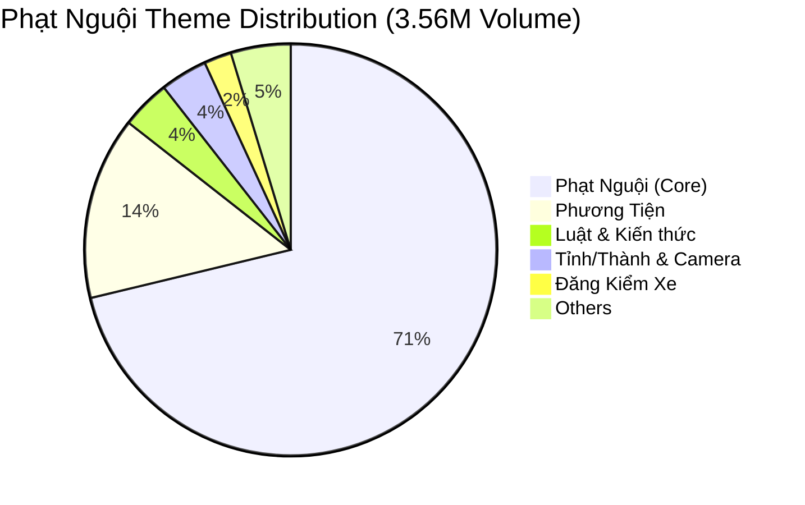
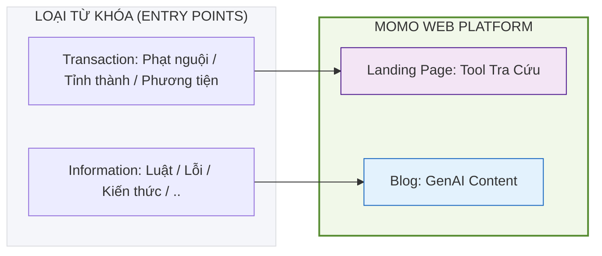

# 📅 MONTHLY REPORT: GROWTH PLATFORM & SEO/GEO
> **Tháng:** 05/2026 | **Người thực hiện:** Văn Hiến (SEO & GEO Lead)

---

## 1. Executive Summary
Tối ưu hóa năng suất sản xuất nội dung thông qua **GenAI Content Engine** và chiếm lĩnh thị trường **Phạt Nguội (~3.6M searches/tháng)** dựa trên dữ liệu SEO Inventory v5.

---

## 2. Trọng tâm Dự án

### 🚀 Dự án 1: GenAI Content Pilot (Phạt Nguội)
- **Engine:** Đã live hệ thống sản xuất nội dung chuẩn E-E-A-T trên MoSpark.
- **Tiến độ:** 
    - Xác định 12 cụm chủ đề (Themes) với tổng Volume **3,557,750 lượt search/tháng**.
    - Triển khai mô hình **Hub & Spoke**: 100% Blog dẫn traffic về Tool Tra cứu.
- **Cam kết:** Sản xuất hỏa tốc **10 bài viết đầu tiên** trong tuần này (Focus: Phạt Nguội, Phương Tiện, Luật).

### 🗺 Dự án 2: SEO Inventory & Market Mapping
- **Status:** Hoàn thiện đo lường và phân cụm cho **55 thị trường** tài chính/dịch vụ.
- **Key Insight:** Phạt Nguội là phễu traffic lớn nhất hiện tại (71% thị phần trong cluster). Đăng kiểm xe (76K volume) là cầu nối quan trọng để Cross-sale sang mảng Bảo hiểm (Insurtech).

---

## 3. Chỉ số & Tỷ trọng thị trường (Phạt Nguội)

---

---

### 🔍 Search User Journey (Intent Segmentation)

### 🔍 Chi tiết Điều phối Traffic theo Intent:

Chúng ta phân tách rõ ràng luồng người dùng dựa trên loại từ khóa (Keyword Type) để tối ưu hóa trải nghiệm và tỷ lệ chuyển đổi:

1. **Transaction Keywords (High Intent) ➔ Landing Page (Tool)**
   - Cụm từ khóa: *Phạt Nguội (Core), Phương Tiện, Tỉnh/Thành*.
   - Đích đến: Trang Mini Web tra cứu (Interactive Tool).
   - Mục tiêu: Thực hiện hành vi tra cứu ngay lập tức và dẫn người dùng vào App (W2A).

2. **Informational Keywords (Knowledge) ➔ Blog**
   - Cụm từ khóa: *Kiến thức, Luật giao thông, Lỗi vi phạm*.
   - Đích đến: Các bài viết Blog chi tiết sản xuất bằng GenAI.
   - Mục tiêu: Xây dựng Trust (E-E-A-T), trả lời thắc mắc của người dùng và dẫn link nội bộ (Internal Link) về trang Landing Page tra cứu.

## 4. Kế hoạch hành động 30 ngày tới (Next 30 Days)

Trọng tâm tập trung vào việc **Vận hành hỏa tốc** dự án Phạt Nguội và **Đo lường hiệu quả** của cỗ máy GenAI:

### Tuần 1: Giai đoạn Launch (Kích hoạt)
- [ ] Xuất bản **10 bài viết trọng điểm** (Focus: Phạt Nguội, Phương Tiện, Luật Giao Thông).
- [ ] Triển khai **Schema & AEO Readiness**: Gắn FAQ/HowTo schema và deploy `llms.txt` để AI Search dễ dàng trích dẫn MoMo.
- [ ] Submit URLs lên GSC để đảm bảo tốc độ Indexing trong < 24h.

### Tuần 2: Giai đoạn Scale (Mở rộng độ phủ)
- [ ] Sản xuất thêm **20-30 bài viết ngách** tập trung vào cụm Tỉnh/Thành và Camera (GEO Content).
- [ ] Thiết lập hệ thống đo lường **Share of Voice (SoV)** tự động cho 50 từ khóa mục tiêu của dự án.
- [ ] Tối ưu hóa **Business Context** dựa trên phản hồi thực tế từ các bài viết đợt 1.

### Tuần 3: Giai đoạn Optimize (Tối ưu chuyển đổi)
- [ ] Audit tỷ lệ Indexing và Ranking: Áp dụng tính năng **AI Enhance** để nâng cấp các bài chưa lọt Top 10.
- [ ] Kích hoạt các Trigger chuyển đổi **Web-to-App** (Balloon/Popup) trên toàn bộ cụm bài viết Phạt Nguội.
- [ ] Kiểm tra tính nhất quán của dữ liệu tra cứu giữa Web và App.

### Tuần 4: Giai đoạn Review & Replication (Đánh giá & Nhân bản)
- [ ] Tổng kết hiệu quả Pilot Phạt Nguội (Traffic, Indexing, W2A Conversion).
- [ ] Hoàn thiện **Website Health Policy** dựa trên các bài học từ Pilot.
- [ ] Lập kế hoạch nhân bản GenAI Engine cho Use Case tiếp theo (Vay Nhanh hoặc Bảo Hiểm).

---
*MoSpark Growth Platform | Confidential*
